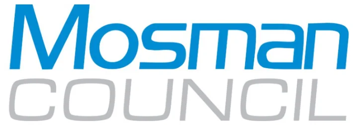

---

title: Front Matter & Agenda

source: Extraordinary Council Meeting - Additional Attachments - 26 August 2026

pages: 1-3

---

# Front Matter & Agenda

<!-- page 1 -->

## ADDITIONAL ATTACHMENTS

## (A-R) OF EP/30 MOSMAN

## MASTERPLAN PLANNING

## PROPOSAL

### MEETING DATE: 26 August 2026

<!-- page 2 -->

### AGENDA - ORDINARY MEETING

#### 1. ATTACHMENTS A - R OF ATTACHMENT 1 OF EP/30 MOSMAN MASTERPLAN PLANNING

PROPOSAL ...................................................................................................................................3

1.1. Attachments A-R for Attachment 1 of EP/39 Mosman Masterplan Planning Proposal ...........3

<!-- page 3 -->

#### 1. ATTACHMENTS A - R OF ATTACHMENT 1 OF EP/30 MOSMAN MASTERPLAN PLANNING

PROPOSAL

1.1. Attachments A-R for Attachment 1 of EP/39 Mosman Masterplan Planning Proposal The following attachments (A-R) relate to Attachment 1 of EP/39 Mosman Masterplan Planning Proposal.

#### Attachment A

Urban Design Report

#### Attachment J

Contamination

#### Attachment B

Maps

#### Attachment K

Flood Impact and Risk Assessment

#### Attachment C

Transport Study

#### Attachment L

Water Cycle and Stormwater Management

#### Attachment D

Heritage Review

#### Attachment M

Acid Sulphate Soils Assessment

#### Attachment E

Infrastructure Summary Report

#### Attachment N

Biodiversity Statement

#### Attachment F

Infrastructure Contributions Plan

#### Attachment O

Aboriginal Cultural Statement

#### Attachment G

Feasibility Analysis

#### Attachment P

Ecologically Sustainable Development

#### Attachment H

Development Feasibility Analysis for Key Sites (commercial in confidence)

#### Attachment Q

Engagement Outcomes Report

#### Attachment I

Public Art Investment and Delivery Framework - Interim

#### Attachment R

Council Report and Resolution – 30 June 2026 Extraordinary Meeting
