---

title: A Urban Design Report

source: Extraordinary Council Meeting - Additional Attachments - 26 August 2026

pages: 4-273

---

# A Urban Design Report

<!-- page 4 -->

## Urban Design Report

## A

August 2026

Attachment 1.1.1 Mosman Council

<!-- page 5 -->

Gadi Country Level 2, 490 Crown Street Surry Hills NSW 2010

T	 61 2 9380 9911 E	 sydney@sjb.com.au W	 sjb.com.au

## Urban Design Report

## Mosman Masterplan

#### Project address

Borogegal and Cammeraigal Country Mosman NSW 2088

#### Prepared for

#### Version

03

#### Issued

19 August 2026

August 2026

Attachment 1.1.1 Mosman Council

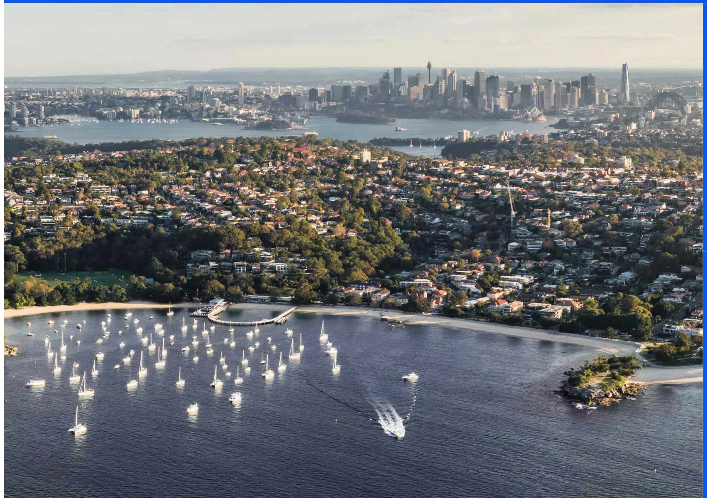

<!-- page 6 -->

SJB Architecture (NSW) Pty Ltd ABN 20 310 373 425 ACN 081 094 724

Gadi Country Level 2, 490 Crown Street Surry Hills NSW 2010

T

#### 61 2 9380 9911

E sydney@sjb.com.au W sjb.com.au

Nominated Architects Adam Haddow 7188 Emily Wombwell 10714 John Pradel 7004 Jonathan Tondi 11981 Nick Hatzi 9380

Certified Management Systems

ISO 9001:2015 Quality Management System ISO 45001:2018 Occupational Health & Safety Management System ISO 14001:2015 Environmental Management System

CERTIFICATION  #NC423 Version: 03 Ref: 7218 Prepared by: ZC, BR, LV, LW, FB Checked by: JK, JMG

### SJB acknowledges the Traditional Custodians of the lands, waters,

### and skies, and their perpetual care and connection to Country where

### we live and work. We support the Uluru Statement from the Heart and

### accept its invitation to walk with Aboriginal and Torres Strait Islander

### people in a movement of the Australian people towards a better future.

### We believe that inequity enshrined in our society continues to

### significantly disadvantage First Nations colleagues, friends, and

## community. Following the referendum, we are personally and

### professionally recommitting our support of Aboriginal and Torres

### Strait Islander people. We will continue to strive for (re)conciliation by

### acting with integrity and passion, in an effort to address this imbalance

## in our country and create lasting generational change.

Issued

V01 Draft Issue 23/07/2026

V02 Final Draft Issue 05/08/2026

V03 Minor updates post MLPP 19/08/2026

August 2026

Attachment 1.1.1 Mosman Council

<!-- page 7 -->

Mosman Masterplan 3 SJB SJB

W A Y A H A VAYINA

WA R I N G A

G A B A G AB A

G U R A

G U R I

G U

RA G A B I N A

D A L Y I Y A N G A I

Names of places are sourced from Aboriginal Clans and Place Names of Sydney Harbour, Compiled by Jeremy Steele - 2015

### 

### Country - before the grid

### The Camaraigal are the custodians of

### this land, known as a saltwater people whose law and

### daily life were tied to the harbour itself. The harbour edge

### was their primary food source, the rock shelters were

### campsites, the high ridge was the route between places,

### and certain dramatic points were set aside for ceremonies.

### Life clustered tightly along the water, far more than up on the ridge.

### Most shelters and shell middens sit within a stone’s throw of the

### shoreline, tucked under the sandstone overhangs the harbour is full

### of. The high ground that Military Road now follows was mostly

### a path through, a quick way from one fishing spot to another,

### and the same ridgeline still carries the main road today. Two

### neighbouring groups seem to have shared this peninsula, the

### Camaraigal around the northwest, near Quakers Hat Bay, and

### the Borogegal to the southeast, around Bradleys Head

### and Chowder Bay. Each left engravings with their

### own particular character.

### Middle Head feels different from everywhere

### else the moment you stand there. It is the most

### exposed, dramatic point on the whole peninsula,

### facing straight out toward the mouth of the

### harbour, and unlike anywhere else in Mosman, its

### engravings are entirely of sea creatures, with no

### shelter or midden anywhere nearby. No one camped

### there. It was a place you visited for a reason, not a

### place you lived.

### Balmoral, by contrast, was about everyday life. Digs

### there turned up an extraordinary variety of fish bones,

### morwong, bream, snapper, flathead, leatherjacket and

### more, along with kangaroo, wallaby, possum, even seal

### and dugong, some clearly butchered for food. Watkin

### Tench, watching the Camaraigal in 1789, wrote that

### fishing seemed to engross nearly the whole of their time,

### and Balmoral bears that out entirely.

August 2026

Attachment 1.1.1 Mosman Council

<!-- page 8 -->

Mosman Masterplan SJB 4

## Contents

### Country - before the grid

### 3

### 01	 Introduction

### 6

### Executive summary 

### 7

### Structure of this report

### 8

### Design process 

### 9

### Approach 

### 10

### The Low and Mid-Rise housing capacity 

### 11

### Redistribution of the housing capacity 

### 12

### 02	 Baseline review

### 13

### Policy overview

### 14

### The Sydney Plan

### 15

### Low and Mid-Rise (LMR) Housing Policy

### 16

### Housing Delivery Authority (HDA)

### 17

### Mosman Local Strategic Planning Statement

### 2020 (LSPS)

### 18

### Mosman Community Plans

### 19

### Transport Strategies

### 20

### Open Space and Sports Facilities Strategies

### 21

### Strategic priorities

### 22

### Current LEP 

### 23

### 03	 Place understanding

### 25

### Regional context 

### 26

### Local context 

### 27

### Site photos 

### 28

### Demographics 

### 29

### Movement network and public transport

### 30

### Active transport 

### 31

### Open space

### 32

### Open space character

### 33

### Tree canopy

### 34

### Landscape and topography

### 35

### Heritage

### 36

### Heritage conservation areas

### 37

### Local character

### 38

### Character areas

### 39

### Amenity and infrastructure

### 40

### Arts and culture 

### 41

### Built form

### 42

### Ecological considerations

### 43

### Flood-affected areas

### 44

### Ownership - Strata titles

### 45

### Ownership - Large sites

### 46

### Challenges

### 47

### Opportunities

### 48

### Development constraints

### 49

### Opportunities beyond the Masterplan

### 50

### 04	 Masterplan principles and drivers

### 51

### Design principles and masterplan drivers 

### 52

### Masterplan drivers

### 58

### 05	 Application of masterplan drivers

### 62

### Revised approach 

### 65

### 06	 Design concept 

### 66

### Vision statement

### 67

### Emerging character areas

### 68

### Spit Road Corridor

### 72

### Ourimbah Triangle

### 74

### Prince Street

### 75

### Concept plan 

### 76

### Key moves 

### 77

### Masterplan 

### 78

### 07	 Urban design framework 

### 80

### Built form framework

### 82

### Envelope south east view

### 83

### Envelope south west view

### 84

### Built form strategies 

### 85

### Built form strategies 

### 86

### Street wall height recommendations

### 87

### Floor to floor height recommendations  

### 88

### Heritage recommendations

### 89

### Movement framework

### 90

### Active transport recommendations 

### 91

August 2026

Attachment 1.1.1 Mosman Council

<!-- page 9 -->

Mosman Masterplan 5 SJB

### Street character recommendations 

### 92

### Land use framework 

### 94

### Land use recommendations 

### 95

### Building typologies intent

### 96

### Active frontages recommendations 

### 97

### Community infrastructure delivery strategy  

### 98

### Public domain and open space framework

### 99

### Public space character recommendations  

### 100

### Landscape front and rear setback recommendations

### 

### 101

### Tree canopy cover recommendations 

### 102

### Public space solar access recommendations 

### 103

### Recommended uplift (additional FSR)

### 104

### 08	 Mosman Village North

### 105

### Structure plan 

### 105

### Reference scheme massing

### 106

### Cross section 

### 107

### 09	 Mosman Village South

### 109

### Mosman Village South- Structure plan

### 109

### Reference scheme massing

### 110

### Cross section 

### 111

### 10	 Ourimbah Triangle

### 114

### Ourimbah Triangle - Structure plan

### 114

### Reference scheme massing

### 115

### Cross section 

### 116

### 11

### Military Road Corridor

### 118

### Military Road Corridor - Structure plan

### 118

### Reference scheme massing

### 119

### Cross section 

### 120

### 12

### Prince Street

### 122

### Prince Street - Structure plan

### 122

### Reference scheme massing

### 123

### Cross section 

### 124

### 13

### Spit Road Corridor

### 126

### Spit Road Corridor - Structure plan

### 126

### Reference scheme massing

### 127

### Cross section 

### 128

### 14

### Middle Harbour and Balmoral Ridge

### 130

### Middle Harbour and Balmoral Ridge -  Structure plan

### 

### 130

### Reference scheme massing

### 131

### Cross section 

### 132

### 15

### Environmental assessment 

### 134

### 16	 Implementation plan 

### 156

### Implementation plan 

### 157

### 9.1

### Land Use Zoning (LZN) map

### 162

### 9.2

### Height of buildings (HOB) map

### 163

### 9.3

### Floor Space Ratio (FSR) map

### 164

### 9.4

### Key sites

### 165

### 9.5

### Heritage map

### 166

### 9.6

### Active frontage map

### 167

### 9.7

### Affordable housing map

### 168

### 9.8

### Minimum street frontages map

### 169

### 17

### Appendix A

### 170

### 18	 Appendix B

### 172

### 19	 Appendix C

### 183

### 20	 Appendix D

### 191

### 21

### Appendix E -

### Mosman Civic Precinct Place Plan 

### 203

### 

August 2026

Attachment 1.1.1 Mosman Council

<!-- page 10 -->

## Introduction

## 1

August 2026

Attachment 1.1.1 Mosman Council

<!-- page 11 -->

Mosman Masterplan 7 SJB SJB

Aerial image of Mosman LGA

### Introduction

### Introduction

### Executive summary

1:20000 @ A3

In December 2025, SJB was appointed by Mosman Municipal Council (Council) as specialist urban design consultants to support the preparation of the Mosman Masterplan, a Council-led alternative to the NSW Government’s Low and Mid-Rise Housing Policy (LMR policy). The Masterplan’s central objective is to redistribute the additional housing capacity prescribed under the LMR policy into a place-based alternative that delivers an equivalent quantum of housing while supporting high-quality urban design and ensuring future growth is responsive to Mosman’s character, environmental setting and heritage values.

The LMR policy seeks to enable low-rise housing diversity and mid-rise residential development in well-located areas, increasing housing supply in proximity to centres, public transport and services. Mosman and Cremorne are both identified as LMR centres within this framework. While the policy provides a consistent approach to housing delivery, the broad application of uniform development controls across Mosman does not adequately reflect the area’s local character, topography, environmental sensitivity and heritage qualities.

The Mosman local government area (LGA) is located approximately 8 kilometres north-east of the Sydney CBD, on a prominent peninsula framed by Sydney Harbour to the south and Middle Harbour to the north. The area is characterised by steeply sloping topography, extensive harbour foreshore, sheltered beaches and significant natural landscapes.

Mosman contains a rich cultural and environmental heritage, including numerous heritage-listed items, conservation areas and intact early twentieth-century residential streetscapes. Key destinations such as Taronga Zoo, The Heads and Sydney Harbour National Park contribute to the area’s landscape character and reinforce its scenic and environmentally sensitive setting. The road network predominantly follows the ridgelines, providing elevated vantage points with views to Sydney Harbour, Sydney Harbour Bridge, the Sydney Opera House, and surrounding natural landscapes.

The Mosman Masterplan adopts a place-responsive methodology that builds on the housing objectives of the LMR policy through a detailed review of the Mosman LGA. Rather than applying the uniform 800-metre catchments prescribed by the LMR policy, the review identifies areas suitable for change based on an assessment of existing housing stock, built form character and local conditions, informing the selection of appropriate residential typologies and an urban structure capable of accommodating the required additional dwellings. This approach enables housing growth to be distributed in a manner that responds to Mosman’s landscape setting, heritage values and established residential amenity, while maintaining the overall housing capacity envisaged by the LMR policy. KEY

LGA Boundary

Indicative LMR extent

M

A C P H

E R S O N

S T R E E T

T E E R T S D R A R E G M I L I T A R Y R O A D

M I L I T A R Y R O A D

S P I T R O A D

BRADLEYS HEAD ROAD

CHOWDER BAY ROAD SHADFORTH STREET SPOFFORTH STREET

MIDDLE HEAD ROAD

MIDDLE HEAD ROAD

MILITARY ROAD

PEARL BAY AVENUE

CABRAMATTA ROAD

SIRIUS COVE ROAD

MANDOLONG ROAD

MUSGRAVE STREET

SOMERSET STREET

ROSEBERY STREET

RANGERS AVENUE

CENTRAL AVENUE

HARBOUR STREET

#### 1801 FORT TRACK

STANLEY AVENUE

CREMORNE LANE

WOLSELEY ROAD

BARDWELL ROAD

MOSMAN STREET

PINDARI AVENUE

BLOXSOME LANE

ALMORA STREET

MUSTON STREET

MEDUSA STREET

THE ESPLANADE

RAGLAN STREET

RAGLAN STREET

GLOVER STREET

MYAHGAH ROAD

MORUBEN ROAD

KARDINIA ROAD

BELMONT ROAD

MORELLA ROAD

QUAKERS ROAD

HORDERN LANE

SPENCER ROAD

STANTON ROAD

KAREELA ROAD

AWABA STREET

JULIAN STREET

QUEEN STREET

KAREELA LANE

REDAN STREET BOTANIC ROAD NOBLE STREET

PARRIWI ROAD

COWLES ROAD

UNION STREET

BICKELL ROAD

BOYLE STREET

LINDSAY LANE

DAVID STREET

AVENUE ROAD SUAKIN DRIVE

DALTON ROAD

MILSON ROAD

VISTA STREET

PARK AVENUE

HOLT AVENUE

BOND STREET

WYONG ROAD

WUNDA ROAD

RUBY STREET

PUNCH LANE

REDAN LANE

ILUKA ROAD

IDA AVENUE

SILEX ROAD

BAY STREET

HALE ROAD

THE GROVE

CREMORNE

MILSONS POINT

CAMMERAY

NORTH SYDNEY

POINT

KURRABA POINT

CREMORNE

CLIFTON GARDEN RESERVE

MIDDLE HEAD

BRADLEYS HEAD

TAROONGA ZOO

August 2026

Attachment 1.1.1 Mosman Council

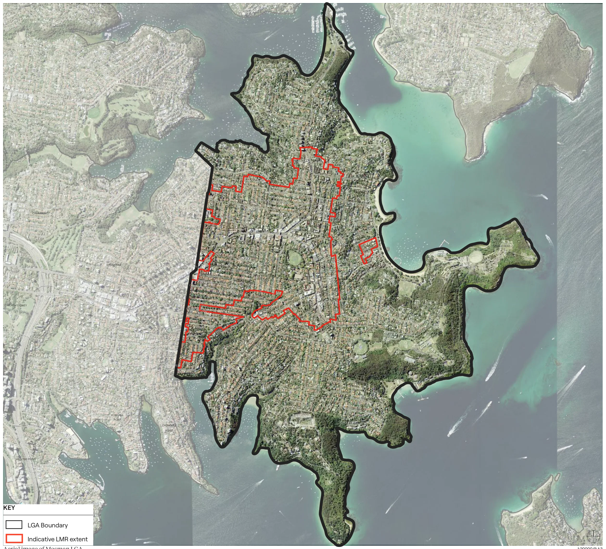

<!-- page 12 -->

Mosman Masterplan 8 SJB

verge 1.5m 1.6m 2.9m 6.0m

flex area shared way COWLES RD

ART GALLERY WAY

COWLES RD HARBOUR ST

BRADY ST OURIMBAH RD

AWABA ST AWABA ST

KILLARNEY ST

AMIENS AVE STANTON RD

WARRINGAH RD

HORDERN PL SPIT RD PUNCH ST CLIFFORD ST

MORUBEN RD

HORSNELL LN GURRIGAL ST VISTA ST

BOND ST LANG ST SHELL ST

MACKIE LN HALE RD MACPHERSON ST ERITH ST PRINCE ST PRINCE ST MELROSE ST

EARL ST

OURIMBAH RD

BELMONT RD GLOVER ST LINDSAY LN

BARDWELL RD WUDGONG ST CARDINAL ST

ROSEBERY ST COUNTESS ST 9.5m

9.5m 9.5m 9.5m

9.5m 9.5m

9.5m

8.5m

12.5m

12.5m 12.5m 17.5m

17.5m 17.5m 17.5m 17.5m

19m 19m

22m 22m 22m

22m 22m

22m 22m

22m 22m

22m

22m 22m 22m 22m

22m

22m

22m 22m

22m

22m 22m 22m 22m 22m

23.5m

18m

28.5m

28.5m

28.5m

28.5m

28.5m

28.5m 28.5m 22m 28.5m 28.5m

28.5m

28.5m 28.5m 28.5m 28.5m

28.5m 28.5m

28.5m

29.5m 29.5m 29.5m

29.5m 29.5m

30m 30m 30m

30m 30m

36.5m 36.5m 41.5m 41.5m

41.5m 41.5m 41.5m

41.5m

41.5m 41.5m 41.5m 41.5m

41.5m 41.5m

43m

43m 43m 43m 43m 43m 43m 41.5m 43m 43m 43m 40m

52.5m

62m 62m 62m

COWLES RD

MITCHELL RD BAPAUME RD

ART GALLERY WAY GOULDSBURY ST BELMONT RD

COWLES RD

COWLES RD

HARBOUR ST

HARBOUR ST

WUNDA RD NOBLE ST

BRADY ST OURIMBAH RD OURIMBAH RD AWABA ST AWABA ST KILLARNEY ST AWABA LN

AMIENS AVE STANTON LN STANTON RD

WARRINGAH RD

PARRIWI RD BICKELL RD

HORDERN PL HEYDON ST HORDERN LN PUNCH LN

RAWSON ST

SPIT RD CIVI LN FIELD WAY

SPIT RD

SPIT RD

PUNCH ST CLIFFORD ST

MORUBEN RD

HORSNELL LN GURRIGAL ST VISTA ST

VISTA ST MYAHGAH RD

BOND ST LANG ST

SNELL ST

MACKIE LN

HALE RD HALE RD MACPHERSON ST ERITH ST PRINCE ST MELROSE ST

MILITARY RD MILITARY RD

MILITARY RD

EARL ST

PRINCE ST BELMONT RD GLOVER ST LINDSAY LN CABRAMATTA RD

TWIN TOWERS WALK

BARDWELL RD BARDWELL RD WUDGONG ST CARDINAL ST

CARDINAL ST

ROSEBERY ST COUNTESS ST

THE CRE S CENT

### Introduction

### Structure of this report

Place understanding

This chapter provides an evidence-based understanding of place across the LGA. It synthesises site and precinct analysis into a clear set of opportunities and constraints, including environmental, infrastructure, access, heritage, social and economic factors. The analysis also establishes an initial view of development feasibility and capacity by identifying site-specific constraints (natural, physical, regulatory and economic) and assessing each site’s ability to redevelop within the masterplan timeframe.

Design concept

This chapter establishes the overarching vision for the masterplan. It acknowledges the need for change and articulates the type of change sought through a vision statement and key strategic moves. It positions Mosman’s contribution to meeting broader housing needs, including supporting longer-term housing choice and affordability, through a place-led and community-informed approach. The chapter confirms that proposed change is grounded in local context and engagement, rather than a desktop top-down methodology.

Structure plan by area

The frameworks and recommendations translate into structure plans providing greater detail on key aspects of the urban framework and outline measures that inform future planning provisions and provide interim guidance before the development control plans (DCP) are established to achieve the desired future character for each individual character area.

Principles and drivers

This chapter outlines the guiding design principles that inform the Mosman Masterplan and provide a consistent approach for identifying locations suitable for future housing growth. It also identifies the drivers that translate these principles into place-based outcomes for Mosman. Together, the principles and drivers provide the rationale for how housing targets can be accommodated in the most suitable locations while respecting local character and reinforcing strategic planning objectives.

Urban design framework

The urban framework is a central component of the masterplan. It defines the desired future character of precincts and sites and provides an integrated set of structure plans addressing built form, land use, movement and access, and the public domain. The framework establishes a coherent spatial strategy to guide future development and infrastructure outcomes and to align local planning controls with the masterplan vision.

Implementation plan

This chapter outlines a clear pathway for delivery, including a snapshot of the statutory planning changes required to achieve the masterplan vision. It identifies proposed amendments to the Local Environmental Plan (LEP), including updates to Land Zoning, Floor Space Ratio (FSR), Height of Buildings (HOB) and provisions for identified key sites. The chapter also describes sequencing and considerations to support coordinated delivery over the masterplan period.

This Urban Design Report has been prepared in support of the planning proposal for the Mosman Masterplan. It documents the urban design analysis, testing and evaluation undertaken to develop the Masterplan, from the initial site and place-based analysis through to the implementation strategy and associated amendments to the Local Environmental Plan (LEP).

The snapshot below provides an overview of the report structure and the sequencing of each section:

August 2026

Attachment 1.1.1 Mosman Council

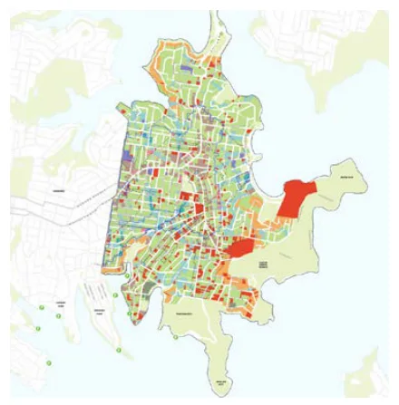

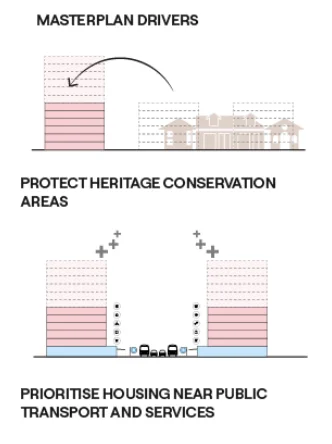

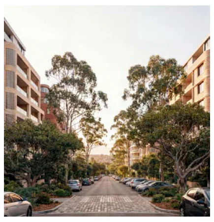

<!-- page 13 -->

Mosman Masterplan 9 SJB

### Introduction

#### R

#### E

#### C

#### O

#### M

#### M

#### E

#### N

#### D

#### A

#### T

#### I

#### O

#### N

#### S

### Design process

PLACE UNDERSTANDING

HOUSING TARGET

OPPORTUNITIES

DELIVERABLE CAPACITY

CONSTRAINTS

MOVEMENT

LZN

PUBLIC DOMAIN

HERITAGE

KEY SITES

ACTIVE FRONTAGES

CONTRIBUTION PLAN

LAND USE

HOB

BUILT FORM

FSR

DESIGN CONCEPT

FRAMEWORK

LEP CONTROLS

OPTION TESTING

### LEARN AND

### REVIEW

### DESIGN

### REFINE

### DOCUMENT

PLACE PRINCIPLES

#### 2

#### 1

DRIVERS

CONSULTANTS INPUTS

+ CONSULTANTS INPUTS LOCAL PLANNING PANEL COMMUNITY INPUTS

COUNCIL

The flow chart summarises the design process undertaken to develop the Mosman Masterplan.

The process is structured as four sequential phases:

Learn and Review: Gain a baseline understanding of Mosman as a physical place, including its urban structure, character, land use patterns, movement networks, and public domain, together with a review of the relevant statutory and strategic planning context for Mosman and the Greater Sydney Region. Gain understanding of baseline feasibility, traffic and heritage as well as other relevant disciplines with early engagement of specialist consultants.

Design: Prepare the Masterplan by establishing the place principles, key drivers and overarching vision for Mosman. These elements inform the preparation of concept design options, which are tested and refined through an evaluation process.

Refine: Identify a preferred option informed by community feedback and supported by specialist technical inputs (including feasibility, economics, traffic and heritage).

Document: Develop the preferred option into a comprehensive urban framework for the Masterplan area. The framework brings together the overarching strategies for built form, land use, movement and access, community infrastructure, public domain and open space. The framework is then expressed through a series of structure plans for sub-precincts, which reflect  the future character envisaged by the Masterplan.

An implementation plan was then prepared to guide delivery of the Masterplan outcomes and to inform the proposed amendments to the Mosman Local Environmental Plan 2012 (MLEP). A summary of  amendments to the Mosman Development Control Plans (MDCPs) is also identified.

Amendments to the MDCP will be drafted and exhibited for community feedback by the end of 2026.

August 2026

Attachment 1.1.1 Mosman Council

<!-- page 14 -->

Mosman Masterplan 10 SJB

COWLES RD

ART GALLERY WAY

COWLES RD HARBOUR ST

BRADY ST OURIMBAH RD

AWABA ST AWABA ST

KILLARNEY ST

AMIENS AVE STANTON RD

WARRINGAH RD

HORDERN PL SPIT RD PUNCH ST CLIFFORD ST

MORUBEN RD

HORSNELL LN GURRIGAL ST VISTA ST

BOND ST LANG ST SHELL ST

MACKIE LN HALE RD MACPHERSON ST ERITH ST PRINCE ST PRINCE ST MELROSE ST

EARL ST

OURIMBAH RD

BELMONT RD GLOVER ST LINDSAY LN

BARDWELL RD WUDGONG ST CARDINAL ST

ROSEBERY ST COUNTESS ST 9.5m

9.5m 9.5m 9.5m

9.5m 9.5m

9.5m

8.5m

12.5m

12.5m 12.5m 17.5m

17.5m 17.5m 17.5m 17.5m

19m 19m

22m 22m 22m

22m 22m

22m 22m

22m 22m

22m

22m 22m 22m 22m

22m

22m

22m 22m

22m

22m 22m 22m 22m 22m

23.5m

18m

28.5m

28.5m

28.5m

28.5m

28.5m

28.5m 28.5m 22m 28.5m 28.5m

28.5m

28.5m 28.5m 28.5m 28.5m

28.5m 28.5m

28.5m

29.5m 29.5m 29.5m

29.5m 29.5m

30m 30m 30m

30m 30m

36.5m 36.5m 41.5m 41.5m

41.5m 41.5m 41.5m

41.5m

41.5m 41.5m 41.5m 41.5m

41.5m 41.5m

43m

43m 43m 43m 43m 43m 43m 41.5m 43m 43m 43m 40m

52.5m

62m 62m 62m

COWLES RD

MITCHELL RD BAPAUME RD

ART GALLERY WAY GOULDSBURY ST BELMONT RD

COWLES RD

COWLES RD

HARBOUR ST

HARBOUR ST

WUNDA RD NOBLE ST

BRADY ST OURIMBAH RD OURIMBAH RD AWABA ST AWABA ST KILLARNEY ST AWABA LN

AMIENS AVE STANTON LN STANTON RD

WARRINGAH RD

PARRIWI RD BICKELL RD

HORDERN PL HEYDON ST HORDERN LN PUNCH LN

RAWSON ST

SPIT RD CIVI LN FIELD WAY

SPIT RD

SPIT RD

PUNCH ST CLIFFORD ST

MORUBEN RD

HORSNELL LN GURRIGAL ST VISTA ST

VISTA ST MYAHGAH RD

BOND ST LANG ST

SNELL ST

MACKIE LN

HALE RD HALE RD MACPHERSON ST ERITH ST PRINCE ST MELROSE ST

MILITARY RD MILITARY RD

MILITARY RD

EARL ST

PRINCE ST BELMONT RD GLOVER ST LINDSAY LN CABRAMATTA RD

TWIN TOWERS WALK

BARDWELL RD BARDWELL RD WUDGONG ST CARDINAL ST

CARDINAL ST

ROSEBERY ST COUNTESS ST

THE CRE S CENT

8st

8st

8st

8st 8st 8st

8st

8st

Ourimbah Road Rosebery Street

Bond Street

5m 4m

4st

3m +2 st

Deep soil at rear 9m rear setback

3m

3m Ourimbah Road Rosebery Street

Bond Street

### Introduction

### Approach

The preparation of the Masterplan was guided by the requirement to achieve planning capacity equivalent to that anticipated under the LMR policy. Planning capacity refers to the amount of development, in this case housing, that be provided under the planning controls.

Not all planning capacity is expected to be realised within the Masterplan timeframe. While the proposed planning controls provide redevelopment potential across all identified sites, some are subject to constraints that may reduce redevelopment feasibility or delay redevelopment. For this reason, the Masterplan distinguishes between “deliverable capacity”, which is reasonably expected to be realised within the short-medium timeframe, and “constrained capacity”, which contributes to the overall planning capacity but is more likely to be realised over the longer term.

Accordingly, the estimated additional dwelling yield distinguishes between deliverable and constrained capacity. The Masterplan is articulated through three complementary components that collectively establish planning capacity, define the maximum built form and illustrate a potential built form outcome of the deliverable capacity.

Proposed Floor Space Ratio (FSR) Map (Planning Capacity) The proposed FSR controls establish the planning capacity across the entire Masterplan area.

Building Envelopes The building envelopes illustrate the maximum built form permitted under the proposed built form controls and apply across the entire Masterplan area. They represent the maximum development potential under the proposed controls, independent of site‑specific feasibility or redevelopment timing.

Reference Scheme (Deliverable capacity) A 3D reference scheme has been prepared to illustrate the application of the proposed amendments to the MLEP controls and DCP controls for sites identified as deliverable. This illustrates a potential built form outcome for the deliverable capacity.

DELIVERABLE CAPACITY

DELIVERABLE CAPACITY

CONSTRAINED CAPACITY

CONSTRAINED CAPACITY

### Planning capacity

Planning capacity is the total dwellings that could be delivered on a site under the proposed FSR which determines tha gross floor areas permissible on each site.

The Masterplan must deliver an equivalent planning capacity to the Low and Mid Rise Housing Policy.

### Deliverable capacity

Deliverable capacity refers to the dwellings that could be accommodated under the proposed planning controls on sites identified as deliverable. These are sites that are reasonably expected to redevelop within the Masterplan timeframe. Deliverable capacity excludes constrained sites, including heritage items, strata developments with more than 10 lots, flood-affected sites and biodiversity-affected sites.

The Masterplan distinguishes between deliverable and constrained capacity by preparing a reference scheme for deliverable sites, while constrained sites are excluded from the reference scheme and remain represented by the proposed planning controls.

### Constrained capacity

Constrained capacity refers to the dwellings that could be accommodated under the proposed planning controls on sites identified as constrained. These are sites that are less likely to develop within the short to medium term. Due to factors such as strata developments with more than 10 lots, schools, recently completed developments of high investment value, flood affected sites, and heritage items. While redevelopment is less likely in the short to medium term, these sites retain planning capacity under the proposed controls. Accordingly, the applicable built form controls continue to establish a maximum built form that could be achieved should redevelopment occur.

August 2026

Attachment 1.1.1 Mosman Council

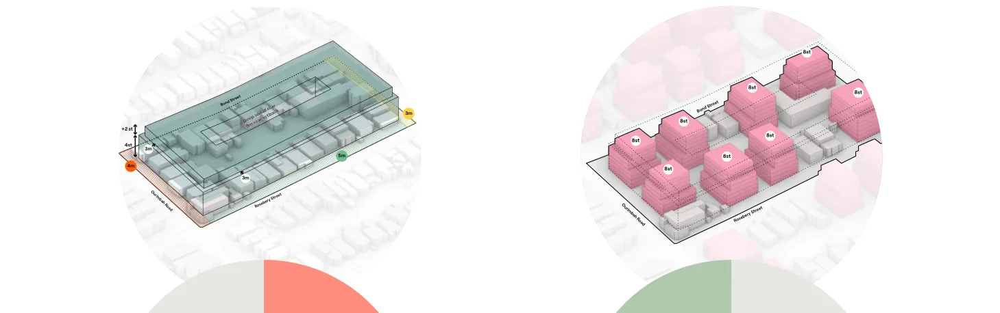

<!-- page 15 -->

Mosman Masterplan 11 SJB

1:20000 @ A3 1:20000 @ A3

### LMR - deliverable capacity

Constrained sites are excluded from the deliverable capacity calculation. These sites revert to the existing LEP controls, meaning they generate no additional development capacity.

By applying LMR controls only to unconstrained sites, the analysis estimates the deliverable capacity under the LMR policy. KEY

LGA boundary

LMR 400/800m catchments

FSR 2.2:1 (0-400m R3 zone)

FSR 1.5:1 (400-800m R3 zone)

FSR 0.65 - 0.8:1 (0-800m R2 zone)

Constrained sites within the LMR land application area

### The Low and Mid-Rise housing capacity

ADDITIONAL PLANNING CAPACITY: + 950,000M2 (GFA)

ADDITIONAL DELIVERABLE CAPACITY: + 633,000M2 (GFA)

### LMR - planning capacity

The maximum GFA permissible under the LMR policy varies depending on zoning and distance from the LMR centre. The below table summarises the maximum FSR applicable to each lot within the LMR area.

Zoning Catchment FSR HOB

R2 0-800m 0.8 9.5m

R3

0-400m 2.2 22m (max. 6 storey)

400m-800m 1.5 17.5m (max. 4 storey)

### LMR - deliverable capacity

Constrained sites are excluded from the deliverable capacity calculation. These sites revert to the existing LEP controls, meaning they generate no additional development capacity.

By applying LMR controls only to unconstrained sites, the analysis estimates the deliverable capacity under the LMR policy.

LMR additional deliverable capacity = Planning capacity (950,000m²) - Constrained capacity (317,000m²)

### Introduction

As the Masterplan is required to achieve planning capacity equivalent to that anticipated under the LMR policy, it was necessary to calculate the additional planning capacity generated by the reform.

For the purposes of this assessment, planning capacity has been measured as the additional gross floor area (GFA) achievable under the LMR controls beyond that permitted by the existing Mosman Local Environmental Plan (MLEP). This was determined by applying the relevant floor space ratio (FSR) to the site area using the following calculation:

Site area × permissible FSR = Gross Floor Area (GFA) capacity

This methodology was developed and applied in consultation with the Department of Planning, Housing and Infrastructure (DPHI). Using this approach, the LMR policy was calculated to generate approximately 950,000m² GFA of additional planning capacity.

To provide a comparable benchmark for the Masterplan, the deliverable capacity was also calculated. Applying the same methodology to unconstrained sites results in a deliverable capacity of approximately 633,000m² GFA. This is equivalent to around 4,700 dwellings, based on an assumed average dwelling size of 134m².

August 2026

Attachment 1.1.1 Mosman Council

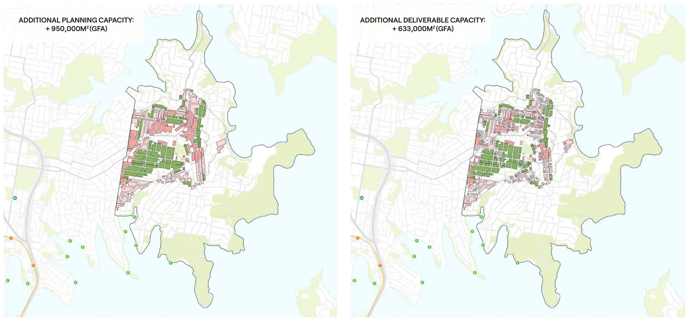

<!-- page 16 -->

Mosman Masterplan 12 SJB

### Land subject to LMR

### Land subject to Mosman Masterplan

AREA OF CHANGE

### 27%

AREA OF CHANGE

### 12%

### $

### 1

### 2

### 3

### 4

### 5

### 6

### 7

### 8

8 P LA CE PR IN CI PL ES

8 MA ST ER PL AN D RI V E R S

KEY

LGA boundary

Low to Mid Rise application land

Mosman Masterplan application land

Open space

Note: Calculation of developable land area within Mosman LGA, excludes land zoned:

C1 National Parks and Nature Reserves, SP1 Zoological Gardens, SP2 Sydney Harbour Federation Trust, SP2 Defence) M A C P H E R S O N S T R E E T T E E R T S D R A R E G M I L I T A R Y R O A D M I L I T A R Y R O A D

S P I T R O A D

BRADLEYS HEAD ROAD

CHOWDER BAY ROAD SHADFORTH STREET SPOFFORTH STREET MIDDLE HEAD ROAD MIDDLE HEAD ROAD

MILITARY ROAD

PEARL BAY AVENUE

CABRAMATTA ROAD SIRIUS COVE ROAD

MANDOLONG ROAD

MUSGRAVE STREET

SOMERSET STREET

ROSEBERY STREET

RANGERS AVENUE

CENTRAL AVENUE

HARBOUR STREET

#### 1801 FORT TRACK

STANLEY AVENUE

CREMORNE LANE

WOLSELEY ROAD BARDWELL ROAD MOSMAN STREET

PINDARI AVENUE

BLOXSOME LANE ALMORA STREET MUSTON STREET

MEDUSA STREET THE ESPLANADE RAGLAN STREET RAGLAN STREET

GLOVER STREET MYAHGAH ROAD MORUBEN ROAD

KARDINIA ROAD

BELMONT ROAD

MORELLA ROAD

QUAKERS ROAD HORDERN LANE SPENCER ROAD

STANTON ROAD

KAREELA ROAD

AWABA STREET JULIAN STREET

QUEEN STREET KAREELA LANE

REDAN STREET BOTANIC ROAD NOBLE STREET

PARRIWI ROAD

COWLES ROAD UNION STREET

BICKELL ROAD

BOYLE STREET

LINDSAY LANE

DAVID STREET AVENUE ROAD SUAKIN DRIVE

DALTON ROAD

MILSON ROAD

VISTA STREET PARK AVENUE HOLT AVENUE

BOND STREET WYONG ROAD

WUNDA ROAD RUBY STREET

PUNCH LANE REDAN LANE

ILUKA ROAD

IDA AVENUE

SILEX ROAD

BAY STREET

HALE ROAD THE GROVE

CREMORNE

AY

POINT KURRABA POINT

CREMORNE CLIFTON GARDEN RESERVE

MIDDLE HEAD

BRADLEYS HEAD

TAROONGA ZOO

### Redistribution of the housing capacity

### Introduction

The Masterplan provides for the redistribution of the established housing target by locating additional housing in the most suitable locations through a place-based approach.

The LMR policy applies to residentially zoned land located within an 800-metre walking distance of an identified town centre.

Under the policy, identified town centres are generally zoned for business or mixed-use purposes and contain a range of shops, services and community facilities, including supermarkets, supported by frequent public transport. Within Mosman LGA, the identified town centre comprises the E1 Local Centre around the intersection of Military Road and Spit Road. The MU1 Mixed Use zoned land along Military Road at Cremorne, within the adjoining North Sydney LGA, is also identified as a town centre.

Accordingly, the LMR policy applies to R2 Low Density Residential and R3 Medium Density Residential zoned land within Mosman LGA that is located within an 800-metre walking distance of these town centres, excluding heritage items and bushfire-prone land.

On this basis, approximately 27% of the developable land area within Mosman LGA is subject to the Low and Mid-Rise Housing Reform.

The Mosman Masterplan adopts a place-based approach underpinned by place principles and key drivers. These were informed by community and stakeholder engagement, detailed site analysis, and specialist technical inputs relating to heritage, transport and community infrastructure.

The principles and drivers informed the  identification of the proposed areas that are best suited to accommodating additional housing. This represents a refinement of the broader area to which the LMR policy applies, directing growth to the most appropriate locations while responding to local character, heritage values and environmental qualities.

The Masterplan applies to approximately 12% of the developable land within the LGA.

August 2026

Attachment 1.1.1 Mosman Council

<!-- page 17 -->

## Baseline review

## 2

August 2026

Attachment 1.1.1 Mosman Council

<!-- page 18 -->

Mosman Masterplan 14 SJB

### Baseline review

### Policy overview

Planning in Mosman is guided by strategic planning documents that align local planning with state and regional priorities.

At the state level, NSW’s metropolitan planning framework, including the LMR Policy, establishes housing and urban development priorities and introduces planning controls to facilitate additional low- and mid-rise housing in identified locations.

The North District Plan translates these priorities for the Northern District, establishing expectations for housing, infrastructure, environmental protection and heritage across councils including Mosman.

At the local level, Mosman’s strategic planning framework— including the Local Strategic Planning Statement (LSPS), Local Housing Strategy, and Community Participation Plan (CPP)—respond to these higher‑order directions while reflecting the area’s local character, environmental constraints and heritage values. These include managing future growth within the parts of the Mosman LGA affected by the LMR Policy. .

A review of these strategic planning documents demonstrates how the Masterplan aligns with this strategic planning framework by supporting state housing objectives while responding to Mosman’s distinctive local context.

MOSMAN LOCAL HOUSING STRATEGY A PLACE TO LIVE

MOSMAN COMMUNITY PARTICIPATION PLAN INVOLVING THE COMMUNITY IN PLANNING

RESIDENTIAL DEVELOPMENT CONTROL PLAN 2012

As amended December 2024

MOSMAN LOCAL STRATEGIC PLANNING STATEMENT ENHANCING MOSMAN March 2020

Future Transport Strategy

NSW 2040 State Infrastructure Strategy The Sydney Plan Sydney Green Grid

Design Policies (GANSW) Movement and Place (tfNSW)

Guides (informing policy) Guides

State Strategies and Frameworks

Local Policy

Mosman Local Strategic Planning Statement (LSPS)

Mosman Local Housing Strategy

Mosman Community Participation Plan

Mosman Development Control Plan

Low to Mid-Rise (LMR) Housing Reform

SCHOOL

Department of Planning, Housing and Infrastructure The Sydney Plan

August 2026

Attachment 1.1.1 Mosman Council

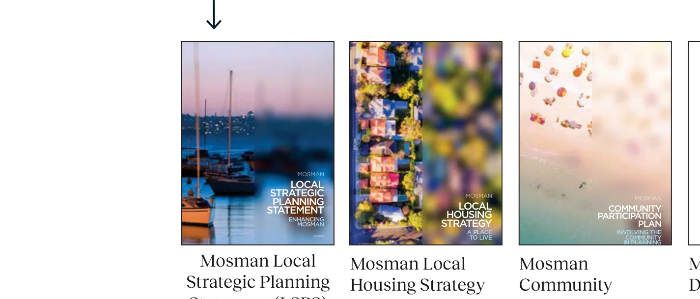

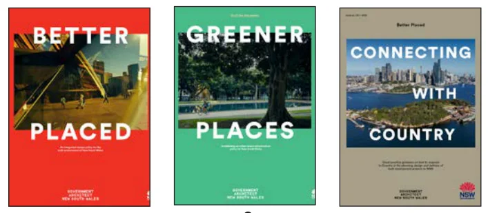

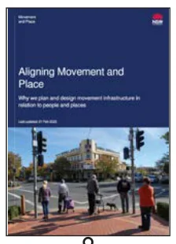

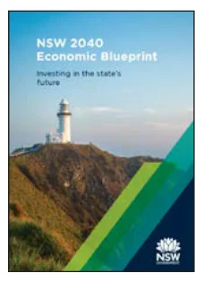

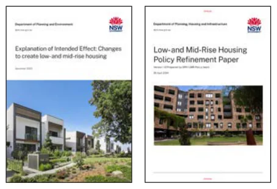

<!-- page 19 -->

Mosman Masterplan 15 SJB

### Baseline review

### The Sydney Plan

The Sydney Plan (public exhibition, Dec 2025, adopted August 2026) sets a 20‑year land use framework for Sydney’s 33 LGAs guiding growth to accommodate approximately 6.5 million people by 2045. The Plan provides the strategic direction for local planning, infrastructure prioritisation and investment, with a focus on concentrating housing and employment in established areas with existing and planned transport and services, while sequencing longer‑term greenfield development alongside the delivery of enabling infrastructure.

The Plan is organised around seven priorities (including Housed, Prosperous, Connected, Resilient and Liveable) and is implemented through twelve responses addressing housing supply and diversity, affordable housing, centres and jobs, infrastructure coordination, open space, hazard resilience and environmental enhancement.

Housing delivery is a central focus of the Plan. It establishes 5‑year housing targets and reinforces state initiatives, including

the Transport‑Oriented Development Program and the LMR policy to increase supply and choice in accessible locations.

The draft Plan also emphasises the importance of identifying feasible, deliverable housing capacity in local plans, rather than relying solely on theoretical development yield. To support implementation, it includes strengthened monitoring and delivery mechanisms, along with potential for state led intervention where housing targets are not adequately addressed.

The Plan also reinforces a centres-based approach to the distribution of housing, jobs and services, protects industrial lands for supply-chain functions, and supports liveability and resilience through improved open-space connectivity, risk-based natural hazard planning, and a metropolitan greening initiatives, including a 40% tree canopy target by 2036.

For the Mosman Masterplan, the implications are direct: Mosman is assigned a 2024–2029 target of 500 dwellings, requiring a clear, deliverable pathway for additional housing capacity supported by realistic development feasibility and place-based urban design controls.

The Masterplan should focus growth in the most accessible locations (centres and well-serviced corridors), strengthen walkability and local amenity, and anticipate policy dependencies including an affordable housing contribution scheme by 2027, protection of centre functions, and integrated public realm/resilience actions (open space connections, canopy/greening and hazard-aware planning).

Figure 43: High housing growth 2046

August 2026

Attachment 1.1.1 Mosman Council

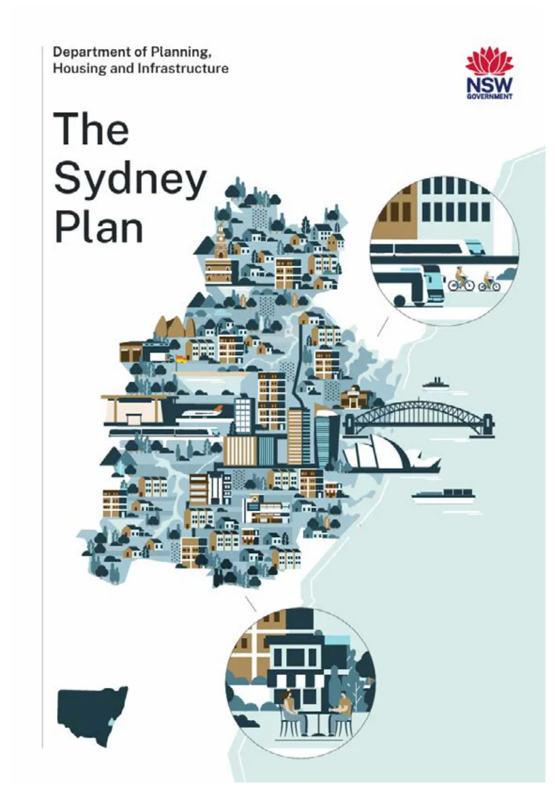

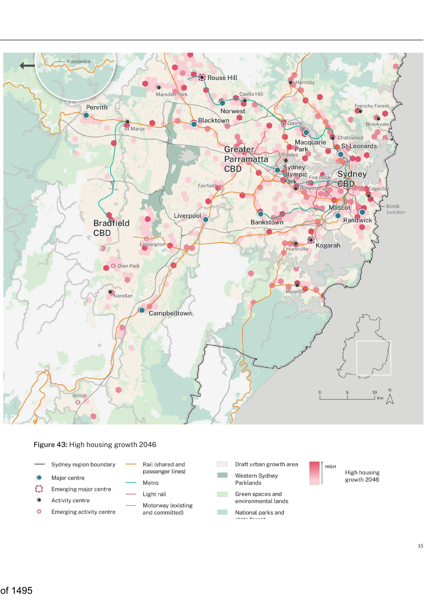

<!-- page 20 -->

Mosman Masterplan 16 SJB

### Baseline review

On 1 July 2024, the NSW Government commenced stage 1 of the policy, permitting dual occupancy development and semi- detached dwellings in R2 Low Density Residential zones. Under the MLEP dual occupancies had been prohibited in the R2 zone.

On 28 February 2025, Stage 2 of the policy commenced. It permits residential flat buildings up to three storeys (9.5 m) in the R2 Low Density Residential zone and four to six storeys in the R3 Medium Density Residential zone on sites within an 800-metre walking distance of an identified town centre. It also permits attached dwellings and multi dwelling housing in these locations.

The application of the LMR provisions to the Mosman LGA is summarised in the adjoining tables.

In addition, under the Infill Affordable Housing provisions of the Housing SEPP, developments that provide at least 15% affordable housing may be eligible for building height and floor space ratio (FSR) bonuses of up to 30% above the applicable LMR standards. An overwhelming number of development applications have been lodged within Mosman that seek to utilise the height and FSR standards available under both the LMR and Infill Affordable Housing provisions.

The LMR policy is implemented through Chapter 6 of the State Environmental Planning Policy (Housing) 2021 (Housing SEPP). The policy introduces a broader range of residential housing typologies within well-located areas, including residential flat buildings, shop-top housing, multi dwelling housing, terraces and dual occupancies, in locations where these forms of development may otherwise be prohibited under the applicable local environmental plan.

Where these standards are satisfied, they prevail over local planning controls and cannot be used as a reason to refuse development consent.

### Low and Mid-Rise (LMR) Housing Policy

SUMMARY OF LOW TO MID RISE HOUSING PROVISIONS APPLICABLE TO MOSMAN

Typology

Existing Mosman LEP zone

Additional LMR zones Catchment Min. lot size

Min. lot width FSR HOB Car spaces

Low -rise

Dual occupancy

E1/E3

R3 R2 0-800m 450m2 12m 0.65 9.5m 1/dw

Attached dwellings (terraces) R3 R2 0-800m 500m2 18m 0.7 9.5m 0.5/dw

Multi dwelling

E1/E2/C2

R3 R2 0-800m 600m2 12m 0.7 9.5m 1/dw

Mid-rise Residential flat building

E1/E2/C2

R2 0-800m 500m2 12m 0.8 9.5m 0.5/dw

R3

0-400m none none 2.2 22m (max. 6 storey) n/a

400m-800m none none 1.5 17.5m (max. 4 storey) n/a

Shop top housing E1 no change

TREE CANOPY GUIDE FOR LOW TO MID RISE HOUSING SUMMARY OF CONTROLS

Site area Tree canopy Deep soil Tree planting rate

<650 m2 15% 7% for every 350 m2 of site area or part thereof, plant at least one small tree in the deep soil area

650-1,500 m2 15% 10% For every 350 m2 of site area or part thereof, plant at least one medium tree in the deep soil area

>1,500 m2 15% 15% For every 575 m2 of site area, or part thereof, plant at least 2 medium trees or one large tree in the deep soil area.

Mid-rise housing refers to residential flat buildings and shop-top housing that is generally between 3 and 6 storeys.

Low-rise housing, refers to multi-dwelling housing (such as manor houses and town houses), terraces and dual occupancies.

Note: The LMR policy does not alter the permissibility of shop-top housing but introduces development standards for shop-top housing within residential zones where it is already permitted. As the MLEP does not permit shop-top housing in the R2 or R3 zones, the LMR shop-top housing provisions do not currently apply within Mosman.

August 2026

Attachment 1.1.1 Mosman Council

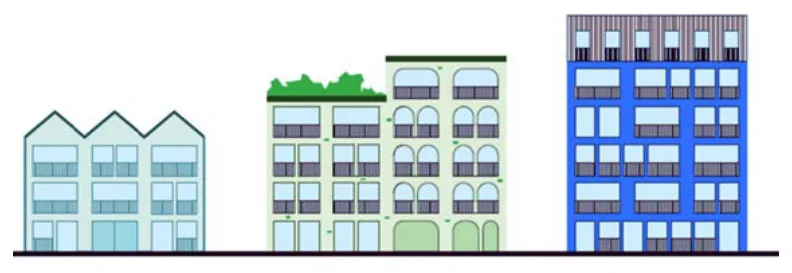

<!-- page 21 -->

Mosman Masterplan 17 SJB

KEY

Deferred

Declared

### Baseline review

### Housing Delivery Authority (HDA)

The NSW Housing Delivery Authority (HDA) provides a state- led pathway for major housing proposals to be considered for declaration as State Significant Development (SSD) including through a concurrent rezoning process where required. Projects declared SSDA are subject to a full merit assessment and public exhibition before determination.

The HDA was established to accelerate housing delivery and improve housing affordability by providing a streamlined assessment pathway for major housing proposals, supporting the delivery of the NSW Housing Accord target of 377,000 new homes by July 2029.

The HDA commenced on 19 December 2024, with Expressions of Interest (EOIs) opening on 8 January 2025. Eligibility is generally limited to large-scale housing proposals on well-located sites that demonstrate appropriate infrastructure capacity, respond to key site constraints and provide a measurable affordable housing contribution.

Since its introduction, the following proposals within the Mosman LGA have been declared SSD through the HDA pathway:

— EOI 248763  - 494-500 & 516 Military Road Mosman — EOI 274656 - 11 Countess Street — EOI 289472 - 35 - 45 Awaba St, Mosman

Map of current EOIs declared State Significant

August 2026

Attachment 1.1.1 Mosman Council

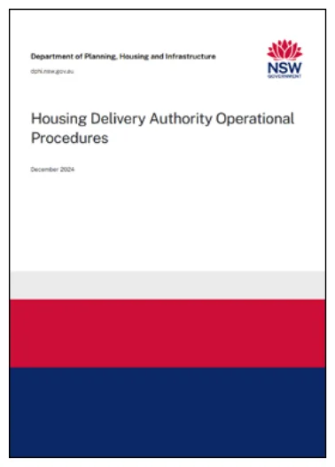

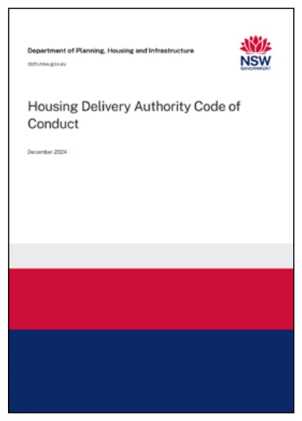

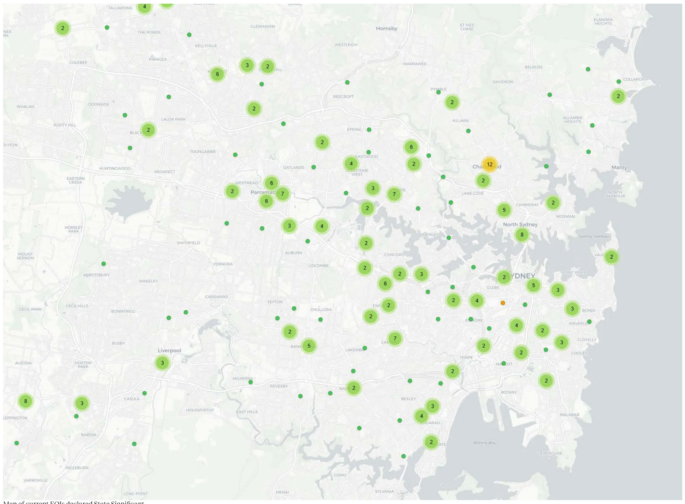

<!-- page 22 -->

Mosman Masterplan 18 SJB

### Baseline review

Planning priorities

Infrastructure and collaboration

— Ensure that development is supported by infrastructure — Work together with Government agencies and other stakeholders to promote good outcomes for Mosman

Liveability

— Provide a range of facilities and services to meet community needs, and foster a rich, creative and connected community — Design and provide places and spaces that are healthy to live in, to work in and to visit — Provide diverse housing choices and opportunities to meet changing demographics and population needs, with housing growth in the right locations — Ensure that building design and construction is of high quality, and maintains resident amenity — Enhance local and neighbourhood centres as great, connected places, whilst maintaining the village atmosphere — Protect and conserve the natural, built and Aboriginal cultural heritage of Mosman

Productivity

— Improve access to, from and within Mosman, and encourage active transport — Reimagine the Spit-Military Roads Corridor to improve function, amenity and accessibility in response to the Western Harbour Tunnel and Beaches Link — Support the local economy and manage visitation sustainably to protect local amenity

Sustainability

— Protect, conserve and enhance Mosman’s urban tree canopy, landform, waterways and bushland — Protect, conserve and enhance the natural, visual, environmental and heritage qualities of Mosman’s foreshore scenic area, and significant views to and from foreshore slopes — Provide land and water-based recreational opportunities within Mosman — Manage energy, water and waste efficiently to ensure a sustainable urban environment — Adapt to and mitigate against the impacts of natural and urban hazards and climate change

2036 projections

The Mosman Local Strategic Planning Statement (LSPS) establishes a 20-year vision for land use planning in Mosman to 2036 and provides the strategic framework for managing growth and change across the LGA. The LSPS was developed in 2020 and addresses the aspirations for the LGA prior to the announcement and implementation of the LMR. While many of the priorities of the LSPS align with the intent of the masterplan, the housing capacity required to be delivered under the masterplan means that some departures from the LSPS were necessary. Strategic alignment therefore remains in overarching intent, although the required housing density necessitates changes to the extent of intensification and associated infrastructure.

Vision

The LSPS vision prioritises preservation of Mosman’s environmental amenity, landscape quality, and village atmosphere while accommodating growth through high‑quality infill housing within medium‑density and business zones. It emphasises heritage protection and excellence in design, while supporting local employment, particularly along the Military Road commercial corridor.

27 Mosman Local Strategic Planning Statement

1

2

3

Local centres

Existing opportunities for additional housing as infill development Mixed-use development Open space and special use infrastructure - protect biodiversity habitats Reduce traffic, investigate Movement and Place

Hazards and scenically sensitive land - enhance landscape quality

Ferry Bus Trunk cycling routes Bushwalking track* Connecting walking track*

Mosman Junction Village Investigate local character and planning controls to maintain the village atmosphere

Cremorne Junction Collaborate with North Sydney Council to ensure coordinated planning outcomes

1 Spit Junction Existing opportunities for housing growth, and improved amenity and connections

Figure 4 – Structure Plan: Mosman *Foreshore walks are part of the Greater Sydney Green Grid

1

2

3

Middle Harbour

Chinamans Beach

Edwards Beach

Balmoral Beach

Cobblers Beach

Obelisk Beach

Whiting Beach

Sydney Harbour

Sydney Harbour

The Spit

Taronga Zoo Taronga Zoo

Cremorne Junction Cremorne Junction

Balmoral Balmoral

Sydney Harbour Federation Trust Lands

Sydney Harbour Federation Trust Lands

Sydney Harbour National Park

Sydney Harbour National Park

Sydney Harbour National Park

Sydney Harbour National Park

Spit Junction Spit Junction

Mosman Junction Mosman Junction

HMAS Penguin HMAS Penguin

Northern Beaches LGA

Willoughby LGA

North Sydney LGA

### Mosman Local Strategic Planning Statement 2020 (LSPS)

MOSMAN

### LOCAL

### STRATEGIC

### PLANNING

### STATEMENT

ENHANCING MOSMAN

March 2020

### ↑

### ↑

### ↓

Mosman LSPS Structure Plan 2020

August 2026

Attachment 1.1.1 Mosman Council

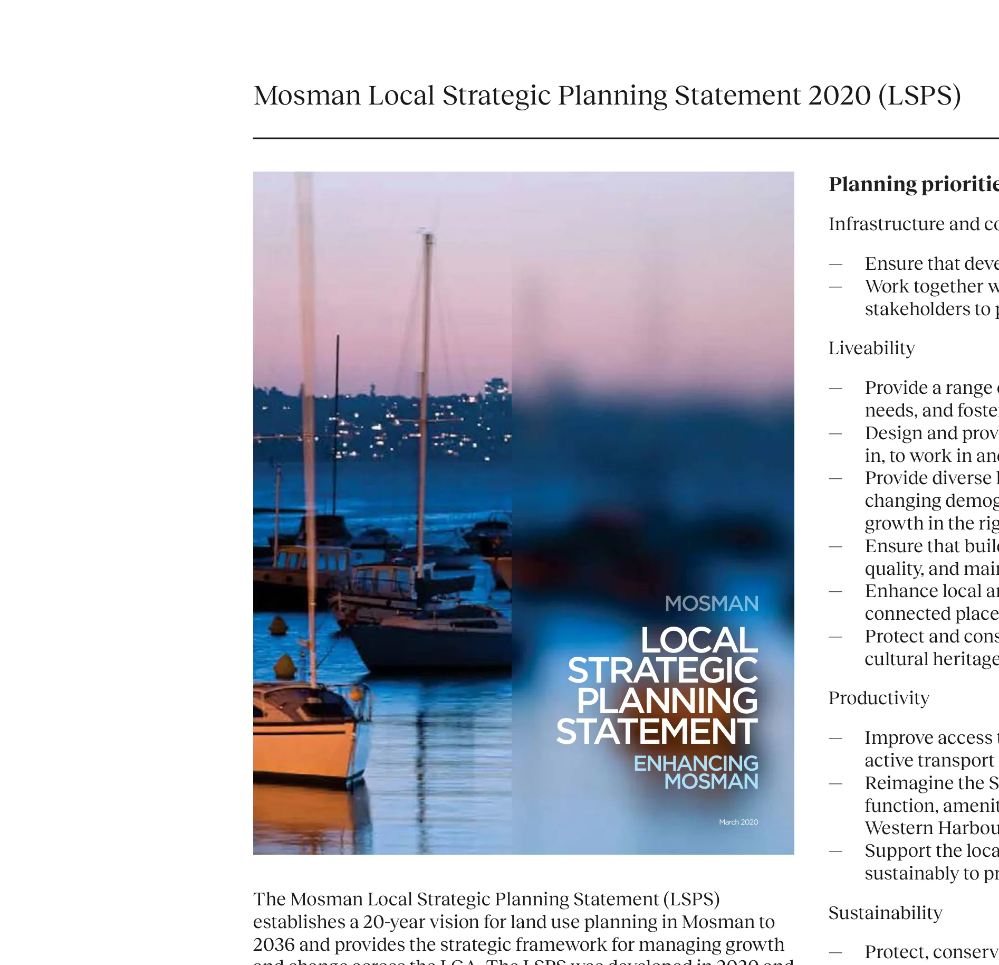

<!-- page 23 -->

Mosman Masterplan SJB 19

### Baseline review

### MOSPLAN

### CONTRIBUTIONS

### PLAN2022

## 5

## 5

Adopted by Council 7 June 2022

The works schedule identifies the public facilities and a summary of the expenditure for which Section 7.12 (EP&A Act) levies will be required.

Priority:

— High Priority works are scheduled from 1 - 3 years — Medium Priority works are scheduled from 3 - 5 years — Low Priority works are scheduled from 5-10 years

* - Multiple project with varying priorities

The 2025-2035 Community Strategic Plan sets out the long-term vision and aspirations of the Mosman community, informed by a comprehensive Community Engagement Plan in 2024 and

#### 2025. It establishes six strategic directions to guide Council

in delivering the places, services and outcomes valued by the community.

The Plan identifies the following community priorities

— Managing development/overdevelopment — Traffic management — Environmental protection/management — Upgrading/maintaining services and facilities — Maintaining the heritage/character/sense of community in the area — Availability and maintenance of beaches, parks and recreations areas

The six strategic directions

Strategic Direction 1

A safe, caring and inclusive community

Strategic Direction 2

A culturally rich and vibrant community

Strategic Direction 3

An attractive and sustainable environment

Strategic Direction 4

An engaged, business-friendly community with strong civic leadership

Strategic Direction 5

Well-designed, liveable and accessible places

Strategic Direction 6

A healthy and active village lifestyle

Accessibility Works Works to improve accessibility identified in Council’s Disability Inclusion Access Plan High- Low* $390,000 Clifton Gardens Access Ramp Review of the design of the access ramp to the foreshore of Clifton Gardens High $15,000 Lift Upgrades Lift replacements/refurbishments at Library, Art Gallery and Vista St Car Park (2) Medium- High* $860,000

Pram Ramp Renewal

Locations to include but not limited to Parriwi Rd – Cyprian St , Calliope St – Calliope Ln, Cobbitte St – Cobbitee Ln, Cartref Ln – Rangers Av, Wunda Rd – Wolger Rd, and Spencer Ln – Keston Av.

High – Low* $25,000

Accessible Parking Project Improve access to mobility parking areas using technology High $10,000

Active Transport Plan

Works to improve transport infrastructure identified in Council’s Active Transport Plan including Queen Street and Bradleys Head Road Intersection Review and Upgrade for Pedestrian and Cycle Safety; Pedestrian Crossing - Beach Lane.

High - Low* $660,000

Art in Public Places Locations include but not limited to Balmoral, Spit Junction, Mosman Junction, The Spit, Sirius Cove and Bradleys Head Medium $150,000 Balmoral Oval Long Jump Improvements to the long jump facility at Balmoral Oval. Medium $40,000

Project Further Detail Priority Estimated cost

Balmoral Oval playing surface

Playing surface upgrade with natural turf and associated works. Design and project management. High $450,000 Bushland Regeneration

Includes bush regeneration works, walking tracks and signage, and fencing at various bushland and unmade road sites

High – Low* $1,250,000

Community Noticeboards

Provision of electronic community notice boards in Mosman business centres –Locations include but not limited to Spit Junction, Mosman Junction, Balmoral, The Spit

Medium $75,000

EV Charging Facilities Provision of electric vehicle charging facilities. Locations include but not limited to Raglan St Car Parks, Balmoral Oval Carpark High $40,000 Footpaths: Missing Links

Installation of footpaths where there are missing links.  Locations include but are not limited to Holt Avenue and The Grove. High $100,000 Marie Bashir Sports Centre Upgrades to Marie Bashir Sports Centre to ensure access to high quality sporting facilities. High $150,000 Middle Head Oval Redevelopment

Design, project management and construction of new multipurpose building including provision of female toilet/change room facilities.

High $1,115,000

Park Furniture Upgrades

Upgrade and standardisation of public furniture and bollards within each reserve, Locations include but not limited to Balmoral and Clifton Gardens.

Medium $400,000

Pearl Bay Bushland and Dinghy Rack Renewals

Provision of new dinghy racks including facilities to cater for longer watercraft like kayaks. High $45,000

Pedestrian Safety

Improvements to pedestrian safety including provision of new “Look Out” stamps on roads/footpaths in commercial areas, around schools and other high pedestrian zones.

High $45,000

Playground Upgrades

Development and implementation of new playground equipment and associated landscaping works. Locations include but not limited to Hunter Park, Reid Park and Bay St.

Medium $885,000

Balmoral Oval – toilets/change rooms

Enhancement and upgrades of public toilets and change room facilities. Includes design, project management and construction High $120,000 Georges Heights – toilets/change rooms

Enhancement and upgrades of public toilets and change room facilities. Includes design, project management and construction High $550,000 Sirius Cove – toilets/change rooms Enhancement and upgrades of public toilets and change room facilities High $75,000 Public Garden Upgrades and Upgrade high profile public gardens, roundabouts and road buildouts. Locations Medium $300,000 Renewals include but not limited to The Esplanade, Military Road, the Art Gallery, and Awaba St.

Rawson Oval Pavilion Refurbishment

Design, project management and construction of new multipurpose building including provision of female toilet/change room facilities. Includes provision for internal renewal of public amenities

High $615,000

Library Precinct Project

Redevelopment of Barry O’Keefe Library and adjacent carpark. This project will be subject to detailed design, costing during the ten-year period of this Contributions Plan.

Low $24,000,000

### Mosman Community Plans

Mosman Community Strategic Plan 2025-2035 Mosman Community Contributions Plan 2022

August 2026

Attachment 1.1.1 Mosman Council

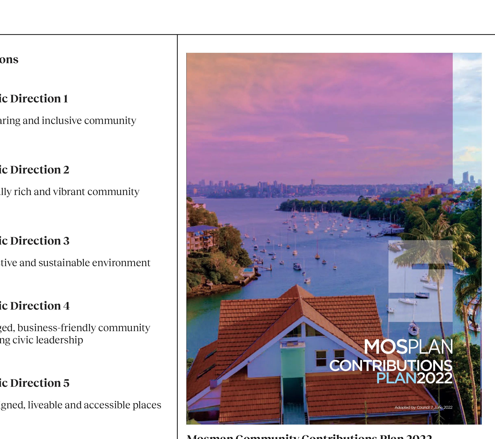

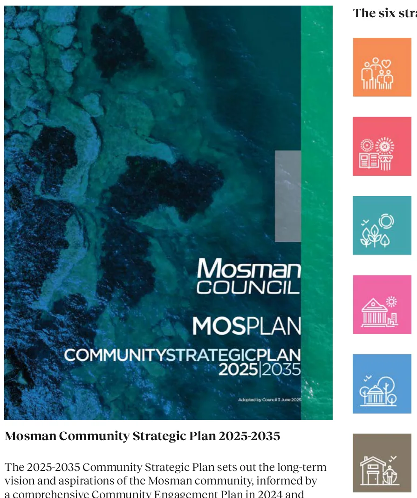

<!-- page 24 -->

Mosman Masterplan SJB 20

### Baseline review

The Walking and Cycling Strategy 2023-2028 (WCS) outlines a 5-year program of works to implement walking and cycling infrastructure and programs, aiming to bring Mosman’s active transport environment closer into alignment with the needs of the Mosman community and the objectives of the CSP.

The WCS identifies the following the primary Active Transport Directions for the 2023- 2028 period:

1. Investigate the feasibility of speed reduction 2. Improve walking and cycling infrastructure around Mosman schools 3. Maintain and enhance Mosman’s existing cycling network 4. Maintain and enhance Mosman’s existing pedestrian infrastructure 5. Promote walking and cycling to the community 6. Strengthen active transport focus in Local and State planning policy 7. Develop an off-road ‘Easy Rider’ cycling network concept

The North Sydney Transport Infrastructure Strategy (NSTIS) guides transport infrastructure planning in Northern Sydney as the region grows over the next 20 years.

The NSTIS identifies the following primary transport strategies for the Mosman area:

— Advocate for State Government investment in infrastructure in response to anticipated population growth (road infrastructure to improve traffic congestion and public transport) — Support the construction of Western Harbour Tunnel and Beaches Link — Consider the adaptability of infrastructure and its potential shared use to meet future needs (the use of technology) — Continue to advocate for solutions to reduce regional traffic congestion on Spit- Military Roads — Collaborate on future opportunities for the arterial corridor to improve access within Mosman — Provide a regulatory framework to encourage innovation in the provision of new modes of transport (e.g.. share bikes) — Maximize public car parking availability and consider active transport solutions in local centres

Existing Mosman Cycling Network 2023

### Transport Strategies

### STRATEGY20232028

## WALKING

## AND CYCLING

### Northern Sydney Transport

### Infrastructure Strategy

Final Report

80019107

Prepared for Northern Sydney Regional Organisation of Councils

2 June 2020

Northern Sydney Transport Infrastructure Strategy Walking and Cycling Strategy

August 2026

Attachment 1.1.1 Mosman Council

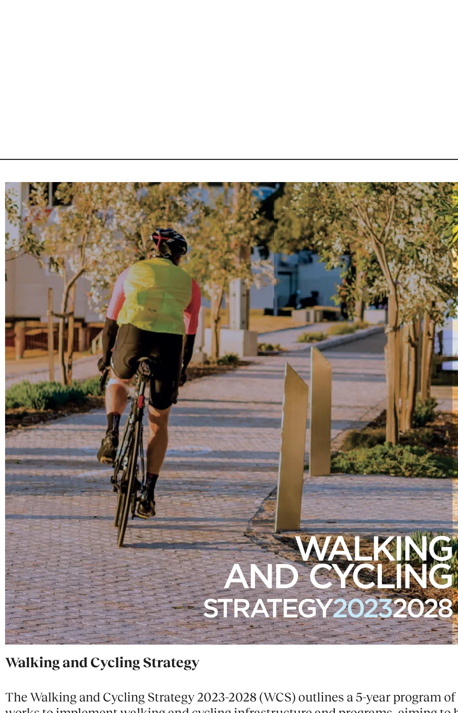

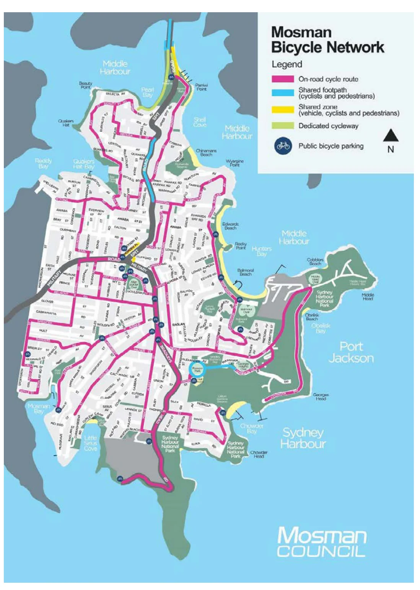

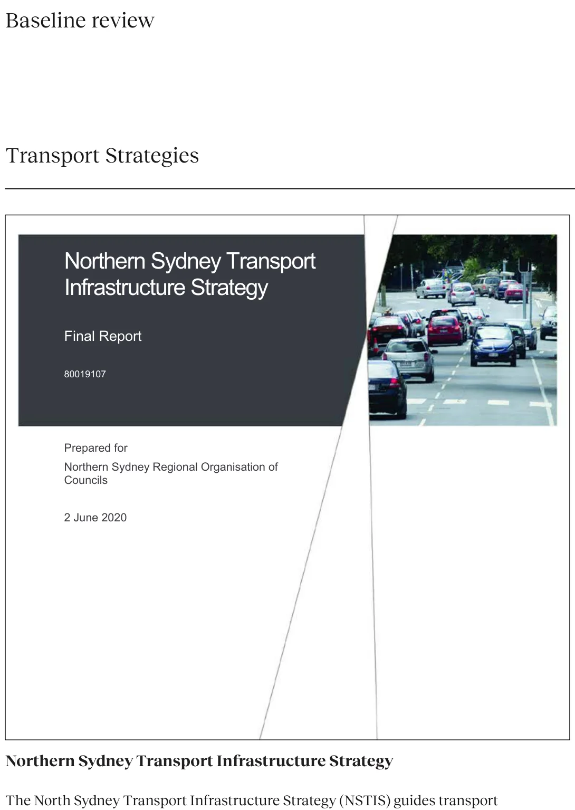

<!-- page 25 -->

Mosman Masterplan SJB 21

### Baseline review

### REVIEW OF SUPPLY AND DEMAND FOR

### SPORTS FACILITIES IN THE NSROC REGION

FINAL REPORT - November 2023

### Open Space and Sports Facilities Strategies

### Mosman Open Space

### Recreational Needs Assessment

### Adopted by Council - 6 October 2015

Facility Type (Mosman) Current Supply 2021 Demand 2021 Variance 2036 Demand 2036 Variance Indoor Courts 0.17 0.60 -0.43 0.60 -0.43 Indoor Speciality 0.16 0.61 -0.45 0.61 -0.45 Outdoor Courts 5.31 1.50 3.81 1.50 3.81 Outdoor Speciality 1.68 2.02 -0.34 2.02 -0.34 Playing Fields 16.49 27.58 -11.09 27.58 -11.09

The NSROC review examines the supply and demand for sports facilities across the NSROC region. It has identified the five significant sporting grounds within the Mosman LGA:

— Mosman Park (Allan Border Oval) — Balmoral Oval — George’s Height Oval — Middle Head Oval — Rawson Oval

Supply/Demand data for Mosman Council (by Hectare)

The Mosman Open Space Recreational Needs Assessment identifies the recreational needs of the community and outlines an action and management plan for the delivery of future facilities over the next 10 years.

The assessment has identified the sport and recreation activities that are in demand within the community:

— Water-based recreation — Cycling/Off road trails — Sport grounds — Basketball — Improved play spaces (BBQ/Picnic areas)

Mosman Open Space Recreational Needs Assessment NSROC Sports Facilities Review

Balmoral Oval

Georges Heights Oval

Rawson Oval

— Fitness — Hockey — Spaces for dogs — Skate/scooter facilities

August 2026

Attachment 1.1.1 Mosman Council

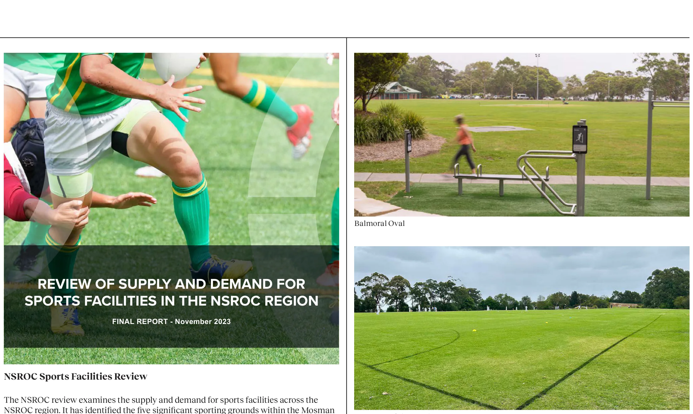

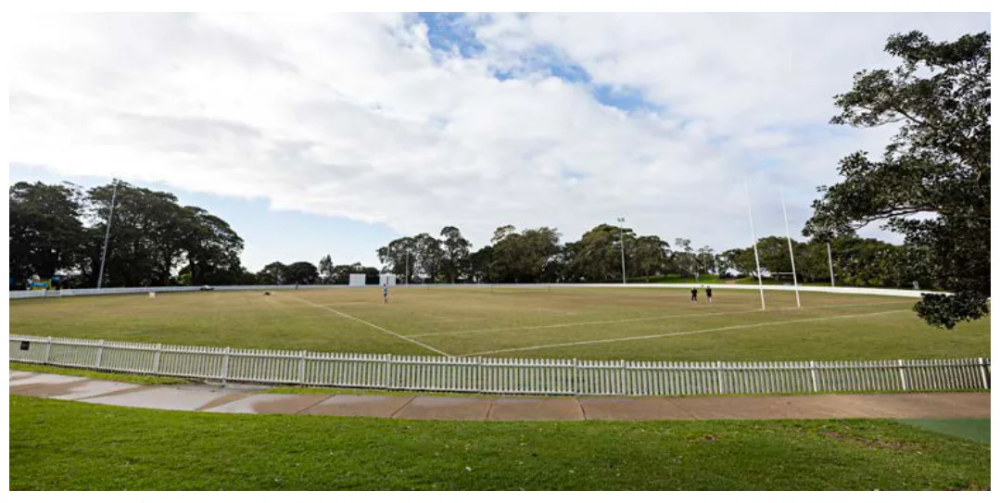

<!-- page 26 -->

Mosman Masterplan 22 SJB

### Baseline review

### Strategic priorities

21/09/15

OPEN SPACE RECREATION NEEDS ASSESSMENT 1

Mosman Open Space Recreational Needs Assessment

Adopted by Council - 6 October 2015

Key findings

— There is a demand for active open space infrastructure and dog parks

Key alignments with the masterplan

— There is available high quality regional  open space around the edges of the LGA. — There is demand for additional local open spaces and play fields. — There is a lack of local open space within the local center.

Mosman Local Strategic Planning Statement (LSPS)

Mosman Open Space Recreational Needs Assessment

STRATEGY20232028

### WALKING

### AND CYCLING

Walking and Cycling Strategy

Key findings

— Despite appearing well connected, most cycling routes are on‑road and are not conducive to comfortable or safe cycling, limiting their effectiveness as active transport options in a traffic‑dominated suburb — Opportunities to connect the corridor by delivering shared paths along Military and Spit Road

Key alignments with the masterplan

— Improve access for everyone to, from and within Mosman — Support active, healthy lifestyles — Provide safe environments for everyday living. — Reduce traffic and congestion — Speed reduction and investments in cycling infrastructures

Mosman Community Strategic Plan 2025- 2035

Key findings

— Maintaining their strong community is a central priority to Mosman, with community engagement playing a key role in long term decision making — Community wellbeing, inclusivity and accessibility are key objectives, particularly in supporting Mosman’s ageing and diverse population — Managing development and change is a primary concern, with a strong desire to protect the local identity and village character

Key alignments with the masterplan

— Management of development and traffic was a  top priority for the community, which is the masterplan main priority although the scale and density are not what initially identified by the Community Strategic Plan.

Key findings

— There is a strong emphasis on protecting Mosman’s character and landscape, reflecting a community that is highly connected to and protective of its local identity — The natural environment is a key influence on change, shaped by topography and environmental sensitivity — Housing growth is to be carefully managed and guided by strong expectations for design excellence

Key alignments with the masterplan

— Provide diverse housing choices to meet changing demographics — Provide a range of facilities and service for the community — Design and provide spaces that are healthy to live in — Protection of Scenic protection zone.

MOSMAN

### LOCAL

### STRATEGIC

### PLANNING

### STATEMENT

ENHANCING MOSMAN

March 2020

A high-level review of Council-led strategic documents has been undertaken to identify the key strategic directions relevant to the Mosman Masterplan.

These findings have informed the preparation of the Masterplan, including the development of the place principles and key drivers, ensuring alignment with Council’s broader strategic planning framework.

August 2026

Attachment 1.1.1 Mosman Council

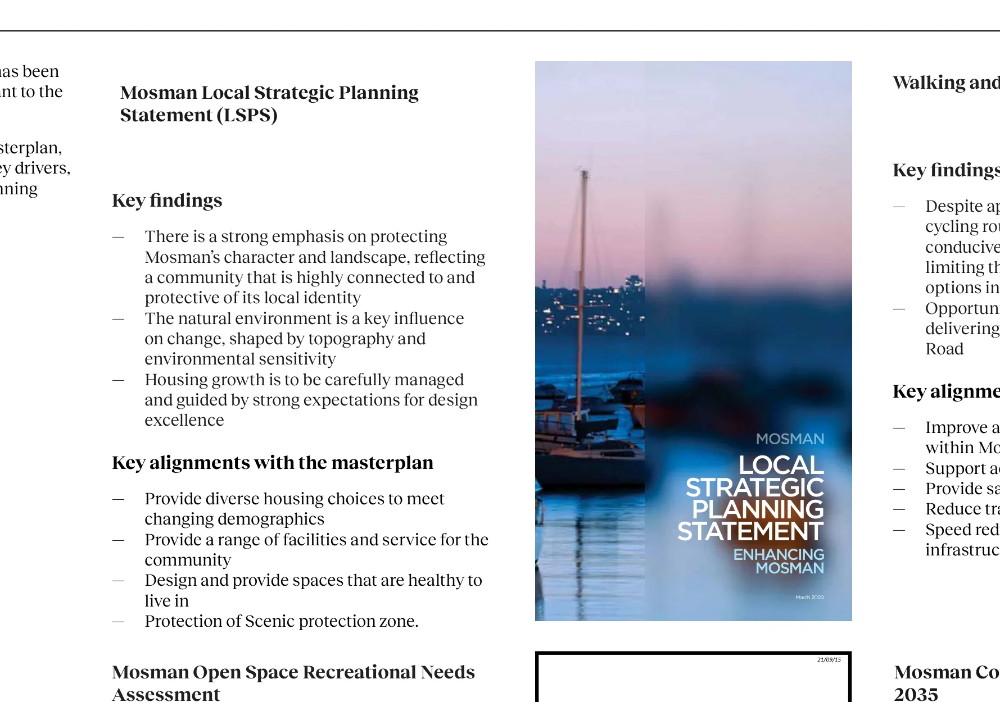

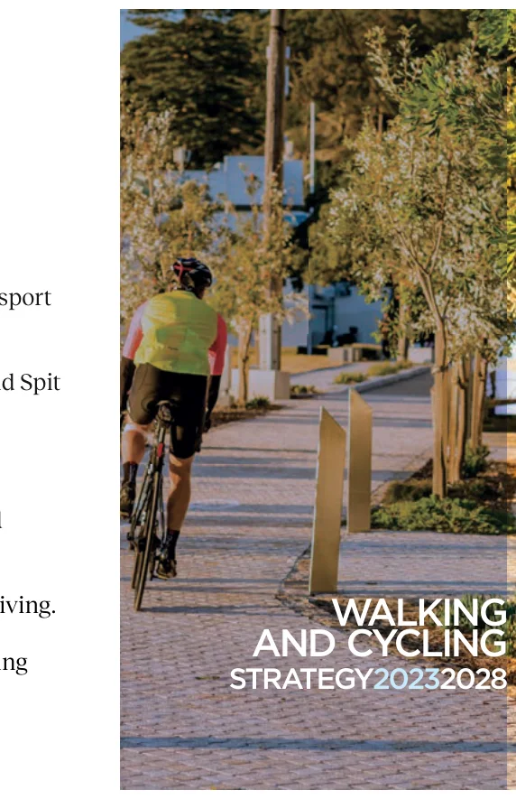

<!-- page 27 -->

Mosman Masterplan SJB 23

### Baseline review

### Current LEP

Land use zoning Floor space ratio

KEY

LGA boundary

Area 1

E1 Local centre

E3 Productivity support

R2 Low density residential

R3 Medium density residential

RE1 Public recreation

RE2 Private recreation

SP1 Special activities

SP2 Infrastructure

C2 Environmental conservation

C4 Environmental living

KEY

LGA boundary

Area 1

0.5

0.55

0.6

0.7

0.8

1

1.3

2

2.5

3

Additional local provisions

The Mosman LEP contains controls which aim to preserve and protect the existing character by allowing sensitive development to occur.

The residential areas of the LGA are zoned exclusively R2 Low Density Residential and R3 Medium Density Residential. Employment land is concentrated within the E1 Local Centre and E3 Productivity Support zones along the Military Road and Spit Road corridors.

C4 Environmental Living land is generally located between the residential areas and the harbour foreshore, C2 Environmental Conservation land and other environmentally sensitive areas. Foreshore lands are zoned C2, SP1 Special Activities land associated with Taronga Zoo and SP2 Infrastructure relating to defence purposes.

A maximum building height of 8.5 metres applies across the majority of residential and C4 zoned land in the LGA. Increased height controls of 11-15 metres are generally concentrated along the Military Road and Spit Road corridors.

An FSR of 0.5:1 applies across the R2 and C4 zones. The R3 l zone is generally subject to an FSR of 0.5:1 to 0.7:1, with higher FSR controls applying to sites fronting Military Road and Spit Road. The employment zones are subject to FSR controls generally ranging from 2:1 to 2.5:1.

Landscaped areas

In order to maintain and enhance the landscaped and townscape character of Mosman’s residential areas, developments must provide substantial, usable ground‑level open space. The intent is to retain the visual dominance of landscaping over built form, particularly along harbour foreshores, and to support recreation, planting, and urban stormwater management.

The controls apply to land within the R2 Low Density Residential, R3 Medium Density Residential, and C4 Environmental Living zones.

Minimum landscaped area requirements must be met for development involving the erection of a building. For single dwellings or non‑residential buildings, the required landscaped area increases with site size from 25% (<400 m²) up to 50% (≥900 m²).

For developments with more than one dwelling, landscaped area must be 50% where the maximum FSR is 0.6:1 or less, and 40% where the maximum FSR exceeds 0.6:1.

These provisions ensure development contributes positively to Mosman’s established landscape character while providing functional open space at ground level.

August 2026

Attachment 1.1.1 Mosman Council

<!-- page 28 -->

Mosman Masterplan SJB 24

### Baseline review

### Current LEP

Heritage Height of buildings Scenic protection area

KEY

LGA boundary

15m

12m

11m

8.5m

KEY

LGA boundary

Heritage item

Heritage conservation area

Archaeological heritage items

KEY

LGA boundary

Scenic protection area

August 2026

Attachment 1.1.1 Mosman Council

<!-- page 29 -->

## Place understanding

## 3

August 2026

Attachment 1.1.1 Mosman Council

<!-- page 30 -->

26 Mosman Masterplan SJB

### Place understanding

### Regional context

Mosman is located approximately 8 kilometres north‑east of the Sydney CBD and occupies the peninsula bounded by Sydney Harbour to the south and Middle Harbour to the north.

The area is characterised by steep and undulating terrain, with ridgelines descending to the harbour foreshore and a series of enclosed bays and beaches. These include Balmoral Beach, Chinamans Beach and Edwards Beach, which are set within narrow coves along the eastern edges of the peninsula.

Mosman includes several regionally significant natural and cultural sites, such as Taronga Zoo, Georges Head, Bradleys Head, and parts of Sydney Harbour National Park. These assets are located along the headlands and contribute to a landscape characterised by a combination of residential areas, bushland, and open space.

Land use within the LGA is predominantly residential, with a concentration of low‑density housing. Commercial, mixed-use and higher-density development is concentrated along the Military Road and Spit Road corridor, which traverses the LGA and provides the principal activity spine serving the surrounding residential neighbourhoods.

Connectivity to the wider metropolitan area is provided mainly through the road network and complemented by ferry services operating between Mosman and the Sydney CBD.

KEY

Train station

Metro station

Ferry stop

NORTH SYDNEY

MILSONS POINT

CIRCULAR QUAY

BOTANICAL GARDEN

BRADLEYS HEAD CREMORNE

BALMORAL BEACH EDWARDS BEACH

DOBROYD HEAD

MIDDLE HEAD

CHINAMANS BEACH

TARONGA ZOO MOSMAN BAY

Sketch drawing of Mosman looking south west

August 2026

Attachment 1.1.1 Mosman Council

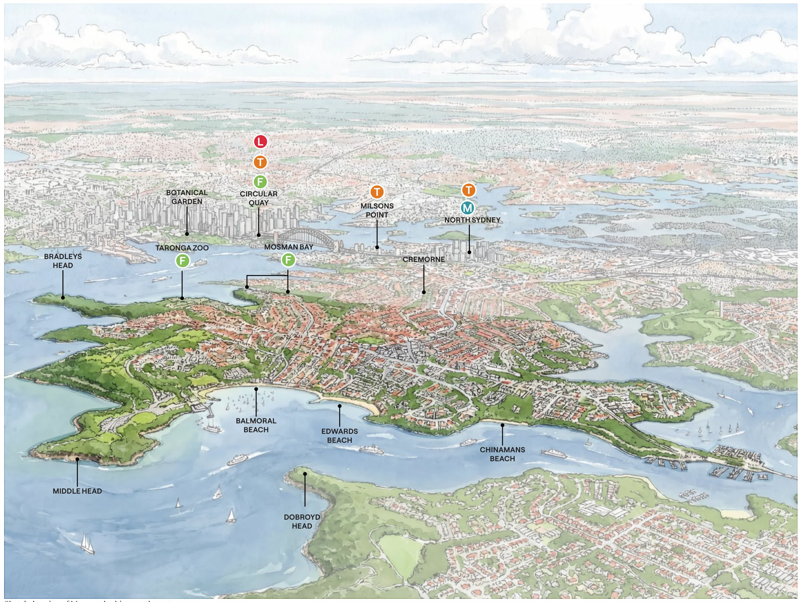

<!-- page 31 -->

27 Mosman Masterplan SJB

M

A C P H

E R S O N

S T R E E T

T E E R T S D R A R E G M I L I T A R Y R O A D

M I L I T A R Y R O A D

S P I T R O A D

BRADLEYS HEAD ROAD

CHOWDER BAY ROAD SHADFORTH STREET SPOFFORTH STREET

MIDDLE HEAD ROAD

MIDDLE HEAD ROAD

MILITARY ROAD

PEARL BAY AVENUE

CABRAMATTA ROAD

SIRIUS COVE ROAD

MANDOLONG ROAD

MUSGRAVE STREET

SOMERSET STREET

ROSEBERY STREET

RANGERS AVENUE

CENTRAL AVENUE

HARBOUR STREET

#### 1801 FORT TRACK

STANLEY AVENUE

CREMORNE LANE

WOLSELEY ROAD

BARDWELL ROAD

MOSMAN STREET

E U N E V A I R A D N I P

BLOXSOME LANE

ALMORA STREET

MUSTON STREET

MEDUSA STREET

E D A N A L P S E E H T

RAGLAN STREET

RAGLAN STREET

GLOVER STREET

MYAHGAH ROAD

MORUBEN ROAD

KARDINIA ROAD

BELMONT ROAD

MORELLA ROAD

QUAKERS ROAD

HORDERN LANE

SPENCER ROAD

STANTON ROAD

KAREELA ROAD

AWABA STREET AWABA STREET OURIMBAH STREET

HOPETOUN AVENUE

CHINAMANS BEACH

BALMORAL BEACH

EDWARDS BEACH

COBBLERS BEACH

OBELISK BEACH

SPIT ROAD

JULIAN STREET

QUEEN STREET

KAREELA LANE

REDAN STREET BOTANIC ROAD

T E E R T S E L B O N

PARRIWI ROAD

COWLES ROAD

UNION STREET

BICKELL ROAD

BOYLE STREET

LINDSAY LANE

DAVID STREET

AVENUE ROAD SUAKIN DRIVE

DALTON ROAD

MILSON ROAD

VISTA STREET

PARK AVENUE

HOLT AVENUE

BOND STREET

WYONG ROAD

WUNDA ROAD

RUBY STREET

PUNCH LANE

E N A L N A D E R

ILUKA ROAD

IDA AVENUE

SILEX ROAD

BAY STREET

HALE ROAD

THE GROVE

CREMORNE

MILSONS POINT

CAMMERAY

NORTH SYDNEY

POINT

KURRABA POINT

CREMORNE

CLIFTON GARDEN RESERVE

MIDDLE HEAD

BRADLEYS HEAD

TAROONGA ZOO

### Place understanding

### Local context

Mosman LGA is situated on a peninsula on Sydney’s Lower North Shore, bounded by Middle Harbour to the north and north-east, Port Jackson to the east and south, and the North Sydney Council area to the west.

Mosman is predominantly residential and supported by local centres, six primary schools and two secondary schools, community facilities, and recreational areas distributed throughout the LGA. Open space and foreshore reserves are a defining feature of the local context, with access to beaches, walking tracks, and parklands integrated into the surrounding neighbourhoods.

Mosman contains a substantial concentration of heritage items and conservation areas, with houses and streets established in the late nineteenth and early twentieth centuries. Much of the residential fabric comprises detached/semi detached dwellings and small‑scale apartment buildings, generally set within established streetscapes characterised by mature trees, landscaping and consistent setbacks, contributing to a strong landscape character.

The local street network follows the ridgelines and contours of the area, resulting in a curvilinear and irregular pattern that responds closely to topography. Elevated streets and headlands provide visual connections across Sydney Harbour and Middle Harbour, with views extending towards prominent landmarks such as the Sydney Harbour Bridge and the Sydney Opera House, as well as surrounding bushland and foreshore landscapes.

The combination of varied topography, established heritage areas, foreshore interfaces, and a fine‑grained residential pattern collectively define the character of Mosman.

Key metric

— 2021 resident population: 28,329 — Existing dwellings: 13,399 — Existing jobs: 3,744 (Employment generated by other uses have not been fully captured. Notable exclusions include Taronga Zoo, HMAS Penguin Naval Base, and religious institutions)

Aerial image 1:20,000 @ A3

August 2026

Attachment 1.1.1 Mosman Council

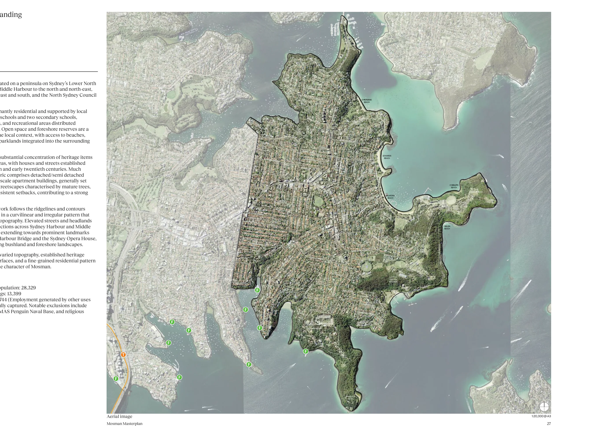

<!-- page 32 -->

28 Mosman Masterplan SJB 

### Place understanding

### Site photos

Balmoral beach

Spit Junction looking west toward Military Road from Spit Road Military Road at the intersection with MacPherson St Military Road HCA Glover and Nathan’s Estates HCA

Military Road HCA

Awaba Street looking toward Balmoral Beach Prince Alfred Street looking toward Port Jackson and CBD

August 2026

Attachment 1.1.1 Mosman Council

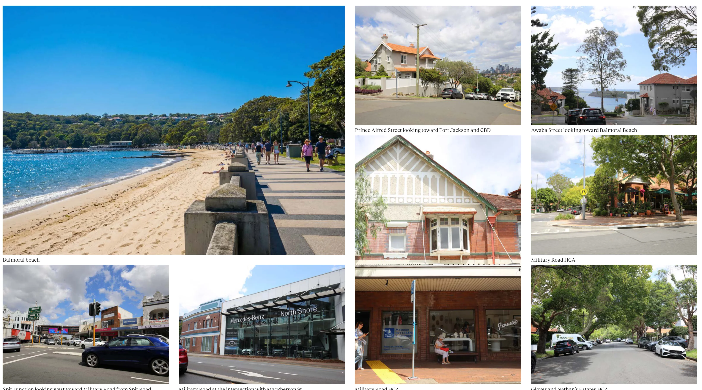

<!-- page 33 -->

29 Mosman Masterplan SJB

### Place understanding

### Demographics

Medium age

Cultural diversity (ancenstry)

Population profiling Dwellings composition Tenure

Dwelling structure

N. of bedrooms

Dwelling count

Rent repayments Family composition

Household composition

Tenure type Employment status

## 45

41%

35%

16% 1%

88%

57% 43%

66%

38% 61%

English

Single detached

1

bedroom Studio

Occupied private dwellings

Below 30% of income Couple

Family

Owned outright Full time

Australian

Attached

2

bedrooms

Not occupied

Above 30% of income With children

Single

Owned Mortgage Part time

Irish

Apartment

3

bedrooms Single parents

Group

Rented

Unemployed

Scottish

Other

4+

bedrooms Others

26%

12%

31%

12%

36% 43%

31%

25% 27%

14%

52%

24% 11%

2%

33% 3.6%

12%

1%

28% 1.2%

### $

Demographic analysis of the area has been undertaken and a summary of the key findings has been prepared to inform the understanding of the Mosman community.

Mosman’s 2021 Census profile indicates a mature, comparatively affluent and highly educated community, highlighting key considerations for housing choice, accessibility and service planning.

The LGA recorded 28,329 residents, a female-majority population (54.0%), and a median age of 45, signalling stronger representation of mid‑life and older cohorts relative to broader metropolitan benchmarks (37 years is the average age of Sydney Region). Consistent with this socio-economic profile, Mosman shows very high tertiary attainment (54.5% of residents aged 15+ hold a Bachelor degree or higher) and high household purchasing capacity (median weekly household income $2,892; median weekly personal income $1,487), which typically correlates with downsizing and ageing-in-place.

Culturally, Mosman is predominantly English-speaking (80.0% of households report English-only), while also reflecting moderate diversity through overseas birthplace and language patterns ( 61.5% Australian-born; England 8.5% a leading overseas birthplace; key non‑English home languages include Mandarin (3.0%), Spanish (1.2%) and French (1.1%)).

The most commonly reported ancestries—English (41.0%), Australian (26.8%) and Irish (14.3%).

August 2026

Attachment 1.1.1 Mosman Council

<!-- page 34 -->

30 Mosman Masterplan SJB

### Place understanding

### Movement network and public transport

KEY

LGA boundary

Highway

Arterial road

Main road

Frequent bus service

XXX Bus route

400m catchment to frequent service bus stops

200m catchment to frequent service bus stops

200m catchment to ferry stops

Open space

Train station

Ferry stop

Bus stop

to Chatswood

to Northern Beaches

100 to Taronga Zoo

B1 Northern Beaches 144 Manly

120 Chatswood

B1, 100, 120 to City

144 Chatswood

to Willoughby

to Sydney

1:20,000 @ A3 Movement and public transport network

Military Road

Gerard Street

Macpherson Street

Bradfield Highway

Mosman’s movement network is anchored by the two major arterial roads of Military Road and Spit Road, which function as the primary thoroughfares through the area. These routes carry the majority of local bus services, connecting the precinct southwards toward Bradleys Head and its ferry wharves, northwards via the Spit toward Manly and the Northern Beaches and west toward North Sydney Metro and Train. Ferry services from Mosman Bay and Taronga Zoo provide direct connections to Circular Quay, enhancing regional accessibility and access to the Sydney CBD and supporting transport choice.

Key findings

— The street pattern aligns with ridgelines and contours, creating an irregular and curvilinear street network that is limited by the peninsular geography — Local streets terminate within gullies or at the foreshore — Frequent bus services operate along Military Road and Spit Road, connecting residential areas to regional centres and major employment nodes, but public transport is less accessible within local street areas.

Collectively, Mosman’s movement network reflects a combination of constrained local circulation, strong reliance on key arterial corridors, and multimodal connections to the broader metropolitan area.

M

A C P H

E R S O N

S T R E E T

T E E R T S D R A R E G M I L I T A R Y R O A D

M I L I T A R Y R O A D

S P I T R O A D

BRADLEYS HEAD ROAD

CHOWDER BAY ROAD SHADFORTH STREET SPOFFORTH STREET

MIDDLE HEAD ROAD

MIDDLE HEAD ROAD

MILITARY ROAD

PEARL BAY AVENUE

CABRAMATTA ROAD

SIRIUS COVE ROAD

MANDOLONG ROAD

MUSGRAVE STREET

SOMERSET STREET

ROSEBERY STREET

RANGERS AVENUE

CENTRAL AVENUE

HARBOUR STREET

#### 1801 FORT TRACK

STANLEY AVENUE

CREMORNE LANE

WOLSELEY ROAD

BARDWELL ROAD

MOSMAN STREET

PINDARI AVENUE

BLOXSOME LANE

ALMORA STREET

MUSTON STREET

MEDUSA STREET

THE ESPLANADE

RAGLAN STREET

RAGLAN STREET

GLOVER STREET

MYAHGAH ROAD

MORUBEN ROAD

KARDINIA ROAD

BELMONT ROAD

MORELLA ROAD

QUAKERS ROAD

HORDERN LANE

SPENCER ROAD

STANTON ROAD

KAREELA ROAD

AWABA STREET

JULIAN STREET

QUEEN STREET

KAREELA LANE

REDAN STREET BOTANIC ROAD NOBLE STREET

PARRIWI ROAD

COWLES ROAD

UNION STREET

BICKELL ROAD

BOYLE STREET

LINDSAY LANE

DAVID STREET

AVENUE ROAD SUAKIN DRIVE

DALTON ROAD

MILSON ROAD

VISTA STREET

PARK AVENUE

HOLT AVENUE

BOND STREET

WYONG ROAD

WUNDA ROAD

RUBY STREET

PUNCH LANE

REDAN LANE

ILUKA ROAD

IDA AVENUE

SILEX ROAD

BAY STREET

HALE ROAD

THE GROVE

CREMORNE

MILSONS POINT

CAMMERAY

NORTH SYDNEY

POINT

KURRABA POINT

CREMORNE

CLIFTON GARDEN RESERVE

MIDDLE HEAD

BRADLEYS HEAD

TAROONGA ZOO

August 2026

Attachment 1.1.1 Mosman Council

<!-- page 35 -->

31 Mosman Masterplan SJB

### Place understanding

### Active transport

KEY

LGA boundary

Dedicated cycleway

On-road cycle route

Shared footpath (cyclists and pedestrians)

Pedestrian link

Bushwalking trail

Beach / ocean pool

Open space

Train station

Ferry stop 1:20,000 @ A3

Mosman’s active transport network provides important walking and cycling connections across the suburb, supporting everyday travel and reducing reliance on private vehicle use. These connections improve local accessibility and integrate residential neighbourhoods with key destinations and transport hubs.

Numerous pedestrian links traverse parks, natural reserves and residential streets, providing direct and convenient walking connections. These links not only support sustainable travel but also connects people with Mosman’s natural landscape and key community destinations. Bushwalking trails are located in the south‑eastern part of Mosman, particularly around Taronga Zoo, Bradleys Head, Clifton Gardens and the Middle Head bushland and constitute part of the Manly to Bondi walk.

Key findings

— The majority of Mosman’s cycle network consists of on‑road routes, defined by cycle markings painted on vehicular roads. — Limited number of dedicated cycleways, and those that exist are short, disconnected and dispersed across the LGA. — Cycle routes provide access to ferry wharves, including Taronga Zoo Wharf and Mosman Bay Wharf. — The steep topography presents challenges for cycling and walking throughout the LGA.

Active transport network

M

A C P H

E R S O N

S T R E E T

T E E R T S D R A R E G M I L I T A R Y R O A D

M I L I T A R Y R O A D

S P I T R O A D

BRADLEYS HEAD ROAD

CHOWDER BAY ROAD SHADFORTH STREET SPOFFORTH STREET

MIDDLE HEAD ROAD

MIDDLE HEAD ROAD

MILITARY ROAD

PEARL BAY AVENUE

CABRAMATTA ROAD

SIRIUS COVE ROAD

MANDOLONG ROAD

MUSGRAVE STREET

SOMERSET STREET

ROSEBERY STREET

RANGERS AVENUE

CENTRAL AVENUE

HARBOUR STREET

#### 1801 FORT TRACK

STANLEY AVENUE

CREMORNE LANE

WOLSELEY ROAD

BARDWELL ROAD

MOSMAN STREET

PINDARI AVENUE

BLOXSOME LANE

ALMORA STREET

MUSTON STREET

MEDUSA STREET

THE ESPLANADE

RAGLAN STREET

RAGLAN STREET

GLOVER STREET

MYAHGAH ROAD

MORUBEN ROAD

KARDINIA ROAD

BELMONT ROAD

MORELLA ROAD

QUAKERS ROAD

HORDERN LANE

SPENCER ROAD

STANTON ROAD

KAREELA ROAD

AWABA STREET

JULIAN STREET

QUEEN STREET

KAREELA LANE

REDAN STREET BOTANIC ROAD NOBLE STREET

PARRIWI ROAD

COWLES ROAD

UNION STREET

BICKELL ROAD

BOYLE STREET

LINDSAY LANE

DAVID STREET

AVENUE ROAD SUAKIN DRIVE

DALTON ROAD

MILSON ROAD

VISTA STREET

PARK AVENUE

HOLT AVENUE

BOND STREET

WYONG ROAD

WUNDA ROAD

RUBY STREET

PUNCH LANE

REDAN LANE

ILUKA ROAD

IDA AVENUE

SILEX ROAD

BAY STREET

HALE ROAD

THE GROVE

CREMORNE

MILSONS POINT

CAMMERAY

NORTH SYDNEY

POINT

KURRABA POINT

CREMORNE

CLIFTON GARDEN RESERVE

MIDDLE HEAD

BRADLEYS HEAD

TAROONGA ZOO

August 2026

Attachment 1.1.1 Mosman Council

<!-- page 36 -->

32 Mosman Masterplan SJB

### Place understanding

### Open space

KEY

LGA boundary

10m contours

Regional open space

District open space

Local parks

Pocket parks

400m catchment

Conservation and infrastructure

Beach / ocean pool

Playground

Sports fields

Train station

Ferry stop 1:20,000 @ A3

Mosman’s open space network is one of its most defining and valued characteristics that shapes the suburb’s identity. Extensive foreshore reserves and bushland form a continuous band of green space along the edges, forming a ecologically valuable natural and public asset. A network of pocket parks and sports fields are dispersed throughout the suburb, providing diverse collection of recreation opportunities and green open spaces for the community.

According to the NSW Greener Places Design Guide which provides a benchmark, public open spaces in low to mid density like Mosman (less than 60 dwl/ha) areas should provide a minimum of 5000 m² for a local park and these service a community within a catchment of 400m. Regional open spaces such as Chinaman’s beach and Balmoral Beach however, have a catchment of 5Km.

Key findings

— Open space is concentrated on the south-east foreshore, including the areas of Middle Head, Clifton Gardens, Bradleys Head, and the Taronga Zoo area. — Local open space is limited in the central parts of the LGA, particularly on its western side. — Existing open spaces along the periphery of the foreshore are more difficult to access due to topography and limited public transport connections. — Mosman is well serviced by regional public open space, but limited in local open spaces in the centre.

Open space network

M

A C P H

E R S O N

S T R E E T

T E E R T S D R A R E G M I L I T A R Y R O A D

M I L I T A R Y R O A D

S P I T R O A D

BRADLEYS HEAD ROAD

CHOWDER BAY ROAD SHADFORTH STREET SPOFFORTH STREET

MIDDLE HEAD ROAD

MIDDLE HEAD ROAD

MILITARY ROAD

PEARL BAY AVENUE

CABRAMATTA ROAD

SIRIUS COVE ROAD

MANDOLONG ROAD

MUSGRAVE STREET

SOMERSET STREET

ROSEBERY STREET

RANGERS AVENUE

CENTRAL AVENUE

HARBOUR STREET

#### 1801 FORT TRACK

STANLEY AVENUE

CREMORNE LANE

WOLSELEY ROAD

BARDWELL ROAD

MOSMAN STREET

PINDARI AVENUE

BLOXSOME LANE

ALMORA STREET

MUSTON STREET

MEDUSA STREET

THE ESPLANADE

RAGLAN STREET

RAGLAN STREET

GLOVER STREET

MYAHGAH ROAD

MORUBEN ROAD

KARDINIA ROAD

BELMONT ROAD

MORELLA ROAD

QUAKERS ROAD

HORDERN LANE

SPENCER ROAD

STANTON ROAD

KAREELA ROAD

AWABA STREET

JULIAN STREET

QUEEN STREET

KAREELA LANE

REDAN STREET BOTANIC ROAD NOBLE STREET

PARRIWI ROAD

COWLES ROAD

UNION STREET

BICKELL ROAD

BOYLE STREET

LINDSAY LANE

DAVID STREET

AVENUE ROAD SUAKIN DRIVE

DALTON ROAD

MILSON ROAD

VISTA STREET

PARK AVENUE

HOLT AVENUE

BOND STREET

WYONG ROAD

WUNDA ROAD

RUBY STREET

PUNCH LANE

REDAN LANE

ILUKA ROAD

IDA AVENUE

SILEX ROAD

BAY STREET

HALE ROAD

THE GROVE

CREMORNE

MILSONS POINT

CAMMERAY

NORTH SYDNEY

POINT

KURRABA POINT

CREMORNE

CLIFTON GARDEN RESERVE

MIDDLE HEAD

BRADLEYS HEAD

TAROONGA ZOO

August 2026

Attachment 1.1.1 Mosman Council

<!-- page 37 -->

SJB 33 Mosman Masterplan

### Place understanding

### Open space character

Regional open spaces are high value areas that provide benefits to a wider catchment, extending well beyond the local Mosman community. These include beaches such as Balmoral and Chinamans Beach, natural reserves like Clifton Gardens and Spit West, as well as the Taronga Zoo precinct on the periphery.

District open spaces comprise areas greater than 7,000m² that contribute significantly to Mosman’s main active recreational network. These areas include key sporting facilities such as Allan Border Oval and Middle Head Oval, as well as large open spaces like Reid Park.

Local parks within Mosman are typically between 5,000m² and 7,000m² in size and play an important role in providing accessible open space for the nearby community. Mosman has a limited number of parks within this size category, including Hunter Park, Memory Park and the grounds of the Mosman Bowling Club.

Pocket parks are small, scattered open spaces generally less than 5,000 m² in size. Mosman contains a wide distribution of these smaller parks across the suburb, including Hampshire Park, Mosman Square, Rest Park, and numerous other intimate green pockets and garden areas serving as a green relief.

Clifton Gardens Allan Border Oval Hunter Park Village Green

Chinaman Beach Reid Park Memory Park Countess Park

Regional open space District open space Local parks Pocket parks

August 2026

Attachment 1.1.1 Mosman Council

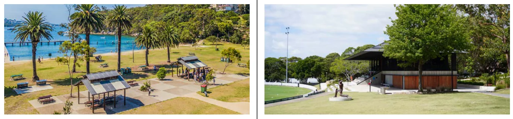

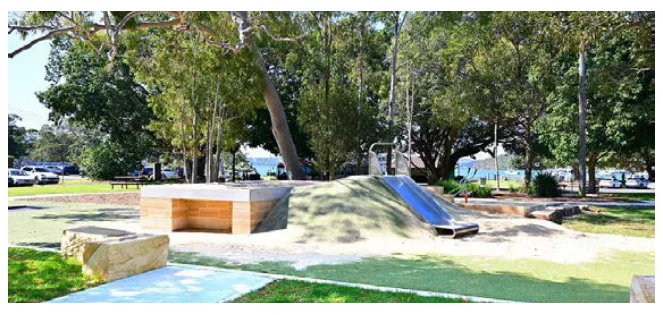

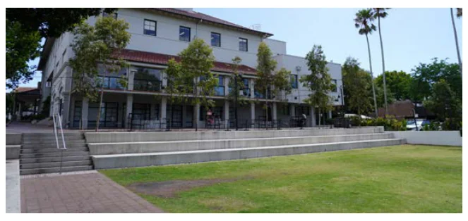

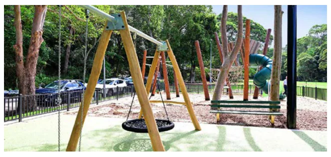

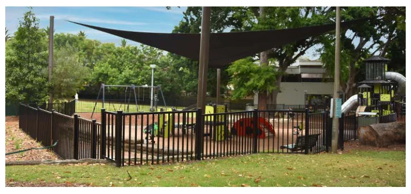

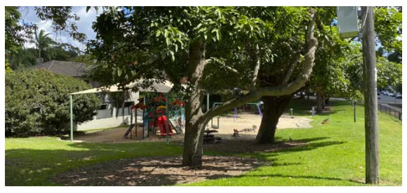

<!-- page 38 -->

34 Mosman Masterplan SJB

### Place understanding

### Tree canopy

1:20,000 @ A3

KEY

LGA boundary

Canopy Cover

Heritage listed canopy

Limited canopy area

Littoral Rainforest

Open space

Train station

Ferry stop

Mosman’s canopy cover is a defining environmental asset that shapes the area’s landscaped village character. Tree canopy is clustered around key foreshore areas, natural bushland reserves and notable heritage listed vegetation, including streets specifically distinguished by their significant established tree coverage. These features contribute to the overall green identity of many neighbourhoods throughout Mosman.

Key findings

— Mosman’s tree canopy covers approximately 37% of the suburb according to Mosman Council internal tree canopy cover analysis. — High‑quality canopy cover is abundant along the periphery of Mosman, reflecting the expansive bushland along the foreshore reserves. — Several streets are lined with heritage listed trees which forms a defining characteristic of those residential areas. — A small number of pockets exhibit limited canopy cover; these occur in varied locations, primarily focused around the Military and Spit Road corridors.

Canopy network

CANOPY COVER

### 37%

M

A C P H

E R S O N

S T R E E T

T E E R T S D R A R E G M I L I T A R Y R O A D

M I L I T A R Y R O A D

S P I T R O A D

BRADLEYS HEAD ROAD

CHOWDER BAY ROAD SHADFORTH STREET SPOFFORTH STREET

MIDDLE HEAD ROAD

MIDDLE HEAD ROAD

MILITARY ROAD

PEARL BAY AVENUE

CABRAMATTA ROAD

SIRIUS COVE ROAD

MANDOLONG ROAD

MUSGRAVE STREET

SOMERSET STREET

ROSEBERY STREET

RANGERS AVENUE

CENTRAL AVENUE

HARBOUR STREET

#### 1801 FORT TRACK

STANLEY AVENUE

CREMORNE LANE

WOLSELEY ROAD

BARDWELL ROAD

MOSMAN STREET

PINDARI AVENUE

BLOXSOME LANE

ALMORA STREET

MUSTON STREET

MEDUSA STREET

THE ESPLANADE

RAGLAN STREET

RAGLAN STREET

GLOVER STREET

MYAHGAH ROAD

MORUBEN ROAD

KARDINIA ROAD

BELMONT ROAD

MORELLA ROAD

QUAKERS ROAD

HORDERN LANE

SPENCER ROAD

STANTON ROAD

KAREELA ROAD

AWABA STREET

JULIAN STREET

QUEEN STREET

KAREELA LANE

REDAN STREET BOTANIC ROAD NOBLE STREET

PARRIWI ROAD

COWLES ROAD

UNION STREET

BICKELL ROAD

BOYLE STREET

LINDSAY LANE

DAVID STREET

AVENUE ROAD SUAKIN DRIVE

DALTON ROAD

MILSON ROAD

VISTA STREET

PARK AVENUE

HOLT AVENUE

BOND STREET

WYONG ROAD

WUNDA ROAD

RUBY STREET

PUNCH LANE

REDAN LANE

ILUKA ROAD

IDA AVENUE

SILEX ROAD

BAY STREET

HALE ROAD

THE GROVE

CREMORNE

MILSONS POINT

CAMMERAY

NORTH SYDNEY

POINT

KURRABA POINT

CREMORNE

CLIFTON GARDEN RESERVE

MIDDLE HEAD

BRADLEYS HEAD

TAROONGA ZOO

August 2026

Attachment 1.1.1 Mosman Council

<!-- page 39 -->

35 Mosman Masterplan SJB

### Place understanding

### Landscape and topography

KEY

LGA boundary

10m contours

Indicative ridgeline

<1:33 slope

1:33 slope

1:20 slope

1:14 slope

1:8 slope

>1:8 slope

Train station

Ferry stop 1:20,000 @ A3 Landscape and topography map

Mosman’s topography is one of the defining influences on its urban form, character and patterns of development.

The peninsula is shaped by a series of steep ridgelines, valleys and dramatic waterfront slopes that frame views to Sydney Harbour and Middle Harbour. Its landscape and topography creates a varied and visually rich environment, influencing the layout of streets, subdivision patterns and building orientation.

Key findings

— The central spine of Mosman is located on a plateau and functions as the primary activity and movement corridor. These flatter areas can support walkable neighbourhoods with potential for clustered developments to improve connectivity and accessibility in a key area of the precinct.

Steepness matrix

Walking

<19 19 - 11 10 - 8 8 - 6 6 - 5 >5

Cycling

Movement and Place steepness metrics

<29 27 - 11 10 - 6 >6

M

A C P H

E R S O N

S T R E E T

T E E R T S D R A R E G M I L I T A R Y R O A D

M I L I T A R Y R O A D

S P I T R O A D

BRADLEYS HEAD ROAD

CHOWDER BAY ROAD SHADFORTH STREET SPOFFORTH STREET

MIDDLE HEAD ROAD

MIDDLE HEAD ROAD

MILITARY ROAD

PEARL BAY AVENUE

CABRAMATTA ROAD

SIRIUS COVE ROAD

MANDOLONG ROAD

MUSGRAVE STREET

SOMERSET STREET

ROSEBERY STREET

RANGERS AVENUE

CENTRAL AVENUE

HARBOUR STREET

#### 1801 FORT TRACK

STANLEY AVENUE

CREMORNE LANE

WOLSELEY ROAD

BARDWELL ROAD

MOSMAN STREET

PINDARI AVENUE

BLOXSOME LANE

ALMORA STREET

MUSTON STREET

MEDUSA STREET

THE ESPLANADE

RAGLAN STREET

RAGLAN STREET

GLOVER STREET

MYAHGAH ROAD

MORUBEN ROAD

KARDINIA ROAD

BELMONT ROAD

MORELLA ROAD

QUAKERS ROAD

HORDERN LANE

SPENCER ROAD

STANTON ROAD

KAREELA ROAD

AWABA STREET

JULIAN STREET

QUEEN STREET

KAREELA LANE

REDAN STREET BOTANIC ROAD NOBLE STREET

PARRIWI ROAD

COWLES ROAD

UNION STREET

BICKELL ROAD

BOYLE STREET

LINDSAY LANE

DAVID STREET

AVENUE ROAD SUAKIN DRIVE

DALTON ROAD

MILSON ROAD

VISTA STREET

PARK AVENUE

HOLT AVENUE

BOND STREET

WYONG ROAD

WUNDA ROAD

RUBY STREET

PUNCH LANE

REDAN LANE

ILUKA ROAD

IDA AVENUE

SILEX ROAD

BAY STREET

HALE ROAD

THE GROVE

CREMORNE

MILSONS POINT

CAMMERAY

NORTH SYDNEY

POINT

KURRABA POINT

CREMORNE

CLIFTON GARDEN RESERVE

MIDDLE HEAD

BRADLEYS HEAD

TAROONGA ZOO

August 2026

Attachment 1.1.1 Mosman Council

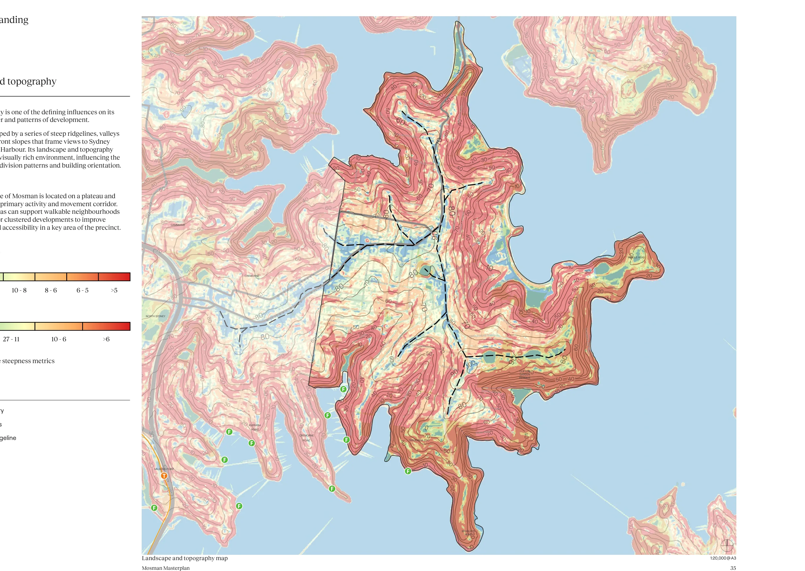

<!-- page 40 -->

36 Mosman Masterplan SJB

### Place understanding

### Heritage

KEY

LGA boundary

Heritage item

Heritage conservation area

Archaeological heritage items

Open space

Train station

Ferry stop

Mosman contains a significant concentration of heritage items and heritage conservation areas reflecting its late nineteenth‑ and early twentieth‑century settlement. Heritage items include residential buildings, civic and cultural sites, former defence installations, and landmark institutions such as Taronga Zoo, distributed across ridgelines, headlands, and established residential areas.

Heritage significance across Mosman is not uniform, with different heritage conservation areas (HCAs) demonstrating varying levels of integrity, significance and capacity for change. While many conservation areas remain highly intact and warrant strong protection, other locations contain altered development patterns, fragmented character, or are located within established urban renewal corridors where carefully managed change may be appropriate.

Together, heritage items and conservation areas form a defining layer of Mosman’s built form and historical context, influencing the scale, form, and character of development across the local government area.

Key findings

— Heritage items across the precinct are slat and peppered throughout the LGA, with a concentration of larger assets in the south-east primarily comprising nature reserves, parklands, and environmentally sensitive areas. — Different HCAs exhibit different levels of integrity, with some HCAs warranting review or refinement. — Several heritage listed streets are considered significant due to their mature tree canopies lining the road or forming a central median. — Military Road HCA contains areas with varying heritage significance appropriateness of future change has been found by Heritage consultants NBRS.

1:20,000 @ A3 Heritage and conservation map

M

A C P H

E R S O N

S T R E E T

T E E R T S D R A R E G M I L I T A R Y R O A D

M I L I T A R Y R O A D

S P I T R O A D

BRADLEYS HEAD ROAD

CHOWDER BAY ROAD SHADFORTH STREET SPOFFORTH STREET

MIDDLE HEAD ROAD

MIDDLE HEAD ROAD

MILITARY ROAD

PEARL BAY AVENUE

CABRAMATTA ROAD

SIRIUS COVE ROAD

MANDOLONG ROAD

MUSGRAVE STREET

SOMERSET STREET

ROSEBERY STREET

RANGERS AVENUE

CENTRAL AVENUE

HARBOUR STREET

#### 1801 FORT TRACK

STANLEY AVENUE

CREMORNE LANE

WOLSELEY ROAD

BARDWELL ROAD

MOSMAN STREET

PINDARI AVENUE

BLOXSOME LANE

ALMORA STREET

MUSTON STREET

MEDUSA STREET

THE ESPLANADE

RAGLAN STREET

RAGLAN STREET

GLOVER STREET

MYAHGAH ROAD

MORUBEN ROAD

KARDINIA ROAD

BELMONT ROAD

MORELLA ROAD

QUAKERS ROAD

HORDERN LANE

SPENCER ROAD

STANTON ROAD

KAREELA ROAD

AWABA STREET

JULIAN STREET

QUEEN STREET

KAREELA LANE

REDAN STREET BOTANIC ROAD NOBLE STREET

PARRIWI ROAD

COWLES ROAD

UNION STREET

BICKELL ROAD

BOYLE STREET

LINDSAY LANE

DAVID STREET

AVENUE ROAD SUAKIN DRIVE

DALTON ROAD

MILSON ROAD

VISTA STREET

PARK AVENUE

HOLT AVENUE

BOND STREET

WYONG ROAD

WUNDA ROAD

RUBY STREET

PUNCH LANE

REDAN LANE

ILUKA ROAD

IDA AVENUE

SILEX ROAD

BAY STREET

HALE ROAD

THE GROVE

CREMORNE

MILSONS POINT

CAMMERAY

NORTH SYDNEY

POINT

KURRABA POINT

CREMORNE

CLIFTON GARDEN RESERVE

MIDDLE HEAD

BRADLEYS HEAD

TAROONGA ZOO

August 2026

Attachment 1.1.1 Mosman Council

<!-- page 41 -->

SJB 37 Mosman Masterplan

### Place understanding

### Heritage conservation areas

1

2 9 3 4 5

6 7

8

10 11 12 13

Bradleys Head Road HCA

Reflects key stages of Mosman’s residential development through its historic street pattern, landscape, topography and architecture. It contains a wide range of domestic architecture, many built during the Federation and Inter‑War periods, as well as displaying a range of conservation responses, and overall demonstrating the evolution of residential development in Sydney.

The Mosman Development Control Plan identifies a series of distinct townscapes of which some are also HCA across the LGA, each defined by its own pattern of subdivision, built form, landscape setting and degree of heritage integrity. The descriptions below are drawn from the DCP and from NBRS Heritage report prepared in support of the Mosman Masterplan and set out the established character of each area as a basis for assessing the appropriateness of future change.

1

4

7

10

13

2

5

8

11

3

6

9

12

Holt Estate HCA

Encapsulates a largely intact early subdivision from 1902, with many original houses still present which share a consistent scale and form. Although many dwellings have been modified over time, the underlying pattern of early residential development remains evident. The modern character of the area is now largely dependant on its plane and brush box street plantings, which help conceal the visual impact of later alterations and additions.

Lang Street HCA (affected by the masterplan)

Highly appealing streetscape marked by generous plantings, a tree median strip, wide grassed verges, and a significant stand of mixed eucalyptus. Its modest early-20th-century houses form a cohesive and characterful ensemble in the central and northern portions, where heritage values remain legible. The southern end, by contrast, is neither visually cohesive nor intact: intervening infill development, tall boundary fencing and the transitional interface with Military Road have fragmented and isolated the remaining heritage buildings, so this section no longer makes a meaningful contribution to the HCA — supporting its removal from the conservation area.

Orlando HCA

Represents a predominantly residential neighbourhood characterised by modest houses that collectively reflect Mosman’s Federation and Inter‑War building patterns. Despite a wide range of architectural styles, the buildings blend well together and contribute to a cohesive overall character.

Upper Avenue Road HCA

Displays a highly intact and harmonious group of modest Federation‑period houses set along an elevated streetscape with views toward Mosman Bay. The dwellings retain their original character with varied yet cohesive gardens and consistent street tree plantings, overall representing a rare and well‑preserved example of unpretentious early 20th‑century residential development in Mosman.

The Crescent HCA

The area preserves a rare remnant of the early Lennon Estate subdivision and is historically associated to an influential Federation‑period developer. Its aesthetic significance comes from the distinctive curved streets, sloping topography, and strong relationship with the surrounding parkland and mature trees. It includes a building of State heritage significance: the Third Church of Christ, Scientist.

Keston Avenue HCA

The area features a collection of modest Victorian, Federation and early 20th‑century homes, including varieties of semi-detached housing, that remains largely unaffected by intrusive alterations. Its cohesive architectural scale and minimal changes over time make it a particularly sensitive precinct, where even small modifications can, and already have, started to diminish its heritage significance.

Lower Boyle Street HCA

Contains a prominent and largely intact group of Federation‑period houses oriented toward the water and set above a densely vegetated natural reserve, reflecting early twentieth‑century patterns of Mosman waterfront development. The relationship between the houses, the steep terrain, and the waterfront creates a distinctive and relatively rare historic townscape.

Raglan Street HCA

Forms part of Mosman’s earliest residential subdivision, reflecting important late‑19th‑century speculative development patterns. The area contains a cohesive group of well‑built and largely intact houses set within gardens and contribute to the strong streetscape character with its minimal intrusive elements and a distinctive linear form.

Glover and Nathan’s Estates HCA

Represents a largely intact example of Mosman’s late‑19th and early‑20th‑century residential growth, when large estates were subdivided for development. This conservation area displays a strong mix of architectural styles including Italianate cottages, cohesive Federation‑era housing, and Californian Bungalows. Its fine- grain character requires low transitions from its surroundings.

Killarney Estate HCA

Retains strong architectural and townscape cohesion created by the rapid development that followed the 1910 subdivision of the Killarney estate, as well as from Dalton Street’s distinction as the first concrete‑formed street in Mosman. Its aesthetic significance further comes from the diverse housing styles and sizes, including semi detached houses and free-standing dwellings that predominantly display Queen Anne or Arts and Crafts forms.

Military Road HCA (affected by the masterplan)

Reflects Mosman’s earliest residential, commercial and military development, and the road’s historic role as the suburb’s main transport route and commercial spine. While the HCA was envisaged as a “marvellous microcosm” of Mosman’s architecture, extensive infill development and unsympathetic alterations to shopfronts and facades — particularly around Spit Junction — have substantially diluted this legibility, leaving a fragmented streetscape that no longer functions as a coherent heritage precinct in its northern and central portions. The area retains a more cohesive village character to the south, supporting removal of the compromised northern and central sections from the HCA

Shadforth Street HCA

The area contains a cohesive grouping of residential buildings, gardens and streetscape elements that collectively express Mosman’s characteristic suburban identity. Although some buildings have individual heritage significance, it is the precinct’s overall character, shaped by its architectural scale, topography, consistent public plantings, and its subtle distinction from other Mosman conservation areas, that underpins its broader heritage value.

August 2026

Attachment 1.1.1 Mosman Council

<!-- page 42 -->

38 Mosman Masterplan SJB

### Place understanding

Balmoral

Sirius Slopes Sirius Slopes

Belmont

Belmont

Ourimbah

Clifton Gardens

Mosman Bay

Middle Habour/Pearl Bay

Spit and Military Roads

Rosherville/Wy-ar-gine

### Local character

1:20,000 @ A3

Mosman contains eight distinct local character areas, or “Townscapes,” as referenced in the Residential DCP. These character areas are shaped by its unique physical and cultural attributes, created by the combination of harbour setting, dramatic topography, diverse vegetation, historical development, and a variety of built elements.

Together with the surrounding conservation areas, they form a defining layer of Mosman’s built form and contribute significantly to the character of development across the LGA by guiding both existing and future development and controls.

Key findings

— The larger character areas of Balmoral, Middle Harbour/ Pearl Bay and Rosherville/Wy-ar-gine are located along steep harbour foreshore, where the dramatic topography and skyline strongly influence the overall character. — Belmont is the only character area split into two separate locations, divided by a conservation area between them. — Spit Road and Military Road are key corridors of Mosman but have evolved substantially in their heritage value due to commercial and retail modifications.

KEY

LGA boundary

Heritage conservation area

Open space

Train station

Ferry stop Local character areas

M

A C P H

E R S O N

S T R E E T

T E E R T S D R A R E G M I L I T A R Y R O A D

M I L I T A R Y R O A D

S P I T R O A D

BRADLEYS HEAD ROAD

CHOWDER BAY ROAD SHADFORTH STREET SPOFFORTH STREET

MIDDLE HEAD ROAD

MIDDLE HEAD ROAD

MILITARY ROAD

PEARL BAY AVENUE

CABRAMATTA ROAD

SIRIUS COVE ROAD

MANDOLONG ROAD

MUSGRAVE STREET

SOMERSET STREET

ROSEBERY STREET

RANGERS AVENUE

CENTRAL AVENUE

HARBOUR STREET

#### 1801 FORT TRACK

STANLEY AVENUE

CREMORNE LANE

WOLSELEY ROAD

BARDWELL ROAD

MOSMAN STREET

PINDARI AVENUE

BLOXSOME LANE

ALMORA STREET

MUSTON STREET

MEDUSA STREET

THE ESPLANADE

RAGLAN STREET

RAGLAN STREET

GLOVER STREET

MYAHGAH ROAD

MORUBEN ROAD

KARDINIA ROAD

BELMONT ROAD

MORELLA ROAD

QUAKERS ROAD

HORDERN LANE

SPENCER ROAD

STANTON ROAD

KAREELA ROAD

AWABA STREET

JULIAN STREET

QUEEN STREET

KAREELA LANE

REDAN STREET BOTANIC ROAD NOBLE STREET

PARRIWI ROAD

COWLES ROAD

UNION STREET

BICKELL ROAD

BOYLE STREET

LINDSAY LANE

DAVID STREET

AVENUE ROAD SUAKIN DRIVE

DALTON ROAD

MILSON ROAD

VISTA STREET

PARK AVENUE

HOLT AVENUE

BOND STREET

WYONG ROAD

WUNDA ROAD

RUBY STREET

PUNCH LANE

REDAN LANE

ILUKA ROAD

IDA AVENUE

SILEX ROAD

BAY STREET

HALE ROAD

THE GROVE

CREMORNE

MILSONS POINT

CAMMERAY

NORTH SYDNEY

POINT

KURRABA POINT

CREMORNE

CLIFTON GARDEN RESERVE

MIDDLE HEAD

BRADLEYS HEAD

TAROONGA ZOO

August 2026

Attachment 1.1.1 Mosman Council

<!-- page 43 -->

SJB 39 Mosman Masterplan

### Place understanding

### Character areas

Balmoral

The Balmoral townscape descends from the main ridgeline towards Middle Harbour in a modified grid pattern, creating dramatic view corridors down main roads. Its residential character blends Federation and bungalow homes on the upper slopes with smaller houses and low‑rise 1930s apartments closer to the beach. Light to dense vegetation, including eucalyptus and fig trees, along with consistent sandstone elements, enhances the coastal landscape. The neighbourhood also holds cultural significance, containing one of Sydney’s oldest Aboriginal middens.

Mosman Bay

The Mosman Bay townscape is defined by its steep valley setting creating an intimate, enclosed character with intermittent views toward Sydney Harbour. Street patterns follow the contours and are often framed by, stone walls, and light tree cover. The area features a mix of small and large single story Federation dwellings and residential flats that form part of the Mosman Bay skyline, with boatsheds lining the foreshore. Community spaces include Reid Park, Mosman Wharf and Musgrave Wharf anchoring the area’s waterfront as a social and transport hub.

Ourimbah

The Ourimbah townscape is defined by its gentle sloping land and northerly aspect, which together create a spacious suburban character. The area has a modest suburban scale, with a mix of housing styles on a grid pattern. Brick and timber homes establishes the character of the area with light tree cover, dominated by mixed eucalyptus plantings. Community facilities include the Middle Harbour Public School and the Mosman Lawn Tennis Club.

Rosherville/Wy-ar-gine

The Rosherville/Wy-ar-gine townscape is defined by its sloping topography and north‑east aspect overlooking Chinamans Beach and Rosherville Reserve. Irregular lots and streets with sandstone retaining walls are common features. Homes are well spaced and oriented toward Middle Harbour, with a diverse architectural mix, and roof forms that play an important role due to their visibility across the slopes. Remnant Angophora‑dominated bushland, along with Norfolk Pines and jacarandas, contributes to the landscape.

Sirius Slopes

The Sirius Slopes townscape is defined by its steep valley setting between two ridges, creating steep and enclosed streets with views toward Sydney Harbour. Larger lots and a diverse mix of houses are prevalent, with irregular orientation patterns and several Arts and Crafts style homes. Light to medium tree cover occurs across the slopes, with heavier vegetation along the Bradleys Head Road ridgeline. Key community facilities include Sirius Cove, Curraghbeena Park and several private schools.

Belmont

The Belmont townscape is defined by its gentle slopes, grid street layout, and the sense of enclosure created by established trees. Its character comes from the consistent low rise scale, featuring late‑19th and early‑20th century suburban development, featuring modest single‑storey homes in a mix of Federation, Arts and Crafts, and Victorian styles. This character area includes key community facilities such as Mosman Park, Mosman Primary School, and the Allan Border Oval.

Middle Harbour/Pearl Bay

The Middle Harbour/Pearl Bay townscape is shaped by its steep, harbour‑facing slopes and strong visual connection to the water, reinforced by its contour based street pattern. Its character is defined by modest brick homes alongside more recent larger houses. The landscape features light to medium tree cover and distinctive sandstone cliff faces that contribute to its coastal identity. Community facilities includes Beauty Point Public School, Quakers Hat Park and Joel’s Reserve.

Spit and Military Roads

Spit Road and Military Road are the primary arterial roads, facilitating the movement of vehicles, pedestrians, cyclists, and goods into and out of Mosman. The area sits along the Mosman ridgeline plateau and is characterised by relatively dense development, with buildings positioned close to the street and a mix of residential flat buildings and commercial uses. Development is largely contemporary in form, with limited tree cover resulting in a more open and exposed streetscape character

August 2026

Attachment 1.1.1 Mosman Council

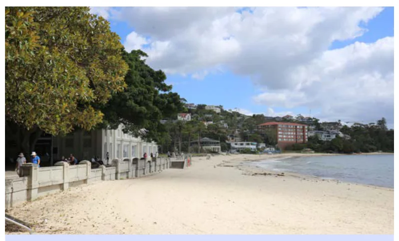

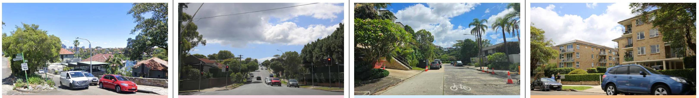

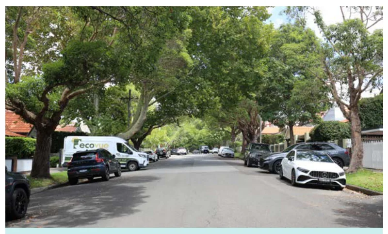

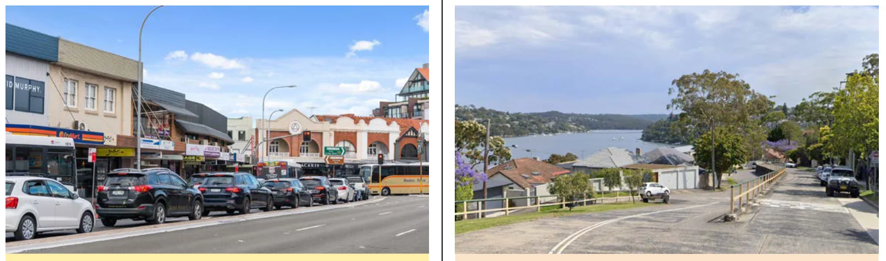

<!-- page 44 -->

40 Mosman Masterplan SJB

### Place understanding

### Amenity and infrastructure

KEY

LGA boundary

Council owned lots

Private schools

Primary schools

High schools

K-12 schools

Community services (police, library, community centre etc.)

Religious facilities (church, mosque, synagogue etc.)

Sporting facilities

Military and government

Environmental conservation areas

Infrastructure (substation, parking lot, bus depot etc.)

Zoo

Open space

Train station

Ferry stop 1:20,000 @ A3

Mosman contains a diverse network of community infrastructure, public open space and environmental assets distributed throughout the LGA. The most significant components include extensive parks and nature reserves, complemented by the suburb’s network of schools and community facilities.

Key findings

— Services and infrastructure are concentrated along the central spine of Military Road, forming a key corridor of services, retail, transport, and community facilities. Amenities not located along this spine are typically positioned along the periphery. — Schools are well distributed across the precinct, with a notably higher number of private/independent schools. — Outside of green open spaces and environmental areas, the precinct lacks a broader mix of community and sporting facilities, particularly in the centre.

Amenity and infrastructure network

M

A C P H

E R S O N

S T R E E T

T E E R T S D R A R E G M I L I T A R Y R O A D

M I L I T A R Y R O A D

S P I T R O A D

BRADLEYS HEAD ROAD

CHOWDER BAY ROAD SHADFORTH STREET SPOFFORTH STREET

MIDDLE HEAD ROAD

MIDDLE HEAD ROAD

MILITARY ROAD

PEARL BAY AVENUE

CABRAMATTA ROAD

SIRIUS COVE ROAD

MANDOLONG ROAD

MUSGRAVE STREET

SOMERSET STREET

ROSEBERY STREET

RANGERS AVENUE

CENTRAL AVENUE

HARBOUR STREET

#### 1801 FORT TRACK

STANLEY AVENUE

CREMORNE LANE

WOLSELEY ROAD

BARDWELL ROAD

MOSMAN STREET

PINDARI AVENUE

BLOXSOME LANE

ALMORA STREET

MUSTON STREET

MEDUSA STREET

THE ESPLANADE

RAGLAN STREET

RAGLAN STREET

GLOVER STREET

MYAHGAH ROAD

MORUBEN ROAD

KARDINIA ROAD

BELMONT ROAD

MORELLA ROAD

QUAKERS ROAD

HORDERN LANE

SPENCER ROAD

STANTON ROAD

KAREELA ROAD

AWABA STREET

JULIAN STREET

QUEEN STREET

KAREELA LANE

REDAN STREET BOTANIC ROAD NOBLE STREET

PARRIWI ROAD

COWLES ROAD

UNION STREET

BICKELL ROAD

BOYLE STREET

LINDSAY LANE

DAVID STREET

AVENUE ROAD SUAKIN DRIVE

DALTON ROAD

MILSON ROAD

VISTA STREET

PARK AVENUE

HOLT AVENUE

BOND STREET

WYONG ROAD

WUNDA ROAD

RUBY STREET

PUNCH LANE

REDAN LANE

ILUKA ROAD

IDA AVENUE

SILEX ROAD

BAY STREET

HALE ROAD

THE GROVE

CREMORNE

MILSONS POINT

CAMMERAY

NORTH SYDNEY

POINT

KURRABA POINT

CREMORNE

CLIFTON GARDEN RESERVE

MIDDLE HEAD

BRADLEYS HEAD

TAROONGA ZOO

August 2026

Attachment 1.1.1 Mosman Council

<!-- page 45 -->

41 Mosman Masterplan SJB

### Place understanding

### Arts and culture

MAG

Curlew Artists’ Camp site

12

11

10

9

8

7

6

5

3

4

2

1

1:20,000 @ A3

Mosman has a long-standing association with visual art, rooted in its harbourside landscape. From the 1880s to 1912, artists’ camps established along the foreshore — most notably Curlew Camp at Little Sirius Cove — became a base for painters including Arthur Streeton and Tom Roberts, whose work there helped define the Heidelberg School and a distinctly Australian landscape tradition in the years before Federation. This early association between the harbourside setting and the development of Australian painting has been described as one of the “sacred sites” of Australian art, and remains legible today through the Curlew Camp Artists’ Walk at Sirius Cove Reserve.

This landscape-derived cultural identity was subsequently institutionalised through Council-led initiatives. The Mosman Art Prize, established in 1947 by Alderman Allan Gamble, is Australia’s oldest local government art award and, as an acquisitive prize, has directly built the Mosman Art Collection over nearly eight decades — from inaugural winner Margaret Olley to contemporary practitioners such as Guan Wei and Michael Zavros. The opening of Mosman Art Gallery in 1998 gave this growing collection a permanent home and public program, consolidating the Gallery as the municipality’s primary cultural institution.

Another significant artists program is Headland Artists, an artistic community overlooking Sydney Harbour at Georges Heights in Mosman. This creative hub features roughly 20 working studios, art schools, and galleries housed in historic military buildings overlooking Sydney Harbour.

Mosman Council has also established a number of public art initiatives that return this collection, and new commissions, to the public realm:

— Mosman Art Trail: a 10km circuit of illustrated signage across the LGA pairing historic paintings from the Collection with their original harbourside vantage points — Sculpture Terrace, Mosman Art Gallery: a curated display of sculptural works including Anne Ferguson’s Italian City, Maddie Gibbs’ Spirit Figures, and Samantha Stephenson’s Nest — Freestanding civic public art: standalone works sited across the suburb, such as Christopher Hodges’ The White Flower at Hunter Park — Curlew Camp Artists’ Walk: a foreshore walking trail and interpretive installation at Sirius Cove Reserve marking the site of the historic artists’ camp — Artist’s residence at Council Depot site on 83 Cowles Rd.

Arts and culture

1. 1 Margaret Preston, Wooden Bridge, 1925 2. Margaret Preston, Mosman Bridge, 1927 3. Elioth Gruner, Taylors Bay, 1913 4. James R. Jackson, Sydney Harbour, 1965 5. Sydney Long, Clifton Gardens, 1905 6. Arthur Streeton, Sydney Harbour, 1895 7. Ethel Carrick Fox, On Balmoral Beach, 1913 8. Albert Henry Fullwood, View from Balmoral, 1885 9. Susan Rothwell, Balmoral Shark Net, c.2008

#### 10.	 Jasper Knight, Spit Bridge Tower, 2015

#### 11.	 Will Ashton, House Boats, The Spit, 1937

#### 12.	 James R. Jackson, The Spit, Sydney, 1935

Maddie Biggs, 2022, Coreten steel, Mosman Art Gallery

Christopher Hodges, The white flower, 2099, sculpture, Mosman Art Gallery

Mosman Art trail illustrated signage at Balmoral

M

A C P H

E R S O N

S T R E E T

T E E R T S D R M I L I T A R Y R O A D

R O A D

S P I T R O A D

BRADLEYS HEAD ROAD

CHOWDER BAY ROAD SHADFORTH STREET SPOFFORTH STREET

MIDDLE HEAD ROAD

MIDDLE HEAD ROAD

MILITARY ROAD

PEARL BAY AVENUE

CABRAMATTA ROAD

SIRIUS COVE ROAD

MANDOLONG ROAD

MUSGRAVE STREET

SOMERSET STREET

ROSEBERY STREET

RANGERS AVENUE

CENTRAL AVENUE

HARBOUR STREET

#### 1801 FORT TRACK

STANLEY AVENUE

CREMORNE LANE

WOLSELEY ROAD

BARDWELL ROAD

MOSMAN STREET

PINDARI AVENUE

BLOXSOME LANE

ALMORA STREET

MUSTON STREET

MEDUSA STREET

THE ESPLANADE

RAGLAN STREET

RAGLAN STREET

GLOVER STREET

MYAHGAH ROAD

MORUBEN ROAD

KARDINIA ROAD

BELMONT ROAD

MORELLA ROAD

QUAKERS ROAD

HORDERN LANE

SPENCER ROAD

STANTON ROAD

KAREELA ROAD

AWABA STREET

JULIAN STREET

QUEEN STREET

KAREELA LANE

REDAN STREET BOTANIC ROAD NOBLE STREET

PARRIWI ROAD

COWLES ROAD

UNION STREET

BICKELL ROAD

BOYLE STREET

LINDSAY LANE

DAVID STREET

AVENUE ROAD SUAKIN DRIVE

DALTON ROAD

N ROAD

VISTA STREET

PARK AVENUE

HOLT AVENUE

BOND STREET

WYONG ROAD

WUNDA ROAD

RUBY STREET

PUNCH LANE

REDAN LANE

ILUKA ROAD

IDA AVENUE

SILEX ROAD

BAY STREET

HALE ROAD

THE GROVE

CREMORNE POINT

CLIFTON GARDEN RESERVE

MIDDLE HEAD

BRADLEYS HEAD

TAROONGA ZOO

August 2026

Attachment 1.1.1 Mosman Council

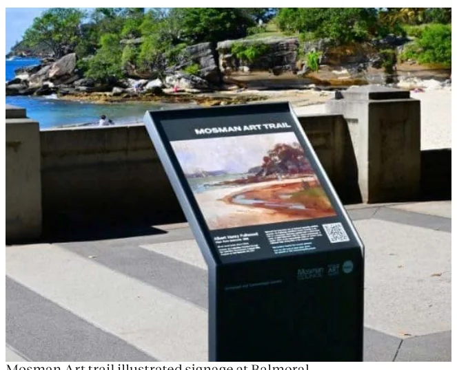

<!-- page 46 -->

42 Mosman Masterplan SJB

### Place understanding

### Built form

KEY

LGA boundary

Proposed HDAs

SSDAs

Approved DAs

Recent development

1.1 - 6m

6 - 11.1m

11.1 - 16.1m

16.1 - 21.1m

21.1 - 26.1m

26.1 - 31.1m

31.1 - 36m

36 - 41m

41 - 46m

Built form over 31.1m

Built form over 36m

Open space

Train station

Ferry stop 1:20,000 @ A3 Built form distribution

Mosman’s built form is characterised by its predominantly low to medium density residential fabric, with higher density development concentrated in selected locations, primarily along the Spit–Military Road corridor. Newer developments are dispersed throughout the area and include a mix of proposed HDA developments, SSDAs, DAs and recently approved DAs.

Key findings

— Higher‑density built form is concentrated around the Spit Junction intersection, enhanced by its accessibility to key transport. — Existing built form Existing built form is generally below 10 storeys (31.1 m) in height, with only two buildings exceeding 12 storeys (36m).

M

A C P H

E R S O N

S T R E E T

T E E R T S D R A R E G M I L I T A R Y R O A D

M I L I T A R Y R O A D

S P I T R O A D

BRADLEYS HEAD ROAD

CHOWDER BAY ROAD SHADFORTH STREET SPOFFORTH STREET

MIDDLE HEAD ROAD

MIDDLE HEAD ROAD

MILITARY ROAD

PEARL BAY AVENUE

CABRAMATTA ROAD

SIRIUS COVE ROAD

MANDOLONG ROAD

MUSGRAVE STREET

SOMERSET STREET

ROSEBERY STREET

RANGERS AVENUE

CENTRAL AVENUE

HARBOUR STREET

#### 1801 FORT TRACK

STANLEY AVENUE

CREMORNE LANE

WOLSELEY ROAD

BARDWELL ROAD

MOSMAN STREET

PINDARI AVENUE

BLOXSOME LANE

ALMORA STREET

MUSTON STREET

MEDUSA STREET

THE ESPLANADE

RAGLAN STREET

RAGLAN STREET

GLOVER STREET

MYAHGAH ROAD

MORUBEN ROAD

KARDINIA ROAD

BELMONT ROAD

MORELLA ROAD

QUAKERS ROAD

HORDERN LANE

SPENCER ROAD

STANTON ROAD

KAREELA ROAD

AWABA STREET

JULIAN STREET

QUEEN STREET

KAREELA LANE

REDAN STREET BOTANIC ROAD NOBLE STREET

PARRIWI ROAD

COWLES ROAD

UNION STREET

BICKELL ROAD

BOYLE STREET

LINDSAY LANE

DAVID STREET

AVENUE ROAD SUAKIN DRIVE

DALTON ROAD

MILSON ROAD

VISTA STREET

PARK AVENUE

HOLT AVENUE

BOND STREET

WYONG ROAD

WUNDA ROAD

RUBY STREET

PUNCH LANE

REDAN LANE

ILUKA ROAD

IDA AVENUE

SILEX ROAD

BAY STREET

HALE ROAD

THE GROVE

CREMORNE

MILSONS POINT

CAMMERAY

NORTH SYDNEY

POINT

KURRABA POINT

CREMORNE

CLIFTON GARDEN RESERVE

MIDDLE HEAD

BRADLEYS HEAD

TAROONGA ZOO

August 2026

Attachment 1.1.1 Mosman Council

<!-- page 47 -->

43 Mosman Masterplan SJB

### Place understanding

### Ecological considerations

KEY

LGA boundary

Biodiversity corridor

Acid sulfate soil area

Category 1 bushfire

Category 2 bushfire

Category 3 bushfire

Category 4 bushfire

Open space

Train station

Ferry stop 1:20,000 @ A3

Mosman is subject to a range of ecological considerations, most notably concentrated along its coastal and bushland edges. Key environmental sensitivities include bushfire prone land, biodiversity corridors, and acid sulfate soil areas.

Key findings

— Mosman’s south-eastern region is significantly affected by bushfire risk, largely due to its extensive natural landscapes. Areas such as Bradleys Head and Clifton Gardens include substantial tracts of category 1 bushfire-prone land. — Among the various ecological considerations, the biodiversity corridor covers the most extensive area with portions extending inland to the central spine and nearby pockets of green spaces. — Acid sulfate soils are predominantly concentrated along Mosman’s northern and north-eastern beachfronts, including areas like Balmoral and Chinamans Beach.

Ecological considerations

M

A C P H

E R S O N

S T R E E T

T E E R T S D R A R E G M I L I T A R Y R O A D

M I L I T A R Y R O A D

S P I T R O A D

BRADLEYS HEAD ROAD

CHOWDER BAY ROAD SHADFORTH STREET SPOFFORTH STREET

MIDDLE HEAD ROAD

MIDDLE HEAD ROAD

MILITARY ROAD

PEARL BAY AVENUE

CABRAMATTA ROAD

SIRIUS COVE ROAD

MANDOLONG ROAD

MUSGRAVE STREET

SOMERSET STREET

ROSEBERY STREET

RANGERS AVENUE

CENTRAL AVENUE

HARBOUR STREET

#### 1801 FORT TRACK

STANLEY AVENUE

CREMORNE LANE

WOLSELEY ROAD

BARDWELL ROAD

MOSMAN STREET

PINDARI AVENUE

BLOXSOME LANE

ALMORA STREET

MUSTON STREET

MEDUSA STREET

THE ESPLANADE

RAGLAN STREET

RAGLAN STREET

GLOVER STREET

MYAHGAH ROAD

MORUBEN ROAD

KARDINIA ROAD

BELMONT ROAD

MORELLA ROAD

QUAKERS ROAD

HORDERN LANE

SPENCER ROAD

STANTON ROAD

KAREELA ROAD

AWABA STREET

JULIAN STREET

QUEEN STREET

KAREELA LANE

REDAN STREET BOTANIC ROAD NOBLE STREET

PARRIWI ROAD

COWLES ROAD

UNION STREET

BICKELL ROAD

BOYLE STREET

LINDSAY LANE

DAVID STREET

AVENUE ROAD SUAKIN DRIVE

DALTON ROAD

MILSON ROAD

VISTA STREET

PARK AVENUE

HOLT AVENUE

BOND STREET

WYONG ROAD

WUNDA ROAD

RUBY STREET

PUNCH LANE

REDAN LANE

ILUKA ROAD

IDA AVENUE

SILEX ROAD

BAY STREET

HALE ROAD

THE GROVE

CREMORNE

MILSONS POINT

CAMMERAY

NORTH SYDNEY

POINT

KURRABA POINT

CREMORNE

CLIFTON GARDEN RESERVE

MIDDLE HEAD

BRADLEYS HEAD

TAROONGA ZOO

August 2026

Attachment 1.1.1 Mosman Council

<!-- page 48 -->

44 Mosman Masterplan SJB

### Place understanding

### Flood-affected areas

KEY

LGA boundary

FPCC 1

FPCC 2

FPCC 3

FPCC 4

Open space

Train station

Ferry stop 1:20,000 @ A3

Mosman Council prepared a flood assessment study in 2025 and is currently in the process of developing the Floodplain Risk Management Study.

A preliminary Flood Planning Constraint Categories (FPCC) mapping has been prepared with the study to help inform land use planning decisions. These categories range from FPCC1, representing areas with the most severe constraints through to FPCC4, which identifies land with minimal flood-related constraints and fewer development limitations

Key findings

— Majority of the preliminary FPCC 1 and 2 land lies within Council reserve or roadway where if any, future development may require risk management strategies. — Land falling mostly within FPCC3 are areas with increased development density is possible, provided that appropriate flood-related development controls are implemented. — Despite these constraints, Mosman retains a considerable amount of land classified as FPCC4 or better indicating areas typically suitable for most types of development with standard planning considerations. further development.

Flood affected areas

M

A C P H

E R S O N

S T R E E T

T E E R T S D R A R E G M I L I T A R Y R O A D

M I L I T A R Y R O A D

S P I T R O A D

BRADLEYS HEAD ROAD

CHOWDER BAY ROAD SHADFORTH STREET SPOFFORTH STREET

MIDDLE HEAD ROAD

MIDDLE HEAD ROAD

MILITARY ROAD

PEARL BAY AVENUE

CABRAMATTA ROAD

SIRIUS COVE ROAD

MANDOLONG ROAD

MUSGRAVE STREET

SOMERSET STREET

ROSEBERY STREET

RANGERS AVENUE

CENTRAL AVENUE

HARBOUR STREET

#### 1801 FORT TRACK

STANLEY AVENUE

CREMORNE LANE

WOLSELEY ROAD

BARDWELL ROAD

MOSMAN STREET

PINDARI AVENUE

BLOXSOME LANE

ALMORA STREET

MUSTON STREET

MEDUSA STREET

THE ESPLANADE

RAGLAN STREET

RAGLAN STREET

GLOVER STREET

MYAHGAH ROAD

MORUBEN ROAD

KARDINIA ROAD

BELMONT ROAD

MORELLA ROAD

QUAKERS ROAD

HORDERN LANE

SPENCER ROAD

STANTON ROAD

KAREELA ROAD

AWABA STREET

JULIAN STREET

QUEEN STREET

KAREELA LANE

REDAN STREET BOTANIC ROAD NOBLE STREET

PARRIWI ROAD

COWLES ROAD

UNION STREET

BICKELL ROAD

BOYLE STREET

LINDSAY LANE

DAVID STREET

AVENUE ROAD SUAKIN DRIVE

DALTON ROAD

MILSON ROAD

VISTA STREET

PARK AVENUE

HOLT AVENUE

BOND STREET

WYONG ROAD

WUNDA ROAD

RUBY STREET

PUNCH LANE

REDAN LANE

ILUKA ROAD

IDA AVENUE

SILEX ROAD

BAY STREET

HALE ROAD

THE GROVE

CREMORNE

MILSONS POINT

CAMMERAY

NORTH SYDNEY

POINT

KURRABA POINT

CREMORNE

CLIFTON GARDEN RESERVE

MIDDLE HEAD

BRADLEYS HEAD

TAROONGA ZOO

August 2026

Attachment 1.1.1 Mosman Council

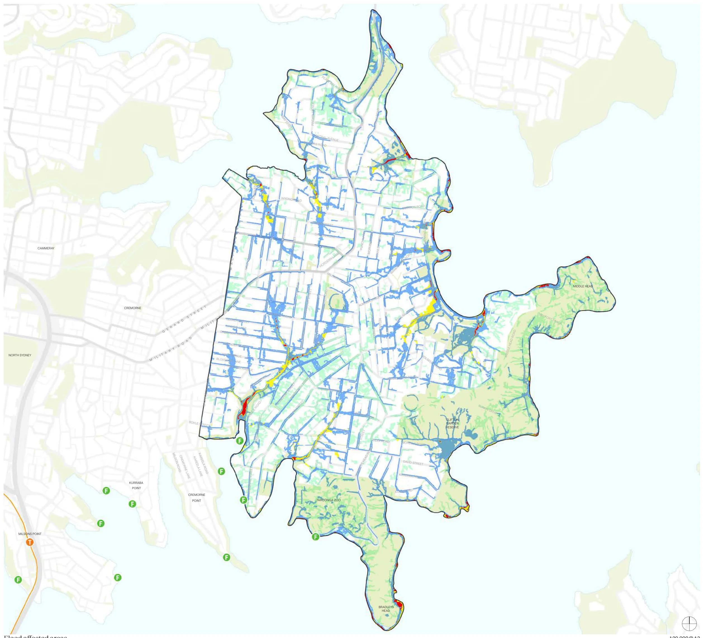

<!-- page 49 -->

45 Mosman Masterplan SJB

### Place understanding

### Ownership - Strata titles

KEY

LGA boundary

Strata titles over 10

2 strata titles

28 strata titles

56 strata titles

84 strata titles

112 strata titles

140 strata titles

Open space

Train station

Ferry stop 1:20,000 @ A3

Mosman contains a range of strata developments that reflect the varied local residential character. The LGA is predominantly low to medium density built forms, resulting in a suburb characterised by single dwellings, smaller apartment buildings and walk‑up flats. Larger developments are relatively rare, in part due to the resistance to new development and the desire to preserve unchanged the Mosman’s established village atmosphere and character.

Key findings

— Strata properties are predominantly concentrated along the Military Road and Spit Road corridor spine, where accessibility and increased zoning provisions on this frontage have supported increased density. — A cluster of strata developments is located along the south‑western edge, extending towards Mosman Bay Wharf. — Much of Mosman falls within the under‑10 lot strata title category, indicating more smaller apartments and flats rather than large scale complexes. — Above 100 strata lots developments are primarily located along the western section of Military Road, extending towards neighbouring suburbs further inland. — Strata developments have an average unit size of 105m² (based on Geoscape data and Strata Hub data).

Strata distribution

M

A C P H

E R S O N

S T R E E T

T E E R T S D R A R E G M I L I T A R Y R O A D

M I L I T A R Y R O A D

S P I T R O A D

BRADLEYS HEAD ROAD

CHOWDER BAY ROAD SHADFORTH STREET SPOFFORTH STREET

MIDDLE HEAD ROAD

MIDDLE HEAD ROAD

MILITARY ROAD

PEARL BAY AVENUE

CABRAMATTA ROAD

SIRIUS COVE ROAD

MANDOLONG ROAD

MUSGRAVE STREET

SOMERSET STREET

ROSEBERY STREET

RANGERS AVENUE

CENTRAL AVENUE

HARBOUR STREET

#### 1801 FORT TRACK

STANLEY AVENUE

CREMORNE LANE

WOLSELEY ROAD

BARDWELL ROAD

MOSMAN STREET

PINDARI AVENUE

BLOXSOME LANE

ALMORA STREET

MUSTON STREET

MEDUSA STREET

THE ESPLANADE

RAGLAN STREET

RAGLAN STREET

GLOVER STREET

MYAHGAH ROAD

MORUBEN ROAD

KARDINIA ROAD

BELMONT ROAD

MORELLA ROAD

QUAKERS ROAD

HORDERN LANE

SPENCER ROAD

STANTON ROAD

KAREELA ROAD

AWABA STREET

JULIAN STREET

QUEEN STREET

KAREELA LANE

REDAN STREET BOTANIC ROAD NOBLE STREET

PARRIWI ROAD

COWLES ROAD

UNION STREET

BICKELL ROAD

BOYLE STREET

LINDSAY LANE

DAVID STREET

AVENUE ROAD SUAKIN DRIVE

DALTON ROAD

MILSON ROAD

VISTA STREET

PARK AVENUE

HOLT AVENUE

BOND STREET

WYONG ROAD

WUNDA ROAD

RUBY STREET

PUNCH LANE

REDAN LANE

ILUKA ROAD

IDA AVENUE

SILEX ROAD

BAY STREET

HALE ROAD

THE GROVE

CREMORNE

MILSONS POINT

CAMMERAY

NORTH SYDNEY

POINT

KURRABA POINT

CREMORNE

CLIFTON GARDEN RESERVE

MIDDLE HEAD

BRADLEYS HEAD

TAROONGA ZOO

August 2026

Attachment 1.1.1 Mosman Council

<!-- page 50 -->

46 Mosman Masterplan SJB

### Place understanding

### Ownership - Large sites

KEY

LGA boundary

Single ownerships

Open space

Train station

Ferry stop 1:8000 @ A3

The diagram opposite identifies larger sites that are known to be in single ownership. Most of these sites are located along the Military and Spit Road corridor.

The ownership pattern is relevant to the masterplan as large lots in single ownership are considered more likely to re develop in the short term and deliver housing and associated public benefits earlier.

Known ownership pattern for larger sites

M

A C P H

E R S O

N

S T R E E T

T E E R

M

I L I T

A R Y

R O

A D

S

MILITARY ROAD

ENUE

CABRAMATTA R

MANDOLONG ROAD

ROSEBERY STREET

CENTRAL AVENUE

HARBOUR STREET

STANLEY AVENUE

ARDWELL ROAD

PINDARI AVENUE

ALMORA STREET

MUSTON STRE

MEDUSA STREET

THE ESPLANADE

RAGLAN STREET

GLOVER STREET

MYAHGAH ROAD

MORUBEN ROAD

BELMONT ROAD

QUAKERS ROAD

STANTON ROAD

AWABA STREET

JULIAN STREET

REDAN STREET BOTANIC ROAD

STREET

PARRIWI ROAD

OWLES ROAD

BICKELL ROAD

LINDSAY LANE

DALTON ROAD

VISTA STREET

BOND STREET

COWLES ROAD

WYONG ROAD

OAD

PUNCH LANE

REDAN LAN

IDA AVENUE

BAY STREET

HALE ROAD THE GROVE

August 2026

Attachment 1.1.1 Mosman Council

<!-- page 51 -->

47 Mosman Masterplan SJB

### Place understanding

### Challenges

Steep terrain creates accessibility issues, discourages walking and cycling, and increases reliance on private vehicles. Steep topographical changes are also a significant architectural challenge for new developments that often have to manage the change via significant shear walls limiting opportunities for positive urban outcomes and passive surveillance. Military Road and Spit Road are the only major arterial routes connecting Mosman to Greater Sydney and Northern Beaches. These corridors are already heavily congested, with limited capacity for additional volume. The spines are a thoroughfare from the Northern beaches to Sydney CBD and most of the vehicular traffic travels through Mosman. Heritage conservation areas cover a large portion of Mosman. Although redevelopment can occur in these areas, it must be sensitively integrated to preserve the area’s historic character and sense of place limiting potential for height and density. Heritage properties are not confined to a single precinct but are scattered across the LGA, often as isolated sites. Heritage items must be fully or partially retained and specific assessment must be carried out before development has given consent. Heritage landscapes, comprising established tree canopy, are scattered across the LGA. In some cases, trees line the full length of the street, forming a defining characteristic, or are within backyards. The need to retain established trees, where possible, may limit development potential on some sites. Strata properties containing more than 10 lots, mainly along Spit Road, may present financial and ownership complexities that constrain redevelopment. Scenic protection zone extends along much of the LGA’s periphery, where development is subject to stringent visual impact controls. Areas outside the public transport catchment have reduced accessibility to public transport services. Bushfire prone

Littoral rainforest area

KEY

LGA boundary

Open space

Train station

Ferry stop

NIELSEN PARK

1:20,000 @ A3 Constraints

M

A C P H

E R S O N

S T R E E T

T E E R T S D R A R E G M I L I T A R Y R O A D

M I L I T A R Y R O A D

S P I T R O A D

BRADLEYS HEAD ROAD

CHOWDER BAY ROAD SHADFORTH STREET SPOFFORTH STREET

MIDDLE HEAD ROAD

MIDDLE HEAD ROAD

MILITARY ROAD

PEARL BAY AVENUE

CABRAMATTA ROAD

SIRIUS COVE ROAD

MANDOLONG ROAD

MUSGRAVE STREET

SOMERSET STREET

ROSEBERY STREET

RANGERS AVENUE

CENTRAL AVENUE

HARBOUR STREET

#### 1801 FORT TRACK

STANLEY AVENUE

CREMORNE LANE

WOLSELEY ROAD

BARDWELL ROAD

MOSMAN STREET

PINDARI AVENUE

BLOXSOME LANE

ALMORA STREET

MUSTON STREET

MEDUSA STREET

THE ESPLANADE

RAGLAN STREET

RAGLAN STREET

GLOVER STREET

MYAHGAH ROAD

MORUBEN ROAD

KARDINIA ROAD

BELMONT ROAD

MORELLA ROAD

QUAKERS ROAD

HORDERN LANE

SPENCER ROAD

STANTON ROAD

KAREELA ROAD

AWABA STREET

JULIAN STREET

QUEEN STREET

KAREELA LANE

REDAN STREET BOTANIC ROAD NOBLE STREET

PARRIWI ROAD

COWLES ROAD

UNION STREET

BICKELL ROAD

BOYLE STREET

LINDSAY LANE

DAVID STREET

AVENUE ROAD SUAKIN DRIVE

DALTON ROAD

MILSON ROAD

VISTA STREET

PARK AVENUE

HOLT AVENUE

BOND STREET

WYONG ROAD

WUNDA ROAD

RUBY STREET

PUNCH LANE

REDAN LANE

ILUKA ROAD

IDA AVENUE

SILEX ROAD

BAY STREET

HALE ROAD

THE GROVE

CREMORNE

MILSONS POINT

CAMMERAY

NORTH SYDNEY

POINT

KURRABA POINT

CREMORNE

CLIFTON GARDEN RESERVE

MIDDLE HEAD

BRADLEYS HEAD

TAROONGA ZOO

August 2026

Attachment 1.1.1 Mosman Council

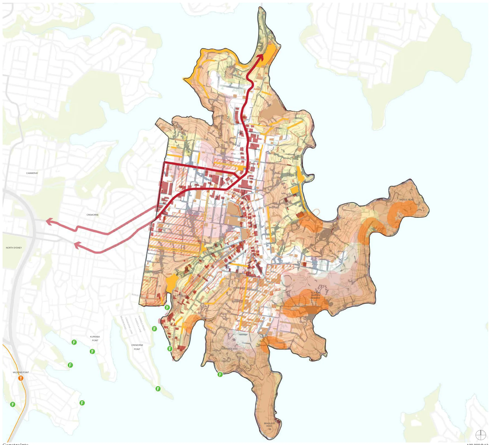

<!-- page 52 -->

48 Mosman Masterplan SJB

### Place understanding

### Opportunities

Frequent bus services along Military Road and Spit Road provide a strong basis for transport-oriented development and future service improvements as the population grows. Beaches and ocean pools offer a distinctive landscape character and lifestyle appeal. These assets present opportunities for integrating green infrastructure and enhancing public realm quality. Sloping terrain enables panoramic harbour views, presenting opportunities for context-responsive height strategies that enhance amenity while respecting local character. Ridgeline plateau zone identifies flatter land with greater potential to accommodate further development. Local residents have access to a diverse range of passive open spaces, such as bushland reserves and waterfront open space. Active open spaces, such as sporting fields and ovals, are well-distributed across the LGA, ensuring convenient access to facilities that support active lifestyles and community interaction. The proposed open space expansion of the Mosman village green will further enhance public amenity in the vicinity of Spit Junction intersection. Gateway intersection catchment highlights high activity areas surrounding key road intersections, providing opportunity for increased density. Local centres corridors provide a benchmark for identifying surrounding opportunity areas. Major opportunity sites highlight key areas for further intensification. Opportunity for increased density in areas along transport corridors due to their higher level of accessibility. Opportunity for increased density in areas along regional open space destinations.

KEY

LGA boundary

Train station

Ferry stop

Active open space

Passive open space

Beach/ocean pool

SSDAs, HDAs, DAs

R3 zone

1:20,000 @ A3 Opportunities

M

A C P H

E R S O N

S T R E E T

T E E R T S D R A R E G M I L I T A R Y R O A D

M I L I T A R Y R O A D

S P I T R O A D

BRADLEYS HEAD ROAD

CHOWDER BAY ROAD SHADFORTH STREET SPOFFORTH STREET

MIDDLE HEAD ROAD

MIDDLE HEAD ROAD

MILITARY ROAD

PEARL BAY AVENUE

CABRAMATTA ROAD

SIRIUS COVE ROAD

MANDOLONG ROAD

MUSGRAVE STREET

SOMERSET STREET

ROSEBERY STREET

RANGERS AVENUE

CENTRAL AVENUE

HARBOUR STREET

#### 1801 FORT TRACK

STANLEY AVENUE

CREMORNE LANE

WOLSELEY ROAD

BARDWELL ROAD

MOSMAN STREET

PINDARI AVENUE

BLOXSOME LANE

ALMORA STREET

MUSTON STREET

MEDUSA STREET

THE ESPLANADE

RAGLAN STREET

RAGLAN STREET

GLOVER STREET

MYAHGAH ROAD

MORUBEN ROAD

KARDINIA ROAD

BELMONT ROAD

MORELLA ROAD

QUAKERS ROAD

HORDERN LANE

SPENCER ROAD

STANTON ROAD

KAREELA ROAD

AWABA STREET

JULIAN STREET

QUEEN STREET

KAREELA LANE

REDAN STREET BOTANIC ROAD NOBLE STREET

PARRIWI ROAD

COWLES ROAD

UNION STREET

BICKELL ROAD

BOYLE STREET

LINDSAY LANE

DAVID STREET

AVENUE ROAD SUAKIN DRIVE

DALTON ROAD

MILSON ROAD

VISTA STREET

PARK AVENUE

HOLT AVENUE

BOND STREET

WYONG ROAD

WUNDA ROAD

RUBY STREET

PUNCH LANE

REDAN LANE

ILUKA ROAD

IDA AVENUE

SILEX ROAD

BAY STREET

HALE ROAD

THE GROVE

CREMORNE

MILSONS POINT

CAMMERAY

NORTH SYDNEY

POINT

KURRABA POINT

CREMORNE

CLIFTON GARDEN RESERVE

MIDDLE HEAD

BRADLEYS HEAD

TAROONGA ZOO

August 2026

Attachment 1.1.1 Mosman Council

<!-- page 53 -->

49 Mosman Masterplan SJB

Site constraints may reduce redevelopment potential to varying degrees, affecting the likelihood of redevelopment within the Masterplan timeframe. While constrained sites remain subject to the Masterplan and any proposed uplift, they are considered unlikely to redevelop.

### Place understanding

### Development constraints

1:20000 @ A3

Unconstrained lots Heritage‑listed properties are subject to statutory controls that limit demolition, alterations and redevelopment, reducing opportunities for site amalgamation and redevelopment uplift. Strata developments with more than 10 lots present significant redevelopment constraints due to multiple owners and potentially reduced redevelopment feasibility.  The time, negotiation and financial alignment required often outweighing the additional development potential. Recent developments are more unlikely to redevelop due to the substantial investment already made, their remaining economic life and limited redevelopment incentive. Community infrastructure is typically in public ownership and/or serves a long-term community function and demand, limiting their potent and suitability for redevelopment. Sites containing biodiversity values, including littoral rainforest, present redevelopment constraints due to the need for biodiversity assessment and site-specific protection measures. Lots affected by flooding, may not be suitable for uplift due to the development restrictions imposed by the required flood strategies or high risk profile. Lots affected by bushfires risk may not be suitable for uplift due to the specification requirements and the limits on available insurances for high risk areas.

KEY

LGA boundary

Low to Mid Rise Housing boundary

400m and 800m catchment

Heritage conservation areas (HCA)

Open space

Train station

Ferry stop Development constraints

M

A C P H

E R S O N

S T R E E T

T E E R T S D R A R E G M I L I T A R Y R O A D

M I L I T A R Y R O A D

S P I T R O A D

BRADLEYS HEAD ROAD

CHOWDER BAY ROAD SHADFORTH STREET SPOFFORTH STREET

MIDDLE HEAD ROAD

MIDDLE HEAD ROAD

MILITARY ROAD

PEARL BAY AVENUE

CABRAMATTA ROAD

SIRIUS COVE ROAD

MANDOLONG ROAD

MUSGRAVE STREET

SOMERSET STREET

ROSEBERY STREET

RANGERS AVENUE

CENTRAL AVENUE

HARBOUR STREET

#### 1801 FORT TRACK

STANLEY AVENUE

CREMORNE LANE

WOLSELEY ROAD

BARDWELL ROAD

MOSMAN STREET

PINDARI AVENUE

BLOXSOME LANE

ALMORA STREET

MUSTON STREET

MEDUSA STREET

THE ESPLANADE

RAGLAN STREET

RAGLAN STREET

GLOVER STREET

MYAHGAH ROAD

MORUBEN ROAD

KARDINIA ROAD

BELMONT ROAD

MORELLA ROAD

QUAKERS ROAD

HORDERN LANE

SPENCER ROAD

STANTON ROAD

KAREELA ROAD

AWABA STREET

JULIAN STREET

QUEEN STREET

KAREELA LANE

REDAN STREET BOTANIC ROAD NOBLE STREET

PARRIWI ROAD

COWLES ROAD

UNION STREET

BICKELL ROAD

BOYLE STREET

LINDSAY LANE

DAVID STREET

AVENUE ROAD SUAKIN DRIVE

DALTON ROAD

MILSON ROAD

VISTA STREET

PARK AVENUE

HOLT AVENUE

BOND STREET

WYONG ROAD

WUNDA ROAD

RUBY STREET

PUNCH LANE

REDAN LANE

ILUKA ROAD

IDA AVENUE

SILEX ROAD

BAY STREET

HALE ROAD

THE GROVE

CREMORNE

MILSONS POINT

CAMMERAY

NORTH SYDNEY

POINT

KURRABA POINT

CREMORNE

CLIFTON GARDEN RESERVE

MIDDLE HEAD

BRADLEYS HEAD

TAROONGA ZOO

August 2026

Attachment 1.1.1 Mosman Council

<!-- page 54 -->

50 Mosman Masterplan SJB

### Place understanding

### Opportunities beyond the Masterplan

NORTH SYDNEY

Y A W E E R F H A G N I R R A W

W A R RI

NGAH FREEW

AY

MACPHERSON S T

REET

EAS

TERN VAL L E Y W A Y

SAILO R

S BAY ROA D

T

EDINBURGH ROAD

Y A W H G I H C I F I C A P

E V I R D K C O R T A L F

D A O R H A B M I R U O

D A O R Y

T E E R T S D R A R E G

D A O R D Y O B N E B

FALCON STREET

T E E R T S T S E N R E

MILLER S T R E E T

MILLER STREET

BROOK STRE

ET

MILIT A RY R O A D

MILITAR Y R OAD

T E E R T S H G I H

ALPHA ROAD

D A O R T I P S

SP I T R O A D

BALGOWLAH HEIGHTS

S

CREMORNE POINT LAVENDER BAY

KURRABA POINT

NEUTRAL BAY

MILSONS POINT

NORTH SYDNEY

WS T

NORTHBRIDGE

CREMORNE

CAMMERAY

KIRRIBILLI

CLONTARF

MOSMAN

M

A C P H

E R S O N

S T R E E T

T E E R T S D R A R E G M I L I T A R Y R O A D

M I L I T A R Y R O A D

BRADLEYS HEAD ROAD

CHOWDER BAY ROAD SHADFORTH STREET SPOFFORTH STREET

MIDDLE HEAD ROAD

MIDDLE HEAD ROAD

MILITARY ROAD

PEARL BAY AVENUE

CABRAMATTA ROAD

SIRIUS COVE ROAD

MANDOLONG ROAD

MUSGRAVE STREET

SOMERSET STREET

ROSEBERY STREET

RANGERS AVENUE

CENTRAL AVENUE

HARBOUR STREET

#### 1801 FORT TRACK

STANLEY AVENUE

CREMORNE LANE

WOLSELEY ROAD

BARDWELL ROAD

MOSMAN STREET

PINDARI AVENUE

BLOXSOME LANE

ALMORA STREET

MUSTON STREET

MEDUSA STREET

THE ESPLANADE

RAGLAN STREET

RAGLAN STREET

GLOVER STREET

MYAHGAH ROAD

MORUBEN ROAD

KARDINIA ROAD

BELMONT ROAD

MORELLA ROAD

QUAKERS ROAD

HORDERN LANE

SPENCER ROAD

STANTON ROAD

KAREELA ROAD

AWABA STREET

JULIAN STREET

QUEEN STREET

KAREELA LANE

REDAN STREET BOTANIC ROAD NOBLE STREET

PARRIWI ROAD

COWLES ROAD

UNION STREET

BICKELL ROAD

BOYLE STREET

LINDSAY LANE

DAVID STREET

AVENUE ROAD SUAKIN DRIVE

DALTON ROAD

MILSON ROAD

VISTA STREET

PARK AVENUE

HOLT AVENUE

BOND STREET

WYONG ROAD

WUNDA ROAD

RUBY STREET

PUNCH LANE

REDAN LANE

ILUKA ROAD

IDA AVENUE

SILEX ROAD

BAY STREET

HALE ROAD

THE GROVE

CREMORNE NORTH SYDNEY

MILSONS POINT

LAVENDER BAY

VICTORIA CROSS METRO

CAMMERAY

NORTH SYDNEY

T

POINT

KURRABA POINT

CREMORNE

CLIFTON GARDEN RESERVE

MIDDLE HEAD

BRADLEYS HEAD

TAROONGA ZOO

1:20,000 @ A3 Beyond the masterplan

KEY

LGA boundary

Beaches Link Tunnel

Metro line

Military Road and Spit Road

Western Harbour Tunnel

Warringah Freeway Upgrades

Open space

Major infrastructure and city-shaping projects represent long- term aspirations that extend beyond the timeframe and scope of the Mosman Masterplan, but have the potential to significantly reshape movement, accessibility, and public domain outcomes within Mosman.

Beaches Link tunnel One of the most significant of these projects is the Beaches Link tunnel. Although this project has been discussed in the public domain for many years and has more recently been removed from the State Government’s infrastructure agenda, its delivery would have the potential to substantially reduce traffic volumes along Military Road which currently operates as a constrained and congested corridor, carrying both local and through-traffic movements. By diverting through-traffic away from Military Road, the tunnel could enable a reconsideration of the corridor’s future role, function and public domain character..

The Beaches Link tunnel project is not within the direct control of Council or the Mosman Masterplan. However, advocacy for its future consideration and delivery forms an important part of the broader strategic planning process.

August 2026

Attachment 1.1.1 Mosman Council

<!-- page 55 -->

## Masterplan principles and drivers

## 4

August 2026

Attachment 1.1.1 Mosman Council

<!-- page 56 -->

Mosman Masterplan 52 SJB

Design principles

To ensure the masterplan remains grounded in Mosman’s specific context while still providing a clear and defensible basis for change, eight design principles have been established as guiding lenses for decision‑making:

— Protect and enhance valued character — Celebrate heritage — Protect local amenity and liveability — Bring the community on the journey — Protect the environment — Advocate for community needs and infrastructure — Leverage value to deliver opportunities for all — Plan for diverse and affordable housing

Together, these principles capture the “non‑transactional” dimensions of place, identity, coherence, social and environmental outcomes, and lived experience, that are often missing from a purely desktop approach, and they ensure the masterplan shapes growth in a way that is context‑responsive, locally legitimate, and implementable.

Masterplan drivers

Masterplan drivers have been developed to guide decision on how growth is accommodated in a way that is tailored to Mosman and that is consistent with the eight masterplan principles. These drivers provide a clear basis for decision about how and where growth should occur, so that change supports strong, well-functioning centres while maintaining Mosman’s distinctive character and providing high-quality places to live.

### Provide a legible and gradual

### height transition

### Protect local amenity and

### liveability

### Minimise Impact on Heritage

### items

### Celebrate heritage

### Strengthen and include local

### centres

### Bring the community on the

### journey

### Protect mature trees, especially

### street trees

### Leverage value to deliver

### opportunities for all

### Safeguard the scenic protection

### area

### Plan for diverse and affordable

### housing

### Protect heritage conservation

### areas

### Protect and enhance the valued

### character

### Prioritise housing near public

### transport and services

### Protect the environment

### Plan strategically for long-term

### community needs

### Advocate for community needs

### and infrastructure

## $

### Masterplan principles and drivers

### Design principles and masterplan drivers

### DESIGN PRINCIPLES

### MASTERPLAN DRIVERS

August 2026

Attachment 1.1.1 Mosman Council

<!-- page 57 -->

Mosman Masterplan 53 SJB

### Protect and enhance the valued character

The masterplan will retain and strengthen the distinctive qualities of Mosman’s character – from the village atmosphere, streets and buildings to heritage, landscape, public views, how people move around, and environmental considerations. New development should reinforce, not dilute, local identity through context-led design.

### Celebrate heritage

The masterplan will direct growth toward areas with a demonstrated capacity for change, while preserving heritage significance through appropriate curtilage, setting and visual relationships, including controls for setbacks, height transition, and interface design where higher density occurs nearby.

### Protect local amenity and liveability

The masterplan will safeguard public and private amenity by managing key impacts such as overlooking, overshadowing, wind, traffic, noise, and loss of tree canopy.

### Bring the community on the journey

Analyse community feedback and submissions received during the community consultation phase and ensure the masterplan responds to it.

### Protect the environment

Mosman’s environmental assets are foundational to its identity and liveability. The masterplan will protect and enhance sensitive landscapes and set strong environmental standards for new development.

### Advocate for community needs and

### infrastructure

The masterplan will be informed by integrated community, transport and infrastructure planning aligned to projected growth. It will address local transport capacity, traffic congestion, and infrastructure needs, while ensuring growth respects local character and is supported by timely investment and delivery of this infrastructure so growth supports genuine community benefit.

### Leverage value to deliver opportunities for

### all

By capturing a share of the value created through increased development potential, the masterplan will reinvest this uplift into essential community outcomes – such as new open spaces, local infrastructure, and affordable housing.

### Plan for diverse and affordable housing

Support the delivery of a diverse range of housing types and tenures to meet the needs of current and future residents, including families, young people, older people and key workers. Encourage housing choice, affordability and adaptability through a mix of dwelling types, with convenient access to services, transport, open space and employment.

## $

Each design principle is further elaborated upon within the context of Mosman and overarching intent of the Masterplan.

The Masterplan drivers are also expanded upon in the following pages, accompanied by diagrams that illustrate the potential spatial implications of each driver.

### Masterplan principles and drivers

August 2026

Attachment 1.1.1 Mosman Council

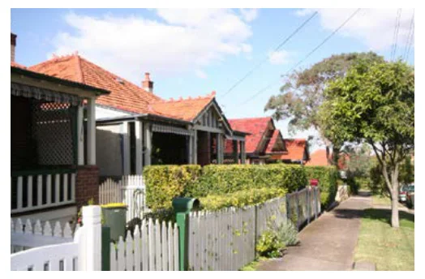

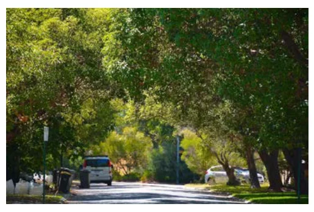

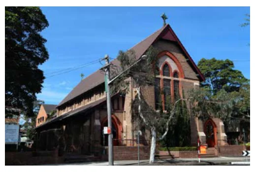

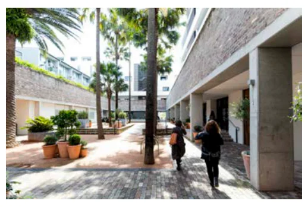

<!-- page 58 -->

Mosman Masterplan 54 SJB

### Prioritise housing near public transport and

### services

Objective:

Concentrate higher‑density housing in the most accessible locations by focusing growth within walking distance of public transport and local services, particularly along the Military and Spit Road corridor and at Spit Junction.

Relevant principles:

### Protect local

### amenity and

### liveability

### Advocate for

### community needs

### and infrastructure

### Masterplan principles and drivers

1:20000 @ A3

KEY

LGA boundary

Frequent bus service

Local centre

200m catchment to frequent service bus stops

200m catchment to ferry stops

Open space

Train station

Ferry stop

Bus stop

### Masterplan drivers

M

A C P H

E R S O N

S T R E E T

T E E R T S D R A R E G M I L I T A R Y R O A D

M I L I T A R Y R O A D

S P I T R O A D

BRADLEYS HEAD ROAD

CHOWDER BAY ROAD SHADFORTH STREET SPOFFORTH STREET

MIDDLE HEAD ROAD

MIDDLE HEAD ROAD

MILITARY ROAD

PEARL BAY AVENUE

CABRAMATTA ROAD

SIRIUS COVE ROAD

MANDOLONG ROAD

MUSGRAVE STREET

SOMERSET STREET

ROSEBERY STREET

RANGERS AVENUE

CENTRAL AVENUE

HARBOUR STREET

#### 1801 FORT TRACK

STANLEY AVENUE

CREMORNE LANE

WOLSELEY ROAD

BARDWELL ROAD

MOSMAN STREET

PINDARI AVENUE

BLOXSOME LANE

ALMORA STREET

MUSTON STREET

MEDUSA STREET

THE ESPLANADE

RAGLAN STREET

RAGLAN STREET

GLOVER STREET

MYAHGAH ROAD

MORUBEN ROAD

KARDINIA ROAD

BELMONT ROAD

MORELLA ROAD

QUAKERS ROAD

HORDERN LANE

SPENCER ROAD

STANTON ROAD

KAREELA ROAD

AWABA STREET

JULIAN STREET

QUEEN STREET

KAREELA LANE

REDAN STREET BOTANIC ROAD NOBLE STREET

PARRIWI ROAD

COWLES ROAD

UNION STREET

BICKELL ROAD

BOYLE STREET

LINDSAY LANE

DAVID STREET

AVENUE ROAD SUAKIN DRIVE

DALTON ROAD

MILSON ROAD

VISTA STREET

PARK AVENUE

HOLT AVENUE

BOND STREET

WYONG ROAD

WUNDA ROAD

RUBY STREET

PUNCH LANE

REDAN LANE

ILUKA ROAD

IDA AVENUE

SILEX ROAD

BAY STREET

HALE ROAD

THE GROVE

CREMORNE

MILSONS POINT

CAMMERAY

NORTH SYDNEY

POINT

KURRABA POINT

CREMORNE

CLIFTON GARDEN RESERVE

MIDDLE HEAD

BRADLEYS HEAD

TAROONGA ZOO

August 2026

Attachment 1.1.1 Mosman Council

<!-- page 59 -->

Mosman Masterplan 55 SJB

### Plan strategically for long-term community

### needs

Objective:

Make sure growth is supported by the right infrastructure as the population changes by planning for open space, facilities, pedestrian links, and local services, and by securing feasible public benefits alongside any extra density.

Relevant principles:

### Advocate for

### community needs

### and infrastructure

## $

### Leverage value

### to deliver

### opportunities for

### all

### Masterplan principles and drivers

1:20000 @ A3

KEY

LGA boundary

Primary school

High school

Private schools

800m catchment from primary schools

Open space

Train station

Ferry stop

### Masterplan drivers

M

A C P H

E R S O N

S T R E E T

T E E R T S D R A R E G M I L I T A R Y R O A D

M I L I T A R Y R O A D

S P I T R O A D

BRADLEYS HEAD ROAD

CHOWDER BAY ROAD SHADFORTH STREET SPOFFORTH STREET

MIDDLE HEAD ROAD

MIDDLE HEAD ROAD

MILITARY ROAD

PEARL BAY AVENUE

CABRAMATTA ROAD

SIRIUS COVE ROAD

MANDOLONG ROAD

MUSGRAVE STREET

SOMERSET STREET

ROSEBERY STREET

RANGERS AVENUE

CENTRAL AVENUE

HARBOUR STREET

#### 1801 FORT TRACK

STANLEY AVENUE

CREMORNE LANE

WOLSELEY ROAD

BARDWELL ROAD

MOSMAN STREET

PINDARI AVENUE

BLOXSOME LANE

ALMORA STREET

MUSTON STREET

MEDUSA STREET

THE ESPLANADE

RAGLAN STREET

RAGLAN STREET

GLOVER STREET

MYAHGAH ROAD

MORUBEN ROAD

KARDINIA ROAD

BELMONT ROAD

MORELLA ROAD

QUAKERS ROAD

HORDERN LANE

SPENCER ROAD

STANTON ROAD

KAREELA ROAD

AWABA STREET

JULIAN STREET

QUEEN STREET

KAREELA LANE

REDAN STREET BOTANIC ROAD NOBLE STREET

PARRIWI ROAD

COWLES ROAD

UNION STREET

BICKELL ROAD

BOYLE STREET

LINDSAY LANE

DAVID STREET

AVENUE ROAD SUAKIN DRIVE

DALTON ROAD

MILSON ROAD

VISTA STREET

PARK AVENUE

HOLT AVENUE

BOND STREET

WYONG ROAD

WUNDA ROAD

RUBY STREET

PUNCH LANE

REDAN LANE

ILUKA ROAD

IDA AVENUE

SILEX ROAD

BAY STREET

HALE ROAD

THE GROVE

CREMORNE

MILSONS POINT

CAMMERAY

NORTH SYDNEY

POINT

KURRABA POINT

CREMORNE

CLIFTON GARDEN RESERVE

MIDDLE HEAD

BRADLEYS HEAD

TAROONGA ZOO

August 2026

Attachment 1.1.1 Mosman Council

<!-- page 60 -->

Mosman Masterplan 56 SJB

### Safeguard the scenic protection area

Objective:

Relocate dwelling yield from within the scenic protection area to places that are better suited to change to recognise and protect the natural and visual environment of Mosman and Sydney Harbour and reinforce the dominance of landscape over built form within the scenic protection area.

Relevant principles:

### Protect and

### enhance the

### valued character

### Masterplan principles and drivers

1:20000 @ A3

KEY

LGA boundary

Scenic protection zone

Open space

Train station

Ferry stop

### Masterplan drivers

M

A C P H

E R S O N

S T R E E T

T E E R T S D R A R E G M I L I T A R Y R O A D

M I L I T A R Y R O A D

S P I T R O A D

BRADLEYS HEAD ROAD

CHOWDER BAY ROAD SHADFORTH STREET SPOFFORTH STREET

MIDDLE HEAD ROAD

MIDDLE HEAD ROAD

MILITARY ROAD

PEARL BAY AVENUE

CABRAMATTA ROAD

SIRIUS COVE ROAD

MANDOLONG ROAD

MUSGRAVE STREET

SOMERSET STREET

ROSEBERY STREET

RANGERS AVENUE

CENTRAL AVENUE

HARBOUR STREET

#### 1801 FORT TRACK

STANLEY AVENUE

CREMORNE LANE

WOLSELEY ROAD

BARDWELL ROAD

MOSMAN STREET

PINDARI AVENUE

BLOXSOME LANE

ALMORA STREET

MUSTON STREET

MEDUSA STREET

THE ESPLANADE

RAGLAN STREET

RAGLAN STREET

GLOVER STREET

MYAHGAH ROAD

MORUBEN ROAD

KARDINIA ROAD

BELMONT ROAD

MORELLA ROAD

QUAKERS ROAD

HORDERN LANE

SPENCER ROAD

STANTON ROAD

KAREELA ROAD

AWABA STREET

JULIAN STREET

QUEEN STREET

KAREELA LANE

REDAN STREET BOTANIC ROAD NOBLE STREET

PARRIWI ROAD

COWLES ROAD

UNION STREET

BICKELL ROAD

BOYLE STREET

LINDSAY LANE

DAVID STREET

AVENUE ROAD SUAKIN DRIVE

DALTON ROAD

MILSON ROAD

VISTA STREET

PARK AVENUE

HOLT AVENUE

BOND STREET

WYONG ROAD

WUNDA ROAD

RUBY STREET

PUNCH LANE

REDAN LANE

ILUKA ROAD

IDA AVENUE

SILEX ROAD

BAY STREET

HALE ROAD

THE GROVE

CREMORNE

MILSONS POINT

CAMMERAY

NORTH SYDNEY

POINT

KURRABA POINT

CREMORNE

CLIFTON GARDEN RESERVE

MIDDLE HEAD

BRADLEYS HEAD

TAROONGA ZOO

August 2026

Attachment 1.1.1 Mosman Council

<!-- page 61 -->

Mosman Masterplan 57 SJB

### Provide a gradual height transition

Objective:

Ensure building heights transition smoothly from areas of change to areas of limited or no change by concentrating additional height in the local centre and applying clear transition rules.

Relevant principles:

### Protect local

### amenity and

### liveability

### Celebrate

### heritage

### Plan for diverse

### and affordable

### housing

### Masterplan principles and drivers

1:20000 @ A3

KEY

LGA boundary

Transition areas

Existing R3 land

Major opportunity sites

Gateway intersections

Open space

Train station

Ferry stop

### Masterplan drivers

M

A C P H

E R S O N

S T R E E T

T E E R T S D R A R E G M I L I T A R Y R O A D

M I L I T A R Y R O A D

S P I T R O A D

BRADLEYS HEAD ROAD

CHOWDER BAY ROAD SHADFORTH STREET SPOFFORTH STREET

MIDDLE HEAD ROAD

MIDDLE HEAD ROAD

MILITARY ROAD

PEARL BAY AVENUE

CABRAMATTA ROAD

SIRIUS COVE ROAD

MANDOLONG ROAD

MUSGRAVE STREET

SOMERSET STREET

ROSEBERY STREET

RANGERS AVENUE

CENTRAL AVENUE

HARBOUR STREET

#### 1801 FORT TRACK

STANLEY AVENUE

CREMORNE LANE

WOLSELEY ROAD

BARDWELL ROAD

MOSMAN STREET

PINDARI AVENUE

BLOXSOME LANE

ALMORA STREET

MUSTON STREET

MEDUSA STREET

THE ESPLANADE

RAGLAN STREET

RAGLAN STREET

GLOVER STREET

MYAHGAH ROAD

MORUBEN ROAD

KARDINIA ROAD

BELMONT ROAD

MORELLA ROAD

QUAKERS ROAD

HORDERN LANE

SPENCER ROAD

STANTON ROAD

KAREELA ROAD

AWABA STREET

JULIAN STREET

QUEEN STREET

KAREELA LANE

REDAN STREET BOTANIC ROAD NOBLE STREET

PARRIWI ROAD

COWLES ROAD

UNION STREET

BICKELL ROAD

BOYLE STREET

LINDSAY LANE

DAVID STREET

AVENUE ROAD SUAKIN DRIVE

DALTON ROAD

MILSON ROAD

VISTA STREET

PARK AVENUE

HOLT AVENUE

BOND STREET

WYONG ROAD

WUNDA ROAD

RUBY STREET

PUNCH LANE

REDAN LANE

ILUKA ROAD

IDA AVENUE

SILEX ROAD

BAY STREET

HALE ROAD

THE GROVE

CREMORNE

MILSONS POINT

CAMMERAY

NORTH SYDNEY

POINT

KURRABA POINT

CREMORNE

CLIFTON GARDEN RESERVE

MIDDLE HEAD

BRADLEYS HEAD

TAROONGA ZOO

August 2026

Attachment 1.1.1 Mosman Council

<!-- page 62 -->

Mosman Masterplan 58 SJB

### Protect heritage conservation areas

Objective:

Relocate dwelling yield from heritage conservation areas to places that are better suited to change (e.g., near centres, along transit corridors) and can accommodate additional height with acceptable urban design outcomes.

Relevant principles:

### Protect and

### enhance the

### valued character

### Celebrate

### heritage

### Masterplan principles and drivers

### Masterplan drivers

1:20000 @ A3

KEY

LGA boundary

Heritage conservation areas (HCA) HCA buffer zones: reduced height to mitigate transition and impacts Open space

Train station

Ferry stop

M

A C P H

E R S O N

S T R E E T

T E E R T S D R A R E G M I L I T A R Y R O A D

M I L I T A R Y R O A D

S P I T R O A D

BRADLEYS HEAD ROAD

CHOWDER BAY ROAD SHADFORTH STREET SPOFFORTH STREET

MIDDLE HEAD ROAD

MIDDLE HEAD ROAD

MILITARY ROAD

PEARL BAY AVENUE

CABRAMATTA ROAD

SIRIUS COVE ROAD

MANDOLONG ROAD

MUSGRAVE STREET

SOMERSET STREET

ROSEBERY STREET

RANGERS AVENUE

CENTRAL AVENUE

HARBOUR STREET

#### 1801 FORT TRACK

STANLEY AVENUE

CREMORNE LANE

WOLSELEY ROAD

BARDWELL ROAD

MOSMAN STREET

PINDARI AVENUE

BLOXSOME LANE

ALMORA STREET

MUSTON STREET

MEDUSA STREET

THE ESPLANADE

RAGLAN STREET

RAGLAN STREET

GLOVER STREET

MYAHGAH ROAD

MORUBEN ROAD

KARDINIA ROAD

BELMONT ROAD

MORELLA ROAD

QUAKERS ROAD

HORDERN LANE

SPENCER ROAD

STANTON ROAD

KAREELA ROAD

AWABA STREET

JULIAN STREET

QUEEN STREET

KAREELA LANE

REDAN STREET BOTANIC ROAD NOBLE STREET

PARRIWI ROAD

COWLES ROAD

UNION STREET

BICKELL ROAD

BOYLE STREET

LINDSAY LANE

DAVID STREET

AVENUE ROAD SUAKIN DRIVE

DALTON ROAD

MILSON ROAD

VISTA STREET

PARK AVENUE

HOLT AVENUE

BOND STREET

WYONG ROAD

WUNDA ROAD

RUBY STREET

PUNCH LANE

REDAN LANE

ILUKA ROAD

IDA AVENUE

SILEX ROAD

BAY STREET

HALE ROAD

THE GROVE

CREMORNE

MILSONS POINT

CAMMERAY

NORTH SYDNEY

POINT

KURRABA POINT

CREMORNE

CLIFTON GARDEN RESERVE

MIDDLE HEAD

BRADLEYS HEAD

TAROONGA ZOO

August 2026

Attachment 1.1.1 Mosman Council

<!-- page 63 -->

Mosman Masterplan 59 SJB

### Minimise impact on heritage items

Objective:

New buildings next to heritage items should fit in and protect what makes those items special. The masterplan will do this by developing built form controls to ensure new development doesn’t overwhelm the heritage item or its setting.

Relevant principles:

### Celebrate

### heritage

### Masterplan principles and drivers

1:20000 @ A3

KEY

LGA boundary

Heritage items

Curtilage zone

Cluster

Open space

Train station

Ferry stop

### Masterplan drivers

M

A C P H

E R S O N

S T R E E T

T E E R T S D R A R E G M I L I T A R Y R O A D

M I L I T A R Y R O A D

S P I T R O A D

BRADLEYS HEAD ROAD

CHOWDER BAY ROAD SHADFORTH STREET SPOFFORTH STREET

MIDDLE HEAD ROAD

MIDDLE HEAD ROAD

MILITARY ROAD

PEARL BAY AVENUE

CABRAMATTA ROAD

SIRIUS COVE ROAD

MANDOLONG ROAD

MUSGRAVE STREET

SOMERSET STREET

ROSEBERY STREET

RANGERS AVENUE

CENTRAL AVENUE

HARBOUR STREET

#### 1801 FORT TRACK

STANLEY AVENUE

CREMORNE LANE

WOLSELEY ROAD

BARDWELL ROAD

MOSMAN STREET

PINDARI AVENUE

BLOXSOME LANE

ALMORA STREET

MUSTON STREET

MEDUSA STREET

THE ESPLANADE

RAGLAN STREET

RAGLAN STREET

GLOVER STREET

MYAHGAH ROAD

MORUBEN ROAD

KARDINIA ROAD

BELMONT ROAD

MORELLA ROAD

QUAKERS ROAD

HORDERN LANE

SPENCER ROAD

STANTON ROAD

KAREELA ROAD

AWABA STREET

JULIAN STREET

QUEEN STREET

KAREELA LANE

REDAN STREET BOTANIC ROAD NOBLE STREET

PARRIWI ROAD

COWLES ROAD

UNION STREET

BICKELL ROAD

BOYLE STREET

LINDSAY LANE

DAVID STREET

AVENUE ROAD SUAKIN DRIVE

DALTON ROAD

MILSON ROAD

VISTA STREET

PARK AVENUE

HOLT AVENUE

BOND STREET

WYONG ROAD

WUNDA ROAD

RUBY STREET

PUNCH LANE

REDAN LANE

ILUKA ROAD

IDA AVENUE

SILEX ROAD

BAY STREET

HALE ROAD

THE GROVE

CREMORNE

MILSONS POINT

CAMMERAY

NORTH SYDNEY

POINT

KURRABA POINT

CREMORNE

CLIFTON GARDEN RESERVE

MIDDLE HEAD

BRADLEYS HEAD

TAROONGA ZOO

August 2026

Attachment 1.1.1 Mosman Council

<!-- page 64 -->

Mosman Masterplan 60 SJB

### Protect mature trees, especially street trees

Objective:

Protect and enhance Mosman’s leafy character by minimising loss of mature canopy trees including through building controls (such as larger front and side setbacks) and by excluding streets with heritage-listed trees.

Relevant principles:

### Protect the

### environment

### Masterplan principles and drivers

1:20000 @ A3

KEY

LGA boundary

Heritage listed trees

Setback zone

Open space

Train station

Ferry stop

### Masterplan drivers

M

A C P H

E R S O N

S T R E E T

T E E R T S D R A R E G M I L I T A R Y R O A D

M I L I T A R Y R O A D

S P I T R O A D

BRADLEYS HEAD ROAD

CHOWDER BAY ROAD SHADFORTH STREET SPOFFORTH STREET

MIDDLE HEAD ROAD

MIDDLE HEAD ROAD

MILITARY ROAD

PEARL BAY AVENUE

CABRAMATTA ROAD

SIRIUS COVE ROAD

MANDOLONG ROAD

MUSGRAVE STREET

SOMERSET STREET

ROSEBERY STREET

RANGERS AVENUE

CENTRAL AVENUE

HARBOUR STREET

#### 1801 FORT TRACK

STANLEY AVENUE

CREMORNE LANE

WOLSELEY ROAD

BARDWELL ROAD

MOSMAN STREET

PINDARI AVENUE

BLOXSOME LANE

ALMORA STREET

MUSTON STREET

MEDUSA STREET

THE ESPLANADE

RAGLAN STREET

RAGLAN STREET

GLOVER STREET

MYAHGAH ROAD

MORUBEN ROAD

KARDINIA ROAD

BELMONT ROAD

MORELLA ROAD

QUAKERS ROAD

HORDERN LANE

SPENCER ROAD

STANTON ROAD

KAREELA ROAD

AWABA STREET

JULIAN STREET

QUEEN STREET

KAREELA LANE

REDAN STREET BOTANIC ROAD NOBLE STREET

PARRIWI ROAD

COWLES ROAD

UNION STREET

BICKELL ROAD

BOYLE STREET

LINDSAY LANE

DAVID STREET

AVENUE ROAD SUAKIN DRIVE

DALTON ROAD

MILSON ROAD

VISTA STREET

PARK AVENUE

HOLT AVENUE

BOND STREET

WYONG ROAD

WUNDA ROAD

RUBY STREET

PUNCH LANE

REDAN LANE

ILUKA ROAD

IDA AVENUE

SILEX ROAD

BAY STREET

HALE ROAD

THE GROVE

CREMORNE

MILSONS POINT

CAMMERAY

NORTH SYDNEY

POINT

KURRABA POINT

CREMORNE

CLIFTON GARDEN RESERVE

MIDDLE HEAD

BRADLEYS HEAD

TAROONGA ZOO

August 2026

Attachment 1.1.1 Mosman Council

<!-- page 65 -->

Mosman Masterplan 61 SJB

### Strengthen and include local centres

Objective:

To focus renewal and extra growth in local centres, where services already exist and to boost business activity and mixed use, replace tired low‑scale buildings with high‑quality development, and require a strong design standard.

Relevant principles:

## $

### Leverage value

### to deliver

### opportunities for all

### Masterplan principles and drivers

1:20000 @ A3

KEY

LGA boundary

E1/E3 zones

Intensification corridor

Open space

Train station

Ferry stop

### Masterplan drivers

M

A C P H

E R S O N

S T R E E T

T E E R T S D R A R E G M I L I T A R Y R O A D

M I L I T A R Y R O A D

S P I T R O A D

BRADLEYS HEAD ROAD

CHOWDER BAY ROAD SHADFORTH STREET SPOFFORTH STREET

MIDDLE HEAD ROAD

MIDDLE HEAD ROAD

MILITARY ROAD

PEARL BAY AVENUE

CABRAMATTA ROAD

SIRIUS COVE ROAD

MANDOLONG ROAD

MUSGRAVE STREET

SOMERSET STREET

ROSEBERY STREET

RANGERS AVENUE

CENTRAL AVENUE

HARBOUR STREET

#### 1801 FORT TRACK

STANLEY AVENUE

CREMORNE LANE

WOLSELEY ROAD

BARDWELL ROAD

MOSMAN STREET

PINDARI AVENUE

BLOXSOME LANE

ALMORA STREET

MUSTON STREET

MEDUSA STREET

THE ESPLANADE

RAGLAN STREET

RAGLAN STREET

GLOVER STREET

MYAHGAH ROAD

MORUBEN ROAD

KARDINIA ROAD

BELMONT ROAD

MORELLA ROAD

QUAKERS ROAD

HORDERN LANE

SPENCER ROAD

STANTON ROAD

KAREELA ROAD

AWABA STREET

JULIAN STREET

QUEEN STREET

KAREELA LANE

REDAN STREET BOTANIC ROAD NOBLE STREET

PARRIWI ROAD

COWLES ROAD

UNION STREET

BICKELL ROAD

BOYLE STREET

LINDSAY LANE

DAVID STREET

AVENUE ROAD SUAKIN DRIVE

DALTON ROAD

MILSON ROAD

VISTA STREET

PARK AVENUE

HOLT AVENUE

BOND STREET

WYONG ROAD

WUNDA ROAD

RUBY STREET

PUNCH LANE

REDAN LANE

ILUKA ROAD

IDA AVENUE

SILEX ROAD

BAY STREET

HALE ROAD

THE GROVE

CREMORNE

MILSONS POINT

CAMMERAY

NORTH SYDNEY

POINT

KURRABA POINT

CREMORNE

CLIFTON GARDEN RESERVE

MIDDLE HEAD

BRADLEYS HEAD

TAROONGA ZOO

August 2026

Attachment 1.1.1 Mosman Council

<!-- page 66 -->

## 5

## Application of

## masterplan drivers

August 2026

Attachment 1.1.1 Mosman Council

<!-- page 67 -->

Mosman Masterplan 63 SJB

Relevant drivers:

— Protect heritage conservation areas — Minimise impact on heritage items

Relevant drivers:

— Protect heritage conservation areas — Minimise impact on heritage items — Provide a legible and gradual height transition

Relevant drivers:

— Safeguard the scenic protection area

### Application of masterplan drivers

### LMR revised approach

M

A C P H

E R S O N

S T R E E T

T E E R T S D R A R M I L I T A R Y

R O A D

R Y R O A D

SHADFORTH STREET SPOFFORTH STREET MIDDLE HEAD ROAD

MILITARY ROAD

CABRAMATTA ROAD

MANDOLONG ROAD

SOMERSET STREET

ROSEBERY STREET

RANGERS AVENUE

HARBOUR STREET

STANLEY AVENUE

WOLSELEY ROAD

BARDWELL ROAD

STREET

BLOXSOME LANE

ALMORA STREET

MUSTON STREET

THE ESPLANADE

RAGLAN STREET

RAGLAN STREET

GLOVER STREET

MYAHGAH ROAD

MORUBEN ROAD

BELMONT ROAD

HORDERN LANE

SPENCER ROAD

STANTON ROAD

AWABA STREET

JULIAN STREET

QUEEN STREET

REDAN STREET BOTANIC ROAD NOBLE STREET

COWLES ROAD

UNION STREET

BICKELL ROAD

BOYLE STREET

LINDSAY LANE

AVENUE ROAD

DALTON ROAD

VISTA STREET

PARK AVENUE

HOLT AVENUE

BOND STREET

WYONG ROAD

WUNDA ROAD

PUNCH LANE

REDAN LANE

HALE ROAD

THE GROVE

CL GA RE

M

A C P H

E R S O N

S T R E E T

T E E R T S D R A R M I L I T A R Y

R O A D

R Y R O A D

SHADFORTH STREET SPOFFORTH STREET MIDDLE HEAD ROAD

MILITARY ROAD

CABRAMATTA ROAD

MANDOLONG ROAD

SOMERSET STREET

ROSEBERY STREET

RANGERS AVENUE

HARBOUR STREET

STANLEY AVENUE

WOLSELEY ROAD

BARDWELL ROAD

STREET

BLOXSOME LANE

ALMORA STREET

MUSTON STREET

THE ESPLANADE

RAGLAN STREET

RAGLAN STREET

GLOVER STREET

MYAHGAH ROAD

MORUBEN ROAD

BELMONT ROAD

HORDERN LANE

SPENCER ROAD

STANTON ROAD

AWABA STREET

JULIAN STREET

QUEEN STREET

REDAN STREET BOTANIC ROAD NOBLE STREET

COWLES ROAD

UNION STREET

BICKELL ROAD

BOYLE STREET

LINDSAY LANE

AVENUE ROAD

DALTON ROAD

VISTA STREET

PARK AVENUE

HOLT AVENUE

BOND STREET

WYONG ROAD

WUNDA ROAD

PUNCH LANE

REDAN LANE

HALE ROAD

THE GROVE

CL GA RE

M

A C P H

E R S O N

S T R E E T

T E E R T S D R A R M I L I T A R Y

R O A D

R Y R O A D

SHADFORTH STREET SPOFFORTH STREET MIDDLE HEAD ROAD

MILITARY ROAD

CABRAMATTA ROAD

MANDOLONG ROAD

SOMERSET STREET

ROSEBERY STREET

RANGERS AVENUE

HARBOUR STREET

STANLEY AVENUE

WOLSELEY ROAD

BARDWELL ROAD

STREET

BLOXSOME LANE

ALMORA STREET

MUSTON STREET

THE ESPLANADE

RAGLAN STREET

RAGLAN STREET

GLOVER STREET

MYAHGAH ROAD

MORUBEN ROAD

BELMONT ROAD

HORDERN LANE

SPENCER ROAD

STANTON ROAD

AWABA STREET

JULIAN STREET

QUEEN STREET

REDAN STREET BOTANIC ROAD NOBLE STREET

COWLES ROAD

UNION STREET

BICKELL ROAD

BOYLE STREET

LINDSAY LANE

AVENUE ROAD

DALTON ROAD

VISTA STREET

PARK AVENUE

HOLT AVENUE

BOND STREET

WYONG ROAD

WUNDA ROAD

PUNCH LANE

REDAN LANE

HALE ROAD

THE GROVE

CL GA RE

1. Reduce impact on heritage conservation areas

Where possible heritage conservation areas have been excluded from the masterplan to maintain the integrity and character of these sensitive precincts. Limiting uplift in these locations prevents conflicts with established built form, protects streetscape cohesion, and preserves the cultural significance that underpins the conservation area’s designation.

2. Limit development around heritage conservation areas

Development intensity has been reduced around heritage conservation areas to avoid adverse visual and environmental impacts on nearby heritage items. Maintaining a lower scale in these interface zones ensures new buildings remain sympathetic in height, bulk, and architectural expression.

The following diagrams outline the reasoning behind the local LMR refinements that have informed the revised masterplan approach. All remaining areas are considered suitable to accommodate development consistent with the site analysis and the masterplan’s guiding principles with an uplift equivalent or higher than LMR.

3. Limit development within the scenic protection zone to protect view sharing

Areas within the scenic protection zone are exempt to ensure that new development does not obstruct key sightlines or diminish valued landscape vistas. This approach prioritises view sharing and preservation of the area’s scenic qualities.

August 2026

Attachment 1.1.1 Mosman Council

<!-- page 68 -->

Mosman Masterplan 64 SJB

Relevant drivers:

— Prioritise housing near public transport and services

Relevant drivers:

— Safeguard the scenic protection area

Relevant drivers:

— Provide a legible and gradual height transition

### Application of masterplan drivers

4. Reduce development in areas outside the catchment of frequent bus services

LMR areas beyond reliable high‑frequency B-line bus routes have been excluded to direct growth towards locations with strong public transport access. This reduces car dependency, supports mode shift, and focuses density where sustainable transport capacity already exists.

5. Reduce development on steep topography

Areas with steep slopes have been excluded from to avoid built form outcomes that may appear visually dominant. Development on steep terrain have to manage substantial level changes by creating large retaining structures and therefore compromising the delivery of positive placemaking outcomes. Development on steeper land also has the potential to result in greater visual and view impacts obscuring existing views from surrounding properties and the public domain. In addition, steep terrain can adversely affect walkability by creating challenging pedestrian environments

6. Limit development in isolated pockets

Small pockets of remaining LMR have been excluded where they do not form part of a larger, well-connected area. Avoiding isolated uplift ensures the emergence of cohesive character areas.

M

A C P H

E R S O N

S T R E E T

T E E R T S D R A R M I L I T A R Y

R O A D

R Y R O A D

SHADFORTH STREET SPOFFORTH STREET MIDDLE HEAD ROAD

MILITARY ROAD

CABRAMATTA ROAD

MANDOLONG ROAD

SOMERSET STREET

ROSEBERY STREET

RANGERS AVENUE

HARBOUR STREET

STANLEY AVENUE

WOLSELEY ROAD

BARDWELL ROAD

STREET

BLOXSOME LANE

ALMORA STREET

MUSTON STREET

THE ESPLANADE

RAGLAN STREET

RAGLAN STREET

GLOVER STREET

MYAHGAH ROAD

MORUBEN ROAD

BELMONT ROAD

HORDERN LANE

SPENCER ROAD

STANTON ROAD

AWABA STREET

JULIAN STREET

QUEEN STREET

REDAN STREET BOTANIC ROAD NOBLE STREET

COWLES ROAD

UNION STREET

BICKELL ROAD

BOYLE STREET

LINDSAY LANE

AVENUE ROAD

DALTON ROAD

VISTA STREET

PARK AVENUE

HOLT AVENUE

BOND STREET

WYONG ROAD

WUNDA ROAD

PUNCH LANE

REDAN LANE

HALE ROAD

THE GROVE

CL GA RE

M

A C P H

E R S O N

S T R E E T

T E E R T S D R A R M I L I T A R Y

R O A D

R Y R O A D

SHADFORTH STREET SPOFFORTH STREET MIDDLE HEAD ROAD

MILITARY ROAD

CABRAMATTA ROAD

MANDOLONG ROAD

SOMERSET STREET

ROSEBERY STREET

RANGERS AVENUE

HARBOUR STREET

STANLEY AVENUE

WOLSELEY ROAD

BARDWELL ROAD

STREET

BLOXSOME LANE

ALMORA STREET

MUSTON STREET

THE ESPLANADE

RAGLAN STREET

RAGLAN STREET

GLOVER STREET

MYAHGAH ROAD

MORUBEN ROAD

BELMONT ROAD

HORDERN LANE

SPENCER ROAD

STANTON ROAD

AWABA STREET

JULIAN STREET

QUEEN STREET

REDAN STREET BOTANIC ROAD NOBLE STREET

COWLES ROAD

UNION STREET

BICKELL ROAD

BOYLE STREET

LINDSAY LANE

AVENUE ROAD

DALTON ROAD

VISTA STREET

PARK AVENUE

HOLT AVENUE

BOND STREET

WYONG ROAD

WUNDA ROAD

PUNCH LANE

REDAN LANE

HALE ROAD

THE GROVE

CL GA RE

M

A C P H

E R S O N

S T R E E T

T E E R T S D R A R M I L I T A R Y

R O A D

R Y R O A D

SHADFORTH STREET SPOFFORTH STREET MIDDLE HEAD ROAD

MILITARY ROAD

CABRAMATTA ROAD

MANDOLONG ROAD

SOMERSET STREET

ROSEBERY STREET

RANGERS AVENUE

HARBOUR STREET

STANLEY AVENUE

WOLSELEY ROAD

BARDWELL ROAD

STREET

BLOXSOME LANE

ALMORA STREET

MUSTON STREET

THE ESPLANADE

RAGLAN STREET

RAGLAN STREET

GLOVER STREET

MYAHGAH ROAD

MORUBEN ROAD

BELMONT ROAD

HORDERN LANE

SPENCER ROAD

STANTON ROAD

AWABA STREET

JULIAN STREET

QUEEN STREET

REDAN STREET BOTANIC ROAD NOBLE STREET

COWLES ROAD

UNION STREET

BICKELL ROAD

BOYLE STREET

LINDSAY LANE

AVENUE ROAD

DALTON ROAD

VISTA STREET

PARK AVENUE

HOLT AVENUE

BOND STREET

WYONG ROAD

WUNDA ROAD

PUNCH LANE

REDAN LANE

HALE ROAD

THE GROVE

CL GA RE

August 2026

Attachment 1.1.1 Mosman Council

<!-- page 69 -->

Mosman Masterplan 65 SJB

### Application of masterplan drivers

### Revised approach

KEY

LGA boundary

Revised boundary

LMR refined

LMR FSR retained HOB increased

LMR retained

LMR upzoned

Areas added to LMR

M

A C P H

E R S O

N

S T R E E T

T E E R T S D R A R E G

M

I L I T

A R Y

R O

A D

M

I L I T A

R Y R O A D

SHADFORTH STREET SPOFFORTH STREET MIDDLE HEAD ROAD

MILITARY ROAD

CABRAMATTA ROAD

VE ROAD

MANDOLONG ROAD

SOMERSET STREET

ROSEBERY STREET

RANGERS AVENUE

CENTRAL AVENUE

HARBOUR STREET

STANLEY AVENUE

WOLSELEY ROAD

BARDWELL ROAD

OSMAN STREET

BLOXSOME LANE

ALMORA STREET

MUSTON STREET

THE ESPLANADE

RAGLAN STREET

RAGLAN STREET

GLOVER STREET

MYAHGAH ROAD

MORUBEN ROAD

BELMONT ROAD

QUAKERS ROAD

HORDERN LANE

SPENCER ROAD

STANTON ROAD

AWABA STREET

JULIAN STREET

QUEEN STREET

REDAN STREET BOTANIC ROAD

NOBLE STREET

COWLES ROAD

UNION STREET

BICKELL ROAD

BOYLE STREET

LINDSAY LANE

AVENUE ROAD SUAK

DALTON ROAD

VISTA STREET

PARK AVENUE

HOLT AVENUE

BOND STREET

WYONG ROAD

WUNDA ROAD

STREET

PUNCH LANE

REDAN LANE

S

HALE ROAD

THE GROVE

CLIFTON GARDEN RESERVE

LMR REFINED

### 57%

LMR UPZONED

### 19%

AREA ADDED TO LMR

### 10%

LMR RETAINED

### 14%

The following map illustrates how the LMR provisions have been refined by the masterplan. After assessing the spatial extent of the reform and its potential impacts across Mosman, 57% of the initial LMR area has been refined due to conflicts with the masterplan drivers, including heritage constraints, protection of local character, or limited access to amenity.

Following this process, the masterplan considered how best to re-distribute the housing capacity that would have been enabled under the broader LMR uplift. This analysis identified opportunities to increase development capacity within 19% of the remaining LMR area, while an additional 10% of land has been identified as suitable to be included.

A place‑based approach underpins these decisions, ensuring that all up-zoning and areas of change respond sensitively to local character, environmental constraints, and access to community, transport, and open‑space amenities.

LMR revised approach

August 2026

Attachment 1.1.1 Mosman Council

<!-- page 70 -->

## Design concept

## 6

August 2026

Attachment 1.1.1 Mosman Council

<!-- page 71 -->

Mosman Masterplan 67 SJB

### Design concept

### Vision statement

## A vibrant,

## inclusive

## harbourside

## village where

## community and

## heritage are

## valued and where

## residents feel safe

## and connected.

## Mosman’s

## role in

## Sydney’s

## future

## T

## a

## r

## o

## n

## g

## a

## Z

## o

## o

### M

### i

### d

### d

### l

### e

### H

### e

### a

### d

### w

### a

### l

### k

### a

### b

### l

### e

### s

### u

### s

### t

### a

### i

### n

### a

### b

### l

### e

### f

### o

### r

### a

### ll

### w

### a

### l

### k

### s

### o

### f

### l

### i

### f

### e

#### ~

#### 4

#### 7

#### 0

#### 0

#### n

#### e

#### w

#### h

#### o

#### m

#### e

#### s

## B

## a

## l

## m

## o

## r

## a

## l

## B

## e

## a

## c

## h

## d

## i

## v

## e

## r

## s

## e

### liveable

#### o

#### f

#### it

#### s

#### pl

#### a

#### c

#### e

connecte d

#### h

#### o

#### usin

#### g

#### c

#### h

#### o

#### i

#### c

#### es

#### aff

#### o

#### rda

#### b

#### l

#### e

### g

### r

### e

### e

### n

s e r v i c e d

c o m m u n i t y f o c u s e d

### a

### c

### t

### i

### v

### e

#### mul

#### ti

#### -

#### g

#### e

#### n

#### e

#### r

#### a

#### ti

#### ona

#### l

Vision diagram Vision statement MOSPLAN

August 2026

Attachment 1.1.1 Mosman Council

<!-- page 72 -->

Mosman Masterplan 68 SJB

M

A C P H

E R S O

N

S T R E E T

T E E R

M

I L I T

A R Y

R O

A D

MILITARY ROAD

CABRAMATTA ROAD

MANDOLONG ROAD

ROSEBERY STREET

RANGER

CENTRAL AVENUE

HARBOUR STREET

STANLEY AVENUE

WOLSELEY R

BARDWELL ROAD

PINDAR

BLOXSOME LANE

ALMORA STREET

MUSTON STREET

MEDUSA STREET

THE ESPLANADE

RAGLAN STREET

GLOVER STREET

MYAHGAH ROAD

MORUBEN ROAD

BELMONT ROAD

QUAKERS ROAD

HORDERN LANE

SPENCER ROAD

STANTON ROAD

AWABA STREET

JULIAN STREET

REDAN STREET BOTANIC ROAD

NOBLE STREET

PARR

COWLES ROAD

BICKELL ROAD

LINDSAY LANE

DALTON ROAD

VISTA STREET

HOLT AVENUE

BOND STREET

WYONG ROAD

WUNDA ROAD

PUNCH LANE

REDAN LANE

STREET

HALE ROAD

THE GROVE

### Design concept

#### MOSMAN

#### VILLAGE

#### NORTH

#### MOSMAN

#### VILLAGE

#### SOUTH

#### PRINCE

#### STREET

#### MILITARY ROAD

#### CORRIDOR

#### SPIT ROAD

#### CORRIDOR

#### BALMORAL

#### RIDGE

#### MIDDLE

#### HARBOUR

#### RIDGE

#### OURIMBAH

#### TRIANGLE

### Emerging character areas

1:20000 @ A3

Character  areas

The following character areas have been identified through the masterplan:

— Mosman Village North — Mosman Village South — Military Road Corridor — Spit Road Corridor — Ourimbah Triangle — Prince Street — Middle Harbour and Balmoral Ridge

Each of these character areas is anticipated to undergo change from its current condition. This change will both reinforce and evolve the existing local character while enable growth.

A key objective of the masterplan is to achieve a distinct and appropriate built form outcome for each character area. This objective is informed by an understanding of place-specific qualities, including the existing urban fabric, landscape setting, and established land use patterns, as well as the development rights introduced by the LMR.

The desired future character of each area will be realised through the implementation of proposed Local Environmental Plan (LEP) and Development Control Plan (DCP) provisions.

These planning controls are articulated via framework plans and structure plans for each character area guiding all aspects of the potential future development.

August 2026

Attachment 1.1.1 Mosman Council

<!-- page 73 -->

Mosman Masterplan 69 SJB

### Design concept

### Mosman Village North

Proposed character

Mosman Village North will form the lively retail heart of the centre, offering a diverse mix of shopping experiences - from fine‑grain local shops to larger retail anchors. A new plaza featuring landscaping, a playground and seating will create a welcoming northern gateway and a generous point of arrival, strengthening its relationship to the civic precinct to the south. Boronia House and St Luke’s Church will continue to function as important heritage landmarks within the centre, with new development designed to reinforce their prominence.

Revitalised laneways, shared zones, and active frontages will prioritise pedestrian movement and knit together the retail network. Iconic commercial towers at Spit Junction will mark the northern gateway to Mosman Village and complement the civic presence of Mosman Village South, reinforcing the centre as Mosman’s key activity hub.

Development will integrate sensitively with heritage streetscapes while supporting a dynamic blend of commercial and everyday retail uses that contribute to a vibrant village experience.

Existing character

— Mix of retail and commercial uses, ranging from small shops to larger formats. — Narrow rear lanes provide access and connections away from Military Road. — Boronia House, Whitehouse and St Luke’s Church act as key heritage anchors. — Fine‑grain tenancies with active, zero‑setback shopfronts create a continuous and walkable street edge. — Bridgepoint Shopping Centre operates as a key commercial destination. — Streetscape is visually inconsistent, reflecting a blend of heritage, older buildings and newer commercial infill. — Established landscape settings contribute significantly to heritage significance. MILITARY ROAD

ROSEBERY STREE

REET AD

HORDERN LANE

AWABA STREET

DALTON ROAD

BOND STREET

PUN

Character area boundary

Bridgepoint Shopping Centre

66 Spit Road

55 Harbour Street Marrickville Metro (Hames Sharley)

Shop fronts, Seattle

Military and Spit Road Shopfronts Kensington Street and Spice Alley, Chippendale (Turf Design Studio) Fayna Town, Kyiv

August 2026

Attachment 1.1.1 Mosman Council

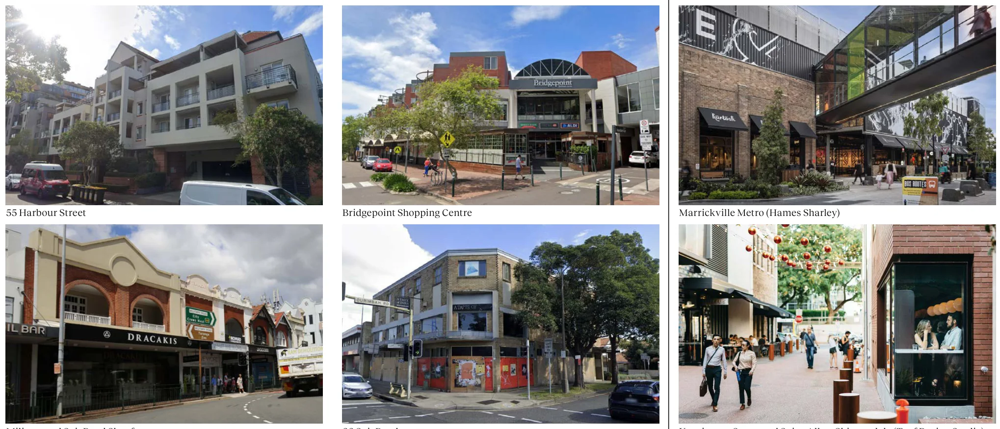

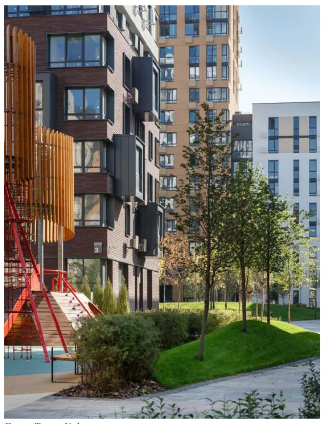

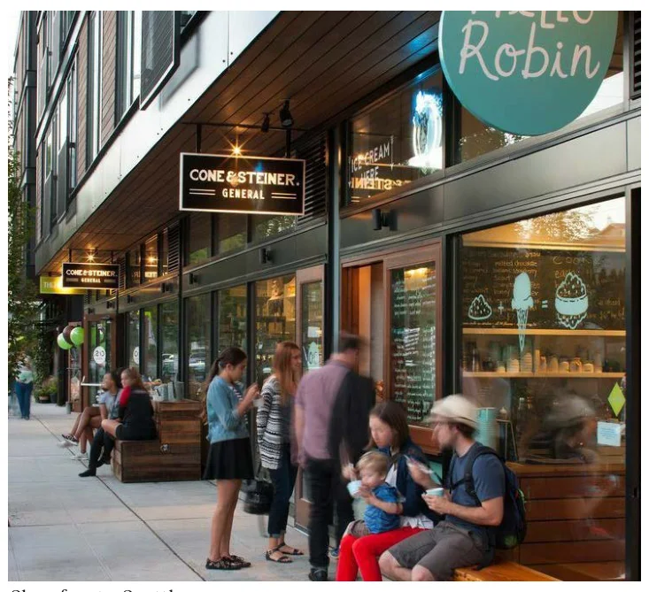

<!-- page 74 -->

Mosman Masterplan 70 SJB

### Design concept

### Mosman Village South

Proposed character

Mosman Village South will evolve into the inclusive and welcoming civic heart of the community, complementing the retail energy of the northern precinct. A connected sequence of civic open spaces will anchor the precinct, providing a green, comfortable setting for gathering, play, and community activity while strengthening the historic village character.

An enhanced pedestrian network will improve east–west movement and create a clear and legible ground plane that supports access to civic facilities and the retail offerings to the north. Medium‑scale residential buildings will frame these civic spaces, enabling more people to live close to community amenities and enjoy their recreational value. Future development will reinforce the historic significance of the Bowling Club, Allan Border Oval and associated civic buildings.

Gateway towers along Military Road will reinforce the southern entry to Mosman Village, balancing the commercial markers in the north and together defining the broader activity centre of Mosman.

Existing character

— Defined by fine-grain heritage shopfronts and low‑rise shop‑top housing, typically between 2-4 storeys — Strong civic focus with community facilities and upgraded village green spaces — Historic relationship between community, recreation and civic functions creates a unique village character. — Planning controls emphasise maintaining traditional façades and modest height/bulk — High pedestrian activity supported by the B‑Line bus interchange — Human‑scale retail area with a historic village feel

MILITARY ROAD

HARBOUR STREET ALMORA STR

MUSTON STR

MYAHGAH ROAD

MOR HORDERN LANE

TREET

OWLES ROAD

VISTA STREET

OAD

PU

Allan Border Oval Pavillion (Archer Office)

Mosman Square

Newmarket (Bates Smart, SJB, Neeson Murcutt Neille)

Marrickville Library (BVN) Mosman Village Green Mosman Square Mosman Art Gallery Commercial offices

Military Road Heritage Shopfronts Mosman Club Pienza, Neutral Bay (SJB)

Character area boundary

August 2026

Attachment 1.1.1 Mosman Council

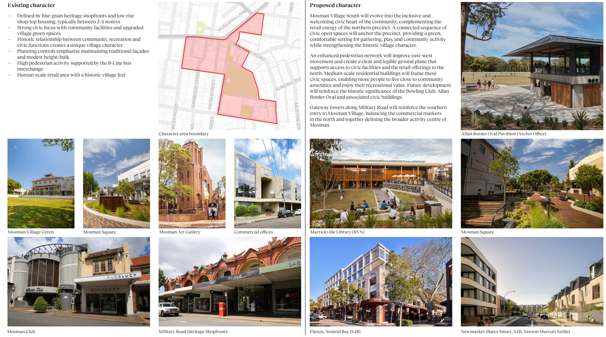

<!-- page 75 -->

Mosman Masterplan 71 SJB

### Design concept

### Military Road Corridor

M

A C P H

E R S O N

S T

T E E R

M

I L I T A R Y

R O

A D

MILITARY

CABRAMATTA ROAD

ROSEBERY STREET

HARBOUR STREET

BARDWELL ROAD GLOVER STREET

MYAHGAH ROAD

BELMONT ROAD

HORDERN LANE

SPENCER ROAD

AWABA STREET

NOBLE STREET

COWLES ROAD LINDSAY LANE

DALTON ROAD

VISTA STREET

BOND STREET

WUNDA ROAD

HALE ROAD

Existing character

— Military Road is an area that has experienced substantial incremental change over time — Mix of typologies including heritage, shop‑tops, walk‑up apartments and mid‑rise apartment buildings. — Large-format car dealerships introduce bulky built form. — Busy movement corridor with frequent bus services — Commercial buildings built to the street edge contrast residential properties with deep setbacks to Military Road, typically 5–10 metres.

Proposed character

Key sites along Military Road are identified for increased height, allowing targeted density without overwhelming the surrounding neighbourhoods. Height will concentrate at key nodes and transition down towards Ourimbah Triangle to ensure an appropriate urban scale.

Larger building setbacks will reduce building footprints and “peel back” built form at intersections. This creates more generous public spaces, improves pedestrian experience along the busy movement corridor. New development will use setbacks, podiums and upper-level recesses to also ensure heritage buildings remain visually prominent.

Active frontages will be encouraged on streets parallel to Military Road, supporting the creation of a ‘one street back’ activity spine. This allows local services and amenities to grow in a quieter setting, while relieving pressure on Military Road itself and allowing it to function efficiently as an arterial corridor.

Green Square Site 15 (CO-AP Architects)

Tan Tan, Melbourne (SJB) Arkadia, Alexandria (DKO and Breathe Architecture)

Rhodes Central, Rhodes (SJB) Mid-rise brick apartment Heritage corner commercial

Mixed -used Military Road Shopfronts Mercedes-Benz North Shore on Military Road

1960s apartment tower form Post-war apartment building

Character area boundary

August 2026

Attachment 1.1.1 Mosman Council

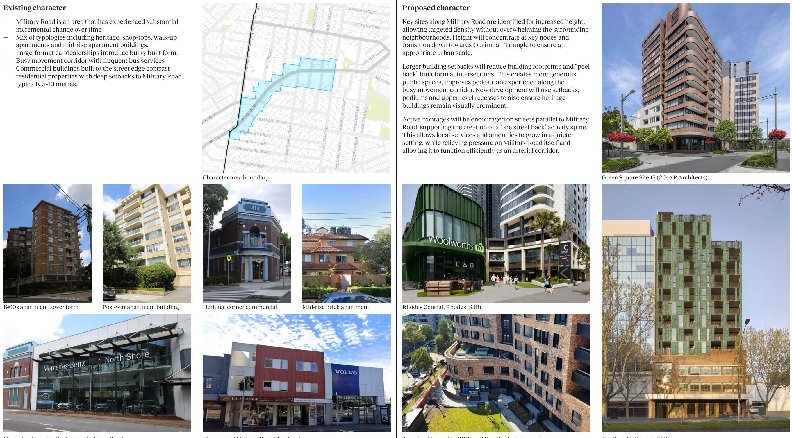

<!-- page 76 -->

Mosman Masterplan 72 SJB

### Design concept

### Spit Road Corridor

Existing character

— Mix of older brick apartments and several newer boutique, mid‑rise developments — Active frontage clusters around Spit Junction and in the north — Arterial‑road conditions with clearways, bus routes and heavy traffic — Character is inconsistent due to incremental redevelopment along a traffic‑dominant corridor — Streetscape softened through planting along deep setbacks

Proposed character

Spit Road will continue its role as a major arterial corridor but will be framed predominantly by residential towers rising from landscaped grounds along deep setbacks. This built form makes efficient use of the ridgeline, offering new views and reinforcing the identity of the corridor.

Generous landscaped setbacks along Spit Road create a vegetated buffer that captures pollutants, filters air, and enhances residential amenity. This green edge softens the corridor’s presence and injects Mosman’s leafy character along the arterial corridor.

By concentrating height along the ridge, the taller built form screens adjoining neighbourhoods from traffic, noise and visual impact. This delivers a more comfortable residential interface while maintaining the important transport role of the corridor.

MILITARY ROA

MANDOLONG ROAD

ROSEBERY STREET

STANLEY AVENUE MORUBEN ROAD

HORDERN LANE

STANTON

AWABA STREET

BICKELL ROAD

DALTON ROAD

BOND STREET

WYONG ROAD

PUNCH LANE

THE GROVE

1960s apartment tower Deep landscaping along Spit Road

Contemporary apartment interfacing single detached dwelling Hoxton Press, Hackney (David Chipperfield Architects)

Paju Unjeong Woomi Lyn Parkhills, Paju-si (Junglim Architecture)

Bosco Verticale, Milano (Boeri Architetti)

Park House, Abbotsford (SJB)

Spit Road Shopfronts

Mid-rise walk up Spit Road shop-top housing

Character area boundary

August 2026

Attachment 1.1.1 Mosman Council

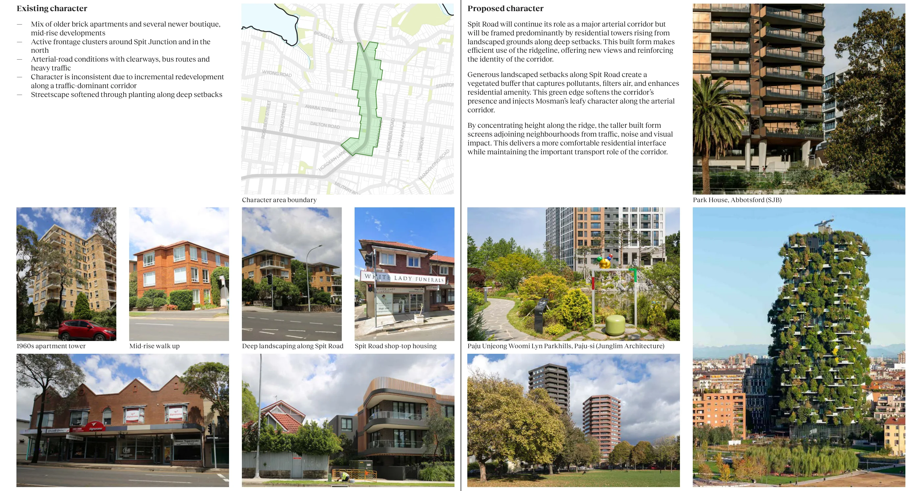

<!-- page 77 -->

Mosman Masterplan 73 SJB

### Design concept

Existing character

— Mix of residential typologies, including low‑scale, single detached housing (1–2 storeys) spanning Federation to contemporary styles, as well as 4–6 storey red‑brick apartment buildings — Strongly defined by mature trees, iconic palms, and dense front‑yard vegetation with generous setbacks. — Steep, terraced topography with buildings stepping down the ridge. — Elevated ridge setting with wide streets and panoramic views to Middle Harbour and Balmoral Beach.

### Middle Harbour and Balmoral Ridge

Proposed character

The landscape character of the ridge is closely linked to its heritage significance. Middle Harbour and Balmoral Ridge will retain their leafy residential character while accommodating sensitively scaled increases in density. Mature gardens, tree canopy and landscaped setbacks contribute to the area’s historic townscape value and remain the dominant visual element within future development.

New buildings will step down with the natural terrain, providing a clear transition from the taller forms along Spit Road to the surrounding single‑dwelling neighbourhoods. Development will be oriented to capture views towards Balmoral Beach and Middle Harbour, while also creating a buffer to the Spit Road corridor.

Improved pedestrian connections will link the ridge into Mosman’s wider pedestrian network, providing comfortable and attractive routes to the village centre, local beaches and surrounding open spaces. MILITARY ROAD

MANDOLONG ROA

ROSEBERY STREET

STANLEY AVENUE MORUBEN ROAD

HORDERN LANE

STAN

AWABA STREET

BICKELL ROAD

DALTON ROAD

BOND STREET

WYONG ROAD

PUNCH LANE

THE GROVE

Surry Hills Village Apartments, Surry Hills (SJB)

Kurraba Residences, Kurraba Point (SJB) Wentworth Quarter, Wentworth Point (Bates Smarts)

10 Wylde Street, Potts Point (SJB) Post-war apartment building character

Mature landscaping screening apartments Landscape setting and boundary wall

Transition from house to apartment building

Character area boundary

August 2026

Attachment 1.1.1 Mosman Council

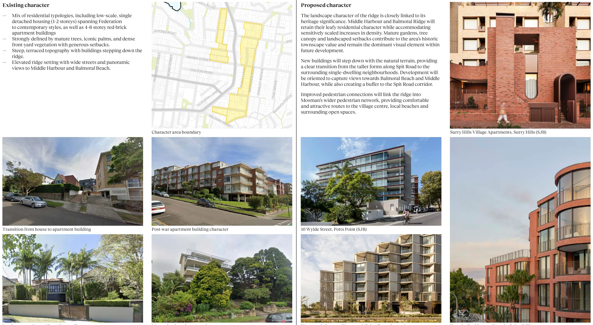

<!-- page 78 -->

Mosman Masterplan 74 SJB

### Design concept

### Ourimbah Triangle

Existing character

— Predominantly large detached homes, many with Federation character. — Scattered 3–4 storey strata buildings, generally modest in scale and set within landscaped surrounds. — Deep setbacks, mature gardens and wide verges create a strong garden‑suburb character. — Limited recent redevelopment with new works typically limited to high‑quality renovations that retain heritage elements.

Proposed character

Ourimbah Triangle will transform into a residential hub where streets are reclaimed for local life and everyday play. Traffic along north–south streets between Ourimbah and Military Roads will be significantly slowed to discourage through‑movement and prioritise residents, especially children.

Wider verges and landscaped setbacks return the public realm to people rather than cars, creating a softer neighbourhood character. Opportunities for new open spaces will be explored to support increased residential density and enhance liveability.

Long blocks between Military and Ourimbah Roads will be divided by a new east–west green link. This key pedestrian corridor will create a pleasant access route to Mosman Village, reducing reliance on Military Road for local movement.

Development is carefully sculpted to seamlessly integrate with the Lang Street character area.

M

A C P H

E R S O N

S T R E E T

T E E R

M

I L I T A R Y

R O

A D

MILITARY

ROSEBERY STREET

HARBOUR STREET

DWELL ROAD GLOVER STREET

MYAHGAH ROAD

BELMONT ROAD

HORDERN LANE

AWABA STREET

JU

REET

WLES ROAD LINDSAY LANE

DALTON ROAD

VISTA STREET

BOND STREET

WYONG ROAD

AD

HALE ROAD

Eve, Erskineville (DKO Architecture)

Finlayson Street Apartments, Lane Cove (Candalepas Associates) Lume, Newcastle (SJB)

The Gallery Polo Collection, Rosebery (SJB) White boundary fencing interface Contemporary Federation-inspired gable roofform Traditional picket fence garden

Bupa Aged Care rear laneway Walk-up mid rise apartment building

Character area boundary

August 2026

Attachment 1.1.1 Mosman Council

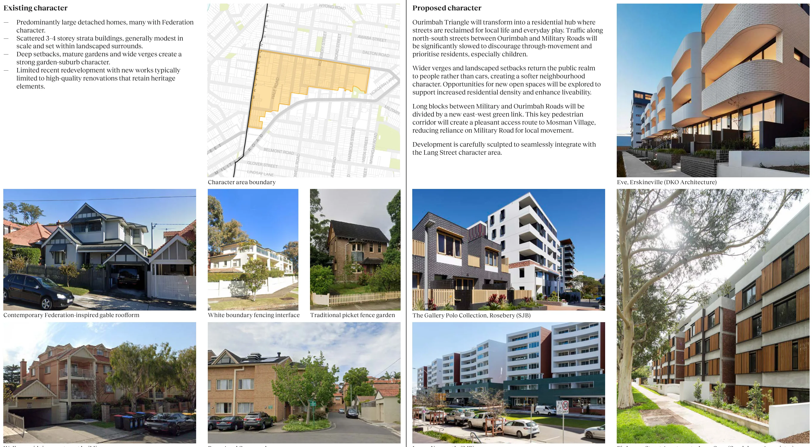

<!-- page 79 -->

Mosman Masterplan 75 SJB

### Design concept

### Prince Street

Existing character

— Predominantly single detached dwellings, mainly older heritage-style homes. — Deep grass verges and wide footpaths, giving a spacious suburban feel. — High proportion of single detached homes and a few semis throughout. — Flat topography — Residential character despite close proximity to commercial uses on Military Road and civic amenity near Allan Border Oval — Characterised by a garden suburb identity with mature but moderately spaced trees.

Proposed character

Prince Street will transition from a low‑density area to a well‑designed medium‑density neighbourhood that provides a gentle step between the taller buildings along Military Road and the heritage conservation area to the south. New through‑site links will improve east–west connectivity and strengthen movement towards the civic centre.

Generous rear setbacks will support the retention and enhancement of landscaped areas, maintaining the green, residential character of the street. As it evolves, Prince Street character area will accommodate more residents in a well‑located setting close to retail, transport, and civic amenities, while preserving a comfortable and cohesive neighbourhood feel that enables gentle transition toward the conservation area.

M

A C P H

E R S O N

S T

T A R Y

R O

A D

MILITARY ROAD

CABRAMATTA ROAD

ROSEBERY STREET

HARBOUR STREET

BARDWELL ROAD

ALM

GLOVER STREET

MYAHGAH ROAD

BELMONT ROAD

HORDERN LANE

SPENCER ROAD

AWABA STREET

NOBLE STREET

COWLES ROAD LINDSAY LANE

DALTON ROAD

VISTA STREET

BOND STREET

WUNDA ROAD

PUNCH LA

HALE ROAD

The Kensington, Kensington (Fox Johnston Architects)

10 Wylde Street, Potts Point (SJB) The Gantry, Camperdown (Bates Smart)

The Gallery Polo Collection, Rosebery (SJB) Federation-style dwelling Interface between two Federation-style dwellings Sandstone boundary wall

Contemporary weatherboard dwelling Transition between a Federation bungalo and inter-war brick dwelling

Character area boundary

August 2026

Attachment 1.1.1 Mosman Council

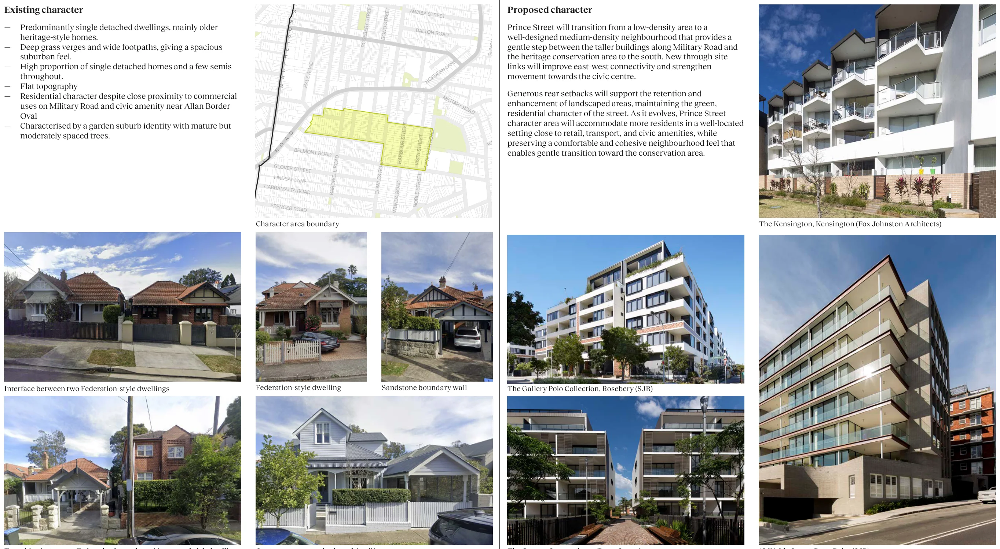

<!-- page 80 -->

Mosman Masterplan 76 SJB

### Design concept

### Concept plan

### T

1:20000 @ A3 Concept plan

The masterplan is guided by an overall urban design approach for the whole of Mosman. This approach sets out what the masterplan is trying to achieve beyond housing numbers: better places, stronger centres and real community benefits.

Unlike the LMR, which mainly changes what can be built, the masterplan will focus on place‑making outcomes, so that any new development helps deliver the desired future character and public benefits for the existing and future community.

Key elements of the design approach:

— Military Road/Spit Road as the main growth corridor. — Spit Junction as a gateway, with improvements that strengthen its role as the retail core of Mosman. — Better connections between retail centres, open spaces and schools, using new through‑site links, shared ways and more pedestrian‑friendly streets. — An expanded Village Green and new community infrastructure. — New local pocket parks in locations where redevelopment is likely to occur.

AREA OF CHANGE

KEY

LGA boundary

Gateway site Improved or new opens space opportunity Pedestrian loop

School Local centre corridor Areas of intensification/ transition Height transition Heritage conservation area Heritage items

Walking track

B1 line

Existing C4 Alan Border Oval Beaches

Arterial roads

Open space Gateway intersections Public parking

Bus stop

B-line stop

Train station

Metro station

August 2026

Attachment 1.1.1 Mosman Council

<!-- page 81 -->

Mosman Masterplan 77 SJB

### Design concept

### Key moves

Strengthening the Military–Spit Spine

Military Road and Spit Road are Mosman’s main transport and activity corridor, with rapid bus services and a concentration of shops and services. The masterplan identifies this spine as the most suitable location for renewal, enabling new mixed‑use development, additional retail and commercial space, and more homes close to public transport and within walking distance of local amenities.

Spit Junction: a Gateway into Mosman

Spit Junction is Mosman’s key crossroads and a major gateway into the village centre. Because of its high visibility and access, the masterplan identifies Spit Junction as a suitable location for carefully managed renewal, including the potential for additional height where it delivers wider community benefits through new public open space, better pedestrian links, and laneways that improve access to improved shops, services and transport.

Height transition

Building heights along the corridor and at Spit Junction will be tallest in the local centre and then step down gradually toward surrounding neighbourhoods. This creates a clear structure: a higher‑density centre, a medium‑density transition area, and low‑density residential areas outside the masterplan area.

Create a network of open spaces

Existing parks and public spaces will be improved, and new open spaces will be created as the centre evolves. Together, these spaces will form a connected network, linked by new pedestrian connections, sharedways and pedestrian‑friendly streets. This will make it easier to get around on foot from the areas of residential intensification to the centre, shops and schools and provide a more comfortable alternative to Military Road, which is affected by traffic and noise and is less pleasant for walking.

August 2026

Attachment 1.1.1 Mosman Council

<!-- page 82 -->

Mosman Masterplan 78 SJB

### Design concept

### Masterplan

The masterplan establishes a clear framework to guide Mosman’s transition into Sydney’s future, enabling the delivery of well-located housing within carefully considered areas that are appropriate for development. The plan seeks to balance growth with the existing character of Mosman while ensuring development is supported by access to services, transport, and community infrastructure.

A key principle of the masterplan is the strategic concentration of increased density within close proximity to Mosman’s retail and civic heart, where residents can readily access shops, services, employment, and community facilities. Additional density is also focused along Military Road and Spit Road, leveraging their proximity to public transport corridors to support sustainable travel choices and reduced car dependence.

While Military Road will continue to function as a major arterial route, the masterplan prioritises the introduction of alternative, at-grade pedestrian connections (active travel links). These connections are intended to improve walkability and ensure pedestrian movement is not solely reliant on, or constrained by, Military Road. Pedestrian connectivity is a foundational element of the masterplan. A series of existing and proposed pedestrian links, shared paths, and “slow streets” are integrated to form a continuous and accessible network. This network connects key destinations throughout the centre, supporting everyday movement, enhancing safety, and contributing to a more active and vibrant public realm.

Through the expansion of the local centre zone, the masterplan reinforces Mosman’s role as a place for services, employment, retail, and civic activities. This approach promotes long-term economic vitality, supports local jobs, and strengthens the town centre as a focal point for the community, as well as supporting the existing and future community.

MOSMAN HIGH SCHOOL

MOSMAN PUBLIC SCHOOL

SACRED HEART CATHOLIC PRIMARY SCHOOL

MIDDLE HARBOUR PUBLIC SCHOOL

Master plan

August 2026

Attachment 1.1.1 Mosman Council

<!-- page 83 -->

Mosman Masterplan 79 SJB

### Design concept

Residential area

Areas identified for high to medium density residential development are suitable for increased density and heights ranging from 12 to 4 storeys. Development in these areas will provide a transition between higher-density nodes and surrounding lower-scale residential neighbourhoods. Selected areas are suitable for moderate change and increased density through the delivery of “missing middle” typologie as per LMR. Mixed use corridor

Military Road is identified as a mixed-use corridor and will function as a local centre for commercial, retail, and service uses. Development will be stimulated through mixed-use buildings that provide active retail uses at ground and first-floor levels, with residential accommodation above. Building heights are to range between 12 and 15 storeys, subject to design excellence and amenity considerations Local center

A high-density local centre is proposed at the key intersection of Military Road and Spit Road, with building heights of up to 22 storeys if key pubic benefits are delivered. This location will accommodate major retail destinations and services, supporting a vibrant, well-functioning, and highly accessible centre. Character areas

Character areas are identified as locations not suitable for intensification due to their established heritage significance and valued local character. Existing planning controls will be retained, and the prevailing character of these areas will be protected and reinforced. Heritage items

Individually listed heritage items within areas of change will be carefully integrated into future development. Consideration will be given to curtilage, setting, built form controls, and adaptive reuse opportunities

Schools

Existing educational facilities are recognised as key community assets and will be supported through improved accessibility. Civic program

A concentration of civic functions is located around Mosman Village Green, establishing a strong civic identity. Existing civic uses include the library, art gallery, and civic administration building, collectively contributing to a prominent and active civic precinct.. Retail anchor

A large-format supermarket and shopping centre will act as a retail anchor, offering a diverse range of retail services to support the local and wider catchment. Bridgepoint and Woolworths are two existing anchors. Food&Bev

Significant offering of food and beverage Retail

Significant provision of shops and services Open space

Un-programmed recreational public open space accessible to everyone Playground

Existing or proposed Allan Border Oval

Allan Border Oval is recognised as a highly valued and well-loved open space, serving as a key recreational and community facility.

Views to water

Views of the water from the public domain are to be protected, framed, and enhanced, reinforcing Mosman’s distinctive coastal character and sense of place.

Views of the valley

Important long-range views of the valley from ridgelines are to be protected and enhanced through appropriate built form controls. Open space / Civic space

Opportunities are identified to increase the quality, safety, and extent of public open space, including the provision of privately owned publicly accessible spaces (POPOS), within areas of change.

Built form and land use Movement Public domain

Active travel link

Given the challenging pedestrian environment along Military Road, a network of alternative, pedestrian-friendly loop is proposed with a series of connections branching toward key destinations. These connections are a combination of pedestrian through site links existing and proposed, slow streets or green spaces. These routes will improve connectivity between residential areas, Mosman’s retail and civic centre, and key destinations such as Balmoral Beach and Chinaman Beach. Major road corridors

Military Road and Spit Road will retain their role as arterial roads carrying significant volumes of vehicular traffic. Built form and landscape treatments will respond to this interface by mitigating impacts and seek to improve amenity where possible. Local road corridor

Military Road (southbound) also functions as a local road through conservation areas and the shopping strip. Its local character and role will be retained and enhanced, with improvements to pedestrian amenity and streetscape quality. Pedestrian bridge

Provision of pedestrian bridge

August 2026

Attachment 1.1.1 Mosman Council

<!-- page 84 -->

## Urban design framework

## 7

August 2026

Attachment 1.1.1 Mosman Council

<!-- page 85 -->

Mosman Masterplan 81 SJB

Artist’s impression of new proposed public space envisioned for the Bridgepoint site

### Urban design framework

### Components of the urban design framework

Built form strategy Street wall height Floor to floor height Heritage

Active transport Street character

Land use Active frontages Community infrastructure

Public spaces Landscape setbacks Tree canopy cover Solar access

Four frameworks have been prepared to establish the controls necessary to achieve the desired future character of each identified character area addressing the following key elements:

— Built form — Movement — Land use — Public domain

Under each framework recommendations cover the main built form controls established by the masterplan . These controls give further guidance and are to be understood as pre-course of the  Development Controls Plan (DCP) that will be established by Council.

These pre-course controls are covered in “recommendations” organised under each specific framework and cover:

— Built form strategies — Street wall height recommendations — Floor to floor by use recommendations — Heritage recommendations — Active transport recommendations — Street character recommendations — Land use recommendations — Active frontage recommendations — Community infrastructure recommendations — Public space recommendations — Landscape setbacks recommendations — Tree canopy cover recommendations — Solar access recommendations and — Sustainability

MOVEMENT PUBLIC DOMAIN BUILT FORM LAND USE

August 2026

Attachment 1.1.1 Mosman Council

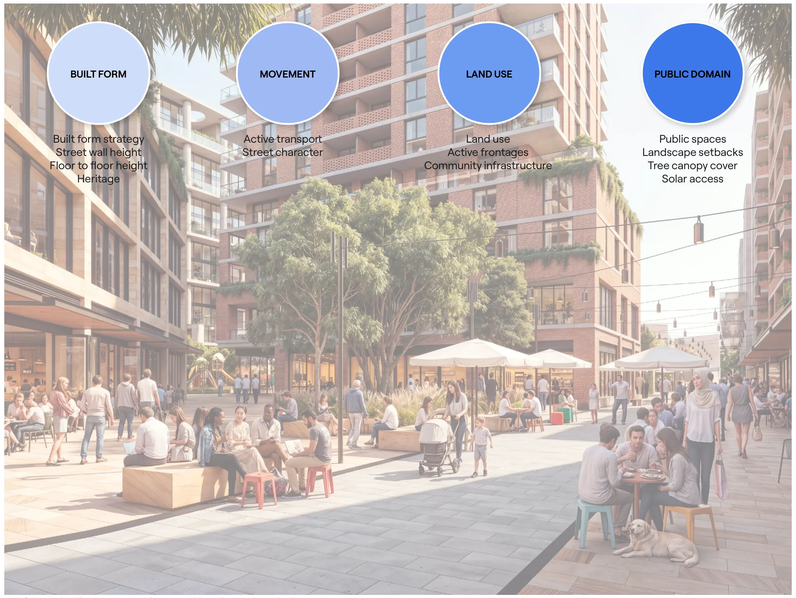

<!-- page 86 -->

Mosman Masterplan 82 SJB

Built form framework

### Urban design framework

### Built form framework

St15

St15 St18

St10 St7 St5 St4

St22

St6

St6

St6 St8

St8

St8

St8 St8 St8

St8

St8 St8

St4 St3

St3

St4 St4 St4 St4

St5

St5

St3

St8

St6 St6

St8

St15 St15

St8

St8

St8

St18 St18 St15

St18

St12

St12

St12

St8

St12 St12

St12

St12

St12

St12

St12

St12 St12

St18 St12

St12 St12

St10

St12 St12

St12

St20

St8 St8 St6 St8

St6 St6 St6 St6

St6

St6

St6

St6

St6

St3

St3 St3

St3

St6

St6

St6

St12

St12

St12

St12

St12

St12

St12

St8

St8

St8

St6

St6 St3

St8

St8 St8

St8

St8

St8 St10

St8

St6 St6 St6 St6

St6 St3

St2 St2

St3

COWLES RD

MITCHELL RD BAPAUME RD

ART GALLERY WAY

GOULDSBURY ST

BELMONT RD

COWLES RD

COWLES RD

HARBOUR ST

HARBOUR ST

WUNDA RD NOBLE ST

BRADY ST

OURIMBAH RD

OURIMBAH RD

AWABA ST

AWABA ST

KILLARNEY ST AWABA LN

AMIENS AVE STANTON LN

STANTON RD

WARRINGAH RD

PARRIWI RD

BICKELL RD

HORDERN PL

HEYDON ST

HORDERN LN

PUNCH LN

RAWSON ST

SPIT RD

CIVI LN FIELD WAY

SPIT RD

SPIT RD

PUNCH ST

CLIFFORD ST

MORUBEN RD

HORSNELL LN GURRIGAL ST VISTA ST

VISTA ST

MYAHGAH RD

BOND ST

LANG ST

SNELL ST

MACKIE LN

HALE RD

HALE RD MACPHERSON ST

ERITH ST

PRINCE ST

MELROSE ST

MILITARY RD MILITARY RD

MILITARY RD

EARL ST

PRINCE ST

BELMONT RD

GLOVER ST

LINDSAY LN

CABRAMATTA RD

TWIN TOWERS WALK

BARDWELL RD

BARDWELL RD WUDGONG ST CARDINAL ST

CARDINAL ST

ROSEBERY ST COUNTESS ST

THE CRE S CENT

1:14000 @ A3

KEY

Boundary Open space outside the masterplan boundary Heritage items

School

Bus stop

Bus lane

Heritage conservation areas

De-listed heritage conservation areas

Front setback - 0m

Front setback - 1.5m

Front setback - 3m

Front setback - 4m

Front setback - 4.5m

Front setback - 5m

Front setback - 8m

Rear setback - 9m

Streetwall height - 2 storey

Streetwall height - 6 storey

Key site

Peel Off Corners

2 storeys

4 storeys

6 storeys

8 storeys

10 storeys

12 storeys

15 storeys

20 storeys

22 storeys

Objective

To deliver built form outcomes consistent with the diagram opposite, in accordance with the controls outlined within the built form framework, including:

— Storey height — Street setbacks — Street wall height — Rear setback — Heritage design guidelines — Key sites (refer to implementation plan chapter)

August 2026

Attachment 1.1.1 Mosman Council

<!-- page 87 -->

Mosman Masterplan 83 SJB

Envelope massing south east view

### Urban design framework

### Envelope south east view

BRADY ST

MACPHERSON ST

HALE RD

OURIMBAH RD

SPIT RD

GOULDSBURY ST

AWABA ST

AWABA ST

MYAHGAH RD

THE CRESCENT

BELMONT RD

ART GALLERY WAY

BOND ST

COWLES ST

BARDWELL ST

HARBOUR  ST

VISTA ST

LANG ST

ROSEBERY ST

COUNTESS ST

PRINCE ST

MILITARY RD

Masterplan boundary

Envelope

Existing buildings

Conservation areas

Heritage items

August 2026

Attachment 1.1.1 Mosman Council

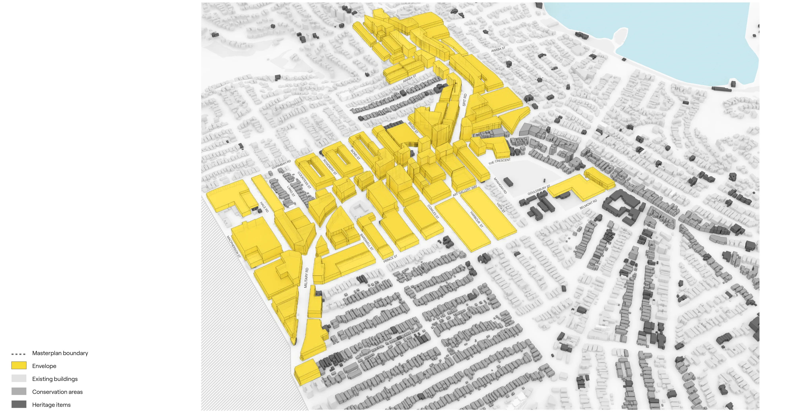

<!-- page 88 -->

Mosman Masterplan 84 SJB

Envelope massing south west view

### Urban design framework

### Envelope south west view

OURIMBAH RD

BOND ST COWLES ST

LANG ST HALE RD

MACPHERSON ST

MILITARY RD

WARRINGAH RD

PARRIWI RD

STANTON RD

RAWSON ST

BAPAUME RD

MORUBEN RD AWABA ST

AWABA ST

PUNCH ST

SPIT RD

SPIT RD ROSEBERY ST

COUNTESS ST

PRINCE ST

ART GALLERY WAY

GOULDSBURY ST

BELMONT RD

COWLES RD

HARBOUR ST

VISTA ST

MYAHGAH RD THE CRESCENT MILITARY RD

MILITARY RD

Masterplan boundary

Envelope

Existing buildings

Conservation areas

Heritage items

August 2026

Attachment 1.1.1 Mosman Council

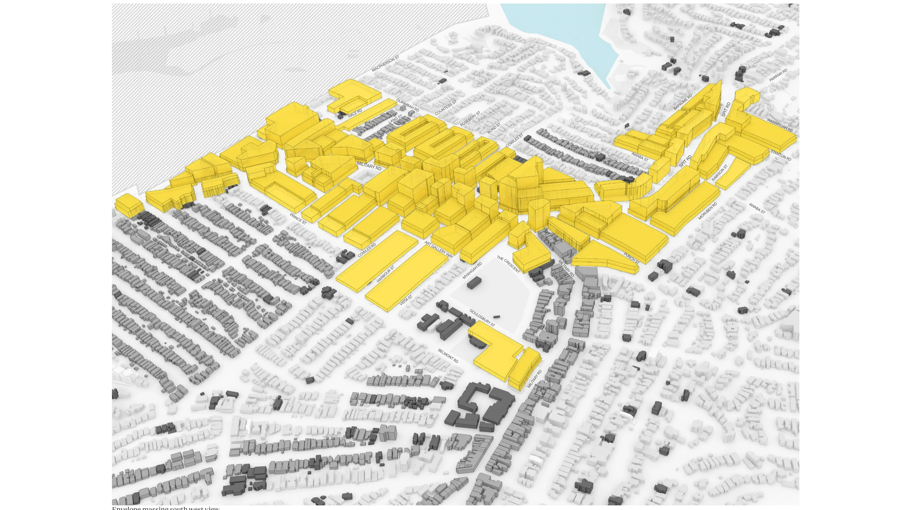

<!-- page 89 -->

Mosman Masterplan 85 SJB

COWLES RD

ART GALLERY WAY

COWLES RD HARBOUR ST

BRADY ST

OURIMBAH RD

AWABA ST AWABA ST

KILLARNEY ST

AMIENS AVE STANTON RD

WARRINGAH RD

HORDERN PL SPIT RD PUNCH ST CLIFFORD ST

MORUBEN RD

HORSNELL LN GURRIGAL ST VISTA ST

BOND ST LANG ST SHELL ST

MACKIE LN HALE RD

MACPHERSON ST

ERITH ST PRINCE ST PRINCE ST

MELROSE ST

EARL ST

OURIMBAH RD

BELMONT RD BELMONT RD GLOVER ST LINDSAY LN

BARDWELL RD WUDGONG ST CARDINAL ST

ROSEBERY ST COUNTESS ST COWLES RD

ART GALLERY WAY

COWLES RD HARBOUR ST

BRADY ST

OURIMBAH RD

AWABA ST AWABA ST

KILLARNEY ST

AMIENS AVE STANTON RD

WARRINGAH RD

HORDERN PL SPIT RD PUNCH ST CLIFFORD ST

MORUBEN RD

HORSNELL LN GURRIGAL ST VISTA ST

BOND ST LANG ST SHELL ST

MACKIE LN HALE RD

MACPHERSON ST

ERITH ST PRINCE ST PRINCE ST

MELROSE ST

EARL ST

OURIMBAH RD

BELMONT RD BELMONT RD GLOVER ST LINDSAY LN

BARDWELL RD WUDGONG ST CARDINAL ST

ROSEBERY ST COUNTESS ST

COWLES RD

ART GALLERY WAY

COWLES RD HARBOUR ST

BRADY ST

OURIMBAH RD

AWABA ST AWABA ST

KILLARNEY ST

AMIENS AVE STANTON RD

WARRINGAH RD

HORDERN PL SPIT RD PUNCH ST CLIFFORD ST

MORUBEN RD

HORSNELL LN GURRIGAL ST VISTA ST

BOND ST LANG ST SHELL ST

MACKIE LN HALE RD

MACPHERSON ST

ERITH ST PRINCE ST PRINCE ST

MELROSE ST

EARL ST

OURIMBAH RD

BELMONT RD BELMONT RD GLOVER ST LINDSAY LN

BARDWELL RD WUDGONG ST CARDINAL ST

ROSEBERY ST COUNTESS ST

COWLES RD

ART GALLERY WAY

COWLES RD HARBOUR ST

BRADY ST

OURIMBAH RD

AWABA ST AWABA ST

KILLARNEY ST

AMIENS AVE STANTON RD

WARRINGAH RD

HORDERN PL SPIT RD PUNCH ST CLIFFORD ST

MORUBEN RD

HORSNELL LN GURRIGAL ST VISTA ST

BOND ST LANG ST SHELL ST

MACKIE LN HALE RD

MACPHERSON ST

ERITH ST PRINCE ST PRINCE ST

MELROSE ST

EARL ST

OURIMBAH RD

BELMONT RD BELMONT RD GLOVER ST LINDSAY LN

BARDWELL RD WUDGONG ST CARDINAL ST

ROSEBERY ST COUNTESS ST

COWLES RD

ART GALLERY WAY

COWLES RD HARBOUR ST

BRADY ST

OURIMBAH RD

AWABA ST AWABA ST

KILLARNEY ST

AMIENS AVE STANTON RD

WARRINGAH RD

HORDERN PL SPIT RD PUNCH ST CLIFFORD ST

MORUBEN RD

HORSNELL LN GURRIGAL ST VISTA ST

BOND ST LANG ST SHELL ST

MACKIE LN HALE RD

MACPHERSON ST

ERITH ST PRINCE ST PRINCE ST

MELROSE ST

EARL ST

OURIMBAH RD

BELMONT RD BELMONT RD GLOVER ST LINDSAY LN

BARDWELL RD WUDGONG ST CARDINAL ST

ROSEBERY ST COUNTESS ST

COWLES RD

ART GALLERY WAY

COWLES RD HARBOUR ST

BRADY ST

OURIMBAH RD

AWABA ST AWABA ST

KILLARNEY ST

AMIENS AVE STANTON RD

WARRINGAH RD

HORDERN PL SPIT RD PUNCH ST CLIFFORD ST

MORUBEN RD

HORSNELL LN GURRIGAL ST VISTA ST

BOND ST LANG ST SHELL ST

MACKIE LN HALE RD

MACPHERSON ST

ERITH ST PRINCE ST PRINCE ST

MELROSE ST

EARL ST

OURIMBAH RD

BELMONT RD BELMONT RD GLOVER ST LINDSAY LN

BARDWELL RD WUDGONG ST CARDINAL ST

ROSEBERY ST COUNTESS ST

### Urban design framework

### Built form strategies

## *

Design slender towers to ground and orient them to ensure view sharing.

Prioritise height at key corners.

Respond to scale of conservation area with a gentle transition in height.

Peel away from the corner to increase public domain at busy intersections.

Continue streetwall height along active frontages.

Allow for permeability through large blocks by introducing through site links and  green pedestrian links.

The built form framework is supported by a series of strategies that have guided the development of the proposed built form controls. These strategies have informed decision-making in relation to setbacks, street wall heights, above-podium setbacks and the overall distribution of height and density across the masterplan area.

Together, these strategies seek to ensure that future development responds to local context, supports a coherent streetscape character, protects amenity, and directs additional height and density to locations best suited to accommodate change.

August 2026

Attachment 1.1.1 Mosman Council

<!-- page 90 -->

Mosman Masterplan 86 SJB

COWLES RD

ART GALLERY WAY

COWLES RD HARBOUR ST

BRADY ST

OURIMBAH RD

AWABA ST AWABA ST

KILLARNEY ST

AMIENS AVE STANTON RD

WARRINGAH RD

HORDERN PL SPIT RD PUNCH ST CLIFFORD ST

MORUBEN RD

HORSNELL LN GURRIGAL ST VISTA ST

BOND ST LANG ST SHELL ST

MACKIE LN HALE RD

MACPHERSON ST

ERITH ST PRINCE ST PRINCE ST

MELROSE ST

EARL ST

OURIMBAH RD

BELMONT RD BELMONT RD GLOVER ST LINDSAY LN

BARDWELL RD WUDGONG ST CARDINAL ST

ROSEBERY ST COUNTESS ST

COWLES RD

ART GALLERY WAY

COWLES RD HARBOUR ST

BRADY ST

OURIMBAH RD

AWABA ST AWABA ST

KILLARNEY ST

AMIENS AVE STANTON RD

WARRINGAH RD

HORDERN PL SPIT RD PUNCH ST CLIFFORD ST

MORUBEN RD

HORSNELL LN GURRIGAL ST VISTA ST

BOND ST LANG ST SHELL ST

MACKIE LN HALE RD

MACPHERSON ST

ERITH ST PRINCE ST PRINCE ST

MELROSE ST

EARL ST

OURIMBAH RD

BELMONT RD BELMONT RD GLOVER ST LINDSAY LN

BARDWELL RD WUDGONG ST CARDINAL ST

ROSEBERY ST COUNTESS ST

COWLES RD

ART GALLERY WAY

COWLES RD HARBOUR ST

BRADY ST

OURIMBAH RD

AWABA ST AWABA ST

KILLARNEY ST

AMIENS AVE STANTON RD

WARRINGAH RD

HORDERN PL SPIT RD PUNCH ST CLIFFORD ST

MORUBEN RD

HORSNELL LN GURRIGAL ST VISTA ST

BOND ST LANG ST SHELL ST

MACKIE LN HALE RD

MACPHERSON ST

ERITH ST PRINCE ST PRINCE ST

MELROSE ST

EARL ST

OURIMBAH RD

BELMONT RD BELMONT RD GLOVER ST LINDSAY LN

BARDWELL RD WUDGONG ST CARDINAL ST

ROSEBERY ST COUNTESS ST

COWLES RD

ART GALLERY WAY

COWLES RD HARBOUR ST

BRADY ST

OURIMBAH RD

AWABA ST AWABA ST

KILLARNEY ST

AMIENS AVE STANTON RD

WARRINGAH RD

HORDERN PL SPIT RD PUNCH ST CLIFFORD ST

MORUBEN RD

HORSNELL LN GURRIGAL ST VISTA ST

BOND ST LANG ST SHELL ST

MACKIE LN HALE RD

MACPHERSON ST

ERITH ST PRINCE ST PRINCE ST

MELROSE ST

EARL ST

OURIMBAH RD

BELMONT RD BELMONT RD GLOVER ST LINDSAY LN

BARDWELL RD WUDGONG ST CARDINAL ST

ROSEBERY ST COUNTESS ST

COWLES RD

ART GALLERY WAY

COWLES RD HARBOUR ST

BRADY ST

OURIMBAH RD

AWABA ST AWABA ST

KILLARNEY ST

AMIENS AVE STANTON RD

WARRINGAH RD

HORDERN PL SPIT RD PUNCH ST CLIFFORD ST

MORUBEN RD

HORSNELL LN GURRIGAL ST VISTA ST

BOND ST LANG ST SHELL ST

MACKIE LN HALE RD

MACPHERSON ST

ERITH ST PRINCE ST PRINCE ST

MELROSE ST

EARL ST

OURIMBAH RD

BELMONT RD BELMONT RD GLOVER ST LINDSAY LN

BARDWELL RD WUDGONG ST CARDINAL ST

ROSEBERY ST COUNTESS ST

COWLES RD

ART GALLERY WAY

COWLES RD HARBOUR ST

BRADY ST

OURIMBAH RD

AWABA ST AWABA ST

KILLARNEY ST

AMIENS AVE STANTON RD

WARRINGAH RD

HORDERN PL SPIT RD PUNCH ST CLIFFORD ST

MORUBEN RD

HORSNELL LN GURRIGAL ST VISTA ST

BOND ST LANG ST SHELL ST

MACKIE LN HALE RD

MACPHERSON ST

ERITH ST PRINCE ST PRINCE ST

MELROSE ST

EARL ST

OURIMBAH RD

BELMONT RD BELMONT RD GLOVER ST LINDSAY LN

BARDWELL RD WUDGONG ST CARDINAL ST

ROSEBERY ST COUNTESS ST

### Urban design framework

### Built form strategies

Protect solar amenity to existing and improved public open spaces.

Encourage frontages that focus activity ‘one street back’ along busy roads.

Setback development above heritage items.

Take towers to ground to provide greater landscape setback in residential areas.

Encourage activation of the main street and public spaces.

Protect the fine grain character using above podium setbacks.

August 2026

Attachment 1.1.1 Mosman Council

<!-- page 91 -->

87 SJB 

### Urban design framework

### Street wall height recommendations

RESIDENTIAL

RESIDENTIAL

RESIDENTIAL

RESIDENTIAL

RESIDENTIAL

RESIDENTIAL

RESIDENTIAL

RESIDENTIAL

RESIDENTIAL

RESIDENTIAL

8m

RESIDENTIAL

RESIDENTIAL RETAIL

RESIDENTIAL RETAIL

RESIDENTIAL

RESIDENTIAL

RETAIL

COMMERCIAL

RESIDENTIAL

RESIDENTIAL

RESIDENTIAL

3m

RESIDENTIAL

RESIDENTIAL

RESIDENTIAL

RESIDENTIAL

RESIDENTIAL

RESIDENTIAL

RESIDENTIAL

RESIDENTIAL

LIFT

3m

1.5m - 8m

RESIDENTIAL

RESIDENTIAL

RESIDENTIAL

RESIDENTIAL

RESIDENTIAL

RESIDENTIAL

LIFT

3m

1.5m - 8m

Active frontage on Military Road

Two-storey street walls with above street wall setback of 3m along the Military Road commercial spine to respond to the datum of existing fine grain shop top housing that has characterised the area till today. Four-storey street walls for 515 to 555 Military Rd, and 26/1-3 Brady St, 656 Military Rd. No residential uses to be permitted on the ground and first level facing the arterial roads.

Towers to ground (Spit Road, Military Road)

8m front setback and no street wall height control (towers to ground) for high density residential along Military Road and Spit Road. Setback to be utilised for deep soil and tree planting to ensure a landscape buffer is provided for any residential use interfacing with the arterial roads.

8 storey residential areas

Residential areas that have a maximum height of building of 8 storey to present a 6 storey street wall height with an upper level setback of 3 meters for all levels above.

6 storey residential areas

Residential areas that have a maximum height of building of 6 storey to present a 4 storey street wall height with an upper level setback of 3 meters for all levels above.

Sample section of Military Road and Spit Road street wall height

Sample section of street wall conditions for residential areas along Spit Road and Military Road

Sample section of residential street wall height in areas up to 6 storey

Sample section of residential street wall height in areas 8 storey and above

COWLES RD

ART GALLERY WAY

COWLES RD HARBOUR ST

BRADY ST OURIMBAH RD

AWABA ST AWABA ST

KILLARNEY ST

AMIENS AVE STANTON RD

WARRINGAH RD

HORDERN PL SPIT RD PUNCH ST CLIFFORD ST

MORUBEN RD

HORSNELL LN GURRIGAL ST VISTA ST

BOND ST LANG ST SHELL ST

MACKIE LN HALE RD MACPHERSON ST ERITH ST PRINCE ST PRINCE ST MELROSE ST

EARL ST

OURIMBAH RD

BELMONT RD BELMONT RD GLOVER ST LINDSAY LN

BARDWELL RD WUDGONG ST CARDINAL ST

ROSEBERY ST COUNTESS ST COWLES RD

ART GALLERY WAY

COWLES RD HARBOUR ST

BRADY ST OURIMBAH RD

AWABA ST AWABA ST

KILLARNEY ST

AMIENS AVE STANTON RD

WARRINGAH RD

HORDERN PL SPIT RD PUNCH ST CLIFFORD ST

MORUBEN RD

HORSNELL LN GURRIGAL ST VISTA ST

BOND ST LANG ST SHELL ST

MACKIE LN HALE RD MACPHERSON ST ERITH ST PRINCE ST PRINCE ST MELROSE ST

EARL ST

OURIMBAH RD

BELMONT RD BELMONT RD GLOVER ST LINDSAY LN

BARDWELL RD WUDGONG ST CARDINAL ST

ROSEBERY ST COUNTESS ST COWLES RD

ART GALLERY WAY

COWLES RD HARBOUR ST

BRADY ST OURIMBAH RD

AWABA ST AWABA ST

KILLARNEY ST

AMIENS AVE STANTON RD

WARRINGAH RD

HORDERN PL SPIT RD PUNCH ST CLIFFORD ST

MORUBEN RD

HORSNELL LN GURRIGAL ST VISTA ST

BOND ST LANG ST SHELL ST

MACKIE LN HALE RD MACPHERSON ST ERITH ST PRINCE ST PRINCE ST MELROSE ST

EARL ST

OURIMBAH RD

BELMONT RD BELMONT RD GLOVER ST LINDSAY LN

BARDWELL RD WUDGONG ST CARDINAL ST

ROSEBERY ST COUNTESS ST COWLES RD

ART GALLERY WAY

COWLES RD HARBOUR ST

BRADY ST OURIMBAH RD

AWABA ST AWABA ST

KILLARNEY ST

AMIENS AVE STANTON RD

WARRINGAH RD

HORDERN PL SPIT RD PUNCH ST CLIFFORD ST

MORUBEN RD

HORSNELL LN GURRIGAL ST VISTA ST

BOND ST LANG ST SHELL ST

MACKIE LN HALE RD MACPHERSON ST ERITH ST PRINCE ST PRINCE ST MELROSE ST

EARL ST

OURIMBAH RD

BELMONT RD BELMONT RD GLOVER ST LINDSAY LN

BARDWELL RD WUDGONG ST CARDINAL ST

ROSEBERY ST COUNTESS ST

August 2026

Attachment 1.1.1 Mosman Council

<!-- page 92 -->

Mosman Masterplan 88 SJB

### Urban design framework

### Floor to floor height recommendations

RESIDENTIAL

RESIDENTIAL

3.2m

3.2m

R3 - R4 HOB

2m

4m

RESIDENTIAL

Roof ariculation zone

LIFT

3.2m

3.2m

3.6m

COMMERCIAL

RETAIL

E1 HOB Roof ariculation zone

2m

5m

RESIDENTIAL

RESIDENTIAL

LIFT

Height of building assumptions in local centres areas

— 5 m - Ground floor level retail — 3.6 m - First retail or commercial level — 3.2 m - Above ground floor residential levels — 2m - lift overuns — Green roof articulation zone (building can exceed Heigh of building for the purpose of providing green roof and roof top communal open space.

Height of building assumptions in residential areas

— 4 m - Ground floor level — 3.2 m - Above ground floor residential levels — 2m - lift overuns — Green roof articulation zone (building can exceed Heigh of building for the purpose of providing green roof and roof top communal open space.

Maximum HOB

Non residential uses

Residential uses

Green roof articulation zone

Height of buildings

The recommended floor-to-floor height assumptions have been applied to translate the desired built form storey heights into heights of buildings in metres.

The following floor to floor assumptions have been utilised :

— In residential areas, a floor-to-floor height of 4 metres has been assumed for the ground floor. — Within local centre areas, a greater ground floor height of 5 metres has been applied to ensure active frontage can be delivered with no residential uses. — All residential levels above the ground floor, have been assumed to have a floor-to-floor height of 3.2 metres. — The commercial level above ground floor have been assumed to have a floor-to-floor height of 3.6 metres. — An additional 2 metres has been allowed for lift overruns. — The maximum height of building is rounded up to the nearest half metre.

Green roof articulation zone

The maximum building height may exceed the height shown on the Height of Buildings Map where required to accommodate rooftop elements that support access, amenity and the functional use of roof spaces. This may include structures providing access to green roofs and rooftop communal open space, as well as ancillary elements that support the social use of these spaces, such as open shade structures, lightweight shelter structures and accessible toilets.

Where rooftop communal open space is proposed, a portion of the roof area is to be provided as green roof, with the remaining area comprising communal open space incorporating open, lightweight and minimal structures.

August 2026

Attachment 1.1.1 Mosman Council

<!-- page 93 -->

Mosman Masterplan 89 SJB

### Urban design framework

### Heritage recommendations

Key heritage findings

The Heritage Review identified within the masterplan area:

— Approximately 43 Heritage Items — Approximately 65 properties within Heritage Conservation Areas (HCAs) — Two principal HCAs:

— Lang Street HCA (C6) — Military Road HCA (C7)

— Significant civic, educational, recreational and religious heritage assets concentrated within Mosman Village. — Numerous heritage items whose significance is closely linked to their landscape setting, curtilage and visual prominence.

Most heritage items retain sufficient integrity, significance and legibility to justify continued protection and necessitate sensitive development in their surrounds. Different HCAs exhibit different levels of integrity, with select ones warranting review and refinement of boundaries.

Lang Street HCA

The Heritage Review identifies Lang Street as a significant heritage precinct with its significance derived from:

— Federation and Inter-War residential character. — Fine-grain subdivision pattern. — Consistent building scale and setbacks. — Strong landscape character and mature street trees. — Wide verges and central planted median. — Cohesive streetscape with limited intrusive redevelopment.

However, the review concludes that the conservation area has been significantly altered to the south but retains a high degree of integrity to the north.

Therefore, the Masterplan proposes amending HCA boundaries to support growth in areas that have diminished in heritage value in order to promote a more gradual transition from areas of intensive change. The northern portion of the Lang Street HCA that is comprised predominantly of Contributory items is appropriately excluded from uplift in order to preserve valued heritage character within the masterplan area.

HERITAGE IMPACT STATEMENT

‘Place Name’, Address

MOSMAN MASTERPLAN

HERITAGE REVIEW

Military Road HCA

The Heritage Review found that the heritage character of parts of the Military Road HCA has been progressively diminished through:

— Road widening and infrastructure works. — Commercial redevelopment. — Altered shopfronts and facades. — Inconsistent building forms and setbacks. — Large-scale contemporary development.

While the conservation area continues to contain significant heritage elements and contributes to Mosman’s village character, heritage values are less consistent than in other conservation areas and vary across the precinct.

The Masterplan recognises Military Road as an established urban corridor that has experienced successive phases of change and therefore has a greater capacity to accommodate future renewal. Additional density is focused within this corridor while retaining significant heritage buildings, protecting key views and providing appropriate transitions to adjoining heritage precincts.

The Heritage Review recommends that the heritage conservation area boundaries and contributory gradings be reviewed as part of future planning work to ensure they accurately reflect the present heritage significance of the precinct.

Boronia House

Boronia House is one of Mosman’s most significant heritage landmarks and derives much of its heritage value from its established garden setting, visual prominence and spatial separation from surrounding development.

The Heritage Review identifies the protection and reinforcement of this curtilage as a key consideration for future development adjoining the site. The perception of building height is less significant from within the garden setting of Boronia House, where views are largely filtered by vegetation and landscape elements. As a result, the management of building footprint, separation distances and landscape character is considered more important than the overall number of storeys.

The Masterplan supports:

— Increased front and side setbacks adjacent to Boronia House. — Protection and reinforcement of the historic garden setting. — Retention of visual prominence when viewed from Military Road and surrounding public spaces. — Built form controls that manage perceived bulk and scale. — Enhanced tree planting and landscape treatments that strengthen the heritage curtilage and improve the transition between new development and the heritage item.

The Heritage Review concludes that the Mosman Masterplan is a preferable urban growth model to the State Government’s Low and Mid-Rise Housing Policy (LMR) because it concentrates higher density development within already modified commercial and arterial road corridors, while reducing pressure on Mosman’s more intact residential neighbourhoods and heritage conservation areas.

Rather than applying a uniform response, the Masterplan directs development toward locations that can accommodate renewal while protecting the heritage values that contribute to Mosman’s distinctive character, identity and sense of place. The report supports managed growth, provided future development is guided by robust heritage controls, context-responsive built form, and clear urban design guidance.

This approach recognises that the significance of Boronia House is intrinsically linked to its setting and ensures that future development reinforces rather than diminishes its heritage character.

Urban design recommendations

The Heritage Review supports the following urban design outcomes:

— Concentrate growth within established centres and transport corridors. — Protect highly intact heritage conservation areas from inappropriate intensification. — Maintain the prominence and setting of significant heritage items. — Require lower-scale transition areas adjoining heritage precincts. — Preserve important landscape character, mature street trees and garden settings. — Reinforce fine-grain subdivision patterns and traditional setbacks where heritage significance is derived from the streetscape. — Ensure taller buildings are designed as background elements when viewed from heritage places. — Use contemporary architecture that responds to heritage context without replicating historic styles.

These recommendations have directly informed the structure plans, character areas, built form controls and height transition framework contained within the Mosman Masterplan.

August 2026

Attachment 1.1.1 Mosman Council

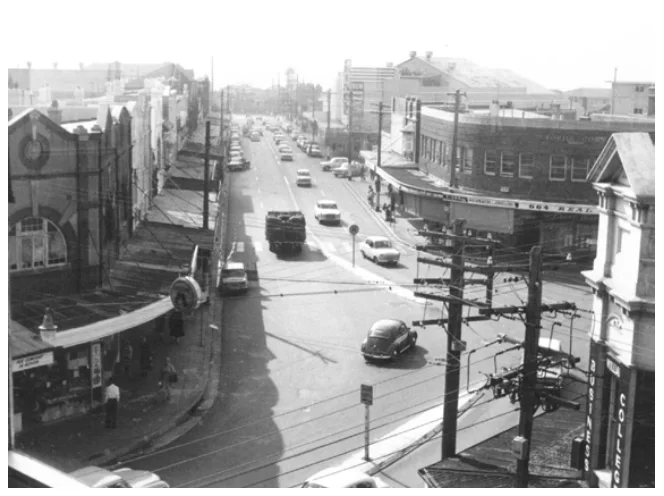

<!-- page 94 -->

Mosman Masterplan 90 SJB

Movement  framework

### Urban design framework

### Movement framework

1:14000 @ A3

40

40 40 40 40 40

40 40

40

40 40 40 40 40

40

40

40

COWLES RD

MITCHELL RD BAPAUME RD

ART GALLERY WAY

GOULDSBURY ST

BELMONT RD

COWLES RD

COWLES RD

HARBOUR ST

HARBOUR ST

WUNDA RD NOBLE ST

BRADY ST

OURIMBAH RD

OURIMBAH RD

AWABA ST

AWABA ST

KILLARNEY ST AWABA LN

AMIENS AVE STANTON LN

STANTON RD

WARRINGAH RD

PARRIWI RD

BICKELL RD

HORDERN PL

HEYDON ST

HORDERN LN

PUNCH LN

RAWSON ST

SPIT RD

CIVI LN FIELD WAY

SPIT RD

SPIT RD

PUNCH ST

CLIFFORD ST

MORUBEN RD

HORSNELL LN GURRIGAL ST VISTA ST

VISTA ST

MYAHGAH RD

BOND ST

LANG ST

SNELL ST

MACKIE LN

HALE RD

HALE RD MACPHERSON ST

ERITH ST

PRINCE ST

MELROSE ST

MILITARY RD MILITARY RD

MILITARY RD

EARL ST

PRINCE ST

BELMONT RD

GLOVER ST

LINDSAY LN

CABRAMATTA RD

TWIN TOWERS WALK

BARDWELL RD

BARDWELL RD WUDGONG ST CARDINAL ST

CARDINAL ST

ROSEBERY ST COUNTESS ST

THE CRE S CENT

KEY

Boundary Open space outside the masterplan boundary Heritage items

School

Bus stop

Relocated bus stop

Bus lane

Existing crossing

Proposed crossing

Proposed roundabout

Potential intersection upgrade

Regional cycle corridor

Potential alternative regional cycle link

Existing through site link

Proposed through site link

Proposed service lane

Green pedestrian link

Pedestrian only zones

Shared zones

No vehicle access

Proposed pedestrian footpath 40 40km/h speed limit

Proposed signalised intersection

Existing public parking

Pick-up drop-off area

Calm streets

Closed off roads

Traffic direction

Pedestrian bridge

Objective

To deliver active transport and vehicular movement outcomes consistent with the diagram opposite, in accordance with the controls outlined within the movement framework, including:

— Through site links approximate location and objective — Green pedestrian links approximate locations and objective — New vehicular streets and laneways — Location of shared ways and pedestrian only zones — Proposed pedestrian crossing — Proposed new signalised crossing — No vehicular access areas — Proposed vehicular access points — Public parking — Road closures — Road widening — Speed limits — Calm street cross sections and design — Regional cycle link

August 2026

Attachment 1.1.1 Mosman Council

<!-- page 95 -->

Mosman Masterplan 91 SJB

### Urban design framework

### Active transport recommendations

M

A C P H

E R S O N

S T R E E T

T E E R T S D R A R E G M I L I T A R Y R O A D

M I L I T A R Y R O A D

S P I T R O A D

BRADLEYS HEAD ROAD

CHOWDER BAY ROAD SHADFORTH STREET SPOFFORTH STREET

MIDDLE HEAD ROAD

MIDDLE HEAD ROAD

MILITARY ROAD

PEARL BAY AVENUE

CABRAMATTA ROAD

SIRIUS COVE ROAD

MANDOLONG ROAD

MUSGRAVE STREET

SOMERSET STREET

ROSEBERY STREET

RANGERS AVENUE

CENTRAL AVENUE

HARBOUR STREET

#### 1801 FORT TRACK

STANLEY AVENUE

CREMORNE LANE

WOLSELEY ROAD

BARDWELL ROAD

MOSMAN STREET

PINDARI AVENUE

BLOXSOME LANE

ALMORA STREET

MUSTON STREET

MEDUSA STREET

THE ESPLANADE

RAGLAN STREET

RAGLAN STREET

GLOVER STREET

MYAHGAH ROAD

MORUBEN ROAD

KARDINIA ROAD

BELMONT ROAD

MORELLA ROAD

QUAKERS ROAD

HORDERN LANE

SPENCER ROAD

STANTON ROAD

KAREELA ROAD

AWABA STREET

JULIAN STREET

QUEEN STREET

KAREELA LANE

REDAN STREET BOTANIC ROAD NOBLE STREET

PARRIWI ROAD

COWLES ROAD

UNION STREET

BICKELL ROAD

BOYLE STREET

LINDSAY LANE

DAVID STREET

AVENUE ROAD SUAKIN DRIVE

DALTON ROAD

MILSON ROAD

VISTA STREET

PARK AVENUE

HOLT AVENUE

BOND STREET

WYONG ROAD

WUNDA ROAD

RUBY STREET

PUNCH LANE

REDAN LANE

ILUKA ROAD

IDA AVENUE

SILEX ROAD

BAY STREET

HALE ROAD

THE GROVE

CREMORNE NORTH SYDNEY

MILSONS POINT

LAVENDER BAY

VICTORIA CROSS METRO

CAMMERAY

NORTH SYDNEY

CROWS NEST

POINT

KURRABA POINT

CREMORNE

CLIFTON GARDEN RESERVE

MIDDLE HE

BRADLEYS HEAD

TAROONGA ZOO

In collaboration with Fernway Engineering, recommendations for the active travel network across Mosman LGA have been developed. Recommendations for improvements to the network that would increase its capacity, functionality, and connectivity are summarised in the diagram opposite. This work includes upgrades outside of the masterplan area which are to be considered conceptual in nature and subject to future studies and investigations. Mosman’s existing network lacks the connections required to function as a cohesive network. As a result, a regional link is a major priority of the Mosman Masterplan,  connecting Cremorne with Spit Bridge as a continuous, safe, and accessible cycle link.

This regional link is recommended as a mix of dedicated bike lanes, shared paths, and on-road cycle routes, defined as follows:

— Dedicated bicycle path: a separate space for cyclists, distinct from both motor vehicle traffic and pedestrians. — Shared footpath:  a two-way route accommodating both bicycle and pedestrian movement along a footpath, without designated space for specific modes. Shared paths are to be minimum 4.5 ideally 5.2m, including a 0.7 to 1.2m landscape buffer between the shared footpath and traffic to ensure the safety of users. Existing footpaths along Military and Spit Road are designated shared paths required to achieve the regional cycle link. In the instance these designated shared ways are on footpaths currently not meeting the minimum width, widening is required to be provided by the development via setbacks. — On road cycle route: Quiet roads with lower-traffic streets where cyclists share the road with motor vehicles in a calmer environment.

KEY

LGA boundary

Mosman Masterplan boundary

Dedicated bicycle paths

Proposed dedicated bicycle paths

On-road cycle route

Proposed on-road cycle route

Shared footpath (cyclists and pedestrians)

Proposed Shared footpath (cyclists and pedestrians)

Minimum 4.5m shared footpath

Potential alternative regional cycle link

North Sydney regional cycle corridor

Regional cycle corridor

Open space

COWLES RD

ART GALLERY WAY

COWLES RD HARBOUR ST

BRADY ST

OURIMBAH RD

AWABA ST

AWABA ST

KILLARNEY ST

AMIENS AVE STANTON RD

WARRINGAH RD

HORDERN PL SPIT RD

PUNCH ST

CLIFFORD ST

MORUBEN RD

HORSNELL LN GURRIGAL ST VISTA ST

BOND ST

LANG ST

SHELL ST

MACKIE LN HALE RD

MACPHERSON ST

ERITH ST

PRINCE ST PRINCE ST

MELROSE ST

EARL ST

OURIMBAH RD

BELMONT RD

BELMONT RD GLOVER ST LINDSAY LN

BARDWELL RD WUDGONG ST CARDINAL ST

ROSEBERY ST COUNTESS ST

KEY

Minimum 4.5m shared footpath

1:20000 @ A3

August 2026

Attachment 1.1.1 Mosman Council

<!-- page 96 -->

Mosman Masterplan 92 SJB

COWLES RD

ART GALLERY WAY

COWLES RD HARBOUR ST

BRADY ST

OURIMBAH RD

AWABA ST AWABA ST

KILLARNEY ST

AMIENS AVE STANTON RD

WARRINGAH RD

HORDERN PL SPIT RD PUNCH ST CLIFFORD ST

MORUBEN RD

HORSNELL LN GURRIGAL ST VISTA ST

BOND ST LANG ST SHELL ST

MACKIE LN HALE RD MACPHERSON ST

ERITH ST PRINCE ST PRINCE ST

MELROSE ST

EARL ST

OURIMBAH RD

BELMONT RD BELMONT RD GLOVER ST LINDSAY LN

BARDWELL RD WUDGONG ST CARDINAL ST

ROSEBERY ST COUNTESS ST COWLES RD

ART GALLERY WAY

COWLES RD HARBOUR ST

BRADY ST

OURIMBAH RD

AWABA ST AWABA ST

KILLARNEY ST

AMIENS AVE STANTON RD

WARRINGAH RD

HORDERN PL SPIT RD PUNCH ST CLIFFORD ST

MORUBEN RD

HORSNELL LN GURRIGAL ST VISTA ST

BOND ST LANG ST SHELL ST

MACKIE LN HALE RD MACPHERSON ST

ERITH ST PRINCE ST PRINCE ST

MELROSE ST

EARL ST

OURIMBAH RD

BELMONT RD BELMONT RD GLOVER ST LINDSAY LN

BARDWELL RD WUDGONG ST CARDINAL ST

ROSEBERY ST COUNTESS ST

Key plan Key plan New Road Brighton Redesign, Brighton UK (Gehl Architects) The Gantry, Camperdown (Bates Smart)

### Urban design framework

### Street character recommendations

Shared way

Mixed traffic connections that encourages pedestrian & cycling movement, while allowing required vehicular and servicing access in order to improve overall permeability and encourage walking, social gatherings and outdoor activities

Controls

— Minimum width of 6m — Provide landscaping, lighting and high quality materials and finishes — Includes active frontages for better activation and place making — Provide opportunities for public art — Ground floor uses fronting lanes to incorporate openings onto the lane to contribute to activation (including outdoor dining) — Include materials and finishes adept for a public space (paving materials, tree planting, street furniture)

Through site links

Key pedestrians connections established to improve pedestrian connectivity within the centre and residential areas

Controls

— Minimum total width of 3m — A minimum width of 2.5m sharedpath zone if through site link is identifies as part of the regional cycle link or as an on road cycle route — Be direct and publicly accessible 24 hours a day — Allow visibility along the length and open to the sky — Incorporates signage advising the places to which it connects — Easily identifiable and provide opportunities for passive surveillance — Include materials and finishes adept for a public space (paving materials, tree planting, street furniture)

verge

1.5m 1.6m 2.9m 6.0m

flex area shared way verge

1.0m 2.0m 3.0m

footpath

0.5m 2.5m 3.0m

Sharedpath

Pedestrians only Shared path pedestrians and cyclists

August 2026

Attachment 1.1.1 Mosman Council

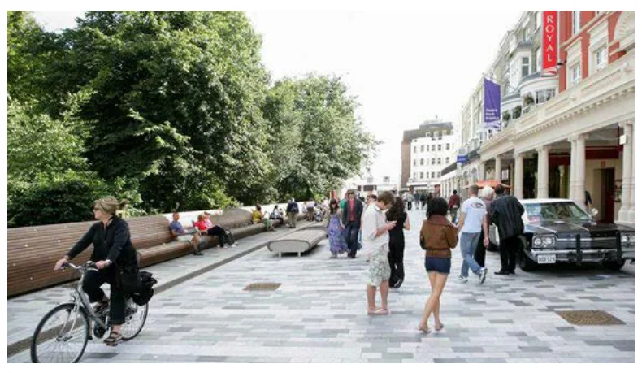

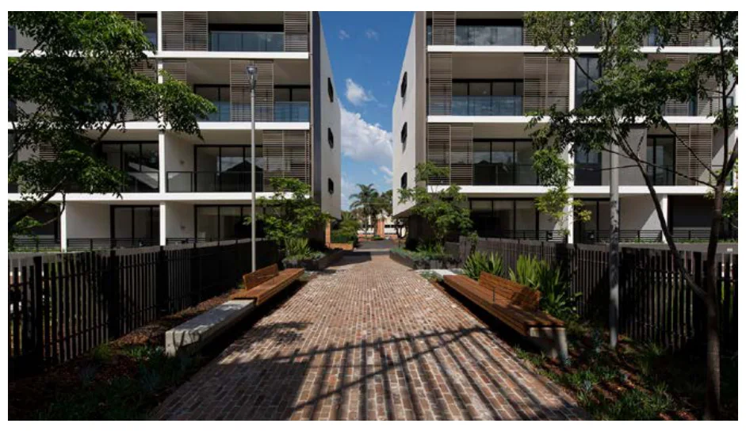

<!-- page 97 -->

Mosman Masterplan 93 SJB

footpath verge angled parking lane lan

2.3m 1.0m 4.5m 3.2m 3.2 20m

public open space public open space footpath

3.0m 3.0m 3.0m 9.0m

COWLES RD

ART GALLERY WAY

COWLES RD HARBOUR ST

BRADY ST

OURIMBAH RD

AWABA ST AWABA ST

KILLARNEY ST

AMIENS AVE STANTON RD

WARRINGAH RD

HORDERN PL SPIT RD PUNCH ST CLIFFORD ST

MORUBEN RD

HORSNELL LN GURRIGAL ST VISTA ST

BOND ST LANG ST SHELL ST

MACKIE LN HALE RD MACPHERSON ST

ERITH ST PRINCE ST PRINCE ST

MELROSE ST

EARL ST

OURIMBAH RD

BELMONT RD BELMONT RD GLOVER ST LINDSAY LN

BARDWELL RD WUDGONG ST CARDINAL ST

ROSEBERY ST COUNTESS ST COWLES RD

ART GALLERY WAY

COWLES RD HARBOUR ST

BRADY ST

OURIMBAH RD

AWABA ST AWABA ST

KILLARNEY ST

AMIENS AVE STANTON RD

WARRINGAH RD

HORDERN PL SPIT RD PUNCH ST CLIFFORD ST

MORUBEN RD

HORSNELL LN GURRIGAL ST VISTA ST

BOND ST LANG ST SHELL ST

MACKIE LN HALE RD MACPHERSON ST

ERITH ST PRINCE ST PRINCE ST

MELROSE ST

EARL ST

OURIMBAH RD

BELMONT RD BELMONT RD GLOVER ST LINDSAY LN

BARDWELL RD WUDGONG ST CARDINAL ST

ROSEBERY ST COUNTESS ST

Key plan Key plan Fordham University New Residence Halls, New York City (Sasaki) Traffic calming measures and angled parking (various)

### Urban design framework

Calm streets

Slow residential streets designed with slow traffic measures and speed restriction to naturally slow down vehicle speeds to enhance pedestrian safety, reduce noise, and encourage a balance between modes of transport.

Controls

— Adopt lower speed limits of 40 km/h — Include, retain, or improve verge — Apply mid-block pinch points in the form of curb extensions — Use flat-top road pavements to slow traffic and provide pedestrian crossing points — Provide angled parking on one side of the street and parallel parking on the other to maximise on-road parking capacity

Green pedestrian links

Narrow pedestrian-priority streets within residential areas that provides connectivity to adjacent residential streets while acting as green refuges allowing for passive recreation.

Controls

— Minimum width of 9m (shared between developments) — Allow visibility along the length and open to the sky — Implement continuous footpath treatment — Incorporate linear public open space along both sides of the link with tree planting and water-sensitive urban design — Provide street furniture and incorporate passive recreation elements such as small play features

August 2026

Attachment 1.1.1 Mosman Council

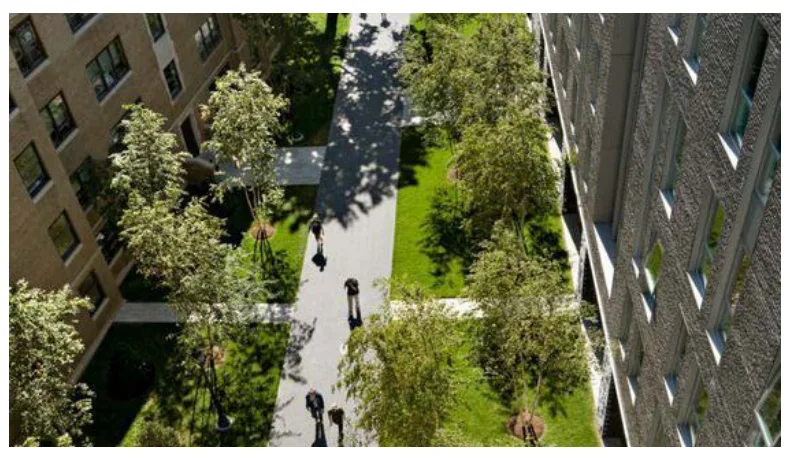

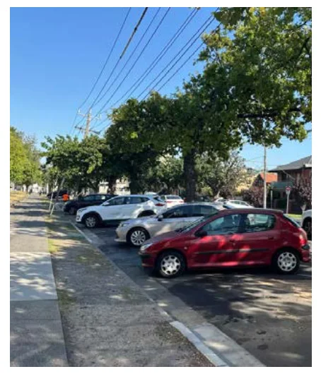

<!-- page 98 -->

Mosman Masterplan 94 SJB

Land use framework

### Urban design framework

### Land use framework

1:14000 @ A3

Middle Habour Public School

Sacred Hear Catholic Primary School

Mosman Public School

Allan Border Oval

Bowling Club

Ar Gallery

Mosman Library

Community hub

Indoor couts Mosman Swim Centre

COWLES RD

MITCHELL RD BAPAUME RD

ART GALLERY WAY

GOULDSBURY ST

BELMONT RD

COWLES RD

COWLES RD

HARBOUR ST

HARBOUR ST

WUNDA RD NOBLE ST

BRADY ST

OURIMBAH RD

OURIMBAH RD

AWABA ST

AWABA ST

KILLARNEY ST AWABA LN

AMIENS AVE STANTON LN

STANTON RD

WARRINGAH RD

PARRIWI RD

BICKELL RD

HORDERN PL

HEYDON ST

HORDERN LN

PUNCH LN

RAWSON ST

SPIT RD

CIVI LN FIELD WAY

SPIT RD

SPIT RD

PUNCH ST

CLIFFORD ST

MORUBEN RD

HORSNELL LN GURRIGAL ST VISTA ST

VISTA ST

MYAHGAH RD

BOND ST

LANG ST

SNELL ST

MACKIE LN

HALE RD

HALE RD MACPHERSON ST

ERITH ST

PRINCE ST

MELROSE ST

MILITARY RD MILITARY RD

MILITARY RD

EARL ST

PRINCE ST

BELMONT RD

GLOVER ST

LINDSAY LN

CABRAMATTA RD

TWIN TOWERS WALK

BARDWELL RD

BARDWELL RD WUDGONG ST CARDINAL ST

CARDINAL ST

ROSEBERY ST COUNTESS ST

THE CRE S CENT

KEY

Boundary Open space outside the masterplan boundary Heritage items

School

Bus stop

Relocated bus stop

Bus lane

Active frontage Public open space within the masterplan boundary Low-density residential

Medium-density residential

High-density residential

Local centre

Infrastructure Privately owned publicly accessible open space Retail anchor

Community anchor

Sporting anchor

Educational anchor

Objective

To deliver an active and thriving mix of uses with retail, commercial and community facilities servicing the local centre and a  mix of housing typologies in residential and Local centre zones that are consistent with the diagram opposite, in accordance with the controls outlined within the land use framework, including:

— Land use zoning objectives and permissible typologies — Active frontages — Retail and community anchors indicative location — Privately owned publicly accessible open spaces indicative location — Community infrastructure delivery strategies

August 2026

Attachment 1.1.1 Mosman Council

<!-- page 99 -->

Mosman Masterplan 95 SJB

### Urban design framework

### Land use recommendations

Medium density residential

Objectives of this zone

— To provide for diverse housing types within a medium density residential environment, up to 6 storeys in height, that meets the needs of the community. — To ensure development is compatible with the desired future character of the area in terms of bulk, height and scale, transitioning between high and low density residential areas. — To encourage residential development that has regard to local amenity, in particular public and private views. — To provide for a range of apartment types that contribute to a diverse housing mix. — To provide the opportunity for primarily residential uses while allowing for corner shops and small retail tenancies serving the local community.

Low density residential

Objectives of this zone

— To provide for the housing needs of the community within a low density residential environment. — To provide a variety of housing types including detached, attached, dual occupancies and terraces. — To provide for housing that is compatible with the conservation areas of no change and transition areas.

High density residential

Objectives of this zone

— To provide for the housing needs of the community within a high density residential environment. — To provide a variety of apartment types within a high density residential environment from 7 storey in height and above. — To enable the delivery of a variety of housing tenures including affordable housing — To provide the opportunity for a primarily residential uses, but allow for corner shops and small retail tenancies service a small catchment community.

COWLES RD

ART GALLERY WAY GOULDSBURY ST BELMONT RD

COWLES RD

COWLES RD

HARBOUR ST

HARBOUR ST

WUNDA RD NOBLE ST

BRADY ST

OURIMBAH RD OURIMBAH RD AWABA ST AWABA ST KILLARNEY ST AWABA LN

AMIENS AVE STANTON LN STANTON RD

WARRINGAH RD

PARRIWI RD BICKELL RD

HORDERN PL HEYDON ST HORDERN LN SPIT RD CIVI LN

RAWSON ST

SPIT RD

SPIT RD

PUNCH ST CLIFFORD ST

MORUBEN RD

HORSNELL LN GURRIGAL ST VISTA ST

VISTA ST MYAHGAH RD

BOND ST LANG ST

SHELL ST

MACKIE LN

HALE RD

HALE RD MACPHERSON ST ERITH ST PRINCE ST MELROSE ST

MILITARY RD MILITARY RD

MILITARY RD

EARL ST

PRINCE ST BELMONT RD GLOVER ST LINDSAY LN CABRAMATTA RD

TWIN TOWERS WALK

BARDWELL RD

BARDWELL RD WUDGONG ST CARDINAL ST

CARDINAL ST

ROSEBERY ST COUNTESS ST

THE C RESCENT

COWLES RD

ART GALLERY WAY GOULDSBURY ST BELMONT RD

COWLES RD

COWLES RD

HARBOUR ST

HARBOUR ST

WUNDA RD NOBLE ST

BRADY ST

OURIMBAH RD OURIMBAH RD AWABA ST AWABA ST KILLARNEY ST AWABA LN

AMIENS AVE STANTON LN STANTON RD

WARRINGAH RD

PARRIWI RD BICKELL RD

HORDERN PL HEYDON ST HORDERN LN SPIT RD CIVI LN

RAWSON ST

SPIT RD

SPIT RD

PUNCH ST CLIFFORD ST

MORUBEN RD

HORSNELL LN GURRIGAL ST VISTA ST

VISTA ST MYAHGAH RD

BOND ST LANG ST

SHELL ST

MACKIE LN

HALE RD

HALE RD MACPHERSON ST ERITH ST PRINCE ST MELROSE ST

MILITARY RD MILITARY RD

MILITARY RD

EARL ST

PRINCE ST BELMONT RD GLOVER ST LINDSAY LN CABRAMATTA RD

TWIN TOWERS WALK

BARDWELL RD

BARDWELL RD WUDGONG ST CARDINAL ST

CARDINAL ST

ROSEBERY ST COUNTESS ST

THE C RESCENT

COWLES RD

ART GALLERY WAY GOULDSBURY ST BELMONT RD

COWLES RD

COWLES RD

HARBOUR ST

HARBOUR ST

WUNDA RD NOBLE ST

BRADY ST

OURIMBAH RD OURIMBAH RD AWABA ST AWABA ST KILLARNEY ST AWABA LN

AMIENS AVE STANTON LN STANTON RD

WARRINGAH RD

PARRIWI RD BICKELL RD

HORDERN PL HEYDON ST HORDERN LN SPIT RD CIVI LN

RAWSON ST

SPIT RD

SPIT RD

PUNCH ST CLIFFORD ST

MORUBEN RD

HORSNELL LN GURRIGAL ST VISTA ST

VISTA ST MYAHGAH RD

BOND ST LANG ST

SHELL ST

MACKIE LN

HALE RD

HALE RD MACPHERSON ST ERITH ST PRINCE ST MELROSE ST

MILITARY RD MILITARY RD

MILITARY RD

EARL ST

PRINCE ST BELMONT RD GLOVER ST LINDSAY LN CABRAMATTA RD

TWIN TOWERS WALK

BARDWELL RD

BARDWELL RD WUDGONG ST CARDINAL ST

CARDINAL ST

ROSEBERY ST COUNTESS ST

THE C RESCENT

COWLES RD

ART GALLERY WAY GOULDSBURY ST BELMONT RD

COWLES RD

COWLES RD

HARBOUR ST

HARBOUR ST

WUNDA RD NOBLE ST

BRADY ST

OURIMBAH RD OURIMBAH RD AWABA ST AWABA ST KILLARNEY ST AWABA LN

AMIENS AVE STANTON LN STANTON RD

WARRINGAH RD

PARRIWI RD BICKELL RD

HORDERN PL HEYDON ST HORDERN LN SPIT RD CIVI LN

RAWSON ST

SPIT RD

SPIT RD

PUNCH ST CLIFFORD ST

MORUBEN RD

HORSNELL LN GURRIGAL ST VISTA ST

VISTA ST MYAHGAH RD

BOND ST LANG ST

SHELL ST

MACKIE LN

HALE RD

HALE RD MACPHERSON ST ERITH ST PRINCE ST MELROSE ST

MILITARY RD MILITARY RD

MILITARY RD

EARL ST

PRINCE ST BELMONT RD GLOVER ST LINDSAY LN CABRAMATTA RD

TWIN TOWERS WALK

BARDWELL RD

BARDWELL RD WUDGONG ST CARDINAL ST

CARDINAL ST

ROSEBERY ST COUNTESS ST

THE C RESCENT

Local centre

Objectives of this zone

— To provide a range of retail, business and community uses that serve the needs of people who live in, work in or visit the area. — To encourage investment in local commercial development that generates employment opportunities and economic growth. — To enable residential development that contributes to a vibrant and active local centre. — To encourage business, retail, community and other non-residential land uses on the ground floor of buildings. — To maintain active uses at street level, with a predominance of retail use.

Typologies Typologies Typologies Typologies

Shop top housing 8 storey high and above *Non resi GFA is an estimate based on the assumption that all lots within E1 zones will deliver a 1:1 non residential FSR.

Residential flat buildings 7 storey high and above Residential flat buildings lower than 6 storey high Single detached, duplex, terraces and manor homes

*NON RESI GFA

### 128,000M2

August 2026

Attachment 1.1.1 Mosman Council

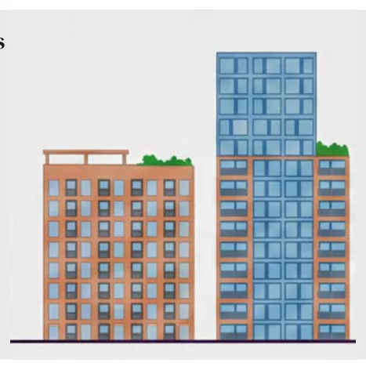

<!-- page 100 -->

Mosman Masterplan 96 SJB

### Urban design framework

### Building typologies intent

M

A C P H

E R S O N

S T R E E T

T E E R T S D R A R E G M I L I T A R Y R O A D

M I L I T A R Y R O A D

S P I T R O A D

BRADLEYS HEAD ROAD

CHOWDER BAY ROAD SHADFORTH STREET SPOFFORTH STREET

MIDDLE HEAD ROAD

MIDDLE HEAD ROAD

MILITARY ROAD

PEARL BAY AVENUE

CABRAMATTA ROAD

SIRIUS COVE ROAD

MANDOLONG ROAD

MUSGRAVE STREET

SOMERSET STREET

ROSEBERY STREET

RANGERS AVENUE

CENTRAL AVENUE

HARBOUR STREET

#### 1801 FORT TRACK

STANLEY AVENUE

CREMORNE LANE

WOLSELEY ROAD

BARDWELL ROAD

MOSMAN STREET

PINDARI AVENUE

BLOXSOME LANE

ALMORA STREET

MUSTON STREET

MEDUSA STREET

THE ESPLANADE

RAGLAN STREET

RAGLAN STREET

GLOVER STREET

MYAHGAH ROAD

MORUBEN ROAD

KARDINIA ROAD

BELMONT ROAD

MORELLA ROAD

QUAKERS ROAD

HORDERN LANE

SPENCER ROAD

STANTON ROAD

KAREELA ROAD

AWABA STREET

JULIAN STREET

QUEEN STREET

KAREELA LANE

REDAN STREET BOTANIC ROAD NOBLE STREET

PARRIWI ROAD

COWLES ROAD

UNION STREET

BICKELL ROAD

BOYLE STREET

LINDSAY LANE

DAVID STREET

AVENUE ROAD SUAKIN DRIVE

DALTON ROAD

MILSON ROAD

VISTA STREET

PARK AVENUE

HOLT AVENUE

BOND STREET

WYONG ROAD

WUNDA ROAD

RUBY STREET

PUNCH LANE

REDAN LANE

ILUKA ROAD

IDA AVENUE

SILEX ROAD

BAY STREET

HALE ROAD

THE GROVE

CREMORNE ORTH SYDNEY

MILSONS POINT

VENDER BAY

VICTORIA CROSS METRO

CAMMERAY

NORTH SYDNEY

POINT

KURRABA POINT

CREMORNE

CLIFTON GARDEN RESERVE

MIDDLE HEAD

BRADLEYS HEAD

TAROONGA ZOO KEY

LGA boundary

Mosman Masterplan boundary

Dwelling houses

Semi-detached dwellings

Medium density residential flat buildings

High density residential flat buildings, Shop top housing

Shop top housing

Open space

The proposed land use framework enables a diverse range of building typologies to be delivered across the LGA, ensuring housing choice and accessibility for a broad spectrum of residents, households and tenant demographics.

A key objective of the masterplan is to retain the diversity of housing typologies currently permissible within Mosman while increasing the amount of land where higher-density residential development, including residential flat buildings and shop top housing, is permitted. This approach supports the delivery of additional housing opportunities in medium and high density locations while maintaining the character and housing diversity of the LGA.

The map below illustrates the spatial distribution and extent of housing typologies permissible under the zoning of residential and local centre land from the single dwelling home permissible along edges and the high density residential flat buildings permissible within the masterplan area.

1:20000 @ A3 Building typologies

August 2026

Attachment 1.1.1 Mosman Council

<!-- page 101 -->

Mosman Masterplan 97 SJB

Active frontages recommendation

### Urban design framework

### Active frontages recommendations

The objective of active frontages is to promote uses that attract pedestrian traffic along ground floor street frontages within the local center

Primary active frontages

— Promote continuous ground floor activity to address key streets, public spaces and transport nodes — No vehicular access permitted — No residential uses permitted with the exemption of residential lobbies to a commercial, residential, serviced apartment or hotel component of the building.

Secondary active frontages

Objectives

— Promote continuous ground floor activity to address key streets, public spaces and transport nodes. — To provide lobby access for a commercial, residential, serviced or hotel component of the building, as well as fire service, vehicular access and loading.

COWLES RD

ART GALLERY WAY

GOULDSBURY ST

BELMONT RD

COWLES RD

COWLES RD

HARBOUR ST

HARBOUR ST

WUNDA RD NOBLE ST

BRADY ST

OURIMBAH RD

OURIMBAH RD

AWABA ST

AWABA ST

KILLARNEY ST AWABA LN

AMIENS AVE STANTON LN

STANTON RD

WARRINGAH RD

PARRIWI RD

BICKELL RD

HORDERN PL

HEYDON ST

HORDERN LN

SPIT RD

CIVI LN

RAWSON ST

SPIT RD

SPIT RD

PUNCH ST

CLIFFORD ST

MORUBEN RD

HORSNELL LN GURRIGAL ST VISTA ST

VISTA ST

MYAHGAH RD

BOND ST LANG ST

SHELL ST

MACKIE LN

HALE RD

HALE RD MACPHERSON ST

ERITH ST

PRINCE ST

MELROSE ST

MILITARY RD MILITARY RD

MILITARY RD

EARL ST

PRINCE ST

BELMONT RD

GLOVER ST

LINDSAY LN

CABRAMATTA RD

TWIN TOWERS WALK

BARDWELL RD

BARDWELL RD WUDGONG ST CARDINAL ST

CARDINAL ST

ROSEBERY ST COUNTESS ST

THE C RESCENT

KEY

Mosman masterplan boundary

Primary active frontage

Secondary active frontage

Heritage items

School

Open space

1:14000 @ A3

August 2026

Attachment 1.1.1 Mosman Council

<!-- page 102 -->

Mosman Masterplan 98 SJB

### Urban design framework

### Community infrastructure delivery strategy

Community infrastructure delivery strategy

The masterplan leverages local planning provisions applicable to key development sites to facilitate the provision of community infrastructure as part of privately initiated developments. This approach is complemented by infrastructure delivery led by Council on Council-owned or dedicated land, ensuring a coordinated and comprehensive outcome across the precinct. Within the proposed civic precinct, the following community facilities are to be delivered:

— A new Mosman Library, incorporating a youth centre, senior centre and flexible community spaces — Public parking provisions to support increased activity and accessibility — An expanded and enhanced Village Green (approximately 2,000 sqm), featuring an upgraded playground and an outdoor performance stage

To support delivery outcomes, local planning provisions will include incentive Floor Space Ratio (FSR) mechanisms for key sites. These incentives are intended to facilitate the provision of:

— Three indoor sports courts — Additional community facilities, or alternatively, additional affordable housing for identified key sites A 2,000 sqm publicly accessible open space at 6 Hale Road (The Manors of Mosman site) — A 1,500 sqm publicly accessible open space at the Bridgepoint Shopping Centre — Publicly accessible through site links breaking down long blocks increasing pedestrian accessibility and permeability

This integrated framework aligns private development potential with public benefit, ensuring the timely and equitable delivery of essential community infrastructure.

For details on the provisions and key sites refer to implementation plan chapter.

Sacred Hear Catholic Primary School

Allan Border Oval

Mosman Library

Mosman Bowling Club

Middle Habour Public School

Mosman Public School

Mosman High School

1500sqm 2000sqm

1:14000 @ A3

KEY

Mosman masterplan boundary

School

Proposed indoor courts

Proposed privately owned publicly accessible open space Greater affordable housing contribution and/or community facility

Community facility

Performance space

Playground

Pedestrian through site links

Proposed land dedication

Heritage items

School

Open space

August 2026

Attachment 1.1.1 Mosman Council

<!-- page 103 -->

Mosman Masterplan 99 SJB

Public domain and open space framework

### Urban design framework

### Public domain and open space framework

1:14000 @ A3

1500sqm 2000sqm

COWLES RD

MITCHELL RD BAPAUME RD

ART GALLERY WAY

GOULDSBURY ST

BELMONT RD

COWLES RD

COWLES RD

HARBOUR ST

HARBOUR ST

WUNDA RD NOBLE ST

BRADY ST

OURIMBAH RD

OURIMBAH RD

AWABA ST

AWABA ST

KILLARNEY ST AWABA LN

AMIENS AVE STANTON LN

STANTON RD

WARRINGAH RD

PARRIWI RD

BICKELL RD

HORDERN PL

HEYDON ST

HORDERN LN

PUNCH LN

RAWSON ST

SPIT RD

CIVI LN FIELD WAY

SPIT RD

SPIT RD

PUNCH ST

CLIFFORD ST

MORUBEN RD

HORSNELL LN GURRIGAL ST VISTA ST

VISTA ST

MYAHGAH RD

BOND ST

LANG ST

SNELL ST

MACKIE LN

HALE RD

HALE RD MACPHERSON ST

ERITH ST

PRINCE ST

MELROSE ST

MILITARY RD MILITARY RD

MILITARY RD

EARL ST

PRINCE ST

BELMONT RD

GLOVER ST

LINDSAY LN

CABRAMATTA RD

TWIN TOWERS WALK

BARDWELL RD

BARDWELL RD WUDGONG ST CARDINAL ST

CARDINAL ST

ROSEBERY ST COUNTESS ST

THE CRE S CENT

KEY

Boundary

Open space

Heritage items

School

Bus lane

Retained street vegetation

Retained mature tree canopy

Surrounding precinct canopy coverage

Proposed street canopy

Peel Off Corners

Privately owned publicly accessible open space

Proposed public open space

Active travel links

5m deep soil setback

2m deep soil setback

Pedestrian only zones

Shared zones

Playground

Objective

To deliver integrated and connected open spaces that are accessible and an active travel network consistent with the diagram opposite, in accordance with the controls outlined within the public domain and open space framework, including:

— Active travel links — Deep soil front setbacks — Privately owned publicly accessible open spaces design recommendations — Setbacks with the purpose of providing improved public domain — Tree canopy cover

August 2026

Attachment 1.1.1 Mosman Council

<!-- page 104 -->

Mosman Masterplan 100 SJB

### Urban design framework

MILITARY RD

MILITARY RD

HORSNELL LN

VISTA ST Playground

Perormance space Library

Ar gallery

Community/ retail/ commercial Retail Commercial

Retail/commercial

Area: 2,000m²

10ST

6ST 6ST

5ST

No additional overshadowing

Civic precinct

Provide a minimum 2,000 m² Village Green, a southern extension of the Myahgah Road plaza, and convert The Crescent into a pedestrian-priority shared zone, coordinated with the delivery of the new library and associated basement public parking.

H

Seating

Seating

Playground

HEYDON ST

BRADY ST

Area: 1,500m²

Bridgepoint plaza

Provide a minimum 1,500m² public plaza to function as a public open space including connections between Brady Street, Heydon Street and Hordern Place. Ensure the plaza incorporates a minimum 10% deep soil area and achieves at least 40% canopy coverage.

MELROSE ST

HALE RD

5m

5m Varies Varies Varies

5m

5m Area: min30 sqm

Varies

Varies

Varies Varies

Varies

Area: min30 sqm

Area: min30 sqm

Area: min30 sqm

Area: 2,000m² 4h to 50%

Minimum 40m

Peel off corners

Provide building corner setbacks at designated intersections with a minimum perpendicular bisector (depth) of 5m. Setback areas are to function as buffer zones that mitigate traffic impacts and incorporate landscaped edges and opportunities for informal seating.

Design recommendations and requirements for public open spaces, including privately owned publicly accessible open spaces proposed within the master plan, are illustrated in the diagrams opposite. The design and delivery of these spaces must demonstrate compliance with the objectives and requirements outlined in this section.

Hale Road open space

To be designed to have the largest road frontage and a minimum site area of 2000 sqm, through site link connecting to Macpherson St and visible from through site link on the east of Hale Street. To be 100% deep soil, to provide a playground space, seating and tree canopy in particular along the street edge. Built form to be designed to guarantee 4h of solar access to 50% of the open space area.

KEY

Minimum area

Pedestrian only zone

Pedestrian crossing

Shared zone

Deep soil with landscape treatment

Planting

Hard scape

Larger road kerb area

Public parking

Vehicle access

Pedestrian access

Active frontage - 0m

Main road

Noise

New playground

New performance space

Community facility

Solar control

### Public space character recommendations

August 2026

Attachment 1.1.1 Mosman Council

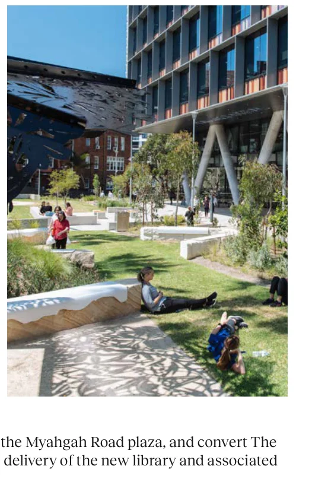

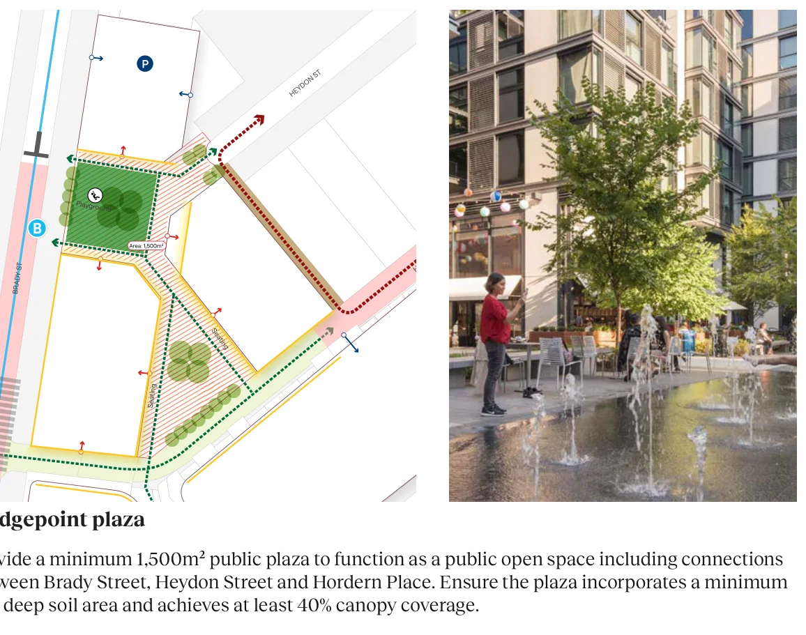

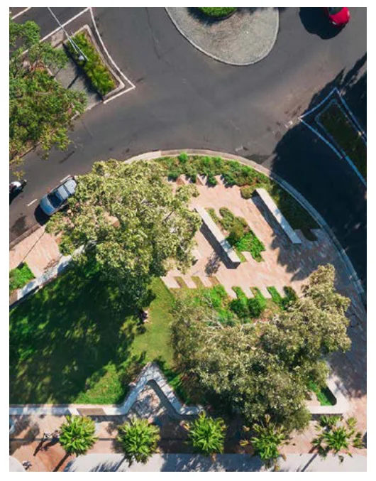

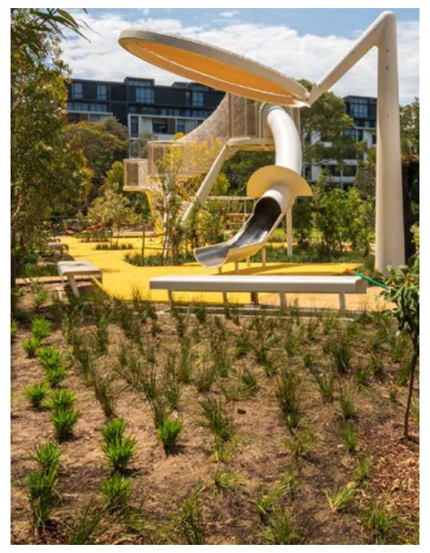

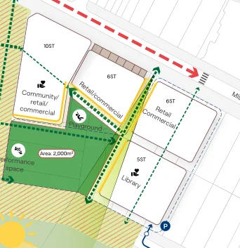

<!-- page 105 -->

Mosman Masterplan 101 SJB

### Urban design framework

### Landscape front and rear setback recommendations

RESIDENTIAL

RESIDENTIAL

RESIDENTIAL

RESIDENTIAL

RESIDENTIAL

RESIDENTIAL

RESIDENTIAL

5m

8m - Front setback

Arerial Road

Deep soil

3m

Front boundary

RESIDENTIAL - 3

RESIDENTIAL - 2

RESIDENTIAL - 1

RESIDENTIAL - 4

RESIDENTIAL - 5

RESIDENTIAL - 6

2m

5m - Front setback

Deep soil

3m

Residential Road

Front boundary

RESIDENTIAL

RESIDENTIAL

RESIDENTIAL

RESIDENTIAL

RESIDENTIAL

RESIDENTIAL

RESIDENTIAL

Communal open space

9m

Rear setback

5m landscape setbacks in Ourimbah Triangle character area

5m front setback for residential area within the Ourimbah Triangle subject to a 5m setback  to include a minimum of 2m deep soil for tree planting along the primary frontage.

Rear setback in Ourimbah Triangle character area

9m rear setback for 8 storey residential areas within the Ourimbah Triangle character area to ensure retention of existing mature trees at rear and for the provision of communal open space.

8m setback along Arterial Roads

8m front setback for residential along Spit Road and Military Road to include a minimum of 5m deep soil for tree planting along the primary frontage.

Sample section of 8m landscape setback Sample section of 5m landscape setback Sample section of 9m rear setback

August 2026

Attachment 1.1.1 Mosman Council

<!-- page 106 -->

Mosman Masterplan 102 SJB

### Urban design framework

### Tree canopy cover recommendations

Tree canopy recommendations

COWLES RD

ART GALLERY WAY

COWLES RD HARBOUR ST

BRADY ST

OURIMBAH RD

AWABA ST

AWABA ST

KILLARNEY ST

AMIENS AVE

STANTON RD

WARRINGAH RD

HORDERN PL

SPIT RD

PUNCH ST

CLIFFORD ST

MORUBEN RD

HORSNELL LN GURRIGAL ST VISTA ST

BOND ST

LANG ST

SHELL ST

MACKIE LN HALE RD

MACPHERSON ST

ERITH ST

PRINCE ST

PRINCE ST

MELROSE ST

EARL ST

OURIMBAH RD

BELMONT RD

BELMONT RD

GLOVER ST

LINDSAY LN

BARDWELL RD

WUDGONG ST CARDINAL ST

ROSEBERY ST COUNTESS ST

KEY

Mosman masterplan boundary

Existing canopy

Proposed open space

Trees to be retained

Recommended street trees

5m landscape setback (2m deep soil for tree planting)

8m landscape setback (5m deep soil for tree planting)

40% tree canopy target

Heritage items

School

Open space 1:14000 @ A3

The Mosman LGA has an existing tree canopy cover of 37% (refer to place understanding chapter). A tree canopy cover of 40% is recommended to ensure that existing landscape and trees are retained and protected, while new trees are introduced to increase canopy cover by 3%.

The following principles are recommended for new development in relation to tree canopy cover:

— Maximise tree canopy and green cover on streets, in open spaces and along the public domain. — Create a contiguous tree canopy to mitigate climate change and improve the health and wellbeing of people and ecosystems. — Prioritise native local species of vegetation . — Collaborate with local aboriginal custodians to highlight first nations connection to Mosman through vegetation. — Integrate Water Sensitive Urban Design (WSUD) measures in streets and spaces to harness rainwater to promote vegetation growth.

Tree canopy targets can be achieved by:

1. Protecting and strengthening existing trees and vegetation in Mosman. 2. Implementing recommended controls for deep soil and landscaping. 3. Requiring new development within the Mosman LGA to deliver 40% of the site area as landscaped area. Landscaped area means a part of a site used for growing plants, grasses and trees, but does not include any building, structure or hard-paved area. 4. For any on-street car parking, interspersed tree pits should be placed as follows: — one tree pit for every three end-on-end car spaces; — one tree pit for every five parallel car spaces.

### TARGET

### CANOPY COVER

## 40%

August 2026

Attachment 1.1.1 Mosman Council

<!-- page 107 -->

Mosman Masterplan 103 SJB

Solar access recommendations

### Urban design framework

### Public space solar access recommendations

COWLES RD

ART GALLERY WAY

GOULDSBURY ST

BELMONT RD

COWLES RD

COWLES RD

HARBOUR ST

HARBOUR ST

WUNDA RD NOBLE ST

BRADY ST

OURIMBAH RD

OURIMBAH RD

AWABA ST

AWABA ST

KILLARNEY ST AWABA LN

AMIENS AVE STANTON LN

STANTON RD

WARRINGAH RD

PARRIWI RD

BICKELL RD

HORDERN PL

HEYDON ST

HORDERN LN

SPIT RD

CIVI LN

RAWSON ST

SPIT RD

SPIT RD

PUNCH ST

CLIFFORD ST

MORUBEN RD

HORSNELL LN GURRIGAL ST VISTA ST

VISTA ST

MYAHGAH RD

BOND ST LANG ST

SHELL ST

MACKIE LN

HALE RD

HALE RD MACPHERSON ST

ERITH ST

PRINCE ST

MELROSE ST

MILITARY RD MILITARY RD

MILITARY RD

EARL ST

PRINCE ST

BELMONT RD

GLOVER ST

LINDSAY LN

CABRAMATTA RD

TWIN TOWERS WALK

BARDWELL RD

BARDWELL RD WUDGONG ST CARDINAL ST

CARDINAL ST

ROSEBERY ST COUNTESS ST

THE C RESCENT

KEY

Mosman masterplan boundary

Heritage items

School

Open space

No additional overshadowing 4h of solar access to 50% of the total area between 9:00AM and 3:00PM on the winter solstice 1:14000 @ A3

The following solar access controls are recommended for the protection of solar access to key existing and proposed public and private open spaces. The solar access controls are established at mid-winter (21 June).

Where no specific solar access requirements apply to an existing or proposed public and private open spaces, the design must demonstrate that solar access has been considered and that the design provides the best achievable solar access.

August 2026

Attachment 1.1.1 Mosman Council

<!-- page 108 -->

Mosman Masterplan 104 SJB

Additional planning capacity map

### Urban design framework

### Recommended uplift (additional FSR)

Mosman LEP - Floor Space Ration (FSR) map KEY  MLEP

LGA boundary Area 1 0.5 0.55 0.6 0.7 0.8 1 1.3 2 2.5 3

The additional planning capacity is generated through the proposed increase in FSR, referred to as “uplift.”

This uplift is applied across the identified areas of change to deliver the intended development outcomes and includes FSR assigned to key sites that are required to deliver public benefits as these are calibrated to ensure redevelopment feasibility. Hence this FSR is likely to be taken up should development occur.

The cumulative uplift across the precinct is required to achieve a total housing capacity equivalent to the LMR, which is defined as 950,000 square metres of Gross Floor Area (GFA).

COWLES RD

ART GALLERY WAY

GOULDSBURY ST

BELMONT RD

COWLES RD

COWLES RD

HARBOUR ST

HARBOUR ST

WUNDA RD NOBLE ST

BRADY ST

OURIMBAH RD

OURIMBAH RD

AWABA ST

AWABA ST

KILLARNEY ST AWABA LN

AMIENS AVE STANTON LN

STANTON RD

WARRINGAH RD

PARRIWI RD

BICKELL RD

HORDERN PL

HEYDON ST

HORDERN LN

SPIT RD

CIVI LN

RAWSON ST

SPIT RD

SPIT RD

PUNCH ST

CLIFFORD ST

MORUBEN RD

HORSNELL LN GURRIGAL ST VISTA ST

VISTA ST

MYAHGAH RD

BOND ST LANG ST

SHELL ST

MACKIE LN

HALE RD

HALE RD MACPHERSON ST

ERITH ST

PRINCE ST

MELROSE ST

MILITARY RD MILITARY RD

MILITARY RD

EARL ST

PRINCE ST

BELMONT RD

GLOVER ST

LINDSAY LN

CABRAMATTA RD

TWIN TOWERS WALK

BARDWELL RD

BARDWELL RD WUDGONG ST CARDINAL ST

CARDINAL ST

ROSEBERY ST COUNTESS ST

THE C RESCENT

+ 0.0:1 FSR

+ 6.5:1 FSR

+ 5:1 FSR

ADDITIONAL GFA

### 950,000M2

1:14000 @ A3

August 2026

Attachment 1.1.1 Mosman Council

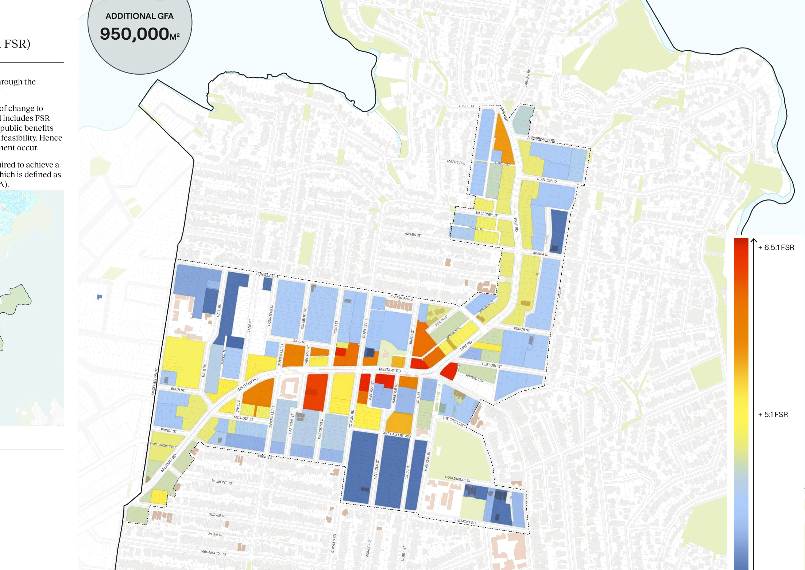

<!-- page 109 -->

Mosman Masterplan 105 SJB

## Mosman Village North

### Structure plan

St15

St18

St10

St6

St4

St22

St15

St12

St8

St8

St8 St8

St8

St3 St3 St3

t4 St4

St8

2

St8 St8

St6

St6

St6

St12 St12

St15 St15 St15

St18 St18 St15

St18 St12

St18 St12

St12

St12

St10

St20

St8 St8

St6

St6

St6

St6

St6

St6

St6

St12

St12

St12

St12

St6 St8

St8

St8

St8

St8

St10

St8

St6 St6

1500sqm

40 40

40

40

40

40 40 40 40

40

Allan Border Oval

COWLES RD

ART GALLERY WAY

GOULDSBURY ST

THE CRESCENT

COWLES RD

COWLES RD

HARBOUR ST

BRADY ST

OURIMBAH RD

OURIMBAH RD

AWABA ST

AWABA ST

KILLARNEY ST

AWABA LN

HORDERN PL

HEYDON ST

HORDERN LN

SPIT RD

CIVI LN

PUNCH LN

SPIT RD

PUNCH ST

CLIFFORD ST

HORSNELL LN FIELD WAY

GURRIGAL ST VISTA ST

VISTA ST

MYAHGAH RD

BOND ST

MILITARY RD Y RD

MILITARY RD

CE ST

WUDGONG ST

WUDGONG ST

CARDINAL ST

CARDINAL ST

ROSEBERY ST

1:4000 @ A3

MILITARY ROAD

ROSEBERY STREET

HARBOUR STREET

STANLEY AVENUE

ROAD

ALMORA STREET

MUS

MYAHGAH ROAD

MORUBEN ROAD

AD

HORDERN LANE

AWABA STREET

OAD

DALTON ROAD

VISTA STREET

BOND STREET PUNCH LANE

R Mosman Village North is envisioned to evolve into a highly activated retail precinct, anchored by major shopping destinations, full-line supermarkets, and a vibrant food and beverage offering.

The masterplan adopts a ‘one street back’ strategy, concentrating activity within laneways rather than along Military Road. This approach is implemented through the transformation of Horden Place into a pedestrian-only zone, the restriction of through- traffic along Brady Street (with bus access maintained), and the creation of a new active open space on the Bridgepoint site. This space will integrate retail, dining, and community uses, including shops, restaurants, cafés, a playground, and landscaped public realm.

Heights vary from 22 to 10 storey with landmark towers marking Spit Juction and creating a primaraly high density mixed use character.

Collectively, these interventions aim to establish Mosman Village North as a highly permeable, active, retail destination, one that is welcoming, safe, and adaptable for the future community.

Spicey Alley, Chippendale (ASPECT) Mosman Village North structure plan

4A Reserve Road, St Leonards (Arcadia)

KEY

Boundary

Open space

Heritage items

School

B-line

Bus stop

Bus lane

Privately owned publicly accessible open space

School grounds open space Retained street vegetation

Retained mature tree canopy

Proposed street canopy

Proposed public open space

Pedestrian only zones

Shared zones

Active frontage - 0m

Front setback - 1.5m

Front setback - 3m

Front setback - 4m

Front setback - 4.5m

Front setback - 5m

Rear setback - 9m Streetwall height - 2 storey Streetwall height - 6 storey Key site

Proposed crossing

Existing through site link Proposed through site link

Green pedestrian link

Land dedication

Proposed road

40 40km/h speed limit

Proposed signalised intersection

Existing public parking

Pick-up drop-off area

Proposed basement access

Calm streets

Closed off roads

Traffic direction

Pedestrian bridge

Peel Off Corners

Low-density residential Medium-density residential High-density residential

Local centre

Infrastructure

Retail anchor

New playground

August 2026

Attachment 1.1.1 Mosman Council

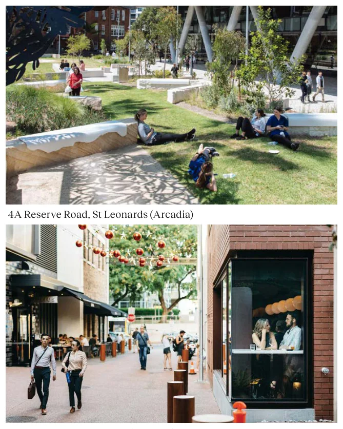

<!-- page 110 -->

Mosman Masterplan 106 SJB

### Spit Road, Mosman Village North

BRADY ST

OURIMBAH RD

OURIMBAH RD

HEYDON ST HORDERN PL

SPIT RD

MILITARY RD

MILITARY RD

BRADY ST

OURIMBAH RD HEYDON ST HORDERN PL

SPIT RD

MILITARY RD

### Reference scheme massing

Village North Northeast View Village North Southwest View

KEY

Character area

Residential

Retail / Commercial

Heritage item

Conservation area

Open space

Note:

The reference scheme is illustrative only and provides a diagrammatic representation of potential building envelopes achievable under the proposed planning and built form controls. The scheme includes development only on sites considered to be deliverable within the master plan timeframe. Existing buildings on constrained sites have been retained, as their redevelopment is not considered feasible within this period. Assumptions have been made regarding potential site amalgamation patterns, noting that these are subject to uncertainty and may vary depending on landowner participation and market conditions. The reference scheme should therefore be understood as one of several possible future development scenarios. The indicative building massing shown is, however, fully compliant with the proposed planning framework.

22

22

12 12

20

20

18

15

12

12

18

15

15

15 15

15

12

12

12

August 2026

Attachment 1.1.1 Mosman Council

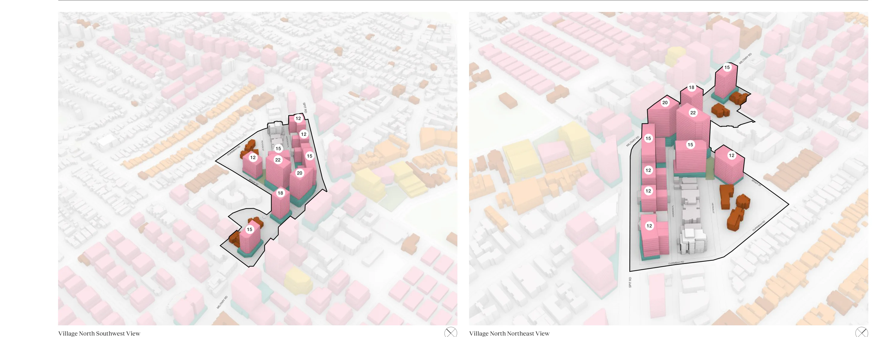

<!-- page 111 -->

Mosman Masterplan 107 SJB

### Mosman Village North

### Cross section

MILITARY ROAD

ROSEBERY STREET

HARBOUR STREET

STANLEY AVENUE

ROAD

ALMORA STREET

MUS

MYAHGAH ROAD

MORUBEN ROAD

AD

HORDERN LANE

AWABA STREET

OAD

DALTON ROAD

VISTA STREET

BOND STREET

PUNCH LANE

R

Military Road Ourimbah Road Cowles Road Brady Street Spit Road

KEY

Character area boudary

Residential

Retail / Commercial

Envelope

1:1500 @ A3 1:1500 @ A3 Mosman Village North North-South Section

Key Plan

Mosman Village North East-West Section

August 2026

Attachment 1.1.1 Mosman Council

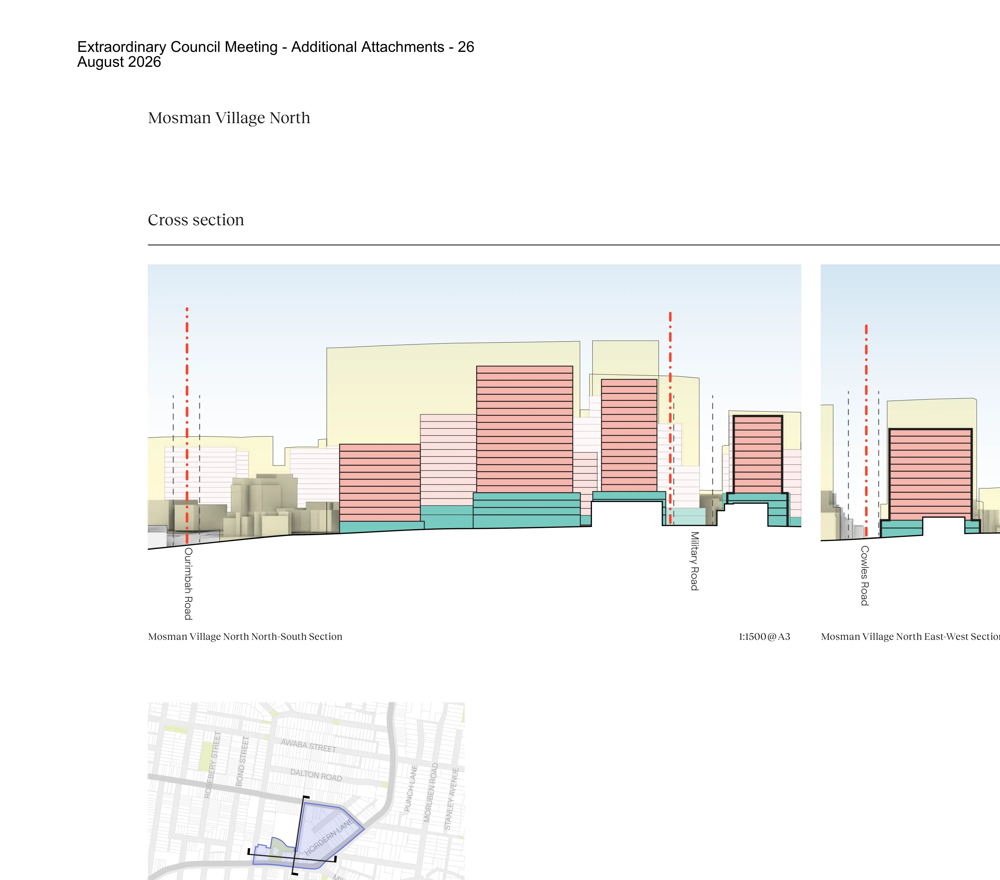

<!-- page 112 -->

Mosman Masterplan SJB 108

Artist’s impression of the Bridgepoint publicly accessible open space

COWLES RD

ART GALLERY WAY GOULDSBURY ST BELMONT RD

COWLES RD

OWLES RD

HARBOUR ST

HARBOUR ST

NDA RD ST

BRADY ST

OURIMBAH RD OURIMBAH RD AWABA ST AWABA ST KILLARNEY ST AWABA LN

AMIENS AVE STANTON LN STANTON RD

WARRINGAH RD

P BICKELL RD

HORDERN PL HEYDON ST HORDERN LN SPIT RD CIVI LN

RAWSON ST

SPIT RD

SPIT RD

PUNCH ST CLIFFORD ST

MORUBEN RD

HORSNELL LN GURRIGAL ST VISTA ST

VISTA ST MYAHGAH RD

BOND ST LANG ST

SHELL ST

MACKIE LN

HALE RD

HALE RD MACPHERSON ST ERITH ST PRINCE ST MELROSE ST

MILITARY RD MILITARY RD

MILITARY RD

EARL ST

PRINCE ST BELMONT RD GLOVER ST LINDSAY LN CA

TWIN TOWERS WALK

BARDWELL RD

BARDWELL RD WUDGONG ST CARDINAL ST

CARDINAL ST

ROSEBERY ST COUNTESS ST

THE C RESCENT

August 2026

Attachment 1.1.1 Mosman Council

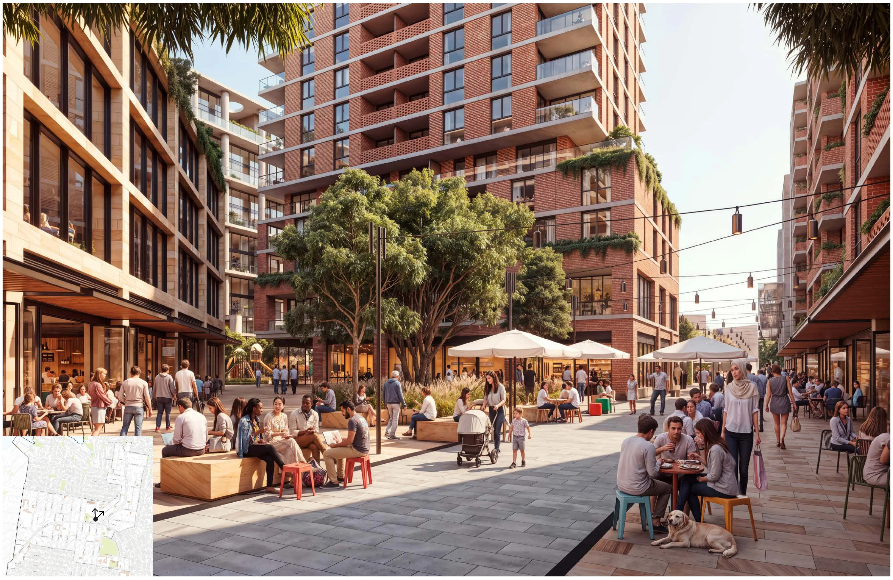

<!-- page 113 -->

Mosman Masterplan 109 SJB

## 1

## Mosman Village South

### Mosman Village South- Structure plan

St15

St18

St10

St6

St4

St22

St15

St12

St8

St8

St8 St8

St8

St3 St3 St3

St4

St8

St8 St8

St6

St6

St6

St12 St12

St15 St15 St15

St18 St18 St15

St18 St12

St18 St12

St12

St12

St10

St20

St8 St8

St6

St6

St6

St6

St6

St6

St12

St12

St8

St8

St8

St10

St8

St6

St6 St3

1500sqm

40

40

40

40 40 40

40

Mosman Public School

Allan Border Oval

COWLES RD

ART GALLERY WAY

GOULDSBURY ST

BELMONT RD

THE CRESCENT

COWLES RD

COWLES RD

HARBOUR ST

HARBOUR ST

BRADY ST

OURIMBAH RD

OURIMBAH RD

HORDERN PL

HEYDON ST

HORDERN LN

SPIT RD

CIVI LN

PUNCH LN

SPIT RD

PUNCH ST

CLIFFORD ST

HORSNELL LN FIELD WAY

GURRIGAL ST VISTA ST

VISTA ST

MYAHGAH RD

BOND ST

MILITARY RD

MILITARY RD

WUDGONG ST

WUDGONG ST

1:4000 @ A3 Lume,  Newcastle (SJB)

Surry HIlls Village, Surry Hills (SJB)

MILITARY ROAD MA

ROS

HARBOUR STREET

STANLEY AVE

ALMORA STREET

MUSTON STREET

MYAHGAH ROAD

MORUBEN HORDERN LANE

REDAN STREET NOBLE STREET COWLES ROAD

VISTA STREET

B

WUNDA ROAD

PUNCH

REDAN LANE

THE GROVE

Mosman Village South is envisaged as the primary civic and public focal area within Mosman. This character is supported by a concentration of existing civic assets, including the Mosman Art Gallery, Mosman Council building, and Mosman Library, all located around Allan Border Oval, which serves as the green heart of the local sporting community and main recreational space. The civic character of this precinct will be strengthened through the delivery of a new library, an expanded and enhanced village green, and associated public parking. Building heights within and surrounding the civic precinct are generally capped at 10 storeys to maintain a mid-density character. A landmark building of up to 18 storeys is proposed at Spit Junction to provide a visual marker and reinforce the strategic importance of this location. Residential areas to the south of Allan Border Oval will maintain a transition in scale, with two-storey development on the western side, three-storey development along the southern edge, and retention of the established low-scale character area on the eastern side. The civic precinct will accommodate a range of community-focused uses, including library facilities, as well as complementary retail and commercial uses to support local activity and vitality. The council owned depot site is also envisioned for redevelopment up to 10 storey with relocation of SES in a more appropriate location.

Mosman Village South structure plan

KEY

Boundary

Open space

Heritage items

School

Bus stop

Bus lane

Heritage conservation areas De-listed heritage conservation areas

Privately owned publicly accessible open space

School grounds open space Retained street vegetation

Retained mature tree canopy

Proposed street canopy

Proposed public open space

Pedestrian only zones

Shared zones

Active frontage - 0m

Front setback - 1.5m

Front setback - 3m

Front setback - 4m

Front setback - 4.5m

Front setback - 5m

Front setback - 8m

Rear setback - 9m Streetwall height - 2 storey Streetwall height - 6 storey

Key site

Proposed crossing

Proposed roundabout

Existing through site link Proposed through site link

Green pedestrian link

Land dedication

Proposed road

40 40km/h speed limit

Proposed signalised intersection

Existing public parking

Proposed basement access

Calm streets

Closed off roads

Traffic direction

Pedestrian bridge

Peel Off Corners

Low-density residential Medium-density residential High-density residential

Local centre

Infrastructure

Retail anchor

Community anchor

Sporting anchor

Educational anchor

Council assets

August 2026

Attachment 1.1.1 Mosman Council

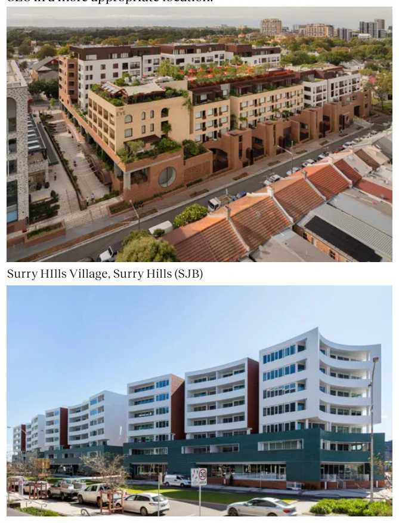

<!-- page 114 -->

Mosman Masterplan 110 SJB

### Mosman Village South

### Reference scheme massing

ART GALLERY WAY

GOULDSBURY ST

BELMONT RD

COWLES RD

HARBOUR ST

VISTA ST

MYAHGAH RD THE CRESCENT MILITARY RD

SPIT RD

ART GALLERY WAY

GOULDSBURY ST BELMONT RD

COWLES RD

HARBOUR ST

VISTA ST MYAHGAH RD

MILITARY RD

SPIT RD

THE

CRESCENT

Village South North View Village South Northwest View

KEY

Character area

Residential

Retail / Commercial

Council owned sites

Heritage item

Conservation area

Note:

The reference scheme is illustrative only and provides a diagrammatic representation of potential building envelopes achievable under the proposed planning and built form controls. The scheme includes development only on sites considered to be deliverable within the master plan timeframe. Existing buildings on constrained sites have been retained, as their redevelopment is not considered feasible within this period. Assumptions have been made regarding potential site amalgamation patterns, noting that these are subject to uncertainty and may vary depending on landowner participation and market conditions. The reference scheme should therefore be understood as one of several possible future development scenarios. The indicative building massing shown is, however, fully compliant with the proposed planning framework.

12

8

18

10

10 18 12 8

10 8

15

18 18

18

10 18

15

10

8

8

8

10

3

3

6

6

August 2026

Attachment 1.1.1 Mosman Council

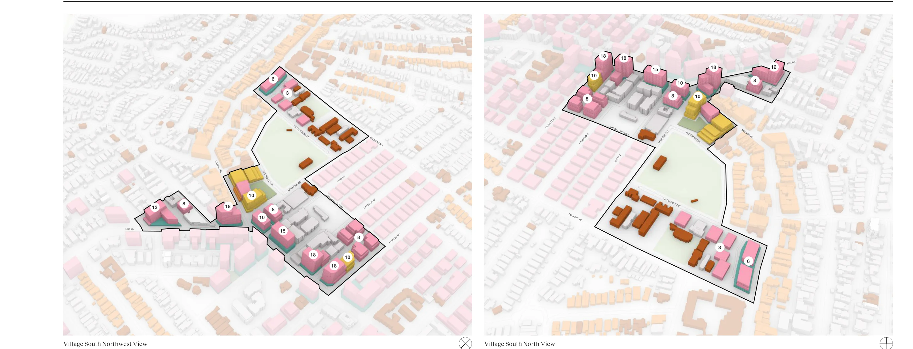

<!-- page 115 -->

Mosman Masterplan 111 SJB

### Mosman Village South

### Cross section

Myahgah Road Village Green Vista Street Gurrigal Street Harbour Street Harbour Street Cowles Road

MILITARY ROAD

MA

ROS

HARBOUR STREET

STANLEY AVE

ALMORA STREET

MUSTON STREET

MYAHGAH ROAD

MORUBEN

HORDERN LANE

REDAN STREET

NOBLE STREET

COWLES ROAD

VISTA STREET

B

WUNDA ROAD

PUNCH

REDAN LANE

THE GROVE

Key Plan

1:1500 @ A3 Mosman Village South East-West Section

KEY

Character area boudary

Residential

Retail / Commercial

Council owned sites

Envelope

August 2026

Attachment 1.1.1 Mosman Council

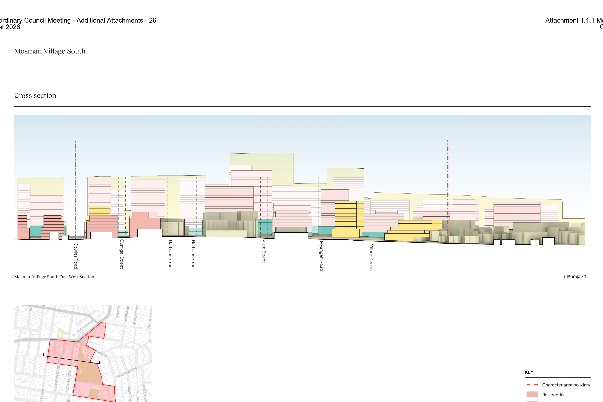

<!-- page 116 -->

Mosman Masterplan SJB 112

Artist’s impression of Military Road and Spit Road junction

COWLES RD

ART GALLERY WAY GOULDSBURY ST BELMONT RD

COWLES RD

OWLES RD

HARBOUR ST

HARBOUR ST

NDA RD ST

BRADY ST

OURIMBAH RD OURIMBAH RD AWABA ST AWABA ST KILLARNEY ST AWABA LN

AMIENS AVE STANTON LN STANTON RD

WARRINGAH RD

P BICKELL RD

HORDERN PL HEYDON ST HORDERN LN SPIT RD CIVI LN

RAWSON ST

SPIT RD

SPIT RD

PUNCH ST CLIFFORD ST

MORUBEN RD

HORSNELL LN GURRIGAL ST VISTA ST

VISTA ST MYAHGAH RD

BOND ST LANG ST

SHELL ST

MACKIE LN

HALE RD

HALE RD MACPHERSON ST ERITH ST PRINCE ST MELROSE ST

MILITARY RD MILITARY RD

MILITARY RD

EARL ST

PRINCE ST BELMONT RD GLOVER ST LINDSAY LN CA

TWIN TOWERS WALK

BARDWELL RD

BARDWELL RD WUDGONG ST CARDINAL ST

CARDINAL ST

ROSEBERY ST COUNTESS ST

THE C RESCENT

August 2026

Attachment 1.1.1 Mosman Council

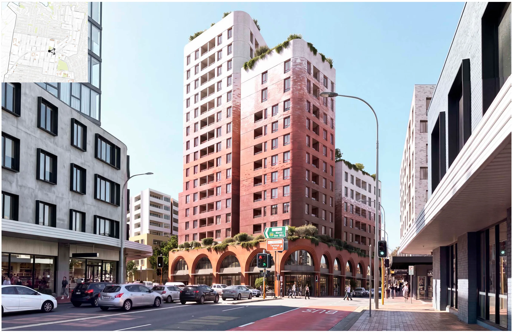

<!-- page 117 -->

Mosman Masterplan SJB 113

Artist’s impression of the Village Green looking north

COWLES RD

ART GALLERY WAY GOULDSBURY ST BELMONT RD

COWLES RD

OWLES RD

HARBOUR ST

HARBOUR ST

NDA RD ST

BRADY ST

OURIMBAH RD OURIMBAH RD AWABA ST AWABA ST KILLARNEY ST AWABA LN

AMIENS AVE STANTON LN STANTON RD

WARRINGAH RD

P BICKELL RD

HORDERN PL HEYDON ST HORDERN LN SPIT RD CIVI LN

RAWSON ST

SPIT RD

SPIT RD

PUNCH ST CLIFFORD ST

MORUBEN RD

HORSNELL LN GURRIGAL ST VISTA ST

VISTA ST MYAHGAH RD

BOND ST LANG ST

SHELL ST

MACKIE LN

HALE RD

HALE RD MACPHERSON ST ERITH ST PRINCE ST MELROSE ST

MILITARY RD MILITARY RD

MILITARY RD

EARL ST

PRINCE ST BELMONT RD GLOVER ST LINDSAY LN CA

TWIN TOWERS WALK

BARDWELL RD

BARDWELL RD WUDGONG ST CARDINAL ST

CARDINAL ST

ROSEBERY ST COUNTESS ST

THE C RESCENT

August 2026

Attachment 1.1.1 Mosman Council

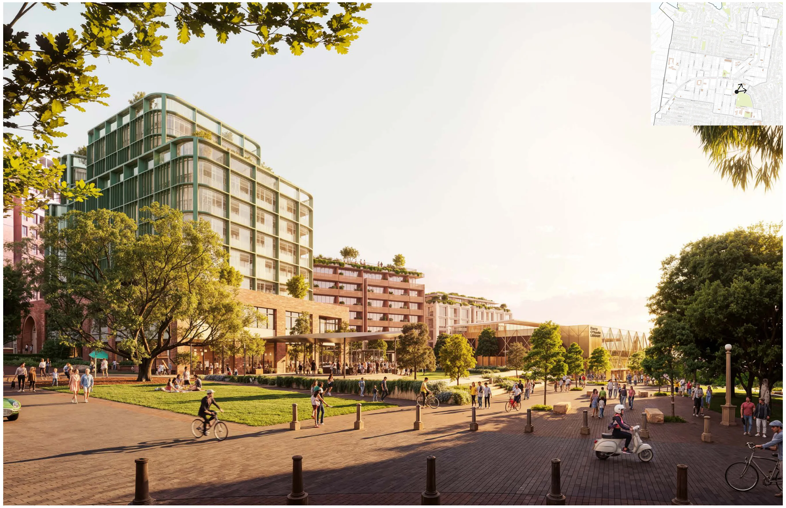

<!-- page 118 -->

Mosman Masterplan 114 SJB

## Ourimbah Triangle

### Ourimbah Triangle - Structure plan

St22

St1

St12

St6

St6

St8

St8

St12

St12 St6

St8

St8

St8 St8

St8

St8 St8

St4

St3

St3 St3 St3

St4 St4 St4 St4

St8

St8

St6

St12 St12

St8 St8

St6

St6

St6

St6

St12 St12

St15 St15 St15

St8

St18 St18 St15

St18

St12

St12

St12

St8

St12

St12

St12

St12

St12

St18 St12

St10

St12

St12 St20

St8 St8

St8 St6

St6

St3

St3

St3

St6

St1

St8

St6

St6 St6 St6

1500sqm

2000sqm

40 40 40 40 40

40

40

40

40

40 40 40 40 40

40

40

40

Sacred Hear Catholic Primary School

Middle Habour Public School COWLES RD

ART GALLERY WAY

COWLES RD

COWLES RD

HARBOUR ST

BRADY ST

OURIMBAH RD

GURRIGAL ST VISTA ST

VISTA ST

MYAHGAH RD

BOND ST

LANG ST

LANG ST

SNELL ST

MACKIE LN

HALE RD

HALE RD

MACPHERSON ST

ERITH ST

PRINCE ST

MELROSE ST

MILITARY RD MILITARY RD

MILITARY RD

MILITARY RD

EARL ST

OURIMBAH RD

PRINCE ST

PRINCE ST

BELMONT RD

TWIN TOWERS WALK

BARDWELL RD

BARDWELL RD

WUDGONG ST

WUDGONG ST

CARDINAL ST

CARDINAL ST

CARDINAL ST

ROSEBERY ST

COUNTESS ST

1:4000 @ A3

M

A C P H

E R S O N

S T R E E

A R Y R O A D

MI

ROSEBERY STREET

HARBOUR STREET

OAD

MYAHGAH ROAD BELMONT ROAD

HORDERN LA

AWABA STREET

AD

DALTON ROAD

VISTA STREET

BOND STREET

HALE ROAD

The Ourimbah Triangle is envisioned as a medium-density residential precinct, with building heights ranging from three to twelve storeys. Land use within the area is predominantly residential. The desired street character will be established through a prescribed 5-metre front setback, of which 2 metres are to be allocated as deep soil zones for tree planting. This approach will support the establishment of a continuous and robust tree canopy, reinforcing a leafy, residential character throughout the precinct. Traffic calming measures are proposed along the north– south local street. These include continuous landscaped verges to accommodate additional street tree planting, cobblestone threshold treatments at through-site link interfaces to prioritise pedestrian crossings, and angled on-street parking to increase parking provision for residents and visitors.

Mid-block through-site links are proposed to break down the length of the blocks and enhance pedestrian permeability. These connections will facilitate improved access to the school to the west, as well as the retail, civic precinct, and village centre to the east. Along Ourimbah Road, building heights are limited to a maximum of six storeys to provide a more gradual transition to established low-scale areas to the north.

Lume,  Newcastle (SJB)

The galleries,

Ourimbah Triangle structure plan

KEY

Boundary Open space Heritage items School

Bus stop

HCA De-listed HCA Privately owned publicly accessible open space School grounds open space

Retained mature tree canopy

Proposed street canopy Front setback - 1.5m Front setback - 3m Front setback - 4m Front setback - 5m

Rear setback - 9m

Streetwall height - 2 storey

Streetwall height - 6 storey

Proposed crossing

Existing through site link Proposed through site link

Green pedestrian link

40 40km/h speed limit

Proposed signalised intersection

Proposed basement access

Calm streets Low-density residential Medium-density residential

High-density residential Infrastructure Playground

Educational anchor

Council assets

August 2026

Attachment 1.1.1 Mosman Council

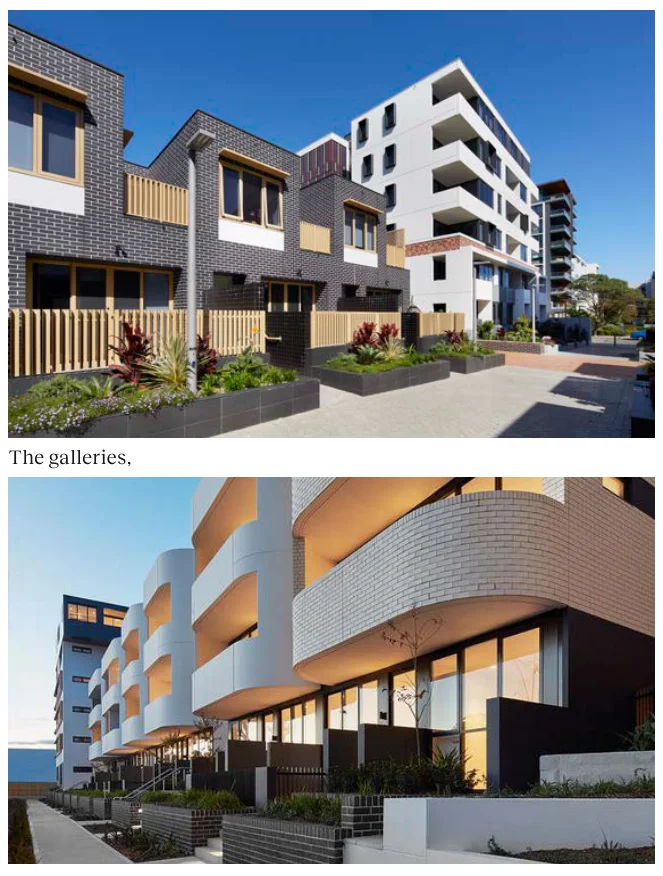

<!-- page 119 -->

Mosman Masterplan 115 SJB

### Ourimbah Triangle

### Reference scheme massing

COWLES RD

OURIMBAH RD

BOND ST

LANG ST

HALE RD

ERITH ST

MACPHERSON ST

MILITARY RD

ROSEBERY ST

COUNTESS ST

COWLES RD

BRADY ST

OURIMBAH RD

OURIMBAH RD

BOND ST

LANG ST

HALE RD

MACPHERSON ST

MILITARY RD

ROSEBERY ST

COUNTESS ST

Ourimbah Triangle Southwest View Ourimbah Triangle Northeast View

KEY

Character area

Residential

Retail / Commercial

Heritage item

Conservation area

Note:

The reference scheme is illustrative only and provides a diagrammatic representation of potential building envelopes achievable under the proposed planning and built form controls. The scheme includes development only on sites considered to be deliverable within the master plan timeframe. Existing buildings on constrained sites have been retained, as their redevelopment is not considered feasible within this period. Assumptions have been made regarding potential site amalgamation patterns, noting that these are subject to uncertainty and may vary depending on landowner participation and market conditions. The reference scheme should therefore be understood as one of several possible future development scenarios. The indicative building massing shown is, however, fully compliant with the proposed planning framework.

4

4

6

12

12

8

8

8

8

8

6

6 6

6

6

6

6

3 3

8

8

6

3

3

3 4

4

8

8 6

6

12 12

8 6

6

6

6

6

August 2026

Attachment 1.1.1 Mosman Council

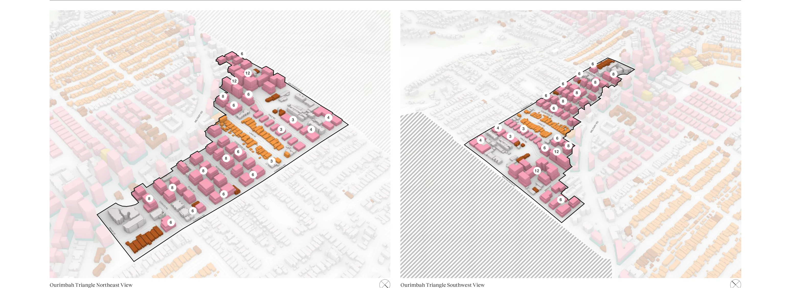

<!-- page 120 -->

Mosman Masterplan 116 SJB

### Ourimbah Triangle

### Cross section

Macpherson Street Hale Road Lang Street Countess Street Rosebery Street Bond Street

Cowles Road

M

A C P H

E R S O

N

S T R E E

A R Y

R O

A D

MI

ROSEBERY STREET

HARBOUR STREET

OAD

MYAHGAH ROAD

BELMONT ROAD

HORDERN LA

AWABA STREET

AD

DALTON ROAD

VISTA STREET

BOND STREET

HALE ROAD

Key Plan

1:2000 @ A3 Ourimbah Triangle East-West Section

KEY

Character area boudary

Residential

Retail / Commercial

Envelope

August 2026

Attachment 1.1.1 Mosman Council

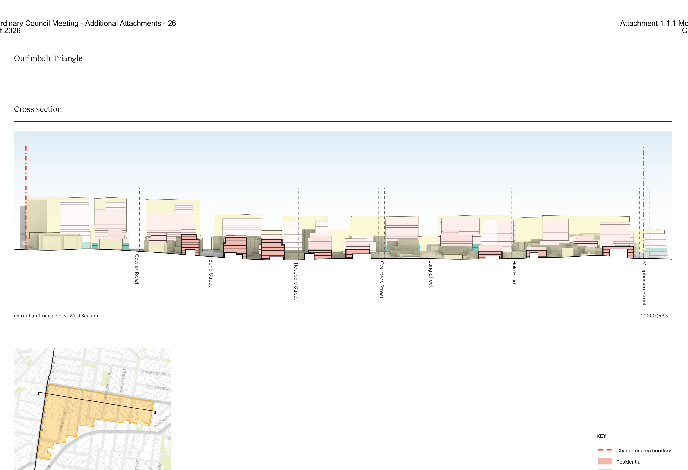

<!-- page 121 -->

Mosman Masterplan SJB 117

Artist’s impression of Bond St looking north

COWLES RD

ART GALLERY WAY GOULDSBURY ST BELMONT RD

COWLES RD

OWLES RD

HARBOUR ST

HARBOUR ST

NDA RD ST

BRADY ST

OURIMBAH RD OURIMBAH RD AWABA ST AWABA ST KILLARNEY ST AWABA LN

AMIENS AVE STANTON LN STANTON RD

WARRINGAH RD

P BICKELL RD

HORDERN PL HEYDON ST HORDERN LN SPIT RD CIVI LN

RAWSON ST

SPIT RD

SPIT RD

PUNCH ST CLIFFORD ST

MORUBEN RD

HORSNELL LN GURRIGAL ST VISTA ST

VISTA ST MYAHGAH RD

BOND ST LANG ST

SHELL ST

MACKIE LN

HALE RD

HALE RD MACPHERSON ST ERITH ST PRINCE ST MELROSE ST

MILITARY RD MILITARY RD

MILITARY RD

EARL ST

PRINCE ST BELMONT RD GLOVER ST LINDSAY LN CA

TWIN TOWERS WALK

BARDWELL RD

BARDWELL RD WUDGONG ST CARDINAL ST

CARDINAL ST

ROSEBERY ST COUNTESS ST

THE C RESCENT

August 2026

Attachment 1.1.1 Mosman Council

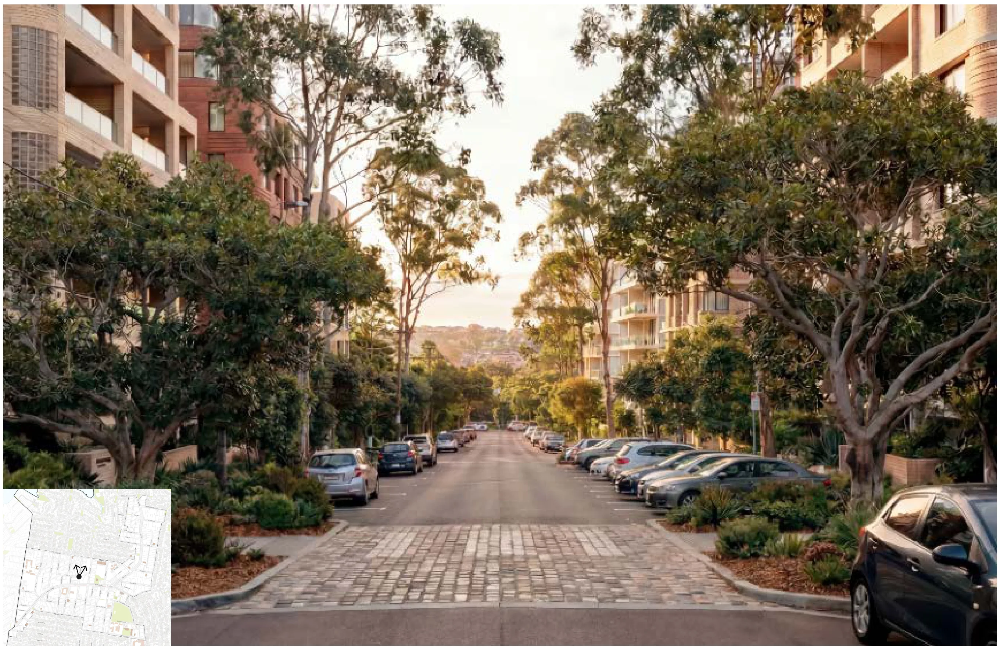

<!-- page 122 -->

Mosman Masterplan 118 SJB

## Military Road Corridor

St6

St6

St8

St8

St12

St12 St6

St8

St8 St8 St8

St4

St3

St3

St4 St4 St4 St4

St8

St6

St12 St12

St8 St8

St6

St6

St6

St12 St12 St15 St15

St8

St8

St8

St18

St12

St12

St12

St8

St12

St12

St12

St12

St12

St18 St12

St10

St12

St12

St8 St8

St8 St6

St3

St3

St3

St6

St6 St6 St6

2000sqm

40 40 40 40 40

40

40

40

40 40 40

40

40

Sacred Hear Catholic Primary School

Middle Habour Public School COWLES RD

COWLES RD

COWLES RD

COWLES RD WUNDA R

BOND ST

LANG ST

LANG ST

SNELL ST

MACKIE LN

HALE RD

HALE RD

MACPHERSON ST

ERITH ST

PRINCE ST

MELROSE ST

MILITARY RD

MILITARY RD

MILITARY RD

EARL ST

D

PRINCE ST

PRINCE ST

BELMONT RD

BELMONT RD

GLOVER ST

GLOVER ST LINDSAY LN

CABRAMATTA RD

LINDSAY LN

TWIN TOWERS WALK

BARDWELL RD

BARDWELL RD

WUDGONG ST

WUDGONG ST

CARDINAL ST

CARDINAL ST

CARDINAL ST

ROSEBERY ST

COUNTESS ST

1:4000 @ A3

M

A C P H

E R S O

T E E R M I L I T A R Y R O A D

CABRAMATTA ROAD

ROSEBE

HARBOUR STREET

BARDWELL ROAD GLOVER STREET MYAH BELMONT ROAD

H

SPENCER ROAD

NOBLE STREET COWLES ROAD LINDSAY LANE

DALT

VISTA STREET

BON

WUNDA ROAD

HALE ROAD

### Military Road Corridor - Structure plan

The Military Road corridor is primarily recognised as a major arterial route and key vehicular thoroughfare. The urban design response acknowledges this condition and incorporates mitigation measures to address potential conflicts between land uses and high traffic volumes. The corridor is predominantly characterised by mixed-use development, with retail and/or commercial uses occupying the lower two levels, interfacing directly with Military Road to activate the public domain and providing a range of services and businesses that cater to the local community. Residential uses are located above the podium levels, from Level 3 and upwards. A minimum 3-metre setback is required at these levels to provide separation from Military Road, improving residential amenity by reducing exposure to traffic impacts. The predominant building height along the corridor is up to 12 storeys. This is reduced to 8 storeys at the crossing of Military Road from Cremorne to provide a more compatible transition in scale. Active frontages are required at ground level within the local centre zone to promote street activation and support retail uses. In residential zones, an 8-metre front setback is prescribed, with a minimum of 5 metres allocated as deep soil zones for tree planting, contributing to landscape quality and an improved streetscape character.

Kings Cross Station, King Cross (DBJ)

Surry Hills Village, Surry Hills (SJB)

Military Road structure plan

KEY

Boundary

Open space

Heritage items

School

Bus stop

Bus lane

De-listed heritage conservation areas Retained mature tree canopy

Proposed street canopy

Proposed public open space

Pedestrian only zones

Shared zones

Active frontage - 0m

Front setback - 1.5m

Front setback - 3m

Front setback - 4m

Front setback - 4.5m

Front setback - 5m

Front setback - 8m Streetwall height - 2 storey Streetwall height - 6 storey Proposed crossing

Existing through site link Proposed through site link

Green pedestrian link

40 40km/h speed limit

Proposed signalised intersection

Proposed road

Proposed basement access

Calm streets

Closed off roads

Traffic direction

Peel Off Corners

Medium-density residential High-density residential

Local centre

Infrastructure

Educational anchor

Council assets

August 2026

Attachment 1.1.1 Mosman Council

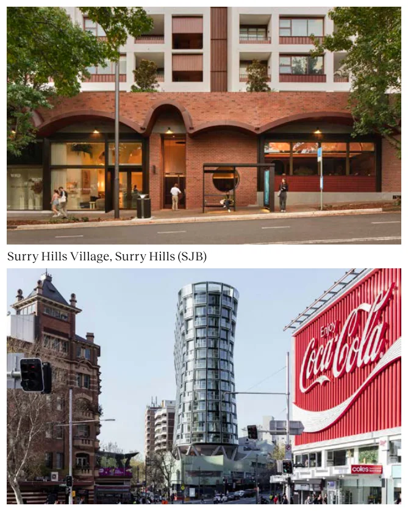

<!-- page 123 -->

Mosman Masterplan 119 SJB

### Military Road Corridor

### Reference scheme massing

MILITARY RD

MILITARY RD

HALE RD BELMONT RD

BARDWELL RD

LANG ST

EARL ST

CARDINAL ST

WUDGONG ST

BOND

COWLES RD

MILITARY RD

MILITARY RD

MACPHERSON ST

HALE RD

LANG ST

BARDWELL RD

CARDINAL ST

Military Road Southeast View Military Road Northwest View

KEY

Character area

Residential

Retail / Commercial

Heritage item

Conservation area

Note:

The reference scheme is illustrative only and provides a diagrammatic representation of potential building envelopes achievable under the proposed planning and built form controls. The scheme includes development only on sites considered to be deliverable within the master plan timeframe. Existing buildings on constrained sites have been retained, as their redevelopment is not considered feasible within this period. Assumptions have been made regarding potential site amalgamation patterns, noting that these are subject to uncertainty and may vary depending on landowner participation and market conditions. The reference scheme should therefore be understood as one of several possible future development scenarios. The indicative building massing shown is, however, fully compliant with the proposed planning framework.

18

8

12

12

6

12

12

12

12

12

12 12

12

6

12

12

12

18

8

8

8 8

8

8

August 2026

Attachment 1.1.1 Mosman Council

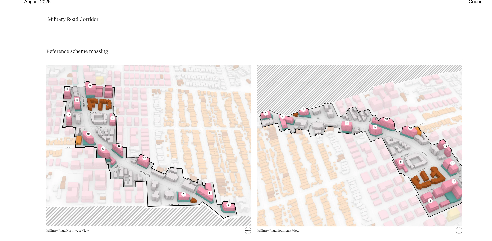

<!-- page 124 -->

Mosman Masterplan 120 SJB

### Military Road Corridor

### Cross section

M

A C P H

E R S O

T E E R

M

I L I T

A R Y

R O

A D

CABRAMATTA ROAD

ROSEBE

HARBOUR STREET

BARDWELL ROAD GLOVER STREET

MYAH

BELMONT ROAD

H

SPENCER ROAD

NOBLE STREET

COWLES ROAD

LINDSAY LANE

DALT

VISTA STREET

BON

WUNDA ROAD

HALE ROAD

1:2000 @ A3 Military Road Corridor East-West Section

Glover Street Blemont Road Melrose Street Snell Street Bardwell Road Prince Street

Key Plan

KEY

Character area boudary

Residential

Retail / Commercial

Envelope

August 2026

Attachment 1.1.1 Mosman Council

<!-- page 125 -->

Mosman Masterplan SJB 121

Artist’s impression of Military Road looking east

COWLES RD

ART GALLERY WAY GOULDSBURY ST BELMONT RD

COWLES RD

OWLES RD

HARBOUR ST

HARBOUR ST

NDA RD ST

BRADY ST

OURIMBAH RD OURIMBAH RD AWABA ST AWABA ST KILLARNEY ST AWABA LN

AMIENS AVE STANTON LN STANTON RD

WARRINGAH RD

P BICKELL RD

HORDERN PL HEYDON ST HORDERN LN SPIT RD CIVI LN

RAWSON ST

SPIT RD

SPIT RD

PUNCH ST CLIFFORD ST

MORUBEN RD

HORSNELL LN GURRIGAL ST VISTA ST

VISTA ST MYAHGAH RD

BOND ST LANG ST

SHELL ST

MACKIE LN

HALE RD

HALE RD MACPHERSON ST ERITH ST PRINCE ST MELROSE ST

MILITARY RD MILITARY RD

MILITARY RD

EARL ST

PRINCE ST BELMONT RD GLOVER ST LINDSAY LN CA

TWIN TOWERS WALK

BARDWELL RD

BARDWELL RD WUDGONG ST CARDINAL ST

CARDINAL ST

ROSEBERY ST COUNTESS ST

THE C RESCENT

August 2026

Attachment 1.1.1 Mosman Council

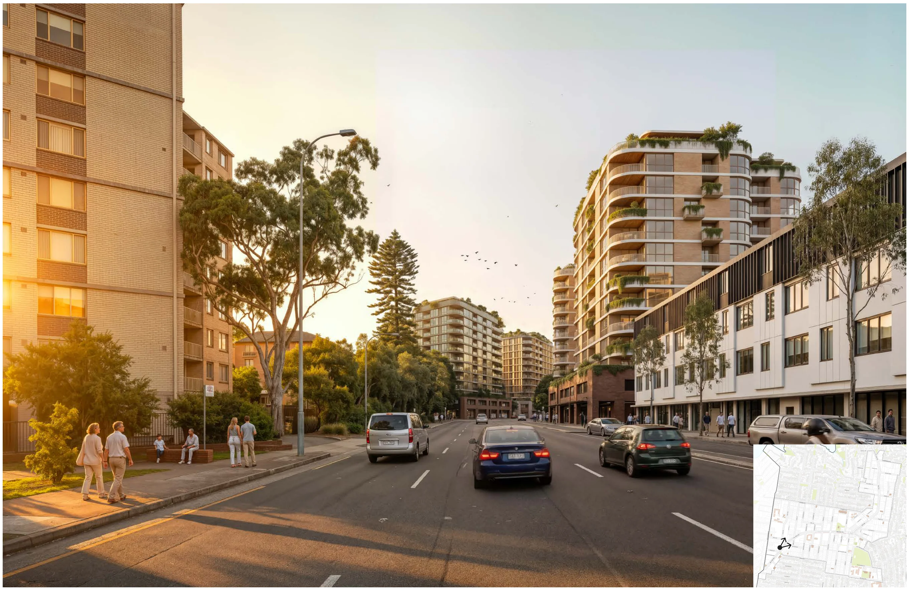

<!-- page 126 -->

Mosman Masterplan 122 SJB

## Prince Street

St15

St22

St15

St12

St8

St8

St12

St6

St8

St8

St8 St8

St8

St8 St8

St3

St3 St3 St3

St4 St4 St4 St4

St8

St8

St6

St12 St12

St8 St8

St6

St12 St12

St15 St15 St15

St18 St18 St15

St18

St12

St12

St12

St12

St12

St12

St18 St12

St10

St12

St12 St20

St8 St8

St8 St6

St6

St3

St3

St6

St10

St8

St6

St6 St6 St6

1500sqm

2000sqm

40

40

40

40 40 40 40 40

40

40

40

Sacred Hear Catholic Primary School

Mosman Pub

le Habour ic School COWLES RD

ART GALLERY WAY

THE

COWLES RD

COWLES RD

COWLES RD

HARBOUR ST

HARBOUR ST

WUNDA RD NOBLE ST

BRADY ST

HEYDO

GURRIGAL ST VISTA ST

VISTA ST

MYAHGAH RD

BOND ST

LANG ST

LANG ST

SNELL ST

MACKIE LN

HALE RD

HALE RD

MELROSE ST

MILITARY RD MILITARY RD

MILITARY RD

EARL ST

PRINCE ST

PRINCE ST

BELMONT RD

BELMONT RD

GLOVER ST

GLOVER ST LINDSAY LN

CABRAMATTA RD

LINDSAY LN

BARDWELL RD

BARDWELL RD

WUDGONG ST

WUDGONG ST

CARDINAL ST

CARDINAL ST

CARDINAL ST

ROSEBERY ST

COUNTESS ST

1:4000 @ A3

M

A C P H E R

R O A D

MILITARY ROAD

RAMATTA ROAD

RO

HARBOUR STREET

BARDWELL ROAD GLOVER STREET

MYAHGAH ROAD BELMONT ROAD

HORDERN LANE

PENCER ROAD

NOBLE STREET COWLES ROAD LINDSAY LANE

VISTA STREET

LT AVENUE

WUNDA ROAD

HALE ROAD

### Prince Street - Structure plan

Housing in Bondi, Bondi Beach (SJB)

Wylde Street, Potts Point (SJB)

Prince Street is characterised as a predominantly low- to mid-rise residential precinct, with building heights ranging from two to eight storeys. The variation in height is strategically used to provide a transition from the higher-density development along the Military Road corridor to established areas of no change.

A four-storey interface is maintained along sections adjoining no-change residential areas, while two-storey development is limited to the block west of Allan Border Oval, reflecting the existing low-scale character in this location.

Mid-block through-site links are recommended to break down the length of development blocks and improve pedestrian permeability. These connections will enhance access to the civic precinct and Allan Border Oval, supporting walkability and local connectivity.

Prince Street structure plan

KEY

Boundary

Open space

Heritage items

School

Bus stop

Retained street vegetation

Retained mature tree canopy Proposed public open space

Pedestrian only zones

Shared zones

Front setback - 1.5m

Front setback - 3m

Front setback - 4m

Front setback - 4.5m

Front setback - 5m

Front setback - 8m

Rear setback - 9m Streetwall height - 2 storey Streetwall height - 6 storey Proposed crossing

Existing through site link Proposed through site link 40 40km/h speed limit

Land dedication

Proposed road

Proposed basement access

Calm streets

Traffic direction

Low-density residential Medium-density residential High-density residential

Council assets

August 2026

Attachment 1.1.1 Mosman Council

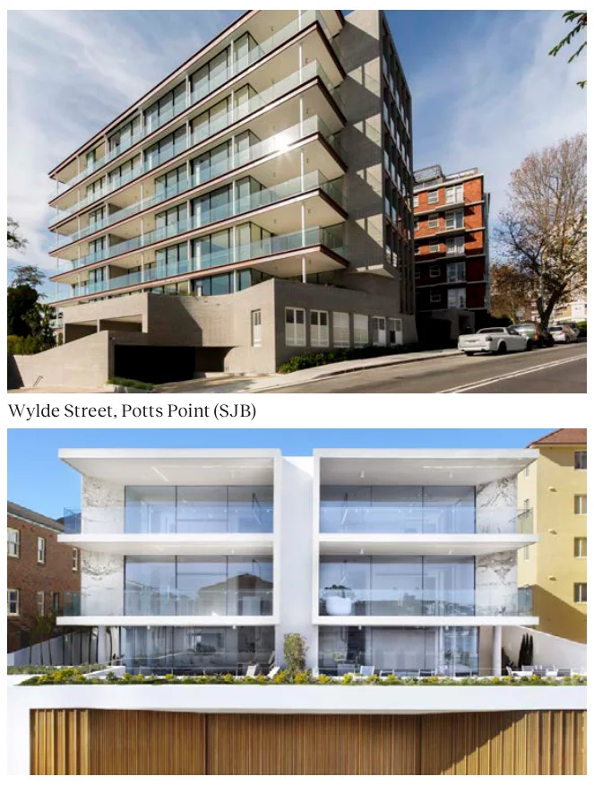

<!-- page 127 -->

Mosman Masterplan 123 SJB

### Prince Street

KEY

Character area

Residential

Retail / Commercial

Heritage item

Conservation area

### Reference scheme massing

COWLES RD

BARDWELL RD CARDINAL ST

WUDGONG ST

HARBOUR ST

VISTA ST

PRINCE ST

MILITARY RD

BELMONT RD

MELROSE ST COWLES RD

BARDWELL RD

CARDINAL ST

WUDGONG ST

HARBOUR ST

VISTA ST

PRINCE ST

MILITARY RD

MELROSE ST

BELMONT RD

Prince Street Northeast View Prince Street Southwest View

Note:

The reference scheme is illustrative only and provides a diagrammatic representation of potential building envelopes achievable under the proposed planning and built form controls. The scheme includes development only on sites considered to be deliverable within the master plan timeframe. Existing buildings on constrained sites have been retained, as their redevelopment is not considered feasible within this period. Assumptions have been made regarding potential site amalgamation patterns, noting that these are subject to uncertainty and may vary depending on landowner participation and market conditions. The reference scheme should therefore be understood as one of several possible future development scenarios. The indicative building massing shown is, however, fully compliant with the proposed planning framework.

3

3

3

3

3

3

6

6

6

6

6

8

4

4

4

4 4

4

4

6

6

6

4

6

6

8

8

August 2026

Attachment 1.1.1 Mosman Council

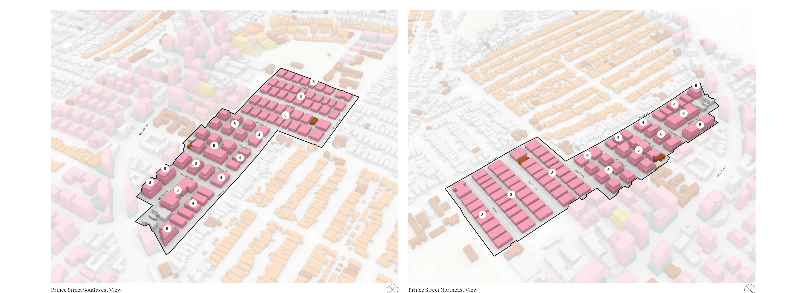

<!-- page 128 -->

Mosman Masterplan 124 SJB

### Prince Street

### Cross section

Snell Street Military Road Bardwell Road Cardinal Street Wudgong Street Cowles Road Harbour Street Vista Street Myahgah Road

M

A C P H

E R

R O

A D

MILITARY ROAD

RAMATTA ROAD

RO

HARBOUR STREET

BARDWELL ROAD GLOVER STREET

MYAHGAH ROAD

BELMONT ROAD

HORDERN LANE

PENCER ROAD

NOBLE STREET

COWLES ROAD

LINDSAY LANE

VISTA STREET

LT AVENUE

WUNDA ROAD

HALE ROAD

Key Plan

1:2000 @ A3 Prince Street East-West Section

KEY

Character area boudary

Residential

Retail / Commercial

Envelope

August 2026

Attachment 1.1.1 Mosman Council

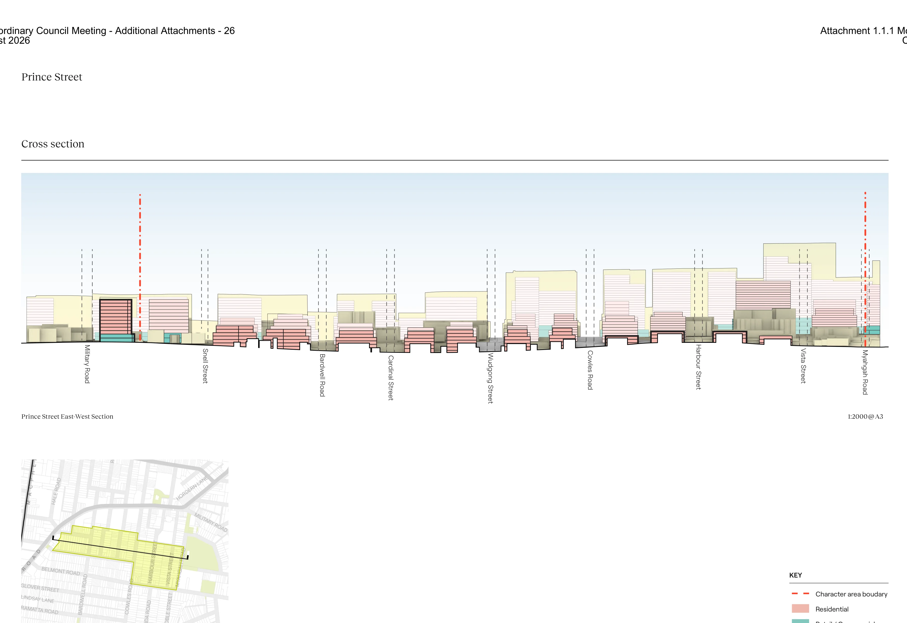

<!-- page 129 -->

Mosman Masterplan SJB 125

Artist’s impression of Prince Street looking west

COWLES RD

ART GALLERY WAY GOULDSBURY ST BELMONT RD

COWLES RD

OWLES RD

HARBOUR ST

HARBOUR ST

NDA RD ST

BRADY ST

OURIMBAH RD OURIMBAH RD AWABA ST AWABA ST KILLARNEY ST AWABA LN

AMIENS AVE STANTON LN STANTON RD

WARRINGAH RD

P BICKELL RD

HORDERN PL HEYDON ST HORDERN LN SPIT RD CIVI LN

RAWSON ST

SPIT RD

SPIT RD

PUNCH ST CLIFFORD ST

MORUBEN RD

HORSNELL LN GURRIGAL ST VISTA ST

VISTA ST MYAHGAH RD

BOND ST LANG ST

SHELL ST

MACKIE LN

HALE RD

HALE RD MACPHERSON ST ERITH ST PRINCE ST MELROSE ST

MILITARY RD MILITARY RD

MILITARY RD

EARL ST

PRINCE ST BELMONT RD GLOVER ST LINDSAY LN CA

TWIN TOWERS WALK

BARDWELL RD

BARDWELL RD WUDGONG ST CARDINAL ST

CARDINAL ST

ROSEBERY ST COUNTESS ST

THE C RESCENT

August 2026

Attachment 1.1.1 Mosman Council

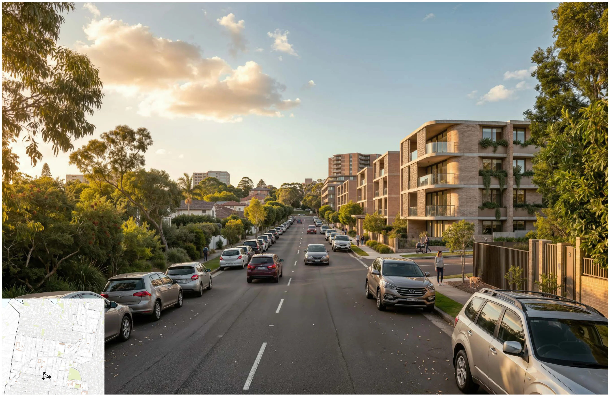

<!-- page 130 -->

Mosman Masterplan 126 SJB

## 1

## Spit Road Corridor

St15

St22

St15

St12

St5

St5

St12

St12

St6

St6

St6

St6

St6

St6

St6

St12

St12

St12

St12

St12

St12

St12

St8

St8

St8

St6

St6

St3

St8

St8

St8

St8

1500sqm

40

40

BRADY ST

MBAH RD

OURIMBAH RD

AWABA ST

AWABA ST

KILLARNEY ST

AWABA LN

AMIENS AVE

MITCHELL RD BAPAUME RD

STANTON LN

STANTON RD

WARRINGAH RD

BICKELL RD

HORDERN PL

HEYDON ST

HORDERN LN

SPIT RD

SPIT RD

RAWSON ST

PUNCH LN

SPIT RD

PUNCH ST

MORUBEN RD

RAWSON ST

MORUBEN RD

1:4000 @ A3

MANDOLONG ROAD

STANLEY AVENUE MORUBEN ROAD

HORDERN LANE

STANTON R AWABA STREET

BICKELL ROAD

DALTON ROAD

BOND STREET

G ROAD

PUNCH LANE THE GROVE

### Spit Road Corridor - Structure plan

Hoxton Press, Colville Estate (Karakusevic Carson Architect)

Paju Unjeong Woomi Lyn Parkhills, (JUNGLIM Architecture )

The Spit Road corridor is characterised by a predominantly high-density residential form, drawing on the established pattern of existing high-density development and seeking to reinforce this character consistently along the length of the corridor. This is achieved through a “tower in the landscape” typology, where residential towers extend to ground level without podiums. This approach maximises landscaped open space and enhances the visual and environmental quality of the precinct. Landscape outcomes are supported through a minimum LGA-wide requirement of 40% landscaped area for all development in residential zones.

In addition, an 8-metre setback is prescribed along Spit Road, of which a minimum of 5 metres is to be deep soil for tree planting. This will facilitate the establishment of a continuous tree canopy, improving shading, mitigating urban heat, and enhancing pedestrian comfort along the corridor. The landscaped setback also provides a buffer between residential uses and the traffic environment, improving amenity through noise and visual screening, while supporting privacy for ground-level dwellings. Council owned car park on Stanton Road has the potential to redevelop and contribute to affordable housing.

Spit Road structure plan

KEY

Boundary

Open space

Heritage items

School

Bus stop

Relocated bus stop

Retained mature tree canopy

Proposed street canopy

Proposed public open space

Active frontage - 0m

Front setback - 1.5m

Front setback - 3m

Front setback - 4m

Front setback - 4.5m

Front setback - 5m

Front setback - 8m

Rear setback - 9m Streetwall height - 2 storey Streetwall height - 6 storey

Key site

Proposed crossing 40 40km/h speed limit

Land dedication

Proposed road

Proposed basement access

Calm streets

Closed off roads

Traffic direction

Low-density residential Medium-density residential High-density residential

Local centre

Infrastructure

Council assets

August 2026

Attachment 1.1.1 Mosman Council

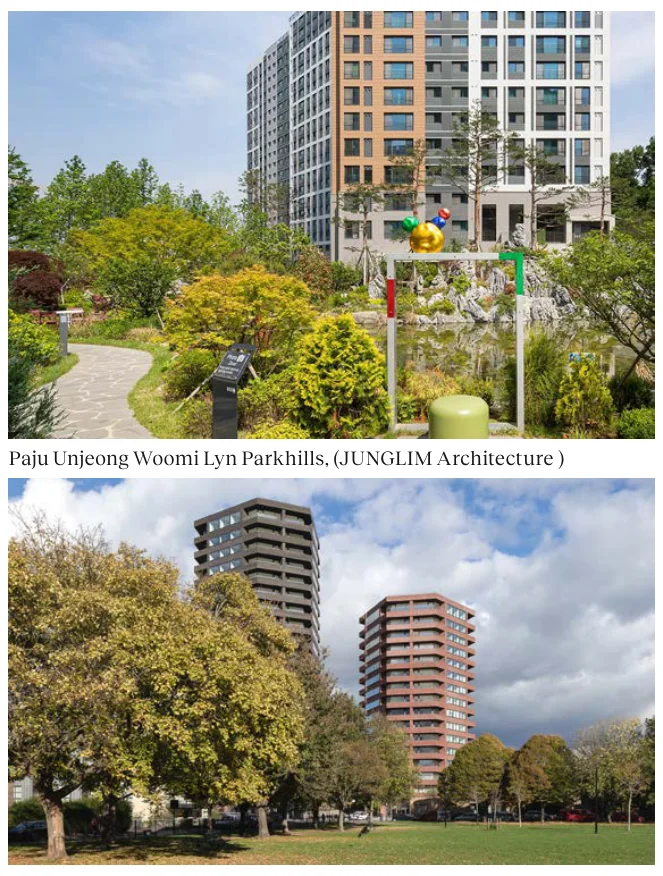

<!-- page 131 -->

Mosman Masterplan 127 SJB

### Reference scheme massing

KILLARNEY ST PUNCH ST

BAPAUME RD

MITCHELL RD

MORUBEN RD

STANTON RD WARRINGAH RD

AWABA ST

AWABA ST

OURIMBAH RD

SPIT RD

WARRINGAH RD

PARRIWI RD

STANTON RD

RAWSON ST

BAPAUME RD

PUNCH LN

MORUBEN RD

AWABA ST

AWABA ST

DALTON RD

PUNCH ST

OURIMBAH RD

SPIT RD

SPIT RD

Spit Road Southwest View Spit Road Southeast View

KEY

Character area

Residential

Retail / Commercial

Heritage item

Conservation area

Note:

The reference scheme is illustrative only and provides a diagrammatic representation of potential building envelopes achievable under the proposed planning and built form controls. The scheme includes development only on sites considered to be deliverable within the master plan timeframe. Existing buildings on constrained sites have been retained, as their redevelopment is not considered feasible within this period. Assumptions have been made regarding potential site amalgamation patterns, noting that these are subject to uncertainty and may vary depending on landowner participation and market conditions. The reference scheme should therefore be understood as one of several possible future development scenarios. The indicative building massing shown is, however, fully compliant with the proposed planning framework.

15 15

15

15

12 12

12

12 12

12 12

12

12

8

8

12

12 12

12

12

12

8

8

### Spit Road Corridor

August 2026

Attachment 1.1.1 Mosman Council

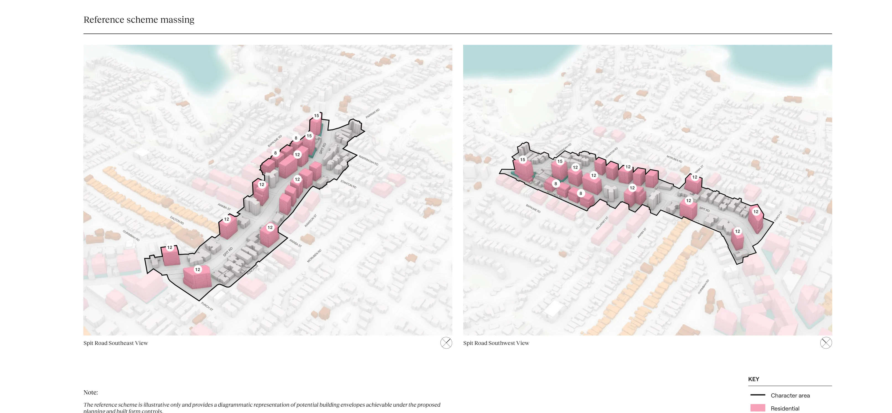

<!-- page 132 -->

Mosman Masterplan 128 SJB

### Spit Road Corridor

### Cross section

Bickell Road Stanton Lane

Killarney Street Awaba Street

MANDOLONG ROAD

STANLEY AVENUE MORUBEN ROAD

HORDERN LANE

STANTON R

AWABA STREET

BICKELL ROAD

DALTON ROAD

BOND STREET

G ROAD

PUNCH LANE

THE GROVE

Key Plan

1:2000 @ A3 Spit Road Corridor East-West Section

KEY

Character area boudary

Residential

Retail / Commercial

Envelope

August 2026

Attachment 1.1.1 Mosman Council

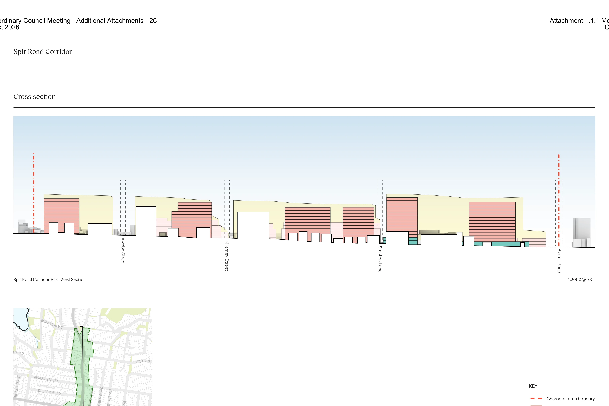

<!-- page 133 -->

Mosman Masterplan SJB 129

Artist’s impression of Spit Road looking south

COWLES RD

ART GALLERY WAY GOULDSBURY ST BELMONT RD

COWLES RD

OWLES RD

HARBOUR ST

HARBOUR ST

NDA RD ST

BRADY ST

OURIMBAH RD OURIMBAH RD AWABA ST AWABA ST KILLARNEY ST AWABA LN

AMIENS AVE STANTON LN STANTON RD

WARRINGAH RD

P BICKELL RD

HORDERN PL HEYDON ST HORDERN LN SPIT RD CIVI LN

RAWSON ST

SPIT RD

SPIT RD

PUNCH ST CLIFFORD ST

MORUBEN RD

HORSNELL LN GURRIGAL ST VISTA ST

VISTA ST MYAHGAH RD

BOND ST LANG ST

SHELL ST

MACKIE LN

HALE RD

HALE RD MACPHERSON ST ERITH ST PRINCE ST MELROSE ST

MILITARY RD MILITARY RD

MILITARY RD

EARL ST

PRINCE ST BELMONT RD GLOVER ST LINDSAY LN CA

TWIN TOWERS WALK

BARDWELL RD

BARDWELL RD WUDGONG ST CARDINAL ST

CARDINAL ST

ROSEBERY ST COUNTESS ST

THE C RESCENT

August 2026

Attachment 1.1.1 Mosman Council

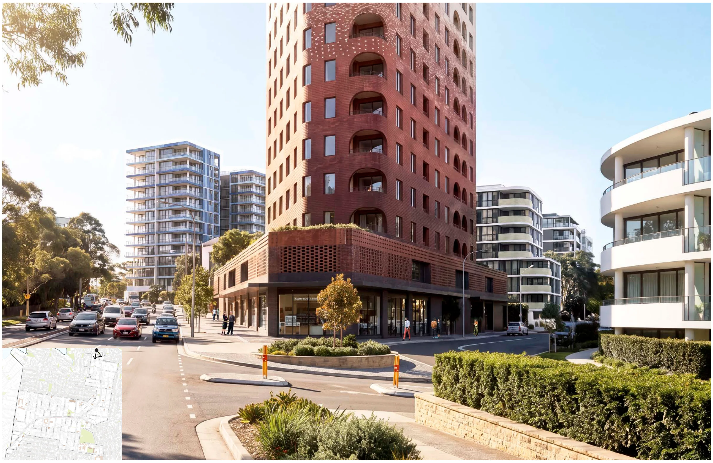

<!-- page 134 -->

Mosman Masterplan 130 SJB

## Middle Harbour and Balmoral Ridge

St15

St15

St18

St10 St6

St4

St22

St15

St12

St8

St8 St8

St5

St5

St8

t8 St8

St6

St6

St15 St15

St18 St18 St15

St18

St12 St12

St10

St20

St6

St6

St6

St6

St6

St6

St6

St6

St12

St12

St12

St12

St12

St12

St12

St8

St8

St8

St6

St6 St3

St8

St8

St8

St8

St8

St8

St10

St8

1500sqm

40

40

40 40

40

COWLES RD

THE CRESCENT

COWLES RD HARBOUR ST

BRADY ST

OURIMBAH RD

OURIMBAH RD

AWABA ST

AWABA ST

KILLARNEY ST

AWABA LN

AMIENS AVE

MITCHELL RD BAPAUME RD

STANTON LN

STANTON RD

WARRINGAH RD

PARRIWI RD

BICKELL RD

HORDERN PL

HEYDON ST

HORDERN LN

SPIT RD

CIVI LN

SPIT RD

RAWSON ST

PUNCH LN

SPIT RD

PUNCH ST

CLIFFORD ST

MORUBEN RD

HORSNELL LN FIELD WAY GURRIGAL ST VISTA ST

MILITARY RD

MILITARY RD

RAWSON ST

MORUBEN RD

1:5000 @ A3

MILITARY ROAD

MANDOLONG ROAD

STANLEY AVENUE MORUBEN ROAD

HORDERN LANE

STANTON AWABA STREET

LL ROAD

DALTON ROAD

BOND STREET

G ROAD

PUNCH LANE THE GROVE

### Middle Harbour and Balmoral Ridge -  Structure plan

Wentworth Quarter, Wentworth Point (Bates Smart)

Bondi Juction, (SJB)

The Middle Harbour and Balmoral Ridge areas are characterised by a low- to mid-density residential form, providing a transition from the Spit Road corridor to established areas of no change, particularly in Beauty Point and the Balmoral Slopes.

These precincts are also defined by significant topographical variation. The urban design response emphasises built form that appropriately steps with the natural terrain, minimising visual bulk and supporting equitable view sharing while managing impacts on neighbouring properties.

The intended character aligns with the existing built form in parts of the precinct, where residential flat buildings of four or more storeys are already established. This approach reinforces the prevailing character while ensuring a sensitive response to the landscape and surrounding context

Middle Harbour and Balmoral Ridge structure plan

KEY

Boundary

Open space

Heritage items

School

Bus stop

Relocated bus stop

Retained street vegetation

Retained mature tree canopy Proposed public open space

Active frontage - 0m

Front setback - 1.5m

Front setback - 3m

Front setback - 4m

Front setback - 4.5m

Front setback - 5m

Front setback - 8m

Rear setback - 9m Streetwall height - 2 storey Streetwall height - 6 storey Key site

Proposed crossing

Existing through site link Proposed through site link

Land dedication

Proposed road

40 40km/h speed limit

Proposed basement access

Calm streets

Closed off roads

Traffic direction

Peel Off Corners

Low-density residential Medium-density residential High-density residential

Local centre

Infrastructure

Council assets

August 2026

Attachment 1.1.1 Mosman Council

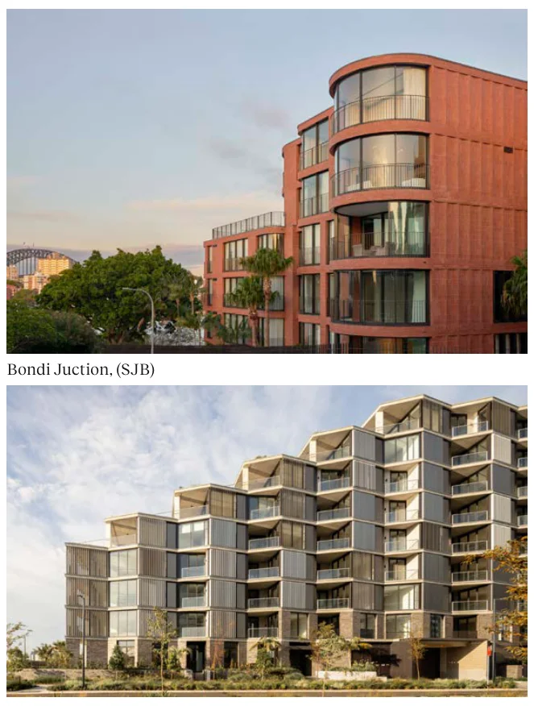

<!-- page 135 -->

Mosman Masterplan 131 SJB

### Middle Harbour and Balmoral Ridge

### Reference scheme massing

MORUBEN RD

AWABA ST

KILLARNEY ST

STANTON RD

PUNCH ST

CLIFFORD ST

WARRINGAH RD

BAPAUME RD

MITCHELL RD

AWABA ST

SPIT RD

SPIT RD

WARRINGAH RD

STANTON RD

RAWSON ST

MORUBEN RD

AWABA ST

AWABA ST

PUNCH ST

CLIFFORD ST

SPIT RD

SPIT RD

BAPAUME RD

Middle Harbour and Balmoral Ridge Southwest View Middle Harbour and Balmoral Ridge Southeast View

KEY

Character area

Residential

Retail / Commercial

Heritage item

Conservation area

Note:

The reference scheme is illustrative only and provides a diagrammatic representation of potential building envelopes achievable under the proposed planning and built form controls. The scheme includes development only on sites considered to be deliverable within the master plan timeframe. Existing buildings on constrained sites have been retained, as their redevelopment is not considered feasible within this period. Assumptions have been made regarding potential site amalgamation patterns, noting that these are subject to uncertainty and may vary depending on landowner participation and market conditions. The reference scheme should therefore be understood as one of several possible future development scenarios. The indicative building massing shown is, however, fully compliant with the proposed planning framework.

6

6

6

6

8

6

6

8

8

5

6

6

6

6

6

8

8

8

6

5

August 2026

Attachment 1.1.1 Mosman Council

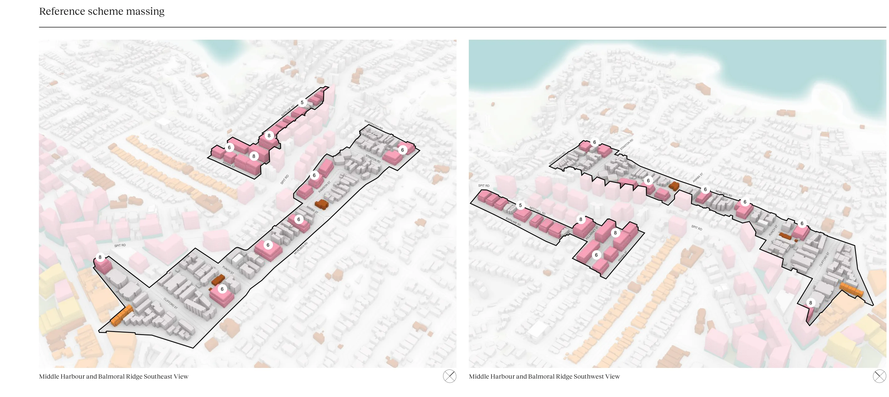

<!-- page 136 -->

Mosman Masterplan 132 SJB

### Middle Harbour and Balmoral Ridge

### Cross section

Spit Road Rawson Street Moruben Road

MILITARY ROAD

MANDOLONG ROAD

STANLEY AVENUE MORUBEN ROAD

HORDERN LANE

STANTON

AWABA STREET

LL ROAD

DALTON ROAD

BOND STREET

G ROAD

PUNCH LANE

THE GROVE

Key Plan

1:1500 @ A3 Middle Harbour and Balmoral Ridge East-West Section

KEY

Character area boudary

Residential

Retail / Commercial

Envelope

August 2026

Attachment 1.1.1 Mosman Council

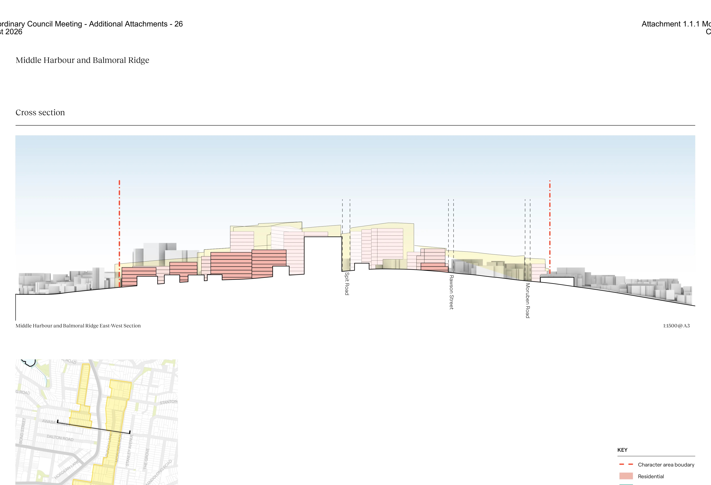

<!-- page 137 -->

Mosman Masterplan SJB 133

Artist’s impression of Awaba street looking west

COWLES RD

ART GALLERY WAY GOULDSBURY ST BELMONT RD

COWLES RD

OWLES RD

HARBOUR ST

HARBOUR ST

NDA RD ST

BRADY ST

OURIMBAH RD OURIMBAH RD AWABA ST AWABA ST KILLARNEY ST AWABA LN

AMIENS AVE STANTON LN STANTON RD

WARRINGAH RD

P BICKELL RD

HORDERN PL HEYDON ST HORDERN LN SPIT RD CIVI LN

RAWSON ST

SPIT RD

SPIT RD

PUNCH ST CLIFFORD ST

MORUBEN RD

HORSNELL LN GURRIGAL ST VISTA ST

VISTA ST MYAHGAH RD

BOND ST LANG ST

SHELL ST

MACKIE LN

HALE RD

HALE RD MACPHERSON ST ERITH ST PRINCE ST MELROSE ST

MILITARY RD MILITARY RD

MILITARY RD

EARL ST

PRINCE ST BELMONT RD GLOVER ST LINDSAY LN CA

TWIN TOWERS WALK

BARDWELL RD

BARDWELL RD WUDGONG ST CARDINAL ST

CARDINAL ST

ROSEBERY ST COUNTESS ST

THE C RESCENT

August 2026

Attachment 1.1.1 Mosman Council

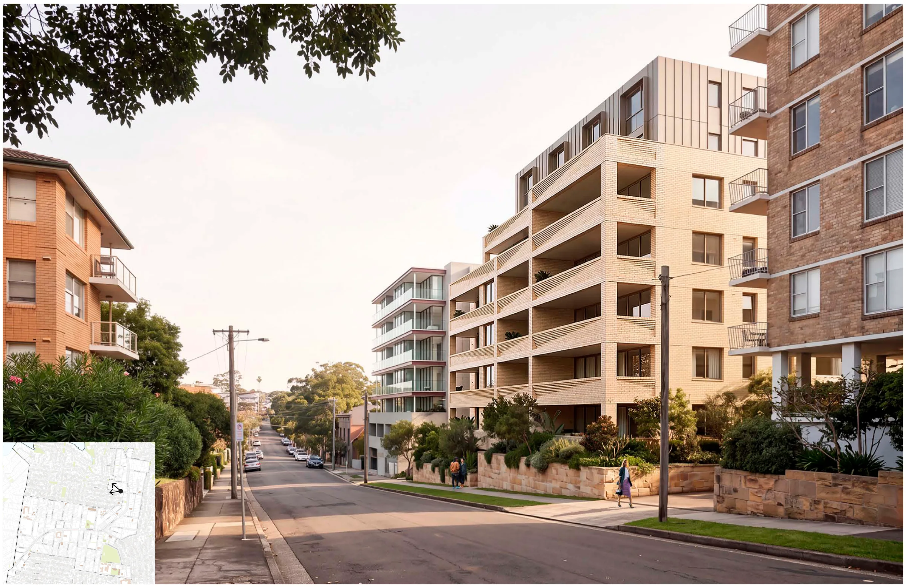

<!-- page 138 -->

## Environmental assessment

## 8

August 2026

Attachment 1.1.1 Mosman Council

<!-- page 139 -->

Mosman Masterplan 135 SJB

### Environmental assessment

### Shadow diagrams - Mosman Village North (Winter Solstice)

09:00am  - 21-06 12:00pm - 21-06 15:00 pm- 21-06

Note:

Shadow diagrams have been prepared based on the reference scheme to illustrate the anticipated development scenario within the masterplan. As the reference scheme is conceptual in nature and provides only a diagrammatic representation of indicative building envelopes, the extent and configuration of the resulting shadows should be regarded as indicative only.

August 2026

Attachment 1.1.1 Mosman Council

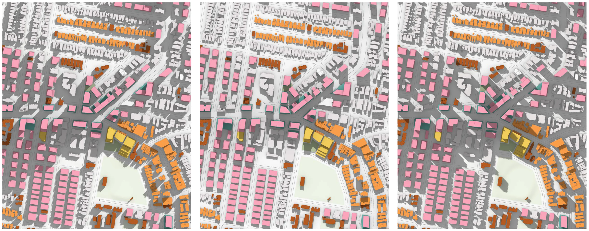

<!-- page 140 -->

Mosman Masterplan 136 SJB

### Environmental assessment

### Shadow diagrams - Mosman Village North (Summer Solstice)

09:00am  - 21-12 12:00pm - 21-12 15:00 pm- 21-12

Note:

Shadow diagrams have been prepared based on the reference scheme to illustrate the anticipated development scenario within the masterplan. As the reference scheme is conceptual in nature and provides only a diagrammatic representation of indicative building envelopes, the extent and configuration of the resulting shadows should be regarded as indicative only.

August 2026

Attachment 1.1.1 Mosman Council

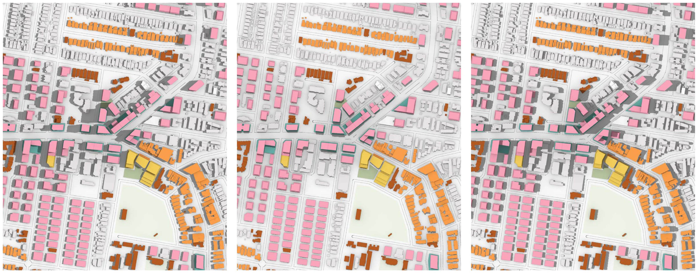

<!-- page 141 -->

Mosman Masterplan 137 SJB

### Environmental assessment

### Shadow diagrams - Mosman Village North (Equinox)

09:00am  - 21-03 12:00pm - 21-03 15:00 pm- 21-03

Note:

Shadow diagrams have been prepared based on the reference scheme to illustrate the anticipated development scenario within the masterplan. As the reference scheme is conceptual in nature and provides only a diagrammatic representation of indicative building envelopes, the extent and configuration of the resulting shadows should be regarded as indicative only.

August 2026

Attachment 1.1.1 Mosman Council

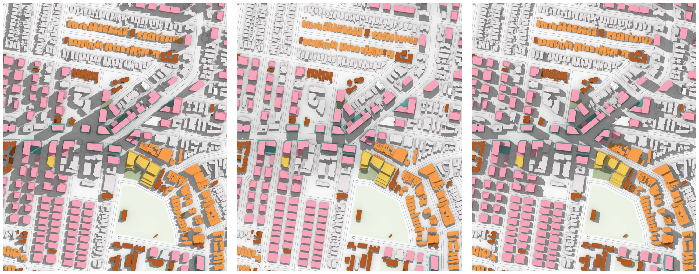

<!-- page 142 -->

Mosman Masterplan 138 SJB

### Environmental assessment

### Shadow diagrams - Mosman Village South (Winter Solstice)

09:00am  - 21-06 12:00pm - 21-06 15:00 pm- 21-06

Note:

Shadow diagrams have been prepared based on the reference scheme to illustrate the anticipated development scenario within the masterplan. As the reference scheme is conceptual in nature and provides only a diagrammatic representation of indicative building envelopes, the extent and configuration of the resulting shadows should be regarded as indicative only.

August 2026

Attachment 1.1.1 Mosman Council

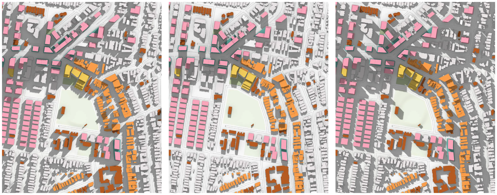

<!-- page 143 -->

Mosman Masterplan 139 SJB

### Environmental assessment

### Shadow diagrams - Mosman Village South (Summer Solstice)

09:00am  - 21-12 12:00pm - 21-12 15:00 pm- 21-12

Note:

Shadow diagrams have been prepared based on the reference scheme to illustrate the anticipated development scenario within the masterplan. As the reference scheme is conceptual in nature and provides only a diagrammatic representation of indicative building envelopes, the extent and configuration of the resulting shadows should be regarded as indicative only.

August 2026

Attachment 1.1.1 Mosman Council

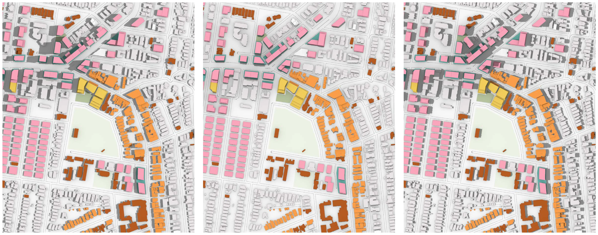

<!-- page 144 -->

Mosman Masterplan 140 SJB

### Environmental assessment

### Shadow diagrams - Mosman Village South (Equinox)

09:00am  - 21-03 12:00pm - 21-03 15:00 pm- 21-03

Note:

Shadow diagrams have been prepared based on the reference scheme to illustrate the anticipated development scenario within the masterplan. As the reference scheme is conceptual in nature and provides only a diagrammatic representation of indicative building envelopes, the extent and configuration of the resulting shadows should be regarded as indicative only.

August 2026

Attachment 1.1.1 Mosman Council

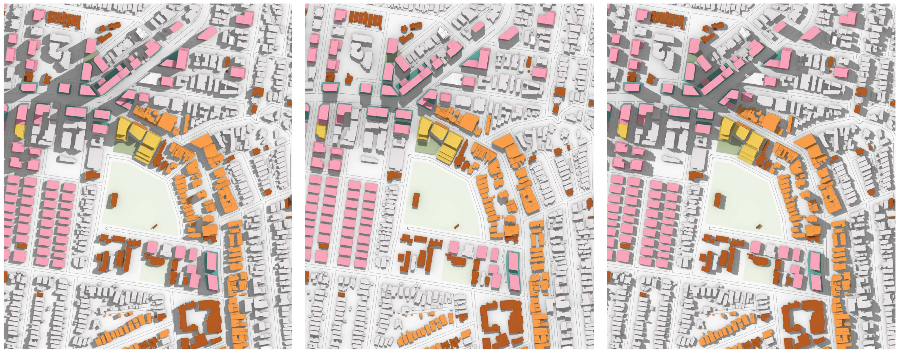

<!-- page 145 -->

Mosman Masterplan 141 SJB

### Environmental assessment

### Shadow diagrams - Military Road Corridor (Winter Solstice)

09:00am  - 21-06 12:00pm - 21-06 15:00 pm- 21-06

Note:

Shadow diagrams have been prepared based on the reference scheme to illustrate the anticipated development scenario within the masterplan. As the reference scheme is conceptual in nature and provides only a diagrammatic representation of indicative building envelopes, the extent and configuration of the resulting shadows should be regarded as indicative only.

August 2026

Attachment 1.1.1 Mosman Council

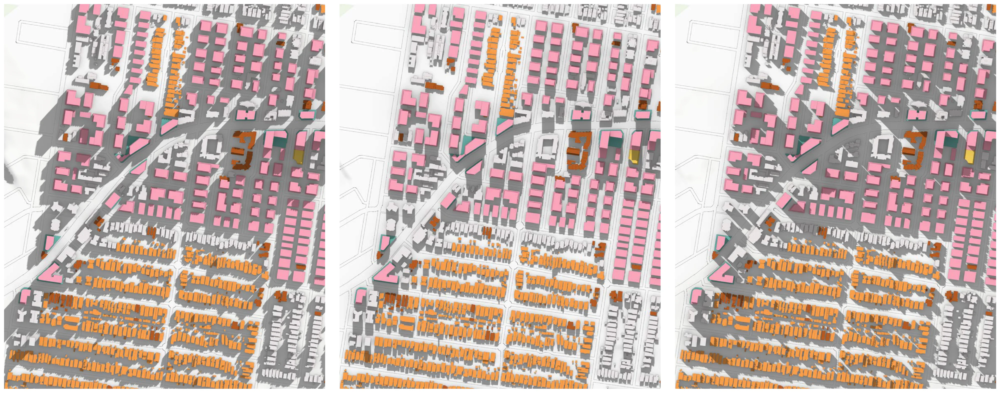

<!-- page 146 -->

Mosman Masterplan 142 SJB

### Environmental assessment

### Shadow diagrams - Military Road Corridor (Summer Solstice)

09:00am  - 21-12 12:00pm - 21-12 15:00 pm- 21-12

Note:

Shadow diagrams have been prepared based on the reference scheme to illustrate the anticipated development scenario within the masterplan. As the reference scheme is conceptual in nature and provides only a diagrammatic representation of indicative building envelopes, the extent and configuration of the resulting shadows should be regarded as indicative only.

August 2026

Attachment 1.1.1 Mosman Council

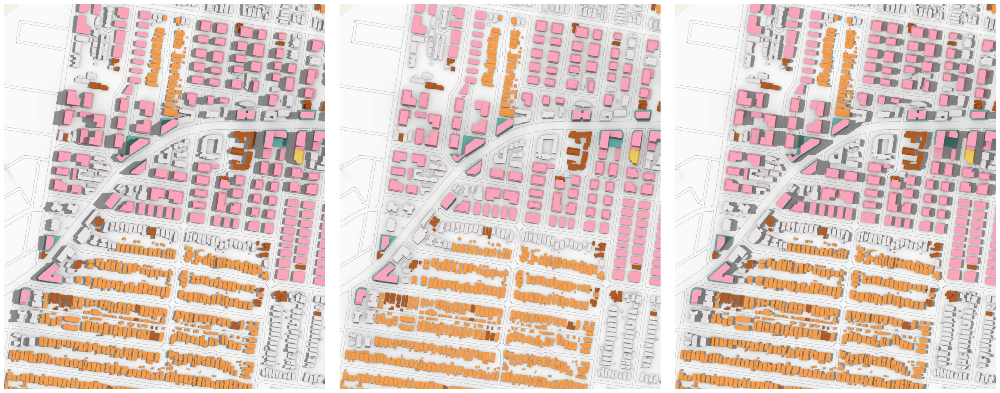

<!-- page 147 -->

Mosman Masterplan 143 SJB

### Environmental assessment

### Shadow diagrams - Military Road Corridor (Equinox)

09:00am  - 21-03 12:00pm - 21-03 15:00 pm- 21-03

Note:

Shadow diagrams have been prepared based on the reference scheme to illustrate the anticipated development scenario within the masterplan. As the reference scheme is conceptual in nature and provides only a diagrammatic representation of indicative building envelopes, the extent and configuration of the resulting shadows should be regarded as indicative only.

August 2026

Attachment 1.1.1 Mosman Council

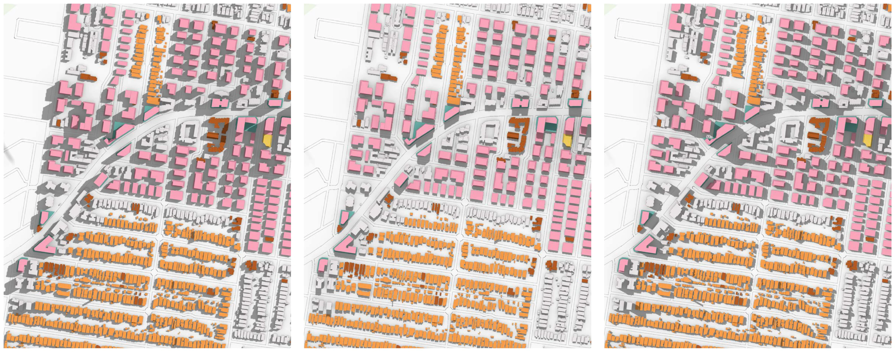

<!-- page 148 -->

Mosman Masterplan 144 SJB

### Environmental assessment

### Shadow diagrams - Spit Road Corridor (Winter Solstice)

09:00am  - 21-06 12:00pm - 21-06 15:00 pm- 21-06

Note:

Shadow diagrams have been prepared based on the reference scheme to illustrate the anticipated development scenario within the masterplan. As the reference scheme is conceptual in nature and provides only a diagrammatic representation of indicative building envelopes, the extent and configuration of the resulting shadows should be regarded as indicative only.

August 2026

Attachment 1.1.1 Mosman Council

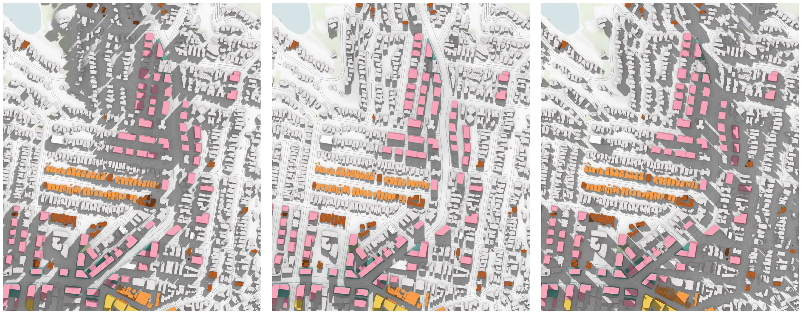

<!-- page 149 -->

Mosman Masterplan 145 SJB

### Environmental assessment

### Shadow diagrams - Spit Road Corridor (Summer Solstice)

09:00am  - 21-12 12:00pm - 21-12 15:00 pm- 21-12

Note:

Shadow diagrams have been prepared based on the reference scheme to illustrate the anticipated development scenario within the masterplan. As the reference scheme is conceptual in nature and provides only a diagrammatic representation of indicative building envelopes, the extent and configuration of the resulting shadows should be regarded as indicative only.

August 2026

Attachment 1.1.1 Mosman Council

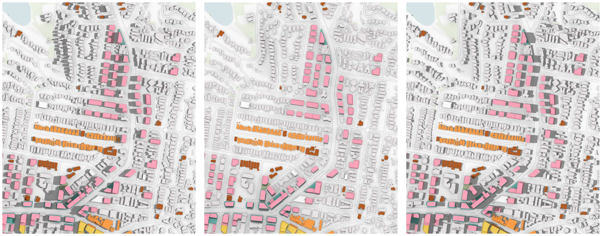

<!-- page 150 -->

Mosman Masterplan 146 SJB

### Environmental assessment

### Shadow diagrams - Spit Road Corridor (Equinox)

09:00am  - 21-03 12:00pm - 21-03 15:00 pm- 21-03

Note:

Shadow diagrams have been prepared based on the reference scheme to illustrate the anticipated development scenario within the masterplan. As the reference scheme is conceptual in nature and provides only a diagrammatic representation of indicative building envelopes, the extent and configuration of the resulting shadows should be regarded as indicative only.

August 2026

Attachment 1.1.1 Mosman Council

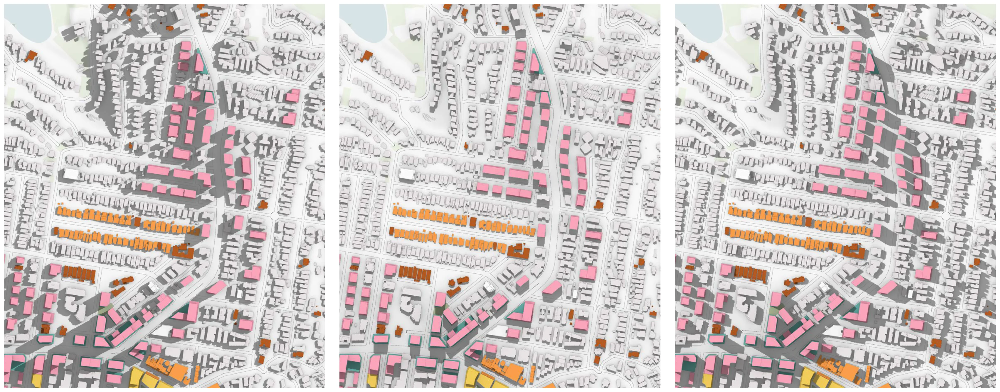

<!-- page 151 -->

Mosman Masterplan 147 SJB

### Environmental assessment

### Shadow diagrams - Ourimbah Triangle (Winter Solstice)

09:00am  - 21-06 12:00pm - 21-06 15:00 pm- 21-06

Note:

Shadow diagrams have been prepared based on the reference scheme to illustrate the anticipated development scenario within the masterplan. As the reference scheme is conceptual in nature and provides only a diagrammatic representation of indicative building envelopes, the extent and configuration of the resulting shadows should be regarded as indicative only.

August 2026

Attachment 1.1.1 Mosman Council

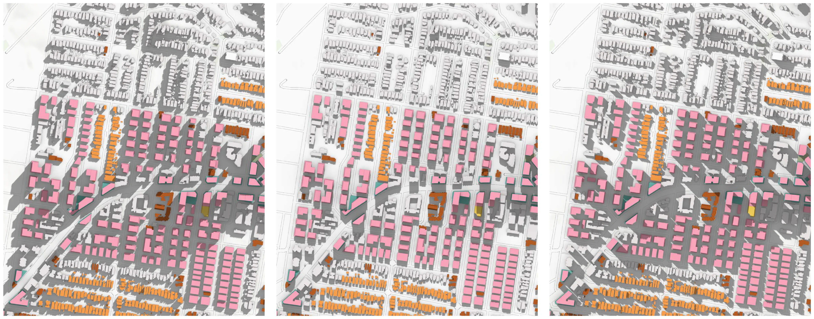

<!-- page 152 -->

Mosman Masterplan 148 SJB

### Environmental assessment

### Shadow diagrams - Ourimbah Triangle (Summer Solstice)

09:00am  - 21-12 12:00pm - 21-12 15:00 pm- 21-12

Note:

Shadow diagrams have been prepared based on the reference scheme to illustrate the anticipated development scenario within the masterplan. As the reference scheme is conceptual in nature and provides only a diagrammatic representation of indicative building envelopes, the extent and configuration of the resulting shadows should be regarded as indicative only.

August 2026

Attachment 1.1.1 Mosman Council

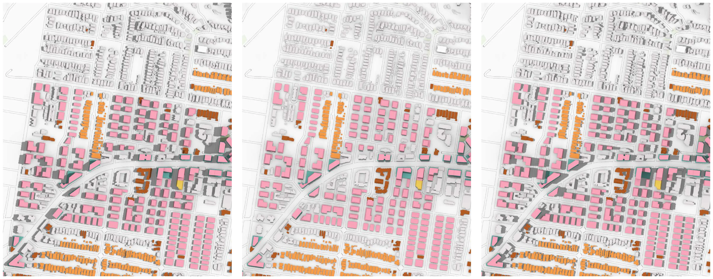

<!-- page 153 -->

Mosman Masterplan 149 SJB

### Environmental assessment

### Shadow diagrams - Ourimbah Triangle (Equinox)

09:00am  - 21-03 12:00pm - 21-03 15:00 pm- 21-03

Note:

Shadow diagrams have been prepared based on the reference scheme to illustrate the anticipated development scenario within the masterplan. As the reference scheme is conceptual in nature and provides only a diagrammatic representation of indicative building envelopes, the extent and configuration of the resulting shadows should be regarded as indicative only.

August 2026

Attachment 1.1.1 Mosman Council

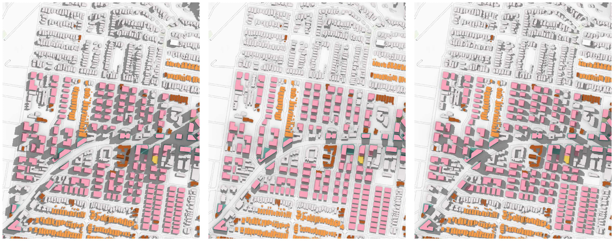

<!-- page 154 -->

Mosman Masterplan 150 SJB

### Environmental assessment

### Shadow diagrams - Prince Street (Winter Solstice)

09:00am  - 21-06 12:00pm - 21-06 15:00 pm- 21-06

Note:

Shadow diagrams have been prepared based on the reference scheme to illustrate the anticipated development scenario within the masterplan. As the reference scheme is conceptual in nature and provides only a diagrammatic representation of indicative building envelopes, the extent and configuration of the resulting shadows should be regarded as indicative only.

August 2026

Attachment 1.1.1 Mosman Council

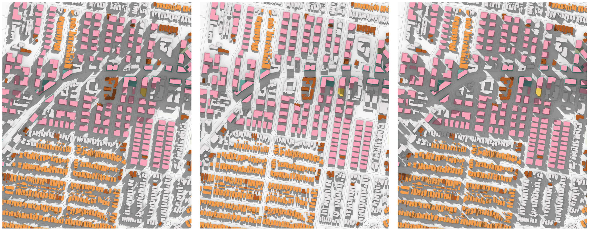

<!-- page 155 -->

Mosman Masterplan 151 SJB

### Environmental assessment

### Shadow diagrams - Prince Street (Summer Solstice)

09:00am  - 21-12 12:00pm - 21-12 15:00 pm- 21-12

Note:

Shadow diagrams have been prepared based on the reference scheme to illustrate the anticipated development scenario within the masterplan. As the reference scheme is conceptual in nature and provides only a diagrammatic representation of indicative building envelopes, the extent and configuration of the resulting shadows should be regarded as indicative only.

August 2026

Attachment 1.1.1 Mosman Council

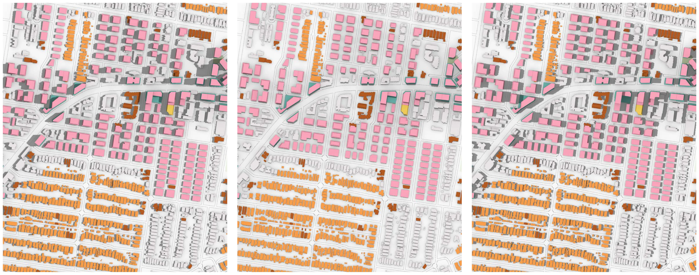

<!-- page 156 -->

Mosman Masterplan 152 SJB

### Environmental assessment

### Shadow diagrams - Prince Street (Equinox)

09:00am  - 21-03 12:00pm - 21-03 15:00 pm- 21-03

Note:

Shadow diagrams have been prepared based on the reference scheme to illustrate the anticipated development scenario within the masterplan. As the reference scheme is conceptual in nature and provides only a diagrammatic representation of indicative building envelopes, the extent and configuration of the resulting shadows should be regarded as indicative only.

August 2026

Attachment 1.1.1 Mosman Council

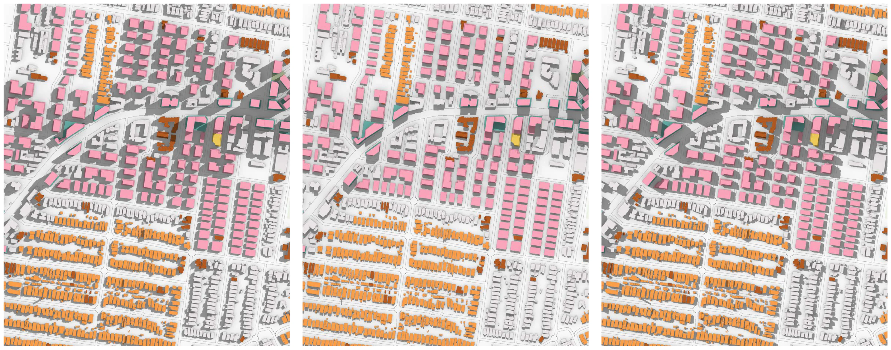

<!-- page 157 -->

Mosman Masterplan 153 SJB

### Environmental assessment

### Shadow diagrams - Middle Harbour and Balmoral Ridge (Winter Solstice)

09:00am  - 21-06 12:00pm - 21-06 15:00 pm- 21-06

Note:

Shadow diagrams have been prepared based on the reference scheme to illustrate the anticipated development scenario within the masterplan. As the reference scheme is conceptual in nature and provides only a diagrammatic representation of indicative building envelopes, the extent and configuration of the resulting shadows should be regarded as indicative only.

August 2026

Attachment 1.1.1 Mosman Council

<!-- page 158 -->

Mosman Masterplan 154 SJB

### Environmental assessment

### Shadow diagrams - Middle Harbour and Balmoral Ridge (Summer Solstice)

09:00am  - 21-12 12:00pm - 21-12 15:00 pm- 21-12

Note:

Shadow diagrams have been prepared based on the reference scheme to illustrate the anticipated development scenario within the masterplan. As the reference scheme is conceptual in nature and provides only a diagrammatic representation of indicative building envelopes, the extent and configuration of the resulting shadows should be regarded as indicative only.

August 2026

Attachment 1.1.1 Mosman Council

<!-- page 159 -->

Mosman Masterplan 155 SJB

### Environmental assessment

### Shadow diagrams - Middle Harbour and Balmoral Ridge (Equinox)

09:00am  - 21-03 12:00pm - 21-03 15:00 pm- 21-03

Note:

Shadow diagrams have been prepared based on the reference scheme to illustrate the anticipated development scenario within the masterplan. As the reference scheme is conceptual in nature and provides only a diagrammatic representation of indicative building envelopes, the extent and configuration of the resulting shadows should be regarded as indicative only.

August 2026

Attachment 1.1.1 Mosman Council

<!-- page 160 -->

## Implementation plan

## 9

August 2026

Attachment 1.1.1 Mosman Council

<!-- page 161 -->

Mosman Masterplan 157 SJB

### Implementation plan

### Implementation plan

#### Housing SEPP 2021 Amendments

The implementation of the Mosman Masterplan will require amendments to the Housing SEPP in relation to the application of Chapter 6 Low and mid rise housing.

These amendments will limit the extent to which the LMR policy applies outside the Masterplan area, with the exception of the provisions relating to dual occupancies and semi-detached dwellings, contained in Part 2 of Chapter 6, which will continue to apply across the LGA.

A further amendment is required for certain land within and adjoining the Lang Street HCA, and for sites adjoining the Military Road HCA along Belmont Road and Gouldsbury Street. While these sites fall within the Masterplan area, they are excluded from the application of the LMR policy to protect the heritage significance of the conservation areas and adjoining heritage items. The remaining land within the Masterplan area will continue to provide planning controls that are equivalent to or greater than those available under the LMR policy. All other land within the Masterplan areas have height and FSR controls greater than or equivalent to LMR.

#### MLEP 2012 Amendments

The implementation of the Mosman Masterplan will require amendments to the MLEP 2012 as outlined below.

#### Land use zones

The existing land use zones within the Mosman Masterplan boundary will be amended as illustrated in the Land Use Zoning Map at Map 9.1 and summarised below:

− Rezone some areas of R2 Low Density Residential land within the Masterplan area to R3 Medium Density Residential to reflect the proposed increase in development density and scale under the Masterplan. − Introduce an R4 High Density Residential zone for those residential areas within the Masterplan area where increased height and FSR controls above those identified for the R3 Medium Density Residential zone apply. This includes sites with height and FSR controls that result in development scale in excess of 8 storeys.  The R4 zoned land adjoins the E1 Local Centre zone or Spit and Military Roads. Dwelling houses will be a prohibited use within the R4 zone. − Extend the E1 Local Centre zone along Military and Spit Roads by rezoning land within the E3 Productivity Support zone and certain R3 zoned land to E1 Local Centre. − Extend the E1 Local Centre on the northern side of Military Road Bond Street to Earl Street. − Rezone various SP2 Infrastructure zoned land: o 28 Wugong Street: Rezone from SP2 Infrastructure - Place of Public Worship to E1 Local Centre. o 18A Melrose Place, 9 Belmont Road, 32 Gouldsbury Street and 4 Heydon Street: Rezone from SP2 Infrastructure - Place of Public Worship to R3 Medium Density. o 37 Harbour Street: Rezone from SP2 Infrastructure Electricity Generation Works to R4 High Density Residential o 79-85 Cowles Road: Rezone from SP2 Infrastructure Depot to E1 Local Centre − Rezone part of the Stanton Lane corridor from R3 Medium Density to RE1 Public Recreation.

This will require the following amendments to the MLEP 2012: − Amend the zoning of land as identified on the Land Use Zoning Map at Map 9.1 − Insert ‘R4 High Density Residential’ under ‘Residential Zones’ within Cl 2.1 Land use zones and into Land Use Table including zone objectives, permitted without consent, permitted consent and prohibited land uses. − Remove ‘Zone E3 Productivity Support’ from the Land Use Table − In the E1 Local Centre land uses table, remove ‘dual occupancies’, ‘multi dwelling housing’, ‘dwelling houses’ and ‘semi-detached dwellings’ from ‘3 Permitted with consent’ consistent with the density of residential accommodation envisaged within the E1 zone under the Masterplan. − Amend objectives of the E1 Local Centre Zone to better align with the Masterplan intent

#### Building height

The building heights within the Masterplan boundary will be amended as illustrated in the Height of Buildings Map at Map 9.2 to align with the increased density and scale of development envisaged under the Masterplan. Key amendments to the building heights within the Masterplan area are summarised below: − Heights on land within the R3 Medium Density zone have increased to 17.5, 22m and 28.5 to ensure the height of future development is equivalent to or greater than that permitted under LMR. The exception is: o Certain land within and adjoining the Lang Street HCA; and

August 2026

Attachment 1.1.1 Mosman Council

<!-- page 162 -->

Mosman Masterplan 158 SJB

### Implementation plan

o Sites adjoining the southern portion of the Military Road HCA along Belmont Road and Gouldsbury Street, which are surrounded by heritage items − Heights have been increased on land within the E1 Local Centre and R4 High Density zone along Military Road and Spit Road to align with the increase density envisaged along this corridor. Significant sites within the centre which are concentrated around the Military/Spit Road Junction are identified as key sites. For these sites increased height can only be realised with the provision of public benefits (Refer to discussion of Key Sites below). − Heights within the R2 Low Density zone have increased to 9.5m to align with LMR.

This will require the following amendments to the MLEP 2012: − Amend the height controls applying to land as identified on the Height of Buildings Map at Map 9.2 − Amend the objectives of the Height of building standards contained in Clause 4.3(1) to better align with Masterplan, including inserting a reference to the R4 High Density Residential and deleting reference to the E3 Productivity Support zone. − Insert sub-clause (3) within Cl 4.3 Height of buildings to exclude structures associated with green roofs or communal open space. The clause allows access (lift overruns, stairs) and shade/shelter structures associated with roof-top gardens and communal open space to be excluded from the calculation of building height. The clause will not apply to heritage items or existing dwellings in HCAs.

#### Floor space ratio (FSR)

The FSR within the Masterplan boundary will be amended as illustrated in the Floor Space Ratio Map at Map 9.3 to align with the increased density and scale of

development envisaged under the Masterplan. Key amendments to the FSR controls within the Masterplan area are summarised below: − The FSR within the R3 Medium Density zone has increased to a minimum of 2.2:1 to ensure the FSR of future development is equivalent to or greater than that permitted under LMR. The exception is: o Certain land within and adjoining the Lang Street HCA; o Sites adjoining the southern portion of the Military Road HCA along Belmont Road and Gouldsbury Street, which are surrounded by heritage items − FSRs have been increased on land within the E1 Local Centre and R4 High Density zone along Military Road and Spit Road to align with the increase density envisaged along this corridor. Significant sites within the centre which are concentrated around the Military/Spit Road Junction are identified as key sites. For these sites increased FSR can only be realised with the provision of public benefits (Refer to discussion of Key Sites below). − FSR within the R2 Low Density zone have increased to 0.8:1 to align with LMR.

This will require the following amendments to the MLEP 2012: − Amend the FSR controls applying to land as identified on the Floor Space Ratio Map at Map 9.3 − Amend the objectives of the FSR of building standards contained in Clause 4.4(1) to better align with Masterplan, including inserting a reference to the R4 High Density Residential and deleting reference to the E3 Productivity Support zone. − Amend the application of Cl 4.4A to exclude land within the Masterplan area zoned R2 Low Density Residential. Clause 4.4A currently prescribes a maximum FSR of 0.5:1 for R2 zoned land with a site area less than or equal to 700m2 and 0.4:1 for the part of the site exceeding 700m2.

− Delete Cl 4.4B which provides for additional uplift on sites within the or Spit Junction as this is superseded by the proposed amendments to FSR under the Masterplan.

#### Height and floor space ratio for certain development

To avoid semi-detached dwellings, dual occupancies and multi dwelling housing being developed to maximum heights and FSR that are intended for medium to higher density forms of development, it is proposed that the height and FSR for these types of residential accommodation within the Masterplan area be limited to the corresponding height and FSRs applying under the LMR provisions, contained within Part 2 Dual occupancies and semi-detached dwellings and Part 3 Attached dwellings, multi dwelling housing and multi dwelling housing (terraces) of Chapter 6 of the Housing SEPP.

Similarly, to prevent the increased development capacity proposed under the Masterplan from resulting in dwelling houses of an inappropriate bulk and scale, the maximum building height and FSR for dwelling houses within the R2 Low Density Residential and R3 Medium Density Residential zones will be restricted as follows: − R2 Zone:  building height of 8.5m and FSR of 0.5:1. − R3 Zone:  building height of 8.5m and FSR of 0.7:1

A similar requirement is not necessary for the R4 High Density Residential zone, as development for the purposes of a dwelling house will be prohibited in the zone.

This will require the following amendments to the MLEP 2012: − Insert clauses into Part 4 to limit heights and FSRs within the Masterplan area as follows: o Dual occupancies within all residential zones within the Masterplan area: height 9.5m and FSR 0.65:1

August 2026

Attachment 1.1.1 Mosman Council

<!-- page 163 -->

Mosman Masterplan 159 SJB

### Implementation plan

o Multi dwelling housing within all residential zones within the Masterplan area: height 9.5m and FSR 0.7:1 o Dwelling houses within the R2 zone: height 8.5m and FSR0.5:1 o Dwelling houses within the R3 zone: height 8.5m and FSR 0.7:1

#### Key sites

The Masterplan identifies key sites where significant increases in building height and floor space ratio (FSR) are proposed in return for the delivery of public benefits, including public open space, potential community facilities, through-site links, pedestrian connections and additional affordable housing.

The proposed height and FSR have been calibrated to provide a meaningful planning incentive that supports the delivery of these public benefits while maintaining redevelopment feasibility. These sites are shown on the Key Sites Map at Map 9.4 and summarised below, together with the proposed planning controls and associated public benefit requirements. Some key sites are also subject to minimum site area requirements to facilitate the orderly development of land, including the provision of appropriate vehicle access.

− 6 Hale Road (Site A) o 2,000m2 of publicly accessible open space, and o A through site link o Building height 43m, FSR 3.2:1 − 634 and 640 Military Road (Site B) o A through site link, and o Community facility (1000m2 warm shell) plus parking at 1 car space /20m2 OR 5% affordable housing o Building height 62m, FSR 6:1 − 1-3 Brady street and 2-6 Spit Road (Site C) o Pedestrian bridge, and o A through site link, and

o Minimum non-residential FSR of 1:1, and o 5% affordable housing, and o Community facility (1000m2 warm shell) plus parking at 1 car space /20m2 OR additional 5% affordable housing o Building height 67.5m, FSR 8:1 − 515-529 Military Road (Site D) o A through site link, and o Community facility (1500m2 warm shell) plus parking at 1 car space /20m2 OR 5% affordable housing o Building height 62m, FSR 8:1 − 537-555 Military Road (Site E) o Pedestrian bridge, and o A through site link, and o Minimum non-residential FSR of 1:1, and o Community facility (1,500m2 warm shell) plus parking at 1 car space /20m2 OR 6% affordable housing o Building height 52.5m, FSR 6.5:1 − 1-3 Brady Street (Site F) o 1,500m2 of publicly accessible open space, and o Minimum 1:1 non-residential FSR, and o 267 public car parking spaces o Building height 73.5m, FSR 7:1 − 8 – 28 Spit Road (Site G) o A minimum site area of 2,462m2, and o 3% affordable housing, and o Community facility (1,700m2 warm shell) OR 5% additional affordable housing o Building height 52m, FSR 7:1 − 3, 3A, 5 Spit Road and 668-678 Military Road (Site H) o A minimum site area of 1,999m2, and o 3% affordable housing o Community facility (1,400m2 warm shell) OR additional 5% affordable housing o Building height 62m, FSR 8:1 − 581-593 Spit Road (Site I) o A minimum site area of 1,129m2 o Building height 30m, FSR 5:1 − 501 Military Road (Site J)

o 3 indoor sports courts, and o 2% Affordable housing o Building height 62m, FSR 5:1

The realisation of the increased height and FSR can only occur with the delivery of the identified public benefits, and where relevant achievement of the minimum site area. For this reason, the existing heights and FSR applying to these sites will be maintained on the Height of Building Map and Floor Space Ratio Map.

For sites required to provide a through-site link, the link is to have a minimum width of 3 metres and be open to the sky (i.e. not enclosed or covered).

The provision of the public benefits for developments will be undertaken in accordance with Mosman Planning Agreements Policy.

This will require the following amendments to the MLEP 2012: − Insert a Key Sites Map as indicated in Map 9.4. − Insert a Key Site clause within Part 6 – Additional Local Provisions identifying the maximum height and FSR that is available to the key sites, subject to the provision of the identified public benefit and where relevant, a minimum site area. A definition of through-site link will be included, specifying the applicable spatial the requirements (i.e minimum of 3m wide, open to sky).

#### Heritage Conservation Areas

The boundaries of existing Heritage Conservation Areas (HCA) will be amended as illustrated in the Heritage Map at Map 9.5 and summarised below: − Reduce the boundary of the Lang St HCA to exclude properties at the southern end − Adjust the boundary of the Military Road HCA to exclude properties at the Military Road / Spit Road junction.

August 2026

Attachment 1.1.1 Mosman Council

<!-- page 164 -->

Mosman Masterplan 160 SJB

### Implementation plan

This will require the following amendment to the MLEP 2012: − Amend the boundaries of the HCAs as identified on the Heritage Map at Map 9.5.

#### Landscaped area

Clause 6.6 specifies minimum landscaped area requirements for development within the residential zones. This will need to be amended to reflect the introduction of the R4 High Density Residential zone.

This will require the following amendment to the MLEP 2012: − Amend Clause 6.6(2) to refer to new R4 High Density Zone.

#### Affordable housing

The Masterplan ensures that the additional development capacity provided within the Masterplan area is accompanied by a commensurate affordable housing contribution. These contributions are specific to the Masterplan area and operate separately from the affordable housing contribution framework applying elsewhere within the LGA.

As illustrated on the Affordable Housing Map at Map 9.7, affordable housing contribution rates within the Masterplan area range from 2% to 10%. As outlined above, affordable housing contributions for key sites, where identified, is additional to affordable housing contributions under this clause.

This will require the following amendments to the MLEP 2012: − Insert an Affordable Housing Map identifying land where affordable housing is required and the percentage of contribution as indicated on Map 9.7. − Insert an affordable housing clause within Part 6 Additional local provisions that establishes

objectives, requirements and potential exemptions for affordable housing contributions. This will refer to the Mosman Affordable Housing Contributions Scheme.

#### Dwelling retention

To minimise the loss of existing housing stock and support greater housing diversity within the LGA, a new clause will be introduced to limit the net loss of dwellings arising from the redevelopment of existing residential accommodation containing three or more dwellings. The clause will limit the loss of existing dwellings to one dwelling or 15% of the existing number of dwellings, whichever is greater.

This clause will apply to existing residential flat buildings and shop-top housing and other mixed use developments, containing three or more dwellings. The clause will apply to all zones within the LGA. It will not apply to the conversion of existing residential floor area to non-residential floor area.

This will require the following amendments to the MLEP 2012: − Insert a dwelling retention clause within Part 6 Additional local provisions that establishes objectives and requirements for dwelling retention.

#### Design excellence

The current LMR framework and the proposed Masterplan facilitate development at a greater scale and density than envisaged under the MLEP 2012. To ensure this increased development responds appropriately to Mosman’s existing character while contributing positively to its evolving character, it is proposed to introduce a design excellence clause into the MLEP 2012. The clause will establish objectives and assessment criteria for achieving design excellence and require

development exceeding four storeys to be reviewed by a Design Excellence Panel.

This will require the following amendments to the MLEP 2012: − Insert a design excellence clause within Part 6 Additional local provisions that establishes objectives, design excellence considerations and requirement for development over four storeys to be reviewed by a design panel.

#### Active frontages

The Mosman Masterplan introduces active frontages along the Military Road and Spit Road within the E1 Local Centre zone to maximise commercial uses at ground level as illustrated in the Active Frontages Map at Map

#### 9.6. To ensure a consistent approach across the LGA, the

active frontages will also apply to certain E1 Local Centre zoned land outside the Masterplan boundary.

This will require the following amendments to the MLEP 2012: − Insert an Active Frontage Map identifying land where active frontages apply as indicated on Map 9.6. − Insert an Active Frontage clause within Part 6 – Additional Local Provisions to give effect to the Active Frontages Map and establish objectives and development requirements for active frontage.

#### Minimum street frontage

A minimum street frontage of 30m is proposed for residential flat building development on residential zoned land within the Masterplan area, where the proposed height and FSR controls permit development exceeding four storeys, as illustrated in Map 9.8. This will ensure sites are of sufficient width to accommodate vehicle access and servicing without compromising the

August 2026

Attachment 1.1.1 Mosman Council

<!-- page 165 -->

Mosman Masterplan 161 SJB

### Implementation plan

streetscape, while providing appropriate side setbacks, landscaping, deep soil planting and residential amenity.

This will require the following amendments to the MLEP 2012: − Insert Minimum Street Frontage Map identifying land where the minimum 30m frontage applies as indicated on Map 9.8. − Insert a minimum street frontage clause within Part 6 – Additional Local Provisions to give effect to the Minimum Street Frontage Map. This will include objectives and development requirements for the minimum frontage

#### Urban heat

In order to deliver additional density in a sustainable manner, new developments must reduce their impact on urban heating. It is proposed to include a clause in the MLEP 2012 that requires development to incorporate measures in the design and operational phases to minimise urban heat gain.

This will require the following amendments to the MLEP 2012: − Insert an Urban Heat clause within Part 6 – Additional Local Provisions to establish objectives and development requirements that minimise urban heat impacts.

#### Mosman DCP 2012 Amendments

The implementation of the Mosman Masterplan will require amendments to the Mosman Development Control Plan 2012 (MDCP 2012).

The amendments will largely supplement the existing DCP provisions. In some cases, the amended provisions may prevail of existing provisions, where necessary to align with the Masterplan.

The preparation of amending the DCP provisions will be subject to a separate process, that will include engagement with community and stakeholders. It is anticipated that amendments will be formulated on a precinct basis to align with the Masterplan. However, amendment may be required to existing provision of the DCPs.

It is anticipated that the implementation of the Masterplan, including the structure plan and supporting urban framework plans, will require amendments to the MDCP 2012 relating to the following: − Existing and desired future character − Public domain and pedestrian access, including new through site links − Open space and community infrastructure provision − Built form including street wall heights, boundary setbacks and upper-level setbacks. − Active street frontages − Canopy, landscaping and deep soil landscaping − Dwelling mix, including minimum proportions of one, two, three+ bedrooms dwellings required for certain development − Heritage conservation, consistent with the Mosman Masterplan Heritage Design Guidelines prepared by NBRS − Vehicle access and servicing, including the identification of preferred locations along streets. − Car parking rates − Solar access to key public open space.

August 2026

Attachment 1.1.1 Mosman Council

<!-- page 166 -->

Mosman Masterplan 162 SJB

### Implementation plan

### 9.1	 Land Use Zoning (LZN) map

Land zoning Map

Map 9.1

R3

R3

R4 R3

R3

R3

R3

R3

R3

R2

R3

R3

R3

R3 R3

R4

R4

R4

R3

R4

R4

R4

R4

R4

R4

R4

R4

R4 R4

R4 R4

R4

R3

R2 R2 SP2

SP2

SP2

SP2

SP2

R2

RE1

RE1 E1

E1

E1

E1

E1

E1

E1

E1

E1

E1

E1

E1

E1

E1

R2

E1

COWLES RD

MITCHELL RD BAPAUME RD

ART GALLERY WAY

GOULDSBURY ST

BELMONT RD

COWLES RD

COWLES RD

HARBOUR ST

HARBOUR ST

WUNDA RD NOBLE ST

BRADY ST

OURIMBAH RD

OURIMBAH RD

AWABA ST

AWABA ST

KILLARNEY ST

AWABA LN

AMIENS AVE STANTON LN

STANTON RD

WARRINGAH RD

PARRIWI RD

BICKELL RD

HORDERN PL

HEYDON ST

HORDERN LN

PUNCH LN

RAWSON ST

SPIT RD

CIVI LN FIELD WAY

SPIT RD

SPIT RD

PUNCH ST

CLIFFORD ST

MORUBEN RD

HORSNELL LN GURRIGAL ST VISTA ST

VISTA ST

MYAHGAH RD

BOND ST

LANG ST

SNELL ST

MACKIE LN

HALE RD

HALE RD MACPHERSON ST

ERITH ST

PRINCE ST

MELROSE ST

MILITARY RD MILITARY RD

MILITARY RD

EARL ST

PRINCE ST

BELMONT RD

GLOVER ST

LINDSAY LN

CABRAMATTA RD

TWIN TOWERS WALK

BARDWELL RD

BARDWELL RD WUDGONG ST CARDINAL ST

CARDINAL ST

ROSEBERY ST COUNTESS ST

THE CRE S CENT

RE1 Public recreation

E1 Local centre

R2 Low density residential

R3 Medium density residential

R4 High density residential

SP2 Infrastructure

ZONING

KEY

Masterplan boundary

Areas of change

1:14000 @ A3

August 2026

Attachment 1.1.1 Mosman Council

<!-- page 167 -->

Mosman Masterplan 163 SJB

### Implementation plan

Height of Building Map

15m

15m

15m

8.5m

8.5m 8.5m

8.5m 15m

15m

15m

15m 15m 15m

9.5m

9.5m 9.5m 9.5m

9.5m

9.5m

9.5m

8.5m

12.5m

12.5m 12.5m 17.5m

17.5m 17.5m 17.5m 17.5m

19m

19m

22m 22m

22m

22m

22m

22m 22m

22m 22m

22m

22m

22m

22m

22m

22m

22m

22m

22m

22m

22m

22m

22m 22m 22m

23.5m

18m

28.5m

28.5m

28.5m

28.5m

28.5m

28.5m 28.5m

22m

28.5m 28.5m

28.5m

28.5m

28.5m

28.5m

28.5m

28.5m

28.5m

28.5m

29.5m 29.5m

29.5m

29.5m

29.5m

30m

30m

30m

30m

30m

36.5m 36.5m

41.5m

41.5m

41.5m

41.5m

41.5m

41.5m

41.5m

41.5m

41.5m 41.5m

41.5m 41.5m

43m

43m 43m

43m

43m

43m 43m

41.5m

43m

43m

43m

40m

52.5m

62m 62m

62m

COWLES RD

MITCHELL RD BAPAUME RD

ART GALLERY WAY

GOULDSBURY ST

BELMONT RD

COWLES RD

COWLES RD

HARBOUR ST

HARBOUR ST

WUNDA RD NOBLE ST

BRADY ST

OURIMBAH RD

OURIMBAH RD

AWABA ST

AWABA ST

KILLARNEY ST

AWABA LN

AMIENS AVE STANTON LN

STANTON RD

WARRINGAH RD

PARRIWI RD

BICKELL RD

HORDERN PL

HEYDON ST

HORDERN LN

PUNCH LN

RAWSON ST

SPIT RD

CIVI LN FIELD WAY

SPIT RD

SPIT RD

PUNCH ST

CLIFFORD ST

MORUBEN RD

HORSNELL LN GURRIGAL ST VISTA ST

VISTA ST

MYAHGAH RD

BOND ST

LANG ST

SNELL ST

MACKIE LN

HALE RD

HALE RD MACPHERSON ST

ERITH ST

PRINCE ST

MELROSE ST

MILITARY RD MILITARY RD

MILITARY RD

EARL ST

PRINCE ST

BELMONT RD

GLOVER ST

LINDSAY LN

CABRAMATTA RD

TWIN TOWERS WALK

BARDWELL RD

BARDWELL RD WUDGONG ST CARDINAL ST

CARDINAL ST

ROSEBERY ST COUNTESS ST

THE CRE S CENT

52.5

52

43

41.5

36.5

30

29.5

28.8

23.5

22

19

17.5

12.5

9.5

Key site

HOB (M)

KEY

Masterplan boundary

### 9.2	 Height of buildings (HOB) map

Map 9.2

1:14000 @ A3

August 2026

Attachment 1.1.1 Mosman Council

<!-- page 168 -->

Mosman Masterplan 164 SJB

### Implementation plan

Floor Space Ration Map

0.8:1

0.5:1

0.8:1

0.7:1 0.5:1

0.8:1 0.7:1 0.7:1

0.8:1

0.8:1 0.8:1

0.8:1

1:1

1:1 1:1 1.5:1

1.5:1 1.5:1 1.5:1 1.5:1

1.8:1

1.8:1

2.2:1

2:1 2.5:1 2.5:1

2.5:1

2.5:1

2.5:1

2.5:1 2.5:1

2.5:1

2.2:1 2.2:1

2.2:1

3:1

2.2:1 2.2:1

2.2:1

2.2:1

2.2:1

2.2:1 2.2:1

2.2:1 2.2:1

2.2:1

2.2:1

2.2:1

2.2:1

2.2:1

2.2:1

2.2:1 2.2:1

2.5:1 2.2:1

2.2:1 2.2:1

2.5:1

2.5:1

3:1

3:1

3:1

3:1

3:1

3:1

3:1

3:1

3.3:1

3:1

3:1

3:1

3.3:1 3.3:1

3.3:1

3.3:1

3.3:1

3.3:1

3.3:1

3.3:1

3.3:1

3.3:1

3.3:1

3.5:1 3.5:1 3.5:1

3.5:1 3.5:1

3.5:1 3.5:1

4:1

4:1

4:1

4:1

4:1

4:1

4.5:1 5:1

5:1

5:1 5:1 5:1

5:1

5:1 5:1

5:1

5:1

6.5:1 6.5:1 6.5:1

8:1

COWLES RD

MITCHELL RD BAPAUME RD

ART GALLERY WAY

GOULDSBURY ST

BELMONT RD

COWLES RD

COWLES RD

HARBOUR ST

HARBOUR ST

WUNDA RD NOBLE ST

BRADY ST

OURIMBAH RD

OURIMBAH RD

AWABA ST

AWABA ST

KILLARNEY ST

AWABA LN

AMIENS AVE STANTON LN

STANTON RD

WARRINGAH RD

PARRIWI RD

BICKELL RD

HORDERN PL

HEYDON ST

HORDERN LN

PUNCH LN

RAWSON ST

SPIT RD

CIVI LN FIELD WAY

SPIT RD

SPIT RD

PUNCH ST

CLIFFORD ST

MORUBEN RD

HORSNELL LN GURRIGAL ST VISTA ST

VISTA ST

MYAHGAH RD

BOND ST

LANG ST

SNELL ST

MACKIE LN

HALE RD

HALE RD MACPHERSON ST

ERITH ST

PRINCE ST

MELROSE ST

MILITARY RD MILITARY RD

MILITARY RD

EARL ST

PRINCE ST

BELMONT RD

GLOVER ST

LINDSAY LN

CABRAMATTA RD

TWIN TOWERS WALK

BARDWELL RD

BARDWELL RD WUDGONG ST CARDINAL ST

CARDINAL ST

ROSEBERY ST COUNTESS ST

THE CRE S CENT

0.5

0.7

0.8:1

1:1

1.5:1 / 1.8:1

2.2:1

2.5:1

3:1 / 3.3:1

3.5:1

4:1

4.5:1

5:1

6:1 / 6.5:1

Key site

FSR (:1)

KEY

Masterplan boundary

### 9.3	 Floor Space Ratio (FSR) map

Map 9.3

1:14000 @ A3

August 2026

Attachment 1.1.1 Mosman Council

<!-- page 169 -->

Mosman Masterplan 165 SJB

### Implementation plan

Key Sites Map

COWLES RD

MITCHELL RD BAPAUME RD

ART GALLERY WAY

GOULDSBURY ST

BELMONT RD

COWLES RD

COWLES RD

HARBOUR ST

HARBOUR ST

WUNDA RD NOBLE ST

BRADY ST

OURIMBAH RD

OURIMBAH RD

AWABA ST

AWABA ST

KILLARNEY ST

AWABA LN

AMIENS AVE STANTON LN

STANTON RD

WARRINGAH RD

PARRIWI RD

BICKELL RD

HORDERN PL

HEYDON ST

HORDERN LN

PUNCH LN

RAWSON ST

SPIT RD

CIVI LN FIELD WAY

SPIT RD

SPIT RD

PUNCH ST

CLIFFORD ST

MORUBEN RD

HORSNELL LN GURRIGAL ST VISTA ST

VISTA ST

MYAHGAH RD

BOND ST

LANG ST

SNELL ST

MACKIE LN

HALE RD

HALE RD MACPHERSON ST

ERITH ST

PRINCE ST

MELROSE ST

MILITARY RD MILITARY RD

MILITARY RD

EARL ST

PRINCE ST

BELMONT RD

GLOVER ST

LINDSAY LN

CABRAMATTA RD

TWIN TOWERS WALK

BARDWELL RD

BARDWELL RD WUDGONG ST CARDINAL ST

CARDINAL ST

ROSEBERY ST COUNTESS ST

THE CRE S CENT

### 9.4	 Key sites

Map 9.4

1:14000 @ A3

A

A

J

F

B

E D

C

H

I

G

Address Public benefit Minimum site area HOB(m) FSR A The Manors of Mosman, 6 Hale Rd • 2,000 m2 of publicly accessible open space, and • Through site link 43 3.2:1

B 634, 636, 638, 640, 646, Military Rd • Through site link, and • Community facility (1,000 sqm warm shell) + parking at 1/20sqm OR 5% Affordable housing

62 6:1

C 1-3 Brady Street, to 2-6 Spit Road • Pedestrian bridge and, • Through site link and, • 1:1 Minimum non residential FSR, and • 5% affordable housing, and • Community facility (1,000 sqm warm shell) + parking at 1/20sqm OR additional 5% affordable housing

67.5 8:1

D 515, 517, 519, 521, 523, 525, 527, 529 Military Rd

• Through site link, and • Community facility (1,500 sqm warm shell) + parking at 1/20sqm OR 5% affordable housing

62 8:1

E 537-555 Military Rd • Pedestrian bridge, and • Minimum 1:1 non residential FSR, and • Through site link, and • Community facility (1,500 sqm warm shell) + parking at 1/20sqm OR 6% affordable housing.

52.5 6.5:1

F 1-3 Brady St • 1,500 m2 of publicly accessible open space, and • Minimum 1:1 non residential FSR, and • 267 public car parking spaces

73.5 7:1

G 8,10, 12, 14, 16, 18,20,22,24,26 28 Spit Rd

• 3% affordable housing, and • Community facility (1,700 sqm warm shell) + parking at 1/20sqm OR additional 5% affordable housing

• 2,462 m2 minimum site area 52 7:1

H 3,3a,5 Spit Rd 668,670, 672, 674,676,678 Military Rd

• 3% affordable housing, and • Community facility (1,400 sqm warm shell) + parking at 1/20sqm OR additional 5% affordable housing

• 1,999 m2 minimum site area 62 8:1

I 581, 583, 585,587, 589, 591,593 Military Rd

• 1,129 m2 minimum site area 30 5.5

J 501 Military Road • 3 indoor courts and • 2% affordable housing 62 5:1

August 2026

Attachment 1.1.1 Mosman Council

<!-- page 170 -->

Mosman Masterplan 166 SJB

### Implementation plan

Heritage Map

COWLES RD

MITCHELL RD BAPAUME RD

ART GALLERY WAY

GOULDSBURY ST

BELMONT RD

COWLES RD

COWLES RD

HARBOUR ST

HARBOUR ST

WUNDA RD NOBLE ST

BRADY ST

OURIMBAH RD

OURIMBAH RD

AWABA ST

AWABA ST

KILLARNEY ST

AWABA LN

AMIENS AVE STANTON LN

STANTON RD

WARRINGAH RD

PARRIWI RD

BICKELL RD

HORDERN PL

HEYDON ST

HORDERN LN

PUNCH LN

RAWSON ST

SPIT RD

CIVI LN FIELD WAY

SPIT RD

SPIT RD

PUNCH ST

CLIFFORD ST

MORUBEN RD

HORSNELL LN GURRIGAL ST VISTA ST

VISTA ST

MYAHGAH RD

BOND ST

LANG ST

SNELL ST

MACKIE LN

HALE RD

HALE RD MACPHERSON ST

ERITH ST

PRINCE ST

MELROSE ST

MILITARY RD MILITARY RD

MILITARY RD

EARL ST

PRINCE ST

BELMONT RD

GLOVER ST

LINDSAY LN

CABRAMATTA RD

TWIN TOWERS WALK

BARDWELL RD

BARDWELL RD WUDGONG ST CARDINAL ST

CARDINAL ST

ROSEBERY ST COUNTESS ST

THE CRE S CENT

Heritage item

Heritage conservation area

Removed conservation area

KEY

Masterplan boundary

HERITAGE

### 9.5	 Heritage map

Map 9.5

August 2026

Attachment 1.1.1 Mosman Council

<!-- page 171 -->

Mosman Masterplan 167 SJB

### Implementation plan

Active Frontage Map

COWLES RD

MITCHELL RD BAPAUME RD

ART GALLERY WAY

GOULDSBURY ST

BELMONT RD

COWLES RD

COWLES RD

HARBOUR ST

HARBOUR ST

WUNDA RD NOBLE ST

BRADY ST

OURIMBAH RD

OURIMBAH RD

AWABA ST

AWABA ST

KILLARNEY ST AWABA LN

AMIENS AVE STANTON LN STANTON RD

WARRINGAH RD

PARRIWI RD

BICKELL RD

HORDERN PL HEYDON ST

HORDERN LN

PUNCH LN

RAWSON ST

SPIT RD

CIVI LN FIELD WAY

SPIT RD

SPIT RD

PUNCH ST

CLIFFORD ST

MORUBEN RD

HORSNELL LN GURRIGAL ST VISTA ST

VISTA ST

MYAHGAH RD

BOND ST

LANG ST

SNELL ST

MACKIE LN

HALE RD

HALE RD MACPHERSON ST ERITH ST

PRINCE ST

MELROSE ST

MILITARY RD MILITARY RD

MILITARY RD

EARL ST

PRINCE ST

BELMONT RD

GLOVER ST LINDSAY LN CABRAMATTA RD

TWIN TOWERS WALK

BARDWELL RD

BARDWELL RD WUDGONG ST CARDINAL ST

CARDINAL ST

ROSEBERY ST COUNTESS ST

THE CRE S CENT

Active frontage

KEY

Masterplan boundary

ACTIVE FRONTAGES

### 9.6	 Active frontage map

Map 9.6

August 2026

Attachment 1.1.1 Mosman Council

<!-- page 172 -->

Mosman Masterplan 168 SJB

### Implementation plan

### 9.7	 Affordable housing map

Affordable housing map

10%

10%

6%

6%

5%

5% 5%

5%

5%

5% 5%

3%

3%

3%

3%

3% 3% 3% 3%

3%

3% 3%

3% 3%

3% 3% 3% 3%

3% 3%

3%

3%

3%

3%

3%

3%

3%

3%

3% 3%

3%

3%

3%

3%

5% 4%

4%

4%

4%

5% 5%

5% 5%

5% 5%

5% 0%

4%

5%

5%

5%

5%

5% 5%

5%

5%

5% 5%

5%

5% 5%

5%

5%

5%

COWLES RD

MITCHELL RD BAPAUME RD

ART GALLERY WAY

GOULDSBURY ST

BELMONT RD

COWLES RD

COWLES RD

HARBOUR ST

HARBOUR ST

WUNDA RD NOBLE ST

BRADY ST

OURIMBAH RD

OURIMBAH RD

AWABA ST

AWABA ST

KILLARNEY ST

AWABA LN

AMIENS AVE STANTON LN

STANTON RD

WARRINGAH RD

PARRIWI RD

BICKELL RD

HORDERN PL

HEYDON ST

HORDERN LN

PUNCH LN

RAWSON ST

SPIT RD

CIVI LN FIELD WAY

SPIT RD

SPIT RD

PUNCH ST

CLIFFORD ST

MORUBEN RD

HORSNELL LN GURRIGAL ST VISTA ST

VISTA ST

MYAHGAH RD

BOND ST

LANG ST

SNELL ST

MACKIE LN

HALE RD

HALE RD MACPHERSON ST

ERITH ST

PRINCE ST

MELROSE ST

MILITARY RD MILITARY RD

MILITARY RD

EARL ST

PRINCE ST

BELMONT RD

GLOVER ST

LINDSAY LN

CABRAMATTA RD

TWIN TOWERS WALK

BARDWELL RD

BARDWELL RD WUDGONG ST CARDINAL ST

CARDINAL ST

ROSEBERY ST COUNTESS ST

THE CRE S CENT

Map 9.7

3%

4%

5%

6%

10%

KEY

Masterplan boundary

AFFORDABLE HOUSING CONTRIBUTION RATE

August 2026

Attachment 1.1.1 Mosman Council

<!-- page 173 -->

Mosman Masterplan 169 SJB

### Implementation plan

### 9.8	 Minimum street frontages map

Minimum street frontage map

COWLES RD

MITCHELL RD BAPAUME RD

ART GALLERY WAY

GOULDSBURY ST

BELMONT RD

COWLES RD

COWLES RD

HARBOUR ST

HARBOUR ST

WUNDA RD NOBLE ST

BRADY ST

OURIMBAH RD

OURIMBAH RD

AWABA ST

AWABA ST

KILLARNEY ST

AWABA LN

AMIENS AVE STANTON LN

STANTON RD

WARRINGAH RD

PARRIWI RD

BICKELL RD

HORDERN PL

HEYDON ST

HORDERN LN

PUNCH LN

RAWSON ST

SPIT RD

CIVI LN FIELD WAY

SPIT RD

SPIT RD

PUNCH ST

CLIFFORD ST

MORUBEN RD

HORSNELL LN GURRIGAL ST VISTA ST

VISTA ST

MYAHGAH RD

BOND ST

LANG ST

SNELL ST

MACKIE LN

HALE RD

HALE RD MACPHERSON ST

ERITH ST

PRINCE ST

MELROSE ST

MILITARY RD MILITARY RD

MILITARY RD

EARL ST

PRINCE ST

BELMONT RD

GLOVER ST

LINDSAY LN

CABRAMATTA RD

TWIN TOWERS WALK

BARDWELL RD

BARDWELL RD WUDGONG ST CARDINAL ST

CARDINAL ST

ROSEBERY ST COUNTESS ST

THE CRE S CENT

Map 9.8

30m minimum street frontage

KEY

Masterplan boundary

MINIMUM STREET FRONTAGES

August 2026

Attachment 1.1.1 Mosman Council

<!-- page 174 -->

## Assumptions and methodology

## 10

## Appendix A

August 2026

Attachment 1.1.1 Mosman Council

<!-- page 175 -->

 171 SJB

### Appendix A

### Assumptions and methodology

Building Element Assumption Ground floor level 4 m First retail or commercial level 3.2 m Above-ground-floor residential levels 3.2 m Lift overruns 2 m

Green roof articulation zone Buildings may exceed the height of building control for the purpose of providing a green roof and rooftop communal open space

Building Element Assumption Ground floor level 5 m First retail or commercial level 3.6 m Above-ground-floor residential levels 3.2 m Lift overruns 2 m

Green roof articulation zone Buildings may exceed the height of building control for the purpose of providing a green roof and rooftop communal open space

Use Category Efficiency Residential 75% Commercial – above ground level 85% Commercial – ground level 60%

Zone Assumption E1 All sites assumed to deliver a 1:1 non-residential FSR

Aspect Detail Basis The housing target is established by planning capacity and aligns with the LMR (Low and Mid-Rise) planning capacity

Planning capacity Rezoning is undertaken across the entire masterplan boundary to ensure a comprehensive design exercise that includes all sites

Reference scheme

Constrained sites are considered when developing the reference scheme – a diagrammatic representation of development considered feasible and deliverable within the masterplan timeframe

Deliverable sites

The reference scheme applies to deliverable sites only and excludes constrained sites deemed undeliverable wihtin the  masterplan timeframe

Height of Building Assumptions – Residential Areas

Housing Target

Non-Residential FSR

Efficiencies (GBA to GFA)

Height of Building Assumptions – Local Centres

Category Description Heritage items Sites containing heritage items Flood-affected sites FPCC 1 and 2 Strata sites Strata schemes above 10 units, unless identified as a key site

Category Zoning Outcome Existing E3 Rezoned to E1 Residential areas above 6 storeys Zoned R4 Residential areas between 3 and 6 storeys Zoned R3 Residential areas 3 storey and below Zoned R2 Places of worship Rezoned to residential ® Schools Retained as SP2

Dwelling Type Proportion Studio 2% 1 bedroom 20% 2 bedroom 55% 3 bedroom 20%

Recommended Dwelling Mix

Zoning

Constrained Sites (Excluded from Reference Scheme) A series of key assumptions have informed the preparation of the Master Plan and have been relied upon in establishing the proposed planning controls and the framework for future Development Control Plan (DCP) provisions. These assumptions underpin the urban design rationale, built form outcomes, and development capacity assessments that have guided the evolution of the Master Plan. The assumptions adopted throughout the process are summarised in the adjoining table.

Design process

The Master Plan has been developed through a design-led and place-based methodology, whereby the desired built form and public domain outcomes were established prior to the formulation of planning controls. The reference scheme served as the primary testing mechanism for assessing urban design outcomes and has been used to inform the proposed planning framework.

The design and planning process comprised the following key stages:

1. Identification of development opportunity sites capable of accommodating future growth and renewal within the precinct. 2. Preparation and refinement of the reference scheme through an iterative urban design process, incorporating stakeholder engagement, community consultation, and ongoing input from Council and DPHI. 3. Derivation of planning controls from the tested reference scheme, including development capacity, building heights, floor space ratios, and other relevant LEP provisions required to achieve the intended urban design outcomes. 4. Application of development potential to constrained and neighbouring sites through a structured attribution process. This approach seeks to achieve an equitable and logical distribution of development capacity across the precinct and maintaining consistency with established urban design principles and strategic planning objectives across the entire masterplan area. 5. Preparation of detailed built form controls, including street wall heights, setbacks and other DCP provisions. These controls have been directly informed by the detailed massing and urban design testing undertaken through the reference scheme to ensure the desired built form outcomes can be achieved and are documented in the masterplan frameworks.

This methodology ensures that the proposed planning controls are grounded in robust urban design analysis and are capable of delivering the desired future character, amenity, public domain, and development outcomes for each precinct.

August 2026

Attachment 1.1.1 Mosman Council

<!-- page 176 -->

## 11

## Appendix B

## Public domain plan

August 2026

Attachment 1.1.1 Mosman Council

<!-- page 177 -->

 173 SJB

### Appendix B

Movement  framework

### Movement framework

1:14000 @ A3

40

40 40 40 40 40

40 40

40

40 40 40 40 40

40

40

40

COWLES RD

MITCHELL RD BAPAUME RD

ART GALLERY WAY

GOULDSBURY ST

BELMONT RD

COWLES RD

COWLES RD

HARBOUR ST

HARBOUR ST

WUNDA RD NOBLE ST

BRADY ST

OURIMBAH RD

OURIMBAH RD

AWABA ST

AWABA ST

KILLARNEY ST AWABA LN

AMIENS AVE STANTON LN

STANTON RD

WARRINGAH RD

PARRIWI RD

BICKELL RD

HORDERN PL

HEYDON ST

HORDERN LN

PUNCH LN

RAWSON ST

SPIT RD

CIVI LN FIELD WAY

SPIT RD

SPIT RD

PUNCH ST

CLIFFORD ST

MORUBEN RD

HORSNELL LN GURRIGAL ST VISTA ST

VISTA ST

MYAHGAH RD

BOND ST

LANG ST

SNELL ST

MACKIE LN

HALE RD

HALE RD MACPHERSON ST

ERITH ST

PRINCE ST

MELROSE ST

MILITARY RD MILITARY RD

MILITARY RD

EARL ST

PRINCE ST

BELMONT RD

GLOVER ST

LINDSAY LN

CABRAMATTA RD

TWIN TOWERS WALK

BARDWELL RD

BARDWELL RD WUDGONG ST CARDINAL ST

CARDINAL ST

ROSEBERY ST COUNTESS ST

THE CRE S CENT

KEY

Boundary

Open space

Heritage items

School

Bus stop

Relocated bus stop

Bus lane

Existing crossing

Proposed crossing

Regional cycle corridor

Existing through site link

Proposed through site link

Proposed service lane

Green pedestrian link

Pedestrian only zones

Shared zones

No vehicle access

Proposed pedestrian footpath 40 40km/h speed limit

Proposed signalised intersection

Existing public parking

Pick-up drop-off area

Calm streets

Closed off roads

Traffic direction

Pedestrian bridge

Objective

To deliver active transport and vehicular movement outcomes consistent with the diagram opposite, in accordance with the controls outlined within the movement framework, including:

— Through site links approximate location — Green pedestrian links approximate locations — New vehicular streets and laneways — Location of shared ways and pedestrian only zones — Proposed pedestrian crossing — New signalised crossing — No vehicular access areas — Proposed vehicular access points — Public parking — Road closures — Road widening — Speed limits — Calm street cross sections and design — Regional cycle link

August 2026

Attachment 1.1.1 Mosman Council

<!-- page 178 -->

 174 SJB

### Appendix B

### Active transport recommendations

M

A C P H

E R S O N

S T R E E T

T E E R T S D R A R E G M I L I T A R Y R O A D

M I L I T A R Y R O A D

S P I T R O A D

BRADLEYS HEAD ROAD

CHOWDER BAY ROAD SHADFORTH STREET SPOFFORTH STREET

MIDDLE HEAD ROAD

MIDDLE HEAD ROAD

MILITARY ROAD

PEARL BAY AVENUE

CABRAMATTA ROAD

SIRIUS COVE ROAD

MANDOLONG ROAD

MUSGRAVE STREET

SOMERSET STREET

ROSEBERY STREET

RANGERS AVENUE

CENTRAL AVENUE

HARBOUR STREET

#### 1801 FORT TRACK

STANLEY AVENUE

CREMORNE LANE

WOLSELEY ROAD

BARDWELL ROAD

MOSMAN STREET

PINDARI AVENUE

BLOXSOME LANE

ALMORA STREET

MUSTON STREET

MEDUSA STREET

THE ESPLANADE

RAGLAN STREET

RAGLAN STREET

GLOVER STREET

MYAHGAH ROAD

MORUBEN ROAD

KARDINIA ROAD

BELMONT ROAD

MORELLA ROAD

QUAKERS ROAD

HORDERN LANE

SPENCER ROAD

STANTON ROAD

KAREELA ROAD

AWABA STREET

JULIAN STREET

QUEEN STREET

KAREELA LANE

REDAN STREET BOTANIC ROAD NOBLE STREET

PARRIWI ROAD

COWLES ROAD

UNION STREET

BICKELL ROAD

BOYLE STREET

LINDSAY LANE

DAVID STREET

AVENUE ROAD SUAKIN DRIVE

DALTON ROAD

MILSON ROAD

VISTA STREET

PARK AVENUE

HOLT AVENUE

BOND STREET

WYONG ROAD

WUNDA ROAD

RUBY STREET

PUNCH LANE

REDAN LANE

ILUKA ROAD

IDA AVENUE

SILEX ROAD

BAY STREET

HALE ROAD

THE GROVE

CREMORNE NORTH SYDNEY

MILSONS POINT

LAVENDER BAY

VICTORIA CROSS METRO

CAMMERAY

NORTH SYDNEY

CROWS NEST

POINT

KURRABA POINT

CREMORNE

CLIFTON GARDEN RESERVE

MIDDLE HE

BRADLEYS HEAD

TAROONGA ZOO

In collaboration with Fernway Engineering, recommendations for the active travel network across Mosman LGA have been developed. Recommendations for improvements to the network that would increase its capacity, functionality, and connectivity are summarised in the diagram opposite. This work includes upgrades outside of the masterplan area which are to be considered conceptual in nature and subject to future studies and investigations. Mosman’s existing network lacks the connections required to function as a cohesive network. As a result, a regional link is a major priority of the Mosman Masterplan,  connecting Cremorne with Spit Bridge as a continuous, safe, and accessible cycle link.

This regional link is recommended as a mix of dedicated bike lanes, shared paths, and on-road cycle routes, defined as follows:

— Dedicated bicycle path: a separate space for cyclists, distinct from both motor vehicle traffic and pedestrians. — Shared footpath:  a two-way route accommodating both bicycle and pedestrian movement along a footpath, without designated space for specific modes. Shared paths are to be minimum 4.5 ideally 5.2m, including a 0.7 to 1.2m landscape buffer between the shared footpath and traffic to ensure the safety of users. Existing footpaths along Military and Spit Road are designated shared paths required to achieve the regional cycle link. In the instance these designated shared ways are on footpaths currently not meeting the minimum width, widening is required to be provided by the development via setbacks. — On road cycle route: Quiet roads with lower-traffic streets where cyclists share the road with motor vehicles in a calmer environment.

KEY

LGA boundary

Mosman Masterplan boundary

Dedicated bicycle paths

Proposed dedicated bicycle paths

On-road cycle route

Proposed on-road cycle route

Shared footpath (cyclists and pedestrians)

Proposed Shared footpath (cyclists and pedestrians)

Minimum 4.5m shared footpath

Potential alternative regional cycle link

North Sydney regional cycle corridor

Regional cycle corridor

Open space

COWLES RD

ART GALLERY WAY

COWLES RD HARBOUR ST

BRADY ST

OURIMBAH RD

AWABA ST

AWABA ST

KILLARNEY ST

AMIENS AVE STANTON RD

WARRINGAH RD

HORDERN PL SPIT RD

PUNCH ST

CLIFFORD ST

MORUBEN RD

HORSNELL LN GURRIGAL ST VISTA ST

BOND ST

LANG ST

SHELL ST

MACKIE LN HALE RD

MACPHERSON ST

ERITH ST

PRINCE ST PRINCE ST

MELROSE ST

EARL ST

OURIMBAH RD

BELMONT RD

BELMONT RD GLOVER ST LINDSAY LN

BARDWELL RD WUDGONG ST CARDINAL ST

ROSEBERY ST COUNTESS ST

KEY

Minimum 4.5m shared footpath

1:20000 @ A3

August 2026

Attachment 1.1.1 Mosman Council

<!-- page 179 -->

 175 SJB

### Appendix B

COWLES RD

ART GALLERY WAY

COWLES RD HARBOUR ST

BRADY ST

OURIMBAH RD

AWABA ST AWABA ST

KILLARNEY ST

AMIENS AVE STANTON RD

WARRINGAH RD

HORDERN PL SPIT RD PUNCH ST CLIFFORD ST

MORUBEN RD

HORSNELL LN GURRIGAL ST VISTA ST

BOND ST LANG ST SHELL ST

MACKIE LN HALE RD MACPHERSON ST

ERITH ST PRINCE ST PRINCE ST

MELROSE ST

EARL ST

OURIMBAH RD

BELMONT RD BELMONT RD GLOVER ST LINDSAY LN

BARDWELL RD WUDGONG ST CARDINAL ST

ROSEBERY ST COUNTESS ST COWLES RD

ART GALLERY WAY

COWLES RD HARBOUR ST

BRADY ST

OURIMBAH RD

AWABA ST AWABA ST

KILLARNEY ST

AMIENS AVE STANTON RD

WARRINGAH RD

HORDERN PL SPIT RD PUNCH ST CLIFFORD ST

MORUBEN RD

HORSNELL LN GURRIGAL ST VISTA ST

BOND ST LANG ST SHELL ST

MACKIE LN HALE RD MACPHERSON ST

ERITH ST PRINCE ST PRINCE ST

MELROSE ST

EARL ST

OURIMBAH RD

BELMONT RD BELMONT RD GLOVER ST LINDSAY LN

BARDWELL RD WUDGONG ST CARDINAL ST

ROSEBERY ST COUNTESS ST

Key plan Key plan New Road Brighton Redesign, Brighton UK (Gehl Architects) The Gantry, Camperdown (Bates Smart)

### Street character recommendations

Shared way

Mixed traffic connections that encourages pedestrian & cycling movement, while allowing required vehicular and servicing access in order to improve overall permeability and encourage walking, social gatherings and outdoor activities

Controls

— Minimum width of 6m — Provide landscaping, lighting and high quality materials and finishes — Includes active frontages for better activation and place making — Provide opportunities for public art — Ground floor uses fronting lanes to incorporate openings onto the lane to contribute to activation (including outdoor dining) — Include materials and finishes adept for a public space (paving materials, tree planting, street furniture)

verge

1.5m 1.6m 2.9m 6.0m

flex area shared way verge

1.0m 2.0m 3.0m

footpath

0.5m 2.5m 3.0m

Sharedpath

Through site links

Key pedestrians connections established to improve pedestrian connectivity within the centre and residential areas

Controls

— Minimum total width of 3m — A minimum width of 2.5m sharedpath zone if through site link is identifies as part of the regional cycle link or as an on road cycle route — Be direct and publicly accessible 24 hours a day — Allow visibility along the length and open to the sky — Incorporates signage advising the places to which it connects — Easily identifyable and provide opportunities for passive surveillance — Include materials and finishes adept for a public space (paving materials, tree planting, street furniture)

Pedestrians only Shared path pedestrians and cyclists

August 2026

Attachment 1.1.1 Mosman Council

<!-- page 180 -->

 176 SJB

### Appendix B

footpath verge angled parking lane lan

2.3m 1.0m 4.5m 3.2m 3.2 20m

public open space public open space footpath

3.0m 3.0m 3.0m 9.0m

COWLES RD

ART GALLERY WAY

COWLES RD HARBOUR ST

BRADY ST

OURIMBAH RD

AWABA ST AWABA ST

KILLARNEY ST

AMIENS AVE STANTON RD

WARRINGAH RD

HORDERN PL SPIT RD PUNCH ST CLIFFORD ST

MORUBEN RD

HORSNELL LN GURRIGAL ST VISTA ST

BOND ST LANG ST SHELL ST

MACKIE LN HALE RD MACPHERSON ST

ERITH ST PRINCE ST PRINCE ST

MELROSE ST

EARL ST

OURIMBAH RD

BELMONT RD BELMONT RD GLOVER ST LINDSAY LN

BARDWELL RD WUDGONG ST CARDINAL ST

ROSEBERY ST COUNTESS ST COWLES RD

ART GALLERY WAY

COWLES RD HARBOUR ST

BRADY ST

OURIMBAH RD

AWABA ST AWABA ST

KILLARNEY ST

AMIENS AVE STANTON RD

WARRINGAH RD

HORDERN PL SPIT RD PUNCH ST CLIFFORD ST

MORUBEN RD

HORSNELL LN GURRIGAL ST VISTA ST

BOND ST LANG ST SHELL ST

MACKIE LN HALE RD MACPHERSON ST

ERITH ST PRINCE ST PRINCE ST

MELROSE ST

EARL ST

OURIMBAH RD

BELMONT RD BELMONT RD GLOVER ST LINDSAY LN

BARDWELL RD WUDGONG ST CARDINAL ST

ROSEBERY ST COUNTESS ST

Key plan Key plan Fordham University New Residence Halls, New York City (Sasaki) Traffic calming measures and angled parking (various)

Calm streets

Slow residential streets designed with slow traffic measures and speed restriction to naturally slow down vehicle speeds to enhance pedestrian safety, reduce noise, and encourage a balance between modes of transport

Controls

— Adopt lower speed limits of 40 km/h — Include, retain, or improve verge — Apply mid-block pinch points in the form of curb extensions — Use flat-top road pavements to slow traffic and provide pedestrian crossing points — Provide angled parking on one side of the street and parallel parking on the other to maximise on-road parking capacity

Green pedestrian links

Narrow pedestrian-priority streets within residential areas that provides connectivity to adjacent residential streets while acting as green refuges allowing for passive recreation

Controls

— Minimum width of 9m (shared between developments) — Allow visibility along the length and open to the sky — Implement continuous footpath treatment — Incoporate linear public open space along both sides of the link with tree planting and water- sensitive urban design — Provide street furniture and incoporate passive recreation elements such as small play features

August 2026

Attachment 1.1.1 Mosman Council

<!-- page 181 -->

 177 SJB

### Appendix B

Active frontages recommendation

### Active frontages recommendations

COWLES RD

ART GALLERY WAY

GOULDSBURY ST

BELMONT RD

COWLES RD

COWLES RD

HARBOUR ST

HARBOUR ST

WUNDA RD NOBLE ST

BRADY ST

OURIMBAH RD

OURIMBAH RD

AWABA ST

AWABA ST

KILLARNEY ST AWABA LN

AMIENS AVE STANTON LN

STANTON RD

WARRINGAH RD

PARRIWI RD

BICKELL RD

HORDERN PL

HEYDON ST

HORDERN LN

SPIT RD

CIVI LN

RAWSON ST

SPIT RD

SPIT RD

PUNCH ST

CLIFFORD ST

MORUBEN RD

HORSNELL LN GURRIGAL ST VISTA ST

VISTA ST

MYAHGAH RD

BOND ST LANG ST

SHELL ST

MACKIE LN

HALE RD

HALE RD MACPHERSON ST

ERITH ST

PRINCE ST

MELROSE ST

MILITARY RD MILITARY RD

MILITARY RD

EARL ST

PRINCE ST

BELMONT RD

GLOVER ST

LINDSAY LN

CABRAMATTA RD

TWIN TOWERS WALK

BARDWELL RD

BARDWELL RD WUDGONG ST CARDINAL ST

CARDINAL ST

ROSEBERY ST COUNTESS ST

THE C RESCENT

KEY

Mosman masterplan boundary

Primary active frontage

Secondary active frontage

Heritage items

School

Open space

1:14000 @ A3

The objective of active frontages is to promote uses that attract pedestrian traffic along ground floor street frontages within the local center

Primary active frontages

— Promote continuous ground floor activity to address key streets, public spaces and transport nodes — No vehicular access permitted — No residential uses permitted with the exemption of residential lobbies or a commercial, residential, serviced apartment or hotel component of the building.

Secondary active frontages

Objectives

— Promote continuous ground floor activity to address key streets, public spaces and transport nodes. — To provide lobby access for a commercial, residential, serviced or hotel component of the building, as well as fire service, vehicular access and loading.

August 2026

Attachment 1.1.1 Mosman Council

<!-- page 182 -->

 178 SJB

### Appendix B

### Community infrastructure delivery strategy

Community infrastructure delivery strategy

The masterplan leverages local planning provisions applicable to key development sites to facilitate the provision of community infrastructure as part of privately initiated developments. This approach is complemented by infrastructure delivery led by Council on Council-owned or dedicated land, ensuring a coordinated and comprehensive outcome across the precinct. Within the proposed civic precinct, the following community facilities are to be delivered:

— A new Mosman Library, incorporating a youth centre, senior centre and flexible community spaces — Public parking provisions to support increased activity and accessibility — An expanded and enhanced Village Green (approximately 2,000 sqm), featuring an upgraded playground and an outdoor performance stage

To support delivery outcomes, local planning provisions will include incentive Floor Space Ratio (FSR) mechanisms for key sites. These incentives are intended to facilitate the provision of:

— Three indoor sports courts — Two additional community facilities, or alternatively, additional affordable housing — A 2,000 sqm publicly accessible open space at 6 Hale Road (The Manors of Mosman site) — A 1,500 sqm publicly accessible open space at the Bridgepoint Shopping Centre — Publicly accessible through site links breaking down long blocks increasing pedestrian accessibility and permeability

This integrated framework aligns private development potential with public benefit, ensuring the timely and equitable delivery of essential community infrastructure. Sacred Hear Catholic Primary School

Allan Border Oval

Mosman Library

Mosman Bowling Club

Middle Habour Public School

Mosman Public School

Mosman High School

1500sqm 2000sqm

KEY

Mosman masterplan boundary

School

Proposed indoor courts

Proposed privately owned publicly accessible open space Greater affordable housing contribution or community facility Community facility

Performance space

Playground

Pedestrian through site links

Proposed land dedication

Heritage items

School

Open space

1:14000 @ A3

August 2026

Attachment 1.1.1 Mosman Council

<!-- page 183 -->

 179 SJB

### Appendix B

Public domain and open space framework

### Public domain and open space framework

1:14000 @ A3

1500sqm 2000sqm

COWLES RD

MITCHELL RD BAPAUME RD

ART GALLERY WAY

GOULDSBURY ST

BELMONT RD

COWLES RD

COWLES RD

HARBOUR ST

HARBOUR ST

WUNDA RD NOBLE ST

BRADY ST

OURIMBAH RD

OURIMBAH RD

AWABA ST

AWABA ST

KILLARNEY ST AWABA LN

AMIENS AVE STANTON LN

STANTON RD

WARRINGAH RD

PARRIWI RD

BICKELL RD

HORDERN PL

HEYDON ST

HORDERN LN

PUNCH LN

RAWSON ST

SPIT RD

CIVI LN FIELD WAY

SPIT RD

SPIT RD

PUNCH ST

CLIFFORD ST

MORUBEN RD

HORSNELL LN GURRIGAL ST VISTA ST

VISTA ST

MYAHGAH RD

BOND ST

LANG ST

SNELL ST

MACKIE LN

HALE RD

HALE RD MACPHERSON ST

ERITH ST

PRINCE ST

MELROSE ST

MILITARY RD MILITARY RD

MILITARY RD

EARL ST

PRINCE ST

BELMONT RD

GLOVER ST

LINDSAY LN

CABRAMATTA RD

TWIN TOWERS WALK

BARDWELL RD

BARDWELL RD WUDGONG ST CARDINAL ST

CARDINAL ST

ROSEBERY ST COUNTESS ST

THE CRE S CENT

KEY

Boundary

Open space

Heritage items

School

Bus stop

Relocated bus stop

Bus lane

Retained street vegetation

Retained mature tree canopy

Surrounding precinct canopy coverage

Proposed street canopy

Peel Off Corners

Privately owned publicly accessible open space

Proposed public open space

Active travel links

5m deep soil setback

2m deep soil setback

Pedestrian only zones

Shared zones

Playground

Objective

To deliver integrated and connected open spaces that are accessible and an active travel network consistent with the diagram opposite, in accordance with the controls outlined within the public domain and open space framework, including:

— Active travel links — Deep soil front setbacks — Privately owned publicly accessible open spaces design recommendations — Setbacks with the purpose of providing improved public domain — Tree canopy cover

August 2026

Attachment 1.1.1 Mosman Council

<!-- page 184 -->

 180 SJB

### Appendix B

MILITARY RD

MILITARY RD

HORSNELL LN

VISTA ST Playground

Perormance space Library

Ar gallery

Community/ retail/ commercial Retail Commercial

Retail/commercial

Area: 2,000m²

10ST

6ST 6ST

5ST

No additional overshadowing

Civic precinct

Provide a minimum 2,000 m² Village Green, a southern extension of the Myahgah Road plaza, and convert The Crescent into a pedestrian-priority shared zone, coordinated with the delivery of the new library and associated basement public parking.

H

Seating

Seating

Playground

HEYDON ST

BRADY ST

Area: 1,500m²

Bridgepoint plaza

Provide a minimum 1,500m² public plaza to function as a public open space including connections between Brady Street, Heydon Street and Hordern Place. Ensure the plaza incorporates a minimum 10% deep soil area and achieves at least 40% canopy coverage.

MELROSE ST

HALE RD

5m

5m Varies Varies Varies

5m

5m Area: min30 sqm

Varies

Varies

Varies Varies

Varies

Area: min30 sqm

Area: min30 sqm

Area: min30 sqm

Area: 2,000m² 4h to 50%

Minimum 40m

Peel off corners

Provide building corner setbacks at designated intersections with a minimum perpendicular bisector (depth) of 5m. Setback areas are to function as buffer zones that mitigate traffic impacts and incorporate landscaped edges and opportunities for informal seating.

Design recommendations and requirements for public open spaces, including privately owned publicly accessible open spaces proposed within the master plan, are illustrated in the diagrams opposite. The design and delivery of these spaces must demonstrate compliance with the objectives and requirements outlined in this section.

Hale Road open space

To be designed to have the largest road frontage and a minimum site area of 2000 sqm, through site link connecting to Macpherson St and visible from through site link on the east of Hale Street. To be 100% deep soil, to provide a playground space, seating and tree canopy in particular along the street edge. Built form to be designed to guarantee 4h of solar access to 50% of the open space area.

KEY

Minimum area

Pedestrian only zone

Pedestrian crossing

Shared zone

Deep soil with landscape treatment

Planting

Hard scape

Larger road kerb area

Public parking

Vehicle access

Pedestrian access

Active frontage - 0m

Main road

Noise

New playground

New performance space

Community facility

Solar control

### Public space character recommendations

August 2026

Attachment 1.1.1 Mosman Council

<!-- page 185 -->

 181 SJB

### Landscape front and rear setback recommendations

RESIDENTIAL

RESIDENTIAL

RESIDENTIAL

RESIDENTIAL

RESIDENTIAL

RESIDENTIAL

RESIDENTIAL

5m

8m - Front setback

Arerial Road

Deep soil

3m

Front boundary

RESIDENTIAL - 3

RESIDENTIAL - 2

RESIDENTIAL - 1

RESIDENTIAL - 4

RESIDENTIAL - 5

RESIDENTIAL - 6

2m

5m - Front setback

Deep soil

3m

Residential Road

Front boundary

RESIDENTIAL

RESIDENTIAL

RESIDENTIAL

RESIDENTIAL

RESIDENTIAL

RESIDENTIAL

RESIDENTIAL

Communal open space

9m

Rear setback

5m landscape setbacks in Ourimbah Triangle character area

5m front setback for residential area within the Ourimbah Triangle subject to a 5m setback  to include a minimum of 2m deep soil for tree planting along the primary frontage.

Rear setback in Ourimbah Triangle character area

9m rear setback for 8 storey residential areas within the Ourimbah Triangle character area to ensure retention of existing mature trees at rear and for the provision of communal open space.

8m setback along Arterial Roads

8m front setback for residential along Spit Road and Military Road to include a minimum of 5m deep soil for tree planting along the primary frontage.

Sample section of 8m landscape setback Sample section of 5m landscape setback Sample section of 9m rear setback

### Appendix B

August 2026

Attachment 1.1.1 Mosman Council

<!-- page 186 -->

 182 SJB

### Tree canopy cover recommendations

Tree canopy recommendations

COWLES RD

ART GALLERY WAY

COWLES RD HARBOUR ST

BRADY ST

OURIMBAH RD

AWABA ST

AWABA ST

KILLARNEY ST

AMIENS AVE

STANTON RD

WARRINGAH RD

HORDERN PL

SPIT RD

PUNCH ST

CLIFFORD ST

MORUBEN RD

HORSNELL LN GURRIGAL ST VISTA ST

BOND ST

LANG ST

SHELL ST

MACKIE LN HALE RD

MACPHERSON ST

ERITH ST

PRINCE ST

PRINCE ST

MELROSE ST

EARL ST

OURIMBAH RD

BELMONT RD

BELMONT RD

GLOVER ST

LINDSAY LN

BARDWELL RD

WUDGONG ST CARDINAL ST

ROSEBERY ST COUNTESS ST

KEY

Mosman masterplan boundary

Existing canopy

Proposed open space

Trees to be retained

Recommended street trees

5m landscape setback (2m deep soil for tree planting)

8m landscape setback (5m deep soil for tree planting)

40% tree canopy target

Heritage items

School

Open space 1:14000 @ A3

The Mosman LGA has an existing tree canopy cover of 30 to 35%. A tree canopy cover of 40% is recommended to ensure that existing landscape and trees are retained and protected, while new trees are introduced to increase canopy cover by 3%.

The following principles are recommended for new development in relation to tree canopy cover:

— Maximise tree canopy and green cover on streets, in open spaces and along the public domain. — Create a contiguous tree canopy to mitigate climate change and improve the health and wellbeing of people and ecosystems. — Prioritise native local species of vegetation . — Collaborate with local aboriginal custodians to highlight first nations connection to Mosman through vegetation. — Integrate Water Sensitive Urban Design measures in streets and spaces to harness rainwater to promote vegetation growth.

Tree canopy targets can be achieved by:

6. Protecting and strengthening existing trees and vegetation in Mosman. 7. Implementing recommended controls for deep soil and landscaping. 8. Requiring new development within the Mosman LGA to deliver 40% of the site area as landscaped area. Landscaped area means a part of a site used for growing plants, grasses and trees, but does not include any building, structure or hard-paved area. 9. For any on-street car parking, interspersed tree pits should be placed as follows: — one tree pit for every three end-on-end car spaces; — one tree pit for every five parallel car spaces.

### TARGET

### CANOPY

### COVER

## 40%

### Appendix B

August 2026

Attachment 1.1.1 Mosman Council

<!-- page 187 -->

## Low to Mid Rise Housing Reform

## Housing target

## 12

## Appendix C

August 2026

Attachment 1.1.1 Mosman Council

<!-- page 188 -->

 184 SJB

### Appendix C

### The maximum GFA permissible under

### existing controls is calculated on the lots to

### which the LMR by multiplying FSR by area.

### This yields the below results:

### The average unit size of existing apartment

### stock is: 105 sqm

#### Methodology

#### GFA (m2)

R2 FSR x Area 257,693

R3 FSR x Area 565,808

#### TOTAL

823,082

#### TOTAL Dwellings

7,833

### Existing planning capacity

1:20000 @ A3 1:20000 @ A3

DOBROYD HEAD

MIDDLE HEAD

CLIFTON GARDENS RESERVE

BALGOWLAH HEIGHTS

NORTHBRIDGE

CAMMERAY

NIELSEN PARK

Military Road

Military Road

Spit Road

Gerard Street

Ourimbah Road Macpherson Street

Cowles Road

Bradfield Highway

BRADLEYS HEAD

NEUTRAL BAY

CREMORNE POINT

MILSONS POINT TRAIN STATION

NORTH SYDNEY TRAIN STATION

CREMORNE

Awaba Street

VICTORIA CROSS METRO STATION

TARONGA ZOO

KEY

Study area boundary

400/800m catchments

0.5

0.55

0.6

0.7

1

Train line

Train station

Metro station

Ferry stop

Open space

## GFA under LEP: 823,082m2

August 2026

Attachment 1.1.1 Mosman Council

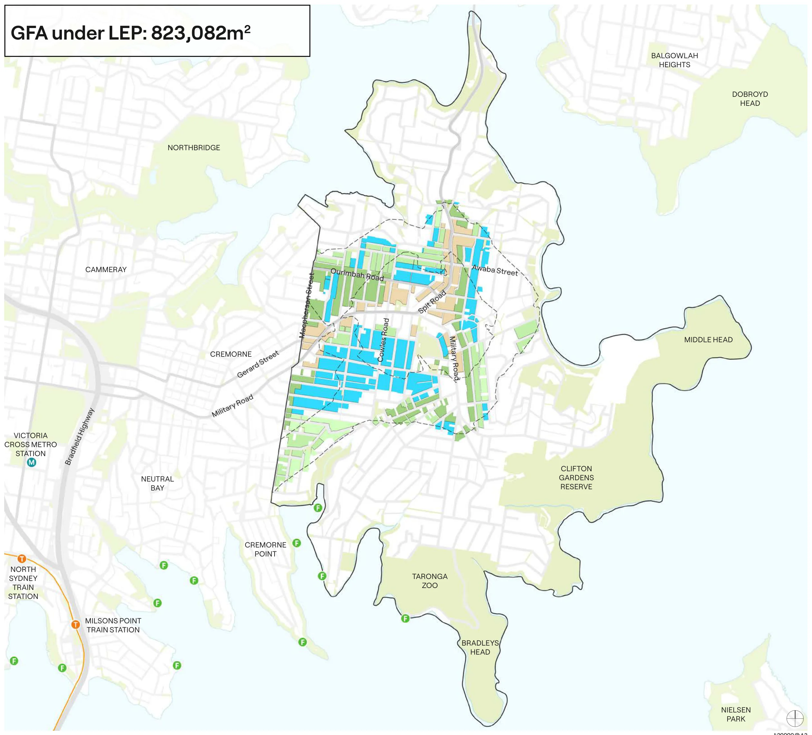

<!-- page 189 -->

 185 SJB

### Appendix C

### Planning capacity under LMR controls

1:20000 @ A3

DOBROYD HEAD

MIDDLE HEAD

CLIFTON GARDENS RESERVE

BALGOWLAH HEIGHTS

NORTHBRIDGE

CAMMERAY

NIELSEN PARK

Military Road

Military Road

Spit Road

Gerard Street

Ourimbah Road Macpherson Street

Cowles Road

Bradfield Highway

BRADLEYS HEAD

NEUTRAL BAY

CREMORNE POINT

MILSONS POINT TRAIN STATION

NORTH SYDNEY TRAIN STATION

CREMORNE

Awaba Street

VICTORIA CROSS METRO STATION

TARONGA ZOO

KEY

Study area boundary

400/800m catchments

0.8

1.5

2.2

Train line

Train station

Metro station

Ferry stop

Open space

## Additional GFA under LMR: + 950,000m2

### The maximum GFA permissible under the

### LMR policy varies depending on zoning

### and catchments from the LMR centre. The

### below table was used to determine the

### maximum FSR applicable to each lot within

### the LMR area.

### To determine the additional planning

### capacity generated by LMR controls, the

### total GFA under existing LEP controls was

### subtracted from this total.

### The average unit size delivered by the

### developments lodge under the Low to Mid

### Rise is: 163sqm

#### Zoning Catchment

#### FSR

#### HOB

R2 0-800m 0.8 9.5m

R3

0-400m 2.2 22m (max. 6 storey)

400m-800m 1.5 17.5m (max. 4 storey)

August 2026

Attachment 1.1.1 Mosman Council

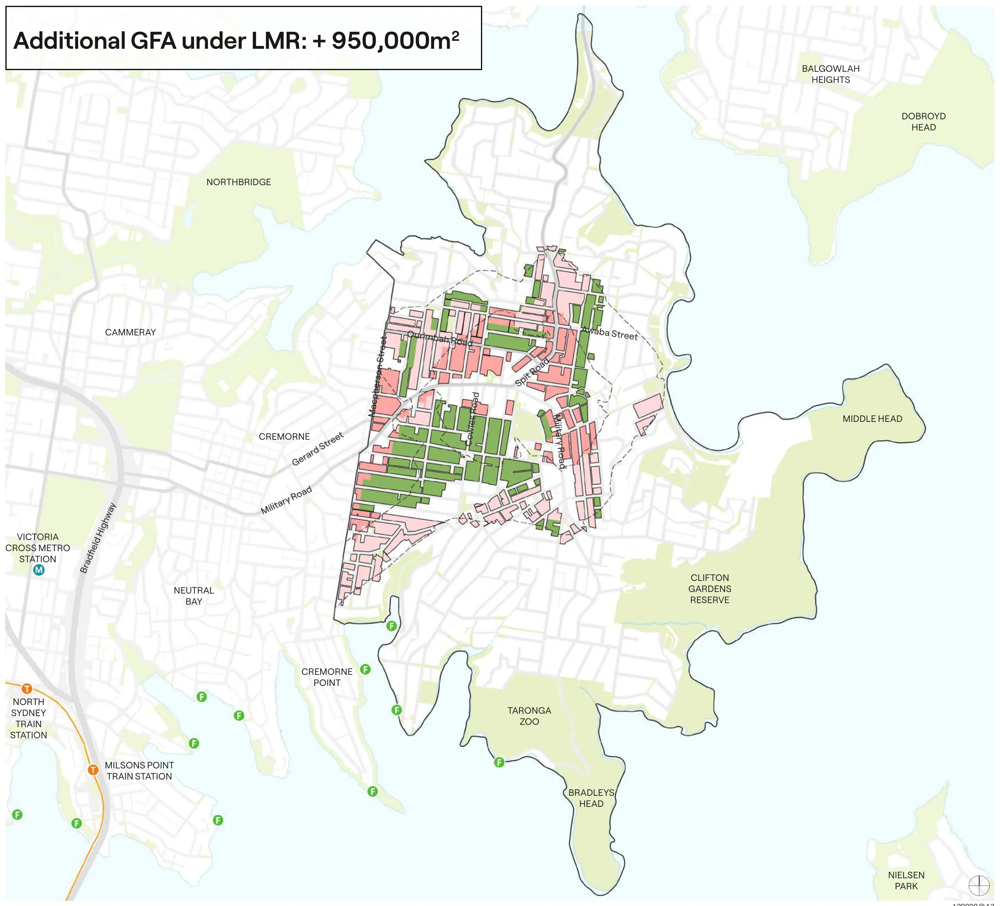

<!-- page 190 -->

 186 SJB

### Appendix C

1:20000 @ A3 1:20000 @ A3

DOBROYD HEAD

MIDDLE HEAD

CLIFTON GARDENS RESERVE

BALGOWLAH HEIGHTS

NORTHBRIDGE

CAMMERAY

NIELSEN PARK

Military Road

Military Road

Spit Road

Gerard Street

Ourimbah Road Macpherson Street

Cowles Road

Bradfield Highway

BRADLEYS HEAD

NEUTRAL BAY

CREMORNE POINT

MILSONS POINT TRAIN STATION

NORTH SYDNEY TRAIN STATION

CREMORNE

Awaba Street

VICTORIA CROSS METRO STATION

TARONGA ZOO

7.

### Remove constrained lots

### Constrained lots are excluded from the LMR

### uplift analysis and revert to their existing

### LEP controls, meaning they generate no

### additional development capacity.

### By applying LMR controls only to

### unconstrained lots, the analysis reflects

### development potential that is realistic,

### feasible, and deliverable. This final sieving

### step establishes the true additional housing

### capacity deliverable under the LMR

### controls.

KEY

LGA boundary

400/800m catchments

FSR 2.2:1 (0-400m R3 zone)

FSR 1.5:1 (400-800m R3 zone)

FSR 0.65 - 0.8:1 (0-800m R2 zone)

Constrained sites within the LMR land application area

### Sieving process for

### deliverable LMR capacity

#### Constrained capacity 317,000 sqm

## Additional GFA under LMR: + 633,000m2

August 2026

Attachment 1.1.1 Mosman Council

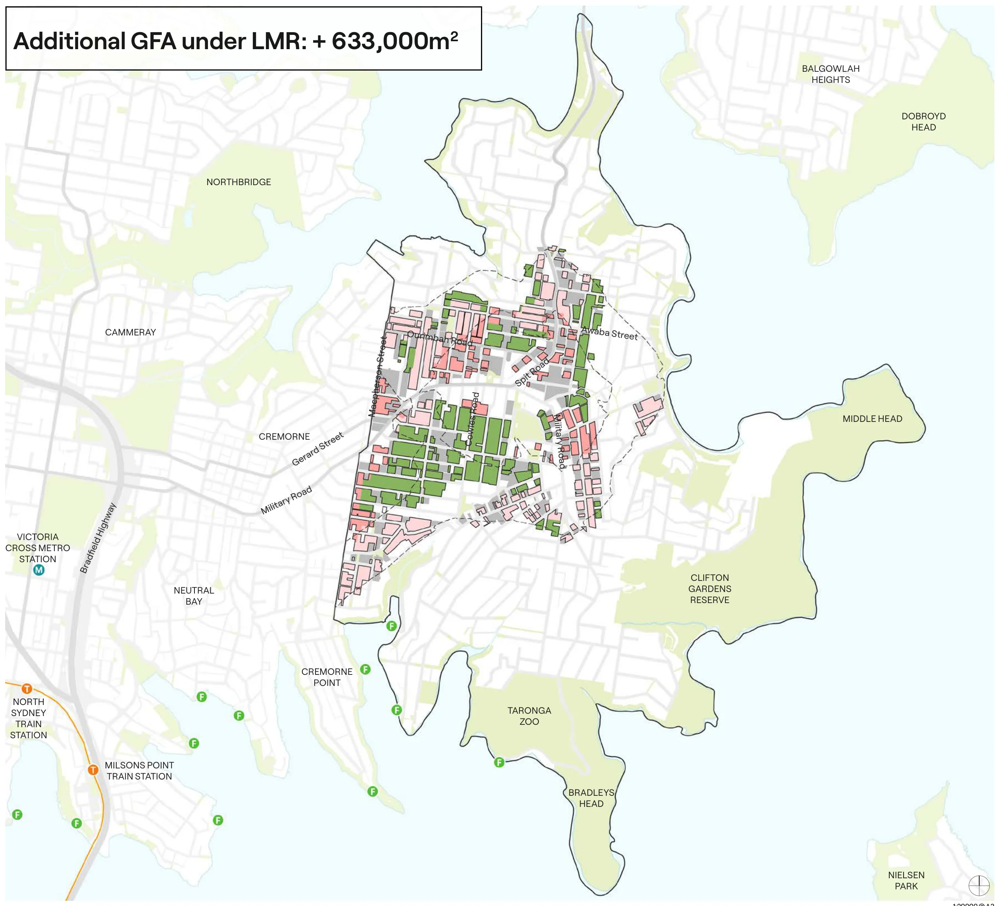

<!-- page 191 -->

 187 SJB

### Appendix C

*Based on the average between the existing average unit size (105) and the Low to Mid Rise delivered average unit size (163sqm).

### DWELLING CAPACITY

### UNDER EXISTING LMR CONTROLS

### DWELLING CAPACITY

### UNDER EXISTING LEP CONTROLS

### DELIVERABLE DWELLING CAPACITY

### UNDER EXISTING LMR CONTROLS

### DELIVERABLE DWELLING CAPACITY

### UNDER LONG TERM MASTERPLAN FOR MOSMAN

### 7,838 dwl

### ~ 4,700 dwl

### 116 % INCREASE

### 76% INCREASE

### Summary of results

#### 40%

#### Constrained

#### 134sqm average unit size.

### LEP

### PLANNING CAPACITY

### LMR

### PLANNING CAPACITY

### DELIVERABLE

### LONG TERM

### MASTERPLAN FOR

### MOSMAN

August 2026

Attachment 1.1.1 Mosman Council

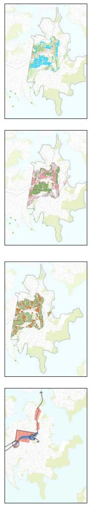

<!-- page 192 -->

 188 SJB

### Appendix C

### Recently lodged DAs provide an indication

### of the unit sizes that are feasible in the

### current market and realistically achievable.

### Based on this, an analysis of these DAs was

### undertaken to establish a practical average

### unit size to inform our calculations.

### This process does not alter the total GFA

### requirement.

### Instead, it translates the existing GFA

### allowance into an average unit size that

### more accurately reflect local market

### conditions. As market conditions evolve

### over time, the average unit size may also

### shift; therefore, the focus of this exercise

### remains on the overall GFA required,

### with the average unit size serving as an

### expression of how that GFA is typically

### delivered.

### Note: The average unit size has been rounded from 163 sqm to 160 sqm to avoid overstating

### the precision of the analysis and provide a more representative assumption for calculation

### purposes.

### Average unit size under LMR controls

Address Type Status Total number of dwellings

Number of affordable housing units

Average unit size

48-50 Almora St DA Lodged 14 3 217

34 Redan St DA Lodged 3 0 180

65 Muston St SSDA Scoping report lodged 13 3 274

27-29 Heydon St DA Approved 27 5 108

93-101a Awaba St DA Lodged 29 0 149

30 Muston St DA Lodged 4 0 198

89-91 Avenue Rd DA Lodged 8 0 124

11-23 Rangers Avenue SSDA Lodged 44 10 159

494 & 516 Military Road HDA Lodged ~107 ~3 76

15-25 Myahgah Rd DA Approved 20 0 142

AVERAGE 163

### TOTAL GFA

### NUMBER OF

### APARTMENTS

### IDENTIFY LODGED DAs

### AVERAGE OF LODGED DAs

### AVERAGE UNIT SIZE

### AVERAGE UNIT SIZE

### UNDER THE LMR

### 163m2

## ÷

## =

## =

August 2026

Attachment 1.1.1 Mosman Council

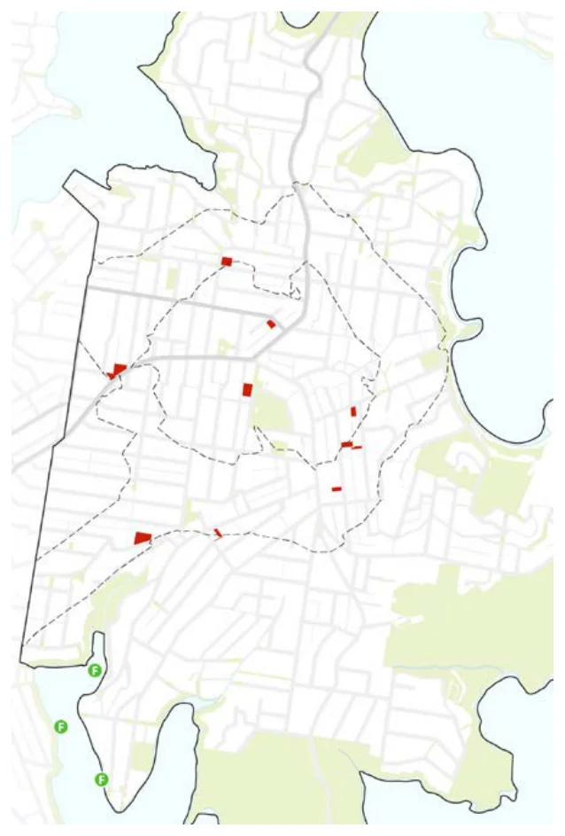

<!-- page 193 -->

 189 SJB

### Appendix C

*Dataset sourced from Geoscape

### Under existing LEP controls, the average

### unit size is derived from analysis of

### Mosman’s current housing stock. This

### ensures yield estimates reflect established

### development patterns and the typical unit

### configurations found in existing strata

### buildings.

### To determine a representative average unit

### size for the E1, E3 and R3 zones, an analysis

### of local strata schemes was undertaken

### using data from Geoscape and Strata Hub.

### These datasets provided indicative GFA

### for existing strata buildings, enabling an

### informed estimate of unit sizes across strata

### buildings.

### IDENTIFY STRATA BUILDINGS

### AREA OF BUILDING

### FOOTPRINT*

### NUMBER OF LEVELS*

### 75% GBA TO GFA

### EFFICIENCY

### TOTAL GFA OF STRATA

### BUILDINGS

### TOTAL GFA OF STRATA

### BUILDINGS

### TOTAL NUMBER OF

### STRATA TITLES**

### EXISTING AVERAGE

### UNIT SIZE

### 105m2

## X

## =

## X

### Average unit size under LEP controls

## ÷

## =

Area of building footprint Number of levels

Total GBA Total GFA

1 271 11 2978 2234

2 585 15 8773 6580

3 51 2 102 77

4 70 5 349 262

5 1115 8 8916 6687

6 284 2 568 426

7 420 10 4196 3147

8 505 6 3033 2275

9 456 10 4556 3417

... ... ... ...

TOTAL 1,209,533 907,150

August 2026

Attachment 1.1.1 Mosman Council

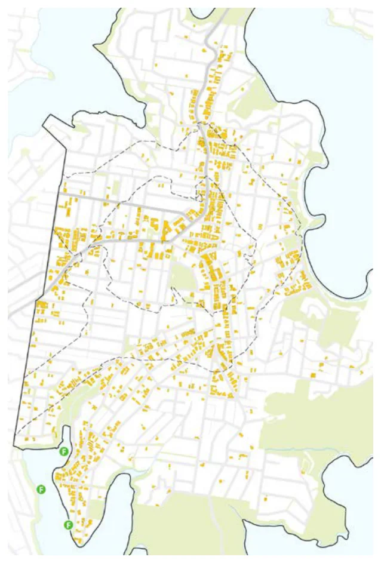

<!-- page 194 -->

 190 SJB

### Appendix C

### Assumptions

Existing planning capacity under the current LEP

Existing theoretical planning capacity has been calculated having regard to the Stage 1 Low to Mid Rise (LMR) Housing reforms, as applied to Mosman LGA.

The capacity estimate is based on the following zone-specific yield assumptions:

R2:

— Lots that meet the minimum lot size required for dual occupancies are assumed capable of delivering two ( 2 ) dwellings per lot. — Lots that do not meet the minimum lot size for dual occupancies are assumed to deliver one ( 1 )  dwelling per lot.

C4 Environmental Living:

— Dwelling homes are the only permissible typology; accordingly, a yield of one ( 1 ) dwelling per lot is applied.

R3 and E3:

— Capacity is derived from the permissible Floor Space Ratio (FSR), noting that residential flat buildings are permissible within these zones. Yield is therefore calculated on an FSR-based approach.

E1:

— Where shop-top housing is permissible, residential capacity is calculated by applying a non-residential FSR allowance of 0.6:1, with the balance of permissible floor space assumed to be available for residential use (shop-top housing)

Planning capacity under the LMR

LMR “application land” was independently delineated in accordance with the published LMR eligibility criteria. This independent mapping was cross-checked against the Department of Planning, Housing and Infrastructure (DPHI) LMR application land mapping and no material inconsistencies were identified.

The Affordable Housing Bonus was excluded from the housing capacity estimate. Accordingly, all dwelling yields reported represent capacity under the base LMR controls only.

LMR does not apply to heritage listed items. Heritage items have been excluded from the calculation.

LMR planning capacity has been expressed as a range for R2 Low Density Residential land, using the maximum Floor Space Ratio (FSR) applicable to low-rise housing and mid-rise housing under the LMR controls. This approach is informed by a review of recent development applications (DAs) in Mosman which indicates that low-rise typologies are currently the predominant and most viable development outcome within the R2 zone.

All other applicable LMR development standards were applied to eligible R2 and R3 land within the mapped 400 m and 800 m catchments .

Average unit size

Under existing LEP controls, the average unit size is derived from Mosman’s current housing stock. This ensures the calculation reflects established development patterns and the typical unit configurations found in existing strata buildings. An analysis of local strata schemes was used to determine representative unit sizes for estimating dwelling yields in the E1, E3 and R3 zones.

Adopted average unit size (Existing LEP controls): 105 m² per dwelling

Under the LMR controls, the average unit size adopted for yield estimation is based on lodged development applications within Mosman. Lodged proposals provide the most direct evidence of what proponents consider feasible within current market conditions and development standards, and therefore offer a robust basis for modelling likely dwelling configurations under the LMR controls. The reviewed lodged applications were used to derive a representative average unit size for converting permissible floor space into dwelling yields under the LMR scenario and this equates to an average unit size (LMR controls): 163 m² per dwelling.

The average unit size adopted to establish 4,700 dwellings is an average between the two and equates to 134 m²average dwelling size.

Sieving process

Strata over 10 lots:  Lots within strata schemes comprising 10 or more lots were excluded on the basis that fragmented ownership typically requires extensive negotiation, time, and financial alignment to secure collective agreement, and this transaction burden is generally disproportionate to the marginal uplift offered under the LMR controls. Below 10, with LMR FSR of 2.2:1 is assumed feasible (this assumption has been made by SJB, it is not based on economics or independent feasibility study).

Community infrastructure: Sites held in public ownership, community title, and/or with an infrastructure/community function (including land zoned SP2 or equivalent special-purpose categories) were excluded due to their high community value, long-term operational role, and limited redevelopment flexibility

Recent developments: Lots subject to recent and significant development investment were excluded as they are unlikely to redevelop within the relevant assessment horizon given remaining building life and sunk costs, and because the uplift available under the LMR controls is typically insufficient to trigger redevelopment.

Flood-affected land: A flood study was carried out by Council in 2025. The report has been used to asses flood affected zone.

Flood-affected lots have been assessed using Flood Planning Constraint Categories (FPCC).

— FPCC1-2 High risk flood areas: Any lot intersecting these zones is excluded — FPCC3 Moderate flood risk: Only lots significant affected are excluded, based on advice from Council engineers. Lots with minor overlaps with FPCC3 zones are retained to avoid the exclusion of otherwise viable sites.

August 2026

Attachment 1.1.1 Mosman Council

<!-- page 195 -->

## Land use analysis and existing jobs calculation

## 13

## Appendix D

August 2026

Attachment 1.1.1 Mosman Council

<!-- page 196 -->

192 SJB 

### Appendix D

MED 7 MED 6

MED 5 MED 4

MED 3 MED 2 STH 11 STH 21

AS 3 AS 3

RT 46

RT 47 COM 8

STH 18 STH 18

PS 5

PS 4 SF 8 SF 8 SF 7 SF 9 SF 9 AC2

RT 45 OC 20 OC 19 RT 43

OC 18 RT 42

CC 4 CC 4 OC 15

OC 10 OC 7 OC 6 OC 5 RT 38

OC 3 RT 41

SF 6

RT 36

STH 16 STH 16 STH 16 HS 3

HS 2

RT 25

RT 24

AS 1 RT 6 STH 2

STH 3

AS 2

STH 17 STH 17 STH 17

SF 5

STH 15 STH 15

STH 13

RT 34 RT 33

RT 32 STH 13

STH 13 STH 13 STH 13 STH 14 STH 14

CC 2 STH 12

STH 12 COM 4 COM 4 RT 28 STH 11 STH 11 RT 26

STH 8 RT 23 CC1 RT 21 RT 22 RT 20 STH 7 STH 6 STH 6 STH 5 RT 16 STH 5 RT 19

OC 1 AC1 H 1

RT 15 RT 14 RT 12 RT 10 STH 4 STH 4 STH 4

COM 2

MED 1 AS 9 STH 24 STH 24 STH 24 STH 24 STH 24 STH 24 STH 23 STH 23 AS 7 STH 22

RV 3 PS 6

AC 3

STH 21

STH 19

RV 2 RV 1 RV 3

SF 12 SF 11

SF 10

SF 4

COM 9

COM 7 COM 6

COM 5

EM 3

EM 2

EM 1

RT 57 RT 56 RT 55 RT 54 RT 53 RT 52

RT 51

RT 50

RT 49

RT 48

RT 44

RT 40 RT 39

RT 37

RT 35

RT 31 RT 30 RT 29

RT 27

STH 3

RT 16 RT 12 RT 13 RT 18 RT 17

RT 11 RT 9 RT 8

RT 7

RT 5

RT 4 RT 3

RT 2 RT 1

SF 3

SF 2 SF 1

COM 3

COM 1

HS 4

HS 1 PS 7

PS 3

PS 2

PS 1

CC 6

CC 5

CC 3 OC 8

OC 24 OC 23 OC 22

OC 21

OC 17 OC 16 OC 14 OC 13 OC 12 OC 11 OC 9 OC 8

OC 4

OC 2

AS 9 AS 8 AS 6

AS 4

AS 5 STH 20

STH 10

STH 9

STH 1

RT 12 MED 8

COWLES RD

ART GALLERY WAY

COWLES RD HARBOUR ST

BRADY ST

OURIMBAH RD

AWABA ST AWABA ST

KILLARNEY ST

AMIENS AVE STANTON RD

WARRINGAH RD

HORDERN PL SPIT RD PUNCH ST CLIFFORD ST HORSNELL LN GURRIGAL ST VISTA ST

BOND ST LANG ST

LANG ST

SHELL ST

MACKIE LN HALE RD MACPHERSON ST ERITH ST

PRINCE ST MELROSE ST

EARL ST

OURIMBAH RD

PRINCE ST BELMONT RD GLOVER ST LINDSAY LN

TWIN TOWERS WALK

BARDWELL RD BARDWELL RD WUDGONG ST CARDINAL ST

CARDINAL ST

ROSEBERY ST COUNTESS ST

### Commercial workspace calculation

A study of the commercial built form across Mosman has been undertaken estimate the number of commercial jobs that may be affected by the masterplan. The analysis focuses on observed commercial development throughout the LGA to provide an indicative assessment of employment capacity.

The methodology involves analysing built‑form data, including floor plate area and number of storeys, to calculate the gross building area (GBA) for each identified commercial building. A range of efficiency assumptions is then applied to derive gross floor area (GFA), which forms the basis for estimating employment capacity.

Employment estimates are generated by applying workspace ratios to the calculated GFA. This approach is informed by the Common Planning Assumptions (CPA) 2023 Workspace Ratios 2023 published by the NSW Department of Planning. These ratios are used to estimate the number of full‑time equivalent jobs that may be supported by commercial development, based on the business size and land use typology.

The analysis is based on observed commercial built form within predominantly non-residential areas. Employment generated by other uses have not been fully captured. Notable exclusions include Taronga Zoo, HMAS Penguin Naval Base, and religious institutions, which are unaffected by the masterplan.

LAND USE GBA > GFA EFFICIENCY Shop-top housing 60% Aged care 75% Medical 85% Retirement village 75% Hotel 75% Automotive services 90% Office and commercial 90% Childcare/preschool 90% Primary school 85% High school 85% Community 90% Sports facility 90% Retail 60% Police and emergency 90%

LAND USE RATIO GUIDE UNIT (PER FTE JOB POSITION) CPAG 2023 RANGE Shop-top housing 35 m² GFA n/a Aged care 200 m² GFA 2.25 residents Medical 32 m² GFA 25 to 45 m² GFA Retirement village 380 m² GFA 220 to 460 m² GFA Hotel 100 m² GFA 100 to 525 m² GFA Automotive services 100 m² GFA n/a Office and commercial 15 m² GFA 10 to 20 m² GFA Childcare/preschool 35 m² GFA 30 to 40 m² GFA Primary school 15 students 14 to 16 students High school 12 students 10 to 13 students Community 35 m² GFA 30 to 40 m² GFA Sports facility 225 m² GFA 130 to 250 m² GFA Retail 80 m² GFA 50 to 120 m² GFA Police and emergency 75 m² GFA n/a

KEY

STH Shop-top housing

AC Aged care MED Medical

RV Retirement village

H Hotel

AS Automotive services

OC Office and commercial

CC Childcare/preschool

PS Primary school

HS High school

COM Community

FS Sports facility RT Retail

EM Police and emergency

2023 Workspace Ratios (NSW Department of Planning and Environment, 2022)

Efficiencies

1:20,000 @ A3

01

02

04

06

08 09

03

05

07

August 2026

Attachment 1.1.1 Mosman Council

<!-- page 197 -->

 193 SJB

### Appendix D

CATEGORY LOT CODE STOREYS GBA (m²) GFA (m²) STUDENTS JOBS CATEGORY LOT CODE STOREYS GBA (m²) GFA (m²) STUDENTS JOBS Shop-top housing STH1 1 2190 1314 38 STH2 1 517 310 9 STH3 1 1043 626 18 STH4 1 3952 2371 68 STH5 1 542 325 9 STH6 1 2877 1726 49 STH7 1 623 374 11 STH8 1 1322 793 23 STH9 1 2838 1703 49 STH10 1 2003 1202 34 STH11 1 2268 1361 39 STH12 1 1000 600 17 STH13 1 5397 3238 93 STH14 1 3038 1823 52 STH15 1 2757 1654 47 STH16 1 1118 671 19 STH17 1 2277 1366 39 STH18 1 1748 1049 30 STH19 1 570 342 10 STH20 1 1210 726 21 STH21 1 610 366 10 STH22 1 333 200 6 STH23 1 820 492 14 STH24 1 3975 2385 68 Aged care AC1 4 5917 4438 22 AC2 2 2395 1796 9 AC3 3 4372 3279 16 Medical MED1 2 397 338 11 MED2 3 1624 1381 43 MED3 2 531 452 14 MED4 1 264 225 7 MED5 1 146 124 4 MED6 2 567 482 15 MED7 4 2433 2068 65 MED8 3 1177 1001 31 Retirement village RV1 2 to 3 17785 13339 35 RV2 1 to 2 5417 4063 11 RV3 3 to 5 9292 6969 18 Hotel H1 2 to 3 1335 1001 10 Automotive services AS1 1 225 203 2 AS2 1 385 347 3 AS3 1 473 426 4 AS4 2 1592 1433 14 AS5 2 3405 3065 31 AS6 1 442 398 4 AS7 2 to 3 1100 990 10 AS8 3 7943 7149 71 AS9 2 840 756 8 Office and commercial OC1 4 to 5 1556 1400 93 OC2 1 236 212 14 OC3 1 49 44 3 OC4 1 163 146 10 OC5 2 704 634 42 OC6 1 215 193 13 OC7 1 423 380 25 OC8 1 1853 1668 111 OC9 1 415 373 25 OC10 1 327 294 20 OC11 1 44 40 3 OC12 1 45 41 3 OC13 1 441 397 26

CATEGORY LOT CODE STOREYS GBA (m²) GFA (m²) STUDENTS JOBS OC14 1 667 600 40 OC15 1 669 602 40 OC16 1 661 595 40 OC17 1 669 602 40 OC18 1 687 618 41 OC19 2 843 758 51 OC20 2 to 3 2461 2215 148 OC21 3 1579 1421 95 OC22 3 to 4 2681 2413 161 OC23 4 1213 1092 73 OC24 2 507 456 30 Childcare/preschool CC1 2 1090 981 28 CC2 1 to 2 404 364 10 CC3 2 651 586 17 CC4 1 630 567 16 CC5 1 to 2 553 498 14 CC6 1 354 319 9 Primary school PS1 1 to 2 3865 3286 205 14 PS2 1 to 3 8091 6877 458 31 PS3 2 2927 2488 114 8 PS4* 2 to 3 7908 6722 300 20 PS5 2 to 3 4196 3567 221 15 PS6 2 4241 3605 373 25 PS7 1 to 3 7025 5972 423 28 High school HS1* 2 4528 3849 HS2* 6 18069 15359 HS3* 1 to 2 1251 1063 HS4 1 to 3 17289 14696 1087 91 Community COM1 2 360 324 9 COM2 2 to 4 3817 3435 98 COM3 2 1603 1443 41 COM4 3 2563 2307 66 COM5 2 1231 1108 32 COM6 2 1582 1423 41 COM7 1 309 278 8 COM8 2 288 259 7 COM9 2 1245 1120 32 Sports facility SF1 2 1103 993 4 SF2 2 518 467 2 SF3 2 1012 911 4 SF4 2 1645 1480 7 SF5 2 1248 1123 5 SF6 2 606 546 2 SF7 1 78 71 0 SF8 1 302 271 1 SF9 1 to 2 700 630 3 SF10 3 4614 4152 18 SF11 1 134 120 1 SF12 1 926 834 4 Retail RT1 2 2415 1449 18 RT2 1 to 2 1408 845 11 RT3 2 1803 1082 14 RT4 1 to 2 2928 1757 22 RT5 2 2077 1246 16 RT6 1 to 3 1007 604 8 RT7 2 807 484 6 RT8 3 1233 740 9 RT9 2 1235 741 9 RT10 2 1937 1162 15 RT11 2 9460 5676 71 RT12 1 to 2 4065 2439 30

50 600

RT13 4 4408 2645 33 RT14 2 2197 1318 16 RT15 1 1630 978 12 RT16 2 1033 620 8 RT17 2 557 334 4 RT18 2 1303 782 10 RT19 2 427 256 3 RT20 2 1540 924 12 RT21 1 370 222 3 RT22 2 735 441 6 RT23 2 522 313 4 RT24 2 1910 1146 14 RT25 2 213 128 2 RT26 1 465 279 3 RT27 1 207 124 2 RT28 1 to 2 590 354 4 RT29 2 785 471 6 RT30 2 573 344 4 RT31 2 987 592 7 RT32 2 1152 691 9 RT33 2 1530 918 11 RT34 2 to 3 980 588 7 RT35 2 1922 1153 14 RT36 1 895 537 7 RT37 2 758 455 6 RT38 1 202 121 2 RT39 1 112 67 1 RT40 1 125 75 1 RT41 1 93 56 1 RT42 1 to 2 953 572 7 RT43 2 2087 1252 16 RT44 2 to 3 1467 880 11 RT45 2 268 161 2 RT46 1 188 113 1 RT47 2 to 3 825 495 6 RT48 1 138 83 1 RT49 1 to 2 1367 820 10 RT50 1 207 124 2 RT51 4 4038 2423 30 RT52 1 483 290 4 RT53 1  to 2 2753 1652 21 RT54 2 702 421 5 RT55 2 375 225 3 RT56 2 752 451 6 RT57 2 1745 1047 13 Police and emergency EM1 1 457 411 5 EM2 2 581 523 7 EM3 2 1404 1264 17

TOTAL JOBS 3,744

Office and commercial Retail

* Queenwood School campus sites

### Commercial workspace calculation

MASTERPLAN  AREA 1873 jobs 125,645m² GFA

(MOSMAN LGA)

August 2026

Attachment 1.1.1 Mosman Council

<!-- page 198 -->

SJB Architecture (NSW) Pty Ltd ABN 20 310 373 425 ACN 081 094 724

Adam Haddow 7188 Emily Wombwell 10714 John Pradel 7004 Jonathan Tondi 11981 Nick Hatzi 9380

Key Retail Sports facility Police and emergency

Project address Mosman NSW Client

Project no. 7218 Project Name Mosman LMRH Alternative

Drawing no. 01 Revision no. 01

Scale NTS @ A3

COMMERCIAL PLAN (01)

EM 1

RT 5

RT 4

RT 3

RT 2 RT 1

SF 2

SF 1

August 2026

Attachment 1.1.1 Mosman Council

<!-- page 199 -->

SJB Architecture (NSW) Pty Ltd ABN 20 310 373 425 ACN 081 094 724

Adam Haddow 7188 Emily Wombwell 10714 John Pradel 7004 Jonathan Tondi 11981 Nick Hatzi 9380

Key Primary school Project address Mosman NSW Client

Project no. 7218 Project Name Mosman LMRH Alternative

Drawing no. 02 Revision no. 01

Scale NTS @ A3

COMMERCIAL PLAN (02)

PS 1

August 2026

Attachment 1.1.1 Mosman Council

<!-- page 200 -->

SJB Architecture (NSW) Pty Ltd ABN 20 310 373 425 ACN 081 094 724

Adam Haddow 7188 Emily Wombwell 10714 John Pradel 7004 Jonathan Tondi 11981 Nick Hatzi 9380

Project address Mosman NSW Client

Project no. 7218 Project Name Mosman LMRH Alternative

Drawing no. 03 Revision no. 01

Key Childcare Aged care Automotive services Primary school Retail Hotel Retirement village Shop-top housing Medical Office and commercial

Scale NTS @ A3

COMMERCIAL PLAN (03)

H 1

RT

MED 1

AS 9

STH 23

STH 23 AS 7 STH 22

AC 3

RV 2

RV 1 RT 57 RT 54

RT 53

RT 1

PS 7

CC 6

OC 24

AS 9

RT 12

COWLES RD

BRADY ST

OURIMBAH RD

BOND ST

LANG ST

LANG ST

MACKIE LN

LE RD

MACPHERSON ST

EARL ST

OURIMBAH RD

BARDWELL RD

CARDINAL ST

ROSEBERY ST

COUNTESS ST

August 2026

Attachment 1.1.1 Mosman Council

<!-- page 201 -->

SJB Architecture (NSW) Pty Ltd ABN 20 310 373 425 ACN 081 094 724

Adam Haddow 7188 Emily Wombwell 10714 John Pradel 7004 Jonathan Tondi 11981 Nick Hatzi 9380

Project address Mosman NSW Client

Project no. 7218 Project Name Mosman LMRH Alternative

Drawing no. 04 Revision no. 01

Key Retail Aged care Automotive services Shop-top housing High school Community Office and commercial

Scale NTS @ A3

COMMERCIAL PLAN (04)

HS 2

RT 25

RT 24

AS 1

RT 6

STH 2

STH 3

AS 2

STH 5 RT 16

STH 5

OC 1

AC1

T 12

RT 10

STH 4

STH 4

STH 4

COM 5

STH 3

RT 16

2

RT 11

RT 9

RT 8

RT 7

COM 1

HS 1

STH 1

AWABA ST

AWABA ST

KILLARNEY ST

AMIENS AVE

STANTON RD

WARRINGAH RD

HORDERN PL

SPIT RD

PUNCH ST

CLIFFORD ST

August 2026

Attachment 1.1.1 Mosman Council

<!-- page 202 -->

SJB Architecture (NSW) Pty Ltd ABN 20 310 373 425 ACN 081 094 724

Adam Haddow 7188 Emily Wombwell 10714 John Pradel 7004 Jonathan Tondi 11981 Nick Hatzi 9380

Project address Mosman NSW Client

Project no. 7218 Project Name Mosman LMRH Alternative

Drawing no. 05 Revision no. 01

Key Retail Aged care Automotive services Shop-top housing High school Medical Community Retirement village Office and commercial

Scale NTS @ A3

COMMERCIAL PLAN (05)

MED 7

MED 6

STH 21

STH 17 STH 17

STH 24

STH 24 STH 24

STH 24

STH 24 STH 24

RV 3

PS 6

STH 21

STH 19

RV 3

C

RT 56 RT 55

RT 52

RT 51

RT 50

RT 49

RT 13

OC 23

OC 22

OC 21

AS 8 AS 6

AS 4

AS 5

STH 20

MED 8

ART GALLERY WAY

COWLES RD HARBOUR ST GURRIGAL ST

VISTA ST

SHELL ST

HA

ERITH ST

PRINCE ST

MELROSE ST

PRINCE ST

BELMONT RD

GLOVER ST

LINDSAY LN

TWIN TOWERS WALK

BARDWELL RD WUDGONG ST

CARDINAL ST

August 2026

Attachment 1.1.1 Mosman Council

<!-- page 203 -->

SJB Architecture (NSW) Pty Ltd ABN 20 310 373 425 ACN 081 094 724

Adam Haddow 7188 Emily Wombwell 10714 John Pradel 7004 Jonathan Tondi 11981 Nick Hatzi 9380

Project address Mosman NSW Client

Project no. 7218 Project Name Mosman LMRH Alternative

Drawing no. 06 Revision no. 01

Key Retail Sports facility Police and emergency Shop-top housing High school Medical Community Primary school Childcare

Scale NTS @ A3

COMMERCIAL PLAN (06)

MED 3

MED 2

STH 11

SF 6

RT 36

STH 16

STH 16

STH 16

HS 3

STH 15

STH 15

STH 13

RT 34

RT 33

RT 32

STH 13

STH 13

STH 13

STH 13

STH 14 STH 14

CC 2

STH 12

STH 12

COM 4

COM 4

RT 28

STH 11

STH 11

RT 26

STH 8

RT 23

CC1

RT 21 RT 22

RT 20

STH 7

STH 6

STH 6

STH 5 RT 19

RT 15

RT 14

COM 2

SF 4

COM 9

EM 2

RT 37

RT 35

RT 31

RT 30

RT 29

RT 27

RT 18

RT 17

SF 3

COM 3

HS 4

PS 2

STH 10

STH 9

HORSNELL LN

August 2026

Attachment 1.1.1 Mosman Council

<!-- page 204 -->

SJB Architecture (NSW) Pty Ltd ABN 20 310 373 425 ACN 081 094 724

Adam Haddow 7188 Emily Wombwell 10714 John Pradel 7004 Jonathan Tondi 11981 Nick Hatzi 9380

Project address Mosman NSW Client

Project no. 7218 Project Name Mosman LMRH Alternative

Drawing no. 07 Revision no. 01

Key Retail Childcare Shop-top housing Primary school Community Automotive services

Scale NTS @ A3

COMMERCIAL PLAN (07)

AS 3

AS 3

RT 46

RT 47 COM 8

STH 18

STH 18

PS 5

STH 17

RT 48

CC 5

August 2026

Attachment 1.1.1 Mosman Council

<!-- page 205 -->

SJB Architecture (NSW) Pty Ltd ABN 20 310 373 425 ACN 081 094 724

Adam Haddow 7188 Emily Wombwell 10714 John Pradel 7004 Jonathan Tondi 11981 Nick Hatzi 9380

Project address Mosman NSW Client

Project no. 7218 Project Name Mosman LMRH Alternative

Drawing no. 08 Revision no. 01

Key Retail Sports facility Primary school Aged care Community Police and emergency

Scale NTS @ A3

COMMERCIAL PLAN (08)

PS 4

SF 8 SF 8 SF 7

SF 9

SF 9

AC2

SF 5

SF 10 COM 6

EM 3

RT 35

PS 3

CC 3

August 2026

Attachment 1.1.1 Mosman Council

<!-- page 206 -->

SJB Architecture (NSW) Pty Ltd ABN 20 310 373 425 ACN 081 094 724

Adam Haddow 7188 Emily Wombwell 10714 John Pradel 7004 Jonathan Tondi 11981 Nick Hatzi 9380

Project address Mosman NSW Client

Project no. 7218 Project Name Mosman LMRH Alternative

Drawing no. 09 Revision no. 01

Key Retail Sports facility Childcare Medical Community Office and commercial

Scale NTS @ A3

COMMERCIAL PLAN (09)

MED 5

MED 4

RT 45 OC 20

OC 19

RT 43

OC 18

RT 42

CC 4

CC 4

OC 15

OC 10

OC 7

OC 6 OC 5

RT 38

OC 3

RT 41

SF 12

SF 11

COM 7

RT 44

RT 40

RT 39

OC 8

OC 17

OC 16

OC 14 OC 13

OC 12

OC 11

OC 9

OC 8

OC 4

OC 2

August 2026

Attachment 1.1.1 Mosman Council

<!-- page 207 -->

## Mosman Civic Precinct Place Plan

## Appendix E -

## Mosman Civic Precinct

## Place Plan

## 14

August 2026

Attachment 1.1.1 Mosman Council

<!-- page 208 -->

Gadi Country Level 2, 490 Crown Street Surry Hills NSW 2010

T	 61 2 9380 9911 E	 sydney@sjb.com.au W	 sjb.com.au

## Design Report

## Mosman Civic Precinct Place Plan

#### Project address

Borogegal and Cammeraigal Country Mosman NSW 2088

#### Prepared for

#### Version

07

#### Issued

August 2026

August 2026

Attachment 1.1.1 Mosman Council

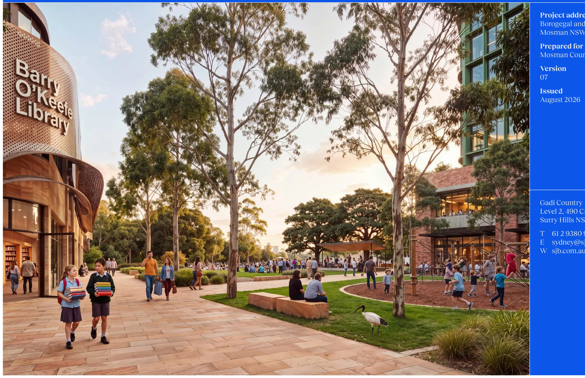

<!-- page 209 -->

## 1

## Introduction

August 2026

Attachment 1.1.1 Mosman Council

<!-- page 210 -->

Mosman Civic Precinct Place Plan 206 SJB

### Executive Summary

KEY OUTCOMES FOR THE SITE

#### KEY OUTCOMES

#### ~4,000m² Library & Community Hub

A contemporary civic destination for learning, gathering and community life.

#### ~2,000m² Village Green

Expanded public open space supporting events, recreation and community activity.

#### New Community, Retail +

#### Commercial Uses

A diverse mix of uses supporting activation and precinct vitality.

#### Consolidated Public Parking

Parking consolidated underground to support future growth and place activation.

#### One Connected Civic Heart

Connecting Mosman’s key civic, cultural and recreational destinations

The Mosman Civic Precinct presents a once-in-a-generation opportunity to strengthen Mosman’s civic heart through a connected mix of community, commercial and public spaces.

Building on the precinct’s established civic role, the Mosman Civic Precinct Place Plan envisions a new Library & Community Hub, an expanded Village Green, enhanced public spaces and improved connections between Mosman Square, Mosman Art Gallery and Allan Border Oval.

As Mosman’s population continues to grow and diversify, the precinct will provide new opportunities for community gathering, learning, recreation and civic life. A connected landscape network, activated public spaces, and a mix of community, cultural, retail and commercial uses will support a vibrant and welcoming destination that serves current and future generations.

Together, these initiatives will create a connected civic centre that supports local activity while advancing the long-term vision established by the Mosman Masterplan.

Military Road

Vista Street

Allan Border Oval

The Crescent

### Introduction

August 2026

Attachment 1.1.1 Mosman Council

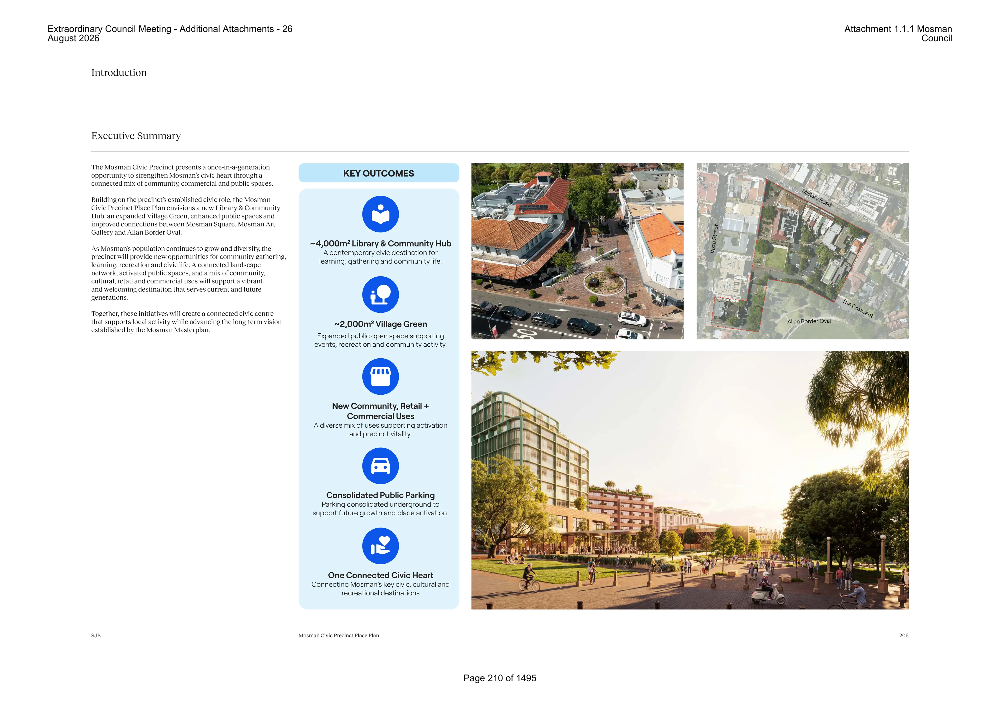

<!-- page 211 -->

Mosman Civic Precinct Place Plan 207 SJB

### Purpose of the Report

A visual representation of the preferred precinct structure, illustrating the intended arrangement of buildings, open spaces, landscape and movement.

A framework of urban design principles and planning controls that guide future built form, landscape, movement and public domain outcomes.

An indicative development outcome demonstrating how the Place Plan framework can be realised through a coordinated ground-floor, landscape and public domain response.

### DESIGN GUIDELINES

### REFERENCE SCHEME

### ILLUSTRATED PLACE PLAN

This Place Plan has been prepared to guide the future evolution of the Mosman Civic Precinct. It establishes a coordinated urban design framework for built form, landscape, movement, and public domain, providing clear direction for future planning, design and implementation while supporting a high-quality civic outcome.

Responding to the broader transformation anticipated through the Mosman Masterplan, the Place Plan strengthens Mosman’s civic, cultural and community heart while respecting the precinct’s valued character.

Design Guidelines

The Design Guidelines establish the key urban design principles and built form framework that will guide future development within the precinct. They provide direction on building height and massing, movement, landscape, public domain, active frontages and civic interfaces to ensure future development contributes to a cohesive, high-quality and people-focused environment.

Illustrated Place Plan

The Illustrated Place Plan translates the Design Guidelines into a spatial vision for the precinct. It illustrates the intended arrangement of buildings, streets, open spaces and landscape, communicating the desired future character and demonstrating how the design principles shape a connected and vibrant civic destination.

Reference Scheme

The Reference Scheme demonstrates one potential development outcome informed by the Place Plan framework. It provides greater clarity around the proposed ground-floor arrangement, landscape and public domain, illustrating how the precinct’s different zones and intended uses can work together to realise the vision and objectives of the Place Plan.

### Introduction

August 2026

Attachment 1.1.1 Mosman Council

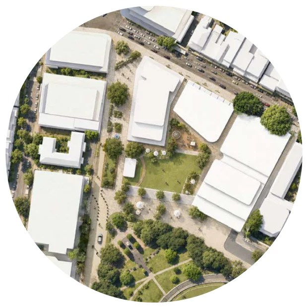

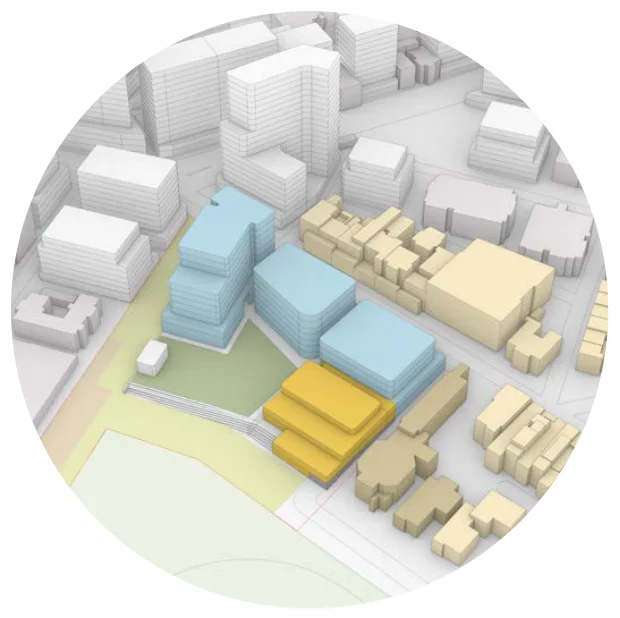

<!-- page 212 -->

Mosman Civic Precinct Place Plan 208 SJB

STAGE 2

STAGE 1

STAGE 4

STAGE 3

### Staging Program

25 20 50 5 0 10 15

The Crescent

Military Road

Military Road

Myahgah Road

Vista Street

Mosman Square

Allan Border Oval

Staging plan overlaid on the future Mosman Masterplan context.

The Civic Precinct Place Plan is intended to be delivered in stages, providing a clear framework for the coordinated renewal of the precinct over time.

Stage 1 (0-5 years)

Establishes the civic centre through delivery of key community facilities and public realm improvements:

— Deliver the expanded Library & Community Hub — Consolidate existing at-grade parking into basement parking, reproviding existing supply, accommodating future demand and allowing flexibility for potential future commercial uses — Deliver upgrades to the existing Mosman Art Gallery and its surrounding public realm — Establish a new shared road from Mosman Square to the Mosman Art Gallery, extending the Art Gallery’s public domain and shared zone along Art Gallery Way. — Expand and enhance the Village Green as the precinct’s primary civic open space — Pedestrianise The Crescent to prioritise the public realm and improve pedestrian connectivity to Allan Border Oval

Stage 2 (5-15 years)

Strengthens the Military Road interface through new commercial development and supporting infrastructure: — Deliver a new mixed-use commercial building with a public arcade connecting Military Road to the new Library & Community Hub — Expand basement parking to support future development — *This plan assumes the acquisition or co-development of an adjoining site because this maximises the public benefit outcome and preserves adjacent heritage values. Should this not proceed, an amended Stage 2 is feasible and would be progressed working solely in Council’s own land holdings.

Stages 3 & 4 (15-30 years)

Completes the long-term vision for the Civic Precinct through additional mixed-use redevelopment and future growth:

— Redevelop the Council Chambers site as a mixed-use destination — Enable potential future development above the retained heritage terraces fronting Military Road (subject to feasibility and heritage considerations)

KEY

Site boundary Council-owned land Stage 1  (0-5 years) Stage 2  (5-10 years)

Stage 2  (potential acquisition of adjoining site*)

Stage 3  (10-20 years) Stage 4 (potential future development)

Mosman Art Gallery

Library & Community Hub

Village Green

Art Gallery Way

### Introduction

August 2026

Attachment 1.1.1 Mosman Council

<!-- page 213 -->

## 2

## Context

August 2026

Attachment 1.1.1 Mosman Council

<!-- page 214 -->

Mosman Civic Precinct Place Plan 210 SJB

### Urban Role of the Civic Precinct

The Civic Precinct is one of Mosman Village Centre’s primary public anchors. Located at the northern gateway to the Military Road Conservation Area, it marks the transition into the village’s heritage main street and plays a defining role in Mosman’s civic and cultural identity.

As one of the largest areas of Council-owned land within the village centre, the precinct brings together key existing public assets including Council Chambers, the Library, the Council car park, the Village Green and Mosman Square. Together, these facilities support everyday community services, civic functions, public events and informal gathering, making the precinct the heart of civic life in Mosman.

The precinct is also strategically positioned between Allan Border Oval, Military Road, Bridgepoint Shopping Centre, Mosman Art Gallery and the public swim centre, placing it at the centre of a broader network of civic, cultural, recreational and commercial destinations within walking distance.

This concentration of publicly owned land presents a rare opportunity to coordinate future civic investment, strengthen connections between these destinations and deliver a more integrated, vibrant and accessible civic precinct for the community.

Existing civic, cultural and community context within the wider Mosman Village Centre.

KEY

Community anchor

Commercial/ mixed use anchor

Open anchor

High density local centre

Residential density

Heritage conservation area

Key movement corridors

Green links

Retail & commercial hub

Community hub

### Context

August 2026

Attachment 1.1.1 Mosman Council

<!-- page 215 -->

Mosman Civic Precinct Place Plan 211 SJB

### Local Context

Village Green

Council Chambers

Mosman Council Flats

Mosman Library

Mosman Art Gallery

KEY

Site boundary

Council-owned land

Site context plan.

The Crescent

Military Road

Military Road

Myahgah Road

Vista Street

Mosman Square

Allan Border Oval

Mosman Swim Centre

25 20 50 5 0 10 15

Art Gallery Way

### Context

The Mosman Civic Precinct forms an important civic and community hub within Mosman Town Centre, bringing together a mix of civic, cultural, community and open space uses.

Key characteristics of the precinct include:

— Central location within the Mosman Town Centre — Mix of civic, cultural, community and recreational uses — Strong landscape setting anchored by the Village Green and Allan  Border Oval — Existing civic buildings set within a fine-grain surrounding context — Network of public spaces, streets and pedestrian connections — Existing level changes impacting accessibility and connectivity — Underutilised Council landholdings with opportunity for renewal

Together, these conditions position the precinct as a significant opportunity to strengthen Mosman’s civic identity, improve connectivity and enhance the relationship between community uses and public open space.

August 2026

Attachment 1.1.1 Mosman Council

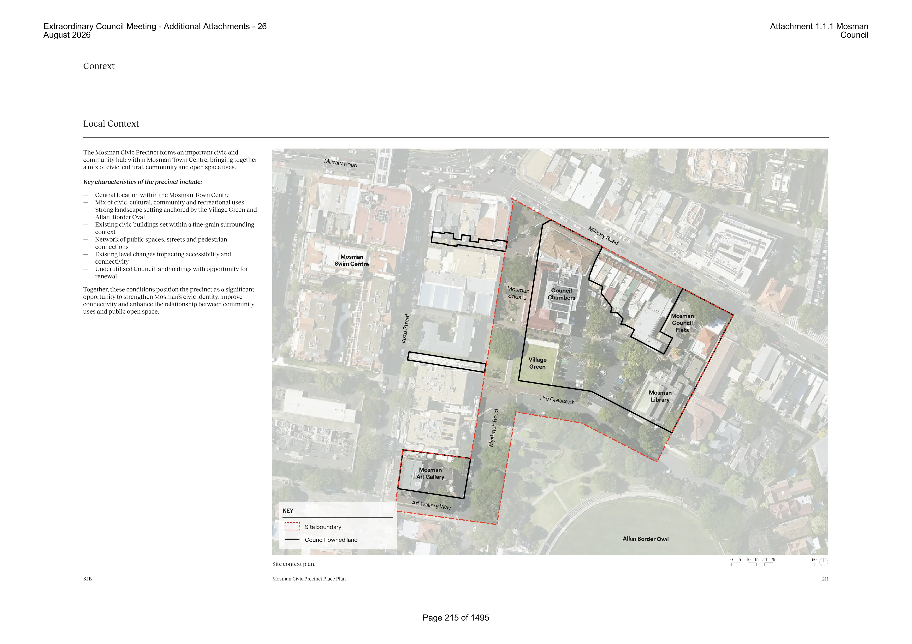

<!-- page 216 -->

Mosman Civic Precinct Place Plan 212 SJB

### Site Context Photos

The Civic Precinct is characterised by mature tree canopy, heritage buildings and well-established civic and community facilities. While the precinct contains high-quality public spaces such as Mosman Square and the Village Green, other areas are fragmented by surface car parking, poor pedestrian connections and underutilised land. The following photographs illustrate the existing character of the precinct and identify opportunities for future renewal.

1

3

5

2

1 3 2

4 6 5 7

7

6

4

6

### Context

Heritage terraces fronting Military Road. Mosman Square and its upgraded landscaped public domain. Existing at-grade parking adjoining the western edge of the library

Playground adjoining the Village Green. Village Green looking towards the Council Chambers. Pedestrian link connecting Military Road and the library. Intersection of Myahgah Road and The Crescent, featuring consistent paving treatments leading to  Mosman Square.

August 2026

Attachment 1.1.1 Mosman Council

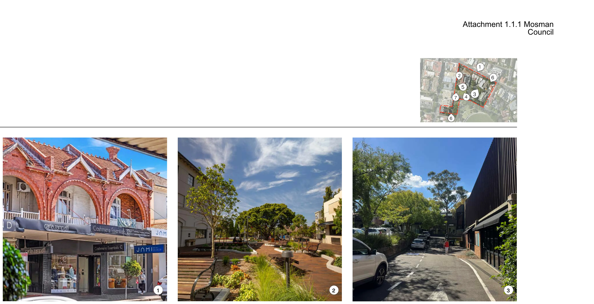

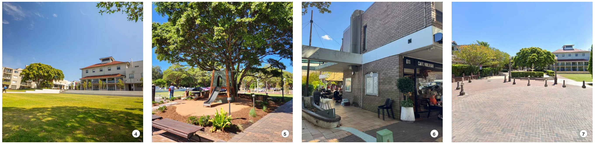

<!-- page 217 -->

Mosman Civic Precinct Place Plan 213 SJB

### Existing Street Interfaces

Military Road - Heritage Interface Military Road - Mixed-use Interface

RETAIL RETAIL/ COMMERCIAL

RESIDENTIAL RESIDENTIAL

RESIDENTIAL

RESIDENTIAL

RESIDENTIAL

RETAIL

COMMERCIAL

3.5m MOSMAN SQUARE FOOTPATH

3.0m PARKING

7.0m 7.0m CARRIAGEWAY CARRIAGEWAY

3.0m PARKING

3.5m 3.5m FOOTPATH FOOTPATH

A B

This section of Military Road is characterised by a fine-grain heritage streetscape that transitions into the civic and commercial character of Mosman Square. Active ground-floor retail with upper-level commercial and residential uses creates a vibrant pedestrian environment, while the adjoining public square and signalised intersection establishes a key arrival point to the Civic Precinct.

This section of Military Road is defined by a strong mixed-use edge with active ground-floor retail and residential uses above. Mature street trees, generous footpaths and on-street parking supports a comfortable pedestrian environment, while the emerging five-storey built form establishes a contemporary urban frontage that reinforces the precinct’s role as Mosman’s civic and commercial centre.

Continuous active retail frontage

Active retail frontage

Gateway to the Civic Precinct

Upper-level commercial and residential uses

2-storey heritage shopfronts

On-street planting/ parking buffer

Mature street trees

5-storey mixed-use development Fine-grain heritage shopfronts

Mosman Square integrated landscape and seating

B

A

### Context

August 2026

Attachment 1.1.1 Mosman Council

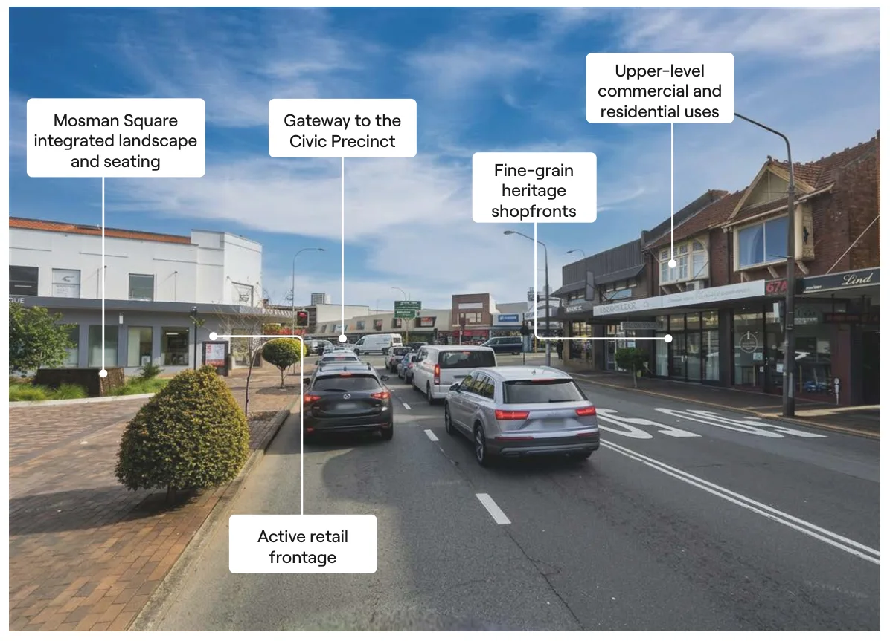

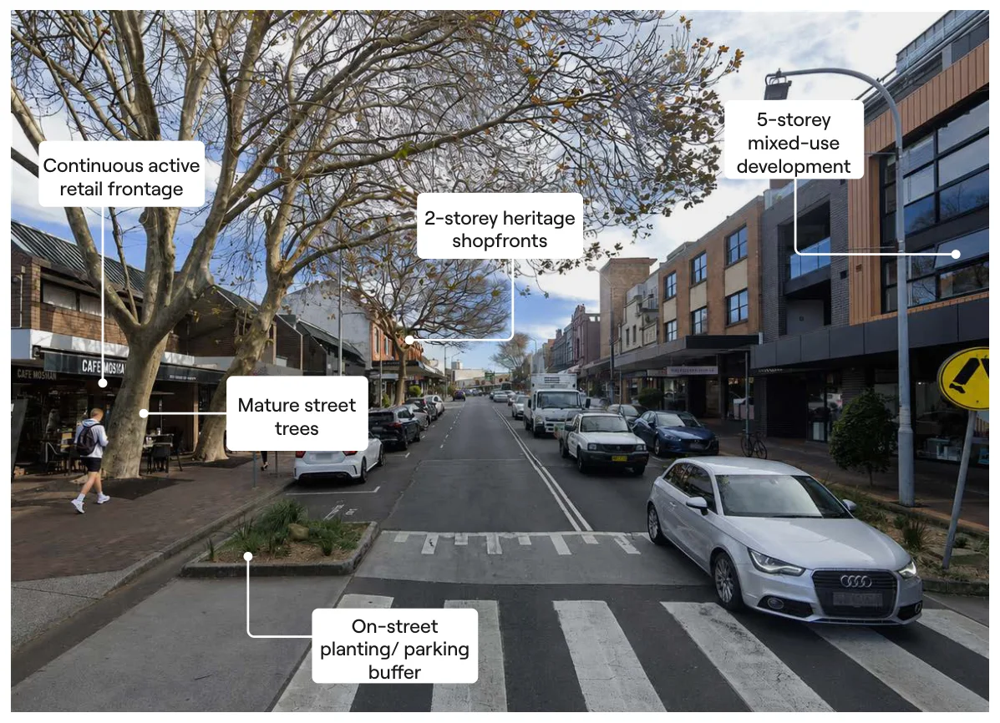

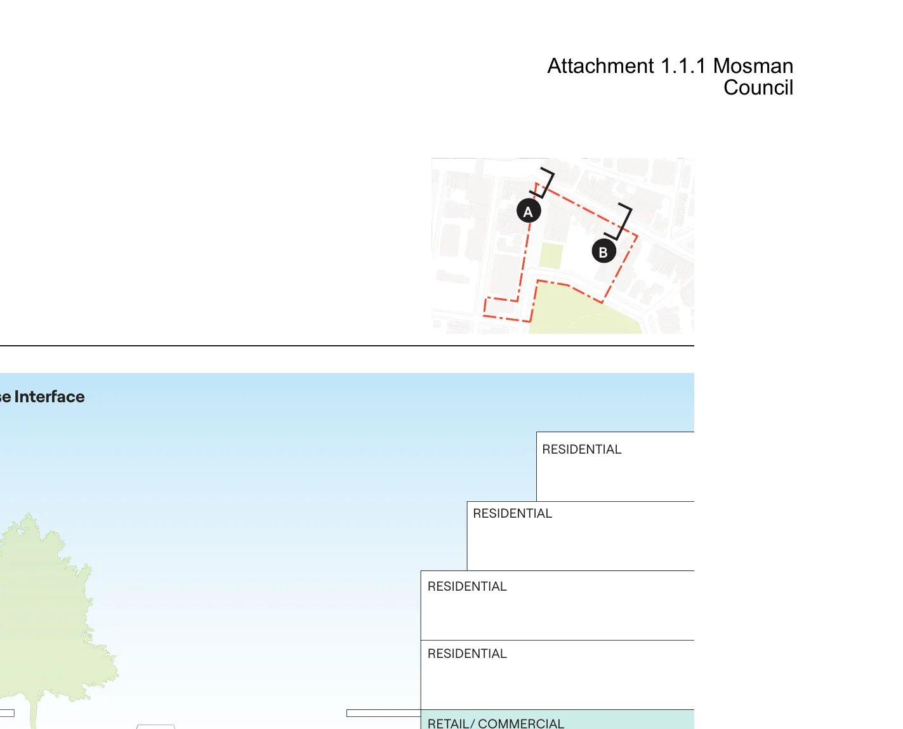

<!-- page 218 -->

Mosman Civic Precinct Place Plan 214 SJB

MOSMAN LIBRARY

4.0m 5.0m FOOTPATH / PLANTING ALLAN BORDER OVAL ANGLED PARKING

4.2m CARRIAGEWAY

6.5m PARKING FOOTPATH/ PLANTING

2.4m

### Street Interfaces

The Crescent D Mosman Square

RETAIL

COMMERCIAL

RETAIL

COUNCIL CHAMBERS/ COMMUNITY

22.0m MOSMAN SQUARE

C

Mosman Square provides the precinct’s primary civic gathering space, framed by active retail, community uses and commercial frontages. A pedestrian-priority environment, with recently upgraded landscape and outdoor dining creates an inviting public destination that supports everyday community activity and reinforces the Civic Precinct as the heart of Mosman.

The Crescent forms a green civic edge overlooking Allan Border Oval, characterised by mature canopy trees, generous landscape setbacks and the Mosman Library. The quieter streetscape complements the active recreational interface while providing a strong connection between the Civic Precinct and surrounding open space.

Upper-level health & wellness uses

Cafés & outdoor dining

Mosman Library frontage onto Allan Border Oval

Generous landscape verge

Mature street trees lining the park edge

Allan Border Oval frontage

Active retail frontages

Integrated landscape and seating High-quality paved civic plaza & flexible gathering space

On street parking supporting all uses

D

C

### Context

August 2026

Attachment 1.1.1 Mosman Council

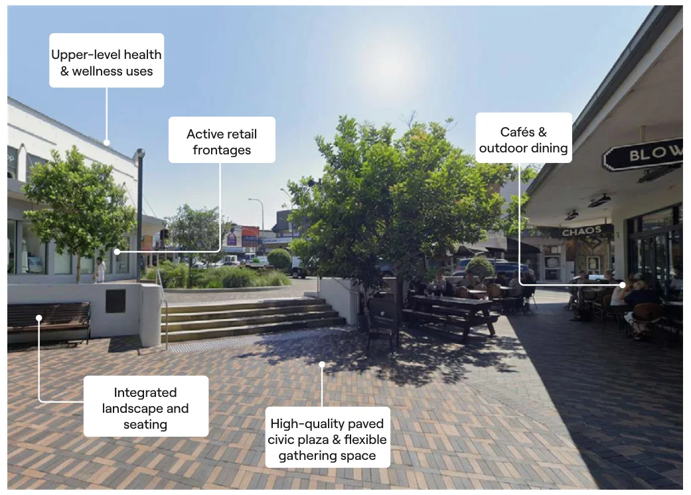

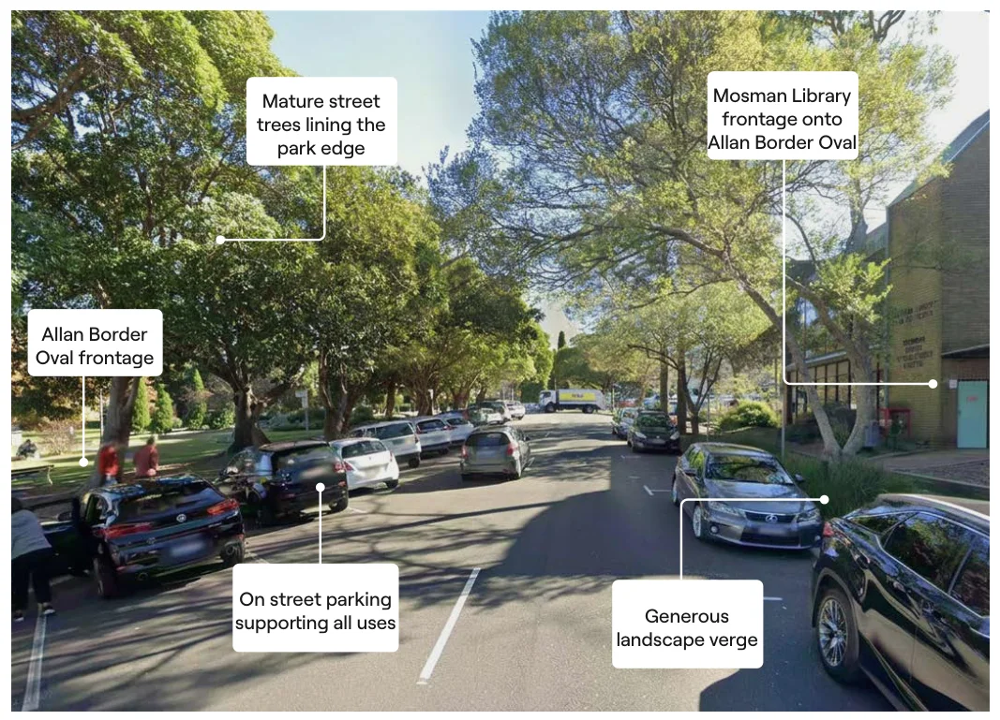

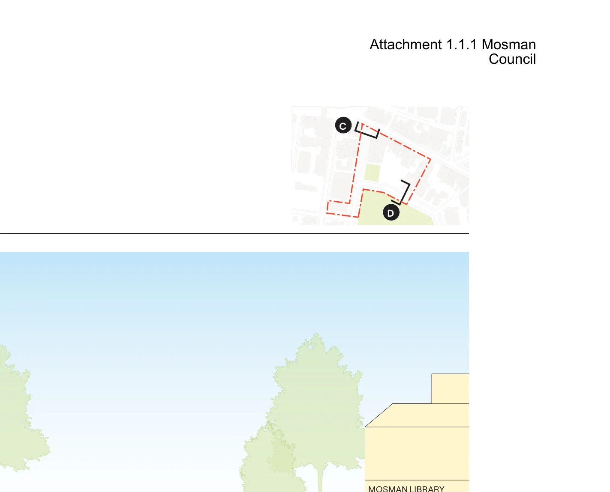

<!-- page 219 -->

Mosman Civic Precinct Place Plan 215 SJB

### Site Constraints

+RL86.6

+RL91.3

+RL87.2

+RL83.7

The Crescent

Military Road

Military Road

Vista Street

Mosman Square

Allan Border Oval

25 20 50 5 0 10 15

The site is constrained by a range of physical, planning and operational factors that influence the location, scale and delivery of future development.

KEY

Site boundary

Council-owned land

Heritage item

Heritage Conservation Area

Sensitive heritage interface

Sensitive open space interface Protect solar access to Allan Border Oval Existing easements

Maintain access and servicing

Re-provide existing parking Existing Council Chambers building +RL86.6 Topography (RLs)

Site constraints within the existing context.

Swim Centre

Village Green

HERITAGE

Heritage-listed buildings, the Heritage Conservation Area and sensitive interfaces with adjoining heritage items constrain redevelopment and require a considered built form response.

TOPOGRAPHY

The site’s sloping topography, falling from Military Road to The Crescent, requires level changes to be addressed when considering building siting, accessibility, public domain and basement design.

SOLAR ACCESS

The proposed solar access controls, which require no additional overshadowing of Allan Border Oval, constrain building height and massing across the site.

ACCESS, SERVICING & EASEMENTS

The existing road network, property access, servicing arrangements and easements, including access to the heritage terraces fronting Military Road and adjoining residential properties accessed from Myahgah Road, must be maintained throughout redevelopment.

EXISTING CIVIC BUILDINGS

Existing civic buildings, including the Council Chambers, are expected to remain in the short term, influencing redevelopment staging and site planning.

PUBLIC PARKING

The existing public parking provision must be re-provided to support the ongoing operation of the civic precinct.

SITE OWNERSHIP

The existing pattern of land ownership, with Council owning only part of the precinct, influences redevelopment extent, staging and delivery. The development configuration in this report assumes a potential future acquisition or co-development of adjoining land. If acquisition or co-development does not proceed, an alternative scheme remains feasible within Council-owned sites.

Myahgah Road

Library

Mosman Art Gallery

Art Gallery Way

### Context

August 2026

Attachment 1.1.1 Mosman Council

<!-- page 220 -->

Mosman Civic Precinct Place Plan 216 SJB

### Site Opportunities

25 20 50 5 0 10 15

The site presents opportunities to strengthen its civic role, improve connectivity, enhance the public realm and support future redevelopment.

Site opportunities plan within the existing context.

Swim Centre

Library & Community Hub

KEY

Site boundary

Council-owned land

Existing pedestrian connections

Future pedestrian connections

Expanded Village Green Upgraded playground & new performance space Consolidate parking into basement parking Upgraded Library & Community Hub Respond to future high density character Key location for future height

Retain heritage terrace facades

Integrate Mosman Square

Expanded civic public realm Pedestrianised section of The Crescent Key views

Library & Community Hub

Redevelop and expand the library to create a stronger civic destination, supporting a broader range of community, cultural and civic uses.

VILLAGE GREEN

Expand and enhance the Village Green as the heart of the precinct, creating a larger, more flexible civic open space with upgraded play opportunities and a new performance area.

CONNECTIVITY & PERMEABILITY

Strengthen pedestrian connectivity by reinforcing a north–south spine through Mosman Square, improving permeability and strengthening connections between new development and surrounding community destinations, including the Swim Centre, Art Gallery and Allan Border Oval.

PUBLIC REALM

Integrate Mosman Square with future development while improving the public realm along The Crescent and Myahgah Road, including opportunities for future pedestrianisation of The Crescent.

HERITAGE

Celebrate the heritage terraces along Military Road by retaining their frontages. Prioritise sensitive redevelopment that responds to the precinct’s heritage significance and surrounding heritage interfaces.

BUILT FORM

Locate higher-density development along key civic edges to reinforce the precinct structure, respond to the future Mosman Masterplan and provide an appropriate transition to surrounding heritage and residential interfaces.

UNDERGROUND PARKING

Consolidate parking below ground to prioritise public realm, improve pedestrian amenity and support future redevelopment.

KEY VIEWS

Protect and enhance key views through the precinct, maintaining visual connections to Allan Border Oval, Mosman Square and surrounding civic destinations.

The Crescent

Military Road

Military Road

Vista Street

Mosman Square

Allan Border Oval

Mosman Art Gallery

Myahgah Road

Art Gallery Way

### Context

August 2026

Attachment 1.1.1 Mosman Council

<!-- page 221 -->

Mosman Civic Precinct Place Plan 217 SJB

#### Auditorium / performance / rehearsal space

#### Community space

#### Cultural centre

#### Exhibition space

#### Technology hub

#### Markets

#### Parking

#### Village green

#### Children’s playground

#### Outdoor performance space

#### Library & Community Hub —

#### Approx. 4,000m²

• Study

• Children/young (indoor)

• Senior centre

• Staff

• Multi-purpose meeting rooms

• Amenities

• Storage

• Hirable hall

RECREATION

COMMUNITY

### Program Opportunities

The Civic Precinct has the potential to accommodate a diverse mix of uses and activities that support its role as a civic, community and mixed-use destination. The following uses illustrate the broad range of activities that may support the long- term evolution of the precinct. They are intended to inform future testing rather than represent a proposed development program.

These potential uses can be understood along a spectrum ranging from public, civic and community-focused activities through to more private or commercially-oriented uses.

While all uses may be appropriate in principle, each carries different operational, spatial and delivery considerations. These include variations in:

— ownership and management models — ground-floor activation needs — servicing requirements — parking demand — access arrangements — security — interface conditions with the public realm

Given the scale and capacity of the precinct, it is not anticipated that all identified uses should be delivered simultaneously. Rather, the program opportunities illustrate the range of potential use combinations that could support the future evolution of the precinct. The preferred mix of uses should balance civic value, community benefit, commercial viability, operational practicality and Council’s long-term strategic objectives.

As the Civic Precinct Place Plan progresses, further work will refine these opportunities into a preferred mix of uses to inform a future project brief.

#### Council administration

#### Council chambers

#### Gym facilities

#### Co-working spaces

#### Co-working spaces

#### Hotel

#### Short-term accommodations

#### Health / wellbeing / day spa

#### Office space for rent

#### Local shops (florist, bakery, convenience etc.)

#### Supermarket

#### Early learning and childcare

#### Cinema

#### Creative / workshop hub

#### Food & beverage

COMMERCIAL

#### Affordable housing

#### Social housing

#### Senior living / retirement living

RESIDENTIAL

### Context

PUBLIC AND CIVIC

LESS CONSIDERATIONS TO RESOLVE

PRIVATE

MORE CONSIDERATIONS TO RESOLVE

August 2026

Attachment 1.1.1 Mosman Council

<!-- page 222 -->

## 3

## Case Studies

August 2026

Attachment 1.1.1 Mosman Council

<!-- page 223 -->

Mosman Civic Precinct Place Plan 219 SJB Mosman Civic Precinct Place Plan 219 SJB

### Case Studies

### Case Studies

### The Canopy, Lane Cove (NSW)

### Civic Place (Stage 1), Liverpool (NSW)

PROJECT DETAILS

Project type Mixed-use civic, retail and public open space redevelopment

Site area ~7,000sqm

Cost Approx. $85M

Delivery

Council-led + partnership redevelopment — Staged delivery integrating civic open space, retail, and parking — Public domain delivered alongside mixed-use development

Program and uses

— 5,800m² civic green and public open space — 1,300m² performance green and event space — 1,000m² nature play and recreation space — Retail, dining, and supermarkets — Community gathering and pedestrian-focused public spaces — 500-space basement car park

Key takeaways

— Civic open space acts as the precinct anchor — Flexible public spaces support events and everyday use — Active edges strengthen activation and safety — Mixed-use development supports civic infrastructure delivery — Staged delivery integrates public domain with surrounding development

PROJECT DETAILS

Project type Mixed-use civic, commercial and potential future BTR development

Site area ~9,000sqm

Cost Approx. $195M+ (Stage 1)

Delivery

Public-private partnership delivery with Built — Staged civic and commercial redevelopment — Civic infrastructure delivered alongside commercial uplift

Program and uses

— 5,000m² civic library and community hub — 13,000m² council and commercial office space — Civic plaza and activated retail frontages — Council chambers and civic administration uses — 2,600m² public park, community gathering spaces and activated public domain — Future residential / BTR development within later stages — Basement parking integrated within the precinct

Key takeaways

— Library and civic plaza act as central public anchors — Co-location of civic and commercial uses supports all-day activation — Commercial uplift supports civic infrastructure delivery — Flexible staged delivery supports long-term precinct growth

August 2026

Attachment 1.1.1 Mosman Council

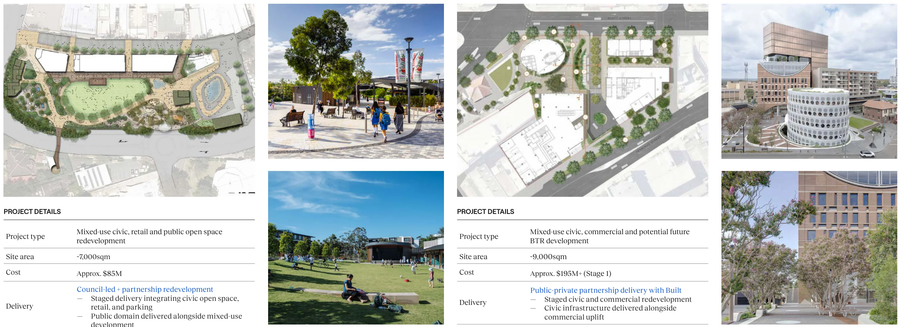

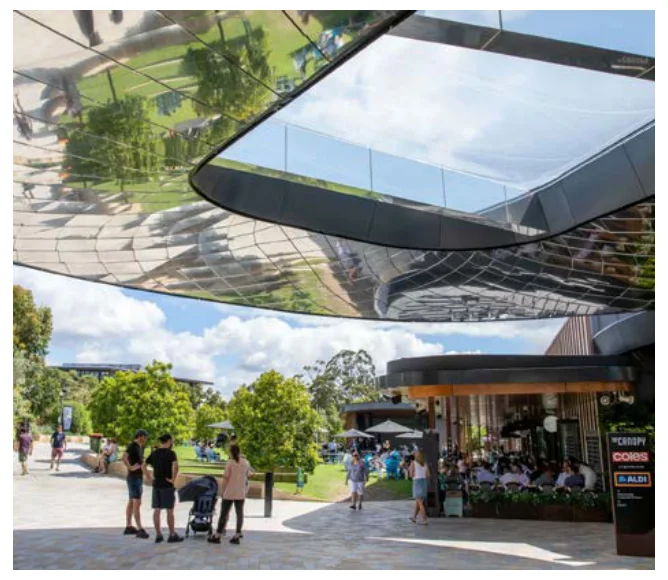

<!-- page 224 -->

Mosman Civic Precinct Place Plan 220 SJB Mosman Civic Precinct Place Plan 220 SJB

### Case Studies

### Case Studies

PROJECT DETAILS

Project type Council-led civic hub integrating library, community services and adaptive reuse of the historic Town Hall

Site area ~8,000sqm

Cost Approx. $39M (staged civic investment)

Delivery

Council-led staged civic investment — Publicly funded civic infrastructure — Delivered in stages to maintain ongoing civic operations — Long-term public ownership and management

Program and uses

— ~2,800m² civic administration and community building — Community park and civic forecourt — Public library and community hub — Flexible meeting and multipurpose spaces — Council customer service centre and civic offices

Key takeaways

— Co-location of civic uses strengthens community access and activation — Adaptive reuse integrated with contemporary civic expansion — Flexible staged delivery supports long-term civic growth — Strong integration between civic buildings and public open space — Civic heart anchored by library, community, and gathering spaces

### Maribyrnong Civic Precinct and Community Hub (VIC)

### Darling Square, Haymarket (NSW)

PROJECT DETAILS

Project type Mixed-use residential, retail, civic, and public domain redevelopment

Site area ~4.6ha

Cost Approx. $3B precinct development

Delivery

State-led urban renewal delivered by Lendlease – Staged mixed-use redevelopment integrating civic and residential uses – Public domain delivered alongside commercial and residential uplift

Program and uses

— ~2,000 apartments and student accommodation — ~3,500m² Darling Square Library and community hub — Retail, dining, and active ground floor frontages — Civic plaza, playgrounds, and public open spaces — Pedestrian-focused laneways and public domain — ~2,700m² central civic square and public open space

Key takeaways

— Library acts as the civic anchor — Public domain integrated with mixed-use development — Civic and residential uses support all-day activation — Pedestrian-focused spaces strengthen public life

August 2026

Attachment 1.1.1 Mosman Council

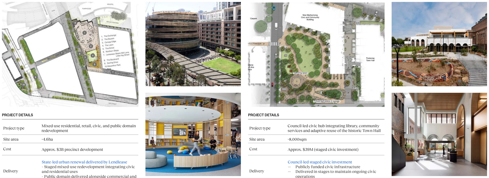

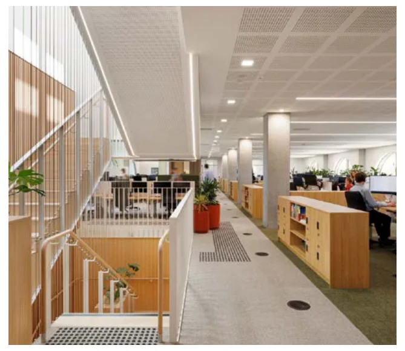

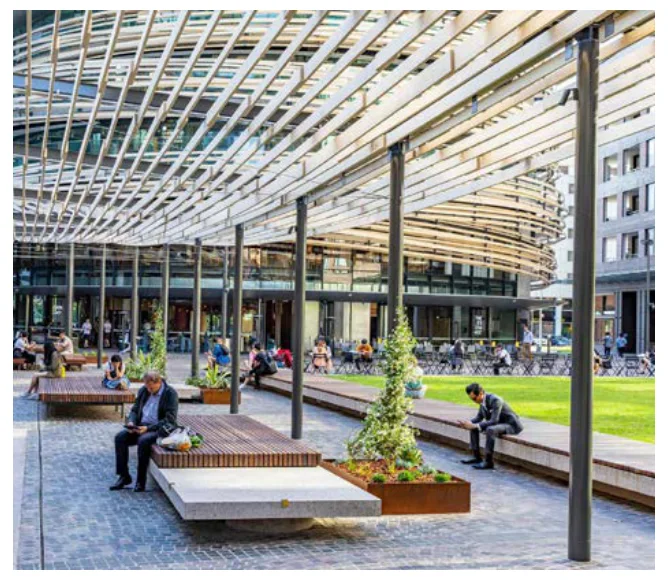

<!-- page 225 -->

Mosman Civic Precinct Place Plan 221 SJB Mosman Civic Precinct Place Plan Mosman Civic Precinct Place Plan SJB SJB

### Case Studies

### Case Studies

### Marrickville Library Pavilion (NSW)

PROJECT DETAILS

Project type Civic library, community hub, and public open space redevelopment with adaptive reuse

Site area ~5,000m²

Cost Approx. $40M (developer contributions)

Delivery

Council-led redevelopment delivered in partnership — Council-led civic redevelopment — Adaptive reuse integrated with contemporary expansion — Public domain delivered alongside civic infrastructure

Program and uses

— ~3,600m² library and community hub — Flexible community and learning spaces — Café and multipurpose gathering spaces — Landscaped civic forecourt and public open space — Adaptive reuse of the historic hospital laundry building

Key takeaways

— Adaptive reuse integrated with new civic development — Library acts as a community anchor — Strong connection between landscape and civic space — Flexible spaces support everyday community use

### The Concourse, Chatswood (NSW)

PROJECT DETAILS

Project type Integrated civic, cultural, library and performing arts precinct

Site area ~12,500sqm

Cost Approx. $160M

Delivery

Council-led civic redevelopment — Delivered following extensive public consultation and community support — Integrated delivery of civic infrastructure, cultural facilities and public domain — Redevelopment of the former Civic Centre site into a new civic and cultural heart

Program and uses

— ~5,000sqm public library — 1,000-seat concert hall and 500-seat theatre — Exhibition, rehearsal and community spaces — Retail, dining and civic functions — ~6,000sqm landscaped and paved area

Key takeaways

— Public open space positioned at the heart — Terraced public domain responds to level changes across the site, creating a series of connected civic and gathering — Civic functions embedded below support larger open spaces above — Library integrated with broader cultural and community uses — Reinforces civic identity within a commercial centre

August 2026

Attachment 1.1.1 Mosman Council

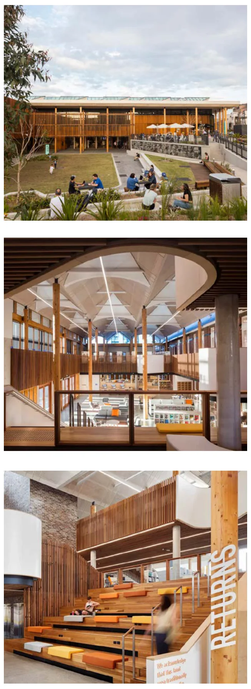

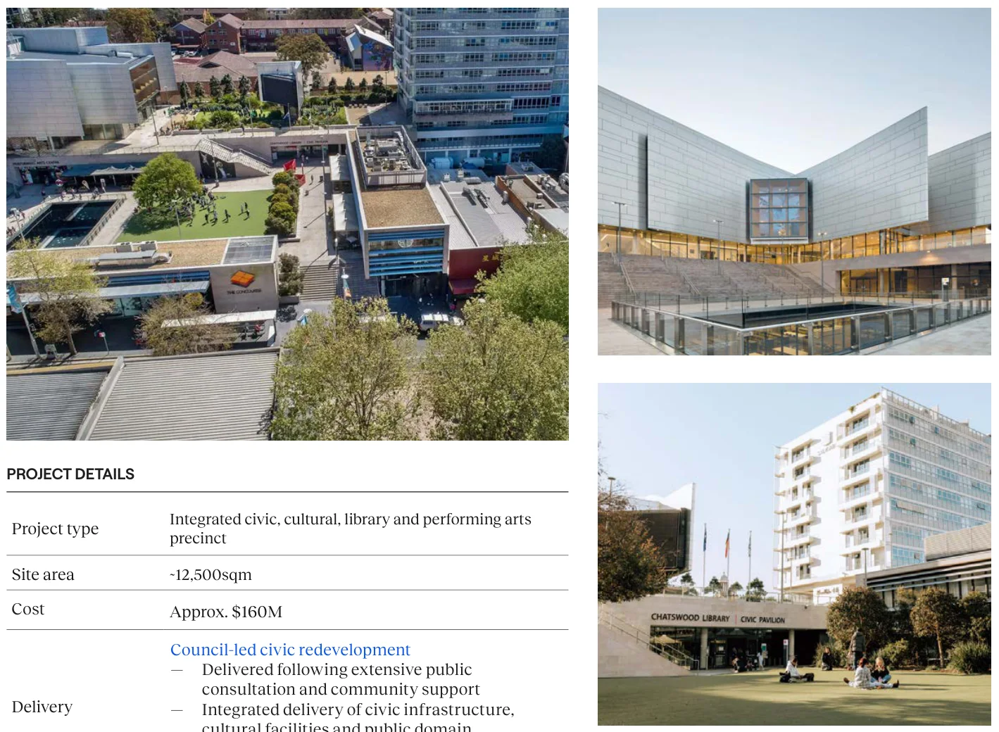

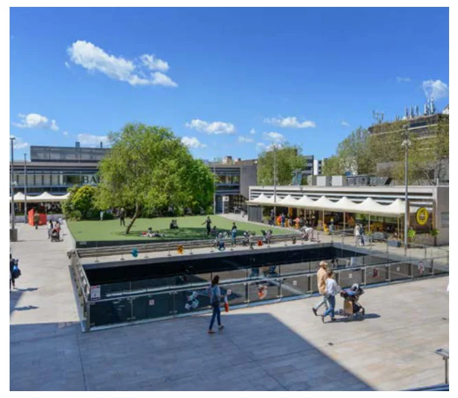

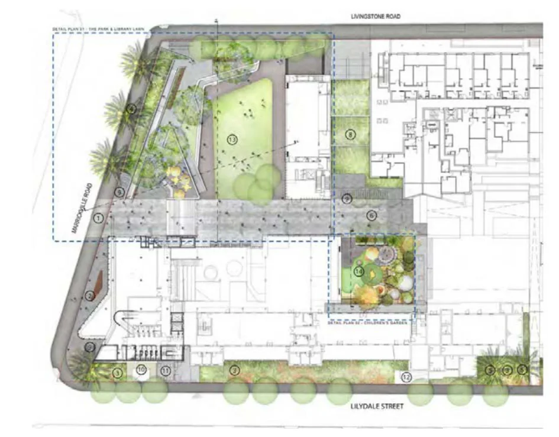

<!-- page 226 -->

Mosman Civic Precinct Place Plan 222 SJB

### Development Matrix

The matrix maps the relationship between delivery model and land use mix, illustrating how different projects balance civic, commercial, and mixed-use outcomes. Overlaying the case studies highlights a range of approaches to delivering active, integrated, and publicly focused precincts.

Key Takeaways: Most case studies cluster within the highlighted area, demonstrating predominantly council-led, civic-focused delivery rather than market-led housing outcomes.

KEY

Civic / Council-led

Commercial + retail / development in partnership

Residential / market-led delivery

MORE CONSIDERATIONS TO RESOLVE

LESS CONSIDERATIONS TO RESOLVE

### Case Studies

LAND USE / PROGRAM  MIX

DEVELOPMENT DELIVERY MODEL

Council-led delivery

Development in partnership

Market-led delivery

MARRICKVILLE LIBRARY PAVILION Council-led Civic + community focus

MARIBYRNONG CIVIC PRECINCT Council-led delivery Strongly civic + community

DARLING SQUARE Market-led delivery High mix in residential + retail + civic

CIVIC PLACE, LIVERPOOL Public-private partnership Civic + commercial

THE CONCOURSE, CHATSWOOD Council -led Civic + commercial + retail

THE CANOPY, LANE COVE Council-led + partnership hybrid Civic + retail + entertainment

Civic Commercial Retail BTR/ Social/ Affordable

Market Housing

August 2026

Attachment 1.1.1 Mosman Council

<!-- page 227 -->

## 4

## Design Concept

August 2026

Attachment 1.1.1 Mosman Council

<!-- page 228 -->

Mosman Civic Precinct Place Plan 224 SJB

### Vision

SJB

## Re-imagining

## Mosman Civic

## Precinct as a

## connected mixed-use

## destination anchored

## by community,

## landscape and

## village character.

#### We see an opportunity to transform the Mosman Civic Precinct

#### into a lively, mixed-use destination that builds on its established

#### civic role, landscape setting, and village character. Anchored

#### by a new Library & Community Hub, an expanded Village

#### Green and enhanced public realm, the precinct will strengthen

#### Mosman’s civic identity while supporting a complementary mix

#### of community, retail, and  commercial uses.

As Mosman’s population grows and residential density increases, the Place Plan establishes a flexible and adaptable framework that responds to evolving community needs while supporting future investment, renewal and development. Sensitive built form, integrated landscape and heritage- sensitive design will ensure future change respects Mosman’s heritage setting, landscape character and relationship with surrounding open space, while establishing a contemporary civic destination that responds to future growth.

~4,000m2 Library & Community Hub

Mixed-Use Precinct

Heritage Integration

Pedestrian- Focused

~2,000m2 Expanded Village Green

### Design Concept

August 2026

Attachment 1.1.1 Mosman Council

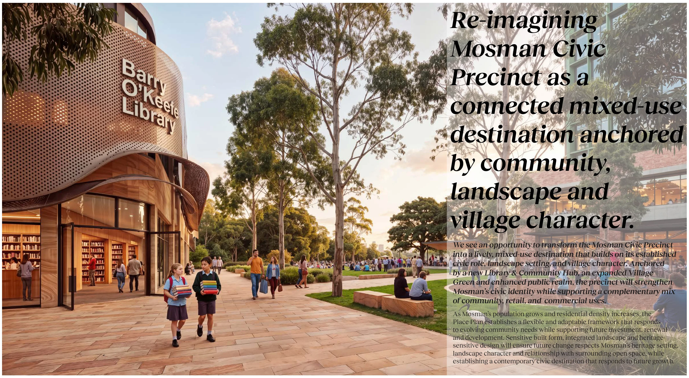

<!-- page 229 -->

Mosman Civic Precinct Place Plan 225 SJB

### Design Principles

### Design Concept

#### A civic heart

#### Bring the landscape in

#### Active and evolving

#### Connected and permeable

Strong connections through the precinct and beyond.

Anchored by a new Library & Community Hub, plaza and Village Green.

Extending green connections to the oval and wider open space network.

Designed to support continuous activation through a staged delivery of the precinct.

#### A place to gather

Spaces for community, events and everyday life.

#### Of its place

Respond to the existing and future character in and around the precinct.

August 2026

Attachment 1.1.1 Mosman Council

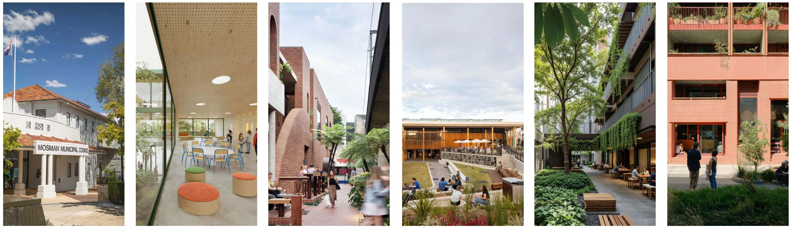

<!-- page 230 -->

Mosman Civic Precinct Place Plan 226 SJB

Deliver a contemporary, flexible civic Library & Community Hub positioned to maximise visibility, access, and connection to surrounding public spaces.

#### NEW LIBRARY & COMMUNITY HUB

### Design Objectives

Protect solar access to Allan Border Oval, with built form shaped to minimise overshadowing and protect midwinter sun.

Provide a clear transition in height and bulk to surrounding residential and conservation areas, stepping down at sensitive edges.

Enhance and extend the Village Green as a key civic space for events, recreation and everyday use, including a new performance area, playground and flexible event lawn.

### MAINTAIN SOLAR ACCESS

### TRANSITION BUILDING HEIGHT

### EXTEND VILLAGE GREEN

Limit vehicle access within the precinct by consolidating parking underground and prioritising pedestrian movement throughout the public realm.

Reinforce Mosman’s village character through sensitive architecture, landscape character and carefully integrated heritage.

Provide new and improved pedestrian connections to strengthen permeability and connect into the broader network.

Deliver active frontages to support a safe, vibrant, and engaging civic domain.

#### CONSOLIDATE PARKING +

#### VEHICLE ACCESS

### RESPECT VILLAGE CHARACTER

### STRENGTHEN PERMEABILITY

### CREATE ACTIVE FRONTAGES

Create a safe, accessible and pedestrian- prioritised public realm that responds to the site’s topography and supports comfortable movement throughout the precinct.

### ENHANCE WALKABILITY

The following objectives establish the key planning and development priorities guiding the future evolution of the Mosman Civic Precinct. They provide a framework for balancing civic uses, movement, landscape, heritage, solar access, and future development opportunities across the site.

### Design Concept

August 2026

Attachment 1.1.1 Mosman Council

<!-- page 231 -->

Mosman Civic Precinct Place Plan 227 SJB

### Key Moves

Extend the landscape

Draw the surrounding parklands into the precinct by extending the landscape network through the site. The pedestrianisation of The Crescent strengthens connections between Mosman Square, the Village Green and Allan Border Oval, while the new and expanded Village Green offers a generous, flexible civic space for events, recreation and everyday community life.

Library & Community Hub at the Heart

A new Library & Community Hub is proposed in its existing location, reinforcing its role as the civic heart of the precinct. Positioned adjacent to the Village Green, the building anchors the primary civic space, strengthens connections between key community destinations and creates an active, welcoming and highly visible civic destination.

Flexible civic open space. Library integrated with landscape and community gathering spaces.

### Design Concept

August 2026

Attachment 1.1.1 Mosman Council

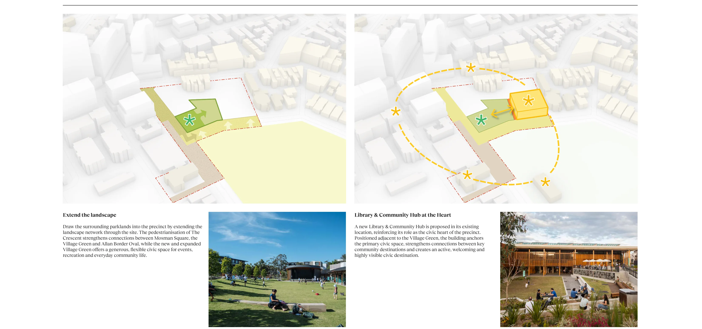

<!-- page 232 -->

Mosman Civic Precinct Place Plan 228 SJB

### Key Moves

Connected Civic Network

New and enhanced through-site links strengthen connections between the Library & Community Hub, Village Green, Mosman Square, Mosman Art Gallery, and surrounding community destinations. Together, these connections establish a legible civic network that improves permeability and integrates the precinct with the surrounding pedestrian network.

Defined Development Zones

Development is concentrated within defined building zones that frame the expanded Village Green, reinforce key civic connections and position the Library & Community Hub as the precinct’s primary civic anchor. Building envelopes respond to heritage interfaces, key view corridors and the solar clipping planes protecting Allan Border Oval.

Pedestrian-focused civic connection. Built form framing civic open space.

### Design Concept

August 2026

Attachment 1.1.1 Mosman Council

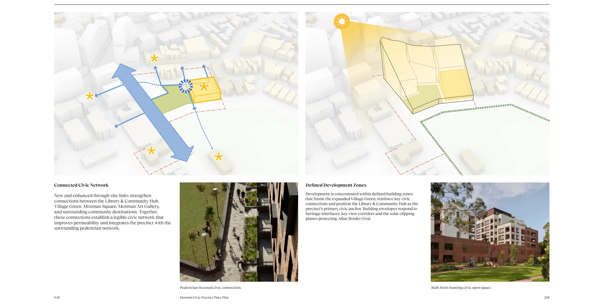

<!-- page 233 -->

Mosman Civic Precinct Place Plan 229 SJB

### Key Moves

Sensitive Height Transition

Height is concentrated along Military Road, responding to its role as a primary corridor and the emerging taller built form along this edge. Built form transitions down towards Allan Border Oval, balancing increased density with neighbourhood character while protecting amenity at sensitive interfaces.

Contextual Podium Response

Podium and street wall heights respond to the surrounding context, reinforcing the character and scale of adjacent heritage and civic buildings. Lower built form aligns with established datum lines and street wall conditions, maintaining a consistent human scale while reinforcing active civic edges.

Podium responding to neighbourhood character. Graduated building height transition.

### Design Concept

August 2026

Attachment 1.1.1 Mosman Council

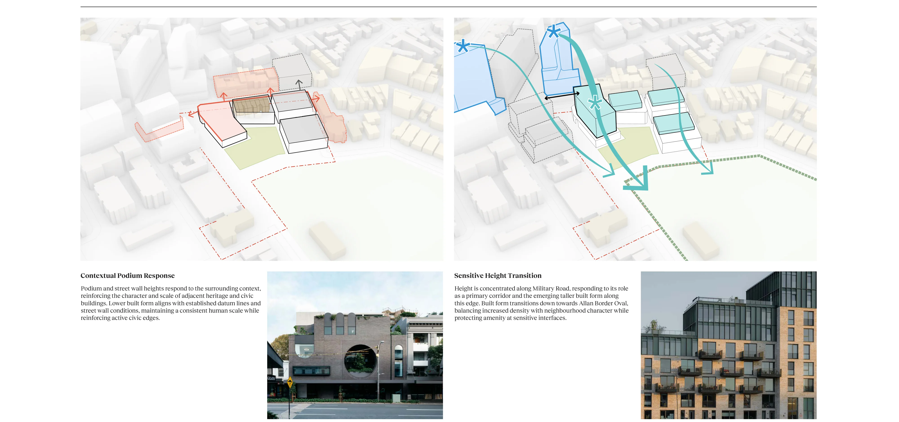

<!-- page 234 -->

## 5

## Civic Place Plan

August 2026

Attachment 1.1.1 Mosman Council

<!-- page 235 -->

Mosman Civic Precinct Place Plan 231 SJB

### The Concept

### Civic Place Plan

Concept diagram of the Precinct Plan.

### 1

### 7

### 3

### 9

### 2

### 4

### 5

### 6

### 8

### 1

### 4

### 2

### 5

### 3

### 6

### 7

### 8

### 9

#### Library & Community Hub

A contemporary civic destination for learning, culture and community.

#### Performance & Events

A flexible outdoor pavilion space for performances, markets and community celebrations.

#### Village Green

A flexible community lawn supporting everyday recreation, events and gathering.

#### Active Civic Edge

Cafes and community uses activate the ground plane and frame public spaces.

#### Children’s Play

A dedicated play space integrated into the civic heart.

#### Pedestrianised Public Realm

A car-free section of The Crescent, landscaped steps and generous seating create a welcoming civic gathering space.

#### Connected Civic Spine

Improved pedestrian links connect Mosman Square, Military Road and Allan Border Oval.

#### Future Civic Destination

A mix of upper-level commercial uses supports a vibrant mixed-use precinct

#### New Shared Zone

A pedestrian-priority shared street improves safety, accessibility and flexibility while supporting civic activity and local access.

August 2026

Attachment 1.1.1 Mosman Council

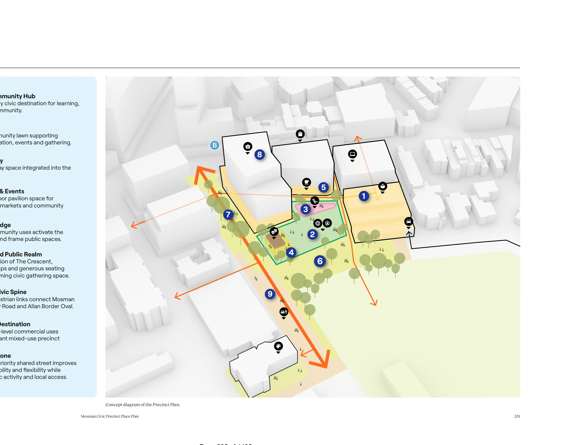

<!-- page 236 -->

Mosman Civic Precinct Place Plan 232 SJB

The design guidelines are structured under the overarching design objectives to provide a clear framework for achieving the vision for the precinct.

Note: This scheme assumes the acquisition or co-development of adjoining land. An alternative scheme remains feasible within Council-owned sites if this does not proceed.

### Civic Place Plan

### Design Guidelines - Landscape & Public Domain

Design Guidelines - Landscape & Public Domain Plan.

The Crescent

Military Road

Vista Street

Mosman Mosman Square Square

Allan Border Oval

Mosman Art Gallery

Shared Zone

#### EXTEND VILLAGE GREEN

#### RESPECT VILLAGE CHARACTER

#### ENHANCE WALKABILITY

KEY

Village Green

Car-free civic space

Landscaped steps

Existing significant trees

Shared zone

Interim civic forecourt (short-medium term)

Performance space

Central open lawn and event space

Outdoor seating & dining spill-out areas

Children’s playground

Mosman Art Gallery landscape upgrades

Landscaped podium rooftop

Heritage facade

Design Guidelines:

— Expand and raise the existing Village Green to create a minimum 2,000m² of contiguous civic open space above a semi-basement car park. — Design Village Green levels to provide a gradual transition between Mosman Square, the Library & Community Hub, and The Crescent, integrating landscaped terraces, paths and steps that respond to changes in topography. — Provide a children’s playground along the northern edge of the Village Green to create a shaded play environment. — Establish a flexible central open lawn to support everyday informal recreation, community gatherings, markets and events. — Deliver a low-profile outdoor performance space integrated within the landscaped terraces of the Village Green to preserve views towards Allan Border Oval. — Integrate outdoor seating, dining spill-out areas and informal gathering spaces around the edges of the Village Green and The Crescent to support cafes, the Library & Community Hub and everyday social activity.

Design Guidelines:

— Extend the landscape character and public domain treatment of Mosman Square through The Crescent and Myahgah Road to establish a consistent civic identity. — Reinforce the civic identity of the precinct through a coordinated palette of paving, planting, lighting, furniture and street trees. — Retain significant existing trees wherever practicable and integrate them into the landscape and public domain design. Provide additional setbacks and built form articulation where required to facilitate tree retention. — Provide landscaped podium rooftops overlooking Allan Border Oval to reinforce the precinct’s landscape character. — Enhance the Mosman Art Gallery setting through landscape upgrades, extending the Gallery’s open space along Art Gallery Way and enabling temporary closure for events.

Design Guidelines:

— Pedestrianise The Crescent to create a car-free civic space that strengthens the interface between the Library & Community Hub and Allan Border Oval. — Establish the nominated section of Myahgah Road & Art Gallery Way as a shared movement zone, prioritising pedestrians while accommodating local access and servicing for adjoining residential properties. — Design primary pedestrian routes with generous widths, high-quality paving, lighting and clear wayfinding to accommodate anticipated pedestrian volumes. — Integrate future Art Gallery landscape upgrades with the new shared zone along Myahgah Road and Art Gallery Way to create a seamless public domain connection. — Provide a short- to medium-term civic forecourt outside the existing Council Chambers entrance as an interim civic space prior to future redevelopment of the site. — Provide accessible paths, ramps and landscaped terraces that respond to the site’s topography, ensuring equitable access throughout the precinct.

Library & Community Hub

1.1 2.1

3.1

1.2 2.2

3.2

1.3

2.3

3.3

1.4 2.4

2.5

3.4

1.5

3.5

3.6

1.6

25 20 50 5 0 10 15

Myahgah Road

Art Gallery Way

August 2026

Attachment 1.1.1 Mosman Council

<!-- page 237 -->

Mosman Civic Precinct Place Plan 233 SJB

The design guidelines have been structured under the overarching design objectives to provide a clear framework for achieving the vision for the precinct.

Note: This scheme assumes the acquisition or co-development of adjoining land. An alternative scheme remains feasible within Council-owned sites if this does not proceed.

### Civic Place Plan

### Design Guidelines - Movement

Design Guidelines - Movement Plan.

The Crescent

Military Road

Myahgah Road

Vista Street

Allan Border Oval

#### STRENGTHEN PERMEABILITY

#### ENHANCE WALKABILITY

#### CONSOLIDATE PARKING & VEHICLE ACCESS

KEY

Primary civic spine

Secondary pedestrian link

Internal pedestrian arcade

Connections to surrounding network civic uses

Primary pedestrian entry

Principal Library & Community Hub entry

Vehicular movement

Residential access way

Basement entrance

Basement car park footprint

Shared zone

Car-free civic space

Interim civic forecourt (short to medium term)

Drop-off area & turning circle (subject to future detailed design)

Key views

Heritage facade

Design Guidelines:

— Reinforce Mosman Square as the precinct’s principal civic spine by strengthening pedestrian connections to Military Road, the Village Green, Allan Border Oval and the Mosman Art Gallery. — Provide a network of secondary pedestrian connections linking Mosman Square, the Library & Community Hub, the Village Green and surrounding civic destinations, to create safe and legible routes throughout the precinct. — Provide internal pedestrian arcades, including an east–west connection through the Council Chambers site and a north–south connection between Military Road, the Library & Community Hub and The Crescent. — Terminate the primary east-west pedestrian connection at a prominent Library & Community Hub entrance, reinforcing the library as a key civic destination. — Principal building entries should address key pedestrian routes and civic spaces, including Mosman Square, Military Road and the connection between the Library & Community Hub and Village Green. — Align north–south pedestrian connections to maintain key views from Military Road and Mosman Square towards the Allan Border Oval & its Pavilion, reinforcing wayfinding and civic legibility.

Design Guidelines:

— Pedestrianise The Crescent to create a car-free civic space between the Village Green and Allan Border Oval, prioritising pedestrian movement and public life. — Establish the nominated section of Myahgah Road & Art Gallery Way as a shared movement zone, prioritising pedestrians while accommodating local access and servicing for adjoining residential properties. — Provide accessible pedestrian connections throughout the precinct that respond to changes in topography through integrated paths, ramps and landscaped steps. — Provide generous civic forecourts and car-free pedestrian interfaces at key destinations, including the Library & Community Hub, Village Green and Mosman Square.

Design Guidelines:

— Consolidate public parking within a basement beneath future development to minimise vehicle infrastructure at ground level. The basement footprint should be designed to support future staged expansion, allowing integration with adjoining basement parking as the precinct evolves. — Locate the basement entry at street level from The Crescent, beneath the south-east corner of the new Library & Community Hub, to minimise excavation and provide efficient access for vehicles, servicing and loading. — Provide a turning circle adjacent to the basement vehicle entry to facilitate safe and efficient vehicle manoeuvring, servicing, loading and emergency access. — Provide flexibility for potential future commercial uses within the Stage 1 basement footprint, subject to future detailed design.

Shared Zone

Mosman Mosman Square Square

Library & Community Hub

25 20 50 5 0 10 15

4.1 3.7

5.1

4.2

3.8

5.2

4.3

3.9

3.10

5.3

5.5

4.4

4.5

4.6

Mosman Art Gallery

Art Gallery Way

August 2026

Attachment 1.1.1 Mosman Council

<!-- page 238 -->

Mosman Civic Precinct Place Plan 234 SJB

The design guidelines have been structured under the overarching design objectives to provide a clear framework for achieving the vision for the precinct.

Note: This scheme assumes the acquisition or co-development of adjoining land. An alternative scheme remains feasible within Council-owned sites if this does not proceed.

### Civic Place Plan

### Design Guidelines - Land Use & Activation

Design Guidelines - Land Use & Activation Plan.

The Crescent

Military Road

Vista Street

Allan Border Oval

#### NEW LIBRARY & COMMUNITY HUB

#### EXTEND VILLAGE GREEN

#### CREATE ACTIVE FRONTAGES

KEY

Community uses

Commercial uses

Heritage facade

Potential basement footprint for commercial uses (subject to future detailed design)

Active frontages

Active frontages within internal arcades

Public art facade opportunities

Landscape integrated public art opportunities

Primary pedestrian entry

Principal Library & Community Hub entry

Interim civic forecourt (short to medium term)

Children’s playground

Performance space

Central open lawn and event space

Design Guidelines:

— Retain the Library & Community Hub in its existing location, reinforcing its role as the precinct’s primary civic anchor while defining and addressing the Village Green. — Establish the Library & Community Hub as the precinct’s principal civic landmark through its siting, architectural expression, and its relationship to the Village Green and Allan Border Oval. — Orient principal building entrances towards key active frontages and civic spaces, including a primary entry addressing the car-free Crescent, to maximise visibility, accessibility and civic presence. — Design the outdoor performance space as a visually permeable civic structure that supports community events, performances and civic gatherings while activating the Village Green.

Design Guidelines:

— Support flexible community events, markets, performances and everyday recreation within the Village Green, reinforcing its role as the precinct’s primary civic gathering space. — Integrate a children’s playground within the Village Green to support families and provide opportunities for informal play. — Integrate public art opportunities within the landscaped edges surrounding the central open lawn to enrich the Village Green and celebrate Mosman’s civic and cultural identity.

Design Guidelines:

— Provide active frontages along the Village Green, Mosman Square, Military Road, internal arcades, and the Library & Community Hub. Active frontages should include retail, food and beverage, and other publicly accessible uses at ground level, with the final mix of uses informed through future design development. — Design active frontages with frequent entries, transparent glazing and primary building entrances addressing key public spaces and pedestrian routes — Introduce a short- to medium-term civic forecourt outside the existing Council Chambers entrance to support civic activity until future redevelopment of the site. — Incorporate integrated public art opportunities within building facades along the north–south civic connection between Military Road and the Library & Community Hub to strengthen the pedestrian experience and reinforce the precinct’s civic identity. — Locate community and civic uses at ground level around the Village Green and Mosman Square, complemented by commercial uses along Military Road, to create an active and complementary precinct.

Library & Community Hub

Mosman Mosman Square Square

Shared Zone

25 20 50 5 0 10 15

6.1 1.7

7.1

6.2 1.8

7.2

6.3 1.9

7.3

7.4

7.5

6.4

Mosman Art Gallery

Myahgah Road

Art Gallery Way

August 2026

Attachment 1.1.1 Mosman Council

<!-- page 239 -->

Mosman Civic Precinct Place Plan 235 SJB

The design guidelines have been structured under the overarching design objectives to provide a clear framework for achieving the vision for the precinct.

Note: This scheme assumes the acquisition or co-development of adjoining land. An alternative scheme remains feasible within Council-owned sites if this does not proceed.

### Civic Place Plan

12pm

9am 3pm

SCP

SCP

SCP

### Design Guidelines - Built Form

Design Guidelines - Built Form Plan.

The Crescent

Military Road

Myahgah Road

Vista Street

Allan Border Oval

#### TRANSITION BUILDING HEIGHT

#### MAINTAIN SOLAR ACCESS

#### RESPECT VILLAGE CHARACTER

Design Guidelines:

— Shape building heights in accordance with the Allan Border Oval Solar Clipping Plane to protect solar access and establish an appropriate height transition across the precinct. — Locate the Library & Community Hub as a maximum four-storey building to protect solar access to Allan Border Oval while reinforcing its civic role fronting the Village Green. — Concentrate taller built form ranging from 5 to 10 storeys along Military Road, stepping down towards neighbouring heritage properties and Allan Border Oval. — Provide upper level setbacks determined by the Solar Clipping Plane (SCP), creating opportunities for rooftop podiums while protecting Allan Border Oval from additional overshadowing.

Design Guidelines:

— Shape building height, massing and upper level setbacks in accordance with the Allan Border Oval solar clipping planes to prevent additional midwinter overshadowing. — Locate the tallest built form on the existing Council Chambers site in response to the Allan Border Oval solar clipping plane requirements. — Provide a chamfered building edge responding to the Solar Clipping Plane to open views and strengthen visual connections to the Village Green. — Step upper levels in accordance with the Solar Clipping Plane to maximise solar access while creating opportunities for rooftop podiums. — *Potential to extend the Library & Community Hub to a fifth floor to accommodate a restaurant, subject to confirming revised solar controls (see Appendix 1).

Design Guidelines:

— Retain and integrate the frontages of significant heritage terraces along Military Road. Locate new built form above and set back from retained heritage frontages to maintain their prominence, scale and character. — Establish a two-storey streetwall to Military Road and Mosman Square, with upper levels setback 3 metres to reinforce the civic scale of the public domain and reduce perceived building bulk. — Provide a sensitive interface to the neighbouring heritage church through a 3 metre ground floor setback and a 6 metre upper level setback along the eastern boundary — Provide internal pedestrian arcades to break up larger building blocks, including an east–west connection through the Council Chambers site and a north–south connection between Military Road, the Library & Community Hub and The Crescent. — Provide an open-to-sky pedestrian link aligned with the principal Library & Community Hub entrance to maintain views and visual connections to Allan Border Oval. — Retain and enhance the heritage significance of the Mosman Art Gallery through sensitive building upgrades and complementary landscape improvements.

10

7

Library & Community Hub

5

4*

Mosman Mosman Square Square

KEY

3m upper level setback & 2 storey streetwall Upper level heritage setback from maintained heritage facades 3m ground floor setback from the eastern boundary 6m upper level setback from the eastern boundary Direct open-to-sky pedestrian link with views to Allan Border Oval Internal pedestrian arcades Curved building edge

Primary pedestrian entry

Principal Library & Community Hub entry

X Maximum building height (storeys)

Landscaped podium rooftop

Heritage building

Solar controls protecting no additional overshadowing to Allan Border Oval

SCP SCP Upper level setback determined by the Solar Clipping Plane (SCP) protecting Allan Border Oval

Key views

Shared Zone

25 20 50 5 0 10 15

8.1

2.6

8.2

2.7

8.3

2.8

8.4

2.9

2.10

2.11

9.1

9.2

9.3

9.4

9.5

Mosman Art Gallery

Art Gallery Way

August 2026

Attachment 1.1.1 Mosman Council

<!-- page 240 -->

Mosman Civic Precinct Place Plan 236 SJB

VILLAGE GREEN VILLAGE GREEN

LIBRARY + COMMUNITY HUB LIBRARY + COMMUNITY HUB

HERITAGE INTEGRATION HERITAGE INTEGRATION Mosman Square

Allan Border Oval

Military Road

The Crescent Mosman Art Gallery

### Precedent Imagery - Civic Anchors & Heritage

### VILLAGE GREEN

### HERITAGE

### INTEGRATION

### LIBRARY +

### COMMUNITY HUB

The precinct builds on existing civic and heritage assets through a new and expanded Village Green, incorporating a playground and outdoor performance space, a new Library & Community Hub, and adjoining public realm. Collectively, these elements reinforce Mosman’s civic identity and strengthen its role as the community’s civic heart.

Playground

Outdoor performance space

Myahgah Road

Art Gallery Way

### Civic Place Plan

August 2026

Attachment 1.1.1 Mosman Council

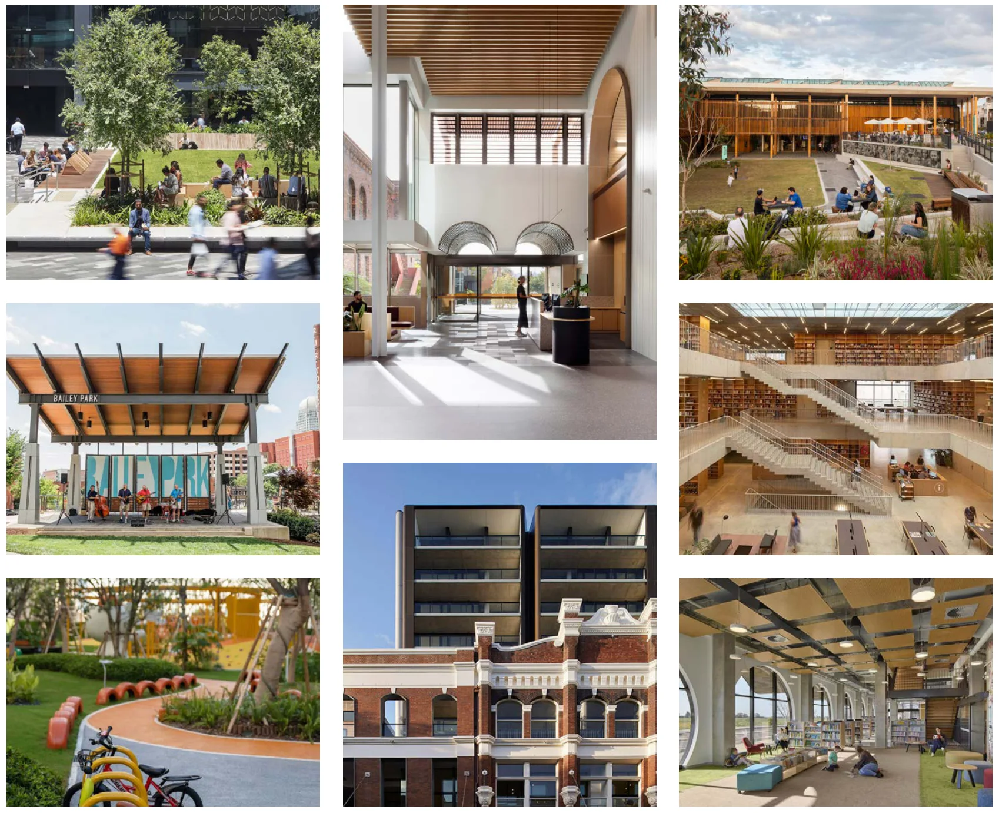

<!-- page 241 -->

Mosman Civic Precinct Place Plan 237 SJB

### ACTIVE GROUND PLANE

### PEDESTRIAN LINKS

### Precedent Imagery - Movement & Activation

### ARCADES

Pedestrian links, active frontages and arcades improve permeability and support everyday activity across the precinct. Together, these elements strengthen connections between civic, retail and open space destinations.

PEDESTRIAN CONNECTIONS PEDESTRIAN CONNECTIONS

ACTIVE GROUND PLANE ACTIVE GROUND PLANE

ARCADE ARCADE

ARCADE ARCADE

Mosman Square

Allan Border Oval

Military Road

Mosman Art Gallery

The Crescent

Myahgah Road

Art Gallery Way

### Civic Place Plan

August 2026

Attachment 1.1.1 Mosman Council

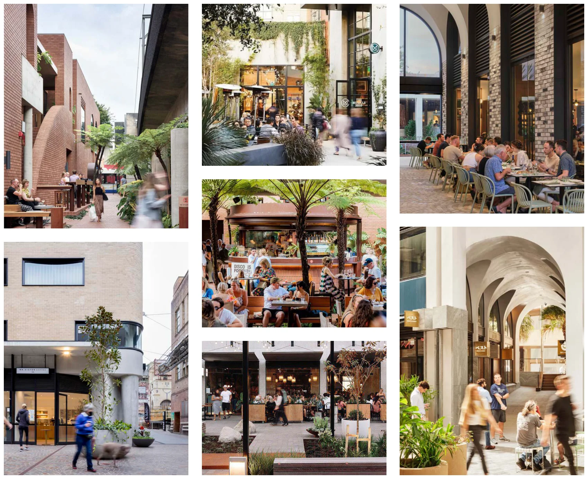

<!-- page 242 -->

Mosman Civic Precinct Place Plan 238 SJB

### EXTENDED PLAZA/

### LANDSCAPE

### SHARED ZONE

### LANDSCAPED STEPS

SHARED ZONE SHARED ZONE

LANDSCAPED STEPS LANDSCAPED STEPS

EXTENDED PLA ZA / LANDSCAPE

### Precedent Imagery - Landscape & Public Domain

An expanded plaza, new shared zone and landscaped steps extend the precinct’s landscape character and public domain. These elements improve amenity, respond to level changes and support flexible public use.

Mosman Square

Allan Border Oval

Military Road

Mosman Art Gallery

The Crescent

Art Gallery Way

### Civic Place Plan

August 2026

Attachment 1.1.1 Mosman Council

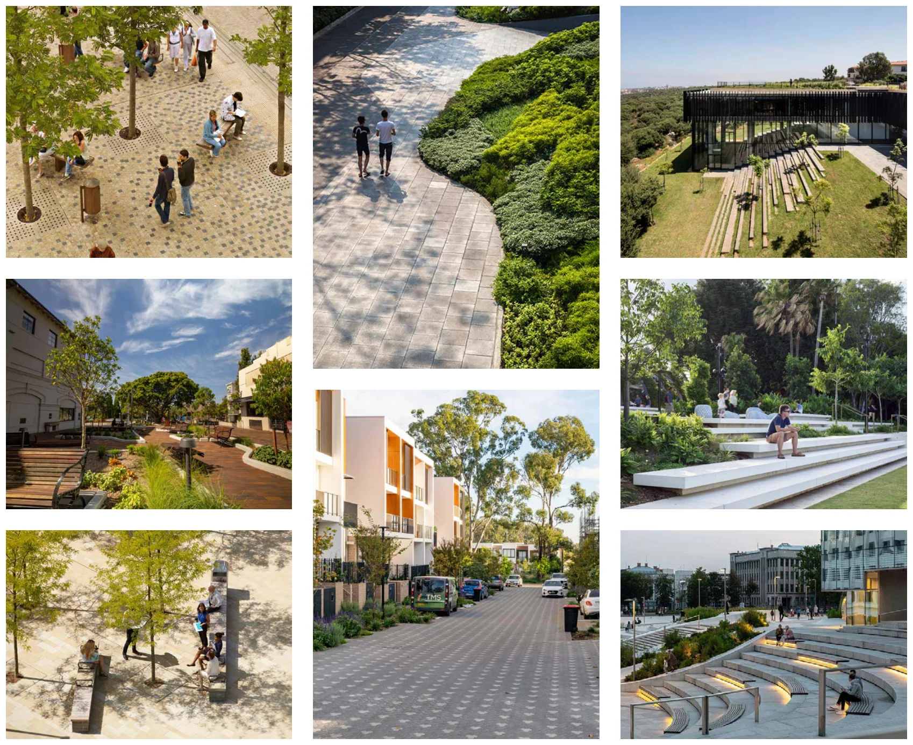

<!-- page 243 -->

Mosman Civic Precinct Place Plan 239 SJB

### MOSMAN ART GALLERY UPGRADES

### Precedent Imagery - Mosman Art Gallery Upgrades

A concept design is currently being progressed for the Mosman Art Gallery and its surrounding landscape, led by Studio Rewild and Archer Office. The proposal includes enhanced accessibility through new ramps, stairs and elevated walkways, together with new planting, seating, signage, lighting and outdoor gathering spaces that strengthen the Gallery’s landscape setting and support community use. The Civic Place Plan complements this work by strengthening connections between the Art Gallery and the broader Civic Precinct, including future integration with a proposed shared zone along Art Gallery Way to enhance pedestrian connectivity and amenity.

MOSMAN ART GALLERY

MOSMAN ART GALLERY

Mosman Square

Allan Border Oval

Military Road

The Crescent

Myahgah Road

Art Gallery Way

Art Gallery Way

Myahgah Road

### Civic Place Plan

Preliminary Concept Plan for the Mosman Art Gallery Landscape Upgrades (Studio Rewild).

August 2026

Attachment 1.1.1 Mosman Council

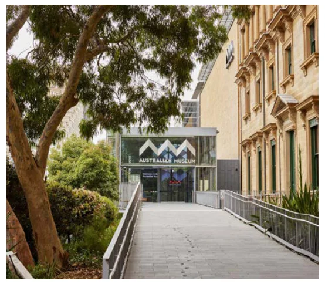

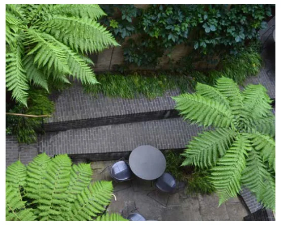

<!-- page 244 -->

## 6

## Reference Scheme

## The following Reference Scheme presents an

## indicative development outcome, demonstrating

## how the Place Plan framework and design guidelines

## could be realised through a coordinated ground-floor,

## landscape and public domain response.

August 2026

Attachment 1.1.1 Mosman Council

<!-- page 245 -->

Mosman Civic Precinct Place Plan 241 SJB

STAGES 1-3

The Mosman Civic Precinct Place Plan establishes a local and community-focused precinct centred on a new Library & Community Hub, an expanded Village Green, upgrades to the Mosman Art Gallery and enhanced public realm. A mix of community facilities, commercial uses and active ground floor frontages supports long-term activation, while new public spaces and pedestrian connections strengthen civic identity, improve accessibility and create a vibrant destination for the Mosman community.

Assumptions:

— GFA calculations are based on the site boundary highlighted below. — Commercial GFA assumes approximately 90% efficiency to account for building cores and circulation. — Development yields are indicative and subject to detailed design, feasibility testing and statutory approvals. — This plan assumes the acquisition or co-development of an adjoining site because this maximises the public benefit outcome and preserves adjacent heritage values. Should this not proceed, an amended Stage 2 is feasible and would be progressed working solely in Council’s own land holdings.

COMMERCIAL GFA

18,900m2

COMMUNITY GFA

3,800m2

TOTAL GFA

22,700m2

OPEN SPACE

2,000m2

10

BUILDING 3

STAGE 3

Commercial (GFA) 10,400m2

Basement Parking ~48 carparks per level

DELIVERED BY OTHERS

Commercial 6,600m2

BUILDING 2

5

KEY

Site boundary

Council-owned land

Potential acquisition of adjoining site

Basement parking

Community

Commercial

Outdoor performance space

Village Green

Shared Zone Mosman Square/ vehicle-free zone

#### GFA Calculations Boundary

STAGE 2

Commercial (GFA) 5,500m2

Basement Parking ~38 carparks per level

STAGE 1

Community 3,800m2 Potential Subterranean Commercial Footprint* 3,000m2

Basement Parking ~92 carparks per level *Potential future commercial uses within the Stage 1 basement footprint, subject to future detailed design.

Development plan and yield summary within the future Mosman Masterplan context.

BUILDING 1

4*

### Development Plan

7

KEY

GFA calculations boundary Council-owned land

*Note: Potential to extend the Library & Community Hub to a fifth floor to accommodate a restaurant, subject to confirming revised solar controls (see Appendix 1).

### Reference Scheme

The Crescent

Military Road

Myahgah Road

Vista Street

Mosman Mosman Square Square

Allan Border Oval

Shared Zone

Mosman Art Gallery

25 20 50 5 0 10 15

Art Gallery Way

August 2026

Attachment 1.1.1 Mosman Council

<!-- page 246 -->

Mosman Civic Precinct Place Plan 242 SJB

North-west view of the Mosman Civic Precinct within the future Mosman Masterplan context. South-west view of the Mosman Civic Precinct within the future Mosman Masterplan context.

### Massing

The Crescent

Military Road

Myahgah Road

Allan Border Oval

Allan Border Oval

Village Green

Shared Zone

The Crescent

Mosman Square

4*

10

5

7

10

5

7

4*

Military Road

Village Green

Shared Zone

#### KEY

Community Commercial Outdoor performance space Parking Village Green Shared Zone Mosman Square/ vehicle-free zone

Vista Street

Heritage items Heritage conservation area Arcade link

*Note: Potential to extend the Library & Community Hub to a fifth floor to accommodate a restaurant, subject to confirming revised solar controls (see Appendix 1).

### Reference Scheme

August 2026

Attachment 1.1.1 Mosman Council

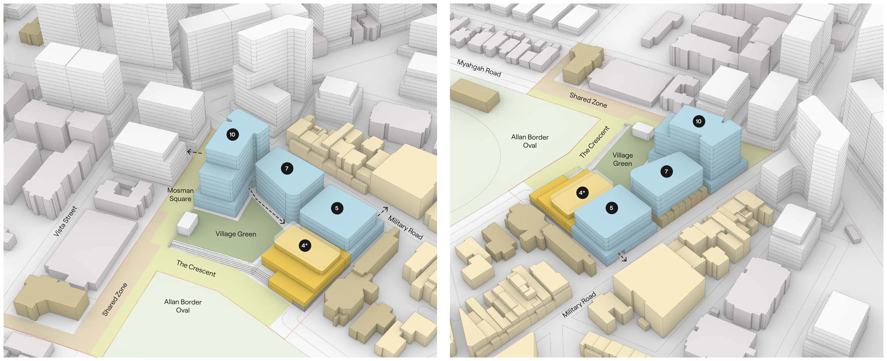

<!-- page 247 -->

Mosman Civic Precinct Place Plan 243 SJB

THE CRESCENT THE CRESCENT MILITARY ROAD MILITARY ROAD

5

4* 4*

The Library & Community Hub The Library & Community Hub

Allan Border Oval Mixed-Use Building

### 14.1	 Built Form Sections A & B

KEY

Site boundary

Community use

Commercial use

Basement

Section B Section A

North-south section through the mixed-use building fronting Military Road and the Library & Community Hub, with potential future commercial uses within the Stage 1 basement footprint, subject to future detailed design.

East-west section through the Village Green and Library & Community Hub, with potential future commercial uses within the Stage 1 basement footprint, subject to future detailed design.

### A

### A

### B

### B

Potential commercial use Potential commercial use

*Note: Potential to extend the Library & Community Hub to a fifth floor to accommodate a restaurant, subject to confirming revised solar controls (see Appendix 1).

### Reference Scheme

August 2026

Attachment 1.1.1 Mosman Council

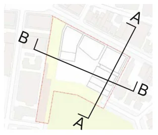

<!-- page 248 -->

Mosman Civic Precinct Place Plan 244 SJB

### Staged Development

#### STAGE 1

#### STAGES 3 + 4

#### STAGE 2

4* 4* 4*

10

5 5

7

Establishes the civic heart through delivery of the Library & Community Hub, an expanded Village Green, upgrades to the Mosman Art Gallery and surrounding public realm, Mosman Square upgrades, and pedestrianisation of The Crescent, creating an active and welcoming civic destination.

Strengthens the precinct with new mixed-use development fronting Military Road, expanding commercial opportunities while supporting activation of the surrounding public realm.

Completes the Civic Precinct through redevelopment of the Council Chambers site and potential future development above the retained heritage terraces fronting Military Road. This stage reinforces the broader Mosman Masterplan vision, delivering a cohesive built form and supporting long-term commercial vitality.

#### KEY

Community Commercial Outdoor performance space Parking Village Green Shared Zone Mosman Square/ vehicle-free zone Heritage items Heritage conservation area

*Note: Potential to extend the Library & Community Hub to a fifth floor to accommodate a restaurant, subject to confirming revised solar controls (see solar controls review chapter).

### Reference Scheme

August 2026

Attachment 1.1.1 Mosman Council

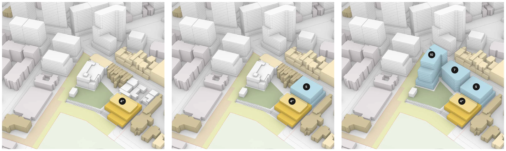

<!-- page 249 -->

Mosman Civic Precinct Place Plan 245 SJB

### Indicative Ground Floor Activation Plan

#### KEY

Community uses Commercial uses Heritage building Outdoor performance space Primary pedestrian entry

Upper Ground (Village Green) & Lower Ground (The Crescent) transition

The indicative Ground Floor Activation Plan demonstrates how the Place Plan framework can be realised through a coordinated arrangement of community, commercial and civic uses integrated with a high-quality public realm. The reference scheme illustrates one potential ground floor outcome that prioritises pedestrian movement, active frontages and a connected civic landscape while remaining flexible to respond to future design development.

The Village Green forms the civic heart of the precinct, anchored by a flexible central lawn for markets, informal recreation and everyday use. A dedicated children’s playground provides opportunities for play and family activity, while an outdoor performance space with terraced seating supports community events and performances. Landscaped gathering spaces, informal seating and outdoor dining spill-out areas activate the edges of the Village Green, strengthening the relationship between the public domain, surrounding ground floor uses and the Mosman Art Gallery.

Ground level movement is anchored by the primary north– south civic spine through Mosman Square, supported by a secondary north–south connection extending from Military Road through the Library & Community Hub to the Village Green. The principal Library & Community Hub entry is positioned at the intersection of these civic spaces, reinforcing it as the precinct’s primary arrival point. An east–west arcade linking Mosman Square with the Library & Community Hub further improves pedestrian permeability, creating convenient through-site connections while strengthening access to key destinations.

Together, the coordinated arrangement of uses, landscape and movement establishes an active, welcoming and connected civic destination that strengthens Mosman’s civic heart.

### Reference Scheme

Indicative Ground Floor Activation Plan. 25 20 50 5 0 10 15

The Crescent

Military Road

Myahgah Road

Vista Street

Mosman Mosman Square Square

Allan Border Oval

Upper Ground (Village Green Level) ~RL 89.16

Lower Ground (The Crescent Level) ~RL 87.22

Mosman Art Gallery

Art Gallery Way

August 2026

Attachment 1.1.1 Mosman Council

<!-- page 250 -->

Mosman Civic Precinct Place Plan 246 SJB

### Indicative Library Layout

Flexible Spaces Across 4 Levels

The library is designed with flexible spaces that can evolve over time to support a wide range of community needs. The diagrams below illustrate a possible configuration, showing how each level offers a distinct character and purpose within the overall experience of the building.

Lower Ground Floor

— Connected with carpark and with direct access to The Crescent. — Ideal for loading, storage, garbage and utilities areas. — Potential location for Creation Space with convenience vehicle access for deliveries. — Potential for future commercial uses within the Stage 1 basement footprint, subject to future detailed design.

Ground Floor

— Main Library entry level with level connection to the Village Green. — Opportunity to include a cafe beside Village Green. — Grand steps at South-West corner connect levels while providing an open forum for talks and events.

Community Exhibition Space

News

Crescent Auditorium

Kids Area

Study Area

Gaming

Atrium

Community Centre

Cafe

Village Green

Core

Library storage

Creation space

### Reference Scheme

Car park or potential commercial auses

August 2026

Attachment 1.1.1 Mosman Council

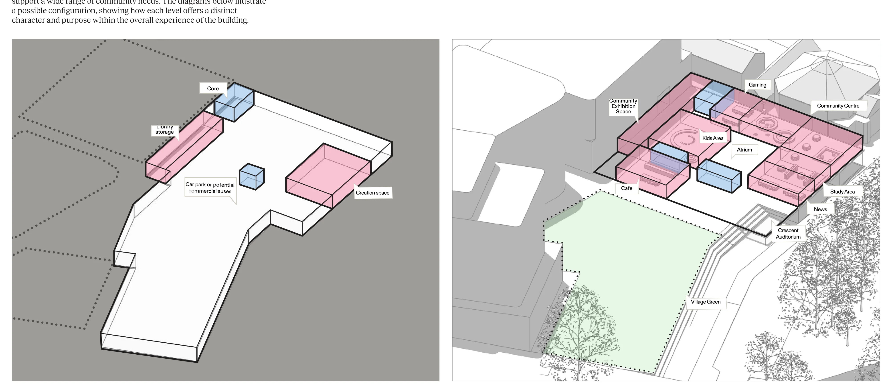

<!-- page 251 -->

Mosman Civic Precinct Place Plan 247 SJB

Multipurpose

Terrace

Meeting

Study Multipurpose

### Indicative Library Layout

Level One

— Library space and staff offices planned around a central void to connect between levels. — A large open terrace provides outlook over the Village Green and Allan Border Oval.

Level Two

— Top floor includes multipurpose and hirable spaces including meeting rooms. — Spaces open onto a wide terrace with district and possibly city views to the South. — *Potential to extend the Library & Community Hub to a fifth floor to accommodate a restaurant, subject to confirming revised solar controls (see Appendix 1).

Flexible Spaces Across 4 Levels

The library is designed with flexible spaces that can evolve over time to support a wide range of community needs. The diagrams below illustrate a possible configuration, showing how each level offers a distinct character and purpose within the overall experience of the building.

Collections

Reading Room

Terrace

Staff Office

Atrium

Potential 5th floor with restaurant*

Meeting

### Reference Scheme

August 2026

Attachment 1.1.1 Mosman Council

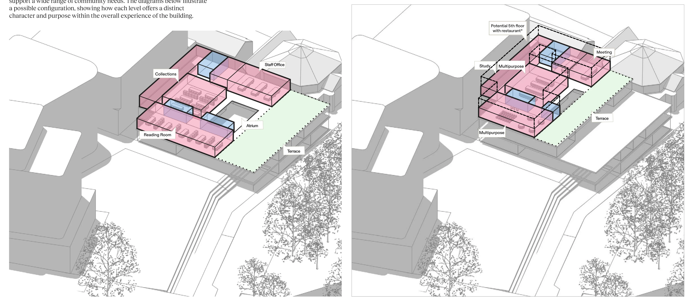

<!-- page 252 -->

Mosman Civic Precinct Place Plan 248 SJB

### Indicative Library Views

Central Space

Library Offices

Study Area

Rooftop Garden with View

Reading Room

Youth Centre

### Reference Scheme

August 2026

Attachment 1.1.1 Mosman Council

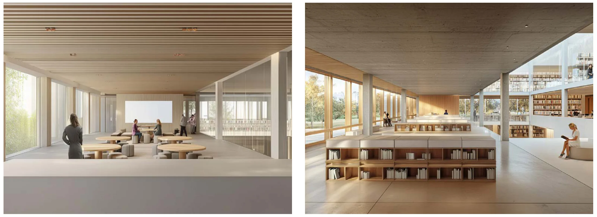

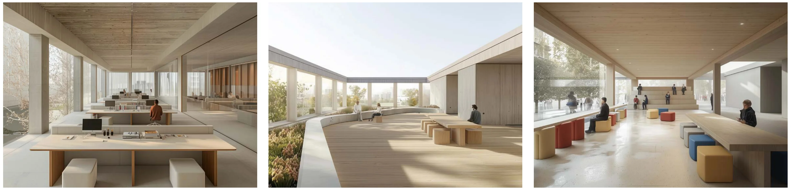

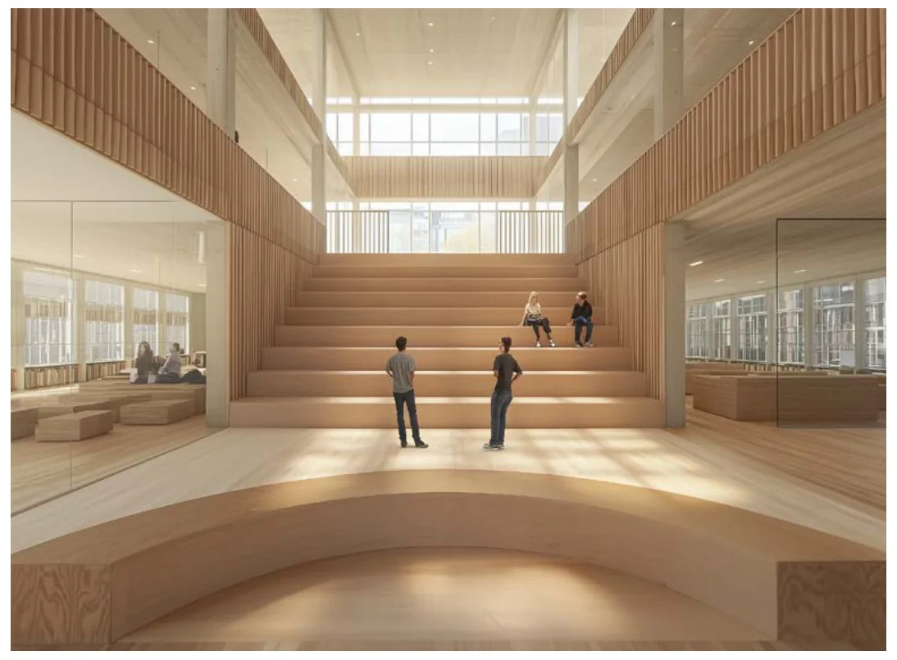

<!-- page 253 -->

Mosman Civic Precinct Place Plan 249 SJB

### Illustrative Place Plan

The Illustrative Place Plan demonstrates how the Place Plan framework can be realised through an integrated landscape, public domain and built form response, centred around a new Library & Community Hub, the Village Green and the Mosman Art Gallery. The plan establishes a connected civic destination where landscape defines the public realm, strengthens civic identity and reinforces Mosman’s village character.

A clear hierarchy of civic spaces and pedestrian connections strengthens links between Military Road, Mosman Square, the Village Green and Allan Border Oval. New development is carefully integrated within the landscape framework, responding to the site’s topography, heritage setting and surrounding neighbourhood while providing a flexible framework for future renewal and staged delivery.

### Reference Scheme

Illustrative Precinct Plan. Not to scale.

August 2026

Attachment 1.1.1 Mosman Council

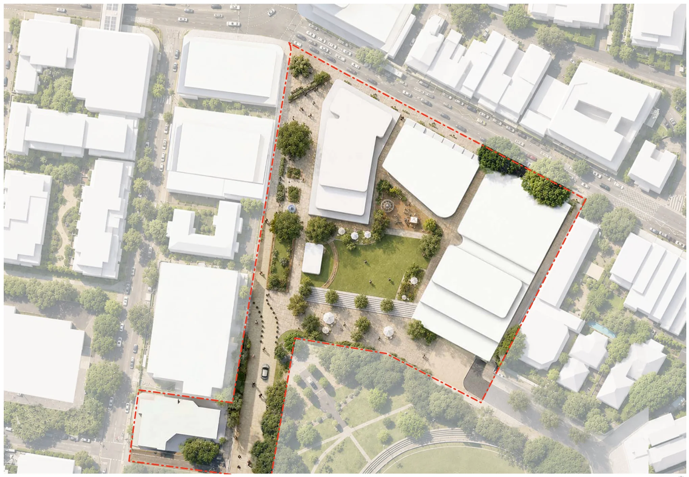

<!-- page 254 -->

Mosman Civic Precinct Place Plan 250 SJB

### Visualisation

### Reference Scheme

Visualisation of the proposed scheme, looking south towards Allan Border Oval.

August 2026

Attachment 1.1.1 Mosman Council

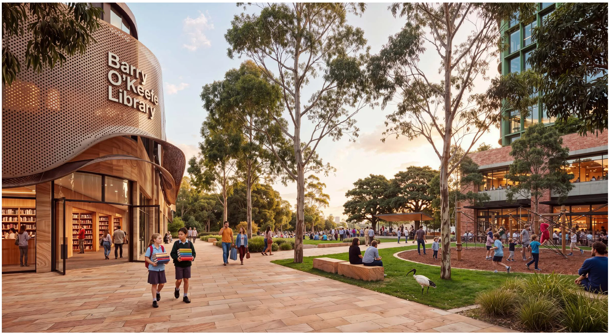

<!-- page 255 -->

Mosman Civic Precinct Place Plan 251 SJB

### Community Benefit

#### N

#### e

#### w

#### L

#### i

#### b

#### r

#### a

#### r

#### y

#### &

#### C

#### o

#### m

#### m

#### u

#### n

#### i

#### t

#### y

#### H

#### u

#### b

#### N

#### e

#### w

#### L

#### i

#### b

#### r

#### a

#### r

#### y

#### &

#### C

#### o

#### m

#### m

#### u

#### n

#### i

#### t

#### y

#### H

#### u

#### b

#### N

#### e

#### w

#### c

#### a

#### r

#### -

#### f

#### r

#### e

#### e

#### p

#### e

#### d

#### e

#### s

#### t

#### r

#### i

#### a

#### n

#### li

#### n

#### k

#### s

#### N

#### e

#### w

#### c

#### a

#### r

#### -

#### f

#### r

#### e

#### e

#### p

#### e

#### d

#### e

#### s

#### t

#### r

#### i

#### a

#### n

#### li

#### n

#### k

#### s

#### E

#### n

#### h

#### a

#### n

#### c

#### e

#### d

#### a

#### n

#### d

#### e

#### x

#### p

#### a

#### n

#### d

#### e

#### d

#### V

#### il

#### l

#### a

#### g

#### e

#### G

#### r

#### e

#### e

#### n

#### E

#### n

#### h

#### a

#### n

#### c

#### e

#### d

#### a

#### n

#### d

#### e

#### x

#### p

#### a

#### n

#### d

#### e

#### d

#### V

#### il

#### l

#### a

#### g

#### e

#### G

#### r

#### e

#### e

#### n

#### N

#### e

#### w

#### c

#### h

#### i

#### l

#### d

#### r

#### e

#### n

#### ’

#### s

#### p

#### l

#### a

#### y

#### g

#### r

#### o

#### u

#### n

#### d

#### N

#### e

#### w

#### c

#### h

#### i

#### l

#### d

#### r

#### e

#### n

#### ’

#### s

#### p

#### l

#### a

#### y

#### g

#### r

#### o

#### u

#### n

#### d

#### N

#### e

#### w

#### p

#### e

#### rf

#### o

#### r

#### m

#### a

#### n

#### c

#### e

#### s

#### p

#### a

#### c

#### e

#### N

#### e

#### w

#### p

#### e

#### rf

#### o

#### r

#### m

#### a

#### n

#### c

#### e

#### s

#### p

#### a

#### c

#### e

#### A

#### c

#### t

#### i

#### v

#### a

#### t

#### e

#### d

#### r

#### e

#### t

#### a

#### il

#### a

#### t

#### g

#### r

#### o

#### u

#### n

#### d

#### A

#### c

#### t

#### i

#### v

#### a

#### t

#### e

#### d

#### r

#### e

#### t

#### a

#### il

#### a

#### t

#### g

#### r

#### o

#### u

#### n

#### d

### Reference Scheme

August 2026

Attachment 1.1.1 Mosman Council

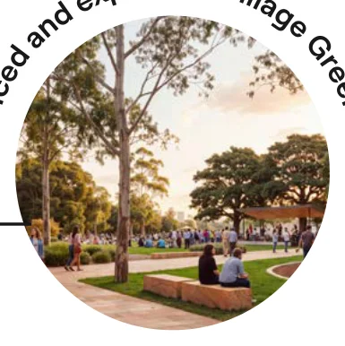

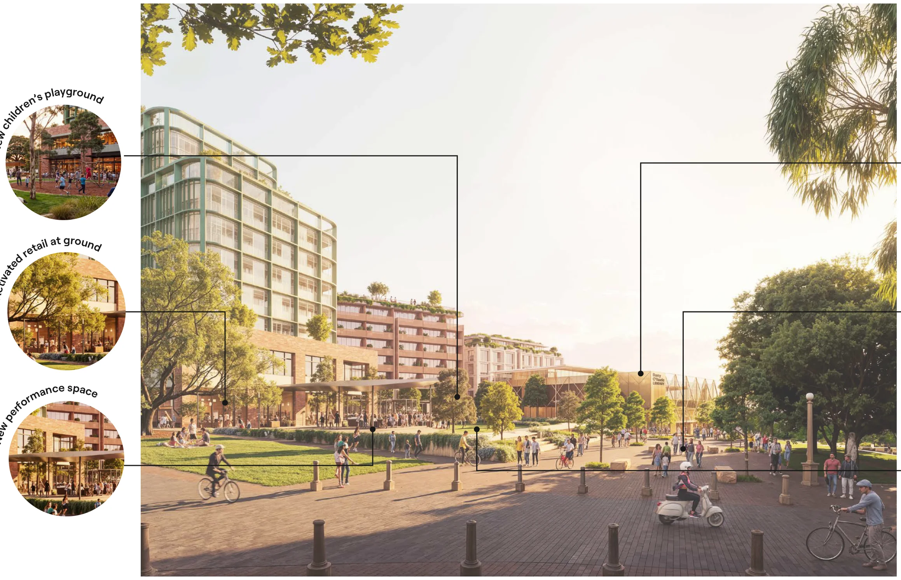

<!-- page 256 -->

Mosman Civic Precinct Place Plan 252 SJB

### Visualisation

### Reference Scheme

Visualisation of the proposed scheme, looking north-east towards the new Library & Community Hub and Village Green.

August 2026

Attachment 1.1.1 Mosman Council

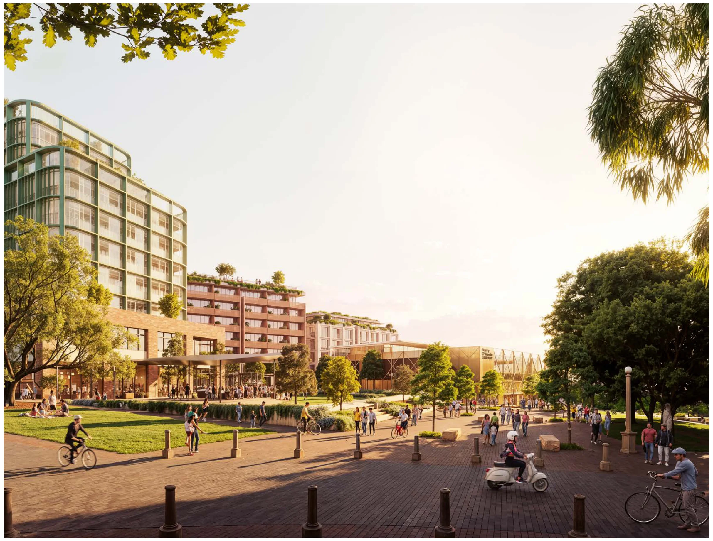

<!-- page 257 -->

## 7

## Environmental Assessment

August 2026

Attachment 1.1.1 Mosman Council

<!-- page 258 -->

Mosman Civic Precinct Place Plan 254 SJB

### Environmental Assessment

### Shadow Studies - Winter Solstice

Winter solstice, 9am. Winter solstice, 10am. Winter solstice, 11am.

Winter solstice, 12pm. Winter solstice, 1pm. Winter solstice, 2pm. Winter solstice, 3pm.

This analysis depicts the proposal’s overshadowing impacts on the future Mosman Masterplan context between 9am and 3pm during the winter solstice (21 June), demonstrating compliance with the solar access control requiring no additional overshadowing of Allan Border Oval.

August 2026

Attachment 1.1.1 Mosman Council

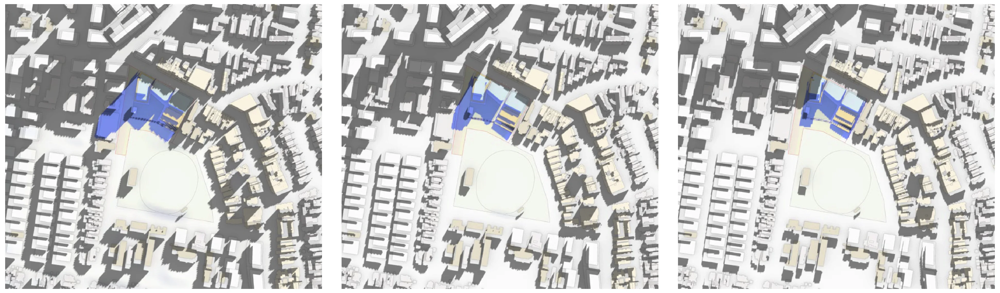

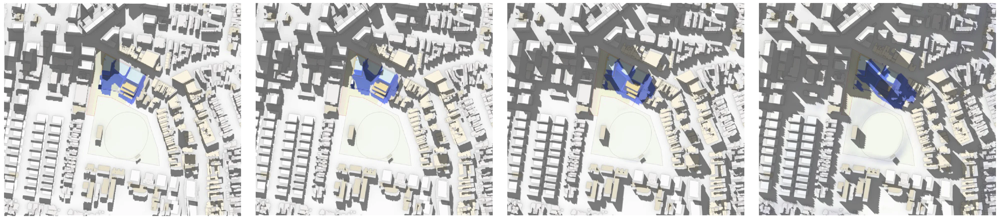

<!-- page 259 -->

Mosman Civic Precinct Place Plan 255 SJB

### Environmental Assessment

### Shadow Studies - Equinox

Equinox, 9am. Equinox, 10am. Equinox, 11am.

Equinox, 12pm. Equinox, 1pm. Equinox, 2pm. Equinox, 3pm.

This analysis depicts the proposal’s overshadowing impacts on the future Mosman Masterplan context between 9am and 3pm during the equinox (21 March).

August 2026

Attachment 1.1.1 Mosman Council

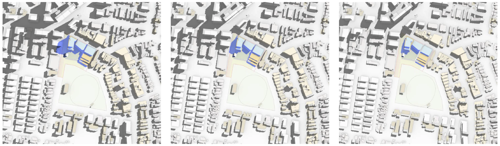

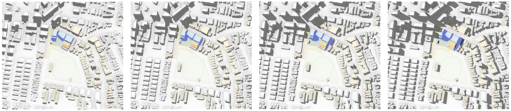

<!-- page 260 -->

Mosman Civic Precinct Place Plan 256 SJB

### Environmental Assessment

### Shadow Studies - Summer Solstice

Summer solstice, 9am. Summer solstice, 10am. Summer solstice, 11am.

Summer solstice, 12pm. Summer solstice, 1pm. Summer solstice, 2pm. Summer solstice, 3pm.

This analysis depicts the proposal’s overshadowing impacts on the future Mosman Masterplan context between 9am and 3pm during the summer solstice (21 December).

August 2026

Attachment 1.1.1 Mosman Council

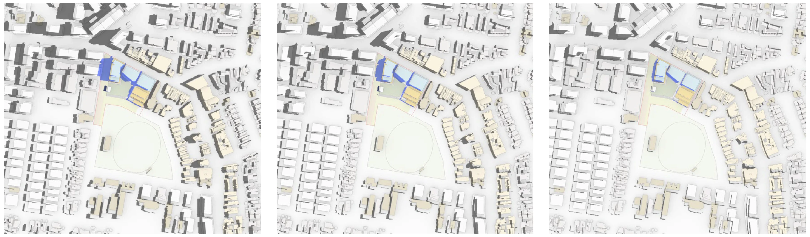

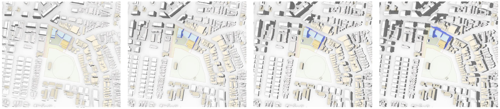

<!-- page 261 -->

Mosman Civic Precinct Place Plan 257 SJB

### Environmental Assessment

KEY

> 2 hours or more of solar access

< 2 hours - > 0 hours of solar access

0 hours of solar access

### Solar Access to Open Space

Village Green

Village Green

Village Green

Winter Solstice - 21 June (9am-3pm)

During the winter solstice, only a small portion of the Village Green receives two hours or more of direct sunlight, with most of the space receiving between zero and two hours or no direct sunlight. The most shaded area is located within the proposed children’s playground, where increased shade provides a more comfortable environment for play while preserving greater solar access to the primary lawn and gathering spaces.

Equinox - 21 March (9am-3pm)

During the equinox, solar access improves significantly, with the majority of the Village Green receiving two hours or more of direct sunlight. Areas receiving less than two hours or no direct sunlight are generally confined to the children’s playground, where additional shade supports user comfort without affecting the primary open lawn.

Summer Solstice - 21 December (9am-3pm)

During the summer solstice, almost the entire Village Green receives two hours or more of direct sunlight. The limited shaded area is concentrated within the proposed children’s playground, providing a comfortable setting for play during the warmer months while maintaining excellent solar access across the remainder of the open space.

August 2026

Attachment 1.1.1 Mosman Council

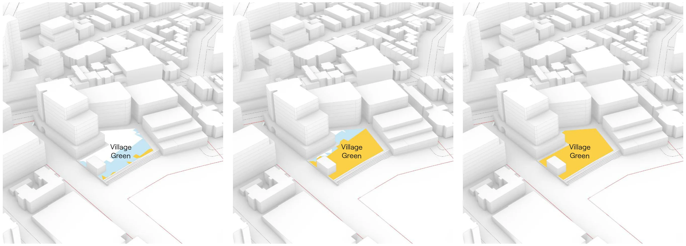

<!-- page 262 -->

Mosman Civic Precinct Place Plan 258 SJB

North-west view of the Mosman Civic Precinct within the future Mosman Masterplan context. South-east view of the Mosman Civic Precinct within the future Mosman Masterplan context.

### Environmental Assessment

### Solar Insolation - Built Form

KEY

> 2 hours or more of solar access

< 2 hours - > 0 hours of solar access

0 hours of solar access

August 2026

Attachment 1.1.1 Mosman Council

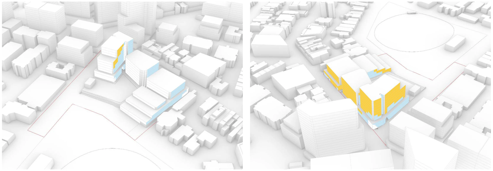

<!-- page 263 -->

## Solar Controls Review

## Assessment of the proposed solar controls and

## testing of development outcome under alternative

## solar controls.

## 8

August 2026

Attachment 1.1.1 Mosman Council

<!-- page 264 -->

Mosman Civic Precinct Place Plan 260 SJB

The Crescent The Crescent

Military Road Military Road

Myahgah Road Myahgah Road

Vista Street Vista Street

Mosman Mosman Square Square

Mosman Mosman Square Square

Allan Border Oval

Allan Border Oval

### Solar Controls Review

O p t i o n A ( P r o p o s e d C o n t r o l s )

O p t i o n C ( A lt e r n a t i v e C o n t r o l s )

O p t i o n B ( P r o p o s e d C o n t r o l s )

O p t i o n D ( A l t e r n a t i v e C o n t r o l s )

### Review of Proposed Solar Controls

Proposed Solar Controls No additional overshadowing across Allan Border Oval and its curtilage.

Protects the entire open space from additional overshadowing.

Alternative Solar Controls No additional overshadowing to the sports oval only.

Protects the sports oval while allowing a defined level of additional overshadowing to the surrounding open space (subject to further testing).

KEY

Site boundary

Council-owned land

No additional overshadowing

The proposed solar controls protect the entirety of Allan Border Oval from any additional overshadowing. While this approach preserves solar access across the open space, it also significantly constrains built form opportunities within the Civic Precinct.

This assessment explores alternative solar controls focused on protecting the sports oval only, enabling a greater level of additional development capacity while allowing a defined level of additional overshadowing to the surrounding open space. The pages that follow assess development options under each solar control scenario.

MAXIMUM GFA

34,300m2

MAXIMUM GFA

22,700m2

#### POTENTIAL UPLIFT

#### + 11,600m2 GFA

SUMMARY OF OPTIONS

Represents the current Precinct Place Plan under the proposed solar controls, establishing the baseline development outcome.

Tests the maximum development potential under the alternative solar controls.

Tests a 4,000m² Library & Community Hub within the proposed solar controls.

Refines the maximum development scenario to achieve a more balanced urban design outcome.

August 2026

Attachment 1.1.1 Mosman Council

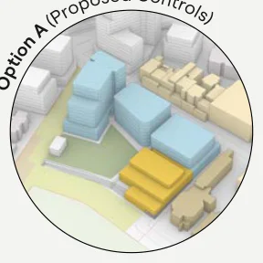

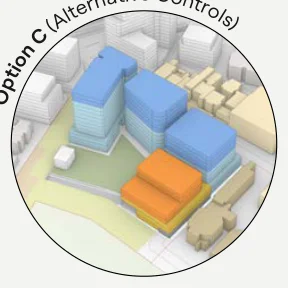

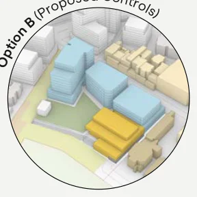

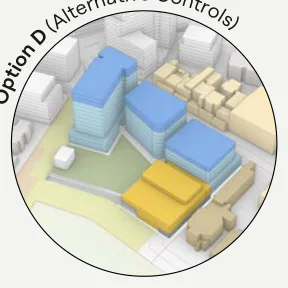

<!-- page 265 -->

Mosman Civic Precinct Place Plan 261 SJB

KEY

Site boundary

Community use

Commercial use

Parking

### Solar Controls Review

### Option A (Proposed Solar Controls) - Precinct Plan Scheme

More detailed solar testing has been undertaken to ensure no additional overshadowing of Allan Border Oval in accordance with the proposed solar controls. The updated built form in Option A demonstrates the maximum development potential achievable within these controls while delivering a refined urban design response through improved height transitions, stronger relationships to surrounding public spaces and enhanced view corridors.

Although this represents a balanced outcome under the proposed controls, revising the solar controls would provide an opportunity to increase development capacity, deliver a larger and more flexible Library & Community Hub, and better align with the built form envisaged by the Mosman Masterplan.

4

5

5 7

10

Library & Community Hub (~3,800m²) retained at 4 storeys to respond to solar controls and create a sensitive 3-storey interface with the Village Green.

2-storey streetwall retained along Mosman Square

2-storey podium creates a consistent built form interface with the Library & Community Hub along the Village Green

Military Road frontage refined to step from 10 → 7 → 5 storeys, improving the transition to the church interface and better aligning with the 5-storey development opposite

Building curvature enables 7 storeys beneath the solar clipping planes while opening views towards the Village Green, Allan Border Oval and the Pavilion COMMERCIAL GFA

18,900m2

COMMUNITY GFA

3,800m2

TOTAL GFA

22,700m2

August 2026

Attachment 1.1.1 Mosman Council

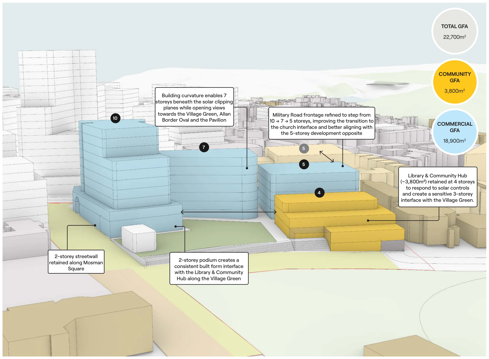

<!-- page 266 -->

Mosman Civic Precinct Place Plan 262 SJB

### Solar Controls Review

10

7

5

4

Winter solstice, 9am. Winter solstice, 10am. Winter solstice, 11am.

Winter solstice, 12pm. Winter solstice, 1pm. Winter solstice, 2pm. Winter solstice, 3pm.

This analysis illustrates the proposal’s overshadowing at hourly intervals between 9am and 3pm on the winter solstice (21 June), demonstrating compliance with the proposed solar controls and no additional overshadowing of Allan Border Oval.

### Option A (Proposed Solar Controls) - Shadow Studies

August 2026

Attachment 1.1.1 Mosman Council

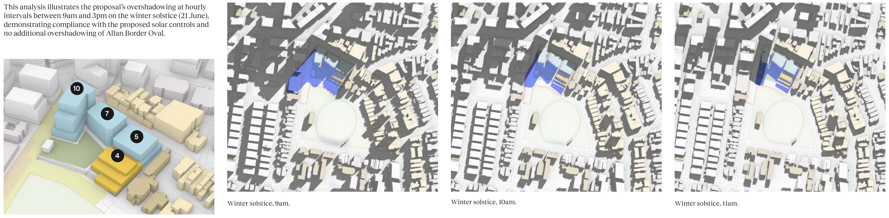

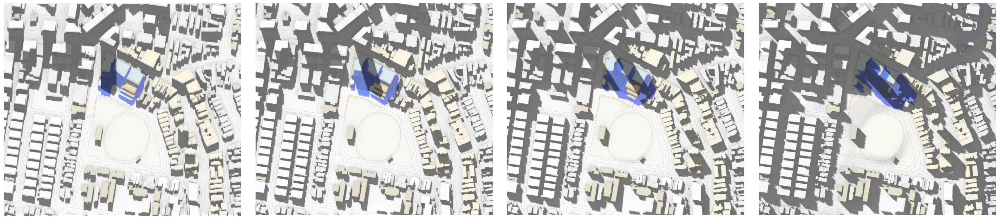

<!-- page 267 -->

Mosman Civic Precinct Place Plan 263 SJB

KEY

Site boundary

Community use

Commercial use

Parking

### Solar Controls Review

### Option B (Proposed Solar Controls) - 4,000m² Library & Community Hub

This option retains the same built form strategy as Option A while achieving a 4,000m² Library & Community Hub within the proposed solar controls.

An upper-level extension provides the additional floor area required to achieve the 4,000m² library while maintaining the through-site link and preserving key views to Allan Border Oval. The upper-level extension is indicative only and may be achieved through a cantilever, columns, or another structural solution as part of the detailed design.

4

5

5 7

Library & Community Hub retained at 4 storeys, achieving the 4,000m² target while maintaining compliance with the solar controls to Allan Border Oval.

Upper-level extension maintains the through-site link from Military Road and key views to Allan Border Oval.

COMMERCIAL GFA

18,900m2

COMMUNITY GFA

4,000m2

TOTAL GFA

22,900m2

10

August 2026

Attachment 1.1.1 Mosman Council

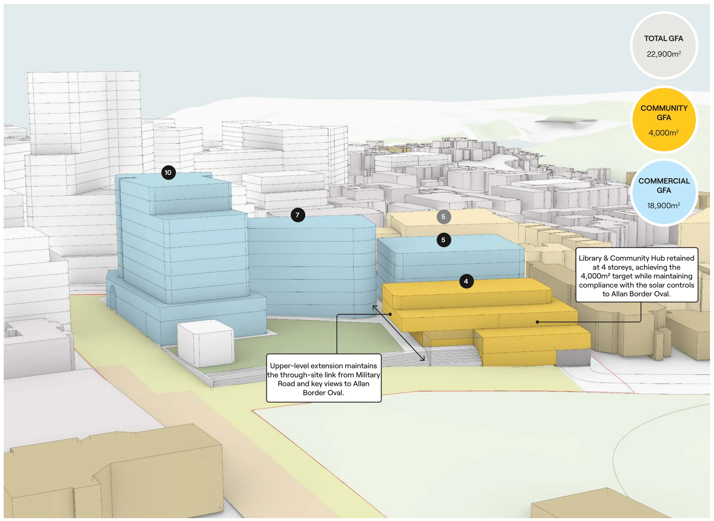

<!-- page 268 -->

Mosman Civic Precinct Place Plan 264 SJB

### Solar Controls Review

10

7

5

4

Winter solstice, 9am. Winter solstice, 10am. Winter solstice, 11am.

Winter solstice, 12pm. Winter solstice, 1pm. Winter solstice, 2pm. Winter solstice, 3pm.

This analysis illustrates the proposal’s overshadowing at hourly intervals between 9am and 3pm on the winter solstice (21 June), demonstrating compliance with the proposed solar controls and no additional overshadowing of Allan Border Oval.

### Option B (Proposed Solar Controls) - Shadow Studies

August 2026

Attachment 1.1.1 Mosman Council

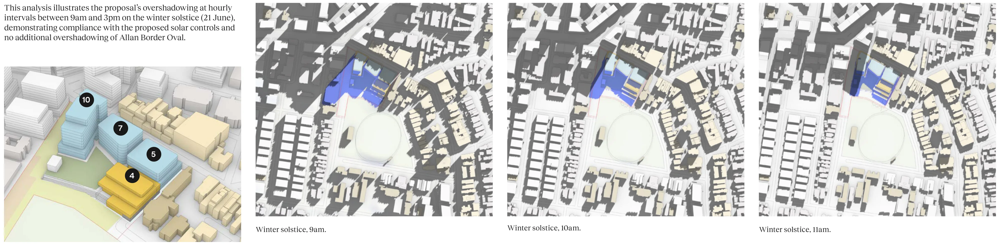

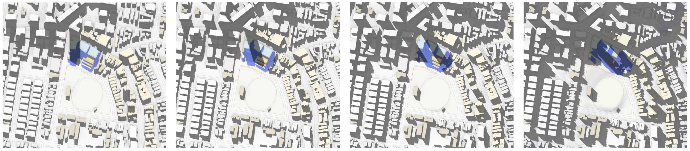

<!-- page 269 -->

Mosman Civic Precinct Place Plan 265 SJB

KEY

Site boundary

Community use Community use above the proposed solar control height Commercial use Commercial use above the proposed solar control height Parking

### Solar Controls Review

### Option C (Alternative Solar Controls) - Maximum Development

Testing under the alternative solar controls

Applying the alternative solar controls significantly increases development capacity. Option C tests the maximum building heights achievable under the alternative controls before refinement in response to heritage, public realm and built form transition.

7

10

12

Library & Community Hub can increase to approximately 7,500m² across up to 7 storeys, providing significantly greater flexibility for future community uses. There is potential to include a restaurant at the fifth floor for activation.

Podium and streetwall heights maintained in accordance with the proposed Design Guidelines.

Military Road built form increases to respond to the revised solar controls, representing the maximum development capacity prior to urban design refinement.

Council Chambers redevelopment increases to 12 storeys, maximising commercial development potential.

COMMERCIAL GFA

26,800m2

COMMUNITY GFA

7,500m2 12

TOTAL GFA

34,300m2 + 11,600m2

August 2026

Attachment 1.1.1 Mosman Council

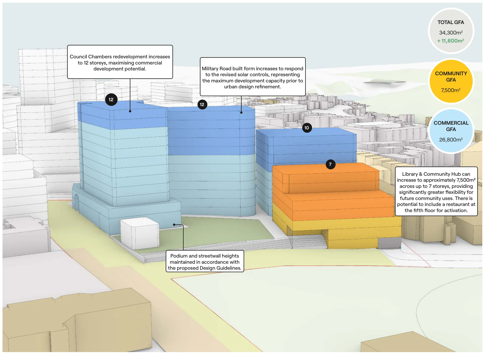

<!-- page 270 -->

Mosman Civic Precinct Place Plan 266 SJB

12

10

7

12

### Solar Controls Review

Winter solstice, 9am. Winter solstice, 10am. Winter solstice, 11am.

Winter solstice, 12pm. Winter solstice, 1pm. Winter solstice, 2pm. Winter solstice, 3pm.

This analysis depicts the proposal’s overshadowing impacts on the surrounding context at one-hour intervals between 9am and 3pm during the winter solstice (21 June), under the alternative solar controls.

### Option C (Alternative Solar Controls) - Shadow Studies

August 2026

Attachment 1.1.1 Mosman Council

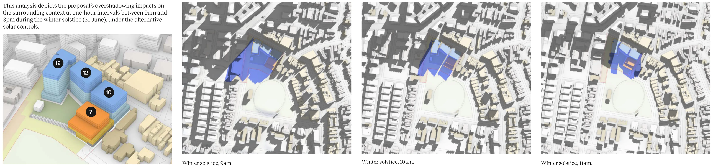

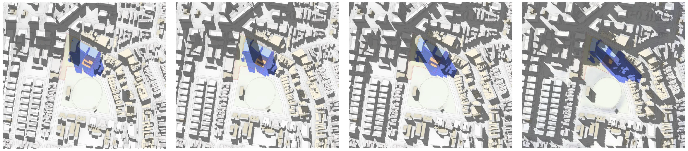

<!-- page 271 -->

Mosman Civic Precinct Place Plan 267 SJB

KEY

Site boundary

Community use

Commercial use Commercial use above the proposed solar control height Parking

### Solar Controls Review

Testing under the alternative solar controls

Option D refines the maximum development envelope to deliver a balanced urban design outcome. Reduced building heights improve the overall composition of the precinct while retaining a significant uplift in development capacity (+4,700m² GFA).

The preferred scheme also provides a larger and more flexible Library & Community Hub and building heights that better respond to the future built form envisaged by the Mosman Masterplan.

9

Library & Community Hub increased to approximately 4,700m² while remaining at 4 storeys to maintain a strong civic interface and minimise overshadowing of Allan Border Oval.

Military Road frontage reduced from 12/13 → 9 → 6 storeys to improve built form transition, reduce visual prominence and strengthen the relationship with surrounding development.

Council Chambers redevelopment retained at 12 storeys to reinforce the Military Road corner and respond to the future built form envisaged by the Mosman Masterplan.

COMMERCIAL GFA

22,700m2

COMMUNITY GFA

4,700m2

TOTAL GFA

27,400m2 + 4,700m2

6

4

2/3 storey podium retained along the Village Green and 2-storey streetwall maintained along Mosman Square to reinforce a consistent civic interface.

12

### Option D (Alternative Solar Controls) - Refined Scheme

August 2026

Attachment 1.1.1 Mosman Council

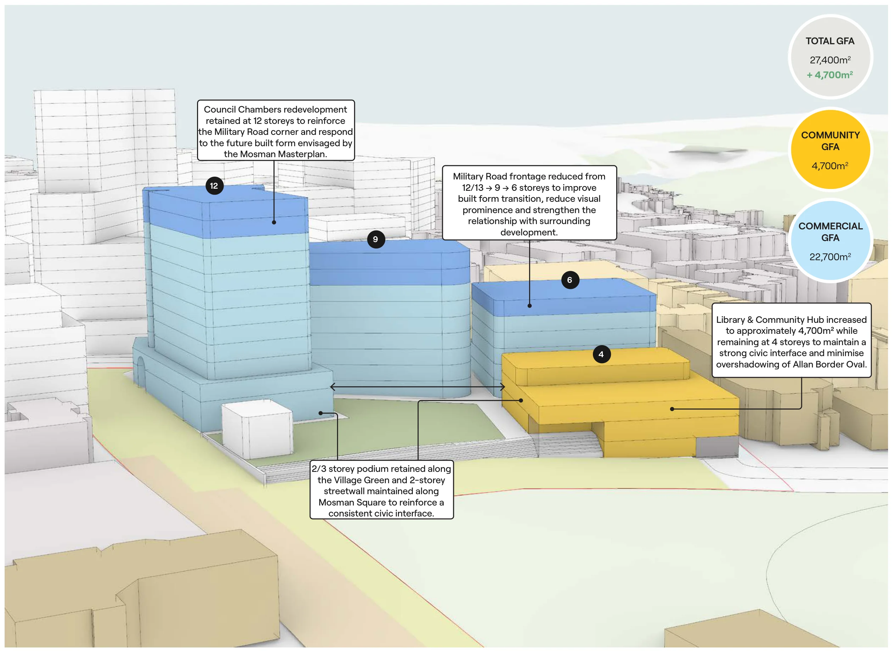

<!-- page 272 -->

Mosman Civic Precinct Place Plan 268 SJB

12

9

6

4

### Solar Controls Review

Winter solstice, 9am. Winter solstice, 10am. Winter solstice, 11am.

Winter solstice, 12pm. Winter solstice, 1pm. Winter solstice, 2pm. Winter solstice, 3pm.

### Option D (Alternative Solar Controls) - Shadow Studies

This analysis depicts the proposal’s overshadowing impacts on the surrounding context at one-hour intervals between 9am and 3pm during the winter solstice (21 June), under the alternative solar controls.

August 2026

Attachment 1.1.1 Mosman Council

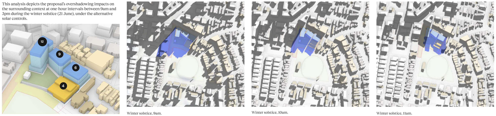

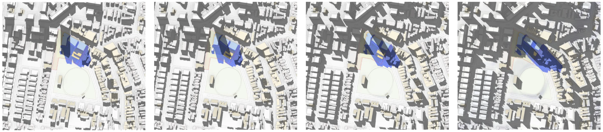

<!-- page 273 -->

SJB is passionate about the possibilities of architecture, interiors, urban design and planning. Let’s collaborate.

Gadi Country Level 2, 490 Crown Street Surry Hills NSW 2010

T	 61 2 9380 9911 E	 sydney@sjb.com.au W	 sjb.com.au

August 2026

Attachment 1.1.1 Mosman Council
