---

title: C Transport Study

source: Extraordinary Council Meeting - Additional Attachments - 26 August 2026

pages: 331-414

---

# C Transport Study

<!-- page 331 -->

## Transport StudyC

### August 2026

### Attachment 1.1.3 Mosman

### Council

<!-- page 332 -->

## Mosman

## Masterplan

## Transport Study

August 2026  · Issue 1.1  ·  Prepared for Mosman Council

### August 2026

### Attachment 1.1.3 Mosman

### Council

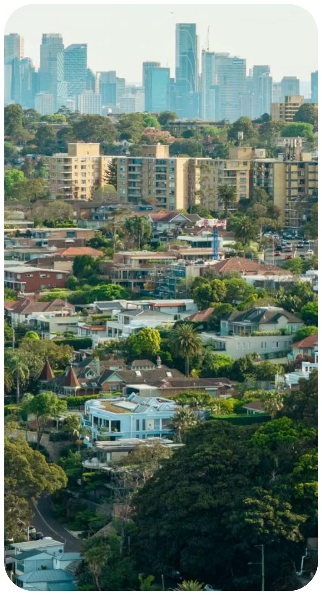

<!-- page 333 -->

## Intentionally left blank

### August 2026

### Attachment 1.1.3 Mosman

### Council

<!-- page 334 -->

## Document Control

Mosman Masterplan – Transport Study

#### Type of report   Mosman Masterplan – Transport Study

#### Prepared for   Mosman Council

#### Prepared by   Fernway Engineering Pty Ltd  ·  ABN 38 475 511 899  ·  info@fernway.net.au

Version Author Reviewed Release date

DRAFT Chris Saunders, Director NER/RPEQ: 4041002 / 24648

Dr Supun Perera, Director NER/RPEQ: 4787402 / 18501 23 July 2026

Issue 1.0 Chris Saunders, Director NER/RPEQ: 4041002 / 24648

Dr Supun Perera, Director NER/RPEQ: 4787402 / 18501 3 August 2026

Issue 1.1 Chris Saunders, Director NER/RPEQ: 4041002 / 24648

Dr Supun Perera, Director NER/RPEQ: 4787402 / 18501 17 August 2026

### August 2026

### Attachment 1.1.3 Mosman

### Council

<!-- page 335 -->

## Contents

Mosman Masterplan – Transport Study

1   Mosman Masterplan, an introduction

#### 1   Mosman Masterplan, an

#### introduction

7

#### 7

#### 1.1 Mosman Masterplan

#### 1.1 Mosman Masterplan

8 8

#### 1.2 Masterplan Drivers

#### 1.2 Masterplan Drivers

10 10

#### 1.3 Transport Objectives

#### 1.3 Transport Objectives

11 11

2   Background

#### 2   Background

12

#### 12

#### 2.1 A Snapshot of Mosman

#### 2.1 A Snapshot of Mosman

13 13

#### 2.2 The Transport Network

#### 2.2 The Transport Network

14 14

#### 2.3 Travel Behaviour

#### 2.3 Travel Behaviour

15 15

#### 2.4 Regional  District Planning Framework

#### 2.4 Regional & District Planning

Framework

16 16

#### 2.5 Local Planning Framework

#### 2.5 Local Planning Framework

17 17

#### 2.6 Relevant Studies

#### 2.6 Relevant Studies

18 18

#### 2.7 Relevant Transport Planning Guidelines

#### 2.7 Relevant Transport Planning

Guidelines

19 19

#### 2.8 Data Sources

#### 2.8 Data Sources

20 20

3   Existing Transport Network

#### 3   Existing Transport Network

21

#### 21

#### 3.1 Road Network Operations

#### 3.1 Road Network Operations

22 22

#### 3.2 Road Safety

#### 3.2 Road Safety

26 26

#### 3.3 Walking

#### 3.3 Walking

28 28

#### 3.4 Public Transport

#### 3.4 Public Transport

29 29

#### 3.5 Cycling

#### 3.5 Cycling

33 33

#### 3.6 Parking

#### 3.6 Parking

34 34

#### 3.7 Freight  Servicing

#### 3.7 Freight & Servicing

35 35

4   Future Transport Network

#### 4   Future Transport Network

36

#### 36

#### 4.1 Regional Growth

#### 4.1 Regional Growth

37 37

#### 4.2 Future Travel Demands

#### 4.2 Future Travel Demands

38 38

#### 4.3 Future Challenges

#### 4.3 Future Challenges

40 40

#### 4.4 Future Road Network

#### 4.4 Future Road Network

42 42

#### 4.5 Future Public Transport

#### 4.5 Future Public Transport

48 48

#### 4.6 Future Walking Network

#### 4.6 Future Walking Network

51 51

#### 4.7 Future Cycling Network

#### 4.7 Future Cycling Network

57 57

#### 4.8 Future Parking Conditions

#### 4.8 Future Parking Conditions

62 62

#### 4.9 Future Freight  Servicing

#### 4.9 Future Freight & Servicing

65 65

#### 4.10 Future Travel Demand Management

#### 4.10 Future Travel Demand Management

66 66

5   Movement  Place Framework

#### 5   Movement & Place Framework

67

#### 67

#### 5.1 Movement  Place

#### 5.1 Movement & Place

68 68

#### 5.2 Mosman Village North

#### 5.2 Mosman Village North

69 69

#### 5.3 Mosman Village South

#### 5.3 Mosman Village South

70 70

#### 5.4 Ourimbah Triangle

#### 5.4 Ourimbah Triangle

71 71

#### 5.5 Military Road Corridor

#### 5.5 Military Road Corridor

72 72

#### 5.6 Prince Street

#### 5.6 Prince Street

73 73

#### 5.7 Spit Road Corridor

#### 5.7 Spit Road Corridor

74 74

#### 5.8 Middle Harbour Ridge and Balmoral Ridge

#### 5.8 Middle Harbour Ridge and Balmoral

Ridge

75 75

6   Recommendations

#### 6   Recommendations

76

#### 76

#### 6.1 Summary of Transport Project Locations

#### 6.1 Summary of Transport Project

Locations

77 77

#### 6.2 Project Reference Table

#### 6.2 Project Reference Table

78 78

7   Implementation

#### 7   Implementation

80

#### 80

#### 7.1 Transport Study Process

#### 7.1 Transport Study Process

81 81

#### 7.2 Metrics for Objectives

#### 7.2 Metrics for Objectives

82 82

### August 2026

### Attachment 1.1.3 Mosman

### Council

<!-- page 336 -->

Mosman Masterplan – Transport Study

## Glossary of Terms and Abbreviations

#### Abbreviations A–L

A8 the state road route formed by Military Road and Spit Road through Mosman ABS Australian Bureau of Statistics

AM / PM peak the morning and evening commuter peak periods B1 / B-Line the high-frequency B-Line bus service (route B1) between Mona Vale and the Sydney CBD BOAM Bus Opal Assignment Model, a TfNSW bus occupancy dataset CBD central business district

CFT continuous footpath treatment

DCP Development Control Plan

DPHI Department of Planning, Housing and Infrastructure EIS Environmental Impact Statement

EV electric vehicle

GANSW Government Architect New South Wales

GTFS General Transit Feed Specification

GTIA Guide to Transport Impact Assessment (TfNSW)

LATM local area traffic management

LEP Local Environmental Plan

LGA local government area

LHS Local Housing Strategy

LMR Low and Mid-Rise (Housing Policy)

LoS Level of Service (see Terms)

#### Abbreviations M–W

MOSPLAN Mosman Council's Community Strategic Plan

MRC Military Road Corridor (character area)

MVN Mosman Village North (character area)

MVS Mosman Village South (character area)

NHVR National Heavy Vehicle Regulator

NRMA National Roads and Motorists' Association

OD origin–destination

OSOM oversize, overmass (vehicles)

PS Prince Street (character area)

PTAL Public Transport Accessibility Level

RAN Royal Australian Navy

RPS Resident Parking Scheme

SCC Strategic Cycleway Corridor (TfNSW)

SEPP State Environmental Planning Policy

SRC Spit Road Corridor (character area)

T3 a transit lane for vehicles carrying three or more people TAG transport access guide

TDM travel demand management

TfNSW Transport for NSW

TMAP Transport Management and Accessibility Plan

VISSIM a micro-simulation traffic modelling package

WFU Warringah Freeway Upgrade

WHT Western Harbour Tunnel

#### Terms

30-minute city the metropolitan planning aim that people can reach their nearest strategic centre within 30 minutes by public or active transport. In the case of Mosman, North Sydney is the nearest strategic centre.

Active transport walking and cycling, including to reach public transport Level of Service a grading of the delay drivers or pedestrians experience, from A (free-flowing) to F (heavily congested) Micro-simulation detailed computer modelling of individual vehicles moving through a network Mode share the mix of how people travel: by car, bus, ferry, foot or bike Movement and Place the NSW Government framework for balancing a street’s transport function with its role as a place for people Peak spreading traffic peaks growing longer and flatter rather than sharper, as drivers shift their travel times Rat-running through-traffic diverting onto local streets to bypass congestion on the main road Safe System the road safety approach underpinning NSW policy, designing roads so that human mistakes do not cost lives Through-site link a publicly accessible pedestrian connection through a development block Trip generation the number of trips a development or land use is expected to create

### August 2026

### Attachment 1.1.3 Mosman

### Council

<!-- page 337 -->

### Executive summary

## The Study at a Glance

Mosman Masterplan – Transport Study

#### 6

The study finds that the Military Road and Spit Road (A8) corridor, which shapes the local and regional transport network, has been operating at or near its effective capacity for the past decade. Congestion is commonplace, travel times along the corridor appear to be marginally increasing over time despite sluggish population growth, and these impacts are observed to flow on through the local road network in various ways.

In response to a national housing shortage, the local government areas (LGAs) of Mosman, Northern Beaches and North Sydney (Neutral Bay and Cremorne) are expected to accommodate in excess of 20,000 new dwellings over the next 10 years, based on estimated Low and Mid-Rise Housing Policy (LMR) housing yields and Council- announced housing targets – a scale of growth that, left unmanaged, could result in exponential worsening of the performance and resilience of the A8 corridor as well as that of the adjoining local road network. This in turn could jeopardise the housing targets themselves, as a functional transport network is essential for growth.

The study finds that this Masterplan has the potential to considerably improve the future outlook of the local and regional transport network. This improvement will come as a result of reorienting housing uplift along the corridor itself, aligning growth with public transport services, community services and the proposed new Regional Cycling Route. Whilst the volume of new households will not change between the current LMR projections and the Masterplan, this realignment will provide new residents with greater alternatives to driving, reducing pressure on the road networks at a precinct-wide scale.

Despite the potential benefits of the Masterplan, however, it should not be considered a panacea for the transport challenges ahead. The performance and reliability of the broader road network remain heavily dependent on State-controlled infrastructure, services and strategic planning – State Government action will ultimately be necessary to prepare the transport network for the future population.

Road capacity The A8 is operating at or near its effective capacity, with congestion flowing through to the local road network at its few signalised access points. The corridor cannot accommodate forecast travel demand without transformative upgrades along the corridor or shifts in travel patterns: re-moding, retiming, reducing and rerouting trips.

What the Masterplan can achieve over the LMR Better alignment of housing along the primary transport corridor, a regional cycling route, enhanced pedestrian permeability and stronger place-making, new or improved signalisation upgrades to critical intersections along the classified road network (subject to TfNSW pre-approval), and potentially, an iconic Spit Junction pedestrian overpass to connect Mosman North and South villages.

Safety and place Local area traffic management across the character areas – 40km/h limits, targeted street closures and traffic calming measures maintain local street amenity and safety.

Public transport The masterplan is expected to result in a material increase in the public transport mode share through better alignment between housing uplift and the primary transport corridor.

Walking A transformative improvement in pedestrian permeability throughout the town centre, with over 20 new through- site links proposed, among various other improvements.

Cycling A new regional cycling route through Mosman, connecting future residents with a safe and direct link to North Sydney and Sydney’s wider network of cycling corridors.

Parking Angle-parking opportunities supporting outer-centre commercial sites along Military Road, with future Development Control Plan (DCP) controls aligning parking supply with the town centre vision.

Freight & Servicing Servicing controls for future development embedded in the DCP, with a micro-freight hub to be explored at Spit Junction as servicing patterns shift.

Demand management Land use alignment as the hard foundation for mode shift, sustained by DCP controls such as travel plans for larger developments.

### August 2026

### Attachment 1.1.3 Mosman

### Council

<!-- page 338 -->

#### C H A P T E R O N E

## 1

## Mosman Masterplan, an

## introduction

The purpose and origins of the Mosman Masterplan – the housing reform context it responds to, its objectives, and the transport objectives this study serves.

#### 1.1 Mosman Masterplan

#### 1.2 Masterplan Drivers

#### 1.3 Transport Objectives

Mosman Masterplan – Transport Study

#### 7

### August 2026

### Attachment 1.1.3 Mosman

### Council

<!-- page 339 -->

### Mosman Masterplan, an introduction

## 1.1  Mosman Masterplan

Mosman Masterplan – Transport Study

#### 8

### The housing reform context

The Mosman Masterplan has been developed to address future housing uplift within the LGA.

The NSW Government’s Low and Mid-Rise Housing (LMR) reforms were introduced in 2024/25 in response to the state-wide housing shortage. The LMR works by effectively up-zoning residential land within 800 metres of nominated town centres and transport hubs.

Spit Junction and Cremorne were among the nominated town centres whose catchments apply to land within the Mosman LGA. Within Mosman, the LMR provisions are estimated to allow for an additional 4,700 new homes, distributed across the 800-metre walking catchment surrounding the Spit Junction Town Centre. As a blanket, radius-based approach, the LMR does not differentiate between varying site and locational conditions across this catchment, and risks directing a disproportionate share of future uplift toward areas less suited to accommodate it. In a transport context, the uplift of growth in areas beyond convenient walking distance to regular public transport services and core retail/community services is far from ideal.

In response, the Mosman Masterplan provides an alternative, place-based approach. Whilst it must achieve an equivalent volume of housing uplift, it seeks to do so with a more considered approach to the future needs of the Mosman community, with improved access to transport and town centre services a core objective.

Figure 1-1 – The proposed Masterplanning refinement of the LMR catchment. (Source: SJB Urban Design Report)

### August 2026

### Attachment 1.1.3 Mosman

### Council

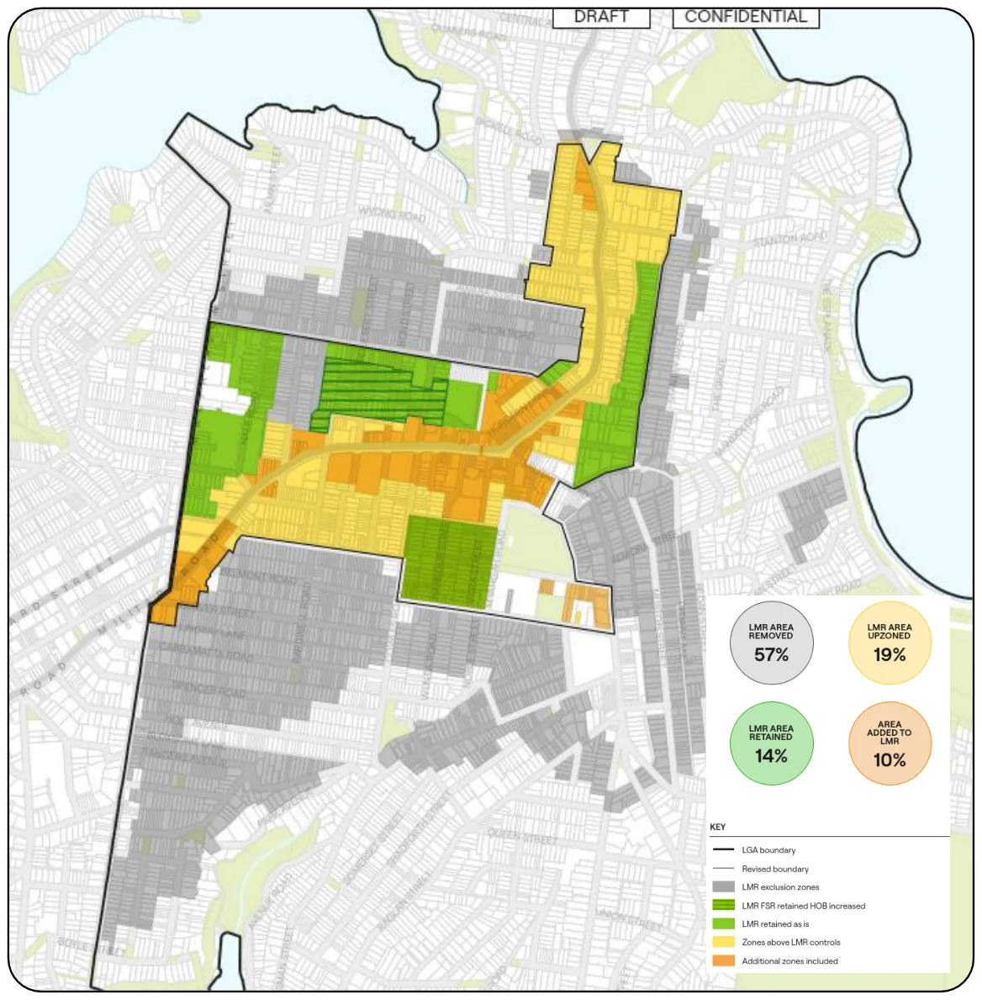

<!-- page 340 -->

### Mosman Masterplan, an introduction

## 1.1  Mosman Masterplan

Mosman Masterplan – Transport Study

#### 9

### Emerging character areas

The Masterplan formalises a number of distinct character areas across the study area, each with its own setting: some are corridor-focused, some are civic-centred, and others are green, place-based residential neighbourhoods. These character areas are listed below, and shown in Figure 1-2.

● Mosman Village North

● Mosman Village South

● Military Road Corridor

● Spit Road Corridor

● Ourimbah Triangle

● Prince Street

● Middle Harbour Ridge

● Balmoral Ridge

Each area was assessed against the TfNSW Movement and Place Framework, which sets out appropriate road hierarchies and the transport planning initiatives that follow for each.

Figure 1-2 – Emerging character areas of the Masterplan

#### Community consultation

Preliminary consultation in April–May 2026 received strong community participation and directly informed the final Masterplan study area, building massing, transport responses and overall vision for these individual character areas.

### August 2026

### Attachment 1.1.3 Mosman

### Council

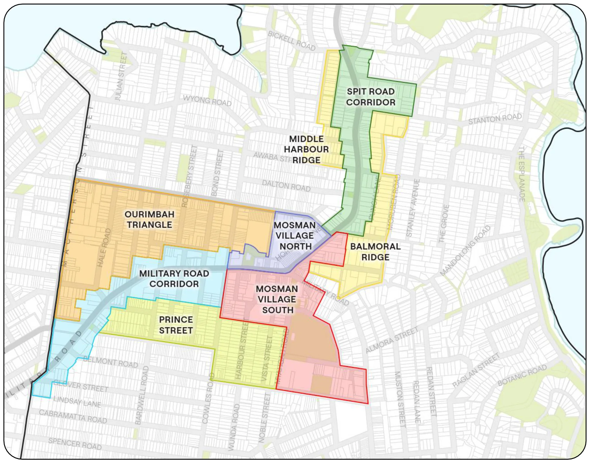

<!-- page 341 -->

### Mosman Masterplan, an introduction

## 1.2  Masterplan Drivers

Mosman Masterplan – Transport Study

#### 10

Mosman Council has outlined eight core drivers for the Masterplan to deliver. In the context of transport planning, the two most relevant drivers are:

● Achieve stronger alignment between housing uplift and public and active transport corridors to cater for regional travel,

● Establish stronger local connectivity and provide adequate local services within the Masterplan area, to cater for local travel.

Figure 1-3 – Masterplan drivers

### August 2026

### Attachment 1.1.3 Mosman

### Council

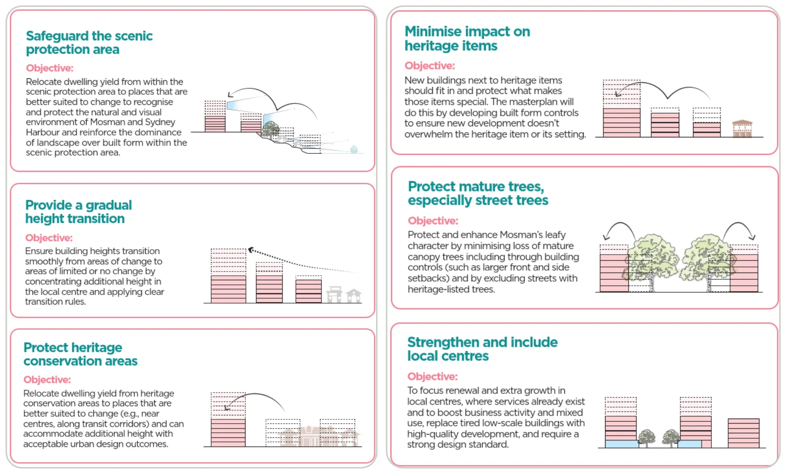

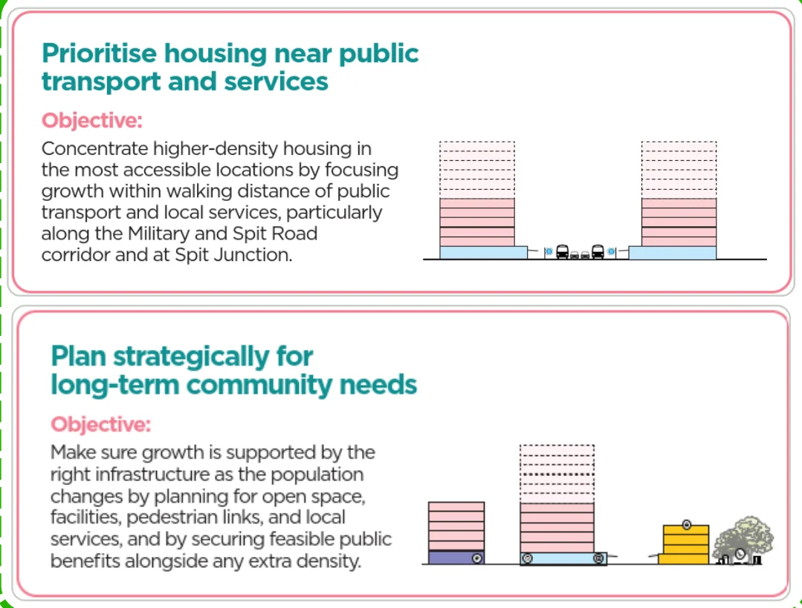

<!-- page 342 -->

### Mosman Masterplan, an introduction

## 1.3  Transport Objectives

Mosman Masterplan – Transport Study

#### 11

Stemming from the Masterplan Drivers in the previous section, this study has developed ten transport objectives to guide the Masterplan, informed by Council’s strategic priorities and the evidence presented throughout this study. Together, they address a broad range of transport outcomes, including increased public and active transport use, improved road safety, effective traffic and kerbside management, enhanced freight and servicing, and broader place and liveability outcomes such as supporting a 30-minute city and strengthening the role of Military Road and Spit Road as places.

These objectives will not always align and, in many cases, require careful balancing within a constrained transport corridor. In this regard, the Masterplan relies on the TfNSW Movement and Place Framework for identifying the desired character of each street or area, and establishing road-user priorities accordingly.

#### Scope of objectives

Collectively, these objectives span movement, place, safety and access.

Importantly, these objectives are not in any prioritised order.

#### #

#### OBJECTIVE

#### 1

Increase public transport uptake & service quality

#### 2

Increase cycling trips

#### 3

Encourage local trips to local facilities, supporting a healthy and active lifestyle

#### 4

#### 5

Improve road safety

Maintain local vehicle access to the A8 corridor

#### #

#### OBJECTIVE

Maintain a 30-minute city

#### 6

Prevent rat-runs

#### 7

#### 8

Support efficient freight and servicing

#### 9

Effective kerbside management and parking strategy

#### 10

Maintain the Place function of Spit Road / Military Road

Figure 1-4 – Transport Objectives within the Masterplan Framework.

### August 2026

### Attachment 1.1.3 Mosman

### Council

<!-- page 343 -->

#### C H A P T E R T W O

## 2

## Background

This section provides a snapshot of context for the study area – Mosman’s community and geography, its transport network, and the strategic and policy framework within which this Masterplan operates. It also outlines the various industry better-practice guidelines, former studies and data sources that informed the study.

#### 2.1 A Snapshot of Mosman

#### 2.2 The Transport Network

#### 2.3 Travel Behaviour

#### 2.4 Regional & District Planning Framework

#### 2.5 Local Planning Framework

#### 2.6 Relevant Studies

#### 2.7 Relevant Transport Planning Guidelines

#### 2.8 Data Sources

Mosman Masterplan – Transport Study

#### 12

### August 2026

### Attachment 1.1.3 Mosman

### Council

<!-- page 344 -->

### Background

## 2.1  A Snapshot of Mosman

Mosman Masterplan – Transport Study

#### 13

Mosman is a small harbourside LGA roughly 8 kilometres north-east of the Sydney central business district (CBD), bounded by Sydney Harbour and Middle Harbour. Its distinctive geography characterises many facets of the LGA, including transport; the primary transport corridor (A8) follows the region’s main ridgeline between The Spit and North Sydney, whilst Mosman’s high street along Military Road follows a secondary ridgeline branching southwards from Spit Junction to Mosman Junction. Beyond the ridgelines, topography begins to fall steeply towards Mosman’s outer foreshore areas.

Mosman has an estimated population of 29,071 residents across nearly 12,000 households. Land use is predominantly low-density residential, with medium density around the town centre.

Spit Junction anchors Mosman as its principal civic core, with a village-style high street subsequently extending south along Military Road towards Mosman Junction. A number of iconic attractions, such as Balmoral Beach and Taronga Zoo, as well as an abundance of historical attractions and scenic foreshore walking trails draw significant volumes of external visits, particularly on weekends and holidays.

Being effectively a peninsula, it shares only one land border with North Sydney LGA to the west, defined by Spofforth Street and Macpherson Street. The Northern Beaches LGA can be accessed to the north via Spit Bridge; a heritage-listed bridge and the last operational lift bridge on Sydney’s arterial road network.

Figure 2-1 – Mosman Household Demographics Figure 2-2 – Mosman Contextual Mapping (Top Left: LGA, Top Right: Land Use Zoning, Bottom Left: Topography, Bottom Right: Aerial

### August 2026

### Attachment 1.1.3 Mosman

### Council

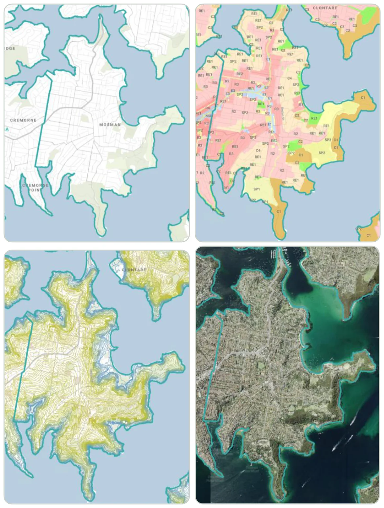

<!-- page 345 -->

## 2.2  The Transport Network

Mosman Masterplan – Transport Study

#### 14

#### Road network

The A8 The road network is organised around the Military Road and Spit Road (A8) corridor, which follows the main ridgeline through Mosman from Spit Bridge to Spit Junction, and on through Cremorne and Neutral Bay towards North Sydney and the harbour crossings beyond. The corridor carries the through- traffic and freight task of the wider region, while also serving as a place-based street at the heart of Mosman, particularly through Spit Junction and the Masterplan study area. Military Rd (High Street) branches from the A8 to carry the high street's continuous retail frontage through to Mosman Junction, a village precinct whose character the Masterplan seeks to protect. Ourimbah Rd / Macpherson St form a sub-arterial route parallel to the A8, drawing a substantial share of regional through-traffic, up to 30% in the most acute peak periods. The wider network is made up of quiet local streets serving Mosman's low and medium density neighbourhoods, where movement is subordinate to local access and amenity.

#### Public transport

Buses are the main public transport mode and run predominantly along the A8. The B-Line provides the high-frequency trunk connection between the Northern Beaches and the city, with Spit Junction its only stop within the LGA, supported by express services drawing from across the Northern Beaches and by local routes such as the 100 between Taronga Zoo and the city via Mosman Junction. Complementing the bus network, the harbour ferry, Sydney's most iconic mode of transport, serves Mosman from three wharves, each linked by local bus services into the Masterplan study area.

#### Walking & cycling

Walking infrastructure is well established and of high amenity, with the area’s scenic views, streetscapes and village atmosphere making everyday walking attractive around the local centres, foreshore walks and high streets. A cycling network connects many of the key local destinations, though it remains largely on-road. Both are examined in detail in Chapter 3.

### Background

Figure 2-3 – Road network hierarchy (indicative schematic – not to scale)

Spit Junction Town Centre

#### Spit Bridge – last of its kind

The Spit Bridge is the last remaining trafficable bridge in Sydney that still opens for maritime passage – a defining constraint on the corridor’s capacity, and part of its character.

### August 2026

### Attachment 1.1.3 Mosman

### Council

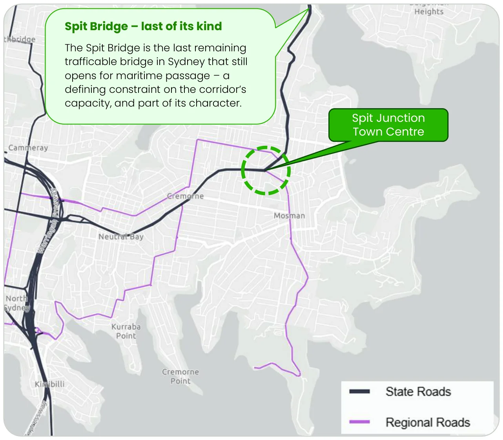

<!-- page 346 -->

## 2.3  Travel Behaviour

Mosman Masterplan – Transport Study

#### 15

Travel in Mosman falls into two distinct markets, the daily journey to work, and the everyday local trips that make up the large majority of movement, but are spread more widely across a given day. The Transport for NSW Household Travel Survey (top right) captures all trips for all purposes. The Australian Bureau of Statistics (ABS) Census (bottom right) captures ‘journey to work’ only, with the 2016 Census data used here, as 2021 results were distorted by COVID-19 restrictions. Read together, the datasets reveal two distinct travel markets.

Commuting, whilst still car-dominated at 43%, carries a substantial public transport share (24% buses, 3% ferry, 4% train as part of a multi-modal trip). Bus uptake has likely increased further since 2016 following the introduction of the B-line.

For ‘Everyday’ travel, however, the HTS identified two significant changes in travel behaviour. On the positive side, more than a quarter of trips are walking, indicative of a strong sense of ‘place’ amongst the local community that negates the need for longer trips outside Mosman. Conversely, travel via public transport drops significantly, down to 7-8% of trips, whilst travel by car slightly increased. This indicates that for non-commuting trips, which form a much larger share of overall trips in Mosman, public transport is not generally seen as a convenient or practical alternative to driving by most residents – a potential areas for improvement.

An important qualifier when considering the mode shares is that the B-Line had not yet commenced operation during the 2016 census data period. As such, it is very likely that public transport mode share has increased to some degree since these figures were published.

Figure 2-4 – HTS Travel mode shares for Mosman, all trips (Source: HTS Data, Transport for NSW)

Figure 2-5 – Journey to work (JTW) mode shares for Mosman (Source: ABS Census, 2016)

### Background

### August 2026

### Attachment 1.1.3 Mosman

### Council

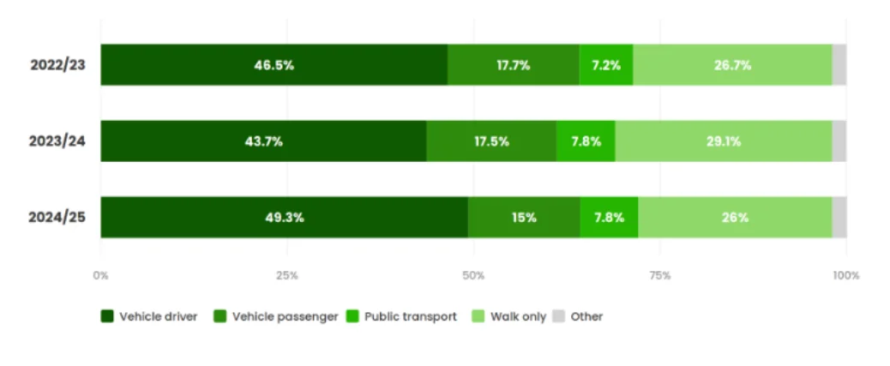

<!-- page 347 -->

### Background

## 2.4  Regional & District Planning Framework

Mosman Masterplan – Transport Study

#### 16

The Masterplan responds to a state and regional policy framework that is currently in transition. The Draft Sydney Plan will soon be adopted as the new regional plan; transport priorities are undergoing change through TfNSW’s Connecting NSW, possibly phasing out the Future Transport Strategy during this transition; and there have been recent significant changes to housing legislation under the SEPP (Housing) in response to a national housing shortage.

Greater Sydney Region Plan: A Metropolis of Three Cities · North District Plan Greater Sydney Commission · March 2018 · addressed together The strategic plan structuring Greater Sydney as three cities and embedding the 30-minute city concept, with the North District Plan giving its directions local effect across Mosman and the surrounding councils. Both remain current until the Sydney Plan is finalised, replacing the region and district plans together, and both established the land use– transport integration principle the Masterplan carries forward.

Draft Sydney Plan DPHI · exhibited December 2025 – February 2026 Once finalised, the plan will replace the 2018 Region Plan and its district plans, organising growth of 6.5 million people around a network of 43 interconnected centres and concentrating near-term housing in Eastern Sydney where infrastructure already exists. Growth aligned to existing centres and infrastructure is precisely the logic the Masterplan applies at the local scale.

Connecting NSW Strategy TfNSW · October 2025 Transport’s current priorities statement, directing investment toward six priorities including reimagining road space to drive mode shift, towards zero trauma, and enabling whole-of-government outcomes such as the delivery of more housing. Its road-space and mode-shift priorities align directly with the Masterplan’s corridor-based approach.

Low and Mid-Rise Housing Policy NSW Government · staged from July 2024 and February 2025 State-wide planning controls permitting low- and mid-rise housing within 800 metres’ walk of nominated town centres and stations, including Mosman town centre. The policy’s radius-based application takes no account of local network constraints – the default distribution the Masterplan seeks to replace with corridor-based uplift carrying the same housing volume.

2026 Road Safety Action Plan TfNSW · 2022 · successor 2031 plan in development The current NSW road safety plan, targeting a halving of deaths and a 30 per cent reduction in serious injuries from 2018–2020 levels by 2030, toward zero by 2050 under the Safe System approach. Its safer-urban-places priority frames the study’s crash analysis and the safety benefit of reducing exposure on the corridor.

Bus Priority Infrastructure Program TfNSW · rolling program TfNSW’s rolling program delivering low-cost bus reliability infrastructure across Greater Sydney: bus lanes, signal priority at intersections, bus bays and layovers. No project is currently listed within Mosman: bus infrastructure to date was delivered under the separate B-Line Program, and the strengthened Military Road and Spit Road bus priority proposed in the Network Review remains unfunded.

### August 2026

### Attachment 1.1.3 Mosman

### Council

<!-- page 348 -->

### Background

## 2.5  Local Planning Framework

Mosman Masterplan – Transport Study

#### 17

Local plans express the community’s vision for Mosman. The Masterplan has been prepared with the MOSPLAN objectives as the driving philosophy, which remains highly relevant today. The current DCP is anticipated to go through a comprehensive update following the Masterplan, to ensure new controls are in place that reflect modern and emerging transport planning practices, necessary to ensure new development aligns with the Town Centre vision set out in this Masterplan.

MOSPLAN Community Strategic Plan 2025–2035 Mosman Council · 2025 The community’s ten-year vision is of a vibrant, inclusive harbourside village where residents feel safe and connected, expressed through six strategic directions that include well-designed, liveable and accessible places and a healthy, active village lifestyle. The community’s foremost ten-year priority is managing development, and MOSPLAN records Council’s concern that state housing legislation has displaced local planning controls across most of the suburb, providing the mandate to which the Masterplan responds.

Mosman Local Environmental Plan 2012 & Development Control Plans Mosman Council The statutory planning framework for the LGA, setting land use zones, height and density controls, parking and transport provisions, and the design provisions of the accompanying DCPs. Within 800 metres of the town centre, the Low and Mid-Rise Housing Policy now overrides these local controls, a displacement the Masterplan seeks to resolve by returning uplift to a locally planned, corridor-based footing.

Mosman Local Strategic Planning Statement Mosman Council · March 2020 Mosman’s 20-year land use vision, giving local effect to the Greater Sydney Region Plan and North District Plan and linking land use priorities to infrastructure and transport capacity. It establishes the local strategic planning line of sight from region to district to LGA, into which the Masterplan’s transport study now inserts the corridor evidence base.

Mosman Walking and Cycling Strategy 2023–2028 Mosman Council · 2023 A five-year program of walking and cycling infrastructure and initiatives in support of MOSPLAN’s goals, prioritising safer connections, completion of missing network links, and promotion of active transport. Its unfinished actions, including the incomplete Rangers Avenue, Spofforth Street and Ourimbah Road routes, are the local delivery mechanism for the mode-shift outcomes the Masterplan depends on.

### August 2026

### Attachment 1.1.3 Mosman

### Council

<!-- page 349 -->

### Background

## 2.6  Relevant Studies

Mosman Masterplan – Transport Study

#### 18

A number of studies have been carried out within, or inclusive of, the Spit Junction Town Centre, assessing various elements of the transport network, including pedestrian safety, cycling accessibility, traffic operations, bus infrastructure and planned major projects. All of these studies helped to inform this current Masterplan Transport Study.

Spit Junction Town Centre and Military Road Traffic Study Cardno · May 2018 Commissioned by Council, the study built a calibrated VISSIM micro-simulation of the Spit Junction network from 2017 surveys. It found the Military Road/Spit Road corridor operating at capacity and unable to accommodate additional demand, with the maximum-development scenario under the unadopted 2009 Masterplan producing network gridlock – confirming that corridor capacity, not planning controls, is the binding constraint.

Spit Road and Awaba Street Mosman: Local Traffic Study Bitzios Consulting · June 2022 Prepared for Council in response to sustained congestion in the Balmoral area, with a focus on the conditions of the signalised intersection between Awaba Street and Spit Rod. The study surveyed weekday, weekend and holiday conditions and assessed a proposed left-turn ban from Awaba Street into Spit Road. It observed queueing exceeding 300 metres on the Awaba Street east approach, and Level of Service (LoS) F levels on both sides of Awaba Street. It considered an option to ban-left turn movements, to enable more right-turn capacity. Whilst this improved local throughput through the intersection, it indicated poorer results downstream as a result of local traffic re-routing. The report is a strong case study showing how constrained arterial access impacts local traffic users.

Mosman Schools Pedestrian Infrastructure Study Bitzios Consulting · March 2024 Commissioned by Council as a ‘Walk to School’ action plan, the study audited pedestrian routes around nine Mosman schools and developed a prioritised works program for five, including the Mosman High, Mosman Public and Mosman Preparatory cluster around the town centre. It found half the LGA’s pedestrian crashes over 2018–2022 occurred within 200 metres of a school, and outlined comprehensive recommendations for pedestrian infrastructure improvements throughout the studies school catchments.

Review of Mosman Bicycle Plan SCT Consulting · March 2026 The audit assessed the existing cycle network against current demand and found it disconnected at precisely the corridors offering the most direct routes to North Sydney and the Northern Beaches, Spit Road and Military Road. Safety emerged as the main deterrent for students: 90 per cent want to ride to school, yet only 45 per cent have done so. It recommended a broad range of improvements, including a regional cycling route along the A8, footpath widening along Military Road (High Street) and a series of ‘missing link’ additions to the local cycling network.

Western Harbour Tunnel & Warringah Freeway Upgrade EIS  ·  Beaches Link & Gore Hill Freeway Connection EIS Transport for NSW · addressed together The WHT/WFU (under construction) projects aim to take pressure off the Sydney Harbour Bridge and Tunnel and Western Distributor. The Beaches Link aimed to connect the Northern Beaches to Sydney’s motorway network by bypassing the congested Spit Road corridor, seen as a necessary step to accommodate the strategically important growth of the region. The Beaches Link project was cancelled in September 2023. Importantly, the EIS modelling in the Traffic and Transport Study, prepared by Jacobs, as Appendix F, indicated that should the WHT and WFU proceed without the Beaches Link, there would be significant local impacts on delays and queuing at the intersection of Military Road and Ben Boyd Road (and presumably further along the A8 outside the model area). The EIS did not include any modelling within the Mosman LGA. .

Northern Beaches Network Review TfNSW · consultation, 2026 TfNSW’s review of the state road corridors across the Lower North Shore and Northern Beaches, prepared in response to the Beaches Link cancellation. It identifies short- and medium-term network management and public transport reliability opportunities, all currently unfunded and explicitly not a replacement for the Beaches Link, confirming that no capacity relief for the corridor is programmed.

### August 2026

### Attachment 1.1.3 Mosman

### Council

<!-- page 350 -->

### Background

## 2.7  Relevant Transport Planning Guidelines

Mosman Masterplan – Transport Study

#### 19

The study’s assessment approach is grounded in current transport planning guidance issued by TfNSW and Austroads. Together, these documents establish the framework of movement and place, multimodal assessment and demand management within which the Masterplan’s transport case is made.

Practitioner’s Guide to Movement and Place GANSW & TfNSW · updated May 2024 The core NSW guidance for place-based transport planning, it establishes the six- step Movement and Place process and the method for identifying street types from movement function and place intensity. It provides the framework through which Military Road’s competing functions of arterial through-movement, bus priority and town centre place are reconciled in this study.

Cycleway Design Toolbox TfNSW · December 2020 NSW’s best-practice suite of cycleway designs for on- and off-road environments, built on six design principles, being connected, direct, attractive, safe, comfortable and adaptable. It sets the infrastructure standard against which the study area’s cycle provision, and the unbuilt Strategic Cycleway Corridor connections, are measured.

Design of Roads and Streets Manual TfNSW · October 2024 The design companion to the Movement and Place Framework, defining 22 street types across six place contexts and showing how Austroads and Australian Standards apply to NSW streets. It prioritises incremental improvement of existing streets, with design solutions spanning road-space reallocation to walking, cycling and public transport: the practical toolkit for any future corridor treatment.

Walking Space Guide TfNSW · 2020 Provides the method for assessing whether footpaths offer sufficient space for comfortable walking, matching effective footpath width against peak pedestrian volumes. It gives the study a quantified basis for evaluating pedestrian conditions in the town centre’s busy, constrained verges.

Freight Trip Generation to High Density Residential Developments TfNSW · May 2021 TfNSW’s survey-based study of the delivery and servicing task generated by high- density residential buildings in Sydney. Directly relevant to corridor uplift: additional dwellings on Military Road will generate freight and servicing movements requiring kerbside management and the town centre’s service lanes.

Guide to Transport Impact Assessment TfNSW · 2024 The Guide to Transport Impact Assessment (GTIA) sets current NSW practice for assessing development transport impacts, shifting emphasis from vehicle trips to the multimodal network. The GTIA provides grounded guidance on estimating land-use trip generations, which have been taken into consideration for estimating future travel demands through the study area.

Transport Management and Accessibility Plan (TMAP) Guidelines TfNSW · draft, 2024 The draft guidelines set out the five-step process for assessing the transport infrastructure and services needed to support major land use change, such as precinct plans and masterplans, the pathway most relevant to this Masterplan. They embed mode shift and accessibility, rather than road capacity, as the response to intensification.

Guide to Road Design · Guide to Traffic Management Austroads · multi-part series, addressed together The national reference series for geometric design and traffic management practice, applied in NSW through TfNSW supplements. They establish the level of service, intersection and capacity conventions underpinning the study’s operational analysis, with NSW’s Movement and Place guidance demonstrating how those standards apply to particular street contexts.

### August 2026

### Attachment 1.1.3 Mosman

### Council

<!-- page 351 -->

### Background

Mosman Masterplan – Transport Study

#### 20

## 2.8  Data Sources

The study draws on a wide network of datasets, each selected for its coverage of the study area and its standing as an authoritative source. Together they provide the evidence base for the analysis in Chapters 3 and 4.

Traffic Volume Viewer TfNSW · online count station viewer TfNSW’s viewer of permanent and sample count stations across the state road network. The study draws on station 22001 on Military Road for daily and hourly volume trends and their change over time.

TfNSW Open Data Hub TfNSW · open data portal The state’s portal for open transport data, publishing patronage, timetable, occupancy and network datasets under open licences, and the gateway to several of the sources described here.

BOAM – Bus Opal Assignment Model TfNSW · from January 2020 Bus tap-on-tap-off data to infer actual bus arrival/departure times per service, per stop, as well as bus occupancy level, underpinning the study’s analysis of bus loading along the A8 corridor.

GTFS – General Transit Feed Specification TfNSW Standardised route, stop and timetable data for public transport services, underpinning the study’s analysis of service frequency, span and coverage. When compared against actual timing data within the BOAM, this can provide insight on bus delay and cancellation rates.

NSW Crash Data TfNSW · Centre for Road Safety Detailed records of crashes across the LGA, including location, severity and road user movement, underpinning the road safety analysis in Chapter 3.

Mosman Parking Sensor Data

Occupancy and duration data from Council’s in-ground sensor network across managed parking areas, informing the parking analysis in the town centre.

Census 2016 and 2021 ABS Journey to Work and method-of-travel data for Mosman. The 2021 count was taken under COVID conditions, so 2016 remains the reference for structural commuting patterns.

Household Travel Survey TfNSW Sydney’s continuous survey of personal travel, providing the trip purpose, mode and time-of-day patterns that sit beyond the JTW census data which focuses on commute trips alone.

PTAL – Public Transport Accessibility Level TfNSW A geodatabase grading access to public transport across Sydney, used to compare the corridor against the wider 800-metre policy footprint.

Compass IoT Compass IoT · connected vehicle data Compass IoT is an Australian road intelligence company that uses connected vehicle data to help understand, interrogate and respond to live transport behaviours at an unprecedented scale. Aggregated, de-identified telemetry from connected vehicles can provide valuable insights into travel speeds, congestion, safety levels, and traffic distributions.

Greater Sydney Urban Development Program NSW DPHI · housing supply monitor Housing completions and development pipeline data from the NSW Urban Development Program, used to understand the historical trend of housing delivery across the region.

AusRAP Classified Road Network Australian Road Assessment Program, Austroads A star-rated safety classification of the road network, scoring each segment on its built-in crash risk for vehicle occupants, pedestrians and cyclists – identifying where the corridor’s design most exposes vulnerable road users.

### August 2026

### Attachment 1.1.3 Mosman

### Council

<!-- page 352 -->

#### C H A P T E R T H R E E

## 3

## Existing Transport Network

The transport baseline for the Masterplan – how the road network, public transport, walking and cycling systems perform today, and where existing constraints concentrate.

#### 3.1 Road Network Operations

#### 3.2 Road Safety

#### 3.3 Walking

#### 3.4 Public Transport

#### 3.5 Cycling

#### 3.6 Parking

#### 3.7 Freight & Servicing

Mosman Masterplan – Transport Study

#### 21

### August 2026

### Attachment 1.1.3 Mosman

### Council

<!-- page 353 -->

### Existing Transport Network

## 3.1  Road Network Operations

Mosman Masterplan – Transport Study

#### 22

### Military Road & Spit Road Corridor (A8) – Traffic Demands

Figure 3-1 – Two-way peak-hour throughput on Military Road (A8), Count station 22001

2600

2800

3000

3200

3400

3600

3800

2010 2011

#### 2012 2013 2014 2015 2016 2017 2018 2019 2020 2021 2022 2023 2024

veh/hr (two-way)

AM peak hour (two-way) PM peak hour (two-way)

B-Line services Commence 2017 COVID + T3-Lane replaced with Bus Lane 2020

WFU Works Commence (Falcon St Interchange Lane closures)

Missing data

What do the volumes tell us? Declining traffic volumes should not be read simply as easing demand. On a corridor with a long history of congestion, a falling hourly count can equally reflect a loss of capacity – where congestion, network constraints and changes to the road itself limit how many vehicles can physically pass through. Over a short period, the A8 has been shaped by a sequence of major influences affecting both demand and capacity. Pre-2017 Peak two-way volumes held steady at 3,400–3,650 vph for nearly a decade – a consistency that points to a corridor already at its ceiling rather than to stable demand. 2017–2020 Traffic volumes notably reduced during this period, likely as a result of the B-Line service introduction. If so, this reduction represents a meaningful and lasting shift from car-based travel to public transport. 2020–2024 COVID suppressed demand while, at the same time, capacity was also reduced as a result of converting the citybound T3 lane (west of Spit Junction) to an AM bus lane – a real car-based capacity cut, masked by the lockdown restrictions. A brief recovery after 2022 gave way to renewed decline in 2023, coinciding with the Warringah Freeway Upgrade works. Current Higher bus use and the sustained shift to working from home (WFH) have both contributed to lower demand from car trips compared to historical norms. Whilst demand has reduced, however, so too has capacity. Reallocating a citybound lane to a Bus Lane through the morning peak lifted the corridor's capacity to move people, since a lane of buses carries several times what a lane of cars can, but it necessarily reduced the capacity available to cars, from three lanes to two, albeit a T3 lane. Present-day car capacity is therefore likely to sit somewhere below the historical ceiling of 3,650 vehicles per hour. Most recent 2023-2024 data suggests volumes are in the order of 3,000-3,200. The corridor remains congested and unreliable through both peaks, and connected-vehicle data on the following slide shows citybound morning speeds at roughly a third of the 60 km/h limit, with the trend worsening rather than easing. As such, the evidence points to a corridor continuing to operate at, or very near, its practical capacity.

### August 2026

### Attachment 1.1.3 Mosman

### Council

<!-- page 354 -->

### Existing Transport Network

## 3.1  Road Network Operations

Mosman Masterplan – Transport Study

#### 23

### Military Road & Spit Road Corridor (A8) – Journey Time

Journey-time data sampled from connected vehicles through the Compass IoT platform provides insights into travel speeds along the corridor. Average citybound speeds in the morning peak sit at a third of the sign-posted 60 km/h, notably below what typical signal interruption alone would explain. Between 2024 to 2026, average speeds and travel times through the corridor are declining gradually but materially, likely reflecting the low but gradual pace of housing growth in the past 10 years. One particularly important insight is that despite lost time at bus stops, buses are travelling through the A8 substantially faster than the rest of traffic. This indicates that the AM Bus lane is functioning as intended.

Figure 3-2 – Average citybound morning-peak speed against the 60 km/h limit (Data sourced from Compass IoT)

Figure 3-3 – Where the journey time goes – time moving and time stopped, car and bus compared (Data sourced from Compass IoT)

### August 2026

### Attachment 1.1.3 Mosman

### Council

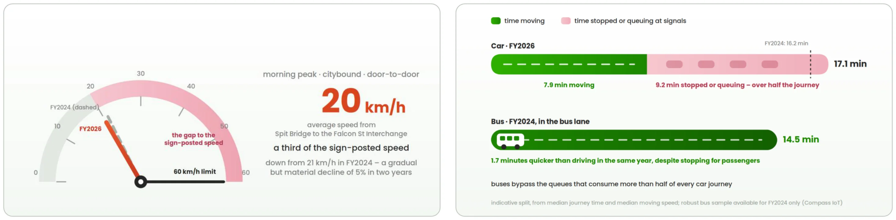

<!-- page 355 -->

### Existing Transport Network

## 3.1  Road Network Operations

Mosman Masterplan – Transport Study

#### 24

#### Other Sources

NSW Government (Beaches Link Environmental Impact Study) 2020: “The Mona Vale Road, Military Road/Spit Road and Warringah Road/Eastern Valley Way road corridors generally operate well over capacity during peak periods. This contributes to high levels of congestion, long and unreliable journey times, and, consequently, poor accessibility to and from the region […] and restricting opportunities for growth in the strategic centres”

Infrastructure Australia has acknowledged that the North Sydney– Northern Beaches corridor, including Military Road and Spit Road, experiences significant congestion and long, unreliable travel times and is ranked among the most congested corridors in Sydney.

NRMA announced that the Military Road/Spit Road corridor was voted as one of the state’s top 10 worst roads for traffic congestion, in a survey of over 28,000 participants. Transport for NSW reaches the same finding for the wider network, reporting that “incidents and disruptions can quickly impact a wide area, reducing network resilience” (Northern Beaches Network Review, 2026).

### Regional Network Resilience

The A8 corridor is one of only three major routes out of the Northern Beaches, alongside the Warringah Road and Mona Vale Road, and the only one serving Mosman and the city directly. The three are closely interdependent, as traffic displaced from any one of them has nowhere to go but the other two, and with all three operating near capacity through the peaks, none holds the reserve to absorb it. The risk is therefore not confined to the loss of a lane on the A8 itself, as a lane lost, or an incident occurring, on any of the three corridors is felt across all of them.

#### Roseville Bridge Accident, 28 July 2026

A very recent example of inadequate network resilience occurred on the morning of 28 July 2026, when a truck overturned on the southbound lanes of Roseville Bridge. Between 6:30am and 10:30am, major delays were experienced not only through Waringah Road, but throughout the entire region, with reports of queuing from the Spit Bridge as far back as Frenches Forest, as 20% of Sydney’s population scrambled to reroute their morning commute. Beyond commutes, however, these disruptions affect emergency and other essential services.

“Providing communities, customers and passengers with network alternatives makes the network more resilient”

Connecting NSW Strategy, Transport for NSW, October 2025

Recent and historical incidents have shown the region has currently has little of this resilience. A disruption on the A3, the A38 or the A8 will be felt across all three corridors, particularly if occurring during a peak period.

#### Disruption is common, not exceptional

● 338 crashes were recorded on Military Road over the Review period, the highest count of any corridor examined (Northern Beaches Network Review, 2026). ● The bridge opens to marine traffic five times each weekday, and eight times on weekends and public holidays (TfNSW Maritime opening schedule). ● Sunny weekends and public holidays result in waves of regional tourism to Balmoral Beach and other iconic attractions within Mosman. This traffic struggles to fit into a local road network not designed for this scale of demand.

### August 2026

### Attachment 1.1.3 Mosman

### Council

<!-- page 356 -->

### Existing Transport Network

## 3.1  Road Network Operations

Mosman Masterplan – Transport Study

#### 25

### Local Road Network

Constrained local access Within the Mosman LGA, signalised right-turn access onto the A8 is limited to four intersections, making each one critical to local accessibility. All experience heavy congestion, delay and excessive queuing under existing local demands: ● Cowles Road experiences long queues on both north and south approaches and has a poor crash record. ● The right-turn lane from the A8 into Military Road (High Street) regularly overflows, adding to congestion on the A8 itself. ● Awaba Street at Spit Road, experiences queues in excess of 300m, causing gridlock through multiple local roads and intersections. ● Spofforth Street and Military Road, on the border with North Sydney Council, often has overspill of queues on Military Road turning right onto Spofforth Street, impacting A8 operations.

F

Case Study – Spit Road / Awaba Street

Awaba Street receives insufficient green time at Spit Road to clear its traffic, producing heavy delays and major queuing on the local approaches: a classic challenge of arterial roads, where regional traffic is prioritised over local traffic at scale. A 2022 Bitzios study recorded queues on Awaba St exceeding 300 m, branching into multiple queues on each approach to the downstream roundabout with Moruben Rd

Awaba St (E) +300 m queue

#### F

Delay 289.7 s (~4.8 min)

Awaba St (W) 56 m

#### F

Delay 117.8 s (~2.0 min) LoS F – Worst band of intersection level of service, AM + PM peak

Figure 3-4 – Extensive AM queues on Awaba Street, extending into adjacent side roads.

Rat runs Rat-running through Mosman’s local road network has long been a challenge. The typical response, one-way treatments and turning bans, can be effective, but it comes at the cost of reduced accessibility for local users too. Awaba Street traffic (eastbound), for example, may not turn left onto Spit Road during the PM peak, a measure to prevent rat runs, but a restriction on local residents as well.

Figure 3-5 – A8 corridor crossing points, showing the limited number of right-turn opportunities.

### August 2026

### Attachment 1.1.3 Mosman

### Council

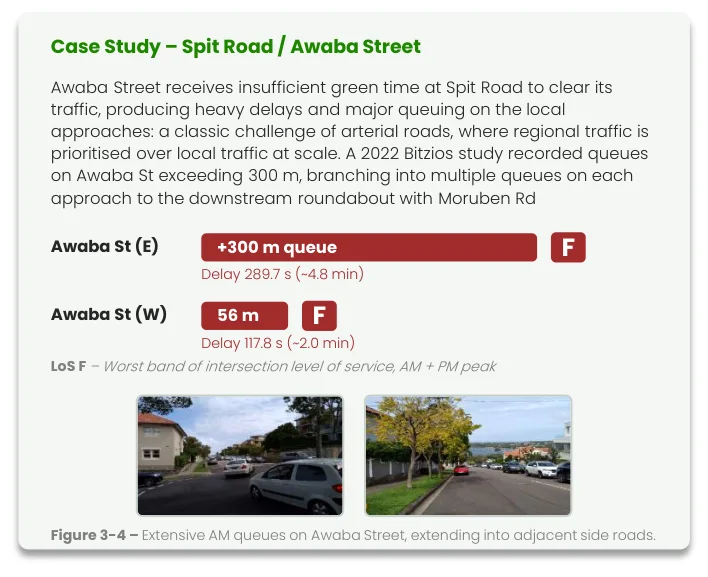

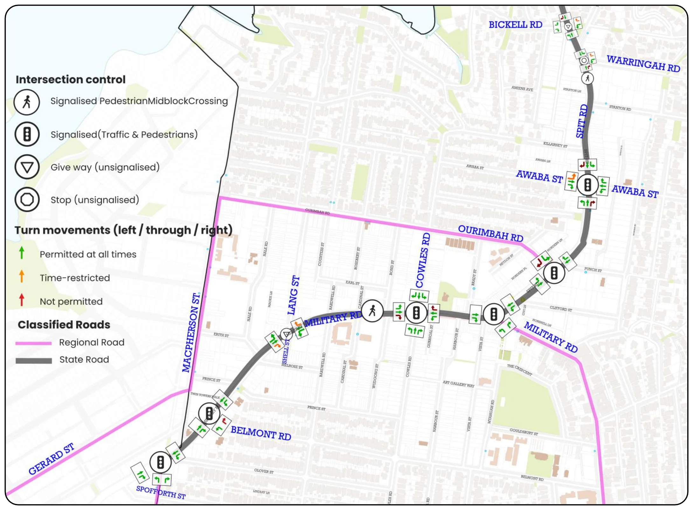

<!-- page 357 -->

### Existing Transport Network

## 3.2  Road Safety

Mosman Masterplan – Transport Study

#### 26

Road crash data for the nine-year period from 2016 to 2024, published by the NSW Centre for Road Safety, was obtained from Transport for NSW’s open data hub.

Mapped crash data for the Mosman study area shows a clear spatial concentration along the Military Road corridor and its major intersections. The kernel density surface highlights sustained clusters through Spit Junction and along Military Road between Spit Road and Avenue Road, with further concentrations extending west toward Cremorne and at the Spit Road approach to the north. These are the locations carrying the highest traffic volumes and the greatest number of conflicting movements – turning traffic, bus stops, on-street parking manoeuvres and pedestrian crossings all competing within a constrained corridor.

Pedestrian and cyclist-involved crashes are distributed along the length of the corridor rather than isolated to a single blackspot, and they cluster particularly around the retail and civic frontages where pedestrian activity is highest. This pattern reflects the dual function of Military Road and Spit Road. They serve as the area’s principal traffic arterial while simultaneously acting as Mosman’s main high street, with shops, services and community destinations fronting directly onto them. Where high-speed, high-volume through movement meets high pedestrian activity, the severity of conflict rises.

Figure 3-6 – Crash concentrations and safety focus areas, Mosman LGA

### Crash history

### August 2026

### Attachment 1.1.3 Mosman

### Council

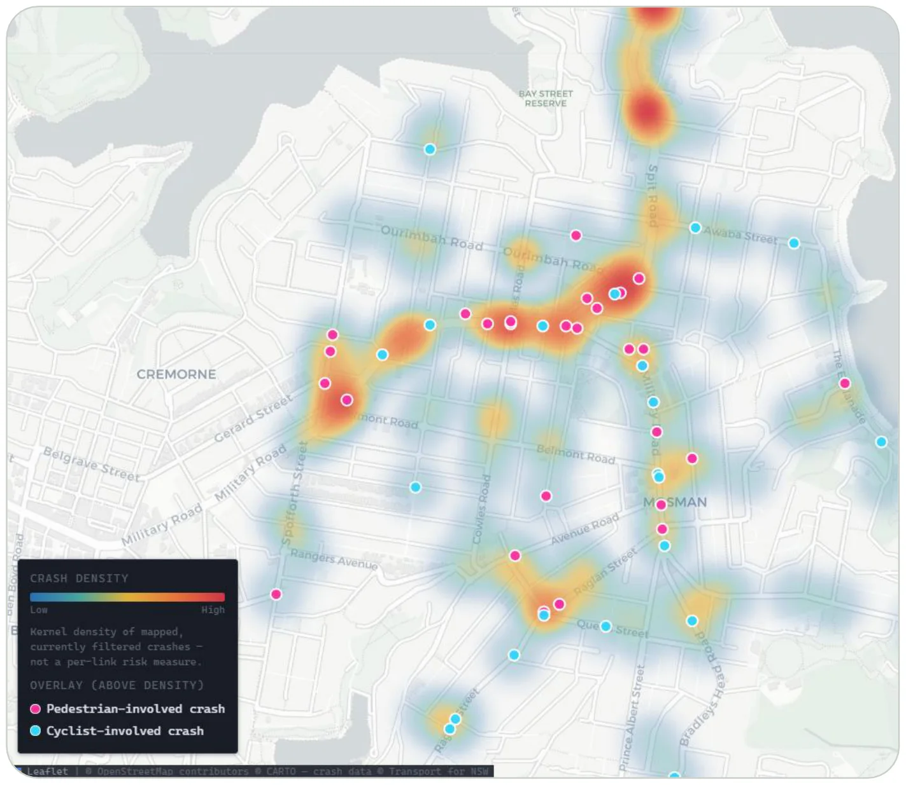

<!-- page 358 -->

### Existing Transport Network

## 3.2  Road Safety

Mosman Masterplan – Transport Study

#### 27

AusRAP (Australian Road Assessment Program) provides an independent, infrastructure-based assessment of road safety that enforces the crash analysis presented in the previous section. Using the internationally recognised iRAP methodology, roads are assessed against up to 78 design attributes per 100 m and assigned a rating from one star (least safe) to five stars (safest). Each additional star approximately halves the risk of fatal or serious injury. The dataset covers State and Regional Roads only.

#### The Military Road & Spit Road Corridor is

#### falling behind safety standards.

Within the study area, Spit Road is rated two stars in each direction – the lowest rating in the immediate Mosman network – while Military Road is rated two stars in the city-bound direction. These are the only sections along the entire A8 to receive less than a 3-star safety rating, being the minimum targeted level, and both lie within the Masterplan Area. The two-star section on Spit Road aligns closely with the crash hotspots identified in Section 3.2, reflecting its high traffic volumes, constrained cross-section and numerous conflict points.

Importantly, AusRAP ratings are intended to identify opportunities for infrastructure improvement rather than indicate whether a road is inherently "safe" or "unsafe".

### AusRAP rating

Consistent with AusRAP’s Safe System approach, the greatest safety benefits are achieved by improving lower-rated, high-volume roads. This reinforces the need for continued investment in Spit Road and Military Road through Spit Junction, where targeted measures – including safer pedestrian crossings, speed management and cycling infrastructure – would improve safety outcomes while supporting the Masterplan’s broader transport and place objectives.

Figure 3-7 – AusRAP vehicle occupant star ratings for the Mosman study area

### August 2026

### Attachment 1.1.3 Mosman

### Council

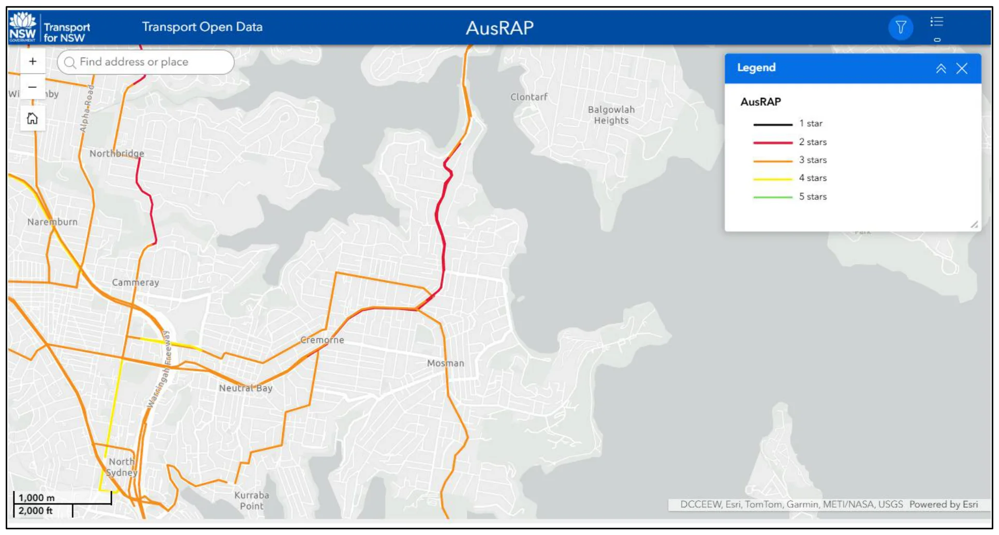

<!-- page 359 -->

### Existing Transport Network

## 3.3  Walking

Mosman Masterplan – Transport Study

#### 28

Figure 3-8 – Mosman Coastal Walk (Left), via Spit Junction

The Spit Junction Town Centre lies centrally along the LGA’s primary ridgeline, offering relatively flat, walkable access to the civic heart and to its primary retail and services along the A8 and the village-based high street along Military Road. Beyond the centre, Mosman’s natural beauty, with foreshore views throughout, iconic beaches, historical sites, leafy neighbourhoods, and numerous walking trails make it a walking destination in its own right. As such, walking is a highly valued means of local travel.

Safety, however, remains a real constraint, particularly in the Masterplan area, with a high volume of pedestrian casualties along the A8 and Military Road, amongst other non- pedestrian-related crashes. These casualties are a hard reminder of the importance of the A8 corridor’s place-based role.

A village divided

A primary constraint on the existing walking network within the town centre is accessibility over the A8 at Spit Junction. The pedestrian crossing is a two-stage crossing. The small irregular refuge island is often crowded at certain busy periods, at which point it offers limited protection. More generally, pedestrian waiting times are notable, such that the gap between the two halves of the village is measured not in metres but in minutes. This creates an unfortunate separation of the village.

School Children Safety

Direction 2 of 7 in Council’s Walking & Cycling Strategy seeks to increase the number of students and parents walking to schools. To further this directive, Council engaged Bitzios in 2024 to audit the 9 of the surrounding schools in the LGA, and prepare comprehensive recommendations for five of those. The current 5 school catchments undergoing improvements largely lie just outside the study area, but form important connections to it.

### August 2026

### Attachment 1.1.3 Mosman

### Council

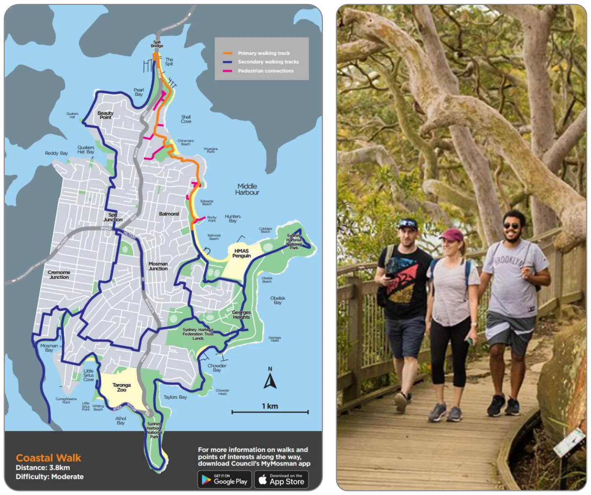

<!-- page 360 -->

### Existing Transport Network

## 3.4  Public Transport

Mosman Masterplan – Transport Study

#### 29

Public transport in Mosman is, in practical terms, a bus-based network. Around 30% of residents who travel to work use a bus for some part of their journey, and close to 90 westbound services per hour pass through Spit Junction during the morning peak, connecting the peninsula to the city, North Sydney, and the interchanges beyond. Around 60% of Mosman's residential land sits within a 400m walk of one of those services. The bus network is organised around the Military Road and Spit Road ridges, with almost all services, both trunk and local services, running via Spit Junction. The B-Line carries the high-frequency trunk role between the Northern Beaches and Wynyard, supplemented by numerous limited-stop express services, following a similar alignment to the B-Line, but each serving a small catchment within the Northern Beaches before proceeding to Mosman. Within Mosman, everyday local coverage is underpinned by regular services such as route 100 and 144, while the 230 and 111 provide local links to Mosman Bay Wharf and South Mosman Wharf respectively. Other important such as School Buses, as well as NightRider services to maintain connectivity outside typical operating hours.

Ferry services supplement the public transport network. They are an iconic form of travel within Sydney, and add real value for the households they reach. For residents within a comfortable walk of the Mosman Bay, South Mosman and Taronga wharves, the ferry offers a direct and attractive journey to the city, and in the blocks closest to those wharves it carries as much as 31% of commuters. Its role across Mosman as a whole is a smaller one, at around 5% of commuters. Notably, within these local ferry- served catchments, car use is amongst the highest rates within Mosman, reflecting the limitations of ferries as an everyday travel option.

### Overview

Figure 3-9 – Mosman Travel Heat Maps. LEFT: JTW Mode Share by Car, MIDDLE: JTW Mode Share by Ferry, RIGHT JTW Mode Share by Bus

### August 2026

### Attachment 1.1.3 Mosman

### Council

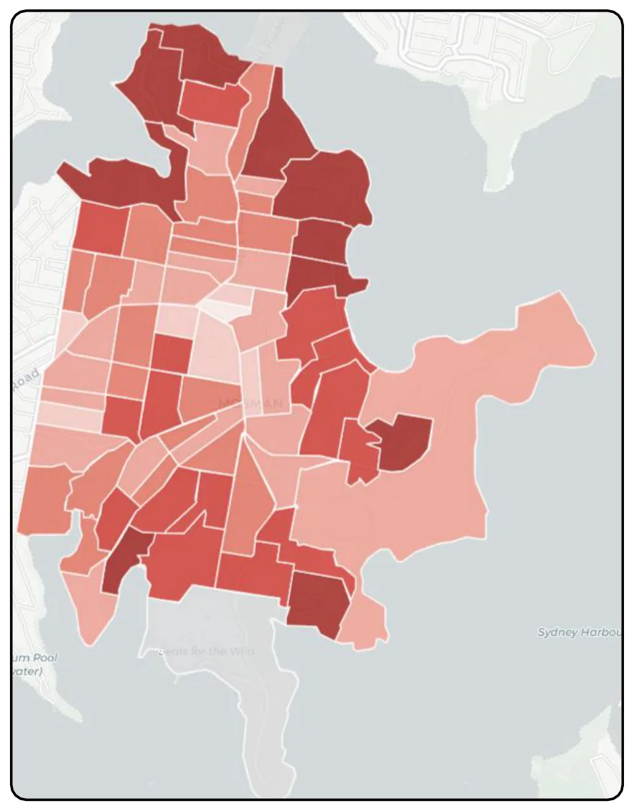

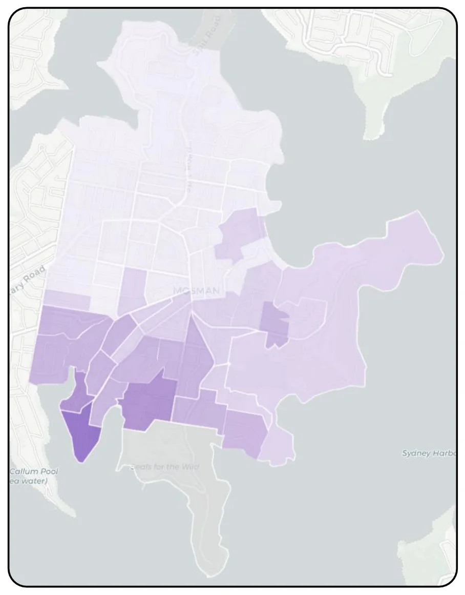

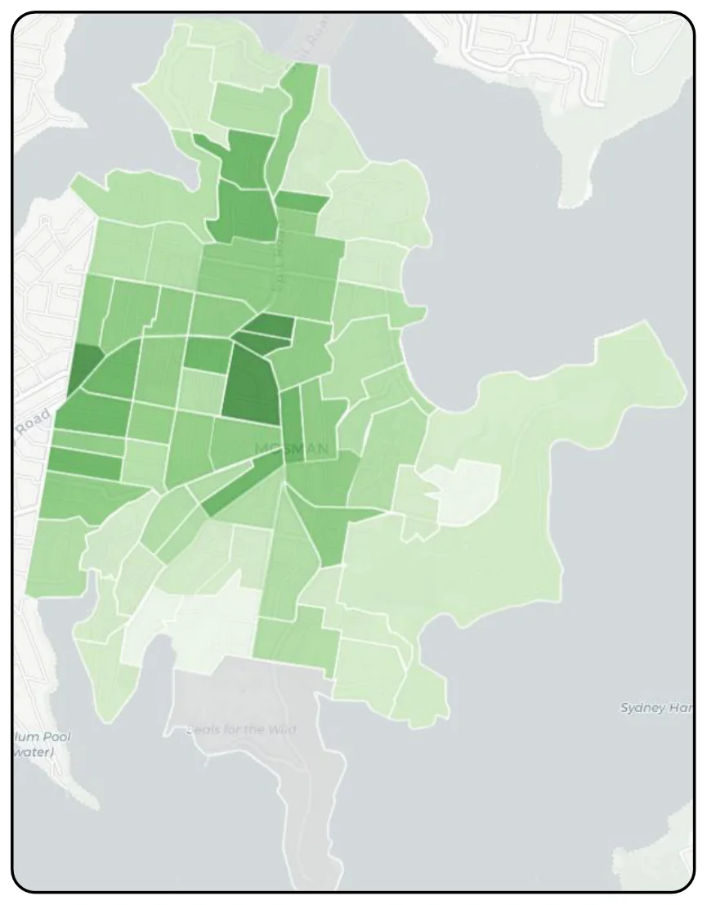

<!-- page 361 -->

### Existing Transport Network

## 3.4  Public Transport

Mosman Masterplan – Transport Study

#### 30

As identified in the previous section, buses are the primary mode of public transport in Mosman, with the vast majority of these services operating through Spit Junction; The B-Line, the regional express services, the local routes and the school buses all funnel onto the one corridor, which is what makes the network. This concentration is the network's strength, as a dense corridor catchment is far easier to serve frequently than a population spread thinly across many routes. This concentration around a single corridor also exposes the bus network to the same reliability issues experienced by regular traffic on the A8.

The study finds that buses already carry most of the people travelling towards the city along Military Road in the morning peak, despite accounting for only a small share of the vehicles on the road. Occupancy data collected across a term-time week in May 2026 records around 88 buses an hour passing through Spit Junction towards the city between 7am and 9am, carrying approximately 2,881 passengers (BOAM occupancy data), while general traffic over the same period moves roughly 1,792 people in some 1,493 cars and other vehicles. Buses therefore make up around 6% of vehicles yet carry close to 62% of people, a ratio that underlines how much of the corridor's capacity to move people rests on public transport rather than on road space itself.

### Buses

Figure 3-11 – Public transport network in Mosman (Source: SJB Urban Design Report) Figure 3-10 – Travel task of buses vs cars on Military Road (A8) in the AM Peak Period (Citybound)

Bus Car and other vehicles

e icles  er  our

uses 1,    cars and other vehicles,   %

Peo le  er  our assen ers 1,7 2 people,  8%

Citybound, weekday AM peak 07 00 to 0  00, Military Road west of Spit Junction. Bus occupancy measured from BOAM, 11 to 1  May 2026. Car occupancy assumed at 1.2.

### August 2026

### Attachment 1.1.3 Mosman

### Council

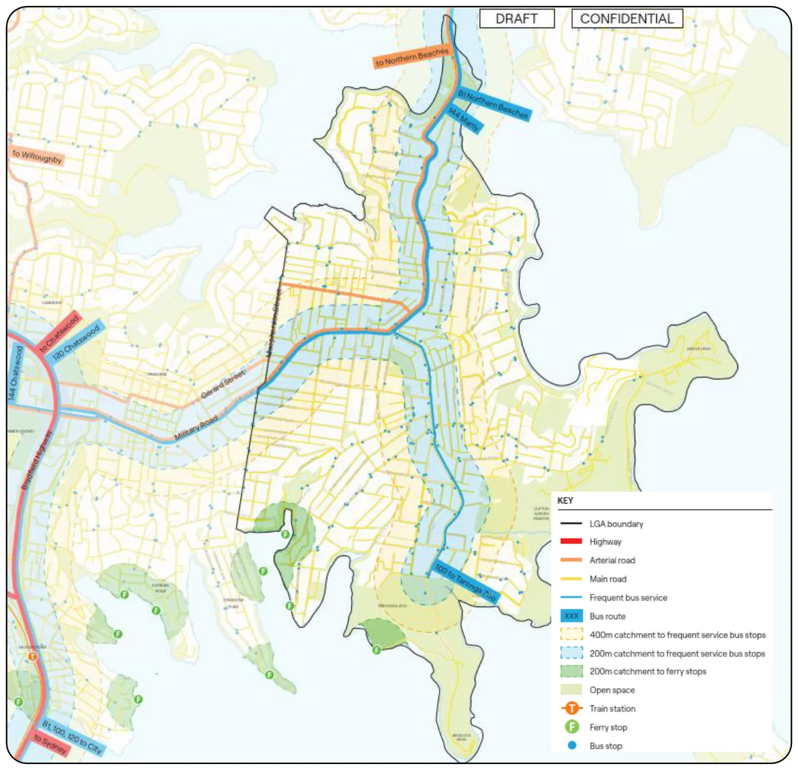

<!-- page 362 -->

### Existing Transport Network

## 3.4  Public Transport

Mosman Masterplan – Transport Study

#### 31

Data

Bus Opal Assignment Model (BOAM) data was obtained from Transport for NSW for the week of 11–15 May 2026, comprising stop-level records across 75 routes on the Mosman corridor. This was then cross-checked against published timetable data for the same period (GTFS). Each record captures a service arriving at a stop – route and direction, stop sequence and suburb, scheduled versus actual arrival time, vehicle type and capacity, and passenger occupancy.

The corridor fleet comprises Articulated buses (~115 places), Double Deck buses operating the B-Line (~100 places), and Two Door City Buses (~64 places). Analysis focused on weekday inbound services between 7 and 9am to align with previous traffic assessments in this study. Notwithstanding, PM peaks were observed to have similar if not worse operating conditions.

The B-Line

The B-Line service underpins the entire regional public transport network, carrying the single largest proportion of passengers through the A8, as well as providing consistent coverage throughout the day. In the AM peak, median loading rises progressively along the route, often hitting capacity well before arriving in Mosman. Local user reports in Brookvale cite frequent and extensive queuing sometimes around the block, and waiting multiple services to board.

By Mosman, about half of the services are between 80-100% capacity, and 4% are actually over the technical seated and standing capacity. This figure is quite possibly even higher, noting that BOAM data does not show buses that did not stop, which would most likely be those that are already too full.

This suggests that the B-Line is not keeping up with the scale of demand within the Northern Beaches area, which relies most heavily on the B-Line service.

### Bus operations

Figure 3-13 – How full the B-Line gets towards the city (AM peak)

Figure 3-12 – Hourly Bus Volumes passing through Spit Junction

### August 2026

### Attachment 1.1.3 Mosman

### Council

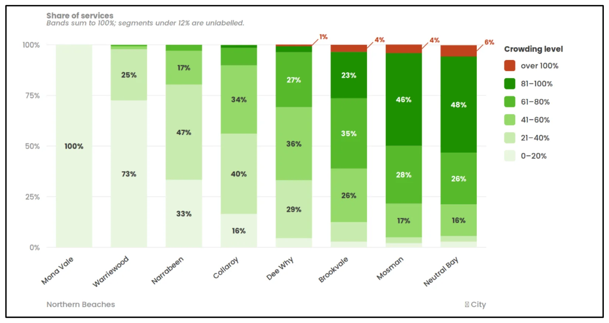

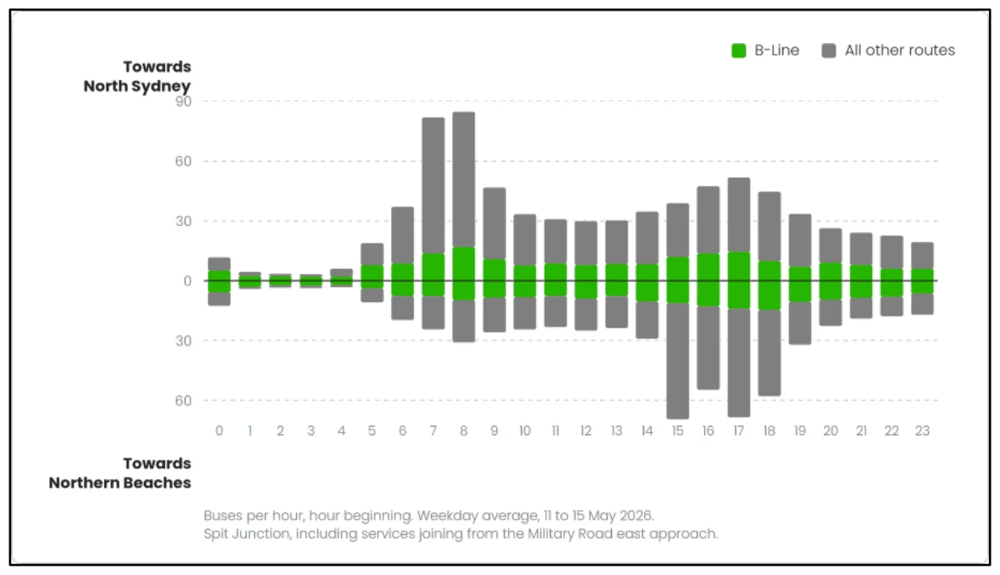

<!-- page 363 -->

### Existing Transport Network

## 3.4  Public Transport

Mosman Masterplan – Transport Study

#### 32

Why are the other services at such low capacity?

Every other city-bound route through Spit Junction generally operates within capacity, as demonstrated in Figure 3.14. This is achieved through intentional capacity management techniques, whereby each limited stop service through the Northern Beaches only covers a small segment of the Northern Beaches before skipping the remainder and proceeding to Mosman. This is an important technique in ensuring that buses don’t all fill up immediately, with no ability to serve downstream areas like Mosman.

Importantly, however, this free bus capacity should not be misinterpreted as plenty of room to grow - it is artificially created by restricting the number of stops upstream in the Northern Beaches. The real scale of that upstream demand is only clear when looking at the B-line capacity, which is regularly exceeded. If B- line service levels cannot be maintained for the large and growing Northern Beaches Population, the impacts could be significant.

Delays & Cancellations Crowding is only half the corridor’s problem. Because buses share road space with general traffic, they inherit the same congestion, and delays and cancellations are therefore common.

Moreover, Figure 3.15 shows how delays are common along Military Road and Spit Road, with median delays sitting around the 5-minute late threshold in the AM peak and well beyond in the PM peak. 85th percentile delays exceed 10 minutes in both windows.

Comparing BOAM data against GTFS scheduled stops suggests that up to 10% of services were effectively cancelled over the course of a typical weekday.

Critically, this is not a function of passenger loading. Local routes carrying a fraction of the B-Line’s demand – such as the 172X, which never exceeds 61–80% capacity – experience comparable or greater delay through the same corridor, running four to six minutes behind schedule across most of their route. Delay on this network is driven largely by road congestion, not by how full the buses are.

### Bus operations

Figure 3-14 – How full the other city bound services get (AM peak)

Figure 3-15 –Median Delay (mins) by Stop in the AM Peak (Left) and PM Peak (Right)

### August 2026

### Attachment 1.1.3 Mosman

### Council

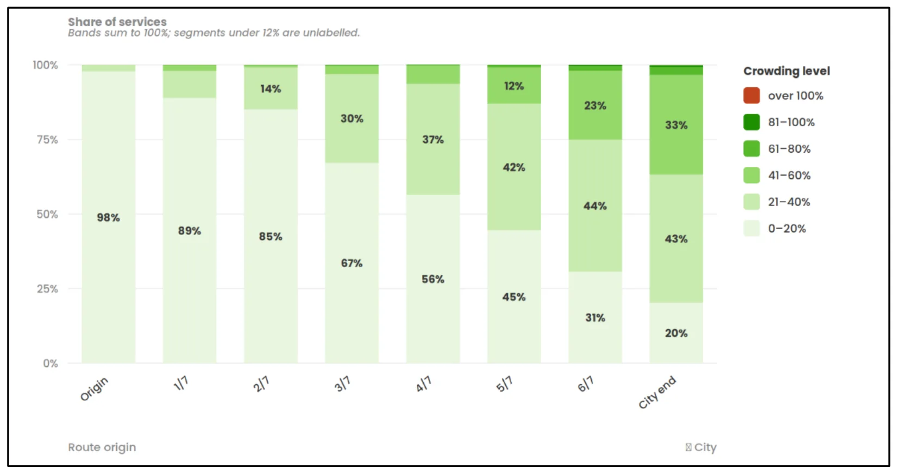

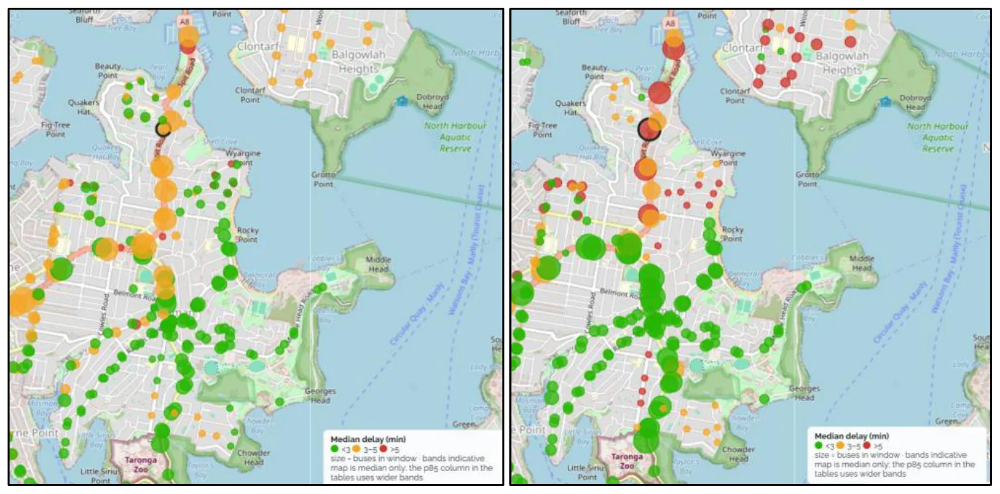

<!-- page 364 -->

### Existing Transport Network

## 3.5  Cycling

Mosman Masterplan – Transport Study

#### 33

Mosman has an established local cycling network linking the town centre, harbour foreshore parks and surrounding residential streets, yet most of it comprises on-road routes shared with general traffic. TfNSW research indicates that around 48% of potential riders would cycle but do not feel safe doing so, with mixed traffic a significant contributor to that perception. Uptake of cycling in Mosman reflects this road-based network. The 2016 Journey to Work census recorded a 0.9 per cent cycling mode share, and the 202 /2  Household Travel Survey places the broader “other” mode group at just 1.9 per cent of all trips, despite Mosman sitting within comfortable cycling distance of North Sydney, St Leonards and numerous local centres.

#### Existing constraints

#### Missing regional route no suitable regional cycling connection to

neighbouring LGAs, a major impediment to meaningful mode shift.

#### Lack of separated facilities reliance on on-road mixed-traffic routes,

particularly around schools and busier local roads, while new facilities must also manage pedestrian amenity, parking, street trees and bus stops.

#### Topography steep grades toward the foreshore and outer neighbourhoods.

#### Cycling networks are an ongoing process

The Mosman Walking and Cycling Strategy 2023–2028 sets out Council’s five- year program for the network; a 2026 Bike Plan Audit by SCT augments the strategy against present-day conditions. This Masterplan now creates once- in-a-generation opportunities for further, transformative contributions, discussed in Section 4.

Figure 3-16 – Mosman bicycle network

### August 2026

### Attachment 1.1.3 Mosman

### Council

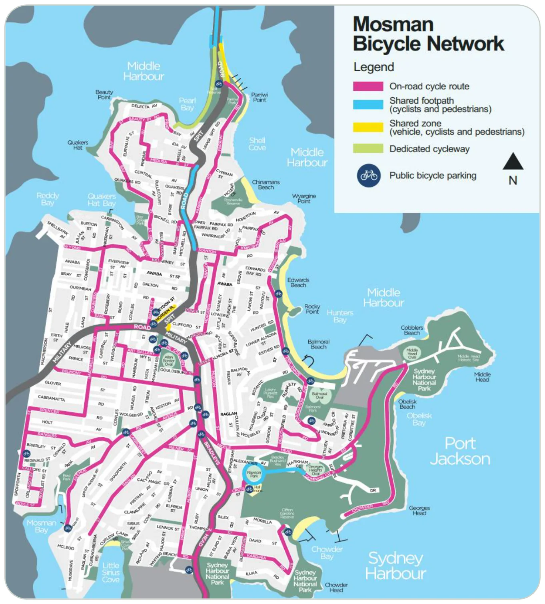

<!-- page 365 -->

### Existing Transport Network

## 3.6  Parking

Mosman Masterplan – Transport Study

#### 34

The Study Area, along with the wider Mosman Centre along Military Road (High Street), comprises seven public car parks with a combined capacity of 750 spaces. This supply is augmented with on-street parking, of which, 450 on-street spaces have been connected to Mosman’s Smart Parking network, highlighted in the bottom left figure. Both off-street and on-street parking within the town centre is subject to a range of time restrictions, ranging anywhere from 5 minutes to 3 hours. These restrictions are just one parking management tool available to Council to encourage turnover rates based on specific local requirements. Council also provides a range of user-specific parking, including accessible parking, loading zones and EV-charging bays. Based on historical parking data derived from Mosman’s smart parking network, the town centre’s parking supply often exceeds 8 % capacity, which is typically treated as ‘’effective capacity’ due to the challenges associated with users locating the final remaining spaces. Parking has been a long-standing issue amongst the Mosman community.

## 90-93% peak weekday parking occupancy.

## 83-85% peak weekend parking occupancy.

Figure 3-17 – (TOP) Mosman’s RPS Permit Map. (BOTTOM LEFT) Example of live sensor-connected parking network through the TfNSW Park’n’Pay App. (Bottom Right) Map of Mosman’s Public Car Parks within the retail area.

#### Council’s ‘Smart’ Parkin  Mana ement of a finite  arkin  su  ly.

Smart Parking Sensor Technology Council was an early adopter of smart parking-sensor technology, now rolled out across all town-centre public car parks and most on-street areas around the village. The sensors help inform parking strategy and enforcement, and deliver valuable real-time information to the public through nominated apps and on-street LED displays. The overstay graph to the right shows a clear and consistent decline in parking overstays within the connected parking network, showing how effective this technology can be in parking management – a declining trend indicates that people are respecting the time limits, enabling turn over to occur as intended to ensure parking is balanced for everyone.

Resident Parking Schemes (RPS) are another management tool to help balance the needs of residents and visitors within a fixed parking supply. Currently, the RPS scheme covers much of the southern sections of the Masterplan area, but has limited coverage within the northern precincts. Whilst these RPS schemes can help to a degree, they have their limitations: • Parking demands will continue to rise against a fixed parking supply • RPS schemes displace demand rather than entirely remove it. Displaced parking often ends up in the next street, creating pressure for ongoing iterative expansions of the RPS zone. • RPS schemes require considerable resources to manage, monitor and enforce, and can often be divisive amongst the community with respect to who is entitled to permits.

### August 2026

### Attachment 1.1.3 Mosman

### Council

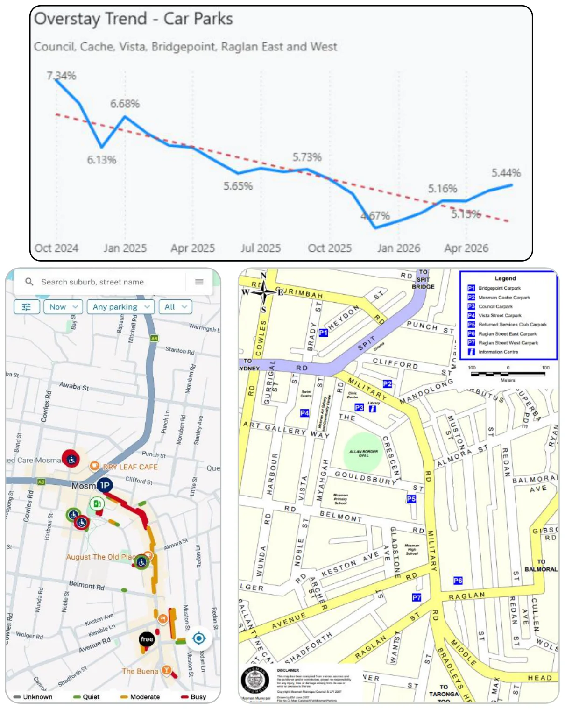

<!-- page 366 -->

### Existing Transport Network

## 3.7  Freight & Servicing

Mosman Masterplan – Transport Study

#### 35

Figure 3-18 – NHVR Oversize Overmass (OSOM) Network Permissions Map, Spit Junction

A8 corridor – the sole regional freight corridor

Military Road/Spit Road form part of the A8, one of only three connections between the Northern Beaches and the rest of Sydney. Most heavy vehicles are passing through, rather than servicing Spit Junction.

Retail strip through to Mosman Junction

Military Road’s shopfronts continue largely unbroken from Spit Junction through to Mosman Junction, each frontage generating small-scale kerbside deliveries and waste collection, alongside flexible kerbside use, supermarket rear docks, and kerb-reliant servicing for developments without off-street facilities. For the most part, this servicing occurs via rear service lanes, separated from the general public; however, in many cases, full separation is not feasible, such as along Hordern Lane (shared zone), Raglan Street Car Park and Civic Lane.

Nearby generators, not town-centre generators

HMAS Penguin is a Royal Australian Navy (RAN) training base located at the termination of Middle Head Road. Taronga Zoo is NSW’s most iconic zoo, located at the end of Bradleys Head Road. These are unique sites, and occasionally require oversize, overmass (OSOM) service access via unique vehicles. This is typically managed through the NHVR for non-approved heavy vehicles. These vehicles pass through the study area, and as such, must be considered as part of transport planning for the future road network.

#### Servicing patterns are shifting

E-commerce, quick-commerce grocery and gig-delivery platforms are adding frequent small-drop trips by small trucks, vans, e-bike and cargo bike alongside traditional trucks. TfNSW freight guidance anticipates for growing bicycle-courier capacity, more evening deliveries, and a longer-term shift toward parcel lockers.

### August 2026

### Attachment 1.1.3 Mosman

### Council

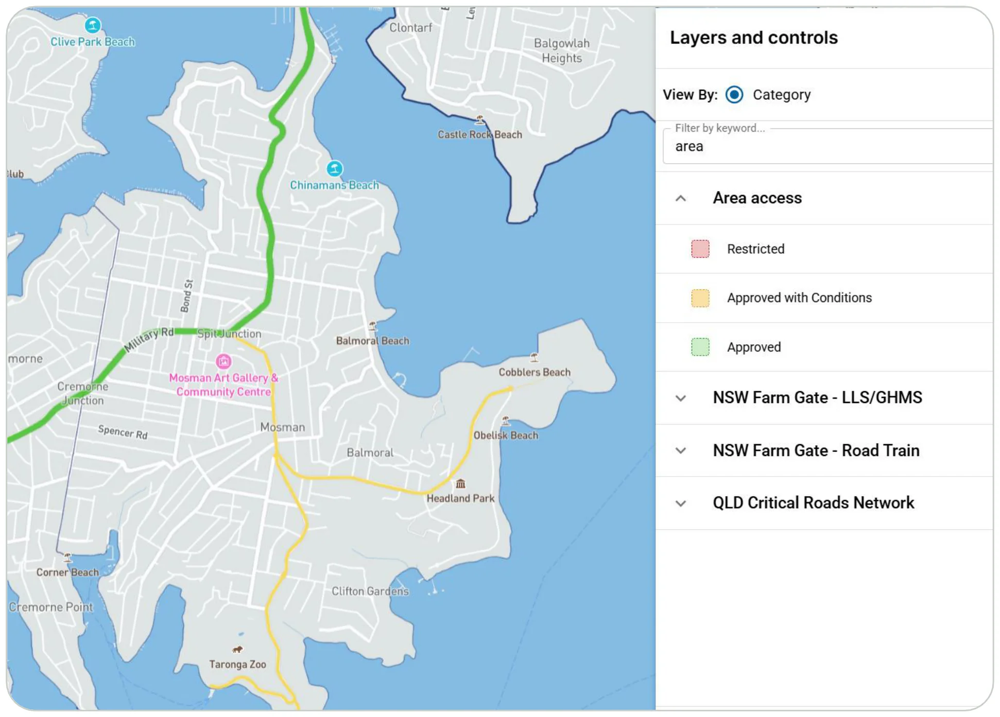

<!-- page 367 -->

#### C H A P T E R F O U R

## 4

## Future Transport Network

Challenges and opportunities – the scale of growth ahead, what it means for the network, and how the Masterplan responds across each mode.

#### 4.1 Regional Growth

#### 4.2 Future Travel Demands

#### 4.3 Future Challenges

#### 4.4 Future Road Network

#### 4.5 Future Public Transport

#### 4.6 Future Walking Network

#### 4.7 Future Cycling Network

#### 4.8 Future Parking Conditions

#### 4.9 Future Freight & Servicing

#### 4.10 Future Travel Demand Management

Mosman Masterplan – Transport Study

#### 36

### August 2026

### Attachment 1.1.3 Mosman

### Council

<!-- page 368 -->

### Future Transport Network

## 4.1  Regional Growth

Mosman Masterplan – Transport Study

#### 37

### Housing growth forecasts across neighbouring LGAs

The scale of housing growth anticipated across the lower north shore reshapes the transport task the Masterplan must respond to. Mosman, whilst having a current housing target of 500 new dwellings by 2029 under their Local Housing Strategy (LHS), could see a total of 4,700 new dwellings developed under the LMR provisions. North Sydney’s LHS adopts a current target of  , 00 new dwellings by 202 , with the 20 6 figure under review and due to be announced soon (not all of which will occur within Cremorne and Neutral Bay). The Northern Beaches LHS outlines a target of 11,900 new dwellings by 2036. Collectively, these figures point to a regional growth of over 20,000 new homes. The LMR is not a housing target, but rather an instrument to deliver housing, and as such, there is no fixed timeframe over which LMR-based growth will occur. For the purpose of this study, a 10-year timeframe has been adopted to align with the Northern Beaches LHS target, being the most significant regional driver.

The distribution of this growth is materially uneven in proportional terms. The 4,700 additional homes permitted in Mosman under the Low and Mid-Rise Housing Policy would represent a   % increase on the municipality’s existing dwelling base, proportionally more than triple the 11% growth identified for the Northern Beaches under its Local Housing Strategy.

Figure 4-1 – Existing dwellings and projected growth, Mosman, North Sydney and Northern Beaches

### August 2026

### Attachment 1.1.3 Mosman

### Council

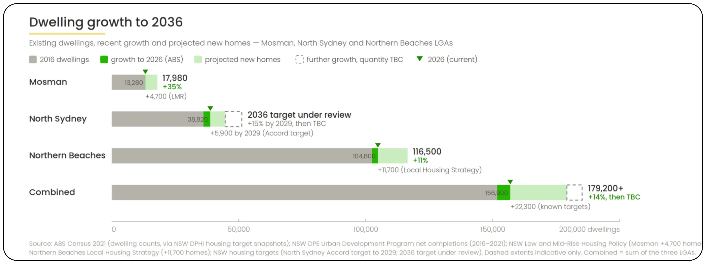

<!-- page 369 -->

### Future Transport Network

## 4.2 Future Travel Demands

Mosman Masterplan – Transport Study

#### 38

### Vehicle trips

Mosman is expected to deliver approximately 4,700 new dwellings and the Northern Beaches a further 11,700, excluding growth in the Neutral Bay and Cremorne LMRs. The additional associated car trips from this population uplift have been estimated at a high level using a combination of trip generation rates from the GTIA and JTW data for travel mode and place of work. The worked example is for the weekday AM peak hour, in the citybound direction only – a core constraint of the transport network. A rate of 0.24 vehicle trips per dwelling is adopted for both precincts, slightly above the GTIA Sydney average of 0.19 for high-density development in highly public transport accessible locations, recognising that those GTIA sites were typically located closer to major transport hubs with rail, bus and sometimes light rail. Of the trips generated, 80% are taken to be outbound, being a common industry benchmark. Census journey to work data anchors the remaining factors: ~70% of Mosman trips are assumed to travel beyond the LGA based on place-of-work data, of which 90% would likely head city-bound through the corridor; for the Northern Beaches, census data indicates that 55% travel beyond the LGA, of which 50% are estimated to head city bound via Mosman, slightly weighted on the basis that growth is likely to focus around the southern centres of the Northern Beaches, predisposing trips towards the A8.

The resulting demand of these two LGAs is approximately 1,060 additional city-bound trips in the AM peak hour. Based on TfNSW traffic count data, approximately 30% of this traffic then routes via Ourimbah Road, a classified regional route.

#### Limitations

These figures are a high-level estimate and reflect an unconstrained demand, in which car mode share remains constant and trips continue to occur at the preferred time and on the preferred route. In practice, travel behaviours are fluid, responding to environmental and social changes. The A8 is not an unconstrained environment: Spit Road and Military Road already experience significant congestion and delays – these trip figures therefore may never eventuate, simply because there is not enough capacity within the network to accommodate them.

Figure 4-2 – Estimated additional Citybound trips per hour during AM peak hour by 2036

#### Northern Beaches – 11,700 new dwellings

× 0.24 vehicle trips per dwelling × 80% outbound × 55% leaving the LGA × 50% city bound via Mosman

### 618 trips per hour, crossing the Spit

#### Mosman precinct – 4,700 new dwellings

× 0.24 vehicle trips per dwelling × 80% outbound × 70% leaving the LGA × 70% city bound

### 442 trips per hour

### +1,060 trips per hour

new city bound trips · AM peak hour · 2036

Military Road – 70%

### +742 trips/hr

Ourimbah Road – 30%

### +318 trips/hr

Figure 4-3 – Estimated additional city bound vehicle trips, AM peak hour, 2036

### August 2026

### Attachment 1.1.3 Mosman

### Council

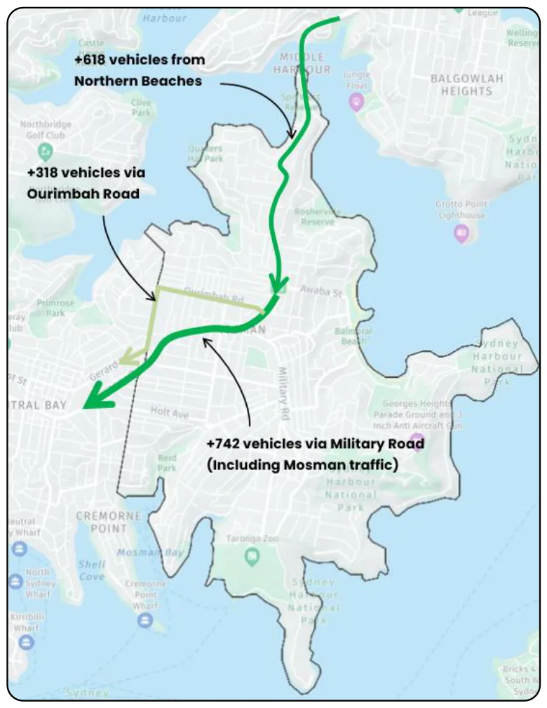

<!-- page 370 -->

### Future Transport Network

Mosman Masterplan – Transport Study

#### 39

Figure 4-4 – Extract from TfNSW’s Road User Space Allocation Policy (RUSA)

## 4.2 Future Travel Demands

#### Walking

Walking already carries a high share of everyday travel in Mosman, with around 25% of non- commute trips made on foot. This reflects a compact town centre, a fine-grain mix of retail and community uses, and a street network that makes short local trips practical and attractive. Sustaining that pattern as the population grows depends on the conditions that produce it. The Masterplan embeds these requirements through planning for new retail, community facilities and open space, aligned with housing on the corridor. It also considerably improves walkability by increasing permeability through numerous new through-site links. These are features that the LMR is unable to deliver

#### Cycling

Rising congestion on the A8 creates the conditions for a significant shift toward cycling for shorter trips, as car journey times lengthen and become less reliable. Mosman lies within the comfortable cycling catchment of North Sydney, the CBD and St Leonards, all being strategic destinations.

That potential cannot be realised without a safe and continuous means of making the trip, which the regional cycling route proposed in the Masterplan establishes, connecting the town centre with surrounding neighbourhoods and the wider cycling network.

## +720 bus users per hour (citybound)

around 7 additional full B-Line buses, at 100 spaces per bus, with current services reasonably assumed to run at capacity

#### Ferry

Ferry commuting from both precincts is concentrated in the small number of areas with direct wharf access, with JTW data indicating that ferry mode share (for commuting) falls away sharply beyond walking distance of a wharf. Neither the LMR nor the Masterplan places significant growth within these walking catchments, and neither is therefore expected to deliver a material increase in ferry patronage without improved access to the wharves.

#### Road user hierarchy

The corridor cannot grow its way out of constraint, so how its limited space is allocated must reflect deliberate priorities. TfNSW’s Road User Space Allocation Policy sets a consistent order of consideration for network planning: road function is first established, then road user needs are considered, starting with walking first, then cycling, public transport, freight and servicing, and private vehicles.

#### Bus patronage

Additional bus demand was estimated using the GTIA AM peak hour person trip rate of 0.66 trips per dwelling for the same land use category, giving approximately 3,100 person trips from Mosman and 7,700 from the Northern Beaches. Applying the same 80% outbound assumption, together with bus mode shares of 29% for Mosman and 15.6% for the Northern Beaches (2016 Census Journey to Work) and the city- bound proportions adopted for vehicle trips, the uplift is estimated to generate approximately 720 additional city bound bus passengers in the AM peak hour.

The JTW mode shares predate the B-Line service, and as such, this estimate is likely conservative.

### August 2026

### Attachment 1.1.3 Mosman

### Council

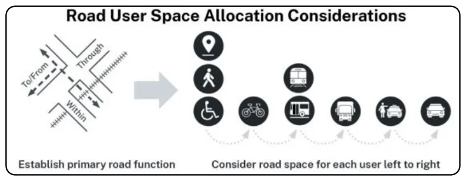

<!-- page 371 -->

### Future Transport Network

## 4.3  Future Challenges

Mosman Masterplan – Transport Study

#### 40

### Population growth in a constrained and unreliable network

Population growth presents the most fundamental transport challenge facing this region, comprising Mosman, the Northern Beaches and the town centres of Cremorne and Neutral Bay. These LGAs are heavily reliant on the A8 for access to the wider Sydney region. With no realistic alternative routes for most future residents and no major infrastructure planned to redirect traffic, this growth must be managed within a transport network already under strain. The A8 experiences high congestion and frequent delays, as do other key regional routes, including Warringah Road and Mona Vale Road. Any planned or unplanned disruption on any of these transport corridors, whether it is the scheduled Spit Bridge openings, road works or crashes/breakdowns has major ramifications on the entire region, which at approximately 20% of Sydney’s population, carries damaging social and economic consequences. In 2018, Council engaged Cardno to undertake a transport modelling analysis of the Spit Junction Town Centre looking at potential future growth options. The model focused on Mosman-based growth, and highlighted that by Scenario 2, 2027 (760 additional peak-hour trips through Mosman), the road network would be in a phase of exponential worsening of both queues and delays. Scenario 3 introduced approximately 1,300 vph locally. Importantly, neither Scenario could have accounted for the post-announced housing targets of the Northern Beaches, which considerably exceed historical growth rates. For comparison, this study estimates that there may be in the order of 1,060 additional vehicles per hour based on current housing forecasts, falling within the modelled range of the Cardno Study.

The Cardno Study caveats the modelled impacts as being so significant that, in reality, people would either 're-mode', 're-route' or 're-time' their trips before actually accepting these predicted travel times.

Looking forward to 2026, traffic conditions seem to largely align with Cardno’s caveat – whilst congestion on the A8 and local road network is significant and appears to be gradually worsening, it does not yet appear to be in the exponential decline phase forecasted by the model. This can be largely attributed to the fact that the forecasted growth never occurred (Section 4.1), as well as some demand relief in the form of WFH and B-line uptake. Nonetheless, another important contributing factor would be the natural responses, or the self-regulating travel behaviours among the population, that the Cardno study alluded to. Some of these reactions are desirable - transformative changes in work-from-home (WFH) culture since COVID, re-moding to active/public transport with significant uptake of the B1, re-directing more trips to local services/employment. There are many common responses that are undesirable, however - increased rat-running, peak spreading (better than peak congestion but still undesirable), suppressed activity, or, in the worst case, relocation of homes/businesses or discouraging new residents and businesses. It is possible, if not likely, that all of the above are already occurring to some degree at this moment, influenced by network congestion.

“All results for Scenario 2 and especially Scenario show an unrealistic performance of the traffic network (e.g. delays that wouldn’t be tolerated by drivers) due to insufficient capacity to accommodate the traffic demands”

2018 Cardno Study

Notwithstanding, the extent to which a population can resolve, or rather mask, transport network constraints through self-regulation has its limits; not everyone can WFH, or re-time/re-mode their trips; most people would not be comfortable cycling on roadways; bus overcrowding and delays suggest that the public transport system, whilst already a major mitigator of congestion, still requires significant improvement. Should any sizable percentage of projected 2035 housing growth be realised, and the population reaches its limit of reactively adapting to congestion, the ‘unrealistic’ queues and delays identified in Cardno Study may become much more realistic. There are ample examples around the globe where such ceilings were reached, inadequate relief outlets were available, and unrealistic congestion has become the norm, at great societal cost. To address this challenge, transformative change in the existing transport network and travel behaviours is needed. Solutions must be explored across all facets of transport management, including infrastructure, planning, services, education and technology. These solutions will require effective and on-going engagement and collaboration with all responsible stakeholders, including the NSW State Government, neighbouring Councils, and the local community of Mosman. This Masterplan is a major step towards addressing this challenge, and whilst it is not a solution on its own, it is undoubtedly a once-in-a-generation opportunity to explore the facets of transport management that do fall within the means of Council to deliver meaningful change. Ultimately, however, the scale of action necessary to maintain a functioning transport network must come from the State Government, which is responsible for the management of the state road network, essential public transport services and strategic planning.

### August 2026

### Attachment 1.1.3 Mosman

### Council

<!-- page 372 -->

### Future Transport Network

## 4.3  Future Challenges

Mosman Masterplan – Transport Study

#### 41

### Other Challenges

Timing

The LMR was fully legislated in early 2025. Since then, Mosman Council has received a consistent stream of LMR-based Development Applications, combined with a number of Housing Delivery Authority (HDA) State Significant Development (SSD) Applications which collectively are resulting in an unprecedented scale and volume of development in Mosman. Whilst the forecasted population growth will not occur overnight, the uplift is now in motion.

Housing growth has a head start.

A key challenge in responding to and accommodating this growth is timing.

In recognition of the urgency of this challenge, Mosman Council has proactively developed this Masterplan on an expedited timeframe. Other essential planning instruments such as the DCP will follow shortly thereafter. Should the Masterplan be approved in a reasonable timeframe, it will be a major step on the planning side towards reorienting subsequent development along the primary transport corridor of the A8.

Whilst planning and travel demand management will play an important role, however, the scale of intervention must be commensurate to the scale of population growth. Ultimately, major state-delivered projects for transport infrastructure and services are considered crucial in addressing future transport demands. This was recognised during the planning of the withdrawn Beaches Link project. Delivery of major projects, however, involves extensive timeframes. With no alternative options currently under consideration, delivering such interventions within or around the 10-year population growth targets will be a significant challenge for the State Government, yet it will directly influence the success or failure of achieving the regional housing targets.

Movement & Place divergence

The demands of both Movement and Place will continue to rise together: growth forecasts suggest an additional 1,060 vehicles and 720 bus users may rely on the A8 in peak periods (in peak direction alone), while local growth intensifies demand for the corridor’s place function at Spit Junction, where pedestrian safety already performs poorly on public crash records. The Beaches Link, the one tangible option to materially ease the Movement burden, has been discontinued.

Public Transport

The bus services that Mosman and surrounding LGAs rely upon so heavily are also limited to A8 travel, and are therefore sensitive to the same congestion issues as regular traffic.

Despite the major service improvements such as the B-Line introduction and strategically located indented bus bays and AM bus lanes, these services frequently experience delays and cancellations. BOAM data indicates that many B-Line buses are already operating at full capacity (some over capacity) during peak commuter periods. Local user reports consistently highlight queues in the northern beaches extending around the block, and waiting multiple services before boarding. The consequences of poor bus performance cannot be understated. The current operations of the A8 would be considerably worse had bus uptake not been so pronounced. It is crucial, therefore, to ensure a minimum level of service is maintained for bus users to avoid a reversal of travel mode share back to vehicles.

Other identified challenges relating to public transport are listed below:

● The B-Line northbound bus stop at Spit Junction is located on a narrow section of footpath outside shop frontages. Overcrowding could result in safety concerns for waiting patrons, and access issues for adjacent businesses and through-movements.

● Bus stop infrastructure, including signposts, occupy a considerable portion of the footpath, creating design challenges for incorporating new shared path cycleways.

● Increased bus priority will likely have detrimental impacts to local road delays as a result of reduced ‘green’ signal time. Furthermore, on-street parking along the A8 may be subject to further restrictions, or even removal, as transport demands continue to grow.

Figure 4-5 – Heavy regional traffic demands intersect with heavy pedestrian demands at Spit Junction (Source: Google Streetview)

### August 2026

### Attachment 1.1.3 Mosman

### Council

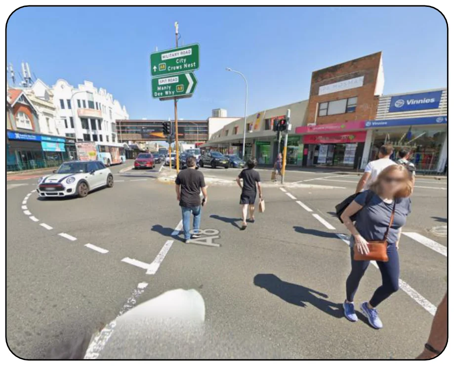

<!-- page 373 -->

### Future Transport Network

## 4.4  Future Road Network

Mosman Masterplan – Transport Study

#### 42

### Foreword

No new transport modelling has been undertaken for this Study.

The constraints of the regional transport network are already well evidenced – in the daily lived experience of residents and commuters, in observed network performance and travel-time data, through former transport models, and in the repeated acknowledgement by both State and local government that the A8 operates at or near capacity with poor reliability. Where a corridor is already at its limits, the effect of additional traffic is not in question: it can only deepen delay and further erode reliability.

It was demonstrated in the 2018 Cardno Study of Spit Junction, as discussed in this section.

It was demonstrated in the Traffic & Transport Study for the Beaches Link EIS (Appendix F, 2020): "...a substantial degradation in traffic performance through the [Balgowlah] area, consistent with a substantial increase in traffic demand without additional infrastructure to provide additional network capacity that would facilitate traffic growth”

It is evident in crash events, which bring the region to a standstill.

The future outlook of the performance and reliability of the A8 corridor is not positive, irrespective of how it may be quantified through further modelling. The future travel demands are already established through the LMR, for which no modelling was undertaken either. What is most important now for the network's future performance is the actions that Local and State Governments will take to manage the impacts of this growth.

At the Local Government level, the Masterplan represents a major and ambitious step towards this process - it aims to reorient the growth already permitted under the Low and Mid-Rise (LMR) reforms. Through this reorientation and other key deliverables, the Masterplan is capable of achieving substantial reductions in car-reliance over the current LMR model. This is demonstrated throughout the subsequent sections of this study.

To appropriately address the scale of this future growth, however, action at the State Government level will be essential across all layers:  State infrastructure, State-managed services (buses) and strategic planning. All former studies point to the same conclusion – the network cannot cope under a ‘do nothing’ scenario, and the subsequent consequence would be regionally damaging.

### August 2026

### Attachment 1.1.3 Mosman

### Council

<!-- page 374 -->

### Future Transport Network

## 4.4  Future Road Network

Mosman Masterplan – Transport Study

#### 43

### Military Road & Spit Road (A8) Corridor – Future performance

The 2018 Cardno Study modelled traffic through Spit Junction along the A8, Military Road and other local side roads, under a base growth scenario, a moderate growth (+750 vph) and a high growth (+1,300 vph) scenario. Given that the A8 is now forecasted to experience in the order of 1,060 vph (Section 4.2), this falls directly within the study’s model range, which predicts major failings of the road network under these levels of trip growth.

Under Scenario 2, travel time for the 500m A8 segment between Ourimbah Road and Wudgong Street could double from 5.5 to 11 minutes in the PM peak. Actual delays would be much greater, given that the model was unable to distribute a significant proportion of the projected trips into the system within the allotted time frame due to slow/gridlock conditions. Those unreleased vehicles were queuing up downstream, ‘outside’ the model – in reality, the queueing would continue to extend along the A8, suggesting cumulative delays along the full corridor would be significant.

The figures to the right show the worsening AM peak queueing conditions (queues circled red), from Scenario 1 at the top, down to Scenario 3 at the bottom, where the network reaches a gridlock condition.

#### The graph at the bottom shows how, with each growth scenario, the proportion of unreleased vehicles

that can’t even enter the model within the timeframe notably worsens– this trend hints at the exponential nature of the impacts of increasing growth beyond this point. The A, B and C sub-scenarios in the adjacent graph reflect the existing road network as of 2018 (A), the projected B-Line and associated bus uptake (B), and the projected Beaches Link project (C).

Figure 4-6 – Extracts from the 2018 Cardno Study showing AM queuing conditions from Scenario 1 (top) to Scenario 3 (bottom), whilst the bottom graph shows the exponential rate at which the model is unable to release all vehicles with each increasing Scenario.

### August 2026

### Attachment 1.1.3 Mosman

### Council

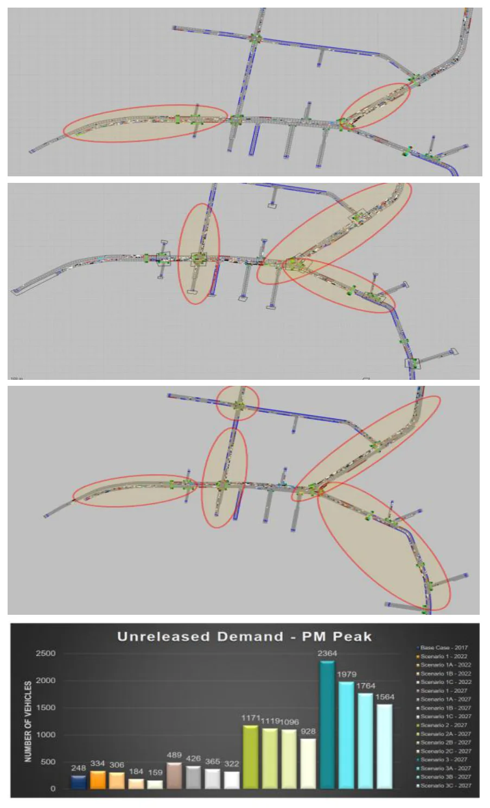

<!-- page 375 -->

### Future Transport Network

## 4.4  Future Road Network

Mosman Masterplan – Transport Study

#### 44

### Military Road & Spit Road (A8) Corridor – Trip Distributions

Figure 4-7 – AM peak trip distribution – Masterplan towards City Figure 4-8 – AM peak trip distribution – LMR towards City

Trip distribution between the LMR and the Masterplan Footprints

To better understand and compare future trip distribution patterns between the LMR model and the Mosman Masterplan model, an Origin-Destination (OD) analysis was carried out using the Compass IoT OD Tool. The assessed period was February and March 2026, during the typical weekday AM peak period (7am-9am), looking at passenger vehicle data.

The blue footprint on the left figure shows the travel distributions of vehicles originating within the proposed Masterplan area as they head towards the City (in pink). This is then compared to the distributions of vehicles originating from within the broader LMR footprint (in green) over the same period and towards the same location, as shown in the right-hand figure.

Although these comparisons don’t address precise density patterns within each footprint, the reliance on the A8 under both footprints is clearly established. As expected, the significant majority of trips starting in either the LMR or the Masterplan end up on the A8 in roughly equal proportions. From the Masterplan footprint, a marginally higher proportion (~5%) of trips enter the A8 earlier than under the A8 footprint, equating to around 22 vph based on the 442 Mosman-based trips estimated in Section 4.2.

How the Masterplan can help.

A key objective of the Masterplan is to reorient future housing growth along the A8, the primary transport corridor – maximising alignment between public transport services, future regional cycling routes, town centre services and housing uplift. This alignment is crucial in encouraging re-moding, or eliminating trips altogether through greater place-based connectivity.

At the scale of housing density being considered, the benefits of even a small improvement in public and active transport mode share under the Masterplan would represent material relief along the entire A8 corridor – this would readily outweigh the marginal increase in traffic (~22vph) entering the A8 slightly earlier upstream.

Moreover, the OD Diagrams indicate that the Masterplan footprint results in notably less traffic filtering within the local road network itself (refer to the blue/orange pathing along Raglan St, Avenue Rd, Military Road, Spencer Rd, Rangers Avenue). This is an ideal outcome in the context of the TfNSW Movement and Place framework.

## Masterplan

## LMR

### August 2026

### Attachment 1.1.3 Mosman

### Council

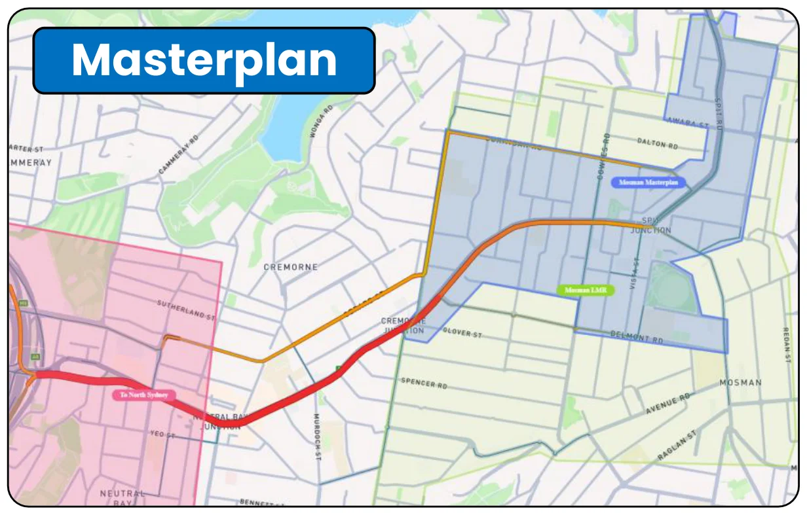

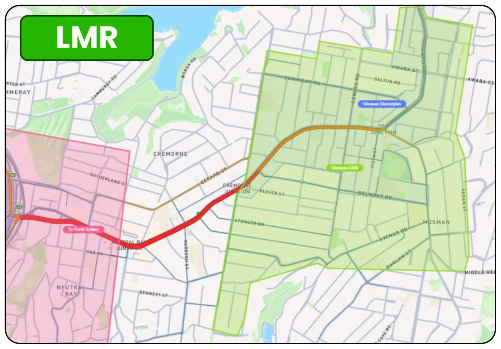

<!-- page 376 -->

### Future Transport Network

## 4.4  Future Road Network

Mosman Masterplan – Transport Study

#### 45

### Local road network, ‘Do not in ’  erformance

Figure 4-9 – Speed Map of Spit Junction Road Network under the modelled growth-as-usual (Scenario 1) to the right compared to moderate growth (Scenario 2) on the left.

The performance of the local road network is closely tied to the performance of the A8 corridor. As identified in Section 3, the large majority of outer-LGA trips from Mosman still rely on the A8. This reliance is most observable at the few signalised intersections providing local access, which become funnels for local movements, and are subsequently subject to extensive queues and delays.

The 2018 Cardno Study quantified this relationship with the A8 in their microsimulation modelling. The modelling suggested that with an additional 750 trips originating from Mosman in the year 2027 (Scenario 2B), the local road network, with a particular focus on Military Road (High Street) and adjoining local roads, would begin experiencing exponentially worse conditions.

Speed maps from this study have been extracted below, showing the majority of local road approaches reaching the worst-case travel speeds (represented in black) under Scenario 2b.

### Local road network, Opportunities

Right-hand turns onto the A8 from local roads is limited to four signalised intersections within the Masterplan Area:

● Awaba Street & Spit Road,

● Military Road (High Street) and Spit Road

● Cowles Road and Military Road (State)

● Spofforth Street and Military Road (State)

As previously identified in Section 3, the conditions on the local road approaches are operating well beyond capacity during peak commuter periods as well as on weekends during summer peaks.

Conditions on these local road approaches can reasonably be forecast to worsen further as population growth occurs; no new right-turn options are likely in the foreseeable future, and increasing bus and vehicle flows on the A8 are likely to be further prioritised over local access.

An important objective of the Masterplan, therefore, is to take meaningful steps to safeguard the operations of these intersections as far as practicable to maintain an acceptable level of local access to the A8.

How the Masterplan can help.

Through the Masterplan, local capacity upgrades are proposed at the signalised intersections of Awaba Street and Spit Road, as well as Cowles Road and Military Road. These upgrades would not be possible without the land dedications proposed under this Masterplan. Specific details are provided in Section 6.

These intersection upgrades specifically relate to local traffic performance improvements and form part of a wide raft of local road upgrades throughout the study area, aimed at improving transport conditions for all road users.

### August 2026

### Attachment 1.1.3 Mosman

### Council

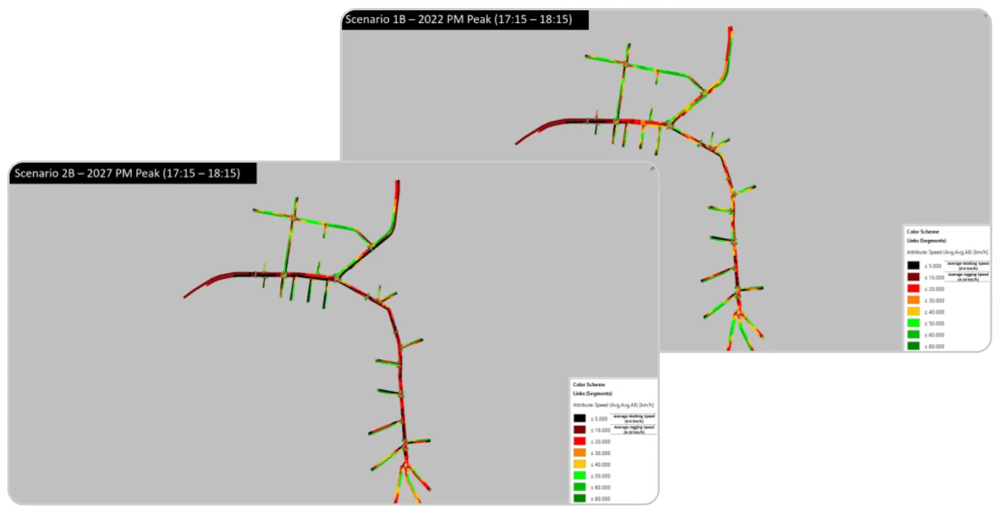

<!-- page 377 -->

### Future Transport Network

## 4.4  Future Road Network

Mosman Masterplan – Transport Study

#### 46

### Recommended Projects – Road Network

Ref Character area Project name Description

R.1 Middle Harbour Ridge Middle Harbour Ridge Access Corridor Upgrades

This will isolate future traffic generated in the Middle Harbour Ridge and Spit Road Corridors from the local road network to the east and north, as well as discourage rat runs via Mitchell Rd. Upgrade the route between Mitchell Rd, Mitchell Lane, Killarney Lan and Awaba Lane. This includes a one-way southbound conversion along the whole corridor, with priority over Killarney Street. Isolated road widening works at some bends - footpaths shall also be created/continued through the laneways, covered as a separate item.

R.2 Middle Harbour Ridge Mitchell Road LATM Conversion to 40km/h, with associated traffic calming measures.

R.3 Spit Road Corridor Mitchell Road Service Lane A new service lane shall be created between Stanton Lane and Mitchell Lane, to service future adjoining properties along Spit Road and Mitchell Road. This will ensure no new access points are required along Spit Road.

R.4 Spit Road Corridor Awaba St & Spit Road Intersection Upgrade

Subject to TfNSW approval. Provide additional intersection capacity for both east and west legs of Awaba Street, through provision of a 3rd turning lane. Land dedication requirements have been identified for several sites.

R.5 Balmoral Ridge Clifford Street LATM Conversion to 40km/h, with associated traffic calming measures.

R.6 Mosman Village North Brady Street Road Closure A mid-block closure of Brady Street for the purposes of eliminating through traffic, and enhancing the street as a 'place-based' gateway into Mosman Village North. There will be opportunities to construct additional communal areas and green space within the closed portion of land. Access requirements for all adjoining properties shall be maintained. Bus rerouting will be required. A pick- up-drop-off area will be considered as part of the works.

R.7 Mosman Village North Hordern Place and Heydon Street Reconfiguration

To enhance this retail space, it is necessary to separate vehicle and service traffic from one of the main entrance routes into the shopping centre. Hordern Street shall be closed between Brady Street and the Bridgepoint Shopping Centre (SC) eastern boundary, to create a civil plaza environment more suitable to this central location. A new section of road shall be created between Hordern Place and Heydon Street, through land dedicated from the SC lot. Hordern Place and the new lane section shall have a one-way circulation restriction - this will likely follow a counter- clockwise motion, driven by servicing vehicle turning requirements. For Heydon Street, both one- way or a retained two-way option shall be explored as part of future design stages. Hordern Place will remain a shared zone, and may be subject to future enhancements including pavement treatments.

Table 4-1 – Road Network – key projects register

#### Zooming Out:

Refer to Chapter 5 for movement plans for each character area.

Refer to Chapter 6 to view the project reference map with locations of all recommended projects.

### August 2026

### Attachment 1.1.3 Mosman

### Council

<!-- page 378 -->

### Future Transport Network

## 4.4  Future Road Network

Mosman Masterplan – Transport Study

#### 47

### Recommended Projects – Road Network

Ref Character area Project name Description

R.8 Ourimbah Triangle Ourimbah Triangle LATM Conversion of local road network to 40km/h, with associated traffic calming measures (Bond St, Earl St, Rosebery St, Cardinal St, Bardwell Rd (North of A8), Countess St, Lang Street, Erith St, Prince St and Hale Road. Through the LATM, there will be scope to consider possible one-way restrictions and right -turn bans from select side roads onto Ourimbah Road, to both address safety and discourage rat-runs.

R.9 Military Road Corridor Cardinal Street Road Closure Closure of the southern end of Cardinal Street at Military Road as a LATM measure. Minimising vehicle conflict points and creating safer access for pedestrians and cyclists.

R.10 Military Road Corridor Melrose Street Road Closure Closure of the Melrose Street at Military Road as a LATM measure. Minimising vehicle conflict points and creating safer access for pedestrians and cyclists.

R.11 Military Road Corridor Military Road Corridor and Prince St Character Area LATM

Conversion to 40km/h through local road network, with associated traffic calming measures. Includes Melrose St, Snell St, Bardwell Road (south of A8) Cardinal St, Wudgong St and Prince St

R.12 Prince Street Cowles Road and Art Gallery Way Roundabout

Upgrade the intersection to a roundabout to safely accommodate increasing traffic demands from all approaches. Subject to feasibility, particularly geometric constraints.

R.13 Prince Street Harbour Street and Art Gallery Way Roundabout

Upgrade the intersection to a roundabout to safely accommodate increasing traffic demands from all approaches.

R.14 Mosman Village South

Nathan Lane Shared Zone Nathan Lane shall be widened, and converted to a shared zone, forming part of the wider MVS-PS- MRC pedestrian/cyclist local corridor.

R.15 Military Road Corridor Cowles Road Military Road Intersection Upgrade

Subject to TfNSW approval. Upgrades to the capacities of the Cowles Road north and south legs, including, extension of the right-turn lane from Cowles Road (South) into Military Road (east), creation of a third, short left turn lane from Cowles Road (North) into Military Road (east). Minor land dedications (corner splay of each of the four corner lots) to increase pedestrian standing areas.

Table 4-1 – Road Network – key projects register (continued)

#### Zooming Out:

Refer to Chapter 5 for movement plans for each character area.

Refer to Chapter 6 to view the project reference map with locations of all recommended projects.

### August 2026

### Attachment 1.1.3 Mosman

### Council

<!-- page 379 -->

### Future Transport Network

## 4.5  Future Public Transport

Mosman Masterplan – Transport Study

#### 48

The importance of bus service levels into the future.

From Section 3.4, it was identified how vital bus services are to the transport network, carrying approximately 68% of people movements through the corridor during peak windows, whilst occupying only a fraction of the actual road capacity.

Notwithstanding, the B-line service, which is the primary service for supporting the region, is already operating at capacity, and bus delays and cancellations are commonplace.

If bus services deteriorate or event just stagnate as the population grows, the effect on the road network will be profound.

Bus priority addresses the problem affecting every service, improves reliability without new vehicles, and delivers benefits that compound: faster, more reliable buses attract patronage, which in turn strengthens the case for further investment. Priority measures should be investigated along the A8 corridor and at its major intersections, recognising that implementation rests with Transport for NSW and will require sustained advocacy from Council.

Making the existing network work better

The analysis of existing bus services in Section 3.3 shows how the primary trunk service, the B-line, is already frequently running over capacity before even leaving the Northern Beaches during the peaks. Noting the bulk of travel demands are originating in the Northern Beaches, failure of the public transport system to keep up with this growth will inevitably lead to a proportionally declining bus mode share, at a time when increasing non-car travel is a vital objective.

.

Interchange quality determines catchment Ferry services from Mosman Bay offer a harbour connection unaffected by road congestion, but their reach is limited by frequency and by wharf access below the Military Road ridgeline. Strengthening bus–ferry connections, improving the walk and cycle routes to wharves and stops, and coordinating timetables would extend the catchment of both modes without new infrastructure. The same principle applies to the walk-up catchment of bus stops along the corridor: the quality of the walking environment is part of the public transport offer, not separate from it.

Land use and transport must be planned together

The Masterplan’s direction of reorienting housing density toward the transport corridor is the single most effective long-term action available at a local government level. Concentrating growth where frequent services already operate improves the viability of those services, increases the share of trips that can be made without a car, and avoids adding vehicle movements to a corridor that cannot accommodate them.

Measuring what matters

Progress should be tracked against the metrics set out in Section 7.2 – public transport mode share and patronage, peak-period delay and reliability, and crowding relative to vehicle capacity. Reliability in particular deserves prominence: it is the measure that most directly reflects the passenger experience on this corridor, and the one most responsive to the interventions proposed here.

### August 2026

### Attachment 1.1.3 Mosman

### Council

<!-- page 380 -->

### Future Transport Network

## 4.5  Future Public Transport

Mosman Masterplan – Transport Study

#### 49

In order to compare the levels of public transport access between the Masterplan and the LMR, the two areas were overlaid on top of the PTAL dataset, which provides a public transport access score at a mesh-block level, as shown in the adjacent figure. As a further metric of accessibility, each mesh- block was also assessed on its distance from a regular bus stop, as well as the typical travel times from that block to the City during a typical AM peak period through reference to the GTFS data. All metrics were then averaged across all street blocks within each boundary, weighted by area.

● Better connected.  92% of the Masterplan area lies within a 400 m street walk of a city-bound morning service, against 68% of the LMR footprint. ● Shorter trips.  The average morning journey to Wynyard, counting the walk, the wait and the ride, runs around two and a half minutes faster from the Masterplan area. ● Futureproofed.  Growth on the A8 is served by scaling the trunk through frequency, priority and vehicle capacity, whereas the LMR’s strongest access relies on services threading congested local streets without bus priority over a wide-spread catchment. ● A more permeable centre.  New public through-site links open walking routes through large blocks, shortening journeys between shops, services and stops.

LMR Masterplan

Within 400 m walk of AM city service 68% 92% ▲

Mean access index (PTAI) 36.8 43.1 ▲

Average AM journey to Wynyard 29.2 min 26.9 min

Figure 4-10 – Public transport access (PTAL, 07:00–08:00 weekday) with the indicative LMR precinct and Masterplan boundary Source: TfNSW PTAL mesh-block dataset (2026); TfNSW GTFS timetable, term weekday; Fernway analysis. Boundaries are indicative. Journey times use scheduled services on the existing street network, walking at 1.2 m/s from block centroids; congestion delay excluded and results therefore conservative.

### +5–10%

#### Transport Mode Share

#### Target Increase

A targeted net improvement in the public transport mode share over the LMR, based on the advantages described.

Table 4-2 – Comparison of public transport access indicators, LMR and Masterplan scenarios

### August 2026

### Attachment 1.1.3 Mosman

### Council

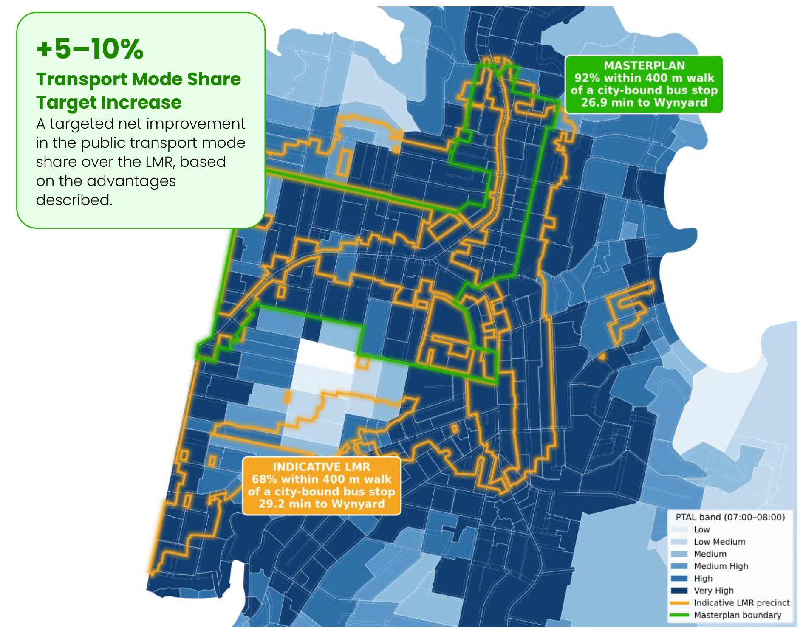

<!-- page 381 -->

### Future Transport Network

## 4.5  Future Public Transport

Mosman Masterplan – Transport Study

#### 50

### Mode shift sensitivity analysis

An increased alignment between future housing uplift and bus services would be expected to shift some of the additional travel demand from car to bus, reducing the citybound vehicle trips estimated above. The benefits of that reduction have been explored at a high level for the Mosman LGA. The baseline estimate assumes the bus mode share remains at the 2016 Census Journey to Work level of 29% for Mosman.

Four scenarios were tested, applying mode-shift transfers (cars to buses) of 2, 5, 7.5, and 10 percentage points to the baseline future trips generations estimated previously in Section 4.2.

A 2 percentage point mode shift would lift bus patronage to approximately 377 passengers and reduce car trips to approximately 420, removing around 22 vehicles from the corridor per hour, in one direction (citybound). A 10 percentage point uplift would carry approximately 474 passengers by bus and remove approximately 110 cars per hour in the peak direction– a reduction of roughly 25% against the baseline.

What is important to note is the significant difference in road space demand between cars and buses. Those 110 vehicles could be replaced by ~1-2 buses, and those buses can move through the corridor faster with priority measures such as Bus Lanes.

Figure 4-11 – Mode shift sensitivity analysis for increasing bus-mode shares during the AM peak period (Citybound)

### Trading Car Trips for Bus Trips

### August 2026

### Attachment 1.1.3 Mosman

### Council

<!-- page 382 -->

### Future Transport Network

## 4.6  Future Walking Network

Mosman Masterplan – Transport Study

#### 51

Better walkability on all metrics.

Through the Masterplan, the town centre walking network has been re-engineered to provide a greener, safer and more connected outcome, for the benefit of existing and future populations. This is outlined in Figure 4.12.

Benefits over the LMR.

As a trade-off for greater vertical density and yields on individual sites under the Masterplan, prospective developments at certain identified sites will be required to dedicate land for the purposes of public benefits such as creation of through-site links or new footpaths. These projects would not otherwise be feasible, and the overall improvement in pedestrian access and safety substantially advances the Masterplan’s objectives of encouraging local, non-car trips and increasing local road safety. The masterplanning exercise has identified the following pedestrian-focused benefits:

● Over 20 new through-site links – a transformational increase in Centre permeability. ● New and extended footpaths (Punch Lane, Rawson Street). ● Widened pedestrian staging areas at intersections. ● The potential for an iconic pedestrian overpass to connect the north and south villages of Spit Junction. Specific project details are included in Section 5. Figure 4-12 – Future walking network, with green site links and through site links permeating the town centre

### August 2026

### Attachment 1.1.3 Mosman

### Council

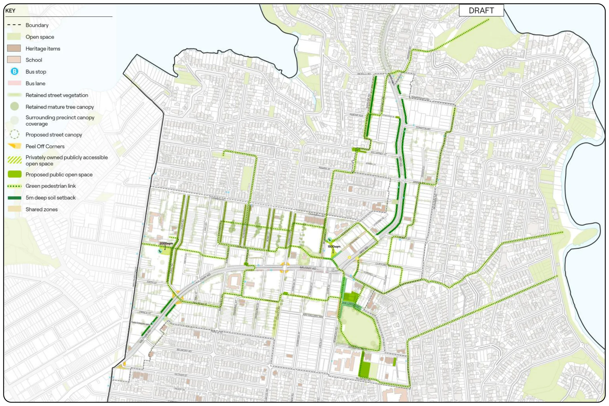

<!-- page 383 -->

### Future Transport Network

## 4.6  Future Walking Network

Mosman Masterplan – Transport Study

#### 52

Figure 4-13 – Location of a potential Pedestrian Overpass facility, subject to further Feasibility Investigations

### Spit Junction Overpass?

One of the core constraints of the Spit Junction Town Centre, and the basis of a defined ‘north’ and ‘south’ village is the physical and psychological division of the civic centre by the Military Road and Spit Road Corridor.

Currently, the primary pedestrian thoroughfare is via the signalised crossing on the road corridor, staged with a small central traffic island that will struggle to accommodate the anticipated future volumes of pedestrians. This crossing is at the centre of the place vs movement conflict of the corridor, and as regional traffic increases, so too will potential delays for pedestrians crossing the road. Beyond delays, there is a poor safety record for pedestrians along this corridor – between 2020 and 2024, 6 pedestrian casualty-crashes have occurred between the intersections of Cowles Road and Ourimbah Road respectively.

Whilst an overpass does exist between the Vista Street corner building (and Vista Street Carpark) and Bridgepoint Shopping Centre, it does not follow the main desire lines of pedestrian movements between the north and south villages.

The masterplan creates a once-in-a-generation opportunity to explore the feasibility of a new pedestrian overpass connecting the north and south villages.

It is recognised that a project of this nature is extremely complex, and feasibility depends on a wide range of factors, as well as support from State Government in funding and delivery. If a viable solution does exist, however, that is both an attractive and practical alternative to the signalised crossing, it could transform the character of Spit Junction; a seamless traffic-free pedestrian connection between the two villages, whilst meanwhile improving traffic flow through the intersection by alleviating most (or all) of the pedestrian-based delays.

As part of subsequent development stages of the Masterplan, preliminary discussions will be held with TfNSW and DPHI to discuss the feasibility of this project and identify next steps.

### August 2026

### Attachment 1.1.3 Mosman

### Council

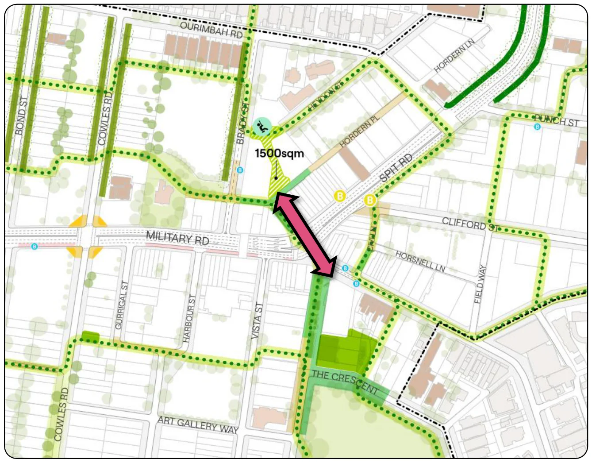

<!-- page 384 -->

### Future Transport Network

## 4.6  Future Walking Network

Mosman Masterplan – Transport Study

#### 53

### Recommended Upgrade Projects – P.1 to P.15

Ref Character area Project name Description P.1 Spit Road Corridor Stanton Lane Pocket Park Closure of east end of Stanton Lane at Spit Road, to create pocket park and green link for pedestrians and cyclists, whilst also improving local area traffic management.

P.2 Middle Harbour Ridge Mitchell Laneway Footpaths Create/extend pedestrian footpaths through Mitchell Lane, Killarney Lane and Awaba Lane

P.3 Middle Harbour Ridge Killarney St to Awaba St Through-Site Link New through-site link.

P.4 Middle Harbour Ridge Awaba Street Mid-block Crossing Construct mid-block crossing (non-signalised). Treatment type subject to detailed design

P.5 Balmoral Ridge Rawson Street Footpath Works (East Side) Construction of a paved footpath along the eastern side of Rawson Street, aligned along the property boundary line, avoiding existing street trees.

P.6 Balmoral Ridge Punch Street Footpath Works (East Side) Construction of a paved footpath along the eastern side of Punch Street.

P.7 Balmoral Ridge Awaba Street Pedestrian Refuge Island Construct pedestrian refuge island. Subject to no lane reduction on Awaba Street approach to Spit Road.

P.8 Balmoral Ridge Punch Street Pedestrian Crossing Construct mid-block crossing (non-signalised). Treatment type subject to detailed design

P.9 Spit Road Corridor Dalton Road to Horden Lane Through-Site Link New through-site link.

P.10 Balmoral Ridge Punch Street to Clifford St Through Site Link New through-site link.

P.11 Balmoral Ridge Clifford Street Raised Crossing Construct a raised priority crossing on Clifford St, at intersection with Moruben Rd.

P.12 Mosman Village South Civic Lane Active Frontage Upgrade & Associated Service Lane Modifications Close Civic Lane between Horsnell Lane and Military Road, which will become an active frontage area (Special-case vehicle access to remain, via collapsible bollards). Reorient Civic Lane from One-way southbound to One-way Northbound. Impose a one-way (westbound) restriction on Horsnell Lane to minimise vehicle conflicts.

P.13 Mosman Village North Brady Street & Ourimbah Road Signalisation Subject to TfNSW approval. Upgrade to a signalised intersection to safely accommodate the projected growth of pedestrians and vehicles crossing here. This is considered an important step in improving safety, but also amenity for the northern 'gateway' into the enhanced Mosman Village North.

P.14 Mosman Village North Spit Junction to Bridgepoint SC Through- Site Link Creation of a dedicated through-site link, directly aligned from the signalised intersection of Spit Junction, establishing an enhanced connection into the primary retail space.

P.15 Mosman Village North Spit Road to Hordern Place Through-Site Link Creation of a second through-site link, aligning with the B-Line bus (northbound) bus stop.

Table 4-3 – Pedestrian Network – key projects register

### August 2026

### Attachment 1.1.3 Mosman

### Council

<!-- page 385 -->

### Future Transport Network

## 4.6  Future Walking Network

Mosman Masterplan – Transport Study

#### 54

### Recommended Upgrade Projects– P.16 to P.28

Ref Character area Project name Description P.16 Mosman Village North Boronia Place Through-Site Link Enhance the public access through Boronia Place for pedestrians and cyclists, along with establishment of one or two through-site links to Cowles Road, as part of wider pedestrian and cycling network alignments.

P.17 Ourimbah Triangle Cowles Road Southern Midblock Crossing Construct mid-block crossing (non-signalised) aligned with the Boronia Place through-site links. Treatment type subject to detailed design.

P.18 Ourimbah Triangle Cowles Road Northern Midblock Crossing Construct mid-block crossing (non-signalised) aligned with the northern through-site link to Bond St. Treatment type subject to detailed design.

P.19 Ourimbah Triangle Cowles Road and Bond Street Through-Site Link New through-site link.

P.20 Ourimbah Triangle Bond Street Southern Midblock Crossing Construct mid-block crossing (non-signalised). Treatment type subject to detailed design. Aligned with southern through site link.

P.21 Ourimbah Triangle Bond Street Green Link Crossing Construct mid-block crossing (non-signalised). Treatment type subject to detailed design. Aligned with northern Green Pedestrian Link

P.22 Ourimbah Triangle Ourimbah Triangle Green Pedestrian Link A series of three through-site links through the core of the new Ourimbah Road character area, aligned between Cowles Road and Countess Street. The link will have a focus on natural green space as a place to encourage congregation and utilisation as well as pedestrian movements.

P.24 Ourimbah Triangle Rosebery St Green Link Crossing Construction of a raised wombat crossing to connect the Green link.

P.25 Ourimbah Triangle Bardwell Rd and Lang St Through-Site Link New through-site link.

P.26 Ourimbah Triangle Lang St and Hale Rd Through-Site Link New through-site link.

P.27 Ourimbah Triangle Hale Rd and Macpherson St Through-Site Link New through-site link.

P.28 Military Road Corridor Signalised Midblock Crossing on Military Road, near Hale Rd Subject to TfNSW approval. This segment is the longest stretch of the A8 within the LGA without a crossing facility. A signalised crossing at this location is an important final leg in the local east-west pedestrian/cycling corridor to be established through the Prince Street Character area and onto the Mosman Village South. It is particularly important for providing a safe connection to to Middle Harbour Public School via Hale Road.

Table 4-3 – Pedestrian Network – key projects register (continued)

### August 2026

### Attachment 1.1.3 Mosman

### Council

<!-- page 386 -->

### Future Transport Network

## 4.6  Future Walking Network

Mosman Masterplan – Transport Study

#### 55

### Recommended Upgrade Projects– P.29 to P.40

Ref Character area Project name Description P.29 Prince Street Prince Street CA Green Link A multi-block green link corridor through the Prince Street Character Area, aligning with a key desire link between Mosman Village South and Military Road Corridor. It will be formed by a series of two through-site links (Bardwell Rd- Cardinal St-Wudgong St) and enhancement of the existing pedestrian/cyclist through link between Wudgong Street and Cowles Road by closing Wudgong Walk. The link will have a focus on natural green space as a place to encourage congregation and utilisation as well as pedestrian movements.

P.30 Prince Street Bardwell Road Green Link Crossing Construction of a raised wombat crossing to connect the Green link.

P.31 Prince Street Cardinal Street Green Link Crossing Construction of a raised wombat crossing to connect the Green link.

P.32 Prince Street Wudgong Street Green Link Crossing Construction of a raised wombat crossing to connect the Green link.

P.33 Prince Street Cowles Road Green Link Crossing Construct mid-block crossing (non-signalised). Treatment type subject to detailed design.

P.34 Prince Street Cowles Road to Harbour St Through-Site Link New through-site link.

P.35 Prince Street Vista St to Harbour St Through-Site Link New through-site link.

P.36 Mosman Village South Gurrigal St and Cowles Road Through-Site Link A continuation of the MVS-PS-MRC pedestrian/cyclists local corridor.

P.37 Mosman Village South Gurrigal St and Harbour St Through-Site Link A new through-site link forming a northern branch of the MVS-PS-MRC pedestrian/cyclists local corridor as it enters Mosman Village South (MVS)

P.38 Mosman Village South Vista St and Harbour St Through-Site Link A new through-site link forming a northern branch of the MVS-PS-MRC pedestrian/cyclists local corridor as it enters Mosman Village South (MVS)

P.39 Mosman Village South Vista Street Pedestrian Crossing Construction of a raised wombat crossing to support the southern branch of the MVS-PS-MRC local corridor.

P.40 Mosman Village South The Crescent Road Closure Closure of The Crescent, between Myahgah Road and the future Library Car Park Entrance (TBC). This will enhance the safety and amenity of Council's Civic Centre, the heart of Mosman, by extending the pedestrianised zone through to Allan Border Oval, and creating additional opportunities for communal facilities and larger functions, unconstrained by traffic movements.

Table 4-3 – Pedestrian Network – key projects register (continued)

### August 2026

### Attachment 1.1.3 Mosman

### Council

<!-- page 387 -->

### Future Transport Network

## 4.6  Future Walking Network

Mosman Masterplan – Transport Study

#### 56

### Recommended Upgrade Projects P.41 to P.51

Ref Character area Project name Description P.41 Mosman Village North Spit Junction Pedestrian Overpass Construction of a state-of-the-art pedestrian overpass link between Mosman Village South and North precincts. A potentially iconic infrastructure project that could transform the heart of mosman. Subject to feasibility, the overpass would need to seamlessly integrate into open space areas on each end of the village (or directly into the future Bridgepoint Shopping Centre), with urban design and architectural design being an essential element of success. The driving force behind this project, is the forecasted worsening conditions on the A8 corridor - in particular, a growing friction between pedestrian crossings and through-movements. By separating these movements, an overpass could resolve, or markedly improve conditions for both the local community and through traffic. It is acknowledged that a project of this nature is incredibly complex and will require extensive additional investigation into feasibility, options- testing, and stakeholder engagement prior to Council being in a position to commit.

P.42 Military Road Corridor Side Road Safety Treatment (Snell St) Safety treatment upgrade of A8 side road crossing. Treatment may include a priority crossing, continuous footpath treatment (CFT), refuge island, kerb buildout.

P.43 Military Road Corridor Side Road Safety Treatment (Bardwell Road - south) Safety treatment upgrade of A8 side road crossing. Treatment may include a priority crossing, continuous footpath treatment (CFT), refuge island, kerb buildout.

P.44 Military Road Corridor Side Road Safety Treatment (Wudgong Street) Safety treatment upgrade of A8 side road crossing. Treatment may include a priority crossing, continuous footpath treatment (CFT), refuge island, kerb buildout.

P.45 Military Road Corridor Side Road Safety Treatment (Gurrigal Street) Safety treatment upgrade of A8 side road crossing. Treatment may include a priority crossing, continuous footpath treatment (CFT), refuge island, kerb buildout.

P.46 Military Road Corridor Side Road Safety Treatment (Vista Street) Safety treatment upgrade of A8 side road crossing. Treatment may include a priority crossing, continuous footpath treatment (CFT), refuge island, kerb buildout.

P.47 Military Road Corridor Side Road Safety Treatment (Bond Street) Safety treatment upgrade of A8 side road crossing. Treatment may include a priority crossing, continuous footpath treatment (CFT), refuge island, kerb buildout.

P.48 Spit Road Corridor Side Road Safety Treatment (Punch Street) Safety treatment upgrade of A8 side road crossing. Treatment may include a priority crossing, continuous footpath treatment (CFT), refuge island, kerb buildout.

P.49 Spit Road Corridor Side Road Safety Treatment (Stanton Road) Safety treatment upgrade of A8 side road crossing. Treatment may include a priority crossing, continuous footpath treatment (CFT), refuge island, kerb buildout.

P.50 Spit Road Corridor Side Road Safety Treatment (Warringah Road) Safety treatment upgrade of A8 side road crossing. Treatment may include a priority crossing, continuous footpath treatment (CFT), refuge island, kerb buildout.

P.51 Mosman Village North Side Road Safety Treatment (Brady Street) Safety treatment upgrade of A8 side road crossing. Treatment may include a priority crossing, continuous footpath treatment (CFT), refuge island, kerb buildout.

Table 4-3 – Pedestrian Network – key projects register (continued)

### August 2026

### Attachment 1.1.3 Mosman

### Council

<!-- page 388 -->

### Future Transport Network

## 4.7  Future Cycling Network

Mosman Masterplan – Transport Study

#### 57

### Proposed regional cycling route

The current cycling network lacks a fit-for-purpose regional route, yet as congestion rises with population growth, the demand for alternatives will escalate quickly. A regional cycling route would not only serve cyclists; it would act as a ‘relief valve’, helping to balance traffic volumes and keep the local and arterial network functioning. Just as B-Line services drove a marked uplift in public transport mode share in 2018, a well-designed regional cycleway can do the same.

The proposed alignment largely follows the A8 corridor as a shared path, deviating to parallel local roads where possible and practicable (Figure 4-14). It embodies the markers of successful design:

Demand An alternative in the face of worsening A8 congestion will naturally drive uptake.

Alignment via Spit Junction and the densest growth areas, minimising travel time and maximising catchment. The aim is a ‘door-to-door’ option.

Coverage Connects into the regional routes of the Northern Beaches and North Sydney, enabling a 30-minute city by cycling.

Safe Minimal to zero reliance on mixed traffic, minimal driveway interaction, and safety treatments at all side-road crossings benefiting cyclists and pedestrians alike

Comfort The A8 ridgeline offers the flattest possible route through Mosman.

The case of Shared Paths vs Separated Cycleways

Best-practice design favours separated cycleways over shared paths where practicable. Separated cycleways were explored as an option on this segment of the A8, but design challenges – retaining road capacity and width, minimising impact on street trees, bus stops, and other considerations– make a shared path the most practical solution. It is considered better to prioritise a strong deliverable outcome rather than chase an ideal that is unlikely to eventuate. Shared paths are a proven, cost-effective option for constrained corridors and are widely used across Sydney. Pedestrian safety stays paramount through generous widths, clear sightlines, marked separation, reduced speeds, and priority treatments at crossings.

Figure 4-15 – Existing footpath conditions along sections of Military Road proposed to Shared Path Treatments

Figure 4-14 – Proposed Regional Cycling Route (Source: SJB Draft Urban Design Report)

### August 2026

### Attachment 1.1.3 Mosman

### Council

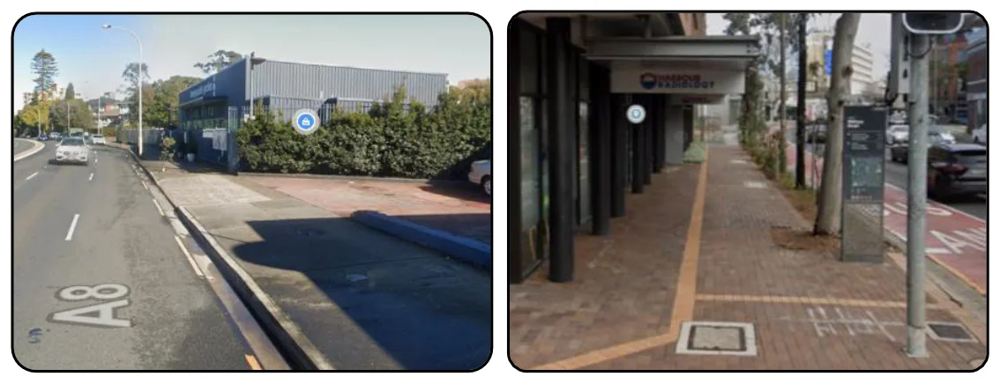

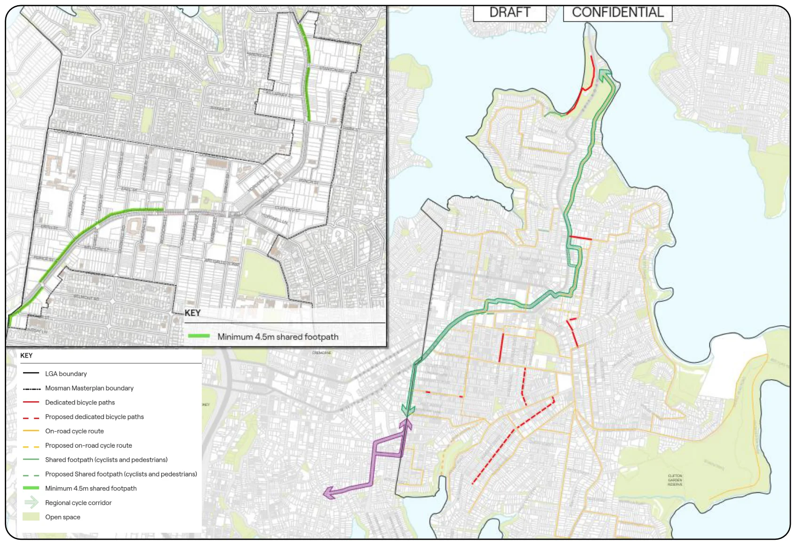

<!-- page 389 -->

### Future Transport Network

## 4.7  Future Cycling Network

Mosman Masterplan – Transport Study

#### 58

### Proposed regional cycling route – Design & Delivery

Figure 4-16 – Shared path arrangement – constrained (interim) condition

Figure 4-17 – Shared path arrangement – optimal (permanent) condition

Route alignment

The precise alignment may evolve through detailed design, consultation and approval, but will follow the SCC corridor closely, rerouted via Spit Junction Town Centre rather than Mosman Junction.

Staged delivery

Interim Stage: Existing footpath/verge widths along most proposed segments of the proposed alignment already achieve the shared path widths and safety buffers recommended within the TfNSW Cycleway Design Toolbox for ‘constrained conditions’, or otherwise, could meet the width with relatively minimal changes. Similar examples of shared paths along considerably more constrained road corridors are abundant. This pathway would enable the delivery of a much-needed regional route within the short- term period, whilst also being an extremely cost-effective solution.

Final Stage: Through the Masterplan, a land dedication corridor along the proposed alignment can be formalised to allow for an ultimate shared path width of 4.5m inclusive of the safety buffer. This will allow the route to incrementally widen in pace with property development and population growth. The final product will be a high-quality shared path designed for safety and functionality, at a time when alternative travel options like cycling will be most in need.

Design Standards

The design of the proposed cycleway will be driven by TfNSW’s Cycling Design Toolbox and industry better practice, developed in close coordination with TfNSW.

Some key design objectives are listed below:

● Avoid shop frontages where possible. Where not possible, design for maximum separation and speed reductions.

● Work with existing nature. Valuable street trees add character and practical shade, as well as create natural ‘slow’ points. The removal of any street trees would only be considered as a last-case resort.

● Side-road crossings upgraded with crossings, continuous footpaths and refuge islands

● Pedestrian Safety shall be a paramount consideration in the design of shared paths. The points above are strongly driven by pedestrian safety principles.

● Future planning controls will consider how building interfaces integrate into the public road reserve to improve safety and amenity for all users.

#### Benefits over the LMR

By aligning cycling and housing growth along one corridor, the Masterplan offers a ‘door-to-door’ option – exactly what will encourage the 48% of would-be cyclists to give it a try. Moreover, this would not be possible without the required land dedications to achieve optimal path widths.

### August 2026

### Attachment 1.1.3 Mosman

### Council

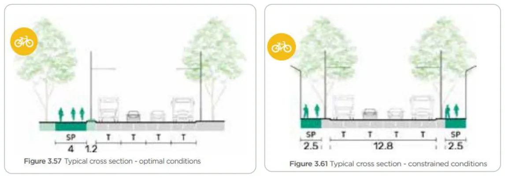

<!-- page 390 -->

### Future Transport Network

## 4.7  Future Cycling Network

Mosman Masterplan – Transport Study

#### 59

### Proposed local cycling routes

In addition to the regional route, the Masterplan Area has been reviewed for opportunities to improve cycling connectivity at a local level. Mixed-traffic routes will necessarily form part of the network, but the Masterplan will deliver improvements for the local network in several ways: ● More direct alignments via proposed through-site links.

● Reduced reliance on busy local roads, made possible through the through-site links. ● Additional local connection points into the proposed regional cycling route. ● Identify missing gaps beyond the local road network to key destinations, such as Mosman Wharf, and a parallel route alternative to Military Road (high street).

An extract of the proposed new local cycling network is provided in the adjacent figure.

#### Beyond the Masterplan.

Some suggestions have been made for the cycling network beyond the Masterplan Study area. These should be treated as indicative recommendations that align with the Masterplan vision but are not subject to the Masterplan approval or implementation process.

Local east-west corridor between Town Centre, Prince Street Character Area and Regional Cycling Route,  via new through-site links and road closures.

Potential north-south link connecting Mosman Wharf to Spit Junction Town Centre.

Potential north-south alternative route to Military Rd (High Street). Subject to land dedication from a single remaining lot across the existing rear laneway.

Figure 4-18 – Proposed Local Cycling Network Upgrades (Source: SJB Draft Urban Design Report)

### August 2026

### Attachment 1.1.3 Mosman

### Council

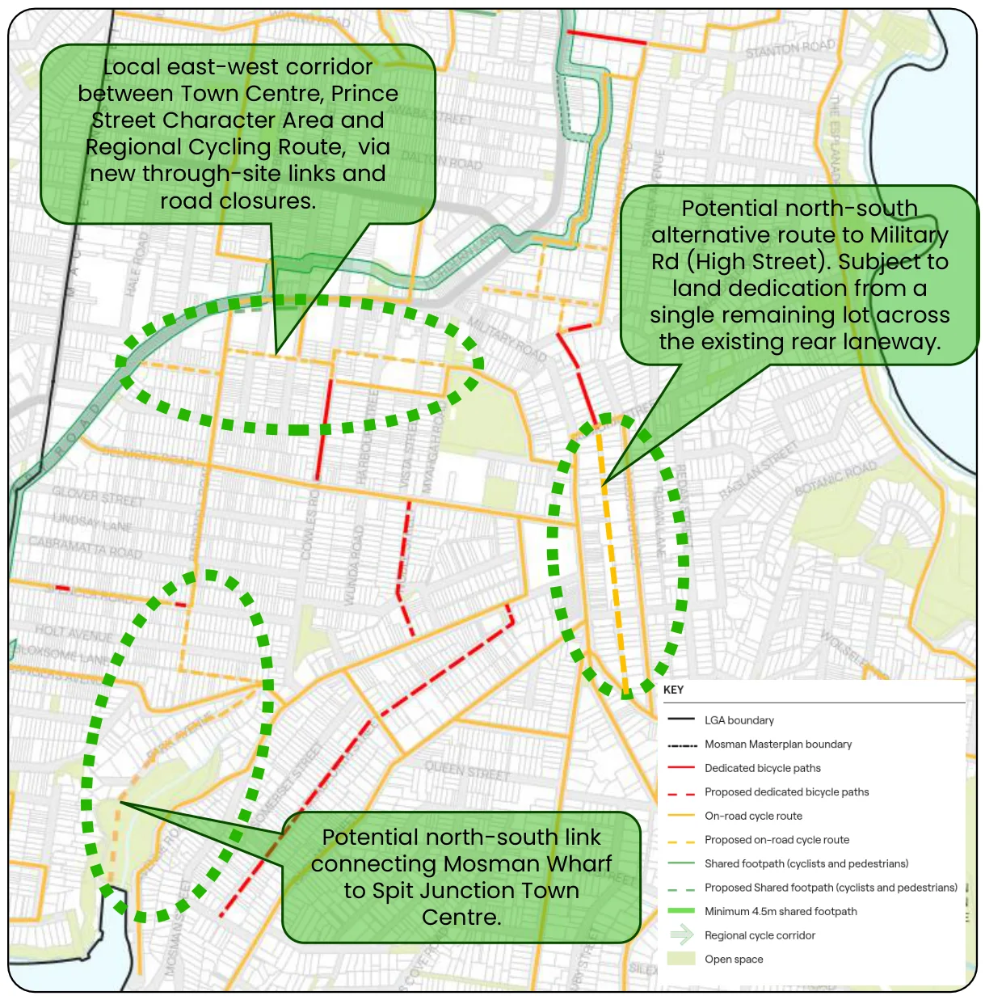

<!-- page 391 -->

### Future Transport Network

## 4.7  Future Cycling Network

Mosman Masterplan – Transport Study

#### 60

### Recommended Projects – Cycling Network

Ref Character area Project name Description

C.1 Balmoral Ridge Melaleuca Lane to Clifford Street Through-Site Link

New through-site link. Primarily for improved cyclists access, though pedestrian access not excluded.

C.2 Balmoral Ridge Moruben Road Shared Path Construction of a shared path on the east side of Moruben Road, between Clifford Street and Punch St

C.3 Balmoral Ridge Punch Street Mixed-Road Cycling Path

Provision of an on-road cycling route between Moruben Road and Punch Lane with a dedicated marked cycle lane in the westbound (uphill) direction. This will connect with the existing on-road cycling route on Punch Street between Punch Lane and Spit Road.

C(R).1 Spit Road Corridor Regional Cycle Route - Spit Road Shared Path

Upgrade the existing shared path along the eastern edge of Spit Road, between Parriwi Road and Stanton Road. The paved footpath shall be widened to a minimum of 2.5m wherever feasible, with a buffer (width to TBC) to be maintained to the roadway at all times. Trees shall be retained and treated as 'slow' points, unless the tree is otherwise not of value or approaching end of life. Land dedications from properties adjoining this section shall be formalised through the Masterplan, to enable progressive widening of the shared path, with an ultimate goal of a 4.5m width inclusive of safety buffer to traffic

C(R).3 Mosman Village North Regional Cycle Route - Ourimbah Road Shared Path

A brief segment of shared path along the south of Ourimbah Road, between Spit Road and Hordern Place. This shall be a constrained, but short section. The environment will naturally limit speeds.

C(R).4 Mosman Village North Regional Cycle Route - Alignment through MVN

From Ourimbah Lane, the cycleway will route along shared corridors with pedestrians; the projects along these shared segments are described under the Pedestrian Network category. That route is described here: 1. Continues via the existing shared zone on Hordern Place, and through the proposed Hordern Place road closure, onto Brady St 2. From Brady Street, it continue via the proposed Through-Site Links from Boronia Place, until reaching Bond Street. From here, the cycle route separates from pedestrians.

Table 4-4 – Cycling Network – key projects register

#### Zooming Out:

Refer to Chapter 5 for movement plans for each character area.

Refer to Chapter 6 to view the project reference map with locations of all recommended projects.

### August 2026

### Attachment 1.1.3 Mosman

### Council

<!-- page 392 -->

### Future Transport Network

## 4.7  Future Cycling Network

Mosman Masterplan – Transport Study

#### 61

### Recommended Projects – Cycling Network

Ref Character area Project name Description

C(R).5 Military Road Corridor Regional Cycle Route - Earl Street and Cardinal Street Separated Cycleway

From Bond Street, the cycle route shall continue along Earl Street and Cardinal Street as a short, separated bi-directional cycleway. It is noted that Cardinal Street has been identified for a road closure, and is also close the signalised midblock crossing on Military Road. This makes Cardinal Street a suitable re-entry point to the A8, both for safety, and accessibility between northern and southern character areas.

C(R).6 Military Road Corridor Regional Cycle Route - Military Road Shared Path

A shared path along the northern edge of Military Road, between Cardinal Street and Belmont Road. The Shared Path shall then cross over to the southern side of Military Road at this signalised crossing. From Belmont Road, it will continue to Spofforth Street. The initial implementation stage will work within existing road to boundary widths. The paved footpath shall be widened to a minimum of 2.5m wherever feasible, with a buffer (width to TBC) to be maintained to the roadway at all times. Trees shall be retained and treated as 'slow' points, unless the tree is otherwise not of value or approaching end of life. Land dedications from properties adjoining this section shall be formalised through the Masterplan, to enable progressive widening of the shared path, with an ultimate goal of a 4m width plus a safety buffer to the roadway.

C(R).7 Military Road Corridor Regional Cycle Route - Spofforth Street

From Military Road, the cycle route shall continue south along Spofforth Street, beyond the boundary of this Masterplan. The objective is to connect into the North Sydney's regional cycling route, which is currently planned for significant upgrades.

C(R).8 Military Road Corridor Regional Cycle Route - Side Road Safety Treatment (Bardwell Rd - North)

Safety treatment upgrade of A8 side road crossing. Treatment may include a priority crossing, continuous footpath treatment (CFT), refuge island, kerb buildout.

C(R).9 Military Road Corridor Regional Cycle Route - Side Road Safety Treatment (Lang St)

Safety treatment upgrade of A8 side road crossing. Treatment may include a priority crossing, continuous footpath treatment (CFT), refuge island, kerb buildout.

C(R).10 Military Road Corridor Regional Cycle Route - Side Road Safety Treatment (Hale Rd)

Safety treatment upgrade of A8 side road crossing. Treatment may include a priority crossing, continuous footpath treatment (CFT), refuge island, kerb buildout.

C(R).11 Military Road Corridor Regional Cycle Route - Side Road Safety Treatment (Prince St - North)

Safety treatment upgrade of A8 side road crossing. Treatment may include a priority crossing, continuous footpath treatment (CFT), refuge island, kerb buildout.

C(R).12 Military Road Corridor Regional Cycle Route - Side Road Safety Treatment (Twin Towers Walk)

Safety treatment upgrade of A8 side road crossing. Treatment may include a priority crossing, continuous footpath treatment (CFT), refuge island, kerb buildout.

C(R).13 Spit Road Corridor Spit Road to Rawson Street Connection

New through-site link, from Spit Road to Rawson Street.

C(R).14 Spit Road Corridor Rawson Street & Punch Lane Cycleway Improvements

Cycleway Improvements through the rear local roads of Rawson St and Punch Lane, including either shared zone treatments, or quiet street treatments, and crossing safety treatments at Awaba Street and Punch St. Table 4-4 – Cycling Network – key projects register (continued)

#### Zooming Out:

Refer to Chapter 5 for movement plans for each character area.

Refer to Chapter 6 to view the project reference map with locations of all recommended projects.

### August 2026

### Attachment 1.1.3 Mosman

### Council

<!-- page 393 -->

### Future Transport Network

## 4.8  Future Parking Conditions

Mosman Masterplan – Transport Study

#### 62

### Setting future parking controls through the DCP

Why parking controls matter

Setting parking requirements is one of the more influential levers the planning system holds over community travel behaviour. Allowing high volumes of private off-street parking will tend to attract/encourage households with higher rates of car ownership. Whilst the relationship between the number of household cars owned and number of car trips made is not a simple linear one, there is inevitably an increase in trips on the network as a result. Conversely, if off-street parking rates are capped too low in an area of limited alternative transport options, then restricting off-street parking may not reduce car ownership, but rather push parking demand on-street. The Masterplan Objective

As per Objective 7 of the Transport Objectives (Section 1.3), the Masterplan lays the framework for effective parking strategy. The future DCP will be the instrument through which that framework can be delivered among future development. The establishment of future DCP controls relating to off-street parking should be guided by the following principles:

● Resident parking rates should not exceed the average car ownership rates in Mosman, with a maximum limit of 2 spaces permitted for any single dwelling within multi-dwelling housing.

● Parking rates should be context-based, with reduced parking rates in areas well served by other modes of transport. ●Visitor access via car should be discouraged through constrained visitor parking rates.

● New development should not be eligible for RPS permits. The masterplan must aim to attract low-car households. The ability to park on-street using permits would not only undermine this objective, but the effectiveness of an RPS system itself, which can only issue a limited number of permits relative to the number of off-street spaces.

● Measures to actively reduce car ownership should be encouraged, through options such as Car Share schemes, bicycle parking & end-of-trip facilities, Travel Plans and more.

Figure 4-19 – GTIA Parking Categorisation Map (top) and categorisation indicators (bottom)

### August 2026

### Attachment 1.1.3 Mosman

### Council

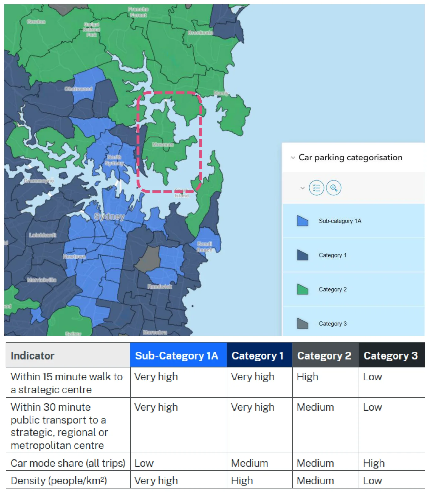

<!-- page 394 -->

### Future Transport Network

## 4.8  Future Parking Conditions

Mosman Masterplan – Transport Study

#### 63

### Setting future parking controls through the DCP

#### GTIA Indicator assessment for the Masterplan area

Reading the indicator comparison The above indicator suggests Mosman would currently fall within the Category 2 parking area, aligning with TfNSW's own SA2 map sets and Council’s current DCP requirements, beside the GTIA’s surveyed reference rates for the two accessibility categories most relevant to the corridor: Category 2 reflecting the area today and Category 1 its trajectory under the Masterplan. Where DCP rates sit materially above the references, new development is being required to build parking that observed demand in comparable areas does not support.

#### Comparison of residential parking rates, DCP vs GTIA

Parking Requirement

Mosman DCP (Current) TfNSW GTIA

General

Less than 200m from Spit Rd/Military Rd

Medium Density Dwellings High Density Dwellings

Category 1 Category 2 Category 1 Category 2

Per 1B Dwelling 1 space 1 space 0.5 space 0.7 space 0.1 space 0.6 space

Per 2B Dwelling 1.5 spaces 1.2 spaces 0.8 spaces 1.0 spaces 0.7 spaces 0.9 spaces

Per 3B+ Dwelling 2 spaces 1.5 spaces 1.2 spaces 1.6 spaces 1.2 spaces 1.4 spaces

Visitor (per dwelling)

0.25 spaces

0.25 spaces 0.20 spaces 0.20 spaces 0.14 spaces 0.20 spaces

Indicator Mosman today (Masterplan Area) Future under the masterplan

Walk to strategic centre

Low. No part of the Spit Junction Town Centre (or Mosman LGA) is within 15 minutes walk of a strategic centre (North Sydney)

Low. No change.

30-minute public transport

Very high. Most of the study area could reach North Sydney or the CBD by bus within 30 minutes during the peak. Bus reliability can affect this.

Very high – but only if bus service volumes and reliability can keep up with the projected population growth. Failure to do so could see Mosman lose it’s 30-minute city status.

Car mode share Medium. Based on JTW/HTS data

Medium–to-low. The Masterplan could lead to a notable reduction in car reliance.

Density Medium/Low High under the masterplan or LMR.

Outcome Parking Category 2 Parking Category 1 or 2

Table 4-5 – Comparison of DCP parking provisions rates for new residential development compared to GTIA benchmark parking guides.

Table 4-6 – Application of GTIA’s SA2 parking categorisation indicators to present-day Mosman and the Masterplan vision.

The GTIA as a benchmark

TfNSW’s Guide to Transport Impact Assessment (2024) has been updated to present parking guidance based on both development scale (medium/high density) and location using the new Parking Categorisation system at an SA2 level, with four categories in order of most, to least accessible: 1A, 1, 2, and 3. The GTIA parking guidance rates are set towards the lower end of the parking spectrum, as an intentional travel demand management (TDM) measure to encourage lower car reliance. They generally sit below the DCP rates which were developed under different circumstances, when public transport was more limited, and high-density residential development was not a consideration. TfNSW has provided indicative parking categories across NSW, as per the figure shown on the previous slide. Importantly, TfNSW emphasises the point that this map is for information only, where ultimate determination of the appropriate category should be based on professional consideration, with due regard to the local context. The GTIA parking rates are guides only, and are not statutory requirements. They provide a useful benchmark for consideration of future parking rates in the DCP, to be weighed against the local context and character of Mosman.

### August 2026

### Attachment 1.1.3 Mosman

### Council

<!-- page 395 -->

### Future Transport Network

## 4.8  Future Parking Conditions

Mosman Masterplan – Transport Study

#### 64

### Managing the public parking supply

#### Angled parking on side streets

The Masterplan recommends exploring additional timed angled parking on local side roads adjoining outer-centre commercial-zoned land on Military Road, lifting short-stay supply within an easy walk of fringe businesses without touching the corridor itself. Candidate streets include Bardwell Road, Cardinal Street, Bond Street, Snell Street, Glover Street and Wudgong Street. Any conversion would first subject to additional feasibility testing against the design principles of AS 2890.5, the Australian Standard governing on-street parking layout and safety, with each street’s treatment considered against its environment under the Movement and Place framework.

#### Expanding the smart parking network

Council’s existing smart parking coverage provides the foundation for a connected network extending across the study area’s on-street and off-street supply, delivering real-time occupancy information that guides drivers to available spaces, reduces circulating traffic, and gives Council live evidence to guide appropriate parking controls, permit-scheme effectiveness, and enforcement strategies.

Figure 4-20 – Concept angled street parking arrangement (Source: TfNSW Design of Roads and Streets)

#### Resident Parking Permit Schemes (RPS)

As population continues to grow, limiting off-street parking in new development will help to maintain car reliance. It will be necessary however to monitor on-street parking conditions as this growth occurs, to identify if the parking demands are being re-routed to on-street. One tool for managing this are resident parking permit schemes (RPS) – Council already has a well established RPS scheme across many areas, but many more within the Masterplan study area are not currently covered – this may change over time as demand increases. RPS systems help ensure that there is a reasonable level of parking turnover to accommodate neighbourhood visitors such as trades, carers, social visits, removalists etc, whilst maintaining access for existing residents with limited or no access to off-street parking. Nonetheless, RPS has its limitations, as discussed in Section 3.6.

Figure 4-21 – Mosman Masterplan Areas outside existing RPS Controls (red dash).

### August 2026

### Attachment 1.1.3 Mosman

### Council

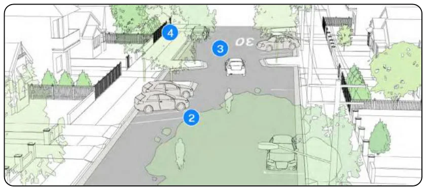

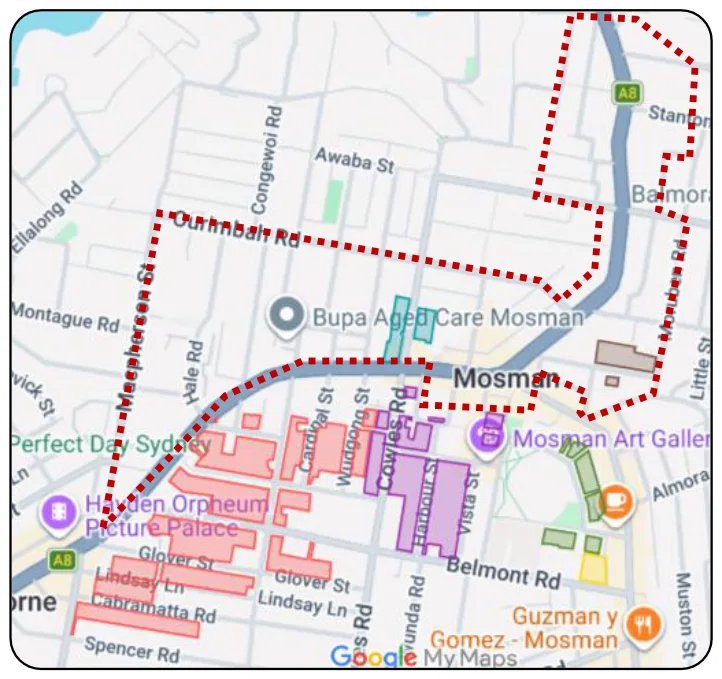

<!-- page 396 -->

### Future Transport Network

## 4.9  Future Freight & Servicing

Mosman Masterplan – Transport Study

#### 65

#### Planning for the servicing task

Freight and servicing is a derived demand, a direct function of the land uses a place supports, so the movement plans in Section 5 anticipate the servicing needs that future development along each corridor will generate, rather than treating them as an afterthought.

#### Embedding controls in the DCP

At a finer planning level, the Development Control Plan can introduce controls that require new development to be designed for emerging and future servicing trends, including the growth of e-commerce and quick-commerce, food delivery, and light electric freight such as e- bikes and cargo bikes, so that loading can occur safely off-street where appropriate.

#### Service access in the MVN and MVS civic hubs

Within the Mosman Village North (MVN) and Mosman Village South (MVS) civic hubs, the Masterplan proposes changes to the existing service lane arrangements to better balance loading, kerbside activity and pedestrian amenity. As these hubs carry the highest concentration of servicing activity, service access must be treated as a defining element of any final road layout modifications. Servicability must be confirmed before geometry is locked in, rather than accommodated as a residual consideration.

A micro-freight hub at Spit Junction

The Masterplan can explore the introduction of a micro-freight hub within the Spit Junction Town Centre, consolidating deliveries at the edge of the centre and completing the final leg by low-impact modes, easing kerbside pressure and supporting the place function of the high street. The success of such a hub depends not only on its location and design, but on uptake from commercial couriers, which is driven by demand. Delivery volumes, achievable time savings and operating costs will ultimately determine whether a micro-hub suits the planned vision for the town centre. The concept can be explored over time, with opportunities to establish a hub within existing Council facilities or through partnerships with suitable future development sites.

Figure 4-22 – Micro freight hub on the fringe of Sydney CBD

### August 2026

### Attachment 1.1.3 Mosman

### Council

<!-- page 397 -->

### Future Transport Network

## 4.10  Future Travel Demand Management

Mosman Masterplan – Transport Study

#### 66

#### The case for managing demand

With no major capacity upgrade planned for Military Road within the next decade, the corridor’s peak-hour throughput is effectively fixed while travel demand continues to grow, so the realistic lever is not more road space but managing the demand itself. TfNSW’s Guide to Transport Impact Assessment (GTIA) describes TDM as influencing travel by remoding, retiming, rerouting and reducing journeys. On a single-corridor network, rerouting options are limited, which places the weight of Mosman’s effort on shifting trips to public and active transport and reducing the need to travel by car at all, precisely the outcomes the Masterplan’s land use approach is designed to enable.

#### The Masterplan as a TDM foundation

The GTIA identifies that TDM succeeds through a combination of hard interventions (supporting infrastructure and land use) and soft interventions that encourage people to use them. The Masterplan delivers the hard foundation directly, reorienting new homes within walking distance of shops, services and community facilities, right beside the corridor’s frequent bus services. It also outlines a raft of major and minor new infrastructure projects, ranging from a regional cycling route, greatly increased walking permeability via over 20 new through-site links, and a suite of road safety and local area traffic management (LATM) measures throughout the study area.

Figure 4-23 – TDM levers for the Mosman network  (Source: GTIA, Chapter 4)

#### TDM beyond the Masterplan: Travel Plans

The Masterplan recommends that Council explore options to embed TDM as an operational requirement for new development. This could be introduced as a planning control as part of a new DCP. For example, developments over a certain size could be conditioned to develop and maintain a

#### Travel Plan – a building-specific management

strategy for encouraging sustainable transport behaviours amongst building users on an ongoing basis. Travel Plans are typically owned and managed by building strata/management

Figure 4-24 – Travel Demand Management

### August 2026

### Attachment 1.1.3 Mosman

### Council

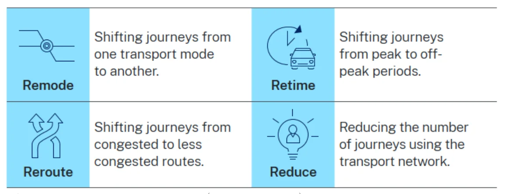

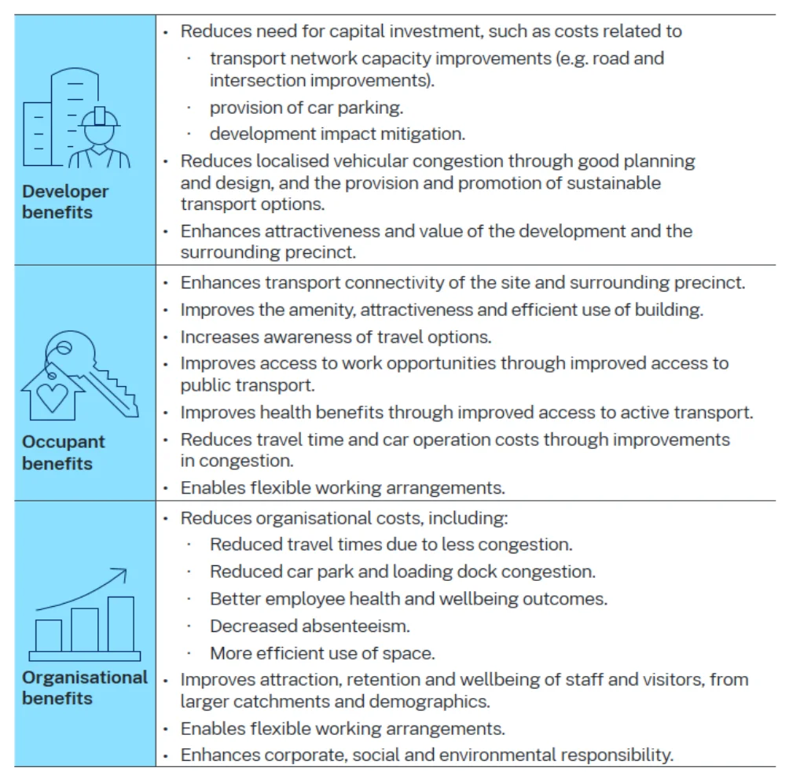

<!-- page 398 -->

#### C H A P T E R F I V E

## 5

## Movement & Place

## Framework

Applying the Movement and Place Framework across each of the emerging character areas within the Spit Junction Town Centre.

#### 5.1 Movement & Place

#### 5.2 Mosman Village North

#### 5.3 Mosman Village South

#### 5.4 Ourimbah Triangle

Mosman Masterplan – Transport Study

#### 67

#### 5.5 Military Road Corridor

#### 5.6 Prince Street

#### 5.7 Spit Road Corridor

#### 5.8 Middle Harbour Ridge and Balmoral Ridge

### August 2026

### Attachment 1.1.3 Mosman

### Council

<!-- page 399 -->

### Movement & Place Framework

## 5.1  Movement & Place

Mosman Masterplan – Transport Study

#### 68

#### What the framework is

The Masterplan adopts the TfNSW Movement and Place framework, the state’s approach to designing roads and streets around both the traffic they carry and the places they serve, as set out in Transport for NSW’s Design of Roads and Streets manual.

The framework organises the network into four street environments, being main roads, main streets, local streets, and civic spaces, each read against its surrounding place context rather than by name or administrative category alone.

#### Why it matters

The framework matters because it reads each corridor against both its movement function and its place function, and sets a pathway from the role a street performs today to the role it should perform in future. Military Road is a case in point, cited in the manual itself as a corridor that performs as a main street rather than a main road.

Applying the Movement and Place lens makes the balance explicit: sustaining the strategic movement of people and goods through the region, while strengthening the place function of Mosman’s centres, where safety, walkability and a vibrant public realm carry equal weight.

#### How it shapes the network

The Masterplan carries the framework through to delivery, assigning each segment of Mosman’s network a street type suited to its movement role and its place context, and drawing this together into a movement plan for every character area.

Each character-area movement plan sets the vision for its streets, guiding where through- movement is protected, where local access and public life take priority, and how future change reinforces the character residents value.

The following sections outline the movement & place considerations for each emerging character area within the Masterplan.

Figure 5-1 – The 22 road & street types within the Movement & Place framework (Source: Design of Roads & Streets Guide)

Figure 5-2 – Allocation of road space to balance movement and place functions (Source: Design of Roads & Streets Guide)

### August 2026

### Attachment 1.1.3 Mosman

### Council

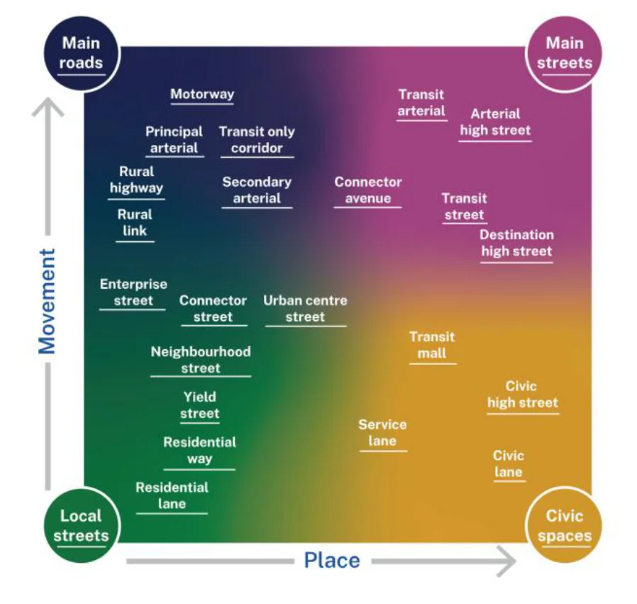

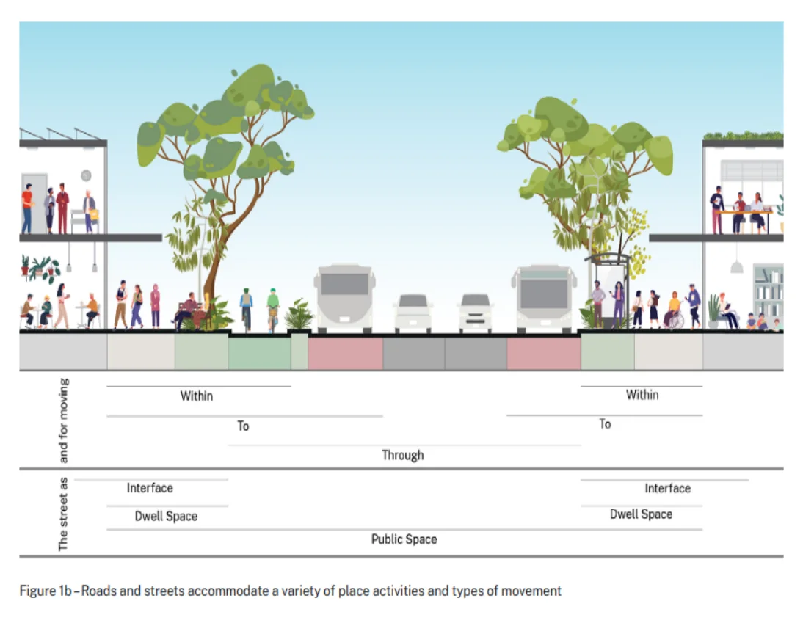

<!-- page 400 -->

### Movement & Place Framework

## 5.2  Mosman Village North

Mosman Masterplan – Transport Study

#### 69

Movement & Place in Emerging Character Areas In order to preserve the movement function of the A8, no site access will be permitted from Military Road or Spit Road, and no reduction in the width or capacity of Military Road is proposed. Change is instead concentrated on the local street network, where complete urban renewal is proposed around the north village. Partial closure of Hordern Place and Brady Street will create pedestrianised, publicly accessible open space and additional through-site links into the heart of a revitalised village. Brady Street will become a calm, civic-centred street with through-traffic eliminated, enabling safe crossings for pedestrian corridors and the regional cycling route as well as pick-up and drop-off opportunities. Subject to TfNSW approval, a signalised upgrade of the Brady Street and Ourimbah Road intersection is proposed to provide safe pedestrian access across Ourimbah Road and consolidate its future role as the northern gateway into the village. The eventual redevelopment of Bridgepoint Shopping Centre will also create opportunities for additional off- street parking. Site servicing and access will continue via Heydon Street and Hordern Place, circulating into or out of Haydon Street through a new lane connection following the road closure outside Bridgepoint Shopping Centre. Options for accommodating existing bus routes along Brady Street will be assessed, and routes may be rerouted. The feasibility of a new pedestrian overpass linking the open spaces of Mosman’s north and south villages will also be explored, with the objective of an attractive, practical link separated from the A8. Alternatively, Council will work with TfNSW to explore an option to improve the existing signalised pedestrian crossing at Spit Junction.

Figure 5-3 – Movement & Structure Framework for Mosman Village North Character Area (Source: Design of Roads & Streets Guide)

### August 2026

### Attachment 1.1.3 Mosman

### Council

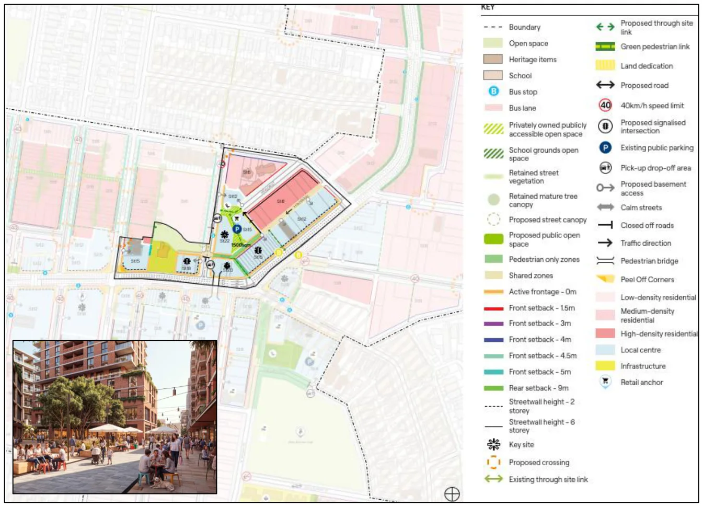

<!-- page 401 -->

### Movement & Place Framework

## 5.3  Mosman Village South

Mosman Masterplan – Transport Study

#### 70

Summary of Movement & Place Considerations As with the north village, no new accesses will be permitted via the A8 and the integrity of its movement function will be maintained. Change is instead concentrated on the local network surrounding the civic core. A section of The Crescent will be closed as part of the future new library building, and public off-street car park. This closure will bridge the gap between the existing pedestrianised civic square into Alan Border Oval, prioritising a place-based civic atmosphere, with additional open space for community facilities and public events. A detailed investigation will be undertaken to understand and safely manage the associated rerouting of traffic. Through-site links will complete an east–west pedestrian and cyclist corridor from the Civic Square to Cowles Road, and Civic Lane between Military Road and Horsnell Lane will be closed to traffic and redeveloped as a pedestrianised branch of the village high street, with servicing and site access around Horsnell Lane, Fieldway and Clifford Street considered as part of all changes. Beyond the centre, LATM measures will establish calm streets in the outer residential blocks, including speed limit reductions, intersection upgrades, directional restrictions, shared zones and pedestrian crossings. No new  development access will be permitted on Cowles Road near the intersection with Military Road, to minimise further impact on an already constrained intersection, while minor road widening upgrades along Cowles Road South will be considered as part of increasing local capacity through it. Angled on-street parking opportunities will be considered along suitable local roads where appropriate.

Figure 5-4 – Movement & Structure Framework for Mosman Village South Character Area (Source: Design of Roads & Streets Guide)

### August 2026

### Attachment 1.1.3 Mosman

### Council

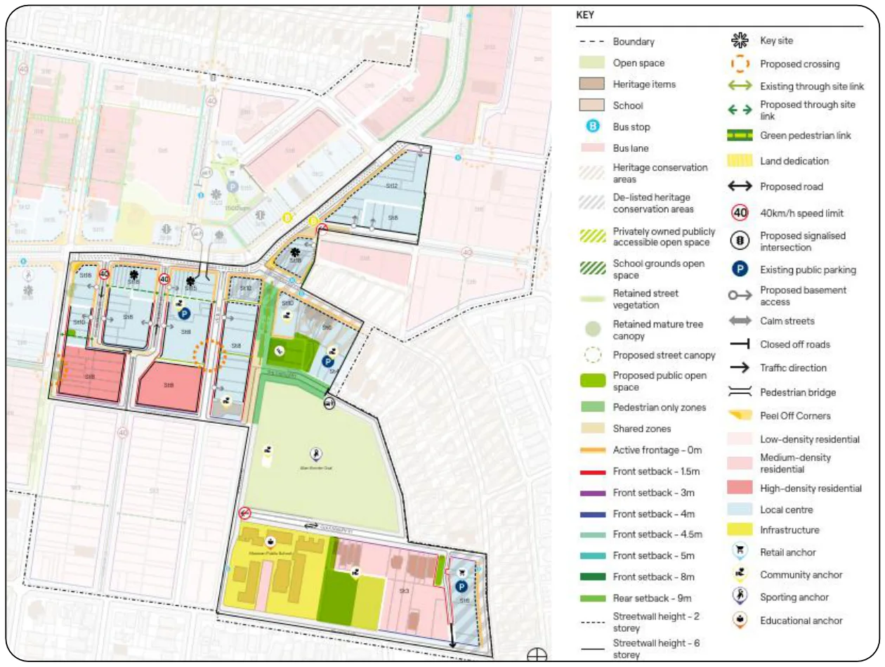

<!-- page 402 -->

### Movement & Place Framework

## 5.4  Ourimbah Triangle

Mosman Masterplan – Transport Study

#### 71

Summary of Movement & Place Considerations

The precinct is predominantly residential, with quiet streets serving local movement only. LATM measures will include speed reductions, road closures, traffic-calming devices, pedestrian crossings, and possibly additional one-way or turning restrictions to discourage existing or future rat-running routes.

It will also accommodate a critical segment of the regional cycling network, commencing from the through-site links to the rear of Boronia House and between Cowles Road and Bond Street, before separating as a dedicated bidirectional cycleway along Earl Street and Cardinal Street. Cardinal Street will be closed as a pocket park, making it a safe and ideal location for the regional route to return to the Military Road alignment as a shared path. It also sits close to the mid-block signalised crossing on Military Road, allowing users on the southern side to easily connect into the route, and vice versa.

A prominent ‘green pedestrian link’ between Countess Street and Bond Street will offer an attractive open corridor underpinning residential pedestrian activity through Ourimbah Triangle, while further through-site links provide mid-block connections into Hale Street, supporting safe access to Middle Harbour Public School.

Angled on-street parking opportunities will be considered along suitable local roads where appropriate. Figure 5-5 – Movement & Structure Framework for Ourimbah Triangle Character Area (Source: Design of Roads & Streets Guide)

### August 2026

### Attachment 1.1.3 Mosman

### Council

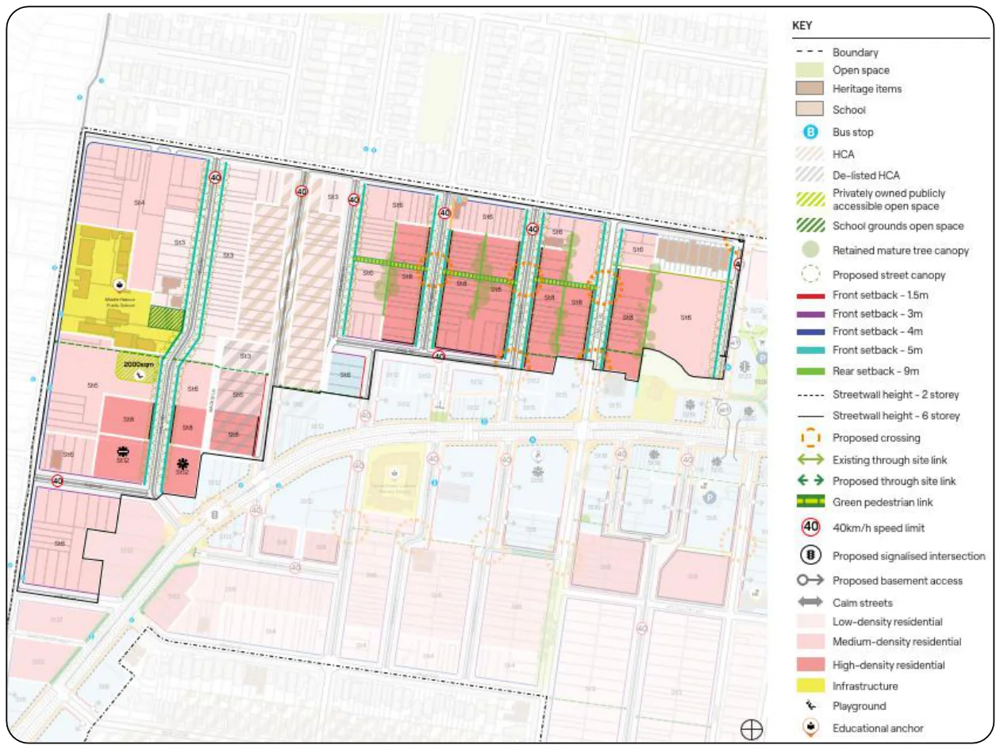

<!-- page 403 -->

### Movement & Place Framework

## 5.5  Military Road Corridor

Mosman Masterplan – Transport Study

#### 72

Summary of Movement & Place Considerations

This is a corridor-focused character area. As elsewhere along the corridor, no access will be permitted via Military Road.

Subject to TfNSW approval, a signalised pedestrian crossing is proposed on Military Road near Hale Street to fill a missing gap in the pedestrian network and accommodate a growing desire line between the Middle Harbour Public School and residents south of Military Road.

Peel-off corners at several intersections with Military Road are proposed through land dedications to improve pedestrian staging capacity and amenity at crossings, and safety treatments are proposed at most side-road intersections to improve pedestrian and cyclist safety when travelling along the corridor.

The regional cycling route will pass through this area along Military Road as a shared path on the northern edge between Cardinal Street and Belmont Road, then switch to the southern edge from Belmont Road to Spofforth Street.

Locally, a cyclist and pedestrian corridor will be formed via new through-site links between Bardwell Road and Cardinal Road, continuing into Mosman Village south.

LATM measures will be implemented to establish quiet local roads, including speed reductions, traffic- calming devices, and a road closure on Melrose Street, while angled on-street parking opportunities will be considered along suitable local roads where appropriate.

Figure 5-6 – Movement & Structure Framework for Military Road Corridor Character Area (Source: Design of Roads & Streets Guide)

### August 2026

### Attachment 1.1.3 Mosman

### Council

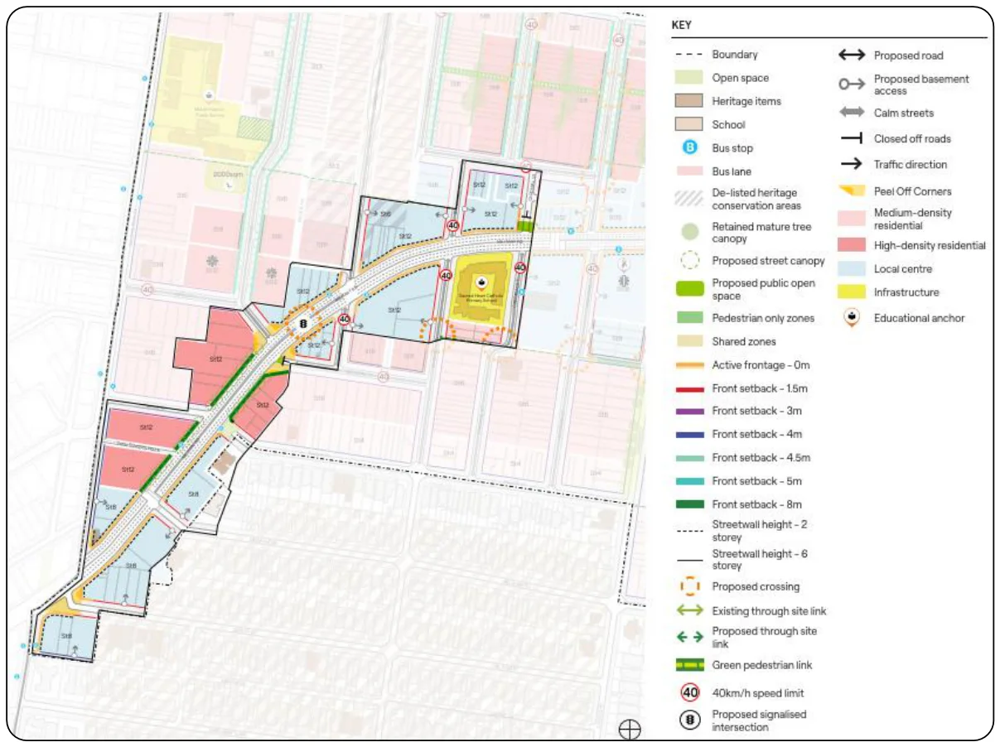

<!-- page 404 -->

### Movement & Place Framework

## 5.6  Prince Street

Mosman Masterplan – Transport Study

#### 73

#### Summary of Movement & Place

#### Considerations

This is a residential-focused character area, where LATM measures will be implemented to establish quiet local roads, including speed reductions, traffic calming devices and a road closure of Melrose Street.

As mentioned in Section 5.5, a cyclist and pedestrian corridor will be formed via new through-site links between Bardwell Road and Cardinal Road, supported by crossing upgrades in between, continuing into Mosman Village south. Additional pedestrian-only through-site links are proposed between Cowles Road and Vista Street.

Figure 5-7 – Movement & Structure Framework for Prince Street Character Area (Source: Design of Roads & Streets Guide)

### August 2026

### Attachment 1.1.3 Mosman

### Council

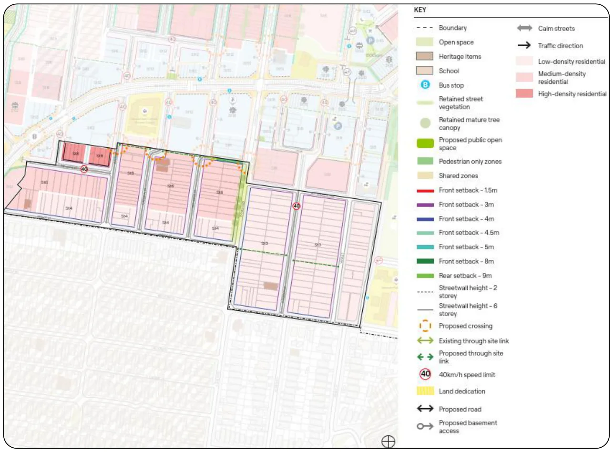

<!-- page 405 -->

### Movement & Place Framework

## 5.7  Spit Road Corridor

Mosman Masterplan – Transport Study

#### 74

Summary of Movement & Place Considerations

This is a corridor-focused area. Access to Spit Road shall generally not be permitted for new development, with an exception necessary for the eastern block between Awaba Street and Stanton Road, where access to a lesser road is not possible. Stanton Road shall be closed and converted into a pocket park, reducing conflicts on Spit Road and improving local traffic management.

The Regional Cycling Route shall continue its existing alignment on Parriwi Road and Spit Road down to Stanton Road, then extend one more block south on Spit Road, where it can connect to Rawson Street. The preference is to provide access to Rawson Street at the earliest opportunity via a new through-site link, from which the route continues along Rawson Street and Punch Lane as either a quiet street or a shared zone, before connecting to the Hordern Lane shared zone via Punch Street and Ourimbah Road.

To improve local access at the critical intersection of Awaba Street and Spit Road, road widening on both sides of Awaba Street is proposed in order to create a new turning lane, subject to TfNSW approval.

LATM is also proposed between the north-west residential area and the Middle Harbour Ridge character area, with the core principle of separating future development traffic from the narrow, constrained local road network to the north-west by converting Mitchell Street to a one-way southbound route and extending it through the laneway network to Awaba Street. New safety treatments, speed reductions and traffic calming, isolated widening works and footpaths will be introduced to support the changes.

Figure 5-8 – Movement & Structure Framework for Spit Road Corridor Character Area (Source: Design of Roads & Streets Guide)

### August 2026

### Attachment 1.1.3 Mosman

### Council

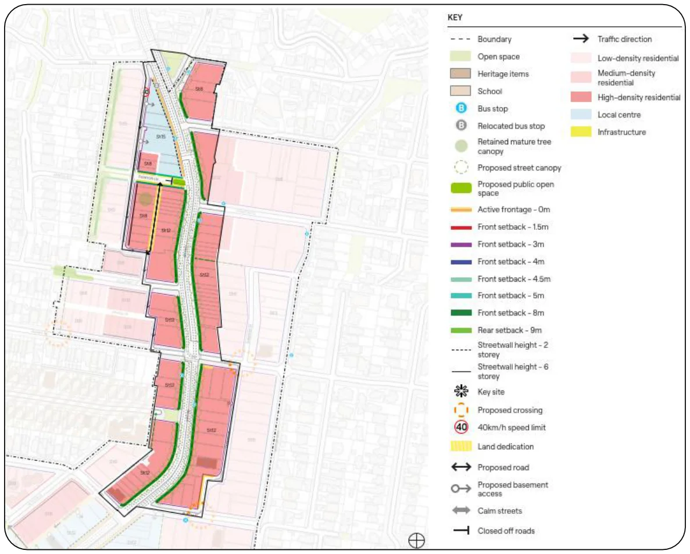

<!-- page 406 -->

### Movement & Place Framework

## 5.8  Middle Harbour Ridge and Balmoral Ridge

Mosman Masterplan – Transport Study

#### 75

Figure 5-9 – Movement & Structure Framework for Middle Harbour Ridge and Balmoral Ridge Character Areas (Source: Design of Roads & Streets Guide)

Summary of Movement & Place Considerations

These areas are residential-focused.

As previously mentioned, LATM measures are proposed between the north-west residential area of the Spit Road Corridor and the Middle Harbour Ridge character areas, with the core principle of separating future development traffic from the narrow, constrained local road network to the north-west by converting Mitchell Street to a one-way southbound route, extending through the network of laneways until reaching Awaba Street. New safety treatments, speed reductions and traffic calming, isolated widening works and footpaths will be introduced to support the changes.

For pedestrians in the Middle Harbour Ridge area, new through-site links between Mitchell Street and Awaba Street shall be established, connecting into existing links between Awaba Street and Ourimbah Road (Carroll Lane). Promotion of this link may be subject to the feasibility of a signalised crossing at Ourimbah Road, which itself is subject to TfNSW approval. If feasible, however, this will create a strong pedestrian link into the revitalised Mosman Village North via Brady Street.

Within the Balmoral Ridge area, Rawson Street and Punch Lane shall receive significant pedestrian and cyclist improvements, including new footpaths, shared zones, road crossings, and other traffic-calming measures. Site access and servicing will still be required along these lanes however, and must be balanced in future improvements.

### August 2026

### Attachment 1.1.3 Mosman

### Council

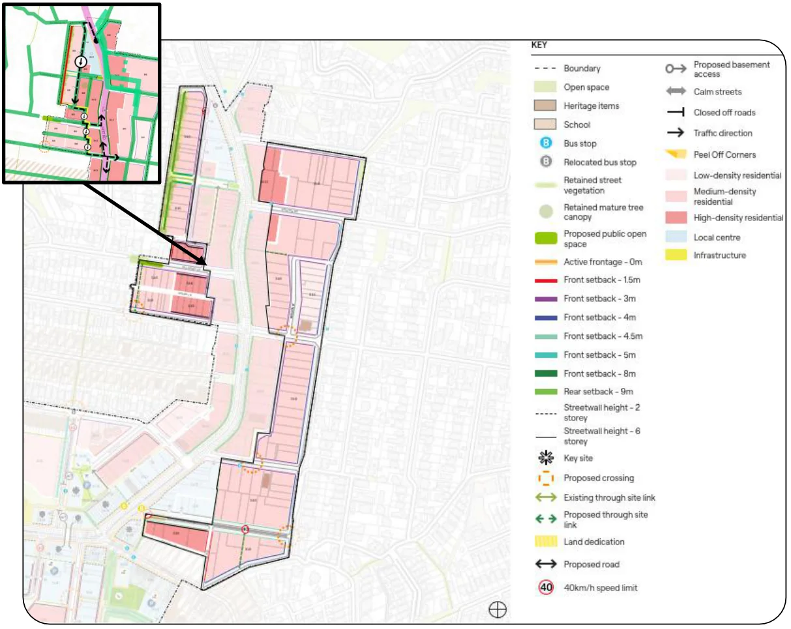

<!-- page 407 -->

#### C H A P T E R S I X

## 6

## Recommendations

A summary of recommended projections under the Masterplan, along with some key highlights.

#### 6.1 Summary of Transport Project Locations

#### 6.2 Project Reference Table

Mosman Masterplan – Transport Study

#### 76

### August 2026

### Attachment 1.1.3 Mosman

### Council

<!-- page 408 -->

### Recommendations

## 6.1  Summary of Transport Project Locations

Mosman Masterplan – Transport Study

#### 77

Figure 6-1 – Project Recommendations Reference Map, by user category.

#### Project Reference Map

The map opposite summarises the location and reference numbers of the transport projects recommended in this study.

Locations shown are indicative only. Some projects are area-wide or corridor-based, and the point shown represents the general focus of the project rather than a fixed site or extent.

The map does not capture every recommendation of the study. Non-spatial recommendations, such as proposed DCP policy changes, are set out in the relevant sections and are not repeated here.

Specific public transport projects are also excluded, as Transport for NSW is responsible for planning and delivering public transport services. Council is, however, ready to work with Transport for NSW to improve the public transport system serving the study area.

A brief description of each project, matched by project reference number, can be found in the table on the following page.

### August 2026

### Attachment 1.1.3 Mosman

### Council

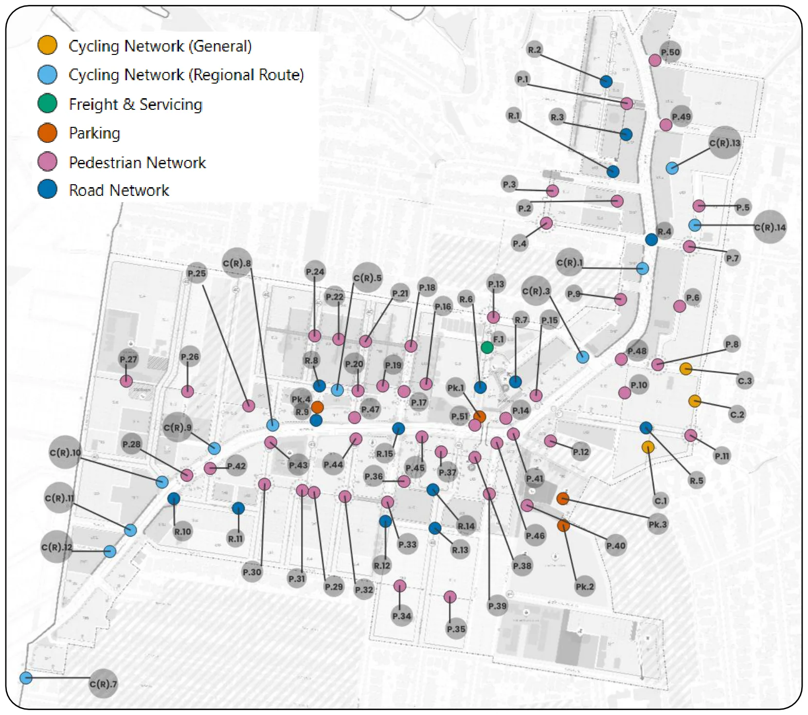

<!-- page 409 -->

Mosman Masterplan – Transport Study

Centre-wide Ref Project Description PT.1 Bus Network Improvements PT.2 Balmoral Beach Service Seek TfNSW review of local bus service catchment in the context of forecasted growth. Some potential considerations include additional service routes to Balmoral from the north, Additional routes between Military Rd (High Street) and Spit Rd, Review of Wharf access coverage. Balmoral Ridge Ref Project Description C.1 Melaleuca Lane to Clifford Street Through-Site Link New through-site link. Primarily for improved cyclists access, though pedestrian access not excluded. C.2 Moruben Road Shared Path Construction of a shared path on the east side of Moruben Road, between Clifford Street and Punch St C.3 Punch Street Mixed-Road Cycling Path Provision of an on-road cycling route between Moruben Road and Punch Lane with a dedicated marked cycle lane in the westbound (uphill) direction. This will connect with the existing on-road cycling route on Punch Street between Punch Lane and Spit Road. P.5 Rawson Street Footpath Works (East Side) Construction of a paved footpath along the eastern side of Rawson Street, aligned along the property boundary line, avoiding existing street trees. P.6 Punch Street Footpath Works (East Side) Construction of a paved footpath along the eastern side of Punch Street. P.7 Awaba Street Pedestrian Refuge Island Construct pedestrian refuge island. Subject to no lane reduction on Awaba Street approach to Spit Road. P.8 Punch Street Pedestrian Crossing Construct mid-block crossing (non-signalised). Treatment type subject to detailed design P.10 Punch Street to Clifford St Through Site Link New through-site link. P.11 Clifford Street Raised Crossing Construct a raised priority crossing on Clifford St, at intersection with Moruben Rd. R.5 Clifford Street LATM Conversion to 40km/h, with associated traffic calming measures. Middle Harbour Ridge Ref Project Description P.2 Mitchell Laneway Footpaths Create/extend pedestrian footpaths through Mitchell Lane, Killarney Lane and Awaba Lane P.3 Killarney St to Awaba St Through-Site Link New through-site link. P.4 Awaba Street Mid-block Crossing Construct mid-block crossing (non-signalised). Treatment type subject to detailed design R.1 Middle Harbour Ridge Access Corridor Upgrades This will isolate future traffic generated in the Middle Harbour Ridge and Spit Road Corridors from the local road network to the east and north, as well as discourage rat runs via Mitchell Rd. Upgrade the route between Mitchell Rd, Mitchell Lane, Killarney Lan and Awaba Lane. This includes a one-way southbound conversion along the whole corridor, with priority over Killarney Street. Isolated road widening works at some bends - footpaths shall also be created/continued through the laneways, covered as a separate item. R.2 Mitchell Road LATM Conversion to 40km/h, with associated traffic calming measures. Military Road Corridor Ref Project Description C(R).5 Regional Cycle Route - Earl Street and Cardinal Street Separated Cycleway

From Bond Street, the cycle route shall continue along Earl Street and Cardinal Street as a short, separated bi- directional cycleway. It is noted that Cardinal Street has been identified for a road closure, and is also close the signalised midblock crossing on Military Road. This makes Cardinal Street a suitable re-entry point to the A8, both for safety, and accessibility between northern and southern character areas. C(R).6 Regional Cycle Route - Military Road Shared Path A shared path along the northern edge of Military Road, between Cardinal Street and Belmont Road. The Shared Path shall then cross over to the southern side of Military Road at this signalised crossing. From Belmont Road, it will continue to Spofforth Street. The initial implementation stage will work within existing road to boundary widths. The paved footpath shall be widened to a minimum of 2.5m wherever feasible, with a buffer (width to TBC) to be maintained to the roadway at all times. Trees shall be retained and treated as 'slow' points, unless the tree is otherwise not of value or approaching end of life. Land dedications from properties adjoining this section shall be formalised through the Masterplan, to enable progressive widening of the shared path, with an ultimate goal of a 4m width plus a safety buffer to the roadway. C(R).7 Regional Cycle Route - Spofforth Street From Military Road, the cycle route shall continue south along Spofforth Street, beyond the boundary of this Masterplan. The objective is to connect into the North Sydney's regional cycling route, which is currently planned for significant upgrades. C(R).8 Regional Cycle Route - Side Road Safety Treatment (Bardwell Rd - North)

Safety treatment upgrade of A8 side road crossing. Treatment may include a priority crossing, continuous footpath treatment (CFT), refuge island, kerb buildout. C(R).9 Regional Cycle Route - Side Road Safety Treatment (Lang St)

Safety treatment upgrade of A8 side road crossing. Treatment may include a priority crossing, continuous footpath treatment (CFT), refuge island, kerb buildout. C(R).10 Regional Cycle Route - Side Road Safety Treatment (Hale Rd)

Safety treatment upgrade of A8 side road crossing. Treatment may include a priority crossing, continuous footpath treatment (CFT), refuge island, kerb buildout.

Military Road Corridor (cont.) Ref Project Description C(R).11 Regional Cycle Route - Side Road Safety Treatment (Prince St - North)

Safety treatment upgrade of A8 side road crossing. Treatment may include a priority crossing, continuous footpath treatment (CFT), refuge island, kerb buildout. C(R).12 Regional Cycle Route - Side Road Safety Treatment (Twin Towers Walk)

Safety treatment upgrade of A8 side road crossing. Treatment may include a priority crossing, continuous footpath treatment (CFT), refuge island, kerb buildout. P.28 Signalised Midblock Crossing on Military Road, near Hale Rd Subject to TfNSW approval. This segment is the longest stretch of the A8 within the LGA without a crossing facility. A signalised crossing at this location is an important final leg in the local east-west pedestrian/cycling corridor to be established through the Prince Street Character area and onto the Mosman Village South. It is particularly important for providing a safe connection to to Middle Harbour Public School via Hale Road. P.42 Side Road Safety Treatment (Snell St) Safety treatment upgrade of A8 side road crossing. Treatment may include a priority crossing, continuous footpath treatment (CFT), refuge island, kerb buildout. P.43 Side Road Safety Treatment (Bardwell Road - south) Safety treatment upgrade of A8 side road crossing. Treatment may include a priority crossing, continuous footpath treatment (CFT), refuge island, kerb buildout. P.44 Side Road Safety Treatment (Wudgong Street) Safety treatment upgrade of A8 side road crossing. Treatment may include a priority crossing, continuous footpath treatment (CFT), refuge island, kerb buildout. P.45 Side Road Safety Treatment (Gurrigal Street) Safety treatment upgrade of A8 side road crossing. Treatment may include a priority crossing, continuous footpath treatment (CFT), refuge island, kerb buildout. P.46 Side Road Safety Treatment (Vista Street) Safety treatment upgrade of A8 side road crossing. Treatment may include a priority crossing, continuous footpath treatment (CFT), refuge island, kerb buildout. P.47 Side Road Safety Treatment (Bond Street) Safety treatment upgrade of A8 side road crossing. Treatment may include a priority crossing, continuous footpath treatment (CFT), refuge island, kerb buildout. Pk.4 Angled On-Street Parking Explore opportunities additional timed angled parking on side roads near commercial-zoned land on Military Road, to support greater access to outer-centre based local businesses. Potential candidates include Bardwell Road, Cardinal St, Bond Street, Snell Street, Glover St and Wudgong St. R.9 Cardinal Street Road Closure Closure of the southern end of Cardinal Street at Military Road as a LATM measure. Minimising vehicle conflict points and creating safer access for pedestrians and cyclists. R.10 Melrose Street Road Closure Closure of the Melrose Street at Military Road as a LATM measure. Minimising vehicle conflict points and creating safer access for pedestrians and cyclists. R.11 Military Road Corridor and Prince St Character Area LATM Conversion to 40km/h through local road network, with associated traffic calming measures. Includes Melrose St, Snell St, Bardwell Road (south of A8) Cardinal St, Wudgong St and Prince St R.15 Cowles Road Military Road Intersection Upgrade Subject to TfNSW approval. Upgrades to the capacities of the Cowles Road north and south legs, including, extension of the right-turn lane from Cowles Road (South) into Military Road (east), creation of a third, short left turn lane from Cowles Road (North) into Military Road (east). Minor land dedications (corner splay of each of the four corner lots) to increase pedestrian standing areas. Mosman Village North Ref Project Description C(R).3 Regional Cycle Route - Ourimbah Road Shared Path A brief segment of shared path along the south of Ourimbah Road, between Spit Road and Hordern Place. This shall be a constrained, but short section. The environment will naturally limit speeds. C(R).4 Regional Cycle Route - Alignment through MVN From Ourimbah Lane, the cycleway will route along shared corridors with pedestrians; the projects along these shared segments are described under the Pedestrian Network category. That route is described here: 1. Continues via the existing shared zone on Hordern Place, and through the proposed Hordern Place road closure, onto Brady St 2. From Brady Street, it continue via the proposed Through-Site Links from Boronia Place, until reaching Bond Street. From here, the cycle route separates from pedestrians. P.13 Brady Street & Ourimbah Road Signalisation Subject to TfNSW approval. Upgrade to a signalised intersection to safely accommodate the projected growth of pedestrians and vehicles crossing here. This is considered an important step in improving safety, but also amenity for the northern 'gateway' into the enhanced Mosman Village North. P.14 Spit Junction to Bridgepoint SC Through-Site Link Creation of a dedicated through-site link, directly aligned from the signalised intersection of Spit Junction, establishing an enhanced connection into the primary retail space. P.15 Spit Road to Hordern Place Through-Site Link Creation of a second through-site link, aligning with the B-Line bus (northbound) bus stop. P.16 Boronia Place Through-Site Link Enhance the public access through Boronia Place for pedestrians and cyclists, along with establishment of one or two through-site links to Cowles Road, as part of wider pedestrian and cycling network alignments. P.41 Spit Junction Pedestrian Overpass Construction of a state-of-the-art pedestrian overpass link between Mosman Village South and North precincts. A potentially iconic infrastructure project that could transform the heart of mosman. Subject to feasibility, the overpass would need to seamlessly integrate into open space areas on each end of the village (or directly into the future Bridgepoint Shopping Centre), with urban design and architectural design being an essential element of success. The driving force behind this project, is the forecasted worsening conditions on the A8 corridor - in particular, a growing friction between pedestrian crossings and through-movements. By separating these movements, an overpass could resolve, or markedly improve conditions for both the local community and through traffic. It is acknowledged that a project of this nature is incredibly complex and will require extensive additional investigation into feasibility, options-testing, and stakeholder engagement prior to Council being in a position to commit. P.51 Side Road Safety Treatment (Brady Street) Safety treatment upgrade of A8 side road crossing. Treatment may include a priority crossing, continuous footpath treatment (CFT), refuge island, kerb buildout.

### Recommendations

## 6.2  Project Reference Table

Collaborate with TfNSW on identifying and implementing bus network improvements, including physical infrastructure, service improvements and advoca

#### 78

### August 2026

### Attachment 1.1.3 Mosman

### Council

<!-- page 410 -->

Mosman Masterplan – Transport Study

Mosman Village North (cont.) Ref Project Description Pk.1 Brady Street Pick Up Drop Off (PUDO) Area As part of the Brady Street closure, a PUDO area will be considered to safely accommodate pick up and drop off activities. R.6 Brady Street Road Closure A mid-block closure of Brady Street for the purposes of eliminating through traffic, and enhancing the street as a 'place-based' gateway into Mosman Village North. There will be opportunities to construct additional communal areas and green space within the closed portion of land. Access requirements for all adjoining properties shall be maintained. Bus rerouting will be required. A pick-up-drop-off area will be considered as part of the works. R.7 Hordern Place and Heydon Street Reconfiguration To enhance this retail space, it is necessary to separate vehicle and service traffic from one of the main entrance routes into the shopping centre. Hordern Street shall be closed between Brady Street and the Bridgepoint Shopping Centre (SC) eastern boundary, to create a civil plaza environment more suitable to this central location. A new section of road shall be created between Hordern Place and Heydon Street, through land dedicated from the SC lot. Hordern Place and the new lane section shall have a one-way circulation restriction - this will likely follow a counter-clockwise motion, driven by servicing vehicle turning requirements. For Heydon Street, both one-way or a retained two-way option shall be explored as part of future design stages. Hordern Place will remain a shared zone, and may be subject to future enhancements including pavement treatments. Mosman Village South Ref Project Description F.1 Micro Freight Hub Explore the possibility of a micro-freight hub within the outer centre area. P.12 Civic Lane Active Frontage Upgrade & Associated Service Lane Modifications

Close Civic Lane between Horsnell Lane and Military Road, which will become an active frontage area (Special- case vehicle access to remain, via collapsible bollards). Reorient Civic Lane from One-way southbound to One- way Northbound. Impose a one-way (westbound) restriction on Horsnell Lane to minimise vehicle conflicts. P.36 Gurrigal St and Cowles Road Through-Site Link A continuation of the MVS-PS-MRC pedestrian/cyclists local corridor. P.37 Gurrigal St and Harbour St Through-Site Link A new through-site link forming a northern branch of the MVS-PS-MRC pedestrian/cyclists local corridor as it enters Mosman Village South (MVS) P.38 Vista St and Harbour St Through-Site Link A new through-site link forming a northern branch of the MVS-PS-MRC pedestrian/cyclists local corridor as it enters Mosman Village South (MVS) P.39 Vista Street Pedestrian Crossing Construction of a raised wombat crossing to support the southern branch of the MVS-PS-MRC local corridor. P.40 The Crescent Road Closure Closure of The Crescent, between Myahgah Road and the future Library Car Park Entrance (TBC). This will enhance the safety and amenity of Council's Civic Centre, the heart of Mosman, by extending the pedestrianised zone through to Allan Border Oval, and creating additional opportunities for communal facilities and larger functions, unconstrained by traffic movements. Pk.2 The Crescent PUDO As part of the The Crescent closure, a PUDO area will be considered to safely accommodate pick up and drop off activities within the Town Centre. Pk.3 The Library Car Park As part of any future redevelopment of the Council Civic Centre and Library Building, a new multi-storey basement car park would be introduced, to increase the supply of off-street parking within the Town Centre area. R.14 Nathan Lane Shared Zone Nathan Lane shall be widened, and converted to a shared zone, forming part of the wider MVS-PS-MRC pedestrian/cyclist local corridor. Ourimbah Triangle Ref Project Description P.17 Cowles Road Southern Midblock Crossing Construct mid-block crossing (non-signalised) aligned with the Boronia Place through-site links. Treatment type subject to detailed design. P.18 Cowles Road Northern Midblock Crossing Construct mid-block crossing (non-signalised) aligned with the northern through-site link to Bond St. Treatment type subject to detailed design. P.19 Cowles Road and Bond Street Through-Site Link New through-site link. P.20 Bond Street Southern Midblock Crossing Construct mid-block crossing (non-signalised). Treatment type subject to detailed design. Aligned with southern through site link. P.21 Bond Street Green Link Crossing Construct mid-block crossing (non-signalised). Treatment type subject to detailed design. Aligned with northern Green Pedestrian Link P.22 Ourimbah Triangle Green Pedestrian Link A series of three through-site links through the core of the new Ourimbah Road character area, aligned between Cowles Road and Countess Street. The link will have a focus on natural green space as a place to encourage congregation and utilisation as well as pedestrian movements. P.24 Rosebery St Green Link Crossing Construction of a raised wombat crossing to connect the Green link. P.25 Bardwell Rd and Lang St Through-Site Link New through-site link. P.26 Lang St and Hale Rd Through- Site Link New through-site link. P.27 Hale Rd and Macpherson St Through-Site Link New through-site link.

Ourimbah Triangle (cont.) Ref Project Description R.8 Ourimbah Triangle LATM Conversion of local road network to 40km/h, with associated traffic calming measures (Bond St, Earl St, Rosebery St, Cardinal St, Bardwell Rd (North of A8), Countess St, Lang Street, Erith St, Prince St and Hale Road. Through the LATM, there will be scope to consider possible one-way restrictions and right -turn bans from select side roads onto Ourimbah Road, to both address safety and discourage rat-runs. Prince Street Ref Project Description P.29 Prince Street CA Green Link A multi-block green link corridor through the Prince Street Character Area, aligning with a key desire link between Mosman Village South and Military Road Corridor. It will be formed by a series of two through-site links (Bardwell Rd-Cardinal St-Wudgong St) and enhancement of the existing pedestrian/cyclist through link between Wudgong Street and Cowles Road by closing Wudgong Walk. The link will have a focus on natural green space as a place to encourage congregation and utilisation as well as pedestrian movements. P.30 Bardwell Road Green Link Crossing Construction of a raised wombat crossing to connect the Green link. P.31 Cardinal Street Green Link Crossing Construction of a raised wombat crossing to connect the Green link. P.32 Wudgong Street Green Link Crossing Construction of a raised wombat crossing to connect the Green link. P.33 Cowles Road Green Link Crossing Construct mid-block crossing (non-signalised). Treatment type subject to detailed design. P.34 Cowles Road to Harbour St Through-Site Link New through-site link. P.35 Vista St to Harbour St Through-Site Link New through-site link. R.12 Cowles Road and Art Gallery Way Roundabout Upgrade the intersection to a roundabout to safely accommodate increasing traffic demands from all approaches. Subject to feasibility, particularly geometric constraints. R.13 Harbour Street and Art Gallery Way Roundabout Upgrade the intersection to a roundabout to safely accommodate increasing traffic demands from all approaches. Spit Road Corridor Ref Project Description C(R).1 Regional Cycle Route - Spit Road Shared Path Upgrade the existing shared path along the eastern edge of Spit Road, between Parriwi Road and Stanton Road. The paved footpath shall be widened to a minimum of 2.5m wherever feasible, with a buffer (width to TBC) to be maintained to the roadway at all times. Trees shall be retained and treated as 'slow' points, unless the tree is otherwise not of value or approaching end of life. Land dedications from properties adjoining this section shall be formalised through the Masterplan, to enable progressive widening of the shared path, with an ultimate goal of a 4.5m width inclusive of safety buffer to traffic

P.1 Stanton Lane Pocket Park Closure of east end of Stanton Lane at Spit Road, to create pocket park and green link for pedestrians and cyclists, whilst also improving local area traffic management. P.9 Dalton Road to Horden Lane Through-Site Link New through-site link. P.48 Side Road Safety Treatment (Punch Street) Safety treatment upgrade of A8 side road crossing. Treatment may include a priority crossing, continuous footpath treatment (CFT), refuge island, kerb buildout. P.49 Side Road Safety Treatment (Stanton Road) Safety treatment upgrade of A8 side road crossing. Treatment may include a priority crossing, continuous footpath treatment (CFT), refuge island, kerb buildout. P.50 Side Road Safety Treatment (Warringah Road) Safety treatment upgrade of A8 side road crossing. Treatment may include a priority crossing, continuous footpath treatment (CFT), refuge island, kerb buildout. R.3 Mitchell Road Service Lane A new service lane shall be created between Stanton Lane and Mitchell Lane, to service future adjoining properties along Spit Road and Mitchell Road. This will ensure no new access points are required along Spit Road. R.4 Awaba St & Spit Road Intersection Upgrade Subject to TfNSW approval. Provide additional intersection capacity for both east and west legs of Awaba Street, through provision of a 3rd turning lane. Land dedication requirements have been identified for several sites.

### Recommendations

## 6.2  Project Reference Table

#### 79

C(R).13 Spit Road to Rawson Street Connection New through-site link, from Spit Road to Rawson Street. C(R).14 Rawson Street & Punch Lane Cycleway Improvements Cycleway Improvements through the rear local roads of Rawson St and Punch Lane, including either shared zone treatments, or quiet street treatments, and crossing safety treatments at Awaba Street and Punch St.

### August 2026

### Attachment 1.1.3 Mosman

### Council

<!-- page 411 -->

#### C H A P T E R S E V E N

## 7

## Implementation

How the Masterplan’s projects are staged, funded and delivered – and the roles of Council, TfNSW and developers.

#### 7.1 Transport Study Process

#### 7.2 Metrics for Objectives

Mosman Masterplan – Transport Study

#### 80

### August 2026

### Attachment 1.1.3 Mosman

### Council

<!-- page 412 -->

### Implementation

## 7.1  Transport Study Process

Mosman Masterplan – Transport Study

#### 81

A staged pathway to agreement

The Masterplan and this transport study have been an iterative process of design, engagement and testing, with each round of feedback refining the transport response. That process followed the same principles set out in the draft TMAP Guidelines shown here.

Combining experience

The study was prepared within a multidisciplinary team led by SJB as lead consultant, responsible for the urban design and architectural framework of the Masterplan. The transport response was developed alongside SJB’s design testing, so that movement, access and public domain outcomes were resolved together rather than in sequence. A wide range of specialist consultants contributed in parallel across their respective fields of expertise, with findings shared through the same workshop cycle so that each discipline informed the others.

Communication as the mechanism

Co-design and collaboration are fundamental to each step, anchored in a governance structure that assigns accountable, responsible and approving parties before technical work begins. Each step carries its own engagement milestones, from the methodology and inception meetings that open the process, through the vision, issues and transport response workshops that shape it, to the validation and implementation plan meetings that close it out. Endorsement of the final plan and its recommended actions rests with the authorities involved throughout, ordinarily DPHI and TfNSW, which is why engagement is continuous rather than reserved for formal exhibition, and why the plan remains open to revision as conditions and opportunities change.

#### 1  Initiate

Pre-lodgement and methodology meetings with TfNSW and Council

#### 2  Understand

Vision and objectives workshop; shared evidence base

#### 3  Test

Issues and transport response workshops

#### 4  Validate

Validation results workshop with governance parties

#### 5  Agree

Implementation plan meeting; endorsement by TfNSW, Council and DPHI

#### Deliver and monitor

Performance reviewed; plan revised as conditions change

Revise

Figure 7-1 – TMAP five-step process and engagement milestones (adapted from TfNSW TMAP Guidelines, 2024 draft)

Council and the project team held initial discussions with the DPHI to understand what criteria the Masterplan would need to meet as part of any planning approval.

During the development of the Masterplan, Council and the project team undertook an extensive LGA-wide community consultation. This process has helped shape the community vision of Mosman’s Spit Junction Town Centre. Furthermore, several workshops were held TfNSW to discuss the Masterplan and understand any concerns or requirements that need to be addressed. Importantly, this process sought to identify areas of collaboration with TfNSW on this once-in-a-generation opportunity to implement improvements over the A8 corridor, including options such as bus indentations.

The proposed transport network was tested and refined on multiple levels; from high-level strategic transport planning principles, through precinct-based movement plans at the character-area level, down to individual considerations such as site access, serviceability, road safety and performance and many more.

Where we are now – the Validate and Agree stage. This draft study will be submitted as part of the planning proposal package to DPHI and TfNSW for review and feedback, forming the validation step before any agreement or approval is reached.

Implementation considerations such as approval pathways, project responsibilities, funding and timing do not form a part of this Study’s scope currently. Notwithstanding, some possible metrics have been recommended in Section 7.2, as a means of monitoring performance over time.

### August 2026

### Attachment 1.1.3 Mosman

### Council

<!-- page 413 -->

### Implementation

## 7.2  Metrics for Objectives

Mosman Masterplan – Transport Study

#### 82

To support implementation of the Masterplan, each of the ten transport objectives has been linked to a set of measurable performance indicators. These indicators establish a baseline for current conditions and enable Council to monitor progress over time. Where possible, they draw on existing data sources, including Census data, Household Travel Survey results, public transport data, crash records, parking occupancy and traffic counts.

Monitoring performance is critical to ensuring the Masterplan delivers measurable outcomes and provides an evidence base for future investment and network management decisions. Baseline conditions should be established now, with indicators reviewed regularly using existing data collection programs and Census updates.

While most indicators can be measured immediately, some – particularly those relating to freight, kerbside activity and place outcomes – will require additional data collection or agreed methodologies before they can be monitored consistently.

# OBJECTIVE METRICS

1 Increase public transport uptake & service quality

● PT mode share & patronage ● Peak-period delay & reliability ● Crowding / capacity utilisation of vehicles and stops

2 Increase cycling trips

● Cycling mode share ● Screenline cyclist counts ● Connected cycle network (km)

3 Encourage local trips to local facilities

● % of Mosman-origin trips with a Mosman destination ● Walk + cycle mode share, trips <2 km ● Average local trip distance

4

5 Improve local road safety

● Crash rate ● Ped / cyclist casualty trend ● KSI at priority intersections

6 Prevent rat-runs

● Through-traffic vs hierarchy threshold ● Local-street AADT trend ● Through- to local-access ratio

7

Maintain local vehicle access to the A8 corridor

● Side-road delay & queuing at A8 access points ● Turn-movement availability / restricted access ● Local vs through-traffic split on A8

8 Support efficient freight and servicing

● Loading zone occupancy & turnover ● Servicing-related kerbside conflicts ● Freight vehicle volumes on local streets

9

Effective parking strategy

● Parking occupancy rate (sensor data) ● Average duration / turnover ● On- vs off-street utilisation

10 Maintain the Place function of Spit Road / Military Road

● Movement & Place alignment ● Pedestrian activity / dwell time ● Pedestrian volumes & crossing delay

Maintain a 30-minute city

● Travel time to key destinations ● % dwellings <30 min of local centre by walking ● % dwellings within 800 m of a centre / key PT stop

### August 2026

### Attachment 1.1.3 Mosman

### Council

<!-- page 414 -->

### Fernway Engineering Pty Ltd

ABN 38 475 511 899

CBD Sydney – Suite 3313, 526/368 Sussex St, Sydney NSW 2000

CBD Melbourne – 805/220 Collins St, Melbourne VIC 3000

info@fernway.net.au

### August 2026

### Attachment 1.1.3 Mosman

### Council

