---

title: E Infrastructure Summary Report

source: Extraordinary Council Meeting - Additional Attachments - 26 August 2026

pages: 538-719

---

# E Infrastructure Summary Report

<!-- page 538 -->

## E

## Infrastructure Summary Report

August 2026

Attachment 1.1.5 Mosman Council

<!-- page 539 -->

## Infrastructure summary

## report

### 5 | 08 | 2026

August 2026

Attachment 1.1.5 Mosman Council

<!-- page 540 -->

© SGS Economics and Planning Pty Ltd 2026

This report has been prepared for Mosman Council. SGS Economics and Planning has taken all due care in the preparation of this report. However, SGS and its associated consultants are not liable to any person or entity for any damage or loss that has occurred, or may occur, in relation to that person or entity taking or not taking action in respect of any representation, statement, opinion or advice referred to herein. SGS Economics and Planning Pty Ltd ACN 007 437 729 www.sgsep.com.au

OFFICES IN CANBERRA, HOBART, MELBOURNE, AND SYDNEY ON THE COUNTRY OF THE NGAMBRI/NGUNNAWAL/NGARIGO, MUWININA/PALAWA, WURUNDJERI, AND GADIGAL PEOPLES.

August 2026

Attachment 1.1.5 Mosman Council

<!-- page 541 -->

## Contents

Executive summary .................................................................................................................................... 5 1. Introduction ...................................................................................................................................... 6 1.1 Project background ................................................................................................................... 6 1.2 Policy context ............................................................................................................................ 8 2. Background and context ................................................................................................................. 10 2.1 Socioeconomic context............................................................................................................ 10 2.2 Forecast Dwellings ................................................................................................................... 12 2.3 Forecast population ................................................................................................................. 12 3. Existing Infrastructure Assessment and Recommendations ........................................................... 15 3.1 Council staff workshops ........................................................................................................... 15 3.2 Open Space .............................................................................................................................. 16 3.3 Community Infrastructure ....................................................................................................... 17 3.4 Transport ................................................................................................................................. 18 3.5 Parking ..................................................................................................................................... 19 3.6 Stormwater .............................................................................................................................. 20 3.7 Utility and Agency Consultation............................................................................................... 20 4. Discussion ....................................................................................................................................... 22 4.1 Conclusion ............................................................................................................................... 22

LIST OF TABLES

Table 1: Workshop agenda 24 April 2026 ................................................................................................ 15

LIST OF FIGURES

Figure 1: Context map ................................................................................................................................ 8 Figure 2: Preferred masterplan option ....................................................................................................... 9 Figure 3: SEIFA map – Mosman LGA ......................................................................................................... 10 Figure 4: SGS Cities & Regions Wellbeing Index – Mosman LGA compared to Greater Sydney ............... 11 Figure 5: BAU vs LMR scenario comparison ............................................................................................. 13 Figure 6: Forecast age breakdown of additional LMR residents ............................................................... 13

August 2026

Attachment 1.1.5 Mosman Council

<!-- page 542 -->

SGS ECONOMICS AND PLANNING: INFRASTRUCTURE SUMMARY REPORT 4

Figure 7: LGA Age breakdown – 2026 vs future ....................................................................................... 14

APPENDICES

Appendix A: SGS Community Infrastructure and Open Space Report ...................................................... 23 Appendix B: SCT Transport Study ............................................................................................................. 24 Appendix C: Infrastructure big list ............................................................................................................ 25

August 2026

Attachment 1.1.5 Mosman Council

<!-- page 543 -->

SGS ECONOMICS AND PLANNING: INFRASTRUCTURE SUMMARY REPORT 5

## Executive summary

Growth enabled by the LMR Policy represents a significant step-change for Mosman, but one Council is well placed to plan for. This report summarises the analysis and research undertaken to identify existing infrastructure gaps and future needs of the community resulting from the expected additional 4,700 dwellings to be delivered within Mosman LGA.

The analysis summarised within this report shows that the existing population in Mosman is reasonably well serviced by infrastructure, notwithstanding the Military Road Spit Junction corridor operating at capacity. However, significant population growth expected from the LMR policy and associated development will put strain on existing infrastructure.

Additional community infrastructure will be required to service the population; this includes the redevelopment of the Barry O’Keefe Library into an integrated community hub, expanding the function and role of existing community facilities to make better use of existing assets for community programming and arts and culture services, the provision of additional indoor courts and exploration of opportunities to provide additional outdoor courts within existing assets. Additional open space will be required in the LGA, and it is recommended that council undertake further planning through the development of an open space strategy and acquisition plan. Council should consider opportunities for reclaiming land, expanding the carrying capacity of existing open space, and the provision of at least 0.5ha of passive open space within the masterplan area.

Expected growth in Mosman and the broader region will place increasing pressure on its already constrained transport network, and council is limited in its ability to address challenges associated with regional road corridors and public transport options. It is recommended that council focus on increasing pedestrian permeability and priority through the LGA, establishing a regional cycling route from the Spit Bridge through the LGA to North Sydney, reducing vehicle speeds where appropriate, improving public transport amenity, reducing off-street parking provision for new high-density development, alongside advocating the state government to improve bus service frequency and reliability and to explore new road connections including new east-west strategic transport links, additional Harbour crossing capacity, and upgrades to strategic interchanges.

Parking constraints will be addressed through the provision of parking within new residential and commercial buildings, additional parking infrastructure items and upgrades forming part of the infrastructure list, including the provision of electronic parking counters and considerations for the upgrade of existing single storey carparks into multi-storey. Stormwater infrastructure is to be further explored under Part 2 of the Mosman Flood Study, with consideration being given to likely future upgrades forming part of the infrastructure list. Consultation with Ausgrid and Sydney Water suggests that most utility impacts from LMR growth are manageable, though detailed assessment will be undertaken during the exhibition of the Mosman Masterplan.

Together, these findings provide the evidence base Council needs to finalise its infrastructure funding framework and to support its advocacy to the NSW Government for the infrastructure investment growth will require.

August 2026

Attachment 1.1.5 Mosman Council

<!-- page 544 -->

SGS ECONOMICS AND PLANNING: INFRASTRUCTURE SUMMARY REPORT 6

## 1. Introduction

#### 1.1

#### Project background

Mosman Council faces a range of planning and infrastructure challenges arising from the NSW Government's Low and Mid-Rise Housing (LMR) Policy and related State-led housing initiatives. These reforms enable increased housing density across established residential areas and are expected to accelerate housing development through both the LMR Policy and State Significant Development (SSD) pathways. Council's primary concern is ensuring that infrastructure provision keeps pace with growth, so that Mosman's character, liveability, and service standards are maintained.

Why Mosman needs to understand infrastructure demand The LMR reforms could substantially increase dwelling yields across the municipality. While the theoretical capacity for additional housing may be high, Council needs to understand the likely rate and location of development uptake over the next 30 years to plan properly for infrastructure demand. The expected increase in population will add further pressure to both local and State-managed infrastructure networks.

Council has identified a need to assess how the LMR Policy will affect Mosman's infrastructure, including parking and traffic, stormwater and drainage, schools and education services, and health services and facilities.

The objective is to understand infrastructure needs for Council-owned assets and to identify broader State infrastructure needs that can support Council's advocacy with the NSW Government. Population growth generated through State policy must be matched by investment in infrastructure that supports both new and existing residents.

Why additional funding is required Mosman's current infrastructure contributions framework is unlikely to support the increased infrastructure demand from future housing growth. Council currently operates under a Section 7.12 Contributions Plan that applies a levy of 1% of estimated development cost. This framework provides limited capacity to fund the scale of infrastructure needed to accommodate growth generated by the LMR Policy.

A key challenge for Council is that State planning reforms may significantly increase development potential while infrastructure funding mechanisms remain largely unchanged. Without an updated funding framework, population growth could outpace infrastructure delivery, resulting in:

- increased congestion and parking pressure - greater demand on community facilities and open space - increased strain on drainage and stormwater systems - reduced accessibility to recreation, education, and health services

August 2026

Attachment 1.1.5 Mosman Council

<!-- page 545 -->

SGS ECONOMICS AND PLANNING: INFRASTRUCTURE SUMMARY REPORT 7

- an overall decline in the quality of local amenity.

Council is currently in the process of applying for a higher rate 7.12 Plan, alongside other complimentary funding mechanisms.

Purpose of this report This study examines the housing growth expected from the LMR Policy and HDA processes, identifies the infrastructure required to support this growth, tests and refines different local contributions funding mechanisms, and develops a preferred contributions strategy along with an updated Contributions Plan. This will enable Mosman to accommodate growth in a managed and sustainable way.

This report comprises the following sections:

• Introduction: outlines the project context, objectives, and overall approach to assessing the infrastructure implications of housing growth arising from the Low and Mid-Rise Housing Policy. • Background and context: provides contextual information relating to the socio-economic standing of the area, alongside estimating future dwelling and population growth to determine the likely demand for additional infrastructure and services. • Existing infrastructure assessment and recommendations: summarises the existing infrastructure in the area, identifies gaps and recommends the infrastructure required to support forecast growth, including social, transport, open space and other infrastructure priorities • Discussion: examines the implications of projected growth and infrastructure needs and summarises recommendations. • Appendices: provides the detailed technical analysis, supporting data and background information that underpin the report’s findings and recommendations. - A: Community infrastructure and open space report: Details the assessment of existing and future community facilities, recreation assets and open space requirements arising from population growth. - B: Transport study: Provides the analysis of future transport demand, network impacts and recommended transport infrastructure responses to support growth. - D: Infrastructure schedule: Contains the comprehensive schedule of potential infrastructure projects considered for delivery, prioritisation and funding through the Contributions Plan.

August 2026

Attachment 1.1.5 Mosman Council

<!-- page 546 -->

SGS ECONOMICS AND PLANNING: INFRASTRUCTURE SUMMARY REPORT 8

#### 1.2

#### Policy context

Low and mid-rise Housing Policy The NSW Government's Low and Mid-Rise Housing (LMR) Policy is a State-led reform that aims to increase density in ‘well located’ regions across NSW. Stage 1 took effect on 1 July 2024, enabling dual occupancies across R2 zones statewide. Stage 2 commenced on 28 February 2025, applying within 800 metres of 171 town centres and stations. It enables low-rise housing (terraces, townhouses, low-rise apartments) on R1/R2 land and mid-rise housing (4–6 storey apartments) on R3/R4 land, with the greatest uplift within 400 metres of each centre. The controls override councils' height and density limits, though councils retain assessment powers over parking, solar access, and lot frontages. Heritage, bushfire-prone, coastal-sensitive, and employment or environmental living land is excluded.

In Mosman LGA, the policy applies to all appropriately zoned land within 800 metres of the Spit Junction and Cremorne town centres. The spatial extent of the policy is seen in the following image.

Figure 1: Context map

Source: SGS Economics & Planning, 2026.

August 2026

Attachment 1.1.5 Mosman Council

<!-- page 547 -->

SGS ECONOMICS AND PLANNING: INFRASTRUCTURE SUMMARY REPORT 9

Mosman Council Masterplan Mosman Council at its meeting on 2 December 2025 resolved to prepare a long-term strategic Masterplan as a way of providing an alternate option to the LMR policy. Following Council’s endorsement at its meeting in April, two masterplan options were made public for early community engagement in April and May of this year. These included a "low and wide" model and a "high and narrow" model, drawing over 4,000 community interactions through surveys, submissions, a webinar, and drop-in sessions. Council considered the community feedback at an Extraordinary Council Meeting on 30 June 2026 and voted in principal to endorse a preferred masterplan, subject to the final option being finessed to address community feedback.

The endorsed preferred option is a hybrid of the two exhibited models, directing almost all future housing growth in the vicinity of the Spit Road and Military Road corridor and at Spit Junction, while keeping surrounding residential and heritage areas largely untouched. The plan also includes a new library, youth centre, senior centre, and flexible community rooms, additional local parks and indoor sports courts, and improved walking and cycling links. The masterplan is to be submitted to DPHI for gateway review in the coming months. The following image shows the spatial extent of the preferred option.

Figure 2: Preferred masterplan option

Source: Mosman Council Website, 2026.

August 2026

Attachment 1.1.5 Mosman Council

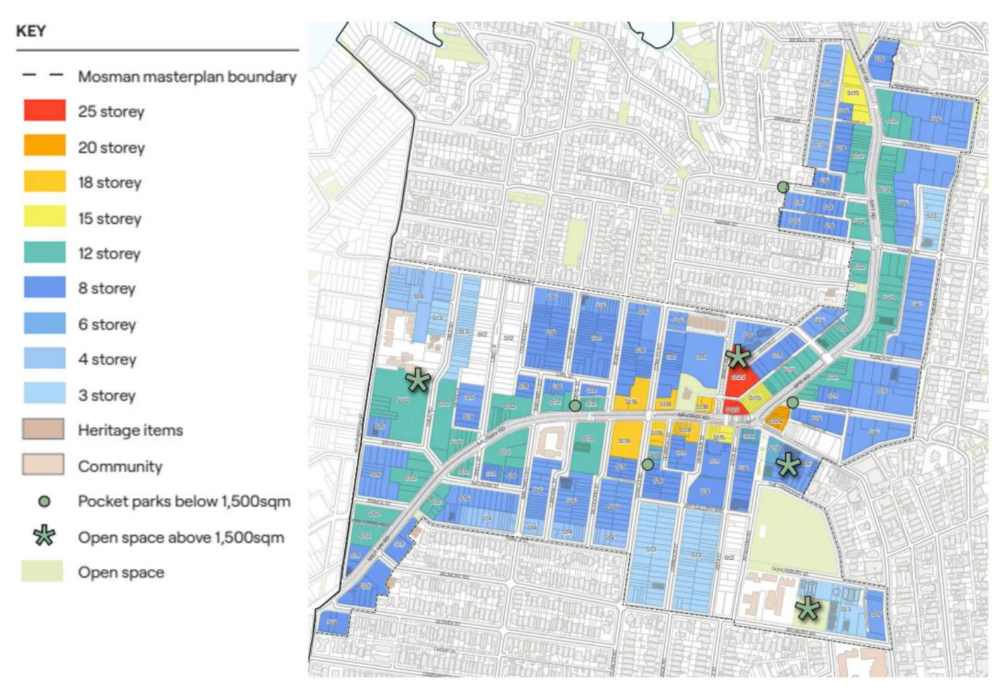

<!-- page 548 -->

SGS ECONOMICS AND PLANNING: INFRASTRUCTURE SUMMARY REPORT 10

## 2. Background and context

#### 2.1

#### Socioeconomic context

Socioeconomic context is important for understanding equitable distribution of services and infrastructure, and where efforts could be focused to improve access into the future.

The Socio-economic Index for Areas The Socio-Economic Index for Areas (SEIFA) presents a measure of relative advantage and disadvantage across a geographic area. It shows areas that may be more advantaged, or disadvantaged, in relation to certain criteria such as education, occupation, and income.

Figure 3 shows the SEIFA Index of Relative Socio-economic Advantage and Disadvantage for Mosman LGA. The LGA and its immediate surrounds are highly advantaged. It should be noted that even within a relatively advantaged area there can still be vulnerable populations such as older people, people with a disability, people who speak limited English, those managing chronic disease, and other health and social issues such as loneliness.

Figure 3: SEIFA map – Mosman LGA

Source: ABS, 2021. Note: The ABS has no data for the areas in white, which are recreational land.

August 2026

Attachment 1.1.5 Mosman Council

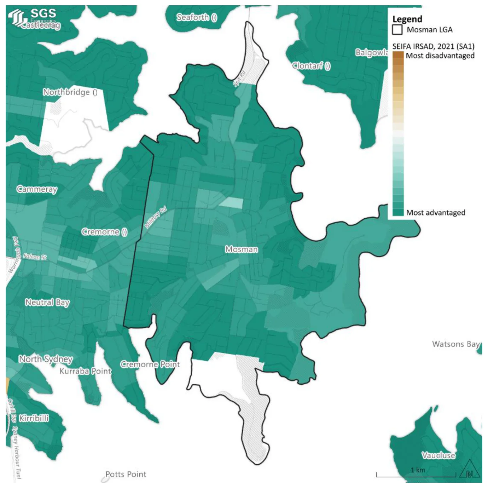

<!-- page 549 -->

SGS ECONOMICS AND PLANNING: INFRASTRUCTURE SUMMARY REPORT 11

SGS Cities & Regions Wellbeing Index The SGS Cities & Regions Wellbeing Index 2024 (CRWI) considers how place impacts community wellbeing.1 Where people live greatly affects their wellbeing and overall quality of life. Despite Gross Domestic Product (GDP) being widely used, it does not fully capture the complexities of wellbeing. The CRWI tracks 7 dimensions and 24 indicators of objective wellbeing.

For the Mosman LGA, the CRWI indicates an overall score of 6.3 out of 10 for wellbeing, a score that is similar to other LGAs on the North Shore, eastern Sydney, The Hills District and Sutherland Shire.

Compared to Greater Sydney, Mosman LGA has a better wellbeing performance in some areas, and lower performance in others. It has a marginally higher level of wellbeing for employment, knowledge and skills; income and wealth; and health indicators. This translates to a higher percentage of dwellings owned outright; higher income, median house prices, life expectancy, higher percentage of population with at most 1 chronic health condition, higher workforce participation, and a higher employment rate. Wellbeing indicators that were ranked lower for Mosman LGA were community, equality and work-life balance, and environment indicators (Figure 4). Examples of what this means are that relatively more Mosman LGA residents are working long hours and there is a larger gender pay gap.

Figure 4: SGS Cities & Regions Wellbeing Index – Mosman LGA compared to Greater Sydney

Source: SGS Economics & Planning, 2025. Note: Data is only available at the LGA level.

1 CRWI 2024 is based on the latest available data by indicator. Data sources can include the ABS Census, NEMA DFRA, National HealthDirect, SGS RAI, ABS National Accounts, ABS Personal Income data for years 2021-2024.

August 2026

Attachment 1.1.5 Mosman Council

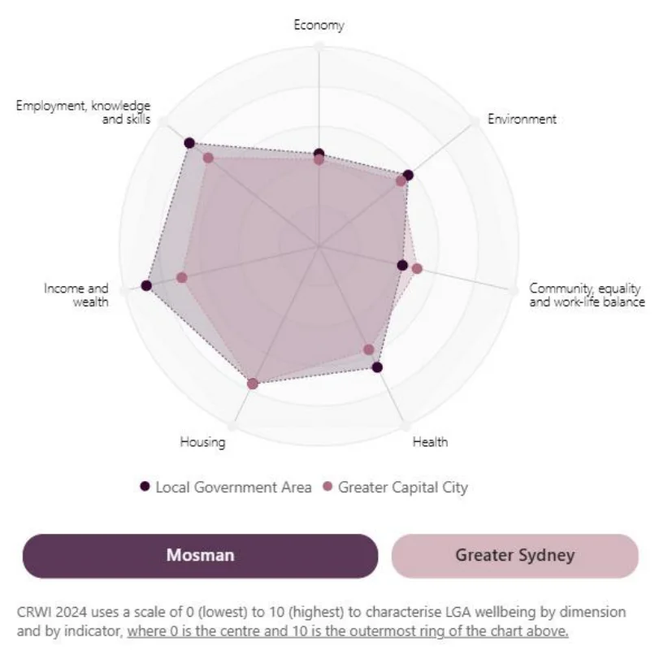

<!-- page 550 -->

SGS ECONOMICS AND PLANNING: INFRASTRUCTURE SUMMARY REPORT 12

#### 2.2

#### Forecast Dwellings

Council in conjunction with SJB and DPHI identified the additional dwelling capacity within Mosman LGA resulting from the LMR policy. This was done through identifying sites that were ‘available’ for development and excluding those that were unlikely to develop due to existing constraints, and using assumptions around dwelling yield and apartment size to determine a total likely floor area to be delivered, which was then converted into total additional dwellings.

It was determined that the LMR policy would result in additional capacity for 4,700 dwellings within the LGA (above existing controls). This number was used as the basis of forecasting the likely future population within the LGA.

#### 2.3

#### Forecast population

Since 2016, Mosman LGA’s population has declined, reducing to 28,329 residents at the time of the 2021 Census. The estimated resident population in 2026 has slightly increased since 2021 to 28,755 residents.

Prior to the LMR policy announcement, the forecast for Mosman LGA was an additional 1,081 people from 2026 to 2051 (total of 29,836) (NSW Department of Planning, Housing and Infrastructure Population Projections).  Since the introduction of the LMR, there is an increase in the forecast housing capacity for this area, with a dwelling capacity of 4,700 additional dwellings. Based on the housing typologies forecast (apartments), an average household size (i.e. persons per household) was applied to the additional housing capacity in the LMR. This results in an additional 9,050 people for the LMR catchment. This catchment, plus the broader LGA population results in a total population capacity of approximately 38,536 (Figure 5).

The build out rate of the LMR is unknown and will largely be driven by market demands and development opportunities. Given this, the dwelling capacity is not time bound. In assessing community infrastructure demands, understanding the full future capacity of growth in the LMR along with the broader municipality ensures that infrastructure needs are reflective of the total population growth across the LGA.

August 2026

Attachment 1.1.5 Mosman Council

<!-- page 551 -->

SGS ECONOMICS AND PLANNING: INFRASTRUCTURE SUMMARY REPORT 13

Figure 5: BAU vs LMR scenario comparison

Source: SGS Economics & Planning, 2026. The demographic breakdown of the forecast population is important to understand in relation to future service needs. Figure 7 provides a summary of the current and future age profile which includes the LMR catchment and typical demographics that are attracted to higher density dwellings. The forecast age breakdown of the additional 9,050 residents in the LMR catchment is shown in Figure 6. This indicates a forecast profile of predominantly 30-39 year olds.

Figure 6: Forecast age breakdown of additional LMR residents

Source: SGS Economics & Planning, 2026. When this profile is integrated with the rest of the LGA, the future proportion of children and young people are lower overall than the current population, and the proportion of older residents will continue to increase (Figure 7).

Future

August 2026

Attachment 1.1.5 Mosman Council

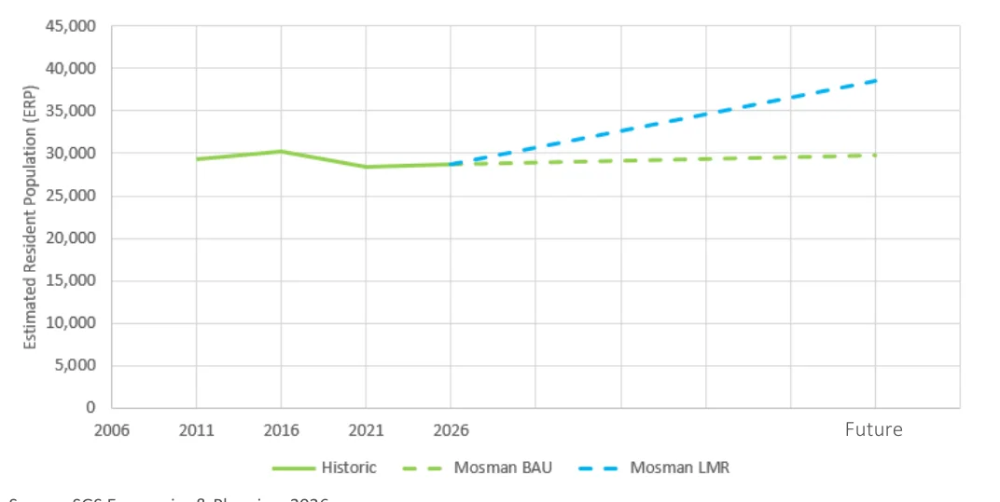

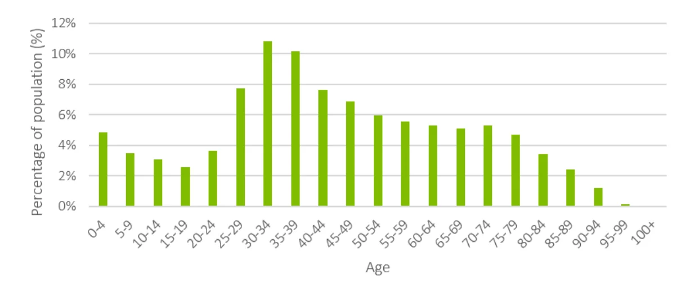

<!-- page 552 -->

SGS ECONOMICS AND PLANNING: INFRASTRUCTURE SUMMARY REPORT 14

Figure 7: LGA Age breakdown – 2026 vs future

Source: SGS Economics & Planning, 2026. This significant increase in forecast population for the LGA will substantially increase demand on existing infrastructure including open space, community facilities, parking and traffic, stormwater and drainage, schools and education services, and health services and facilities.

Mosman's current infrastructure contributions framework is unlikely to support the increased infrastructure demand from future housing growth. Council currently operates under a Section 7.12 Contributions Plan that applies a levy of 1% of estimated development cost. This framework provides limited capacity to fund the scale of infrastructure needed to accommodate growth generated by the LMR Policy.

An assessment of council’s existing infrastructure and future needs has been undertaken to identify gaps in infrastructure. This has been explored in the following sections.

August 2026

Attachment 1.1.5 Mosman Council

<!-- page 553 -->

SGS ECONOMICS AND PLANNING: INFRASTRUCTURE SUMMARY REPORT 15

## 3. Existing Infrastructure Assessment

## and Recommendations

This section summarises the infrastructure assessment and recommendations arising from the Community Infrastructure Needs Assessment (SGS Economics and Planning, Appendix A), Transport Study (SCT Consulting, Appendix B) and extensive consultation with council. These recommendations respond to the forecast population growth and will inform Council's Local Infrastructure Contributions Plan and broader advocacy to the NSW Government. Commentary is also provided on consultation that occurred with state government agencies, including Sydney Water and Ausgrid.

#### 3.1

#### Council staff workshops

A workshop was held with Mosman Council officers on the 24th of April 2026 at Council’s chambers. The purpose of the workshop was to:

- prompt conversation with the relevant teams across council - test early analysis - identify gaps - consider how future masterplanning and infrastructure funding could help to deliver on future assets The agenda from the workshop is outlined below.

Table 1: Workshop agenda 24 April 2026

Item Time

Kick-off (Project team) 10-10:15am

Transport (SCT) 10:15-11am

Engineering / Other assets 11:15am-midday

Lunch Midday-12:30pm

Open Space 12:30-1:15pm

Community Infrastructure 1:30-2:30pm

De-brief (project team) 2:40-3pm

Source: SGS Economics and Planning, 2026 The commentary from the workshop was synthesised into the final infrastructure assessments and has helped to inform the final recommendations outlined in the following sections.

August 2026

Attachment 1.1.5 Mosman Council

<!-- page 554 -->

SGS ECONOMICS AND PLANNING: INFRASTRUCTURE SUMMARY REPORT 16

#### 3.2

#### Open Space

Current Mosman's open space network includes a mix of pocket, local, district, and regional open space, but distribution across the LGA is uneven. The largest regional and conservation areas, including the headlands, sit to the south and south-east, while smaller local and pocket parks are dispersed more widely across the rest of the municipality. Around 91% of dwellings are within 400 metres of open space, falling to 88% once conservation land and the headlands are excluded, and much of this access is to small pocket parks with limited functionality rather than larger, multi-purpose spaces.

Sports fields illustrate a broader constraint. Mosman has 6 sports fields, mostly single ovals, several of which, including Balmoral Park, already support multiple codes across seasons to make the most of limited land. Asset condition is generally good to excellent, though utilisation ranges from around 37% of peak hours at Balmoral Oval to over 55% at Rawson, Middle Head, and Allan Border Ovals. Residents in the LGA's north and west currently fall outside a 5-minute drive of any sports field and rely on facilities in neighbouring LGAs.

The key existing constraint is land, not asset quality. Council has already increased the carrying capacity of several reserves through multi-sport use, lighting, and adjusted maintenance schedules, leaving limited additional capacity to unlock without acquiring new land, a genuinely scarce resource in a compact, largely built-out LGA.

Recommendations The Community Infrastructure Needs Assessment identifies a need for 2 additional outdoor sports fields and 4 additional local playgrounds, one of which should be located within the LMR catchment. Public open space across the LGA has limited scope for expansion, given the small size of the LGA and the lack of surplus land.

Recommended actions include:

- developing an Open Space Strategy that sets Council's future service standards for open space, open space functions, and supporting infrastructure such as playgrounds, dog parks, fitness equipment, and walking trails - developing an open space acquisition plan and actively working with developers and landowners to secure land, focusing on areas outside 400 metres of existing open space - exploring opportunities to reclaim land for public open space, such as roads, carparks, and end- of-life buildings - allocating at least a 0.5 hectare parcel of passive open space within the Master Plan area, ideally as a single parcel - increasing the carrying capacity of existing passive open space and sports reserves, including lighting upgrades and maintenance schedule changes at sites such as Reid Park, Spit West, and Georges Heights Oval - reviewing informal sports fields across the LGA to identify opportunities to host a more formal active sports role

August 2026

Attachment 1.1.5 Mosman Council

<!-- page 555 -->

SGS ECONOMICS AND PLANNING: INFRASTRUCTURE SUMMARY REPORT 17

- continuing to review and maintain playgrounds to respond to community needs, and delivering an additional local playground within the LMR catchment - improving green linkages and connections to open space through future active transport studies - reviewing open space functions, and upgrading existing open space to meet current community infrastructure needs, alongside quantity and capacity improvements.

#### 3.3

#### Community Infrastructure

Current Mosman's community infrastructure network spans libraries, community centres and meeting spaces, youth services, arts and culture, aquatic facilities, and indoor and outdoor sporting courts. Provision centres on a small number of well-used, centrally located assets rather than a broad spread of facilities, and the network relies heavily on co-location and partnership access, including shared use of school facilities at Mosman High School and Queenwood School for Girls.

The Barry O'Keefe Library, the LGA's only library, records over 200,000 annual visits and continues to grow in popularity, but is reaching the end of its asset life and is no longer fit for purpose for contemporary library services. Similarly, the Marie Bashir Mosman Sports Centre provides the LGA's only publicly accessible multi-purpose indoor court, recording a peak-hour utilisation rate of 77% in 2025; the adjoining Drill Hall offers some supplementary space but cannot meet size requirements for sports such as netball and has restricted access.

Mosman is well serviced by arts and culture services, with the Mosman Art Gallery and Community Centre being well located, well utilised, and in good condition. Dedicated theatre and rehearsal space is limited to school facilities with restricted public access. Existing constraints are therefore less about asset quality and more about singularity and capacity, with most service types having only one facility covering the whole LGA, and there is limited scope for physical expansion given Mosman's land constraints.

Recommendations The Community Infrastructure Needs Assessment identifies the Barry O'Keefe Library as the priority community infrastructure response, noting Council has already identified this site for renewal within its Long Term Financial Plan (2025–2035).

The recommended response is to redevelop the library into an integrated community hub, including:

- a contemporary district library service, including consideration of 24-hour access to sections of the library - greater integration with youth services, while retaining a separate entry and exit for the youth centre - an arts rehearsal space with adequate storage, acoustics, flooring, technology, and soundproofing, incorporating a local theatre and performance space through flexible design where feasible, or an outdoor stage if this cannot be accommodated within the facility

August 2026

Attachment 1.1.5 Mosman Council

<!-- page 556 -->

SGS ECONOMICS AND PLANNING: INFRASTRUCTURE SUMMARY REPORT 18

- a range of flexible meeting spaces to support community programs and hire - a commercial kitchen and cool storage to support training and service delivery, such as Meals on Wheels. Beyond the library redevelopment, further recommendations include:

- 1 additional neighbourhood community centre, and a review of the Mosman Village Community Centre's capacity and fitness for purpose - additional flexible meeting spaces across the LGA (4–6 small, 1–3 small to medium, and 1 large meeting room), and an ongoing review of existing meeting space utilisation - exploring the provision and viability of a municipal theatre space, with consideration to flexible and outdoor spaces - internal improvements to the Mosman Art Gallery and Community Centre, and partnerships with Mosman High School and Queenwood School for Girls to improve community access to school-based arts facilities - continued monitoring of demand for aquatic facilities, with a potential partnership with Queenwood School for Girls if additional capacity is required - 3 additional indoor courts, including upgrading the Drill Hall to a netball-compliant size (or an alternative use such as pickleball if this is not feasible), identifying a site for a new 2–3 court facility, and exploring partnership access to Mosman High School's indoor courts outside school hours - reviewing the utilisation of existing outdoor courts and the Mosman Bowling Club for recreation, including opportunities for multi-functional use and increased public access - continuing to monitor demand for early childhood education and care services and supporting additional providers to enter the market where relevant.

#### 3.4

#### Transport

Current Mosman's transport network is anchored by the Military Road – Spit Road corridor, one of the most critical regional links connecting the Northern Beaches to Sydney's CBD, North Sydney, and other employment centres. The corridor is physically constrained by the Spit Bridge and a series of signalised intersections, and functions as both a movement corridor and Mosman's principal activity centre at Spit Junction, where vehicle movement currently takes priority over pedestrian amenity. Around half of Mosman residents drive to work, close to a third use public transport, and a relatively high proportion work locally or from home compared with the Sydney average.

Buses are the dominant public transport mode, with 22 routes running along the corridor. The B-Line is the standout pressure point, where citybound B-Line services arriving at Spit Junction already operate at 100% occupancy and occasionally exceed theoretical capacity. Cycling infrastructure is comparatively underdeveloped, relying mainly on on-road, mixed-traffic conditions and the North Sydney network for onward trips to the CBD.

August 2026

Attachment 1.1.5 Mosman Council

<!-- page 557 -->

SGS ECONOMICS AND PLANNING: INFRASTRUCTURE SUMMARY REPORT 19

The network's core existing constraint is that it has very little spare capacity, with the corridor already sensitive to small changes in traffic volume, the B-Line at capacity, and there being limited scope to expand road capacity given the corridor's physical and heritage constraints.

Recommendations The Transport study recommends a combination of targeted local interventions and State-led strategic investment:

- increasing pedestrian permeability and priority through the LGA, building on Council's Walking & Cycling Strategy - establishing a regional cycling route from the Spit Bridge through the LGA to North Sydney - reducing vehicle speeds where appropriate, to improve safety and discourage car use on local roads - improving public transport amenity, including upgraded bus stops, shelters, seating, and service information - improving bus service frequency and reliability, including exploring a new B-Line service originating in Mosman to relieve pressure south of the Spit Bridge - reducing off-street parking provision for new high-density development – Mosman's current parking rates are the highest of the benchmarked LGAs, despite the area's good transport accessibility. Beyond these local measures, the study recommends that the NSW Government take a leading role in funding and delivering regionally significant transport infrastructure, including new east–west strategic transport links, regional traffic diversion corridors, additional Sydney Harbour and Middle Harbour crossing capacity, expanded rapid public transport, and upgrades to strategic interchanges such as Chatswood. Local government has limited funding capacity and no jurisdiction over the State-managed transport network, so State investment is essential to align housing growth with the transport capacity needed to support it.

#### 3.5

#### Parking

Whilst no formal parking analysis was undertaken, it is expected that localised parking will be impacted in areas of increased density within future master planned area. In consideration of this, there is a need to balance additional parking in new residential buildings with need to reduce car reliance / increase public transport usage.

A review was undertaken of existing assets and of councils Asset Management Plan, and these were tested with Council officers at the project workshop who identified gaps and possible future needs. The following areas of interest were identified for future research:

- Installation of electronic monitoring systems to facilitate more efficient use of existing carparks - Consideration of upgrades to existing single storey carparks into multi-storey

August 2026

Attachment 1.1.5 Mosman Council

<!-- page 558 -->

SGS ECONOMICS AND PLANNING: INFRASTRUCTURE SUMMARY REPORT 20

#### 3.6

#### Stormwater

Whilst no formal parking analysis was undertaken for this study, it is expected that the capacity of the system will be moderately impacted by the expected amount of growth in the area.

A review was undertaken of existing assets and of Council’s Asset Management Plan, and these were tested with Council officers at the project workshop who identified gaps and possible future needs. The following areas of interest were identified for future research:

- Consider incorporating water sensitive urban design measures into future masterplan - Opportunity to bring forward delivery of planned new infrastructure - Opportunity to upgrade / extend existing infrastructure - Consider key flood prone areas identified in section 10.5 of the MHL Mosman LGA Flood Study It is noted that Part 2 of the Mosman Flood study will be delivered in the next 12 months. This study will identify detailed recommendations for stormwater infrastructure upgrades, which will be tied to future infrastructure funding.

#### 3.7

#### Utility and Agency Consultation

Ausgrid Consultation was undertaken with Ausgrid on 16th of July 2026. The purpose of the consultation was to discuss the forecast growth within Mosman LGA and how this was likely to impact existing Ausgrid infrastructure. The following points were raised during the discussion:

- Ausgrid expects minimal impact from most LMR development, as connections are typically handled site-by-site, with developers paying to connect to the 11kV network rather than requiring network upgrades. - Growth from the LMR Policy is largely already factored into Ausgrid's network planning through its forecasting work with the Department of Planning, Housing and Infrastructure. - The Mosman Masterplan has not yet been factored in, and Ausgrid has asked to review it during the masterplan's consultation phase, once the planning proposal is lodged, though development staging and timing remain difficult to predict given they will be market-driven. - Fast EV charging is the area of greatest potential impact, though this depends heavily on charger size and location. Smaller chargers can be readily accommodated, but DC fast chargers above 400kW may require network augmentation or extension, which is harder to deliver for individual developments than for larger sites such as shopping centres. Ausgrid suggests identifying strategic locations able to absorb this additional capacity and cost. It is noted that Mosman Council provided a Masterplan briefing to Ausgrid in May 2026 and further to this, the planning proposal for the masterplan will be formally referred to Ausgrid for comment.

August 2026

Attachment 1.1.5 Mosman Council

<!-- page 559 -->

SGS ECONOMICS AND PLANNING: INFRASTRUCTURE SUMMARY REPORT 21

Sydney Water Consultation was undertaken with Sydney Water on 27th of July 2026. The purpose of the consultation was to discuss the forecast growth within Mosman LGA and how this was likely to impact existing Sydney Water infrastructure. The following points were raised during the discussion:

- Sydney Water needs a formal request for a feasibility review from Council, with more detail on development staging and timing, before it can properly assess Mosman's growth impacts. This feeds its urban growth intelligence, which the network planning team uses for capacity planning. - Sydney Water doesn't individually assess developments under 100 dwellings, relying instead on 10, 15, and 20-year forecasts, and expects most current HDA developments to proceed. - Trunk water and wastewater are the main concern regarding the expected growth within the LGA, with water likely more affected than wastewater, though this will be confirmed with more detailed analysis. It is noted that since the above consultation, council officers have submitted a formal -prefeasibility request with Sydney Water. Furthermore, the planning proposal for the masterplan will be formally referred to Sydney Water for comment.

Other The Community Infrastructure Needs Assessment also took into consideration education and health services, given the effect these services can have on community wellbeing. The analysis showed that:

- NSW Department of Education: There was sufficient public schooling capacity to accommodate the forecast growth in student numbers. As such, no formal consultation was conducted with the department. A recommendation was made in the report that Council continue to work with schools to monitor demand and capacity as growth occurs. It is noted that Council have already provided an online Masterplan briefing session for local primary schools in May 2026. - NSW Health: There were sufficient public health facilities and General Practioners operating within the area to accommodate the existing and future demand within the LGA. As such, no formal consultation was conducted with the department. A recommendation was made in the report that Council continue to work with schools to monitor demand and capacity as growth occurs.

August 2026

Attachment 1.1.5 Mosman Council

<!-- page 560 -->

SGS ECONOMICS AND PLANNING: INFRASTRUCTURE SUMMARY REPORT 22

## 4. Discussion

#### 4.1

#### Conclusion

Growth enabled by the LMR Policy represents a significant step-change for Mosman, but one Council is well placed to plan for. This report summarises the analysis and research undertaken to identify existing infrastructure gaps and future needs. Together, these findings provide the evidence base Council needs to finalise its infrastructure funding framework and to support its advocacy to the NSW Government for the infrastructure investment growth will require.

August 2026

Attachment 1.1.5 Mosman Council

<!-- page 561 -->

SGS ECONOMICS AND PLANNING: INFRASTRUCTURE SUMMARY REPORT 23

## Appendix A: SGS Community

## Infrastructure and Open Space

## Report

August 2026

Attachment 1.1.5 Mosman Council

<!-- page 562 -->

## Community

## infrastructure needs

## assessment

### July 2026

August 2026

Attachment 1.1.5 Mosman Council

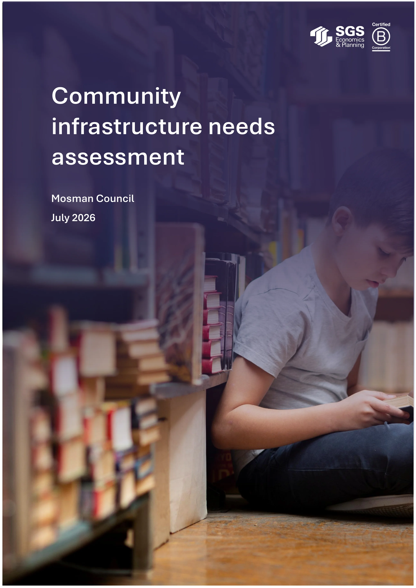

<!-- page 563 -->

© SGS Economics and Planning Pty Ltd 2026

This report has been prepared for Mosman Council. SGS Economics and Planning has taken all due care in the preparation of this report. However, SGS and its associated consultants are not liable to any person or entity for any damage or loss that has occurred, or may occur, in relation to that person or entity taking or not taking action in respect of any representation, statement, opinion or advice referred to herein. SGS Economics and Planning Pty Ltd ACN 007 437 729 www.sgsep.com.au

OFFICES IN CANBERRA, HOBART, MELBOURNE, AND SYDNEY ON THE COUNTRY OF THE NGAMBRI/NGUNNAWAL/NGARIGO, MUWININA/PALAWA, WURUNDJERI, AND GADIGAL PEOPLES.

August 2026

Attachment 1.1.5 Mosman Council

<!-- page 564 -->

## Contents

1. Executive summary ........................................................................................................................... 8 2. Introduction ...................................................................................................................................... 9 2.1 Background and purpose ........................................................................................................... 9 2.2 Community services and infrastructure scope ........................................................................ 11 2.3 Methodology ........................................................................................................................... 11 3. Policy context ................................................................................................................................. 13 3.1 Key themes .............................................................................................................................. 13 4. Current and forecast population .................................................................................................... 15 4.1 Forecast population ................................................................................................................. 15 4.2 Socioeconomic context............................................................................................................ 17 5. Service assessment inputs .............................................................................................................. 20 5.1 Understanding the needs assessment ..................................................................................... 20 6. Service supply and demand ............................................................................................................ 24 6.1 Libraries ................................................................................................................................... 24 6.2 Community venues .................................................................................................................. 29 6.3 Youth centres .......................................................................................................................... 36 6.4 Early childhood education and care services ........................................................................... 40 6.5 Arts and culture ....................................................................................................................... 46 6.6 Aquatic facilities....................................................................................................................... 52 6.7 Indoor courts ........................................................................................................................... 57 6.8 Outdoor recreation .................................................................................................................. 62 6.9 Sports fields ............................................................................................................................. 69 6.10 Public open space .............................................................................................................. 74 6.11 Playgrounds ....................................................................................................................... 80 6.12 Education ........................................................................................................................... 87 6.13 General practitioners ......................................................................................................... 92 6.14 Summary of services needs ............................................................................................... 97 7. Infrastructure recommendations ................................................................................................... 99 7.1 Community infrastructure principles ....................................................................................... 99

August 2026

Attachment 1.1.5 Mosman Council

<!-- page 565 -->

SGS ECONOMICS AND PLANNING: COMMUNITY INFRASTRUCTURE NEEDS ASSESSMENT 4

7.2 Community infrastructure recommendations ....................................................................... 100

LIST OF TABLES

Table 1: Asset condition scoring ............................................................................................................... 20 Table 2: Social infrastructure service standards ....................................................................................... 22 Table 3: Service definition and service standards for libraries ................................................................. 24 Table 4: Existing libraries .......................................................................................................................... 26 Table 5: Supply and demand assessment for libraries ............................................................................. 28 Table 6: Service definition and service standards for community venues ................................................ 29 Table 7: Existing community venues ........................................................................................................ 31 Table 8: Supply and demand assessment for community venues ............................................................ 35 Table 9: Service definition and service standards for youth centres ........................................................ 36 Table 10: Existing youth centres ............................................................................................................... 37 Table 11: Supply and demand assessment for youth centres .................................................................. 39 Table 12: Service definition and service standards for early childhood education and care services ...... 40 Table 13: Existing early childhood education and care services ............................................................... 41 Table 14: Supply and demand assessment for early childhood education and care services .................. 45 Table 15: Service definition and service standards for arts and cultural facilities .................................... 46 Table 16: Existing arts and cultural facilities ............................................................................................. 48 Table 17: Supply and demand assessment for arts and cultural facilities ................................................ 51 Table 18: Service definition and service standards for aquatic facilities .................................................. 52 Table 19: Existing aquatic facilities ........................................................................................................... 54 Table 20: Supply and demand assessment for aquatic facilities ............................................................... 56 Table 21: Service definition and service standards for indoor courts....................................................... 57 Table 22: Existing indoor courts ............................................................................................................... 58 Table 23: Supply and demand assessment for indoor courts ................................................................... 61 Table 24: Service definition and service standards for outdoor courts, lawn bowls, specialist courts ..... 62 Table 25: Existing outdoor recreation ...................................................................................................... 64 Table 26: Supply and demand assessment for outdoor recreation .......................................................... 68 Table 27: Service definition and service standards for outdoor fields ...................................................... 69 Table 28: Existing sports fields ................................................................................................................. 70 Table 29: Supply and demand assessment for outdoor fields .................................................................. 73 Table 30: Service definition and service standards for public open space ............................................... 74

August 2026

Attachment 1.1.5 Mosman Council

<!-- page 566 -->

SGS ECONOMICS AND PLANNING: COMMUNITY INFRASTRUCTURE NEEDS ASSESSMENT 5

Table 31: Accessibility for public open space ........................................................................................... 76 Table 32: Supply and demand assessment for public open space............................................................ 79 Table 33: Service definition and service standards for public open space ............................................... 80 Table 34: Existing playgrounds ................................................................................................................. 81 Table 35: Supply and demand assessment for playgrounds ..................................................................... 86 Table 36: Service definition and service standards for educational facilities ........................................... 87 Table 37: Existing educational facilities .................................................................................................... 89 Table 38: Supply and demand assessment for educational facilities ........................................................ 91 Table 39: Service definition and service standards for GPs ...................................................................... 92 Table 40: Existing GP facilities .................................................................................................................. 93 Table 41: Supply and demand assessment for GPs .................................................................................. 96 Table 42: Summary of service needs ........................................................................................................ 97 Table 43: Guiding principles for the delivery of community services and infrastructure ......................... 99 Table 44: Summary of infrastructure recommendations ....................................................................... 101 Table 45: Strategic directions and strategies relevant to social infrastructure ...................................... 107 Table 46: Strategic directions and strategies relevant to social infrastructure ...................................... 108 Table 47: Responses relevant to social infrastructure ............................................................................ 116 Table 48: Principles relevant to social infrastructure ............................................................................. 116 Table 49: Objectives relevant to social infrastructure ............................................................................ 119 Table 50: Objectives and directions relevant to social infrastructure .................................................... 120 Table 51: Regional public open space .................................................................................................... 122 Table 52: District public open space ....................................................................................................... 122 Table 53: Local public open space .......................................................................................................... 123 Table 54: Pocket parks ........................................................................................................................... 124

LIST OF FIGURES

Figure 1: Context map .............................................................................................................................. 10 Figure 2: Draft masterplan options .......................................................................................................... 10 Figure 3: Methodology ............................................................................................................................. 12 Figure 4: BAU vs LMR scenario comparison ............................................................................................. 15 Figure 5: Forecast age breakdown of additional LMR residents ............................................................... 16 Figure 6: LGA Age breakdown – 2026 vs future ....................................................................................... 16 Figure 7: SEIFA map – Mosman LGA ......................................................................................................... 18

August 2026

Attachment 1.1.5 Mosman Council

<!-- page 567 -->

SGS ECONOMICS AND PLANNING: COMMUNITY INFRASTRUCTURE NEEDS ASSESSMENT 6

Figure 8: SGS Cities & Regions Wellbeing Index – Mosman LGA compared to Greater Sydney ............... 19 Figure 9: Existing libraries ......................................................................................................................... 26 Figure 10: Travel accessibility for libraries ................................................................................................ 27 Figure 11: Existing community venues ..................................................................................................... 31 Figure 12: Travel accessibility for community venues .............................................................................. 34 Figure 13: Existing youth centres ............................................................................................................. 37 Figure 14: Travel accessibility for youth centres ...................................................................................... 38 Figure 15: Existing early childhood education and care services .............................................................. 41 Figure 16: Travel accessibility for early childhood education and care services ....................................... 44 Figure 17: Existing arts and cultural facilities ........................................................................................... 48 Figure 18: Travel accessibility for arts and cultural facilities .................................................................... 50 Figure 19: Existing aquatic facilities .......................................................................................................... 53 Figure 20: Travel accessibility for aquatic facilities ................................................................................... 55 Figure 21: Existing indoor courts .............................................................................................................. 58 Figure 22: Travel accessibility for indoor courts ....................................................................................... 60 Figure 23: Existing outdoor recreation ..................................................................................................... 63 Figure 24: Travel accessibility for outdoor courts .................................................................................... 66 Figure 25: Travel accessibility for lawn bowls and specialist courts ......................................................... 67 Figure 26: Existing sports fields ................................................................................................................ 70 Figure 27: Travel accessibility for outdoor fields ...................................................................................... 72 Figure 28: Existing public open space ....................................................................................................... 75 Figure 29: Travel accessibility for public open space ................................................................................ 77 Figure 30: Travel accessibility for pocket parks ........................................................................................ 78 Figure 31: Existing playgrounds ................................................................................................................ 81 Figure 32: Travel accessibility for playgrounds ......................................................................................... 84 Figure 33: Travel accessibility for playgrounds, with 0-9 years population (2021) ................................... 85 Figure 34: Existing educational facilities ................................................................................................... 88 Figure 35: Travel accessibility for educational facilities ............................................................................ 90 Figure 36: Existing GP facilities ................................................................................................................. 93 Figure 37: Travel accessibility for health facilities .................................................................................... 95

APPENDICES

Appendix A: Policy review ...................................................................................................................... 106

August 2026

Attachment 1.1.5 Mosman Council

<!-- page 568 -->

SGS ECONOMICS AND PLANNING: COMMUNITY INFRASTRUCTURE NEEDS ASSESSMENT 7

Appendix B: Existing open space ............................................................................................................ 122

August 2026

Attachment 1.1.5 Mosman Council

<!-- page 569 -->

SGS ECONOMICS AND PLANNING: COMMUNITY INFRASTRUCTURE NEEDS ASSESSMENT 8

## 1. Executive summary

SGS has conducted this community infrastructure needs assessment (CINA) to understand the impacts of the NSW Government’s Low and Mid-Rise Housing (LMR) Policy on Mosman LGA’s infrastructure. The policy aims to increase housing diversity by changing planning controls to encourage more low and mid-rise housing within 800 metres of town centres and stations. In Mosman, at least 4,700 new homes are to be delivered under the policy.

Mosman Council is exploring an alternative option through a master plan to deliver the same number of new homes (if not, more than) as the LMR but with less of an impact on local amenity and character. The master plan intends to direct growth to more suitable areas with better access to transport, services and centres, like Military Road and Spit Road.

This community infrastructure needs assessment (CINA) considers the following questions:

▪ What type of community services and infrastructure will this community require?

▪ Can future service and infrastructure demands be accommodated in existing infrastructure?

▪ What types of community services and infrastructure should be delivered as part of the future development? Following an audit of existing assets, spatial accessibility of each asset type, and benchmarking to identify future demand, Mosman LGA will require a new integrated community hub with a redeveloped library and youth centre along with additional arts space; an indoor sports centre, and additional open space.

The findings of this study will be used as an input to Council’s Local Infrastructure Contributions Plan and inform broader Council infrastructure decisions and advocacy.

August 2026

Attachment 1.1.5 Mosman Council

<!-- page 570 -->

SGS ECONOMICS AND PLANNING: COMMUNITY INFRASTRUCTURE NEEDS ASSESSMENT 9

## 2. Introduction

#### 2.1

#### Background and purpose

The NSW Government’s Low and Mid-Rise Housing (LMR) Policy intends to increase medium density housing within 800 metres of town centres and stations (metro, light and heavy rail) (Figure 1). It introduces a significant step-change in the way additional housing growth may be realised across established areas. Council is exploring the opportunity to further refine the LMR across the LGA through the development of a Master Plan noting the LMR would significantly impact local amenity. The Master Plan intends to direct growth to areas with better access to transport, services and centres along with areas that have capacity to increase density. This includes 2 options as noted in Figure 2.

Additional growth raises concerns about balancing new residential needs alongside the capacity of existing local infrastructure. In response to the government policy agenda, Mosman Council is looking to understand what infrastructure is needed to support growth. This includes considering community infrastructure, transport and active transport, drainage and stormwater.

The purpose of this report is to focus on community infrastructure needs. This includes identify the existing network of community infrastructure, the capacity of this infrastructure to respond to the forecast growth capacity, and how any infrastructure gaps can be resolved. In doing this assessment, consideration has been given to the location of additional growth as well as other network improvements that can support access to community infrastructure which are recommended through the Transport Study.1

1 SCT, 2026, Mosman LMR Infrastructure Impact Study - Transport study

August 2026

Attachment 1.1.5 Mosman Council

<!-- page 571 -->

SGS ECONOMICS AND PLANNING: COMMUNITY INFRASTRUCTURE NEEDS ASSESSMENT 10

Figure 1: Context map

Source: SGS Economics & Planning, 2026.

Figure 2: Draft masterplan options

Source: Mosman Council, 2026.

August 2026

Attachment 1.1.5 Mosman Council

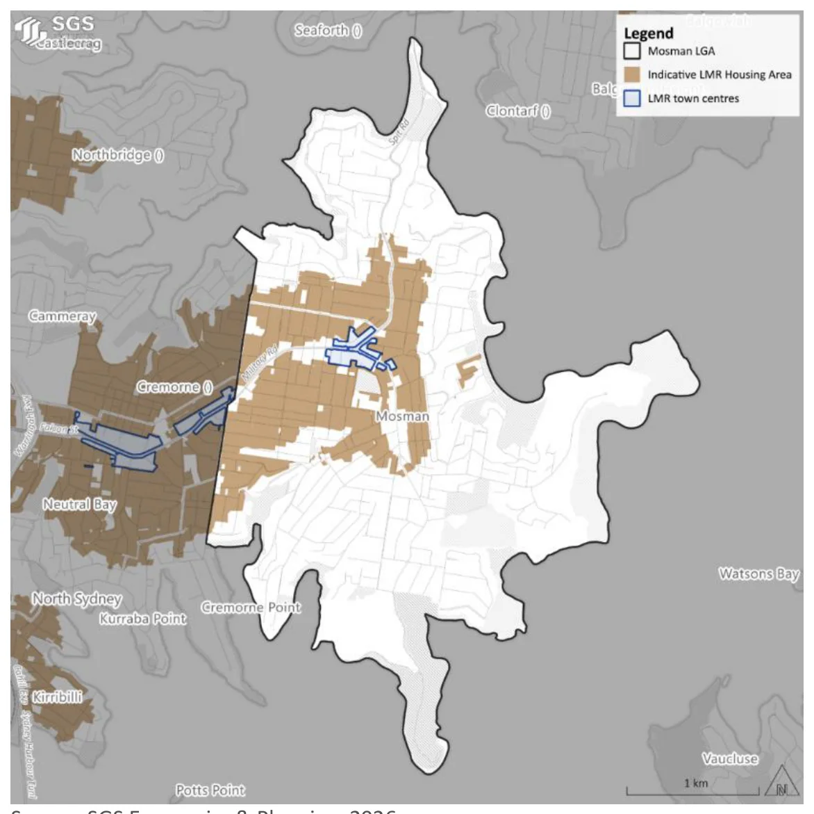

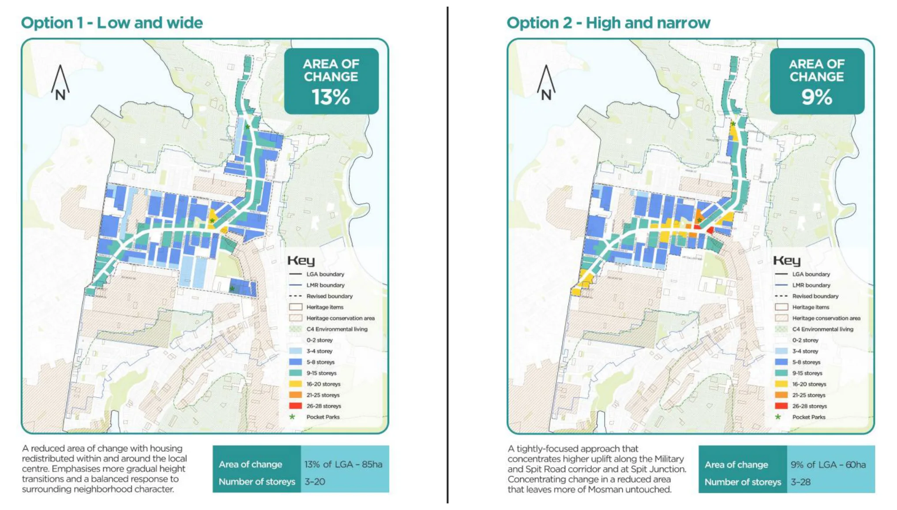

<!-- page 572 -->

SGS ECONOMICS AND PLANNING: COMMUNITY INFRASTRUCTURE NEEDS ASSESSMENT 11

#### 2.2

#### Community services and infrastructure scope

The needs assessment includes key community services and the supporting infrastructure. The focus is primarily on local government provided services and infrastructure, given Mosman Council’s role and ability to directly influence service and infrastructure outcomes. The study does however also include early childhood education, schools, and general practitioners, noting the significant impact that these services can have on community wellbeing if access is not available.

▪ Libraries

▪ Community venues (community centres, meeting spaces)

▪ Youth centres

▪ Early childhood education and care (pre- school, long day care)

▪ Arts and culture (performing arts, galleries, rehearsal spaces, art studios)

▪ Aquatics and leisure centres

▪ Indoor courts

▪ Outdoor courts

▪ Sports fields

▪ Public open space including playgrounds

▪ Education (Government primary and secondary schools)

▪ General Practitioners.

#### 2.3

#### Methodology

The assessment of the community infrastructure includes a range of inputs along with qualitative and quantitative assessments across 3 stages. This includes:

▪ Stage 1: Inputs and assumptions that consider catchments, population, existing and planned infrastructure, and infrastructure benchmarks

▪ Stage 2: Needs assessment and service recommendations based on a quantitative and qualitative assessment including feedback from stakeholders

▪ Stage 3: Infrastructure recommendations considering the principles of community infrastructure across the service needs. The findings from this report will directly inform the Master Plan as well as future funding, partnerships and advocacy directions for Council.

August 2026

Attachment 1.1.5 Mosman Council

<!-- page 573 -->

SGS ECONOMICS AND PLANNING: COMMUNITY INFRASTRUCTURE NEEDS ASSESSMENT 12

Figure 3: Methodology Source: SGS Economics & Planning, 2026.

August 2026

Attachment 1.1.5 Mosman Council

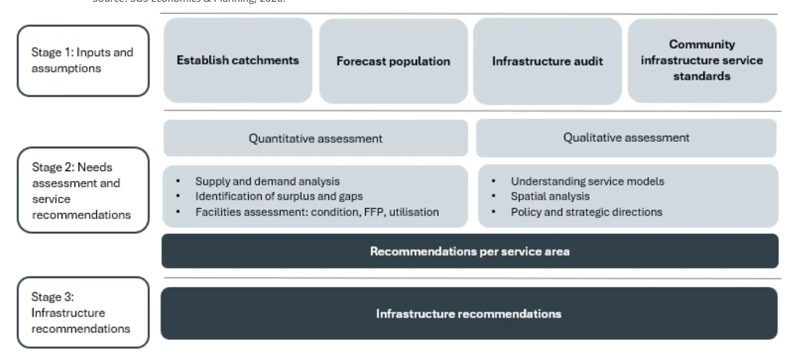

<!-- page 574 -->

SGS ECONOMICS AND PLANNING: COMMUNITY INFRASTRUCTURE NEEDS ASSESSMENT 13

## 3. Policy context

The following section provides an overview of the current policy, including the overall context and challenges with existing infrastructure. The outcomes of this review have been used to support the future directions of community services and infrastructure in the LGA.

#### 3.1

#### Key themes

A review of strategies and policies at the federal, state and local level provided strategic context in relation to community infrastructure provision in the Mosman LGA. This resulted in three key themes:

▪ Community infrastructure will need to support changing demographics

▪ There are constraints with providing community infrastructure

▪ The utilisation of existing community infrastructure could be improved. The documents included in the review, along with a detail summary of each of the documents, can be found in Appendix A.

Community infrastructure will need to support changing demographics Prior to the announcement of the LMR, the Community Strategic Plan 2025-2035 and Local Strategic Planning Statement (2020) highlighted that Mosman LGA’s demographics were shifting towards an ageing population, with an increase in lone person households, increase in the number of people living with a disability, and fewer children. While this is likely to shift slightly with the increase in high density living through the LMR and Master Plan, many of these demographic characteristics will likely remain across the broader LGA. This is further discussed in Section 4.

As suggested in the Community Strategic Plan 2025-2035 and the Open Space Recreational Needs Assessment (2015), community infrastructure needs to respond to changing demographics, as well as changing community trends. This is occurring across most infrastructure, including an increase in female participation in sports putting pressure on ill-equipped pavilions, young people seeking dedicated spaces for programs and events, and older people having less reliance or connection with stand-alone senior specific programs and infrastructure.

Social isolation is also an increasing challenge across NSW. Inclusive community infrastructure is vital in building social capital and connections across diverse and vulnerable community groups including older residents, young people, and single-person households, who are more at risk of social isolation.

Strategic plans for Greater Sydney such as The Sydney Plan (draft) (2025) and the preceding A Metropolis of Three Cities (2018) seek to locate people near jobs, services, amenities and infrastructure. Housing growth (medium to high density infill development) means access to quality open space will be increasingly important for people living in higher density who lack, or have minimal, access to private open space.

August 2026

Attachment 1.1.5 Mosman Council

<!-- page 575 -->

SGS ECONOMICS AND PLANNING: COMMUNITY INFRASTRUCTURE NEEDS ASSESSMENT 14

Mosman LGA is also being impacted by broader growth and community infrastructure needs across the region. The NRSOC Social and Cultural Infrastructure Strategy (2020) identified the need for a district level multi-purpose community centre, as well as a municipal creative arts centre and community performance facility. The locations of these proposed facilities are not specified.

There are constraints with providing community infrastructure There is a growing expectation of community infrastructure and services – including providing a high level of environmental amenity, liveability, and quality landscapes, including walking and cycling infrastructure. According to the Local Strategic Planning Statement (2020), tourism is already placing pressure on local amenity, infrastructure and the environment, and whilst there are opportunities to improve existing infrastructure, there are challenges regarding the management of the spaces and financial constraints. The Social and Cultural Infrastructure Strategy (2020) recognises that at the regional level, grant funding from higher levels of government is needed to sustainably deliver and operate community infrastructure.

As noted in the Local Strategic Planning Statement (2020), there is a limited ability to provide everything sought after by the community. The small size of the LGA and unsuitable land (e.g. heritage items, bushfire prone land) in the LGA means there is a lack of surplus land for additional infrastructure. The Community Strategic Plan 2025-2035 further notes that population growth will not be large enough to raise sufficient revenue needed to meet all community expectations.

Open space is a key asset that is approaching capacity and is difficult to increase the quantity of land due to the high land costs. The Local Housing Strategy (2020) notes that there is fragmented ownership of residential lots, which would make it even more challenging to agglomerate land parcels for strategic redevelopment.

Utilisation of existing community infrastructure could be improved Acknowledging there is limited land to build new facilities the Open Space Recreational Needs Assessment (2015) suggests increasing the use of existing facilities by improving the quality and capacity of infrastructure. This includes off-peak utilisation (particularly for indoor and outdoor sports courts and shared use of school grounds and facilities).

At the regional level, best practice is co-locating community infrastructure and services, having flexible multi-purpose spaces, and considering a network approach (having a network of facilities of different hierarchies across the region so that they complement each other and efforts are not duplicated). The Social and Cultural Infrastructure Strategy (2020) notes that the latter could involve councils within the region sharing facilities and collaborating with each other, as well as partnerships between councils, state and federal governments, not-for-profits, the private sector, and developers to enable shared use of facilities.

The Open Space Recreational Needs Assessment (2015) reveals inequalities in accessing open space (aside from the LGA’s east), while the Mosman Community Mapping Report (2018) mentions difficulty in residents locating state and federal level community services that are provided regionally and often outside of the LGA.

August 2026

Attachment 1.1.5 Mosman Council

<!-- page 576 -->

SGS ECONOMICS AND PLANNING: COMMUNITY INFRASTRUCTURE NEEDS ASSESSMENT 15

## 4. Current and forecast population

#### 4.1

#### Forecast population

Since 2016, Mosman LGA’s population has declined, reducing to 28,329 residents at the time of the 2021 Census. The estimated resident population in 2026 has slightly increased since 2021 to 28,755 residents.2

Prior to the LMR policy announcement, the forecast for Mosman LGA was an additional 1,081 people from 2026 to 2051 (total of 29,836).3 Under this Business as Usual (BAU) scenario, it is forecast that of that growth approximately 790 residents would be within the now LMR Housing Investigation areas, and the remaining 300 residents outside of these areas.

Since the introduction of the LMR, there is an increase in the forecast housing capacity for this area, with a dwelling capacity of 4,700 additional dwellings. Based on the housing typologies forecast (apartments) an average person per household ratio was applied to the forecast housing capacity in the LMR. This results in an additional 9,050 people for the LMR catchment. This catchment, plus the broader LGA population results in a total population capacity of approximately 38,536 (Figure 4).

The build out rate of the LMR is unknown and will largely be driven by market demands and development opportunities. Given this, the dwelling capacity is not time bound. In assessing community infrastructure demands, understand the full future capacity of growth in the LMR along with the broader LGA ensures that infrastructure needs are reflective of the total capacity of growth that is available.

Figure 4: BAU vs LMR scenario comparison

Source: SGS Economics & Planning, 2026.

2 Population, dwelling, workforce and employment projections by Transport for NSW (TZP24 projections) have been used. 3 ibid.

Future

August 2026

Attachment 1.1.5 Mosman Council

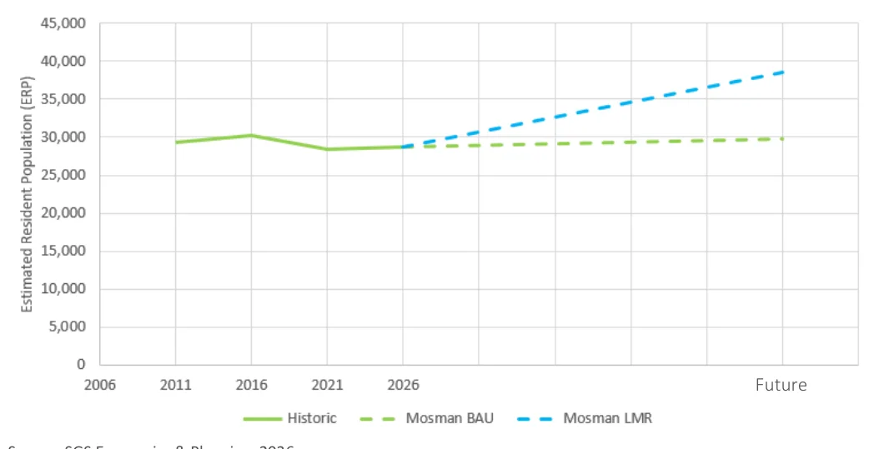

<!-- page 577 -->

SGS ECONOMICS AND PLANNING: COMMUNITY INFRASTRUCTURE NEEDS ASSESSMENT 16

The forecast demographic breakdown of the population is important to understand in relation to future service needs. Figure 6 provides a summary of the current and future age profile which includes the LMR catchment and typical demographics that are attracted to higher density dwellings. The forecast age breakdown of the additional 9,050 residents in the LMR catchment is shown in Figure 5. This indicates a forecast profile of predominantly 30-39 year olds.

Figure 5: Forecast age breakdown of additional LMR residents

Source: SGS Economics & Planning, 2026. When this profile is integrated with the rest of the LGA, the future proportion of children and young people are lower overall than the current population, and the proportion of older residents will continue to increase (Figure 6).

Figure 6: LGA Age breakdown – 2026 vs future

Source: SGS Economics & Planning, 2026.

August 2026

Attachment 1.1.5 Mosman Council

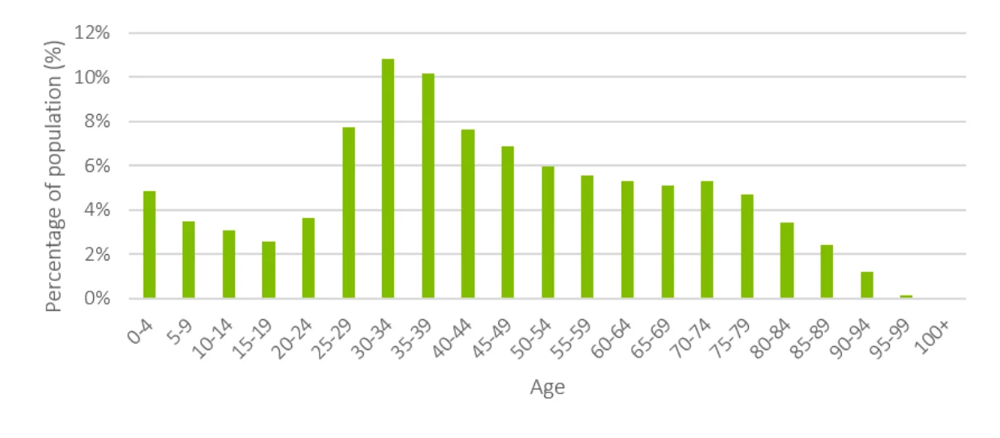

<!-- page 578 -->

SGS ECONOMICS AND PLANNING: COMMUNITY INFRASTRUCTURE NEEDS ASSESSMENT 17

#### 4.2

#### Socioeconomic context

Socioeconomic context is important for understanding equitable distribution of services and infrastructure, and where efforts could be focused to improve access into the future.

The Socio-economic Index for Areas The Socio-Economic Index for Areas (SEIFA) presents a measure of relative advantage and disadvantage across a geographic area. It shows areas that may be more advantaged, or disadvantaged, in relation to certain criteria such as education, occupation, and income.

Figure 7 shows the SEIFA Index of Relative Socio-economic Advantage and Disadvantage for Mosman LGA. The LGA and its immediate surrounds are highly advantaged. It should be noted that even within a relatively advantaged area there can still be vulnerable populations such as older people, people with a disability, people with limited English, those managing chronic disease, and other health and social issues such as loneliness.

August 2026

Attachment 1.1.5 Mosman Council

<!-- page 579 -->

SGS ECONOMICS AND PLANNING: COMMUNITY INFRASTRUCTURE NEEDS ASSESSMENT 18

Figure 7: SEIFA map – Mosman LGA

Source: ABS, 2021. Note: The ABS has no data for the areas in white, which are recreational land.

SGS Cities & Regions Wellbeing Index The SGS Cities & Regions Wellbeing Index 2024 (CRWI) considers how place impacts community wellbeing.4 Where people live greatly affects their wellbeing and overall quality of life. Despite Gross Domestic Product (GDP) being widely used, it does not fully capture the complexities of wellbeing. The CRWI tracks 7 dimensions and 24 indicators of objective wellbeing.

4 CRWI 2024 is based on the latest available data by indicator. Data sources can include the ABS Census, NEMA DFRA, National HealthDirect, SGS RAI, ABS National Accounts, ABS Personal Income data for years 2021-2024.

August 2026

Attachment 1.1.5 Mosman Council

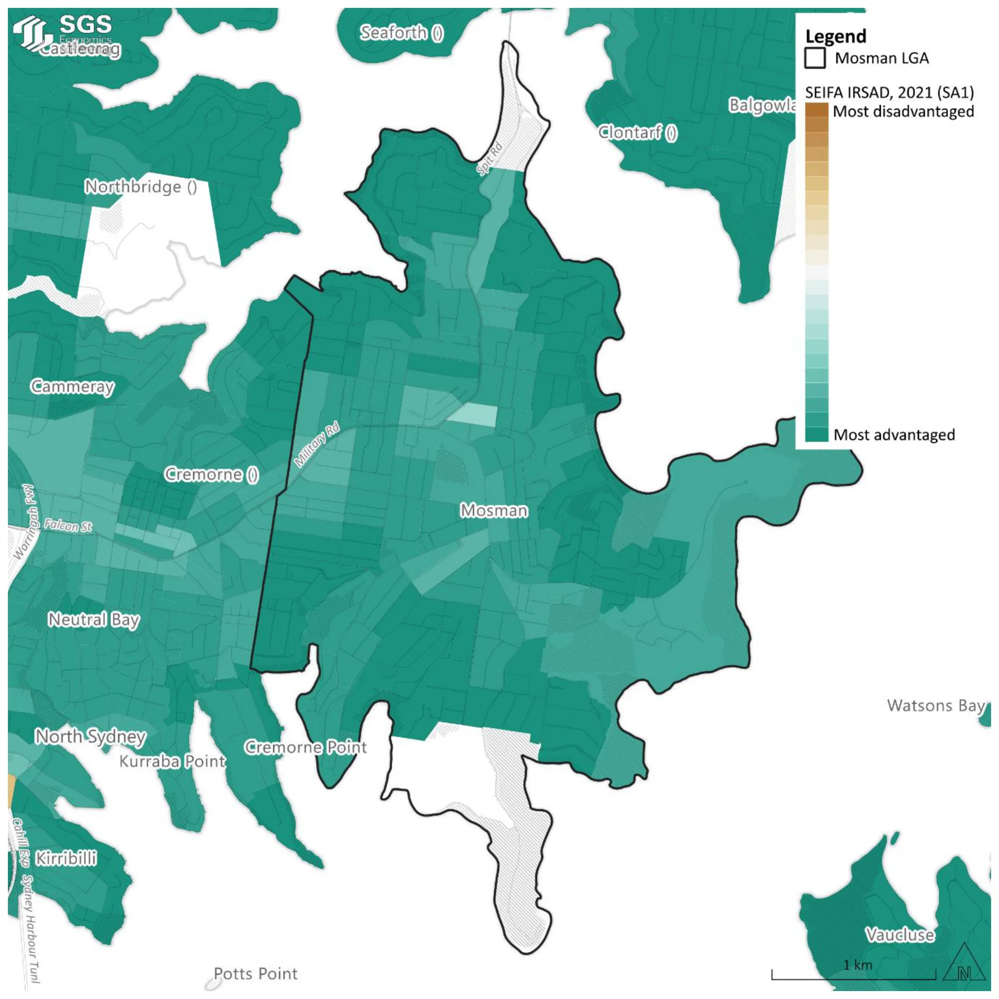

<!-- page 580 -->

SGS ECONOMICS AND PLANNING: COMMUNITY INFRASTRUCTURE NEEDS ASSESSMENT 19

For the Mosman LGA, the CRWI indicates an overall score of 6.3 out of 10 for wellbeing, a score that is similar to other LGAs on the North Shore, eastern Sydney, The Hills District and Sutherland Shire.

Compared to Greater Sydney, Mosman LGA has a better wellbeing performance in some areas, and lower performance in others. It has a marginally higher level of wellbeing for employment, knowledge and skills; income and wealth; and health indicators. This translates to a higher percentage of dwellings owned outright; higher income, median house prices, life expectancy, higher percentage of population with at most 1 chronic health conditions, higher workforce participation, and a higher employment rate. Wellbeing indicators that were ranked lower for Mosman LGA were community, equality and work-life balance, and environment indicators (Figure 8). Examples of what this means are that relatively more Mosman LGA residents are working long hours and there is a larger gender pay gap.

Figure 8: SGS Cities & Regions Wellbeing Index – Mosman LGA compared to Greater Sydney

Source: SGS Economics & Planning, 2025. Note: Data is only available at the LGA level.

August 2026

Attachment 1.1.5 Mosman Council

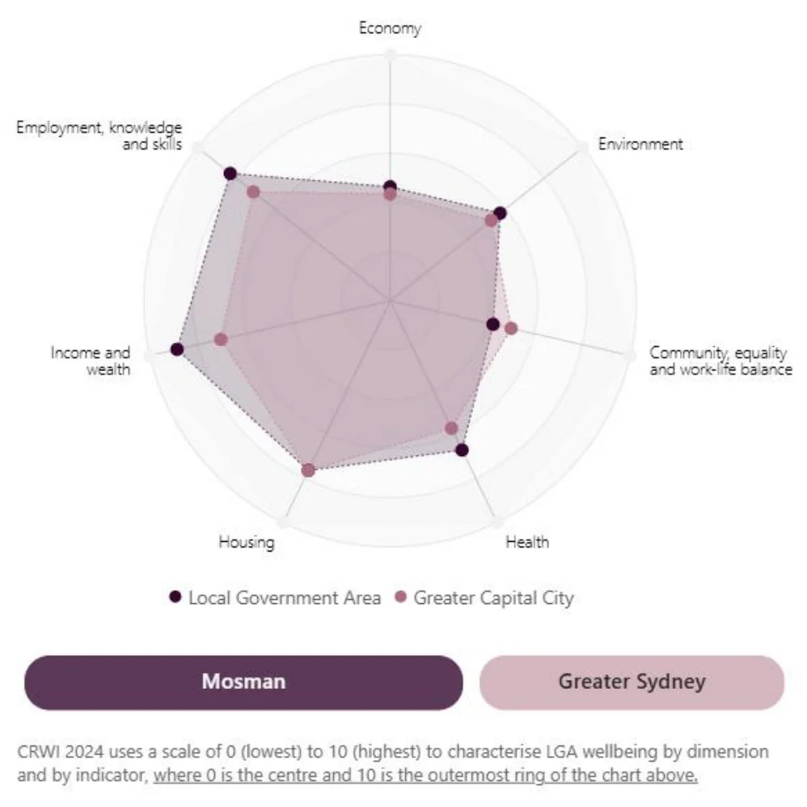

<!-- page 581 -->

SGS ECONOMICS AND PLANNING: COMMUNITY INFRASTRUCTURE NEEDS ASSESSMENT 20

## 5. Service assessment inputs

#### 5.1

#### Understanding the needs assessment

The needs assessment includes several inputs, including asset condition, utilisation, accessibility, and service standards. Each of these inputs help inform the understanding of current and future service and infrastructure needs.

Asset condition Asset condition scores provide an understanding of the physical state of existing infrastructure. These scores are used to inform renewal and maintenance budgets to ensure that assets are managed to achieve an optimal asset life.

This assessment includes asset condition data collected by Council. The building components are individually assessed and an average asset score from 1-5 was provided for each building, 1 being excellent and 5 being very poor (Table 1).

Table 1: Asset condition scoring

Criteria Scoring

Average score of the condition of individual components: structure, roof/gutters, fit out and footings.

1 – 1.9 Excellent

2 – 2.9 Good

3 - 3.9 Average

4 – 4.9 Poor

5 Very poor/failed

Source: Mosman Municipal Council, 2025.

Utilisation Utilisation assesses how well facilities are being used. The utilisation of a facility considers capacity against the current level of use. The assessment indicates where existing infrastructure has capacity for more use and may be able to accommodate the increasing demands from population growth without the need to build new infrastructure.

Council has limited utilisation data. Where data is available, this has been included. In addition, where Council has provided general service feedback or utilisation has been noted in existing strategies, a qualitative assessment has been taken applying: good (at capacity), average (has some additional capacity) or bad (has a significant amount of additional capacity available).

August 2026

Attachment 1.1.5 Mosman Council

<!-- page 582 -->

SGS ECONOMICS AND PLANNING: COMMUNITY INFRASTRUCTURE NEEDS ASSESSMENT 21

Council should continue to improve its understanding of utilisation of existing facilities to further inform opportunities to increase capacity either within current facilities or through the development of new infrastructure.

Travel accessibility Travel accessibility mapping has been included to understand how accessible community infrastructure is from residents. This helps identify where there might be a service gap based on access. This data, along with supply and demand, can aid in understanding what level of service and locational response might be required.

While people will access facilities by various modes of travel (walking, cycling, public transport, driving), in this assessment, travel times are calculated based on drive time to provide consistency.

Different levels and types of community infrastructure have been allocated different drive time benchmarks ranging from 5 minutes for local level facilities up to 35 minutes for regional level facilities.

Community infrastructure services standards The community infrastructure included in the assessment has been assigned a service standard and benchmark. Community infrastructure benchmarks are used as a starting point to understand demand for infrastructure based on population. They should be used alongside the infrastructure audit and the qualitative assessment to inform recommendations. There is no state government-adopted community infrastructure service standards. Given this, service standards applied in this assessment are derived from NSROC strategies, SGS’ experience in similar LGAs and feedback from Council. Each hierarchy level provides a different level of service, with local providing basic service and infrastructure to meet the local population (within a 5-minute drive time). In comparison, regional level infrastructure provides a larger service mix and more significant infrastructure. In doing so, it services a broader population catchment (within a 35-minute drive time). For example, 1 local library per 25,000 people which provides basic library services compared to 1 central library per 80,000 people which provides a full-service library plus specialised collections and increased programming. An inner metropolitan local government area like Mosman LGA should provide a diversity of infrastructure types across the service network. The summary of service standards is provided in Table 2. The definition of each facility type is provided in Section 6.

August 2026

Attachment 1.1.5 Mosman Council

<!-- page 583 -->

SGS ECONOMICS AND PLANNING: COMMUNITY INFRASTRUCTURE NEEDS ASSESSMENT 22

Table 2: Social infrastructure service standards

Facility type Hierarchy Benchmark (facility: persons)

Travel accessibility (minutes) Libraries

Libraries

Central 1:80,000 20 District 1:45,000 10 Local 1:25,000 5 Community centres Community centre Local 1:20,000 10

Meeting rooms

Small 1:4,000 5 Small to Medium 1:8,000 5 Medium 1:8,000 5 Medium to Large 1:8,000 5 Large 1:20,000 5 Youth Youth centre Central 1:80,000 15-20 Early childhood education and care services Long day care Local N/A 5 Preschool Local 1:167 5 Arts and culture Performing arts centre Regional 1:400,000 30-40 Gallery Sub-regional 1:150,000 30-40 Theatre Municipal 1:80,000 15-20 Rehearsal space District 1:30,000 10 Arts studio/workshop Local 1:20,000 5 Aquatics Aquatics Regional 1:120,000 30-40 District 1:60,000 15 Local 1:25,000 5 Indoor courts Indoor court Local 1:10,000 10 Outdoor recreation Outdoor court Local 1:3,500 5 Lawn bowls green Local 1:40,000 10 Specialist court Local 1:16,500 10 Open space Sports field Local 1:5,000 5

August 2026

Attachment 1.1.5 Mosman Council

<!-- page 584 -->

SGS ECONOMICS AND PLANNING: COMMUNITY INFRASTRUCTURE NEEDS ASSESSMENT 23

Facility type Hierarchy Benchmark (facility: persons)

Travel accessibility (minutes) Public open space Various (Pocket Park, Local Park, District, Regional)

30sqm per capita 400 metres

Playground Local 1:2,000 400 metres District 1:8,000 Regional 1:50,000 Education Government Primary 1 place per participating child

5

Secondary 1 place per participating child

10

Health General Practitioners Local 117 GPs per 100,000 5

Source: SGS Economics & Planning, 2025.

Nesting – supply and demand Nesting of community infrastructure occurs in infrastructure with multiple hierarchies of the same service type.

Nesting considers that higher order infrastructure also plays a lower order role. For example, in the case of libraries, a regional library also serves as a district and local library to those catchments, and district level libraries also serve as a local library for local residents. Without nesting, there is a risk of overprovision of lower level infrastructure beyond what is required.

Nesting has been applied across the supply and demand analysis where required.

August 2026

Attachment 1.1.5 Mosman Council

<!-- page 585 -->

SGS ECONOMICS AND PLANNING: COMMUNITY INFRASTRUCTURE NEEDS ASSESSMENT 24

## 6. Service supply and demand

The following section provides an overview of each of the community infrastructure services provided in the LGA, future service demand, and overall service need.

#### 6.1

#### Libraries

Definition The following table provides an overview of the service definition and service standards for libraries. There are 3 hierarchies of libraries, local, district and central. Local libraries are generally no longer provided in metropolitan areas due to the limited capacity, service offer, and operational costs.

Table 3: Service definition and service standards for libraries

Facility type – service definition hierarchy Benchmark Travel accessibility

Central A major library facility that is used by the local community including those that live, work, learn and visit the LGA.

1 facility per 80,000 people

20 minutes

District The facility provides the full library offering along with key literary collections and learning/event spaces and can include specialises spaces such as maker spaces. These libraries should be integrated with other facilities and services such arts and culture, community centres, early learning, and cafes.

1 facility per 45,000 people

10 minutes

Local Local libraries are generally no longer provided in inner metropolitan areas due to service viability and good access to larger library facilities. They can be useful however where there are service accessibility gaps and a smaller service offer could be viable. They are generally a small facility that operates as a satellite library service point. Designed as ‘self-service’, these facilities provide space for people to browse and loan books and media collections and children specific collections. These facilities can be located within community centres or municipal buildings. Alternative local library options include library kiosks – used to drop off and pick up resources. Operating hours and size depend on the facility that the service is integrated into.

1 facility per 25,000 people

5 minutes

Source: SGS Economics & Planning, 2026.

August 2026

Attachment 1.1.5 Mosman Council

<!-- page 586 -->

SGS ECONOMICS AND PLANNING: COMMUNITY INFRASTRUCTURE NEEDS ASSESSMENT 25

Existing infrastructure There is 1 district library located in the Mosman LGA, Barry O’Keefe Library. This library is well located, within close proximity to the Spit Junction. The facility is open 7 days a week, including 2 evenings until 9pm. The library provides a range of resources as well as programs such as technology workshops, book clubs, story time sessions for children, and other events. It is also home to the Mosman Local Studies Collection.

The library has high utilisation, with over 200,000 annual visitations and visitor numbers continuing to grow.5 While the asset is in relatively good condition, it is reaching the end of its asset life and no longer fit for purpose to meet future contemporary library service needs.

The Council Long Term Financial Plan 2025-2035 notes that the library and/or the adjacent carpark is to be renewed over the next 6 to 10 years. Council has undertaken some initial investigations with directions to establish an integrated library and community hub featuring a range of services, greater connection with youth services, and flexible spaces that better meet future needs.

Council objectives for the site include:

▪ A welcoming and inclusive Civic Hub

▪ Support for lifelong learning and digital inclusion

▪ Flexible and adaptable spaces

▪ Enhancing connectivity with the Village Green and Allan Border Oval

▪ Sustainable design

▪ Maximised underground parking and minimised above ground vehicle access

▪ Reflecting Mosman’s cultural identity and heritage

▪ Design excellence with a landmark building.

5 Mosman Council, 2025, Annual Report 2024-25

August 2026

Attachment 1.1.5 Mosman Council

<!-- page 587 -->

SGS ECONOMICS AND PLANNING: COMMUNITY INFRASTRUCTURE NEEDS ASSESSMENT 26

Figure 9: Existing libraries

Source: SGS Economics & Planning, 2026.

Table 4: Existing libraries

# Facility name Hierarchy Location Asset condition Utilisation

1 Barry O’Keefe Library District 33 The Crescent, Mosman 2 Good

Outside of LGA

2 Northbridge Library Local 258 Sailors Bay Rd, Northbridge N/A N/A

Source: SGS Economics & Planning, 2026, Mosman Municipal Council, 2025.

August 2026

Attachment 1.1.5 Mosman Council

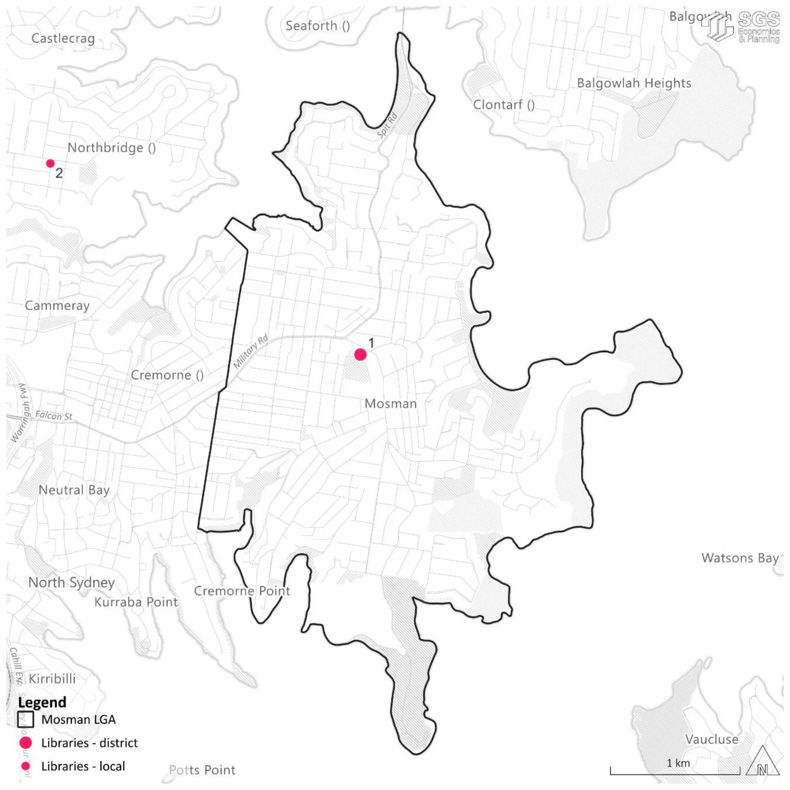

<!-- page 588 -->

SGS ECONOMICS AND PLANNING: COMMUNITY INFRASTRUCTURE NEEDS ASSESSMENT 27

Travel accessibility catchment Barry O’Keefe Library is in the heart of the LGA. It is located off Military Road, which is well serviced by bus connections, and can support broader community access, as well as future growth.

Barry O’Keefe Library is accessible to almost all of the LGA’s residents within a 10-minute drive, as well as residents in the neighbouring North Sydney LGA. The next closest library is Stanton Library, followed by St Leonards Library, both of which are district libraries, but are not accessible to Mosman LGA residents within a 10-minute drive. Within a 10-minute driving catchment, Cremorne is the maximum extent, as seen in the map below. There is also a local library north-west of the LGA, Northbridge Library. It has limited services and the local catchment also does not capture any Mosman LGA residents.

Figure 10: Travel accessibility for libraries

Source: SGS Economics & Planning, 2026.

August 2026

Attachment 1.1.5 Mosman Council

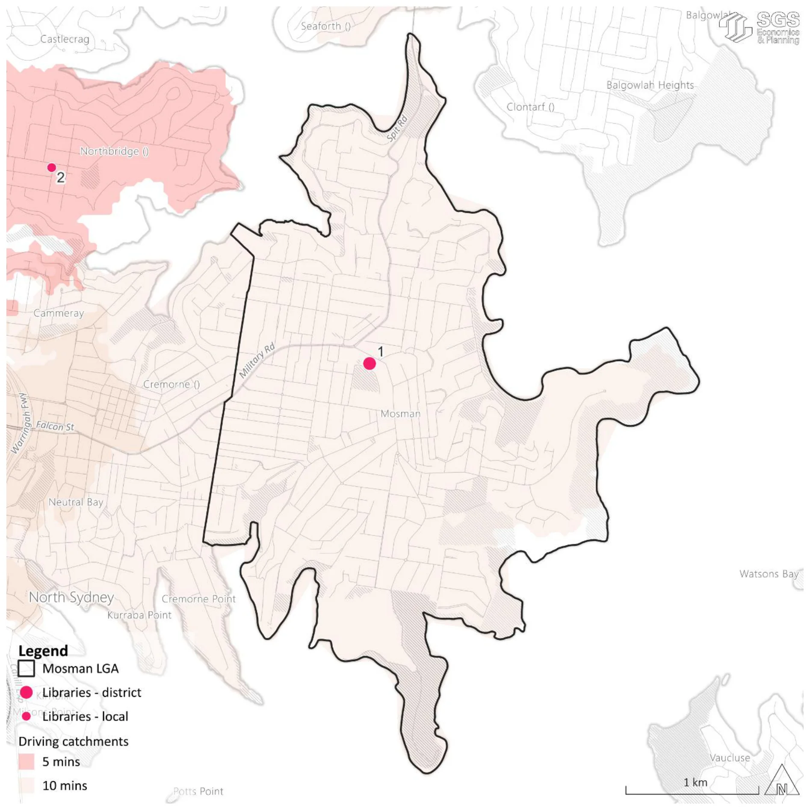

<!-- page 589 -->

SGS ECONOMICS AND PLANNING: COMMUNITY INFRASTRUCTURE NEEDS ASSESSMENT 28

Supply and demand Based on the existing supply and forecast population, a district level library service will meet population needs. There is also demand for 0.5 of a central library service. This level of demand is not sufficient to sustain a central level library; however, some residents will likely require access to higher order library services such as specialised collections, meeting spaces, and broader library programs and events.

While there is not adequate demand for a full central level library, given the LGA will continue to only have one library service, it is recommended that the existing district library enhance its offerings, ensuring that it is fit for purpose, continues to provide space for the Mosman Local Studies Collection, can be flexible to changing programs and events to accommodate future needs – including 24hr access opportunities.

To achieve the greatest level of utilisation from library services, where possible, they should be co- located and or integrated with other complementary services. This could include youth services, arts and culture, community centres, and civic services. These opportunities will be further discussed in Section 7.

Table 5: Supply and demand assessment for libraries

Hierarchy Existing supply Future demand Future gap or surplus

Central 0 0.5 -0.5

District 1 0.9 0.1

Source: SGS Economics & Planning, 2026.

Summary of service needs:

▪ Redevelop Barry O’Keefe Library to ensure it can cater for contemporary district library services as well as some Central level library service offerings, including the consideration of 24hr access.

August 2026

Attachment 1.1.5 Mosman Council

<!-- page 590 -->

SGS ECONOMICS AND PLANNING: COMMUNITY INFRASTRUCTURE NEEDS ASSESSMENT 29

#### 6.2

#### Community venues

Definition Community venues include community centres as well as flexible meeting spaces. The following table provides an overview of the service definition and service standards for these services.

Table 6: Service definition and service standards for community venues

Facility type – service definition hierarchy Benchmark Travel accessibility

Community centres Local community facility that provides a range of coordinated programs and services that support people to connect, learn and participate in social, educational, recreational, and health activities. These facilities can be run by council or a not-for-profit. They also offer bookable meeting spaces, event spaces, and activity spaces that can be used by local organisations and the community to deliver programs and activities.

Historically, senior citizens centres and University of the Third Age (U3A) facilities were often delivered separately to community centres. Such models provide important programs and activities for older persons, but should be integrated at multipurpose, intergenerational community centres in accordance with contemporary best practice.

1 facility per 20,000 people

10 minutes

Meeting rooms: Small (1- 20 people)

Bookable spaces for general community and service use. They provide flexible spaces for meetings, programs (e.g. seniors groups, playgroups) activities (e.g. art, play, education) and events (e.g. civic events, birthdays, celebrations). Meeting rooms are multi-purpose and available for casual or long-term hires and vary in size. They may be standalone facilities or situated within large centres/ buildings. Any new meeting spaces should be integrated with other services. These spaces are typically managed by council or a not for profit, and some may be included within private facilities.

1 room per 4,000 people

5 minutes

Meeting rooms: Small to Medium (21-50 people)

1 room per 8,000 people

5 minutes

Meeting rooms: Medium (51-100 people)

1 room per 8,000 people

5 minutes

Meeting rooms: Medium to Large (101-200 people)

1 room per 8,000 people

5 minutes

Meeting rooms: Large (>200 people)

1 room per 20,000 people

5 minutes

Source: SGS Economics & Planning, 2026.

August 2026

Attachment 1.1.5 Mosman Council

<!-- page 591 -->

SGS ECONOMICS AND PLANNING: COMMUNITY INFRASTRUCTURE NEEDS ASSESSMENT 30

Existing infrastructure Mosman LGA currently has 1 community centre, the Mosman Village Community Centre, which is well- utilised. It was renamed from the Mosman Square Seniors Centre to establish itself as a more inclusive community centre. It provides a range of services and programs and holds recreational activities such as mahjong, yoga, chess, table tennis, and arts and craft. The asset condition of the community centre is average.

Outside of the LGA, the nearest community centres are north of the LGA: Seaforth Village Community Centre and North Balgowlah Community Centre. Seaforth Village Community Centre holds programs for neurodivergent youth and art classes for kids. North Balgowlah Community Centre, on the other hand, hosts STEM workshops for kids, yoga classes, playgroups, and guided floor classes, Manly Vale Community Centre is located further away however has more diverse offerings, with belly dance classes, social table tennis, playgroups, printmaking classes, and a soccer program for children. These community centres also each include 2-3 meeting rooms.

North Sydney LGA’s Forsyth Park and Neutral Bay Community Centres are also located close to Mosman LGA. During the week, Forsyth Park Community Centre is leased to Cameragal Montessori School and Forsyth Park Playgroup (on Thursdays), and on weekends, the venue is available for hire. The Neutral Bay Community Centre, on the other hand, runs a range of activities on weekdays, such as computer lessons, interest groups (e.g. for walking, board games, singing, instruments and arts), and health and fitness classes.

In relation to flexible meeting spaces, there is a diversity of meeting rooms across the LGA. Most are in facilities that are in a good asset condition, aside from Mosman Bowling Club, which has an average asset condition. Other than Drill Hall, a heritage-listed hall, which is reported to have good utilisation, utilisation for other facilities is unknown. Meeting rooms are mostly medium sized, however there is at least 1 of every other size. Location-wise, meeting rooms tend to be clustered near Spit Junction, with only 2 facilities outside of this location (Balmoral Oval Pavilion and Drill Hall). The Mosman Civic Centre also has 2 meeting rooms available during weekdays.

The Mosman Art Gallery and Community Centre includes a main hall and two smaller multi-purpose rooms that can be hired for performances, celebrations, meetings, classes, and workshops. The asset condition of Mosman Art Gallery and Community Centre is good.

NSROC’s Social and Cultural Infrastructure Strategy (2020) recommends that the Mosman LGA develop a district multi-purpose community centre. As noted in the library section, Council are currently exploring this possibility alongside an integrated library service.

August 2026

Attachment 1.1.5 Mosman Council

<!-- page 592 -->

SGS ECONOMICS AND PLANNING: COMMUNITY INFRASTRUCTURE NEEDS ASSESSMENT 31

Figure 11: Existing community venues

Source: SGS Economics & Planning, 2026.

Table 7: Existing community venues

# Facility name Hierarchy Location Count Asset condition 2 Mosman Village Community Centre

Community centre 573 Military Rd, Mosman 1 3

2 Mosman Village Community Centre

Meeting rooms: Small (1- 20 people)

573 Military Rd, Mosman 1 3

1 Mosman Art Gallery and Community Centre

Meeting rooms: Small to Medium (21-50 people)

1 Art Gallery Way, Mosman 1 2

August 2026

Attachment 1.1.5 Mosman Council

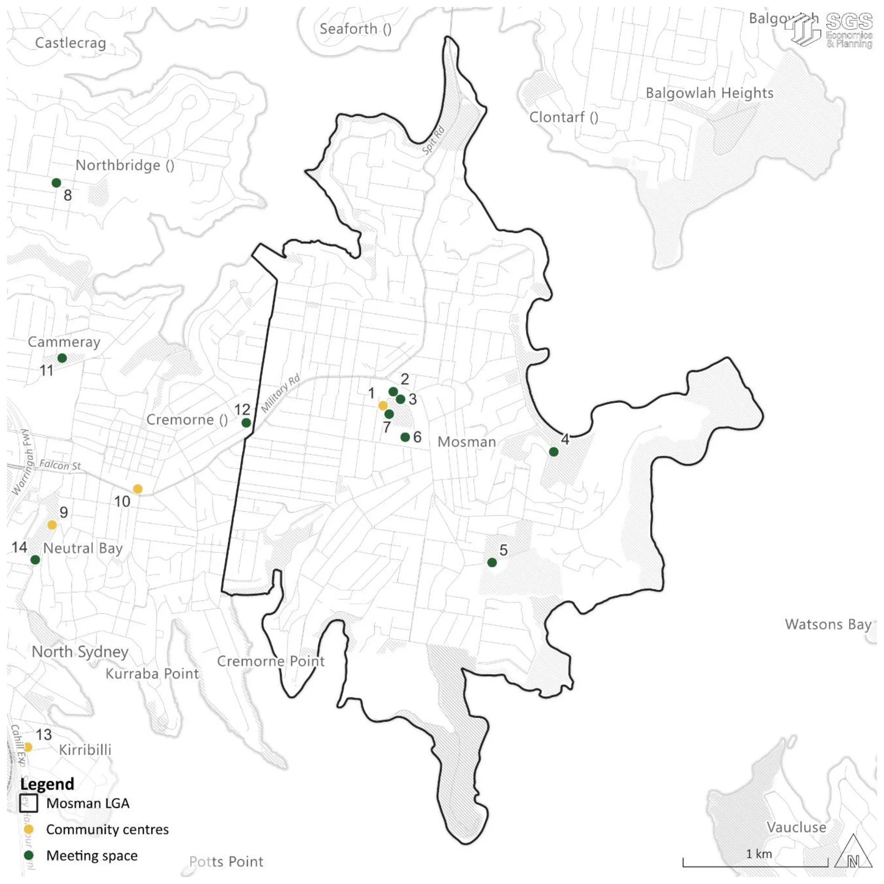

<!-- page 593 -->

SGS ECONOMICS AND PLANNING: COMMUNITY INFRASTRUCTURE NEEDS ASSESSMENT 32

# Facility name Hierarchy Location Count Asset condition 1 Mosman Art Gallery and Community Centre

Meeting rooms: Medium (51-100 people)

1 Art Gallery Way, Mosman 1 2

2 Mosman Village Community Centre

Meeting rooms: Medium (51-100 people)

573 Military Rd, Mosman 2 3

2 Mosman Civic Centre Meeting rooms: Medium (51-100 people)

573 Military Rd, Mosman 2 1

3 Mosman Youth Centre Meeting rooms: Medium (51-100 people)

33 The Crescent, Mosman 1 2

5 Drill Hall* Meeting rooms: Medium (51-100 people)

1 Cross St, Mosman 1 2

4 Balmoral Oval Pavilion Meeting rooms: Medium to Large (101-200 people)

42 Plunkett Rd, Mosman 1 2

6 Mosman Bowling Club Meeting rooms: Medium to Large (101-200 people)

15 Belmont Rd, Mosman 1 3

7 Allan Border Oval Building Meeting rooms: Medium to Large (101-200 people)

29 Myahgah Rd, Mosman 1 1

1 Mosman Art Gallery and Community Centre

Meeting rooms: Large (>200 people)

1 Art Gallery Way, Mosman 1 2

Outside of LGA

9 Forsyth Park Community Centre Community centre 2B Montpelier St, Neutral Bay

1 N/A

10 Neutral Bay Community Centre Community centre Shop 3/190-192 Military Rd, Neutral Bay

1 N/A

13 Kirribilli Community Centre Community centre 16-18 Fitzroy St, Kirribilli 1 N/A

12 Cremorne Early Childhood Centre

Meeting rooms: Small (1- 20 people)

108 Parraween St, Cremorne

1 N/A

13 Kirribilli Neighbourhood Centre Meeting rooms: Small (1- 20 people)

16-18 Fitzroy St, Kirribilli 6 N/A

14 Centre in the Park Meeting rooms: Small (1- 20 people)

2A Montpelier St, Neutral Bay

2 N/A

8 Northbridge Community Space Meeting rooms: Small to Medium (21-50 people)

258 Sailors Bay Rd, Northbridge

1 N/A

9 Forsyth Park Community Centre Meeting rooms: Small to Medium (21-50 people)

2B Montpelier St, Neutral Bay

1 N/A

August 2026

Attachment 1.1.5 Mosman Council

<!-- page 594 -->

SGS ECONOMICS AND PLANNING: COMMUNITY INFRASTRUCTURE NEEDS ASSESSMENT 33

# Facility name Hierarchy Location Count Asset condition 10 Neutral Bay Community Centre Meeting rooms: Small to Medium (21-50 people)

Shop 3/190-192 Military Rd, Neutral Bay

2 N/A

13 Kirribilli Neighbourhood Centre Meeting rooms: Small to Medium (21-50 people)

16-18 Fitzroy St, Kirribilli 3 N/A

14 Centre in the Park Meeting rooms: Small to Medium (21-50 people)

2A Montpelier St, Neutral Bay

1 N/A

9 Forsyth Park Community Centre Meeting rooms: Medium (51-100 people)

2B Montpelier St, Neutral Bay

1 N/A

11 Kendall Community Centre Meeting rooms: Medium (51-100 people)

22 Warwick Ave, Cammeray 1 N/A

13 Kirribilli Neighbourhood Centre Meeting rooms: Small to Medium (21-50 people)

16-18 Fitzroy St, Kirribilli 1 N/A

Source: SGS Economics & Planning, 2026, Mosman Municipal Council, 2025. *Owned by Sydney Harbour Federation Trust

Travel accessibility catchment Mosman Village Community Centre is accessible to all residents within a 10-minute drive. Most of the LGA’s residents (aside from those living in the east) are also within the travel catchment of the Neutral Bay Community Centre in North Sydney LGA (within a 10-minute drive). This facility provides a range of programs and room hire. The upper half of Mosman LGA’s residents can also access Seaforth Village Community Centre and Manly Vale Community Centre within a 10-minute drive.

In relation to meeting rooms, accessibility for meeting rooms is slightly better in the LGA’s central area and east, with gaps in Beauty Point and Wyargine Point.

August 2026

Attachment 1.1.5 Mosman Council

<!-- page 595 -->

SGS ECONOMICS AND PLANNING: COMMUNITY INFRASTRUCTURE NEEDS ASSESSMENT 34

Figure 12: Travel accessibility for community venues

Source: SGS Economics & Planning, 2026.

Supply and demand Based on the existing supply and forecast population, there is demand for 2 community centres. Given there is 1 existing community centre, an additional community centre is required.

There is a forecast gap of 9 small meeting rooms, 4 small to medium meeting rooms, 2 medium to large meeting rooms, and 1 large meeting room. In addition, there is a surplus of 2 medium sized meeting rooms. When nesting is considered, noting that larger rooms can also be used by those seeking smaller rooms and some large rooms can be divided into two, it is suggested that the total demand will be lower (see service recommendations summary). In addition, prior to delivering any new additional meeting spaces the utilisation and fitness for purposes of existing meeting spaces should continue to be reviewed and refined to ensure they are able to meet current and future community needs.

August 2026

Attachment 1.1.5 Mosman Council

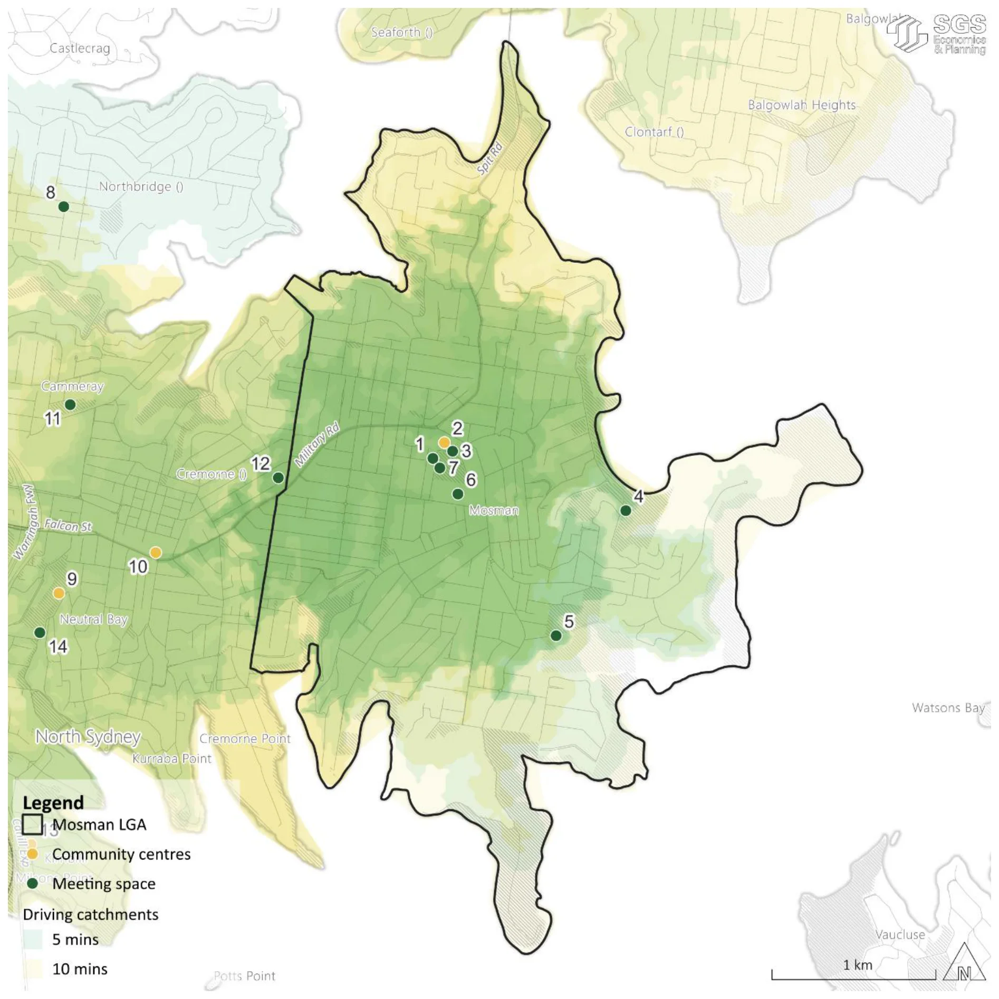

<!-- page 596 -->

SGS ECONOMICS AND PLANNING: COMMUNITY INFRASTRUCTURE NEEDS ASSESSMENT 35

Where possible, new community centres and meeting rooms should be integrated and or co-located with other services and infrastructure. In doing so, consideration of service and community users needs to be considered alongside hours of access and technology required. These opportunities will be further discussed in Section 7.

Table 8: Supply and demand assessment for community venues

Hierarchy Existing supply Future demand Future gap or surplus

Community centres 1 1.9 -0.9

Meeting rooms: Small (1-20 people) 1 9.6 -8.6

Meeting rooms: Small to Medium (21-50 people) 1 4.8 -3.8

Meeting rooms: Medium (51-100 people) 7 4.8 2.2

Meeting rooms: Medium to Large (101-200 people) 3 4.8 -1.8

Meeting rooms: Large (>200 people) 1 1.9 -0.9

Source: SGS Economics & Planning, 2026.

Summary of service needs:

▪ 1 x additional neighbourhood community centre

▪ A range of additional flexible meeting spaces:6 - 4-6 x small meeting rooms - 1-3 x small to medium meeting rooms - 1 x large meeting room.

6 These recommended are lower than the figures in the table as nesting has been taken into consideration e.g. multiple rooms having the ability to cater for various groups and larger rooms having the ability to be divided into smaller rooms.

August 2026

Attachment 1.1.5 Mosman Council

<!-- page 597 -->

SGS ECONOMICS AND PLANNING: COMMUNITY INFRASTRUCTURE NEEDS ASSESSMENT 36

#### 6.3

#### Youth centres

Definition Youth centres are dedicated spaces for young people to spend time, connect with others, and access youth specific programs and services. The following table provides a service definition and service standard for youth centres in the Mosman LGA.

Table 9: Service definition and service standards for youth centres

Facility type – service definition hierarchy Benchmark Travel accessibility

Central A dedicated centre for young people to access services, recreational programs, opportunities that promote wellbeing and personal development. It is a safe, inclusive space for young people to socialise, seek respite, participate in the community and connect. This centre can include a range of service providers (beyond Council). The centre can be standalone or integrated with other services and facilities. Size can vary between 300-1,000sqm depending on service and community needs. It generally includes a range of flexible meeting rooms, a large meeting room, kitchen, and specific spaces such as arts space/music/podcast space.

1 facility per 80,000 people

15-20 minutes

Source: SGS Economics & Planning, 2026.

Existing infrastructure The LGA has a youth centre (Mosman Youth Centre), centrally located next to the Barry O’Keefe Library. This facility is in a good asset condition and has good utilisation. It functions as a youth drop in space from 3pm to 6pm on weekdays, where a range of activities and services are provided. This includes mentoring programs, weekly and holiday programs, volunteering programs, workshops, help services regarding education and employment, and other events. The centre includes facilities such as a music room (however this is not fit for purpose), pool table and table tennis, and an informal hang out space.

The youth centre is hireable for broader community use from 8:30am to 3pm, and 6pm to 7pm on weekdays, when it is not being used for young people and Council activities, and on weekends where possible.

Beyond the Youth Centre there are other programs and service run for young people in other facilities. This includes the library which provides youth events, resources and study support.

August 2026

Attachment 1.1.5 Mosman Council

<!-- page 598 -->

SGS ECONOMICS AND PLANNING: COMMUNITY INFRASTRUCTURE NEEDS ASSESSMENT 37

Figure 13: Existing youth centres

Source: SGS Economics & Planning, 2026.

Table 10: Existing youth centres

# Facility name Hierarchy Location Asset condition

1 Mosman Youth Centre Central 33 The Crescent, Mosman 2

Source: SGS Economics & Planning, 2026, Mosman Municipal Council, 2025.

August 2026

Attachment 1.1.5 Mosman Council

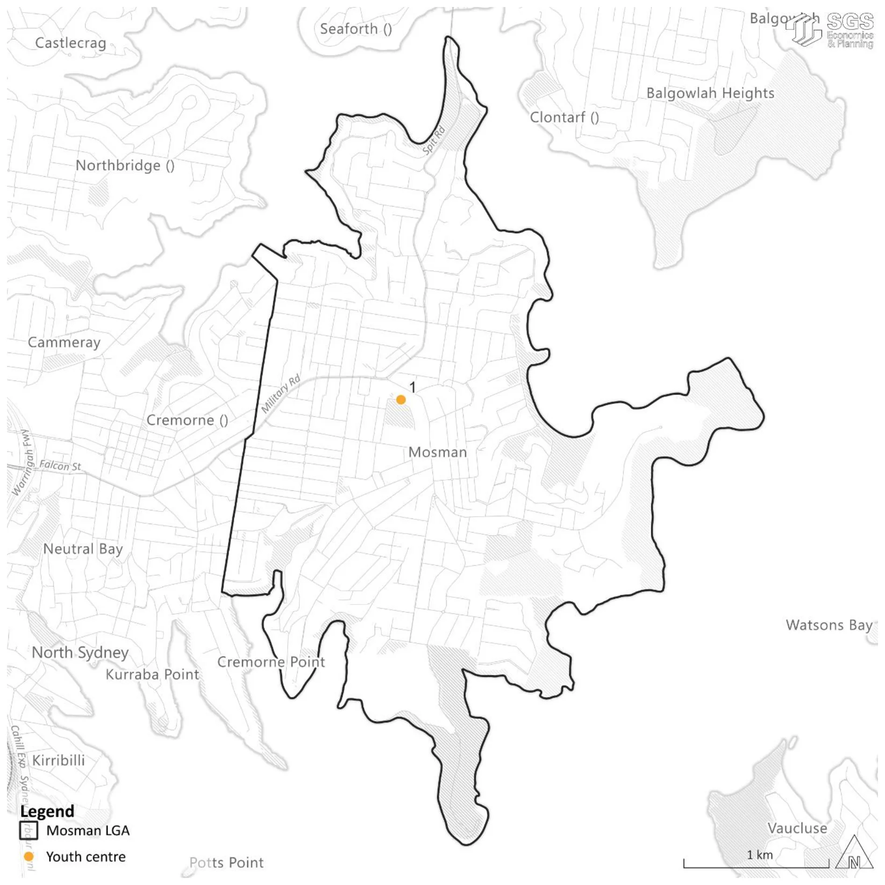

<!-- page 599 -->

SGS ECONOMICS AND PLANNING: COMMUNITY INFRASTRUCTURE NEEDS ASSESSMENT 38

Travel accessibility catchment Given the central location of the youth centre, all residents can access the youth centre within a 15 to 20-minute driving catchment. It can also be accessed by residents from nearby North Sydney, Willoughby and Northern Beaches LGAs. Similarly, youth centres in these surrounding LGAs are also accessible from Mosman LGA within a 15 to 20-minute drive.

It should be noted, however, that public transport access, while important for all community infrastructure, is critical to support access to services for young people. The current youth centre is well located to major bus routes along Military Road as well as supporting networks across the LGA.

Figure 14: Travel accessibility for youth centres

Source: SGS Economics & Planning, 2026.

August 2026

Attachment 1.1.5 Mosman Council

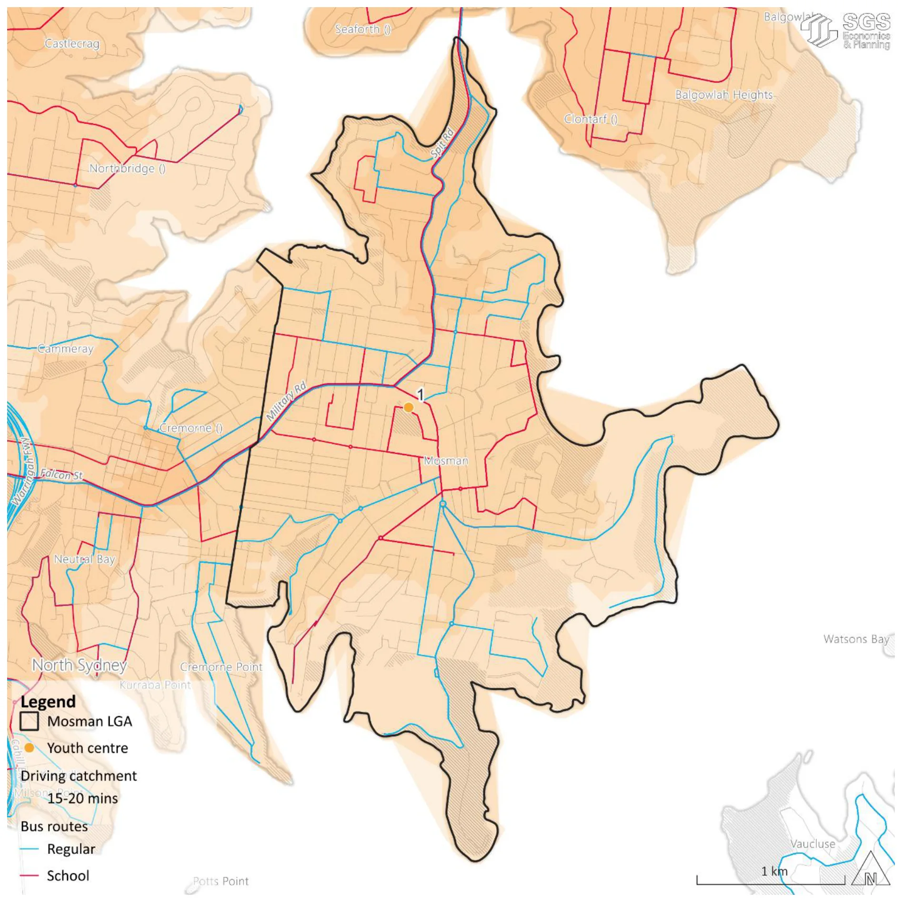

<!-- page 600 -->

SGS ECONOMICS AND PLANNING: COMMUNITY INFRASTRUCTURE NEEDS ASSESSMENT 39

Supply and demand Based on the existing supply and forecast population, one youth centre is sufficient for the LGA.

The location of the Mosman Youth Centre enables good accessibility for young people, and it is co- located with other complementary uses. There are future opportunities to ensure that this facility is able to meet ongoing service needs. In addition, if other redevelopments are occurring around the site, opportunities to further integrate services should be explored. These opportunities will be further discussed in Section 7.

Table 11: Supply and demand assessment for youth centres

Hierarchy Existing supply Future demand Future gap or surplus

Central 1 0.5 0.5

Source: SGS Economics & Planning, 2026.

Summary of service needs:

▪ Review fitness for purpose of the existing youth centre to ensure it can support contemporary service needs.

▪ Consider opportunities to further integrate other youth focused services into the Centre, including opportunities for further integration with the library.

August 2026

Attachment 1.1.5 Mosman Council

<!-- page 601 -->

SGS ECONOMICS AND PLANNING: COMMUNITY INFRASTRUCTURE NEEDS ASSESSMENT 40

#### 6.4

#### Early childhood education and care services

Definition Early childhood and education care services can include a suite of programs and services for children. The following table provides a service definition and service standard for preschool and long day care services, which are the primary childhood education services.

Council does not operate any long day care or preschool education services. Given these are essential services for providing access to early years education however, it is important to ensure there are enough services available for the current and future population.

Table 12: Service definition and service standards for early childhood education and care services

Facility type – service definition hierarchy Benchmark Travel accessibility

Long day care

Long day care (LDC), also referred to as centre-based day care, is childcare for children aged 0-4 years whose families are working or studying, or just need some regular time off from caring. Centres are licensed and generally operate for at least eight hours a day on normal working days. Services can be run by government, community, or a private (for- profit or not-for-profit) provider and can be integrated into early years centres that also operate preschool programs.

1 licenced place per 2.94 0-4yr olds

5 minutes

Preschool Early childhood education service planned and delivered by a qualified teacher and funded by the State Government. A preschool service may be integrated into a long day care service and or in an early years hub, which may also have complementary services (e.g. allied health services). Services may be run by a government, community, or private (for- profit or not-for-profit) provider. This benchmark is based on current NSW participation data which notes a 97% participation rate in preschool programs and a 36% market share of standalone preschools. Generally, preschool services are provided in a 3-4 room facility which include a flexible room for playgroups and or general meeting/program space. While the number of licenced places can vary across rooms, the average licenced place per room is 30.

1 room per 167 participating 3-4 year olds

5 minutes

Source: SGS Economics & Planning, 2026.

Existing infrastructure Mosman LGA has 3 preschools and 11 long day care centres, providing 125 and 589 licensed places respectively. The facilities are relatively more dispersed than other service types however still concentrated in the western half of the LGA.

August 2026

Attachment 1.1.5 Mosman Council

<!-- page 602 -->

SGS ECONOMICS AND PLANNING: COMMUNITY INFRASTRUCTURE NEEDS ASSESSMENT 41

Council does not provide any early years services, however, owns 1 facility which it leases to Jack and Jill Kindergarten. This service provides long day care. The facility itself is in good condition, with utilisation unknown.

There are also several long day care centres in Seaforth, Balgowlah and Fairlight, which are just north and north-east of Mosman LGA.

Figure 15: Existing early childhood education and care services

Source: SGS Economics & Planning, 2026.

Table 13: Existing early childhood education and care services

# Facility name Service Location Licenced places

Asset condition

1 Jack and Jill Kindergarten Long day care 2A Alexander Ave, Mosman 42 2

August 2026

Attachment 1.1.5 Mosman Council

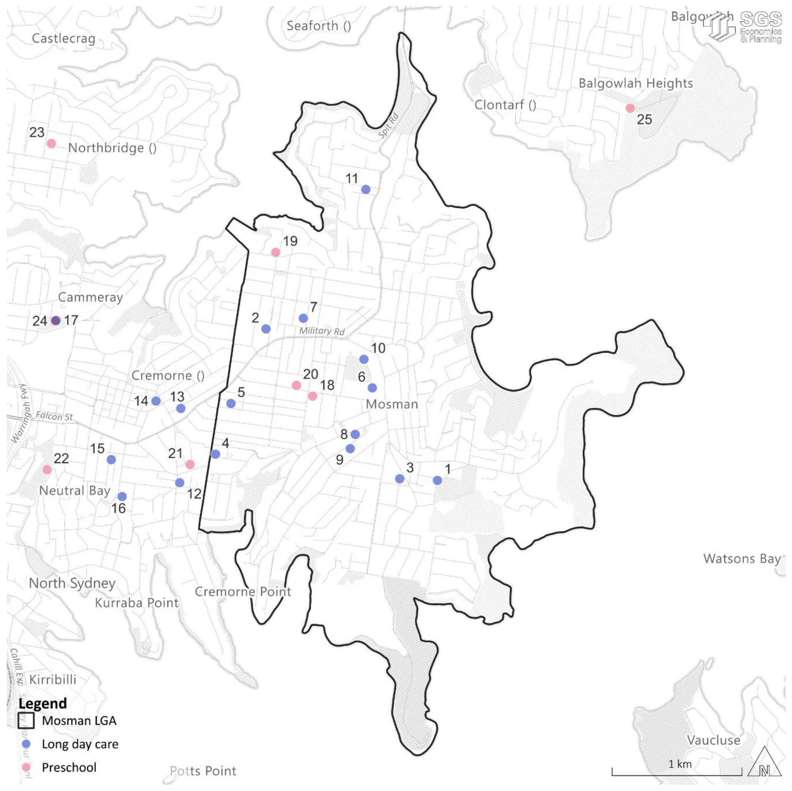

<!-- page 603 -->

SGS ECONOMICS AND PLANNING: COMMUNITY INFRASTRUCTURE NEEDS ASSESSMENT 42

# Facility name Service Location Licenced places

Asset condition

2 Mosman Kinderland Long day care 15 Lang St, Mosman 33 N/A

3 Only About Children Mosman Long day care 72 Bradleys Head Rd, Mosman 98 N/A

4 SDN Mosman Children's Education and Care Centre

Long day care 33 Brierley St, Mosman 57 N/A

5 Goodstart Early Learning Mosman - Cabramatta Road

Long day care 93 Cabramatta Rd, Mosman 39 N/A

6 Ballykin at Scots Kirk Long day care 32A Gouldsbury St, Mosman 49 N/A

7 Bond Street Montessori Early Learning Centre

Long day care 6 Bond St, Mosman 27 N/A

8 Shadforth Cottage (Avenue Road) Long day care 129 Avenue Rd, Mosman 30 N/A

9 Shadforth Cottage (Shadforth Street) Long day care 87-89 Shadforth St, Mosman 58 N/A

10 Mosman Early Learning Centre Long day care 8 Central Ave, Mosman 125 N/A

11 Giraffe Early Learning Centre Long day care 29 The Crescent, Mosman 31 N/A

18 KU - Mosman Community Pre-school Preschool 38A Belmont Rd, Mosman 40 N/A

19 The Northern Nursery School Preschool 39 Wyong Rd, Mosman 60 N/A

20 The Killarney School Preschool 71 Belmont Rd, Mosman 25 N/A

Outside of LGA

12 Rhonda's Cottage Long day care 37/39 Murdoch St, Cremorne 69 N/A

13 Only About Children Cremorne Long day care 15/19 Parraween St, Cremorne 129 N/A

14 Neutral Bay Kindergarten Long day care 29B Waters Rd, Cremorne 57 N/A

15 St Johns Child Care Centre Long day care 49A Yeo St, Neutral Bay 44 N/A

16 Neutral Bay Pre-school Long day care 77 Shellcove Rd, Neutral Bay 48 N/A

17 Cammeray Children's Centre Long day care 22 Warwick Ave, Cammeray 29 N/A

21 Redlands House Cremorne Preschool 2 Allister St, Cremorne 60 N/A

22 Cameragal Montessori School (Neutral Bay)

Preschool 2B Montpelier St, Neutral Bay 59 N/A

August 2026

Attachment 1.1.5 Mosman Council

<!-- page 604 -->

SGS ECONOMICS AND PLANNING: COMMUNITY INFRASTRUCTURE NEEDS ASSESSMENT 43

# Facility name Service Location Licenced places

Asset condition

23 St Mark's Northbridge Kindergarten Preschool 1A Malacoota Rd, Northbridge 53 N/A

24 KU - Cammeray Preschool Preschool 22 Warwick Ave, Cammeray 40 N/A

25 St James Preschool Preschool 1 Bareena Dr, Balgowlah Heights 30 N/A Source: SGS Economics & Planning, 2026, Mosman Municipal Council, 2025. Note that the count of licensed places has been derived from ACECQA.

Travel accessibility catchment Given the large concentration of early childhood education and care services located in the western half of the LGA, residents in the east have poorer access to the choice of services, especially preschools, however all residential areas are within a 5-minute catchment of an early childhood service.

August 2026

Attachment 1.1.5 Mosman Council

<!-- page 605 -->

SGS ECONOMICS AND PLANNING: COMMUNITY INFRASTRUCTURE NEEDS ASSESSMENT 44

Figure 16: Travel accessibility for early childhood education and care services

Source: SGS Economics & Planning, 2026.

Supply and demand There are estimated to be 1,064 0-4 year olds in 2026, which is forecast to grow to 1,429 (about a 34% increase) based on dwelling capacity.

Participation in long day care services vs preschool services varies depending on family needs, financial capacity, and access to services. There are significant reforms occurring within childcare which may increase access to long day care services for families. These benchmarks have been based on the most recent NSW participation rates; however, the findings should be further validated through engagement with preschool and long day care operators to understand capacity, waitlists, and family trends.

August 2026

Attachment 1.1.5 Mosman Council

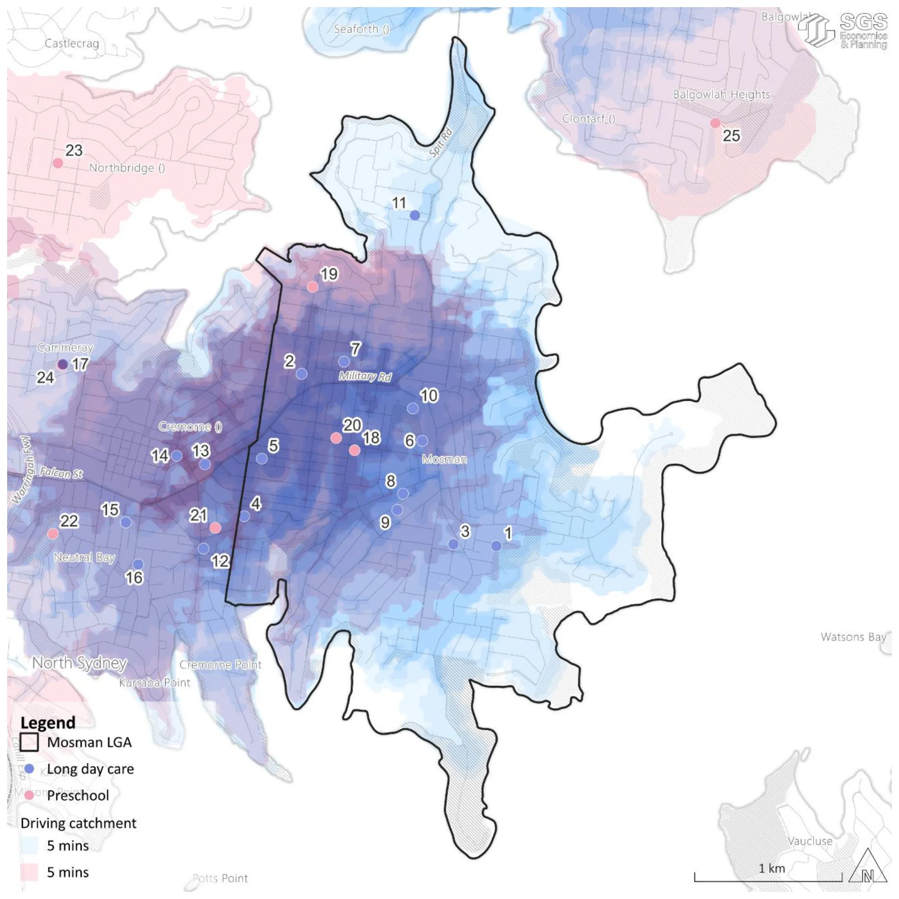

<!-- page 606 -->

SGS ECONOMICS AND PLANNING: COMMUNITY INFRASTRUCTURE NEEDS ASSESSMENT 45

According to the existing supply and forecast population, there are likely to be enough existing preschool rooms to meet future demand. In relation to long day care, the forecast growth will result in a demand for 486 licensed places. Based on the available existing licensed places, the existing supply is likely to be sufficient, however the utilisation of the current long day care licenced places and preschool places are unknown. Given the location of the services, these facilities are also likely to be servicing residents outside of the LGA, which will also impact utilisation rates.

Given Council is not a provider of this service it will be important for Council to continue to engage with the early years sector to understand venue demands and capacity. Early years providers also have their own modelling to identify potential future markets.

Early years facilities can be integrated into residential developments as well as integrated with other community infrastructure, including Council owned community infrastructure. Should external providers be interested in locating in the LGA, where relevant, Council should facilitate delivery opportunities.

Table 14: Supply and demand assessment for early childhood education and care services

Hierarchy Existing supply Future demand Future gap or surplus*

Long day care 589 licensed places 486 licensed places 103 places

Preschool 125 licensed places 3 rooms (approximately 90 licensed places)

1 room (approximately 30 places) *The future gap in long day care and preschool licenced places will depend on the uptake of the existing places. This uptake data was unavailable at the time of writing this report therefore the future gap and surplus should be used cautiously. Source: SGS Economics & Planning, 2026.

Summary of service needs:

▪ Continue to monitor feedback from existing providers and residents and support additional suppliers to enter market where relevant.

August 2026

Attachment 1.1.5 Mosman Council

<!-- page 607 -->

SGS ECONOMICS AND PLANNING: COMMUNITY INFRASTRUCTURE NEEDS ASSESSMENT 46

#### 6.5

#### Arts and culture

Definition Arts and culture activities can be delivered across a number of settings. This assessment focuses on facilities required to support a wide variety of activities including large and small scale theatre, music and artistic performances; arts studios that allow artists to practice and make digital or wet/messy art; performance studios; and rehearsal spaces.

The following table provides a service definition and service standard for arts and culture in the Mosman LGA.

Table 15: Service definition and service standards for arts and cultural facilities

Facility type – service definition hierarchy Benchmark Travel accessibility

Regional performing arts centre

A regional performing arts centre is a dedicated, managed facility that can host major performing arts activities for LGA and beyond. The facility should support a diverse mix of arts and cultural activities. The facility may include a large concert hall or theatre space with seating, foyer area, stage areas, backstage areas and sound/lighting systems. Performing arts centres can be integrated and collocated with other community infrastructure and arts facilities.

1 facility per 400,000 people

30-40 minutes

Sub-regional gallery A gallery space that features curated shows, as well as exhibitions from the wider arts and cultural sector.

1 facility per 80,000 people

30-40 minutes

Municipal theatre A creative arts facility can support a broad variety of community productions and events like music, theatre and dance performances. They can be integrated into school sites or collocated with other community infrastructure.

1 facility per 80,000 people

15-20 minutes

District rehearsal space

A large, dedicated arts space that is used for dance, theatre, and music rehearsals and potentially small local performances (if the room has capacity). These spaces can be integrated into other community facilities such as community centres. The venues may be sparsely furnished and fitted with quality sound systems, sprung floors, mirrors, and large storage.

1 facility per 30,000 people

10 minutes

Art studio/makerspaces

Dedicated arts spaces that can be hired for variety of activities, such as music lessons, dance classes, writing groups, digital art, artists in residence, and workshops. It is a place where artists can create. This benchmark refers only to publicly-owned spaces. This provision is typically supplemented by private studios/workshops.

1 facility per 20,000 people

5 minutes

Source: SGS Economics & Planning, 2026.

August 2026

Attachment 1.1.5 Mosman Council

<!-- page 608 -->

SGS ECONOMICS AND PLANNING: COMMUNITY INFRASTRUCTURE NEEDS ASSESSMENT 47

Existing infrastructure The Mosman community has a deep connection with arts and cultural practices. Given this, there are a range of existing spaces to support the delivery of this practice.

In relation to regional level performing arts centres, there are none located in the LGA, however residents are able to access The Concourse Chatswood within a 20-25 minute drive. This facility provides regional level arts and culture performances for the NSROC region. Given this, additional regional level infrastructure is not required.

In relation to gallery space, The Mosman Art Gallery and Community Centre is a sub-regional art gallery providing space for local and visiting art exhibitions as well as providing community meeting spaces for events and programs. This facility is centrally located with a good asset condition and utilisation. Based on service feedback, there are some opportunities to improve fitness for purpose of the facility to improve service delivery. There is also a sub-regional gallery (Manly Art Gallery & Museum) in the Northern Beaches LGA.

In relation to theatre and rehearsal spaces, while there are no Council owned facilities, Queenwood School for Girls has 2 municipal theatres across its junior and senior campuses, and Mosman High School has a multi-purpose hall that can be used as a district rehearsal space. However, these spaces have restricted access for the general public. NSROC’s Social and Cultural Infrastructure Strategy (2020) proposed that the Mosman LGA should have a municipal creative arts centre and community performance facility. Outside of the LGA, there is a municipal theatre (Glen Street Theatre) in the Northern Beaches LGA.

In relation to art studio and makerspaces, there is an abundance of creative spaces for artists, with 20 art studios in the Headland Park Artists Precinct, which are artist residencies on land managed by the Harbour Trust. In addition to this, Council are supporting a 12-month pilot artist residency program in the Mosman Council Depot. To support broader community access, there is also a makerspace, Creation Space, which is located next to Barry O’Keefe Library. This facility includes 2 recording studios (1 for podcasting, 1 for vlogging/movie making) as well as space for STEM programs and activities.

Council recognises the value of arts and culture among the Mosman community and has committed to further cultivate this. Actions in the Community Strategic Plan 2025-2035 include providing further opportunities for creativity, connection and cultural expression, and to support and expand cultural and creative endeavours. There are also goals of increasing the number of visitors to the art gallery, to have over 80,000 people attending exhibitions and events annually, and to increase attendees to festivals like the Festival of Mosman.

August 2026

Attachment 1.1.5 Mosman Council

<!-- page 609 -->

SGS ECONOMICS AND PLANNING: COMMUNITY INFRASTRUCTURE NEEDS ASSESSMENT 48

Figure 17: Existing arts and cultural facilities

Source: SGS Economics & Planning, 2026.

Table 16: Existing arts and cultural facilities

# Facility name Service Location Asset condition Utilisation

1 Mosman Art Gallery and Community Centre

Sub-regional gallery 1 Art Gallery Way, Mosman 2 Good

3 Creation Space Art studio/makerspaces 33 The Crescent, Mosman N/A N/A

4 Mosman Artist Studio Art studio/makerspaces 79-85 Cowles Rd, Mosman 2 N/A

August 2026

Attachment 1.1.5 Mosman Council

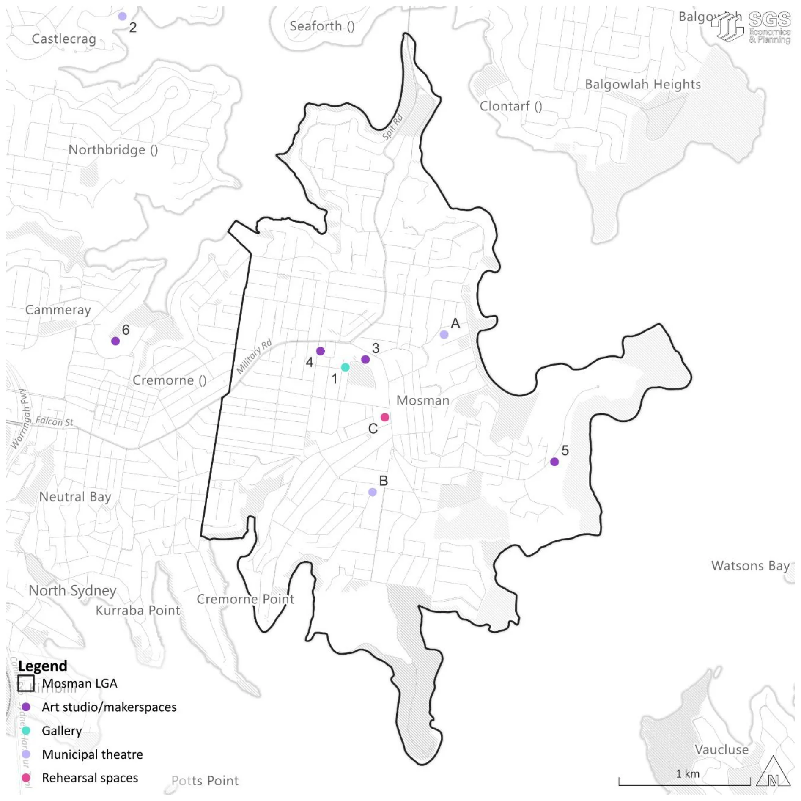

<!-- page 610 -->

SGS ECONOMICS AND PLANNING: COMMUNITY INFRASTRUCTURE NEEDS ASSESSMENT 49

# Facility name Service Location Asset condition Utilisation

5 Headland Park Artists Precinct* Art studio/makerspaces Read Pl, Mosman N/A N/A

A Queenwood School for Girls Municipal theatre 47 Mandolong Rd, Mosman N/A N/A

B Queenwood School for Girls (Junior Campus)

Municipal theatre 6 Queen St, Mosman N/A N/A

C Mosman High School District rehearsal space 769 Military Rd, Mosman N/A N/A

Outside of LGA

2 The Haven Amphitheatre Municipal theatre The Barricade, Castlecrag N/A N/A

6 Primrose Park Art & Craft Centre

Art studio/makerspaces Matora Lane, off, Young St, Cremorne

N/A N/A

Source: SGS Economics & Planning, 2026, Mosman Municipal Council, 2025. *Owned by Sydney Harbour Federation Trust

Travel accessibility catchment Generally, the access to arts and cultural facilities across the LGA is high. However, there are gaps in relation to arts studio/makerspaces, leaving areas to the north and south (like Clifton Gardens and Beauty Point) without access. Given the lack of public theatre and rehearsal spaces, there are also gaps to these facilities.

The regional performing arts centre in Willoughby LGA (The Concourse Chatswood) and sub-regional art gallery in the Northern Beaches LGA are accessible from Mosman LGA within the specified driving catchment, however, the municipal theatre in the Northern Beaches LGA is not.

August 2026

Attachment 1.1.5 Mosman Council

<!-- page 611 -->

SGS ECONOMICS AND PLANNING: COMMUNITY INFRASTRUCTURE NEEDS ASSESSMENT 50

Figure 18: Travel accessibility for arts and cultural facilities

Source: SGS Economics & Planning, 2026.7

Supply and demand Based on the existing supply and forecast population, the existing sub-regional gallery can sufficiently service the current and future population.

Similarly, the existing supply of art studio/makerspaces will be sufficient into the future. While art studio/makerspaces are local services, the Headland Park Artists Precinct is providing a regional service – given this these spaces are likely to also draw users from outside the LGA.

7 Accessibility is not shown for non-council facilities, which are distinguished by letters rather than numbers.

August 2026

Attachment 1.1.5 Mosman Council

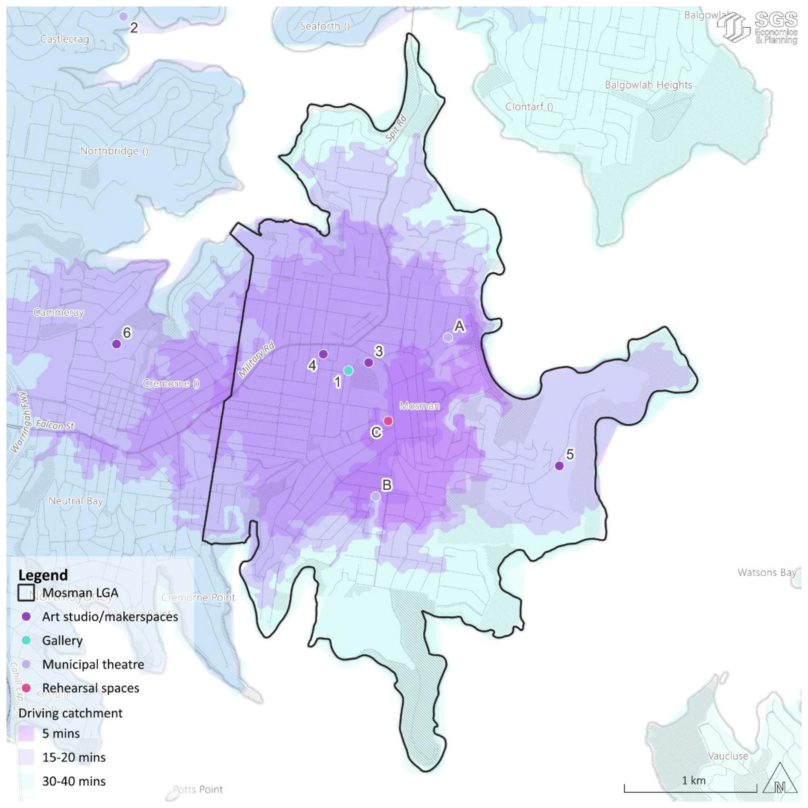

<!-- page 612 -->

SGS ECONOMICS AND PLANNING: COMMUNITY INFRASTRUCTURE NEEDS ASSESSMENT 51

In relation to future infrastructure, there is an expected undersupply of 1 district rehearsal space and 1 municipal theatre. Some of this demand could be alleviated through the school infrastructure, however access to these facilities is restricted.

There is limited demand for a regional performing arts centre. The closest facility is The Concourse in Chatswood, which is within a 30-minute drive for all residents.

Given accessibility constraints to surrounding municipal theatres the delivery of a theatre should be considered. These facilities greatly vary in relation to scale and fit out. There are opportunities to provide a purpose built dedicated theatre space, or a flexible space that can support rehearsals and local performances. In addition, outdoor performance spaces could be considered. Where possible new arts infrastructure should be integrated with other services. These opportunities will be further discussed in Section 7.

Table 17: Supply and demand assessment for arts and cultural facilities

Hierarchy Existing supply Future demand Future gap or surplus

Regional performing arts centre 0 0.1 -0.1

Sub-regional gallery 1 0.3 0.7

Municipal theatre 0 0.5 -0.5

District rehearsal space 0 1.3 -1.3

Art studio/makerspaces 22 1.9 20.1

Source: SGS Economics & Planning, 2026.

Summary of service needs:

▪ 1 x district rehearsal space.

▪ Explore the provision and viability of a municipal theatre space, with consideration to flexible spaces as well as outdoor spaces.

August 2026

Attachment 1.1.5 Mosman Council

<!-- page 613 -->

SGS ECONOMICS AND PLANNING: COMMUNITY INFRASTRUCTURE NEEDS ASSESSMENT 52

#### 6.6

#### Aquatic facilities

Definition Aquatics facilities can be provided across three different hierarchies, each providing a different level of programs and services. The following table provides a service definition and services standard for aquatic facilities in Mosman LGA.

Table 18: Service definition and service standards for aquatic facilities

Facility type – service definition hierarchy Benchmark Travel accessibility

Regional Dedicated facility with indoor and outdoor pools (incl. a 50m lap pool and a warm water pool), with changerooms, showers/toilets, gym or other recreation spaces, spa, sauna and/or steamroom. Can include allied health services, cafe, and/or creche. Other features may include diving boards, water slides, water polo infrastructure, access ramps, spectator seating, changerooms and filtration systems. The facility provides water-based recreation, learn-to-swim, aquatic sport and water safety programming. Configurations support both recreation and higher-performance use.

1 facility per 120,000 people

30-40 minutes

District Dedicated facility with indoor and outdoor pools (incl. a 25m lap pool), with changerooms, showers/toilets, gym or other recreation spaces. May include spa and/or sauna/steamroom. Typically providing water-based recreation, learn-to-swim, aquatic sport and water safety programming.

1 facility per 60,000 people

15 minutes

Local 25 metre lap pool (indoor or outdoor) with limiting supporting infrastructure. These facilities can be seasonal and are generally not provided in inner metropolitan areas due to viability.

1 facility per 25,000 people

5 minutes

Source: SGS Economics & Planning, 2026.

Existing infrastructure Mosman LGA has a centrally located indoor aquatic facility that includes a 6-lane 25m indoor heated pool and water play area. As it provides a wide range of programs such as learn to swim classes and aqua aerobics classes, it has been classified as a district facility. However, it is on the smaller scale of a district facility. The facility underwent improvement works in 2020 to improve accessibility and is currently in excellent condition and well-utilised.

In addition to the indoor aquatics facility, Mosman LGA has the advantage of access to the bay. The foreshore includes two baths, the Balmoral Baths and Clifton Garden Baths. This infrastructure provides additional opportunities for leisurely swimming and water play. The Balmoral Baths and Clifton Garden Baths are both in good asset condition.

August 2026

Attachment 1.1.5 Mosman Council

<!-- page 614 -->

SGS ECONOMICS AND PLANNING: COMMUNITY INFRASTRUCTURE NEEDS ASSESSMENT 53

In addition to the public pools there is a 25m pool located within Queenwood School for Girls. Given it is managed by the school, this facility has restricted access to the general public.

Neighbouring LGAs also have aquatic facilities, including North Sydney Olympic Pool, Warringah Aquatic Centre, Manly Andrew 'Boy' Charlton Aquatic Centre and several rock pools. The closest regional level facility is the North Sydney Olympic Pool, which is currently undergoing redevelopment. Once complete, it will provide access to higher order facilities for the region, including a 50-metre pool, 25- metre pool, splash and play area, gymnasium, sauna, spa, and cafe.

Figure 19: Existing aquatic facilities

Source: SGS Economics & Planning, 2026.

August 2026

Attachment 1.1.5 Mosman Council

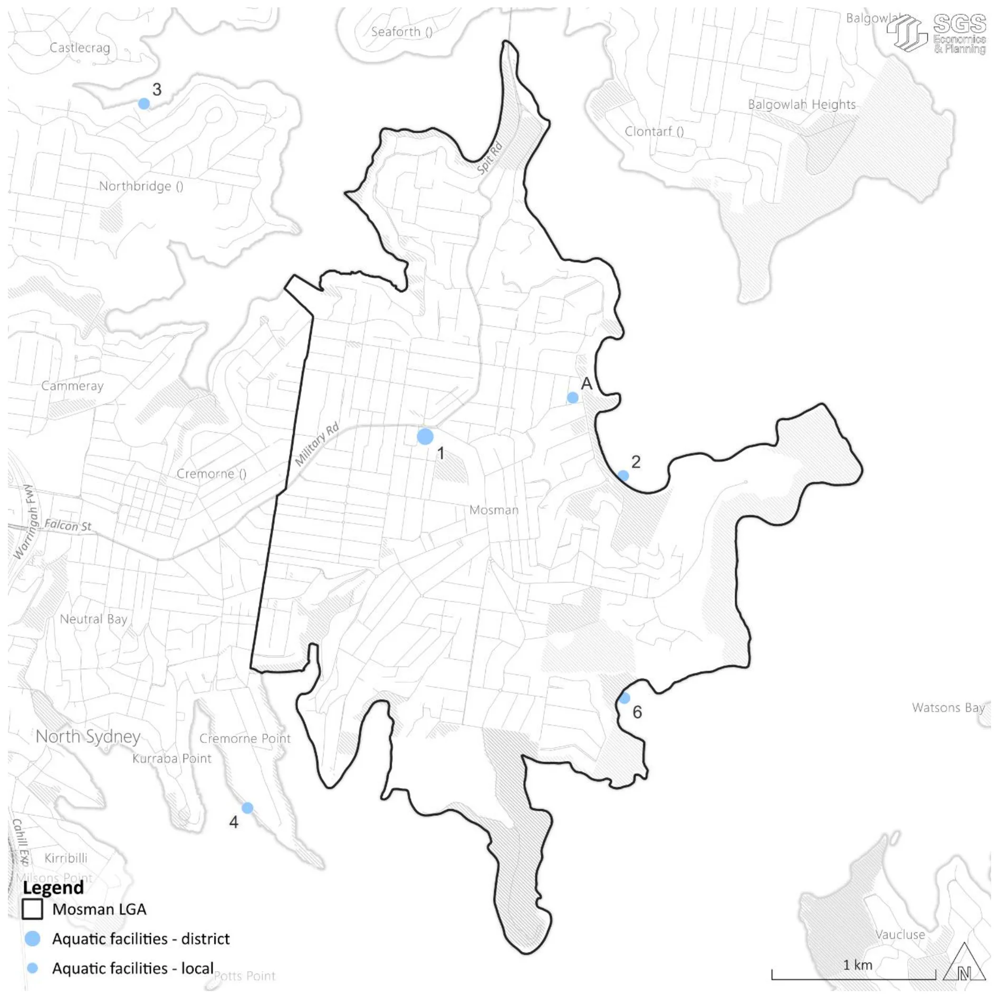

<!-- page 615 -->

SGS ECONOMICS AND PLANNING: COMMUNITY INFRASTRUCTURE NEEDS ASSESSMENT 54

Table 19: Existing aquatic facilities

# Facility name Hierarchy Location Asset condition Utilisation

1 Mosman Swim Centre Local 90 Vista St, Mosman 1 Good

2 Balmoral Baths Local 2 The Esplanade, Mosman 2 N/A

6 Clifton Gardens Baths Local Morella Rd, Mosman 2 N/A

A Queenwood School for Girls

Local 47 Mandolong Rd, Mosman

N/A N/A

Outside of LGA

3 Northbridge Baths Aquatic Fitness Centre

Local 2 Widgiewa Rd, Northbridge

N/A N/A

4 Maccallum Pool Local Milson Rd, Cremorne Point N/A N/A

Source: SGS Economics & Planning, 2026, Mosman Municipal Council, 2025.

Travel accessibility catchment Within a 15-minute drive, the Mosman Swim Centre provides access to not only Mosman LGA residents, but also residents in the wider region. Clifton Gardens Baths, on the other hand, services a very small catchment area within a 5-minute drive. The catchment area for the Balmoral Baths, while also a 5-minute drive, is much larger due to better access to the road network, as seen in Figure 20.

The Maccallum Pool on North Sydney LGA’s foreshore, is located close by and provides some additional access to residents in the south-west of the LGA. Residents to the north can also access aquatics facilities in the Northern Beaches LGA like Warringah Aquatic Centre within a 15-minute drive.

August 2026

Attachment 1.1.5 Mosman Council

<!-- page 616 -->

SGS ECONOMICS AND PLANNING: COMMUNITY INFRASTRUCTURE NEEDS ASSESSMENT 55

Figure 20: Travel accessibility for aquatic facilities

Source: SGS Economics & Planning, 2026.8

Supply and demand Based on the existing supply and forecast population, the existing infrastructure is likely to be able to cater for the increased population demand. In addition, the location of the existing facilities provides a high level of accessibility.

Utilisation and capacity of existing infrastructure should continue to be monitored over time and the asset condition and fitness for purpose of existing infrastructure should be maintained to a high

8 Accessibility is not shown for non-council facilities, which are distinguished by letters rather than numbers.

August 2026

Attachment 1.1.5 Mosman Council

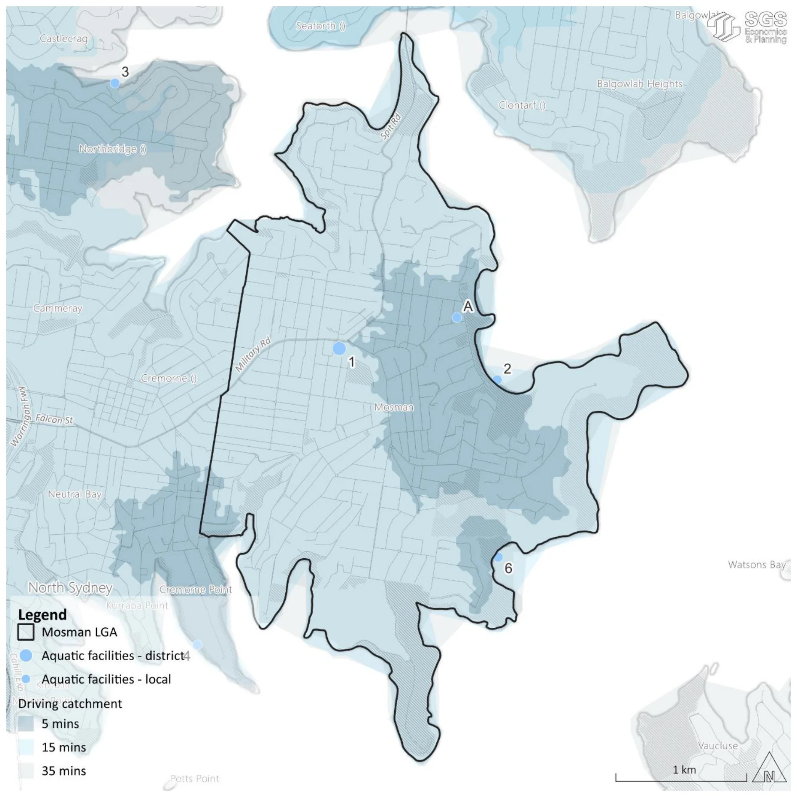

<!-- page 617 -->

SGS ECONOMICS AND PLANNING: COMMUNITY INFRASTRUCTURE NEEDS ASSESSMENT 56

standard. In addition, if required, explore opportunities for partnerships with private facilities to increase public access.

Table 20: Supply and demand assessment for aquatic facilities

Hierarchy Existing supply Future demand Future gap or surplus

Regional 0 0.3 -0.3

District 1 0.6 0.4

Local 2 1.5 0.5

Source: SGS Economics & Planning, 2026.

Summary of service needs:

▪ Continue to monitor utilisation and capacity of existing infrastructure

▪ If required, consider partnership opportunities with the Queenwood School for Girls to increase public access to the facility on the school site.

August 2026

Attachment 1.1.5 Mosman Council

<!-- page 618 -->

SGS ECONOMICS AND PLANNING: COMMUNITY INFRASTRUCTURE NEEDS ASSESSMENT 57

#### 6.7

#### Indoor courts

Definition Indoor courts provide access to a range of diverse recreation opportunities. Where possible, indoor courts should be co-located with other community infrastructure and provide 2-4 multi-purpose courts per facility.

The following table provides a service definition and service standard for indoor courts in the Mosman LGA.

Table 21: Service definition and service standards for indoor courts

Facility type – service definition hierarchy Benchmark Travel accessibility

Local A multi-purpose indoor playing surface (timber, vinyl, or acrylic with line marking) accommodating a range of court-based sports and competitions.

1 court per 10,000 people

5 minutes

Source: SGS Economics & Planning, 2026.

Existing infrastructure The LGA has 1 multi-purpose indoor court at the Marie Bashir Mosman Sports Centre, which is used for sports such as netball, basketball, indoor hockey, and futsal. The facility is owned by Council on land owned by the Sydney Harbour Federation Trust. It is in a good condition and well-utilised.

The Marie Bashir Mosman Sports Centre is co-located with the Rawson Oval and the Mosman Drill Hall. The Drill Hall has sport court markings and can also be used for some indoor recreation; however, it is unable to meet the size requirements for sports such as netball. Given this, it has restricted access. According to the Open Space Recreational Needs Assessment (2015), the Drill Hall could potentially host young children’s sports development programs, group fitness activities (e.g. yoga, pilates), dancing, and physical activity for older adults (e.g. table tennis, soft tennis).

Mosman High School also includes a multi-purpose hall that can be used as an indoor court, although access is restricted.

August 2026

Attachment 1.1.5 Mosman Council

<!-- page 619 -->

SGS ECONOMICS AND PLANNING: COMMUNITY INFRASTRUCTURE NEEDS ASSESSMENT 58

Figure 21: Existing indoor courts

Source: SGS Economics & Planning, 2026.

Table 22: Existing indoor courts

# Facility name Hierarchy Location Count Asset condition Utilisation

1 Marie Bashir Mosman Sports Centre*

Local 1 Cross St, Mosman 1 2 Good9

9 Council has indicated that for the whole year of 2025, it had a utilisation rate of 76.9% during peak hour.

August 2026

Attachment 1.1.5 Mosman Council

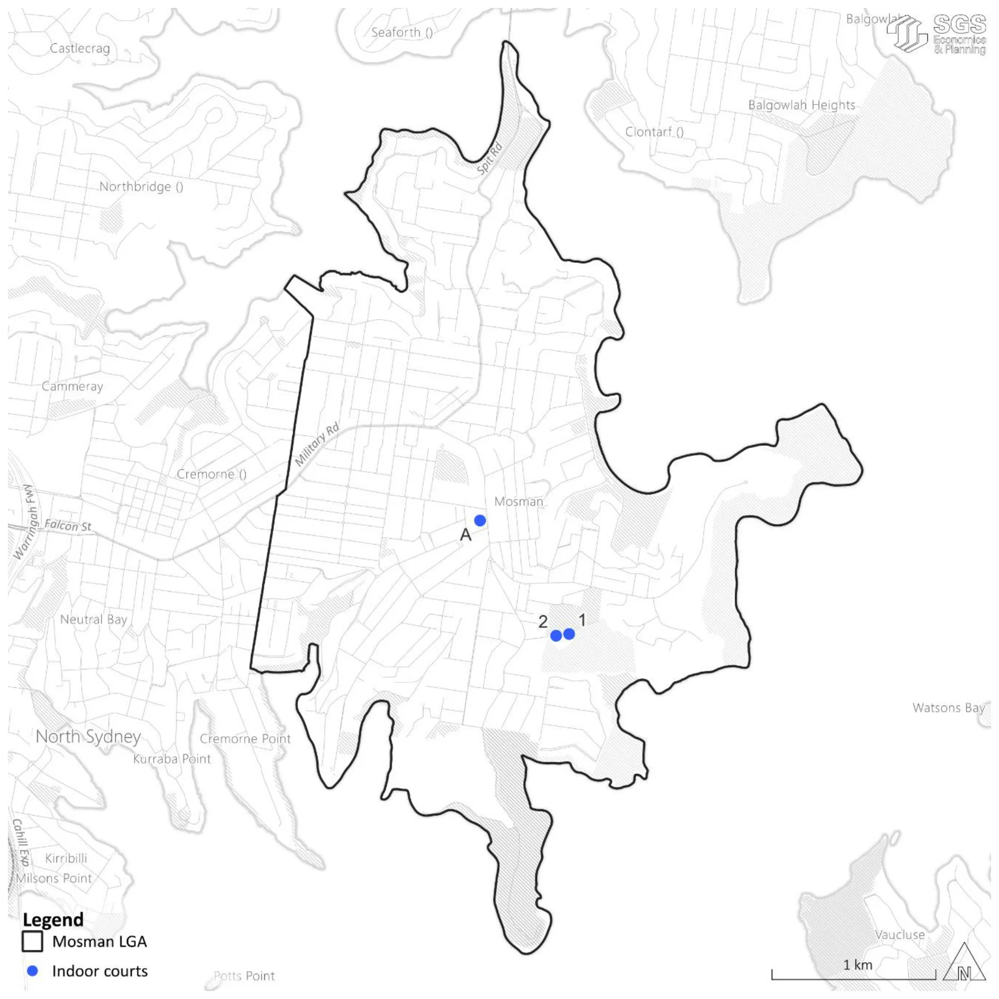

<!-- page 620 -->

SGS ECONOMICS AND PLANNING: COMMUNITY INFRASTRUCTURE NEEDS ASSESSMENT 59

# Facility name Hierarchy Location Count Asset condition Utilisation

2 Drill Hall* Local 1 Cross St, Mosman 1** 2 Average10

A Mosman High School

Local 769 Military Rd, Mosman

1 N/A N/A

Source: SGS Economics & Planning, 2026, Mosman Municipal Council, 2025. *Owned by Sydney Harbour Federation Trust. **Note: Not included due to restricted access.

Travel accessibility catchment The Marie Bashir Mosman Sports Centre is located in the east of the LGA, restricting access to the broader community in the north and east.

The potential use of Mosman High School courts by the public would expand the catchment area accessible within a 5-minute drive substantially given its central location.

There are limited indoor courts outside of the LGA. There are courts within the Willoughby Leisure Centre as well as the North Sydney Indoor Sports Centre. Both of which are outside of the access catchment for Mosman residents.

10 Council has indicated that for the whole year of 2025, it had a utilisation rate of 64.7% during peak hour.

August 2026

Attachment 1.1.5 Mosman Council

<!-- page 621 -->

SGS ECONOMICS AND PLANNING: COMMUNITY INFRASTRUCTURE NEEDS ASSESSMENT 60

Figure 22: Travel accessibility for indoor courts

Source: SGS Economics & Planning, 2026.11

Supply and demand Based on the existing supply and forecast population, 3 additional indoor courts would be required.

Given the land that is required to support these facilities, vertical facilities are becoming more common in higher density urban areas. This however does increase the delivery costs.

11 Accessibility is not shown for private facilities, which are distinguished by letters rather than numbers. Accessibility is also not shown for facilities with restricted access.

August 2026

Attachment 1.1.5 Mosman Council

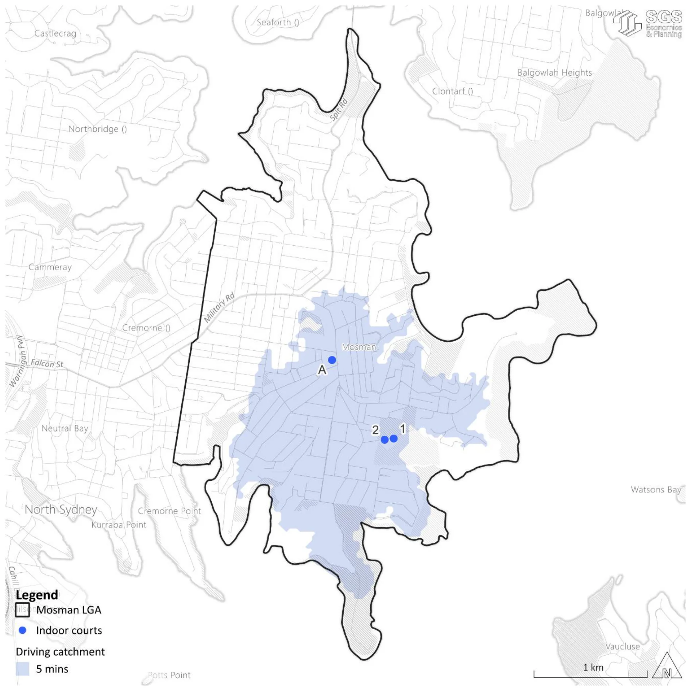

<!-- page 622 -->

SGS ECONOMICS AND PLANNING: COMMUNITY INFRASTRUCTURE NEEDS ASSESSMENT 61

Prior to any new infrastructure being provided, the ability to expand existing facilities should be explored. These opportunities will be further discussed in Section 7.

Table 23: Supply and demand assessment for indoor courts

Hierarchy Existing supply Future demand Future gap or surplus

Local 1 3.9 -2.9

Source: SGS Economics & Planning, 2026.

Summary of service needs:

▪ 3 x indoor courts.

August 2026

Attachment 1.1.5 Mosman Council

<!-- page 623 -->

SGS ECONOMICS AND PLANNING: COMMUNITY INFRASTRUCTURE NEEDS ASSESSMENT 62

#### 6.8

#### Outdoor recreation

Definition There are a variety of outdoor courts, including core outdoor courts which can accommodate a range of different sports, specialist courts with specific surfaces and or requirements which limit the ability to share across sports, and lawn bowls facilities. Where possible outdoor courts should be co-located with other community infrastructure and provide 2-6 courts per site and up to 12 for regional level facilities.

The following table provides a service definition and service standard for outdoor courts in the Mosman LGA.

Table 24: Service definition and service standards for outdoor courts, lawn bowls, specialist courts

Facility type – service definition hierarchy Benchmark Travel accessibility

Outdoor courts

A hard-surface outdoor court (asphalt, concrete or acrylic surfacing) that provides space for casual play, training and organised sport across a range of court-based activities such as netball, basketball, volleyball, futsal, and tennis. It may incorporate basketball hoops, netball posts, removable net systems, futsal goals, seating, fencing, shelters and sports lighting. It can be scaled to suit informal recreation, community sport training or competition-standard environments.

1 court per 3,500 people

5 minutes

Lawn bowls A dedicated facility with 1-3 greens (surface for lawn bowls participation and competition).

1 green per 40,000 people

10 minutes

Specialist courts

A fine-surface court (clay, crushed granite, sand or hybrid systems with boundary marking) supporting accuracy-based play.

1 court per 16,500 people

10 minutes

Source: SGS Economics & Planning, 2026.

Existing infrastructure Mosman LGA has a total of 20 publicly accessible outdoor courts which accommodate a variety of sports, including netball (both grass and hardstand), basketball and tennis. Most of the courts are dedicated to tennis courts (12), with the rest being multipurpose courts and netball/basketball courts.

Spit West Reserve provides 4-6 seasonal grass netball courts. However, these are not available all year round, making way for cricket in summer and football in winter.

There are 2 lawn bowling clubs and a croquet club, with 4 bowling greens and 4 croquet greens in total. Mosman Bowling Club is owned by Council and centrally located, while Warringah Bowling Club Mosman is privately owned and operated.

In terms of asset condition, Rawson Oval Hardstand Netball Courts are in excellent condition, and Mosman Bowling Club is in good condition, while the condition of the other facilities is unknown.

August 2026

Attachment 1.1.5 Mosman Council

<!-- page 624 -->

SGS ECONOMICS AND PLANNING: COMMUNITY INFRASTRUCTURE NEEDS ASSESSMENT 63

Feedback from Council has indicated that community trends are changing. As such, the financial sustainability of the Mosman Bowling Club is becoming increasingly difficult. Council are exploring opportunities to further improve public access to this site, improving viability as well as community benefits.

Schools within the LGA provide an additional 2 basketball courts, 3 tennis courts and 1 multi-purpose court. However, they have restricted access.

North Sydney and Northern Beaches LGAs also have some lawn bowls, outdoor courts and specialists courts, as seen in Figure 23.

Figure 23: Existing outdoor recreation

Source: SGS Economics & Planning, 2026.

August 2026

Attachment 1.1.5 Mosman Council

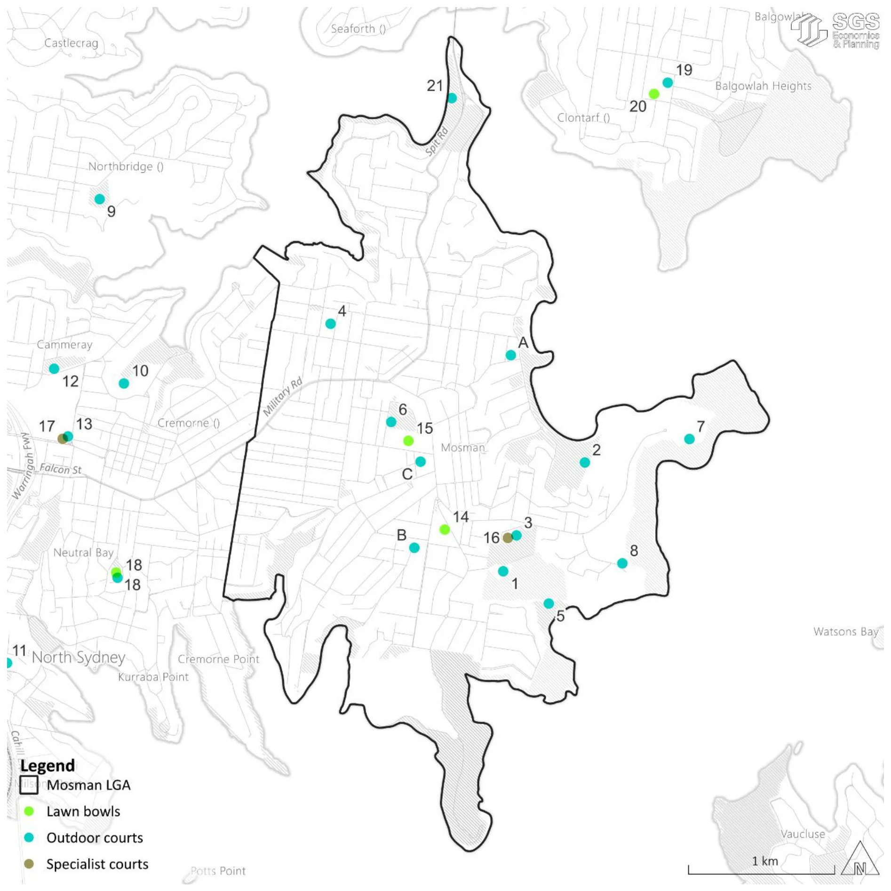

<!-- page 625 -->

SGS ECONOMICS AND PLANNING: COMMUNITY INFRASTRUCTURE NEEDS ASSESSMENT 64

Table 25: Existing outdoor recreation

# Facility name Hierarchy Location Count Asset condition Utilisation

1 Rawson Oval Hardstand Netball Courts

Outdoor courts

Cross St, Mosman 3 netball 1 Low12

2 Balmoral Oval Outdoor courts

Cross St, Mosman 1 basketball N/A N/A

3 Rawson Tennis Outdoor courts

Alexander Ave, Mosman

4 tennis N/A N/A

4 Mosman Lawn Tennis Club

Outdoor courts

32 Rosebery St, Mosman

6 tennis N/A N/A

5 Clifton Gardens Reserve

Outdoor courts

Morella Rd, Mosman

0.75 basketball**

N/A N/A

6 Allan Border Oval Outdoor courts

29 Myahgah Rd, Mosman

0.5 basketball**

N/A N/A

7 Middle Head Tennis Court*

Outdoor courts

1110 Middle Head Rd, Mosman

1 tennis N/A N/A

8 Georges Heights Tennis Court*

Outdoor courts

Suakin Dr, Mosman 1 tennis N/A N/A

21 Spit West Reserve Outdoor courts

The Spit Reserve, Spit Rd, Mosman

4 netball (grass)***

3 N/A

A Queenwood School for Girls

Outdoor courts

47 Mandolong Rd, Mosman

1 multi- purpose

N/A N/A

B Queenwood School for Girls (Junior Campus)

Outdoor courts

6 Queen St, Mosman

2 tennis N/A N/A

C Mosman High School Outdoor courts

769 Military Rd, Mosman

2 basketball, 1 tennis

N/A N/A

14 Warringah Bowling Club Mosman

Lawn bowls 74-82 Bradleys Head Rd, Mosman

2 greens N/A N/A

15 Mosman Bowling Club

Lawn bowls 15 Belmont Rd, Mosman

2 greens 2 N/A

16 Mosman Croquet Club

Specialist courts

2D Alexander Ave, Mosman

4 greens N/A N/A

Outside of LGA 9 Northbridge Oval and Synthetic Court

Outdoor courts

271 Sailors Bay Rd, Northbridge

1 multi- purpose

N/A N/A

12 Council has indicated that for the whole year of 2025, it had a utilisation rate of 43.6% during peak hour.

August 2026

Attachment 1.1.5 Mosman Council

<!-- page 626 -->

SGS ECONOMICS AND PLANNING: COMMUNITY INFRASTRUCTURE NEEDS ASSESSMENT 65

# Facility name Hierarchy Location Count Asset condition Utilisation

10 Primrose Park Tennis Courts

Outdoor courts

Matora Lane, Off, Young St, Cremorne

4 tennis N/A N/A

11 Little Alfred Tennis Centre

Outdoor courts

1A Little Alfred St, North Sydney

3 tennis N/A N/A

12 Green Park Tennis Courts

Outdoor courts

18 Warwick Ave, Cammeray

2 tennis N/A N/A

13 Cammeray Tennis Centre

Outdoor courts

Ernest St &, Park Ave, Cammeray

4 tennis N/A N/A

19 Bareena Park Tennis Club

Outdoor courts

Vista Ave, Balgowlah

5 tennis N/A N/A

18 The Neutral Bay Club Outdoor courts

3 Westleigh St, Neutral Bay

4 tennis N/A N/A

18 The Neutral Bay Club Lawn bowls 3 Westleigh St, Neutral Bay

1 green N/A N/A

20 Balgowlah Bowling Club (The Bally)

Lawn bowls 1427 Bareena Dr, Balgowlah Heights

3 greens N/A N/A

17 Cammeray Croquet Club

Specialist courts

Ernest St, Neutral Bay

2 greens N/A N/A

Source: SGS Economics & Planning, 2026. *Owned by Sydney Harbour Federation Trust **Note: Half courts are not counted in the supply assessment as they do not meet the definition. ***Note: Not included due to restricted access.

Travel accessibility catchment Most of Mosman LGA’s residents can access an outdoor court within a 5-minute drive, other than those in the north. Outdoor courts in North Sydney LGA provide some additional access to residents on the western border of the LGA.

All residents have access to lawn bowls facilities within a 10-minute drive, however only those residing in the central and western parts of the LGA have access to specialist courts (Mosman Croquet Club). Manly Croquet Club to the north is just outside of the 10-minute driving catchment, which reaches only as far as Balgowlah Heights.

August 2026

Attachment 1.1.5 Mosman Council

<!-- page 627 -->

SGS ECONOMICS AND PLANNING: COMMUNITY INFRASTRUCTURE NEEDS ASSESSMENT 66

Figure 24: Travel accessibility for outdoor courts

Source: SGS Economics & Planning, 2026.13

13 Accessibility is not shown for non-council facilities, which are distinguished by letters rather than numbers. Accessibility is also not shown for facilities with restricted access.

August 2026

Attachment 1.1.5 Mosman Council

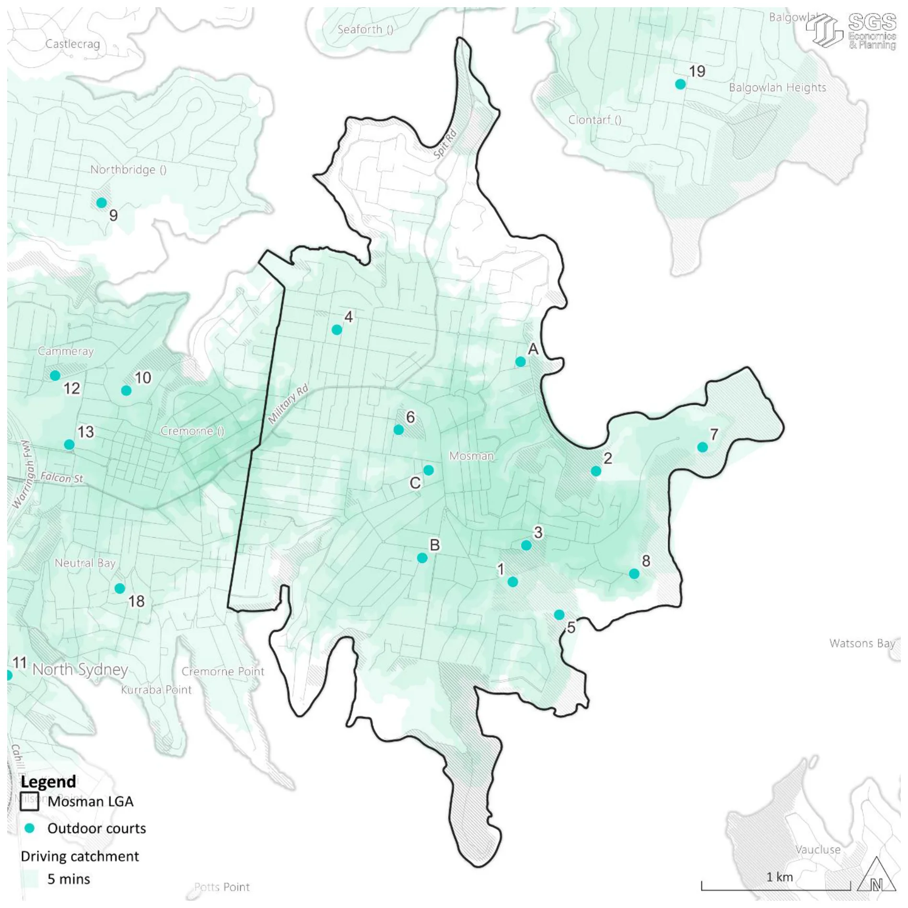

<!-- page 628 -->

SGS ECONOMICS AND PLANNING: COMMUNITY INFRASTRUCTURE NEEDS ASSESSMENT 67

Figure 25: Travel accessibility for lawn bowls and specialist courts

Source: SGS Economics & Planning, 2026.

August 2026

Attachment 1.1.5 Mosman Council

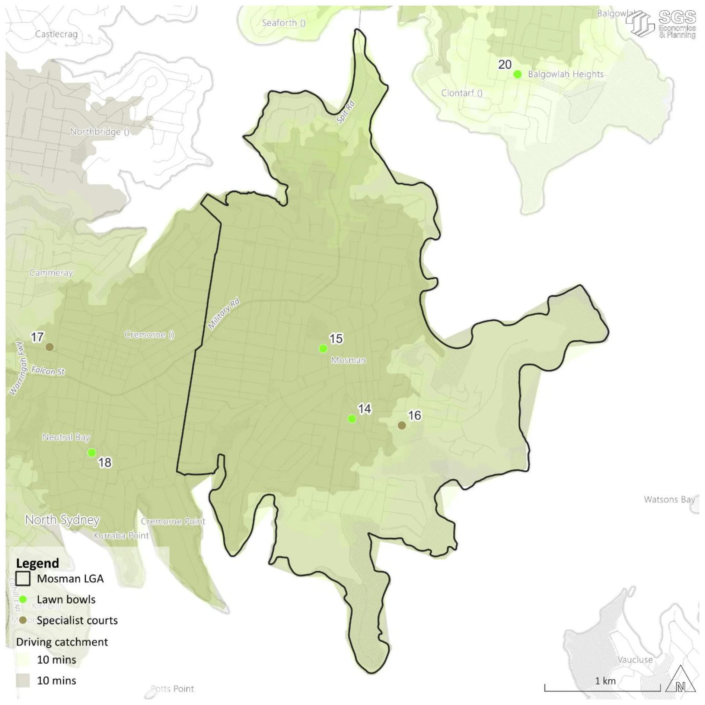

<!-- page 629 -->

SGS ECONOMICS AND PLANNING: COMMUNITY INFRASTRUCTURE NEEDS ASSESSMENT 68

Supply and demand Based on the existing supply and forecast population, there will be an oversupply of outdoor courts, lawn bowls and specialist courts in the future.

To understand this further, an assessment of utilisation of courts should be undertaken. In addition to this, participation trends and opportunities to increase the multi-use capacity of courts that are only providing use for one sport (tennis/bowls) should be further investigated.

Table 26: Supply and demand assessment for outdoor recreation

Hierarchy Existing supply* Future demand Future gap or surplus

Outdoor courts 16 11.0 5.0

Lawn bowls 4 1.0 3.0

Specialist courts 4 2.3 1.7

Source: SGS Economics & Planning, 2026. *Note: Half courts and restricted facilities are not counted in this supply assessment.

Summary of service needs:

▪ Review utilisation and fitness for purpose of existing facilities to ensure they are still meeting community needs.

August 2026

Attachment 1.1.5 Mosman Council

<!-- page 630 -->

SGS ECONOMICS AND PLANNING: COMMUNITY INFRASTRUCTURE NEEDS ASSESSMENT 69

#### 6.9

#### Sports fields

Definition Sports fields can support a range of structured sporting activities. Outdoor sports fields can be provided as an individual field, or collectively with 2 or more on a site. Depending on field size, most sports fields are also supported with a multi-purpose, multi-club pavilion.

The following table provides a service definition and service standard for sports fields in the Mosman LGA.

Table 27: Service definition and service standards for outdoor fields

Facility type – service definition hierarchy Benchmark Travel accessibility

Sports field An open grass or synthetic playing field supporting structured team sport, with lighting, irrigation, goal structures, fencing and spectator facilities. Outdoor fields should be multi-purpose supporting a range of sports across seasons.

1 field per 5,000 people

5 minutes

Source: SGS Economics & Planning, 2026.

Existing infrastructure Mosman LGA has 6 sports fields, most of which are 1 oval. Many of these ovals are providing for multiple sports. Given the restricted space, the ability to use the ovals for multiple sports greatly increases the capacity. An example of this is Balmoral Park which includes capacity to support athletics, cricket, soccer, and rugby.

The condition of sports fields varies. Allan Border, Balmoral, Georges Height and Rawson Ovals are in excellent condition, Middle Head Oval is in good condition, and Reid Park and Spit West Reserve are in average condition. Utilisation of sports fields also varies, with Rawson Oval, Middle Head Oval and Allan Border booked for over 50% of peak hours14 in 2025. The Balmoral and Georges Height Ovals are booked less, at 37% and 43% of peak hours respectively.

In addition to formalised sporting fields, the LGA includes a range of parks that support access to training or informal sport through the delivery of infrastructure such as cricket wickets. These facilities have been included in the asset list, however given they cannot support formal sporting games they have not been included in the supply and demand assessment.

14  7am-5pm on weekends, and 4pm-9pm weekdays

August 2026

Attachment 1.1.5 Mosman Council

<!-- page 631 -->

SGS ECONOMICS AND PLANNING: COMMUNITY INFRASTRUCTURE NEEDS ASSESSMENT 70

Figure 26: Existing sports fields

Source: SGS Economics & Planning, 2026.

Table 28: Existing sports fields

# Facility name Location No. Fields Types of sports Asset condition Utilisation

1 Allan Border Oval 29 Myahgah Rd, Mosman 1 Soccer, cricket 1 Average15

2 Balmoral Oval The Esplanade, Mosman 2 Soccer, cricket, rugby, athletics

1 Low16

15 Council has indicated that for the whole year of 2025, it had a utilisation rate of 55.3% during peak hours. 16 Council has indicated that for the whole year of 2025, it had a utilisation rate of 36.9% during peak hours.

August 2026

Attachment 1.1.5 Mosman Council

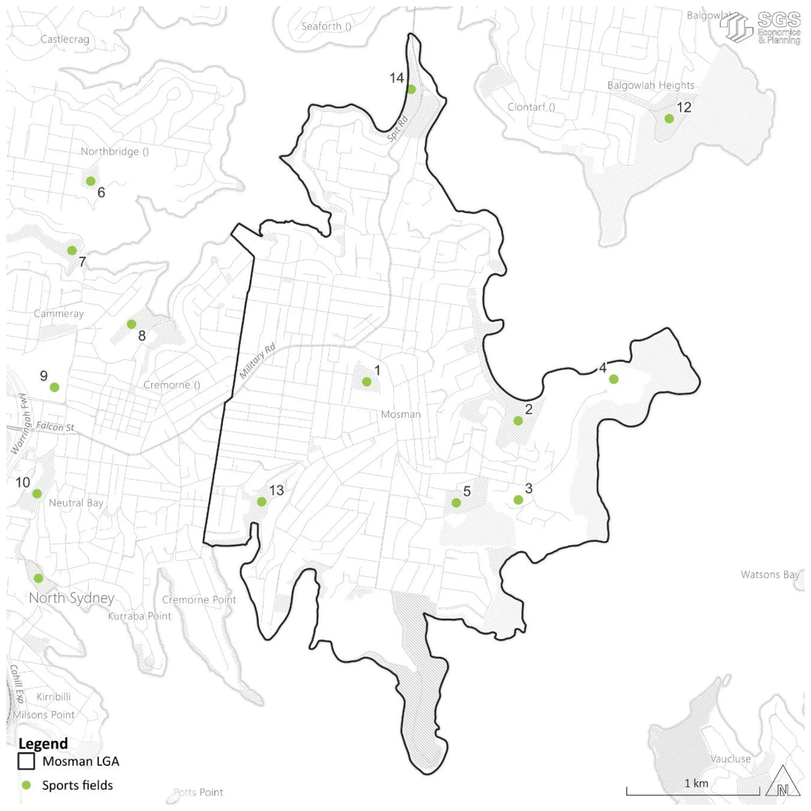

<!-- page 632 -->

SGS ECONOMICS AND PLANNING: COMMUNITY INFRASTRUCTURE NEEDS ASSESSMENT 71

# Facility name Location No. Fields Types of sports Asset condition Utilisation

3 Georges Heights Oval*

Suakin Drive, 1 Best Ave, Mosman

1 Soccer, cricket, football, rugby

1 Low 17

4 Middle Head Oval* 1110 Middle Head Rd, Mosman

1 Soccer, football 2 Average18

5 Rawson Oval Cross St, Mosman 1 Soccer, cricket, football, rugby

1 Average19

13 Reid Park** Centenary Dr, Mosman - Cricket 3 N/A

14 Spit West Reserve** The Spit Reserve, Spit Rd, Mosman

- Cricket 3 N/A

Outside of LGA 6 Northbridge Oval and Synthetic Court

271 Sailors Bay Rd, Northbridge

1 Cricket, soccer, football

N/A N/A

7 Tunks Park Brothers Ave, Cammeray 3 Cricket, soccer, football

N/A N/A

8 Primrose Park Young St, Cremorne 3 Cricket, soccer, football, hockey

N/A N/A

9 Cammeray Park Ernest Street &, Park Ave, Cammeray

1 Soccer, rugby N/A N/A

10 Forsyth Park 2 Montpelier St, Neutral Bay

2 Cricket, soccer, football, hockey

N/A N/A

11 Anderson Park Clark Rd, Neutral Bay 1 Cricket, soccer, football, volleyball

N/A N/A

12 Tania Park 2 Bareena Dr, Balgowlah Heights

3 Cricket, soccer, football

N/A N/A

Source: SGS Economics & Planning, 2026. *Owned by Sydney Harbour Federation Trust **Note: These facilities are not counted in the supply assessment as they do not meet the definition. Accessibility catchments are also not shown for these facilities. They provide cricket pitches but are not large enough to support formal games.

Travel accessibility catchment Accessibility varies across the LGA. Mosman LGA residents can only access sports fields within a 5- minute drive if they live in the LGA’s centre or to the east. There are accessibility gaps for people living in the north and west.

17 Council has indicated that for the whole year of 2025, it had a utilisation rate of 43.4% during peak hours. 18 Council has indicated that for the whole year of 2025, it had a utilisation rate of 56.5% during peak hours. 19 Council has indicated that for the whole year of 2025, it had a utilisation rate of 60.0% during peak hours.

August 2026

Attachment 1.1.5 Mosman Council

<!-- page 633 -->

SGS ECONOMICS AND PLANNING: COMMUNITY INFRASTRUCTURE NEEDS ASSESSMENT 72

There are several sports fields in the neighbouring LGAs, some of which are accessible by Mosman LGA residents within a 5-minute drive. The catchments of these sports fields are illustrated in Figure 27.

Figure 27: Travel accessibility for outdoor fields

Source: SGS Economics & Planning, 2026.20

Supply and demand Considering existing supply and forecast population, there is an expected shortfall of 2 sports fields. Most of the population growth will occur around the centre of the LGA and towards the west. This growth will be reliant on the Allan Border Oval.

20 Accessibility is not shown for facilities that are unable to meet the full requirements of a field.

August 2026

Attachment 1.1.5 Mosman Council

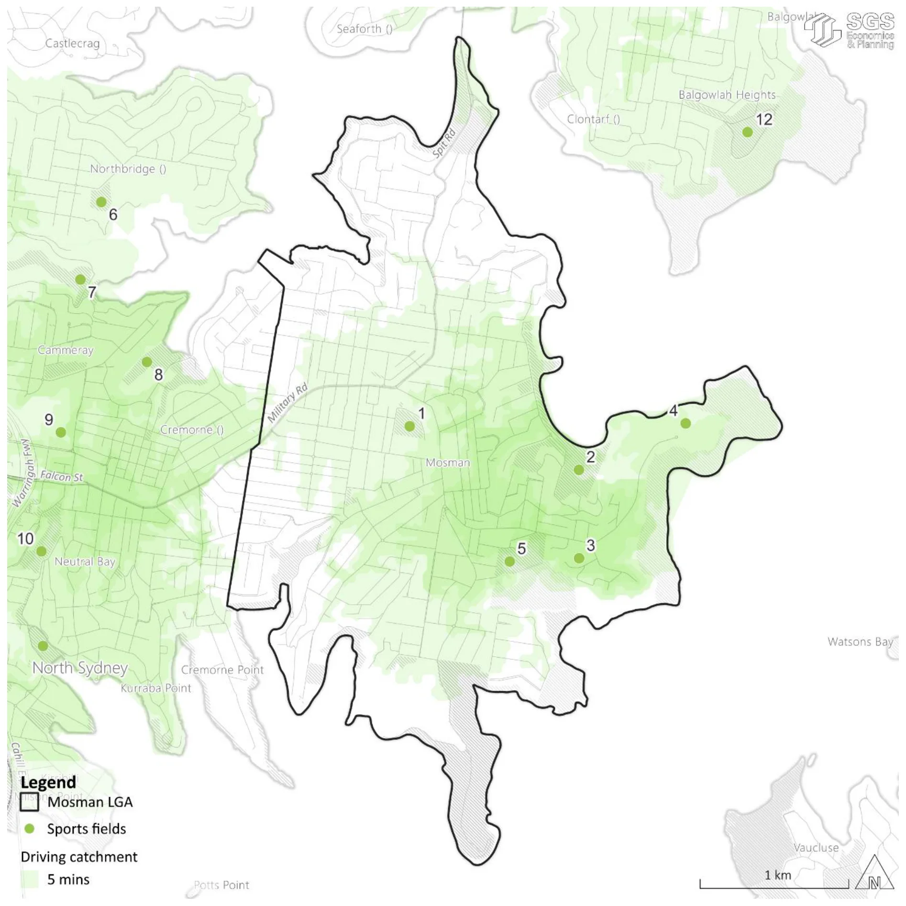

<!-- page 634 -->

SGS ECONOMICS AND PLANNING: COMMUNITY INFRASTRUCTURE NEEDS ASSESSMENT 73

Delivery of new sports fields is challenging due to the land size required. If additional land can be found, ovals should be prioritised in and around the growth area. Council is already using the existing ovals and green space to provide the greatest level of capacity (through the use of multiple sports, lighting, and maintenance schedules). Given this, there is likely to be minimal additional capacity that can be realised at existing sites. These opportunities will be further discussed in Section 7.

Table 29: Supply and demand assessment for outdoor fields

Hierarchy Existing supply Future demand Future gap or surplus

Local 6 7.7 -1.7

Source: SGS Economics & Planning, 2026.

Summary of service needs:

▪ 2 x outdoor sports fields.

August 2026

Attachment 1.1.5 Mosman Council

<!-- page 635 -->

SGS ECONOMICS AND PLANNING: COMMUNITY INFRASTRUCTURE NEEDS ASSESSMENT 74

#### 6.10

#### Public open space

Definition Open space is dedicated public space where the primary purpose is open space. Open space supports a range of functions including sport, recreation, social, linkage, amenity, environmental and events. The following table provides a service definition and service standard for public open space in the Mosman LGA.

The provision for open space provides the total amount of open space required. This is not additional open space on top of the previously mentioned sports fields, rather the sports fields would be provided in this open space.

Table 30: Service definition and service standards for public open space

Facility type – service definition hierarchy Benchmark Travel accessibility

Public open space

Open space is dedicated public space where the primary purpose is open space. It can support a range of functions including sport, recreation, social, linkage, and events.

30 sqm per capita

95% of dwellings within 400m of any open space

Types of public open space

Regional Regional open spaces are municipal destination zones. Infrastructure provided in regional spaces supports long stay times and typically accommodates substantial infrastructure and facilities that can cater to a large number of people. These spaces cater to users from across Warrnambool and, for some, the wider region.

> 8 ha -

District District open spaces are destination zones that service a precinct. They can accommodate different activities and different user groups simultaneously. They are large enough to accommodate formalised sporting functions such as courts and playing fields; however, to include formalised sport, they must be at least 8 ha in size. Infrastructure provided on district spaces supports longer stay times.

1-8 ha -

Local Local open space is intended as walkable locations for immediate residents. They can provide a range of passive open space functions, however, only for short stays.

0.5-1 ha -

Pocket Very small parcels of open space which can contribute to improving amenity and providing ‘pockets’ of green relief. Due to size, the functionality of these spaces is limited; however, they can provide opportunities to improve access to nature, relaxation and linkage. Pocket open spaces are not prioritised as new open space, rather are only delivered to improve amenity opportunities.

<0.5 ha -

Source: SGS Economics & Planning, 2026.

August 2026

Attachment 1.1.5 Mosman Council

<!-- page 636 -->

SGS ECONOMICS AND PLANNING: COMMUNITY INFRASTRUCTURE NEEDS ASSESSMENT 75

Existing infrastructure Mosman LGA contains a mix of pocket, local, district and regional open space. Regional open space is to the south and south east, while the other types of open space are more dispersed throughout the LGA. See Appendix B for full list of open space by hierarchy and size.

Figure 28: Existing public open space

Source: SGS Economics & Planning, 2026.

August 2026

Attachment 1.1.5 Mosman Council

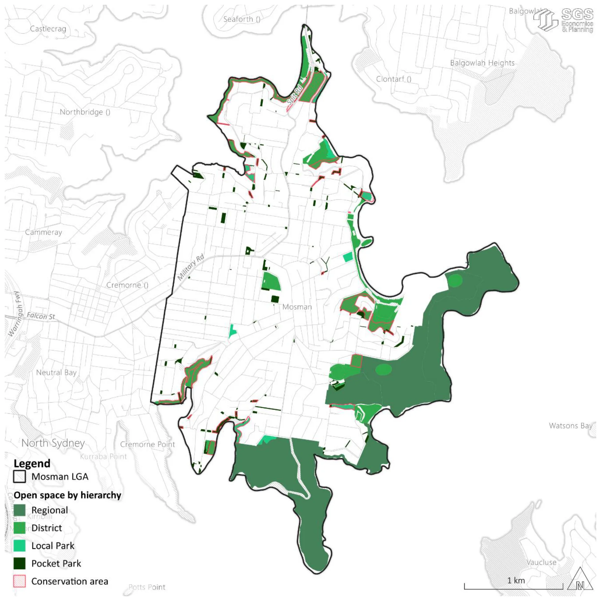

<!-- page 637 -->

SGS ECONOMICS AND PLANNING: COMMUNITY INFRASTRUCTURE NEEDS ASSESSMENT 76

Travel accessibility catchment The commonly accepted benchmark for open space provision is for 95% of dwellings to be able to access open space within 400 metres.

The LGA has a high level of conservation and regional open space (the headlands) that provide some access to green space and open space functions, however the primary purpose is not public open space. Given this land is able to support some access to green space however, this land is included in the accessibility assessment.

As noted in Figure 29, there are gaps throughout the LGA in relation to households that cannot access open space within 400m. Across all dwellings, this equates to appropriately 91% of dwellings in the LGA that can access open space within 400 metres. When removing conservation land and the headlands this further decreases to 88%.

Table 31: Accessibility for public open space

Hierarchy Benchmark Accessibility

Public open space 95% of dwellings are within 400m of open space

91% of dwellings within 400m of any open space21

Source: SGS Economics & Planning, 2026.

21 Includes conservation areas and regional open space (headlands). Dwellings are based on 2021 data

August 2026

Attachment 1.1.5 Mosman Council

<!-- page 638 -->

SGS ECONOMICS AND PLANNING: COMMUNITY INFRASTRUCTURE NEEDS ASSESSMENT 77

Figure 29: Travel accessibility for public open space

Source: SGS Economics & Planning, 2026.

In relation to the types of space that residents can access, the LGA has a heavy reliance on pocket parks. Figure 30 shows accessibility that is only applied to pocket parks. This highlights that most residents in the west as well as the south of the centre of Mosman only have access to pocket parks.

Pocket parks are useful in providing relief from the urban environment and supporting to decrease urban heat island effect. Due to their size however they have limited functionality and can only support short stay visitations.

Given this, to increase access to high quality open space, opportunities to increase the size of pocket parks should be investigated alongside ensuring any new parks are at least 0.5ha to increase the functionality of spaces across the LGA.

August 2026

Attachment 1.1.5 Mosman Council

<!-- page 639 -->

SGS ECONOMICS AND PLANNING: COMMUNITY INFRASTRUCTURE NEEDS ASSESSMENT 78

Figure 30: Travel accessibility for pocket parks

Source: SGS Economics & Planning, 2026.

Supply and demand Based on the existing supply and forecast population, there is insufficient quantity of public open space within the LGA now and into the future to support the population. This will likely result in existing open space having to work harder (increasing its carrying capacity/embellishment of infrastructure) to cater for the increased demand. As noted in the sports fields section, Council has already increased the carrying capacity of sports fields, therefore limited additional capacity is likely be available on this land.

August 2026

Attachment 1.1.5 Mosman Council

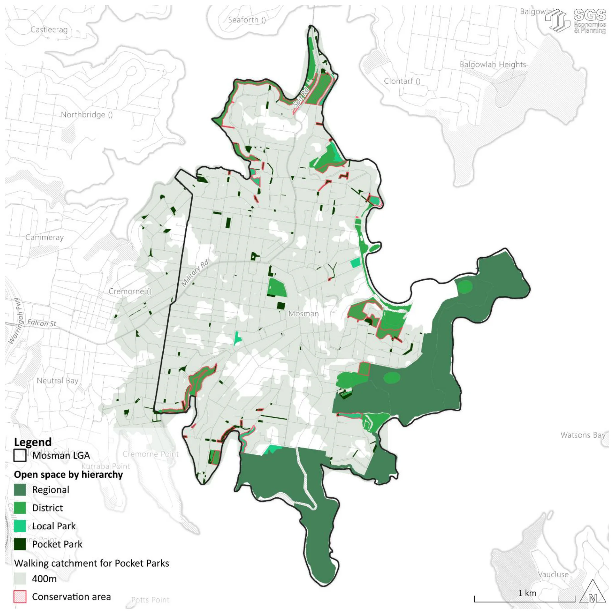

<!-- page 640 -->

SGS ECONOMICS AND PLANNING: COMMUNITY INFRASTRUCTURE NEEDS ASSESSMENT 79

Given the size of the LGA and land constraints, the quantity of open space required is unlikely achievable. Instead, alternative infrastructure responses will be required. These opportunities will be further discussed in Section 7.

Table 32: Supply and demand assessment for public open space

Hierarchy Existing supply (ha) Future demand (ha) Future gap or surplus (ha)

Public open space 41.8222 115.6123 73.79

Source: SGS Economics & Planning, 2026.

Summary of service needs:

▪ Explore opportunities to increase the quantity of open space, capacity of existing open space, and opportunities to upgrade existing open space to meet current community infrastructure needs.

22 Excludes conservation areas (29.85 ha), and regional open space (headlands) (160.29 ha) 23 Based on benchmark of 30 sqm per capita

August 2026

Attachment 1.1.5 Mosman Council

<!-- page 641 -->

SGS ECONOMICS AND PLANNING: COMMUNITY INFRASTRUCTURE NEEDS ASSESSMENT 80

#### 6.11

#### Playgrounds

Definition Playgrounds can cater for specific age groups or include an integration of infrastructure to support broader age groups and risk-taking play through zoning of space.

The size of the play infrastructure is generally directed by the size and hierarchy of the open space and the duration of stay e.g. regional open space can generally support a regional level playground with supporting infrastructure such as toilets and BBQs.

Playgrounds can be co-located with active or passive recreation uses and can be supported by broader play infrastructure such as skateparks, pump tracks, and halfcourts.

Table 33: Service definition and service standards for public open space

Facility type – service definition hierarchy Benchmark

Playgrounds An outdoor area for children to informally play and build social connection skills. Playgrounds can include a range of infrastructure such as nature play, sensory, water socialisation, and traditional play infrastructure.

400m of open space

Hierarchy

Local Short stay (30mins), limited infrastructure primarily for 1 target group. They are small playgrounds that provide basic play equipment and may include amenities like seating.

1:2,000

District Medium stay (up to an hour), infrastructure to support 2 target groups. They are medium sized playgrounds that are generally co-located with sports fields, foreshores, or other community infrastructure. They provide a wider range of play equipment and amenities such as seating, picnic tables, BBQ facilities, and toilets.

1:8,000

Regional Destination playground with infrastructure for all ages and the ability to support long stay (2+ hrs). They are large playgrounds that are generally co-located with sports fields, foreshores, or other community infrastructure, and attract people from across the LGA. They provide an extensive range of play equipment, which might include basketball facilities, fitness equipment, cycling tracks, water play, nature play or adventure play. Amenities may include seating, picnic tables, BBQ facilities, and toilets.

1:50,000

Source: SGS Economics & Planning, 2026.

Existing infrastructure The LGA has 15 playgrounds, with an overall asset condition of good (2.1). Playgrounds are dispersed across the LGA, and mostly in district open space (6) and pocket parks (6). Only 3 are in local level open space.

August 2026

Attachment 1.1.5 Mosman Council

<!-- page 642 -->

SGS ECONOMICS AND PLANNING: COMMUNITY INFRASTRUCTURE NEEDS ASSESSMENT 81

Figure 31: Existing playgrounds

Source: SGS Economics & Planning, 2026.

Table 34: Existing playgrounds

# Facility name Hierarchy Location Asset condition 1 Balmoral Playground District The Esplanade, Mosman 3 2 Bay Street Park Playground Local 8A Bay St, Mosman 3 3 Beaconsfield Reserve Playground Local Cnr Beaconsfield Rd and Plunkett Rd, Mosman

3

4 Clifton Gardens Playground Regional Morella Rd, Mosman 2 5 Countess Street Park Playground Local 22 Countess St, Mosman 2

August 2026

Attachment 1.1.5 Mosman Council

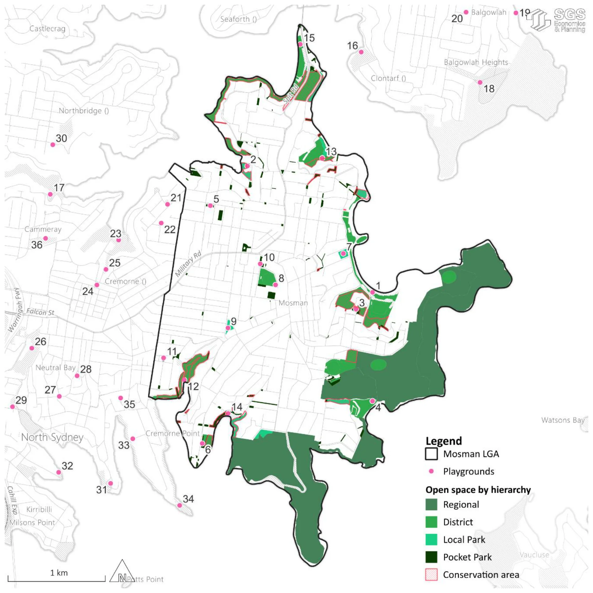

<!-- page 643 -->

SGS ECONOMICS AND PLANNING: COMMUNITY INFRASTRUCTURE NEEDS ASSESSMENT 82

# Facility name Hierarchy Location Asset condition 6 Curraghbeena Park Playground Local Raglan St, Mosman 2 7 Hunter Park Playground Local 41 The Esplanade, Mosman 1 8 Memorial Park Playground Local Cnr Gouldsbury St and The Crescent, Mosman

3

9 Memory Park Playground District Lot 1 Cowles Rd, Mosman 2 10 Mosman Square and Village Green Local 4/8 Myahgah Rd, Mosman 1 11 Reginald Park Playground Local 8-10 Calliope St, Mosman 3 12 Reid Park Playground District Centenary Dr, Mosman 1 13 Rosherville Reserve Playground Local 46 Hopetoun Ave, Mosman 2 14 Sirius Cove Reserve Playground Local Sirius Cove Rd, Mosman 2 15 Spit West Reserve Playground District The Spit Reserve, Spit Rd, Mosman 1 Outside of LGA 16 Clontarf Reserve Playground Regional Clontarf Reserve, Sandy Bay Rd, Clontarf N/A 17 Tunks Park Playground District Brothers Ave, Cammeray N/A 18 Tania Park Playground District 2 Bareena Dr, Balgowlah Heights N/A 19 Forty Baskets Playground Local 11 Gourlay Ave, Balgowlah N/A 20 Nanbaree Reserve & Playground Local 13 Hogan St, Balgowlah Heights N/A 21 Lodge Road Park Playground Local 38 Lodge Rd, Cremorne N/A 22 W H Brothers Memorial Park Playground

Local Fifth Ave, Cremorne N/A

23 Brightmore Reserve Playground District Young St, Cremorne N/A 24 Grasmere Childrens Playground Local 71 Grasmere Rd, Cremorne N/A 25 Grasmere Reserve Playground Local 101 Benelong Ln, Cremorne N/A 26 Forsyth Park Playground Local 83 Bent St, Neutral Bay N/A 27 Phillips Street Playground Local Phillips St, Neutral Bay N/A 28 Ilbery Reserve Playground Local 22 Barry St, Neutral Bay N/A 29 Warringa Park Playground Local Kurraba Rd, Neutral Bay N/A 30 John Roche Playground Local Roche Ln, Northbridge N/A 31 Hodgsons Lookout Playground Local 192B Kurraba Rd, Kurraba Point N/A 32 Kesterton Park Playground Local 146 High St, North Sydney N/A 33 Sirius Street Playground Local 92 Milson Rd, Cremorne Point N/A 34 Cremorne Reserve Playground Local 2 Milson Rd, Cremorne Point N/A

August 2026

Attachment 1.1.5 Mosman Council

<!-- page 644 -->

SGS ECONOMICS AND PLANNING: COMMUNITY INFRASTRUCTURE NEEDS ASSESSMENT 83

# Facility name Hierarchy Location Asset condition 35 Prior Avenue Reserve Local 7A Prior Ave, Cremorne Point N/A 36 Green Park Playground Local 18 Warwick Ave, Cammeray N/A

Source: SGS Economics & Planning, 2026. Note, the hierarchy of playgrounds in North Sydney LGA is identified in the 2022 Playgrounds Plan of Management, and the 2022 Open Space and Outdoor Recreation Strategy and Action Plan for Northern Beaches LGA.

Travel accessibility catchment Accessibility analysis was conducted for all playgrounds across the LGA (400m walk from playgrounds). There are major gaps in the north, west, and southern half of the LGA due to the absence of playgrounds in these areas. Figure 32 below shows that playgrounds in neighbouring North Sydney LGA provide limited access to residents of Mosman LGA. This figure also identifies public and private primary schools which are likely to include playgrounds that may provide some additional access for surrounding residents; however, access will be varied across each site.

August 2026

Attachment 1.1.5 Mosman Council

<!-- page 645 -->

SGS ECONOMICS AND PLANNING: COMMUNITY INFRASTRUCTURE NEEDS ASSESSMENT 84

Figure 32: Travel accessibility for playgrounds

Source: SGS Economics & Planning, 2026. Playgrounds should be located to support local demographics. In addition, they are often provided on higher order open space that support a range of open space functions, longer stays and destination venues such as local, district and regional level parks.

Based on 2021 Census data, the greatest proportion of 0-9 year olds were located in the west of the LGA. As noted earlier in the report, Mosman, like other LGAs will continue to experience an ageing population. The LMR catchment will bring additional growth to the LGA, including children and young people. The LMR area currently has walkability gaps to playgrounds therefore if opportunities to provide an additional local playground in this area should be considered.

School infrastructure can also provide the community with additional access to playgrounds outside of school hours. Access to this infrastructure is at the discretion of the Principal and while it can provide additional infrastructure across the network, it is restricted in relation to access.

August 2026

Attachment 1.1.5 Mosman Council

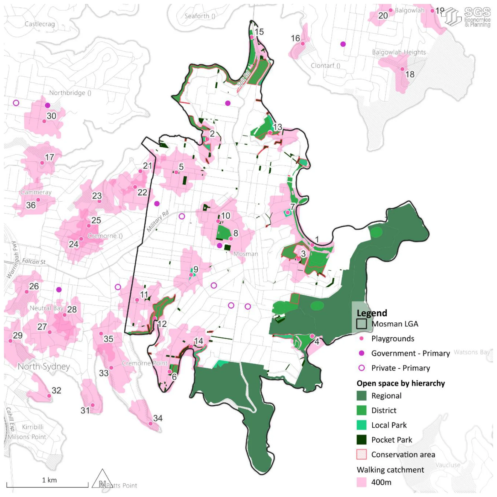

<!-- page 646 -->

SGS ECONOMICS AND PLANNING: COMMUNITY INFRASTRUCTURE NEEDS ASSESSMENT 85

Council should continue to monitor the utilisation of existing playgrounds, ensure they are meeting best practice and user needs, along with the demand for future playground infrastructure.

Figure 33: Travel accessibility for playgrounds, with 0-9 years population (2021)

Source: SGS Economics & Planning, 2026.

August 2026

Attachment 1.1.5 Mosman Council

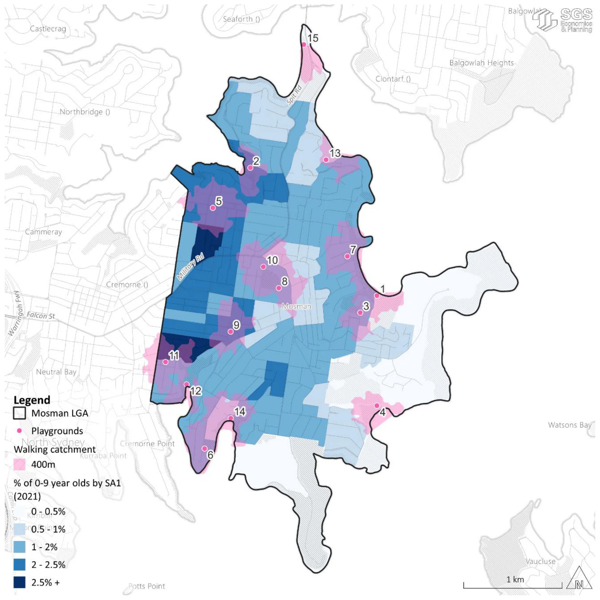

<!-- page 647 -->

SGS ECONOMICS AND PLANNING: COMMUNITY INFRASTRUCTURE NEEDS ASSESSMENT 86

Supply and demand Based on the existing supply and forecast population, there is sufficient regional playgrounds, however a shortfall of local playgrounds within the LGA now and into the future to support the population. Based on nesting this results in an additional 4 local playgrounds required.

The delivery of these playgrounds should consider local demographics and engagement with local residents.

Table 35: Supply and demand assessment for playgrounds

Hierarchy Existing supply Future demand Future gap or surplus

Local 10 19.3 -9.3

District 4 4.8 -0.8

Regional 1 0.8 0.2

Source: SGS Economics & Planning, 2026.

Summary of service needs:

▪ Ensure existing playground infrastructure meets community needs and monitor demand for additional infrastructure based on demographic shifts.

▪ 4 x additional local playgrounds, one of which should be within the LMR catchment.

▪ Explore partnership opportunities with public and private primary schools to increase public access outside of school hours.

August 2026

Attachment 1.1.5 Mosman Council

<!-- page 648 -->

SGS ECONOMICS AND PLANNING: COMMUNITY INFRASTRUCTURE NEEDS ASSESSMENT 87

#### 6.12

#### Education

Definition Education can include a range of services. For this assessment education focuses on government primary and secondary schools owned and managed by the NSW Government.

The following table provides a service definition and service standard for government schools in the Mosman LGA.

Table 36: Service definition and service standards for educational facilities

Facility type – service definition hierarchy Benchmark Travel accessibility

Government – Primary

Government primary school providing education services for those aged 5-12yrs based on a NSW 67% participation rate.

1 place per participating child

5 minutes

Government – Secondary

Government secondary school providing education services for those aged 13-18yrs based on a NSW 56% participation rate.

1 place per participating child

10 minutes

Source: SGS Economics & Planning, 2026.

Existing infrastructure There are a high number of schools located in the Mosman LGA.

There is 1 government high school and 3 government primary schools in the central and north-western parts of the LGA. The LGA also has a non-government secondary school and 4 non-government primary schools, which complement the school network.

There is also a mix of government and non-government primary and secondary schools in the adjoining LGAs.

August 2026

Attachment 1.1.5 Mosman Council

<!-- page 649 -->

SGS ECONOMICS AND PLANNING: COMMUNITY INFRASTRUCTURE NEEDS ASSESSMENT 88

Figure 34: Existing educational facilities

Source: SGS Economics & Planning, 2026.

August 2026

Attachment 1.1.5 Mosman Council

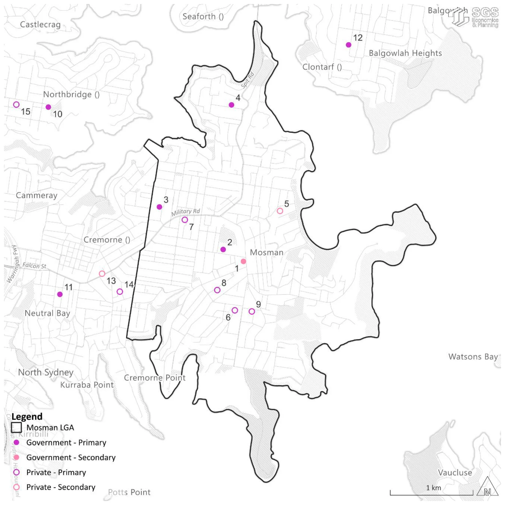

<!-- page 650 -->

SGS ECONOMICS AND PLANNING: COMMUNITY INFRASTRUCTURE NEEDS ASSESSMENT 89

Table 37: Existing educational facilities

# Facility name Service Location School enrolment cap24

2 Mosman Public School Government – Primary

27 Belmont Rd, Mosman 670

3 Middle Harbour Public School Government – Primary

8 Hale Rd, Mosman 486

4 Beauty Point Public School Government – Primary

17 Medusa St, Mosman 150

1 Mosman High School Government – Secondary

769 Military Rd, Mosman 1,280

6 Queenwood School for Girls (Junior Campus)

Private – Primary

6 Queen St, Mosman N/A

7 Sacred Heart Catholic Primary School Mosman

Private – Primary

8 Cardinal St, Mosman N/A

8 Mosman Church of England Preparatory School

Private – Primary

75 Shadforth St, Mosman N/A

9 Blessed Sacrament Catholic Primary School

Private – Primary

2 Queen St, Mosman N/A

5 Queenwood School for Girls Private – Secondary

44 Mandolong Rd, Mosman N/A

Outside of LGA 10 Northbridge Public School Government – Primary

296A Sailors Bay Rd, Northbridge

416

11 Neutral Bay Public School Government – Primary

175 Ben Boyd Rd, Neutral Bay 855

12 Balgowlah Heights Public School Government – Primary

9B Lewis St, Balgowlah Heights 696

13 Redlands Other 272 Military Rd, Cremorne N/A 14 Redlands Junior Campus Other 2 Allister St, Cremorne N/A 15 St Philip Neri Catholic Primary School Other 67 Baringa Rd, Northbridge N/A

Source: SGS Economics & Planning, 2026. The count refers to the enrolment cap of schools,25 apart from Balgowlah Heights Public School, which is its latest enrolment figure.

24 According to the Parliament of NSW, the enrolment cap is not an indication of the actual enrolment capacity, rather to indicate that non-local students cannot be enrolled when the school is approaching or exceeding the enrolment cap. 25 https://www.parliament.nsw.gov.au/lcdocs/other/13326/Attachment%20B%20for%20Q355.pdf

August 2026

Attachment 1.1.5 Mosman Council

<!-- page 651 -->

SGS ECONOMICS AND PLANNING: COMMUNITY INFRASTRUCTURE NEEDS ASSESSMENT 90

Travel accessibility catchment Accessibility analysis was conducted for government primary and secondary schools. All residents in the LGA can access Mosman High School within a 10-minute drive. Government primary schools are less accessible for residents within a 5-minute drive, particularly for those residing in the south and east, where there is an absence of government primary schools.

Primary and secondary schools in the Northern Beaches LGA are not accessible from Mosman LGA within the benchmarked driving times.

Figure 35: Travel accessibility for educational facilities

Source: SGS Economics & Planning, 2026.26

26 Accessibility is not shown for private schools.

August 2026

Attachment 1.1.5 Mosman Council

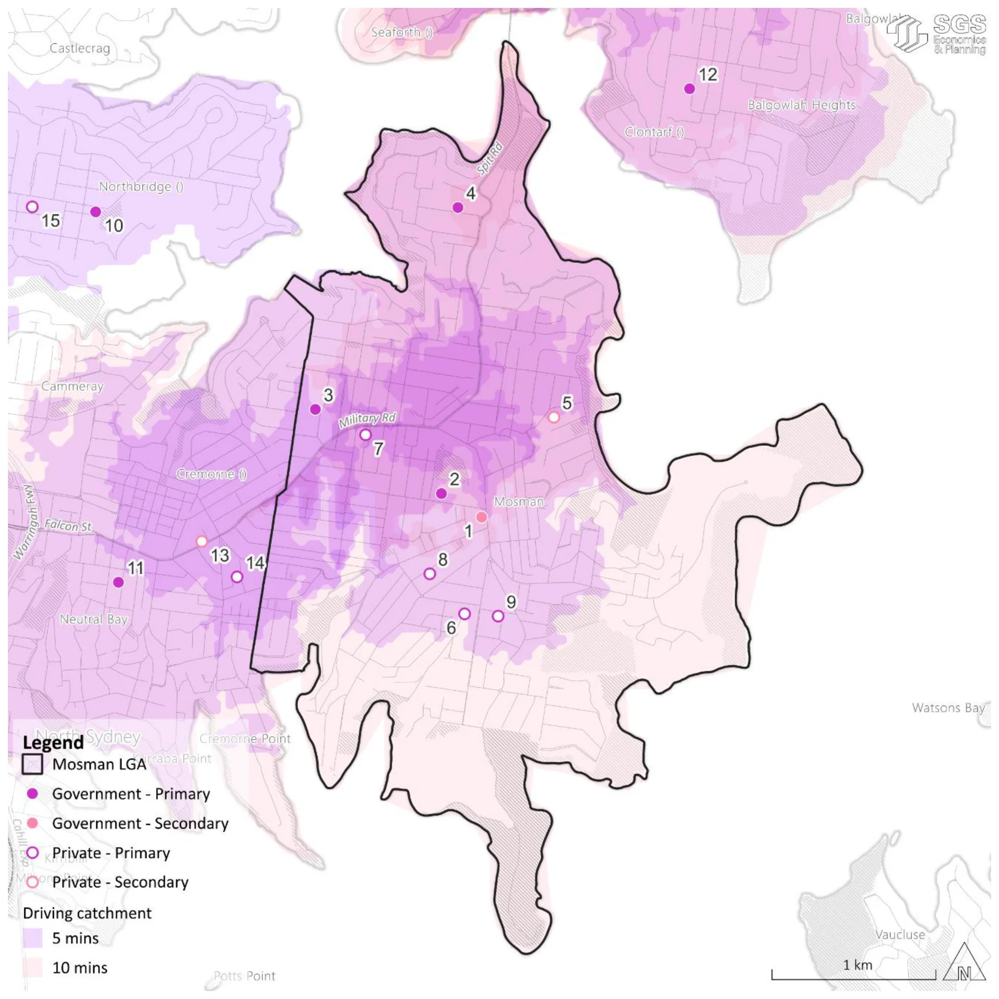

<!-- page 652 -->

SGS ECONOMICS AND PLANNING: COMMUNITY INFRASTRUCTURE NEEDS ASSESSMENT 91

Supply and demand Based on the existing supply and forecast population, the existing schools are likely to be able to cater for future demand, however there is a small undersupply in government primary schools. Participation in government vs non-government education varies depending on family needs, financial capacity, and access to services. These benchmarks have been based on the most recent NSW participation rates; however, the findings should be further validated through engagement with education providers to understand capacity, waitlists, and trends.

Furthermore, the enrolment cap serves as an indicator for when to start restricting out-of-area enrolments, increasing the capacity for local students.

While this is a non-Council service, Council should continue to liaise with the education providers to monitor utilisation and capacity across the schools to ensure there is adequate supply to support local needs.

Table 38: Supply and demand assessment for educational facilities

Hierarchy Existing supply Future demand Future gap or surplus

Government – Primary 1,306 student places 1,463 student places -157 places

Government – Secondary

1,280 student places 1,276 student places 4 places

Source: SGS Economics & Planning, 2026.

Summary of service needs:

▪ Continue to work with Government schools to monitor demand and capacity.

August 2026

Attachment 1.1.5 Mosman Council

<!-- page 653 -->

SGS ECONOMICS AND PLANNING: COMMUNITY INFRASTRUCTURE NEEDS ASSESSMENT 92

#### 6.13

#### General practitioners

Definition Access to general practitioners (GPs) is the base level of health services at a local setting. The following table provides a service definition and service standard for GPs in the Mosman LGA.

Table 39: Service definition and service standards for GPs

Facility type – service definition hierarchy Benchmark Travel accessibility

Local General Practitioners

A doctor for patients seeking medical attention – often, one of the first people of contact for primary care. Medical centres often have more than 1 General Practitioner (GP).

117 GPs per 100,000 people

5 minutes

Source: SGS Economics & Planning, 2026.

Existing infrastructure Mosman LGA has 7 medical centres. Around half of them are located along Military Rd, while the rest are spread across the LGA. The LGA has a total of 50 registered general practitioners, with 47 currently practicing.27

27 AHPRA Register of practitioners in the Mosman suburb

August 2026

Attachment 1.1.5 Mosman Council

<!-- page 654 -->

SGS ECONOMICS AND PLANNING: COMMUNITY INFRASTRUCTURE NEEDS ASSESSMENT 93

Figure 36: Existing GP facilities

Source: SGS Economics & Planning, 2026.

Table 40: Existing GP facilities # Facility name Location 1 Mosman Integrative Medicine 4 Best Ave, Mosman 2 Balmoral Medical Practice 8/148-152 Spit Rd, Mosman 3 Mosman Medical Centre Suite 100, Ground Floor/748 Military Rd, Mosman 4 General Practice Cremorne 414 Military Rd, Mosman 5 The Mosman Practice 393 Military Rd, Mosman

August 2026

Attachment 1.1.5 Mosman Council

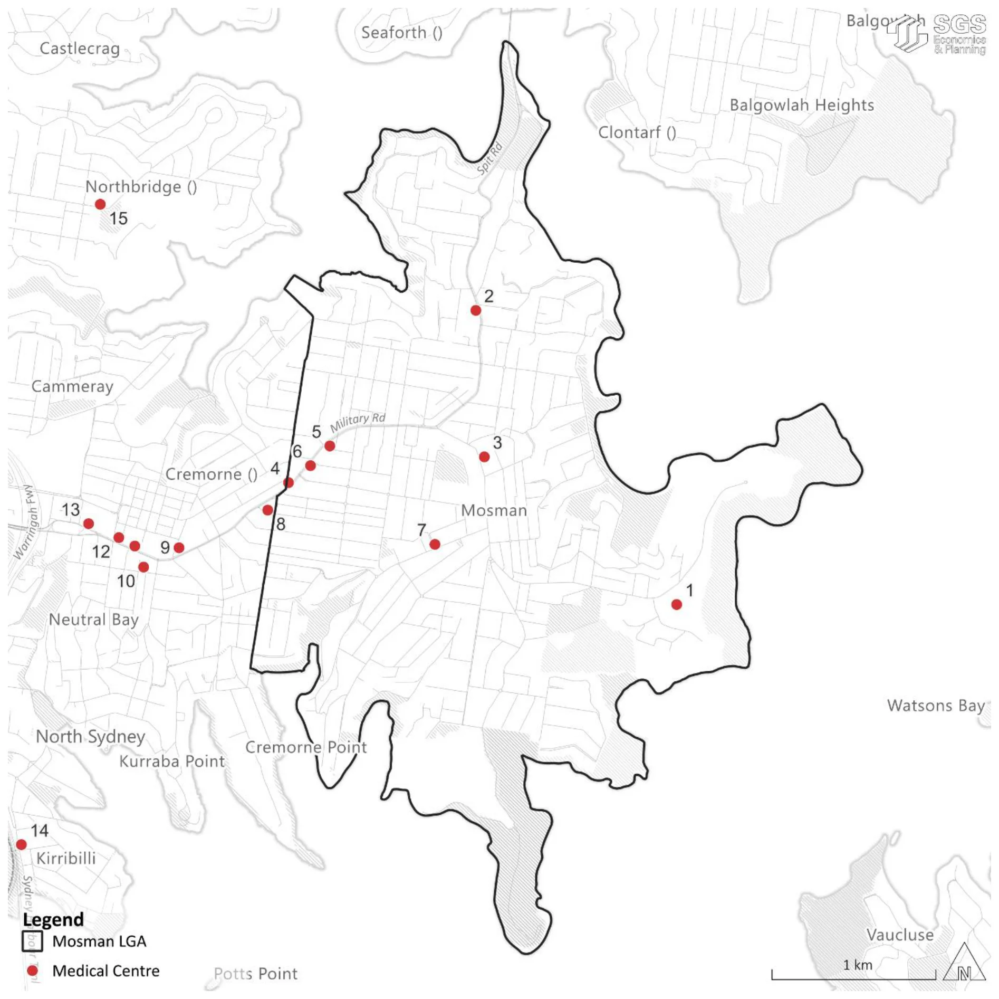

<!-- page 655 -->

SGS ECONOMICS AND PLANNING: COMMUNITY INFRASTRUCTURE NEEDS ASSESSMENT 94

# Facility name Location 6 Health Promise Medical Centre Shop 3/361 Military Rd, Mosman 7 Avenue Road Medical Practice 90 Avenue Rd, Mosman Outside of LGA 8 Cremorne Medical Practice Shop 8/287 Military Rd, Cremorne 9 Nuvo Health Medical Centre Neutral Bay Shop 3/3 Waters Rd, Neutral Bay 10 Intelligent Ageing Level 2 Suite 201/40 Yeo St, Neutral Bay 11 Neutral Bay Medical Practice Level 1/156 Military Rd, Neutral Bay 12 Mind Your Health Medical Centre Neutral Bay 1/124 Military Rd, Neutral Bay 13 Neutral Bay Medical Centre Level 3/116 Military Rd, Neutral Bay 14 Kirribilli Doctors Suite 7/1 Broughton St, Kirribilli 15 Dr Ruth Ratner & Dr Anne Taylor 343 Sailors Bay Rd, Northbridge

Source: SGS Economics & Planning, 2026.

Travel accessibility catchment Most of the GPs are currently located along Military Road, which provides residents, visitors and workers with good public transport access. Whilst the majority of local residents have access to a medical centre within a 5-minute drive, some residents living in the LGA’s south east are outside of this catchment.

There are GPs in Balgowlah, but they cannot be accessed from Mosman LGA within a 5-minute drive.

August 2026

Attachment 1.1.5 Mosman Council

<!-- page 656 -->

SGS ECONOMICS AND PLANNING: COMMUNITY INFRASTRUCTURE NEEDS ASSESSMENT 95

Figure 37: Travel accessibility for health facilities

Source: SGS Economics & Planning, 2026.

Supply and demand Based on the existing supply and forecast population, there may be a surplus of general practitioners now and into the future. Given the location of the services though it is likely that these health facilities are providing services for residents beyond the Mosman LGA.

GPs services are not provided by local government. Given this, Council should continue to liaise with GP services to understand capacity and if there are any service delivery constraints that Council could respond to.

August 2026

Attachment 1.1.5 Mosman Council

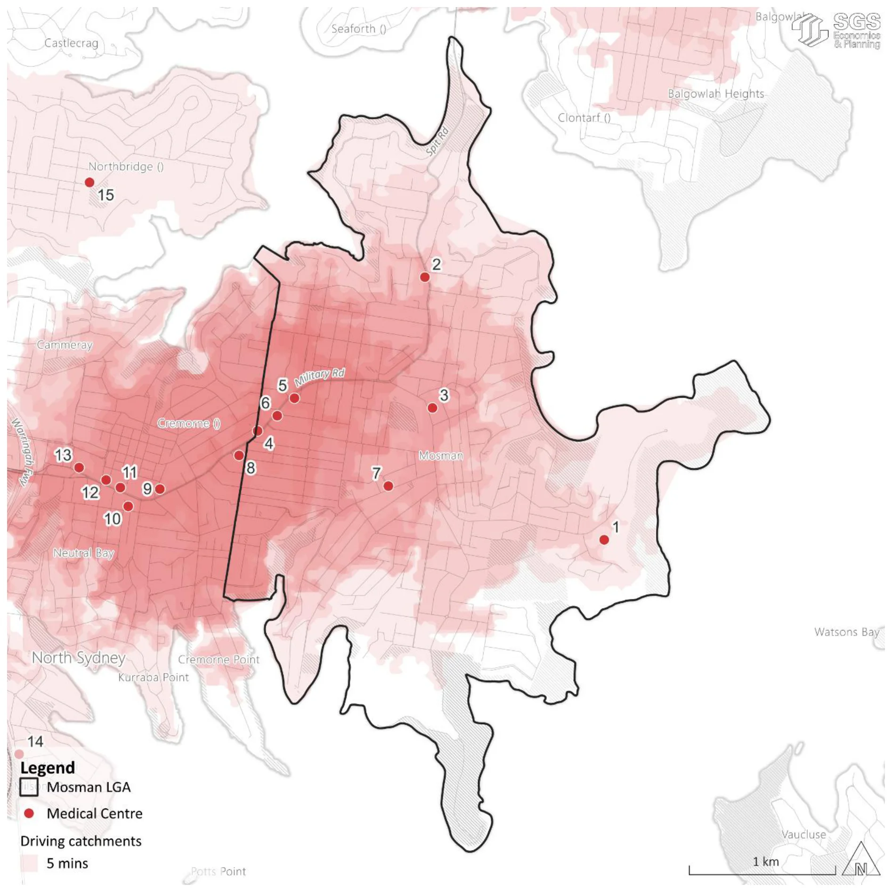

<!-- page 657 -->

SGS ECONOMICS AND PLANNING: COMMUNITY INFRASTRUCTURE NEEDS ASSESSMENT 96

Table 41: Supply and demand assessment for GPs

Hierarchy Existing supply Future demand Future gap or surplus

General Practitioners 4728 38.5 8.5

Source: SGS Economics & Planning, 2026.

Summary of service needs:

▪ Continue to monitor access to local GPs.

28 Total number of registered practising GPs in the Mosman suburb as of 8 May, excluding the 3 non- practising GPs.

August 2026

Attachment 1.1.5 Mosman Council

<!-- page 658 -->

SGS ECONOMICS AND PLANNING: COMMUNITY INFRASTRUCTURE NEEDS ASSESSMENT 97

#### 6.14

#### Summary of services needs

A summary of the service needs from Section 6 is provided in Table 42. Section 7 considers these service needs against the community infrastructure principles to identify infrastructure responses.

Table 42: Summary of service needs

Service Service need

Libraries ▪ Redevelop Barry O’Keefe Library to ensure it can cater for contemporary district library services as well as some Central level library service offerings, including the consideration of 24hr access.

Community venues

▪ 1 x additional neighbourhood community centre. ▪ A range of additional flexible meeting spaces: - 4-6 x small meeting rooms - 1-3 x small to medium meeting rooms - 1 x large meeting room.

Youth ▪ Review fitness for purpose of the existing youth centre to ensure it can support contemporary service needs. ▪ Consider opportunities to further integrate other youth focused services into the Centre, including opportunities for further integration with the library.

Early childhood education and care services

▪ Continue to monitor feedback from existing providers and residents and support additional suppliers to enter the market where relevant.

Arts and culture ▪ 1 x district rehearsal space. ▪ Explore the provision and viability of a municipal theatre space, with consideration to flexible spaces as well as outdoor spaces.

Aquatics ▪ Continue to monitor demand for aquatic facilities. ▪ If required, consider partnership opportunities with the Queenwood School for Girls to increase public access to the facility on the school site.

Indoor courts ▪ 3 x indoor courts.

Outdoor courts ▪ Review utilisation and fitness for purpose of existing facilities to ensure they are still meeting community needs.

Open space ▪ 2 x outdoor sports fields. ▪ Explore opportunities to increase the quantity of open space, capacity of existing open space and opportunities to upgrade existing open space to meet current community infrastructure needs.

August 2026

Attachment 1.1.5 Mosman Council

<!-- page 659 -->

SGS ECONOMICS AND PLANNING: COMMUNITY INFRASTRUCTURE NEEDS ASSESSMENT 98

Service Service need

Playgrounds ▪ Ensure existing playground infrastructure meets community needs and monitor demand for additional infrastructure based on demographic shifts. ▪ 4 x additional local playgrounds, one of which should be within the LMR catchment. ▪ Explore partnership opportunities with public and private primary schools to increase public access outside of school hours.

Education ▪ Continue to work with Government schools to monitor demand and capacity.

Health ▪ Continue to monitor access to local GPs.

Source: SGS Economics & Planning, 2026

August 2026

Attachment 1.1.5 Mosman Council

<!-- page 660 -->

SGS ECONOMICS AND PLANNING: COMMUNITY INFRASTRUCTURE NEEDS ASSESSMENT 99

## 7. Infrastructure recommendations

#### 7.1

#### Community infrastructure principles

Community infrastructure can be in place for 50-100 years and beyond. The delivery of services and community needs will continue to change and evolve over this time. To deliver infrastructure that can best respond to current and future needs, the following principles as outlined in Table 43 have been considered.

Table 43: Guiding principles for the delivery of community services and infrastructure Principles Overview

Responds to the needs of the community ▪ Community infrastructure is service led, rather than asset led. ▪ The hierarchy, infrastructure, and operation of services respond to local needs. ▪ Community services and infrastructure consider the wider community infrastructure network providing complementary services and spaces.

Integration and co-location ▪ Through design and planning, community infrastructure should support and enable the co-location and integration of services. ▪ Complementary services should be integrated and or co-located within the same facility or site to support sharing of services and resources, improve service efficiencies, and provide an improved user experience. Accessibility and inclusivity ▪ Community services should be well located and accessible (where possible by car, public transport, and active transport). ▪ Community infrastructure should be safe and welcoming for all genders, cultures, ages, and abilities.

Flexible and adaptable ▪ Community infrastructure should be designed to respond and adapt to changing needs over time via the services and offering available.

Technology ▪ Technology should be integrated throughout community infrastructure to enable spaces to support a broad range of users and services (hybrid meetings, co- working spaces, WIFI, 24hr access etc). ▪ The use of Smart Technology should be considered in buildings to monitor the asset performance and utilisation to improve service delivery and maintenance schedules.

Partnership ▪ Partnerships with others to build, operate, and maintain community infrastructure should be considered. This could include joint use agreements with schools, leasing of spaces, use of air rights, state, federal government, or private/NFP market led infrastructure.

Sustainability ▪ Sustainable building design should be considered to reduce carbon emissions and operational costs throughout the life of the asset.

Source: SGS Economics & Planning, 2026.

August 2026

Attachment 1.1.5 Mosman Council

<!-- page 661 -->

SGS ECONOMICS AND PLANNING: COMMUNITY INFRASTRUCTURE NEEDS ASSESSMENT 100

#### 7.2

#### Community infrastructure recommendations

To develop the community infrastructure recommendations, the following has been considered:

▪ A review of the current and future policy and demographic context

▪ Community infrastructure principles

▪ Service supply and demand needs

▪ Service operational models and viability considerations

▪ Existing infrastructure asset condition and fitness for purpose

▪ Travel accessibility of the service network across the LGA, and infrastructure in close proximity outside the LGA

▪ Feedback from engagement with internal Council service providers

▪ The current and future role of local government in the provision and delivery of services and infrastructure. The above consideration has resulted in a range of recommendations. Council should consider these recommendations, as well as the broader findings in the report, to inform future strategic directions for social infrastructure and service delivery, and wider asset management planning and funding for the LGA.

The delivery of recommendations should be phased over short (1-5yrs), medium (5-10yrs) and long term (10-15yrs), based on project readiness, forward planning required, funding, and timing of future demand.

August 2026

Attachment 1.1.5 Mosman Council

<!-- page 662 -->

SGS ECONOMICS AND PLANNING: COMMUNITY INFRASTRUCTURE NEEDS ASSESSMENT 101

Table 44: Summary of infrastructure recommendations

Recommendations Location Timeframe

Integrated community hub

Redevelopment of the Barry O’Keefe Library to an integrated community hub. This could include:

▪ A contemporary district library service, including opportunities to grow the library collection and consider 24/7 library accessibility to sections of the library. The infrastructure should support a variety of library services such as existing makerspaces located next to the library, book collections, children’s areas, youth areas, study spaces, quiet spaces, access to technology, meeting rooms for programs and community hire, and space for events (2,000sqm+). ▪ Opportunities to increase the integration of the youth centre, noting the youth centre should still have a separate entry and exit. However, there could be internal access between services. In doing so, consider opportunities to provide additional consulting rooms to enable partnerships with external service providers to locate in the centre to provide services (approximately 300-500sqm). ▪ An arts rehearsal space that includes adequate storage, acoustics, flooring, technology, and sound proofing (approximately 150sqm). ▪ The inclusion of a local theatre and performance space through flexible design and inclusion within the arts rehearsal space noted above (e.g. retractable seating and stage or storage of stage and seating). If this is not achievable, consider opportunities to integrate a performance space outside the facility, through an outdoor stage. ▪ Several flexible meeting spaces of various sizes (large, medium and small) that can support community centre programs and hiring of spaces by partner services. These spaces should include storage, appropriate flooring to cater for various activities, and some with the inclusion of a sink and/or kitchenette access (approximately 200-400sqm). ▪ A commercial kitchen and cool storage to support training programs and service delivery such as Meals on Wheels (approximately 15-20sqm). Approximate sizes have been added to the key service requirements. These should be considered in relation to broader operational considerations. In addition, broader facility needs such as amenities, foyer, circulation, and utilities will need to be considered. In addition to the above, consideration should be given to the operational model (e.g. Council managed).

Barry O’Keefe Library

Medium term

August 2026

Attachment 1.1.5 Mosman Council

<!-- page 663 -->

SGS ECONOMICS AND PLANNING: COMMUNITY INFRASTRUCTURE NEEDS ASSESSMENT 102

Recommendations Location Timeframe

Rationale: The Barry O’Keefe Library is well located, but the facility is ageing and no longer fit for purpose. There are opportunities to redevelop this facility and consider opportunities to further integrate existing services, as well as provide space for new services.

The redevelopment of the library will enable the delivery of contemporary library services, improve youth services, and deliver new infrastructure to support arts practice and broader community centre services.

This redevelopment will ensure that the current and future community are able to access fit for purpose infrastructure and services.

The redevelopment will enable the opportunity to rethink the existing site, including the carpark and urban realm. Considerations to improving green space for civic events, art, and outdoor performances should be considered around the site.

Community venues

Review the capacity and fitness for purpose of the Mosman Village Community Centre, creating flexible spaces that enable opportunities to expand programming to broader community members.

Mosman Village Community Centre

Medium to long term

Review fitness for purpose of existing meeting spaces and consider opportunities to increase utilisation and/or capacity as well as opportunities to support the use of meeting spaces by external partner organisations.

Various Ongoing

Rationale: The needs assessment noted that additional meeting spaces were required. Some of these will be able to be catered for in the redevelopment of the Barry O’Keefe Library, however not all. Meeting spaces should be provided within broader community spaces (i.e. not as standalone halls). However, a challenge of integration can be the lack of oversight and data on utilisation and fitness for purpose. All of Council’s existing meeting spaces are integrated into other facilities including pavilions, community centres, and the civic centre. Ongoing review of these spaces should be undertaken to ensure they are fit for purpose, well maintained, actively promoted, and utilisation is being achieved. This will ensure Council’s existing assets are achieving the greatest community benefit.

Arts and culture

Improve fitness for purpose of the Mosman Art Gallery and Community Centre through internal improvements to ensure it can cater for current and future art gallery and event space needs.

Mosman Art Gallery and Community Centre

Short to medium term

Explore partnerships with schools to increase community access to arts theatres and rehearsal spaces.

Mosman High School and Queenwood School for Girls

Medium to long term

August 2026

Attachment 1.1.5 Mosman Council

<!-- page 664 -->

SGS ECONOMICS AND PLANNING: COMMUNITY INFRASTRUCTURE NEEDS ASSESSMENT 103

Recommendations Location Timeframe

Rationale: The needs assessment noted that additional arts and cultural spaces are required. These can be catered for in the redevelopment of the Barry O’Keefe Library and delivery of the flexible rehearsal and performance space.

The assessment also noted that the Mosman Art Gallery and Community Centre requires some additional internal improvements to enable it to respond to service and community needs. These works will ensure the facility can continue to provide a sub-regional gallery space, supporting future artists and local events.

Finally, to continue to promote and provide access to local arts and culture infrastructure, there may be opportunities for Council to connect with the local schools that already have this infrastructure to increase public access.

Aquatics

Continue to monitor demand on aquatics facilities. If additional capacity is required, consider partnership opportunities with Queenwood School for Girls.

Across aquatics facilities

Ongoing

Rationale: The needs assessment noted that the existing aquatic services and infrastructure are adequate. This should continue to be monitored overtime, understanding community usage and trends. If required, Council should connect with the local schools that already have this infrastructure to increase public access.

Indoor courts

Explore opportunities to upgrade the Drill Hall to meet compliant size for netball. If this cannot be achieved, consider opportunities for use by alternative indoor sports such as pickleball.

Drill Hall Short term

Identify site options to deliver an indoor court facility (2-3 courts) in the LGA. TBC Medium term

Consider opportunities to partner with Mosman High School to increase community access to their indoor court facility outside of school hours.

Mosman High School

Short term

Rationale: The needs assessment noted that an additional 3 indoor courts are required. Access to land for this infrastructure is difficult. Council has noted that the redevelopment of Marie Bashir Mosman Sports Centre into a multistorey facility is not viable.

Integrating public indoor courts into a residential development requires planning and design considerations including ground floor access and soundproofing. In some locations, an indoor recreation centre above or within commercial buildings can also be effective.

Given the lack of indoor courts, as well as sports fields, and the lack of surrounding indoor court facilities, Council should explore potential future locations to deliver a new indoor court facility. Alongside this, improving the compliance of the Drill Hall and exploring opportunities to increase public access to Mosman High School’s indoor courts should be undertaken.

Outdoor recreation

August 2026

Attachment 1.1.5 Mosman Council

<!-- page 665 -->

SGS ECONOMICS AND PLANNING: COMMUNITY INFRASTRUCTURE NEEDS ASSESSMENT 104

Recommendations Location Timeframe

Review utilisation of existing outdoor courts and undertake an assessment to identify if any of the courts could be adapted to be multi-functional courts.

Existing courts Short term

Work with the club to explore opportunities to increase public access to the Mosman Bowling Club for recreation.

Mosman Bowling Club

Short to medium term

Rationale: The needs assessment noted that the existing number of outdoor courts across the LGA is appropriate. Given most of these courts are however dedicated to tennis, it is timely for Council to undertake a deeper review to understand what the utilisation of the existing infrastructure is and if alternative sports need to be catered for. Most new courts should be provided as multi-functional, enabling them to be used for several types of sports.

In relation to lawn bowls, the LGA has 2 lawn bowls facilities, with 1 being privately owned and operated, and Mosman Bowling Club owned by Council. Due to financial viability of the Mosman Bowling Club, Council should work with the club to review opportunities to increase activation and utilisation of this facility. This could include social bowling events, non- bowls sports that are appropriate for use on the green such as walking sports (soccer, basketball, netball), and general public access for social recreation uses.

Open space

Develop an Open Space Strategy that articulates Council’s future services standards for open space, open space functions, and supporting infrastructure e.g. playgrounds, dog parks, fitness equipment, walking trails etc.

Across the LGA

Short term

Develop an open space acquisition plan and identify future open space acquisition locations (sports reserves, passive open space) and actively work with developers and land owners to secure land.

Across the LGA, however focus on areas outside of 400m walkability

Short term

Consider opportunities to reclaim land for public open space e.g. roads, carparks, and end of life buildings.

Across the LGA, however focus on areas outside of 400m walkability

Medium to long term

Explore opportunities to allocate at least a 0.5ha parcel of passive open space within the Master Plan area. Ideally, this should be provided through one parcel, either expanding existing open space or the allocation of new land.

Master Plan location

Short term

Explore opportunities to increase the carrying capacity of existing passive open space and sports reserves (lighting upgrades, maintenance schedule etc.). This should consider sites like Reid Park and Spit West to cater for junior sport and training and Georges Heights Oval to cater for increased matches.

Existing passive open space and sports reserves

Short term

August 2026

Attachment 1.1.5 Mosman Council

<!-- page 666 -->

SGS ECONOMICS AND PLANNING: COMMUNITY INFRASTRUCTURE NEEDS ASSESSMENT 105

Recommendations Location Timeframe

Continue to review and maintain playgrounds across the LGA to respond to community needs. Explore opportunities to deliver an additional local level playground within the LMR catchment.

Across the LGA and the Master Plan area.

Medium term

Explore opportunities to improve green linkages and connections to open spaces across the LGA through future active transport studies.

Across the LGA Short to medium term

Review the functions on open space to ensure they are meeting current and future community needs e.g. dog walking, skateparks, fitness equipment, BBQs, picnic facilities etc. This should be in alignment with directions from a broader open space strategy.

Across the LGA Short to medium term

Rationale: The needs assessment notes that 2 additional sports fields, additional open space to close access gaps, and additional playgrounds are required.

Across the LGA, there are limited opportunities to increase the amount of land dedicated to public open space. Where large development is being planned, Council should actively work with developers to deliver public open space that is of an adequate size to support at least 2 open space functions (e.g. play and access to nature). A key opportunity for this will be within the LMR Master Plan site.

To further support Council in the ongoing management and acquisition of future land, Council should develop an open space strategy and acquisition plan. These directions should also consider the opportunity to reclaim land (e.g. roads, carparks etc) for public open space.

Another key opportunity for Council is to ensure that the existing public open space is being effectively utilised. This includes considering how existing land could work harder to accommodate sport and recreation needs. This could be through additional training locations, extending capacity of existing competition fields through lighting to increase hours of play, or reviewing the maintenance schedule to increase the ability for multiple sports. In addition, Council could review the informal sports fields to identify any opportunities to host a more formal active sports role. It should be noted, however, that there is only so much capacity that can be sought within the existing open space and much of this has already been realised by Council.

Source: SGS Economics & Planning, 2026

August 2026

Attachment 1.1.5 Mosman Council

<!-- page 667 -->

SGS ECONOMICS AND PLANNING: COMMUNITY INFRASTRUCTURE NEEDS ASSESSMENT 106

## Appendix A: Policy review

LOCAL POLICIES Mosman LEP 2012

▪ This planning instrument defines permissible land uses, land use controls (e.g. lot size requirements, floorspace ratios and height limits), and identifies whether development consent is required and other additional provisions for different land uses in the LGA to achieve desired outcomes.

▪ Social infrastructure is generally permissible in local centres, productivity support, and public and private recreation zones, but varies depending on the use of the facility.

Mosman Local Strategic Planning Statement (LSPS), 2020

▪ The LSPS sets 16 future priorities for Mosman LGA over a 20-year period, with a vision of meeting community needs – maintaining high levels of environmental amenity, liveability (which can be through the provision of community infrastructure) and quality of landscape.

▪ Mosman LGA faces several constraints which can influence community infrastructure provision. There is limited land to be developed (small land area), areas are prone to bushfires, coastal processes, and acid sulphate soils, there are many heritage items, and public open space is approaching or at capacity with limited options for expansion. Moreover, there is an ageing population but minimal growth projected, and heavy congestion due to limited road capacity. These can influence services needed, and accessibility to services via vehicle. Changes in surrounding LGAs will also impact infrastructure use and demand for services.

▪ The LSPS has social priorities of ensuring the needs of an ageing population can be met, social inclusion and community connections are promoted, and Aboriginal people and their connections to Country and community can be supported.

▪ Spit Junction, the LGA’s main local centre, where shops, services and community facilities are in, has high amounts of traffic which impact amenity and pedestrian safety.

▪ Tourism within the LGA places pressure on local amenity, infrastructure and the environment. The Greater Sydney Green Grid identifies opportunities to upgrade recreational opportunities at the Sydney Harbour foreshore walk (Bondi to Manly) and The Spit/Beauty Point foreshore walk. There is also an ongoing challenge regarding budget allocation for active and passive recreation, as well as for the ongoing management of existing open spaces given there is no surplus land.

▪ The most relevant priorities and actions are listed in the table below, verbatim.

August 2026

Attachment 1.1.5 Mosman Council

<!-- page 668 -->

SGS ECONOMICS AND PLANNING: COMMUNITY INFRASTRUCTURE NEEDS ASSESSMENT 107

Table 45: Strategic directions and strategies relevant to social infrastructure

Priority Action

Ensure that development is supported by infrastructure.

#### 3. Consider the adaptability of infrastructure and its

potential shared use to meet future needs, including the use of technology and flexible design.

Provide a range of facilities and services to meet community needs, and foster a culturally rich, creative and socially connected Mosman community.

#### 1. Facilitate and provide opportunities for the delivery of

integrated, inclusive and accessible services and programs that contribute to community wellbeing, including for families, youth, seniors, people with a disability, and people from culturally and linguistically diverse backgrounds

Design and provide places and spaces that are healthy to live in, to work in and to visit.

#### 1. Implement plans and projects to encourage cycling and

walking within Mosman and access to open space, such as the Mosman Bicycle Plan, Pedestrian Access and Mobility Plan and bushland walking track improvements.

Enhance local and neighbourhood centres as great, connected places, whilst maintaining the village atmosphere in Mosman Junction and neighbourhood centres.

#### 1. Consider planning controls for local centres within the

context of ‘place-based planning’, in particular, opportunities to improve connections and enhance the amenity of Spit Junction.

#### 4. Consider some regulatory flexibility regarding artistic and

creative enterprises, and enhancing the night-time economy

Protect and conserve the natural, built and Aboriginal cultural heritage of Mosman.

#### 3. Facilitate the repair, maintenance and adaptive re-use of

heritage buildings, along with appropriate infill development, that ensures the conservation of Mosman’s heritage

Provide land and water based recreational opportunities within Mosman.

#### 1. Prepare new and revised Plans of Management to ensure

open spaces meet community needs.

#### 2. Implement actions of Council's Open Space and

Recreational Needs Assessment, and Parks and Open Space Asset Management Plan, and continue to assess and upgrade existing recreational facilities for increased capacity, improved efficiency and accessibility.

#### 3. Improve bushland walking tracks as part of local and

regional networks, such as the Bondi to Manly (via Mosman) walk, in collaboration with the Sydney Harbour Federation Trust, the National Parks and Wildlife Service and adjacent councils.

#### 5. Collaborate with the NSW Roads and Maritime Service,

adjoining councils and local businesses to ensure the sustainable management of water-based recreation, and maintain accessibility.

Source: Mosman Council, 2020

August 2026

Attachment 1.1.5 Mosman Council

<!-- page 669 -->

SGS ECONOMICS AND PLANNING: COMMUNITY INFRASTRUCTURE NEEDS ASSESSMENT 108

MOSPLAN Community Strategic Plan 2025-2035

▪ This is a long-term strategic plan for Mosman LGA to 2035. The aim is for the LGA to become vibrant, inclusive, safe and connected. The document sets the vision and priorities for the future.

▪ The plan identifies that residents value a high quality of life and are most concerned about traffic congestion, overdevelopment and overcrowding. A consultation with youth also revealed youth spaces were identified as highly important.

▪ Documented challenges that are relevant to social infrastructure provision include: Constrained council budgets to meet local needs and expectations – little population growth means a limited rate base Changing demographics and need for social connection – growing cohort of older residents Population growth – greater pressure on the already-strained infrastructure network.

▪ The most relevant strategic directions are listed in the table below.

Table 46: Strategic directions and strategies relevant to social infrastructure

Direction Strategy

A safe, caring and inclusive community ▪ Assisting residents to feel safe and connected to the community and each other ▪ Ensuring residents can receive support they need ▪ Promoting opportunities to foster inclusion

A culturally rich and vibrant community ▪ Supporting and expanding cultural and creative endeavours ▪ Providing opportunities for creativity, connection and cultural expression

Well-designed, liveable and accessible places ▪ Providing, maintaining and enhancing high quality public infrastructure ▪ Ensuring inclusive and efficient access for everyone to, from and within Mosman

A healthy and active village lifestyle ▪ Supporting active, healthy lifestyles for people of all ages and abilities ▪ Ensuring safe, accessible and inclusive spaces for everyday living

Source: Mosman Council, 2025

August 2026

Attachment 1.1.5 Mosman Council

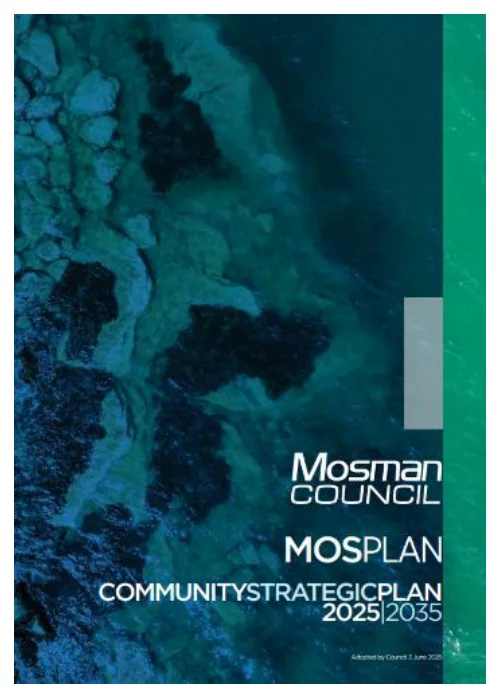

<!-- page 670 -->

SGS ECONOMICS AND PLANNING: COMMUNITY INFRASTRUCTURE NEEDS ASSESSMENT 109

Draft Mosman Library Strategy 2026-2030

▪ This strategy guides the LGA’s library services over the next 4-years, with a focus on expanding outreach programs and services; supporting education; technology, and the role of a contemporary library as a community facility.

▪ According to the strategy, there are high rates of visitation and borrowing. It recognises the potential to build more community partnerships and provide a more integrated service model, expand adult program and event offerings, and opportunities for a designated play space.

▪ Most users are the elderly, young families, and students, with utilisation among vulnerable people increasing. Students are heavy users of the Creation Space and study areas, and it is recognised that programs and events for young people could be improved.

▪ The community has expressed a desire for more spaces, a clear distinction between quiet and busier spaces – such as places for silent work as opposed to group study. In response, there are actions to redesign spaces to be flexible and accommodate diverse uses.

▪ The strategy notes that the Local Studies space will be refurbished in 2026/27, and the library renewal project will feature a ‘landmark’ library and community hub with expanded spaces, services and collections, and upgraded car park facilities. Council will explore opportunities for operating hours that work for the community.

Mosman Local Housing Strategy, 2020

▪ This strategy is a guide for future housing to 2041, looking at where, how much and what type of housing needed. The key focus is to maintain a high quality of life and meet needs of changing demographics.

▪ Housing growth is from medium to high density infill development. Opportunities for new housing have been identified in Spit Junction local centre and Mosman Civic Centre site, which currently have access to community infrastructure. Business zones along Spit and Military Roads could also accommodate additional housing. The strategy notes that housing growth will bring new demands on public amenities and services like parks, sports fields, community halls and footpaths.

▪ There are many lots with fragmented ownership, and particularly high land values, which would make redevelopment challenging.

August 2026

Attachment 1.1.5 Mosman Council

<!-- page 671 -->

SGS ECONOMICS AND PLANNING: COMMUNITY INFRASTRUCTURE NEEDS ASSESSMENT 110

Mosman Open Space Recreational Needs Assessment, 2015

▪ The 2015 needs assessment considers the provision and use of Council-owned or managed open space and recreational facilities, and recommendations on planning and maintenance over a 10- year period.

▪ The study acknowledges that a full array of sport and recreation facilities cannot be provided due to the small size of the LGA, and will need to be accessed outside of the LGA. Partnerships to deliver facilities at the regional level is listed as a recommendation.

▪ There are suggestions to consider: equity and diversity (including accessibility), programmability and utilisation, partnerships and resource efficiency, increasing capacity, and asset renewal.

▪ On the demand side, open space and recreation will need to cater for demographic change (an ageing population, more people with disabilities, higher female participation and fewer children), higher population density (substitution of private open space for quality open space), and visitors from outside of the LGA.

▪ Outdoor sports fields, use of reserves for events, and water space exceed capacity, while some indoor and outdoor sports courts are underutilised. Increase in casual use (especially during off- peak times), improvements to infrastructure (surfaces, lighting, clubrooms and amenity blocks, trails, footpaths, roads), and shared use of school grounds/facilities after hours can increase utilisation.

▪ From the supply side, there are key challenges with provision including the limited ability to increase the population and therefore ratepayer base, lack of land, and costs to provide services (increasing level and range of services spread throughout the LGA). A high proportion of residents also have their own swimming pools or outdoor courts (e.g., tennis, basketball, netball).

▪ Facilities specifically earmarked for further action at the time of the study include: - Rawson Park, Reid Park, Clifton Gardens – considering basketball facilities in these areas - Headland Park, Middle Head, George Heights, Chowder Bay – creating more accessible circuit paths and routes for walking and cycling - Marie Bashi Indoor Centre – increasing utilisation off-peak - Middle Head Oval, George Heights Oval, Cross St – improving capacity of sports fields and associated facilities, and constructing synthetic sports surfaces and lighting (not owned by Council but they manage it) - Rawson Park – partnership with Sydney Harbour Federation Trust to manage and program tennis courts - Large reserves like Reid Park, Spit Reserve, Clifton Gardens, Middle Head Oval – upgrade of tracks to provide exercise circuits - Rosherville Reserve and Sirius Cove – providing better water craft storage

August 2026

Attachment 1.1.5 Mosman Council

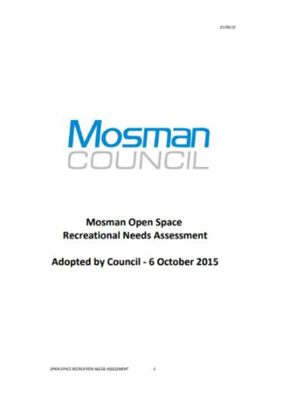

<!-- page 672 -->

SGS ECONOMICS AND PLANNING: COMMUNITY INFRASTRUCTURE NEEDS ASSESSMENT 111

- Drill Hall – upgrading outdoor netball court run outs to become multi-purpose courts (not owned by Council but they manage it).

Mosman Community Mapping Report, 2018

▪ This is an analysis of Council’s provision of community services, programs and facilities. It reveals Mosman has a wide coverage of services and programs but there is some service fragmentation.

▪ People are more able to choose service providers that may be further out, making local services less viable. State and federal level services are also increasingly provided regionally, often outside of the LGA, so residents may have difficulty locating them.

▪ Areas of improvement include more out of school hours care for children, programs for young people, parents and older people (55 years+), community/aged care, and programs to promote social inclusion.

▪ Key priorities are: - Responding to an ageing population - Responding to growing community expectations for enhanced services, programs and facilities - Facilitating community connections and promoting social inclusion for disadvantaged groups especially, as well as for an ageing population and increase in single-person households - Informing and communicating with residents - Ensuring people feel welcomed and friendly for children, youths, families and older people - Advocating for local community needs - Facilitating service coordination and collaboration particularly for those having trouble accessing services - Affirming Council's roles and responsibilities in addressing social needs as policies and programs continue to change - Developing a whole-of-community and whole-of-council approach.

▪ The for-sector sector is increasingly providing services.

August 2026

Attachment 1.1.5 Mosman Council

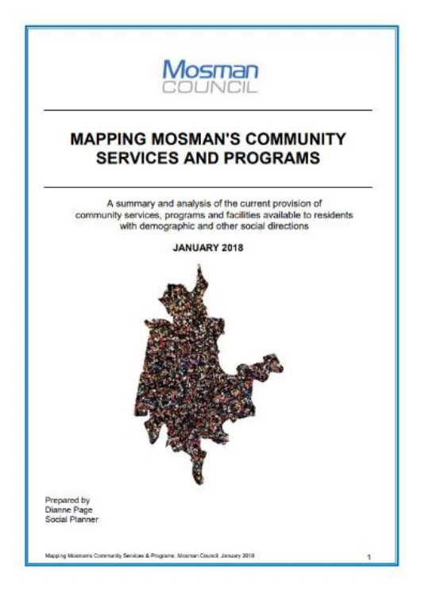

<!-- page 673 -->

SGS ECONOMICS AND PLANNING: COMMUNITY INFRASTRUCTURE NEEDS ASSESSMENT 112

Mosman Walking and Cycling Strategy, 2023

▪ The strategy sets out a 5-year program of works implementing walking and cycling infrastructure and programs.

▪ According to the strategy, cycling and walking can help address congestion and parking concerns that the community has raised, and enable them to pursue the healthy lifestyle they want. However, there are challenges to facilitating this.

▪ Directions relevant to community infrastructure provision include improving walking and cycling infrastructure around Mosman schools; maintaining and enhancing Mosman’s existing cycling network; maintaining and enhancing Mosman’s existing pedestrian infrastructure; and promoting walking and cycling to the community. Council has identified tangible actions to improve end- of-trip facilities, upgrade pedestrian infrastructure within school catchments, improve open space amenity near schools, and undertake minor upgrades of existing cycling network infrastructure.

Mosman Positive Ageing Framework, 2021

▪ The framework helps to identify actions to make the LGA more age- friendly, given the population is ageing.

▪ According to the framework, there is room for improvement for outdoor spaces and buildings. For instance, footpaths and paving which are uneven, more seats and shelters, more accessible public toilets, better street lighting, and more pedestrian-friendly crossings.

▪ Other examples are to do with social participation. The framework suggests more information and greater promotion of local activities, acknowledgement of diverse needs, expansion of intergenerational activities, and a one-stop-shop for information for older residents are needed.

August 2026

Attachment 1.1.5 Mosman Council

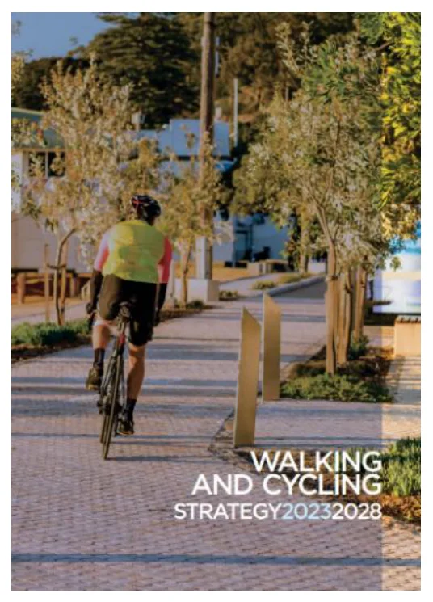

<!-- page 674 -->

SGS ECONOMICS AND PLANNING: COMMUNITY INFRASTRUCTURE NEEDS ASSESSMENT 113

Mosman Disability Inclusion Access Plan 2022-2026

▪ The plan is Council’s commitment to improving access and inclusion for people with disabilities.

▪ In relation to community infrastructure provision, there are actions to: Understand and prioritise access issues with the community - Develop an accessibility audit program for Council owned community facilities to inform related works program and prioritise improvements or upgrades Progressively increase access in the local community and to Council facilities - Continue to make upgrades to increase access in the local community and to Council facilities (e.g. ramps, pathways and surfaces, public seating, playgrounds, toilets and adult change facilities, and signage and lighting).

MOSPLAN Delivery Program 2025-2029 and Operational Plan 2025-2026

▪ Overview of priorities for the next 4 years to deliver the strategies listed in the Community Strategic Plan.

▪ Major projects include Middle Head Oval Pavilion redevelopment, Rosherville Reserve Playground upgrade, Balmoral Oval Synthetic Running Track. Others include renewals of park furniture, turf surface, edging, drainage, outdoor fitness equipment, bushland paths, playgrounds, sport fields playing surfaces.

Mosman Long Term Financial Plan 2025-2035

▪ Tries to deliver on the vision set in the Community Strategic Plan.

▪ Renewal of Barry O’Keefe Library and/or adjacent car park included in large scale works over next 10 years, as part of the Buildings Reserve.

MOSPLAN Asset Management Strategy and Policy 2025-2035

▪ Tries to deliver on the vision set in the Community Strategic Plan.

▪ Issues regarding open space include: playgrounds requiring new equipment or upgrades, sports fields requiring upgrades, wall upgrades in parks, ordinance fencing failing.

August 2026

Attachment 1.1.5 Mosman Council

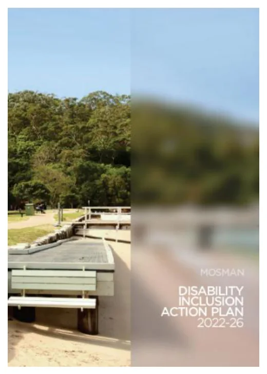

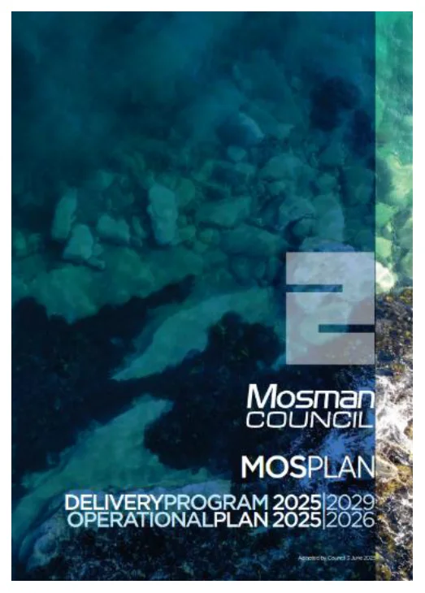

<!-- page 675 -->

SGS ECONOMICS AND PLANNING: COMMUNITY INFRASTRUCTURE NEEDS ASSESSMENT 114

MOSPLAN Asset Management Plans 2025-2034 – Buildings

▪ Tries to deliver on the vision set in the Community Strategic Plan.

▪ Barry O’Keefe Library to be renewed over a 6-10 year horizon as listed in the Long Term Financial Plan.

▪ Given ageing population, accessibility for buildings is important, and there will be an increased focus on recreational facilities (changes to demographics and lifestyle).

MOSPLAN Asset Management Plans 2025-2034 – Open Space

▪ Tries to deliver on the vision set in the Community Strategic Plan.

▪ Population growth should mean only slightly infrastructure demand, but there is likely increased demand from visitors for parks and recreation (especially foreshore facilities).

▪ Given ageing population, there is likely demand for more passive and active recreation. Facilities will need to be more accessible (through seating, footpaths).

▪ In 2025/2026, new outdoor fitness equipment stations at Mosman Park and new athletics facilities at Balmoral Oval are scheduled.

REGIONAL, STATE AND COMMONWEATLH POLICIES Northern Sydney Regional Organisation of Council: Social and Cultural Infrastructure Strategy, 2020

▪ The strategy is a framework for the NSROC region to deliver a satisfactory level of social infrastructure service to the community, and advocate for funding mechanisms to deliver the plan.

▪ Social infrastructure trends identified included: Co-location of facilities Using community facilities as meeting places Having multi-purpose spaces Using a network approach.

▪ A series of benchmarks were identified in the strategy that have been used as a starting point for this study.

▪ Several new social and cultural facilities were identified by the needs assessment. In Mosman LGA, a district level multi-purpose community centre is proposed, as well as a creative arts centre and community performance facility at the LGA level. The overarching goal for NSROC was identified as ensuring liveability in the region is enhanced by the delivery of appropriate social, arts, cultural and recreational infrastructure. Guiding principles for the delivery of social infrastructure included:

August 2026

Attachment 1.1.5 Mosman Council

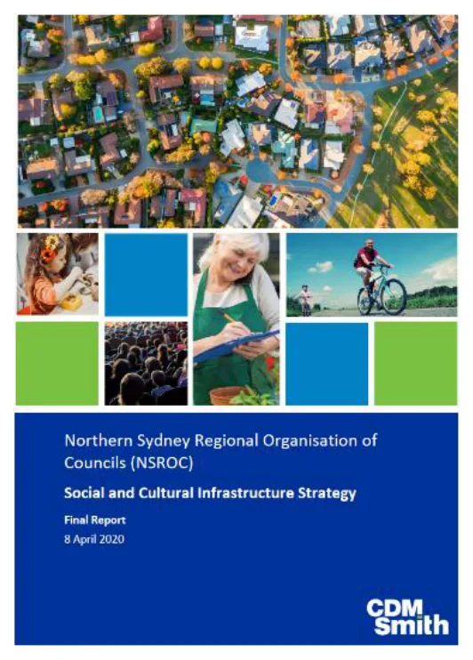

<!-- page 676 -->

SGS ECONOMICS AND PLANNING: COMMUNITY INFRASTRUCTURE NEEDS ASSESSMENT 115

▪ Best use of existing facilities

▪ Innovative partnerships

▪ Co-located and multi-purpose hubs

▪ Facilities should be planned as part of a network

▪ Multi-purpose facilities should be tailored to the local demographics

▪ New facilities should be located in community hubs.

NSROC Review of Supply and Demand for Sports Facilities in the NSROC Region, 2023

▪ NSROC member councils have been concerned about the capacity for sports facilities to meet the needs of the growing population.

▪ In 2023, NSROC completed a comprehensive supply and demand assessment for indoor court, indoor speciality, outdoor court, outdoor speciality and playing fields across the NSROC region.

▪ For Mosman, results indicated that by 2036, the LGA is likely to have a shortfall of around 0.43 hectares of indoor courts, 0.45 hectares of indoor speciality, 0.34 hectares of outdoor speciality, and 11.09 hectares of playing field. It is expected that there would be a surplus of outdoor courts at 3.81 hectares.

NSW DPHI The Sydney Plan (draft), 2025

▪ The plan is a 20-year framework to address growth in Sydney through land use planning, and identifies actions to be done over the short, medium and long term.

▪ Priorities are about having people living near jobs, services, and amenities; having access to open space, infrastructure and services; prioritising growth in areas supported by infrastructure; and ensuring there is infrastructure for growing communities.

▪ The table below lists a summary of what each response entails, to achieve the priorities mentioned above.

August 2026

Attachment 1.1.5 Mosman Council

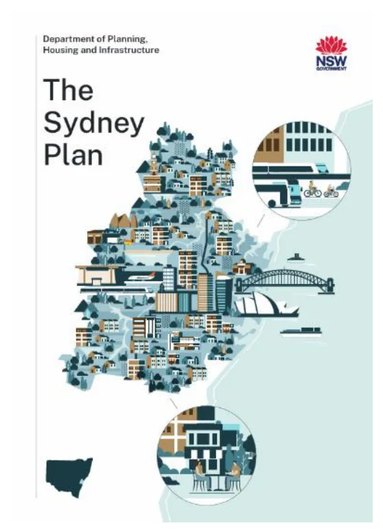

<!-- page 677 -->

SGS ECONOMICS AND PLANNING: COMMUNITY INFRASTRUCTURE NEEDS ASSESSMENT 116

Table 47: Responses relevant to social infrastructure

Responses Summary of responses

Align infrastructure to planned growth ▪ NSW Government to identify what state infrastructure projects are needed to support new housing and employment lands at the local level. ▪ Councils to collect contributions used to deliver new or upgraded local infrastructure like open space and walking/cycling connections. ▪ Early planning needed for regional and local scale infrastructure like schools, community facilities, waste facilities and cemeteries and crematoria.

Create a more vibrant Sydney ▪ Councils to consider enhancing existing infrastructure and facilities, and responding to community needs when planning for new housing, to create a vibrant neighbourhood.

Grow and connect public open space ▪ NSW Government to establish open space targets for each LGA. ▪ NSW Government and councils to work together to increase public open space via innovative solutions and expanding areas adjoining existing open space, and considering blue-green grid corridors to improve the connectivity of open space.

Source: NSW Government, 2025

NSW DPIE Public Spaces Charter, 2021

▪ The charter is a guide for ensuring quality public spaces (including public facilities) are accessible, inclusive, and enjoyable by all.

▪ Key takeaways from the charter are that social infrastructure should be flexible and able to accommodate various uses, and be well-activated and connected (potentially co-located).

▪ The 10 principles that the charter is built upon is briefly summarised below.

Table 48: Principles relevant to social infrastructure

Principle Summary – relevance to facility types, needs and best practice

#### 1. Open and

welcoming ▪ Public space needs to be inclusive, offer diverse uses and good experiences that are free of charge, be designed with accessibility in mind, and integrate well with surrounding land uses. ▪ It is beneficial to have a network of linked and equitably distributed public spaces that support each other.

#### 2. Community

focused ▪ Public space should bring people together and create a sense of social connectedness. ▪ Community-led public spaces are more likely to meet the needs of the community.

August 2026

Attachment 1.1.5 Mosman Council

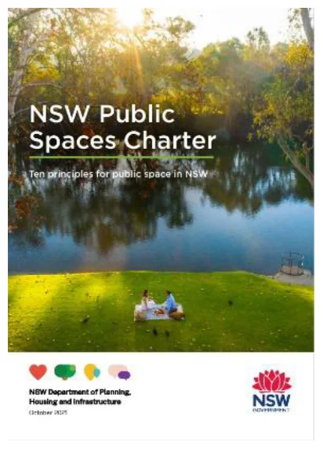

<!-- page 678 -->

SGS ECONOMICS AND PLANNING: COMMUNITY INFRASTRUCTURE NEEDS ASSESSMENT 117

Principle Summary – relevance to facility types, needs and best practice

#### 3. Culture and

creativity ▪ Places with arts and cultural offering are where people want to be in, and participation for artists and audiences are encouraged. ▪ Libraries, parks, laneways and plazas, for instance, can provide flexible and informal space supporting creative works, while spaces around and in between public facilities, like libraries, museums, galleries and community centres, are good locations for planning creative and cultural projects and activities. They can also help to activate public spaces.

#### 4. Local

character and identity

▪ New public spaces, particularly in urban renewal and brownfield developments, should be sympathetic to history and heritage. For instance, adaptive reuse of heritage buildings like town halls, fire stations and hospitals can build on history and connection while also providing new public spaces. ▪ Local artists and creatives should be supported to work with communities to deliver public art and creative placemaking programs that respond to place, local stories, cultures and history.

#### 5. Green and

resilient ▪ Public space should be integrated with green infrastructure to enjoy the benefits of quality green space. For buildings, this might mean sustainable materials, green walls and rooves, and considering green fire breaks and flood mitigation zones. ▪ Community facilities that are adaptable and flexible (can change use) can be used as refuge spaces and distribution points during natural disasters and crises.

#### 6. Healthy and

active ▪ Public space should not only be available, but also well-designed and connected, and encourage walkability and cycling. ▪ Both lower and higher intensity uses, which have different needs, should be accommodated for. ▪ Measures to increase walkability include wider contiguous footpaths, traffic-separating safety barriers, better lighting, crossings, and lower traffic speeds.

#### 7. Local

business and economies

▪ High quality, well-designed and well-managed public places is what draws people and attracts businesses and investment. ▪ Activated streets and laneways (as public spaces) increase vibrancy and attract higher foot traffic, with creative placemaking and programming further enhancing these public spaces. ▪ Activating parks, plazas, libraries, museums and community centres, for example, in a safe and welcoming way at night, can foster a more diverse and vibrant night-time economy.

#### 8. Safe and

secure ▪ Public spaces should be activated with a mix of uses and be well-lit, and incorporate suitable Crime Prevention Through Environmental Design principles.

August 2026

Attachment 1.1.5 Mosman Council

<!-- page 679 -->

SGS ECONOMICS AND PLANNING: COMMUNITY INFRASTRUCTURE NEEDS ASSESSMENT 118

Principle Summary – relevance to facility types, needs and best practice

#### 9. Designed

for place ▪ Public spaces should have open space and facilities that are multi-purpose, connected and flexible to support a range of uses at various times of days for any of its users. ▪ Co-located public spaces can also help to diversify the use of the spaces and provide more equitable access. ▪ Facilities should be fit for purpose, and able to adapt to changing uses and demands. ▪ Connecting public spaces to the ground floors of buildings can help activate surrounding streets, laneways and open spaces, encourage vibrant public life, and make moving around easier and safer.

#### 10. Well-

managed ▪ Public spaces should be designed with financial sustainability, operations and maintenance costs considered, and managed in a way that considers its users. ▪ Working with First Nations peoples should be a priority in managing public space. ▪ Power and responsibility that is shared with the community can increase feelings of investment and willingness to maintain, program, beautify, and advocate for public spaces.

Source: NSW Government, 2021

REVIVE Federal Government Cultural Policy, 2023

▪ The policy is a 5 year plan to renew and revive Australia’s arts, entertainment and cultural sector.

▪ It recognises the need for strong cultural infrastructure to enable all Australians to have the opportunity to access and participate in arts and culture, and to support students and artists to learn, practise, develop, and showcase their work.

▪ It also acknowledges that cultural infrastructure must be restored, built and maintained, with institutions, organisations and entities spread across all levels of government and embedded within geographic, cultural, professional and social communities. This calls on the government's role to address geographic gaps relating to cultural provision. The policy also addresses the need for collaboration through partnership, coordination, and funding distribution across all government levels.

August 2026

Attachment 1.1.5 Mosman Council

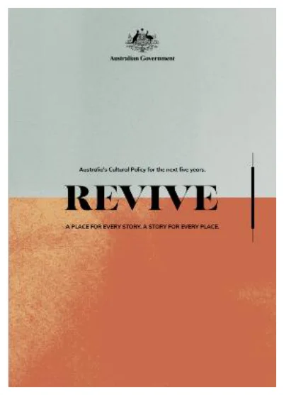

<!-- page 680 -->

SGS ECONOMICS AND PLANNING: COMMUNITY INFRASTRUCTURE NEEDS ASSESSMENT 119

Creative Communities NSW Government Cultural Policy 2024-2033

▪ The policy is a 10 year framework to help grow creative industries in NSW, which the NSW Government will advocate for, enable and invest in. It gives effect to the REVIVE cultural policy.

▪ The more relevant objectives and focus areas of the policy tied to social infrastructure needs and provision are summarised below.

▪ The NSW Government has also committed to include working with local councils to reduce red tape for festivals and events to access local spaces, and undertaking an audit in 2024 of underutilised spaces that could be made available for artists and cultural activities.

Table 49: Objectives relevant to social infrastructure

Core objective Objective Focus areas

People

#### 1. Broad and inclusive

approach to artists and creative practitioners

▪ support local participation in arts and culture by aligning NSW Government investment with community needs

Infrastructure

#### 1. Broad and inclusive

approach to infrastructure ▪ unlock underutilised spaces to be fit for purpose and cost effective for creative and cultural uses ▪ increase the number and quality of accessible, appropriate and affordable spaces where needed ▪ address cultural infrastructure gaps across sectors ▪ remove barriers that inhibit venues and precincts from flourishing

#### 2. Sustainable

organisations and spaces – support resilience and sustainability

▪ provide resources and training to support creatives and creative organisations ▪ provide and facilitate connections between government, industry, and educational institutions ▪ protect and preserve cultural assets and collections

#### 3. Deliver equitable

investment and service delivery across NSW

▪ establish a whole-of-government approach to investment, and service and program provision in a way that is equitable

Source: NSW Government, 2023

August 2026

Attachment 1.1.5 Mosman Council

<!-- page 681 -->

SGS ECONOMICS AND PLANNING: COMMUNITY INFRASTRUCTURE NEEDS ASSESSMENT 120

NSW State Library – Library Building Calculator29

▪ The NSW State Library Building Calculator is an excel based tool for planning the size and space of a library and its different services and uses.

▪ There are 3 calculators built into the excel spreadsheet:

▪ Population calculator: the first uses population data inputs to estimate the library floor area that may be required to service such a population. Service calculator: the second uses population and library collection data to estimate the services that may be needed in the library such as desk space, lounge space and public computers. Renovation calculator: the third uses population and floor area inputs to estimate the desired floor area/allocation of spaces.

INSW – State Infrastructure Strategy 2022-2042

▪ The strategy identifies Infrastructure NSW’s advice on the infrastructure needs and priorities for NSW for a 20 year period from 2022.

▪ Relevant to social infrastructure are the following points: - For an enduring program, investment should be diversified and orderly in delivery - Ensuring future investment has multi-year programs - Service reliability must be at the forefront - Infrastructure is critical to help address housing affordability - NSW’s extensive asset base should be leveraged to support growth (integrated land use plans, higher utilisation backed by a social licence, include technological improvements) - Noting service delivery has changed, so infrastructure should change as well (provision of modern physical infrastructure with digital capabilities; co-location of services).

▪ Actions related to social infrastructure are documented in the table below.

Table 50: Objectives and directions relevant to social infrastructure

Objective Strategic direction Recommendations

Boost economy-wide productivity and competitiveness

Address gaps in cultural and sporting infrastructure to help attract visitors and skilled workers to NSW

Review progress of cultural and sporting infrastructure strategic and investigate new investment opportunities to support the visitor economy

29 https://pls.sl.nsw.gov.au/managing-my-library/buildings-and-spaces/people-places/planning-tools/library- building-calculator, date accessed: 05/06/2025

August 2026

Attachment 1.1.5 Mosman Council

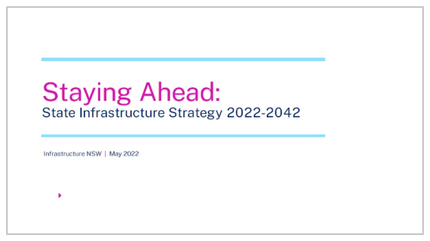

<!-- page 682 -->

SGS ECONOMICS AND PLANNING: COMMUNITY INFRASTRUCTURE NEEDS ASSESSMENT 121

Objective Strategic direction Recommendations

Service growing communities Improve access to efficient, quality services through better use of assets and a better mix of physical infrastructure and technology-enabled solutions

Improve efficiency and service quality in the social infrastructure sectors through co-location and diversity of legacy assets

Integrate infrastructure, land use and service planning

Coordinate infrastructure, land use, and service planning to meet housing, employment, industry and community needs

Deliver more housing, jobs, amenities and services in locations where there is spare capacity in existing and planning infrastructure. Actively reflect history, culture, and heritage in places and infrastructure

Source: INSW, 2022

August 2026

Attachment 1.1.5 Mosman Council

<!-- page 683 -->

SGS ECONOMICS AND PLANNING: COMMUNITY INFRASTRUCTURE NEEDS ASSESSMENT 122

## Appendix B: Existing open space

The following tables are of the different open spaces within the LGA, and their sizes. Total numbers may vary due to rounding.

Table 51: Regional public open space

Name Non-conservation area (ha)

Conservation Area (ha)

Total (ha)

Cosmopolitan 27.03 0 27.03

Headland Park 41.43 0 41.43

Sydney Harbour National Park 91.83 0 91.83

Total 160.29 0 160.29

Source: SGS Economics & Planning, 2026, Mosman Municipal Council, 2026.

Table 52: District public open space

Name Non-conservation area (ha)

Conservation Area (ha)

Total (ha)

Allan Border Oval 1.21 0.00 1.21

Balmoral Oval 1.76 0.00 1.76

Balmoral Park North 1.69 0.00 1.69

Balmoral Park South 2.69 0.00 2.69

Balmoral Park 0.43 2.37 2.79

Bradley's Bushland Reserve 0.00 1.27 1.27

Clifton Gardens 3.25 0.00 3.25

Curraghbeena Park 0.30 0.83 1.13

Georges Heights Oval 1.50 0.00 1.50

Harnett Park 0.00 1.37 1.37

Hunters Park 1.29 0.00 1.29

August 2026

Attachment 1.1.5 Mosman Council

<!-- page 684 -->

SGS ECONOMICS AND PLANNING: COMMUNITY INFRASTRUCTURE NEEDS ASSESSMENT 123

Name Non-conservation area (ha)

Conservation Area (ha)

Total (ha)

Lawry Plunkett Reserve 0.46 3.20 3.66

Middle Head Oval 1.55 0.00 1.55

Mosman Park 1.29 0.00 1.29

Parriwi Park 0.00 3.50 3.50

Pt Harnett Park 0.00 0.03 0.03

Quakers Hat North 0.00 1.18 1.18

Quakers Hat Park 0.00 3.66 3.66

Rawson Park Netball Court 0.19 0.00 0.19

Rawson Park Oval 1.42 0.00 1.42

Rawson Park 2.34 0.00 2.34

Reid Park East 0.00 1.22 1.22

Reid Park 1.13 1.02 2.15

Rosherville Reserve 3.49 0.76 4.25

Spit Reserve West 3.11 0.07 3.18

The Spit Reserve 0.00 1.70 1.70

Total 29.08 22.16 51.24

Source: SGS Economics & Planning, 2026, Mosman Municipal Council, 2026.

Table 53: Local public open space

Name Non-conservation area (ha)

Conservation Area (ha)

Total (ha)

Chinamans Beach Dunes 0.69 0.00 0.69

Hunter Park 0.70 0.00 0.70

Little Ashton Park 0.82 0.00 0.82

Memory Park 0.52 0.00 0.52

August 2026

Attachment 1.1.5 Mosman Council

<!-- page 685 -->

SGS ECONOMICS AND PLANNING: COMMUNITY INFRASTRUCTURE NEEDS ASSESSMENT 124

Name Non-conservation area (ha)

Conservation Area (ha)

Total (ha)

Morella Road 0.00 0.88 0.88

Parriwi Point Reserve 0.00 0.88 0.88

Quakers Hat South 0.00 0.80 0.80

Sirius Park East 0.00 0.99 0.99

Wy-Ar-Gine Point Reserve 0.00 0.70 0.70

Total 2.73 4.24 6.97

Source: SGS Economics & Planning, 2026, Mosman Municipal Council, 2026.

Table 54: Pocket parks

Name Non-conservation area (ha)

Conservation Area (ha)

Total (ha)

Balmoral Lookout 0.05 0.00 0.05

Barney Kearns' Steps 0.04 0.00 0.04

Beauty Point Park 0.24 0.00 0.24

Cartref Park 0.07 0.00 0.07

Countess Park 0.17 0.00 0.17

Curraghbeena Park 0.31 0.00 0.31

Curraghbeena Point Lookout 0.02 0.00 0.02

Drill Hall Common 0.61 0.00 0.61

Ellery Park 0.07 0.00 0.07

Hampshire Park 0.03 0.00 0.03

Herron Park 0.04 0.00 0.04

Joels Reserve 0.44 0.00 0.44

Lawry Plunkett Reserve 0.43 0.00 0.43

Le Gay Brereton Park 0.06 0.00 0.06

August 2026

Attachment 1.1.5 Mosman Council

<!-- page 686 -->

SGS ECONOMICS AND PLANNING: COMMUNITY INFRASTRUCTURE NEEDS ASSESSMENT 125

Name Non-conservation area (ha)

Conservation Area (ha)

Total (ha)

Little Curraghbeena Reserve 0.11 0.00 0.11

Mary Margaret Ln 0.08 0.00 0.08

Mosman Bay Creek 0.20 0.00 0.20

Mosman Bowling Club 0.50 0.00 0.50

Mosman Civic Centre 0.33 0.00 0.33

Mosman Lawn Tennis Club 0.39 0.00 0.39

Off Mandolong Lane (East) 0.04 0.00 0.04

Parriwi Lighthouse Reserve 0.13 0.00 0.13

Pathway Off Central Ave 0.02 0.00 0.02

Quakers Rd Reserve 0.09 0.00 0.09

Reservoir Park 0.38 0.00 0.38

Rest Park 0.02 0.00 0.02

Sarah's Walk 0.05 0.00 0.05

Shellbank Reserve 0.00 0.00 0.00

Sirius Park West 0.00 0.49 0.49

Sirius Park 0.16 0.05 0.20

Spit Reserve East 0.46 0.00 0.46

Spit Reserve West 0.00 0.00 0.00

Spit Reserve West 0.01 0.00 0.01

Stan Mccabe Park 0.07 0.00 0.07

Unmade Almora St 0.00 0.09 0.09

Unmade Amaroo Cres 0.00 0.18 0.18

Unmade Arbutus St 0.04 0.00 0.04

Unmade Armitage Ln 0.00 0.05 0.05

August 2026

Attachment 1.1.5 Mosman Council

<!-- page 687 -->

SGS ECONOMICS AND PLANNING: COMMUNITY INFRASTRUCTURE NEEDS ASSESSMENT 126

Name Non-conservation area (ha)

Conservation Area (ha)

Total (ha)

Unmade Awaba St 0.02 0.00 0.02

Unmade Bardwell Rd 0.05 0.00 0.05

Unmade Bay St 0.00 0.10 0.10

Unmade Bickell Rd 0.06 0.00 0.06

Unmade Boyle St 0.03 0.00 0.03

Unmade Boyle St 0.00 0.22 0.22

Unmade Bullecourt Av (North) 0.12 0.00 0.12

Unmade Bullecourt Av (South) 0.10 0.00 0.10

Unmade Bungaree Ln 0.04 0.00 0.04

Unmade Burrawong Av (North) 0.05 0.00 0.05

Unmade Burrawong Av (South) 0.04 0.00 0.04

Unmade Carrington Av 0.07 0.00 0.07

Unmade Cobbittee St 0.02 0.00 0.02

Unmade Crown Road 0.00 0.07 0.07

Unmade Crux St 0.08 0.00 0.08

Unmade Dalton Rd 0.04 0.00 0.04

Unmade Elfrida St 0.03 0.00 0.03

Unmade Everview Av 0.03 0.00 0.03

Unmade Fairfax Rd (East) 0.04 0.00 0.04

Unmade Fairfax Rd (West) 0.21 0.00 0.21

Unmade Glen Rd 0.00 0.12 0.12

Unmade Gooseberry Ln 0.02 0.00 0.02

Unmade Gordon St 0.00 0.02 0.02

Unmade Gouldsbury St 0.17 0.00 0.17

August 2026

Attachment 1.1.5 Mosman Council

<!-- page 688 -->

SGS ECONOMICS AND PLANNING: COMMUNITY INFRASTRUCTURE NEEDS ASSESSMENT 127

Name Non-conservation area (ha)

Conservation Area (ha)

Total (ha)

Unmade Government Rd 0.24 0.00 0.24

Unmade Grecia Ln (East) 0.00 0.07 0.07

Unmade Hampden St 0.07 0.00 0.07

Unmade Harnett Av 0.00 0.06 0.06

Unmade Harston Av 0.10 0.00 0.10

Unmade Herron Walk 0.01 0.00 0.01

Unmade Inkerman St North 0.00 0.08 0.08

Unmade Inkerman St South 0.10 0.00 0.10

Unmade Kahibah Rd North 0.00 0.07 0.07

Unmade Kahibah Rd South 0.06 0.00 0.06

Unmade Kallaroo St 0.00 0.14 0.14

Unmade Keston Ln 0.01 0.00 0.01

Unmade Killarney St 0.04 0.00 0.04

Unmade Koowong St (East) 0.05 0.00 0.05

Unmade Lennox St 0.09 0.00 0.09

Unmade Lower Illawarra St 0.06 0.00 0.06

Unmade Lower Punch St 0.01 0.00 0.01

Unmade Lower Sverge St 0.00 0.15 0.15

Unmade Mandolong Ln (West) 0.09 0.00 0.09

Unmade Mcleod St (East) 0.09 0.00 0.09

Unmade Mcleod St (Lower) 0.00 0.13 0.13

Unmade Mcleod St (Upper) 0.09 0.00 0.09

Unmade Mcleod St (West) 0.00 0.09 0.09

Unmade Millett Rd 0.00 0.15 0.15

August 2026

Attachment 1.1.5 Mosman Council

<!-- page 689 -->

SGS ECONOMICS AND PLANNING: COMMUNITY INFRASTRUCTURE NEEDS ASSESSMENT 128

Name Non-conservation area (ha)

Conservation Area (ha)

Total (ha)

Unmade Morella Rd (North) 0.00 0.05 0.05

Unmade Morella Rd (South) 0.16 0.00 0.16

Unmade Mosman St 0.00 0.06 0.06

Unmade Moss Ln 0.01 0.00 0.01

Unmade Mulbring St 0.00 0.03 0.03

Unmade Off Parriwi 0.08 0.00 0.08

Unmade Orlando Av Mccauley Outlook 0.07 0.00 0.07

Unmade Orlando Av 0.10 0.00 0.10

Unmade Pearl Bay Av 0.05 0.00 0.05

Unmade Pretoria Av 0.31 0.00 0.31

Unmade Prince St 0.03 0.00 0.03

Unmade Pulpit Ln 0.00 0.07 0.07

Unmade Quakers Rd (East) 0.04 0.00 0.04

Unmade Quakers Rd (West) 0.00 0.05 0.05

Unmade Raglan St 0.08 0.00 0.08

Unmade Rosherville Rd 0.08 0.00 0.08

Unmade Royalist Rd 0.02 0.00 0.02

Unmade Shellbank Av 0.03 0.00 0.03

Unmade Spit Rd 0.00 0.04 0.04

Unmade Stanley Av 0.12 0.00 0.12

Unmade Stanton Ln 0.02 0.00 0.02

Unmade Stanton Rd 0.00 0.31 0.31

Unmade The Grove 0.14 0.00 0.14

Unmade Upper Illawarra St 0.06 0.00 0.06

August 2026

Attachment 1.1.5 Mosman Council

<!-- page 690 -->

SGS ECONOMICS AND PLANNING: COMMUNITY INFRASTRUCTURE NEEDS ASSESSMENT 129

Name Non-conservation area (ha)

Conservation Area (ha)

Total (ha)

Unmade Upper Sverge St 0.02 0.00 0.02

Unmade Wallington Rd 0.00 0.29 0.29

Unmade Warringah Rd 0.00 0.22 0.22

Unmade Water Ln 0.26 0.00 0.26

Unmade Willis Ln 0.04 0.00 0.04

Unmade Wolger Rd 0.03 0.00 0.03

Unmade Wolseley Rd 0.02 0.00 0.02

Unmade Wudgong Walk 0.01 0.00 0.01

Unmade Wyong Rd 0.08 0.00 0.08

Unnamed Park 0.14 0.00 0.14

Total 10.01 3.44 13.45

Source: SGS Economics & Planning, 2026, Mosman Municipal Council, 2026.

August 2026

Attachment 1.1.5 Mosman Council

<!-- page 691 -->

August 2026

Attachment 1.1.5 Mosman Council

<!-- page 692 -->

SGS ECONOMICS AND PLANNING: INFRASTRUCTURE SUMMARY REPORT 24

## Appendix B: SCT Transport Study

August 2026

Attachment 1.1.5 Mosman Council

<!-- page 693 -->

### Preliminary transport study

## Mosman LMR Infrastructure

## Impact Study

31.07.2026 | v5.0

Image: Mosman Collective

August 2026

Attachment 1.1.5 Mosman Council

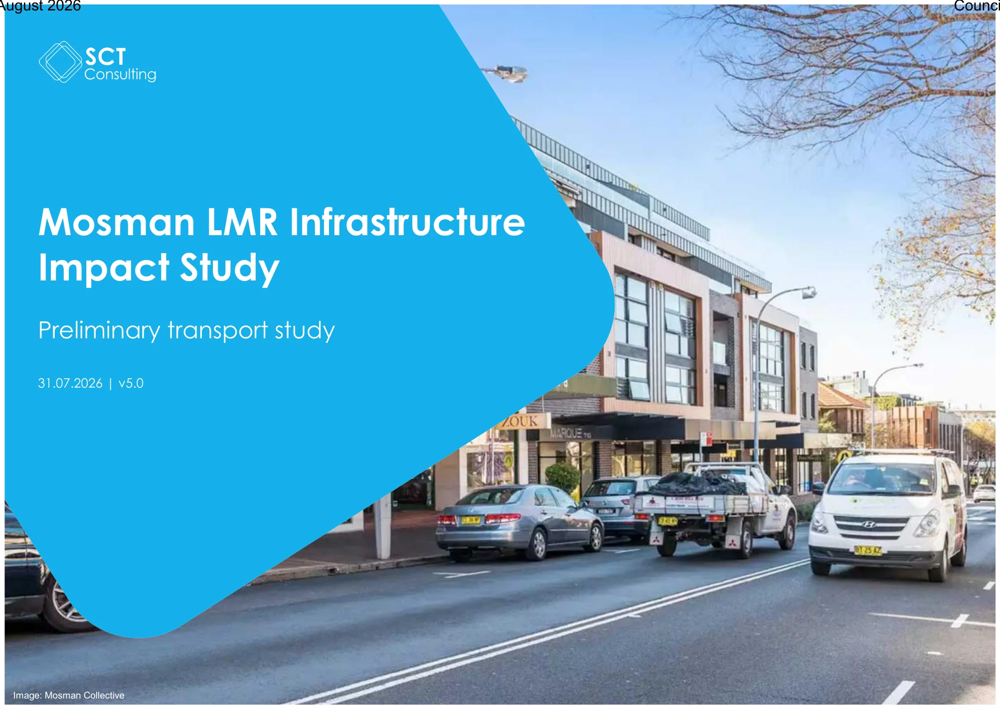

<!-- page 694 -->

© SCT Consulting PTY LTD (SCT Consulting) SCT Consulting’s work is intended solely for the use of the Client and the scope of work and associated responsibilities outlined in this document. SCT Consulting assumes no liability with respect to any reliance that the client places upon this document. Use of this document by a third party to inform decisions is the sole responsibility of that third party. Any decisions made or actions taken as a result of SCT Consulting’s work shall be the responsibility of the parties directly involved in the decisions or actions. SCT Consulting may have been provided information by the client and other third parties to prepare this document which has not been verified. This document may be transmitted, reproduced or disseminated only in its entirety and in accordance with the above.

## Quality Assurance

Project details

Project number: SCT_00850

Document name: Preliminary transport study

Client: ABN:

#### 94 414 022 939

Prepared by: SCT Consulting Pty. Ltd. ABN:

#### 53 612 624 058

Version Date Details

1.0 13 February 2026 Preliminary transport study

2.0 27 March 2026 Commentary on Northern Beaches uplift, parking rate benchmarking and changes to road capacity

3.0 3 June 2026 Additional commentary and summary on impact of proposed uplift 4.0 26 June 2026 Inclusion of outcomes of previous studies

5.0 27 July 2026 Additional background, context, and advocacy

6.0 31 July 2026 Amendment to recommendations

Information Name Position Signature

Author: Brooke Maitrawatthana Senior Consultant

Reviewer: Matthew Chow Principal Consultant

Authoriser: Andy Yung Director

August 2026

Attachment 1.1.5 Mosman Council

<!-- page 695 -->

## Table of contents

Background and context

Transport network review

Uplift implication on transport network

Recommendations

01

02

03

04

August 2026

Attachment 1.1.5 Mosman Council

<!-- page 696 -->

### 01

## Background and context

August 2026

Attachment 1.1.5 Mosman Council

<!-- page 697 -->

The NSW Government Low and Mid Rise (LMR) Housing Policy encourages higher density and more diverse housing development in town centres across NSW, including Mosman.

In the Mosman LGA, the policy applies to land surrounding the Spit Junction and Cremorne centres, enabling significantly greater density than permitted under local planning controls.

The policy represents a significant land use change with the potential to influence travel demand and network performance. While the policy is intended to concentrate growth in accessible locations, there has been limited publicly available assessment of the cumulative transport impacts associated with the additional housing capacity enabled at the local level.

This issue is particularly relevant for Mosman and surrounding communities on the Northern Beaches and Lower North Shore, where access is heavily dependent on the constrained Military Road – Spit Road . Additional residential growth has the potential to increase demand across all transport modes, including private vehicles, buses, walking and cycling.

In its part, Mosman Council is carrying out an infrastructure impact study to identify the local infrastructure required to support growth, test and refine different local contributions funding mechanisms, and develop an updated Contributions Plan to enable the delivery of local infrastructure.

### LMR Housing Policy and Mosman

Mosman LMR Infrastructure Impact Study – Preliminary transport study 5

Figure 1: LMR housing areas in Mosman and surrounds

Mosman LGA

Source: DPHI (2026) LMR Viewer, annotated by SCT Consulting

August 2026

Attachment 1.1.5 Mosman Council

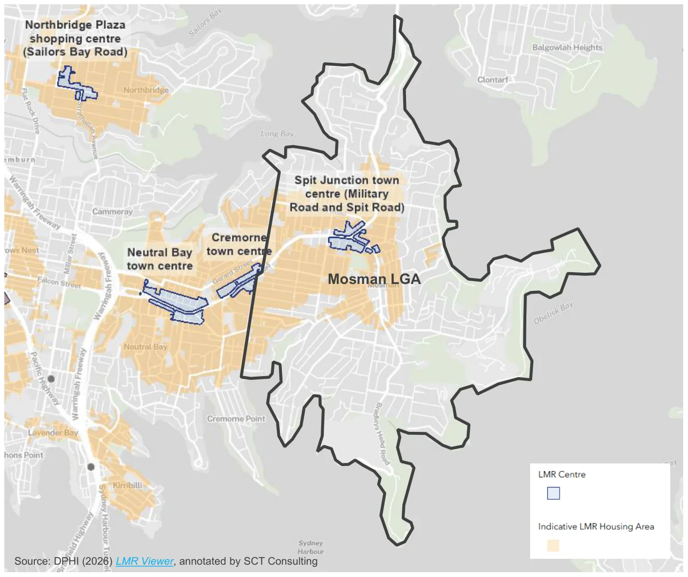

<!-- page 698 -->

Mosman Council is working with the NSW Government to prepare a long-term strategic Mosman Masterplan in response to the LMR Policy.

It has been agreed that the master plan’s residential development capacity must be equivalent to or greater than the LMR Policy- enabled capacity of 4,700 new dwellings.

The community-led approach will develop local controls and redistribute density with consideration to Mosman’s unique character, making sure that growth lines up with transport, schools, open space, and services.

The Masterplan proposes two development options:

• ‘Low and wide’ spreads lower-rise changes more gradually across a wider area around the Spit Junction

• ‘High and narrow’ concentrates taller buildings along the Military Road – Spit Road corridor, preserving more areas unaffected by the changes.

The Masterplan options were open for community feedback in May 2026. A draft Masterplan will be reported to the Council in August to September 2026.

### Mosman Masterplan

Mosman LMR Infrastructure Impact Study – Preliminary transport study 6

Figure 2: Mosman Masterplan options

Source: Mosman Council, 2026, Mosman Masterplan.

August 2026

Attachment 1.1.5 Mosman Council

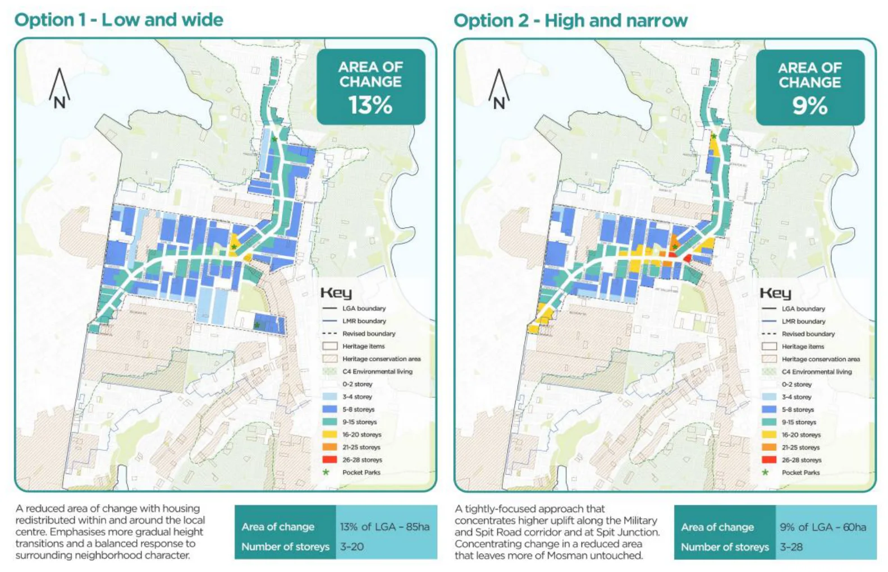

<!-- page 699 -->

The LMR Policy applies to various housing areas in North Sydney and the Northern Beaches, particularly along the Military Road – Spit Road corridor, such as Dee Why, Manly Vale, Balgowlah Stockland, Cremorne, and Neutral Bay.

Northern Beaches Council estimates that up to 6,000 new dwellings will be enabled through the policy over the next five years. Meanwhile, the Local Housing Strategy (2021) establishes a housing target for the LGA of 12,000 new dwellings by 2036.

No estimate is available for North Sydney. However, the Local Housing Strategy (2019) shows that the LGA needs to deliver 11,450 new dwellings by 2036.

North Sydney Council strongly opposes the policy and does not support the identification of Neutral Bay as a housing area due to concerns around accessibility and bus service capacity.

Crucially, the Northern Beaches Council recommends that the NSW Government:

• Reinstate the Beaches Link project to provide a fourth access route to the region

• Deliver an east-west bus rapid transit system between Chatswood and Dee Why to support growth in Frenchs Forest.

### LMR housing areas in the surrounding LGAs

Mosman LMR Infrastructure Impact Study – Preliminary transport study 7

Figure 3: LMR housing areas in North Sydney, the Northern Beaches, and surrounds

Source: DPHI, 2026, LMR Viewer.

Mosman North Sydney

Manly

Dee Why

Frenchs Forest

Source: North Sydney Council, 2026, NSW Government housing reforms. Northern Beaches Council, 2026, NSW housing reforms.

August 2026

Attachment 1.1.5 Mosman Council

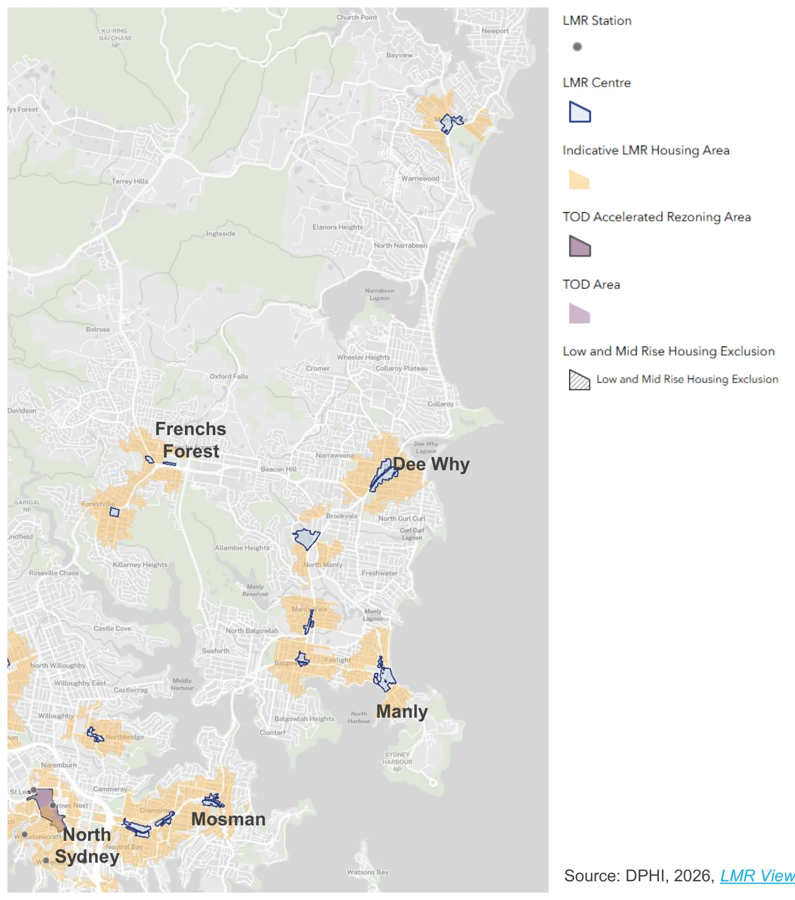

<!-- page 700 -->

A key transport challenge in the Lower North Shore and Northern Beaches is chronic traffic congestion and critically limited capacity at the eastern Sydney Harbour and Middle Harbour crossings and on the small number of arterial roads the community depends on.

The Beaches Link, announced by the NSW Government in 2020 alongside the Western Harbour Tunnel, was rigorously assessed as State Significant Infrastructure. It was the long- planned solution to alleviate transport constraints in the region. However, the project was cancelled in 2023 due to budget concerns.

The assessment tested 2027 and 2037 scenarios for traffic volumes and travel times between North Sydney and Balgowlah (via Mosman) at the AM peak. The results showed that the travel time in citybound direction would increase from 28 minutes in 2016 (~15 minutes in free flow) to 45 minutes in 2037 with 500 additional cars.

This demonstrates that there is critically limited capacity on the corridor and that even modest growth in traffic volumes sharply degrades network performance. The EIS for the Western Harbour Tunnel project anticipates that delivering the project without the Beaches Link will increase local intersection delays, such as at the Military Road | Ben Boyd Road intersection, due to changes in access and travel patterns, leaving worsening traffic congestion being felt throughout the Northern Beaches and Lower North Shore.

### Western Harbour Tunnel and Beaches Link

Mosman LMR Infrastructure Impact Study – Preliminary transport study 8

Figure 4: Western Harbour Tunnel and Beaches Link program of works

Source: Transport for NSW, 2020, Beaches Link and Gore Hill Freeway Connection EIS.

August 2026

Attachment 1.1.5 Mosman Council

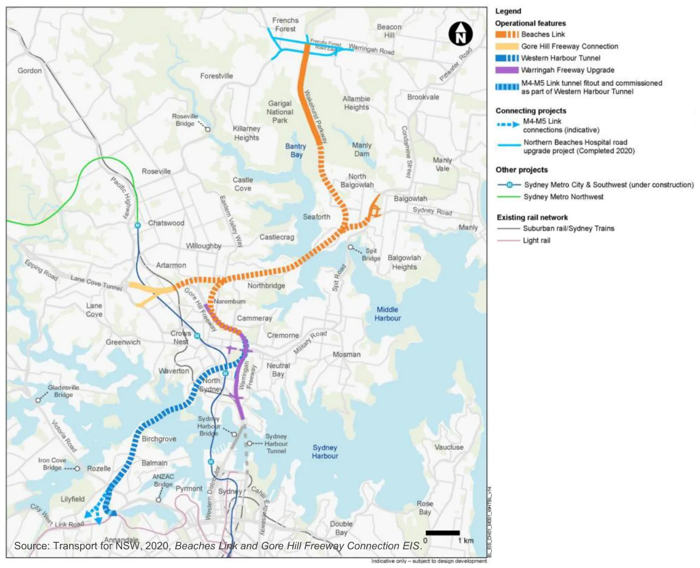

<!-- page 701 -->

The Northern Beaches Network Review is a strategic transport study undertaken by Transport for NSW to assess the performance of the transport network serving the Northern Beaches and Lower North Shore and to identify opportunities for improvement. The review was open for public consultation until June 2026.

The review adopts a network optimisation approach, focusing on interventions that improve the efficiency, reliability, and resilience of existing transport infrastructure. Proposed measures include improvements to bus priority, intersection layouts, corridor operations, and walking and cycling connectivity.

A notable outcome of the review is the shift away from consideration of new major road infrastructure towards operational and incremental improvements within existing transport corridors.

While network optimisation measures may improve operational performance, they are unlikely to provide the additional network capacity required to accommodate forecast growth in housing, employment, and travel demand over the longer term.

The Military Road – Spit Road corridor is identified as one of the most critical strategic transport corridors linking Northern Beaches with Sydney CBD and the Lower North Shore and a key source of network delay and unreliability.

The review identifies a series of initiatives to improve travel time reliability, increase the

attractiveness of bus services, and enhance walking and cycling access, with the objective of supporting mode shift and reducing dependence on private vehicle travel.

Council submission to Network Review

Mosman Council’s submission maintained that significant additional transport infrastructure is required to support the long-term growth and functionality of the Northern Beaches and Lower North Shore corridor.

In their submission, Council stated that the review was ‘limited in both scope and ambition’ and that the proposed initiatives were ‘largely incremental in nature’ and ‘do not represent a response commensurate with the scale of the transport challenge facing the region’.

The submission details that current measures ‘will not resolve the structural constraints of the [Military Road – Spit Road] corridor’ and that ‘a step-change in infrastructure investment is required’, advocating for more ambitious and transformational transport solutions, including consideration of major regional infrastructure projects.

Council’s view is that future population growth and housing density cannot be sustainably accommodated without substantial State investment in transport capacity, network resilience, and strategic infrastructure upgrades.

### Northern Beaches Network Review

Mosman LMR Infrastructure Impact Study – Preliminary transport study 9

Figure 5: Northern Beaches network overarching opportunities

Source: Transport for NSW, 2026, Northern Beaches Network Review.

August 2026

Attachment 1.1.5 Mosman Council

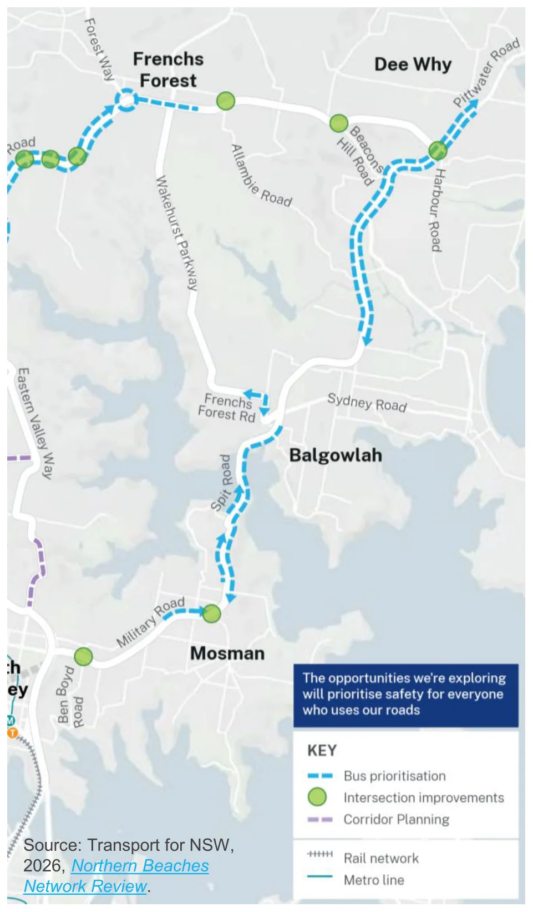

<!-- page 702 -->

This Preliminary Transport Study provides infrastructure and traffic assessment and has been prepared as a strategic, high-level analysis to inform the Mosman Masterplan.

The purpose of this study is to:

• Identify and articulate existing and emerging transport and infrastructure challenges

• Provide supporting evidence of their local impacts

• Support Council’s advocacy for significant NSW Government investment and further detailed investigation of long-term infrastructure solutions for Mosman and the Northern Beaches.

### Purpose of the study

Mosman LMR Infrastructure Impact Study – Preliminary transport study 10

Figure 6: The Military Road | Field Way intersection

August 2026

Attachment 1.1.5 Mosman Council

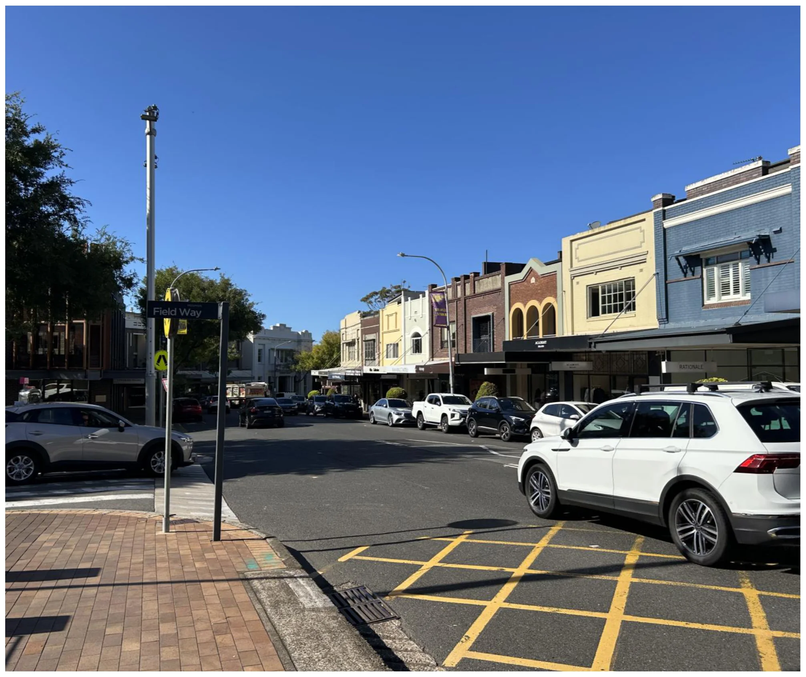

<!-- page 703 -->

### 02

## Transport network review

August 2026

Attachment 1.1.5 Mosman Council

<!-- page 704 -->

The Military Road – Spit Road corridor is one of the most critical regional transport corridors, connecting the Northern Beaches to Sydney CBD, North Sydney, and other employment centres, through Mosman.

The corridor is constrained by its physical layout, a series of signalised intersections, and the presence of the Spit Bridge, which acts as a vital pinch point.

These factors combined create a road network in Mosman that is highly sensitive to even small growths in traffic volumes or changes in movement patterns.

Buses are the main public transport option in Mosman, complemented by Sydney Ferries services and school buses. There are 22 bus routes running along Military Road – Spit Road through Mosman, including the B-Line.

Cycling in Mosman is generally supported by on- road mixed-traffic cycling routes. Cycling to/from the outside of Mosman, especially to Sydney CBD, needs to rely on the network in the North Sydney LGA.

### Transport network in Mosman

Mosman LMR Infrastructure Impact Study – Preliminary transport study 12

Figure 7: Transport network in Mosman

August 2026

Attachment 1.1.5 Mosman Council

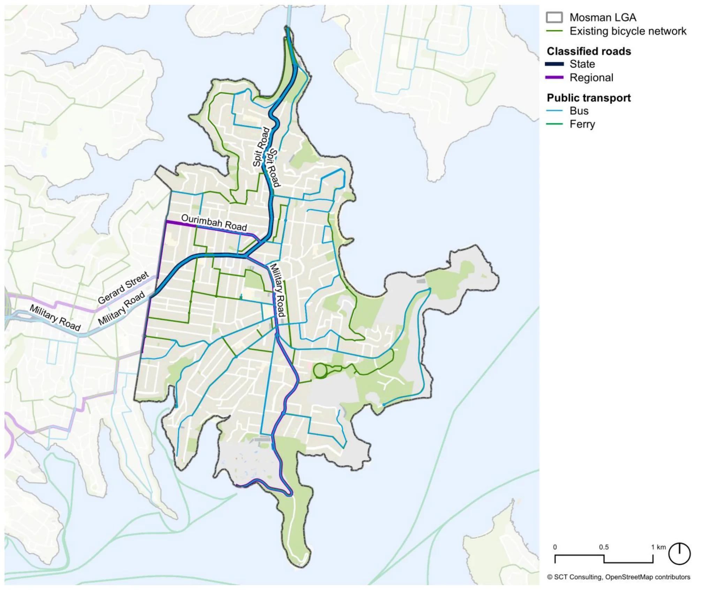

<!-- page 705 -->

More than half of Mosman residents work in either Sydney CBD (28%) or Mosman (25%). Other common places of work include North Sydney, St Leonards, and the neighbouring suburbs.

Figure 8 shows the journey to work mode share of Mosman residents:

• About half of Mosman residents (51%) drive to work, as well as 3% who are passengers.

• Slightly more than one-third use public transport, including bus (29%), train (5%), and ferry (4%).

• About 5% walk to work.

Figure 9 further shows some notable working arrangement characteristics of Mosman residents compared to Sydney overall:

• Mosman residents tend to work from home more than the Sydney average. This is demonstrated in both the 2016 and 2021 Census.

• There are also more Mosman residents working in the local area than in Sydney overall, at 25% compared to 16%.

### Existing travel patterns

Mosman LMR Infrastructure Impact Study – Preliminary transport study 13

Figure 8: Journey to work mode share

Train 5%

Source: SCT Consulting, based on 2016 Census and 2021 Census

Bus 29%

Ferry 4% Car, driver 51%

Car, passenger 3%

Walk 5%

Figure 9: Working from home and in local area

Working from home

60%

39%

9%

4%

Mosman 2016 2021

Working in local area

25% 16%

### More Mosman residents work in the

### local area than in Sydney overall

Mosman Sydney

Sydney 2016 2021

Bicycle 1%

August 2026

Attachment 1.1.5 Mosman Council

<!-- page 706 -->

The Military Road – Spit Road corridor at Mosman is served by 22 bus routes, with high total frequencies during peak hour, including:

• Sydney CBD – 66 services

• North Sydney – 19 services

• Chatswood – 6 services

• St Leonards – 5 services

For Mosman LGA, the main bus stop is at the Spit Junction (2088243), where the B-Line service stops. Based on the typical day (BOAM) extract, the B-Line service arriving at the Spit Junction is at 100% occupancy and occasionally exceeds the theoretical capacity.

There is also a clear indication that the B-Line is a much more popular service compared to other citybound alternatives due to faster travel time into Sydney CBD. These other services are typically at 60% occupancy at the Spit Junction but may fill up quickly as it continues west on Military Road, especially as the B-Line is not able to take on additional passengers.

The high occupancy of the B-Line often gives the impression that ‘buses are full’ at Mosman and may deter people from seeing it as a viable transport option.

More work could be done to understand why other citybound services are less popular at Mosman.

### Bus services

Mosman LMR Infrastructure Impact Study – Preliminary transport study 14

Figure 10: Citybound bus occupancy at the Spit Junction (2088243) at 7–8am on Tuesday, 14 April 2026

Source: Transport for NSW, 2026, Bus Opal Assignment Model dataset. Note: Some buses might be full and not stop at the Spit Junction. Hence, no data is recorded.

0

5

10

15

20

25

0-20 21-40 41-60 61-80 81-100 101-120 121-140

No. of buses

Occupancy range

144 246 249 150X 154X 168X 171X 172X 173X 180X 181X 190X B1

### Each block represents the number of

### buses within each occupancy range

### The B-Line is much

### more popular than

### any other bus service

### Routes 181X and 190X provide

### comparable service to the B-

### Line

August 2026

Attachment 1.1.5 Mosman Council

<!-- page 707 -->

Despite being within cycling distance of major centres such as North Sydney CBD and Sydney CBD, cycling and walking mode shares are low. While footpaths are generally available throughout the LGA, Mosman has limited  cycling facilities.

Instead, most of the cycling links are on-road environments, shared with other vehicles. This includes key connection points into the North Sydney bicycle network, which makes up the regional cycling routes for trips into the Sydney CBD.

On-road cycling environments are typically higher risk and discourage uptake of bicycle trips. Combined with the significant level changes through the LGA, cycling and walking are not popular transport modes and have limited potential for increased trips.

The Mosman Walking & Cycling Strategy, which has recently completed an audit, set directions to reduce local road speeds, improve walking and cycling connections to schools, maintain and enhance existing infrastructure, and develop an off-road network concept.

There is limited scope to increase road network capacity within Mosman, particularly along the Military Road – Spit Road corridor. It is hence vital that  walking and cycling infrastructure is progressively delivered to reduce reliance on cars and encourage these alternative transport modes.

### Walking and cycling

Mosman LMR Infrastructure Impact Study – Preliminary transport study 15

Figure 11: Bicycle network in Mosman LGA

August 2026

Attachment 1.1.5 Mosman Council

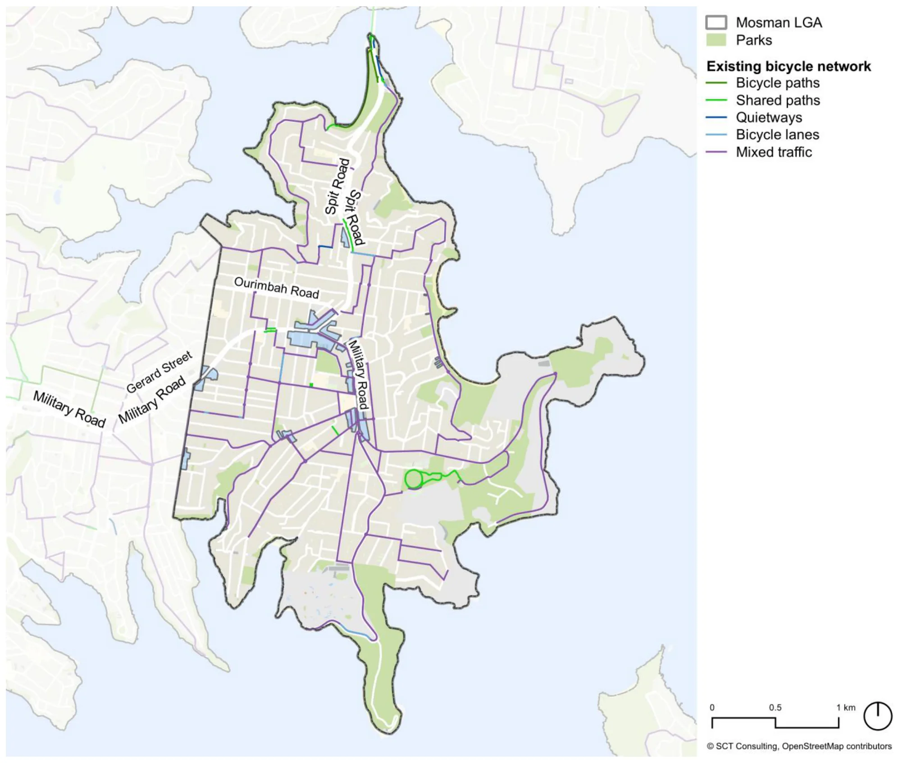

<!-- page 708 -->

While the Military Road – Spit Road corridor is an important transport corridor for Mosman and the Northern Beaches, it is also vital to recognise its role in the Place context.

The corridor forms the activity centre of Mosman, especially at the Spit Junction, where there are restaurants, cafes, shops, and services, with heritage and character unique to Mosman and well-loved by residents.

At its current stage, the corridor primarily prioritises the efficient movement of vehicles through the network, while pedestrians and activities are secondary.

Anticipated growth in housing supply and population will further increase demand for food and beverage establishments, retail options, access to services, and a variety of open spaces, creating even more challenges in balancing space provided to support both Movement and Place functions.

While Council can act directly to improve Movement and Place outcomes on local roads, the Military Road – Spit Road corridor is State- managed and requires State involvement and investment to meaningfully deliver good Place outcomes and support liveability.

Thoughtful, State-supported solutions are needed to ensure the corridor balances its Movement and Place needs and sensibly supports the growth anticipated across the Mosman LGA.

### Movement and Place context

Mosman LMR Infrastructure Impact Study – Preliminary transport study 16

Figure 12: The Spit Junction

August 2026

Attachment 1.1.5 Mosman Council

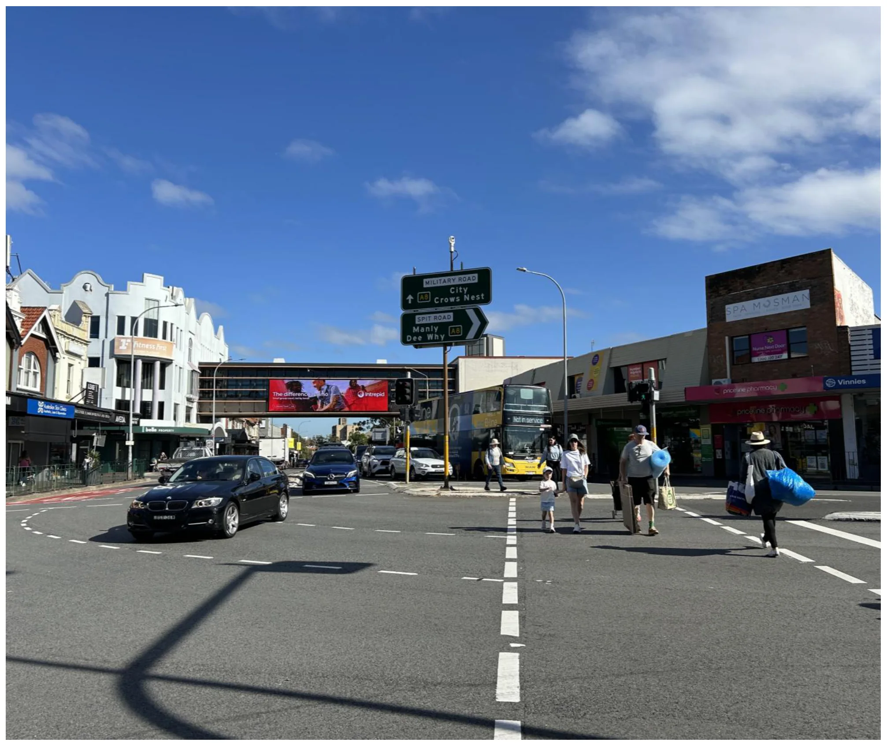

<!-- page 709 -->

An analysis has been undertaken to understand the nature of road crashes along the Military Road – Spit Road corridor, which is the area where the highest housing growth is planned.

Over five years, between 2020 and 2024, a total of 102 road crashes were recorded along the corridor section within Mosman. Key observations are:

• The Spit Junction is the most prominent crash cluster, especially at Ourimbah Road (6 crashes). Other crash clusters are identified at or around Warringah Road (8 crashes), Central Avenue (7), and Lang Street (6).

• Rear-end collisions were most common (31 crashes, or 30%), followed by lane-change (12 crashes), and head-on collisions (6 crashes).

• Out of 10 crashes that involved pedestrians, overwhelmingly 8 crashes occurred around the Spit Junction.

The analysis shows that road crashes along the corridor can be attributed to traffic congestion, which often leads to drivers’ and pedestrians’ impatience.

Any additional traffic along the corridor will add to road safety issues. Future interventions and management need to consider safety for all road users, especially vulnerable road users, including pedestrians, cyclists, seniors, and people with limited mobility.

### Road safety

Mosman LMR Infrastructure Impact Study – Preliminary transport study 17

Figure 13: Pedestrian crashes and road crash clusters along the Military Road – Spit Road corridor (2020–2024)

Source: Transport for NSW, 2025, NSW Road Crash dataset.

August 2026

Attachment 1.1.5 Mosman Council

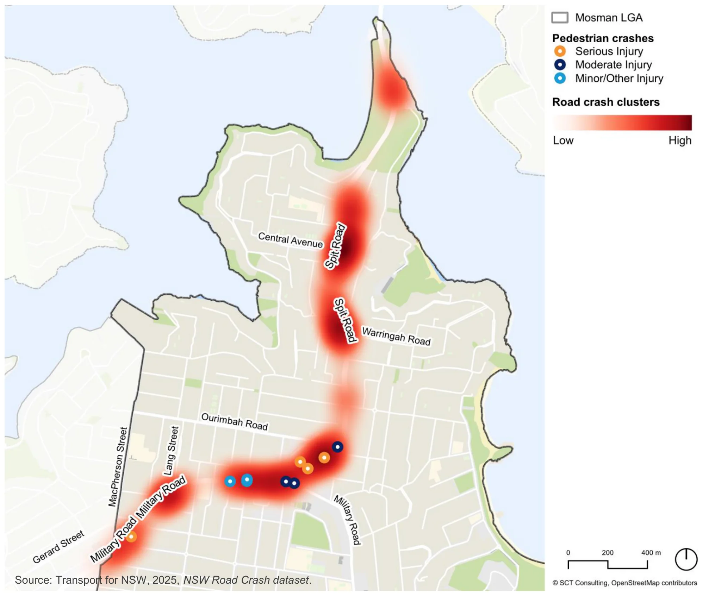

<!-- page 710 -->

### 03

## Uplift implication on transport network

August 2026

Attachment 1.1.5 Mosman Council

<!-- page 711 -->

Significant growth is planned along the Military Road – Spit Road corridor. The LMR Policy would enable 4,700 new dwellings in Mosman, while North Sydney and the Northern Beaches are targeted to add 11,450 and 12,000 new dwellings by 2036, respectively, in their LGAs.

Across the region, due to limited access routes, unfavourable terrain, and a lack of dedicated cycling facilities, it is anticipated that there would be a substantial increase in car and bus travel demands, especially along the Military Road – Spit Road corridor.

Without publicly available State-led modelling and assessment, this study attempts to illustrate the potential impact of housing growth on uplift in car and bus trips at a high level.

This can be estimated at a high level through trip generation calculation based on the Transport for NSW (2024) Guide to Transport Impact Assessment.

Adopting a conservative approach, using the travel patterns of high-density residential development, yields 0.19 car trips and 0.22 bus trips per dwelling per hour during the AM peak.

Based on Census data, it is further assumed that 80% of future Mosman residents and 50% of future Northern Beaches residents would travel in the citybound direction along the Military Road – Spit Road corridor to go to work.

This results in up to 1,480 additional cars and 1,720 additional bus trips along the corridor in the citybound direction during the AM peak hour by 2036.

The total uplift in car trips almost doubles the existing volumes along the corridor in 2024–2025, which sat around 1,200 to 1,600 vehicles per hour.

This amount of additional traffic will exceed the capacity of the corridor and lead to extensive delays and a significant increase in travel time towards North Sydney and Sydney CBD.

Additionally, the uplift in bus trips would fill up all existing bus capacity while requiring additional bus services. The estimated uplift translates to about 22 buses based on a capacity of 80 spaces per bus.

It is crucial to note that this high-level estimation hasn’t taken into account new developments in the North Sydney LGA, particularly in Neutral Bay and Cremorne. The uplift in traffic volumes generated by these growths will put strain on the downstream of Military Road towards North Sydney and the Warringah Freeway, which will have a knock-on effect on traffic on the upstream of the corridor in Mosman and the Northern Beaches.

### Potential uplift in car and bus trips

Mosman LMR Infrastructure Impact Study – Preliminary transport study 19

Figure 14: Estimated additional car trips during the AM peak hour by 2036

### 910 cars from the

### Northern Beaches

### 570 citybound

### cars from

### Mosman

### 1,480 cars in total

### along Military Road

August 2026

Attachment 1.1.5 Mosman Council

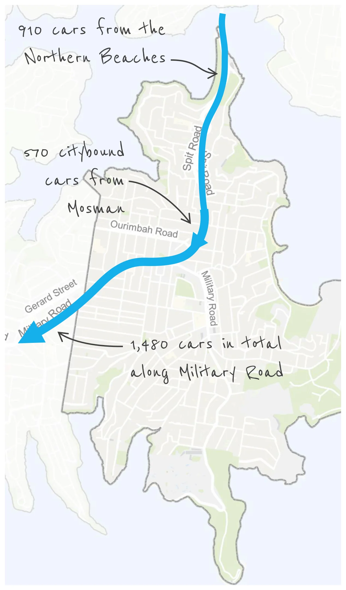

<!-- page 712 -->

The anticipated population growth resulting from the LMR Policy across Mosman and the Northern Beaches represents a considerable increase in travel demand.

The existing road network is near capacity and highly constrained, with limited connections to the regional road network and limited scope to increase its capacity.

Overall, buses have some capacity, but only on the less frequent and less direct services. The B- Line service is at capacity by the time buses arrive at the Spit Junction. While there is an opportunity to provide additional services at Mosman, buses remain dependent on the congested Military Road – Spit Road corridor.

Cycling is generally supported by on-road cycle routes mixed with other traffic. Combined with Mosman’s topography and the distances between homes, shops, and services, they act as a deterrent to walking and cycling.

The review shows a clear gap between the level of growth being planned and the capacity of transport infrastructure available to support it.

The transport network in Mosman requires a State-led strategic response and substantial investment to sustainably maintain the accessibility, productivity, and livelihood for both existing and future residents.

### Potential implication on the transport network

Mosman LMR Infrastructure Impact Study – Preliminary transport study 20

Figure 15: The Spit Junction, one of the key constraints in the road network

August 2026

Attachment 1.1.5 Mosman Council

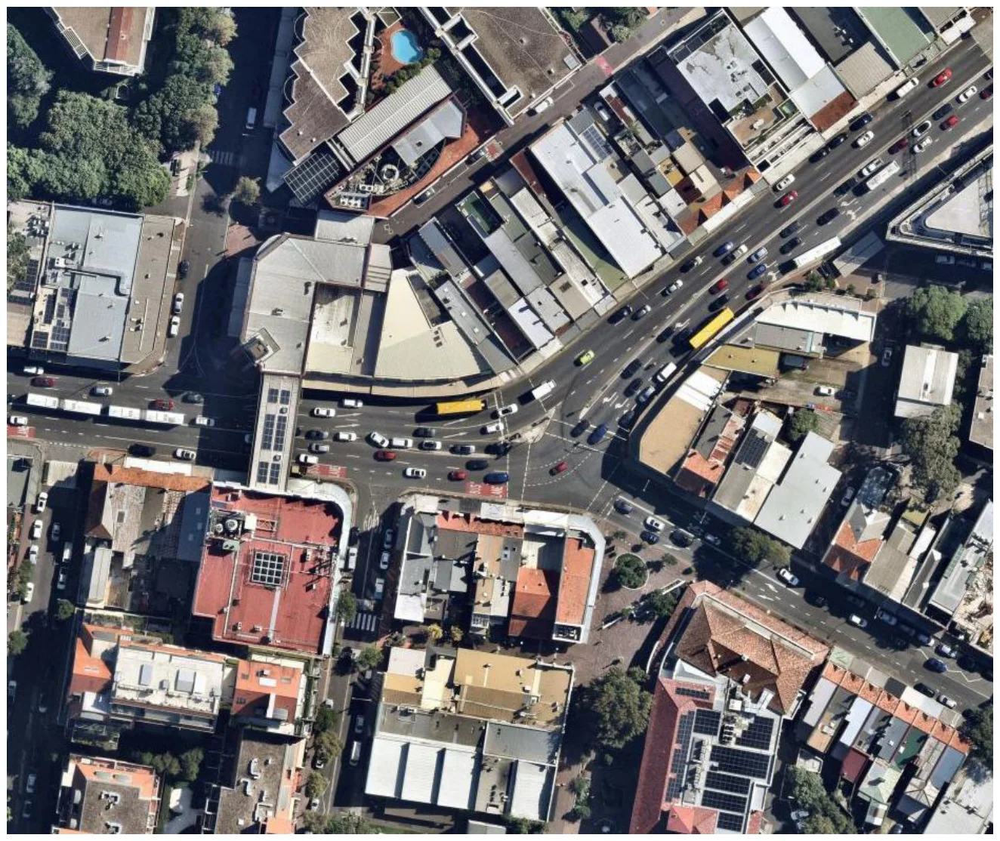

<!-- page 713 -->

### 04

## Recommendations

August 2026

Attachment 1.1.5 Mosman Council

<!-- page 714 -->

A regional challenge

Housing growth in Mosman and across the Northern Beaches and Lower North Shore corridor will place increasing pressure on an already constrained transport network.

The challenge is regional in nature: the Military Road – Spit Road corridor is a critical regional transport link between the Northern Beaches, Mosman, North Sydney, and Sydney CBD. Its constraints are largely driven by regional travel demand, limited alternative routes, and constrained harbour crossing capacities.

The corridor is physically constrained and highly sensitive to small increases in traffic. Previous State investigations found that an additional 500 vehicles in the peak direction could increase corridor travel times by up to 60%, from 28 minutes to 45 minutes.

The LMR Policy would enable thousands of homes in the region, resulting in up to 1,480 additional car trips and 1,720 public transport trips along the corridor during peak periods—beyond its practical operating capacity.

Limited local government capacity

Local governments are responding to State housing targets to support walking, cycling, public transport amenity, safer streets, and better place outcomes on the local roads and places through targeted local interventions.

For Mosman, Council is preparing the Mosman Masterplan and associated studies to identify opportunities to deliver housing capacity and the local infrastructure required to support this. However, a combined response is needed to support the scale of growth now expected across the region.

Local governments have limited funding capacity and jurisdiction over the State-managed transport network, bus services and major infrastructure investments needed to address corridor-wide transport challenges.

Mosman Council, through its submission to the Northern Beaches Network Review, advocates for a shift toward more ambitious, regionally significant transport outcomes and a step-change in infrastructure investment.

NSW State Government

The NSW Government should therefore take a leading role in identifying, funding, and delivering the enabling infrastructure required to support its housing objectives.

Without substantial State intervention, local improvements will be unable to offset the cumulative impacts of additional housing growth, increased car trips, and rising demand for public transport, and will fail to meaningfully deliver good Place and liveability outcomes.

### Recommendations overview

Mosman LMR Infrastructure Impact Study – Preliminary transport study 22

Figure 16: An integrated response

Thriving, liveable, and accessible communities

Housing growth

Increased pressure on a constrained transport network

State-led strategic investment

• East–west strategic transport links • Regional traffic diversion corridors • Expanded rapid public transport • Longer-term harbour crossing options

Targeted local interventions

• Local planning • Streetscape improvements • Pedestrian and cyclist permeability • Public domain upgrades

August 2026

Attachment 1.1.5 Mosman Council

<!-- page 715 -->

The study finds that the transport infrastructure and services currently available within the Mosman LGA will be insufficient to meet the transport needs of the expected uplift.

Council is currently progressing a range of initiatives through its Asset Management Plan, Development Contributions Plan, transport strategies and related capital works programs to deliver local interventions.

Infrastructure in Mosman will need to consider the increase in demand from both through-traffic (related to Northern Beaches growth) and internal traffic generated from Mosman’s own growth.

As a principle, interventions will need to minimise growth in future car trips, enable mode shift to public and active transport alternatives, and encourage internalisation of trips where feasible.

It is recommended that Council and the NSW Government:

• Increase pedestrian permeability and priority through Mosman LGA – Council has already started exploring this through the Walking & Cycling Strategy, which seeks to improve walkability to schools and key trip attractors.

• Establish a robust regional cycle route from the Spit Bridge through the LGA to North Sydney – This will enable local and Northern Beaches residents to connect to the North

Sydney and wider Sydney network. Making this a feasible and attractive alternative is key to reducing growth in car trips.

• Reduce vehicle speeds where appropriate – Already a part of the Walking & Cycling Strategy, reducing vehicle speeds will both make streets more walkable and safer whilst discouraging car use, especially on local roads.

• Improve public transport amenity – Upgrading bus stops with improved shelters, seating, service information, and lighting would make bus trips more attractive and accessible.

• Improve bus service frequency and reliability – This review finds that the B-Line service is extremely popular and exceeding capacity, compared to other regular bus services. This is likely due to its high frequency and ‘express’ nature. Improvements to the B-Line and other buses’ service frequency and capacity should be explored to ensure they remain an attractive and feasible alternative to car travel. Transport for NSW could also explore a new B-line service that starts in Mosman to improve bus service capacity for residents south of the Spit Bridge while avoiding congestion that occurs at the Spit Bridge.

• Reduce off-street parking provision – Off- street parking provision in new developments could be minimised to reduce car ownership and, subsequently, car use.

### Targeted local interventions

Mosman LMR Infrastructure Impact Study – Preliminary transport study 23

Figure 17: Recommendations for consideration

### establish regional

### cycling route

August 2026

Attachment 1.1.5 Mosman Council

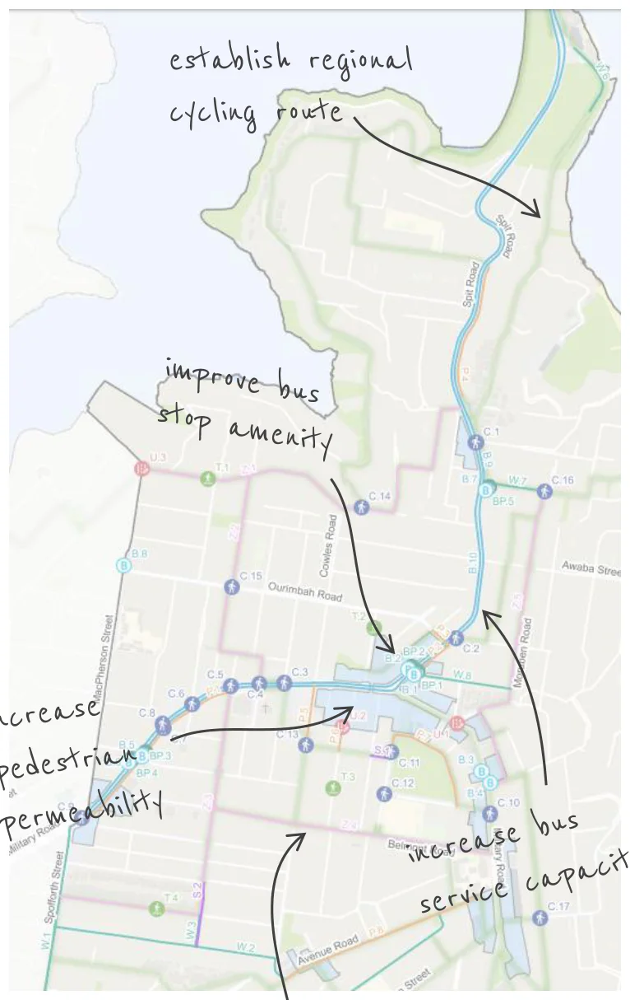

<!-- page 716 -->

State-led investment will be required to enable the cumulative housing growth targets and associated travel demand across Mosman, Lower North Shore, and the Northern Beaches.

Targeted local interventions by itself is unable to address the broader capacity limits of regional road corridors and public transport options, including the Military Road – Spit Road corridor and bus/ferry services.

Lack of intervention on regional roads and state- led transport services would risk delivery of dwellings that don’t have adequate transport capacity.

In light of the findings of this report and the limited control that council has over regional transport interventions, it is recommended that the NSW Government investigate initiatives including, but not limited to:

• Expanded rapid public transport routes and improved integration between bus, metro, rail, and ferry networks. With the goal to reduce regional car demand, including those trips through Mosman.

• Upgrades to strategic interchanges, such as Chatswood, to accommodate additional passenger and bus movements.

### State-led strategic investment

Mosman LMR Infrastructure Impact Study – Preliminary transport study 24

• Centre by-pass opportunities to reduce regional through-traffic passing through local activity centres (such as Spit Junction and others along Military Road) to enable a Movement and Place approach to planning.

• Regional traffic diversion corridors to remove regional through-traffic from the Military Road – Spit Road corridor.

• Corridor capacity improvements for key regional routes, including along Spit Road, Spit Bridge, and Military Road to relieve pinch points and improve travel times for road users, including bus services.

• Regional active transport networks to relieve demand on road capacity.

Regional scale and state-led transport infrastructure often takes many years of careful planning, acquisition and consultation and lead times between investigation and delivery can be significant.

As such, it is recommended that investigations and commitments are commenced as soon as practicable to ensure the planned growth across Mosman, the Northern Beaches, and Lower North Shore can be adequately serviced by the transport network.

August 2026

Attachment 1.1.5 Mosman Council

<!-- page 717 -->

August 2026

Attachment 1.1.5 Mosman Council

<!-- page 718 -->

SGS ECONOMICS AND PLANNING: INFRASTRUCTURE SUMMARY REPORT 25

## Appendix C: Infrastructure big list

### WIP

August 2026

Attachment 1.1.5 Mosman Council

<!-- page 719 -->

August 2026

Attachment 1.1.5 Mosman Council

