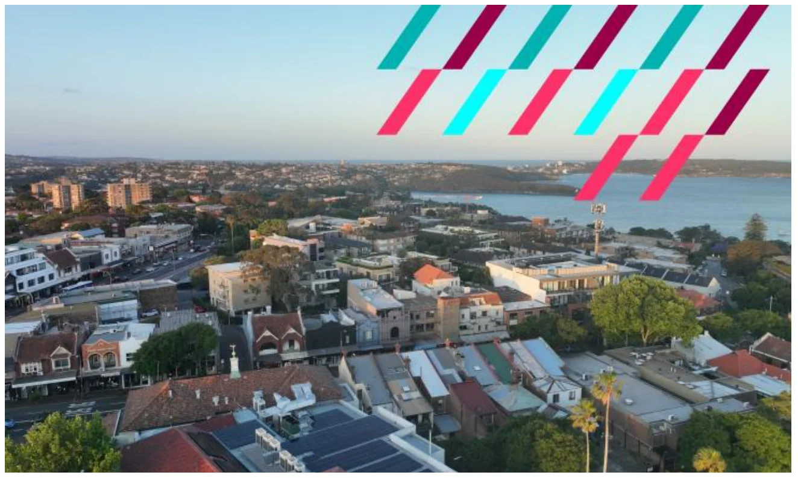
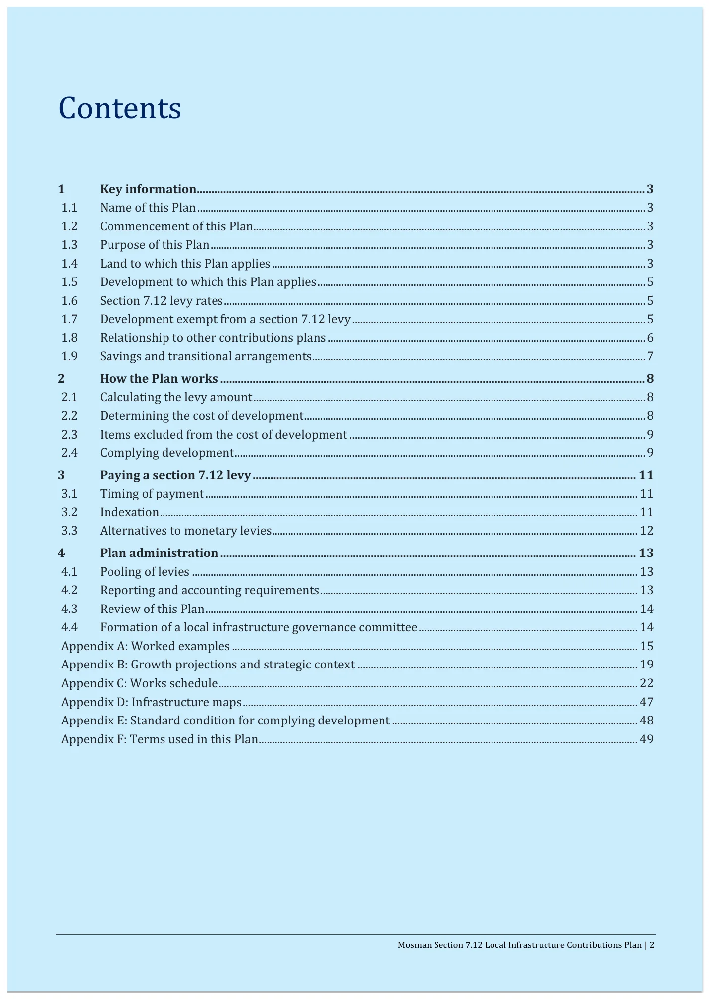
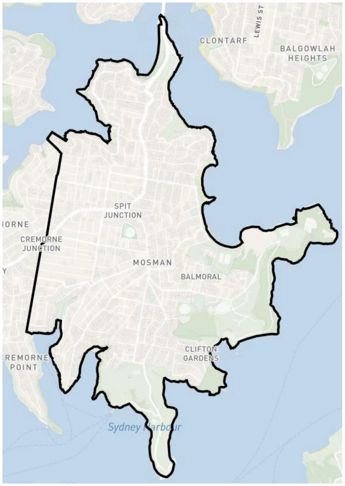
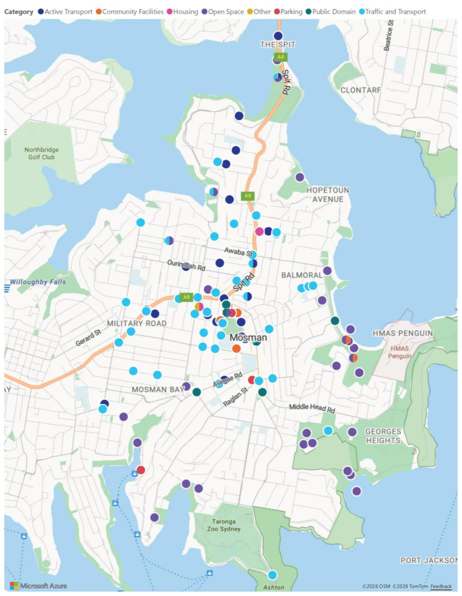

---

title: F Infrastructure Contributions Plan

source: Extraordinary Council Meeting - Additional Attachments - 26 August 2026

pages: 720-769

---

# F Infrastructure Contributions Plan

<!-- page 720 -->

## F

### Infrastructure

### Contributions Plan

August 2026

Attachment 1.1.6 Mosman Council

<!-- page 721 -->

## Mosman Section 7.12 Local Infrastructure

## Contributions Plan

Month 2026

August 2026

Attachment 1.1.6 Mosman Council

<!-- page 722 -->

Mosman Section 7.12 Local Infrastructure Contributions Plan | 2

## Contents

1 Key information........................................................................................................................................................ 3 1.1 Name of this Plan ........................................................................................................................................................................ 3 1.2 Commencement of this Plan................................................................................................................................................... 3 1.3 Purpose of this Plan ................................................................................................................................................................... 3 1.4 Land to which this Plan applies ............................................................................................................................................ 3 1.5 Development to which this Plan applies ........................................................................................................................... 5 1.6 Section 7.12 levy rates .............................................................................................................................................................. 5 1.7 Development exempt from a section 7.12 levy .............................................................................................................. 5 1.8 Relationship to other contributions plans ....................................................................................................................... 6 1.9 Savings and transitional arrangements ............................................................................................................................. 7 2 How the Plan works ................................................................................................................................................ 8 2.1 Calculating the levy amount ................................................................................................................................................... 8 2.2 Determining the cost of development ................................................................................................................................ 8 2.3 Items excluded from the cost of development ............................................................................................................... 9 2.4 Complying development .......................................................................................................................................................... 9 3 Paying a section 7.12 levy .................................................................................................................................. 11 3.1 Timing of payment .................................................................................................................................................................. 11 3.2 Indexation ................................................................................................................................................................................... 11 3.3 Alternatives to monetary levies ......................................................................................................................................... 12 4 Plan administration ............................................................................................................................................. 13 4.1 Pooling of levies ....................................................................................................................................................................... 13 4.2 Reporting and accounting requirements ....................................................................................................................... 13 4.3 Review of this Plan .................................................................................................................................................................. 14 4.4 Formation of a local infrastructure governance committee .................................................................................. 14 Appendix A: Worked examples ........................................................................................................................................................ 15 Appendix B: Growth projections and strategic context ......................................................................................................... 19 Appendix C: Works schedule ............................................................................................................................................................. 22 Appendix D: Infrastructure maps .................................................................................................................................................... 47 Appendix E: Standard condition for complying development ............................................................................................ 48 Appendix F: Terms used in this Plan .............................................................................................................................................. 49

August 2026

Attachment 1.1.6 Mosman Council

<!-- page 723 -->

Mosman Section 7.12 Local Infrastructure Contributions Plan | 3

## 1 Key information

This part of the Plan contains key information including the date it commences, the land and development it applies to and the section 7.12 levy percentages.

### 1.1 Name of this Plan

The Mosman Section 7.12 Local Infrastructure Contributions Plan (the Plan).

### 1.2 Commencement of this Plan

This Plan commences on XX Month Year.

### 1.3 Purpose of this Plan

This Plan authorises Mosman Council (Council), registered certifiers and other consent authorities to impose a condition requiring a levy to be paid under section 7.12 of the Environmental Planning and Assessment Act 1979 (EP&A Act) when determining an application for development (DA) or an application for a complying development certificate (CDC).

A section 7.12 levy is required to fund the public amenities and public services (local infrastructure) set out in the works schedule in Appendix C to this Plan, which are intended to support development in the Mosman Local Government Area (LGA).

### 1.4 Land to which this Plan applies

This Plan applies to all land in the Mosman LGA as shown in the below map (Figure 1).

August 2026

Attachment 1.1.6 Mosman Council

<!-- page 724 -->

Mosman Section 7.12 Local Infrastructure Contributions Plan | 4

Figure 1 Plan area where a section 7.12 levy applies

August 2026

Attachment 1.1.6 Mosman Council

<!-- page 725 -->

Mosman Section 7.12 Local Infrastructure Contributions Plan | 5

### 1.5 Development to which this Plan applies

This Plan applies to all development that:

• Is subject to a DA or CDC application under Part 4 of the EP&A Act; and

• Is located within the Mosman LGA area identified under section 1.4 of this Plan; and

• Is not exempt under section 1.7 of this Plan; and

• Has a cost of development in line with Table 1 under section 1.6 of this Plan.

### 1.6 Section 7.12 levy rates

The section 7.12 levy amount is calculated by multiplying the levy percentage rates in the following table by the proposed cost of development. Table 1 identifies the applicable percentage levy rates by development type, proposed development cost and floor space ratio (FSR).

Under this Plan, the applicable FSR is the approved FSR of the development as a whole, as identified in the relevant DA or CDC.

Table 1 Section 7.12 levy rates

Development type and proposed development cost Levy

All development with a proposed cost up to and including $250,000 Nil

All development with a proposed cost between $250,001 and $1,000,000: 1%

All development with a proposed cost of more than $1,000,000:

With an FSR of 1.5:1 or less, or no FSR 2%

With an FSR of more than 1.5:1 3%

### 1.7 Development exempt from a section 7.12 levy

Development may combine different development types. Where this is proposed, any exemption listed under this section of this Plan will only apply to that component of the development.

Mandatory exemptions to local contributions

A section 7.12 levy must not be imposed in the following circumstances:

• Housing development for seniors or people with a disability carried out by or on behalf of a social housing provider;

• Where required a Ministerial direction made after the commencement of this Plan.

August 2026

Attachment 1.1.6 Mosman Council

<!-- page 726 -->

Mosman Section 7.12 Local Infrastructure Contributions Plan | 6

Development exempt under this Plan

The following development is exempt from the payment of a section 7.12 levy under this Plan:

• Specialist disability accommodation. • Affordable housing provided in perpetuity.

• Boarding houses that will be used for affordable housing in perpetuity.

• Group homes.

• Hostels.

• Crown development application for health services facilities, educational establishments, emergency services facilities or public administration buildings.

• Development for the purposes of a local infrastructure item specified in Appendix C to this Plan.

• Developments by a not-for profit charity where the development is small scale, for example a retail shop operated by the Salvation Army.

• Applications submitted by or on behalf of Mosman Council.

Council may, at their discretion, exempt (or partially exempt) other forms of development on a case-by-case basis.

Costs excluded from the levy calculation

There are certain costs that cannot be considered in determining the cost of development for section 7.12 levies. The proposed cost of development must be calculated in accordance with section 208 of the Environmental Planning and Assessment Regulation 2021 (EP&A Regulation). These are detailed further under section 2.3 of this Plan.

This includes excluding the cost of any component of the development that is provided as affordable housing within the meaning of the EP&A Act, including dwellings required to be dedicated in perpetuity free of cost for affordable housing under section 7.32 of that Act.

### 1.8 Relationship to other contributions plans

The Mosman Contributions Plan 2022 is repealed by this Plan.

This Plan, however, does not affect any condition of consent imposing a local infrastructure contribution under any superseded plans that applied before the date of commencement of this Plan.

Any contributions that have been, or will be, paid for development within the Mosman LGA under conditions of consent imposed in accordance with a superseded plan may be pooled with levies paid under this Plan and applied to the local infrastructure in the works schedule in Appendix C to this Plan.

August 2026

Attachment 1.1.6 Mosman Council

<!-- page 727 -->

Mosman Section 7.12 Local Infrastructure Contributions Plan | 7

### 1.9 Savings and transitional arrangements

This Plan applies to:

• DAs determined on or after the date of commencement of this Plan; and

• CDC certificates issued on or after the date of commencement of this Plan.

A DA lodged or an application for a CDC made before the commencement of this Plan will therefore be subject to this Plan if it is determined or issued on or after the commencement date.

For development consents granted and CDCs issued before the commencement of this Plan, conditions imposing contributions will continue to be administered in accordance with the contributions plan under which the condition was imposed.

Any adjustment to a contribution imposed under a superseded contributions plan will be made in accordance with that plan, including where a modification application is approved, to the extent that an adjustment is permitted.

August 2026

Attachment 1.1.6 Mosman Council

<!-- page 728 -->

Mosman Section 7.12 Local Infrastructure Contributions Plan | 8

## 2 How the Plan works

This part of the Plan contains information on the operation of the Plan including how levy amounts are calculated and imposed as conditions of consent, how levies can be paid and any alternatives to payment.

### 2.1 Calculating the levy amount

A section 7.12 levy amount is calculated by multiplying the relevant levy rates shown in Table 1 by the proposed cost of development.

Worked examples for calculating section s7.12 levies for different types of development are shown in Appendix A: Worked examples.

### 2.2 Determining the cost of development

Section 7.12 levies are calculated as a percentage of the cost of development. The proposed cost of development must be determined by the consent authority by adding up all the costs and expenses that have been or will be incurred by the applicant in carrying out the development. This is outlined in section 208 of the EP&A Regulation.

Any development subject to this Plan is to provide a cost summary report with the DA or CDC application prepared at the applicant’s cost, setting out an estimate of the proposed cost of carrying out the development.

The persons approved by Council to provide an estimate of the proposed cost of carrying out development, and the applicable cost summary template to be used, are as follows:

• Council’s Cost Summary Report for development with a cost less than $1,200,000 to be completed by either a Licensed Builder or a Quantity Surveyor registered with the Australian Institute of Quantity Surveyors or as otherwise agreed with Council. • Council’s Cost Summary Report for development with a cost of $1,200,000 or more to be completed by a Quantity Surveyor registered with the Australian Institute of Quantity Surveyors.

Where exclusions to the s7.12 levy are sought for eligible items, the onus is on applicants to quantify these costs and to demonstrate their eligibility under Section 2.3 of this Plan. Where costs and eligibility evidence are not provided by the applicant, Council assumes all developer costs are chargeable in calculating the s7.12 contribution.

The relevant consent authority will validate all Cost Summary Reports before they are accepted using a standard costing guide or other generally accepted costing method. A consent authority may, at its sole discretion and at the applicant’s cost, engage a person referred to above to review a cost report submitted by an applicant.

In all cases, the determination of the proposed cost of development by the consent authority is final.

August 2026

Attachment 1.1.6 Mosman Council

<!-- page 729 -->

Mosman Section 7.12 Local Infrastructure Contributions Plan | 9

### 2.3 Items excluded from the cost of development

Section 208(4) of the EP&A Regulation outlines costs that must be excluded from the cost of development. This includes:

a) the cost of the land on which the development will be carried out,

b) the costs of repairs to a building or works on the land that will be kept in connection with the development,

c) the costs associated with marketing or financing the development, including interest on loans,

d) the costs associated with legal work carried out, or to be carried out, in connection with the development,

e) project management costs associated with the development,

f) the cost of building insurance for the development,

g) the costs of fittings and furnishings, including refitting or refurbishing, associated with the development, except if the development involves an enlargement, expansion or intensification of a current use of land,

h) the costs of commercial stock inventory,

i) the taxes, levies or charges, excluding GST, paid or payable in connection with the development by or under a law,

j) the costs of enabling access by people with disability to the development,

k) the costs of energy and water efficiency measures associated with the development,

l) the costs of development that is provided as affordable housing,

m) the costs of development that is the adaptive reuse of a heritage item.

Development may combine different development types. Where this is proposed, any listed exemption under Section 1.7 of this Plan or costs to be excluded will only apply to that component of the development.

For example, a DA may propose a residential flat building with a portion of affordable housing. In determining the cost of development, the consent authority is to exclude any costs related to the affordable housing component only. For the purposes of this Plan, the portion to be excluded will be based on the cost per m2 for residential development, typically shown in the Cost Summary Report. This is then multiplied by the GFA of the affordable housing to be excluded.

Worked examples for calculating the excluded cost of development are shown in Appendix A: Worked examples.

### 2.4 Complying development

In relation to an application made to a registered certifier for a CDC, if the complying development is subject to this Plan, the certifier must impose a section 7.12 levy condition on the CDC in accordance with this Plan and requirements of section 156 of the EP&A Regulation.

August 2026

Attachment 1.1.6 Mosman Council

<!-- page 730 -->

Mosman Section 7.12 Local Infrastructure Contributions Plan | 10

This includes:

• Calculating the levy amount using the precise method included in this Plan.

• Imposing a condition consistent with the standard condition included in Appendix E – Standard Conditions for Complying Development.

August 2026

Attachment 1.1.6 Mosman Council

<!-- page 731 -->

Mosman Section 7.12 Local Infrastructure Contributions Plan | 11

## 3 Paying a section 7.12 levy

This part of the Plan provides detail on how the section 7.12 levy condition should be expressed, including when the levy is to be paid and how indexation will be applied.

### 3.1 Timing of payment

The condition of consent should set out the timing of payment for a levy. Applicants must pay the levy at the time specified. If no time is specified, payment must be made before obtaining the relevant certificate under Part 6 of the EP&A Act as detailed below.

A condition must provide for payment as follows:

• Development involving building work – prior to the release of the first construction certificate. • Development involving subdivision – prior to the release of the subdivision certificate. • Development involving building work and subdivision – prior to the release of the construction certificate or subdivision certificate, whichever occurs first. • Development where no construction certificate or subdivision certificate is required – prior to issue of the first occupation certificate. • Development authorised by complying development certificates – prior to the commencement of any building or subdivision work authorised by the certificate. At the time of payment, it will be necessary for levy amounts to be updated in accordance with section 3.2 of this Plan.

### 3.2 Indexation

This Plan authorises the proposed cost of development to be indexed between the granting of consent and the date of payment in accordance with quarterly movements in the Australian Bureau of Statistics (ABS) Producer Price Index (Building Construction, NSW)1. This is to account for increases in construction costs over time.

The cost of development, as required by conditions of consent, will be indexed at the time of payment in accordance with the below formula:

𝒊𝒏𝒅𝒆𝒙𝒆𝒅 𝒄𝒐𝒔𝒕 𝒐𝒇 𝒅𝒆𝒗𝒆𝒍𝒐𝒑𝒎𝒆𝒏𝒕= 𝒄𝒐𝒔𝒕 𝒐𝒇 𝒅𝒆𝒗𝒆𝒍𝒐𝒑𝒎𝒆𝒏𝒕 𝒂𝒕 𝒄𝒐𝒏𝒔𝒆𝒏𝒕 × 𝒄𝒖𝒓𝒓𝒆𝒏𝒕 𝒊𝒏𝒅𝒆𝒙 𝒇𝒊𝒈𝒖𝒓𝒆 𝒃𝒂𝒔𝒆 𝒊𝒏𝒅𝒆𝒙 𝒇𝒊𝒈𝒖𝒓𝒆

1 The series ID for this index is: A2333670K

August 2026

Attachment 1.1.6 Mosman Council

<!-- page 732 -->

Mosman Section 7.12 Local Infrastructure Contributions Plan | 12

• Current index figure is the last published Producer Price Index (Building Construction, NSW) figure as at the first day of the quarter in which the payment is made. • Base index figure is the last published Producer Price Index (Building Construction, NSW) figure as at the first day of the quarter in which the consent was issued.

If the adjusted contributions amount at payment is less than the contributions amount in the condition of consent, then the contributions will not be amended.

### 3.3 Deferred and periodic payments

Deferred or periodic payments may be permitted at the discretion of Council in the following circumstances:

• Deferral will not prejudice the timing or the manner of the provision of local infrastructure included in the works schedule. • There are circumstances justifying the deferred or periodic payment of the contributions

### 3.4 Alternatives to monetary levies

Section 7.12 levies can only be made as monetary contributions. A section 7.12 condition cannot require the dedication of land.

Council may accept an offer, in connection with a development application, by an applicant to enter into a planning agreement to provide works-in-kind, dedication of land or other material public benefit but is not required to do so. A planning agreement must be entered into before the grant of a development consent that imposes section 7.12 levies in accordance with this Plan.

August 2026

Attachment 1.1.6 Mosman Council

<!-- page 733 -->

Mosman Section 7.12 Local Infrastructure Contributions Plan | 13

## 4 Plan administration

This part of the Plan details the administrative processes Council will undertake once the Plan has been approved and contributions start being collected from development.

### 4.1 Pooling of levies

This Plan authorises pooling of monetary contributions paid for different purposes and applied progressively for those purposes. Council can pool within and between contributions plans to fund infrastructure identified in either this contributions plan or other contributions plans.

Council will ensure pooling will not prevent the delivery of infrastructure for which the contribution was originally collected. The priorities for the expenditure of pooled contributions in this Plan are set out in the works schedule.

### 4.2 Reporting and accounting requirements

Council is required to comply with all requirements in the EP&A Regulation for accounting and reporting in relation to this Plan. This includes:

• Keeping a contributions register in accordance with section 217 of the EP&A Regulation.

• Accounting for funds received under this Plan within its annual financial report in accordance with section 218 of the EP&A Regulation.

• Providing details about projects funded using levies collected under this Plan in its annual reports in accordance with section 218A of the EP&A Regulation.

• Disclosing receipt and expenditure of contributions in annual financial statements in accordance with section 219 of the EP&A Regulation.

Council must publish, in accordance with sections 218A and 220 of the EP&A Regulation, the following on the NSW Planning Portal and its website:

• This Plan.

• The levy rates.

• Contributions register.

• Annual statements.

• Information relating to the use of levies required to be included in its annual reports.

August 2026

Attachment 1.1.6 Mosman Council

<!-- page 734 -->

Mosman Section 7.12 Local Infrastructure Contributions Plan | 14

### 4.3  Review of this Plan

The Plan will be reviewed by Council as needed to incorporate any changes to the items and staging of works specified in the works schedule in Appendix B to this Plan. At a minimum, Council will review this Plan every 5 years from the date of its commencement.

Pursuant to section 215(5) of the EP&A Regulation, Council may make certain minor adjustments or amendments to the plan without prior public exhibition and adoption by Council. Minor adjustments include correcting minor typographical errors, indexing contribution rates and detailing when infrastructure items or works have been completed.

### 4.4 Formation of a local infrastructure governance committee

Council may establish a local infrastructure governance committee or, alternatively, add additional functions to an existing group to meet the aims of this committee. The primary aim of the committee will be to oversee contributions within the precinct and ensure the infrastructure needed to support the precinct is delivered.

At a minimum, the committee should:

• Be chaired by an appropriate Council executive and consist of executives from finance, asset management and strategic planning.

• Receive reports on revenue received.

• Receive reports on anticipated future revenue, using modelling of expected development.

• Make decisions on timing of delivery, including tracking expenditure, borrowing and pooling of levies and completed projects.

• Provide oversight and advice on proposed planning agreements to provide works in kind instead of the payment of section 7.12 levies.

• Oversee the reporting of levies.

• Receive recommendations and make decisions on the review of the Plan.

Council should keep minutes, track any actions and note decisions of the committee. These documents will be made available on request.

August 2026

Attachment 1.1.6 Mosman Council

<!-- page 735 -->

Mosman Section 7.12 Local Infrastructure Contributions Plan | 15

### Appendix A: Worked examples

This appendix contains examples for calculating section 7.12 levies for various types of development. While section 7.12 levies are not affected by indexation at the date of calculation (because they are based on the estimated development cost), the s7.12 levy should be indexed by PPI at the date of payment.

The examples in this appendix are provided for illustrative purposes only. They are hypothetical scenarios and are not based on, or intended to represent, any actual development application, approval or development currently occurring within the Mosman LGA.

When calculating a section 7.12 levy, the FSR of the development must be confirmed by reference to the relevant approved DA or CDC. For the purposes of these worked examples, assumptions have been made regarding the applicable FSR.

Worked example 1 – alterations and additions to an existing dwelling house 1

Development description Alterations and additions to an existing 3-bedroom dwelling house including internal reconfiguration, and a rear extension. The proposed development cost is $850,000.

Working In accordance with Section 1.6 of this Plan, the development is subject to a 1% s7.12 levy because it has a development cost between $200,000 and $1,000,000.

The section 7.12 levy at 1% equals $8,500.

Worked example 2 – alterations and additions to an existing dwelling house 2

Development description Alterations and additions to an existing 3-bedroom dwelling house including a rear extension adding two storeys and a basement with garage, pool and gym. The proposed development cost is $3,000,000.

Working In accordance with Section 1.6 of this Plan, the development is subject to a 3% s7.12 levy because:

− It has a development cost over $1,000,000, − Under this worked example, the FSR of the development is assumed to be more than 1.5:1.

The section 7.12 levy at 3% equals $90,000.

Worked example 3 – alterations and additions to an existing dwelling house 3

Development description Alterations and additions to an existing 3-bedroom dwelling house including repairs to the façade, installation of an accessibility lift, solar panels, a rainwater harvesting tank and a secondary dwelling. The

August 2026

Attachment 1.1.6 Mosman Council

<!-- page 736 -->

Mosman Section 7.12 Local Infrastructure Contributions Plan | 16

proposed development cost is $2,000,000. All of the potentially excluded items are clearly costed (totalling $1,400,000) and quantified in the Cost Summary Report.

Working In accordance with Section 1.6 of this Plan, the development is subject to a 2% s7.12 levy because:

− It has a development cost over $1,000,000, − Under this worked example, the FSR of the development is assumed to be 1.5:1 or less.

However, in accordance with Section 2.3 of this Plan, certain costs are excluded from the proposed cost of development for the purposes of calculating the section 7.12 levy. This includes the cost of repairs to buildings or works that will be retained, the cost of enabling access by people with disability, and the cost of energy and water efficiency measures.

The proposed cost of development for the purposes of calculating the levy is therefore $600,000 ($2,000,000 less $1,400,000 for the excluded works).

The section 7.12 levy at 2% equals $12,000.

Worked example 4 – replacement of 5-unit townhouse with 50-unit RFB

Development description An existing 5-unit townhouse development is proposed to be demolished and replaced with a 50-unit residential flat building. Five of these 50 units will be dedicated to Council as affordable housing units.

The 5-unit townhouse development previously paid a s7.12 contribution under the Mosman Contributions Plan 2022. The estimated development cost of the new development is $45,000,000.

Working In accordance with Section 1.6 of this Plan, the development is subject to a 3% s7.12 levy because:

− It has a development cost over $1,000,000, − Under this worked example, the FSR of the development is assumed to be more than 1.5:1, − While the previous development had paid a s7.12 contribution under a previous contributions plan, this does not result in any credit under this new s7.12 Plan.

However, in accordance with Sections 1.7 and 2.3 of this Plan, the affordable housing units are excluded from the proposed cost of development for the purposes of calculating the section 7.12 levy.

With 5 of the 50 units being affordable housing, the cost to be excluded from the levy calculation will be based on the $/m2 rate for the residential component as described in the Cost Summary Report multiplied by the GFA of the units to be dedicated.

In this example, the following assumptions have been made:

− Each affordable housing unit is 105m2 in size − The Cost Summary Report identifies a residential development cost equivalent to $5,500/m2

The proposed cost of development for the purposes of calculating the levy is therefore:

August 2026

Attachment 1.1.6 Mosman Council

<!-- page 737 -->

Mosman Section 7.12 Local Infrastructure Contributions Plan | 17

− $45,000,000 total estimated development cost; − less $2,887,500 (5 units x $5,500/m2 x 105m2) for the affordable housing component.

This results in a leviable development cost of $42,112,500. The section 7.12 levy at 3% equals $1,263,375.

Worked example 5 – lot subdivision

Development description An existing home on a 3,000 sqm lot is proposed to be demolished and the lot is proposed to be subdivided into four new lots. The lots are proposed to be sold as empty, with buyers expected to purchase the land and construct a new home at a later development stage. The cost involved with demolition, subdivision and associated preparatory civil, stormwater and drainage works is $400,000.

Working In accordance with Section 1.6 of this Plan, the development is subject to a 1% s7.12 levy because it has a development cost between $200,001 and $1,000,000.

The section 7.12 levy at 1% equals $4,000.

A s7.12 levy may apply again at a later development stage when further building works are proposed on each lot.

Worked example 6 – Construction of a new 3-bedroom dwelling on a vacant allotment

Development description Construction of a new 3-bedroom dwelling on a vacant allotment is proposed. The estimated development cost is $1,500,000.

Working In accordance with Section 1.6 of this Plan, the development is subject to a 2% s7.12 levy because:

− It has a development cost over $1,000,000, − Under this worked example, the FSR of the development is assumed to be 1.5:1 or less.

Although a 1% s7.12 levy was paid at the earlier subdivision stage, that levy related to the cost of carrying out the subdivision, demolition and associated preparatory works only. The construction of the new dwelling is a separate development with its own estimated development cost.

The section 7.12 levy at 2% equals $30,000.

Worked example 7 – expansion of a shopping centre

Development description Refurbishment and upgrade works to an existing shopping centre including internal reconfiguration works, upgraded entries, facade improvements, lift and escalator upgrades, basement car parking improvements, public domain works, rooftop solar panels and basement rainwater tanks.

August 2026

Attachment 1.1.6 Mosman Council

<!-- page 738 -->

Mosman Section 7.12 Local Infrastructure Contributions Plan | 18

The estimated development cost is $60,000,000, which includes:

− $8,000,000 for repairs to parts of the existing building that will be retained; − $4,000,000 for works to enable access by people with disability, including lift upgrades, accessible paths of travel and accessible amenities; and − $6,000,000 for energy and water efficiency measures, including rooftop solar panels, rainwater tanks and water reuse systems.

All of these potentially excluded items are clearly costed and quantified in the Cost Summary Report.

Working In accordance with Section 1.6 of this Plan, the development is subject to a 3% s7.12 levy because:

− The estimated development cost is over $1,000,000, − Under this worked example, the FSR of the development is assumed to be more than 1.5:1.

However, in accordance with Section 2.3 of this Plan, certain costs are excluded from the proposed cost of development for the purposes of calculating the section 7.12 levy. This includes the cost of repairs to buildings or works that will be retained, the cost of enabling access by people with disability, and the cost of energy and water efficiency measures.

The proposed cost of development for the purposes of calculating the levy is therefore:

− $60,000,000 total estimated development cost; − less $8,000,000 for repairs to the existing building; − less $4,000,000 for works to enable access by people with disability; and − less $6,000,000 for energy and water efficiency measures.

This results in a leviable development cost of $42,000,000. The section 7.12 levy at 3% equals $1,260,000.

August 2026

Attachment 1.1.6 Mosman Council

<!-- page 739 -->

Mosman Section 7.12 Local Infrastructure Contributions Plan | 19

### Appendix B: Growth projections and strategic context

Supporting studies and strategies

Table 2 Supporting studies and strategies Name of supporting study Detail

Mosman Masterplan SJB, Mosman Council

Community Infrastructure Needs Assessment SGS Economics and Planning

Infrastructure Summary Report Appendix - Mosman LMR Infrastructure Impact Study

SGS Economics and Planning SCT Consulting

Mosman Masterplan – Transport Study Fernway Engineering

Asset Management Plan – Roads, Buildings, Open Space, Stormwater and Marine Structure

Mosman Disability Inclusion Action Plan 2026-2030 7 July 2026, Mosman Council

Mosman Schools Pedestrian Infrastructure Study Report 7 March 2024, Bitzios Consulting

Plans of Management

Review of Mosman Bicycle Plan 20 March 2026, SCT Consulting

Future demand

This Plan is based on residential and employment growth projections prepared for the period 2026 to 2056. These projections have been used to estimate the likely additional demand for local infrastructure over the life of this Plan.

As shown in Table 3, the Mosman LGA is expected to accommodate approximately 4,720 additional dwellings and 10,903 additional residents between 2026 and 2056.  The LGA is also forecast to accommodate approximately 1,089 additional workers between 2026 and 2056.

This growth will increase demand for local infrastructure across the LGA, including open space, recreation facilities, community facilities, active transport, public domain improvements and other local infrastructure required to support a growing residential and worker population.

Table 3 Growth projections in the Mosman LGA adopted for this Plan 2026 2056 Additional

Dwellings 12,716 17,436 + 4,720

Residential population 29,374 40,277 + 10,903

Workers 10,728 11,817 + 1,089

August 2026

Attachment 1.1.6 Mosman Council

<!-- page 740 -->

Mosman Section 7.12 Local Infrastructure Contributions Plan | 20

Residential growth forecasts

According to the latest ABS Estimated Resident Population (ERP), the Mosman LGA has a residential population of 29,374. Analysis of occupancy data from the 2021 Census indicates an average occupancy rate of 2.31 persons per dwelling, suggesting that there are approximately 12,716 existing dwellings within the LGA.

Council has prepared the Mosman Masterplan in response to the NSW Government’s Low and Mid-Rise Housing Policy and the need to accommodate Mosman’s share of housing growth under the National Housing Accord through a more locally tailored, place-based planning approach.

The residential growth forecasts under this contributions plan are primarily based on the additional development capacity enabled by the Masterplan which provides for up to 4,700 additional dwellings. Development within the Masterplan area is expected to account for approximately 99% of the additional dwellings and associated population growth forecast over the life of this Plan. Table 4 identifies the number of dwellings delivered under different FSR categories, consistent with the application of section 7.12 levy rates in part 1.6 of this Plan.

Growth outside the Masterplan area (all areas other than the Mosman Central and Middle Harbour SA2s) is expected to be limited. Based on Forecast.id projections, approximately 20 additional dwellings are forecast to be delivered in these areas over the life of the Plan.

Table 4 Residential growth forecasts adopted for this Plan

Area

Additional from 2026-2056

Dwellings Population

Mosman Masterplan area (FSR of 1.5 or less) 165 + 381

Mosman Masterplan area (FSR between 1.5 and 5) 3,330 + 7,692

Mosman Masterplan area (FSR of 5 or more) 1,205 + 2,784

Rest of LGA outside Masterplan 20 + 46

Total + 4,720 + 10,903

August 2026

Attachment 1.1.6 Mosman Council

<!-- page 741 -->

Mosman Section 7.12 Local Infrastructure Contributions Plan | 21

Non-residential growth forecasts

According to data taken from Transport for NSW’s (TfNSW) Travel Zone Projections (TZP) 2024 , there are currently 10,728 workers in the LGA and a forecast of up to 11,817 workers by 2056. This means 1,089 additional workers are expected and need to be considered in the preparation of this Plan.

Table 5 identifies the share of workers under four broad industry categories assigned by TfNSW and the resulting number of workers under each category.

Table 5 Non-residential growth forecasts adopted for this Plan

Broad industry category % share (TZP)

Additional workers from 2026- 2056

Knowledge intensive 34% + 370

Industrial 4% + 44

Health and Education 23% + 250

Population serving 39% + 425

Total + 1,089

Source: Transport for NSW’s, Travel Zone Projections (TZP) 2024

August 2026

Attachment 1.1.6 Mosman Council

<!-- page 742 -->

Mosman Section 7.12 Local Infrastructure Contributions Plan | 22

### Appendix C: Works schedule

Infrastructure needs and costs

As part of the Mosman Masterplan and corresponding Infrastructure Assessment Report, a range of infrastructure needs have been identified to address the residential and worker population increases projected in the Mosman LGA over the life of this Plan. These include new and upgraded open space, recreation, community facilities, active transport, public domain and other local infrastructure required to support forecast growth.

Approximately $390 million of infrastructure needs have been identified across the LGA. Of this, approximately $307 million worth of works are proposed to be funded, either in whole or in part, by this Plan.

Delivery of this infrastructure will therefore require a coordinated funding approach, including development contributions, works delivered through conditions of consent, planning agreements, grant funding, Council funding and other funding sources where available.

Table 4 outlines the new and upgraded local infrastructure items that are proposed to be funded, either in whole or in part, by this Plan.

Table 6 Infrastructure costs

Infrastructure category Items Total cost apportioned to this Plan

Active Transport 29 $30,323,656

Community Facilities 10 $86,294,134

Open Space 43 $63,865,592

Other 4 $22,630,125

Public Domain 10 $44,163,318

Traffic and Transport 50 $55,946,823

Plan administration 1 $4,000,000

Total 146 $307,223,647

Active transport

Walking and cycling networks are important for supporting healthy, connected and sustainable communities. As population and employment increase, more residents and workers will need safe and convenient alternatives to private vehicle travel, particularly for shorter local trips and access to public transport, schools, shops, community facilities and open space.

August 2026

Attachment 1.1.6 Mosman Council

<!-- page 743 -->

Mosman Section 7.12 Local Infrastructure Contributions Plan | 23

Parts of Mosman’s active transport network are constrained by steep topography, narrow road reserves, missing links and limited opportunities to provide separated infrastructure. These issues can discourage walking and cycling and reduce accessibility for children, older people and people with limited mobility.

Growth associated with the Mosman Masterplan will increase demand for improved pedestrian and cycling connections, particularly within and between centres, public transport stops, open spaces and community facilities. Investment will therefore need to focus on completing network gaps, improving safety and accessibility, strengthening connections to key destinations and creating a more comfortable pedestrian environment.

Community facilities

Community infrastructure supports people with meeting their basic needs, such as accessing services, and enhancing quality of life. Some Mosman community facilities are not all well utilised, for reasons including fitness for purpose and accessibility via public and active transport.

Higher-order centrally located facilities such as the Mosman Library are highly utilised and attract users from outside of the LGA. They highlight benefits of co-location, which make accessing multiple services easy for users. Opportunities to expand co-location exist in Mosman Village, which is centrally located and already highly utilised. Utilisation of these assets is likely to grow further if facilities and services are refreshed and expanded to align with projected population growth.

Open space and recreation

Access to open space and recreation is crucial for encouraging healthy lifestyles. With higher density living becoming the new norm, public open space needs to be more accessible to account for the overall loss of private open space with higher density development. Areas around the Mosman Masterplan area will face the most pressure, with open space already limited, and a population set to grow rapidly. The challenge is to increase open space where land is constrained. Therefore, increasing the capacity of existing open space must be prioritised. This should be supported by investigating opportunities to generate additional open spaces and increase linkages to open space.

Accessibility to open space varies across the LGA and can be improved.

There is broader strategic need for sports facilities. Shortages are expected for all indoor courts, and sports fields over the next 30 years. Increasing provision of these facilities is limited by land constraints, as mentioned previously, but there is potential to partner with schools to deliver and/or share facilities. For the core of Mosman especially, the provision of appropriate outdoor courts and sports fields are greatly needed.

Public domain

Dwelling, population and jobs growth will place pressure on public domain. This will be most prevalent in Mosman Village North and South, where a large amount of investment is required to increase walkability – especially within and between sites with significant amounts of planned development – and street-level amenity and activation. An appropriate level of public domain is critical to allow the LGA, particularly along Military Road, to perform as the residential, employment and visitation hub for the broader region. Beyond this area, connectivity to the foreshore and smaller open spaces and community facilities also require updated public domain to ensure residential growth translates into improved liveability.

August 2026

Attachment 1.1.6 Mosman Council

<!-- page 744 -->

Mosman Section 7.12 Local Infrastructure Contributions Plan | 24

Traffic and transport

As development intensifies, the road network’s limited capacity, in particular Military and Spit Roads, makes it increasingly difficult to accommodate more private vehicle trips. Without intervention, traffic congestion will worsen, leading to longer travel times, reduced accessibility, and declining urban liveability.

Public transport, supported by well-integrated active transport networks, is critical to managing growth sustainably. High-capacity services, particularly the bus network in Mosman, enable dense development by reducing dependence on private vehicles. This helps ease road congestion, lowers emissions, and supports more efficient, people-focused urban areas.

It is expected that the number of residents and workers will increase. Without continued investment in public and active transport options often beyond the scope of Council, many may default to car travel, exacerbating congestion and compromising the area's liveability and economic efficiency.

Other infrastructure

Population and development growth will also increase demand for infrastructure that supports community resilience, environmental outcomes and the ongoing operation of the LGA.

Additional development can place pressure on the stormwater network by increasing runoff and demand on existing drainage infrastructure. Investment may be required to improve network capacity, address localised flooding and incorporate water-sensitive urban design measures that improve water quality and reduce environmental impacts.

Growth will also increase the importance of protecting and enhancing Mosman’s natural environment, including its bushland, waterways, foreshore areas and urban tree canopy. Environmental infrastructure and management measures will be needed to maintain biodiversity, improve resilience to climate change, safeguard the community against severe weather and other emergency events, and balance increased use of natural areas with their long-term protection.

Plan administration

Effective administration is necessary to ensure that contributions support the timely delivery of infrastructure. In addition, as development occurs and new information becomes available, the contributions framework will need to be regularly reviewed and updated to reflect actual development take-up, changing infrastructure priorities and updated project designs and costs. Ongoing administration will support transparent decision-making and ensure that contributions are collected, allocated and reported consistently with the Plan.

August 2026

Attachment 1.1.6 Mosman Council

<!-- page 745 -->

Mosman Section 7.12 Local Infrastructure Contributions Plan | 25

Table 7 Works schedule ID Type Project name Description Project cost Attributable % of cost to plan

Attributable cost to plan

Delivery time frame2

Priority

B.01 Open Space Balmoral Accessible Bathroom Upgrade

Upgrade and reconfiguration of accessible bathrooms, improved layouts, enhanced materials, and integration with the surrounding public domain.

$1,228,349 100% $1,228,349 Medium Low

B.02 Open Space Balmoral Bathers Pavilion

Refurbishment of public amenity spaces within the pavilion, including accessibility upgrades, services renewal, and internal finishes improvement.

$1,228,349 100% $1,228,349 Medium Low

B.03 Open Space Balmoral Baths Amenities

Upgrade and reconfiguration of public toilets and change rooms, improved layouts, enhanced materials, and integration with the surrounding public domain.

$2,456,699 100% $2,456,699 Short Medium

B.04 Community Facilities

Balmoral Baths Community Room

Upgrade of community meeting space / club rooms, including services and internal finishes.

$2,456,699 100% $2,456,699 Short Medium

B.05 Community Facilities

Balmoral Oval Pavilion Clubroom and Amenities

Clubroom and amenities redevelopment to support increased participation.

$4,790,319 100% $4,790,319 Long Low

B.06 Community Facilities

Bowling Club - Enhancement of Public Accessibility

Improve public accessibility to the Bowling Club through pedestrian, accessibility and public domain

$2,456,699 100% $2,456,699 Medium Low

2 Short = 1-5 years, Medium = 6-15 years, Long = 16-30 years

August 2026

Attachment 1.1.6 Mosman Council

<!-- page 746 -->

Mosman Section 7.12 Local Infrastructure Contributions Plan | 26

ID Type Project name Description Project cost Attributable % of cost to plan

Attributable cost to plan

Delivery time frame2

Priority

upgrades, creating a more inclusive and accessible community recreation facility for residents and visitors.

B.07 Community Facilities

Civic Centre - Seniors Centre / Community Service Area / Compliance Office

Relocation of meals services, expansion of community space fronting the Village Green (Compliance staff space), refurbishment of Seniors Hall and Seniors Lounge (Mosman Village Community Centre), refurbishment of Community Services area and Civic Centre Shops

$3,800,000 100% $3,800,000 Short High

B.08 Community Facilities

Outdoor Space Activation Mosman Art Gallery

The project will revitalise and activate the public space at the art gallery entrance, creating a vibrant cultural destination that extends artistic experiences beyond the gallery walls through public art, landscaping and interactive community spaces. Accessibility upgrades will improve equitable access and connectivity, ensuring the gallery and surrounding public realm are welcoming, inclusive and accessible for people of all ages and abilities.

$1,833,450 100% $1,833,450 Medium Medium

B.09 Open Space Clifton Gardens Amenities

Full internal refurbishment and structural upgrade, including toilets, change facilities, ventilation upgrades, and general building improvements.

$2,456,699 80% $1,956,699 Long Low

August 2026

Attachment 1.1.6 Mosman Council

<!-- page 747 -->

Mosman Section 7.12 Local Infrastructure Contributions Plan | 27

ID Type Project name Description Project cost Attributable % of cost to plan

Attributable cost to plan

Delivery time frame2

Priority

B.10 Open Space Drill Hall Upgrade Expansion for multi-use court sports to accommodate diverse recreational activities.

$2,456,699 100% $2,456,699 Long Low

B.11 Community Facilities

Land Acquisition Strategic land purchase to support future community use.

$19,669,086 100% $19,669,086 Short High

B.12 Open Space Marie Bashir Upgrade

Flooring, ventilation, and accessibility upgrades to improve facility functionality.

$2,456,699 100% $2,456,699 Long Low

B.13 Community Facilities

Mosman Art Gallery Upgrade

Internal refurbishment, including climate control systems, gallery spaces, lighting, and environmental upgrades. Expansion of hanging space and exhibition offerings.

$4,790,319 100% $4,790,319 Short High

B.14 Community Facilities

Mosman Library Construction of a new expanded library, including digital learning spaces, community rooms, improved accessibility, and modern facilities. Funded also by Building Reserve

$45,000,000 100% $45,000,000 Short High

B.15 Open Space Rawson Oval Pavilion

Upgrade and expansion of pavilion, including amenities, change rooms, storage, and public amenity facilities.

$5,592,739 64% $3,592,739 Short Medium

B.16 Open Space Rosherville Reserve Amenities Refurbishment

Full internal refurbishment and structural upgrade, including toilets, change facilities, ventilation upgrades, and general building improvements.

$614,175 100% $614,175 Medium Medium

August 2026

Attachment 1.1.6 Mosman Council

<!-- page 748 -->

Mosman Section 7.12 Local Infrastructure Contributions Plan | 28

ID Type Project name Description Project cost Attributable % of cost to plan

Attributable cost to plan

Delivery time frame2

Priority

B.17 Other SES facility at Trust Land

Construction of new SES facility at Trust Land

$4,600,000 100% $4,600,000 Through out

High

B.18 Open Space Sirius Cove Amenities Upgrade

Full reconstruction and modernisation of the amenities building, including new sanitary facilities, accessible toilets, upgraded ventilation systems, energy- efficient lighting, and structural renewal to meet contemporary standards.

$1,228,349 100% $1,228,349 Medium Low

B.19 Open Space Spit West Reserve Amenities

Demolition and replacement of existing amenities block, including expanded capacity, modern fixtures, improved servicing, and enhanced environmental design performance.

$2,456,699 100% $2,456,699 Long Low

B.20 Open Space Cowles Road Depot Redevelopment

Redevelopment of Depot site to provide Child Care, Seniors Living, Affordable Housing, Pocket Park, Cafe and residential.

$25,500,000 2% $500,000 Short Low

B.21 Open Space Stanton Road Car Park Redevelopment

Redevelopment of Stanton Road site into residential and affordable housing, including demolition, construction, and associated infrastructure.

$25,250,000 1% $250,000 Medium Low

CP.01 Traffic and Transport

Civic Centre Car Park Underground expansion of public car parking facility, including sensors and associated technology.

$25,000,000 100% $25,000,000 Medium High

August 2026

Attachment 1.1.6 Mosman Council

<!-- page 749 -->

Mosman Section 7.12 Local Infrastructure Contributions Plan | 29

ID Type Project name Description Project cost Attributable % of cost to plan

Attributable cost to plan

Delivery time frame2

Priority

CP.02 Traffic and Transport

Mosman Wharf Access and Parking Upgrades

Wharf improvements and accessibility upgrades to support increased visitation.

$2,625,113 100% $2,625,113 Long Low

CP.03 Traffic and Transport

Raglan Street East and West Car Park Upgrades

Expansion of existing car parking facility, including an additional level and circulation improvements.

$10,500,454 100% $10,500,454 Long Low

CP.04 Traffic and Transport

Parking Technology and Signage

Over the life of the plan, renewal of parking technology at all Council car parks and increased signage. Sites include foreshore areas, civic centres, and all car park locations.

$8,885,719 33% $2,961,906 Through out

Medium

OS.01 Open Space Balmoral Accessibility Works

Accessible path upgrades, ramps, and inclusive design improvements to enhance equitable access.

$2,490,978 80% $1,990,978 Short High

OS.02 Open Space Balmoral Baths and Jetty Refurbishment and Upgrades

Investigate jetty upgrade options to respond to rising sea level and prepare for future plans to upgrade jetty as specified

$713,000 100% $713,000 Long Low

OS.03 Open Space Allan Border Oval Screen Upgrade

Upgrade of AB Oval scoreboard including works to local power infrastructure to support screen for sporting and outdoor movies at festivals.

$1,228,349 100% $1,228,349 Long Low

OS.04 Open Space Balmoral Skate Park Upgrade of skate facilities, surfaces, and layout to meet contemporary standards.

$1,158,775 78% $908,775 Short Medium

August 2026

Attachment 1.1.6 Mosman Council

<!-- page 750 -->

Mosman Section 7.12 Local Infrastructure Contributions Plan | 30

ID Type Project name Description Project cost Attributable % of cost to plan

Attributable cost to plan

Delivery time frame2

Priority

OS.05 Open Space Bushland Regeneration and Track Renewal

Rehabilitation of bushland tracks, including drainage, erosion control, signage, and vegetation management. Locations: Lawry Plunkett, Wyargine, Rosherville, Rosherville South, Parriwi Lighthouse, Parriwi Park, Quakers Hat North, Bradleys Bushland, Quakers Hat Park, Quakers Hat South, Sirius Cove Wes

$1,172,722 57% $672,722 Through out

Medium

OS.06 Open Space Clifton Gardens Baths and Jetty Refurbishment and Upgrades

Investigate jetty upgrade options to respond to rising sea level and prepare for future plans to upgrade jetty as specified

$713,000 100% $713,000 Medium Low

OS.07 Open Space Dinghy Rack Upgrades

Renewal and expansion of dinghy storage infrastructure, including racks, access paths, and layout improvements. Site audit to be undertaken.

$794,822 100% $794,822 Medium Low

OS.08 Public Domain

Esplanade Furniture Coastal furniture renewal program to address increased visitor demand.

$1,000,992 100% $1,000,992 Long Low

OS.09 Open Space Rawson Oval Screen Upgrade

Installation of Rawson Oval scoreboard including  works to local power infrastructure to support screen for sporting

$1,228,349 100% $1,228,349 Long Low

OS.10 Open Space Georges Heights Lighting

Installation of field lighting infrastructure to support extended operating hours.

$884,451 66% $584,451 Medium Medium

August 2026

Attachment 1.1.6 Mosman Council

<!-- page 751 -->

Mosman Section 7.12 Local Infrastructure Contributions Plan | 31

ID Type Project name Description Project cost Attributable % of cost to plan

Attributable cost to plan

Delivery time frame2

Priority

OS.11 Public Domain

Oval Upgrades Over the life of the plan, increase specification and drainage of ovals to improve usage rates, access, and durability.

$4,335,156 77% $3,335,156 Through out

Medium

OS.12 Open Space Ovals - Fencing Replacement of perimeter fencing to improve safety and security.

$460,000 100% $460,000 Through out

Medium

OS.13 Open Space Ovals - Public Furniture

BBQs, seating, and shelter upgrades to enhance public amenity.

$863,719 65% $563,719 Medium Low

OS.14 Public Domain

Ovals - Sporting Lights

Over the life of the plan, upgrade of sporting lights at ovals to support night- time matches.

$1,415,121 100% $1,415,121 Through out

Medium

OS.15 Community Facilities

Street and Park Furniture Upgrades

Upgrade public furniture $863,719 100% $863,719 Through out

Medium

OS.16 Other Public Garden Upgrades and Renewals

Upgrade public gardens $281,396 100% $281,396 Through out

Medium

OS.17 Open Space Reid Park Upgrade Landscape renewal and dog park improvements to enhance recreational amenity.

$2,350,830 100% $2,350,830 Medium Low

OS.18 Open Space Reservoir Park / Boronia Landscape Upgrade

Upgrade and renewal of Reservoir Park landscape to facilitate access to additional public open space. Works to also facilitate the shared link through to Cowles Road.

$1,618,050 100% $1,618,050 Short High

August 2026

Attachment 1.1.6 Mosman Council

<!-- page 752 -->

Mosman Section 7.12 Local Infrastructure Contributions Plan | 32

ID Type Project name Description Project cost Attributable % of cost to plan

Attributable cost to plan

Delivery time frame2

Priority

OS.19 Open Space Spit West Car Park and reserve expansion

Review and expansion of open space and enhancement of car parking, with potential second level to improve access. Review of possible swimming structure.

$15,000,000 100% $15,000,000 Long Low

OS.20 Open Space Spit West Platform Viewing platform upgrade to enhance visitor experience.

$713,000 100% $713,000 Long Low

OS.21 Open Space Greening Canopy Increase tree canopy cover across the LGA through targeted tree planting and landscape upgrades within streets, parks and public spaces, enhancing shade, biodiversity, climate resilience and public amenity for a growing community.

$1,782,500 100% $1,782,500 Through out

Low

PD.01 Active Transport

Art Gallery Way Streetscape Upgrade

Shared zone / quiet way and event space upgrade to support cultural activities.

$1,065,816 100% $1,065,816 Medium High

PD.02 Public Domain

Avenue Road Shops Streetscape Upgrade

Streetscape improvements, including lighting, paving, and event infrastructure.

$1,157,613 100% $1,157,613 Medium Medium

PD.03 Traffic and Transport

Cardinal Street - Road Closure

Road Closure on Cardinal Street north of Military Road

$288,075 100% $288,075 Medium Medium

PD.04 Public Domain

Civic Centre Village Green

Development of landscaped civic green space, including seating, lighting, irrigation, drainage, outdoor performing space, playground and embedded services to support community events.

$2,315,257 100% $2,315,257 Medium High

August 2026

Attachment 1.1.6 Mosman Council

<!-- page 753 -->

Mosman Section 7.12 Local Infrastructure Contributions Plan | 33

ID Type Project name Description Project cost Attributable % of cost to plan

Attributable cost to plan

Delivery time frame2

Priority

PD.05 Public Domain

Civic Plaza Public domain and connectivity improvements to enhance pedestrian access and amenity.

$20,000,000 100% $20,000,000 Medium High

PD.06 Traffic and Transport

Clifford Street and Civic Lane - Mid- block Closure

Mid-block closure of Clifford Street and Civic Lane between Field Way / Clifford St and Civic Lane / Horsnell Lane

$1,990,305 100% $1,990,305 Medium Medium

PD.07 Public Domain

Community Banner System

Installation of community banner infrastructure across the LGA.

$667,658 100% $667,658 Long Low

PD.08 Community Facilities

Community Noticeboards

Electronic notice boards in business centres

$633,843 100% $633,843 Short Medium

PD.09 Traffic and Transport

Hordern Place and Hordern Lane upgrade

Upgrade Hordern Place and Hordern Lane pavement and decluster the laneway

$542,628 100% $542,628 Short High

PD.10 Traffic and Transport

Middle Harbour Ridge - Local Traffic Management

Restrict Stanton Lane to One-Way (Eastbound) - This will prevent future development traffic from utilising the local road network of Amiens Ave, Bapaume Rd, Bullecourt Ave.

$498,323 100% $498,323 Medium High

PD.11 Public Domain

Middle Head Road / Avenue Road Streetscape Upgrade

Road and pedestrian infrastructure upgrade, including resurfacing, footpaths, service improvements, and event infrastructure provisions. Linked to the Plug and Play Project to improve the area for Mosman festivals and events.

$1,107,979 100% $1,107,979 Short High

August 2026

Attachment 1.1.6 Mosman Council

<!-- page 754 -->

Mosman Section 7.12 Local Infrastructure Contributions Plan | 34

ID Type Project name Description Project cost Attributable % of cost to plan

Attributable cost to plan

Delivery time frame2

Priority

PD.12 Traffic and Transport

Military Road and Raglan Street Intersection Improvements

Re-line mark and improve Military Road and Raglan Street intersection to allow for clearer lane allocation

$861,971 100% $861,971 Long Low

PD.13 Public Domain

Military Road Streetscape Upgrade

Major upgrade, including lighting, footpaths, landscaping, planting, and urban design improvements.

$9,163,542 100% $9,163,542 Medium Medium

PD.14 Traffic and Transport

Mosman Village North - Local Traffic Management

- Brady Street Mid-Block Closure - Hordern Place + Heydon Street One- Way Loop - Signalisation of Ourimbah Rd/Brady St

$1,480,095 100% $1,480,095 Short High

PD.15 Traffic and Transport

Mosman Village South - Local Traffic Management

- The Crescent Closure - Consider Gouldsbury St be eastbound only, from Myahgah Rd (but remain two way outside school)

$2,796,225 100% $2,796,225 Medium High

PD.16 Public Domain

Public Art Precinct Over the life of the plan, support the expansion of the Art Facility at the Trust Land Precinct and provision of Public Art Masterplan

$4,000,000 100% $4,000,000 Through out

High

PL.01 Open Space Bay Street Park - Playground Upgrade

Rolling replacement and upgrade of playground equipment, safety surfacing, accessibility features, and seating.

$227,194 78% $177,194 Short High

PL.02 Open Space Civic Square - Playground Upgrade

Rolling replacement and upgrade of playground equipment, safety surfacing, accessibility features, and seating.

$908,775 78% $708,775 Medium High

August 2026

Attachment 1.1.6 Mosman Council

<!-- page 755 -->

Mosman Section 7.12 Local Infrastructure Contributions Plan | 35

ID Type Project name Description Project cost Attributable % of cost to plan

Attributable cost to plan

Delivery time frame2

Priority

PL.03 Open Space Clifton Gardens Reserve - Playground Upgrade

Rolling replacement and upgrade of playground equipment, safety surfacing, accessibility features, and seating.

$908,775 78% $708,775 Medium Medium

PL.04 Open Space Countess Park - Playground Upgrade

Enhancement and upgrade of playground equipment, safety surfacing, accessibility features, and seating.

$2,271,937 87% $1,971,937 Short Medium

PL.05 Open Space Curraghbeena Park - Playground Upgrade

Rolling replacement and upgrade of playground equipment, safety surfacing, accessibility features, and seating.

$454,387 78% $354,387 Medium Medium

PL.06 Open Space Esplanade (Balmoral beach) - Playground Upgrade and foreshore accessibility improvement works

Rolling replacement and upgrade of playground equipment, safety surfacing, accessibility features, and seating.

$2,271,937 87% $1,971,937 Short High

PL.07 Open Space Hunter Park - Playground Upgrade

Rolling replacement and upgrade of playground equipment, safety surfacing, accessibility features, and seating.

$454,387 78% $354,387 Long Medium

PL.08 Open Space Memorial Park - Playground Upgrade

Rolling replacement and upgrade of playground equipment, safety surfacing, accessibility features, and seating.

$2,271,937 87% $1,971,937 Medium Medium

PL.09 Open Space Memory Park - Playground Upgrade

Rolling replacement and upgrade of playground equipment, safety surfacing, accessibility features, and seating.

$908,775 78% $708,775 Medium Low

August 2026

Attachment 1.1.6 Mosman Council

<!-- page 756 -->

Mosman Section 7.12 Local Infrastructure Contributions Plan | 36

ID Type Project name Description Project cost Attributable % of cost to plan

Attributable cost to plan

Delivery time frame2

Priority

PL.11 Open Space Plunkett Road / Beaconsfield Road - Playground Upgrade

Rolling replacement and upgrade of playground equipment, safety surfacing, accessibility features, and seating.

$454,387 78% $354,387 Medium Low

PL.12 Open Space Reginald Street Park - Playground Upgrade

Rolling replacement and upgrade of playground equipment, safety surfacing, accessibility features, and seating.

$454,387 78% $354,387 Medium Low

PL.13 Open Space Reid Park - Playground Upgrade

Rolling replacement and upgrade of playground equipment, safety surfacing, accessibility features, and seating.

$908,775 78% $708,775 Long Low

PL.14 Open Space Rosherville Reserve - Playground Upgrade

Rolling replacement and upgrade of playground equipment, safety surfacing, accessibility features, and seating.

$908,775 78% $708,775 Short Low

PL.15 Open Space Sirius Cove Reserve - Playground Upgrade

Rolling replacement and upgrade of playground equipment, safety surfacing, accessibility features, and seating.

$454,387 78% $354,387 Medium Low

PL.16 Open Space Spit West Reserve - Playground Upgrade

Rolling replacement and upgrade of playground equipment, safety surfacing, accessibility features, and seating.

$908,775 78% $708,775 Long Low

ST.01 Other Install New or Upgrade key stormwater main pipes

a) Investigate upgrades to mains pipe network (to be done through part 2 of the flood study) b) Upgrade identified pipe facilities

$25,234,284 50% $12,734,284 Through out

Medium

ST.02 Other Upgrade key Stormwater Quality

a) Investigate upgrades to SQID/GPTs (to be done through part 2 of the flood study)

$7,514,445 67% $5,014,445 Through out

Low

August 2026

Attachment 1.1.6 Mosman Council

<!-- page 757 -->

Mosman Section 7.12 Local Infrastructure Contributions Plan | 37

ID Type Project name Description Project cost Attributable % of cost to plan

Attributable cost to plan

Delivery time frame2

Priority

Improvement Devices (SQID)

b) Upgrade identified SQIDs

TA.01 Active Transport

Accessibility Works - Pram Ramps

Provide new or realign kerb ramps $170,000 100% $170,000 Short- Medium

High

TA.02 Active Transport

Accessibility Works - Wider footpaths near schools

Provide wider footpaths as identified by Mosman Schools Pedestrian Infrastructure Study Report

$2,000,000 75% $1,500,000 Through out

High

TA.03 Active Transport

Active Transport - Additional bicycle parking at key bus stops

Provide additional bicycle parking at the bus stop on Spit Road, Military Road and Mosman Bay Wharf

$91,080 100% $91,080 Medium Medium

TA.04 Traffic and Transport

Active Transport - Linemarking, Pavement markings and Signage

Provide clear guidance and delineation for cycleways - Active Transport Works

$350,000 100% $350,000 Medium Medium

TA.05 Active Transport

Active Transport - New End of Trip Facilities

Bubblers, Bicycle Racks - Active Transport Works

$200,000 100% $200,000 Medium Medium

TA.06 Traffic and Transport

Athol Wharf Road and Bradleys Head Road - Linemarking

Active Transport Works $170,302 100% $170,302 Medium Medium

TA.07 Active Transport

Avenue Road - Footpath widening

Widen footpath on the northern side of Avenue Road between Carney Lane and Cowles Road to shared path

$1,414,017 79% $1,114,017 Long Medium

August 2026

Attachment 1.1.6 Mosman Council

<!-- page 758 -->

Mosman Section 7.12 Local Infrastructure Contributions Plan | 38

ID Type Project name Description Project cost Attributable % of cost to plan

Attributable cost to plan

Delivery time frame2

Priority

TA.08 Traffic and Transport

Bay Street - Pavement improvement

Active Transport Works $103,297 100% $103,297 Medium Medium

TA.09 Active Transport

Bullecourt Avenue - walkway upgrade

Upgrade the Bullecourt Avenue walkway $218,213 100% $218,213 Long Low

TA.10 Active Transport

Central Avenue - Footpath widening

Provide 2.5m path - From Pindari Avenue to Spit Road, Provide 1.8m path - From Bullecourt Avenue to Spit Road

$457,442 100% $457,442 Long Low

TA.11 Active Transport

Clifford Street - New cycle route

Designate Clifford Street as an on-road, mixed-traffic cycle route

$447,962 100% $447,962 Medium Medium

TA.12 Active Transport

Fig Tree Walk - Shared Path - Route Widening

Active Transport Works $101,754 100% $101,754 Long Medium

TA.13 Active Transport

Gouldsbury Street - Quietway

Active Transport Works $127,506 100% $127,506 Medium Medium

TA.14 Active Transport

Harbour Street - Footpath widening

Widen footpaths on both sides of Harbour Street between Nathan Lane and Art Gallery Way

$157,113 100% $157,113 Long Low

TA.15 Active Transport

Medusa Street - Footpath widening

Provide 1.8m path - From Spit Road to Pindari Avenue, Provide 2.5m path - From Pursell Avenue to Pindari Avenue, Provide 2.5m path - From Spit Road to Pursell Avenue

$496,114 100% $496,114 Long Low

August 2026

Attachment 1.1.6 Mosman Council

<!-- page 759 -->

Mosman Section 7.12 Local Infrastructure Contributions Plan | 39

ID Type Project name Description Project cost Attributable % of cost to plan

Attributable cost to plan

Delivery time frame2

Priority

TA.16 Active Transport

Melrose Street - Dedicated cyclist & pedestrian crossing

Active Transport Works $199,329 100% $199,329 Long Medium

TA.17 Active Transport

Military Road - Shared path

1,266 m2 - Active Transport Works - Shared path from Spofforth Street to Bardwell Road

$501,330 60% $301,330 Medium Medium

TA.18 Active Transport

Ourimbah Road - Shared path

74 m2 - Active Transport Works-  From Spit Road to Hordern Place

$46,829 100% $46,829 Medium Medium

TA.19 Traffic and Transport

Rawson Park - Shared Path - Linemarking

Active Transport Works $171,110 100% $171,110 Long Medium

TA.20 Active Transport

Sadlier Walk and Carroll Lane upgrades

Upgrade existing Sadlier Walk and Carroll Lane

$218,213 100% $218,213 Medium Medium

TA.21 Active Transport

Spit Bridge Cycleway Underpass - Seawall upgrade

Active Transport Works - Part of the regional cycle route

$99,000 100% $99,000 Long Medium

TA.22 Active Transport

Spit Road - Footpath widening

Provide 1.8m path - Between Quakers Road and Bickell Road

$145,735 100% $145,735 Long Low

TA.23 Traffic and Transport

Spit Road - Pavement improvement

Active Transport Works $891,889 100% $891,889 Long Low

TA.24 Active Transport

Spit Road - Shared Path - Linemarking,

Active Transport Works $1,221,052 100% $1,221,052 Medium Medium

August 2026

Attachment 1.1.6 Mosman Council

<!-- page 760 -->

Mosman Section 7.12 Local Infrastructure Contributions Plan | 40

ID Type Project name Description Project cost Attributable % of cost to plan

Attributable cost to plan

Delivery time frame2

Priority

route widening and facility type change

TA.25 Active Transport

Spit Road West - Separated cycle lane (bidirectional) - Route Widening

Active Transport Works $985,773 100% $985,773 Long Low

TA.26 Traffic and Transport

Spit West Reserve - Pavement improvement

Active Transport Works $284,601 100% $284,601 Long Low

TA.27 Active Transport

Spofforth Street - New separated bidirectional bicycle lanes

New separated bidirectional bicycle lanes on the eastern side of Spofforth Street between Military Road and Rangers Road

$1,044,200 100% $1,044,200 Medium Medium

TA.28 Active Transport

Stanton Road - Facility type change - Separated cycle lane (bidirectional)

Active Transport Works $260,687 100% $260,687 Medium Medium

TA.29 Active Transport

The Crescent - Shared Path

Widen footpath on Myahgah Road and The Crescent adjacent to Allan Border Oval to shared path

$414,093 100% $414,093 Medium Medium

TA.30 Active Transport

Widening of Shared Paths and Cycleway Upgrades

Change of cycleway types, Lighting - Active Transport Works including works to the regional cycle route

$650,000 100% $650,000 Medium Medium

August 2026

Attachment 1.1.6 Mosman Council

<!-- page 761 -->

Mosman Section 7.12 Local Infrastructure Contributions Plan | 41

ID Type Project name Description Project cost Attributable % of cost to plan

Attributable cost to plan

Delivery time frame2

Priority

TR.01 Traffic and Transport

Avenue Road - New pedestrian refuge with kerb build out

New pedestrian refuge with kerb build out on Avenue Road west of Shadforth Street

$101,200 100% $101,200 Medium Medium

TR.02 Traffic and Transport

Awaba Street and Spit Road - Intersection Widening

- Awaba St East: Add new right-turn lane through road widening – no land acquisition required. - Awaba St West: Add new right-turn lane through road widening – 1.5m-2.5 land acquisition required.

$405,490 100% $405,490 Medium Medium

TR.03 Traffic and Transport

Bardwell Road - 40 km/h speed zone

Expedite speed zone reduction on the Bardwell Road cycle route to 40 km/h

$138,000 50% $69,000 Medium Medium

TR.05 Traffic and Transport

Bardwell Road and Bardwell Lane - Shared zone

Upgrade Bardwell Road and Bardwell Lane between Cabramatta Road and Holt Avenue to a shared zone

$199,329 100% $199,329 Medium Medium

TR.06 Traffic and Transport

Belmont Road - 40 km/h speed zone

Expedite speed zone reduction on the Belmont Road cycle route to 40 km/h

$138,000 50% $69,000 Medium Medium

TR.07 Traffic and Transport

Central Avenue - Wombat Crossing

New wombat crossing on Central Avenue east of Pindari Avenue

$199,329 50% $99,665 Medium Medium

TR.08 Traffic and Transport

Countess Street - 40 km/h speed zone

Expedite speed zone reduction on the Countess Street cycle route to 40 km/h, including Bardwell Road, Earl Street, and Countess Road between Military Road and Wyong Road

$138,000 50% $69,000 Medium Medium

August 2026

Attachment 1.1.6 Mosman Council

<!-- page 762 -->

Mosman Section 7.12 Local Infrastructure Contributions Plan | 42

ID Type Project name Description Project cost Attributable % of cost to plan

Attributable cost to plan

Delivery time frame2

Priority

TR.09 Traffic and Transport

Cowles Road - Wombat Crossing

New wombat crossing on Cowles Road to connect to Wudgong Walk

$199,329 50% $99,665 Medium Medium

TR.10 Traffic and Transport

Cowles Road and Military Road - Intersection Widening

- Cowles Rd South: Extend Existing Right-Turn Lane. Review off-street parking restrictions. - Cowles Rd North: Add new right turn lane through road widening and land acquisition along north-eastern properties.

$437,000 100% $437,000 Medium Medium

TR.11 Traffic and Transport

Erith Street - New Pedestrian Refuge Island

New pedestrian refuge on Erith Street at MacPherson Street

$46,000 100% $46,000 Long Low

TR.13 Traffic and Transport

Glen Street - Wombat Crossing

New wombat crossing on Glen Street at Killarney Street

$199,329 50% $99,665 Medium Low

TR.14 Traffic and Transport

Glover Street - Crossing - Protected

Active Transport Works $199,329 100% $199,329 Medium Medium

TR.16 Traffic and Transport

Harbour Street - New traffic calming device

New traffic calming device (e.g. chicane and speed hump) on Harbour Street

$46,000 100% $46,000 Medium Medium

TR.17 Traffic and Transport

Lavoni Street - New pedestrian refuge with kerb build out

New pedestrian refuge with kerb build out on Lavoni Street at Mandolong Road

$101,200 100% $101,200 Short High

TR.18 Traffic and Transport

Macpherson Street and Wyong Road

Upgrade the MacPherson Street | Wyong Road intersection to feature more

$199,329 100% $199,329 Medium Medium

August 2026

Attachment 1.1.6 Mosman Council

<!-- page 763 -->

Mosman Section 7.12 Local Infrastructure Contributions Plan | 43

ID Type Project name Description Project cost Attributable % of cost to plan

Attributable cost to plan

Delivery time frame2

Priority

intersection - cyclist safety upgrade

cycling facilities, e.g. kerb extension and road markings

TR.19 Traffic and Transport

Mandolong Road - Wombat Crossing

New wombat crossing on Mandolong Road between Lavoni Street and Waitovu Street

$199,329 50% $99,665 Long Low

TR.21 Traffic and Transport

Melrose Street - Road Closure

Road Closure on Melrose Street at Military Road

$288,075 100% $288,075 Long Low

TR.22 Traffic and Transport

Military Road - Wombat Crossing

New wombat crossing on Military Road south of Gouldsbury Street

$199,329 50% $99,665 Short High

TR.23 Traffic and Transport

Moruben Road and Almora Street - 40 km/h speed zone

Expedite speed zone reduction on the Moruben Road - Almora Street cycle route to 40 km/h between Stanton Road and Military Road

$138,000 50% $69,000 Medium Medium

TR.24 Traffic and Transport

Muston Street - New Pedestrian Refuge Island

Active Transport Works $80,000 100% $80,000 Medium Medium

TR.25 Traffic and Transport

Myahgah Road - Wombat Crossing

New wombat crossing on Myahgah Road at Gouldsbury Street

$199,329 50% $99,665 Medium Medium

TR.26 Traffic and Transport

Nathan Lane and Harbour Street Intersection - Pedestrian Safety Improvements

Upgrade the Nathan Lane | Harbour Street intersection to a raised intersection

$199,329 100% $199,329 Medium Medium

August 2026

Attachment 1.1.6 Mosman Council

<!-- page 764 -->

Mosman Section 7.12 Local Infrastructure Contributions Plan | 44

ID Type Project name Description Project cost Attributable % of cost to plan

Attributable cost to plan

Delivery time frame2

Priority

TR.27 Active Transport

Signalised Intersection across Military Road at Hale Road

Signalised Intersection across Military Road at Hale Road. Proposal may change to a pedestrian and cyclist overpass subject to TfNSW

$1,086,750 100% $1,086,750 Long Medium

TR.28 Traffic and Transport

Noble Street - New pedestrian refuge with kerb build out

New pedestrian refuge with kerb build out on Noble Street at Belmont Road similar to Harbour Street

$101,200 100% $101,200 Medium Medium

TR.29 Active Transport

Pedestrian Overpass and Sky Garden across Spit Road at Spit Junction

Construction of pedestrian bridge and park space, including accessible ramps, lifts, and safety features. Linked to the Masterplan.

$14,869,500 100% $14,869,500 Long Medium

TR.30 Traffic and Transport

Punch Street - New Pedestrian Refuge Island

New pedestrian refuge on Punch Street at Spit Road

$46,000 100% $46,000 Long Low

TR.31 Traffic and Transport

Raglan Street and Muston Street roundabout - New pedestrian refuges

New pedestrian refuges on the northern and southern legs of the Raglan Street | Muston Street roundabout

$46,000 100% $46,000 Long Low

TR.32 Traffic and Transport

Road Safety Works - New Pedestrian Refuge Island

Provide pedestrian refuge island $322,000 100% $322,000 Medium Medium

TR.33 Traffic and Transport

Spencer Road - 40 km/h speed zone

Expedite speed zone reduction on the Spencer Road cycle routeto 40 km/h

$138,000 50% $69,000 Medium Medium

TR.35 Traffic and Transport

Spofforth Street - Wombat Crossing

New crossing with kerb build out on Spofforth Street south of Rangers Road

$199,329 50% $99,665 Medium Medium

August 2026

Attachment 1.1.6 Mosman Council

<!-- page 765 -->

Mosman Section 7.12 Local Infrastructure Contributions Plan | 45

ID Type Project name Description Project cost Attributable % of cost to plan

Attributable cost to plan

Delivery time frame2

Priority

TR.36 Traffic and Transport

Stanton Road - Wombat Crossing

Active Transport Works $199,329 50% $99,665 Medium Medium

TR.37 Traffic and Transport

Waitovu Street - New pedestrian refuge with kerb build out

New pedestrian refuge with kerb build out on Waitovu Street at Mandolong Road

$101,200 100% $101,200 Long Low

TR.38 Traffic and Transport

Warringah Road - Crossing - Protected

Active Transport Works $199,329 100% $199,329 Medium Medium

TR.40 Active Transport

Wombat Crossings and Traffic Lights  to facilitate Missing Links

11 Crossings at Awaba St, Vista St, Harbour St, Wudgong St, Cardinal St, 2x Brady St, 2x Cowles Rd, Rosebery St, Bond St

$2,192,623 50% $1,096,311 Short Medium

TR.41 Traffic and Transport

Wunda Road - New pedestrian refuge with kerb build out

New pedestrian refuge with kerb build out on Wunda Road at Belmont Road similar to Harbour Street

$101,200 100% $101,200 Medium Medium

TR.42 Traffic and Transport

Wyong Road - 40 km/h speed zone

Expedite speed zone reduction on the Wyong Road cycle route to 40 km/h, including Bickell Road, Bapaume Road, Amiens Avenue, Bullecour Avenue, Killarney Street, and Wyong Road

$138,000 50% $69,000 Medium Medium

TR.44 Active Transport

Pedestrian Lighting Installation of pedestrian lighting at key sites such as Spit West Reserve and Reid Park and along missing links

$1,537,838 100% $1,537,838 Medium High

August 2026

Attachment 1.1.6 Mosman Council

<!-- page 766 -->

Mosman Section 7.12 Local Infrastructure Contributions Plan | 46

ID Type Project name Description Project cost Attributable % of cost to plan

Attributable cost to plan

Delivery time frame2

Priority

ZA.01 Plan administrati on

Plan administration costs

~1.5% of the total cost of infrastructure works

$4,000,000 100% $4,000,000 Through out

High

Total $389,455,088 307,223,647

August 2026

Attachment 1.1.6 Mosman Council

<!-- page 767 -->

Mosman Section 7.12 Local Infrastructure Contributions Plan | 47

### Appendix D: Infrastructure maps

Figure 2 Infrastructure location map

Not shown on map: CP.04, OS.05, OS.07, OS.11, OS.12, OS.13, OS.14, OS.15, OS.16, OS.21, PD.07, PD.08, PD.16, ST.01, ST.02, TA.01, TA.02, TA.03, TA.04, TA.05, TA.30, TR.32, TR.40, TR.44, ZA.01

August 2026

Attachment 1.1.6 Mosman Council

<!-- page 768 -->

Mosman Section 7.12 Local Infrastructure Contributions Plan | 48

### Appendix E: Standard condition for complying development

Condition

Before the commencement of any work authorised by this certificate (as required by section 156 of the Environmental Planning and Assessment Regulation 2021), a section 7.12 levy is to be paid to Mosman Council in the amount of $[insert amount] for the purposes of the local infrastructure identified in the Mosman Section 7.12 Local Infrastructure Contributions Plan.

The contribution amount is based on a proposed cost of carrying out the development of $[insert amount]. This cost must be indexed between the date of this certificate and the date of payment in accordance with section 3.2 of the contributions plan, and the levy recalculated based on the indexed cost of development.

If the adjusted levy amount at payment is less than the levy amount specified in the consent, then the levy amount specified in the consent is payable.

Condition reason

To require monetary contributions towards the provision of local infrastructure.

August 2026

Attachment 1.1.6 Mosman Council

<!-- page 769 -->

Mosman Section 7.12 Local Infrastructure Contributions Plan | 49

### Appendix F: Terms used in this Plan

Words and phrases used in this plan have the same meaning as the terms defined in the Mosman Local Environmental Plan 2012 or the EP&A Act, except as provided for in Table 8.

Table 8 Definitions Term Definition

CDC Complying Development Certificate

Council

Consent Authority Has the same meaning as section 4.5 of the EP&A Act and includes a registered certifier within the meaning of that Act

DA Development Application

The Department Department of Planning, Housing and Infrastructure

EP&A Act Environmental Planning and Assessment Act 1979

EP&A Regulation Environmental Planning and Assessment Regulation 2021

FSR Floor Space Ratio. Under this Plan, the applicable FSR is the approved FSR of the whole development, as identified in the relevant development application or complying development certificate.

local infrastructure

The public amenities and public services that are traditionally the responsibility of local government, excluding water supply or sewerage services

LGA Local Government Area

Planning agreement

A voluntary agreement as described in section 7.4 of the EP&A Act

Registered certifier

Has the same meaning as described in section 1.4 of the EP&A Act.

August 2026

Attachment 1.1.6 Mosman Council
