---

title: G Feasibility Analysis

source: Extraordinary Council Meeting - Additional Attachments - 26 August 2026

pages: 770-814

---

# G Feasibility Analysis

<!-- page 770 -->

## G

## Feasibility Analysis

August 2026

Attachment 1.1.7 Mosman Council

<!-- page 771 -->

Mosman Masterplan

## Mosman Masterplan

## Feasibility Analysis

## [name/subject matter of study]

### [Economic Feasibility Analysis]

### August 2026

### MOSMAN MUNICIPAL COUNCIL

### AUGUST 2026

August 2026

Attachment 1.1.7 Mosman Council

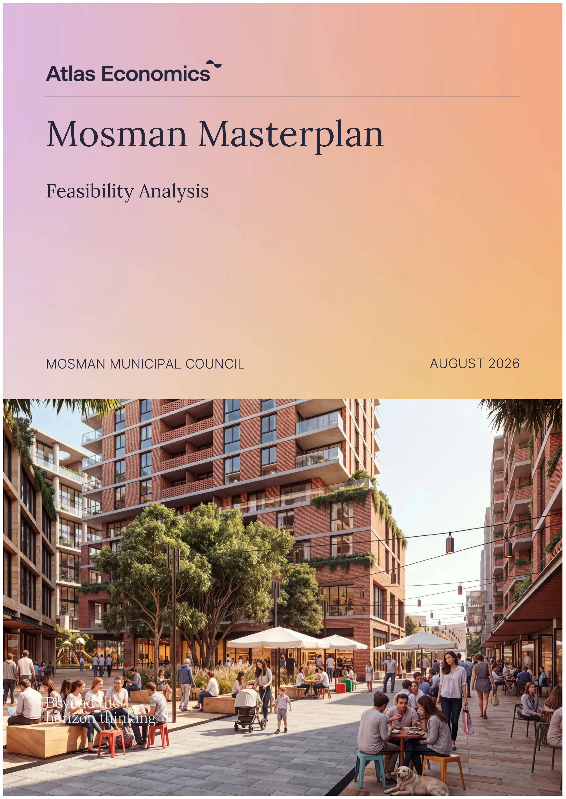

<!-- page 772 -->

Mosman Masterplan i

Document Control

JOB ID J535 JOB NAME Mosman Masterplan Feasibility Analysis

CLIENT Mosman Municipal Council CLIENT CONTACT Sarah Wallace

DOCUMENT NAME Mosman Masterplan Feasibility Analysis final draft LAST SAVED 17/08/2026 12:39 PM

VERSION DATE PREPARED BY REVIEWED BY

Draft 4 August 2026 Matt Ciurpita, Esther Cheong Esther Cheong

Revised draft 5 August 2026 Matt Ciurpita, Esther Cheong Esther Cheong

Final draft 17 August 2026 Matt Ciurpita, Esther Cheong Esther Cheong

Liability limited by a scheme approved under Professional Standards Legislation All care and diligence has been exercised in the preparation of this report. Forecasts or projections developed as part of the analysis are based on adopted assumptions and can be affected by unforeseen variables. Consequently, Atlas Urban Economics Pty Ltd does not warrant that a particular outcome will result and accepts no responsibility for any loss or damage that may be suffered as a result of reliance on this information.

August 2026

Attachment 1.1.7 Mosman Council

<!-- page 773 -->

Mosman Masterplan ii

## Executive Summary

Background

In accordance with the National Housing Accord, the NSW Government has committed to facilitating the delivery of 377,000 new homes by 2029 (which is equivalent to approximately 75,000 new homes annually).

 In July 2024, Stage 1 of the low and mid-rise (LMR) planning reforms was implemented, with dual occupancies and semi-detached dwellings permitted in the R2 Low Density Residential zone across NSW.

 In February 2025, Stage 2 of the LMR reforms commenced. The controls apply to nominated residential areas within 800m walking distance of town centres and/ or transport hubs, including at Spit Junction and Cremorne.

Mosman Council (Council) is preparing and implementing a place-based masterplan (Masterplan) as an alternative to the LMR policy. The Masterplan’s overarching objective is to redistribute the additional housing capacity under the LMR policy, delivering an equivalent quantum of housing while ensuring future growth is responsive to Mosman’s character, environmental setting and heritage values, and is supported by the required community infrastructure.

Atlas Economics (Atlas) is engaged by Council to carry out a financial feasibility analysis (the Study) to assist with development of the Masterplan and identify the Affordable Housing contribution and on-site public infrastructure requirements to accompany the implementation of new planning controls.

Mosman Masterplan

The Masterplan directs growth to the most appropriate locations while responding to local character, heritage values and environmental qualities. It prioritises housing near public transport and where services are available.

Table ES-1 summarises the key existing controls and those proposed by the Masterplan.

Table ES-1: Key Existing Controls and Proposed Planning Controls

AREA CURRENT ZONE

PROPOSED ZONE

CURRENT FSR (N=1)

PROPOSED FSR (N=1)

PROPOSED STOREYS EXPANSION OF E1 LOCAL CENTRE Spit Rd, Punch St E3 E1 2.0 4.0 12 Military Rd, Cowles Rd, Bond St E3 E1 2.0, 2.5 6.5 15 Military Rd, Lang St, Snell St, Prince St, Belmont Rd

E3 E1 2.0 5.0, 4.0 12, 8

Clifford St R3 E1 1.0 3.0 8 Cowles Rd SP2 E1 none 4.5 10 INTRODUCTION OF THE R4 ZONE Glover St R3 R4 1.0 4.0 8 Military Rd, Prince St R3 R4 1.0 3.3 12 Melrose St R3 R4 0.6 3.3 8 Art Gallery Way R3, SP2 R4 0.6, 1.0 3.5 8 Clifford St, Heydon St R3 R4 1.0 3.0 8 Spit Rd, Awaba St, Stanton St R3 R4 1.0 3.3 12 Bapaume Rd R3 R4 0.55 1.8 5 Spit Rd, Parriwi Rd, Warringah Rd R3 R4 0.7 2.5 8 REZONING TO THE R3 ZONE Prince St, Belmont Rd R2 R3 0.5, 0.6 1.5, 2.2 4, 6 Ourimbah Rd SP2 R3 none 2.2 6 Gouldsbury St SP2, R2 R3 None, 0.5 1.0 3

The Masterplan identifies a minimum non-residential FSR 1:1 requirement within specified sites in the heart of the Mosman retail core, and which are identified as ‘Key Sites’ for increased development capacity.

August 2026

Attachment 1.1.7 Mosman Council

<!-- page 774 -->

Mosman Masterplan iii

Feasibility Analysis

The feasibility of development varies depending on the cost of land. The cost of land is a function of its existing use (which along the Military and Spit Road corridor could be retail strip, low-rise office buildings, service commercial premises or residential strata buildings).

The Study acknowledges the reality that despite the Masterplan, not all land will be developed. There are sites where existing buildings are functional and valuable and not economic to consolidate for development. There will be other sites (e.g. less intensely developed or at the end of their economic useful life) that could be economic to consolidate for development, yet will not be developed as landowner motivations do not align with development.

There is a generally a direct relationship observed between the densities proposed by the Masterplan and the capacity of development to contribute to affordable housing.

A selection of sites in the Masterplan Area is tested to examine if development is likely to be feasible, and if so, the capacity of development to contribute to affordable housing.

The feasibility analysis shows that where sites can be secured at an economic price, the proposed planning controls would be feasible. The higher the density, the greater the headroom for affordable housing contributions.

The methodology, assumptions and testing outcomes are contained within the Study and in the schedules.

AFFORDABLE HOUSING CONTRIBUTION RATES

Council has prepared an Affordable Housing Contribution Scheme (AHCS) which proposes the following affordable housing contribution rates:

 Development under the MLEP - 2% residential GFA.

 Development under the LMR controls (Chapter 6, Part 4 Housing SEPP) - 3% residential GFA.

 In accordance with the Mosman Local Environmental Plan 2012 key sites clause and/ or affordable housing maps.

The Study finds there is generally capacity in the Masterplan Area to contribute to Affordable Housing at 3%, except:

 In the R2 Low Density Residential Area where medium density typologies are likely.

 On Key Sites where the on-site provision of community infrastructure is required, different rates could apply.

 On identified (mapped) sites where the proposed controls enable higher density/ development capacity and where different rates could apply.

Table ES-2 summarises the affordable housing contribution rates suggested in the Masterplan Area (beyond the 2% base rate proposed in the AHCS).

Table ES-2: Affordable Housing Contribution Rates

PROPOSED ZONE AFFORDABLE HOUSING CONTRIBUTION RATE E1 LOCAL CENTRE 3%-10% R4 HIGH DENSITY RESIDENTIAL 3% R3 MEDIUM DENSITY RESIDENTIAL 5%

Source: Atlas While sites within the Masterplan Area will be required to contribute to Affordable Housing (at varying rates of up to 10%), it is critical that the ensuing affordable housing outcomes are suitable and fit-for-purpose. The dedication of strata-titled units that are scattered in different buildings, designed and finished to a luxury specification and that are subject to high strata fees are not suitable.

Where monetary contributions are made, they would be calculated according to the equivalent monetary dollar rates specified in AHCS. The AHCS nominates dollar rates delineated by area in the Mosman LGA. This recognises that the value of dwellings is different within sub-areas of Mosman.

The Study takes a nuanced approach to the feasibility of development in the Study Area. This approach acknowledges that land use and density (using FSR as a proxy) is not necessarily the only indicator of a development’s capacity to contribute to affordable housing.

The nuanced setting of affordable housing contribution rates seeks to avoid a disproportionate impact on feasibility, which affects the likelihood of development occurring.

August 2026

Attachment 1.1.7 Mosman Council

<!-- page 775 -->

Mosman Masterplan iv

KEY SITES AND COMMUNITY INFRASTRUCTURE

The Study carries out feasibility testing to examine the capacity of the Key Sites to deliver the specified on-site infrastructure and/ or affordable housing contributions. Key Sites are not identified for any change in planning controls unless the required on-site public infrastructure items and land use outcomes are delivered.

Table ES-3: Key Sites, Planning Incentive and Planning Requirements

SITE COMMUNITY INFRASTRUCTURE PROPOSED ZONE

PROPOSED FSR (MIN. NON-RESIDENTIAL FSR)

AFFORDABLE HOUSING CONTRIBUTION

A 2,000sqm publicly accessible open space, through-site link

R4 3.2:1 0%

B

Through-site link, community facility (1,000sqm GFA, warm shell)

E1 6.0:1 0%

Through-site link E1 6.0:1 5%

C

Pedestrian bridge, through-site link 8.0:1 (1:1) 10% Pedestrian bridge, through-site link, community facility (1,000sqm GFA, warm shell)

E1 8.0:1 (1:1) 5%

D

Community facility (1,500sqm GFA, warm shell), through-site link

E1 8.0:1 0%

Through-site link E1 8.0:1 5%

E

Pedestrian bridge, through-site link E1 6.5:1 (1:1) 6% Pedestrian bridge, through-site link, community facility (1,500sqm GFA, warm shell)

E1 6.5:1 (1:1) 0%

F 1,500sqm open space, 267 public car spaces E1 7.0:1 (1:1) 0%

G Community facility (1,700sqm GFA, warm shell) E1 7.0:1 3% Nil E1 7.0:1 8%

H Community facility (1,400sqm GFA, warm shell) E1 8.0:1 3% Nil E1 8.0:1 8% J 3 indoor recreation courts E1 5.0:1 2%

Source: SJB The Masterplan identifies several sites which have the potential to provide for on-site community infrastructure and/ or affordable housing in exchange for a planning incentive. These include:

 Site A - publicly accessible open space.

 Site F - publicly accessible open space and public car spaces.

 Site J - indoor recreation centre.

 Sites B, C, D, E, G and H - community facility (warm shell, varying sizes) and/ or affordable housing contributions.

Details of the infrastructure, including specifications and timing, would be included in a future planning agreement. The Study recommends there is flexibility built into the public benefits provided by the developments on these sites.

The affordable housing contribution requirements have regard to, and are tested against the other infrastructure/ land use requirements for the Key Sites. In some cases, a key site is recommended for an affordable housing contribution at a modest 2% rate. In other cases, a nil affordable housing contribution requirement is applied, given its other planning obligation/s and material public benefit delivered.

The Study takes a nuanced approach to testing the feasibility of development. It acknowledges that the feasibility of development and that development’s capacity to contribute to affordable housing varies according to:

 The existing uses/ buildings and the likely cost to consolidate a development site.

 The value of a development opportunity (as enabled by the proposed Masterplan controls).

 The other planning obligations imposed on the development (e.g. on-site infrastructure requirements, minimum non-residential floorspace requirement).

An LEP clause will detail the additional floorspace and height available subject to provision of on-site infrastructure and/ or affordable housing contributions on specified sites.

August 2026

Attachment 1.1.7 Mosman Council

<!-- page 776 -->

Mosman Masterplan v

Table of Contents

Executive Summary ................................................................................................................................................................... ii

1  Introduction ............................................................................................................................................................................. 1

1.1 Background ....................................................................................................................................................................... 2

1.2 Scope and Approach....................................................................................................................................................... 2

1.3 Assumptions and Limitations ......................................................................................................................................... 3

2  Mosman Masterplan .............................................................................................................................................................. 4

2.1 Masterplan Drivers and Areas........................................................................................................................................ 5

2.2 Increased Development Capacity ................................................................................................................................ 7

2.3 Community Infrastructure and Key Sites ..................................................................................................................... 8

2.4 Summary of Proposed Planning Controls .................................................................................................................. 10

3  Feasibility Analysis................................................................................................................................................................ 11

3.1 Property Market Appraisal ............................................................................................................................................ 12

3.2 Factors Influencing Development Feasibility ............................................................................................................ 14

3.3 Generic Feasibility Testing .......................................................................................................................................... 16

3.4 Implications for Affordable Housing Contributions .................................................................................................. 21

4  Opportunities for the Masterplan ..................................................................................................................................... 22

4.1 Land Use Opportunities ............................................................................................................................................... 23

4.2 Community Infrastructure ........................................................................................................................................... 23

4.3 Affordable Housing Contribution Rates .................................................................................................................... 23

References ............................................................................................................................................................................... 25

Schedules

SCHEDULE 1 Analysis of Market Activity ..............................................................................................................................27

SCHEDULE 2 Generic Feasibility Testing Assumptions ..................................................................................................... 32

Tables

Table ES-1: Key Existing Controls and Proposed Planning Controls ................................................................................... ii

Table ES-2: Affordable Housing Contribution Rates ............................................................................................................ iii

Table ES-3: Key Sites, Planning Incentive and Planning Requirements ............................................................................ iv

Table 2-1: Key Existing Controls and Proposed Planning Controls ..................................................................................... 7

Table 2-2: Key Site Incentive Requirements ........................................................................................................................ 10

Table 3-1: Single/ Attached Dwellings Existing-use Values, Mosman .............................................................................. 13

Table 3-2: Residential Unit Blocks Existing-use Values, Mosman .................................................................................... 13

Table 3-3: Commercial Existing-use Values, Mosman ....................................................................................................... 14

Table 3-4: Key Sites, Planning Incentive and Planning Requirements ............................................................................ 20

Table S1-1: Sales of Existing Uses, Mosman and surrounds ..............................................................................................27

Table S1-2: Sales of New and Off-the Plan Apartments, Mosman and surrounds ........................................................ 28

August 2026

Attachment 1.1.7 Mosman Council

<!-- page 777 -->

Mosman Masterplan vi

Table S1-3: Sales of Retail/ Commercial Suites, Mosman and surrounds ....................................................................... 29

Table S1-4: Sales of Development Sites, Mosman and surrounds ................................................................................... 30

Table S2-1: Residential Development Typologies .............................................................................................................. 33

Table S2-2: Mixed Use Development Typologies .............................................................................................................. 33

Table S2-3: Unit Mix and Average Unit Sizes ..................................................................................................................... 33

Table S2-4: End Sale Values, Area A and Area B ............................................................................................................... 34

Figures

Figure 2-1: Character Areas ...................................................................................................................................................... 5

Figure 2-2: Mosman Masterplan, Land Use Framework ....................................................................................................... 6

Figure 2-3: Mosman Masterplan, Built Form Framework ...................................................................................................... 7

Figure 2-4: Community Infrastructure Delivery Strategy ..................................................................................................... 9

Figure 2-5: Key Sites Map (extract) ......................................................................................................................................... 9

Figure 3-1: The Residual Land Value Method ...................................................................................................................... 16

Figure 3-2: Feasibility of Shop top Housing Development, E1 Local Centre ................................................................... 18

Figure 3-3: Feasibility of Residential Flat Buildings, R4 zone ............................................................................................ 18

Figure 3-4: Feasibility of Residential Flat Buildings, R3 zone ............................................................................................ 19

Figure S2-1: Map of Area Grouping ...................................................................................................................................... 34

August 2026

Attachment 1.1.7 Mosman Council

<!-- page 778 -->

Mosman Masterplan 1

Mosman Masterplan

## 1

## Introduction

August 2026

Attachment 1.1.7 Mosman Council

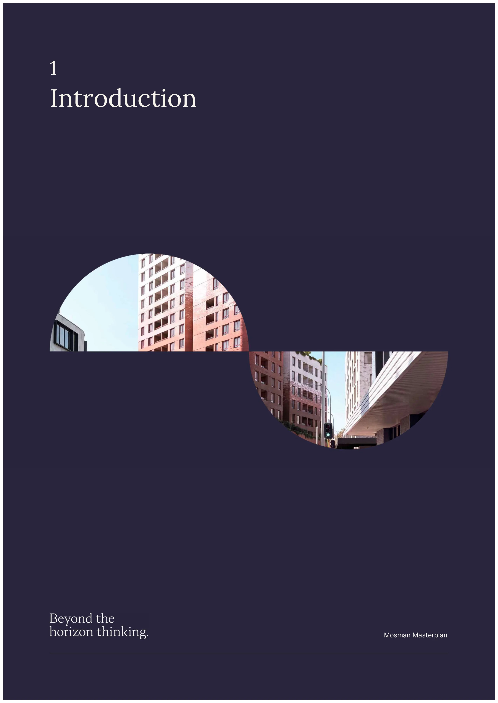

<!-- page 779 -->

Mosman Masterplan 2

#### 1.1 Background

In accordance with the National Housing Accord, the NSW Government has committed to facilitating the delivery of 377,000 new homes by 2029 (which is equivalent to approximately 75,000 new homes annually).

In July 2024, the first stage of the low and mid-rise (LMR) planning reforms was implemented, with dual occupancies and semi-detached dwellings permitted in the R2 Low Density Residential zone across NSW.

In February 2025, the second stage of the LMR planning reforms commenced, permitting a wider range of low and mid-rise housing development (subject to lot size and dimension requirements) in identified areas across NSW.

The Stage 2 LMR controls apply to nominated residential areas within 800m walking distance of town centres and train/ light rail stations. Collectively, there are 171 LMR Areas across metropolitan Sydney, including at Spit Junction (Mosman LGA) and Cremorne (part Mosman LGA and part North Sydney LGA).

Mosman Council (Council) are seeking to prepare and implement a place-based masterplan (Masterplan) as an alternative to the NSW Government’s LMR policy. The Masterplan’s overarching objective is to redistribute the additional housing capacity prescribed under the LMR policy, delivering an equivalent quantum of housing while ensuring future growth is responsive to Mosman’s character, environmental setting and heritage values, and is supported by the required community infrastructure.

Council engaged SJB to prepare the Mosman Masterplan which is a Council-led alternative to the LMR policy. The Masterplan incorporates an urban design framework which establishes a spatial strategy to guide future development and infrastructure outcomes and identifies the local planning controls required to implement the masterplan vision.

Atlas Economics (Atlas) is engaged by Council to carry out a financial feasibility analysis (the Study) to assist with development of the Masterplan and identify the Affordable Housing contribution and on-site public infrastructure requirements to accompany the implementation of new planning controls.

#### 1.2 Scope and Approach

The overarching objective of the Study is to investigate the capacity of development to contribute to affordable housing and on-site public infrastructure. The Study carries out a feasibility analysis of the Masterplan and its associated planning controls for development across the LGA.

The Study recognises that the development feasibility across the Masterplan Area will vary. Lot and ownership patterns as well as the nature of existing uses and buildings collectively influence the cost of site consolidation and the likelihood of development as a realistic and feasible proposition. These accordingly influence the feasibility of the proposed planning controls for development.

To fulfil the requirement of the brief, the Study carries out the following tasks:

 Review of the Masterplan, in particular the land uses and development typologies contemplated, the distribution of density and requirements for on-site public infrastructure on identified key sites.

 Market appraisal of market activity, including prices paid for completed space in new developments, for existing uses/ buildings and development sites.

 Feasibility testing of a sample of sites in the Masterplan Area to investigate if development is feasible, and where feasible, the capacity to contribute to affordable housing and/ or on-site community infrastructure.

 Aggregation of findings for the purposes of making recommendations on policy settings and implementation.

The Study will accompany a planning proposal to implement the Masterplan, including requirements for affordable housing contributions and on-site community infrastructure.

August 2026

Attachment 1.1.7 Mosman Council

<!-- page 780 -->

Mosman Masterplan 3

#### 1.3 Assumptions and Limitations

The Study carries out a generic feasibility assessment which makes a number of assumptions to enable observations to be made at an aggregate level across the Masterplan Area. The following limitations are highlighted:

 Economic uncertainty

Heightened global uncertainty and geopolitical risks have the potential to affect domestic inflation, interest rate expectations and investment confidence.

The residential property market has shown signs of softening, coinciding with interest rate rises and inflationary conditions. The recent Federal Budget is showing early signs of dampening market pricing in established residential markets, with lower transaction volumes and price declines observed in historically investor- dominated locations. In higher priced/ prestige markets (not generally the domain of investor stock), softening market conditions are also observed, albeit separate from investor activity and tax policy changes.

 Market appraisal and data analysis

Market analysis is carried out on a ‘desktop’ basis without the benefit of site inspections. Data from third party sources is assumed to be correct and is not verified.

 Feasibility analysis

The Study carries out a generic feasibility assessment which makes a number of assumptions to enable observations to be made at an aggregate level across the Masterplan. The following limitations are highlighted:

◦ It is not practically viable to examine the feasibility of every site. Sample sites are selected and notional development typologies are assumed (based on urban design work by SJB) for generic feasibility testing.

◦ Generic feasibility testing is based on high-level revenue and cost assumptions and does not consider site- specific factors typically considered in detailed feasibility analysis. If there are site-specific factors (e.g. geotechnical/ topography constraints) that affect the cost of development, the analysis could require revision.

◦ The cost of on-site infrastructure items required on Key Sites is estimated at a conceptual level from industry cost publications. The items are expected to require more detailed scoping and cost planning when they are delivered, to be executed in a planning agreement.

◦ A desktop appraisal of ‘as is’ or existing property values is carried out without the benefit of site inspections or property-specific financial information (e.g. rental income, investment returns, lease break clauses). The estimate of existing property values is made in the absence of site-specific information and is accordingly high-level and indicative only.

The observations of the generic feasibility testing are aggregated to consider location-specific factors that influence the feasibility of development in the Masterplan Area.

Notwithstanding the assumptions made and limitations of generic feasibility testing, the Study aims to provide guidance on the appropriateness of affordable housing contribution and on-site public infrastructure if the Masterplan were implemented.

August 2026

Attachment 1.1.7 Mosman Council

<!-- page 781 -->

Mosman Masterplan 4

Mosman Masterplan

## 2

## Mosman Masterplan

August 2026

Attachment 1.1.7 Mosman Council

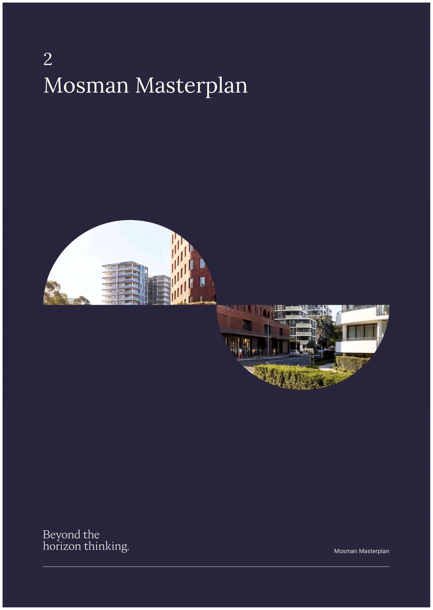

<!-- page 782 -->

Mosman Masterplan 5

#### 2.1 Masterplan Drivers and Areas

The urban design technical study (SJB) is underpinned by a vision which identifies areas that are best suited for change to accommodate additional housing. The Masterplan directs growth to the most appropriate locations while responding to local character, heritage values and environmental qualities.

The Masterplan is guided by the following drivers:

 Prioritise housing near public transport and services

Concentrates higher-density housing in the most accessible locations, within walking distance of public transport and local services, particularly along the Military and Spit Road corridor and at Spit Junction.

 Plan strategically for long-term community needs

Ensures growth is supported by the right infrastructure by planning for open space, facilities, pedestrian links and local services, securing public benefits alongside additional density.

 Safeguard the scenic protection area

 Provide a gradual height transition

 Protect heritage conservation areas and minimise impact on heritage items

 Protect mature trees, especially street trees

 Strengthen and include local centres

Focuses renewal and additional growth in local centres where services already exist and to boost business activity and mixed use, replace tired low-scale buildings with high quality development.

In response, the Masterplan seeks to reduce impact on, and limit development around heritage conservation areas and within the scenic protection zone. Housing is prioritised near public transport and where services are available. Character areas are identified, with each of these character areas envisaged for varying levels and nature of change.

Figure 2-1: Character Areas

Source: SJB

August 2026

Attachment 1.1.7 Mosman Council

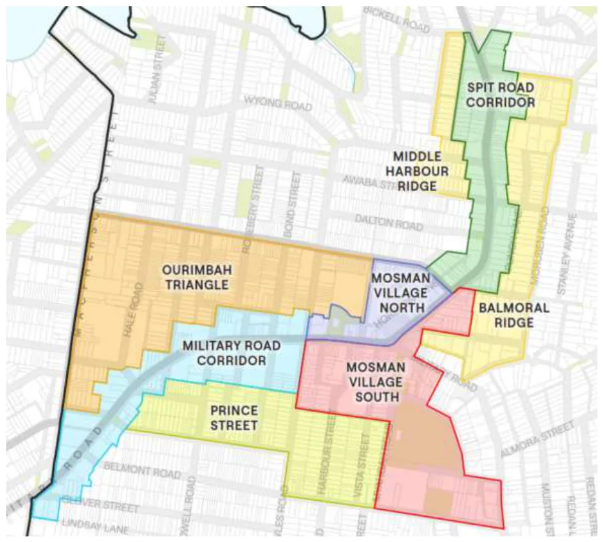

<!-- page 783 -->

Mosman Masterplan 6

Key elements of the Masterplan design approach are to enable:

 Military Road/ Spit Road as the main growth corridor.

 Spit Junction as a gateway, with improvements that strengthen its role as the retail core of Mosman.

 Better connections between retail centres, open spaces and schools, using new through-site links, shared ways and more pedestrian-friendly streets.

 An expanded Village Green and new community infrastructure.

 New local parks and pocket parks in locations where development is likely to occur.

Figure 2-2 illustrates the Masterplan’s distribution of built form and land use. It focuses increased density within close proximity to Mosman’s retail and civic heart, where residents can readily access shops, services, employment and community facilities.

Figure 2-2: Mosman Masterplan, Land Use Framework

Source: SJB The Masterplan will require changes to the Mosman Local Environmental Plan (MLEP) 2012. These include land use zones, height and floorspace ratio (FSR) controls. Through a formalisation of the local centre zone and higher densities, the Masterplan seeks to reinforce Mosman’s role as a place for services, employment, retail and civic activity.

The density and heights envisaged in the Masterplan are shown in Figure 2-3.

August 2026

Attachment 1.1.7 Mosman Council

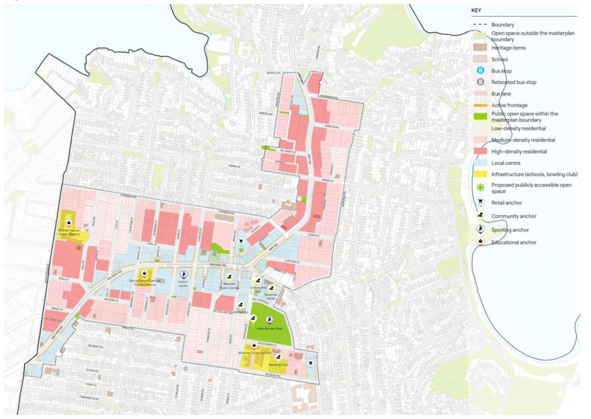

<!-- page 784 -->

Mosman Masterplan 7

Figure 2-3: Mosman Masterplan, Built Form Framework

Source: SJB

#### 2.2 Increased Development Capacity

The Masterplan seeks to increase development capacity in targeted areas, with planning amendments to include:

 Expansion of the E1 Local Centre zone on both sides of Military Road and a portion of Spit Road - through a rezoning of E3 Productivity Support, R3 Medium Density Residential and SP2 land.

 Introduction of R4 High Density Residential zone - through a rezoning of R3 Medium Density Residential land.

 Rezoning of R2 Low Density Residential to R3 Medium Density Residential.

 Rezoning of SP2 land to E1 Local Centre, R3 Medium Density Residential and R4 High Density Residential.

Table 2-1 summarises the key planning amendments to the MLEP to implement the Masterplan.

Table 2-1: Key Existing Controls and Proposed Planning Controls

AREA CURRENT ZONE

PROPOSED ZONE

CURRENT FSR (N=1)

PROPOSED FSR (N=1)

PROPOSED STOREYS EXPANSION OF E1 LOCAL CENTRE Spit Rd, Punch St E3 E1 2.0 4.0 12 Military Rd, Cowles Rd, Bond St E3 E1 2.0, 2.5 6.5 15 Military Rd, Lang St, Snell St E3 E1 2.0 5.0 12 Military Rd, Prince St, Belmont Rd E3 E1 2.0 4.0 8 Clifford St R3 E1 1.0 3.0 8 Cowles Rd SP2 E1 none 4.5 10

August 2026

Attachment 1.1.7 Mosman Council

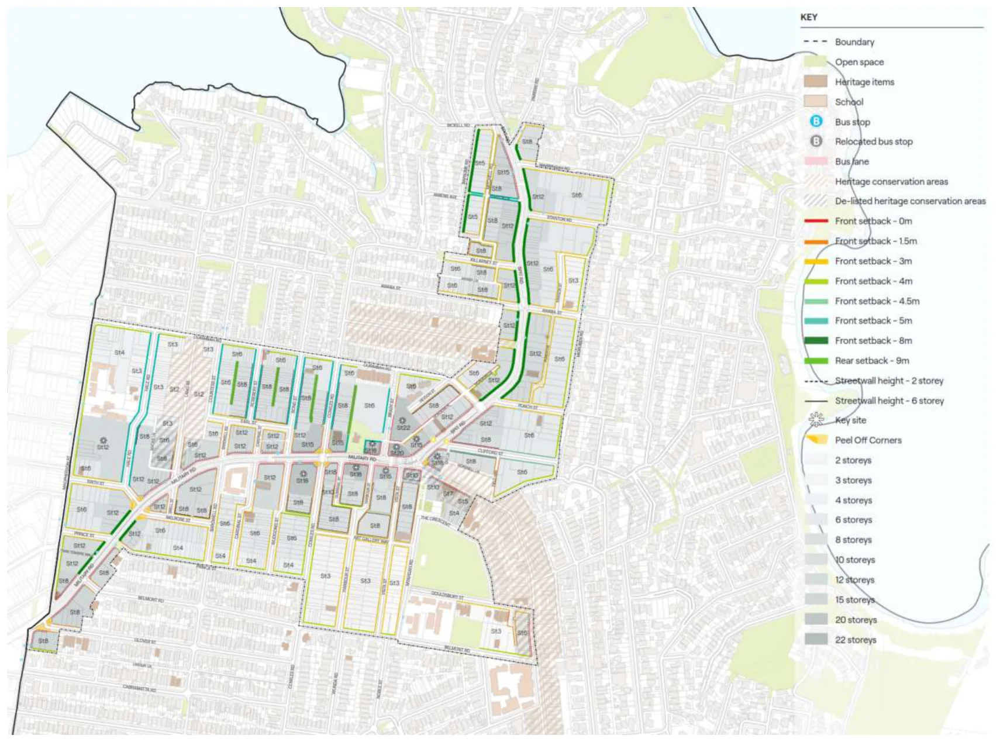

<!-- page 785 -->

Mosman Masterplan 8

AREA CURRENT ZONE

PROPOSED ZONE

CURRENT FSR (N=1)

PROPOSED FSR (N=1)

PROPOSED STOREYS INTRODUCTION OF THE R4 ZONE Glover St R3 R4 1.0 4.0 8 Military Rd, Prince St R3 R4 1.0 3.3 12 Melrose St R3 R4 0.6 3.3 8 Art Gallery Way R3, SP2 R4 0.6, 1.0 3.5 8 Clifford St R3 R4 1.0 3.0 8 Heydon St R3 R4 1.0 3.0 8 Spit Rd, Awaba St, Stanton St R3 R4 1.0 3.3 12 Bapaume Rd R3 R4 0.55 1.8 5 Spit Rd, Parriwi Rd, Warringah Rd R3 R4 0.7 2.5 8 REZONING TO THE R3 ZONE Prince St, Belmont Rd R2 R3 0.5, 0.6 1.5, 2.2 4, 6 Ourimbah Rd SP2 R3 none 2.2 6 Gouldsbury St SP2, R2 R3 None, 0.5 1.0 3

Source: SJB Primary active frontages will be required along street frontages within the local centre, where no vehicular access and no residential uses (except residential lobby access) will be permitted. In secondary active frontages (off the main arterial roads of Military Road and Spit Road), lobby and vehicular access will be permitted.

The active street frontage requirement would therefore require at least the ground floor of mixed use development in the E1 Local Centre zone to be a non-residential use.

The Masterplan identifies a minimum non-residential FSR 1:1 requirement within developments of three sites – 8 Heydon Street, 555 Military Road as well as 656-658 Military Road and 2-6 Spit Road. These sites are located in the heart of the Mosman retail core and are identified as ‘Key Sites’ for increased development capacity.

#### 2.3 Community Infrastructure and Key Sites

The Masterplan leverages local planning provisions applicable to key development sites to facilitate the provision of community infrastructure on-site in exchange for a planning incentive. Local incentive planning provisions are intended to facilitate the on-site provision of:

 Three indoor sports courts.

 Five additional community facilities.

 A 2,000sqm publicly accessible open space.

 A 1,500sqm publicly accessible open space.

 Pedestrian bridge over Military Road.

 Publicly accessible through-site links increasing pedestrian accessibility and permeability along long blocks.

Separate to the key sites planning mechanism, the Masterplan envisages the following community facilities within a proposed civic precinct. The delivery of these facilities will be Council-led on Council-owned or dedicated land.

 A new Mosman library incorporating a youth centre, seniors centre and flexible community spaces.

 An expanded and enhanced Village Green featuring an upgraded playground and an outdoor performance stage.

Figure 2-4 indicates the location of various items of community infrastructure contemplated in the Masterplan.

August 2026

Attachment 1.1.7 Mosman Council

<!-- page 786 -->

Mosman Masterplan 9

Figure 2-4: Community Infrastructure Delivery Strategy

Source: SJB The location of the identified Key Sites is illustrated in Figure 2-5. These sites are only identified for a change in planning controls if the required on-site public infrastructure items are delivered.

Figure 2-5: Key Sites Map (extract)

Source: SJB Table 2-2 lists the Key Sites and the on-site infrastructure required to access the planning incentive.

August 2026

Attachment 1.1.7 Mosman Council

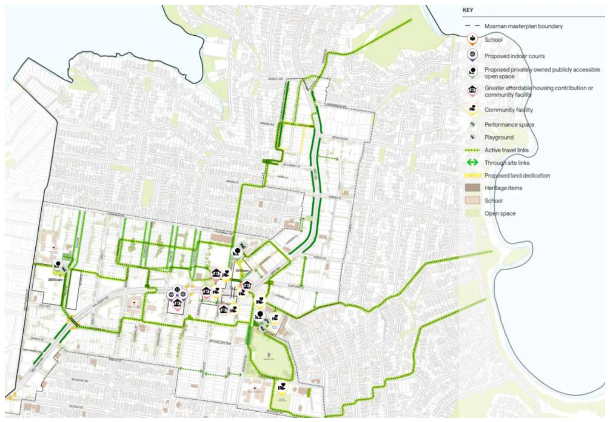

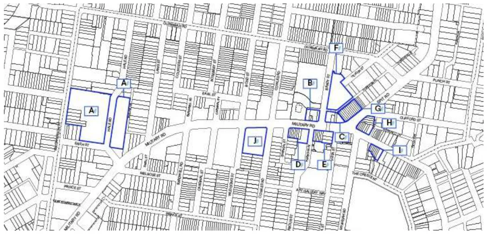

<!-- page 787 -->

Mosman Masterplan 10

Table 2-2: Key Site Incentive Requirements

SITE COMMUNITY INFRASTRUCTURE CURRENT ZONE

PROPOSED ZONE

CURRENT FSR

PROPOSED FSR (MIN. NON-RESIDENTIAL FSR) A 2,000sqm open space, through-site link R2, R3 R4 0.5:1, 0.7:1 3.2:1

B Through-site link, community facility (1,000sqm GFA, warm shell*)

E1 E1 2.5:1 6.0:1

C

Pedestrian bridge, through-site link, community facility (1,000sqm GFA, warm shell*)

E1 E1 2.5:1 8.0:1 (1:1)

D Community facility (1,500sqm GFA, warm shell*), through-site link

E1 E1 2.5:1 8.0:1

E

Pedestrian bridge, through-site link, community facility (1,500sqm GFA, warm shell*)

E1 E1 2.5:1 6.5:1 (1:1)

F 1,500sqm open space, 267 public car spaces E1 E1 2.5:1 7.0:1 (1:1)

G Community facility (1,700sqm GFA, warm shell*)

E1 E1 2.5:1 7.0:1

H Community facility (1,400sqm GFA, warm shell*)

E1 E1 2.5:1 8.0:1

J 3 indoor recreation courts E3 E1 2.0:1 5.0:1

Source: SJB *warm shell refers to a commercial building delivered with principal base-building services, including heating, ventilation and air-conditioning (HVAC), electrical distribution, plumbing, fire and lift safety systems, finished core areas and basic internal finishes. The premises would be suitable for tenant fit out but are not fitted out for a specific occupier.

#### 2.4 Summary of Proposed Planning Controls

The Masterplan will require changes to the MLEP. These include land use zones, building height and FSR. Additionally, the following key provisions would be introduced in the MLEP:

 Active frontages within the E1 Local Centre zone

An active frontage requirement along key road corridors (as indicated by the Active Frontages map). The Masterplan proposes to introduce primary and secondary active frontages.

 Minimum lot sizes and frontage

The minimum lot size requirements will be amended to facilitate the intended development typologies and densities. In addition, minimum lot widths will be introduced to residential flat buildings and shop top housing developments.

 Key sites

Key sites can accommodate increased height and floorspace in exchange for the provision of on-site public infrastructure and/ or affordable housing (as specified).

The MLEP amendments could require supporting amendments to the Mosman Development Control Plan 2012.

The next chapter investigates feasibility and the capacity of development to contribute to on-site public infrastructure and affordable housing.

August 2026

Attachment 1.1.7 Mosman Council

<!-- page 788 -->

Mosman Masterplan 11

Mosman Masterplan

## 3

## Feasibility Analysis

August 2026

Attachment 1.1.7 Mosman Council

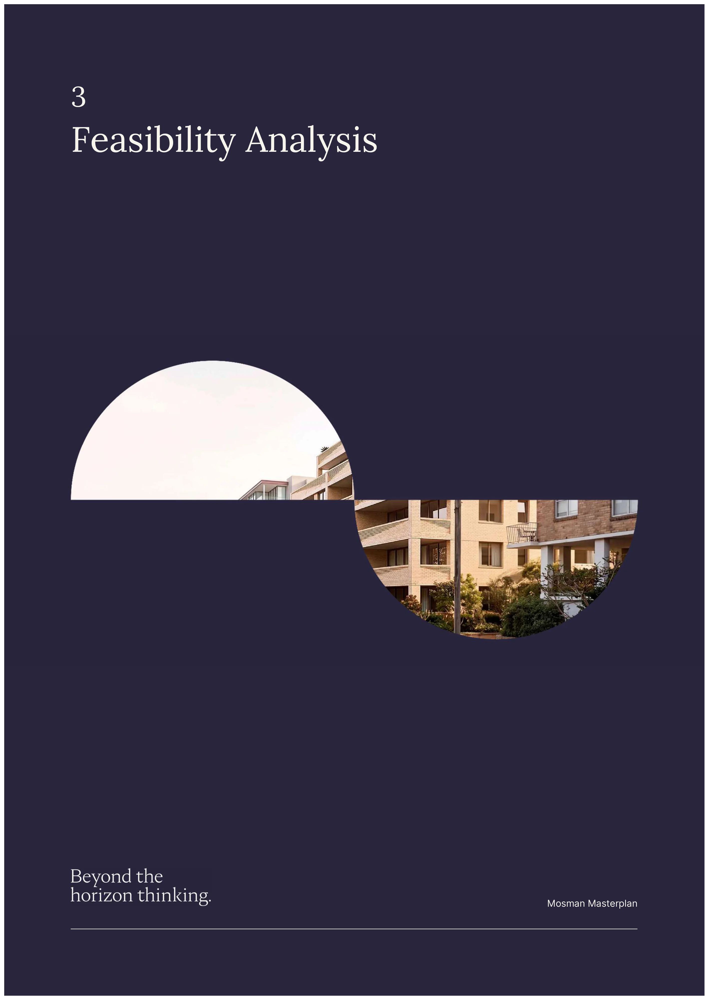

<!-- page 789 -->

Mosman Masterplan 12

#### 3.1 Property Market Appraisal

This chapter undertakes a feasibility analysis to examine if the Masterplan could result in feasible development, and if so, the affordable housing contributions that could be made. The feasibility analysis relies on an analysis of property market activity in the Masterplan Area.

#### 3.1.1 Analysis of Market Activity

The market appraisal recognises that Mosman is comprised of various sub-markets, which each reflecting their location and associated amenity offer.

 Military and Spit Road corridor is characterised by varying levels of high volumes of vehicular traffic, being Mosman’s main access roads. Land here is generally zoned a mix of E1 Local Centre, E3 Productivity Support and R3 Medium Density Residential.

 Northern slopes include the land to the north of Ourimbah Road and west of Spit Road. Land is generally zoned R2 Low Density Residential, R3 Medium Density Residential and C4 Environmental Living.

 Southern/ Balmoral slopes encompass the land to the east of Moruben Road and south of Belmont Road. Similar to the Northern slopes, land is generally zoned R2 Low Density Residential, R3 Medium Density Residential and C4 Environmental Living.

Each of the sub-markets exhibit different characteristics. The Military and Spit Road corridor is characterised by commercial uses and apartment blocks while the Northern slopes and Southern/ Balmoral slopes are characterised by a greater proportion of single dwellings.

The majority of residential development activity has historically occurred in the Military and Spit Road corridor.

LOT PATTERNS AND EXISTING USES/ BUILDINGS

The value of land in Mosman is influenced by a myriad of factors. Principally, the value of land is different depending on whether it is residential or commercial. That land could be improved with single or medium density dwellings, apartments, retail strip or commercial buildings, civic or community facilities.

 In the R2 zone, land is generally improved by detached dwellings and some retirement living complexes. Allotment sizes are relatively large due to the prevalence of detached dwellings. The greatest quantum of R2 zoned land is in the Southern/ Balmoral slopes.

 In the R3 zone, land is also improved by single dwellings (albeit on smaller allotment sizes), with a prevalence of apartment blocks (predominately held under strata title). The tallest buildings are generally up to 10 storeys (on the fringe of Spit Junction). The R3 zone is dispersed across the sub-markets.

 In the C4 zone, land is also dominated by single dwellings on large blocks (noting that low-rise apartment blocks are common along Balmoral Beach). Parcels of C4 land are commonly observed along the harbour foreshore.

 In the E1 zone, the nature of lot patterns and existing buildings varies:

◦ Along Military Road and Spit Road - up to 5 storeys with ground level retail or commercial suites and residential towers (up to 9 storeys) in the northern area.

◦ Around Spit Junction and Mosman Village (strip retail with residential or commercial above, generally 2-3 storeys).

 In the E3 zone along Military Road (to the east of Spit Junction) lot patterns and existing buildings also vary:

◦ Automotive related uses such as car dealerships (Toyota, Volvo, Audi and Mercedes-Benz), car wash and servicing.

◦ Purpose built office and commercial strata buildings with ground level commercial suites (4 storeys).

The nature and intensity of existing buildings underpin their value and consequently the cost to consolidate a development site.

August 2026

Attachment 1.1.7 Mosman Council

<!-- page 790 -->

Mosman Masterplan 13

EXISTING RESIDENTIAL USES

In residential zones, the factors which influence the value of existing dwellings include location, block size, quality and size of the improvements (i.e. number of bedrooms, bathrooms, etc.).

The values of existing dwellings vary and can range from $4 million (small block) to upwards of $12 million (larger block). When analysed on a dollar rate per square metre of overall improved site area, the sale prices generally reflect a range as summarised in Table 3-1.

Table 3-1: Single/ Attached Dwellings Existing-use Values, Mosman

LOCATION AVERAGE SALE PRICE ANALYSIS ($/SQM IMPROVED SITE AREA) Large Block Medium Block Small Block Large Block Medium Block Small Block Military and Spit Road corridor

$4m-$6m (500sqm)

$5m-$7m (400sqm)

$5m-$8m (300sqm)

$7,500- $12,500

$12,500- $17,500

$17,500- $25,000 Northern slopes $8m-$12m (800sqm)

$5m-$7m (500sqm)

$8m-$10m (400sqm)

$10,000- $15,000

$15,000- $20,000

$20,000- $25,000 Southern/ Balmoral slopes

$8m-$12m (800sqm)

$8m-$10m (500sqm)

$9m-$12m (400sqm)

$10,000- $15,000

$15,000- $22,500

$22,500- $30,000

Source: Atlas Key observations to note:

 There is a residential price hierarchy. All things being equal, residential property values are higher in the Southern/ Balmoral slopes compared to the Northern slopes.

 In the Military and Spit Road corridor, residential sale prices are lower in dollar terms (e.g. $4m-$6m for a large block compared to $8m-$12m for a large block in the Northern and Southern/ Balmoral slopes).

 There is an inverse relationship between value of a single dwelling and block size. All things being equal, the larger the block, the lower the property value (per sqm of site area). Furthermore, the larger the block, the lower the need for consolidation of multiple allotments. This has direct implications for the cost of land to a developer.

If a large single dwelling block was able to be secured, no amalgamation may be necessary. If smaller blocks were secured, there could be a minimum of two or three lots required for a development site of workable scale. It could conceivably cost upwards of $20,000/sqm of overall improved site area to secure several dwellings, before any premium incentive/ inducement to the landowner.

There are many strata titled unit blocks in Mosman. Some are large (up to 100 apartments) while others can be small (fewer than 10 apartments). Depending on the number of strata units and how intensely utilised a site is, the existing- use value of a strata-titled complex (on a rate per square metres of improved site area) would vary. This has direct implications on the cost of land to a developer and the density required for feasible development.

There is a history of strata titled units successfully consolidated. The key to economic consolidation is less about the number of units but the relative value of a development opportunity to the cost required to consolidate.

The existing-use values of a strata complex range significantly based on the area of site utilisation and the age of the building. The Military and Spit Road corridor accommodates the majority of the recent strata development in Mosman. As a result, the highest upper bound of existing-use values is recorded in this area.

Table 3-2 provides a range of the prices paid to assemble apartment blocks in Mosman, ranging from $7,500/sqm to $25,000/sqm of overall improved site area.

Table 3-2: Residential Unit Blocks Existing-use Values, Mosman

LOCATION ANALYSIS ($/SQM IMPROVED SITE AREA) Low High Military and Spit Road corridor $10,000 $25,000 Northern slopes $7,500 $15,000 Southern/ Balmoral slopes $7,500 $15,000

Source: Atlas

August 2026

Attachment 1.1.7 Mosman Council

<!-- page 791 -->

Mosman Masterplan 14

EXISTING COMMERCIAL USES

Mosman has a diverse range of commercial land uses. Along Military and Spit Roads there are fine grain, retail strip properties and larger allotments which accommodate automotive and related services. There are also some low- rise commercial buildings some with a medical focus along Military Road.

The values of existing commercial properties vary according to the quantum of lettable floorspace and the level of functional utility - which is a function of exposure, visibility and quality of accommodation.

When analysed on a dollar rate per square metre of improved site area, the sale prices reflect a wide range, as summarised in Table 3-3. The existing-use values of commercial properties (on a per square metre basis) reflects the level of site utilisation and number of storeys, as well as the location of the building.

All else being equal, commercial properties in the Mosman Village record higher existing-use values when compared with Spit Junction. The lowest existing-use values are typically observed on the fringe of Spit Junction.

Table 3-3: Commercial Existing-use Values, Mosman

LOCATION ANALYSIS ($/SQM IMPROVED SITE AREA) Low High Mosman Village $20,000 $30,000 Spit Junction $10,000 $20,000 Spit Junction Fringe $10,000 $15,000

Source: Atlas For an analysis of recent sales activity by land use and location refer to Schedule 1.

#### 3.1.2 Analysis of Development Site Sales

There has been significant development site sales activity in the Mosman LGA over the last 12-18 months. Much of this activity has been driven by the development opportunity presented by the LMR controls.

The prices paid for development sites varies according to whether a site lends itself to a luxury product (e.g. single floor units with sweeping views of the city skyline and harbour). Prices paid for development sites are as follows:

 Limited harbour/ CBD views - $7,000/sqm to $10,000/sqm GFA.

 Extensive harbour/ CBD views - $10,000/sqm to $18,000/sqm GFA.

Until recently, development activity has been small in scale. Wherever possible, development is generally positioned at the luxury end of the market. This enables development to overcome the issue of high construction costs.

For a more detailed analysis of development site sales activity refer to Schedule 1.

#### 3.2 Factors Influencing Development Feasibility

In existing urban areas, a variety of factors influence the feasibility of development. Arguably, the largest challenge in existing urban areas is the high cost of land. The following are a selection of factors that affect the feasibility of development in the Masterplan Area.

LAND VALUES AND SITE CONSOLIDATION

To economically acquire and develop land, the value of a site as a development prospect must exceed its value in existing use. Development will only occur if a proposed use is valuable enough to displace its existing use. For instance, while many existing buildings may be aged, they may still be providing a good level of functional utility and be relatively valuable. Furthermore, where there are long-term tenants and long leases, vacant possession of development may be costly and not be immediately forthcoming.

Consequently, the acquisition of land for development can be a high-risk and high-resource activity, particularly where numerous sites have to be amalgamated prior to development. Where multiple properties are required, the payment of incentives over and above market value is required to incentivise landowners to sell their properties.

The issue of site consolidation is particularly relevant in the Masterplan Area where allotment sizes are small and multiple lots are required, necessitating the payment of amalgamation premiums to incumbent landowners.

August 2026

Attachment 1.1.7 Mosman Council

<!-- page 792 -->

Mosman Masterplan 15

SITE POSITION AND AMENITY

The ridgeline (along Military and Spit Roads) is the highest point in the Masterplan Area. Furthermore, the greatest building height controls are also proposed for the Military and Spit Road corridor. The combination of these two factors could enable harbour and Sydney CBD views and assist with the feasibility of development.

Notwithstanding its elevated position in parts, the Military and Spit Road corridor can be a harsh environment given the significant volume of daily vehicle movements. This places a limit on achievable prices at the luxury end of product type, particularly in the lower building levels in the Military and Spit Road corridor.

COST OF CONSTRUCTION

The cost of construction increases as buildings become taller due to additional engineering and building and fire compliance requirements (e.g. service shafts, fire escapes, etc). The cost to construct buildings up to 3 storeys, 8 storeys, 10-20 storeys and 20-40 storeys is different for these reasons. The taller the building, the greater the requirement for vertical transportation, fire safety and evacuation and basement parking.

The construction of basements is expensive and depending on geotechnical ground conditions, the construction cost can be in the order of $100,000 per space.

The cost of construction has been under significant upward pressure in the last 48 months. There are signs that cost rate escalations have begun to settle. This does not mean construction cost prices will return to their previous levels, merely that annual cost rises will be circa 3%-4%, down from their past increases in excess of 10% per annum.

LAND USE CONTROLS

The Masterplan envisages that ground floor non-residential uses would be required in the E1 Local Centre zone. Non-residential uses would only be required along streets identified in the ‘active frontages’ map. This has direct implications for the financial feasibility of development given that residential floorspace is generally more valuable than non-residential floorspace.

The Masterplan envisages a grading of density and heights, focusing this along and off the Military and Spit Road corridor. While the proposed land use controls are comparatively denser than the MLEP controls, the feasibility of development is not necessarily a given due to the cost to consolidate a site that might already be improved with valuable commercial buildings.

IMPLICATIONS FOR THE MASTERPLAN AREA

Development feasibility within the Masterplan Area is a trade-off between site amalgamation, amenity offer and available planning controls. As is the case in existing urban areas, securing land for development requires the displacement of functional and occupied commercial buildings, which can be held in fragmented ownership patterns. This brings with it cost and risk. The Masterplan is cognisant of this context, and accordingly envisages a distribution of density that would support economic consolidation and development.

The corridor’s elevated ridgeline position together with heights in the Masterplan could unlock premium end-sale values on the upper levels, thereby assisting to offset the lower pricing of apartments on lower building levels.

The market analysis observes that the pricing of new residential product is tiered by location and by amenity.

 Locations around Military and Spit Road corridor are observed to achieve pricing from $20,000/sqm to $30,000/sqm of net saleable area (NSA), averaging $25,000/sqm. These areas enjoy excellent accessibility and retail amenity and can capture views of the harbour depending on position on the ridgeline. These areas are referred to as “Area A”.

 Locations with available harbour views achieve higher pricing from $25,000/sqm to $40,000/sqm of NSA. Some sites could lend themselves to higher sale prices (exceeding $40,000/sqm), however these depend on site- specific attributes, site elevation, etc. This is referred to as “Area B”.

The Study is cognisant of the varying nature of desirability and market appeal of residential product in different parts of the Masterplan Area. Locations west of Military Road and Spit Road (north of Avenue Road) are referred to as “Area A” whereas locations east of Military Road and Spit Road (south of Avenue Road) are referred to as “Area B”. A map illustrating these areas is in Schedule 2.

While the Masterplan envisages higher densities (compared to the MLEP), the extent to which development is feasible and attractive to pursue will depend on the existing uses/ buildings (and the consequent cost of land).

The next section carries out feasibility testing of the proposed Masterplan planning controls.

August 2026

Attachment 1.1.7 Mosman Council

<!-- page 793 -->

Mosman Masterplan 16

#### 3.3 Generic Feasibility Testing

The financial feasibility analysis relies on the Residual Land Value approach. The approach involves assessing the value of the completed product, making a deduction for development costs and making a further deduction for profit and risk while ensuring the development achieves a target profit margin and target return (or the ‘hurdle rates’).

The amount that a development can afford to pay for land is a ‘residual’, i.e. the amount that remains after development costs are deducted and target hurdle rates are achieved. The residual land value (RLV) is the maximum price a developer could pay for a development site under the Masterplan whilst achieving target hurdle rates.

For there to be an incentive to develop, the RLV must exceed the cost of land. The cost of land includes: a site’s existing value which is influenced by its improvements and ownership patterns, and the costs that may be necessary to secure vacant possession (e.g. incentive premium/s to landowner, lease break payments). Therefore, the value of existing uses, premium and any other costs that a developer may need to be pay to consolidate a development site, are fundamental to the feasibility equation of new development.

The Study reviews the patterns of existing uses and identifies a selection of sites in the Masterplan Area for generic feasibility testing. The sites selected are intended to be representative of sites proposed for new planning controls.

Notional development yields are formulated for the purposes of generic testing. The cost to purchase individual properties (including an incentive premium) within a development site is estimated from an analysis of sales activity.

There are three key steps in the generic feasibility testing:

 Step 1: Assess the ‘as is’ value of a selected site under the current planning framework plus an incentive premium a developer would likely need to pay in addition to secure the site. This is referred to as “the cost of land”.

 Step 2: Carry out feasibility modelling to identify the RLV of a development site assuming the planning controls proposed by the Masterplan. If the RLV is higher than the assumed cost of land (in Step 1), the tested development is feasible to develop. If the RLV is lower than the assumed cost of land, there will be no incentive for a change in use and the site will remain ‘as is’. The step is referred to as the ‘baseline feasibility’.

 Step 3: If feasible, iteratively test for affordable housing contributions that could be made (additional to other requirements which could include on-site infrastructure). Affordable housing contributions can be made as a completed dwelling/s (representing sales revenue that is forgone) or as an equivalent monetary contribution. For the purposes of the modelling, affordable housing is assumed in the form of sales revenue foregone.

Figure 3-1 illustrates the concept of the Residual Land Value method (also known as the Hypothetical Development).

Figure 3-1: The Residual Land Value Method

Source: Atlas

August 2026

Attachment 1.1.7 Mosman Council

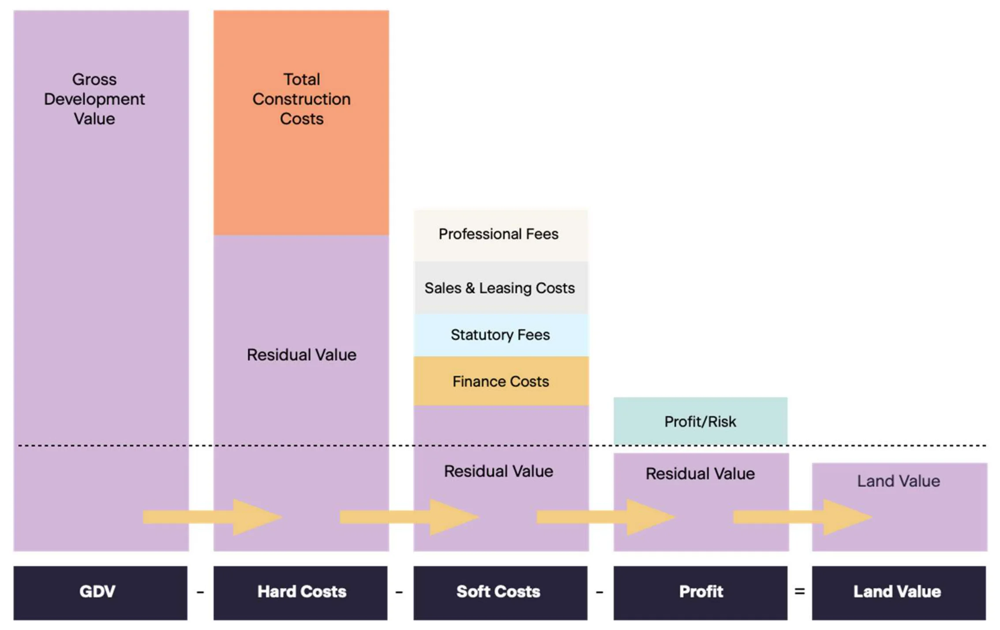

<!-- page 794 -->

Mosman Masterplan 17

SELECTION OF SITES FOR TESTING

A selection of sites is tested to examine if development is likely to be feasible, and if so, the capacity of development to contribute to affordable housing and/ or community infrastructure (as relevant).

In a series of graphs, the feasibility of development is shown and compared against:

 the assumed cost of land (value of a site plus incentive premium).

 the RLV of development under the proposed controls and planning obligations (all statutory fees and charges).

◦ No affordable housing contributions.

◦ With affordable housing contributions (and/ or on-site community infrastructure where relevant), iteratively tested to be tolerable.

The RLV represents the price a developer could afford to pay for the site for development. If the RLV is higher than the assumed cost of land, development is feasible as it is valuable enough to ‘displace’ the existing uses. If the RLV is lower than the assumed cost of land, there will be no incentive for development and the site will remain ‘as is’.

Refer to Schedule 1 for an analysis of market activity which underpins the revenue assumptions in the feasibility modelling. Schedule 2 contains more detailed assumptions made in the feasibility modelling.

#### 3.3.1 Masterplan Area

The Masterplan envisages the following planning change, with the highest densities proposed in and around the Military and Spit Road corridor. The key changes are broadly as follows:

 Rezoning of existing R3 Medium Density Residential and E3 Productivity Support to E1 Local Centre to permit mixed use development at densities of:

◦ Along Military Road and Spit Road - FSR 3.3:1 to 5.0:1 (8 to 12 storeys)

◦ Northern side of Military Road (around Cowles Road and Brady Street) - FSR 6.5:1 (15 storeys)

◦ Southern side of Military Road (corner Cowles Road) - FSR 8.0:1 (18 storeys)

◦ Military Road (corner Belmont Road) - FSR 4.0:1 (8 storeys)

 Rezoning of existing R3 Medium Density Residential to R4 High Density Residential to permit residential flat buildings at densities of FSR 3.0:1 to 3.3:1 (8 storeys).

 Rezoning of existing R2 Low Density Residential to R3 Medium Density Residential to permit residential flat buildings at densities of FSR 1.5:1, 1.8:1 and 2.2:1 (4 to 6 storeys).

 Rezoning of SP2 land to E1 Local Centre, R3 Medium Density and R4 High Density to permit mixed use development and residential flat buildings.

Several sites are identified as ‘Key Sites’, that is, having the potential to deliver on-site infrastructure and/ or affordable housing in return for a planning incentive. These Key Sites are examined separately in section 3.3.2.

TESTING OUTCOMES

A selection of sites in the Masterplan Area is tested to examine if development is likely to be feasible, and if so, the capacity of development to contribute to affordable housing.

In this section, a series of graphs show the feasibility testing outcomes of mixed use development (shop top housing) in the E1 zone and residential flat buildings in the R3 and R4 zones:

 Baseline feasibility (with no affordable housing contributions) - comparing an assumed cost of land (value of the site plus incentive premium) against the RLV of development at the planning controls proposed in the Masterplan.

 Feasibility of development with affordable housing contributions - comparing the assumed cost of land against the RLV of the development, including affordable housing contributions.

The RLV represents the price a developer could afford to pay for the site for development. If the RLV is higher than the assumed cost of land, development is feasible as it is valuable enough to ‘displace’ the existing uses. If the RLV is lower than the assumed cost of land, there will be no incentive for development and the site will remain ‘as is’.

Where there is an affordable housing contribution requirement, the RLV is lower compared to the baseline feasibility. That is, the amount a developer can afford to pay for a development is reduced. If the lower price still represents an incentive over and above the existing-use value of a site, development is considered to be feasible.

August 2026

Attachment 1.1.7 Mosman Council

<!-- page 795 -->

Mosman Masterplan 18

Figure 3-2 shows the feasibility of mixed use development (shop top housing) at the proposed densities, with no affordable housing contributions (baseline) and with varying affordable housing contributions (at rates tolerable).

Figure 3-2: Feasibility of Shop top Housing Development, E1 Local Centre

Source: Atlas The feasibility of mixed use development varies depending on the cost of land. The cost of land is a function of its existing use (which along the Military and Spit Road corridor could be retail strip, low-rise office buildings, service commercial premises or residential strata buildings).

There is a generally a direct relationship observed between the densities proposed by the Masterplan and the capacity of development to contribute to affordable housing.

Figure 3-2 shows that where sites can be secured at an economic price (between the indicated range), the planning controls would be feasible. The higher the density, the greater the headroom for affordable housing contributions. Affordable housing rates of 3% to 6% could be required on development upwards of FSR 3:1 in the E1 zone.

In some instances the proposed planning controls would be insufficient to displace the existing uses, i.e. the RLVs do not exceed the assumed cost of land. This could be where the existing buildings are substantial, relatively new and or very fine grained and in fragmented ownership. In those circumstances, if development is not feasible, the sites will likely remain ‘as is’.

Figure 3-3 shows the feasibility of residential flat buildings in the R4 zone (by Area A and Area B), with no affordable housing contributions (baseline) and with affordable housing contributions (at rates that are tolerable).

Figure 3-3: Feasibility of Residential Flat Buildings, R4 zone

Source: Atlas

3% 3% 4%

5% 5%

6%

$-

$10,000

$20,000

$30,000

$40,000

$50,000

$60,000

FSR 3.0:1 FSR 3.5:1 FSR 4.0:1 FSR 4.5:1 FSR 5.0:1 FSR 6.5:1

$/sqm site area

RLV, no affordable housing contributions RLV, with affordable housing contributions Cost of Land (low) Cost of Land (high)

$-

$5,000

$10,000

$15,000

$20,000

$25,000

$30,000

$35,000

$40,000

$45,000

FSR 3.3:1 FSR 3.5:1 FSR 3.0:1 FSR 3.3:1

Area A Area B

$/sqm site area

RLV, no affordable housing contributions RLV, 5% affordable housing contributions Cost of Land (low) Cost of Land (high)

August 2026

Attachment 1.1.7 Mosman Council

<!-- page 796 -->

Mosman Masterplan 19

The testing shows that the feasibility of development also varies depending on the cost of land, which is a function of its existing use (which could be single dwellings on varying block sizes or residential strata buildings).

 In Area A, slightly higher densities are proposed in the R4 zone (FSR 3.3:1 and 3.5:1) compared to in Area B (FSR 3.0:1 and 3.3:1).

 Due to higher achievable apartment prices in Area B (where there are available harbour views), the value of a development site (using RLV as a proxy) is therefore higher. Notwithstanding, the cost of land in Area B is also higher that in Area A, owing to the same amenity and desirability drivers.

Affordable housing rates of 5% could be required on development upwards of FSR 3:1 in the R4 zone.

Figure 3-4 shows the feasibility of residential flat buildings in the R3 zone (by Area A and Area B), with no affordable housing contributions (baseline) and with affordable housing contributions (at rates that are tolerable.

Figure 3-4: Feasibility of Residential Flat Buildings, R3 zone

Source: Atlas Similar to that observed in Figure 3-3 (in the R4 zone), the value of development site (using RLV as a proxy) is higher in Area B given the proximity to the harbour and availability of views. Affordable housing rates of 3% could be required on development upwards of FSR 1.5:1 in the R3 zone.

OBSERVATIONS

The feasibility of development in the Masterplan Area depends principally on the cost of land. That is, the sum a developer would have to pay to secure a site/ s for development. The cost of land is the composite of the value of the existing use/s, any incentive to induce sale and any cost to secure vacant possession (which could involve lease break payments, etc.).

A lower cost of land is generally associated with low rise commercial buildings or single dwellings on Torrens title. A higher cost of land is generally associated with buildings that use a site intensively (e.g. commercial building with multiple levels, multi-level residential unit block) and/ or where ownership is fragmented and multiple lots are required for consolidation into a development site.

In the Southern/ Balmoral slopes, residential blocks are generally larger in size, whereas block sizes are smaller in the Military and Spit Road corridor.

In and around the Military and Spit Road corridor, sites are intensively improved with multiple storey commercial buildings and residential unit blocks. The fine grain patterns require multiple lots consolidated at prices which include incentive premiums. That said, parts of Military and Spit Roads are located on a ridgeline in an elevated position. This provides tall residential buildings the potential to capture sweeping views of the harbour and of the city.

The Study acknowledges the reality that despite the Masterplan, not all land will be developed. There are sites where existing buildings are functional and valuable, and therefore not economic to consolidate for development. There will be other sites (e.g. less intensely developed or at the end of their economic useful life) that could be economic to consolidate for development, yet will not be developed as landowner motivations do not align with development.

$-

$5,000

$10,000

$15,000

$20,000

$25,000

$30,000

$35,000

FSR 1.5:1 FSR 1.8:1 FSR 2.2:1 FSR 2.2:1 FSR 2.5:1

Area A Area B

$/sqm site area

RLV, no affordable housing contributions RLV, 3% affordable housing contributions Cost of Land (low) Cost of Land (high)

August 2026

Attachment 1.1.7 Mosman Council

<!-- page 797 -->

Mosman Masterplan 20

#### 3.3.2 Key Sites

The Masterplan identifies a number of sites that could deliver on-site public/ community infrastructure and/ or affordable housing in exchange for greater density. The densities proposed on these sites range up to FSR 8:1.

These sites are additionally identified with minimum site area requirements (necessitating amalgamation) to ensure orderly and connected development outcomes.

SPECIFIED INFRASTRUCTURE AND AFFORDABLE HOUSING OUTCOMES

Table 3-4 lists Key Sites identified for their potential to deliver specified on-site infrastructure and/ or land use outcomes. The site references align with those indicated in Figure 2-5.

The Study carries out feasibility testing to examine the capacity of the Key Sites to deliver the specified on-site infrastructure and/ or affordable housing contributions.

Table 3-4: Key Sites, Planning Incentive and Planning Requirements

SITE COMMUNITY INFRASTRUCTURE PROPOSED ZONE

PROPOSED FSR (MIN. NON-RESIDENTIAL FSR)

AFFORDABLE HOUSING CONTRIBUTION

A 2,000sqm publicly accessible open space, through-site link

R4 3.2:1 0%

B

Through-site link, community facility (1,000sqm GFA, warm shell)

E1 6.0:1 0%

Through-site link E1 6.0:1 5%

C

Pedestrian bridge, through-site link E1 8.0:1 (1:1) 10% Pedestrian bridge, through-site link, community facility (1,000sqm GFA, warm shell)

E1 8.0:1 (1:1) 5%

D

Community facility (1,500sqm GFA, warm shell), through-site link

E1 8.0:1 0%

Through-site link E1 8.0:1 5%

E

Pedestrian bridge, through-site link E1 6.5:1 (1:1) 6% Pedestrian bridge, through-site link, community facility (1,500sqm GFA, warm shell)

E1 6.5:1 (1:1) 0%

F 1,500sqm open space, 267 public car spaces E1 7.0:1 (1:1) 0%

G Community facility (1,700sqm GFA, warm shell) E1 7.0:1 3% Nil E1 7.0:1 8%

H Community facility (1,400sqm GFA, warm shell) E1 8.0:1 3% Nil E1 8.0:1 8% J 3 indoor recreation courts E1 5.0:1 2%

Source: SJB Key Sites are not identified for any change in planning controls unless the required on-site public infrastructure items and land use outcomes are delivered.

The affordable housing contribution requirements have regard to, and are tested against the other infrastructure/ land use requirements for the Key Sites. In some cases, a key site is recommended for an affordable housing contribution at a 2% rate. In other cases, a nil affordable housing contribution requirement is applied, given its other planning obligation/s and floorspace delivered for material public benefit.

The Study takes a nuanced approach to testing the feasibility of development. It acknowledges that the feasibility of development and that development’s capacity to contribute to affordable housing varies according to:

 The existing uses/ buildings and the likely cost to consolidate a development site.

 The value of a development opportunity (as enabled by the proposed Masterplan controls).

 The other planning obligations imposed on the development (e.g. on-site infrastructure requirements, minimum non-residential floorspace requirement).

An LEP clause will detail the additional floorspace and height available subject to the provision of on-site infrastructure and/ or affordable housing contributions on specified sites.

August 2026

Attachment 1.1.7 Mosman Council

<!-- page 798 -->

Mosman Masterplan 21

#### 3.4 Implications for Affordable Housing Contributions

Council has prepared an Affordable Housing Contribution Scheme (AHCS) which proposes the following affordable housing contribution rates:

 Development under the MLEP - 2% residential GFA.

 Development under the LMR controls (Chapter 6, Part 4 Housing SEPP) - 3% residential GFA.

 In accordance with the Mosman Local Environmental Plan 2012 key sites clause and/ or affordable housing maps.

The feasibility analysis finds there is generally capacity in the Masterplan Area to contribute to Affordable Housing at 3%, except:

 In the R2 Low Density Residential Area where medium density typologies are likely.

 On Key Sites where the on-site provision of infrastructure is required, different rates could apply.

 On sites mapped in the proposed LEP maps where the proposed controls enable higher density/ development capacity and where different rates could apply.

While sites within the Masterplan Area will be required to contribute to Affordable Housing (at varying rates of up to 10%), it is critical that the ensuing affordable housing outcomes are suitable and fit-for-purpose. The dedication of strata-titled units that are scattered in different buildings, designed and finished to a luxury specification and that are subject to high strata fees are not suitable.

Where monetary contributions are made, they would be calculated according to the equivalent monetary dollar rates specified in AHCS. The AHCS nominates dollar rates delineated by area in the Mosman LGA. This recognises that the value of dwellings is different within sub-areas of Mosman.

The Study takes a nuanced approach to the feasibility of development in the Study Area. This approach acknowledges that land use and density (using FSR as a proxy) is not necessarily the only indicator of a development’s capacity to contribute to affordable housing.

The nuanced setting of affordable housing contribution rates seeks to avoid a disproportionate impact on feasibility, which affects the likelihood of development occurring.

.

August 2026

Attachment 1.1.7 Mosman Council

<!-- page 799 -->

Mosman Masterplan 22

Mosman Masterplan

## 4

## Opportunities for the Masterplan

August 2026

Attachment 1.1.7 Mosman Council

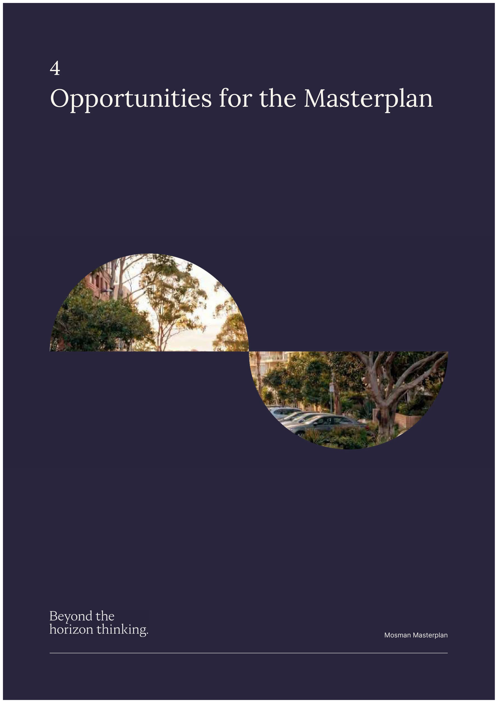

<!-- page 800 -->

Mosman Masterplan 23

#### 4.1 Land Use Opportunities

Mosman is an established, attractive location with a high degree of amenity, market appeal and acceptance. Price points for residential product are commensurate with the nature of market demand observed. Apartments in Mosman attract a mix of professionals, families, downsizers and investor purchasers.

The opportunity (and challenge) for development in an existing urban area such as the Mosman would be to:

 Enable development that is feasible, acknowledging that existing uses are established, relatively dense and valuable. The Study notes that despite development being theoretically feasible (on paper), a development outcome is not a given. Landowner motivations may not always align with development, and it is therefore reasonable to expect that not all development opportunities will be taken up.

 Facilitate supporting infrastructure to occur alongside development. This includes incentivising the provision of on-site infrastructure (e.g. public open space, through-site links, community facilities or floorspace for material public benefit) with density bonuses.

 Facilitate non-residential floorspace (retail and commercial) within appropriate locations. This ensures new residents have access to local facilities, travelling elsewhere only for higher order, discretionary shopping.

The Masterplan has an opportunity to enable more intense land use and housing opportunities within an established urban area close to public and transport infrastructure, that is within 15 minutes of the Sydney CBD.

The Masterplan also has the opportunity to facilitate:

 Diverse housing outcomes especially in the accessible and well serviced parts of Mosman.

 Affordable housing outcomes delivered by the community housing sector, inside or outside the Masterplan Area.

The capacity for additional residential should be enabled by concurrent provision of business floorspace (retail/ commercial) and community infrastructure.

#### 4.2 Community Infrastructure

The Masterplan identifies several sites which have the potential to provide for on-site community infrastructure and/ or affordable housing in exchange for a planning incentive. These include:

 Site A - publicly accessible open space.

 Site F - publicly accessible open space and public car spaces.

 Site J - indoor recreation centre.

 Sites B, D, E, G and H - community facility (warm shell, of varying sizes) and/ or affordable housing contributions.

Details of the on-site community infrastructure, including specifications and timing, would be included in a future planning agreement.

The Study recommends there is flexibility built into the public benefits provided by the developments on these sites.

#### 4.3 Affordable Housing Contribution Rates

As a general premise, planning uplift is generally accompanied by financial upside (greater revenue potential, land value and profit). It is from this financial upside that a site has the capacity to make affordable housing contributions.

In existing urban areas where lot patterns are established and buildings are valuable, it is a practical reality that not all properties will be redeveloped to new planning controls. Despite the potential for financial upside to be realised, landowner motivations do not always align with those of development.

The Masterplan envisages various changes to planning controls, conveying varying levels of financial upside to properties in the Masterplan Area. In some cases, land is now more valuable (with greater development potential). In other cases, there is not necessarily an improvement to the value of land (due to existing buildings that are more valuable). In those circumstances, the land will therefore not be developed and remain ‘as is’.

August 2026

Attachment 1.1.7 Mosman Council

<!-- page 801 -->

Mosman Masterplan 24

While planning uplift could facilitate developer contributions to affordable housing, it could equally facilitate urban renewal outcomes. Where urban renewal occurs, there are positive flow-on implications for growth, amenity and services. Development is able to respond to contemporary market need and demand and bring about renewal in the Masterplan Area. This is despite lower affordable housing contributions that may be required on sites where development is either not feasible or marginal.

METHOD OF CONTRIBUTION

Contributions would be satisfied through dedication (free of cost) of dwellings or land, as well as through cash contributions. This would align with s7.32(2) of Environmental Planning and Assessment Act 1979 (EP&A Act).

Council’s Affordable Housing Contribution Scheme enables it to specify how contributions received are to be dealt with and managed (under s7.33 of the EP&A Act). The receipt and aggregation of monetary contributions for affordable housing represent a valuable opportunity for Council to enable the provision of affordable housing stock.

August 2026

Attachment 1.1.7 Mosman Council

<!-- page 802 -->

Mosman Masterplan 25

## References

SJB (2026). Mosman Masterplan Urban Design Report. SJB, Surry Hills.

August 2026

Attachment 1.1.7 Mosman Council

<!-- page 803 -->

Mosman Masterplan 26

Mosman Masterplan

## Schedules

August 2026

Attachment 1.1.7 Mosman Council

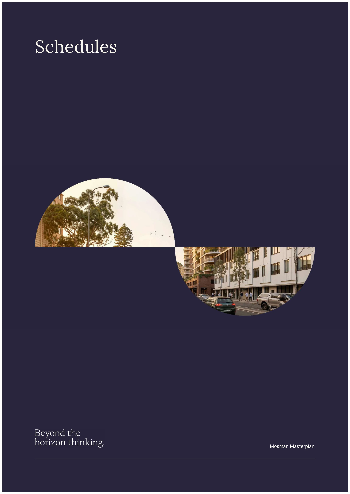

<!-- page 804 -->

Mosman Masterplan 27

SCHEDULE 1

## Analysis of Market Activity

The analysis of market activity underpins the assumptions adopted in the generic feasibility testing.

Existing-use Values

The Masterplan Area accommodates a range of existing uses, from detached dwellings to strata-titled unit blocks and low-rise retail and commercial uses. These uses are relevant for understanding the cost of land for development. Table S1-1 summarises a selection of sales of residential and commercial property.

Table S1-1: Sales of Existing Uses, Mosman and surrounds

ADDRESS SITE AREA (SQM)

SALE PRICE (DATE) ANALYSIS ($/SQM IMPROVED SITE AREA)

ACCOMMODATION

Single dwellings 55 Wolseley Rd 771 $7.4m (Mar-26) $9,637 4bed x 3bath x 4car 13 Cabben St 790 $7.7m (Oct-25) $9,747 5bed x 4bath x 2car 46 Spencer St 233 $3.9m (Feb-26) $16,738 4bed x 2bath 46 Royalist Rd 468 $5.7m (Aug-25) $12,179 5bed x 3bath x 2car 27 Prince St 300 $3.6m (Aug-25) $12,000 3bed x 1bath x 1car 35 Lang St 468 $5.3m (Sept-25) $11,218 5bed x 3bath x 1car 38 Bond St 233 $2.9m (Apr-26) $12,446 3bed x 1bath x 1car 6 Lavoni St 715 $11.6m (Apr-26) $16,084 7bed x 4bath x 3car 18 Esther Rd 557 $14.5m (Feb-26) $26,032 4bed x 3bath x 4car 40 Stanley Ave 920 $20m (Oct-25) $21,739 5bed x 5bath x 2car 28 Ruby St 1,792 $38m (Dec-25) $21,205 7bed x 6bath x 6car Torrens titled unit block 16 Clifford St 446 $5.2m (Dec-25) $11,547 4x 2-bed units, 2x 1-bed units 213 Raglan St 670 $5.4m (Mar-22) $8,069 4x 2-bed units, 1x 1-bed units Strata titled units 4/100 Shadforth St 480 $1.4m (Feb-25) $6m (in one-line)

$11,917 (if sold in one-line)

Art deco unit (2b x 1b x 1car) in complex of 4 units. If the units were sold in one-line, a price of ~$6m would result (4x $1.5m). 3/12 Earl St 800 $2.9m (Mar-26) $12m (in one-line)

$14,500 (if sold in one-line)

Townhouse (3b x 2b x 2car) in complex of 4. If the townhouses were sold in one-line, a price of ~$12m would result (4x $3m). 16/80-86 Spit Rd 1,786 $2.5m (Oct-23) $45m (in one-line)

$25,200 (if sold in one-line)

New complex of 21 units (3x 1b units, 15x 2b units, 3x 3b units). If the units were sold in one-line, a price of $45m could result (3x $1.5m + 15x $2.2m + 3x $2.5m). Commercial 692 Military Rd 177 $5.5m (Sept-23) $31,073 Ground retail, residential above 842 Military Rd 253 $3m (Nov-25) $11,858 Ground retail, residential above 742 Military Rd 679 $13.8m (Aug-21) $20,324 3 storey commercial building 640 Military Rd 616 $13.2m (Dec-19) $21,429 2 storey commercial building 713-715 Military Rd 587 $14m (Dec-25) $23,850 2 storey commercial building Source: Atlas

August 2026

Attachment 1.1.7 Mosman Council

<!-- page 805 -->

Mosman Masterplan 28

Generally, commercial property is more valuable than residential property.

Existing-use values of single dwellings range broadly from $9,500/sqm to $26,000/sqm of overall improved site area. Higher values are driven by the larger block sizes as well as the greater availability of harbour views outside the Military Road and Spit Road corridor.

For existing apartment blocks, a price hierarchy can be observed according to whether the blocks are held under Torrens title or strata title, and whether they are new or older.

 Torrens title blocks trade at the lower end of the range - $8,000/sqm to $12,000/sqm of improved site area.

 Strata title blocks (if sold in one-line) are more expensive - $12,000/sqm to $25,000/sqm of improved site area. Newly completed apartment blocks are naturally more expensive to purchase.

The estimation of how much a strata titled apartment block could achieve in one-line in Table S1-1 is a theoretical exercise to enable a comparison with the cost to purchase other types of existing uses (e.g. single dwellings).

For commercial property, existing-use values broadly range from $10,000/sqm to $30,000/sqm of improved site area depending on the scale and location of the property (e.g. number of storeys, site coverage, etc.).

This section examines the value of property in their existing use. The Study highlights that ff consolidated for development, incumbent landowners will expect payment of an incentive over and above market value.

End Sale Values

The analysis of completed floorspace (residential and non-residential) assists an understanding of the prices (or end sale values) completed (built) product could achieve in the Masterplan Area.

RESIDENTIAL

An analysis of residential apartment sales is carried for the purposes of estimating the likely end sale values of (new) residential product in Mosman. The sales are analysed on a net saleable area (NSA) basis.

Table S1-2: Sales of New and Off-the Plan Apartments, Mosman and surrounds

ADDRESS SALE PRICE (DATE)

NET SALEABLE AREA ($/SQM)

COMMENTS

8-12 Gurrigal Street, Mosman (Kleo) Kleo is a 5-storey apartment development 100m from Spit Junction Village, enjoying strong transport and retail amenity along Military Road. 8-12 Gurrigal St $3.0m (for sale)

85sqm ($35,294)

Lower level apartment with 2 bedrooms, 2 bathrooms and 1 car space. 8-12 Gurrigal St $12.5m (for sale)

150sqm ($83,333)

Penthouse apartment with sweeping harbour views, 3 bedrooms, 2 bathrooms and 2 car spaces. 171 - 179 Avenue Road, Mosman (The Archibald) The Archibald is a 4-storey boutique residential development comprising 11 oversized apartments, 4 retail suites and 3 levels of basement car parking. Construction was completed in 2025 and one unit remains for sale. Located on the western fringe of the Mosman Village, the development features striking facades which is in keeping with the adjacent shopfronts. 203/171-179 Avenue Rd $4.5m (Mar-26)

129sqm ($34,496)

Third floor apartment with 3 oversized bedrooms, 2 bathrooms and 3 car spaces. 104/171-179 Avenue Rd $4.1m (Jul-24)

129sqm ($31,783)

Second floor, with direct access to a communal garden. The 3- bedroom unit includes a dual, north facing balcony at the rear. 696-706 Military Rd, Mosman (Amara) Amara is a 6-storey boutique residential development comprising 26 apartments (7x 2-bedroom, 18x 3-bedroom and 1x 5- bedroom penthouse. Construction and sales are currently underway. Located in a high foot-traffic and boutique apparel portion of the Mosman Village, Amara will include ground level retail space. 696-706 Military Rd $3.5m (for sale)

90sqm ($38,889)

Lower level apartment with 2 bedrooms, 2 bathrooms and 1 car space. 696-706 Military Rd $8.8m (for sale)

130sqm ($67,692)

Upper level with 3 oversized bedrooms, 2 bathrooms and 2 car spaces. The offer includes harbour views and a large balcony. 80-86 Spit Rd, Mosman (The Hordern) The Hordern is a 3-storey boutique residential development comprising 21 apartments. Construction was completed in 2023. The residential flat building is located on the fringe of Spit Junction.

August 2026

Attachment 1.1.7 Mosman Council

<!-- page 806 -->

Mosman Masterplan 29

ADDRESS SALE PRICE (DATE)

NET SALEABLE AREA ($/SQM)

COMMENTS

16/80-86 Spit Rd $2.5m (Oct-23)

100sqm ($24,500) Second storey apartment with 3 bedrooms, 2 bathrooms and 2 car spaces. Located at the rear of the block, the apartment enjoys and north-west aspect. 16/80-86 Spit Rd $2.6m (Dec-23)

114sqm ($22,971) Top level apartment with 3 bedrooms, 2 bathrooms and 2 car spaces. Located at the rear of the block, the apartment enjoys and north-west aspect with tree filtered views to the west. 89 Parraween St, Cremorne (Eighty9) Eighty9 is a 4-storey mixed use development comprising 12 apartments. Construction was completed in 2021. The building includes one ground level retail suite. 102/89 Parraween St $2.6m (Mar-25)

113sqm ($23,009) Second storey apartment with 4 bedrooms, 2 bathrooms and 1 car space. The enclosed balcony and master bedroom benefit from a northerly aspect. 303/89 Parraween St $1.9m (Jul-25)

105sqm ($18,095) Third storey apartment with 2 bedrooms, 2 bathrooms and 1 car space. The apartment features an open air balcony which fronts Military Road.

Source: Atlas Residential sale prices achieved reflect the availability and quality of views, along with building and internal amenity. Developments along the busy portions of Mosman (e.g. Military Road and Spit Road) are generally geared at a less luxury end of the market (middle to premium product).

Prices paid for completed residential product are observed as follows:

 Premium product - $20,000/sqm to $30,000/sqm NSA, a wide range sensitive to location and positioning.

 Luxury product - $40,000/sqm and upwards of NSA, subject to location and positioning.

Overall, a price hierarchy is observed, where unit values (on a rate per square metre of saleable area) are higher in the Southern/ Balmoral slopes where harbour views and proximity to the beach is available.

There is also a price hierarchy observed for unit size - larger units generally achieve a higher dollar rate per square metre of saleable area than smaller units. The opposite is true in many middle markets in Greater Sydney.

NON-RESIDENTIAL

An analysis of non-residential sales is carried out to estimate the likely end sale values of retail/ commercial floorspace in the Masterplan Area. The sales are analysed on a net lettable area (NLA) basis.

Table S1-3 summarises an analysis of retail and commercial suites in Mosman.

Table S1-3: Sales of Retail/ Commercial Suites, Mosman and surrounds

ADDRESS SALE PRICE (DATE)

LETTABLE AREA (SQM)

ANALYSIS ($/SQM)

COMMENTS

Mosman Village 690 Military Rd $4.4m (Sept-23)

150 $29,333 Ground level tenancy on north-eastern side of Military Rd with a tenant in place. 888 Military Rd $11.8m Apr-25)

507 $23,274 2 storey retail shop with lease in place, sold at net passing rent of $400,000 (equivalent to a passing yield of 3.4%).

Spit Junction 24 Spit Rd $3.8m (Mar-22)

235 $16,170 2 storeys with ground level retail and residential above. Sold fully leased with net passing income of $135,000 (equivalent to a passing yield of 3.6%). 559 Military Rd $2.7m (Jun-20)

187 $14,225 2 storey shopfront comprising two ground retail tenants and Pilates studio above.

18 Spit Rd $3.1m (Aug-22)

297 $10,455 2 storey commercial building. Sold with vacant possession.

Spit Junction Fringe 154 Spit Rd $1.9m (Mar-26)

140 $13,643 2 storey commercial building, with ground level retail and residential above. Sold fully leased with net passing income of $126,000 (equivalent to a passing yield of 6.6%).

August 2026

Attachment 1.1.7 Mosman Council

<!-- page 807 -->

Mosman Masterplan 30

ADDRESS SALE PRICE (DATE)

LETTABLE AREA (SQM)

ANALYSIS ($/SQM)

COMMENTS

Suite 3, 832-834 Military Rd

$570k (Jun-21)

105 $5,429 Level 2 commercial suite with outdoor terrace. Sold fully leased with net passing income of $31,000 (equivalent to a passing yield of 5.5%). Suite 2, 357-359 Military Rd

$2.1m (Jul-21)

371 $5,660 Ground level office in a purpose-built office building, sold with vacant possession.

Shop 2 572-574 Military Rd

$650k (Feb-23)

75 $8,667 Ground level shopfront on the fringe of Spit Junction. Sold with vacant possession.

Source: Atlas The prices paid for commercial property is highly sensitive to location. Core locations within high traffic and exposure command the highest tenant/ occupier interest and the highest rents and consequently achieve the highest prices.

Prices paid for retail and commercial suites in and around Military Road and Spit Road are observed as follows:

 Mosman Village high foot-traffic area - $20,000/sqm to $30,000/sqm lettable area.

 Spit Junction Core high foot-traffic and arterial location - $10,000/sqm to $20,000/sqm lettable area.

 Spit Junction Fringe low foot traffic and arterial location - $5,000/sqm to $10,000/sqm lettable area.

All things being equal, the larger the floorspace the lower the rate achievable.

Depending on location and exposure, non-residential floorspace could conceivably achieve rates of $10,000/sqm to $20,000/sqm lettable area.

Development Site Sales

To understand the price a development could be prepared to pay for land, the analysis considered a selection of development site sales, as outlined in Table S1-4.

Table S1-4: Sales of Development Sites, Mosman and surrounds

ADDRESS SALE PRICE (DATE)

SITE AREA (GFA, FSR)

ANALYSIS ($/SQM GFA) COMMENTS

11-23 Rangers Rd $65m (Oct-25)

3,594sqm (5,391sqm, 1.5:1)

$14,189 Site zoned R3 Medium Density Residential. SSD proposed under the LMR controls for 44 apartments. The site enjoys harbour and city views.

91-101A Awaba St $40m (Mar-25)

1,964sqm (2,946sqm, 1.5:1)

$9,257 Site zoned R3 Medium Density Residential. Currently proposed for 53 apartments under the LMR controls.

696-700 Military Rd 706 Military Rd

$45m (Apr-24)

1,286sqm (3,215sqm, 2.5:1)

$13,997 Mixed use, shop top housing project currently under construction in E1 zone. The 26 unit project is known as Amara and is targeted at the luxury market.

21-31 Brierley St 42a-52 Rangers Ave

$85m Sept-25)

5,638sqm (12,404sqm, 2.2:1)

$6,853 Site is zoned R3 Medium Density Residential. Proposal under the LMR controls for 103 apartments.

64-66 Spit Rd $28m (Oct-23)

1,589sqm (4,767sqm, 3:1)

$5,874 Site is in E1 zone and currently under construction. The 29-unit project is known as Maison is 5-storeys with the top floor enjoying harbour views.

17 Moruben Rd $32m (Jul-25)

809sqm (1,780sqm, 2.2:1)

$17,980 A 3-storey strata unit block was consolidated by a developer. The site could be subject to the LMR controls with extensive views of Balmoral Beach.

3 Moruben Rd $22.1m (Jul-25)

685sqm (1,507sqm, 2.2:1)

$14,665 4-storey strata unit block (12 units) was sold in one- line as having development potential under the LMR controls.

13 & 15 Moruben Rd $65m (Mar-26)

1,647sqm (3,623sqm, 2.2:1)

$17,939 Two strata unit blocks - 13 Moruben Rd (6 units) and 15 Moruben Rd (11 units) consolidated with the potential for apartments under the LMR controls.

Source: Atlas

August 2026

Attachment 1.1.7 Mosman Council

<!-- page 808 -->

Mosman Masterplan 31

The prices paid for development sites are driven by similar drivers to the end sale values of residential floorspace. That is, a key driver of the prices of development site sales is the availability and quality of views.

There is a distinct grading of prices paid for development site opportunities, as follows:

 Limited harbour/ CBD views - $7,000/sqm to $10,000/sqm GFA.

 Extensive harbour/ CBD views - $10,000/sqm to $18,000/sqm GFA.

The observations drawn from the analysis of market activity underpins the inputs and assumptions made in the feasibility analysis.

August 2026

Attachment 1.1.7 Mosman Council

<!-- page 809 -->

Mosman Masterplan 32

SCHEDULE 2

## Generic Feasibility Testing Assumptions

The schedule details the analysis which examines the feasibility of development under the Mosman Masterplan.

Generic feasibility testing is undertaken to assess if after the proposed planning amendments (and all planning obligations, including affordable housing contributions), that development hurdle rates are within acceptable range and are feasible.

Methodology

The financial feasibility analysis relies on the Residual Land Value approach. The approach involves assessing the value of the completed product, making a deduction for development costs and making a further deduction for profit and risk while ensuring the development achieves a target profit margin and target return (or the ‘hurdle rates’).

The amount that a development can afford to pay for land is a ‘residual’, i.e. the amount that remains after development costs are deducted and target hurdle rates are achieved. The residual land value (RLV) is therefore the maximum price a developer could pay for a development opportunity whilst achieving target hurdle rates.

For a development to be feasible, the RLV (or site value) must exceed the ‘baseline’ cost of land (under the existing planning framework). The baseline cost of land is influenced by its improvements and ownership patterns and the development potential that is available under the existing planning framework.

The Study reviews the patterns of existing uses and identifies a selection of sites in the Masterplan Area for generic feasibility testing. The sites selected are intended to be representative of sites proposed for new planning controls.

Notional development yields are formulated for the purposes of generic testing. The cost to purchase individual properties (including an incentive premium) within a development site is estimated from an analysis of sales activity.

There are three key steps in the generic feasibility testing:

 Step 1: Assess the ‘as is’ value of a selected site under the current planning framework including an incentive premium a developer would likely need to pay in addition to secure the site.

 Step 2: Carry out feasibility modelling to identify the RLV of a development site assuming the planning controls proposed by the Masterplan. If the RLV is higher than the assumed cost of land (in Step 1), the tested development is feasible to develop. If the RLV is lower than the assumed cost of land, there will be no incentive for a change in use and the site will remain ‘as is’. The step is referred to as the ‘baseline feasibility’.

 Step 3: If feasible, iteratively test for affordable housing contributions that could be made. Affordable housing contributions can be made as a completed dwelling/s (effectively representing sales revenue that is forgone) or as an equivalent monetary contribution. For the purposes of the feasibility modelling, affordable housing contributions are assumed in the form of sales revenue foregone.

In a series of graphs (shown in Chapter 3), the feasibility of development is shown and compared against:

 the assumed cost of land for selected sites (value of site plus incentive premium).

 the RLV of development (under the proposed planning controls and all planning obligations):

◦ No affordable housing contributions.

◦ With affordable housing contributions, iteratively tested to be tolerable.

The RLV represents the price a developer could afford to pay for the site for development. If the RLV is higher than the assumed cost of land, development is feasible as it is valuable enough to ‘displace’ the existing uses. If the RLV is lower than the assumed cost of land, there will be no incentive for development and the site will remain ‘as is’.

August 2026

Attachment 1.1.7 Mosman Council

<!-- page 810 -->

Mosman Masterplan 33

Notional Development Yields

The Study develops notional development yields for the purposes of feasibility testing.

The tested residential typologies (residential flat buildings) are proposed in the R3 and R4 zones.

Table S2-1: Residential Development Typologies

DEVELOPMENT TYPE TOTAL FSR NO. STOREYS RESIDENTIAL FLAT BUILDING

1.5:1 4 1.8:1 5 2.2:1 6, 8 3.0:1 8 3.3:1 12

Source: Atlas The tested mixed use typologies (shop top housing) are proposed in the E1 Local Centre zone. Developments along an identified active frontage are required to provide for non-residential (active) uses on the ground floor.

The Masterplan identifies a number of Key Sites wherein specified sites could access higher density (height and FSR) in exchange for the provision of on-site community infrastructure and/ or affordable housing contributions. Some developments are required to provide for a minimum non-residential FSR of 1:1.

Table S2-2: Mixed Use Development Typologies

DEVELOPMENT TYPE TOTAL FSR MIN. NON-RESIDENTIAL FSR NO. STOREYS Active Frontage Active Frontage and Min. FSR MIXED USE DEVELOPMENT (SHOP TOP HOUSING)

3.0:1 0.5:1 8 3.5:1 0.5:1 8, 10 4.0:1 0.5:1 4, 6, 8, 10, 12 4.5:1 0.5:1 10 5.0:1 0.5:1 12 6.5:1 0.5:1 12, 15 KEY SITES SITE J 5.0:1 0.5:1 18 SITE B 6.0:1 0.5:1 18 SITE E 6.5:1 1.0:1 15 SITE G, SITE F 7.0:1 0.5:1 1.0:1 15, 22 SITE D, SITE C 8.0:1 0.5:1 1.0:1 18, 20

Source: Atlas Table S2-3 illustrates the adopted unit mix and unit sizes (in net saleable area, NSA) adopted in the feasibility testing. An efficiency ratio of 85% from gross floor area (GFA) to NSA is adopted.

Table S2-3: Unit Mix and Average Unit Sizes

UNIT TYPE UNIT MIX NET SALEABLE AREA (SQM) 1-BEDROOM 20% 70 2-BEDROOM 50% 85 3-BEDROOM 30% 140 TOTAL 100% 115

Source: Atlas

August 2026

Attachment 1.1.7 Mosman Council

<!-- page 811 -->

Mosman Masterplan 34

Revenue Assumptions

SUB-MARKETS

Market analysis observes that the pricing of new residential product is tiered by location and by amenity.

 Locations around Military and Spit Road corridor are observed to achieve pricing from $20,000/sqm to $30,000/sqm of net saleable area (NSA), averaging $25,000/sqm. These areas enjoy excellent accessibility and retail amenity and can capture views of the harbour depending on position on the ridgeline. These areas are referred to as “Area A”.

 Locations with available harbour views achieve higher pricing from $25,000/sqm to $40,000/sqm of NSA. Some sites could lend themselves to higher sale prices (exceeding $40,000/sqm), however these depend on site- specific attributes, site elevation, etc. This is referred to as “Area B”.

The Study acknowledges the varying nature of desirability and market appeal of residential product in different parts of the Masterplan Area. Locations west of Military Road and Spit Road (north of Avenue Road) are referred to as “Area A” whereas locations east of Military Road and Spit Road (south of Avenue Road) are referred to as “Area B”.

Figure S2-1 shows the delineation of these areas.

Figure S2-1: Map of Area Grouping

Source: Atlas

END SALE VALUES

Average end sale values are adopted based on market research and analysis (summarised in Schedule 1).

Table S2-4: End Sale Values, Area A and Area B

UNIT TYPE AREA A AREA B 1-BEDROOM $24,000 to $28,000 $26,000 to $30,000 per sqm NSA 2-BEDROOM $26,000 to $30,000 $28,000 to $32,000 per sqm NSA 3-BEDROOM $28,000 to $32,000 $30,000 to $40,000 per sqm NSA NON-RESIDENTIAL $15,000 to $20,000 $12,000 to $16,000 per sqm lettable area

Source: Atlas

August 2026

Attachment 1.1.7 Mosman Council

<!-- page 812 -->

Mosman Masterplan 35

Other revenue assumptions:

 GST is included on the residential sales but excluded on non-residential sales.

 Transaction costs of 5.5% on land purchase cost.

 Sales commission at 2.5% of gross residential sales and 1.5% of non-residential sales.

Cost Assumptions

Cost assumptions are generic in nature and based on industry cost publications and professional experience.

 Demolition at $100/sqm of existing buildings.

 Building areas (where applicable) are calculated by applying a generic 115% ratio to GFA to which construction costs are applied.

 Construction costs are estimated with reference to cost publications:

◦ Residential construction assumed at $4,500/sqm to $6,500/sqm (depending on density and height), balconies at $1,000/sqm.

◦ Commercial construction assumed at $3,500/sqm to $4,000/sqm of building area.

◦ Basement car parking at $100,000 per car space.

 Professional fees at 10% of construction costs.

 Construction contingency at 5%.

 Statutory fees:

◦ DA fees and CC fees at scheduled rates.

◦ Long service levy of 0.25% of construction costs.

◦ Local contributions assumed at 3% levy* on development costs:

◦ Housing and Productivity contributions at $10,812 per dwelling

◦ Sydney Water DSP charges at $4,272 per equivalent tenement (approx. $3,418 per dwelling).

 Holding costs including land tax, Council and water rates.

 100% debt funded with interest at 6% per annum.

 Finance establishment cost of 0.35% of peak debt.

*subject to ongoing investigations by Council

Hurdle Rates and Performance Indicators

Target hurdle rates are dependent on the perceived risk associated with a project (planning, market, financial and construction risk). The more risk associated with a project, the higher the hurdle rate.

The key hurdle rate assumed for the feasibility modelling is the profit and risk margin at 18%-20%.

If the resulting profit is sufficient to meet the target profit margin, the development is considered financially feasible.

August 2026

Attachment 1.1.7 Mosman Council

<!-- page 813 -->

Mosman Masterplan 36

PAGE INTENTIONALLY LEFT BLANK

August 2026

Attachment 1.1.7 Mosman Council

<!-- page 814 -->

Mosman Masterplan 37

SYDNEY

Level 11, 179 Elizabeth St Sydney NSW 2000 Gadigal Country

MELBOURNE

Level 5, 447 Collins St Melbourne VIC 3000 Wurundjeri Country atlaseconomics.com.au

August 2026

Attachment 1.1.7 Mosman Council

