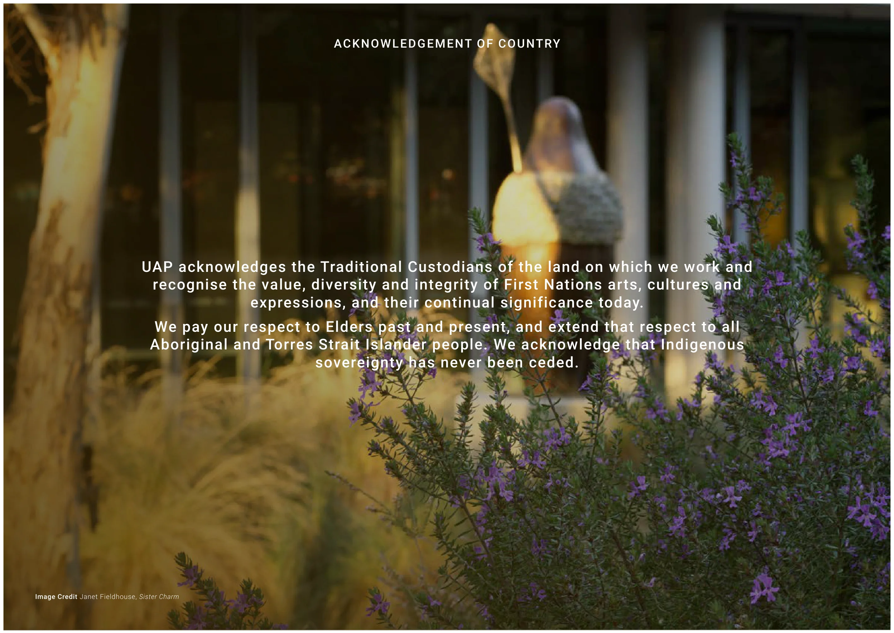
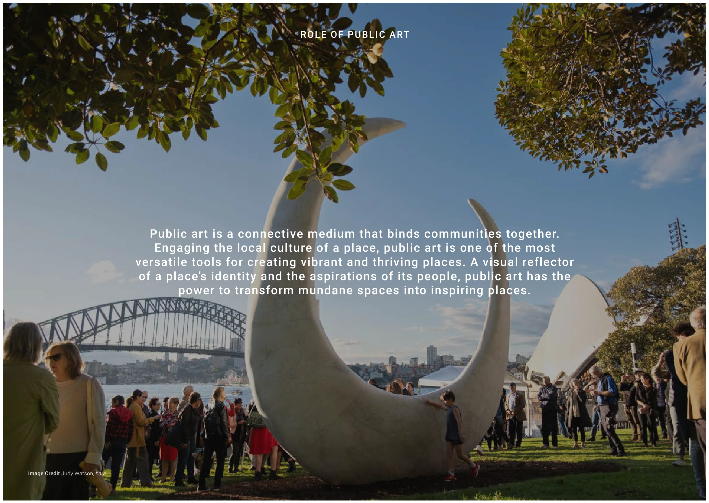
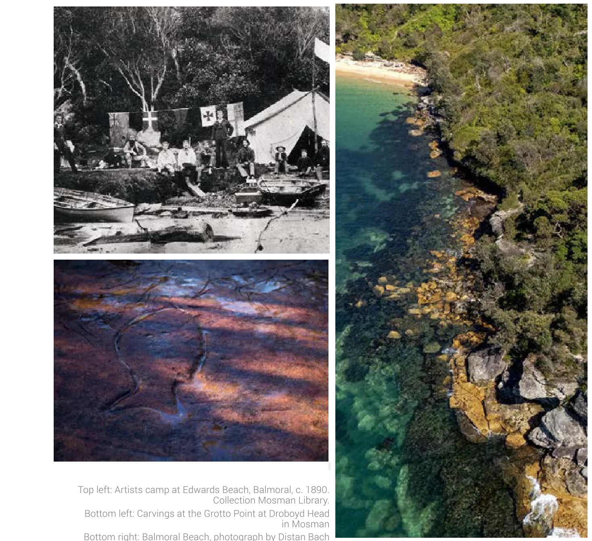
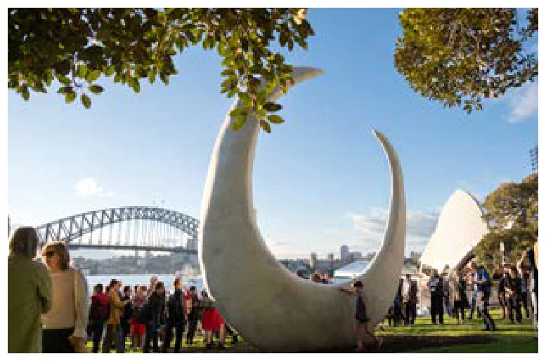
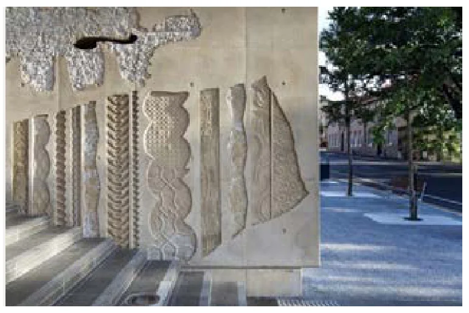
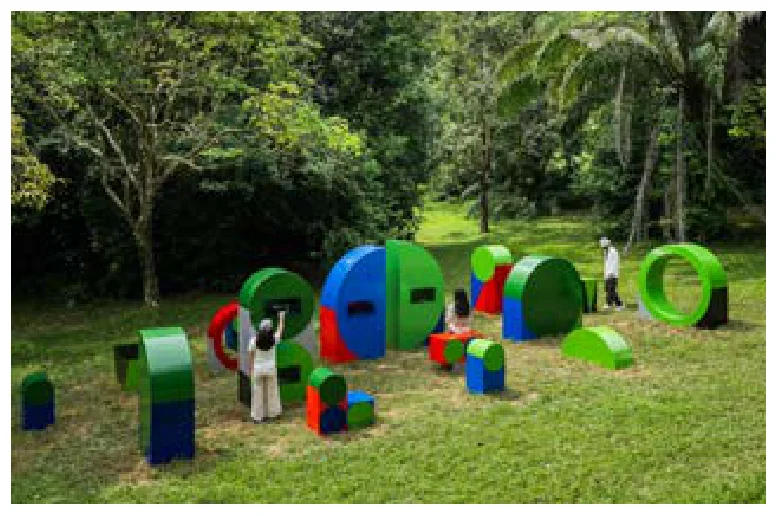
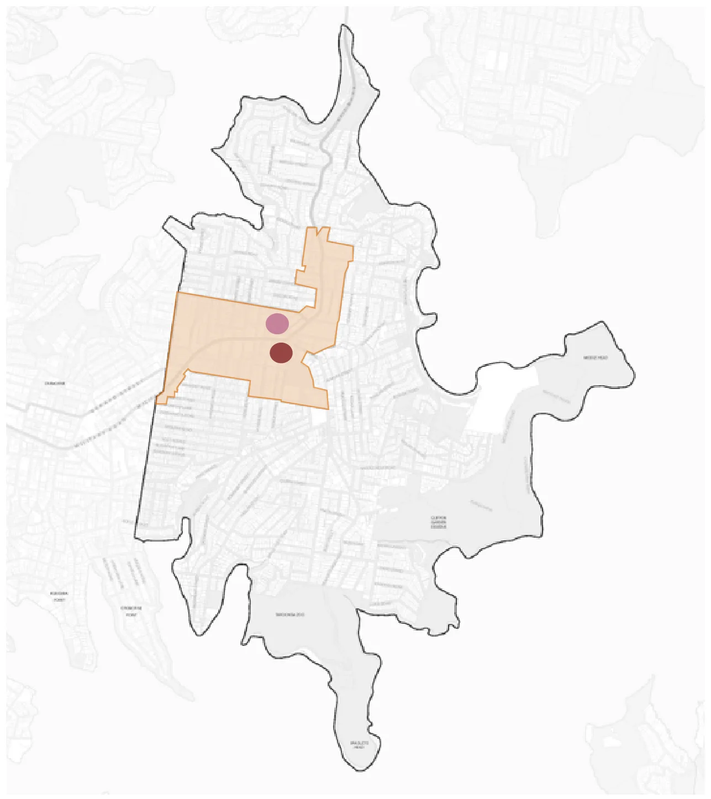

---

title: I Public Art Investment and Delivery Framework - Interim

source: Extraordinary Council Meeting - Additional Attachments - 26 August 2026

pages: 816-831

---

# I Public Art Investment and Delivery Framework - Interim

<!-- page 816 -->

## I

### Public Art Investment and

### Delivery Framework - Interim

August 2026

Attachment 1.1.9 Mosman Council

<!-- page 817 -->

## Breaker

## DOCUMENT TITLE

### Client XYZ • Document Type XYZ

### UAP Reference XYZ • Date 00 Month 20XX

## Public Art Investment and Delivery Framework (Interim)

### Prepared for Mosman Council

### Document Type Public Art Investment and

### Delivery Framework

### UAP Reference P4436

### Date July 2026

August 2026

Attachment 1.1.9 Mosman Council

<!-- page 818 -->

Introduction The Role of Public Art Impacts and Benefits of Public Art

Stories of Place Living Legacies: Nature, Culture and Community

Artwork Activations Preliminary Artwork Typologies Preliminary Artwork Activations

Public Art Delivery Benchmark Commissioning Process Project Team



## Contents

Mosman Council, Public Art Investment & Delivery Framework (Interim) • 2 of 6

August 2026

Attachment 1.1.9 Mosman Council

<!-- page 819 -->

### UAP acknowledges the Traditional Custodians of the land on which we work and

### recognise the value, diversity and integrity of First Nations arts, cultures and

### expressions, and their continual significance today.

### We pay our respect to Elders past and present, and extend that respect to all

### Aboriginal and Torres Strait Islander people. We acknowledge that Indigenous

### sovereignty has never been ceded.

ACKNOWLEDGEMENT OF COUNTRY

Image Credit Janet Fieldhouse, Sister Charm

August 2026

Attachment 1.1.9 Mosman Council

<!-- page 820 -->

Mosman Council, Public Art Investment & Delivery Framework (Interim) • 4 of 6

Public art strengthens civic identity, enriches the public realm and fosters meaningful connections between people and place. As Mosman evolves, a considered program of cultural investment can celebrate local stories and histories, support community life and enhance the experience of key destinations across the municipality. This Interim Public Art Investment and Delivery Framework has been prepared to support the directions established through the working Mosman Masterplan while a comprehensive Public Art Masterplan is being developed. This alignment provides a strategic foundation for future investment, ensuring that culture and creativity are embedded within the broader vision for Mosman’s growth and civic development.

Mosman Public Art Masterplan (In Development)

The development of a place-specific Public Art Masterplan presents an important opportunity to articulate a long-term cultural and creative vision that reflects Mosman’s distinctive character, heritage and evolving public realm. The Public Art Masterplan will establish a curatorial framework to guide the commissioning of meaningful and contextually aligned public art, identify future artwork opportunities including typologies, experiences and locations. It will also guide best practice commissioning processes, artist procurement models, community engagement approaches and cultural methodologies to support the successful delivery of public art outcomes across the Mosman local government area. This interim document responds to emerging priorities identified in the Mosman Masterplan, including civic precinct improvements and the creation of high-quality public spaces that residents value and enjoy. It outlines preliminary curatorial and delivery principles for further exploration in the forthcoming Public Art Masterplan.

## Introduction

August 2026

Attachment 1.1.9 Mosman Council

<!-- page 821 -->

Image Credit Judy Watson, bara

ROLE OF PUBLIC ART

### Public art is a connective medium that binds communities together.

### Engaging the local culture of a place, public art is one of the most

### versatile tools for creating vibrant and thriving places. A visual reflector

### of a place’s identity and the aspirations of its people, public art has the

### power to transform mundane spaces into inspiring places.

August 2026

Attachment 1.1.9 Mosman Council

<!-- page 822 -->

The Role of Public Art

Mosman Council, Public Art Investment & Delivery Framework (Interim) • 6 of 6

## Impacts and Benefits of Public Art

Public art is a transformative tool which holds the potential to define public spaces. Establishing hubs for social connection, public art fosters authentic interactions between people and their environments.

### Transform Communities

Public art is foundational in establishing the distinctive visual identity of a place, embodying the unique contextual and cultural identity of cities and communities. Opportunities to engage First Nations artists and local voices will be celebrated.

### Define Place

Public art holds immense potential to capture the zeitgeist of its time, existing as a permanent capsule which embodies the contextual influences at its time of commissioning. It reflects site-specific histories, future aspirations and builds an arts and culture identity.

### Establish Legacy

Public art is instrumental in boosting local economies, not only by increasing tourism and incidental spend in surrounding areas, but by growing creative economies through investing in culturally rich spaces that meaningfully engage with the community.

### Bolster Economy

Public art is vital in enhancing the sustainability of a city by implementing durable and enduring artworks which respond to the city’s environmental ambitions, attract investment, boost visitation and improve wellbeing.

### Embed Sustainability

August 2026

Attachment 1.1.9 Mosman Council

<!-- page 823 -->

## Stories of Place

## Role of Public Art

### We start by asking 'What are the stories of this place?'

### Through historical and social research, key narratives

### emerge that form the foundation of the Mosman Public

### Art Masterplan.

August 2026

Attachment 1.1.9 Mosman Council

<!-- page 824 -->

Mosman Council, Public Art Investment & Delivery Framework (Interim) • 8 of 16

Stories of Place

## Living Legacies: Nature, Culture and Community

The Mosman Public Art Masterplan includes a chapter profiling important place narratives that underpin the public art approach. This page provides a snapshot of key ideas that have been expanded upon in the full public art masterplan.

Mosman Council is situated on the traditional lands of the Borogegal and Cammeraigal peoples, custodians of saltwater knowledge who have lived on and cared for this Country for more than 60,000 years. Their enduring presence is evident in shell middens preserved on rock surfaces, as well as in more than 200 sandstone engravings and pigment artworks that depict the marine life of this harbour landscape. Here, water sustains human and non-human kin and, since time immemorial, has guided movement across the harbour and shaped relationships to this place. When British ships arrived in Sydney harbour in 1788, and at Mosman Bay the following year, this culturally rich place was profoundly altered by colonisation and industry. In the early 1800s, sheltered coves were transformed by whaling, with Archibald Mosman (the suburb's namesake), establishing Sydney's first shore- based whaling station in Mosman Bay. As residential settlement grew, whaling declined, and by the 1840s the bay had shifted to ship repair and overhauling. While industry reshaped the shoreline, First Nations peoples continued to navigate the disruptions of colonisation. Among the most significant figures connected to Mosman was Bungaree, a Guringai man and contemporary of Bennalong and Pemulwuy, who acted as a cultural intermediary between Aboriginal peoples and British settlers and accompanied Mathew Flinders on several voyagers contributing to

Top left: Artists camp at Edwards Beach, Balmoral, c. 1890. Collection Mosman Library. Bottom left: Carvings at the Grotto Point at Droboyd Head in Mosman Bottom right: Balmoral Beach, photograph by Distan Bach

Source 01 Mosman Council, https://mosman.nsw.gov.au/community/people-culture-and-history/a-brief-history-of-mosman 02 Australian Museum, Bungaree. https://australian.museum/about/history/exhibitions/trailblazers/bungaree 03 Pocket Guide to Sydney, https://www.visitsydneyaustralia.com.au/mosman.html 04 Mosman Collective, https://mosmancollective.com/history/attack-on-sydney-harbour-in-1942-japanese-submarines-brought-wwii-to-mosmans-doorstep/ 05 Sydney Federation Harbour Trust, https://www.harbourtrust.gov.au/ 06 Mosman Art Gallery, https://mosmanartgallery.org.au

cross-cultural exchange. In 1815, Bungaree received land at Georges Head - the first land grant made to an Aboriginal person by the colonical goverment. Today, his legacy endures through exhibitions, performances and community projects that continue to explore his life and influence.

Mosman’s natural beauty has long inspired artists - from the late nineteenth-century painter camps at Sirius Cove and Curlew Camp, where Arthur Streeton, Tom Roberts and Julian Ashton helped shape Australian Impressionism, to later artists such as Margaret Preston, whose work was influenced by the harbour and bushland. Mosman also occupies an important place in Sydney’s military history, from nineteenth- century fortifications and HMAS Penguin to the 1942 arrival of Japanese midget submarines in Sydney Harbour. Remnants of this past remain visible across the headlands, where forts, tunnels and defence infrastructure continue to shape the landscape. Today, Mosman’s natural, cultural and built legacies are being carried forward by Mosman Council in partnership with the community that lives, works and thrives here. The Harbour Trust, Council advocacy groups and local organisations collaborate to conserve the area's significant landscapes, historic sites and architectual heritage, while Mosman Art Gallery & Museum champions the area's rich artistic traditions, showcasing both historic and contemporary artists who have, and continue to make an important contribution to this place. Mosman is more than a place of natural beauty; it is a vibrant community shaped by generosity, creativity, and a strong communitment to social and environmental care.

August 2026

Attachment 1.1.9 Mosman Council

<!-- page 825 -->

## Artwork Activations

## Role of Public Art

August 2026

Attachment 1.1.9 Mosman Council

<!-- page 826 -->

Mosman Council, Public Art Investment & Delivery Framework (Interim) • 10 of 16

Artwork Activations

Public artwork typologies provide a strategic and curatorial framework for delivering meaningful, site-responsive outcomes across the public realm. A series of preliminary typologies has been developed to guide the Public Art Masterplan. These establish the experiential intent and potential artwork forms that will inform the future development and commissioning of public art across Mosman.

## Preliminary Artwork Typologies

Iconic Markers of Place

Creates inconic artistic interventions that become destinations and defining place markers. Prominent and enduring, these works become synonymous with Mosman's identity.

Potential artwork forms include, but are not limited to:

- Freestanding sculptural forms - Integrated ground plane treatment

Embedded Storytelling

Celebrates the fine-grain character of Mosman's public spaces, revealing local stories through intimate, site-specific interventions that enrich everyday experience.

Potential artwork forms include, but are not limited to:

- Small scale sculptures and/or attachments (standaloone sculptures or integrated treatments) - Integrated ground plane treatment - Facade treatments (murals, integrated forms directly in the built form or sculptural attachments)

Artist-led Functional Elements

Transforms everyday public infrastructure into creative and functional experiences that encourage gathering and interaction Potential artwork forms include but are not limited to: - Artist-led social structures including seating, tables or shelters - Artist-led micro playscapes - Artist-led lighting

Left to right: Judy Watson, Monument for the Eora, 2020;  Bruce Reynolds, Tread, 2011; Emily Floyd, Field Library, 2025

August 2026

Attachment 1.1.9 Mosman Council

<!-- page 827 -->

Mosman Council, Public Art Investment & Delivery Framework (Interim) • 11 of 16

Artwork Activations

The forthcoming Mosman Public Art Masterplan will identify a series of public art opportunities to guide future commissioning across the Mosman Local Government Area (LGA). These opportunities will be informed by the the curatorial framework and desired community experience, ensuring a diverse yet cohesive network of artistic interventions that enrich the public realm and strengthen connections to Mosman.

Located within publicly accessible areas, each opportunity will outline an indicative artwork location, intended experience, artwork typology, form, scale, indicative budget and recommended commissioning and implementation approach.

The selection of artists will prioritise diverse and local perspectives and practices, including opportunities for First Nations artists to contribute works that reflect cultural knowledge, stories and connections to place.

Preliminary Artwork Opportunities

The map right outlines the Mosman LGA boundary and highlights the proposed Mosman Masterplan redevelopment area (seen in orange).

At this interim stage, a series of potential artwork activation zones has been identified for further investigation within the Mosman Masterplan redevelopment zone. This will be explored through the next stages of the Public Art Masterplan, and include, but are not limited to:

Bridgepoint Civic Precinct Place

Other artwork opportunities will be assessed strategically across the open spaces in the LGA, identifying locations of cultural, civic, environmental and experiential significance. This may include key destinations, movement corridors and moments of arrival, gathering and discovery where public art can deepen understanding of local histories and identities.

## Location Overview

Image Credit Map Courtesy of Mosman Council

August 2026

Attachment 1.1.9 Mosman Council

<!-- page 828 -->

## Public Art Delivery

August 2026

Attachment 1.1.9 Mosman Council

<!-- page 829 -->

Mosman Council, Public Art Investment & Delivery Framework (Interim) • 13 of 16

Public Art Delivery

## Benchmark Commissioning Process

To achieve Development Approval: Mosman Council to approve Public Art Strategies and provide public art conditions as part of DA consent

To achieve Construction Certificate: Mosman Council to approve Detailed Public Art Plans aligned to mandated construction certificates (Typically Above Ground CC)

To achieve Occupation Certificate: Mosman Council to inspect installed artwork and approve Final Public Art Report

Public Art Planning Public Art Masterplan/s (LGA / Specific Precincts) Site-specific Public Art Strategies

Artist Procurement Public Art Curator leads artist- shortlisting and selection process in consultation with project team. Optional inclusion of Selection Panel Prepare Artist Briefing packages

Concept Development Selected artists develop site- specific artwork concept in response to a brief Project team and Selection Panel select winning concept proposal Preliminary Engineering advice

Technical Design Refinement and finalisation of selected artwork concept in preparation for production

Fabrication & Installation Artwork fabrication. Includes final approvals, transportation to site and installation

Post Installation Activation Launch event with artist to celebrate artwork with community. May include cultural events and talks

PUBLIC ART IN PRIVATE DEVELOPMENT PLANNING REVIEW POINTS BY STAGE

Appoint Cultural Consultants or First Nations Curator Engagement with key First Nations stakeholders

Cultural Consultant to advise tailored engagement approach specific to each artwork concept, and support artist to connect with relevant community during concept development.

CULTURAL ENGAGEMENT METHODOLOGY FOR FIRST NATIONS COMMISSIONS

Engagement with key First Nations stakeholders on Artist Briefs and Artist Longlists

Cultural Consultant to advise tailored engagement approach specific to each artwork through delivery phase

Mosman Council to endorse LGA Public Art Masterplan Nominate Art Activation

Mosman Council to select artwork concept; optional with Public Art Advisory Panel

MOSMAN COUNCIL INITIATED PUBLIC ART COMMISSIONS

Mosman Council to select shortlisted artist/s; optional with Public Art Advisory Panel

Artist Team, Design Teams, Project Team fabrication commencement meeting Ongoing coordination meetings as required

Mosman Council approve installed artwork Ongoing care and maintenance provided by Mosman Council

Ongoing care and maintenance provided by Land Owner

August 2026

Attachment 1.1.9 Mosman Council

<!-- page 830 -->

Public Art Delivery

Mosman Council, Public Art Investment & Delivery Framework (Interim) • 14 of 16

## Project Team | UAP

Marissa Bateman Senior Principal

Marissa is a key client point of contact who worked to establish the project requirements and deliverables at the point of procurement, and remains a constant through the life of the project.

Mobile +61 412 459 342 Email marissa.bateman@uapcompany.com

Natasha Smith Director | Curatorial

Natasha leads the UAP curatorial team globally, with teams located in Brisbane, Sydney and Melbourne in Australia, Shanghai in China, and New York in the United States. Office +61 7 3630 6300 Mobile +61 412 476 481 Email natasha.smith@uapcompany.com

Danielle Robson Head of Curatorial

As the Project Lead, Danielle is the first point of contact and is responsible for leading the curatorial and strategic approach for the site.

Mobile +61 431 435 649 Email danielle.robson@uapcompany.com

Ellinor Pelz Curator In her role as Curator, Ellinor works closely with artists, clients and consultants across Australia and the Middle East to develop public art masterplans, strategies and creative visions.

Mobile +61 499 048 698 Email ellinor.pelz@uapcompany.com

Amanda Harris Managing Director

As General Manager, Amanda ensures the successful management of all projects and is instrumental in the strategic development of the company.

Office +61 7 3630 6300 Email amanda.harris@uapcompany.com

Sean Guy Head of Design

Sean is the Head of Design and provides strategic and operational leadership across the Concept Design and Technical Design teams.

Mobile +61 400 250 822 Email sean.guy@uapcompany.com

Pablo Codina Concept Design Manager

Pablo is the Concept Design manager and is focused on early-stage ideation, concept realisation and viability, and collaboration and relationship building with artists and clients.

Mobile +61 499 345 020 Email pablo.codina@uapcompany.com

Craig Turton Senior Project Manager

As a Senior Project Manager for UAP in the Brisbane office, Craig’s primary role is to apply his experience in design, manufacturing, and construction to deliver world class projects within time and budget whilst maintaining relationships with all stakeholders.

Mobile +61 473 909 832 Email craig.turton@uapcompany.com

August 2026

Attachment 1.1.9 Mosman Council

<!-- page 831 -->

uapcompany.com

August 2026

Attachment 1.1.9 Mosman Council
