---

title: J Contamination

source: Extraordinary Council Meeting - Additional Attachments - 26 August 2026

pages: 832-1204

---

# J Contamination

<!-- page 832 -->

## J

## Contamination

August 2026

Attachment 1.1.10 Mosman Council

<!-- page 833 -->

T:    1300 884 164 E:    info@egau.com.au W:   www.egau.com.au P:    36E Fitzroy Street, Marrickville NSW

Page 1

4th August 2026 Evan Matthews Mosman Municipal Council By email: E.Matthews@mosman.nsw.gov.au

Mosman Masterplan – Desktop Phase 1 Environmental Site Assessments

Environmental Group Australia (EGA) was engaged by Mosman Municipal Council to undertake Desktop Phase 1 Environmental Site Assessments for a number of sites to assess the potential for contamination and to consider the implications of identified contamination for future redevelopment.

A total of 8 Desktop Phase 1 Environmental Site Assessments have been prepared. Each assessment has been completed as a standalone report for the relevant site and should be read independently with respect to the individual site findings, conclusions and recommendations.

This letter accompanies the enclosed reports and presents them as a consolidated package.

The assessments identified that several of the sites have the potential to contain contamination associated with historical and/or current land uses. As is typical for urban redevelopment sites, some locations may require further environmental investigation and, where necessary, remediation and/or management measures to support future redevelopment.

The assessments conclude that the potential for contamination does not represent a constraint to the proposed rezoning or future planning of the sites. Where contamination is identified or considered likely to be present, it is anticipated that suitable investigation, remediation and/or management measures can be implemented during the redevelopment process to render the sites suitable for their intended future land uses.

The detailed findings, conclusions and recommendations for each site are provided within the respective assessment reports.

Enclosed Assessments

• Desktop Phase 1 Environmental Site Assessment – 162A Spit Road, Mosman NSW (report reference: 3861-PSI-01-270726.v2f) • Desktop Phase 1 Environmental Site Assessment – 612 Military Road, Mosman NSW (report reference: 3861-PSI-02-290726.v2f) • Desktop Phase 1 Environmental Site Assessment – 79–85 Cowles Road, Mosman NSW (report reference: 3861-PSI-03-290726.v2f) • Desktop Phase 1 Environmental Site Assessment – 491–505 Military Road, Mosman NSW (report reference: 3861-PSI-04-290726.v2f) • Desktop Phase 1 Environmental Site Assessment – 576 Military Road, Mosman NSW (report reference: 3861-PSI-05-290726.v2f) • Desktop Phase 1 Environmental Site Assessment – 494–516 Military Road, Mosman NSW (report reference: 3861-PSI-06-290726.v2f) • Desktop Phase 1 Environmental Site Assessment – 418–426 Military Road, Mosman NSW (report reference: 3861-PSI-07-290726.v2f) • Desktop Phase 1 Environmental Site Assessment – 309 Military Road, Mosman NSW (report reference: 3861-PSI-08-290726.v2f)

Should you have any further questions regarding information provided in this letter, please do not hesitate to contact the undersigned.

Sincerely yours,

Isabelle Figatowski Operations Manager / Senior Environmental Consultant B. Sc. (Env. Consulting) i.figatowski@egau.com.au

August 2026

Attachment 1.1.10 Mosman Council

<!-- page 834 -->

## Desktop Phase 1 Environmental Site

## Assessment

162A Spit Road, Mosman NSW

Report No: Report Date:

3861-PSI-01-270726.v2f 03/08/2026

info@egau.com.au

NSW: 36E Fitzroy Street, Marrickville, NSW 2204 VIC: 88 Langridge St, Collingwood VIC 3066

August 2026

Attachment 1.1.10 Mosman Council

<!-- page 835 -->

Desktop Phase 1 Environmental Site Assessment 162A Spit Road, Mosman NSW 3861-PSI-01-270726.v2f

Page 1

### Document Record

Revision Date Author Reviewer

v1f 27 July 2026 Rachelle Conna Isabelle Figatowski

v2f 3 August 2026 Rachelle Conna Isabelle Figatowski

Author Signature Reviewer Signature

Name Rachelle Conna Name Isabelle Figatowski

Credentials B. Sc. (Zoology) Credentials B.Sc. (Env. Consulting)

Title Environmental Consultant Title Senior Environmental Consultant

Document Title: Desktop Phase 1 Environmental Site Assessment - 162A Spit Road, Mosman NSW Site Address: 162A Spit Road, Mosman NSW Client Name: Site Size: ≈ 1,150 m2 Reference Number: 3861-PSI-01-270726.v2f Project Type: Desktop Phase 1 Environmental Site Assessment Project Type Abbreviation: PSI Document Draft: FINAL Document Revision No. v2f

Prepared by Environmental Group Australia Pty Ltd ABN: 83 671 599 143

August 2026

Attachment 1.1.10 Mosman Council

<!-- page 836 -->

Desktop Phase 1 Environmental Site Assessment 162A Spit Road, Mosman NSW 3861-PSI-01-270726.v2f

Page 2

### EXECUTIVE SUMMARY

Environmental Group Australia Pty Ltd (EGA) was engaged by Mosman Council (hereafter referred to as ‘the client’), to undertake a Desktop Phase 1 Environmental Site Assessment of the property located within Lot 18 DP656322, 162A Spit Road, Mosman NSW (hereafter referred to as ‘the site’) (refer to Figure 1 and Figure 2).

The client is preparing to lodge a planning proposal to implement the draft Mosman Masterplan, which proposes increased housing capacity across the study area, including amendments to the planning controls at the site to facilitate redevelopment.

#### Purpose and Objectives

A Desktop Phase 1 Environmental Site Assessment was required to assess the likelihood that the site had been contaminated by past or present activities and to form a preliminary view on the extent and degree of contamination. The objectives of the investigation were to:

• Provide advice on whether the site may require a stage 2 intrusive site assessment, to better define the nature and extent of potential contamination within the site; and • Provide advice on whether the site would be suitable (in the context of land contamination) for any proposed future rezoning.

#### Site Description

• The site covers an area of approximately 1,150 m2; • The site is currently zoned as E1: Local Centre; • The site is currently utilised as a Service Station; and • The site is located within a mixed commercial-industrial and residential district.

Current aerial imagery suggests that the site is currently operating as a Service Station comprising 2 petrol pumps and 6 car parks, with hardstand across the majority of the site and landscaping along the northern, western and southern site boundaries.

#### Proposed Development

Reference is made to the draft Mosman Masterplan Structure Plan prepared by SJB Architecture, dated 29 July 2026 (Drawing No. 06, Revision 07). EGA understands that the site has been identified for increased development potential, however, have not been provided with any specific redevelopment plans. EGA has made the assumption that future development may include the demolition of current structures, rezoning of land, subdivision of land, and construction of new structures and infrastructure. EGA has not been made aware of any basement plans and have presumed that they are proposed as part of the future development.

#### Scope of Work

EGA undertook the following scope of works to address the project objectives:

• A desktop review of relevant information pertaining to the site; and • Assessment and reporting of the desktop review.

#### Investigation Outcome

Based on EGA’s assessment of the desktop review information, in the context of the proposed redevelopment scenario, EGA has made the following conclusions:

August 2026

Attachment 1.1.10 Mosman Council

<!-- page 837 -->

Desktop Phase 1 Environmental Site Assessment 162A Spit Road, Mosman NSW 3861-PSI-01-270726.v2f

Page 3

• The search of historical aerial imagery indicated a moderate potential for contamination within the site to have occurred, associated with uncontrolled demolition. EGA also notes that due to the dates of construction, the building fabrics may contain hazardous building materials; • A review of publicly available contaminated land databases indicated that the site is not the subject of any licences, applications, notices under Section 308 of the Protection of the Environment Operations Act 1997. The site is not the subject of any notifications under Section 58 of the Contaminated Land Management Act 1997; • The site is notified under Section 60 of the Contaminated Land Management Act 1997, due to operation as a Service Station, however, does not require further regulation; • The contaminants and areas of environmental concern (AEC), requiring further consideration or assessment, and possibly remediation or risk management, are the following: o AEC-1: Underground Petroleum Storage Systems (UPSS) and Underground Storage Tanks (USTs); o AEC-2: Potential Contaminants within Fill Soils; and o AEC-3: On-Site Structures. • Soils not impacted by contamination may meet excavated natural material (ENM) or General Solid Waste (GSW) classification.

#### Conclusions and Recommendations

Notwithstanding the above, the potential contaminants of concern and affected environmental media are consistent with those commonly associated with the historical and current operation of service stations, including petroleum hydrocarbon storage and dispensing activities. Any potential contamination identified is not expected to be of such an extent or complexity that it could not be effectively addressed through conventional and well-established remediation and/or management measures. Accordingly, the potential presence of contamination is not considered to preclude the proposed redevelopment of the site, subject to appropriate assessment and management.

Prior to redevelopment, and once detailed development plans are available, the existing environmental data should be reviewed in conjunction with the proposed development layout to confirm whether additional investigation is required in areas of proposed disturbance. Where necessary, site-specific remediation and/or management measures should be developed and implemented to demonstrate that the site is, or can be made, suitable for its intended use in accordance with the relevant regulatory requirements.

This report, including its conclusions and recommendations, must be read in conjunction with the limitations presented in Section 12.

August 2026

Attachment 1.1.10 Mosman Council

<!-- page 838 -->

Desktop Phase 1 Environmental Site Assessment 162A Spit Road, Mosman NSW 3861-PSI-01-270726.v2f

Page 4

#### TABLE OF CONTENTS

#### 1.

#### INTRODUCTION

#### 7

1.1. Purpose and Objectives ............................................................................................................... 7 1.2. Site Description ............................................................................................................................. 7 1.3. Proposed Development ................................................................................................................ 7 1.4. Scope of Work .............................................................................................................................. 7

#### 2.

#### SITE IDENTIFICATION

#### 8

#### 3.

#### PHYSICAL SITE CONDITIONS

#### 9

#### 4.

#### SITE HISTORY AND LAND USE

#### 11

4.1. Aerial Imagery ............................................................................................................................ 11 4.2. Anecdotal Information ............................................................................................................... 11 4.3. Incident and Complaints History ............................................................................................... 12 4.4. Previous Contamination Assessments ...................................................................................... 12

#### 5.

#### REGULATORY RECORDS

#### 13

5.1. NSW EPA CLM Act Register of Notified Sites and Notices ....................................................... 13 5.2. NSW EPA POEO Act Register of Licences, Applications and Notices ...................................... 13 5.3. Dangerous Goods Licences Search ............................................................................................ 13

#### 6.

#### INFORMATION SOURCES

#### 14

#### 7.

#### CONCEPTUAL SITE MODEL

#### 15

7.1. Potential Areas of Environmental Concern ............................................................................... 15 7.2. Contaminants, Migration Pathways, Receptors and Risks ...................................................... 15 7.3. Site Characteristics Affecting Risks ........................................................................................... 16 7.3.1. Land-Use Setting................................................................................................................ 16 7.3.2. Surface Water ..................................................................................................................... 16 7.3.3. Groundwater – Drinking Water Risks ................................................................................ 16 7.3.4. Recreational Water Use and Aquatic Ecosystems ............................................................ 17 7.3.5. Terrestrial Ecosystems ....................................................................................................... 17 7.3.6. Human Exposures to Site Contaminants ........................................................................... 17

#### 8.

#### RISK ASSESSMENT (PLANNING LEVEL)

#### 18

#### 9.

#### PLANNING AND MASTER PLAN ADVICE

#### 19

9.1. Suitability for Future Development ............................................................................................ 19 9.2. Identification of Potential Issues ............................................................................................... 19 9.3. Requirements for the Development Application (DA) Stage ................................................... 19 9.4. Suggestion Inclusion to Master Planning .................................................................................. 19

#### 10. CONTAMINANTS OF CONCERN

#### 21

#### 11. CONCLUSIONS AND RECOMMENDATIONS

#### 22

11.1. Site Condition and Further Requirements ................................................................................. 22 11.2. Recommendations ...................................................................................................................... 22

#### 12. STATEMENT OF LIMITATIONS

#### 23

August 2026

Attachment 1.1.10 Mosman Council

<!-- page 839 -->

Desktop Phase 1 Environmental Site Assessment 162A Spit Road, Mosman NSW 3861-PSI-01-270726.v2f

Page 5

#### 13. REFERENCES

#### 24

FIGURES Figure 1 - Site Locality Figure 2 - Site Layout Figure 3 - Areas of Environmental Concern

APPENDICES A - Groundwater Bore Records B - NSW SEED Map C - Historical Aerial Imagery D - NSW EPA Public Register

August 2026

Attachment 1.1.10 Mosman Council

<!-- page 840 -->

Desktop Phase 1 Environmental Site Assessment 162A Spit Road, Mosman NSW 3861-PSI-01-270726.v2f

Page 6

### LIST OF ABBREVIATIONS

AHD Australian Height Datum AEC Area of Environmental Concern ANZECC Australian and New Zealand Environment and Conservation Council AST Aboveground storage tank Bgl Below ground level BTEX Benzene, toluene, ethylbenzene, xylene CoC Chain of Custody CSM Conceptual Site Model EIL Ecological Investigation Level EGA Environmental Group Australia Pty Ltd EPA Environment Protection Authority HIL Health Investigation Levels HSL Health Screening Levels LOR [Laboratory] Limit of Reporting NATA National Association of Testing Laboratories NA Not applicable ND Not detected NEPC National Environment Protection Council NEPM National Environment Protection Measure NSW EPA NSW Environment Protection Authority OCP Organochlorine Pesticide PAEC Potential Area of Environmental Concern PAH Polycyclic aromatic hydrocarbon PCB Polychlorinated biphenyl PID Photo-ionisation detector PSI Preliminary Site Investigation QA/QC Quality assurance/Quality control RPD Relative percentage difference SAQP Sampling Analysis and Quality Plan SVOC Semi-volatile organic compound USCS Unified Soil Classification System UST Underground storage tank VOC Volatile organic compound

August 2026

Attachment 1.1.10 Mosman Council

<!-- page 841 -->

Desktop Phase 1 Environmental Site Assessment 162A Spit Road, Mosman NSW 3861-PSI-01-270726.v2f

Page 7

#### 1. INTRODUCTION

Environmental Group Australia Pty Ltd (EGA) was engaged by Mosman Council (hereafter referred to as ‘the client’), to undertake Desktop Phase 1 Environmental Site Assessment of the property located within Lot 18 DP656322, 162A Spit Road, Mosman NSW (hereafter referred to as ‘the site’) (refer to Figure 1 and Figure 2).

The client is preparing to lodge a planning proposal to implement the draft Mosman Masterplan, which proposes increased housing capacity across the study area, including amendments to the planning controls at the site to facilitate redevelopment.

#### 1.1.

#### Purpose and Objectives

A Desktop Phase 1 Environmental Site Assessment was required to assess the likelihood that the site had been contaminated by past or present activities and to form a preliminary view on the extent and degree of contamination. The objectives of the investigation were to:

• Provide advice on whether the site may require a stage 2 intrusive site assessment, to better define the nature and extent of potential contamination within the site; and • Provide advice on whether the site would be suitable (in the context of land contamination) for any proposed future rezoning.

#### 1.2.

#### Site Description

• The site covers an area of approximately 1,150 m2; • The site is currently zoned as E1: Local Centre; • The site is currently utilised as a Service Station; and • The site is located within a mixed commercial-industrial and residential district.

Current aerial imagery suggests that the site is currently operating as a Service Station comprising 2 petrol pumps and 6 car parks, with hardstand across the majority of the site and landscaping along the northern, western and southern site boundaries.

#### 1.3.

#### Proposed Development

Reference is made to the draft Mosman Masterplan Structure Plan prepared by SJB Architecture, dated 29 July 2026 (Drawing No. 06, Revision 07). EGA understands that the site has been identified for increased development potential, however, have not been provided with any specific redevelopment plans. EGA has made the assumption that future development may include the demolition of current structures, rezoning of land, subdivision of land, and construction of new structures and infrastructure. EGA has not been made aware of any basement plans and have presumed that they are proposed as part of the future development.

#### 1.4.

#### Scope of Work

EGA undertook the following scope of works to address the project objectives:

• A desktop review of relevant information pertaining to the site; and • Assessment and reporting of the desktop review.

August 2026

Attachment 1.1.10 Mosman Council

<!-- page 842 -->

Desktop Phase 1 Environmental Site Assessment 162A Spit Road, Mosman NSW 3861-PSI-01-270726.v2f

Page 8

#### 2. SITE IDENTIFICATION

The site identification details and associated information are presented in Table 2.1.

Table 2.1 Site Identification Information Attribute Description

Street Address 162A Spit Road, Mosman NSW

Lot and Deposited Plan (DP) Lot 18 DP656322

Current Owner

Geographical Coordinates 33°49'02.9"S 151°14'36.1"E (approximate centre of site)

Site Area ≈ 1,150 m2

Local Government Area (LGA) Mosman Municipal Council

Parish Willoughby

County Cumberland

Zoning E1: Local Centre Mosman Local Environmental Plan 2012 (2011 EPI 647)

The locality of the site is identified in Figure 1.

The general layout and boundary of the site are shown in Figure 2.

August 2026

Attachment 1.1.10 Mosman Council

<!-- page 843 -->

Desktop Phase 1 Environmental Site Assessment 162A Spit Road, Mosman NSW 3861-PSI-01-270726.v2f

Page 9

#### 3. PHYSICAL SITE CONDITIONS

Regional geology, topography, soil landscape and hydrogeological information are presented in Table 3.1.

Table 3.1 Regional Setting Information Attribute Description

Geology

A review of the Environment NSW ‘eSpade V2.2’ web application (environment.nsw.gov.au/eSpade2WebApp, accessed 13 July 2026), indicated that the site is likely to be underlain by Hawkesbury Sandstone, which is a medium to coarse-grained quartz sandstone with minor shale and laminite lenses.

Soil Profiles

A review of the Environment NSW ‘eSpade V2.2’ web application (environment.nsw.gov.au/eSpade2WebApp, accessed 13 July 2026), indicated that the site is likely to contain: • gy1 (Topsoil): Loose, acidic, water-repellent coarse sandy loam, high permeability, low water capacity. • gy2 (Subsoil/Sandstone): Earthy, hard setting yellowish-brown clayey sand, low water capacity. • gy3 (Subsoil/Sandstone): Earthy/weakly pedal sandy clay loam, low permeability and wet strength. • gy4 (Subsoil/Shale): Highly pedal, highly erodible yellowish-brown clay, low permeability and wet strength. • Associated: Surface leaf litter (up to 10 cm) and loose quartz sand wash.

Terrain and Structure

A review of the Environment NSW ‘eSpade V2.2’ web application (environment.nsw.gov.au/eSpade2WebApp, accessed 13 July 2026), indicated that the site is likely to comprise: • Crests (<50 cm deep): Gradual transition of gy1 over bedrock, gy2, or occasionally gy3. Hard setting layers or bedrock expose when eroded. • Side slopes (30–70 cm deep): Discontinuous soils with up to 25% rock outcrop. gy1 overlies bedrock or gy2/gy3 on benches. • Shale Lenses (<100 cm deep): Sharp transition from gy1 to deep gy4 clay on inner benches. • Drainage Lines (<100 cm deep): Deep gy1 directly over bedrock.

Acid Sulfate Soils

A review of the NSW Government SEED web application (geo.seed.nsw.gov.au, accessed 13 July 2026), indicates that the site lies in an area mapped as ‘No Known Occurrence’ with respect to acid sulfate soils. This infers that land management activities are not likely to be affected by acid sulfate soils. Further assessment of acid sulfate soils in the context of this investigation is considered by EGA as not warranted.

Topography

Generally, the local landscape consists of undulating to rolling low hills with local relief 20–80 m and slopes of 10–25%. Sideslopes with narrow to wide outcropping sandstone rock benches (10–100 m), often forming broken scarps of <5 m. The site is located at an elevation approximately 73 m to 76 m Australian Height Datum (AHD) and gently sloping on a downward gradient toward the west.

Hydrology and Hydrogeology

Surface water courses proximal to the site include Quakers Hat Bay located approximately 392 m to the west, and Cobblers Bay located approximately 588 m to the northeast of the site. Based on the site topography and distances to the nearest surface water course, groundwater flow in the vicinity of the site is considered likely to be towards the west. A review of the NSW Office of Water groundwater database undertaken on 13 July 2026 indicated no registered groundwater features located within a 500 m radius of the site.

August 2026

Attachment 1.1.10 Mosman Council

<!-- page 844 -->

Desktop Phase 1 Environmental Site Assessment 162A Spit Road, Mosman NSW 3861-PSI-01-270726.v2f

Page 10

Attribute Description

Adjacent Sensitive Receptors

The closest ecological receptors to the site include vegetated areas within the site / neighbouring properties and the closest receiving watercourses as outlined above. A review of the Bureau of Meteorology (BoM) Groundwater Dependent Ecosystem (GDE) Atlas Map was undertaken on 13 July 2026 to determine the closest sensitive ecological receptors. The closest sensitive receptor to the site included Manly Lagoon, located approximately 4.98 km to the northeast of the site and noted as a high potential groundwater dependent ecosystem. The closest sensitive human receptors are the residential properties surrounding the site’s boundary and any future onsite construction workers/builders.

Perfluoroalkyl Substances (PFAS)

A review of the publicly available NSW Government PFAS Investigation Program mapping information was reviewed 13 July 2026. The review was undertaken to identify any investigation localities that may affect the site. The site is not considered to be affected by any PFAS investigation programs.

Unexploded Ordnance (UXO)

A review of the publicly available Unexploded Ordnance (UXO) mapping information was reviewed 13 July 2026. The review was undertaken to identify any recorded UXO-related constraints or risks applicable to the site and its surrounding area at the time of reporting. The site is not considered to be affected by UXO.

A copy of the NSW Office of Water search record is presented in Appendix A.

A copy of the NSW SEED search record is presented in Appendix B

August 2026

Attachment 1.1.10 Mosman Council

<!-- page 845 -->

Desktop Phase 1 Environmental Site Assessment 162A Spit Road, Mosman NSW 3861-PSI-01-270726.v2f

Page 11

#### 4. SITE HISTORY AND LAND USE

#### 4.1.

#### Aerial Imagery

A review of selected historical aerial imagery was undertaken. Observations made of the imagery considered relevant to this investigation are presented in Table 4.1. A copy of the historical aerials is presented in Appendix C.

Table 4.1 Aerial Imagery Observations Image Date Site Features Surrounding Land Use Settings

1943

The site is observed to comprise landscaped land with a structure to the north of the site.

Dense low-density residential district with roadways observed. A commercial/industrial property observed to the south of the site and roadways directly along the remaining site boundaries.

1955

Demolition of the northern structure and construction of a commercial structure(s) to the centre of the site is observed.

No significant changes observed.

1965 No significant changes observed.

Upgrade to ‘Spit Road’ observed to the eastern site boundary. Demolition of previous structures and construction of commercial and high-density residential structures observed to the north and southeast.

1975 No significant changes observed. Further commercial and high-density residential structures observed to the north and southeast. 1982 No significant changes observed. No significant changes observed.

1994

Observations included demolition of previous structure(s) and construction of a smaller commercial structure to the southwest.

No significant changes observed.

2005 An additional structure in the centre of the site observed.

Demolition of existing commercial structures and construction of a large commercial building to the southeast observed.

2013

The site is observed to consist of hardstand with landscaping to the north of the site, a building to the southwest and petrol pumps to the centre of the site.

No significant changes observed.

2026 No significant changes observed. No significant changes observed.

The aerial imagery indicated a high potential for land contaminating activities to have occurred on the site including uncontrolled demolition and service station activities. EGA notes that on-site structures may contain hazardous building materials, and a hazardous building material survey (HMBS) is recommended prior to demolition of the on-site structures. EGA also notes that due to the quality of the historical imagery, it was not possible to determine the year the hardstand layer was constructed within the site. If the hardstand was originally constructed in the 1940s and retained until present, historical pesticides and asbestos applications may have been originally applied underneath the hardstand. If the hardstand was removed between 1982 to 1994 as part of redevelopment as a petrol station, potential hazardous building materials may have been demolished and retained on-site underneath new hardstand layer. Based on these possibilities, a Stage 2 Intrusive Assessment is recommended, should any works be proposed below the hardstand layer on- site.

#### 4.2.

#### Anecdotal Information

EGA has not been advised of any anecdotal information by the client.

August 2026

Attachment 1.1.10 Mosman Council

<!-- page 846 -->

Desktop Phase 1 Environmental Site Assessment 162A Spit Road, Mosman NSW 3861-PSI-01-270726.v2f

Page 12

#### 4.3.

#### Incident and Complaints History

There were no incident reports or complaints history provided to EGA as part of this project.

#### 4.4.

#### Previous Contamination Assessments

EGA was not provided with, nor is EGA aware of any existing reports or environmental assessments pertaining to the site.

August 2026

Attachment 1.1.10 Mosman Council

<!-- page 847 -->

Desktop Phase 1 Environmental Site Assessment 162A Spit Road, Mosman NSW 3861-PSI-01-270726.v2f

Page 13

#### 5. REGULATORY RECORDS

#### 5.1.

#### NSW EPA CLM Act Register of Notified Sites and Notices

The search of the Public Register (the Contaminated Land Public Record) undertaken on 13 July 2026, indicated that the site was not the subject of any Notices recorded under Section 58 of the Contaminated Land Management Act 1997.  The site has not been declared ‘significantly contaminated’.

A search of the list of contaminated sites notified to the EPA, identified the site as having been notified to the EPA under Section 60 of the CLM Act. This was due to the site operating as a service station. No regulation was reported as required under the CLM Act.

Six localities within the suburb of Mosman were listed on the register. 162A Spit Road (the site) is one locality, the remaining including:

• BP Service Station & BP Express Mosman, 175 Ourimbah Road (Service Station) – located approximately 1 km southwest of the site. No further regulation of this locality is required under the CLM Act; • 7-Eleven Service Station Mosman, 45 Spit Road (Service Station) – located approximately 610 m south of the site. No further regulation of this locality is required under the CLM Act; • Allan Border Oval, Myahgah Road (Landfill) – located approximately 980 m south of the site. No further regulation of this locality is required under the CLM Act; and • 173 Avenue Road (Unclassified) – located approximately 1.44 km south of the site. No further regulation of this locality is required under the CLM Act.

As none of the localities are located within the immediate vicinity of the site, nor do they require management under the CLM Act, they are not considered to pose a contamination risk to the site.

A copy of the CLM Act Record of Notices search records is presented in Appendix D.

#### 5.2.

#### NSW EPA POEO Act Register of Licences, Applications and Notices

A search of the publicly available online NSW EPA Record of Notices issued under Section 308 of the Protection of the Environment Operations Act 1997 was completed on 13 July 2026. The results indicated that the site was not the subject of any licences, applications, notices, audits or pollution studies or reduction programs.

A copy of the POEO Act Register of Licences, Applications and Notices search record is presented in Appendix D.

#### 5.3.

#### Dangerous Goods Licences Search

A search of the register was not considered warranted due to the client scope for this report. A Dangerous Goods Licences Search is to be conducted if intrusive works are proposed for the site, due to the current site use as a petrol station.

August 2026

Attachment 1.1.10 Mosman Council

<!-- page 848 -->

Desktop Phase 1 Environmental Site Assessment 162A Spit Road, Mosman NSW 3861-PSI-01-270726.v2f

Page 14

#### 6. INFORMATION SOURCES

EGA has accessed information about the site from the following organisations.  Some of the information has been used as input to EGA’s considerations regarding land contamination risks at the site.

• Australian Soil Resource Information System; • Department of Land and Water Conservation; • Department of Minerals and Energy; • Department of Primary Industries – Water; • Local Council Resources; • Google Earth; • National Environment Protection Council; • Nearmap Pty Ltd; • NSW Environment Protection Authority; • NSW Land and Property Information; and • Water NSW.

August 2026

Attachment 1.1.10 Mosman Council

<!-- page 849 -->

Desktop Phase 1 Environmental Site Assessment 162A Spit Road, Mosman NSW 3861-PSI-01-270726.v2f

Page 15

#### 7. CONCEPTUAL SITE MODEL

The conceptual site model (CSM) identifies and describes contaminants of concern, and the areas and mediums in which they are present (the AECs), which may cause a risk to human health or the environment.  The CSM specifies the potential receptors of the risks and the exposure pathways by which the receptors may be impacted.  The potential risks listed in the CSM are those that may exist prior to any contaminant remediation or management measures and are based on information gained from the preliminary site investigation (PSI).

#### 7.1.

#### Potential Areas of Environmental Concern

The site history data collected, and site inspection observations, were assessed within the objectives of this investigation and in the context of the past and current land-use. The identified areas of environmental concern (AEC) and contaminants of concern (COC) which have the potential to be present on site are presented in Table 7.1 below.

Table 7.1 Areas of Environmental Concern (AEC) and Contaminants of Concern

AEC Areas of Environmental Concern and Contaminating Activity Resulting Risks Contaminants of Potential Concern

AEC-1

Underground Petroleum Storage Systems (UPSS) and Underground Storage Tanks (USTs) – Service Station Activities

Potential Vapour Intrusion into Buildings, Migration of Contaminants into Groundwater and Off-Site Migration

TRH, BTEX and VOCs

AEC-2 Potential Contaminants within Fill Soils – Potential Historical Filling and Demolition

Potential Chemical and Asbestos Contamination Above Human Health and Ecological Criteria

Metals, PAH, TRH and BTEX, OCP, OPP, PCB and Asbestos

AEC-3 On-Site Structures - Hazardous Building Materials

Potential Human Health Exposure Asbestos, SMF, Lead

Notes to Table: TRH = Total Recoverable Hydrocarbons. BTEX = Benzene, Toluene, Ethylbenzene, Xylene. VOC = Volatile Organic Compounds. PAH = Polycyclic Aromatic Hydrocarbons. OCP = Organochlorine Pesticides. OPP = Organophosphorus Pesticides. PCB = Polychlorinated Biphenyls. SMF = Synthetic Mineral Fibres.

#### 7.2.

#### Contaminants, Migration Pathways, Receptors and Risks

The contaminating activities and the related contaminants of concern may have a potential to cause risks to receptors, both human and environmental. Consideration of those contaminants, exposure pathways, receptors and risk are presented in Table 7.2.

Table 7.2 Contaminants, Receptors, Exposure Pathways and Risks

Contaminant Receptor Exposure Pathway Risk Type Risk Mitigation or Elimination

Potential asbestos in soil

On-site workers & intrusive maintenance workers. Future site occupants if not remediated

Disturbance of soil causing asbestos fibres in dust.

Fibre inhalation

Requires exposure management or remediation

Potential chemical contaminants in soil exceeding human health criteria

On-site workers & intrusive maintenance workers.  Future site occupants if not remediated

Dermal contact, dust inhalation and ingestion of soil

Soil contact and ingestion

Requires exposure management or remediation

August 2026

Attachment 1.1.10 Mosman Council

<!-- page 850 -->

Desktop Phase 1 Environmental Site Assessment 162A Spit Road, Mosman NSW 3861-PSI-01-270726.v2f

Page 16

Contaminant Receptor Exposure Pathway Risk Type Risk Mitigation or Elimination

Potential chemical contaminants in soil exceeding ecological criteria

Future landscaping plants

Uptake by plants of contaminants in soil

Impact to plant growth and health

Requires exposure management or remediation

Potential contaminants in groundwater

Future residents or site occupants Ecological receptors in surface receiving waters

Human consumption of extracted groundwater Migration of impacted groundwater off-site to receiving waters

Human health Ecological harm to receiving waters

Remediation of groundwater or prevention of extraction

Potential chlorinated and petroleum VOCs in soil vapour

On-site workers & intrusive maintenance workers

Vapour intrusion into on- site buildings & services trenches

Vapour inhalation

Remediation of all VOC impacted soils to health risk- based criteria. Burial of remediated soil in containment cell external to buildings.

#### 7.3.

#### Site Characteristics Affecting Risks

The following site characteristics, and exposure pathways, were taken into account when formulating the conceptual site model.

7.3.1. Land-Use Setting

EGA has not been advised on the future land-use. However, EGA understands that it is located within a mixed-use residential and commercial area.

As future redevelopment plans are currently unknown, EGA recommends conservatively adopting the ‘HIL A – Low-Density Residential’ land-use criteria per ASC NEPM (2013), for the purpose of assessing land contamination exposure risks within the site. A less conservative land-use setting may be adopted in future, subject to the specific details of any proposed development.

7.3.2. Surface Water

Surface water courses proximal to the site include Quakers Hat Bay located approximately 392 m to the west, and Cobblers Bay located approximately 588 m to the northeast of the site. These surface waters could be receptors for contaminants in site soils, from surface stormwater runoff and from other stormwater discharges.

7.3.3. Groundwater – Drinking Water Risks

Currently, there are no groundwater bores on, or down-gradient of the site registered as domestic for potential drinking water use. The site is underlain by the Hawkesbury Sandstone, groundwater yield and quality are highly variable, making the likelihood that the groundwater would be extracted for drinking, low. It is also considered unlikely that domestic bores will be installed as part of a future redevelopment. Furthermore, the area is serviced by a town water supply, making human consumption of groundwater unlikely. Consequently, the exposure pathway for human consumption of groundwater remains incomplete.

August 2026

Attachment 1.1.10 Mosman Council

<!-- page 851 -->

Desktop Phase 1 Environmental Site Assessment 162A Spit Road, Mosman NSW 3861-PSI-01-270726.v2f

Page 17

Historical commercial/industrial use of the site and its current use as a petrol station (potential historical activities including fuel storage and chemical handling) present the potential risk of mobile contaminants (such as TRH and BTEX) leaching through soils into groundwater. Groundwater assessment with consideration to ASC NEPM 2013 Groundwater Investigation Levels (GIL) are to be considered.

7.3.4. Recreational Water Use and Aquatic Ecosystems

Future construction works involving any deep sub-grade disturbances, such as the excavation of underground basement parking levels may intersect groundwater. Should any excavation penetrate or sit immediately above the water table, it introduces the potential for groundwater inflow, dewatering requirements, or the accumulation of volatile vapours. A targeted groundwater assessment with consideration to Groundwater Investigation Levels (GIL), will be required prior to or during the design phase of any deep basement excavations, to confirm local water table depths and potential for contaminant migration. Groundwater within the site, if impacted by historical site activities, has the potential to discharge to nearby marine receiving waters. This poses a risk to aquatic ecosystems and recreational users of the water systems.

While the distances to the closest surface water body (> 300 m) provide potential for attenuation and dilution, aquatic ecosystem protection criteria (ASC NEPM 2013 / ANZG 2018) and recreational water guidelines will need to be considered.

7.3.5. Terrestrial Ecosystems

The proposed development may include gardens and other landscaping, and the impact of soil contaminants may affect plant well-being (plant growth and health). Ecological investigation levels (EILs) and ecological screening levels (ESLs) are to be considered based on the proposed future land- use.

7.3.6. Human Exposures to Site Contaminants

Due to the historical commercial/industrial uses of the site, volatile organic compounds (VOCs, TRH, BTEX, or chlorinated solvents) present the potential for contaminants within site soils and soil vapour. Future site occupants may be exposed to contaminants in soil – via dust inhalation, dermal contact and ingestion and if present, volatile contaminants can migrate into current and future building footprints or excavations.

Further consideration of human health exposure risks with consideration to ASC NEPM 2013 Human Investigation Levels (HIL) and Human Screening Levels (HSL) criteria is considered warranted. The potential for volatile contaminants warrants field screening with a Photoionisation Detector (PID), during any future soil investigations.

August 2026

Attachment 1.1.10 Mosman Council

<!-- page 852 -->

Desktop Phase 1 Environmental Site Assessment 162A Spit Road, Mosman NSW 3861-PSI-01-270726.v2f

Page 18

#### 8. RISK ASSESSMENT (PLANNING LEVEL)

Based on the Conceptual Site Model (CSM) developed in Section 7, a qualitative planning-level risk assessment was undertaken to identify key contamination constraints. This is discussed within Table 8.1.

Table 8.1 Contaminants, Receptors, Exposure Pathways and Risks

Source - Receptor Pathway Contamination Likelihood Key Impacts to Future Land-Use

Risk / Priority Level

Historical Site Use as a Service Station- Future Occupants and Construction Workers

Soil ingestion, dermal contact, dust inhalation, and vapour intrusion into indoor spaces/trenches

Moderate to High

Sub-surface infrastructure (such as UPSS/USTs) may have historically leaked contaminants into deep soils/bedrock. Volatile organic compound (VOC) intrusion risks into future basements or ground-floor slabs. Direct contact/ingestion pathways via dust during bulk excavation/earthworks.

High

Soil Leaching and Historical Liquid Spills - Groundwater and Surrounding Aquatic Ecosystems

Leaching from shallow soils to groundwater or lateral migration to receiving watercourses

Moderate

Potential for historical hydrocarbon, solvent, or heavy metal plumes within the aquifer. Down-gradient migration toward marine receptors (Quakers Hat Bay and Cobblers Bay). Intersection of the water table during deep basement/parking excavations requiring dewatering management.

Medium

Corrosive Soils and Subsurface Accumulation - Built Environment and Infrastructure

Direct contact with aggressive subsoils or volatile gas accumulation in service conduits

Low to Moderate

Potential for aggressive/corrosive soil conditions or volatile gas accumulation within utility trenches and basements.

Low

Uncontrolled Historical Fill - Terrestrial Ecosystems

Root uptake and phytotoxicity from soil impact

Low

Phytotoxicity risks to future landscaping or garden areas if deep subsoils are exposed or reused at the surface.

Low

August 2026

Attachment 1.1.10 Mosman Council

<!-- page 853 -->

Desktop Phase 1 Environmental Site Assessment 162A Spit Road, Mosman NSW 3861-PSI-01-270726.v2f

Page 19

#### 9. PLANNING AND MASTER PLAN ADVICE

#### 9.1.

#### Suitability for Future Development

In accordance with Section 4.6 of State Environmental Planning Policy (Resilience and Hazards) 2021, a planning authority must consider land contamination risks when determining a Development Application (DA) or rezoning proposal.

From a planning perspective, the historical operation of the site as the “7-Eleven Mosman” presents potential contamination risks but does not preclude any future redevelopment plans. Because intrusive sampling has not yet been conducted, the site cannot currently be classified as suitable for any works, in its present state. Intrusive characterisation is required via a Stage 2 Environmental Site Assessment (ESA) to determine if any contamination is present on-site and determine if management or remediation is required.

#### 9.2.

#### Identification of Potential Issues

Major potential issues and constraints are outlined below and must be considered in early-stage planning.

On account of the historical and current use of the site as a service station (including underground tanks), contamination at deeper levels in soil and groundwater will require assessment. The likely existence of petroleum contamination could lead to the following risks:

• vapour intrusion to onsite buildings; and • offsite migration of groundwater contaminants.

The issue of vapour intrusion is more significant if sub-grade basements are proposed, particularly if they intersect contaminated groundwater.

If significant VOC contamination is found in soil or groundwater, remediation or vapour intrusion mitigation will be required to ensure site suitability for future development.

Due to the likely presence of petroleum contamination, waste classification of the soils may result in hazardous or restricted waste. Due to the site history, soils cannot be classified as virgin excavated natural material (VENM). If no contamination is found within the soils, following waste classification per NSW EPA 2014, the soils may meet criteria for excavated natural material (ENM) or General Solid Waste (GSW). Waste management and testing costs must be factored into budgeting.

#### 9.3.

#### Requirements for the Development Application (DA) Stage

To satisfy regulatory requirements for a change of land-use, the following works are required to support a future DA:

• Environmental Site Assessment (ESA) - Implementation of a systematic intrusive soil, soil vapour, and groundwater sampling carried out in accordance with guidelines made or approved under Section 105 of the Contaminated Land Management Act 1997 (CLM Act), following the decommissioning and removal of all UPSS infrastructure; and • Remediation Action Plan (RAP): A RAP must be prepared to address the existing UPSS/UST and fuel bowsers within the site. If further contamination is identified, the RAP must also address remediation or management of the contamination. Following remediation, a Site Validation Report (SVR) must be completed to verify site suitability.

#### 9.4.

#### Suggestion Inclusion to Master Planning

EGA recommends the following condition appropriate for inclusion in planning documentation relating to site redevelopment or rezoning:

August 2026

Attachment 1.1.10 Mosman Council

<!-- page 854 -->

Desktop Phase 1 Environmental Site Assessment 162A Spit Road, Mosman NSW 3861-PSI-01-270726.v2f

Page 20

"Prior to the determination of any Development Application (DA) proposing land-use change, ground disturbance, or sub-surface excavation, a Stage 2 Environmental Site Assessment (ESA) must be undertaken in accordance with guidelines made or approved by the NSW EPA under Section 105 of the Contaminated Land Management Act 1997.

The ESA must systematically investigate the three identified Areas of Environmental Concern (AECs) (UPSS/USTs, historical fill and potential hazardous building materials), to evaluate soil, soil vapour, and groundwater exposure pathways. Prior to Development Approval (DA) consent, a Remedial Action Plan (RAP) must be prepared and approved, confirming that the site can and will be made suitable for its intended purpose. The RAP must address the existing UPSS/UST and fuel bowsers within the site, and any identified contamination that presents an unacceptable risk to human health or the environment for the intended land-use."

August 2026

Attachment 1.1.10 Mosman Council

<!-- page 855 -->

Desktop Phase 1 Environmental Site Assessment 162A Spit Road, Mosman NSW 3861-PSI-01-270726.v2f

Page 21

#### 10.

#### CONTAMINANTS OF CONCERN

The contaminants of concern, determined from the considerations of the site’s history and from observations during a site inspection, are the following:

• Metals - arsenic, cadmium, chromium, copper, lead, nickel, zinc and mercury; • PAHs - polycyclic aromatic hydrocarbons; • BTEX - benzene, toluene, ethylbenzene, xylene; • TRH - total petroleum hydrocarbons; • OPPs - organophosphorus pesticides; • OCPs - organochlorine pesticides; • PCBs - polychlorinated biphenyls; • VOCs - volatile organic compounds (petroleum and chlorinated); • Asbestos - fines/friable (AF/FA) and bonded asbestos containing materials (ACM).

It should be noted that although the above list of compounds and contaminant groups constitutes the contaminants of concern, as identified in this preliminary site investigation, additional contaminants may also be analysed during any planned intrusive site sampling investigation as those contaminants may be obtained from the same analytical processes and may aid the overall assessment of the site’s condition.

August 2026

Attachment 1.1.10 Mosman Council

<!-- page 856 -->

Desktop Phase 1 Environmental Site Assessment 162A Spit Road, Mosman NSW 3861-PSI-01-270726.v2f

Page 22

#### 11.

#### CONCLUSIONS AND RECOMMENDATIONS

#### 11.1. Site Condition and Further Requirements

Based on EGA’s assessment of the desktop review information, in the context of the proposed redevelopment scenario, EGA has made the following conclusions:

• The search of historical aerial imagery indicated a moderate potential for contamination within the site to have occurred, associated with uncontrolled demolition. EGA also notes that due to the dates of construction, the building fabrics may contain hazardous building materials; • A review of publicly available contaminated land databases indicated that the site is not the subject of any licences, applications, notices under Section 308 of the Protection of the Environment Operations Act 1997. The site is not the subject of any notifications under Section 58 of the Contaminated Land Management Act 1997; • The site is notified under Section 60 of the Contaminated Land Management Act 1997, due to operation as a Service Station, however, does not require further regulation; • The contaminants and areas of environmental concern (AEC), requiring further consideration or assessment, and possibly remediation or risk management, are the following: o AEC-1: Underground Petroleum Storage Systems (UPSS) and Underground Storage Tanks (USTs); o AEC-2: Potential Contaminants within Fill Soils; and o AEC-3: On-Site Structures; • Soils not impacted by contamination may meet excavated natural material (ENM) or General Solid Waste (GSW) classification.

#### 11.2. Recommendations

Notwithstanding the above, the potential contaminants of concern and affected environmental media are consistent with those commonly associated with the historical and current operation of service stations, including petroleum hydrocarbon storage and dispensing activities. Any potential contamination identified is not expected to be of such an extent or complexity that it could not be effectively addressed through conventional and well-established remediation and/or management measures. Accordingly, the potential presence of contamination is not considered to preclude the proposed redevelopment of the site, subject to appropriate assessment and management.

Prior to redevelopment, and once detailed development plans are available, the existing environmental data should be reviewed in conjunction with the proposed development layout to confirm whether additional investigation is required in areas of proposed disturbance. Where necessary, site-specific remediation and/or management measures should be developed and implemented to demonstrate that the site is, or can be made, suitable for its intended use in accordance with the relevant regulatory requirements.

This report, including its conclusions and recommendations, must be read in conjunction with the limitations presented in Section 12.

August 2026

Attachment 1.1.10 Mosman Council

<!-- page 857 -->

Desktop Phase 1 Environmental Site Assessment 162A Spit Road, Mosman NSW 3861-PSI-01-270726.v2f

Page 23

#### 12.

#### STATEMENT OF LIMITATIONS

Scope of Services

This Stage 1 investigation report (the Report) has been prepared for Mosman Council (the client) in accordance with the scope of services set out in the contract, or as otherwise agreed, between the client and EGA. In some circumstances the scope of services may have been limited by a range of factors such as time, budget, access and site disturbance constraints.

Within the limitations imposed by the scope of services, the environmental testing, sampling and preparation of this Report have been undertaken and performed in a professional manner, in accordance with generally accepted practices and using a degree of skill and care ordinarily exercised by reputable environmental consultants under similar circumstances.  No other warranty, expressed or implied, is made.

Report for the Client

The Report has been prepared for the benefit of the client and no other party. EGA assumes no responsibility and will not be liable to any other person or organisation for or in relation to any matter dealt with or conclusions expressed in the Report, or for any loss or damage suffered by any other person or organisation arising from matters dealt with or conclusions expressed in the Report.

Other parties should not rely upon the Report or the accuracy or completeness of any conclusions and should make their own enquiries and obtain independent advice in relation to such matters.

Reliance on Data

In preparing the Report, EGA has relied upon data, surveys, analyses, designs, plans and other information provided by the client and other individuals and organisations.  Except as otherwise stated in the Report, EGA has not verified the accuracy or completeness of the data. To the extent that the statements, opinions, facts, information, conclusions and recommendations in the Report are based in whole or part on the data, those conclusions are contingent upon the accuracy and completeness of the supplied data. EGA will not be liable in relation to incorrect conclusions should any data, information or condition be incorrect or have been concealed, withheld, misrepresented or otherwise not fully disclosed to EGA.

The statements, opinions, facts, information, conclusions and recommendations in the Report are applicable to the condition of the site at the completion of EGA’s contracted works, and not beyond that time. EGA will not be liable to update or revise the Report to take into account any events or emergent circumstances or facts occurring or becoming apparent after the conclusion of EGA’s contracted works.

Disclaimer

To the fullest extent permitted at law, EGA, its officers, employees and agents assume no liability and will not be liable to any third party for, or in relation to, any losses, damages or expenses (including any indirect, consequential or punitive losses or damages or any amounts for loss of income or profit, revenue or loss of opportunity to earn profit, loss of production, loss of contract, increased operational costs, loss of business opportunity, business interruption and pure economic loss) of any kind (and whether arising in contract, tort (including negligence), under statute, in equity or otherwise, suffered or incurred by a potential purchaser (or any other third party) arising out of or in connection with any matter outside the ambit of the Permitted Purpose in relation to the Report or findings expressed in the Report.

August 2026

Attachment 1.1.10 Mosman Council

<!-- page 858 -->

Desktop Phase 1 Environmental Site Assessment 162A Spit Road, Mosman NSW 3861-PSI-01-270726.v2f

Page 24

#### 13.

#### REFERENCES

Australian and New Zealand Guidelines for Fresh and Marine Water Quality. Australian and New Zealand Governments and Australian State and Territory Governments, Canberra, ACT, Australia.

National Health and Medical Research Council (NHMRC) 2008, Guidelines for Managing Risks in Recreational Water, Australian Government, Canberra.

National Environment Protection Council (NEPC) 2013A, ‘Schedule B(1) Guideline on Investigation Levels for Soil and Groundwater, National Environment Protection (Assessment of Site Contamination) Measure (NEPM) as amended in May 2013’.

National Environment Protection Council (NEPC) 2013B, ‘Schedule B(2) Guideline on Site Characterisation, National Environment Protection (Assessment of Site Contamination) Measure (NEPM) as amended in May 2013’.

NSW EPA 2017, ‘Contaminated Sites: Guidelines for the NSW Site Auditor Scheme (3rd edition)’.

NSW EPA 2022, ‘Contaminated Land Guidelines: Sampling Design Part 1 – Application’.

NSW EPA 2020, ‘Consultants Reporting on Contaminated Land – Contaminated Land Guidelines’.

Western Australia Department of Health (DOH) 2021, ‘Guidelines for the Assessment, Remediation and Management of Asbestos-Contaminated Sites in Western Australia’.

August 2026

Attachment 1.1.10 Mosman Council

<!-- page 859 -->

Desktop Phase 1 Environmental Site Assessment 162A Spit Road, Mosman NSW 3861-PSI-01-270726.v2f

Page 25

#### FIGURES

August 2026

Attachment 1.1.10 Mosman Council

<!-- page 860 -->

Scale: Site Locality Client Name: Figure Number: 1 Project Name: Stage 1 Preliminary Site Investigation Figure Date: 14 July 2026 Project Location: 162A Spit Road, Mosman NSW Report Number: 3861-PSI-01-140726.v1f

Source: Google Maps (Google.com/maps)

Source:  Nearmap (maps.au.nearmap.com)

#### Subject Site

162A Spit Road, Mosman NSW

150 m

August 2026

Attachment 1.1.10 Mosman Council

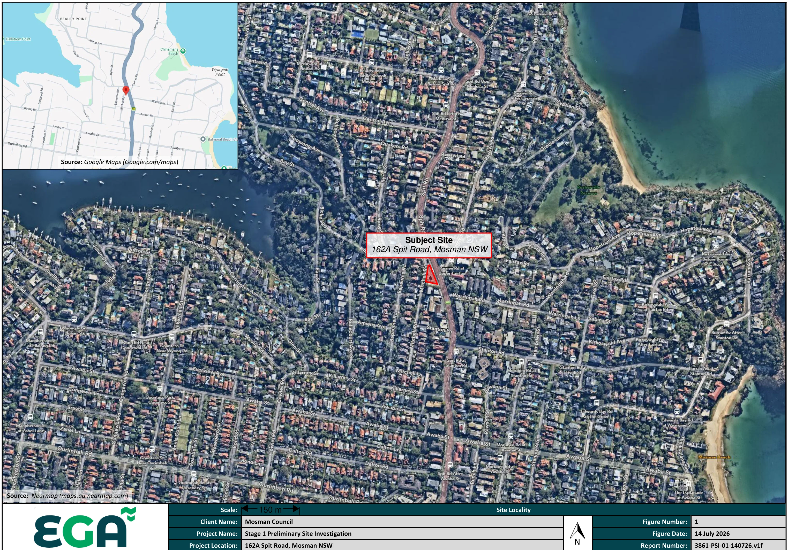

<!-- page 861 -->

Scale: Site Layout Client Name: Figure Number: 2 Project Name: Stage 1 Preliminary Site Investigation Figure Date: 14 July 2026 Project Location: 162A Spit Road, Mosman NSW Report Number: 3861-PSI-01-140726.v1f

10 m

Source:  Nearmap (maps.au.nearmap.com)

### LEGEND

Site Boundary

August 2026

Attachment 1.1.10 Mosman Council

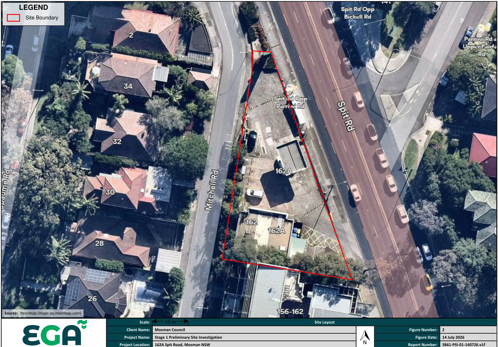

<!-- page 862 -->

Scale: Areas of Environmental Concern

Client Name: Figure Number: 3

Project Name: Stage 1 Preliminary Site Investigation Figure Date: 14 July 2026 Project Location: 162A Spit Road, Mosman NSW Report Number: 3861-PSI-01-140726.v1f

10 m

Source:  Nearmap (maps.au.nearmap.com)

### LEGEND

Site Boundary

AEC-1 / AEC-2 - Underground Petroleum Storage Systems (UPSS) and Underground Storage Tanks (USTs) / Potential Contaminants within Fill Soils

AEC-3 - On-Site Structures

August 2026

Attachment 1.1.10 Mosman Council

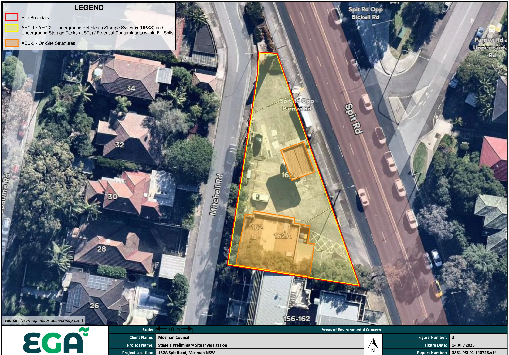

<!-- page 863 -->

Desktop Phase 1 Environmental Site Assessment 162A Spit Road, Mosman NSW 3861-PSI-01-270726.v2f

Page 26

#### APPENDIX A

#### GROUNDWATER BORE RECORDS

August 2026

Attachment 1.1.10 Mosman Council

<!-- page 864 -->

Rivers and Streams favourites search download sites find a site Real Time Data - Rivers And Streams Daily River Reports Daily River Reports Dams favourites search download sites find a site Real Time Data - Major Dams Groundwater (Telemetered data) favourites search download sites find a site Real Time Data - Bores All Groundwater Site details search download sites find a site search by licence All Groundwater Map Meteorology favourites search download sites find a site Real Time Data - Weather Stations Hunter River Salinity Trading Scheme Hunter River Salinity Trading Scheme

Scale = 1 : 3385 151.242, -33.817 337295, 6256745, 56

Map Info

There are no sites within 500 metres of the selected point. Zoom in and try again.

+ −

100 m 200 ft

contact WaterNSW

7/13/26, 12:20 PM Real-time water data

August 2026

Attachment 1.1.10 Mosman Council

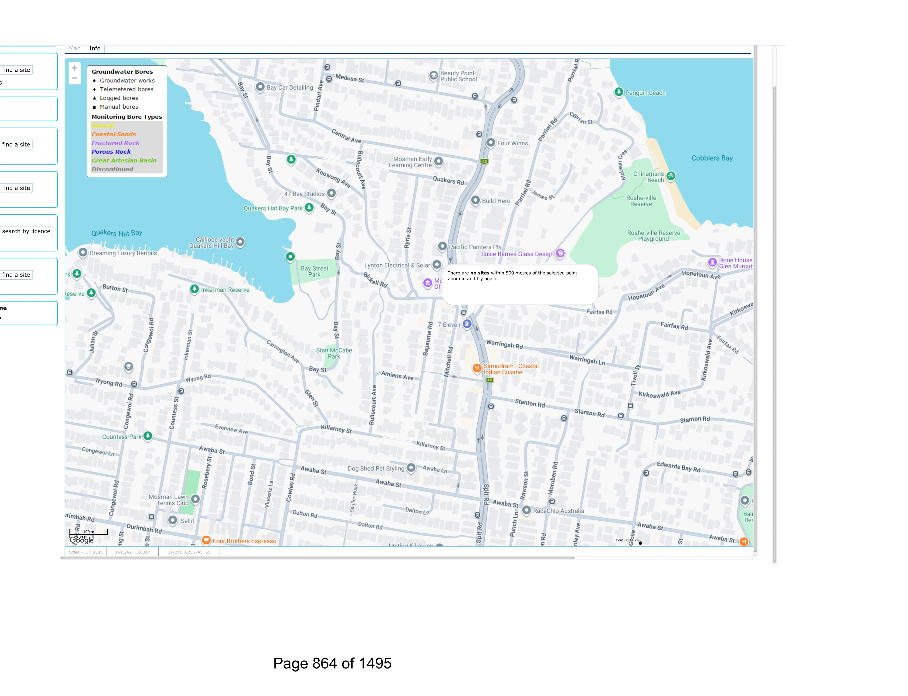

<!-- page 865 -->

Desktop Phase 1 Environmental Site Assessment 162A Spit Road, Mosman NSW 3861-PSI-01-270726.v2f

Page 27

#### APPENDIX B

#### NSW SEED MAP

August 2026

Attachment 1.1.10 Mosman Council

<!-- page 866 -->

A NSW Government website

SEED Sharing and Enabling Environmental Data in NSW Search and download data Miners and Explorers map Browse by topic Case studies and insights Help and contact

How to use the SEED map Layers Legend Acid Sulfate Soil Risk Hm: High probability in bottom sediments H0: High probability at/near ground surface H0(s): High probability at/near ground surface with acidic scalds H1: High probability <1 m below ground surface H1(s): High probability <1 m below ground surface with acidic scalds H2: High probability 1 - 3 m below ground surface H2(p): High probability 1 - 3 m below ground surface in Pleistocene sediments H4: High probability >3 m below ground surface Lm: Low probability in bottom sediments L0: Low probability at/near ground surface L0(p): Low probability at/near ground surface on Pleistocene sediments L1: Low probability <1 m below ground surface L1(p): Low probability <1 m below ground surface in Pleistocene sediments L2: Low probability 1 - 3 m below ground surface L2(p): Low probability 1 - 3 m below ground surface in Pleistocene sediments L4: Low probability >3 m below ground surface L4(p): Low probability >3 m below ground surface on Pleistocene sediments N: No known occurrence N(p): No known occurrence in Pleistocene sediments NB: No known occurrence, Beach X0: Disturbed terrain, < 1 m below ground surface X1: Disturbed terrain, elevation 1 - 2 m AHD X1(p): Disturbed terrain, elevation 1 - 2m AHD in Pleistocene sediments X1(s): Disturbed terrain, elevation 1 - 2 m AHD with acidic scalds X2: Disturbed terrain, elevation 2 - 4 m AHD X2(p): Disturbed terrain, elevation 2 - 4 m AHD in Pleistocene sediments X2(s): Disturbed terrain, elevation 2 - 4 m AHD with acidic scalds X4: Disturbed terrain, elevation >4 m AHD X4(p): Disturbed terrain, elevation >4 m AHD in Pleistocene sediments Map data © OpenStreetMap contributors, Microsoft, Facebook, Inc. and its affiliates, Esri Community Maps contributors, Map layer by Esri Powered by Esri

Scale 6667 200 m X: 16835483.30 Y: -4004061.76 Projected Coordinates (X/Y)

162A SPIT ROAD MOSMAN 2088

Basemap

Draw/ Measure

Tools

Layer Intersect

Save Map

Contact Us Privacy Policy | More Info

7/13/26, 12:27 PM SEED Map

https://geo.seed.nsw.gov.au/vertigisstudio/web/?app=cabd04d595ec43c1aaf4298e80e83ec2 1/1

August 2026

Attachment 1.1.10 Mosman Council

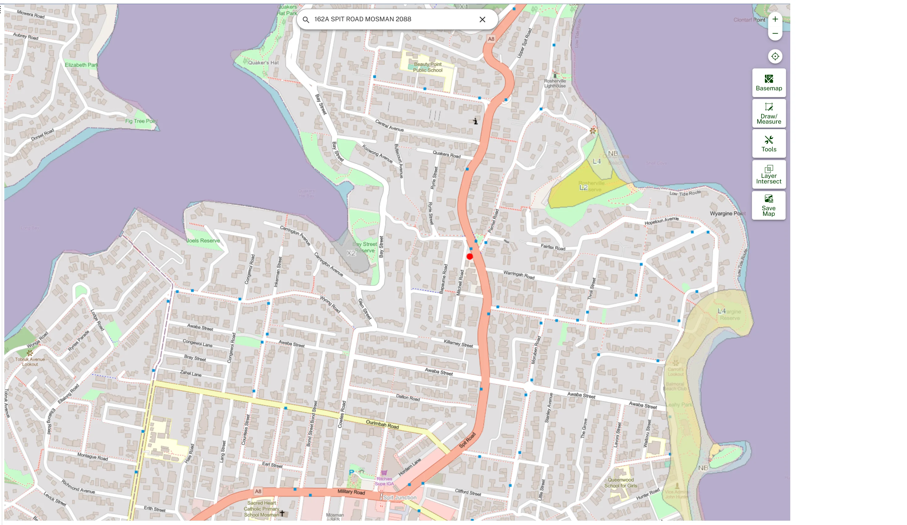

<!-- page 867 -->

Desktop Phase 1 Environmental Site Assessment 162A Spit Road, Mosman NSW 3861-PSI-01-270726.v2f

Page 28

#### APPENDIX C

#### HISTORICAL AERIAL IMAGERY

August 2026

Attachment 1.1.10 Mosman Council

<!-- page 868 -->

Desktop Phase 1 Environmental Site Assessment 162A Spit Road, Mosman NSW 3861-PSI-01-270726.v2f

Page 29

Historical Aerial 1. 1943 historical aerial imagery of the site. (Source: https://portal.spatial.nsw.gov.au/)

Historical Aerial 2. 1955 historical aerial imagery of the site. (Source: https://portal.spatial.nsw.gov.au/)

Historical Aerial 3. 1965 historical aerial imagery of the site. (Source: https://portal.spatial.nsw.gov.au/)

Historical Aerial 4. 1975 historical aerial imagery of the site. (Source: https://portal.spatial.nsw.gov.au/)

Historical Aerial 5. 1982 historical aerial imagery of the site. (Source: https://portal.spatial.nsw.gov.au/)

Historical Aerial 6. 1994 historical aerial imagery of the site. (Source: https://portal.spatial.nsw.gov.au/)

August 2026

Attachment 1.1.10 Mosman Council

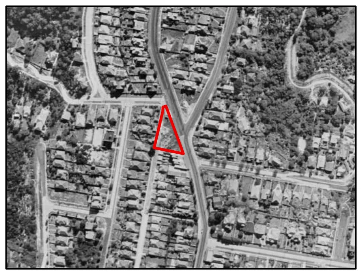

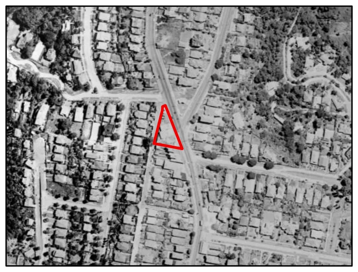

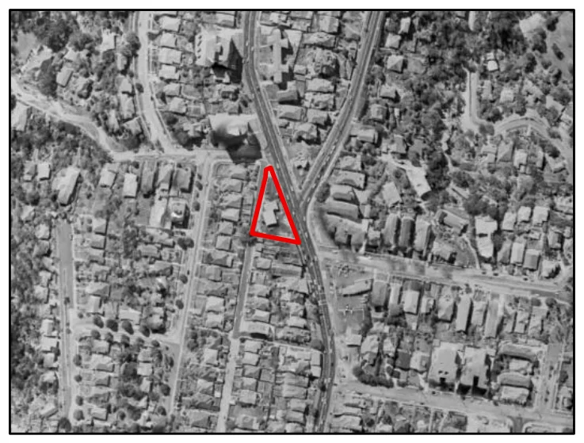

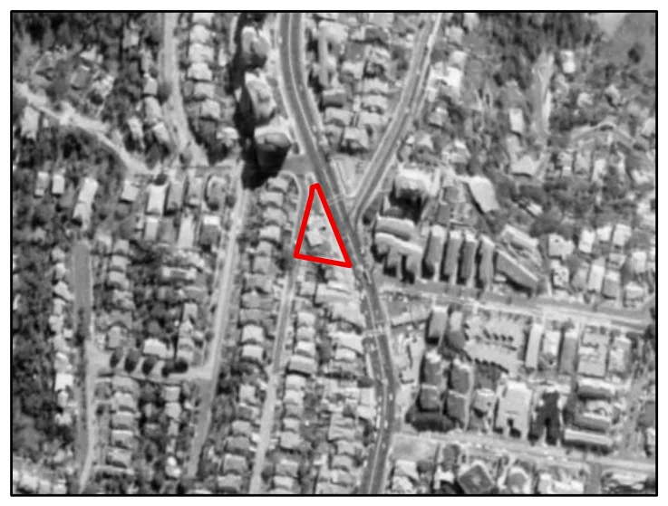

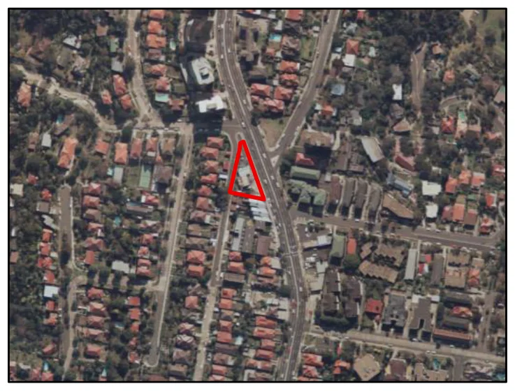

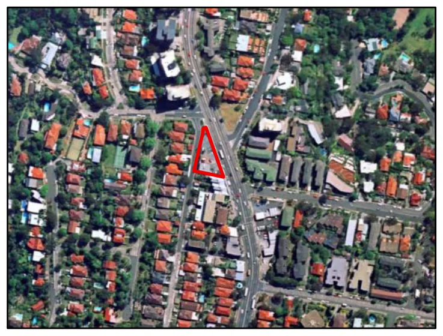

<!-- page 869 -->

Desktop Phase 1 Environmental Site Assessment 162A Spit Road, Mosman NSW 3861-PSI-01-270726.v2f

Page 30

Historical Aerial 7. 2005 historical aerial imagery of the site. (Source: https://portal.spatial.nsw.gov.au/)

Historical Aerial 8. 2013 historical aerial imagery of the site. (Source: https://apps.nearmap.com/)

Historical Aerial 9. 2026 historical aerial imagery of the site. (Source: https://apps.nearmap.com/)

August 2026

Attachment 1.1.10 Mosman Council

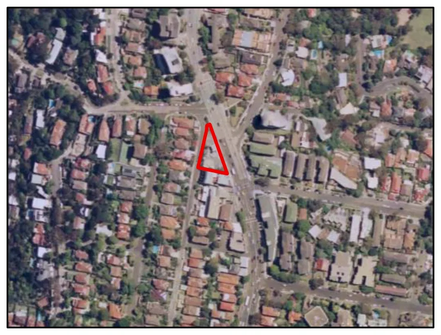

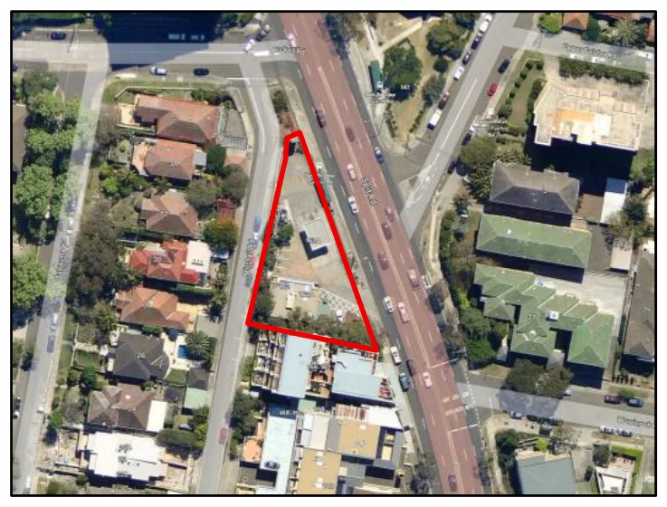

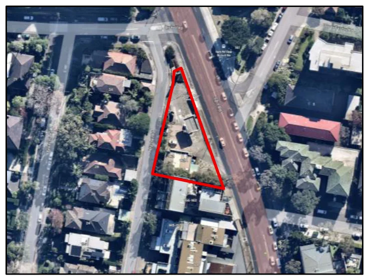

<!-- page 870 -->

Desktop Phase 1 Environmental Site Assessment 162A Spit Road, Mosman NSW 3861-PSI-01-270726.v2f

Page 31

#### APPENDIX D

#### NSW EPA PUBLIC REGISTER

August 2026

Attachment 1.1.10 Mosman Council

<!-- page 871 -->

Background

A strategy to systematically prioritise, assess and respond to notifications under Section 60 of the Contaminated Land Management Act 1997 (CLM Act) has been developed by the EPA. This strategy acknowledges the EPA’s obligations to make information available to the public under Government Information (Public Access) Act 2009 .

When a site is notified to the EPA, it may be accompanied by detailed site reports where the owner has been proactive in addressing the contamination and its source. However, often there is minimal information on the nature or extent of the contamination.

After receiving a report, the first step is to confirm that the report does not relate to a pollution incident. The Protection of the Environment Operations Act 1997 (POEO Act) deals with pollution incidents, waste stockpiling or dumping. The EPA also has an incident management process to manage significant incidents (https://www.epa.nsw.gov.au/reporting-and-incidents/incident- management).

In many cases, the information indicates the contamination is securely immobilised within the site, such as under a building or carpark, and is not currently causing any significant risks for the community or environment. Such sites may still need to be cleaned up, but this can be done in conjunction with any subsequent building or redevelopment of the land. These sites do not require intervention under the CLM Act, and are dealt with through the planning and development consent process. In these cases, the EPA informs the local council or other planning authority, so that the information can be recorded and considered at the appropriate time (https://www.epa.nsw.gov.au/your-environment/contaminated-land/managing-contaminated-land/role-of-planning-authorities).

Where indications are that the contamination could cause actual harm to the environment or an unacceptable offsite impact (i.e. the land is 'significantly contaminated'), the EPA would apply the regulatory provisions of the CLM Act to have the responsible polluter and/or landowner investigate and remediate the site. If the reported contamination could present an immediate or long-term threat to human health NSW Health will be consulted. SafeWork NSW and Water NSW can also be consulted if there appear to be occupational health and safety risks or an impact on groundwater quality.

As such, the sites notified to the EPA and presented in the list of contaminated sites notified to the EPA are at various stages of the assessment and remediation process. Understanding the nature of the underlying contamination, its implications and implementing a remediation program where required, can take a considerable period of time. The list provides an indication, in relation to each nominated site, as to the management status of that particular site. Further detailed information may be available from the EPA or the person who notified the site.

The following questions and answers may assist those interested in this issue.

Frequently asked questions

Why does my land appear on the list of notified sites?

Your land may appear on the list because:

• the site owner and/or the polluter has notified the EPA under section 60 of the CLM Act • the EPA has been notified via other means and is satisfied that the site is or was contaminated.

If a site is on the list, it does not necessarily mean the contamination is significant enough to regulate under the CLM Act.

List current as at 9 April 2026 1 of 139

August 2026

Attachment 1.1.10 Mosman Council

<!-- page 872 -->

Does the list contain all contaminated sites in NSW?

No. The list only contains contaminated sites that EPA is aware of. If a site is not on the list, it does not necessarily mean the site is not contaminated.

The EPA relies on responsible parties and the public to notify contaminated sites.

How are notified contaminated sites managed by the EPA?

There are different ways the EPA can manage notified contaminated sites. Options include:

• regulation under the CLM Act, POEO Act, or both • notifying the relevant planning authority for management under the planning and development process • managing the site under the Protection of the Environment Operation (Underground Petroleum Storage Systems) Regulation 2014.

There are specific cases where contamination is managed under a tailored program operated by another agency (for example, the Resources & Geoscience's Legacy Mines Program).

What should I do if I am a potential buyer of a site that appears on the list?

You should seek advice from the seller to understand the contamination issue. You may need to seek independent contamination or legal advice.

The information provided in the list is indicative only and a starting point for your own assessment. Land contamination from past site uses is common, mainly in urban environments. If the site is properly remediated or managed, it may not affect the intended future use of the site.

Who can I contact if I need more information about a site?

You can contact the Environment Line at any time by calling 131 555 or by emailing info@environment.nsw.gov.au.

List of NSW Contaminated Sites Notified to the EPA

List current as at 9 April 2026 2 of 139

August 2026

Attachment 1.1.10 Mosman Council

<!-- page 873 -->

Site Status

Under assessment

Under Preliminary Investigation Order

Regulation under CLM Act not required

Explanation

The contamination is being assessed by the EPA to determine whether regulation is required. The EPA may require further information to complete the assessment. For example, the completion of management actions regulated under the planning process or Protection of the Environment Operations Act 1997 .

The EPA has issued a Preliminary Investigation Order under s10 of the Contaminated Land Management Act 1997 , to obtain additional information needed to complete the assessment.

The EPA has completed an assessment of the contamination and decided that regulation under the Contaminated Land Management Act 1997 is not required.

Disclaimer

The EPA has taken all reasonable care to ensure that the information in the list of contaminated sites notified to the EPA (the list) is complete and correct. The EPA does not, however, warrant or represent that the list is free from errors or omissions or that it is exhaustive.

The EPA may, without notice, change any or all of the information in the list at any time.

You should obtain independent advice before you make any decision based on the information in the list.

The list is made available on the understanding that the EPA, its servants and agents, to the extent permitted by law, accept no responsibility for any damage, cost, loss or expense incurred by you as a result of:

1.            any information in the list; or 2.            any error, omission or misrepresentation in the list; or 3.            any malfunction or failure to function of the list; 4.            without limiting (2) or (3) above, any delay, failure or error in recording, displaying or updating information.

List current as at 9 April 2026 3 of 139

August 2026

Attachment 1.1.10 Mosman Council

<!-- page 874 -->

Regulation being finalised

Contamination currently regulated under CLM Act

Contamination currently regulated under POEO Act

Contamination being managed via the planning process (EP&A Act)

Contamination formerly regulated under the CLM Act

Contamination formerly regulated under the POEO Act

The EPA has completed an assessment of the contamination and decided that the contamination is significant enough to warrant regulation under the Contaminated Land Management Act 1997 . A regulatory approach is being finalised.

The EPA has completed an assessment of the contamination and decided that the contamination is significant enough to warrant regulation under the Contaminated Land Management Act 1997 (CLM Act). Management of the contamination is regulated by the EPA under the CLM Act. Regulatory notices are available on the EPA’s Contaminated Land Public Record.

Contamination is currently regulated under the Protection of the Environment Operations Act 1997 (POEO Act).  The EPA as the appropriate regulatory authority reasonably suspects that a pollution incident is occurring/ has occurred and that it requires regulation under the POEO Act. The EPA may use environment protection notices, such as clean up notices, to require clean up action to be taken.  Such regulatory notices are available on the POEO public register.

The EPA has completed an assessment of the contamination and decided that the contamination is significant enough to warrant regulation. The contamination of this site is managed by the consent authority under the Environmental Planning and Assessment Act 1979 (EP&A Act) planning approval process, with EPA involvement as necessary to ensure significant contamination is adequately addressed. The consent authority is typically a local council or the Department of Planning and Environment.

The EPA has determined that the contamination is no longer significant enough to warrant regulation under the Contaminated Land Management Act 1997 (CLM Act). The contamination was addressed under the CLM Act.

The EPA has determined that the contamination is no longer significant enough to warrant regulation. The contamination was addressed under the Protection of the Environment Operations Act 1997 (POEO Act).

List current as at 9 April 2026 4 of 139

August 2026

Attachment 1.1.10 Mosman Council

<!-- page 875 -->

Contamination was addressed via the planning process (EP&A Act)

Ongoing maintenance required to manage residual contamination (CLM Act)

The EPA has determined that ongoing maintenance, under the Contaminated Land Management Act 1997 (CLM Act), is required to manage the residual contamination. Regulatory notices under the CLM Act are available on the EPA’s Contaminated Land Public Record.

The EPA has determined that the contamination is no longer significant enough to warrant regulation. The contamination was addressed by the appropriate consent authority via the planning process under the Environmental Planning and Assessment Act 1979 (EP&A Act).

List current as at 9 April 2026 5 of 139

August 2026

Attachment 1.1.10 Mosman Council

<!-- page 876 -->

Suburb SiteName Address ContaminationActivityType ManagementClass Latitude Longitude

MORPETH Telstra Cable Installation and RTA Bridge work Northumberland STREET Other Petroleum Regulation under CLM Act not required -32.72489729 151.6266795

MORPETH Former Service Station Swan  STREET Service Station Regulation under CLM Act not required -32.72477413 151.6250642

MORTLAKE Former Petroleum Storage Site 108-116 Tennyson ROAD Other Petroleum Regulation under CLM Act not required -33.83979033 151.1064889

MORTLAKE Kendall Bay Sediments Kendall BAY Gasworks Contamination currently regulated under CLM Act -33.83905999 151.1120458

MORTLAKE Former AGL site Tennyson  ROAD Gasworks Contamination formerly regulated under the CLM Act -33.84287407 151.1109313

MORTLAKE Majors Bay Redevelopment 14-22 Hilly STREET Other Industry Regulation under CLM Act not required -33.83954617 151.1054674

MORUYA Former Fuel Depot Moruya 11 to 13 Ford STREET Other Petroleum Regulation under CLM Act not required -35.9112243 150.0826475

MORUYA Caltex Service Station Moruya 80-84 Campbell STREET Service Station Regulation under CLM Act not required -35.91195596 150.0824213

MORUYA Ampol Fuel Depot - Moruya 26 Campbell STREET Service Station Regulation under CLM Act not required -35.9104985 150.0711419

MOSMAN 7-Eleven Mosman 162A Spit Road Corner Mitchell ROAD Service Station Regulation under CLM Act not required -33.81747016 151.2433633

MOSMAN BP Service Station 175 Ourimbah ROAD Service Station Regulation under CLM Act not required -33.82106757 151.233291

MOSMAN BP Express Mosman 175 Ourimbah  ROAD Service Station Regulation under CLM Act not required -33.82106459 151.2332921

MOSMAN 7-Eleven Service Station Mosman 45 Spit ROAD Service Station Regulation under CLM Act not required -33.82302718 151.2435627

MOSMAN Allan Border Oval Myahgah  ROAD Landfill Regulation under CLM Act not required -33.82681534 151.2417712

MOSMAN 173 Avenue Road, MOSMAN NSW 2088 173 Avenue ROAD Unclassified Regulation under CLM Act not required -33.930869 150.97132

List current as at 9 April 2026 85 of 139

August 2026

Attachment 1.1.10 Mosman Council

<!-- page 877 -->

Suburb SiteName Address ContaminationActivityType ManagementClass Latitude Longitude

MOSS VALE Woolworths Service Station Moss Vale 609 Argyle  STREET Service Station Regulation under CLM Act not required -34.55409411 150.3609797

MOSS VALE Coles Express Service Station 579 Argyle STREET Service Station Regulation under CLM Act not required -34.55313422 150.364684

MOSS VALE Moss Vale Refuelling Facility Lackey ROAD Other Petroleum Regulation under CLM Act not required -34.54662421 150.3721525

MOUNT ANNAN Woolworths Caltex Mount Annan 157 Narellan (Corner Smeaton Grange Road) ROAD Service Station Regulation under CLM Act not required -34.04685527 150.7610434

MOUNT ANNAN Great Southern Railways Aqueduct Off Narellan  ROAD Unclassified Regulation under CLM Act not required -34.07308479 150.7707436

MOUNT COLAH Caltex Service Station Mount Colah 603 Pacific HIGHWAY Service Station Regulation under CLM Act not required -33.67034662 151.1151861

MOUNT COLAH Foxglove Oval Foxglove ROAD Landfill Contamination currently regulated under CLM Act -33.65829855 151.1229638

MOUNT DRUITT Caltex (former Mobil) Service Station, 17 Mount Street, Mount Druitt 17 Mount STREET Service Station Regulation under CLM Act not required -33.76567994 150.8244544

MOUNT DRUITT 7-Eleven Mount Druitt Lot 6 Luxford ROAD Other Petroleum Regulation under CLM Act not required -33.76483839 150.8254157

MOUNT HUTTON Woolworths Service Station 46 Wilsons ROAD Service Station Regulation under CLM Act not required -32.9836378 151.67309

MOUNT PRITCHARD 7-Eleven Service Station 352 Elizabeth DRIVE Service Station Regulation under CLM Act not required -33.90260656 150.8963326

MOUNT THORLEY Bulga Surface Operations Broke ROAD Other Industry Regulation under CLM Act not required -32.68325751 151.1206158

MOUNT THORLEY Lowes Petroleum (Former BP) Depot Mount Thorley 74 Mount Thorley ROAD Other Petroleum Regulation under CLM Act not required -32.62443074 151.1025122

MOUNT VICTORIA Former Mobil Service Station 81 Great Western HIGHWAY Service Station Regulation under CLM Act not required -33.5889727 150.2511783

MOUNT VICTORIA Caltex Service Station 36a Great Western HIGHWAY Service Station Regulation under CLM Act not required -33.58436517 150.2465528

List current as at 9 April 2026 86 of 139

August 2026

Attachment 1.1.10 Mosman Council

<!-- page 878 -->

Search TIP To search for a specific site, search by LGA (local government area) and carefully review all sites listed. ... more search tips

Home Public registers Contaminated land record of notices Search results Your search for:Suburb: MOSMAN Search Again Refine Search did not find any records in our database. If a site does not appear on the record it may still be affected by contamination. For example: Contamination may be present but the site has not been regulated by the EPA under the Contaminated Land Management Act 1997 or the Environmentally Hazardous Chemicals Act 1985. The EPA may be regulating contamination at the site through a licence or notice under the Protection of the Environment Operations Act 1997 (POEO Act). Contamination at the site may be being managed under the planning process. More information about particular sites may be available from: The POEO public register The appropriate planning authority: for example, on a planning certificate issued by the local council under section 149 of the Environmental Planning and Assessment Act. See What's in the record and What's not in the record. If you want to know whether a specific site has been the subject of notices issued by the EPA under the CLM Act, we suggest that you search by Local Government Area only and carefully review the sites that are listed. This public record provides information about sites regulated by the EPA under the Contaminated Land Management Act 1997, including sites currently and previously regulated under the Environmentally Hazardous Chemicals Act 1985. Your inquiry using the above search criteria has not matched any record of current or former regulation. You should consider searching again using different criteria. The fact that a site does not appear on the record does not necessarily mean that it is not affected by contamination. The site may have been notified to the EPA but not yet assessed, or contamination may be present but the site is not yet being regulated by the EPA. Further information about particular sites may be available from the appropriate planning authority, for example, on a planning certificate issued by the local council under section 149 of the Environmental Planning and Assessment Act. In addition the EPA may be regulating contamination at the site through a licence under the Protection of the Environment Operations Act 1997. You may wish to search the POEO public register.POEO public register 13 July 2026

7/13/26, 12:13 PM DECCW | Search results

https://app.epa.nsw.gov.au/prclmapp/searchresults.aspx?&LGA=&Suburb=MOSMAN&Notice=&Name=&Text=&DateFrom=&DateTo= 1/1

August 2026

Attachment 1.1.10 Mosman Council

<!-- page 879 -->

Home Public registers POEO Public Register Licences, applications and notices search Search results

Your search for: General Search with the following criteria Suburb - mosman returned 26 results Export to excel 2 of 2 Pages Search Again Number Name Location Type Status Issued date 1522383 TARONGA CONSERVATION SOCIETY AUSTRALIA BRADLEYS HEAD ROAD, MOSMAN, NSW 2088

s.58 Licence Variation Issued Issued 09 Jul 2015

1600361 TARONGA CONSERVATION SOCIETY AUSTRALIA BRADLEYS HEAD ROAD, MOSMAN, NSW 2088

Compliance Audit Complete Complete 14 Sep 2020

1603655 TARONGA CONSERVATION SOCIETY AUSTRALIA BRADLEYS HEAD ROAD, MOSMAN, NSW 2088

s.58 Licence Variation Issued Issued 08 Apr 2021

1615336 TARONGA CONSERVATION SOCIETY AUSTRALIA BRADLEYS HEAD ROAD, MOSMAN, NSW 2088

s.58 Licence Variation Issued Issued 23 Dec 2021

1623058 TARONGA CONSERVATION SOCIETY AUSTRALIA BRADLEYS HEAD ROAD, MOSMAN, NSW 2088

s.58 Licence Variation Issued Issued 30 Nov 2022

1630287 TARONGA CONSERVATION SOCIETY AUSTRALIA BRADLEYS HEAD ROAD, MOSMAN, NSW 2088

s.58 Licence Variation Issued Issued 03 Oct 2023

12 13 July 2026

7/13/26, 12:14 PM Environment & Heritage | PRPOEO

https://app.epa.nsw.gov.au/prpoeoapp/SearchResult.aspx?SearchTag=all&searchrange=general&range=general&SortExpression=AccountablePa… 1/1

August 2026

Attachment 1.1.10 Mosman Council

<!-- page 880 -->

Home Public registers POEO Public Register Licences, applications and notices search Search results

Your search for: General Search with the following criteria Suburb - mosman returned 26 results Export to excel 1 of 2 Pages Search Again Number Name Location Type Status Issued date 1621649 THE SPIT, MOSMAN, NSW 2088 s.58 Licence Variation Issued Issued 08 Feb 2023 1028480 ARDENT LEISURE LIMITED  THE SPIT, MOSMAN, NSW 2088 s.58 Licence Variation Issued Issued 03 Jul 2003 1032563 ARDENT LEISURE LIMITED  THE SPIT, MOSMAN, NSW 2088 s.58 Licence Variation Issued Issued 20 Nov 2003 1069448 ARDENT LEISURE LIMITED  THE SPIT, MOSMAN, NSW 2088 s.58 Licence Variation Issued Issued 05 Feb 2007 1070978 ARDENT LEISURE LIMITED  THE SPIT, MOSMAN, NSW 2088 s.58 Licence Variation Issued Issued 14 Mar 2007 1072567 ARDENT LEISURE LIMITED  THE SPIT, MOSMAN, NSW 2088 s.58 Licence Variation Issued Issued 24 Apr 2007 1074550 ARDENT LEISURE LIMITED  THE SPIT, MOSMAN, NSW 2088 s.58 Licence Variation Issued Issued 13 Jun 2007 1078238 ARDENT LEISURE LIMITED  THE SPIT, MOSMAN, NSW 2088 s.58 Licence Variation Issued Issued 19 Sep 2007 1085886 ARDENT LEISURE LIMITED  THE SPIT, MOSMAN, NSW 2088 s.58 Licence Variation Issued Issued 12 May 2008 1097027 ARDENT LEISURE LIMITED  THE SPIT, MOSMAN, NSW 2088 s.58 Licence Variation Issued Issued 30 Jan 2009 1509253 ARDENT LEISURE LIMITED  THE SPIT, MOSMAN, NSW 2088 s.58 Licence Variation Issued Issued 24 Jun 2013 11724 HEALTHSCOPE OPERATIONS PTY LTD

#### 1 ELLAMATTA AVENUE,

MOSMAN, NSW 2088 POEO licence No longer in force No longer in force

16 Sep 2002

1048188 HEALTHSCOPE OPERATIONS PTY LTD

#### 1 ELLAMATTA AVENUE,

MOSMAN, NSW 2088 s.58 Licence Variation Issued Issued 27 May 2005 11211 MA MARINA FUND OPCO NO. 1 PTY LTD THE SPIT, MOSMAN, NSW 2088 POEO licence Issued Issued 30 Jan 2001 3514873 MA MARINA FUND OPCO NO. 1 PTY LTD THE SPIT, MOSMAN, NSW 2088 s.91 Clean Up Notice Issued Issued 10 Jan 2026 1596267 NONBANK MORTGAGES PTY. LTD. THE SPIT, MOSMAN, NSW 2088 s.58 Licence Variation Issued Issued 29 Jun 2021 1008406 OMNI LEISURE OPERATIONS LIMITED THE SPIT, MOSMAN, NSW 2088 s.58 Licence Variation Issued Issued 13 Jun 2001 1018813 OMNI LEISURE OPERATIONS LIMITED THE SPIT, MOSMAN, NSW 2088 s.58 Licence Variation Issued Issued 06 Sep 2002 1677 TARONGA CONSERVATION SOCIETY AUSTRALIA BRADLEYS HEAD ROAD, MOSMAN, NSW 2088

POEO licence Issued Issued 26 Sep 2000

1512309 TARONGA CONSERVATION SOCIETY AUSTRALIA BRADLEYS HEAD ROAD, MOSMAN, NSW 2088

Compliance Audit Complete Complete 21 Feb 2013

12 13 July 2026

7/13/26, 12:14 PM Environment & Heritage | PRPOEO

https://app.epa.nsw.gov.au/prpoeoapp/SearchResult.aspx?SearchTag=all&searchrange=general&range=general&SortExpression=AccountablePa… 1/1

August 2026

Attachment 1.1.10 Mosman Council

<!-- page 881 -->

## Desktop Phase 1 Environmental Site

## Assessment

612 Military Road, Mosman NSW

Report No: Report Date:

3861-PSI-02-290726.v2f 03/08/2026

info@egau.com.au

NSW: 36E Fitzroy Street, Marrickville, NSW 2204 VIC: 88 Langridge St, Collingwood VIC 3066

August 2026

Attachment 1.1.10 Mosman Council

<!-- page 882 -->

Desktop Phase 1 Environmental Site Assessment 612 Military Road, Mosman NSW 3861-PSI-02-290726.v2f

Page 1

### Document Record

Revision Date Author Reviewer

v1f 29 July 2026 Rachelle Conna Isabelle Figatowski

v2f 3 August 2026 Rachelle Conna Isabelle Figatowski

Author Signature Reviewer Signature

Name Rachelle Conna Name Isabelle Figatowski

Credentials B. Sc. (Zoology) Credentials B.Sc. (Env. Consulting)

Title Environmental Consultant Title Senior Environmental Consultant

Document Title: Desktop Phase 1 Environmental Site Assessment - 612 Military Road, Mosman NSW Site Address: 612 Military Road, Mosman NSW Client Name: Site Size: ≈ 1,500 m2 Reference Number: 3861-PSI-02-290726.v2f Project Type: Desktop Phase 1 Environmental Site Assessment Project Type Abbreviation: PSI Document Draft: FINAL Document Revision No. v2f

Prepared by Environmental Group Australia Pty Ltd ABN: 83 671 599 143

August 2026

Attachment 1.1.10 Mosman Council

<!-- page 883 -->

Desktop Phase 1 Environmental Site Assessment 612 Military Road, Mosman NSW 3861-PSI-02-290726.v2f

Page 2

### EXECUTIVE SUMMARY

Environmental Group Australia Pty Ltd (EGA) was engaged by Mosman Council (hereafter referred to as ‘the client’), to undertake Desktop Phase 1 Environmental Site Assessment of the property located within Lot 3 DP536939, 612 Military Road, Mosman NSW (hereafter referred to as ‘the site’) (refer to Figure 1 and Figure 2).

The client is preparing to lodge a planning proposal to implement the draft Mosman Masterplan, which proposes increased housing capacity across the study area, including amendments to the planning controls at the site to facilitate redevelopment.

#### Purpose and Objectives

A Desktop Phase 1 Environmental Site Assessment was required to assess the likelihood that the site had been contaminated by past or present activities and to form a preliminary view on the extent and degree of contamination. The objectives of the investigation were to:

• Provide advice on whether the site may require a stage 2 intrusive site assessment, to better define the nature and extent of potential contamination within the site; and • Provide advice on whether the site would be suitable (in the context of land contamination) for any proposed future rezoning.

#### Site Description

• The site covers an area of approximately 1,500 m2; • The site is currently zoned as E3: Productivity Support; • The site is currently utilised as a Car Wash; • The site is located within a mixed commercial-industrial and residential district.

Current aerial imagery suggests that the site is operating as a car wash, with one structure to the south and one structure to the northeast and hardstand across the site surface.

#### Proposed Development

Reference is made to the draft Mosman Masterplan Structure Plan prepared by SJB Architecture, dated 29 July 2026 (Drawing No. 06, Revision 07). EGA understands that the site has been identified for increased development potential, however, have not been provided with any specific redevelopment plans. EGA has made the assumption that future development may include the demolition of current structures, rezoning of land, subdivision of land, and construction of new structures and infrastructure. EGA has not been made aware of any basement plans and have presumed that they are proposed as part of the future development.

#### Scope of Work

EGA undertook the following scope of works to address the project objectives:

• A desktop review of relevant information pertaining to the site; and • Assessment and reporting of the desktop review.

#### Investigation Outcome

Based on EGA’s assessment of the desktop review information, in the context of the proposed redevelopment scenario, EGA has made the following conclusions:

• The search of historical aerial imagery indicated a moderate potential for contamination within the site to have occurred, associated with uncontrolled demolition. EGA also notes that due to the dates of construction, the building fabrics may contain hazardous building materials;

August 2026

Attachment 1.1.10 Mosman Council

<!-- page 884 -->

Desktop Phase 1 Environmental Site Assessment 612 Military Road, Mosman NSW 3861-PSI-02-290726.v2f

Page 3

• A review of publicly available contaminated land databases indicated that the site is not the subject of any licences, applications, notices under Section 308 of the Protection of the Environment Operations Act 1997. The site is not notified under Section 60 of the Contaminated Land Management Act 1997. The site is not the subject of any notifications under Section 58 of the Contaminated Land Management Act 1997; • The contaminants and areas of environmental concern (AEC), requiring further consideration or assessment, and possibly remediation or risk management, are the following: o AEC-1: Potential Chemical Storage – Leaks, Spills or Poor Management; o AEC-2: Wastewater Treatment and Drainage Infrastructure – Structural Failure or Leakage; o AEC-3: Potential Contaminants within Soils; and o AEC-4: On-Site Structures – Hazardous Building Materials; • Soils not impacted by contamination may meet excavated natural material (ENM) or General Solid Waste (GSW) classification.

#### Conclusions and Recommendations

Notwithstanding the above, the potential contaminants of concern and affected environmental media are consistent with those typically encountered on brownfield redevelopment sites within the Sydney Basin. Any contamination that may be present is not expected to be of such an extent or complexity that it could not be effectively managed or remediated using conventional and readily available remediation techniques. Accordingly, the potential for contamination at the site is not considered to preclude proposed future redevelopment.

As detailed development plans are prepared for individual areas of the site, the existing environmental data should be reviewed in conjunction with the overall remedial strategy to confirm the nature and extent of any contamination relevant to the proposed works. Where required, additional assessment should be undertaken, and appropriate remediation and/or management measures developed, to demonstrate that the relevant portion of the site is, or can be made, suitable for its intended use.

This report, including its conclusions and recommendations, must be read in conjunction with the limitations presented in Section 12.

August 2026

Attachment 1.1.10 Mosman Council

<!-- page 885 -->

Desktop Phase 1 Environmental Site Assessment 612 Military Road, Mosman NSW 3861-PSI-02-290726.v2f

Page 4

#### TABLE OF CONTENTS

#### 1.

#### INTRODUCTION

#### 7

1.1. Purpose and Objectives ............................................................................................................... 7 1.2. Site Description ............................................................................................................................. 7 1.3. Proposed Development ................................................................................................................ 7 1.4. Scope of Work .............................................................................................................................. 7

#### 2.

#### SITE IDENTIFICATION

#### 8

#### 3.

#### PHYSICAL SITE CONDITIONS

#### 9

#### 4.

#### SITE HISTORY AND LAND USE

#### 11

4.1. Aerial Imagery ............................................................................................................................ 11 4.2. Anecdotal Information ............................................................................................................... 11 4.3. Incident and Complaints History ............................................................................................... 11 4.4. Previous Contamination Assessments ...................................................................................... 11

#### 5.

#### REGULATORY RECORDS

#### 12

5.1. NSW EPA CLM Act Register of Notified Sites and Notices ....................................................... 12 5.2. NSW EPA POEO Act Register of Licences, Applications and Notices ...................................... 12 5.3. Dangerous Goods Licences Search ............................................................................................ 12

#### 6.

#### INFORMATION SOURCES

#### 13

#### 7.

#### CONCEPTUAL SITE MODEL

#### 14

7.1. Potential Areas of Environmental Concern ............................................................................... 14 7.2. Contaminants, Migration Pathways, Receptors and Risks ...................................................... 14 7.3. Site Characteristics Affecting Risks ........................................................................................... 15 7.3.1. Land-Use Setting................................................................................................................ 15 7.3.2. Surface Water ..................................................................................................................... 15 7.3.3. Groundwater – Drinking Water Risks ................................................................................ 16 7.3.4. Recreational Water Use and Aquatic Ecosystems ............................................................ 16 7.3.5. Terrestrial Ecosystems ....................................................................................................... 16 7.3.6. Human Exposures to Site Contaminants ........................................................................... 16

#### 8.

#### RISK ASSESSMENT (PLANNING LEVEL)

#### 17

#### 9.

#### PLANNING AND MASTER PLAN ADVICE

#### 18

9.1. Suitability for Future Development ............................................................................................ 18 9.2. Identification of Potential Issues ............................................................................................... 18 9.3. Requirements for the Development Application (DA) Stage ................................................... 18 9.4. Suggestion Inclusion to Master Planning .................................................................................. 18

#### 10. CONTAMINANTS OF CONCERN

#### 20

#### 11. CONCLUSIONS AND RECOMMENDATIONS

#### 21

11.1. Site Condition and Further Requirements ................................................................................. 21 11.2. Recommendations ...................................................................................................................... 21

#### 12. STATEMENT OF LIMITATIONS

#### 22

August 2026

Attachment 1.1.10 Mosman Council

<!-- page 886 -->

Desktop Phase 1 Environmental Site Assessment 612 Military Road, Mosman NSW 3861-PSI-02-290726.v2f

Page 5

#### 13. REFERENCES

#### 23

FIGURES Figure 1 - Site Locality Figure 2 - Site Layout Figure 3 - Areas of Environmental Concern

APPENDICES A - Groundwater Bore Records B - NSW SEED Map C - Historical Aerial Imagery D - NSW EPA Public Register

August 2026

Attachment 1.1.10 Mosman Council

<!-- page 887 -->

Desktop Phase 1 Environmental Site Assessment 612 Military Road, Mosman NSW 3861-PSI-02-290726.v2f

Page 6

### LIST OF ABBREVIATIONS

AHD Australian Height Datum AEC Area of Environmental Concern ANZECC Australian and New Zealand Environment and Conservation Council AST Aboveground storage tank Bgl Below ground level BTEX Benzene, toluene, ethylbenzene, xylene CoC Chain of Custody CSM Conceptual Site Model EIL Ecological Investigation Level EGA Environmental Group Australia Pty Ltd EPA Environment Protection Authority HIL Health Investigation Levels HSL Health Screening Levels LOR [Laboratory] Limit of Reporting NATA National Association of Testing Laboratories NA Not applicable ND Not detected NEPC National Environment Protection Council NEPM National Environment Protection Measure NSW EPA NSW Environment Protection Authority OCP Organochlorine Pesticide PAEC Potential Area of Environmental Concern PAH Polycyclic aromatic hydrocarbon PCB Polychlorinated biphenyl PID Photo-ionisation detector PSI Preliminary Site Investigation QA/QC Quality assurance/Quality control RPD Relative percentage difference SAQP Sampling Analysis and Quality Plan SVOC Semi-volatile organic compound USCS Unified Soil Classification System UST Underground storage tank VOC Volatile organic compound

August 2026

Attachment 1.1.10 Mosman Council

<!-- page 888 -->

Desktop Phase 1 Environmental Site Assessment 612 Military Road, Mosman NSW 3861-PSI-02-290726.v2f

Page 7

#### 1. INTRODUCTION

Environmental Group Australia Pty Ltd (EGA) was engaged by Mosman Council (hereafter referred to as ‘the client’), to undertake Desktop Phase 1 Environmental Site Assessment of the property located within Lot 3 DP536939, 612 Military Road, Mosman NSW (hereafter referred to as ‘the site’) (refer to Figure 1 and Figure 2).

The client is preparing to lodge a planning proposal to implement the draft Mosman Masterplan, which proposes increased housing capacity across the study area, including amendments to the planning controls at the site to facilitate redevelopment.

#### 1.1.

#### Purpose and Objectives

A Desktop Phase 1 Environmental Site Assessment was required to assess the likelihood that the site had been contaminated by past or present activities and to form a preliminary view on the extent and degree of contamination. The objectives of the investigation were to:

• Provide advice on whether the site may require a stage 2 intrusive site assessment, to better define the nature and extent of potential contamination within the site; and • Provide advice on whether the site would be suitable (in the context of land contamination) for any proposed future rezoning.

#### 1.2.

#### Site Description

• The site covers an area of approximately 1,500 m2; • The site is currently zoned as E3: Productivity Support; • The site is currently utilised as a commercial car wash; • The site is located within a mixed commercial-industrial and residential district.

Current aerial imagery suggests that the site is operating as a commercial car wash, with one structure to the south and one structure to the northeast and hardstand across the site surface.

#### 1.3.

#### Proposed Development

Reference is made to the draft Mosman Masterplan Structure Plan prepared by SJB Architecture, dated 29 July 2026 (Drawing No. 06, Revision 07). EGA understands that the site has been identified for increased development potential, however, have not been provided with any specific redevelopment plans. EGA has made the assumption that future development may include the demolition of current structures, rezoning of land, subdivision of land, and construction of new structures and infrastructure. EGA has not been made aware of any basement plans and have presumed that they are proposed as part of the future development.

#### 1.4.

#### Scope of Work

EGA undertook the following scope of works to address the project objectives:

• A desktop review of relevant information pertaining to the site; and • Assessment and reporting of the desktop review.

August 2026

Attachment 1.1.10 Mosman Council

<!-- page 889 -->

Desktop Phase 1 Environmental Site Assessment 612 Military Road, Mosman NSW 3861-PSI-02-290726.v2f

Page 8

#### 2. SITE IDENTIFICATION

The site identification details and associated information are presented in Table 2.1.

Table 2.1 Site Identification Information Attribute Description

Street Address 612 Military Road, Mosman NSW

Lot and Deposited Plan (DP) Lot 3 DP536939

Current Owner

Geographical Coordinates 33°49'26.9"S 151°14'19.8"E (approximate centre of site)

Site Area ≈ 1,500 m2

Local Government Area (LGA) Mosman Municipal Council

Parish Willoughby

County Cumberland

Zoning E3: Productivity Support Mosman Local Environmental Plan 2012 (2011 EPI 647)

The locality of the site is identified in Figure 1.

The general layout and boundary of the site are shown in Figure 2.

August 2026

Attachment 1.1.10 Mosman Council

<!-- page 890 -->

Desktop Phase 1 Environmental Site Assessment 612 Military Road, Mosman NSW 3861-PSI-02-290726.v2f

Page 9

#### 3. PHYSICAL SITE CONDITIONS

Regional geology, topography, soil landscape and hydrogeological information are presented in Table 3.1.

Table 3.1 Regional Setting Information Attribute Description

Geology

A review of the Environment NSW ‘eSpade V2.2’ web application (environment.nsw.gov.au/eSpade2WebApp, accessed 15 July 2026), indicated that the site is likely to be underlain by Hawkesbury Sandstone, which is a medium to coarse-grained quartz sandstone with minor shale and laminite lenses.

Soil Profiles

A review of the Environment NSW ‘eSpade V2.2’ web application (environment.nsw.gov.au/eSpade2WebApp, accessed 15 July 2026), indicated that the site is likely to contain: • gy1 (Topsoil): Loose, acidic, water-repellent coarse sandy loam, high permeability, low water capacity. • gy2 (Subsoil/Sandstone): Earthy, hard setting yellowish-brown clayey sand, low water capacity. • gy3 (Subsoil/Sandstone): Earthy/weakly pedal sandy clay loam, low permeability and wet strength. • gy4 (Subsoil/Shale): Highly pedal, highly erodible yellowish-brown clay, low permeability and wet strength. • Associated: Surface leaf litter (up to 10 cm) and loose quartz sand wash.

Terrain and Structure

A review of the Environment NSW ‘eSpade V2.2’ web application (environment.nsw.gov.au/eSpade2WebApp, accessed 15 July 2026), indicated that the site is likely to comprise: • Crests (<50 cm deep): Gradual transition of gy1 over bedrock, gy2, or occasionally gy3. Hard setting layers or bedrock expose when eroded. • Side slopes (30–70 cm deep): Discontinuous soils with up to 25% rock outcrop. gy1 overlies bedrock or gy2/gy3 on benches. • Shale Lenses (<100 cm deep): Sharp transition from gy1 to deep gy4 clay on inner benches. • Drainage Lines (<100 cm deep): Deep gy1 directly over bedrock.

Acid Sulfate Soils

A review of the NSW Government SEED web application (geo.seed.nsw.gov.au, accessed 14 July 2026), indicates that the site lies in an area mapped as ‘No Known Occurrence’ with respect to acid sulfate soils. This infers that land management activities are not likely to be affected by acid sulfate soils. Further assessment of acid sulfate soils in the context of this investigation is considered by EGA as not warranted.

Topography

Generally, the local landscape consists of undulating to rolling low hills with local relief 20–80 m and slopes of 10–25%. Sideslopes with narrow to wide outcropping sandstone rock benches (10–100 m), often forming broken scarps of <5 m. The site is located at an elevation approximately 93 m to 91 m Australian Height Datum (AHD) and gently sloping on a downward gradient toward the west.

August 2026

Attachment 1.1.10 Mosman Council

<!-- page 891 -->

Desktop Phase 1 Environmental Site Assessment 612 Military Road, Mosman NSW 3861-PSI-02-290726.v2f

Page 10

Attribute Description

Hydrology and Hydrogeology

Surface water courses proximal to the site include Quakers Hat Bay located approximately 793 m to the north and 1.2 km to the northwest of the site, and Balmoral Bay located approximately 1.18 km to the east of the site. Based on the site topography and distances to the nearest surface water course, groundwater flow in the vicinity of the site is considered likely to be towards the northwest. A review of the NSW Office of Water groundwater database undertaken on 14 July 2026 indicated six registered groundwater features located within a 500 m radius of the site: • GW111485: monitoring bore, final depth – 10.00 m bgl, standing water level – 5.94 m bgl, located approximately 110 m southwest of the site; • GW111484: monitoring bore, final depth – 10.00 m bgl, standing water level – 6.03 m bgl, located approximately 110 m southwest of the site; • GW111483: monitoring bore, final depth – 5.00 m bgl, standing water level – 3.68 m bgl, located approximately 110 m southwest of the site; • GW114715: monitoring bore, final depth – 3.00 m bgl, standing water level – not provided, located approximately 451 m northeast of the site; • GW114716: monitoring bore, final depth – 2.40 m bgl, standing water level – not provided, located approximately 460 m northeast of the site; and GW114717: monitoring bore, final depth – 3.00 m bgl, standing water level – not provided, located approximately 478 m northeast of the site.

Adjacent Sensitive Receptors

The closest ecological receptors to the site include vegetated areas within the site / neighbouring properties and the closest receiving watercourses as outlined above. A review of the Bureau of Meteorology (BoM) Groundwater Dependent Ecosystem (GDE) Atlas Map was undertaken on 14 July 2026 to determine the closest sensitive ecological receptors. The closest sensitive receptor to the site included Manly Lagoon, located approximately 5.9 km to the northeast of the site and noted as a high potential groundwater dependent ecosystem. The closest sensitive human receptors are the residential properties surrounding the site’s boundary and any future onsite construction workers/builders.

Perfluoroalkyl Substances (PFAS)

A review of the publicly available NSW Government PFAS Investigation Program mapping information was reviewed 14 July 2026. The review was undertaken to identify any investigation localities that may affect the site. The site is not considered to be affected by any PFAS investigation programs.

Unexploded Ordnance (UXO)

A review of the publicly available Unexploded Ordnance (UXO) mapping information was reviewed 14 July 2026. The review was undertaken to identify any recorded UXO-related constraints or risks applicable to the site and its surrounding area at the time of reporting. The site is not considered to be affected by UXO.

A copy of the NSW Office of Water search record is presented in Appendix A.

A copy of the NSW SEED search record is presented in Appendix B

August 2026

Attachment 1.1.10 Mosman Council

<!-- page 892 -->

Desktop Phase 1 Environmental Site Assessment 612 Military Road, Mosman NSW 3861-PSI-02-290726.v2f

Page 11

#### 4. SITE HISTORY AND LAND USE

#### 4.1.

#### Aerial Imagery

A review of selected historical aerial imagery was undertaken. Observations made of the imagery considered relevant to this investigation are presented in Table 4.1. A copy of the historical aerials is presented in Appendix C.

Table 4.1 Aerial Imagery Observations Image Date Site Features Surrounding Land Use Settings

1943 The site appears to consist of landscaping and garden areas.

Mixed land-use comprising commercial and low-density residential, in all directions. “Military Road” to the southern site boundary and “Cowles Road” to the western site boundary observed.

1955

Majority of site is observed to be cleared for construction of a large structure. The site appears to consist of hardstand.

Demolition to the southwest, north and northeast observed. Commercial construction to the southwest.

1965

Land clearing and construction of a residential structure in the northeast corner observed.

No significant changes observed.

1975

Demolition of the previous large structure and construction of another L-shaped structure observed.

Demolition of previous structures and commercial construction to the north, northeast and east observed.

1986 No significant changes observed. Demolition of previous structures and commercial construction to the west, south and southeast observed.

1994 No significant changes observed. Further demolition and commercial construction observed within the wider area.

2005

Observations included demolition of the L- shaped structure and construction of commercial car wash facilities (two structures and shades).

Construction of ‘Dermatology Junction Mosman’ observed to the northeast.

2013 No significant changes observed. No significant changes observed.

2026 No significant changes observed.

Demolition of previous structures and construction of commercial structures to the south observed. ‘The Albert Hotel’ to the north of the site observed.

The aerial imagery indicated a moderate potential for land contaminating activities to have occurred on the site including uncontrolled demolition and historical asbestos and pesticide application beneath slabs. Based on these possibilities, a Stage 2 Intrusive Assessment is recommended, should any works be proposed below the hardstand layer on-site. EGA also notes that on-site structures may contain hazardous building materials, and a hazardous building material survey (HMBS) is recommended prior to any demolition of on-site structures.

#### 4.2.

#### Anecdotal Information

EGA has not been advised of any anecdotal information by the client.

#### 4.3.

#### Incident and Complaints History

There were no incident reports or complaints history provided to EGA as part of this project.

#### 4.4.

#### Previous Contamination Assessments

EGA was not provided with, nor is EGA aware of any existing reports or environmental assessments pertaining to the site.

August 2026

Attachment 1.1.10 Mosman Council

<!-- page 893 -->

Desktop Phase 1 Environmental Site Assessment 612 Military Road, Mosman NSW 3861-PSI-02-290726.v2f

Page 12

#### 5. REGULATORY RECORDS

#### 5.1.

#### NSW EPA CLM Act Register of Notified Sites and Notices

The search of the Public Register (the Contaminated Land Public Record) undertaken on 13 July 2026, indicated that the site was not the subject of any Notices recorded under Section 58 of the Contaminated Land Management Act 1997.  The site has not been declared ‘significantly contaminated’.

A search of the list of contaminated sites notified to the EPA, did not identify the site as having been notified to the EPA under Section 60 of the CLM Act.

Six localities within the suburb of Mosman were also listed on the register, those being:

• 7-Eleven Mosman, 162A Spit Road Corner Mitchell Road (Service Station) – located approximately 834 m northeast of the site. No further regulation of this locality is required under the CLM Act; • BP Service Station & BP Express Mosman, 175 Ourimbah Road (Service Station) – located approximately 593 m northwest of the site. No further regulation of this locality is required under the CLM Act; • 7-Eleven Service Station Mosman, 45 Spit Road (Service Station) – located approximately 440 m northeast of the site. No further regulation of this locality is required under the CLM Act; • Allan Border Oval, Myahgah Road (Landfill) – located approximately 314 m southeast of the site. No further regulation of this locality is required under the CLM Act; and • 173 Avenue Road (Unclassified) – located approximately 809 m southeast of the site. No further regulation of this locality is required under the CLM Act.

As none of the localities are located within the immediate vicinity of the site, nor do they require management under the CLM Act, they are not considered to pose a contamination risk to the site.

A copy of the CLM Act Record of Notices search records is presented in Appendix D.

#### 5.2.

#### NSW EPA POEO Act Register of Licences, Applications and Notices

A search of the publicly available online NSW EPA Record of Notices issued under Section 308 of the Protection of the Environment Operations Act 1997 was completed on 13 July 2026. The results indicated that the site was not the subject of any licences, applications, notices, audits or pollution studies or reduction programs.

A copy of the POEO Act Register of Licences, Applications and Notices search record is presented in Appendix D.

#### 5.3.

#### Dangerous Goods Licences Search

A search of the register was not considered warranted due to the client scope for this report. A Dangerous Goods Licences Search is to be conducted if intrusive works are proposed for the site, due to the current site use as a petrol station.

August 2026

Attachment 1.1.10 Mosman Council

<!-- page 894 -->

Desktop Phase 1 Environmental Site Assessment 612 Military Road, Mosman NSW 3861-PSI-02-290726.v2f

Page 13

#### 6. INFORMATION SOURCES

EGA has accessed information about the site from the following organisations.  Some of the information has been used as input to EGA’s considerations regarding land contamination risks at the site.

• Australian Soil Resource Information System; • Department of Land and Water Conservation; • Department of Minerals and Energy; • Department of Primary Industries – Water; • Local Council Resources; • Google Earth; • National Environment Protection Council; • Nearmap Pty Ltd; • NSW Environment Protection Authority; • NSW Land and Property Information; and • Water NSW.

August 2026

Attachment 1.1.10 Mosman Council

<!-- page 895 -->

Desktop Phase 1 Environmental Site Assessment 612 Military Road, Mosman NSW 3861-PSI-02-290726.v2f

Page 14

#### 7. CONCEPTUAL SITE MODEL

The conceptual site model (CSM) identifies and describes contaminants of concern, and the areas and mediums in which they are present (the AECs), which may cause a risk to human health or the environment.  The CSM specifies the potential receptors of the risks and the exposure pathways by which the receptors may be impacted.  The potential risks listed in the CSM are those that may exist prior to any contaminant remediation or management measures and are based on information gained from the preliminary site investigation (PSI).

#### 7.1.

#### Potential Areas of Environmental Concern

The site history data collected, and site inspection observations, were assessed within the objectives of this investigation and in the context of the past and current land-use. The identified areas of environmental concern (AEC) and contaminants of concern (COC) which have the potential to be present on site are presented in Table 7.1 below.

Table 7.1 Areas of Environmental Concern (AEC) and Contaminants of Concern

AEC Areas of Environmental Concern and Contaminating Activity Resulting Risks Contaminants of Potential Concern

AEC-1 Potential Chemical Storage – Leaks, Spills or Poor Management

Potential Vapour Intrusion into Buildings, Migration of Contaminants into Groundwater and Off-Site Migration

Metals, TRH, BTEX, VOCs and MBAS (surfactants)

AEC-2

Wastewater Treatment and Drainage Infrastructure – Structural Failure or Leakage

Migration of Contaminants into Groundwater, Off-Site Migration and Potential Vapour Intrusion into Buildings

Metals, TRH, BTEX, VOCs and MBAS (surfactants)

AEC-3 Potential Contaminants within Soils

Potential Chemical and Asbestos Contamination Above Human Health and Ecological Criteria

Metals, PAH, TRH and BTEX, OCP, OPP, PCB and Asbestos

AEC-4 On-Site Structures - Hazardous Building Materials

Potential Human Health Exposure Asbestos, SMF, Lead

Notes to Table: TRH = Total Recoverable Hydrocarbons. BTEX = Benzene, Toluene, Ethylbenzene, Xylene. VOC = Volatile Organic Compounds. PAH = Polycyclic Aromatic Hydrocarbons. OCP = Organochlorine Pesticides. OPP = Organophosphorus Pesticides. PCB = Polychlorinated Biphenyls. SMF = Synthetic Mineral Fibres.

#### 7.2.

#### Contaminants, Migration Pathways, Receptors and Risks

The contaminating activities and the related contaminants of concern may have a potential to cause risks to receptors, both human and environmental. Consideration of those contaminants, exposure pathways, receptors and risk are presented in Table 7.2.

August 2026

Attachment 1.1.10 Mosman Council

<!-- page 896 -->

Desktop Phase 1 Environmental Site Assessment 612 Military Road, Mosman NSW 3861-PSI-02-290726.v2f

Page 15

Table 7.2 Contaminants, Receptors, Exposure Pathways and Risks

Contaminant Receptor Exposure Pathway Risk Type Risk Mitigation or Elimination

Potential asbestos in soil

On-site workers & intrusive maintenance workers. Future site occupants if not remediated

Disturbance of soil causing asbestos fibres in dust.

Fibre inhalation

Requires exposure management or remediation

Potential chemical contaminants in soil exceeding human health criteria

On-site workers & intrusive maintenance workers.  Future site occupants if not remediated

Dermal contact, dust inhalation and ingestion of soil

Soil contact and ingestion

Requires exposure management or remediation

Potential chemical contaminants in soil exceeding ecological criteria

Future landscaping plants

Uptake by plants of contaminants in soil

Impact to plant growth and health

Requires exposure management or remediation

Potential contaminants in groundwater

Future residents or site occupants Ecological receptors in surface receiving waters

Human consumption of extracted groundwater Migration of impacted groundwater off-site to receiving waters

Human health Ecological harm to receiving waters

Remediation of groundwater or prevention of extraction

Potential chlorinated and petroleum VOCs in soil vapour

On-site workers & intrusive maintenance workers

Vapour intrusion into on- site buildings & services trenches

Vapour inhalation

Remediation of all VOC impacted soils to health risk- based criteria. Burial of remediated soil in containment cell external to buildings.

#### 7.3.

#### Site Characteristics Affecting Risks

The following site characteristics, and exposure pathways, were taken into account when formulating the conceptual site model.

7.3.1. Land-Use Setting

EGA has not been advised on the future land-use. However, EGA understands that it is located within a mixed-use residential and commercial area.

As future redevelopment plans are currently unknown, EGA recommends conservatively adopting the ‘HIL A – Low-Density Residential’ land-use criteria per ASC NEPM (2013), for the purpose of assessing land contamination exposure risks within the site. A less conservative land-use setting may be adopted in future, subject to the specific details of any proposed development.

7.3.2. Surface Water

Surface water courses proximal to the site include Quakers Hat Bay located approximately 793 m to the north and 1.2 km to the northwest of the site, and Balmoral Bay located approximately 1.18 km to the west of the site.

August 2026

Attachment 1.1.10 Mosman Council

<!-- page 897 -->

Desktop Phase 1 Environmental Site Assessment 612 Military Road, Mosman NSW 3861-PSI-02-290726.v2f

Page 16

These surface waters could be receptors for contaminants in site soils, from surface stormwater runoff and from other stormwater discharges.

7.3.3. Groundwater – Drinking Water Risks

Currently, there are no groundwater bores on, or down-gradient of the site registered as domestic for potential drinking water use. The site is underlain by the Hawkesbury Sandstone, groundwater yield and quality are highly variable, making the likelihood that the groundwater would be extracted for drinking, low. It is also considered unlikely that domestic bores will be installed as part of a future redevelopment. Furthermore, the area is serviced by a town water supply, making human consumption of groundwater unlikely. Consequently, the exposure pathway for human consumption of groundwater remains incomplete. Historical commercial/industrial use of the site and its current use as a car wash (potential historical activities including wastewater treatment and chemical handling and storage) present the potential risk of mobile contaminants (such as TRH and BTEX) leaching through soils into groundwater. Groundwater assessment with consideration to appropriate groundwater guidelines are to be considered.

7.3.4. Recreational Water Use and Aquatic Ecosystems

Future construction works involving any deep sub-grade disturbances, such as the excavation of underground basement parking levels may intersect groundwater. Should any excavation penetrate or sit immediately above the water table, it introduces the potential for groundwater inflow, dewatering requirements, or the accumulation of volatile vapours. A targeted groundwater assessment with consideration to Groundwater Investigation Levels (GIL), will be required prior to or during the design phase of any deep basement excavations, to confirm local water table depths and potential for contaminant migration. Groundwater within the site, if impacted by historical site activities, has the potential to discharge to nearby marine receiving waters. This poses a risk to aquatic ecosystems and recreational users of the water systems.

While the distances to the closest surface water body (> 700 m) provide potential for attenuation and dilution, aquatic ecosystem protection criteria (ASC NEPM 2013 / ANZG 2018) and recreational water guidelines will need to be considered.

7.3.5. Terrestrial Ecosystems

The proposed development may include gardens and other landscaping, and the impact of soil contaminants may affect plant well-being (plant growth and health). Ecological investigation levels (EILs) and ecological screening levels (ESLs) are to be considered based on the proposed future land- use.

7.3.6. Human Exposures to Site Contaminants

Due to the historical commercial/industrial uses of the site, volatile organic compounds (VOCs, TRH, BTEX, or chlorinated solvents) present the potential for contaminants within site soils and soil vapour. Future site occupants may be exposed to contaminants in soil – via dust inhalation, dermal contact and ingestion and if present, volatile contaminants can migrate into current and future building footprints or excavations.

Further consideration of human health exposure risks with consideration to ASC NEPM 2013 Human Investigation Levels (HIL) and Human Screening Levels (HSL) criteria is considered warranted. The potential for volatile contaminants warrants field screening with a Photoionisation Detector, during any future soil investigations.

August 2026

Attachment 1.1.10 Mosman Council

<!-- page 898 -->

Desktop Phase 1 Environmental Site Assessment 612 Military Road, Mosman NSW 3861-PSI-02-290726.v2f

Page 17

#### 8. RISK ASSESSMENT (PLANNING LEVEL)

Based on the Conceptual Site Model (CSM) developed in Section 7, a qualitative planning-level risk assessment was undertaken to identify key contamination constraints. This is discussed within Table 8.1.

Table 8.1 Contaminants, Receptors, Exposure Pathways and Risks

Source - Receptor Pathway Contamination Likelihood Key Impacts to Future Land-Use

Risk / Priority Level

Historical Site Use as a Car Wash- Future Occupants and Construction Workers

Soil ingestion, dermal contact, dust inhalation, and vapour intrusion into indoor spaces/trenches

Moderate to High

Sub-surface wastewater facilities (if present) may have historically leaked contaminants into deep soils/bedrock. Volatile organic compound (VOC) intrusion risks into future basements or ground-floor slabs. Direct contact/ingestion pathways via dust during bulk excavation/earthworks.

High

Soil Leaching and Historical Liquid Spills - Groundwater and Surrounding Aquatic Ecosystems

Leaching from shallow soils to groundwater or lateral migration to receiving watercourses

Moderate

Potential for historical hydrocarbon, solvent, or heavy metal plumes within the aquifer. Down-gradient migration toward marine receptors (Quakers Hat Bay and Cobblers Bay). Intersection of the water table during deep basement/parking excavations requiring dewatering management.

Medium

Corrosive Soils and Subsurface Accumulation - Built Environment and Infrastructure

Direct contact with aggressive subsoils or volatile gas accumulation in service conduits

Low to Moderate

Potential for aggressive/corrosive soil conditions or volatile gas accumulation within utility trenches and basements.

Low

Uncontrolled Historical Fill - Terrestrial Ecosystems

Root uptake and phytotoxicity from soil impact

Low

Phytotoxicity risks to future landscaping or garden areas if deep subsoils are exposed or reused at the surface.

Low

August 2026

Attachment 1.1.10 Mosman Council

<!-- page 899 -->

Desktop Phase 1 Environmental Site Assessment 612 Military Road, Mosman NSW 3861-PSI-02-290726.v2f

Page 18

#### 9. PLANNING AND MASTER PLAN ADVICE

#### 9.1.

#### Suitability for Future Development

In accordance with Section 4.6 of State Environmental Planning Policy (Resilience and Hazards) 2021, a planning authority must consider land contamination risks when determining a Development Application (DA) or rezoning proposal.

From a planning perspective, the historical operation of the site as a commercial car wash presents potential contamination risks but does not preclude any future redevelopment plans. Because intrusive sampling has not yet been conducted, the site cannot currently be classified as suitable for any works, in its present state. Intrusive characterisation is required via a Stage 2 Environmental Site Assessment (ESA) to determine if any contamination is present on-site and determine if management or remediation is required.

#### 9.2.

#### Identification of Potential Issues

Major potential issues and constraints are outlined below and must be considered in early-stage planning.

If future development includes sub-grade structures (e.g., basement parking, underground storage, or deep footings), vapour intrusion risks from potential volatile organic compounds or chlorinated solvents must be evaluated. Any designs intersecting or sitting immediately above the water table may require vapour mitigation barriers, active or passive venting, or tanking systems.

If excavation works intersect groundwater, dewatering will require chemical characterisation prior to discharge into stormwater (subject to Council approval) or sewer (under a Sydney Water trade waste agreement).

Soil excavated for basement parking, footings, or trenching will require formal waste classification in accordance with the NSW EPA Waste Classification Guidelines (2014), prior to off-site disposal. Natural excavated materials may qualify as Virgin Excavated Natural Material (VENM) or Excavated Natural Material (ENM), while uncontrolled fill or historical soils may be classified as General Solid Waste (GSW), Restricted Solid Waste, or Hazardous Waste, carrying significant cost implications.

#### 9.3.

#### Requirements for the Development Application (DA) Stage

To satisfy regulatory requirements for a change of land-use, the following works are required to support a future DA:

• Environmental Site Assessment (ESA) - Implementation of a systematic intrusive soil, soil vapour, and groundwater sampling carried out in accordance with guidelines made or approved under Section 105 of the Contaminated Land Management Act 1997 (CLM Act); and • Remediation Action Plan (RAP): If the ESA identifies contamination exceeding the criteria relevant to the proposed land-use, a RAP must be prepared to detail how the site will be safely remediated or managed. Following remediation, a Validation Report must be completed to verify site suitability.

#### 9.4.

#### Suggestion Inclusion to Master Planning

EGA recommends the following condition appropriate for inclusion in planning documentation relating to site redevelopment or rezoning:

"Prior to the determination of any Development Application (DA) proposing land-use change, ground disturbance, or sub-surface excavation, a Stage 2 Environmental Site Assessment (ESA) must be undertaken in accordance with guidelines made or approved by the NSW EPA under Section 105 of the Contaminated Land Management Act 1997.

August 2026

Attachment 1.1.10 Mosman Council

<!-- page 900 -->

Desktop Phase 1 Environmental Site Assessment 612 Military Road, Mosman NSW 3861-PSI-02-290726.v2f

Page 19

The ESA must systematically investigate the four identified Areas of Environmental Concern (AECs) (chemical storage, wastewater treatment, historical fill and hazardous building materials), to evaluate soil, soil vapour, and groundwater exposure pathways. Should contamination be identified that presents an unacceptable risk to human health or the environment for the intended land-use, a Remedial Action Plan (RAP) must be prepared and approved prior to development consent, confirming that the site can and will be made suitable for its intended purpose."

August 2026

Attachment 1.1.10 Mosman Council

<!-- page 901 -->

Desktop Phase 1 Environmental Site Assessment 612 Military Road, Mosman NSW 3861-PSI-02-290726.v2f

Page 20

#### 10.

#### CONTAMINANTS OF CONCERN

The contaminants of concern, determined from the considerations of the site’s history and from observations during a site inspection, are the following:

• Metals - arsenic, cadmium, chromium, copper, lead, nickel, zinc and mercury; • PAHs - polycyclic aromatic hydrocarbons; • BTEX - benzene, toluene, ethylbenzene, xylene; • TRH - total recoverable hydrocarbons; • OPPs - organophosphorus pesticides; • OCPs - organochlorine pesticides; • PCBs - polychlorinated biphenyls; • MBAS (Surfactants) - methylene blue active substances; • Asbestos - fines/friable (AF/FA) and bonded asbestos containing materials (ACM).

It should be noted that although the above list of compounds and contaminant groups constitutes the contaminants of concern, as identified in this preliminary site investigation, additional contaminants may also be analysed during any planned intrusive site sampling investigation as those contaminants may be obtained from the same analytical processes and may aid the overall assessment of the site’s condition.

August 2026

Attachment 1.1.10 Mosman Council

<!-- page 902 -->

Desktop Phase 1 Environmental Site Assessment 612 Military Road, Mosman NSW 3861-PSI-02-290726.v2f

Page 21

#### 11.

#### CONCLUSIONS AND RECOMMENDATIONS

#### 11.1. Site Condition and Further Requirements

Based on EGA’s assessment of the desktop review information, in the context of the proposed redevelopment scenario, EGA has made the following conclusions:

• The search of historical aerial imagery indicated a moderate potential for contamination within the site to have occurred, associated with uncontrolled demolition. EGA also notes that the building fabrics may contain hazardous building materials; • A review of publicly available contaminated land databases indicated that the site is not the subject of any licences, applications, notices under Section 308 of the Protection of the Environment Operations Act 1997. The site is not notified under Section 60 of the Contaminated Land Management Act 1997. The site is not the subject of any notifications under Section 58 of the Contaminated Land Management Act 1997; • The contaminants and areas of environmental concern (AEC), requiring further consideration or assessment, and possibly remediation or risk management, are the following: o AEC-1: Potential Chemical Storage – Leaks, Spills or Poor Management; o AEC-2: Wastewater Treatment and Drainage Infrastructure – Structural Failure or Leakage; o AEC-3: Potential Contaminants within Soils; and o AEC-4: On-Site Structures – Hazardous Building Materials; • Soils not impacted by contamination may meet excavated natural material (ENM) or General Solid Waste (GSW) classification.

#### 11.2. Recommendations

Notwithstanding the above, the potential contaminants of concern and affected environmental media are consistent with those typically encountered on brownfield redevelopment sites within the Sydney Basin. Any contamination that may be present is not expected to be of such an extent or complexity that it could not be effectively managed or remediated using conventional and readily available remediation techniques. Accordingly, the potential for contamination at the site is not considered to preclude proposed future redevelopment.

As detailed development plans are prepared for individual areas of the site, the existing environmental data should be reviewed in conjunction with the overall remedial strategy to confirm the nature and extent of any contamination relevant to the proposed works. Where required, additional assessment should be undertaken, and appropriate remediation and/or management measures developed, to demonstrate that the relevant portion of the site is, or can be made, suitable for its intended use.

This report, including its conclusions and recommendations, must be read in conjunction with the limitations presented in Section 12.

August 2026

Attachment 1.1.10 Mosman Council

<!-- page 903 -->

Desktop Phase 1 Environmental Site Assessment 612 Military Road, Mosman NSW 3861-PSI-02-290726.v2f

Page 22

#### 12.

#### STATEMENT OF LIMITATIONS

Scope of Services

This Stage 1 investigation report (the Report) has been prepared for Mosman Council (the client) in accordance with the scope of services set out in the contract, or as otherwise agreed, between the client and EGA. In some circumstances the scope of services may have been limited by a range of factors such as time, budget, access and site disturbance constraints.

Within the limitations imposed by the scope of services, the environmental testing, sampling and preparation of this Report have been undertaken and performed in a professional manner, in accordance with generally accepted practices and using a degree of skill and care ordinarily exercised by reputable environmental consultants under similar circumstances.  No other warranty, expressed or implied, is made.

Report for the Client

The Report has been prepared for the benefit of the client and no other party. EGA assumes no responsibility and will not be liable to any other person or organisation for or in relation to any matter dealt with or conclusions expressed in the Report, or for any loss or damage suffered by any other person or organisation arising from matters dealt with or conclusions expressed in the Report.

Other parties should not rely upon the Report or the accuracy or completeness of any conclusions and should make their own enquiries and obtain independent advice in relation to such matters.

Reliance on Data

In preparing the Report, EGA has relied upon data, surveys, analyses, designs, plans and other information provided by the client and other individuals and organisations.  Except as otherwise stated in the Report, EGA has not verified the accuracy or completeness of the data. To the extent that the statements, opinions, facts, information, conclusions and recommendations in the Report are based in whole or part on the data, those conclusions are contingent upon the accuracy and completeness of the supplied data. EGA will not be liable in relation to incorrect conclusions should any data, information or condition be incorrect or have been concealed, withheld, misrepresented or otherwise not fully disclosed to EGA.

The statements, opinions, facts, information, conclusions and recommendations in the Report are applicable to the condition of the site at the completion of EGA’s contracted works, and not beyond that time. EGA will not be liable to update or revise the Report to take into account any events or emergent circumstances or facts occurring or becoming apparent after the conclusion of EGA’s contracted works.

Disclaimer

To the fullest extent permitted at law, EGA, its officers, employees and agents assume no liability and will not be liable to any third party for, or in relation to, any losses, damages or expenses (including any indirect, consequential or punitive losses or damages or any amounts for loss of income or profit, revenue or loss of opportunity to earn profit, loss of production, loss of contract, increased operational costs, loss of business opportunity, business interruption and pure economic loss) of any kind (and whether arising in contract, tort (including negligence), under statute, in equity or otherwise, suffered or incurred by a potential purchaser (or any other third party) arising out of or in connection with any matter outside the ambit of the Permitted Purpose in relation to the Report or findings expressed in the Report.

August 2026

Attachment 1.1.10 Mosman Council

<!-- page 904 -->

Desktop Phase 1 Environmental Site Assessment 612 Military Road, Mosman NSW 3861-PSI-02-290726.v2f

Page 23

#### 13.

#### REFERENCES

Australian and New Zealand Guidelines for Fresh and Marine Water Quality. Australian and New Zealand Governments and Australian State and Territory Governments, Canberra, ACT, Australia.

National Health and Medical Research Council (NHMRC) 2008, Guidelines for Managing Risks in Recreational Water, Australian Government, Canberra.

National Environment Protection Council (NEPC) 2013A, ‘Schedule B(1) Guideline on Investigation Levels for Soil and Groundwater, National Environment Protection (Assessment of Site Contamination) Measure (NEPM) as amended in May 2013’.

National Environment Protection Council (NEPC) 2013B, ‘Schedule B(2) Guideline on Site Characterisation, National Environment Protection (Assessment of Site Contamination) Measure (NEPM) as amended in May 2013’.

NSW EPA 2017, ‘Contaminated Sites: Guidelines for the NSW Site Auditor Scheme (3rd edition)’.

NSW EPA 2022, ‘Contaminated Land Guidelines: Sampling Design Part 1 – Application’.

NSW EPA 2020, ‘Consultants Reporting on Contaminated Land – Contaminated Land Guidelines’.

Western Australia Department of Health (DOH) 2021, ‘Guidelines for the Assessment, Remediation and Management of Asbestos-Contaminated Sites in Western Australia’.

August 2026

Attachment 1.1.10 Mosman Council

<!-- page 905 -->

Desktop Phase 1 Environmental Site Assessment 612 Military Road, Mosman NSW 3861-PSI-02-290726.v2f

Page 24

#### FIGURES

August 2026

Attachment 1.1.10 Mosman Council

<!-- page 906 -->

Scale: Site Locality Client Name: Figure Number: 1 Project Name: Stage 1 Preliminary Site Investigation Figure Date: 17 July 2026 Project Location: 612 Military Road, Mosman NSW Report Number: 3861-PSI-02-290726.v1f

Source:  Nearmap (maps.au.nearmap.com)

Source: Google Maps (Google.com/maps)

#### Subject Site

612 Military Road, Mosman NSW

150 m

August 2026

Attachment 1.1.10 Mosman Council

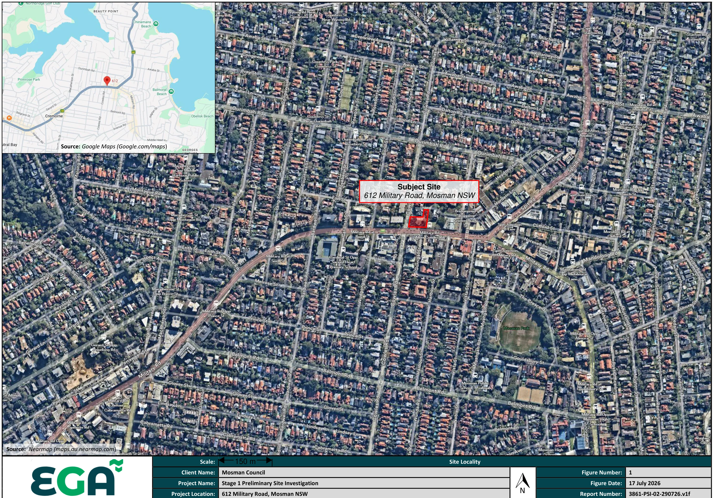

<!-- page 907 -->

Scale: Site Layout Client Name: Figure Number: 2 Project Name: Stage 1 Preliminary Site Investigation Figure Date: 17 July 2026 Project Location: 612 Military Road, Mosman NSW Report Number: 3861-PSI-02-290726.v1f

Source: Google Maps (Google.com/maps)

10 m

### LEGEND

Site Boundary

August 2026

Attachment 1.1.10 Mosman Council

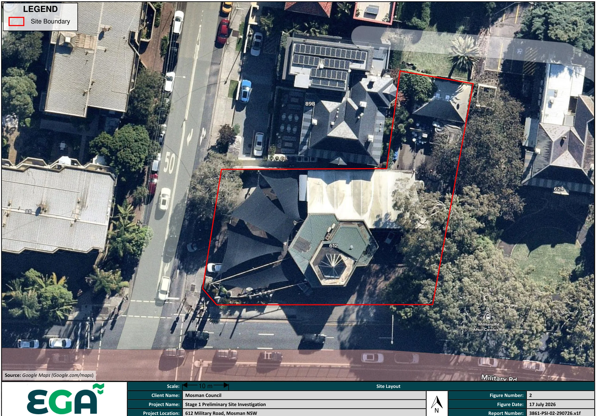

<!-- page 908 -->

Scale: Site Layout Client Name: Figure Number: 3

Project Name: Stage 1 Preliminary Site Investigation Figure Date: 17 July 2026 Project Location: 612 Military Road, Mosman NSW Report Number: 3861-PSI-02-290726.v1f

Source: Google Maps (Google.com/maps)

10 m

### LEGEND

Site Boundary

AEC01 / AEC02 / AEC03 - Potential Chemical Storage / Wastewater Treatment and Drainage Infrastructure  / Potential Contaminants within Soils

AEC04 - On-Site Structures (Indicative, subject to change based on site conditions)

August 2026

Attachment 1.1.10 Mosman Council

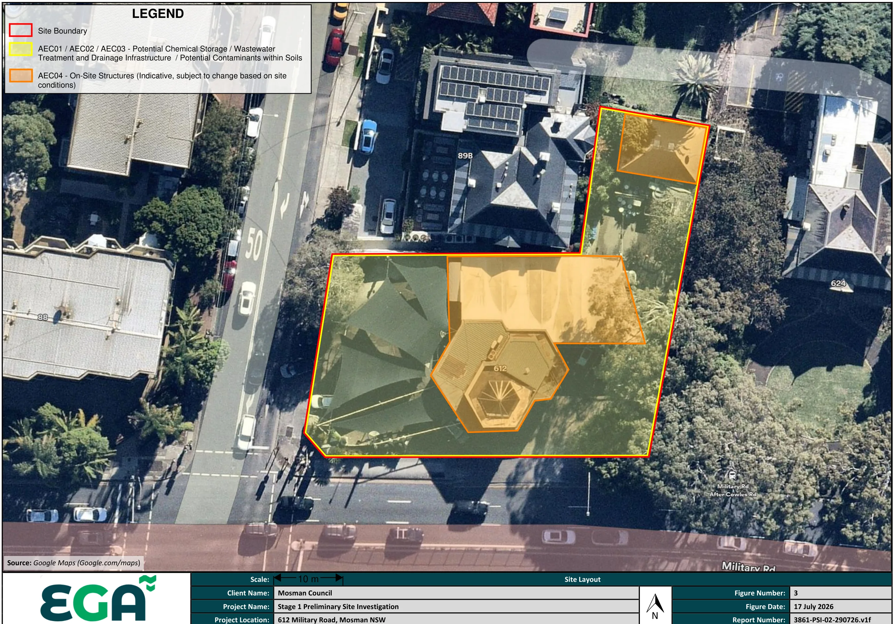

<!-- page 909 -->

Desktop Phase 1 Environmental Site Assessment 612 Military Road, Mosman NSW 3861-PSI-02-290726.v2f

Page 25

#### APPENDIX A

#### GROUNDWATER BORE RECORDS

August 2026

Attachment 1.1.10 Mosman Council

<!-- page 910 -->

Rivers and Streams favourites search download sites find a site Real Time Data - Rivers And Streams Daily River Reports Daily River Reports Dams favourites search download sites find a site Real Time Data - Major Dams Groundwater (Telemetered data) favourites search download sites find a site Real Time Data - Bores All Groundwater Site details search download sites find a site search by licence All Groundwater Map Meteorology favourites search download sites find a site Real Time Data - Weather Stations Hunter River Salinity Trading Scheme Hunter River Salinity Trading Scheme

Scale = 1 : 1693 151.241, -33.825 337218, 6255856, 56

Map Info

There are 6 sites within 500 metres of the selected point. The 5 closest sites are shown below. Show all 6 sites GW111484 GW111485 GW111483 GW114715 GW114716

+ −

20 m 100 ft

contact WaterNSW

7/14/26, 4:01 PM Real-time water data

https://realtimedata.waternsw.com.au/water.stm 1/2

August 2026

Attachment 1.1.10 Mosman Council

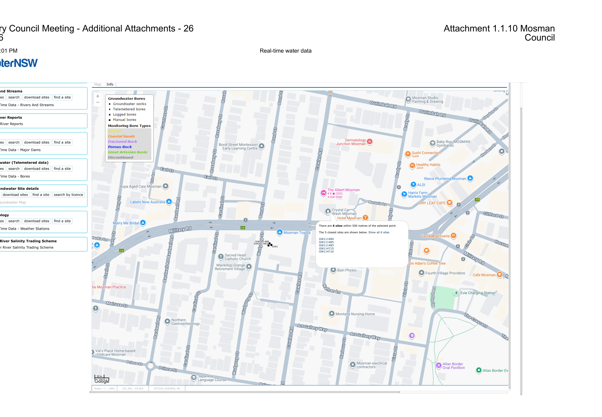

<!-- page 911 -->

Desktop Phase 1 Environmental Site Assessment 612 Military Road, Mosman NSW 3861-PSI-02-290726.v2f

Page 26

#### APPENDIX B

#### NSW SEED MAP

August 2026

Attachment 1.1.10 Mosman Council

<!-- page 912 -->

A NSW Government website

SEED Sharing and Enabling Environmental Data in NSW Search and download data Miners and Explorers map Browse by topic Case studies and insights Help and contact

How to use the SEED map Layers Legend Acid Sulfate Soil Risk Hm: High probability in bottom sediments H0: High probability at/near ground surface H0(s): High probability at/near ground surface with acidic scalds H1: High probability <1 m below ground surface H1(s): High probability <1 m below ground surface with acidic scalds H2: High probability 1 - 3 m below ground surface H2(p): High probability 1 - 3 m below ground surface in Pleistocene sediments H4: High probability >3 m below ground surface Lm: Low probability in bottom sediments L0: Low probability at/near ground surface L0(p): Low probability at/near ground surface on Pleistocene sediments L1: Low probability <1 m below ground surface L1(p): Low probability <1 m below ground surface in Pleistocene sediments L2: Low probability 1 - 3 m below ground surface L2(p): Low probability 1 - 3 m below ground surface in Pleistocene sediments L4: Low probability >3 m below ground surface L4(p): Low probability >3 m below ground surface on Pleistocene sediments N: No known occurrence N(p): No known occurrence in Pleistocene sediments NB: No known occurrence, Beach X0: Disturbed terrain, < 1 m below ground surface X1: Disturbed terrain, elevation 1 - 2 m AHD X1(p): Disturbed terrain, elevation 1 - 2m AHD in Pleistocene sediments X1(s): Disturbed terrain, elevation 1 - 2 m AHD with acidic scalds X2: Disturbed terrain, elevation 2 - 4 m AHD X2(p): Disturbed terrain, elevation 2 - 4 m AHD in Pleistocene sediments X2(s): Disturbed terrain, elevation 2 - 4 m AHD with acidic scalds X4: Disturbed terrain, elevation >4 m AHD X4(p): Disturbed terrain, elevation >4 m AHD in Pleistocene sediments Map data © OpenStreetMap contributors, Microsoft, Facebook, Inc. and its affiliates, Esri Community Maps contributors, Map layer by Esri Powered by Esri

Scale 11111 500 m X: 16835589.10 Y: -4004708.08 Projected Coordinates (X/Y)

#### 612 MILITARY ROAD MOSMAN 2088

Basemap

Draw/ Measure

Tools

Layer Intersect

Save Map

Contact Us Privacy Policy | More Info

7/14/26, 4:13 PM SEED Map

https://geo.seed.nsw.gov.au/vertigisstudio/web/?app=cabd04d595ec43c1aaf4298e80e83ec2 1/1

August 2026

Attachment 1.1.10 Mosman Council

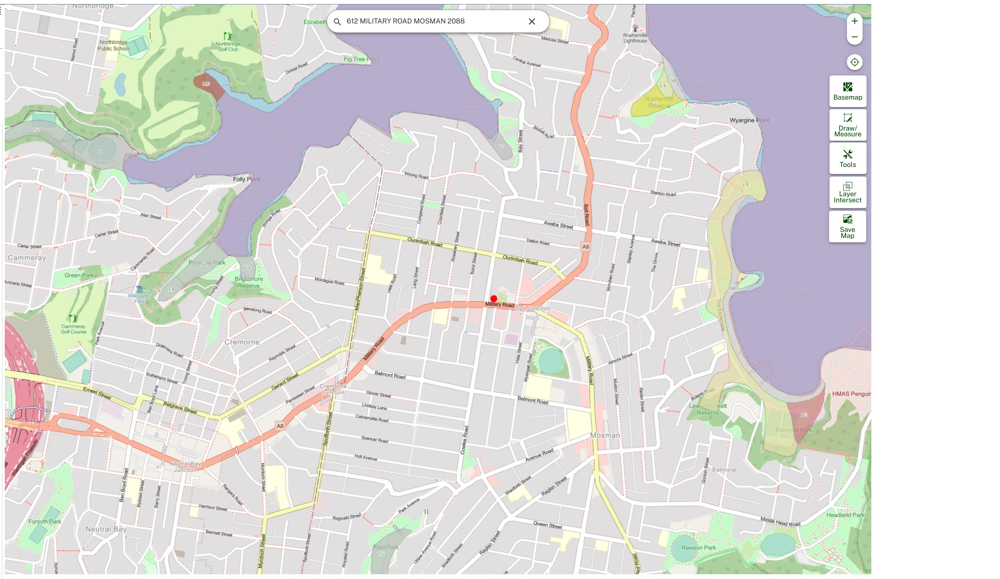

<!-- page 913 -->

Desktop Phase 1 Environmental Site Assessment 612 Military Road, Mosman NSW 3861-PSI-02-290726.v2f

Page 27

#### APPENDIX C

#### HISTORICAL AERIAL IMAGERY

August 2026

Attachment 1.1.10 Mosman Council

<!-- page 914 -->

Desktop Phase 1 Environmental Site Assessment 612 Military Road, Mosman NSW 3861-PSI-02-290726.v2f

Page 28

Historical Aerial 1. 1943 historical aerial imagery of the site. (Source: https://portal.spatial.nsw.gov.au/)

Historical Aerial 2. 1955 historical aerial imagery of the site. (Source: https://portal.spatial.nsw.gov.au/)

Historical Aerial 3. 1965 historical aerial imagery of the site. (Source: https://portal.spatial.nsw.gov.au/)

Historical Aerial 4. 1975 historical aerial imagery of the site. (Source: https://portal.spatial.nsw.gov.au/)

Historical Aerial 5. 1982 historical aerial imagery of the site. (Source: https://portal.spatial.nsw.gov.au/)

Historical Aerial 6. 1994 historical aerial imagery of the site. (Source: https://portal.spatial.nsw.gov.au/)

August 2026

Attachment 1.1.10 Mosman Council

<!-- page 915 -->

Desktop Phase 1 Environmental Site Assessment 612 Military Road, Mosman NSW 3861-PSI-02-290726.v2f

Page 29

Historical Aerial 7. 2005 historical aerial imagery of the site. (Source: https://portal.spatial.nsw.gov.au/)

Historical Aerial 8. 2013 historical aerial imagery of the site. (Source: https://apps.nearmap.com/)

Historical Aerial 9. 2026 historical aerial imagery of the site. (Source: https://apps.nearmap.com/)

August 2026

Attachment 1.1.10 Mosman Council

<!-- page 916 -->

Desktop Phase 1 Environmental Site Assessment 612 Military Road, Mosman NSW 3861-PSI-02-290726.v2f

Page 30

#### APPENDIX D

#### NSW EPA PUBLIC REGISTER

August 2026

Attachment 1.1.10 Mosman Council

<!-- page 917 -->

Background

A strategy to systematically prioritise, assess and respond to notifications under Section 60 of the Contaminated Land Management Act 1997 (CLM Act) has been developed by the EPA. This strategy acknowledges the EPA’s obligations to make information available to the public under Government Information (Public Access) Act 2009 .

When a site is notified to the EPA, it may be accompanied by detailed site reports where the owner has been proactive in addressing the contamination and its source. However, often there is minimal information on the nature or extent of the contamination.

After receiving a report, the first step is to confirm that the report does not relate to a pollution incident. The Protection of the Environment Operations Act 1997 (POEO Act) deals with pollution incidents, waste stockpiling or dumping. The EPA also has an incident management process to manage significant incidents (https://www.epa.nsw.gov.au/reporting-and-incidents/incident- management).

In many cases, the information indicates the contamination is securely immobilised within the site, such as under a building or carpark, and is not currently causing any significant risks for the community or environment. Such sites may still need to be cleaned up, but this can be done in conjunction with any subsequent building or redevelopment of the land. These sites do not require intervention under the CLM Act, and are dealt with through the planning and development consent process. In these cases, the EPA informs the local council or other planning authority, so that the information can be recorded and considered at the appropriate time (https://www.epa.nsw.gov.au/your-environment/contaminated-land/managing-contaminated-land/role-of-planning-authorities).

Where indications are that the contamination could cause actual harm to the environment or an unacceptable offsite impact (i.e. the land is 'significantly contaminated'), the EPA would apply the regulatory provisions of the CLM Act to have the responsible polluter and/or landowner investigate and remediate the site. If the reported contamination could present an immediate or long-term threat to human health NSW Health will be consulted. SafeWork NSW and Water NSW can also be consulted if there appear to be occupational health and safety risks or an impact on groundwater quality.

As such, the sites notified to the EPA and presented in the list of contaminated sites notified to the EPA are at various stages of the assessment and remediation process. Understanding the nature of the underlying contamination, its implications and implementing a remediation program where required, can take a considerable period of time. The list provides an indication, in relation to each nominated site, as to the management status of that particular site. Further detailed information may be available from the EPA or the person who notified the site.

The following questions and answers may assist those interested in this issue.

Frequently asked questions

Why does my land appear on the list of notified sites?

Your land may appear on the list because:

• the site owner and/or the polluter has notified the EPA under section 60 of the CLM Act • the EPA has been notified via other means and is satisfied that the site is or was contaminated.

If a site is on the list, it does not necessarily mean the contamination is significant enough to regulate under the CLM Act.

List current as at 9 April 2026 1 of 139

August 2026

Attachment 1.1.10 Mosman Council

<!-- page 918 -->

Does the list contain all contaminated sites in NSW?

No. The list only contains contaminated sites that EPA is aware of. If a site is not on the list, it does not necessarily mean the site is not contaminated.

The EPA relies on responsible parties and the public to notify contaminated sites.

How are notified contaminated sites managed by the EPA?

There are different ways the EPA can manage notified contaminated sites. Options include:

• regulation under the CLM Act, POEO Act, or both • notifying the relevant planning authority for management under the planning and development process • managing the site under the Protection of the Environment Operation (Underground Petroleum Storage Systems) Regulation 2014.

There are specific cases where contamination is managed under a tailored program operated by another agency (for example, the Resources & Geoscience's Legacy Mines Program).

What should I do if I am a potential buyer of a site that appears on the list?

You should seek advice from the seller to understand the contamination issue. You may need to seek independent contamination or legal advice.

The information provided in the list is indicative only and a starting point for your own assessment. Land contamination from past site uses is common, mainly in urban environments. If the site is properly remediated or managed, it may not affect the intended future use of the site.

Who can I contact if I need more information about a site?

You can contact the Environment Line at any time by calling 131 555 or by emailing info@environment.nsw.gov.au.

List of NSW Contaminated Sites Notified to the EPA

List current as at 9 April 2026 2 of 139

August 2026

Attachment 1.1.10 Mosman Council

<!-- page 919 -->

Site Status

Under assessment

Under Preliminary Investigation Order

Regulation under CLM Act not required

Explanation

The contamination is being assessed by the EPA to determine whether regulation is required. The EPA may require further information to complete the assessment. For example, the completion of management actions regulated under the planning process or Protection of the Environment Operations Act 1997 .

The EPA has issued a Preliminary Investigation Order under s10 of the Contaminated Land Management Act 1997 , to obtain additional information needed to complete the assessment.

The EPA has completed an assessment of the contamination and decided that regulation under the Contaminated Land Management Act 1997 is not required.

Disclaimer

The EPA has taken all reasonable care to ensure that the information in the list of contaminated sites notified to the EPA (the list) is complete and correct. The EPA does not, however, warrant or represent that the list is free from errors or omissions or that it is exhaustive.

The EPA may, without notice, change any or all of the information in the list at any time.

You should obtain independent advice before you make any decision based on the information in the list.

The list is made available on the understanding that the EPA, its servants and agents, to the extent permitted by law, accept no responsibility for any damage, cost, loss or expense incurred by you as a result of:

1.            any information in the list; or 2.            any error, omission or misrepresentation in the list; or 3.            any malfunction or failure to function of the list; 4.            without limiting (2) or (3) above, any delay, failure or error in recording, displaying or updating information.

List current as at 9 April 2026 3 of 139

August 2026

Attachment 1.1.10 Mosman Council

<!-- page 920 -->

Regulation being finalised

Contamination currently regulated under CLM Act

Contamination currently regulated under POEO Act

Contamination being managed via the planning process (EP&A Act)

Contamination formerly regulated under the CLM Act

Contamination formerly regulated under the POEO Act

The EPA has completed an assessment of the contamination and decided that the contamination is significant enough to warrant regulation under the Contaminated Land Management Act 1997 . A regulatory approach is being finalised.

The EPA has completed an assessment of the contamination and decided that the contamination is significant enough to warrant regulation under the Contaminated Land Management Act 1997 (CLM Act). Management of the contamination is regulated by the EPA under the CLM Act. Regulatory notices are available on the EPA’s Contaminated Land Public Record.

Contamination is currently regulated under the Protection of the Environment Operations Act 1997 (POEO Act).  The EPA as the appropriate regulatory authority reasonably suspects that a pollution incident is occurring/ has occurred and that it requires regulation under the POEO Act. The EPA may use environment protection notices, such as clean up notices, to require clean up action to be taken.  Such regulatory notices are available on the POEO public register.

The EPA has completed an assessment of the contamination and decided that the contamination is significant enough to warrant regulation. The contamination of this site is managed by the consent authority under the Environmental Planning and Assessment Act 1979 (EP&A Act) planning approval process, with EPA involvement as necessary to ensure significant contamination is adequately addressed. The consent authority is typically a local council or the Department of Planning and Environment.

The EPA has determined that the contamination is no longer significant enough to warrant regulation under the Contaminated Land Management Act 1997 (CLM Act). The contamination was addressed under the CLM Act.

The EPA has determined that the contamination is no longer significant enough to warrant regulation. The contamination was addressed under the Protection of the Environment Operations Act 1997 (POEO Act).

List current as at 9 April 2026 4 of 139

August 2026

Attachment 1.1.10 Mosman Council

<!-- page 921 -->

Contamination was addressed via the planning process (EP&A Act)

Ongoing maintenance required to manage residual contamination (CLM Act)

The EPA has determined that ongoing maintenance, under the Contaminated Land Management Act 1997 (CLM Act), is required to manage the residual contamination. Regulatory notices under the CLM Act are available on the EPA’s Contaminated Land Public Record.

The EPA has determined that the contamination is no longer significant enough to warrant regulation. The contamination was addressed by the appropriate consent authority via the planning process under the Environmental Planning and Assessment Act 1979 (EP&A Act).

List current as at 9 April 2026 5 of 139

August 2026

Attachment 1.1.10 Mosman Council

<!-- page 922 -->

Suburb SiteName Address ContaminationActivityType ManagementClass Latitude Longitude

MORPETH Telstra Cable Installation and RTA Bridge work Northumberland STREET Other Petroleum Regulation under CLM Act not required -32.72489729 151.6266795

MORPETH Former Service Station Swan  STREET Service Station Regulation under CLM Act not required -32.72477413 151.6250642

MORTLAKE Former Petroleum Storage Site 108-116 Tennyson ROAD Other Petroleum Regulation under CLM Act not required -33.83979033 151.1064889

MORTLAKE Kendall Bay Sediments Kendall BAY Gasworks Contamination currently regulated under CLM Act -33.83905999 151.1120458

MORTLAKE Former AGL site Tennyson  ROAD Gasworks Contamination formerly regulated under the CLM Act -33.84287407 151.1109313

MORTLAKE Majors Bay Redevelopment 14-22 Hilly STREET Other Industry Regulation under CLM Act not required -33.83954617 151.1054674

MORUYA Former Fuel Depot Moruya 11 to 13 Ford STREET Other Petroleum Regulation under CLM Act not required -35.9112243 150.0826475

MORUYA Caltex Service Station Moruya 80-84 Campbell STREET Service Station Regulation under CLM Act not required -35.91195596 150.0824213

MORUYA Ampol Fuel Depot - Moruya 26 Campbell STREET Service Station Regulation under CLM Act not required -35.9104985 150.0711419

MOSMAN 7-Eleven Mosman 162A Spit Road Corner Mitchell ROAD Service Station Regulation under CLM Act not required -33.81747016 151.2433633

MOSMAN BP Service Station 175 Ourimbah ROAD Service Station Regulation under CLM Act not required -33.82106757 151.233291

MOSMAN BP Express Mosman 175 Ourimbah  ROAD Service Station Regulation under CLM Act not required -33.82106459 151.2332921

MOSMAN 7-Eleven Service Station Mosman 45 Spit ROAD Service Station Regulation under CLM Act not required -33.82302718 151.2435627

MOSMAN Allan Border Oval Myahgah  ROAD Landfill Regulation under CLM Act not required -33.82681534 151.2417712

MOSMAN 173 Avenue Road, MOSMAN NSW 2088 173 Avenue ROAD Unclassified Regulation under CLM Act not required -33.930869 150.97132

List current as at 9 April 2026 85 of 139

August 2026

Attachment 1.1.10 Mosman Council

<!-- page 923 -->

Suburb SiteName Address ContaminationActivityType ManagementClass Latitude Longitude

MOSS VALE Woolworths Service Station Moss Vale 609 Argyle  STREET Service Station Regulation under CLM Act not required -34.55409411 150.3609797

MOSS VALE Coles Express Service Station 579 Argyle STREET Service Station Regulation under CLM Act not required -34.55313422 150.364684

MOSS VALE Moss Vale Refuelling Facility Lackey ROAD Other Petroleum Regulation under CLM Act not required -34.54662421 150.3721525

MOUNT ANNAN Woolworths Caltex Mount Annan 157 Narellan (Corner Smeaton Grange Road) ROAD Service Station Regulation under CLM Act not required -34.04685527 150.7610434

MOUNT ANNAN Great Southern Railways Aqueduct Off Narellan  ROAD Unclassified Regulation under CLM Act not required -34.07308479 150.7707436

MOUNT COLAH Caltex Service Station Mount Colah 603 Pacific HIGHWAY Service Station Regulation under CLM Act not required -33.67034662 151.1151861

MOUNT COLAH Foxglove Oval Foxglove ROAD Landfill Contamination currently regulated under CLM Act -33.65829855 151.1229638

MOUNT DRUITT Caltex (former Mobil) Service Station, 17 Mount Street, Mount Druitt 17 Mount STREET Service Station Regulation under CLM Act not required -33.76567994 150.8244544

MOUNT DRUITT 7-Eleven Mount Druitt Lot 6 Luxford ROAD Other Petroleum Regulation under CLM Act not required -33.76483839 150.8254157

MOUNT HUTTON Woolworths Service Station 46 Wilsons ROAD Service Station Regulation under CLM Act not required -32.9836378 151.67309

MOUNT PRITCHARD 7-Eleven Service Station 352 Elizabeth DRIVE Service Station Regulation under CLM Act not required -33.90260656 150.8963326

MOUNT THORLEY Bulga Surface Operations Broke ROAD Other Industry Regulation under CLM Act not required -32.68325751 151.1206158

MOUNT THORLEY Lowes Petroleum (Former BP) Depot Mount Thorley 74 Mount Thorley ROAD Other Petroleum Regulation under CLM Act not required -32.62443074 151.1025122

MOUNT VICTORIA Former Mobil Service Station 81 Great Western HIGHWAY Service Station Regulation under CLM Act not required -33.5889727 150.2511783

MOUNT VICTORIA Caltex Service Station 36a Great Western HIGHWAY Service Station Regulation under CLM Act not required -33.58436517 150.2465528

List current as at 9 April 2026 86 of 139

August 2026

Attachment 1.1.10 Mosman Council

<!-- page 924 -->

Search TIP To search for a specific site, search by LGA (local government area) and carefully review all sites listed. ... more search tips

Home Public registers Contaminated land record of notices Search results Your search for:Suburb: MOSMAN Search Again Refine Search did not find any records in our database. If a site does not appear on the record it may still be affected by contamination. For example: Contamination may be present but the site has not been regulated by the EPA under the Contaminated Land Management Act 1997 or the Environmentally Hazardous Chemicals Act 1985. The EPA may be regulating contamination at the site through a licence or notice under the Protection of the Environment Operations Act 1997 (POEO Act). Contamination at the site may be being managed under the planning process. More information about particular sites may be available from: The POEO public register The appropriate planning authority: for example, on a planning certificate issued by the local council under section 149 of the Environmental Planning and Assessment Act. See What's in the record and What's not in the record. If you want to know whether a specific site has been the subject of notices issued by the EPA under the CLM Act, we suggest that you search by Local Government Area only and carefully review the sites that are listed. This public record provides information about sites regulated by the EPA under the Contaminated Land Management Act 1997, including sites currently and previously regulated under the Environmentally Hazardous Chemicals Act 1985. Your inquiry using the above search criteria has not matched any record of current or former regulation. You should consider searching again using different criteria. The fact that a site does not appear on the record does not necessarily mean that it is not affected by contamination. The site may have been notified to the EPA but not yet assessed, or contamination may be present but the site is not yet being regulated by the EPA. Further information about particular sites may be available from the appropriate planning authority, for example, on a planning certificate issued by the local council under section 149 of the Environmental Planning and Assessment Act. In addition the EPA may be regulating contamination at the site through a licence under the Protection of the Environment Operations Act 1997. You may wish to search the POEO public register.POEO public register 13 July 2026

7/13/26, 12:13 PM DECCW | Search results

https://app.epa.nsw.gov.au/prclmapp/searchresults.aspx?&LGA=&Suburb=MOSMAN&Notice=&Name=&Text=&DateFrom=&DateTo= 1/1

August 2026

Attachment 1.1.10 Mosman Council

<!-- page 925 -->

Home Public registers POEO Public Register Licences, applications and notices search Search results

Your search for: General Search with the following criteria Suburb - mosman returned 26 results Export to excel 2 of 2 Pages Search Again Number Name Location Type Status Issued date 1522383 TARONGA CONSERVATION SOCIETY AUSTRALIA BRADLEYS HEAD ROAD, MOSMAN, NSW 2088

s.58 Licence Variation Issued Issued 09 Jul 2015

1600361 TARONGA CONSERVATION SOCIETY AUSTRALIA BRADLEYS HEAD ROAD, MOSMAN, NSW 2088

Compliance Audit Complete Complete 14 Sep 2020

1603655 TARONGA CONSERVATION SOCIETY AUSTRALIA BRADLEYS HEAD ROAD, MOSMAN, NSW 2088

s.58 Licence Variation Issued Issued 08 Apr 2021

1615336 TARONGA CONSERVATION SOCIETY AUSTRALIA BRADLEYS HEAD ROAD, MOSMAN, NSW 2088

s.58 Licence Variation Issued Issued 23 Dec 2021

1623058 TARONGA CONSERVATION SOCIETY AUSTRALIA BRADLEYS HEAD ROAD, MOSMAN, NSW 2088

s.58 Licence Variation Issued Issued 30 Nov 2022

1630287 TARONGA CONSERVATION SOCIETY AUSTRALIA BRADLEYS HEAD ROAD, MOSMAN, NSW 2088

s.58 Licence Variation Issued Issued 03 Oct 2023

12 13 July 2026

7/13/26, 12:14 PM Environment & Heritage | PRPOEO

https://app.epa.nsw.gov.au/prpoeoapp/SearchResult.aspx?SearchTag=all&searchrange=general&range=general&SortExpression=AccountablePa… 1/1

August 2026

Attachment 1.1.10 Mosman Council

<!-- page 926 -->

Home Public registers POEO Public Register Licences, applications and notices search Search results

Your search for: General Search with the following criteria Suburb - mosman returned 26 results Export to excel 1 of 2 Pages Search Again Number Name Location Type Status Issued date 1621649 THE SPIT, MOSMAN, NSW 2088 s.58 Licence Variation Issued Issued 08 Feb 2023 1028480 ARDENT LEISURE LIMITED  THE SPIT, MOSMAN, NSW 2088 s.58 Licence Variation Issued Issued 03 Jul 2003 1032563 ARDENT LEISURE LIMITED  THE SPIT, MOSMAN, NSW 2088 s.58 Licence Variation Issued Issued 20 Nov 2003 1069448 ARDENT LEISURE LIMITED  THE SPIT, MOSMAN, NSW 2088 s.58 Licence Variation Issued Issued 05 Feb 2007 1070978 ARDENT LEISURE LIMITED  THE SPIT, MOSMAN, NSW 2088 s.58 Licence Variation Issued Issued 14 Mar 2007 1072567 ARDENT LEISURE LIMITED  THE SPIT, MOSMAN, NSW 2088 s.58 Licence Variation Issued Issued 24 Apr 2007 1074550 ARDENT LEISURE LIMITED  THE SPIT, MOSMAN, NSW 2088 s.58 Licence Variation Issued Issued 13 Jun 2007 1078238 ARDENT LEISURE LIMITED  THE SPIT, MOSMAN, NSW 2088 s.58 Licence Variation Issued Issued 19 Sep 2007 1085886 ARDENT LEISURE LIMITED  THE SPIT, MOSMAN, NSW 2088 s.58 Licence Variation Issued Issued 12 May 2008 1097027 ARDENT LEISURE LIMITED  THE SPIT, MOSMAN, NSW 2088 s.58 Licence Variation Issued Issued 30 Jan 2009 1509253 ARDENT LEISURE LIMITED  THE SPIT, MOSMAN, NSW 2088 s.58 Licence Variation Issued Issued 24 Jun 2013 11724 HEALTHSCOPE OPERATIONS PTY LTD

#### 1 ELLAMATTA AVENUE,

MOSMAN, NSW 2088 POEO licence No longer in force No longer in force

16 Sep 2002

1048188 HEALTHSCOPE OPERATIONS PTY LTD

#### 1 ELLAMATTA AVENUE,

MOSMAN, NSW 2088 s.58 Licence Variation Issued Issued 27 May 2005 11211 MA MARINA FUND OPCO NO. 1 PTY LTD THE SPIT, MOSMAN, NSW 2088 POEO licence Issued Issued 30 Jan 2001 3514873 MA MARINA FUND OPCO NO. 1 PTY LTD THE SPIT, MOSMAN, NSW 2088 s.91 Clean Up Notice Issued Issued 10 Jan 2026 1596267 NONBANK MORTGAGES PTY. LTD. THE SPIT, MOSMAN, NSW 2088 s.58 Licence Variation Issued Issued 29 Jun 2021 1008406 OMNI LEISURE OPERATIONS LIMITED THE SPIT, MOSMAN, NSW 2088 s.58 Licence Variation Issued Issued 13 Jun 2001 1018813 OMNI LEISURE OPERATIONS LIMITED THE SPIT, MOSMAN, NSW 2088 s.58 Licence Variation Issued Issued 06 Sep 2002 1677 TARONGA CONSERVATION SOCIETY AUSTRALIA BRADLEYS HEAD ROAD, MOSMAN, NSW 2088

POEO licence Issued Issued 26 Sep 2000

1512309 TARONGA CONSERVATION SOCIETY AUSTRALIA BRADLEYS HEAD ROAD, MOSMAN, NSW 2088

Compliance Audit Complete Complete 21 Feb 2013

12 13 July 2026

7/13/26, 12:14 PM Environment & Heritage | PRPOEO

https://app.epa.nsw.gov.au/prpoeoapp/SearchResult.aspx?SearchTag=all&searchrange=general&range=general&SortExpression=AccountablePa… 1/1

August 2026

Attachment 1.1.10 Mosman Council

<!-- page 927 -->

## Desktop Phase 1 Environmental Site

## Assessment

79-85 Cowles Road, Mosman NSW

Report No: Report Date:

3861-PSI-03-290726.v2f 03/08/2026

info@egau.com.au

NSW: 36E Fitzroy Street, Marrickville, NSW 2204 VIC: 88 Langridge St, Collingwood VIC 3066

August 2026

Attachment 1.1.10 Mosman Council

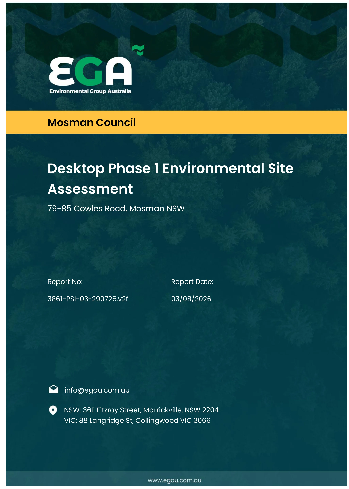

<!-- page 928 -->

Desktop Phase 1 Environmental Site Assessment 79-85 Cowles Road, Mosman NSW 3861-PSI-03-290726.v2f

Page 1

### Document Record

Revision Date Author Reviewer

v1f 29 July 2026 Rachelle Conna Isabelle Figatowski

v2f 3 August 2026 Rachelle Conna Isabelle Figatowski

Author Signature Reviewer Signature

Name Rachelle Conna Name Isabelle Figatowski

Credentials B. Sc. (Zoology) Credentials B.Sc. (Env. Consulting)

Title Environmental Consultant Title Senior Environmental Consultant

Document Title: Desktop Phase 1 Environmental Site Assessment - 79-85 Cowles Road, Mosman NSW Site Address: 79-85 Cowles Road, Mosman NSW Client Name: Site Size: ≈ 1,150 m2 Reference Number: 3861-PSI-03-290726.v2f Project Type: Desktop Phase 1 Environmental Site Assessment Project Type Abbreviation: PSI Document Draft: FINAL Document Revision No. v2f

Prepared by Environmental Group Australia Pty Ltd ABN: 83 671 599 143

August 2026

Attachment 1.1.10 Mosman Council

<!-- page 929 -->

Desktop Phase 1 Environmental Site Assessment 79-85 Cowles Road, Mosman NSW 3861-PSI-03-290726.v2f

Page 2

### EXECUTIVE SUMMARY

Environmental Group Australia Pty Ltd (EGA) was engaged by Mosman Council (hereafter referred to as ‘the client’), to undertake a Desktop Phase 1 Environmental Site Assessment of the property located within Lot 7 Section 1 DP919, Lot 8 Section 1 DP919, Lot 9 Section 1 DP919 and Lot 10 Section 1 DP919, 79-85 Cowles Road, Mosman NSW (hereafter referred to as ‘the site’) (refer to Figure 1 and Figure 2).

The client is preparing to lodge a planning proposal to implement the draft Mosman Masterplan, which proposes increased housing capacity across the study area, including amendments to the planning controls at the site to facilitate redevelopment.

#### Purpose and Objectives

A Desktop Phase 1 Environmental Site Assessment was required to assess the likelihood that the site had been contaminated by past or present activities and to form a preliminary view on the extent and degree of contamination. The objectives of the investigation were to:

• Provide advice on whether the site may require a stage 2 intrusive site assessment, to better define the nature and extent of potential contamination within the site; and • Provide advice on whether the site would be suitable (in the context of land contamination) for any proposed future rezoning.

#### Site Description

• The site covers an area of approximately 1,150 m2; • The site is currently zoned as SP2: Infrastructure; • The site is currently utilised as ‘Mosman Municipal Council Works Depot’; • The site is located within a mixed commercial-industrial and residential district.

Current aerial imagery suggests that the site is operating as ‘Mosman Municipal Council Works Depot’, with commercial warehouse structures covering the north, east and south of the site (u-shape), with hardstand across the site surface.

#### Proposed Development

Reference is made to the draft Mosman Masterplan Structure Plan prepared by SJB Architecture, dated 29 July 2026 (Drawing No. 06, Revision 07). EGA understands that the site has been identified for increased development potential, however, have not been provided with any specific redevelopment plans. EGA has made the assumption that future development may include the demolition of current structures, rezoning of land, subdivision of land, and construction of new structures and infrastructure. EGA has not been made aware of any basement plans and have presumed that they are proposed as part of the future development.

#### Scope of Work

EGA undertook the following scope of works to address the project objectives:

• A desktop review of relevant information pertaining to the site; and • Assessment and reporting of the desktop review.

#### Investigation Outcome

Based on EGA’s assessment of the desktop review information, in the context of the proposed redevelopment scenario, EGA has made the following conclusions:

• The search of historical aerial imagery indicated a moderate potential for contamination within the site to have occurred, associated with uncontrolled demolition and potential site filling

August 2026

Attachment 1.1.10 Mosman Council

<!-- page 930 -->

Desktop Phase 1 Environmental Site Assessment 79-85 Cowles Road, Mosman NSW 3861-PSI-03-290726.v2f

Page 3

beneath slabs. EGA also notes that the building fabrics may contain hazardous building materials; • A review of publicly available contaminated land databases indicated that the site is not the subject of any licences, applications, notices under Section 308 of the Protection of the Environment Operations Act 1997. The site is not notified under Section 60 of the Contaminated Land Management Act 1997. The site is not the subject of any notifications under Section 58 of the Contaminated Land Management Act 1997; • The contaminants and areas of environmental concern (AEC), requiring further consideration or assessment, and possibly remediation or risk management, are the following: o AEC-1: Potential Chemical Storage – Leaks, Spills or Poor Management; o AEC-2: Wastewater Treatment and Drainage Infrastructure – Wash Bays, Traps, Pits and Pipes; o AEC-3: Potential Fuel Infrastructure; and o AEC-4: Potential Uncontrolled Fill and Surface Soils; and o AEC-5: On-Site Structures - Hazardous Building Materials. • Soils not impacted by contamination may meet excavated natural material (ENM) or General Solid Waste (GSW) classification.

#### Conclusions and Recommendations

Notwithstanding the above, the potential contaminants of concern and affected environmental media are consistent with those typically encountered on brownfield redevelopment sites within the Sydney Basin. Any contamination that may be present is not expected to be of such an extent or complexity that it could not be effectively managed or remediated using conventional and readily available remediation techniques. Accordingly, the potential for contamination at the site is not considered to preclude proposed future redevelopment.

As detailed development plans are prepared for individual areas of the site, the existing environmental data should be reviewed in conjunction with the overall remedial strategy to confirm the nature and extent of any contamination relevant to the proposed works. Where required, additional assessment should be undertaken, and appropriate remediation and/or management measures developed, to demonstrate that the relevant portion of the site is, or can be made, suitable for its intended use.

This report, including its conclusions and recommendations, must be read in conjunction with the limitations presented in Section 12.

August 2026

Attachment 1.1.10 Mosman Council

<!-- page 931 -->

Desktop Phase 1 Environmental Site Assessment 79-85 Cowles Road, Mosman NSW 3861-PSI-03-290726.v2f

Page 4

#### TABLE OF CONTENTS

#### 1.

#### INTRODUCTION

#### 7

1.1. Purpose and Objectives ............................................................................................................... 7 1.2. Site Description ............................................................................................................................. 7 1.3. Proposed Development ................................................................................................................ 7 1.4. Scope of Work .............................................................................................................................. 7

#### 2.

#### SITE IDENTIFICATION

#### 8

#### 3.

#### PHYSICAL SITE CONDITIONS

#### 9

#### 4.

#### SITE HISTORY AND LAND USE

#### 11

4.1. Aerial Imagery ............................................................................................................................ 11 4.2. Anecdotal Information ............................................................................................................... 11 4.3. Incident and Complaints History ............................................................................................... 11 4.4. Previous Contamination Assessments ...................................................................................... 11

#### 5.

#### REGULATORY RECORDS

#### 12

5.1. NSW EPA CLM Act Register of Notified Sites and Notices ....................................................... 12 5.2. NSW EPA POEO Act Register of Licences, Applications and Notices ...................................... 12 5.3. Dangerous Goods Licences Search ............................................................................................ 12

#### 6.

#### INFORMATION SOURCES

#### 13

#### 7.

#### CONCEPTUAL SITE MODEL

#### 14

7.1. Potential Areas of Environmental Concern ............................................................................... 14 7.2. Contaminants, Migration Pathways, Receptors and Risks ...................................................... 14 7.3. Site Characteristics Affecting Risks ........................................................................................... 15 7.3.1. Land-Use Setting................................................................................................................ 15 7.3.2. Surface Water ..................................................................................................................... 15 7.3.3. Groundwater – Drinking Water Risks ................................................................................ 16 7.3.4. Recreational Water Use and Aquatic Ecosystems ............................................................ 16 7.3.5. Terrestrial Ecosystems ....................................................................................................... 16 7.3.6. Human Exposures to Site Contaminants ........................................................................... 16

#### 8.

#### RISK ASSESSMENT (PLANNING LEVEL)

#### 17

#### 9.

#### PLANNING AND MASTER PLAN ADVICE

#### 18

9.1. Suitability for Future Development ............................................................................................ 18 9.2. Identification of Potential Issues ............................................................................................... 18 9.3. Requirements for the Development Application (DA) Stage ................................................... 18 9.4. Suggestion Inclusion to Master Planning .................................................................................. 18

#### 10. CONTAMINANTS OF CONCERN

#### 20

#### 11. CONCLUSIONS AND RECOMMENDATIONS

#### 21

11.1. Site Condition and Further Requirements ................................................................................. 21 11.2. Recommendations ...................................................................................................................... 21

#### 12. STATEMENT OF LIMITATIONS

#### 22

August 2026

Attachment 1.1.10 Mosman Council

<!-- page 932 -->

Desktop Phase 1 Environmental Site Assessment 79-85 Cowles Road, Mosman NSW 3861-PSI-03-290726.v2f

Page 5

#### 13. REFERENCES

#### 23

FIGURES Figure 1 - Site Locality Figure 2 - Site Layout Figure 3 - Areas of Environmental Concern

APPENDICES A - Groundwater Bore Records B - NSW SEED Map C - Historical Aerial Imagery D - NSW EPA Public Register

August 2026

Attachment 1.1.10 Mosman Council

<!-- page 933 -->

Desktop Phase 1 Environmental Site Assessment 79-85 Cowles Road, Mosman NSW 3861-PSI-03-290726.v2f

Page 6

### LIST OF ABBREVIATIONS

AHD Australian Height Datum AEC Area of Environmental Concern ANZECC Australian and New Zealand Environment and Conservation Council AST Aboveground storage tank Bgl Below ground level BTEX Benzene, toluene, ethylbenzene, xylene CoC Chain of Custody CSM Conceptual Site Model EIL Ecological Investigation Level EGA Environmental Group Australia Pty Ltd EPA Environment Protection Authority HIL Health Investigation Levels HSL Health Screening Levels LOR [Laboratory] Limit of Reporting NATA National Association of Testing Laboratories NA Not applicable ND Not detected NEPC National Environment Protection Council NEPM National Environment Protection Measure NSW EPA NSW Environment Protection Authority OCP Organochlorine Pesticide PAEC Potential Area of Environmental Concern PAH Polycyclic aromatic hydrocarbon PCB Polychlorinated biphenyl PID Photo-ionisation detector PSI Preliminary Site Investigation QA/QC Quality assurance/Quality control RPD Relative percentage difference SAQP Sampling Analysis and Quality Plan SVOC Semi-volatile organic compound USCS Unified Soil Classification System UST Underground storage tank VOC Volatile organic compound

August 2026

Attachment 1.1.10 Mosman Council

<!-- page 934 -->

Desktop Phase 1 Environmental Site Assessment 79-85 Cowles Road, Mosman NSW 3861-PSI-03-290726.v2f

Page 7

#### 1. INTRODUCTION

Environmental Group Australia Pty Ltd (EGA) was engaged by Mosman Council (hereafter referred to as ‘the client’), to undertake a Desktop Phase 1 Environmental Site Assessment of the property located within Lot 7 Section 1 DP919, Lot 8 Section 1 DP919, Lot 9 Section 1 DP919 and Lot 10 Section 1 DP919, 79-85 Cowles Road, Mosman NSW (hereafter referred to as ‘the site’) (refer to Figure 1 and Figure 2).

The client is preparing to lodge a planning proposal to implement the draft Mosman Masterplan, which proposes increased housing capacity across the study area, including amendments to the planning controls at the site to facilitate redevelopment.

#### 1.1.

#### Purpose and Objectives

A Desktop Phase 1 Environmental Site Assessment was required to assess the likelihood that the site had been contaminated by past or present activities and to form a preliminary view on the extent and degree of contamination. The objectives of the investigation were to:

• Provide advice on whether the site may require a stage 2 intrusive site assessment, to better define the nature and extent of potential contamination within the site; and • Provide advice on whether the site would be suitable (in the context of land contamination) for any proposed future rezoning.

#### 1.2.

#### Site Description

• The site covers an area of approximately 1,150 m2; • The site is currently zoned as SP2: Infrastructure; • The site is currently utilised as ‘Mosman Municipal Council Works Depot’; • The site is located within a mixed commercial-industrial and residential district.

Current aerial imagery suggests that the site is operating as ‘Mosman Municipal Council Works Depot’, with commercial warehouse structures covering the north, east and south of the site (u-shape), with hardstand across the site surface.

#### 1.3.

#### Proposed Development

Reference is made to the draft Mosman Masterplan Structure Plan prepared by SJB Architecture, dated 29 July 2026 (Drawing No. 06, Revision 07). EGA understands that the site has been identified for increased development potential, however, have not been provided with any specific redevelopment plans. EGA has made the assumption that future development may include the demolition of current structures, rezoning of land, subdivision of land, and construction of new structures and infrastructure. EGA has not been made aware of any basement plans and have presumed that they are proposed as part of the future development.

#### 1.4.

#### Scope of Work

EGA undertook the following scope of works to address the project objectives:

• A desktop review of relevant information pertaining to the site; and • Assessment and reporting of the desktop review.

August 2026

Attachment 1.1.10 Mosman Council

<!-- page 935 -->

Desktop Phase 1 Environmental Site Assessment 79-85 Cowles Road, Mosman NSW 3861-PSI-03-290726.v2f

Page 8

#### 2. SITE IDENTIFICATION

The site identification details and associated information are presented in Table 2.1.

Table 2.1 Site Identification Information Attribute Description

Street Address 79-85 Cowles Road, Mosman NSW

Lot and Deposited Plan (DP)

Lot 7 Section 1 DP919 Lot 8 Section 1 DP919 Lot 9 Section 1 DP919 Lot 10 Section 1 DP919

Current Owner

Geographical Coordinates 33°49'30.7"S 151°14'18.6"E (approximate centre of site)

Site Area ≈ 1,150 m2

Local Government Area (LGA) Mosman Municipal Council

Parish Willoughby

County Cumberland

Zoning SP2: Infrastructure Mosman Local Environmental Plan 2012 (2011 EPI 647)

The locality of the site is identified in Figure 1.

The general layout and boundary of the site are shown in Figure 2.

August 2026

Attachment 1.1.10 Mosman Council

<!-- page 936 -->

Desktop Phase 1 Environmental Site Assessment 79-85 Cowles Road, Mosman NSW 3861-PSI-03-290726.v2f

Page 9

#### 3. PHYSICAL SITE CONDITIONS

Regional geology, topography, soil landscape and hydrogeological information are presented in Table 3.1.

Table 3.1 Regional Setting Information Attribute Description

Geology

A review of the Environment NSW ‘eSpade V2.2’ web application (environment.nsw.gov.au/eSpade2WebApp, accessed 21 July 2026), indicated that the site is likely to be underlain by Hawkesbury Sandstone, which is a medium to coarse-grained quartz sandstone with minor shale and laminite lenses.

Soil Profiles

A review of the Environment NSW ‘eSpade V2.2’ web application (environment.nsw.gov.au/eSpade2WebApp, accessed 21 July 2026), indicated that the site is likely to contain: • gy1 (Topsoil): Loose, acidic, water-repellent coarse sandy loam, high permeability, low water capacity. • gy2 (Subsoil/Sandstone): Earthy, hard setting yellowish-brown clayey sand, low water capacity. • gy3 (Subsoil/Sandstone): Earthy/weakly pedal sandy clay loam, low permeability and wet strength. • gy4 (Subsoil/Shale): Highly pedal, highly erodible yellowish-brown clay, low permeability and wet strength. • Associated: Surface leaf litter (up to 10 cm) and loose quartz sand wash.

Terrain and Structure

A review of the Environment NSW ‘eSpade V2.2’ web application (environment.nsw.gov.au/eSpade2WebApp, accessed 21 July 2026), indicated that the site is likely to comprise: • Crests (<50 cm deep): Gradual transition of gy1 over bedrock, gy2, or occasionally gy3. Hard setting layers or bedrock expose when eroded. • Side slopes (30–70 cm deep): Discontinuous soils with up to 25% rock outcrop. gy1 overlies bedrock or gy2/gy3 on benches. • Shale Lenses (<100 cm deep): Sharp transition from gy1 to deep gy4 clay on inner benches. • Drainage Lines (<100 cm deep): Deep gy1 directly over bedrock.

Acid Sulfate Soils

A review of the NSW Government SEED web application (geo.seed.nsw.gov.au, accessed 21 July 2026), indicates that the site lies in an area mapped as ‘No Known Occurrence’ with respect to acid sulfate soils. This infers that land management activities are not likely to be affected by acid sulfate soils. Further assessment of acid sulfate soils in the context of this investigation is considered by EGA as not warranted.

Topography

Generally, the local landscape consists of undulating to rolling low hills with local relief 20–80 m and slopes of 10–25%. Sideslopes with narrow to wide outcropping sandstone rock benches (10–100 m), often forming broken scarps of <5 m. The site is located at an elevation approximately 89 m to 91 m Australian Height Datum (AHD) and gently sloping on a downward gradient toward the southeast.

August 2026

Attachment 1.1.10 Mosman Council

<!-- page 937 -->

Desktop Phase 1 Environmental Site Assessment 79-85 Cowles Road, Mosman NSW 3861-PSI-03-290726.v2f

Page 10

Attribute Description

Hydrology and Hydrogeology

Surface water courses proximal to the site include Quakers Hat Bay located approximately 923 m to the north and 1.21 km to the northwest of the site, Hunters Bay located approximately 1.19 km to the east of the site and Balmoral Bay located approximately 1.24 km to the east of the site. Based on the site topography and distances to the nearest surface water course, groundwater flow in the vicinity of the site is considered likely to be towards the north. A review of the NSW Office of Water groundwater database undertaken on 21 July 2026 indicated three registered groundwater features located within the site: • GW111485: monitoring bore, final depth – 10.00 m bgl, standing water level – 5.94 m bgl, located approximately 110 m northwest of the site; • GW111484: monitoring bore, final depth – 10.00 m bgl, standing water level – 6.03 m bgl, located approximately 110 m northwest of the site; and GW111483: monitoring bore, final depth – 5.00 m bgl, standing water level – 3.68 m bgl, located approximately 110 m northwest of the site.

Adjacent Sensitive Receptors

The closest ecological receptors to the site include vegetated areas within the site / neighbouring properties and the closest receiving watercourses as outlined above. A review of the Bureau of Meteorology (BoM) Groundwater Dependent Ecosystem (GDE) Atlas Map was undertaken on 21 July 2026 to determine the closest sensitive ecological receptors. The closest sensitive receptor to the site included Manly Lagoon, located approximately 6.02 km to the northeast of the site and noted as a high potential groundwater dependent ecosystem. The closest sensitive human receptors are the residential properties surrounding the site’s boundary and any future onsite construction workers/builders.

Perfluoroalkyl Substances (PFAS)

A review of the publicly available NSW Government PFAS Investigation Program mapping information was reviewed 21 July 2026. The review was undertaken to identify any investigation localities that may affect the site. The site is not considered to be affected by any PFAS investigation programs.

Unexploded Ordnance (UXO)

A review of the publicly available Unexploded Ordnance (UXO) mapping information was reviewed 21 July 2026. The review was undertaken to identify any recorded UXO-related constraints or risks applicable to the site and its surrounding area at the time of reporting. The site is not considered to be affected by UXO.

A copy of the NSW Office of Water search record is presented in Appendix A.

A copy of the NSW SEED search record is presented in Appendix B

August 2026

Attachment 1.1.10 Mosman Council

<!-- page 938 -->

Desktop Phase 1 Environmental Site Assessment 79-85 Cowles Road, Mosman NSW 3861-PSI-03-290726.v2f

Page 11

#### 4. SITE HISTORY AND LAND USE

#### 4.1.

#### Aerial Imagery

A review of selected historical aerial imagery was undertaken. Observations made of the imagery considered relevant to this investigation are presented in Table 4.1. A copy of the historical aerials is presented in Appendix C.

Table 4.1 Aerial Imagery Observations Image Date Site Features Surrounding Land Use Settings

1943 The site is observed to comprise a u-shaped commercial building.

Observations included mixed land-use of residential and commercial within the wider area, and ‘Cowles Road’ to the western and ‘Gurrigal Street’ to the eastern site boundaries.

1955 No significant changes observed. Demolition of multiple residences and construction of a commercial car sales yard observed to the northwest.

1965

Observations include demolition of all on- site structures and commercial construction of two large warehouses in the north and south of the site.

No significant changes observed.

1971 No significant changes observed. Demolition of a residence and constriction of a car park observed to the west observed.

1986 No significant changes observed.

Observations included demolition of two residences and constriction of two sheds to the west and demolition of low-density residential and construction of commercial structures to the east and northeast.

1994

Observations include demolition of all on- site structures, earthworks activities and the construction of two large warehouses (connected in a u-shape).

Further demolition of existing structures and commercial construction observed in all directions across the wider area.

2005 Construction from 1994 is observed to be finalised. No significant changes observed.

2013 An additional shed observed to the southeast of the site observed. No significant changes observed.

2026 No significant changes observed. Demolition of existing structures and commercial construction observed to the north and east.

The aerial imagery indicated a moderate potential for land contaminating activities to have occurred on the site including uncontrolled demolition and historical asbestos and pesticide application beneath slabs. Based on these possibilities, a Stage 2 Intrusive Assessment is recommended, should any works be proposed below the hardstand layer on-site. EGA also notes that on-site structures may contain hazardous building materials, and a hazardous building material survey (HMBS) is recommended prior to any demolition of on-site structures.

#### 4.2.

#### Anecdotal Information

EGA has not been advised of any anecdotal information by the client.

#### 4.3.

#### Incident and Complaints History

There were no incident reports or complaints history provided to EGA as part of this project.

#### 4.4.

#### Previous Contamination Assessments

EGA was not provided with, nor is EGA aware of any existing reports or environmental assessments pertaining to the site.

August 2026

Attachment 1.1.10 Mosman Council

<!-- page 939 -->

Desktop Phase 1 Environmental Site Assessment 79-85 Cowles Road, Mosman NSW 3861-PSI-03-290726.v2f

Page 12

#### 5. REGULATORY RECORDS

#### 5.1.

#### NSW EPA CLM Act Register of Notified Sites and Notices

The search of the Public Register (the Contaminated Land Public Record) undertaken on 13 July 2026, indicated that the site was not the subject of any Notices recorded under Section 58 of the Contaminated Land Management Act 1997.  The site has not been declared ‘significantly contaminated’.

A search of the list of contaminated sites notified to the EPA, did not identify the site as having been notified to the EPA under Section 60 of the CLM Act.

Six localities within the suburb of Mosman were also listed on the register, those being:

• 7-Eleven Mosman, 162A Spit Road Corner Mitchell Road (Service Station) – located approximately 961 m northeast of the site. No further regulation of this locality is required under the CLM Act; • BP Service Station & BP Express Mosman, 175 Ourimbah Road (Service Station) – located approximately 650 m northwest of the site. No further regulation of this locality is required under the CLM Act; • 7-Eleven Service Station Mosman, 45 Spit Road (Service Station) – located approximately 508 m northeast of the site. No further regulation of this locality is required under the CLM Act; • Allan Border Oval, Myahgah Road (Landfill) – located approximately 246 m southeast of the site. No further regulation of this locality is required under the CLM Act; and • 173 Avenue Road (Unclassified) – located approximately 723 m southeast of the site. No further regulation of this locality is required under the CLM Act.

As none of the localities are located within the immediate vicinity of the site, nor do they require management under the CLM Act, they are not considered to pose a contamination risk to the site.

A copy of the CLM Act Record of Notices search records is presented in Appendix D.

#### 5.2.

#### NSW EPA POEO Act Register of Licences, Applications and Notices

A search of the publicly available online NSW EPA Record of Notices issued under Section 308 of the Protection of the Environment Operations Act 1997 was completed on 13 July 2026. The results indicated that the site was not the subject of any licences, applications, notices, audits or pollution studies or reduction programs.

A copy of the POEO Act Register of Licences, Applications and Notices search record is presented in Appendix D.

#### 5.3.

#### Dangerous Goods Licences Search

A search of the register was not considered warranted due to the client scope for this report. A Dangerous Goods Licences Search is to be conducted if intrusive works are proposed for the site, due to the current site use as a petrol station.

August 2026

Attachment 1.1.10 Mosman Council

<!-- page 940 -->

Desktop Phase 1 Environmental Site Assessment 79-85 Cowles Road, Mosman NSW 3861-PSI-03-290726.v2f

Page 13

#### 6. INFORMATION SOURCES

EGA has accessed information about the site from the following organisations.  Some of the information has been used as input to EGA’s considerations regarding land contamination risks at the site.

• Australian Soil Resource Information System; • Department of Land and Water Conservation; • Department of Minerals and Energy; • Department of Primary Industries – Water; • Local Council Resources; • Google Earth; • National Environment Protection Council; • Nearmap Pty Ltd; • NSW Environment Protection Authority; • NSW Land and Property Information; and • Water NSW.

August 2026

Attachment 1.1.10 Mosman Council

<!-- page 941 -->

Desktop Phase 1 Environmental Site Assessment 79-85 Cowles Road, Mosman NSW 3861-PSI-03-290726.v2f

Page 14

#### 7. CONCEPTUAL SITE MODEL

The conceptual site model (CSM) identifies and describes contaminants of concern, and the areas and mediums in which they are present (the AECs), which may cause a risk to human health or the environment.  The CSM specifies the potential receptors of the risks and the exposure pathways by which the receptors may be impacted.  The potential risks listed in the CSM are those that may exist prior to any contaminant remediation or management measures and are based on information gained from the preliminary site investigation (PSI).

#### 7.1.

#### Potential Areas of Environmental Concern

The site history data collected, and site inspection observations, were assessed within the objectives of this investigation and in the context of the past and current land-use. The identified areas of environmental concern (AEC) and contaminants of concern (COC) which have the potential to be present on site are presented in Table 7.1 below.

Table 7.1 Areas of Environmental Concern (AEC) and Contaminants of Concern

AEC Areas of Environmental Concern and Contaminating Activity Resulting Risks Contaminants of Potential Concern

AEC-1 Potential Chemical Storage – Leaks, Spills or Poor Management

Leaching to shallow soils, vapour intrusion into future buildings and potential migration to groundwater.

Metals, TRH, BTEX, VOCs, OCPs, OPPs, Phenols and PFAS

AEC-2

Wastewater Treatment and Drainage Infrastructure – Wash Bays, Traps, Pits and Pipes

Structural failure or leakage resulting in soil and groundwater contamination and vapour intrusion.

Metals, TRH, BTEX, VOCs, MBAS (surfactants) and PFAS

AEC-3 Potential Fuel Infrastructure

Deep soil impact, LNAPL accumulation, groundwater impacts and vapour intrusion.

Metals, TRH, BTEX, VOCs, PAHs and Phenols

AEC-4 Potential Uncontrolled Fill and Surface Soils

Potential Chemical and Asbestos Contamination Above Human Health and Ecological Criteria

Metals, PAH, TRH, BTEX, OCP, OPP, PCBs and Asbestos

AEC-5 On-Site Structures - Hazardous Building Materials

Potential Human Health Exposure

Asbestos, lead in paint, SMF and PCBs

Notes to Table: TRH = Total Recoverable Hydrocarbons. BTEX = Benzene, Toluene, Ethylbenzene, Xylene. VOC = Volatile Organic Compounds. PAH = Polycyclic Aromatic Hydrocarbons. OCP = Organochlorine Pesticides. OPP = Organophosphorus Pesticides. PCB = Polychlorinated Biphenyls. SMF = Synthetic Mineral Fibres.

#### 7.2.

#### Contaminants, Migration Pathways, Receptors and Risks

The contaminating activities and the related contaminants of concern may have a potential to cause risks to receptors, both human and environmental. Consideration of those contaminants, exposure pathways, receptors and risk are presented in Table 7.2.

August 2026

Attachment 1.1.10 Mosman Council

<!-- page 942 -->

Desktop Phase 1 Environmental Site Assessment 79-85 Cowles Road, Mosman NSW 3861-PSI-03-290726.v2f

Page 15

Table 7.2 Contaminants, Receptors, Exposure Pathways and Risks

Contaminant Receptor Exposure Pathway Risk Type Risk Mitigation or Elimination

Potential asbestos in soil

On-site workers & intrusive maintenance workers. Future site occupants if not remediated

Disturbance of soil causing asbestos fibres in dust.

Fibre inhalation

Requires exposure management or remediation

Potential chemical contaminants in soil exceeding human health criteria

On-site workers & intrusive maintenance workers.  Future site occupants if not remediated

Dermal contact, dust inhalation and ingestion of soil

Soil contact and ingestion

Requires exposure management or remediation

Potential chemical contaminants in soil exceeding ecological criteria

Future landscaping plants

Uptake by plants of contaminants in soil

Impact to plant growth and health

Requires exposure management or remediation

Potential contaminants in groundwater

Future residents or site occupants Ecological receptors in surface receiving waters

Human consumption of extracted groundwater Migration of impacted groundwater off-site to receiving waters

Human health Ecological harm to receiving waters

Remediation of groundwater or prevention of extraction

Potential chlorinated and petroleum VOCs in soil vapour

On-site workers & intrusive maintenance workers

Vapour intrusion into on- site buildings & services trenches

Vapour inhalation

Remediation of all VOC impacted soils to health risk- based criteria. Burial of remediated soil in containment cell external to buildings.

#### 7.3.

#### Site Characteristics Affecting Risks

The following site characteristics, and exposure pathways, were taken into account when formulating the conceptual site model.

7.3.1. Land-Use Setting

EGA has not been advised on the future land-use. However, EGA understands that it is located within a mixed-use residential and commercial area.

As future redevelopment plans are currently unknown, EGA recommends conservatively adopting the ‘HIL A – Low-Density Residential’ land-use criteria per ASC NEPM (2013), for the purpose of assessing land contamination exposure risks within the site. A less conservative land-use setting may be adopted in future, subject to the specific details of any proposed development.

7.3.2. Surface Water

Surface water courses proximal to the site include Quakers Hat Bay located approximately 923 m to the north and 1.21 km to the northwest of the site, Hunters Bay located approximately 1.19 km to the east of the site and Balmoral Bay located approximately 1.24 km to the east of the site.

August 2026

Attachment 1.1.10 Mosman Council

<!-- page 943 -->

Desktop Phase 1 Environmental Site Assessment 79-85 Cowles Road, Mosman NSW 3861-PSI-03-290726.v2f

Page 16

These surface waters could be receptors for contaminants in site soils, from surface stormwater runoff and from other stormwater discharges.

7.3.3. Groundwater – Drinking Water Risks

Currently, there are no groundwater bores on, or down-gradient of the site registered as domestic for potential drinking water use. The site is underlain by the Hawkesbury Sandstone, groundwater yield and quality are highly variable, making the likelihood that the groundwater would be extracted for drinking, low. It is also considered unlikely that domestic bores will be installed as part of a future redevelopment. Furthermore, the area is serviced by a town water supply, making human consumption of groundwater unlikely. Consequently, the exposure pathway for human consumption of groundwater remains incomplete. Historical commercial/industrial use of the site and its current use as a council works depot (potential historical activities including fuel storage, mechanical repairs, chemical handling, and wash bays) present the potential risk of mobile contaminants (such as TRH, BTEX, PFAS and solvents) leaching through soils into groundwater. Groundwater assessment with consideration to appropriate groundwater guidelines are to be considered.

7.3.4. Recreational Water Use and Aquatic Ecosystems

Future construction works involving any deep sub-grade disturbances, such as the excavation of underground basement parking levels may intersect groundwater. Should any excavation penetrate or sit immediately above the water table, it introduces the potential for groundwater inflow, dewatering requirements, or the accumulation of volatile vapours. A targeted groundwater assessment with consideration to Groundwater Investigation Levels (GIL), will be required prior to or during the design phase of any deep basement excavations, to confirm local water table depths and potential for contaminant migration. Groundwater within the site, if impacted by historical site activities, has the potential to discharge to nearby marine receiving waters. This poses a risk to aquatic ecosystems and recreational users of the water systems.

While the distances to the closest surface water body (> 900 m) provide potential for attenuation and dilution, aquatic ecosystem protection criteria (ASC NEPM 2013 / ANZG 2018) and recreational water guidelines will need to be considered.

7.3.5. Terrestrial Ecosystems

The proposed development may include gardens and other landscaping, and the impact of soil contaminants may affect plant well-being (plant growth and health). Ecological investigation levels (EILs) and ecological screening levels (ESLs) are to be considered based on the proposed future land- use.

7.3.6. Human Exposures to Site Contaminants

Due to the historical commercial/industrial uses of the site, volatile organic compounds (VOCs, TRH, BTEX, or chlorinated solvents) present the potential for contaminants within site soils and soil vapour. Future site occupants may be exposed to contaminants in soil – via dust inhalation, dermal contact and ingestion and if present, volatile contaminants can migrate into current and future building footprints or excavations.

Further consideration of human health exposure risks with consideration to ASC NEPM 2013 Human Investigation Levels (HIL) and Human Screening Levels (HSL) criteria is considered warranted. The potential for volatile contaminants warrants field screening with a Photoionisation Detector, during any future soil investigations.

August 2026

Attachment 1.1.10 Mosman Council

<!-- page 944 -->

Desktop Phase 1 Environmental Site Assessment 79-85 Cowles Road, Mosman NSW 3861-PSI-03-290726.v2f

Page 17

#### 8. RISK ASSESSMENT (PLANNING LEVEL)

Based on the Conceptual Site Model (CSM) developed in Section 7, a qualitative planning-level risk assessment was undertaken to identify key contamination constraints. This is discussed within Table 8.1.

Table 8.1 Contaminants, Receptors, Exposure Pathways and Risks

Source - Receptor Pathway Contamination Likelihood Key Impacts to Future Land-Use

Risk / Priority Level

Historical Commercial Site Use - Future Occupants and Construction Workers

Soil ingestion, dermal contact, dust inhalation, and vapour intrusion into indoor spaces/trenches

Moderate to High

Sub-surface infrastructure (such as pits, chemical storage or historical fuel tanks) may have historically leaked into soils/bedrock. Volatile organic compound (VOC) intrusion risks into future basements or ground-floor slabs from solvent and fuel use. Direct contact/ingestion pathways via dust during bulk excavation/earthworks.

High

Soil Leaching and Historical Liquid Spills - Groundwater and Surrounding Aquatic Ecosystems

Leaching from shallow soils to groundwater or lateral migration to receiving watercourses

Moderate

Potential for historical hydrocarbon, solvent, or heavy metal plumes within the aquifer. Down-gradient migration toward marine receptors (Quakers Hat Bay, Balmoral Bay and Hunters Bay). Intersection of the water table during deep basement/parking excavations requiring dewatering management.

Medium

Corrosive Soils and Subsurface Accumulation - Built Environment and Infrastructure

Direct contact with aggressive subsoils or volatile gas accumulation in service conduits

Low to Moderate

Potential for aggressive/corrosive soil conditions (from historical battery storage or acids) or volatile gas accumulation within utility trenches and basements.

Low

Uncontrolled Historical Fill - Terrestrial Ecosystems

Root uptake and phytotoxicity from soil impact

Low

Phytotoxicity risks to future landscaping or garden areas if deep subsoils impacted by automotive fluids are exposed or reused at the surface.

Low

August 2026

Attachment 1.1.10 Mosman Council

<!-- page 945 -->

Desktop Phase 1 Environmental Site Assessment 79-85 Cowles Road, Mosman NSW 3861-PSI-03-290726.v2f

Page 18

#### 9. PLANNING AND MASTER PLAN ADVICE

#### 9.1.

#### Suitability for Future Development

In accordance with Section 4.6 of State Environmental Planning Policy (Resilience and Hazards) 2021, a planning authority must consider land contamination risks when determining a Development Application (DA) or rezoning proposal.

From a planning perspective, the historical operation of the site as the “Mosman Municipal Council Works Depot” presents potential contamination risks but does not preclude any future redevelopment plans. Because intrusive sampling has not yet been conducted, the site cannot currently be classified as suitable for any works, in its present state. Intrusive characterisation is required via a Stage 2 Environmental Site Assessment (ESA) to determine if any contamination is present on-site and determine if management or remediation is required.

#### 9.2.

#### Identification of Potential Issues

Major potential issues and constraints are outlined below and must be considered in early-stage planning.

If future development includes sub-grade structures (e.g., basement parking, underground storage, or deep footings), vapour intrusion risks from potential volatile organic compounds or chlorinated solvents must be evaluated. Any designs intersecting or sitting immediately above the water table may require vapour mitigation barriers, active or passive venting, or tanking systems.

If excavation works intersect groundwater, dewatering will require chemical characterisation prior to discharge into stormwater (subject to Council approval) or sewer (under a Sydney Water trade waste agreement).

Soil excavated for basement parking, footings, or trenching will require formal waste classification in accordance with the NSW EPA Waste Classification Guidelines (2014), prior to off-site disposal. Natural excavated materials may qualify as Virgin Excavated Natural Material (VENM) or Excavated Natural Material (ENM), while uncontrolled fill or historical soils may be classified as General Solid Waste (GSW), Restricted Solid Waste, or Hazardous Waste, carrying significant cost implications.

#### 9.3.

#### Requirements for the Development Application (DA) Stage

To satisfy regulatory requirements for a change of land-use, the following works are required to support a future DA:

• Environmental Site Assessment (ESA) - Implementation of a systematic intrusive soil, soil vapour, and groundwater sampling carried out in accordance with guidelines made or approved under Section 105 of the Contaminated Land Management Act 1997 (CLM Act); and • Remediation Action Plan (RAP): If the ESA identifies contamination exceeding the criteria relevant to the proposed land-use, a RAP must be prepared to detail how the site will be safely remediated or managed. Following remediation, a Validation Report must be completed to verify site suitability.

#### 9.4.

#### Suggestion Inclusion to Master Planning

EGA recommends the following condition appropriate for inclusion in planning documentation relating to site redevelopment or rezoning:

"Prior to the determination of any Development Application (DA) proposing land-use change, ground disturbance, or sub-surface excavation, a Stage 2 Environmental Site Assessment (ESA) must be undertaken in accordance with guidelines made or approved by the NSW EPA under Section 105 of the Contaminated Land Management Act 1997.

August 2026

Attachment 1.1.10 Mosman Council

<!-- page 946 -->

Desktop Phase 1 Environmental Site Assessment 79-85 Cowles Road, Mosman NSW 3861-PSI-03-290726.v2f

Page 19

The ESA must systematically investigate the five identified Areas of Environmental Concern (AECs) (chemical storage areas, wastewater infrastructure, potential fuel storage, historical fill and potential hazardous building materials), to evaluate soil, soil vapour, and groundwater exposure pathways. Should contamination be identified that presents an unacceptable risk to human health or the environment for the intended land-use, a Remedial Action Plan (RAP) must be prepared and approved prior to development consent, confirming that the site can and will be made suitable for its intended purpose."

August 2026

Attachment 1.1.10 Mosman Council

<!-- page 947 -->

Desktop Phase 1 Environmental Site Assessment 79-85 Cowles Road, Mosman NSW 3861-PSI-03-290726.v2f

Page 20

#### 10.

#### CONTAMINANTS OF CONCERN

The contaminants of concern, determined from the considerations of the site’s history and from observations during a site inspection, are the following:

• Metals - arsenic, cadmium, chromium, copper, lead, nickel, zinc and mercury; • PAHs - polycyclic aromatic hydrocarbons; • BTEX - benzene, toluene, ethylbenzene, xylene; • TRH - total recoverable hydrocarbons; • OPPs - organophosphorus pesticides; • OCPs - organochlorine pesticides; • PCBs - polychlorinated biphenyls; • VOCs - volatile organic compounds (petroleum and chlorinated); • MBAS (Surfactants) - methylene blue active substances; • Phenols; • PFAS - Perfluoroalkyl and polyfluoroalkyl substances; and • Asbestos - fines/friable (AF/FA) and bonded asbestos containing materials (ACM).

It should be noted that although the above list of compounds and contaminant groups constitutes the contaminants of concern, as identified in this preliminary site investigation, additional contaminants may also be analysed during any planned intrusive site sampling investigation as those contaminants may be obtained from the same analytical processes and may aid the overall assessment of the site’s condition.

August 2026

Attachment 1.1.10 Mosman Council

<!-- page 948 -->

Desktop Phase 1 Environmental Site Assessment 79-85 Cowles Road, Mosman NSW 3861-PSI-03-290726.v2f

Page 21

#### 11.

#### CONCLUSIONS AND RECOMMENDATIONS

#### 11.1. Site Condition and Further Requirements

Based on EGA’s assessment of the desktop review information, in the context of the proposed redevelopment scenario, EGA has made the following conclusions:

• The search of historical aerial imagery indicated a moderate potential for contamination within the site to have occurred, associated with uncontrolled demolition and potential site filling beneath slabs. EGA also notes that the building fabrics may contain hazardous building materials; • A review of publicly available contaminated land databases indicated that the site is not the subject of any licences, applications, notices under Section 308 of the Protection of the Environment Operations Act 1997. The site is not notified under Section 60 of the Contaminated Land Management Act 1997. The site is not the subject of any notifications under Section 58 of the Contaminated Land Management Act 1997; • The contaminants and areas of environmental concern (AEC), requiring further consideration or assessment, and possibly remediation or risk management, are the following: o AEC-1: Potential Chemical Storage – Leaks, Spills or Poor Management; o AEC-2: Wastewater Treatment and Drainage Infrastructure – Wash Bays, Traps, Pits and Pipes; o AEC-3: Potential Fuel Infrastructure; and o AEC-4: Potential Uncontrolled Fill and Surface Soils; and o AEC-5: On-Site Structures - Hazardous Building Materials. • Soils not impacted by contamination may meet excavated natural material (ENM) or General Solid Waste (GSW) classification.

#### 11.2. Recommendations

Notwithstanding the above, the potential contaminants of concern and affected environmental media are consistent with those typically encountered on brownfield redevelopment sites within the Sydney Basin. Any contamination that may be present is not expected to be of such an extent or complexity that it could not be effectively managed or remediated using conventional and readily available remediation techniques. Accordingly, the potential for contamination at the site is not considered to preclude proposed future redevelopment.

As detailed development plans are prepared for individual areas of the site, the existing environmental data should be reviewed in conjunction with the overall remedial strategy to confirm the nature and extent of any contamination relevant to the proposed works. Where required, additional assessment should be undertaken, and appropriate remediation and/or management measures developed, to demonstrate that the relevant portion of the site is, or can be made, suitable for its intended use.

This report, including its conclusions and recommendations, must be read in conjunction with the limitations presented in Section 12.

August 2026

Attachment 1.1.10 Mosman Council

<!-- page 949 -->

Desktop Phase 1 Environmental Site Assessment 79-85 Cowles Road, Mosman NSW 3861-PSI-03-290726.v2f

Page 22

#### 12.

#### STATEMENT OF LIMITATIONS

Scope of Services

This Stage 1 investigation report (the Report) has been prepared for Mosman Council (the client) in accordance with the scope of services set out in the contract, or as otherwise agreed, between the client and EGA. In some circumstances the scope of services may have been limited by a range of factors such as time, budget, access and site disturbance constraints.

Within the limitations imposed by the scope of services, the environmental testing, sampling and preparation of this Report have been undertaken and performed in a professional manner, in accordance with generally accepted practices and using a degree of skill and care ordinarily exercised by reputable environmental consultants under similar circumstances.  No other warranty, expressed or implied, is made.

Report for the Client

The Report has been prepared for the benefit of the client and no other party. EGA assumes no responsibility and will not be liable to any other person or organisation for or in relation to any matter dealt with or conclusions expressed in the Report, or for any loss or damage suffered by any other person or organisation arising from matters dealt with or conclusions expressed in the Report.

Other parties should not rely upon the Report or the accuracy or completeness of any conclusions and should make their own enquiries and obtain independent advice in relation to such matters.

Reliance on Data

In preparing the Report, EGA has relied upon data, surveys, analyses, designs, plans and other information provided by the client and other individuals and organisations.  Except as otherwise stated in the Report, EGA has not verified the accuracy or completeness of the data. To the extent that the statements, opinions, facts, information, conclusions and recommendations in the Report are based in whole or part on the data, those conclusions are contingent upon the accuracy and completeness of the supplied data. EGA will not be liable in relation to incorrect conclusions should any data, information or condition be incorrect or have been concealed, withheld, misrepresented or otherwise not fully disclosed to EGA.

The statements, opinions, facts, information, conclusions and recommendations in the Report are applicable to the condition of the site at the completion of EGA’s contracted works, and not beyond that time. EGA will not be liable to update or revise the Report to take into account any events or emergent circumstances or facts occurring or becoming apparent after the conclusion of EGA’s contracted works.

Disclaimer

To the fullest extent permitted at law, EGA, its officers, employees and agents assume no liability and will not be liable to any third party for, or in relation to, any losses, damages or expenses (including any indirect, consequential or punitive losses or damages or any amounts for loss of income or profit, revenue or loss of opportunity to earn profit, loss of production, loss of contract, increased operational costs, loss of business opportunity, business interruption and pure economic loss) of any kind (and whether arising in contract, tort (including negligence), under statute, in equity or otherwise, suffered or incurred by a potential purchaser (or any other third party) arising out of or in connection with any matter outside the ambit of the Permitted Purpose in relation to the Report or findings expressed in the Report.

August 2026

Attachment 1.1.10 Mosman Council

<!-- page 950 -->

Desktop Phase 1 Environmental Site Assessment 79-85 Cowles Road, Mosman NSW 3861-PSI-03-290726.v2f

Page 23

#### 13.

#### REFERENCES

Australian and New Zealand Guidelines for Fresh and Marine Water Quality. Australian and New Zealand Governments and Australian State and Territory Governments, Canberra, ACT, Australia.

National Health and Medical Research Council (NHMRC) 2008, Guidelines for Managing Risks in Recreational Water, Australian Government, Canberra.

National Environment Protection Council (NEPC) 2013A, ‘Schedule B(1) Guideline on Investigation Levels for Soil and Groundwater, National Environment Protection (Assessment of Site Contamination) Measure (NEPM) as amended in May 2013’.

National Environment Protection Council (NEPC) 2013B, ‘Schedule B(2) Guideline on Site Characterisation, National Environment Protection (Assessment of Site Contamination) Measure (NEPM) as amended in May 2013’.

NSW EPA 2017, ‘Contaminated Sites: Guidelines for the NSW Site Auditor Scheme (3rd edition)’.

NSW EPA 2022, ‘Contaminated Land Guidelines: Sampling Design Part 1 – Application’.

NSW EPA 2020, ‘Consultants Reporting on Contaminated Land – Contaminated Land Guidelines’.

Western Australia Department of Health (DOH) 2021, ‘Guidelines for the Assessment, Remediation and Management of Asbestos-Contaminated Sites in Western Australia’.

August 2026

Attachment 1.1.10 Mosman Council

<!-- page 951 -->

Desktop Phase 1 Environmental Site Assessment 79-85 Cowles Road, Mosman NSW 3861-PSI-03-290726.v2f

Page 24

#### FIGURES

August 2026

Attachment 1.1.10 Mosman Council

<!-- page 952 -->

Scale: Site Locality Client Name: Figure Number: 1 Project Name: Stage 1 Preliminary Site Investigation Figure Date: 21 July 2026 Project Location: 79-85 Cowles Road, Mosman NSW Report Number: 3861-PSI-03-290726.v1f

Source: Google Maps (Google.com/maps)

Source:  Nearmap (maps.au.nearmap.com)

#### Subject Site

79-85 Cowles Road, Mosman NSW

300 m

August 2026

Attachment 1.1.10 Mosman Council

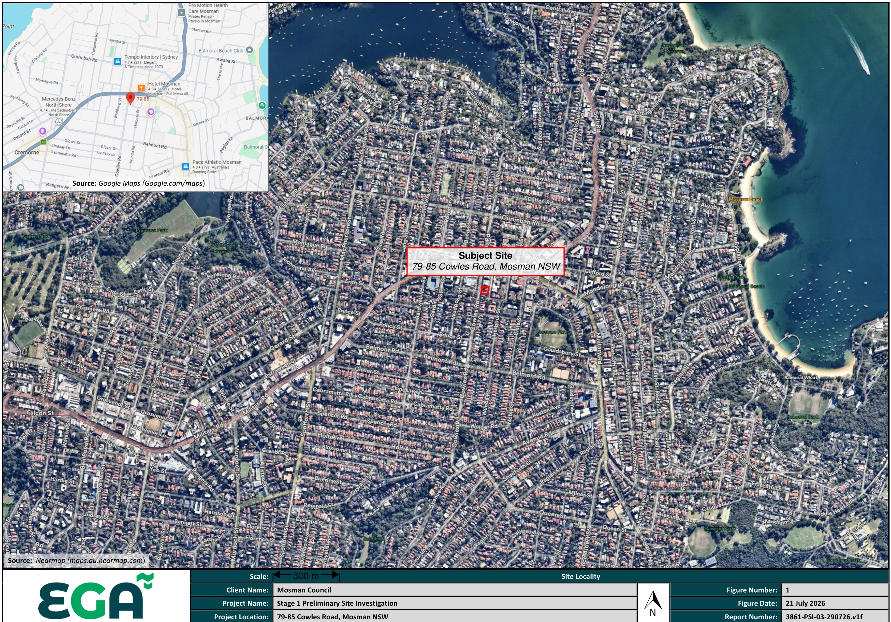

<!-- page 953 -->

Scale: Site Layout Client Name: Figure Number: 2 Project Name: Stage 1 Preliminary Site Investigation Figure Date: 21 July 2026 Project Location: 79-85 Cowles Road, Mosman NSW Report Number: 3861-PSI-03-290726.v1f

### LEGEND

Site Boundary

Source:  Nearmap (maps.au.nearmap.com) 10 m

August 2026

Attachment 1.1.10 Mosman Council

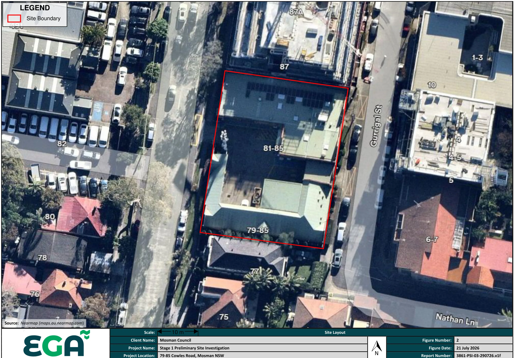

<!-- page 954 -->

Scale: Site Layout Client Name: Figure Number: 3

Project Name: Stage 1 Preliminary Site Investigation Figure Date: 21 July 2026 Project Location: 79-85 Cowles Road, Mosman NSW Report Number: 3861-PSI-03-290726.v1f

Source:  Nearmap (maps.au.nearmap.com) 10 m

### LEGEND

Site Boundary

AEC-1 / AEC-2 / AEC-3 / AEC-4 - Potential Chemical Storage / Wastewater Treatment and Drainage Infrastructure / Potential Fuel Infrastructure / Potential Uncontrolled Fill and Surface Soils

AEC-5 - On-Site Structures

August 2026

Attachment 1.1.10 Mosman Council

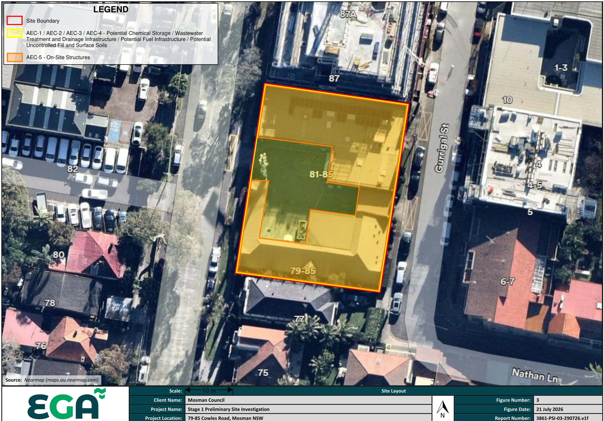

<!-- page 955 -->

Desktop Phase 1 Environmental Site Assessment 79-85 Cowles Road, Mosman NSW 3861-PSI-03-290726.v2f

Page 25

#### APPENDIX A

#### GROUNDWATER BORE RECORDS

August 2026

Attachment 1.1.10 Mosman Council

<!-- page 956 -->

home help contact customise State Overview State Overview Rivers and Streams favourites search download sites find a site Real Time Data - Rivers And Streams Daily River Reports Daily River Reports Dams favourites search download sites find a site Real Time Data - Major Dams Groundwater (Telemetered data) favourites search download sites find a site Real Time Data - Bores All Groundwater Site details search download sites find a site search by licence All Groundwater Map Meteorology favourites search download sites find a site Real Time Data - Weather Stations Hunter River Salinity Trading Scheme Hunter River Salinity Trading Scheme

bookmark this page All Groundwater Site Details ALL GROUNDWATER MAP All data times are Eastern Standard Time Map Info

There are 3 sites within 500 metres of the selected point. GW111484 GW111483 GW111485

+ −

contact WaterNSW

7/21/26, 10:02 AM Real-time water data

https://realtimedata.waternsw.com.au/water.stm 1/2

August 2026

Attachment 1.1.10 Mosman Council

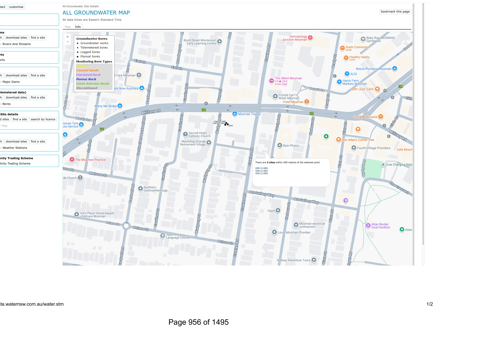

<!-- page 957 -->

Desktop Phase 1 Environmental Site Assessment 79-85 Cowles Road, Mosman NSW 3861-PSI-03-290726.v2f

Page 26

#### APPENDIX B

#### NSW SEED MAP

August 2026

Attachment 1.1.10 Mosman Council

<!-- page 958 -->

A NSW Government website

SEED Sharing and Enabling Environmental Data in NSW Search and download data Miners and Explorers map Browse by topic Case studies and insights Help and contact

How to use the SEED map Layers Legend Acid Sulfate Soil Risk Hm: High probability in bottom sediments H0: High probability at/near ground surface H0(s): High probability at/near ground surface with acidic scalds H1: High probability <1 m below ground surface H1(s): High probability <1 m below ground surface with acidic scalds H2: High probability 1 - 3 m below ground surface H2(p): High probability 1 - 3 m below ground surface in Pleistocene sediments H4: High probability >3 m below ground surface Lm: Low probability in bottom sediments L0: Low probability at/near ground surface L0(p): Low probability at/near ground surface on Pleistocene sediments L1: Low probability <1 m below ground surface L1(p): Low probability <1 m below ground surface in Pleistocene sediments L2: Low probability 1 - 3 m below ground surface L2(p): Low probability 1 - 3 m below ground surface in Pleistocene sediments L4: Low probability >3 m below ground surface L4(p): Low probability >3 m below ground surface on Pleistocene sediments N: No known occurrence N(p): No known occurrence in Pleistocene sediments NB: No known occurrence, Beach X0: Disturbed terrain, < 1 m below ground surface X1: Disturbed terrain, elevation 1 - 2 m AHD X1(p): Disturbed terrain, elevation 1 - 2m AHD in Pleistocene sediments X1(s): Disturbed terrain, elevation 1 - 2 m AHD with acidic scalds X2: Disturbed terrain, elevation 2 - 4 m AHD X2(p): Disturbed terrain, elevation 2 - 4 m AHD in Pleistocene sediments X2(s): Disturbed terrain, elevation 2 - 4 m AHD with acidic scalds X4: Disturbed terrain, elevation >4 m AHD X4(p): Disturbed terrain, elevation >4 m AHD in Pleistocene sediments Map data © OpenStreetMap contributors, Microsoft, Facebook, Inc. and its affiliates, Esri Community Maps contributors, Map layer by Esri Powered by Esri

Scale 18519 500 m X: 16837131.11 Y: -4005329.84 Projected Coordinates (X/Y)

79-85 COWLES ROAD MOSMAN 2088

Basemap

Draw/ Measure

Tools

Layer Intersect

Save Map

Contact Us Privacy Policy | More Info

7/21/26, 10:14 AM SEED Map

https://geo.seed.nsw.gov.au/vertigisstudio/web/?app=cabd04d595ec43c1aaf4298e80e83ec2 1/1

August 2026

Attachment 1.1.10 Mosman Council

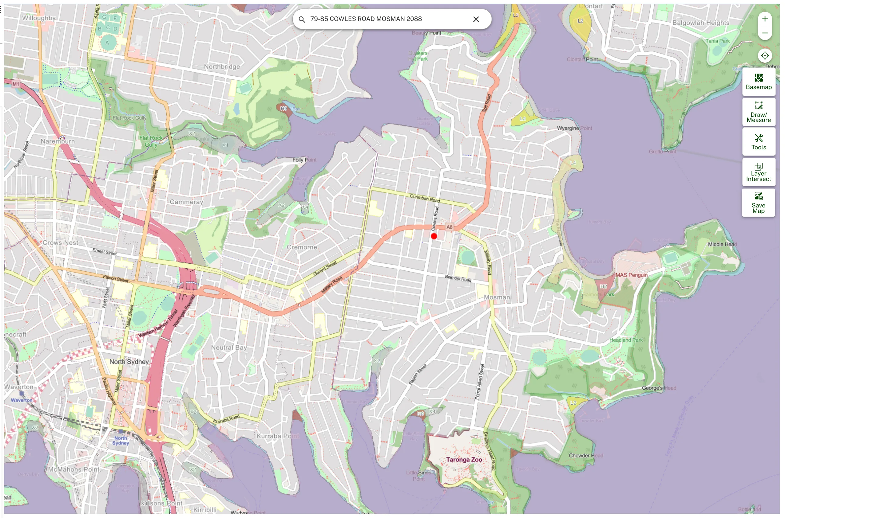

<!-- page 959 -->

Desktop Phase 1 Environmental Site Assessment 79-85 Cowles Road, Mosman NSW 3861-PSI-03-290726.v2f

Page 27

#### APPENDIX C

#### HISTORICAL AERIAL IMAGERY

August 2026

Attachment 1.1.10 Mosman Council

<!-- page 960 -->

Desktop Phase 1 Environmental Site Assessment 79-85 Cowles Road, Mosman NSW 3861-PSI-03-290726.v2f

Page 28

Historical Aerial 1. 1943 historical aerial imagery of the site. (Source: https://portal.spatial.nsw.gov.au/)

Historical Aerial 2. 1955 historical aerial imagery of the site. (Source: https://portal.spatial.nsw.gov.au/)

Historical Aerial 3. 1965 historical aerial imagery of the site. (Source: https://portal.spatial.nsw.gov.au/)

Historical Aerial 4. 1975 historical aerial imagery of the site. (Source: https://portal.spatial.nsw.gov.au/)

Historical Aerial 5. 1982 historical aerial imagery of the site. (Source: https://portal.spatial.nsw.gov.au/)

Historical Aerial 6. 1994 historical aerial imagery of the site. (Source: https://portal.spatial.nsw.gov.au/)

August 2026

Attachment 1.1.10 Mosman Council

<!-- page 961 -->

Desktop Phase 1 Environmental Site Assessment 79-85 Cowles Road, Mosman NSW 3861-PSI-03-290726.v2f

Page 29

Historical Aerial 7. 2005 historical aerial imagery of the site. (Source: https://portal.spatial.nsw.gov.au/)

Historical Aerial 8. 2013 historical aerial imagery of the site. (Source: https://apps.nearmap.com/)

Historical Aerial 9. 2026 historical aerial imagery of the site. (Source: https://apps.nearmap.com/)

August 2026

Attachment 1.1.10 Mosman Council

<!-- page 962 -->

Desktop Phase 1 Environmental Site Assessment 79-85 Cowles Road, Mosman NSW 3861-PSI-03-290726.v2f

Page 30

#### APPENDIX D

#### NSW EPA PUBLIC REGISTER

August 2026

Attachment 1.1.10 Mosman Council

<!-- page 963 -->

Background

A strategy to systematically prioritise, assess and respond to notifications under Section 60 of the Contaminated Land Management Act 1997 (CLM Act) has been developed by the EPA. This strategy acknowledges the EPA’s obligations to make information available to the public under Government Information (Public Access) Act 2009 .

When a site is notified to the EPA, it may be accompanied by detailed site reports where the owner has been proactive in addressing the contamination and its source. However, often there is minimal information on the nature or extent of the contamination.

After receiving a report, the first step is to confirm that the report does not relate to a pollution incident. The Protection of the Environment Operations Act 1997 (POEO Act) deals with pollution incidents, waste stockpiling or dumping. The EPA also has an incident management process to manage significant incidents (https://www.epa.nsw.gov.au/reporting-and-incidents/incident- management).

In many cases, the information indicates the contamination is securely immobilised within the site, such as under a building or carpark, and is not currently causing any significant risks for the community or environment. Such sites may still need to be cleaned up, but this can be done in conjunction with any subsequent building or redevelopment of the land. These sites do not require intervention under the CLM Act, and are dealt with through the planning and development consent process. In these cases, the EPA informs the local council or other planning authority, so that the information can be recorded and considered at the appropriate time (https://www.epa.nsw.gov.au/your-environment/contaminated-land/managing-contaminated-land/role-of-planning-authorities).

Where indications are that the contamination could cause actual harm to the environment or an unacceptable offsite impact (i.e. the land is 'significantly contaminated'), the EPA would apply the regulatory provisions of the CLM Act to have the responsible polluter and/or landowner investigate and remediate the site. If the reported contamination could present an immediate or long-term threat to human health NSW Health will be consulted. SafeWork NSW and Water NSW can also be consulted if there appear to be occupational health and safety risks or an impact on groundwater quality.

As such, the sites notified to the EPA and presented in the list of contaminated sites notified to the EPA are at various stages of the assessment and remediation process. Understanding the nature of the underlying contamination, its implications and implementing a remediation program where required, can take a considerable period of time. The list provides an indication, in relation to each nominated site, as to the management status of that particular site. Further detailed information may be available from the EPA or the person who notified the site.

The following questions and answers may assist those interested in this issue.

Frequently asked questions

Why does my land appear on the list of notified sites?

Your land may appear on the list because:

• the site owner and/or the polluter has notified the EPA under section 60 of the CLM Act • the EPA has been notified via other means and is satisfied that the site is or was contaminated.

If a site is on the list, it does not necessarily mean the contamination is significant enough to regulate under the CLM Act.

List current as at 9 April 2026 1 of 139

August 2026

Attachment 1.1.10 Mosman Council

<!-- page 964 -->

Does the list contain all contaminated sites in NSW?

No. The list only contains contaminated sites that EPA is aware of. If a site is not on the list, it does not necessarily mean the site is not contaminated.

The EPA relies on responsible parties and the public to notify contaminated sites.

How are notified contaminated sites managed by the EPA?

There are different ways the EPA can manage notified contaminated sites. Options include:

• regulation under the CLM Act, POEO Act, or both • notifying the relevant planning authority for management under the planning and development process • managing the site under the Protection of the Environment Operation (Underground Petroleum Storage Systems) Regulation 2014.

There are specific cases where contamination is managed under a tailored program operated by another agency (for example, the Resources & Geoscience's Legacy Mines Program).

What should I do if I am a potential buyer of a site that appears on the list?

You should seek advice from the seller to understand the contamination issue. You may need to seek independent contamination or legal advice.

The information provided in the list is indicative only and a starting point for your own assessment. Land contamination from past site uses is common, mainly in urban environments. If the site is properly remediated or managed, it may not affect the intended future use of the site.

Who can I contact if I need more information about a site?

You can contact the Environment Line at any time by calling 131 555 or by emailing info@environment.nsw.gov.au.

List of NSW Contaminated Sites Notified to the EPA

List current as at 9 April 2026 2 of 139

August 2026

Attachment 1.1.10 Mosman Council

<!-- page 965 -->

Site Status

Under assessment

Under Preliminary Investigation Order

Regulation under CLM Act not required

Explanation

The contamination is being assessed by the EPA to determine whether regulation is required. The EPA may require further information to complete the assessment. For example, the completion of management actions regulated under the planning process or Protection of the Environment Operations Act 1997 .

The EPA has issued a Preliminary Investigation Order under s10 of the Contaminated Land Management Act 1997 , to obtain additional information needed to complete the assessment.

The EPA has completed an assessment of the contamination and decided that regulation under the Contaminated Land Management Act 1997 is not required.

Disclaimer

The EPA has taken all reasonable care to ensure that the information in the list of contaminated sites notified to the EPA (the list) is complete and correct. The EPA does not, however, warrant or represent that the list is free from errors or omissions or that it is exhaustive.

The EPA may, without notice, change any or all of the information in the list at any time.

You should obtain independent advice before you make any decision based on the information in the list.

The list is made available on the understanding that the EPA, its servants and agents, to the extent permitted by law, accept no responsibility for any damage, cost, loss or expense incurred by you as a result of:

1.            any information in the list; or 2.            any error, omission or misrepresentation in the list; or 3.            any malfunction or failure to function of the list; 4.            without limiting (2) or (3) above, any delay, failure or error in recording, displaying or updating information.

List current as at 9 April 2026 3 of 139

August 2026

Attachment 1.1.10 Mosman Council

<!-- page 966 -->

Regulation being finalised

Contamination currently regulated under CLM Act

Contamination currently regulated under POEO Act

Contamination being managed via the planning process (EP&A Act)

Contamination formerly regulated under the CLM Act

Contamination formerly regulated under the POEO Act

The EPA has completed an assessment of the contamination and decided that the contamination is significant enough to warrant regulation under the Contaminated Land Management Act 1997 . A regulatory approach is being finalised.

The EPA has completed an assessment of the contamination and decided that the contamination is significant enough to warrant regulation under the Contaminated Land Management Act 1997 (CLM Act). Management of the contamination is regulated by the EPA under the CLM Act. Regulatory notices are available on the EPA’s Contaminated Land Public Record.

Contamination is currently regulated under the Protection of the Environment Operations Act 1997 (POEO Act).  The EPA as the appropriate regulatory authority reasonably suspects that a pollution incident is occurring/ has occurred and that it requires regulation under the POEO Act. The EPA may use environment protection notices, such as clean up notices, to require clean up action to be taken.  Such regulatory notices are available on the POEO public register.

The EPA has completed an assessment of the contamination and decided that the contamination is significant enough to warrant regulation. The contamination of this site is managed by the consent authority under the Environmental Planning and Assessment Act 1979 (EP&A Act) planning approval process, with EPA involvement as necessary to ensure significant contamination is adequately addressed. The consent authority is typically a local council or the Department of Planning and Environment.

The EPA has determined that the contamination is no longer significant enough to warrant regulation under the Contaminated Land Management Act 1997 (CLM Act). The contamination was addressed under the CLM Act.

The EPA has determined that the contamination is no longer significant enough to warrant regulation. The contamination was addressed under the Protection of the Environment Operations Act 1997 (POEO Act).

List current as at 9 April 2026 4 of 139

August 2026

Attachment 1.1.10 Mosman Council

<!-- page 967 -->

Contamination was addressed via the planning process (EP&A Act)

Ongoing maintenance required to manage residual contamination (CLM Act)

The EPA has determined that ongoing maintenance, under the Contaminated Land Management Act 1997 (CLM Act), is required to manage the residual contamination. Regulatory notices under the CLM Act are available on the EPA’s Contaminated Land Public Record.

The EPA has determined that the contamination is no longer significant enough to warrant regulation. The contamination was addressed by the appropriate consent authority via the planning process under the Environmental Planning and Assessment Act 1979 (EP&A Act).

List current as at 9 April 2026 5 of 139

August 2026

Attachment 1.1.10 Mosman Council

<!-- page 968 -->

Suburb SiteName Address ContaminationActivityType ManagementClass Latitude Longitude

MORPETH Telstra Cable Installation and RTA Bridge work Northumberland STREET Other Petroleum Regulation under CLM Act not required -32.72489729 151.6266795

MORPETH Former Service Station Swan  STREET Service Station Regulation under CLM Act not required -32.72477413 151.6250642

MORTLAKE Former Petroleum Storage Site 108-116 Tennyson ROAD Other Petroleum Regulation under CLM Act not required -33.83979033 151.1064889

MORTLAKE Kendall Bay Sediments Kendall BAY Gasworks Contamination currently regulated under CLM Act -33.83905999 151.1120458

MORTLAKE Former AGL site Tennyson  ROAD Gasworks Contamination formerly regulated under the CLM Act -33.84287407 151.1109313

MORTLAKE Majors Bay Redevelopment 14-22 Hilly STREET Other Industry Regulation under CLM Act not required -33.83954617 151.1054674

MORUYA Former Fuel Depot Moruya 11 to 13 Ford STREET Other Petroleum Regulation under CLM Act not required -35.9112243 150.0826475

MORUYA Caltex Service Station Moruya 80-84 Campbell STREET Service Station Regulation under CLM Act not required -35.91195596 150.0824213

MORUYA Ampol Fuel Depot - Moruya 26 Campbell STREET Service Station Regulation under CLM Act not required -35.9104985 150.0711419

MOSMAN 7-Eleven Mosman 162A Spit Road Corner Mitchell ROAD Service Station Regulation under CLM Act not required -33.81747016 151.2433633

MOSMAN BP Service Station 175 Ourimbah ROAD Service Station Regulation under CLM Act not required -33.82106757 151.233291

MOSMAN BP Express Mosman 175 Ourimbah  ROAD Service Station Regulation under CLM Act not required -33.82106459 151.2332921

MOSMAN 7-Eleven Service Station Mosman 45 Spit ROAD Service Station Regulation under CLM Act not required -33.82302718 151.2435627

MOSMAN Allan Border Oval Myahgah  ROAD Landfill Regulation under CLM Act not required -33.82681534 151.2417712

MOSMAN 173 Avenue Road, MOSMAN NSW 2088 173 Avenue ROAD Unclassified Regulation under CLM Act not required -33.930869 150.97132

List current as at 9 April 2026 85 of 139

August 2026

Attachment 1.1.10 Mosman Council

<!-- page 969 -->

Suburb SiteName Address ContaminationActivityType ManagementClass Latitude Longitude

MOSS VALE Woolworths Service Station Moss Vale 609 Argyle  STREET Service Station Regulation under CLM Act not required -34.55409411 150.3609797

MOSS VALE Coles Express Service Station 579 Argyle STREET Service Station Regulation under CLM Act not required -34.55313422 150.364684

MOSS VALE Moss Vale Refuelling Facility Lackey ROAD Other Petroleum Regulation under CLM Act not required -34.54662421 150.3721525

MOUNT ANNAN Woolworths Caltex Mount Annan 157 Narellan (Corner Smeaton Grange Road) ROAD Service Station Regulation under CLM Act not required -34.04685527 150.7610434

MOUNT ANNAN Great Southern Railways Aqueduct Off Narellan  ROAD Unclassified Regulation under CLM Act not required -34.07308479 150.7707436

MOUNT COLAH Caltex Service Station Mount Colah 603 Pacific HIGHWAY Service Station Regulation under CLM Act not required -33.67034662 151.1151861

MOUNT COLAH Foxglove Oval Foxglove ROAD Landfill Contamination currently regulated under CLM Act -33.65829855 151.1229638

MOUNT DRUITT Caltex (former Mobil) Service Station, 17 Mount Street, Mount Druitt 17 Mount STREET Service Station Regulation under CLM Act not required -33.76567994 150.8244544

MOUNT DRUITT 7-Eleven Mount Druitt Lot 6 Luxford ROAD Other Petroleum Regulation under CLM Act not required -33.76483839 150.8254157

MOUNT HUTTON Woolworths Service Station 46 Wilsons ROAD Service Station Regulation under CLM Act not required -32.9836378 151.67309

MOUNT PRITCHARD 7-Eleven Service Station 352 Elizabeth DRIVE Service Station Regulation under CLM Act not required -33.90260656 150.8963326

MOUNT THORLEY Bulga Surface Operations Broke ROAD Other Industry Regulation under CLM Act not required -32.68325751 151.1206158

MOUNT THORLEY Lowes Petroleum (Former BP) Depot Mount Thorley 74 Mount Thorley ROAD Other Petroleum Regulation under CLM Act not required -32.62443074 151.1025122

MOUNT VICTORIA Former Mobil Service Station 81 Great Western HIGHWAY Service Station Regulation under CLM Act not required -33.5889727 150.2511783

MOUNT VICTORIA Caltex Service Station 36a Great Western HIGHWAY Service Station Regulation under CLM Act not required -33.58436517 150.2465528

List current as at 9 April 2026 86 of 139

August 2026

Attachment 1.1.10 Mosman Council

<!-- page 970 -->

Search TIP To search for a specific site, search by LGA (local government area) and carefully review all sites listed. ... more search tips

Home Public registers Contaminated land record of notices Search results Your search for:Suburb: MOSMAN Search Again Refine Search did not find any records in our database. If a site does not appear on the record it may still be affected by contamination. For example: Contamination may be present but the site has not been regulated by the EPA under the Contaminated Land Management Act 1997 or the Environmentally Hazardous Chemicals Act 1985. The EPA may be regulating contamination at the site through a licence or notice under the Protection of the Environment Operations Act 1997 (POEO Act). Contamination at the site may be being managed under the planning process. More information about particular sites may be available from: The POEO public register The appropriate planning authority: for example, on a planning certificate issued by the local council under section 149 of the Environmental Planning and Assessment Act. See What's in the record and What's not in the record. If you want to know whether a specific site has been the subject of notices issued by the EPA under the CLM Act, we suggest that you search by Local Government Area only and carefully review the sites that are listed. This public record provides information about sites regulated by the EPA under the Contaminated Land Management Act 1997, including sites currently and previously regulated under the Environmentally Hazardous Chemicals Act 1985. Your inquiry using the above search criteria has not matched any record of current or former regulation. You should consider searching again using different criteria. The fact that a site does not appear on the record does not necessarily mean that it is not affected by contamination. The site may have been notified to the EPA but not yet assessed, or contamination may be present but the site is not yet being regulated by the EPA. Further information about particular sites may be available from the appropriate planning authority, for example, on a planning certificate issued by the local council under section 149 of the Environmental Planning and Assessment Act. In addition the EPA may be regulating contamination at the site through a licence under the Protection of the Environment Operations Act 1997. You may wish to search the POEO public register.POEO public register 13 July 2026

7/13/26, 12:13 PM DECCW | Search results

https://app.epa.nsw.gov.au/prclmapp/searchresults.aspx?&LGA=&Suburb=MOSMAN&Notice=&Name=&Text=&DateFrom=&DateTo= 1/1

August 2026

Attachment 1.1.10 Mosman Council

<!-- page 971 -->

Home Public registers POEO Public Register Licences, applications and notices search Search results

Your search for: General Search with the following criteria Suburb - mosman returned 26 results Export to excel 2 of 2 Pages Search Again Number Name Location Type Status Issued date 1522383 TARONGA CONSERVATION SOCIETY AUSTRALIA BRADLEYS HEAD ROAD, MOSMAN, NSW 2088

s.58 Licence Variation Issued Issued 09 Jul 2015

1600361 TARONGA CONSERVATION SOCIETY AUSTRALIA BRADLEYS HEAD ROAD, MOSMAN, NSW 2088

Compliance Audit Complete Complete 14 Sep 2020

1603655 TARONGA CONSERVATION SOCIETY AUSTRALIA BRADLEYS HEAD ROAD, MOSMAN, NSW 2088

s.58 Licence Variation Issued Issued 08 Apr 2021

1615336 TARONGA CONSERVATION SOCIETY AUSTRALIA BRADLEYS HEAD ROAD, MOSMAN, NSW 2088

s.58 Licence Variation Issued Issued 23 Dec 2021

1623058 TARONGA CONSERVATION SOCIETY AUSTRALIA BRADLEYS HEAD ROAD, MOSMAN, NSW 2088

s.58 Licence Variation Issued Issued 30 Nov 2022

1630287 TARONGA CONSERVATION SOCIETY AUSTRALIA BRADLEYS HEAD ROAD, MOSMAN, NSW 2088

s.58 Licence Variation Issued Issued 03 Oct 2023

12 13 July 2026

7/13/26, 12:14 PM Environment & Heritage | PRPOEO

https://app.epa.nsw.gov.au/prpoeoapp/SearchResult.aspx?SearchTag=all&searchrange=general&range=general&SortExpression=AccountablePa… 1/1

August 2026

Attachment 1.1.10 Mosman Council

<!-- page 972 -->

Home Public registers POEO Public Register Licences, applications and notices search Search results

Your search for: General Search with the following criteria Suburb - mosman returned 26 results Export to excel 1 of 2 Pages Search Again Number Name Location Type Status Issued date 1621649 THE SPIT, MOSMAN, NSW 2088 s.58 Licence Variation Issued Issued 08 Feb 2023 1028480 ARDENT LEISURE LIMITED  THE SPIT, MOSMAN, NSW 2088 s.58 Licence Variation Issued Issued 03 Jul 2003 1032563 ARDENT LEISURE LIMITED  THE SPIT, MOSMAN, NSW 2088 s.58 Licence Variation Issued Issued 20 Nov 2003 1069448 ARDENT LEISURE LIMITED  THE SPIT, MOSMAN, NSW 2088 s.58 Licence Variation Issued Issued 05 Feb 2007 1070978 ARDENT LEISURE LIMITED  THE SPIT, MOSMAN, NSW 2088 s.58 Licence Variation Issued Issued 14 Mar 2007 1072567 ARDENT LEISURE LIMITED  THE SPIT, MOSMAN, NSW 2088 s.58 Licence Variation Issued Issued 24 Apr 2007 1074550 ARDENT LEISURE LIMITED  THE SPIT, MOSMAN, NSW 2088 s.58 Licence Variation Issued Issued 13 Jun 2007 1078238 ARDENT LEISURE LIMITED  THE SPIT, MOSMAN, NSW 2088 s.58 Licence Variation Issued Issued 19 Sep 2007 1085886 ARDENT LEISURE LIMITED  THE SPIT, MOSMAN, NSW 2088 s.58 Licence Variation Issued Issued 12 May 2008 1097027 ARDENT LEISURE LIMITED  THE SPIT, MOSMAN, NSW 2088 s.58 Licence Variation Issued Issued 30 Jan 2009 1509253 ARDENT LEISURE LIMITED  THE SPIT, MOSMAN, NSW 2088 s.58 Licence Variation Issued Issued 24 Jun 2013 11724 HEALTHSCOPE OPERATIONS PTY LTD

#### 1 ELLAMATTA AVENUE,

MOSMAN, NSW 2088 POEO licence No longer in force No longer in force

16 Sep 2002

1048188 HEALTHSCOPE OPERATIONS PTY LTD

#### 1 ELLAMATTA AVENUE,

MOSMAN, NSW 2088 s.58 Licence Variation Issued Issued 27 May 2005 11211 MA MARINA FUND OPCO NO. 1 PTY LTD THE SPIT, MOSMAN, NSW 2088 POEO licence Issued Issued 30 Jan 2001 3514873 MA MARINA FUND OPCO NO. 1 PTY LTD THE SPIT, MOSMAN, NSW 2088 s.91 Clean Up Notice Issued Issued 10 Jan 2026 1596267 NONBANK MORTGAGES PTY. LTD. THE SPIT, MOSMAN, NSW 2088 s.58 Licence Variation Issued Issued 29 Jun 2021 1008406 OMNI LEISURE OPERATIONS LIMITED THE SPIT, MOSMAN, NSW 2088 s.58 Licence Variation Issued Issued 13 Jun 2001 1018813 OMNI LEISURE OPERATIONS LIMITED THE SPIT, MOSMAN, NSW 2088 s.58 Licence Variation Issued Issued 06 Sep 2002 1677 TARONGA CONSERVATION SOCIETY AUSTRALIA BRADLEYS HEAD ROAD, MOSMAN, NSW 2088

POEO licence Issued Issued 26 Sep 2000

1512309 TARONGA CONSERVATION SOCIETY AUSTRALIA BRADLEYS HEAD ROAD, MOSMAN, NSW 2088

Compliance Audit Complete Complete 21 Feb 2013

12 13 July 2026

7/13/26, 12:14 PM Environment & Heritage | PRPOEO

https://app.epa.nsw.gov.au/prpoeoapp/SearchResult.aspx?SearchTag=all&searchrange=general&range=general&SortExpression=AccountablePa… 1/1

August 2026

Attachment 1.1.10 Mosman Council

<!-- page 973 -->

## Desktop Phase 1 Environmental Site

## Assessment

491-505 Military Road, Mosman NSW

Report No: Report Date:

3861-PSI-04-290726.v2f 03/08/2026

info@egau.com.au

NSW: 36E Fitzroy Street, Marrickville, NSW 2204 VIC: 88 Langridge St, Collingwood VIC 3066

August 2026

Attachment 1.1.10 Mosman Council

<!-- page 974 -->

Desktop Phase 1 Environmental Site Assessment 491-505 Military Road, Mosman NSW 3861-PSI-04-290726.v2f

Page 1

### Document Record

Revision Date Author Reviewer

v1f 29 July 2026 Rachelle Conna Isabelle Figatowski

v2f 3 August 2026 Rachelle Conna Isabelle Figatowski

Author Signature Reviewer Signature

Name Rachelle Conna Name Isabelle Figatowski

Credentials B. Sc. (Zoology) Credentials B.Sc. (Env. Consulting)

Title Environmental Consultant Title Senior Environmental Consultant

Document Title: Desktop Phase 1 Environmental Site Assessment - 491-505 Military Road, Mosman NSW Site Address: 491-505 Military Road, Mosman NSW Client Name: Site Size: ≈ 5,200 m2 Reference Number: 3861-PSI-04-290726.v2f Project Type: Desktop Phase 1 Environmental Site Assessment Project Type Abbreviation: PSI Document Draft: FINAL Document Revision No. v2f

Prepared by Environmental Group Australia Pty Ltd ABN: 83 671 599 143

August 2026

Attachment 1.1.10 Mosman Council

<!-- page 975 -->

Desktop Phase 1 Environmental Site Assessment 491-505 Military Road, Mosman NSW 3861-PSI-04-290726.v2f

Page 2

### EXECUTIVE SUMMARY

Environmental Group Australia Pty Ltd (EGA) was engaged by Mosman Council (hereafter referred to as ‘the client’), to undertake a Desktop Phase 1 Environmental Site Assessment of the property located within Lot 1 DP1130557, 491-505 Military Road, Mosman NSW (hereafter referred to as ‘the site’) (refer to Figure 1 and Figure 2).

The client is preparing to lodge a planning proposal to implement the draft Mosman Masterplan, which proposes increased housing capacity across the study area, including amendments to the planning controls at the site to facilitate redevelopment.

#### Purpose and Objectives

A Desktop Phase 1 Environmental Site Assessment was required to assess the likelihood that the site had been contaminated by past or present activities and to form a preliminary view on the extent and degree of contamination. The objectives of the investigation were to:

• Provide advice on whether the site may require a stage 2 intrusive site assessment, to better define the nature and extent of potential contamination within the site; and • Provide advice on whether the site would be suitable (in the context of land contamination) for any proposed future rezoning.

#### Site Description

• The site covers an area of approximately 5,200 m2; • The site is currently zoned as E3: Productivity Support; • The site is currently utilised as a car sales and parts yard (Mosman Toyota); • The site is located within a mixed commercial-industrial and residential district.

Current aerial imagery suggests that the site is operating as a car sales and parts yard, with one large structure covering the north and three structures in the centre of the site, and hardstand across the site surface.

#### Proposed Development

Reference is made to the draft Mosman Masterplan Structure Plan prepared by SJB Architecture, dated 29 July 2026 (Drawing No. 06, Revision 07). EGA understands that the site has been identified for increased development potential, however, have not been provided with any specific redevelopment plans. EGA has made the assumption that future development may include the demolition of current structures, rezoning of land, subdivision of land, and construction of new structures and infrastructure. EGA has not been made aware of any basement plans and have presumed that they are proposed as part of the future development.

#### Scope of Work

EGA undertook the following scope of works to address the project objectives:

• A desktop review of relevant information pertaining to the site; and • Assessment and reporting of the desktop review.

#### Investigation Outcome

Based on EGA’s assessment of the desktop review information, in the context of the proposed redevelopment scenario, EGA has made the following conclusions:

• The search of historical aerial imagery indicated a moderate potential for contamination within the site to have occurred, associated with uncontrolled demolition and potential site filling

August 2026

Attachment 1.1.10 Mosman Council

<!-- page 976 -->

Desktop Phase 1 Environmental Site Assessment 491-505 Military Road, Mosman NSW 3861-PSI-04-290726.v2f

Page 3

beneath slabs. EGA also notes that the building fabrics may contain hazardous building materials; • A review of publicly available contaminated land databases indicated that the site is not the subject of any licences, applications, notices under Section 308 of the Protection of the Environment Operations Act 1997. The site is not notified under Section 60 of the Contaminated Land Management Act 1997. The site is not the subject of any notifications under Section 58 of the Contaminated Land Management Act 1997; • The contaminants and areas of environmental concern (AEC), requiring further consideration or assessment, and possibly remediation or risk management, are the following: o AEC-1: Potential Chemical Storage – Leaks, Spills or Poor Management; o AEC-2: Wastewater Treatment and Drainage Infrastructure – Structural Failure or Leakage; o AEC-3: Potential Contaminants within Soils; and o AEC-4: On-Site Structures – Hazardous Building Materials; • Soils not impacted by contamination may meet excavated natural material (ENM) or General Solid Waste (GSW) classification.

#### Conclusions and Recommendations

Notwithstanding the above, the potential contaminants of concern and affected environmental media are consistent with those typically encountered on brownfield redevelopment sites within the Sydney Basin. Any contamination that may be present is not expected to be of such an extent or complexity that it could not be effectively managed or remediated using conventional and readily available remediation techniques. Accordingly, the potential for contamination at the site is not considered to preclude proposed future redevelopment.

As detailed development plans are prepared for individual areas of the site, the existing environmental data should be reviewed in conjunction with the overall remedial strategy to confirm the nature and extent of any contamination relevant to the proposed works. Where required, additional assessment should be undertaken, and appropriate remediation and/or management measures developed, to demonstrate that the relevant portion of the site is, or can be made, suitable for its intended use.

This report, including its conclusions and recommendations, must be read in conjunction with the limitations presented in Section 12.

August 2026

Attachment 1.1.10 Mosman Council

<!-- page 977 -->

Desktop Phase 1 Environmental Site Assessment 491-505 Military Road, Mosman NSW 3861-PSI-04-290726.v2f

Page 4

#### TABLE OF CONTENTS

#### 1.

#### INTRODUCTION

#### 7

1.1. Purpose and Objectives ............................................................................................................... 7 1.2. Site Description ............................................................................................................................. 7 1.3. Proposed Development ................................................................................................................ 7 1.4. Scope of Work .............................................................................................................................. 7

#### 2.

#### SITE IDENTIFICATION

#### 8

#### 3.

#### PHYSICAL SITE CONDITIONS

#### 9

#### 4.

#### SITE HISTORY AND LAND USE

#### 11

4.1. Aerial Imagery ............................................................................................................................ 11 4.2. Anecdotal Information ............................................................................................................... 11 4.3. Incident and Complaints History ............................................................................................... 12 4.4. Previous Contamination Assessments ...................................................................................... 12

#### 5.

#### REGULATORY RECORDS

#### 13

5.1. NSW EPA CLM Act Register of Notified Sites and Notices ....................................................... 13 5.2. NSW EPA POEO Act Register of Licences, Applications and Notices ...................................... 13 5.3. Dangerous Goods Licences Search ............................................................................................ 13

#### 6.

#### INFORMATION SOURCES

#### 14

#### 7.

#### CONCEPTUAL SITE MODEL

#### 15

7.1. Potential Areas of Environmental Concern ............................................................................... 15 7.2. Contaminants, Migration Pathways, Receptors and Risks ...................................................... 15 7.3. Site Characteristics Affecting Risks ........................................................................................... 16 7.3.1. Land-Use Setting................................................................................................................ 16 7.3.2. Surface Water ..................................................................................................................... 16 7.3.3. Groundwater – Drinking Water Risks ................................................................................ 17 7.3.4. Recreational Water Use and Aquatic Ecosystems ............................................................ 17 7.3.5. Terrestrial Ecosystems ....................................................................................................... 17 7.3.6. Human Exposures to Site Contaminants ........................................................................... 17

#### 8.

#### RISK ASSESSMENT (PLANNING LEVEL)

#### 18

#### 9.

#### PLANNING AND MASTER PLAN ADVICE

#### 19

9.1. Suitability for Future Development ............................................................................................ 19 9.2. Identification of Potential Issues ............................................................................................... 19 9.3. Requirements for the Development Application (DA) Stage ................................................... 19 9.4. Suggestion Inclusion to Master Planning .................................................................................. 19

#### 10. CONTAMINANTS OF CONCERN

#### 21

#### 11. CONCLUSIONS AND RECOMMENDATIONS

#### 22

11.1. Site Condition and Further Requirements ................................................................................. 22 11.2. Recommendations ...................................................................................................................... 22

#### 12. STATEMENT OF LIMITATIONS

#### 23

August 2026

Attachment 1.1.10 Mosman Council

<!-- page 978 -->

Desktop Phase 1 Environmental Site Assessment 491-505 Military Road, Mosman NSW 3861-PSI-04-290726.v2f

Page 5

#### 13. REFERENCES

#### 24

FIGURES Figure 1 - Site Locality Figure 2 - Site Layout Figure 3 - Areas of Environmental Concern

APPENDICES A - Groundwater Bore Records B - NSW SEED Map C - Historical Aerial Imagery D - NSW EPA Public Register

August 2026

Attachment 1.1.10 Mosman Council

<!-- page 979 -->

Desktop Phase 1 Environmental Site Assessment 491-505 Military Road, Mosman NSW 3861-PSI-04-290726.v2f

Page 6

### LIST OF ABBREVIATIONS

AHD Australian Height Datum AEC Area of Environmental Concern ANZECC Australian and New Zealand Environment and Conservation Council AST Aboveground storage tank Bgl Below ground level BTEX Benzene, toluene, ethylbenzene, xylene CoC Chain of Custody CSM Conceptual Site Model EIL Ecological Investigation Level EGA Environmental Group Australia Pty Ltd EPA Environment Protection Authority HIL Health Investigation Levels HSL Health Screening Levels LOR [Laboratory] Limit of Reporting NATA National Association of Testing Laboratories NA Not applicable ND Not detected NEPC National Environment Protection Council NEPM National Environment Protection Measure NSW EPA NSW Environment Protection Authority OCP Organochlorine Pesticide PAEC Potential Area of Environmental Concern PAH Polycyclic aromatic hydrocarbon PCB Polychlorinated biphenyl PID Photo-ionisation detector PSI Preliminary Site Investigation QA/QC Quality assurance/Quality control RPD Relative percentage difference SAQP Sampling Analysis and Quality Plan SVOC Semi-volatile organic compound USCS Unified Soil Classification System UST Underground storage tank VOC Volatile organic compound

August 2026

Attachment 1.1.10 Mosman Council

<!-- page 980 -->

Desktop Phase 1 Environmental Site Assessment 491-505 Military Road, Mosman NSW 3861-PSI-04-290726.v2f

Page 7

#### 1. INTRODUCTION

Environmental Group Australia Pty Ltd (EGA) was engaged by Mosman Council (hereafter referred to as ‘the client’), to undertake a Desktop Phase 1 Environmental Site Assessment of the property located within Lot 1 DP1130557, 491-505 Military Road, Mosman NSW (hereafter referred to as ‘the site’) (refer to Figure 1 and Figure 2).

The client is preparing to lodge a planning proposal to implement the draft Mosman Masterplan, which proposes increased housing capacity across the study area, including amendments to the planning controls at the site to facilitate redevelopment.

#### 1.1.

#### Purpose and Objectives

A Desktop Phase 1 Environmental Site Assessment was required to assess the likelihood that the site had been contaminated by past or present activities and to form a preliminary view on the extent and degree of contamination. The objectives of the investigation were to:

• Provide advice on whether the site may require a stage 2 intrusive site assessment, to better define the nature and extent of potential contamination within the site; and • Provide advice on whether the site would be suitable (in the context of land contamination) for any proposed future rezoning.

#### 1.2.

#### Site Description

• The site covers an area of approximately 5,200 m2; • The site is currently zoned as E3: Productivity Support; • The site is currently utilised as a car sales and parts yard (Mosman Toyota); • The site is located within a mixed commercial-industrial and residential district.

Current aerial imagery suggests that the site is operating as a car sales and parts yard, with one large structure covering the north and three structures in the centre of the site, and hardstand across the site surface.

#### 1.3.

#### Proposed Development

Reference is made to the draft Mosman Masterplan Structure Plan prepared by SJB Architecture, dated 29 July 2026 (Drawing No. 06, Revision 07). EGA understands that the site has been identified for increased development potential, however, have not been provided with any specific redevelopment plans. EGA has made the assumption that future development may include the demolition of current structures, rezoning of land, subdivision of land, and construction of new structures and infrastructure. EGA has not been made aware of any basement plans and have presumed that they are proposed as part of the future development.

#### 1.4.

#### Scope of Work

EGA undertook the following scope of works to address the project objectives:

• A desktop review of relevant information pertaining to the site; and • Assessment and reporting of the desktop review.

August 2026

Attachment 1.1.10 Mosman Council

<!-- page 981 -->

Desktop Phase 1 Environmental Site Assessment 491-505 Military Road, Mosman NSW 3861-PSI-04-290726.v2f

Page 8

#### 2. SITE IDENTIFICATION

The site identification details and associated information are presented in Table 2.1.

Table 2.1 Site Identification Information Attribute Description

Street Address 491-505 Military Road, Mosman NSW

Lot and Deposited Plan (DP) Lot 1 DP1130557

Current Owner

Geographical Coordinates 33°49'30.5"S 151°14'20.2"E (approximate centre of site)

Site Area ≈ 5,200 m2

Local Government Area (LGA) Mosman Municipal Council

Parish Willoughby

County Cumberland

Zoning E3: Productivity Support Mosman Local Environmental Plan 2012 (2011 EPI 647)

The locality of the site is identified in Figure 1.

The general layout and boundary of the site are shown in Figure 2.

August 2026

Attachment 1.1.10 Mosman Council

<!-- page 982 -->

Desktop Phase 1 Environmental Site Assessment 491-505 Military Road, Mosman NSW 3861-PSI-04-290726.v2f

Page 9

#### 3. PHYSICAL SITE CONDITIONS

Regional geology, topography, soil landscape and hydrogeological information are presented in Table 3.1.

Table 3.1 Regional Setting Information Attribute Description

Geology

A review of the Environment NSW ‘eSpade V2.2’ web application (environment.nsw.gov.au/eSpade2WebApp, accessed 16 July 2026), indicated that the site is likely to be underlain by Hawkesbury Sandstone, which is a medium to coarse-grained quartz sandstone with minor shale and laminite lenses.

Soil Profiles

A review of the Environment NSW ‘eSpade V2.2’ web application (environment.nsw.gov.au/eSpade2WebApp, accessed 16 July 2026), indicated that the site is likely to contain: • gy1 (Topsoil): Loose, acidic, water-repellent coarse sandy loam, high permeability, low water capacity. • gy2 (Subsoil/Sandstone): Earthy, hard setting yellowish-brown clayey sand, low water capacity. • gy3 (Subsoil/Sandstone): Earthy/weakly pedal sandy clay loam, low permeability and wet strength. • gy4 (Subsoil/Shale): Highly pedal, highly erodible yellowish-brown clay, low permeability and wet strength. • Associated: Surface leaf litter (up to 10 cm) and loose quartz sand wash.

Terrain and Structure

A review of the Environment NSW ‘eSpade V2.2’ web application (environment.nsw.gov.au/eSpade2WebApp, accessed 16 July 2026), indicated that the site is likely to comprise: • Crests (<50 cm deep): Gradual transition of gy1 over bedrock, gy2, or occasionally gy3. Hard setting layers or bedrock expose when eroded. • Side slopes (30–70 cm deep): Discontinuous soils with up to 25% rock outcrop. gy1 overlies bedrock or gy2/gy3 on benches. • Shale Lenses (<100 cm deep): Sharp transition from gy1 to deep gy4 clay on inner benches. • Drainage Lines (<100 cm deep): Deep gy1 directly over bedrock.

Acid Sulfate Soils

A review of the NSW Government SEED web application (geo.seed.nsw.gov.au, accessed 16 July 2026), indicates that the site lies in an area mapped as ‘No Known Occurrence’ with respect to acid sulfate soils. This infers that land management activities are not likely to be affected by acid sulfate soils. Further assessment of acid sulfate soils in the context of this investigation is considered by EGA as not warranted.

Topography

Generally, the local landscape consists of undulating to rolling low hills with local relief 20–80 m and slopes of 10–25%. Sideslopes with narrow to wide outcropping sandstone rock benches (10–100 m), often forming broken scarps of <5 m. The site is located at an elevation approximately 90 m to 95 m Australian Height Datum (AHD) and gently sloping on a downward gradient toward the southwest.

Hydrology and Hydrogeology

Surface water courses proximal to the site include Quakers Hat Bay located approximately 872 m to the north and 1.18 km to the northwest of the site, and Balmoral Bay located approximately 1.2 km to the east of the site. Based on the site topography and distances to the nearest surface water course, groundwater flow in the vicinity of the site is considered likely to be towards the north. A review of the NSW Office of Water groundwater database undertaken on 16 July 2026 indicated three registered groundwater features located within the site: • GW111485: monitoring bore, final depth – 10.00 m bgl, standing water level – 5.94 m bgl, located in the west of the site; • GW111484: monitoring bore, final depth – 10.00 m bgl, standing water level – 6.03 m bgl, located in the west of the site; and GW111483: monitoring bore, final depth – 5.00 m bgl, standing water level – 3.68 m bgl, located in the west of the site.

August 2026

Attachment 1.1.10 Mosman Council

<!-- page 983 -->

Desktop Phase 1 Environmental Site Assessment 491-505 Military Road, Mosman NSW 3861-PSI-04-290726.v2f

Page 10

Attribute Description

Adjacent Sensitive Receptors

The closest ecological receptors to the site include vegetated areas within the site / neighbouring properties and the closest receiving watercourses as outlined above. A review of the Bureau of Meteorology (BoM) Groundwater Dependent Ecosystem (GDE) Atlas Map was undertaken on 16 July 2026 to determine the closest sensitive ecological receptors. The closest sensitive receptor to the site included Manly Lagoon, located approximately 5.9 km to the northeast of the site and noted as a high potential groundwater dependent ecosystem. The closest sensitive human receptors are the residential properties surrounding the site’s boundary and any future onsite construction workers/builders.

Perfluoroalkyl Substances (PFAS)

A review of the publicly available NSW Government PFAS Investigation Program mapping information was reviewed 16 July 2026. The review was undertaken to identify any investigation localities that may affect the site. The site is not considered to be affected by any PFAS investigation programs.

Unexploded Ordnance (UXO)

A review of the publicly available Unexploded Ordnance (UXO) mapping information was reviewed 16 July 2026. The review was undertaken to identify any recorded UXO-related constraints or risks applicable to the site and its surrounding area at the time of reporting. The site is not considered to be affected by UXO.

A copy of the NSW Office of Water search record is presented in Appendix A.

A copy of the NSW SEED search record is presented in Appendix B

August 2026

Attachment 1.1.10 Mosman Council

<!-- page 984 -->

Desktop Phase 1 Environmental Site Assessment 491-505 Military Road, Mosman NSW 3861-PSI-04-290726.v2f

Page 11

#### 4. SITE HISTORY AND LAND USE

#### 4.1.

#### Aerial Imagery

A review of selected historical aerial imagery was undertaken. Observations made of the imagery considered relevant to this investigation are presented in Table 4.1. A copy of the historical aerials is presented in Appendix C.

Table 4.1 Aerial Imagery Observations Image Date Site Features Surrounding Land Use Settings

1943

Observations of the site included ten low- density housing structures and lots, with associated infrastructure and landscaping.

The wider site area is observed to consist mixed land- use of commercial and low-density residential. ‘Military Road’ to the north, ‘Wudgong Street’ to the east and ‘Cowles Road’ to the west site boundary observed. The property to the west is observed to consist vacant land with stockpiled soils.

1955

Demolition of the four northwestern properties and construction of a commercial warehouse is observed.

The western property is observed to comprise a residential structure.

1965 The southwestern most property is observed to be demolished and the land vacant.

Demolition of existing structures and commercial construction observed to the east and west.

1971

The southeastern most property is observed to be demolished and the land vacant. Both vacant properties to the south of the site appear to now comprise a parking lot.

No significant changes observed.

1986

The northeastern property is observed to be demolished and replaced with a hardstand parking lot. The two centre-eastern properties are observed to be demolished, and two shed structures are observed.

Demolition of existing structures and commercial construction observed to the north observed. An addition shed structure observed to the west.

1994

The remaining residential structure to the centre-west is observed to be demolished and replaced with a shed that connects to the other two shed structures.

Demolition of existing structures and commercial construction observed to the east.

2005

The shed structure constructed in 1994 in the centre of the site is observed to be demolished and replaced with a larger shed. Upgrades to roofing structures observed to the northern structure.

Observations included demolition of existing structures and construction of ‘Mackillop Grange Retirement Village’ and high density residential to the west and demolition of an existing structure to the east.

2013 No significant changes observed. Demolition of existing structures and commercial construction observed to the north.

2026 Roofing upgrades observed to all structures and solar instillation observed.

Observations included demolition of existing structures and commercial construction to the east and demolition of an existing structure to the northwest.

The aerial imagery indicated a moderate potential for land contaminating activities to have occurred on the site including uncontrolled demolition and historical asbestos and pesticide application beneath slabs. Based on these possibilities, a Stage 2 Intrusive Assessment is recommended, should any works be proposed below the hardstand layer on-site. EGA also notes that on-site structures may contain hazardous building materials, and a hazardous building material survey (HMBS) is recommended prior to any demolition of on-site structures.

#### 4.2.

#### Anecdotal Information

EGA has not been advised of any anecdotal information by the client.

August 2026

Attachment 1.1.10 Mosman Council

<!-- page 985 -->

Desktop Phase 1 Environmental Site Assessment 491-505 Military Road, Mosman NSW 3861-PSI-04-290726.v2f

Page 12

#### 4.3.

#### Incident and Complaints History

There were no incident reports or complaints history provided to EGA as part of this project.

#### 4.4.

#### Previous Contamination Assessments

EGA was not provided with, nor is EGA aware of any existing reports or environmental assessments pertaining to the site.

August 2026

Attachment 1.1.10 Mosman Council

<!-- page 986 -->

Desktop Phase 1 Environmental Site Assessment 491-505 Military Road, Mosman NSW 3861-PSI-04-290726.v2f

Page 13

#### 5. REGULATORY RECORDS

#### 5.1.

#### NSW EPA CLM Act Register of Notified Sites and Notices

The search of the Public Register (the Contaminated Land Public Record) undertaken on 13 July 2026, indicated that the site was not the subject of any Notices recorded under Section 58 of the Contaminated Land Management Act 1997.  The site has not been declared ‘significantly contaminated’.

A search of the list of contaminated sites notified to the EPA, did not identify the site as having been notified to the EPA under Section 60 of the CLM Act.

Six localities within the suburb of Mosman were also listed on the register, those being:

• 7-Eleven Mosman, 162A Spit Road Corner Mitchell Road (Service Station) – located approximately 920 m northeast of the site. No further regulation of this locality is required under the CLM Act; • BP Service Station & BP Express Mosman, 175 Ourimbah Road (Service Station) – located approximately 606 m northwest of the site. No further regulation of this locality is required under the CLM Act; • 7-Eleven Service Station Mosman, 45 Spit Road (Service Station) – located approximately 516 m northeast of the site. No further regulation of this locality is required under the CLM Act; • Allan Border Oval, Myahgah Road (Landfill) – located approximately 271 m southeast of the site. No further regulation of this locality is required under the CLM Act; and • 173 Avenue Road (Unclassified) – located approximately 773 m southeast of the site. No further regulation of this locality is required under the CLM Act.

As none of the localities are located within the immediate vicinity of the site, nor do they require management under the CLM Act, they are not considered to pose a contamination risk to the site.

A copy of the CLM Act Record of Notices search records is presented in Appendix D.

#### 5.2.

#### NSW EPA POEO Act Register of Licences, Applications and Notices

A search of the publicly available online NSW EPA Record of Notices issued under Section 308 of the Protection of the Environment Operations Act 1997 was completed on 13 July 2026. The results indicated that the site was not the subject of any licences, applications, notices, audits or pollution studies or reduction programs.

A copy of the POEO Act Register of Licences, Applications and Notices search record is presented in Appendix D.

#### 5.3.

#### Dangerous Goods Licences Search

A search of the register was not considered warranted due to the client scope for this report. A Dangerous Goods Licences Search is to be conducted if intrusive works are proposed for the site, due to the current site use as a petrol station.

August 2026

Attachment 1.1.10 Mosman Council

<!-- page 987 -->

Desktop Phase 1 Environmental Site Assessment 491-505 Military Road, Mosman NSW 3861-PSI-04-290726.v2f

Page 14

#### 6. INFORMATION SOURCES

EGA has accessed information about the site from the following organisations.  Some of the information has been used as input to EGA’s considerations regarding land contamination risks at the site.

• Australian Soil Resource Information System; • Department of Land and Water Conservation; • Department of Minerals and Energy; • Department of Primary Industries – Water; • Local Council Resources; • Google Earth; • National Environment Protection Council; • Nearmap Pty Ltd; • NSW Environment Protection Authority; • NSW Land and Property Information; and • Water NSW.

August 2026

Attachment 1.1.10 Mosman Council

<!-- page 988 -->

Desktop Phase 1 Environmental Site Assessment 491-505 Military Road, Mosman NSW 3861-PSI-04-290726.v2f

Page 15

#### 7. CONCEPTUAL SITE MODEL

The conceptual site model (CSM) identifies and describes contaminants of concern, and the areas and mediums in which they are present (the AECs), which may cause a risk to human health or the environment.  The CSM specifies the potential receptors of the risks and the exposure pathways by which the receptors may be impacted.  The potential risks listed in the CSM are those that may exist prior to any contaminant remediation or management measures and are based on information gained from the preliminary site investigation (PSI).

#### 7.1.

#### Potential Areas of Environmental Concern

The site history data collected, and site inspection observations, were assessed within the objectives of this investigation and in the context of the past and current land-use. The identified areas of environmental concern (AEC) and contaminants of concern (COC) which have the potential to be present on site are presented in Table 7.1 below.

Table 7.1 Areas of Environmental Concern (AEC) and Contaminants of Concern

AEC Areas of Environmental Concern and Contaminating Activity Resulting Risks Contaminants of Potential Concern

AEC-1 Potential Chemical Storage – Leaks, Spills or Poor Management

Potential Vapour Intrusion into Buildings, Migration of Contaminants into Groundwater and Off-Site Migration

Metals, TRH, BTEX, VOCs and Phenols

AEC-2

Wastewater Treatment and Drainage Infrastructure – Structural Failure or Leakage

Migration of Contaminants into Groundwater, Off-Site Migration and Potential Vapour Intrusion into Buildings

Metals, TRH, BTEX, VOCs and MBAS (surfactants)

AEC-3 Potential Contaminants within Soils

Potential Chemical and Asbestos Contamination Above Human Health and Ecological Criteria

Metals, PAH, TRH, BTEX, OCP, OPP, PCB and Asbestos

AEC-4 On-Site Structures - Hazardous Building Materials

Potential Human Health Exposure Asbestos, SMF, Lead

Notes to Table: TRH = Total Recoverable Hydrocarbons. BTEX = Benzene, Toluene, Ethylbenzene, Xylene. VOC = Volatile Organic Compounds. PAH = Polycyclic Aromatic Hydrocarbons. OCP = Organochlorine Pesticides. OPP = Organophosphorus Pesticides. PCB = Polychlorinated Biphenyls. SMF = Synthetic Mineral Fibres.

#### 7.2.

#### Contaminants, Migration Pathways, Receptors and Risks

The contaminating activities and the related contaminants of concern may have a potential to cause risks to receptors, both human and environmental. Consideration of those contaminants, exposure pathways, receptors and risk are presented in Table 7.2.

August 2026

Attachment 1.1.10 Mosman Council

<!-- page 989 -->

Desktop Phase 1 Environmental Site Assessment 491-505 Military Road, Mosman NSW 3861-PSI-04-290726.v2f

Page 16

Table 7.2 Contaminants, Receptors, Exposure Pathways and Risks

Contaminant Receptor Exposure Pathway Risk Type Risk Mitigation or Elimination

Potential asbestos in soil

On-site workers & intrusive maintenance workers. Future site occupants if not remediated

Disturbance of soil causing asbestos fibres in dust.

Fibre inhalation

Requires exposure management or remediation

Potential chemical contaminants in soil exceeding human health criteria

On-site workers & intrusive maintenance workers.  Future site occupants if not remediated

Dermal contact, dust inhalation and ingestion of soil

Soil contact and ingestion

Requires exposure management or remediation

Potential chemical contaminants in soil exceeding ecological criteria

Future landscaping plants

Uptake by plants of contaminants in soil

Impact to plant growth and health

Requires exposure management or remediation

Potential contaminants in groundwater

Future residents or site occupants Ecological receptors in surface receiving waters

Human consumption of extracted groundwater Migration of impacted groundwater off-site to receiving waters

Human health Ecological harm to receiving waters

Remediation of groundwater or prevention of extraction

Potential chlorinated and petroleum VOCs in soil vapour

On-site workers & intrusive maintenance workers

Vapour intrusion into on- site buildings & services trenches

Vapour inhalation

Remediation of all VOC impacted soils to health risk- based criteria. Burial of remediated soil in containment cell external to buildings.

#### 7.3.

#### Site Characteristics Affecting Risks

The following site characteristics, and exposure pathways, were taken into account when formulating the conceptual site model.

7.3.1. Land-Use Setting

EGA has not been advised on the future land-use. However, EGA understands that it is located within a mixed-use residential and commercial area.

As future redevelopment plans are currently unknown, EGA recommends conservatively adopting the ‘HIL A – Low-Density Residential’ land-use criteria per ASC NEPM (2013), for the purpose of assessing land contamination exposure risks within the site. A less conservative land-use setting may be adopted in future, subject to the specific details of any proposed development.

7.3.2. Surface Water

Surface water courses proximal to the site include Quakers Hat Bay located approximately 872 m to the north and 1.18 km to the northwest of the site, and Balmoral Bay located approximately 1.2 km to the east of the site.

August 2026

Attachment 1.1.10 Mosman Council

<!-- page 990 -->

Desktop Phase 1 Environmental Site Assessment 491-505 Military Road, Mosman NSW 3861-PSI-04-290726.v2f

Page 17

These surface waters could be receptors for contaminants in site soils, from surface stormwater runoff and from other stormwater discharges.

7.3.3. Groundwater – Drinking Water Risks

Currently, there are no groundwater bores on, or down-gradient of the site registered as domestic for potential drinking water use. The site is underlain by the Hawkesbury Sandstone, groundwater yield and quality are highly variable, making the likelihood that the groundwater would be extracted for drinking, low. It is also considered unlikely that domestic bores will be installed as part of a future redevelopment. Furthermore, the area is serviced by a town water supply, making human consumption of groundwater unlikely. Consequently, the exposure pathway for human consumption of groundwater remains incomplete. Historical commercial/industrial use of the site and its current use as “Mosman Toyota” (potential historical activities including fuel storage, mechanical repairs, chemical handling, and wash bays) present the potential risk of mobile contaminants (such as TRH, BTEX and VOCs) leaching through soils into groundwater. Groundwater assessment with consideration to appropriate groundwater guidelines are to be considered.

7.3.4. Recreational Water Use and Aquatic Ecosystems

Future construction works involving any deep sub-grade disturbances, such as the excavation of underground basement parking levels may intersect groundwater. Should any excavation penetrate or sit immediately above the water table, it introduces the potential for groundwater inflow, dewatering requirements, or the accumulation of volatile vapours. A targeted groundwater assessment with consideration to Groundwater Investigation Levels (GIL), will be required prior to or during the design phase of any deep basement excavations, to confirm local water table depths and potential for contaminant migration. Groundwater within the site, if impacted by historical site activities, has the potential to discharge to nearby marine receiving waters. This poses a risk to aquatic ecosystems and recreational users of the water systems.

While the distances to the closest surface water body (> 800 m) provide potential for attenuation and dilution, aquatic ecosystem protection criteria (ASC NEPM 2013 / ANZG 2018) and recreational water guidelines will need to be considered.

7.3.5. Terrestrial Ecosystems

The proposed development may include gardens and other landscaping, and the impact of soil contaminants may affect plant well-being (plant growth and health). Ecological investigation levels (EILs) and ecological screening levels (ESLs) are to be considered based on the proposed future land- use.

7.3.6. Human Exposures to Site Contaminants

Due to the historical commercial/industrial uses of the site, volatile organic compounds (VOCs, TRH, BTEX, or MBAS) present the potential for contaminants within site soils and soil vapour. Future site occupants may be exposed to contaminants in soil – via dust inhalation, dermal contact and ingestion and if present, volatile contaminants can migrate into current and future building footprints or excavations.

Further consideration of human health exposure risks with consideration to ASC NEPM 2013 Human Investigation Levels (HIL) and Human Screening Levels (HSL) criteria is considered warranted. The potential for volatile contaminants warrants field screening with a Photoionisation Detector, during any future soil investigations.

August 2026

Attachment 1.1.10 Mosman Council

<!-- page 991 -->

Desktop Phase 1 Environmental Site Assessment 491-505 Military Road, Mosman NSW 3861-PSI-04-290726.v2f

Page 18

#### 8. RISK ASSESSMENT (PLANNING LEVEL)

Based on the Conceptual Site Model (CSM) developed in Section 7, a qualitative planning-level risk assessment was undertaken to identify key contamination constraints. This is discussed within Table 8.1.

Table 8.1 Contaminants, Receptors, Exposure Pathways and Risks

Source - Receptor Pathway Contamination Likelihood Key Impacts to Future Land-Use

Risk / Priority Level

Historical Commercial Site Use - Future Occupants and Construction Workers

Soil ingestion, dermal contact, dust inhalation, and vapour intrusion into indoor spaces/trenches

Moderate to High

Sub-surface infrastructure (such as workshop pits, triple interceptors, or historical fuel tanks) may have historically leaked into deep soils/bedrock. Volatile organic compound (VOC) intrusion risks into future basements or ground-floor slabs from solvent and fuel use. Direct contact/ingestion pathways via dust during bulk excavation/earthworks.

High

Soil Leaching and Historical Liquid Spills - Groundwater and Surrounding Aquatic Ecosystems

Leaching from shallow soils to groundwater or lateral migration to receiving watercourses

Moderate

Potential for historical hydrocarbon, solvent, or heavy metal plumes within the aquifer. Down-gradient migration toward marine receptors (Quakers Hat Bay and Balmoral Bay). Intersection of the water table during deep basement/parking excavations requiring dewatering management.

Medium

Corrosive Soils and Subsurface Accumulation - Built Environment and Infrastructure

Direct contact with aggressive subsoils or volatile gas accumulation in service conduits

Low to Moderate

Potential for aggressive/corrosive soil conditions (from historical battery storage or acids) or volatile gas accumulation within utility trenches and basements.

Low

Uncontrolled Historical Fill - Terrestrial Ecosystems

Root uptake and phytotoxicity from soil impact

Low

Phytotoxicity risks to future landscaping or garden areas if deep subsoils impacted by automotive fluids are exposed or reused at the surface.

Low

August 2026

Attachment 1.1.10 Mosman Council

<!-- page 992 -->

Desktop Phase 1 Environmental Site Assessment 491-505 Military Road, Mosman NSW 3861-PSI-04-290726.v2f

Page 19

#### 9. PLANNING AND MASTER PLAN ADVICE

#### 9.1.

#### Suitability for Future Development

In accordance with Section 4.6 of State Environmental Planning Policy (Resilience and Hazards) 2021, a planning authority must consider land contamination risks when determining a Development Application (DA) or rezoning proposal.

From a planning perspective, the historical operation of the site as a commercial car sales, parts yard, and mechanical servicing facility presents potential contamination risks but does not preclude any future redevelopment plans. Because intrusive sampling has not yet been conducted, the site cannot currently be classified as suitable for any works, in its present state. Intrusive characterisation is required via a Stage 2 Environmental Site Assessment (ESA) to determine if any contamination is present on-site and determine if management or remediation is required.

#### 9.2.

#### Identification of Potential Issues

Major potential issues and constraints are outlined below and must be considered in early-stage planning.

If future development includes sub-grade structures (e.g., basement parking, underground storage, or deep footings), vapour intrusion risks from potential volatile organic compounds or chlorinated solvents must be evaluated. Any designs intersecting or sitting immediately above the water table may require vapour mitigation barriers, active or passive venting, or tanking systems.

If excavation works intersect groundwater, dewatering will require chemical characterisation prior to discharge into stormwater (subject to Council approval) or sewer (under a Sydney Water trade waste agreement).

Soil excavated for basement parking, footings, or trenching will require formal waste classification in accordance with the NSW EPA Waste Classification Guidelines (2014), prior to off-site disposal. Natural excavated materials may qualify as Virgin Excavated Natural Material (VENM) or Excavated Natural Material (ENM), while uncontrolled fill or historical soils may be classified as General Solid Waste (GSW), Restricted Solid Waste, or Hazardous Waste, carrying significant cost implications.

#### 9.3.

#### Requirements for the Development Application (DA) Stage

To satisfy regulatory requirements for a change of land-use, the following works are required to support a future DA:

• Environmental Site Assessment (ESA) - Implementation of a systematic intrusive soil, soil vapour, and groundwater sampling carried out in accordance with guidelines made or approved under Section 105 of the Contaminated Land Management Act 1997 (CLM Act); and • Remediation Action Plan (RAP): If the ESA identifies contamination exceeding the criteria relevant to the proposed land-use, a RAP must be prepared to detail how the site will be safely remediated or managed. Following remediation, a Validation Report must be completed to verify site suitability.

#### 9.4.

#### Suggestion Inclusion to Master Planning

EGA recommends the following condition appropriate for inclusion in planning documentation relating to site redevelopment or rezoning:

"Prior to the determination of any Development Application (DA) proposing land-use change, ground disturbance, or sub-surface excavation, a Stage 2 Environmental Site Assessment (ESA) must be undertaken in accordance with guidelines made or approved by the NSW EPA under Section 105 of the Contaminated Land Management Act 1997.

August 2026

Attachment 1.1.10 Mosman Council

<!-- page 993 -->

Desktop Phase 1 Environmental Site Assessment 491-505 Military Road, Mosman NSW 3861-PSI-04-290726.v2f

Page 20

The ESA must systematically investigate the four identified Areas of Environmental Concern (AECs) (chemical storage areas, wastewater infrastructure, historical fill and potential hazardous building materials), to evaluate soil, soil vapour, and groundwater exposure pathways. Should contamination be identified that presents an unacceptable risk to human health or the environment for the intended land- use, a Remedial Action Plan (RAP) must be prepared and approved prior to development consent, confirming that the site can and will be made suitable for its intended purpose."

August 2026

Attachment 1.1.10 Mosman Council

<!-- page 994 -->

Desktop Phase 1 Environmental Site Assessment 491-505 Military Road, Mosman NSW 3861-PSI-04-290726.v2f

Page 21

#### 10.

#### CONTAMINANTS OF CONCERN

The contaminants of concern, determined from the considerations of the site’s history and from observations during a site inspection, are the following:

• Metals - arsenic, cadmium, chromium, copper, lead, nickel, zinc and mercury; • PAHs - polycyclic aromatic hydrocarbons; • BTEX - benzene, toluene, ethylbenzene, xylene; • TRH - total recoverable hydrocarbons; • OPPs - organophosphorus pesticides; • OCPs - organochlorine pesticides; • PCBs - polychlorinated biphenyls; • VOCs - volatile organic compounds (petroleum and chlorinated); • MBAS (Surfactants) - methylene blue active substances; • Phenols; and • Asbestos - fines/friable (AF/FA) and bonded asbestos containing materials (ACM).

It should be noted that although the above list of compounds and contaminant groups constitutes the contaminants of concern, as identified in this preliminary site investigation, additional contaminants may also be analysed during any planned intrusive site sampling investigation as those contaminants may be obtained from the same analytical processes and may aid the overall assessment of the site’s condition.

August 2026

Attachment 1.1.10 Mosman Council

<!-- page 995 -->

Desktop Phase 1 Environmental Site Assessment 491-505 Military Road, Mosman NSW 3861-PSI-04-290726.v2f

Page 22

#### 11.

#### CONCLUSIONS AND RECOMMENDATIONS

#### 11.1. Site Condition and Further Requirements

Based on EGA’s assessment of the desktop review information, in the context of the proposed redevelopment scenario, EGA has made the following conclusions:

• The search of historical aerial imagery indicated a moderate potential for contamination within the site to have occurred, associated with uncontrolled demolition and potential site filling beneath slabs. EGA also notes that the building fabrics may contain hazardous building materials; • A review of publicly available contaminated land databases indicated that the site is not the subject of any licences, applications, notices under Section 308 of the Protection of the Environment Operations Act 1997. The site is not notified under Section 60 of the Contaminated Land Management Act 1997. The site is not the subject of any notifications under Section 58 of the Contaminated Land Management Act 1997; • The contaminants and areas of environmental concern (AEC), requiring further consideration or assessment, and possibly remediation or risk management, are the following: o AEC-1: Potential Chemical Storage – Leaks, Spills or Poor Management; o AEC-2: Wastewater Treatment and Drainage Infrastructure – Structural Failure or Leakage; o AEC-3: Potential Contaminants within Soils; and o AEC-4: On-Site Structures – Hazardous Building Materials; • Soils not impacted by contamination may meet excavated natural material (ENM) or General Solid Waste (GSW) classification.

#### 11.2. Recommendations

Notwithstanding the above, the potential contaminants of concern and affected environmental media are consistent with those typically encountered on brownfield redevelopment sites within the Sydney Basin. Any contamination that may be present is not expected to be of such an extent or complexity that it could not be effectively managed or remediated using conventional and readily available remediation techniques. Accordingly, the potential for contamination at the site is not considered to preclude proposed future redevelopment.

As detailed development plans are prepared for individual areas of the site, the existing environmental data should be reviewed in conjunction with the overall remedial strategy to confirm the nature and extent of any contamination relevant to the proposed works. Where required, additional assessment should be undertaken, and appropriate remediation and/or management measures developed, to demonstrate that the relevant portion of the site is, or can be made, suitable for its intended use.

This report, including its conclusions and recommendations, must be read in conjunction with the limitations presented in Section 12.

August 2026

Attachment 1.1.10 Mosman Council

<!-- page 996 -->

Desktop Phase 1 Environmental Site Assessment 491-505 Military Road, Mosman NSW 3861-PSI-04-290726.v2f

Page 23

#### 12.

#### STATEMENT OF LIMITATIONS

Scope of Services

This Stage 1 investigation report (the Report) has been prepared for Mosman Council (the client) in accordance with the scope of services set out in the contract, or as otherwise agreed, between the client and EGA. In some circumstances the scope of services may have been limited by a range of factors such as time, budget, access and site disturbance constraints.

Within the limitations imposed by the scope of services, the environmental testing, sampling and preparation of this Report have been undertaken and performed in a professional manner, in accordance with generally accepted practices and using a degree of skill and care ordinarily exercised by reputable environmental consultants under similar circumstances.  No other warranty, expressed or implied, is made.

Report for the Client

The Report has been prepared for the benefit of the client and no other party. EGA assumes no responsibility and will not be liable to any other person or organisation for or in relation to any matter dealt with or conclusions expressed in the Report, or for any loss or damage suffered by any other person or organisation arising from matters dealt with or conclusions expressed in the Report.

Other parties should not rely upon the Report or the accuracy or completeness of any conclusions and should make their own enquiries and obtain independent advice in relation to such matters.

Reliance on Data

In preparing the Report, EGA has relied upon data, surveys, analyses, designs, plans and other information provided by the client and other individuals and organisations.  Except as otherwise stated in the Report, EGA has not verified the accuracy or completeness of the data. To the extent that the statements, opinions, facts, information, conclusions and recommendations in the Report are based in whole or part on the data, those conclusions are contingent upon the accuracy and completeness of the supplied data. EGA will not be liable in relation to incorrect conclusions should any data, information or condition be incorrect or have been concealed, withheld, misrepresented or otherwise not fully disclosed to EGA.

The statements, opinions, facts, information, conclusions and recommendations in the Report are applicable to the condition of the site at the completion of EGA’s contracted works, and not beyond that time. EGA will not be liable to update or revise the Report to take into account any events or emergent circumstances or facts occurring or becoming apparent after the conclusion of EGA’s contracted works.

Disclaimer

To the fullest extent permitted at law, EGA, its officers, employees and agents assume no liability and will not be liable to any third party for, or in relation to, any losses, damages or expenses (including any indirect, consequential or punitive losses or damages or any amounts for loss of income or profit, revenue or loss of opportunity to earn profit, loss of production, loss of contract, increased operational costs, loss of business opportunity, business interruption and pure economic loss) of any kind (and whether arising in contract, tort (including negligence), under statute, in equity or otherwise, suffered or incurred by a potential purchaser (or any other third party) arising out of or in connection with any matter outside the ambit of the Permitted Purpose in relation to the Report or findings expressed in the Report.

August 2026

Attachment 1.1.10 Mosman Council

<!-- page 997 -->

Desktop Phase 1 Environmental Site Assessment 491-505 Military Road, Mosman NSW 3861-PSI-04-290726.v2f

Page 24

#### 13.

#### REFERENCES

Australian and New Zealand Guidelines for Fresh and Marine Water Quality. Australian and New Zealand Governments and Australian State and Territory Governments, Canberra, ACT, Australia.

National Health and Medical Research Council (NHMRC) 2008, Guidelines for Managing Risks in Recreational Water, Australian Government, Canberra.

National Environment Protection Council (NEPC) 2013A, ‘Schedule B(1) Guideline on Investigation Levels for Soil and Groundwater, National Environment Protection (Assessment of Site Contamination) Measure (NEPM) as amended in May 2013’.

National Environment Protection Council (NEPC) 2013B, ‘Schedule B(2) Guideline on Site Characterisation, National Environment Protection (Assessment of Site Contamination) Measure (NEPM) as amended in May 2013’.

NSW EPA 2017, ‘Contaminated Sites: Guidelines for the NSW Site Auditor Scheme (3rd edition)’.

NSW EPA 2022, ‘Contaminated Land Guidelines: Sampling Design Part 1 – Application’.

NSW EPA 2020, ‘Consultants Reporting on Contaminated Land – Contaminated Land Guidelines’.

Western Australia Department of Health (DOH) 2021, ‘Guidelines for the Assessment, Remediation and Management of Asbestos-Contaminated Sites in Western Australia’.

August 2026

Attachment 1.1.10 Mosman Council

<!-- page 998 -->

Desktop Phase 1 Environmental Site Assessment 491-505 Military Road, Mosman NSW 3861-PSI-04-290726.v2f

Page 25

#### FIGURES

August 2026

Attachment 1.1.10 Mosman Council

<!-- page 999 -->

Scale: Site Locality Client Name: Figure Number: 1 Project Name: Stage 1 Preliminary Site Investigation Figure Date: 21 July 2026 Project Location: 491-505 Military Road, Mosman Report Number: 3861-PSI-04-290726.v1f

300 m

Source:  Nearmap (maps.au.nearmap.com)

Source: Google Maps (Google.com/maps)

#### Subject Site

491-505 Military Road, Mosman

August 2026

Attachment 1.1.10 Mosman Council

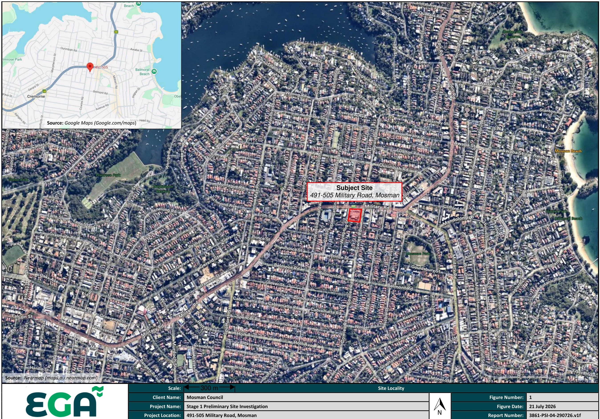

<!-- page 1000 -->

Scale: Site Layout Client Name: Figure Number: 2 Project Name: Stage 1 Preliminary Site Investigation Figure Date: 21 July 2026 Project Location: 491-505 Military Road, Mosman Report Number: 3861-PSI-04-290726.v1f

### LEGEND

Site Boundary

Source:  Nearmap (maps.au.nearmap.com) 10 m

August 2026

Attachment 1.1.10 Mosman Council

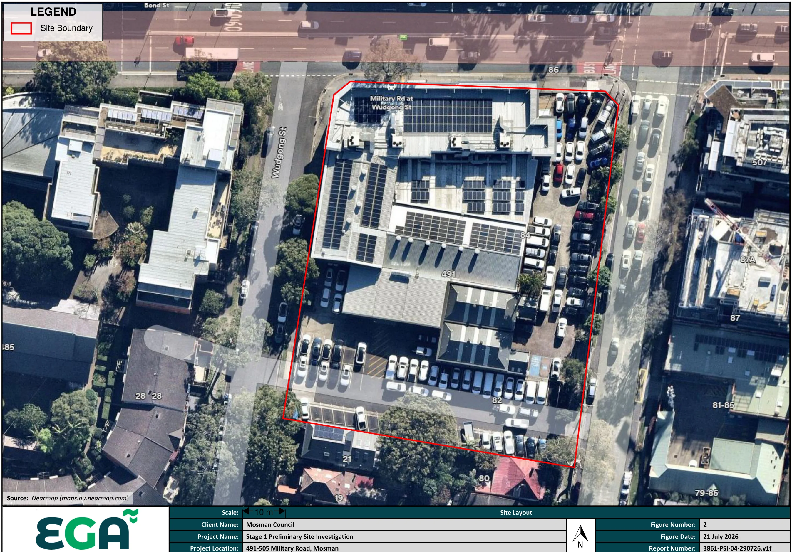

<!-- page 1001 -->

Scale: Site Layout Client Name: Figure Number: 3

Project Name: Stage 1 Preliminary Site Investigation Figure Date: 21 July 2026 Project Location: 491-505 Military Road, Mosman Report Number: 3861-PSI-04-290726.v1f

Source:  Nearmap (maps.au.nearmap.com) 10 m

### LEGEND

Site Boundary

AEC01 / AEC02 / AEC03 - Potential Chemical Storage / Wastewater Treatment and Drainage Infrastructure / Potential Contaminants within Soils

AEC04 - On-Site Structures

August 2026

Attachment 1.1.10 Mosman Council

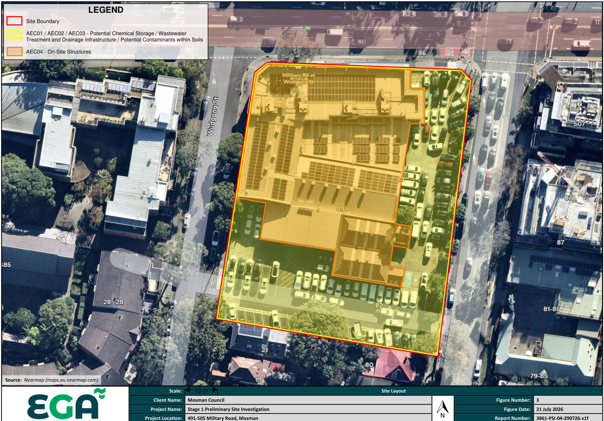

<!-- page 1002 -->

Desktop Phase 1 Environmental Site Assessment 491-505 Military Road, Mosman NSW 3861-PSI-04-290726.v2f

Page 26

#### APPENDIX A

#### GROUNDWATER BORE RECORDS

August 2026

Attachment 1.1.10 Mosman Council

<!-- page 1003 -->

home help contact customise State Overview State Overview Rivers and Streams favourites search download sites find a site Real Time Data - Rivers And Streams Daily River Reports Daily River Reports Dams favourites search download sites find a site Real Time Data - Major Dams Groundwater (Telemetered data) favourites search download sites find a site Real Time Data - Bores All Groundwater Site details search download sites find a site search by licence All Groundwater Map Meteorology favourites search download sites find a site Real Time Data - Weather Stations Hunter River Salinity Trading Scheme Hunter River Salinity Trading Scheme

bookmark this page All Groundwater Site Details ALL GROUNDWATER MAP All data times are Eastern Standard Time Map Info

There are 5 sites within 500 metres of the selected point. GW111484 GW111485 GW111483 GW114715 GW114716

+ −

contact WaterNSW

7/16/26, 8:33 AM Real-time water data

https://realtimedata.waternsw.com.au/water.stm 1/2

August 2026

Attachment 1.1.10 Mosman Council

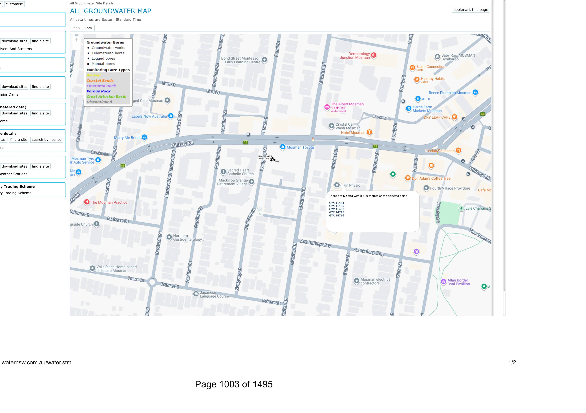

<!-- page 1004 -->

Desktop Phase 1 Environmental Site Assessment 491-505 Military Road, Mosman NSW 3861-PSI-04-290726.v2f

Page 27

#### APPENDIX B

#### NSW SEED MAP

August 2026

Attachment 1.1.10 Mosman Council

<!-- page 1005 -->

A NSW Government website

SEED Sharing and Enabling Environmental Data in NSW Search and download data Miners and Explorers map Browse by topic Case studies and insights Help and contact

How to use the SEED map Layers Legend Acid Sulfate Soil Risk Hm: High probability in bottom sediments H0: High probability at/near ground surface H0(s): High probability at/near ground surface with acidic scalds H1: High probability <1 m below ground surface H1(s): High probability <1 m below ground surface with acidic scalds H2: High probability 1 - 3 m below ground surface H2(p): High probability 1 - 3 m below ground surface in Pleistocene sediments H4: High probability >3 m below ground surface Lm: Low probability in bottom sediments L0: Low probability at/near ground surface L0(p): Low probability at/near ground surface on Pleistocene sediments L1: Low probability <1 m below ground surface L1(p): Low probability <1 m below ground surface in Pleistocene sediments L2: Low probability 1 - 3 m below ground surface L2(p): Low probability 1 - 3 m below ground surface in Pleistocene sediments L4: Low probability >3 m below ground surface L4(p): Low probability >3 m below ground surface on Pleistocene sediments N: No known occurrence N(p): No known occurrence in Pleistocene sediments NB: No known occurrence, Beach X0: Disturbed terrain, < 1 m below ground surface X1: Disturbed terrain, elevation 1 - 2 m AHD X1(p): Disturbed terrain, elevation 1 - 2m AHD in Pleistocene sediments X1(s): Disturbed terrain, elevation 1 - 2 m AHD with acidic scalds X2: Disturbed terrain, elevation 2 - 4 m AHD X2(p): Disturbed terrain, elevation 2 - 4 m AHD in Pleistocene sediments X2(s): Disturbed terrain, elevation 2 - 4 m AHD with acidic scalds X4: Disturbed terrain, elevation >4 m AHD X4(p): Disturbed terrain, elevation >4 m AHD in Pleistocene sediments Map data © OpenStreetMap contributors, Microsoft, Facebook, Inc. and its affiliates, Esri Community Maps contributors, Map layer by Esri Powered by Esri

Scale 18519 500 m X: 16836130.66 Y: -4004954.73 Projected Coordinates (X/Y)

491-505 MILITARY ROAD MOSMAN 2088

Basemap

Draw/ Measure

Tools

Layer Intersect

Save Map

Contact Us Privacy Policy | More Info

7/16/26, 8:23 AM SEED Map

https://geo.seed.nsw.gov.au/vertigisstudio/web/?app=cabd04d595ec43c1aaf4298e80e83ec2 1/1

August 2026

Attachment 1.1.10 Mosman Council

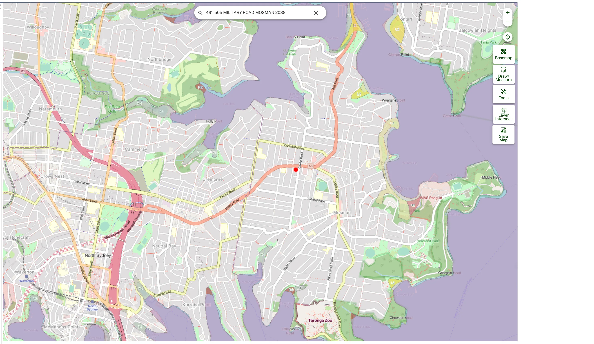

<!-- page 1006 -->

Desktop Phase 1 Environmental Site Assessment 491-505 Military Road, Mosman NSW 3861-PSI-04-290726.v2f

Page 28

#### APPENDIX C

#### HISTORICAL AERIAL IMAGERY

August 2026

Attachment 1.1.10 Mosman Council

<!-- page 1007 -->

Desktop Phase 1 Environmental Site Assessment 491-505 Military Road, Mosman NSW 3861-PSI-04-290726.v2f

Page 29

Historical Aerial 1. 1943 historical aerial imagery of the site. (Source: https://portal.spatial.nsw.gov.au/)

Historical Aerial 2. 1955 historical aerial imagery of the site. (Source: https://portal.spatial.nsw.gov.au/)

Historical Aerial 3. 1965 historical aerial imagery of the site. (Source: https://portal.spatial.nsw.gov.au/)

Historical Aerial 4. 1975 historical aerial imagery of the site. (Source: https://portal.spatial.nsw.gov.au/)

Historical Aerial 5. 1982 historical aerial imagery of the site. (Source: https://portal.spatial.nsw.gov.au/)

Historical Aerial 6. 1994 historical aerial imagery of the site. (Source: https://portal.spatial.nsw.gov.au/)

August 2026

Attachment 1.1.10 Mosman Council

<!-- page 1008 -->

Desktop Phase 1 Environmental Site Assessment 491-505 Military Road, Mosman NSW 3861-PSI-04-290726.v2f

Page 30

Historical Aerial 7. 2005 historical aerial imagery of the site. (Source: https://portal.spatial.nsw.gov.au/)

Historical Aerial 8. 2013 historical aerial imagery of the site. (Source: https://apps.nearmap.com/)

Historical Aerial 9. 2026 historical aerial imagery of the site. (Source: https://apps.nearmap.com/)

August 2026

Attachment 1.1.10 Mosman Council

<!-- page 1009 -->

Desktop Phase 1 Environmental Site Assessment 491-505 Military Road, Mosman NSW 3861-PSI-04-290726.v2f

Page 31

#### APPENDIX D

#### NSW EPA PUBLIC REGISTER

August 2026

Attachment 1.1.10 Mosman Council

<!-- page 1010 -->

Background

A strategy to systematically prioritise, assess and respond to notifications under Section 60 of the Contaminated Land Management Act 1997 (CLM Act) has been developed by the EPA. This strategy acknowledges the EPA’s obligations to make information available to the public under Government Information (Public Access) Act 2009 .

When a site is notified to the EPA, it may be accompanied by detailed site reports where the owner has been proactive in addressing the contamination and its source. However, often there is minimal information on the nature or extent of the contamination.

After receiving a report, the first step is to confirm that the report does not relate to a pollution incident. The Protection of the Environment Operations Act 1997 (POEO Act) deals with pollution incidents, waste stockpiling or dumping. The EPA also has an incident management process to manage significant incidents (https://www.epa.nsw.gov.au/reporting-and-incidents/incident- management).

In many cases, the information indicates the contamination is securely immobilised within the site, such as under a building or carpark, and is not currently causing any significant risks for the community or environment. Such sites may still need to be cleaned up, but this can be done in conjunction with any subsequent building or redevelopment of the land. These sites do not require intervention under the CLM Act, and are dealt with through the planning and development consent process. In these cases, the EPA informs the local council or other planning authority, so that the information can be recorded and considered at the appropriate time (https://www.epa.nsw.gov.au/your-environment/contaminated-land/managing-contaminated-land/role-of-planning-authorities).

Where indications are that the contamination could cause actual harm to the environment or an unacceptable offsite impact (i.e. the land is 'significantly contaminated'), the EPA would apply the regulatory provisions of the CLM Act to have the responsible polluter and/or landowner investigate and remediate the site. If the reported contamination could present an immediate or long-term threat to human health NSW Health will be consulted. SafeWork NSW and Water NSW can also be consulted if there appear to be occupational health and safety risks or an impact on groundwater quality.

As such, the sites notified to the EPA and presented in the list of contaminated sites notified to the EPA are at various stages of the assessment and remediation process. Understanding the nature of the underlying contamination, its implications and implementing a remediation program where required, can take a considerable period of time. The list provides an indication, in relation to each nominated site, as to the management status of that particular site. Further detailed information may be available from the EPA or the person who notified the site.

The following questions and answers may assist those interested in this issue.

Frequently asked questions

Why does my land appear on the list of notified sites?

Your land may appear on the list because:

• the site owner and/or the polluter has notified the EPA under section 60 of the CLM Act • the EPA has been notified via other means and is satisfied that the site is or was contaminated.

If a site is on the list, it does not necessarily mean the contamination is significant enough to regulate under the CLM Act.

List current as at 9 April 2026 1 of 139

August 2026

Attachment 1.1.10 Mosman Council

<!-- page 1011 -->

Does the list contain all contaminated sites in NSW?

No. The list only contains contaminated sites that EPA is aware of. If a site is not on the list, it does not necessarily mean the site is not contaminated.

The EPA relies on responsible parties and the public to notify contaminated sites.

How are notified contaminated sites managed by the EPA?

There are different ways the EPA can manage notified contaminated sites. Options include:

• regulation under the CLM Act, POEO Act, or both • notifying the relevant planning authority for management under the planning and development process • managing the site under the Protection of the Environment Operation (Underground Petroleum Storage Systems) Regulation 2014.

There are specific cases where contamination is managed under a tailored program operated by another agency (for example, the Resources & Geoscience's Legacy Mines Program).

What should I do if I am a potential buyer of a site that appears on the list?

You should seek advice from the seller to understand the contamination issue. You may need to seek independent contamination or legal advice.

The information provided in the list is indicative only and a starting point for your own assessment. Land contamination from past site uses is common, mainly in urban environments. If the site is properly remediated or managed, it may not affect the intended future use of the site.

Who can I contact if I need more information about a site?

You can contact the Environment Line at any time by calling 131 555 or by emailing info@environment.nsw.gov.au.

List of NSW Contaminated Sites Notified to the EPA

List current as at 9 April 2026 2 of 139

August 2026

Attachment 1.1.10 Mosman Council

<!-- page 1012 -->

Site Status

Under assessment

Under Preliminary Investigation Order

Regulation under CLM Act not required

Explanation

The contamination is being assessed by the EPA to determine whether regulation is required. The EPA may require further information to complete the assessment. For example, the completion of management actions regulated under the planning process or Protection of the Environment Operations Act 1997 .

The EPA has issued a Preliminary Investigation Order under s10 of the Contaminated Land Management Act 1997 , to obtain additional information needed to complete the assessment.

The EPA has completed an assessment of the contamination and decided that regulation under the Contaminated Land Management Act 1997 is not required.

Disclaimer

The EPA has taken all reasonable care to ensure that the information in the list of contaminated sites notified to the EPA (the list) is complete and correct. The EPA does not, however, warrant or represent that the list is free from errors or omissions or that it is exhaustive.

The EPA may, without notice, change any or all of the information in the list at any time.

You should obtain independent advice before you make any decision based on the information in the list.

The list is made available on the understanding that the EPA, its servants and agents, to the extent permitted by law, accept no responsibility for any damage, cost, loss or expense incurred by you as a result of:

1.            any information in the list; or 2.            any error, omission or misrepresentation in the list; or 3.            any malfunction or failure to function of the list; 4.            without limiting (2) or (3) above, any delay, failure or error in recording, displaying or updating information.

List current as at 9 April 2026 3 of 139

August 2026

Attachment 1.1.10 Mosman Council

<!-- page 1013 -->

Regulation being finalised

Contamination currently regulated under CLM Act

Contamination currently regulated under POEO Act

Contamination being managed via the planning process (EP&A Act)

Contamination formerly regulated under the CLM Act

Contamination formerly regulated under the POEO Act

The EPA has completed an assessment of the contamination and decided that the contamination is significant enough to warrant regulation under the Contaminated Land Management Act 1997 . A regulatory approach is being finalised.

The EPA has completed an assessment of the contamination and decided that the contamination is significant enough to warrant regulation under the Contaminated Land Management Act 1997 (CLM Act). Management of the contamination is regulated by the EPA under the CLM Act. Regulatory notices are available on the EPA’s Contaminated Land Public Record.

Contamination is currently regulated under the Protection of the Environment Operations Act 1997 (POEO Act).  The EPA as the appropriate regulatory authority reasonably suspects that a pollution incident is occurring/ has occurred and that it requires regulation under the POEO Act. The EPA may use environment protection notices, such as clean up notices, to require clean up action to be taken.  Such regulatory notices are available on the POEO public register.

The EPA has completed an assessment of the contamination and decided that the contamination is significant enough to warrant regulation. The contamination of this site is managed by the consent authority under the Environmental Planning and Assessment Act 1979 (EP&A Act) planning approval process, with EPA involvement as necessary to ensure significant contamination is adequately addressed. The consent authority is typically a local council or the Department of Planning and Environment.

The EPA has determined that the contamination is no longer significant enough to warrant regulation under the Contaminated Land Management Act 1997 (CLM Act). The contamination was addressed under the CLM Act.

The EPA has determined that the contamination is no longer significant enough to warrant regulation. The contamination was addressed under the Protection of the Environment Operations Act 1997 (POEO Act).

List current as at 9 April 2026 4 of 139

August 2026

Attachment 1.1.10 Mosman Council

<!-- page 1014 -->

Contamination was addressed via the planning process (EP&A Act)

Ongoing maintenance required to manage residual contamination (CLM Act)

The EPA has determined that ongoing maintenance, under the Contaminated Land Management Act 1997 (CLM Act), is required to manage the residual contamination. Regulatory notices under the CLM Act are available on the EPA’s Contaminated Land Public Record.

The EPA has determined that the contamination is no longer significant enough to warrant regulation. The contamination was addressed by the appropriate consent authority via the planning process under the Environmental Planning and Assessment Act 1979 (EP&A Act).

List current as at 9 April 2026 5 of 139

August 2026

Attachment 1.1.10 Mosman Council

<!-- page 1015 -->

Suburb SiteName Address ContaminationActivityType ManagementClass Latitude Longitude

MORPETH Telstra Cable Installation and RTA Bridge work Northumberland STREET Other Petroleum Regulation under CLM Act not required -32.72489729 151.6266795

MORPETH Former Service Station Swan  STREET Service Station Regulation under CLM Act not required -32.72477413 151.6250642

MORTLAKE Former Petroleum Storage Site 108-116 Tennyson ROAD Other Petroleum Regulation under CLM Act not required -33.83979033 151.1064889

MORTLAKE Kendall Bay Sediments Kendall BAY Gasworks Contamination currently regulated under CLM Act -33.83905999 151.1120458

MORTLAKE Former AGL site Tennyson  ROAD Gasworks Contamination formerly regulated under the CLM Act -33.84287407 151.1109313

MORTLAKE Majors Bay Redevelopment 14-22 Hilly STREET Other Industry Regulation under CLM Act not required -33.83954617 151.1054674

MORUYA Former Fuel Depot Moruya 11 to 13 Ford STREET Other Petroleum Regulation under CLM Act not required -35.9112243 150.0826475

MORUYA Caltex Service Station Moruya 80-84 Campbell STREET Service Station Regulation under CLM Act not required -35.91195596 150.0824213

MORUYA Ampol Fuel Depot - Moruya 26 Campbell STREET Service Station Regulation under CLM Act not required -35.9104985 150.0711419

MOSMAN 7-Eleven Mosman 162A Spit Road Corner Mitchell ROAD Service Station Regulation under CLM Act not required -33.81747016 151.2433633

MOSMAN BP Service Station 175 Ourimbah ROAD Service Station Regulation under CLM Act not required -33.82106757 151.233291

MOSMAN BP Express Mosman 175 Ourimbah  ROAD Service Station Regulation under CLM Act not required -33.82106459 151.2332921

MOSMAN 7-Eleven Service Station Mosman 45 Spit ROAD Service Station Regulation under CLM Act not required -33.82302718 151.2435627

MOSMAN Allan Border Oval Myahgah  ROAD Landfill Regulation under CLM Act not required -33.82681534 151.2417712

MOSMAN 173 Avenue Road, MOSMAN NSW 2088 173 Avenue ROAD Unclassified Regulation under CLM Act not required -33.930869 150.97132

List current as at 9 April 2026 85 of 139

August 2026

Attachment 1.1.10 Mosman Council

<!-- page 1016 -->

Suburb SiteName Address ContaminationActivityType ManagementClass Latitude Longitude

MOSS VALE Woolworths Service Station Moss Vale 609 Argyle  STREET Service Station Regulation under CLM Act not required -34.55409411 150.3609797

MOSS VALE Coles Express Service Station 579 Argyle STREET Service Station Regulation under CLM Act not required -34.55313422 150.364684

MOSS VALE Moss Vale Refuelling Facility Lackey ROAD Other Petroleum Regulation under CLM Act not required -34.54662421 150.3721525

MOUNT ANNAN Woolworths Caltex Mount Annan 157 Narellan (Corner Smeaton Grange Road) ROAD Service Station Regulation under CLM Act not required -34.04685527 150.7610434

MOUNT ANNAN Great Southern Railways Aqueduct Off Narellan  ROAD Unclassified Regulation under CLM Act not required -34.07308479 150.7707436

MOUNT COLAH Caltex Service Station Mount Colah 603 Pacific HIGHWAY Service Station Regulation under CLM Act not required -33.67034662 151.1151861

MOUNT COLAH Foxglove Oval Foxglove ROAD Landfill Contamination currently regulated under CLM Act -33.65829855 151.1229638

MOUNT DRUITT Caltex (former Mobil) Service Station, 17 Mount Street, Mount Druitt 17 Mount STREET Service Station Regulation under CLM Act not required -33.76567994 150.8244544

MOUNT DRUITT 7-Eleven Mount Druitt Lot 6 Luxford ROAD Other Petroleum Regulation under CLM Act not required -33.76483839 150.8254157

MOUNT HUTTON Woolworths Service Station 46 Wilsons ROAD Service Station Regulation under CLM Act not required -32.9836378 151.67309

MOUNT PRITCHARD 7-Eleven Service Station 352 Elizabeth DRIVE Service Station Regulation under CLM Act not required -33.90260656 150.8963326

MOUNT THORLEY Bulga Surface Operations Broke ROAD Other Industry Regulation under CLM Act not required -32.68325751 151.1206158

MOUNT THORLEY Lowes Petroleum (Former BP) Depot Mount Thorley 74 Mount Thorley ROAD Other Petroleum Regulation under CLM Act not required -32.62443074 151.1025122

MOUNT VICTORIA Former Mobil Service Station 81 Great Western HIGHWAY Service Station Regulation under CLM Act not required -33.5889727 150.2511783

MOUNT VICTORIA Caltex Service Station 36a Great Western HIGHWAY Service Station Regulation under CLM Act not required -33.58436517 150.2465528

List current as at 9 April 2026 86 of 139

August 2026

Attachment 1.1.10 Mosman Council

<!-- page 1017 -->

Search TIP To search for a specific site, search by LGA (local government area) and carefully review all sites listed. ... more search tips

Home Public registers Contaminated land record of notices Search results Your search for:Suburb: MOSMAN Search Again Refine Search did not find any records in our database. If a site does not appear on the record it may still be affected by contamination. For example: Contamination may be present but the site has not been regulated by the EPA under the Contaminated Land Management Act 1997 or the Environmentally Hazardous Chemicals Act 1985. The EPA may be regulating contamination at the site through a licence or notice under the Protection of the Environment Operations Act 1997 (POEO Act). Contamination at the site may be being managed under the planning process. More information about particular sites may be available from: The POEO public register The appropriate planning authority: for example, on a planning certificate issued by the local council under section 149 of the Environmental Planning and Assessment Act. See What's in the record and What's not in the record. If you want to know whether a specific site has been the subject of notices issued by the EPA under the CLM Act, we suggest that you search by Local Government Area only and carefully review the sites that are listed. This public record provides information about sites regulated by the EPA under the Contaminated Land Management Act 1997, including sites currently and previously regulated under the Environmentally Hazardous Chemicals Act 1985. Your inquiry using the above search criteria has not matched any record of current or former regulation. You should consider searching again using different criteria. The fact that a site does not appear on the record does not necessarily mean that it is not affected by contamination. The site may have been notified to the EPA but not yet assessed, or contamination may be present but the site is not yet being regulated by the EPA. Further information about particular sites may be available from the appropriate planning authority, for example, on a planning certificate issued by the local council under section 149 of the Environmental Planning and Assessment Act. In addition the EPA may be regulating contamination at the site through a licence under the Protection of the Environment Operations Act 1997. You may wish to search the POEO public register.POEO public register 13 July 2026

7/13/26, 12:13 PM DECCW | Search results

https://app.epa.nsw.gov.au/prclmapp/searchresults.aspx?&LGA=&Suburb=MOSMAN&Notice=&Name=&Text=&DateFrom=&DateTo= 1/1

August 2026

Attachment 1.1.10 Mosman Council

<!-- page 1018 -->

Home Public registers POEO Public Register Licences, applications and notices search Search results

Your search for: General Search with the following criteria Suburb - mosman returned 26 results Export to excel 2 of 2 Pages Search Again Number Name Location Type Status Issued date 1522383 TARONGA CONSERVATION SOCIETY AUSTRALIA BRADLEYS HEAD ROAD, MOSMAN, NSW 2088

s.58 Licence Variation Issued Issued 09 Jul 2015

1600361 TARONGA CONSERVATION SOCIETY AUSTRALIA BRADLEYS HEAD ROAD, MOSMAN, NSW 2088

Compliance Audit Complete Complete 14 Sep 2020

1603655 TARONGA CONSERVATION SOCIETY AUSTRALIA BRADLEYS HEAD ROAD, MOSMAN, NSW 2088

s.58 Licence Variation Issued Issued 08 Apr 2021

1615336 TARONGA CONSERVATION SOCIETY AUSTRALIA BRADLEYS HEAD ROAD, MOSMAN, NSW 2088

s.58 Licence Variation Issued Issued 23 Dec 2021

1623058 TARONGA CONSERVATION SOCIETY AUSTRALIA BRADLEYS HEAD ROAD, MOSMAN, NSW 2088

s.58 Licence Variation Issued Issued 30 Nov 2022

1630287 TARONGA CONSERVATION SOCIETY AUSTRALIA BRADLEYS HEAD ROAD, MOSMAN, NSW 2088

s.58 Licence Variation Issued Issued 03 Oct 2023

12 13 July 2026

7/13/26, 12:14 PM Environment & Heritage | PRPOEO

https://app.epa.nsw.gov.au/prpoeoapp/SearchResult.aspx?SearchTag=all&searchrange=general&range=general&SortExpression=AccountablePa… 1/1

August 2026

Attachment 1.1.10 Mosman Council

<!-- page 1019 -->

Home Public registers POEO Public Register Licences, applications and notices search Search results

Your search for: General Search with the following criteria Suburb - mosman returned 26 results Export to excel 1 of 2 Pages Search Again Number Name Location Type Status Issued date 1621649 THE SPIT, MOSMAN, NSW 2088 s.58 Licence Variation Issued Issued 08 Feb 2023 1028480 ARDENT LEISURE LIMITED  THE SPIT, MOSMAN, NSW 2088 s.58 Licence Variation Issued Issued 03 Jul 2003 1032563 ARDENT LEISURE LIMITED  THE SPIT, MOSMAN, NSW 2088 s.58 Licence Variation Issued Issued 20 Nov 2003 1069448 ARDENT LEISURE LIMITED  THE SPIT, MOSMAN, NSW 2088 s.58 Licence Variation Issued Issued 05 Feb 2007 1070978 ARDENT LEISURE LIMITED  THE SPIT, MOSMAN, NSW 2088 s.58 Licence Variation Issued Issued 14 Mar 2007 1072567 ARDENT LEISURE LIMITED  THE SPIT, MOSMAN, NSW 2088 s.58 Licence Variation Issued Issued 24 Apr 2007 1074550 ARDENT LEISURE LIMITED  THE SPIT, MOSMAN, NSW 2088 s.58 Licence Variation Issued Issued 13 Jun 2007 1078238 ARDENT LEISURE LIMITED  THE SPIT, MOSMAN, NSW 2088 s.58 Licence Variation Issued Issued 19 Sep 2007 1085886 ARDENT LEISURE LIMITED  THE SPIT, MOSMAN, NSW 2088 s.58 Licence Variation Issued Issued 12 May 2008 1097027 ARDENT LEISURE LIMITED  THE SPIT, MOSMAN, NSW 2088 s.58 Licence Variation Issued Issued 30 Jan 2009 1509253 ARDENT LEISURE LIMITED  THE SPIT, MOSMAN, NSW 2088 s.58 Licence Variation Issued Issued 24 Jun 2013 11724 HEALTHSCOPE OPERATIONS PTY LTD

#### 1 ELLAMATTA AVENUE,

MOSMAN, NSW 2088 POEO licence No longer in force No longer in force

16 Sep 2002

1048188 HEALTHSCOPE OPERATIONS PTY LTD

#### 1 ELLAMATTA AVENUE,

MOSMAN, NSW 2088 s.58 Licence Variation Issued Issued 27 May 2005 11211 MA MARINA FUND OPCO NO. 1 PTY LTD THE SPIT, MOSMAN, NSW 2088 POEO licence Issued Issued 30 Jan 2001 3514873 MA MARINA FUND OPCO NO. 1 PTY LTD THE SPIT, MOSMAN, NSW 2088 s.91 Clean Up Notice Issued Issued 10 Jan 2026 1596267 NONBANK MORTGAGES PTY. LTD. THE SPIT, MOSMAN, NSW 2088 s.58 Licence Variation Issued Issued 29 Jun 2021 1008406 OMNI LEISURE OPERATIONS LIMITED THE SPIT, MOSMAN, NSW 2088 s.58 Licence Variation Issued Issued 13 Jun 2001 1018813 OMNI LEISURE OPERATIONS LIMITED THE SPIT, MOSMAN, NSW 2088 s.58 Licence Variation Issued Issued 06 Sep 2002 1677 TARONGA CONSERVATION SOCIETY AUSTRALIA BRADLEYS HEAD ROAD, MOSMAN, NSW 2088

POEO licence Issued Issued 26 Sep 2000

1512309 TARONGA CONSERVATION SOCIETY AUSTRALIA BRADLEYS HEAD ROAD, MOSMAN, NSW 2088

Compliance Audit Complete Complete 21 Feb 2013

12 13 July 2026

7/13/26, 12:14 PM Environment & Heritage | PRPOEO

https://app.epa.nsw.gov.au/prpoeoapp/SearchResult.aspx?SearchTag=all&searchrange=general&range=general&SortExpression=AccountablePa… 1/1

August 2026

Attachment 1.1.10 Mosman Council

<!-- page 1020 -->

## Desktop Phase 1 Environmental Site

## Assessment

576 Military Rd, Mosman NSW

Report No: Report Date:

3861-PSI-05-290726.v2f 03/08/2026

info@egau.com.au

NSW: 36E Fitzroy Street, Marrickville, NSW 2204 VIC: 88 Langridge St, Collingwood VIC 3066

August 2026

Attachment 1.1.10 Mosman Council

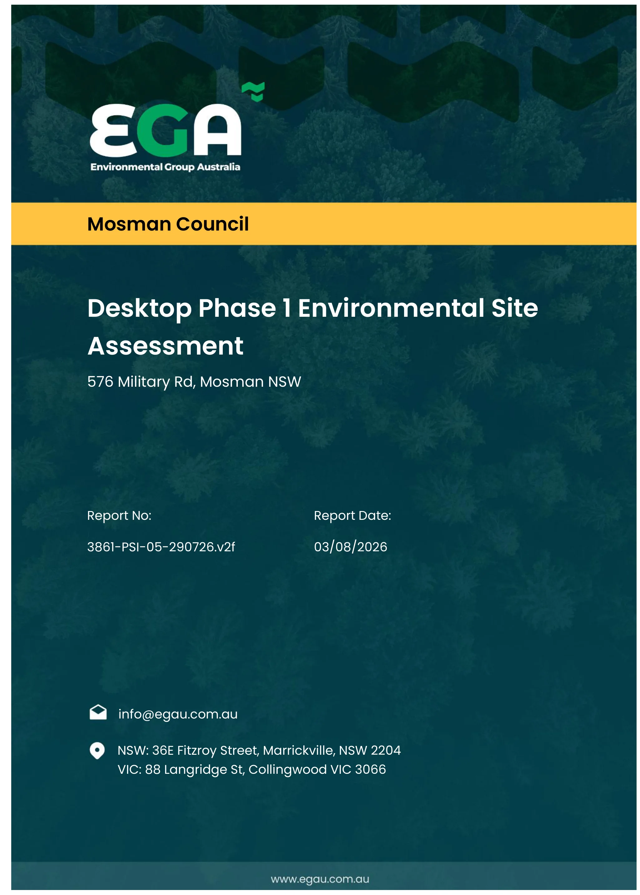

<!-- page 1021 -->

Desktop Phase 1 Environmental Site Assessment 576 Military Rd, Mosman NSW 3861-PSI-05-290726.v2f

Page 1

### Document Record

Revision Date Author Reviewer

v1f 29 July 2026 Rachelle Conna Isabelle Figatowski

v2f 3 August 2026 Rachelle Conna Isabelle Figatowski

Author Signature Reviewer Signature

Name Rachelle Conna Name Isabelle Figatowski

Credentials B. Sc. (Zoology) Credentials B.Sc. (Env. Consulting)

Title Environmental Consultant Title Senior Environmental Consultant

Document Title: Desktop Phase 1 Environmental Site Assessment - 576 Military Rd, Mosman NSW Site Address: 576 Military Rd, Mosman NSW Client Name: Site Size: ≈ 480 m2 Reference Number: 3861-PSI-05-290726.v2f Project Type: Desktop Phase 1 Environmental Site Assessment Project Type Abbreviation: PSI Document Draft: FINAL Document Revision No. v2f

Prepared by Environmental Group Australia Pty Ltd ABN: 83 671 599 143

August 2026

Attachment 1.1.10 Mosman Council

<!-- page 1022 -->

Desktop Phase 1 Environmental Site Assessment 576 Military Rd, Mosman NSW 3861-PSI-05-290726.v2f

Page 2

### EXECUTIVE SUMMARY

Environmental Group Australia Pty Ltd (EGA) was engaged by Mosman Council (hereafter referred to as ‘the client’), to undertake a Desktop Phase 1 Environmental Site Assessment of the property located within Lot B DP392540, 576 Military Rd, Mosman NSW (hereafter referred to as ‘the site’) (refer to Figure 1 and Figure 2).

The client is preparing to lodge a planning proposal to implement the draft Mosman Masterplan, which proposes increased housing capacity across the study area, including amendments to the planning controls at the site to facilitate redevelopment.

#### Purpose and Objectives

A Desktop Phase 1 Environmental Site Assessment was required to assess the likelihood that the site had been contaminated by past or present activities and to form a preliminary view on the extent and degree of contamination. The objectives of the investigation were to:

• Provide advice on whether the site may require a stage 2 intrusive site assessment, to better define the nature and extent of potential contamination within the site; and • Provide advice on whether the site would be suitable (in the context of land contamination) for any proposed future rezoning.

#### Site Description

• The site covers an area of approximately 480 m2; • The site is currently zoned as E3: Productivity Support; • The site is currently utilised within a commercial land-use setting; • The site is located within a mixed commercial-industrial and residential district.

Current aerial imagery suggests that the site is operating as ‘Volvo Cars Mosman’. Imagery shows the site to contain one commercial warehouse structure to the north and hardstand across the site surface.

#### Proposed Development

Reference is made to the draft Mosman Masterplan Structure Plan prepared by SJB Architecture, dated 29 July 2026 (Drawing No. 06, Revision 07). EGA understands that the site has been identified for increased development potential, however, have not been provided with any specific redevelopment plans. EGA has made the assumption that future development may include the demolition of current structures, rezoning of land, subdivision of land, and construction of new structures and infrastructure. EGA has not been made aware of any basement plans and have presumed that they are proposed as part of the future development.

#### Scope of Work

EGA undertook the following scope of works to address the project objectives:

• A desktop review of relevant information pertaining to the site; and • Assessment and reporting of the desktop review.

#### Investigation Outcome

Based on EGA’s assessment of the desktop review information, in the context of the proposed redevelopment scenario, EGA has made the following conclusions:

• The search of historical aerial imagery indicated a moderate potential for contamination within the site to have occurred, associated with uncontrolled demolition and potential site filling

August 2026

Attachment 1.1.10 Mosman Council

<!-- page 1023 -->

Desktop Phase 1 Environmental Site Assessment 576 Military Rd, Mosman NSW 3861-PSI-05-290726.v2f

Page 3

beneath slabs. EGA also notes that the building fabrics may contain hazardous building materials; • A review of publicly available contaminated land databases indicated that the site is not the subject of any licences, applications, notices under Section 308 of the Protection of the Environment Operations Act 1997. The site is not notified under Section 60 of the Contaminated Land Management Act 1997. The site is not the subject of any notifications under Section 58 of the Contaminated Land Management Act 1997; • The contaminants and areas of environmental concern (AEC), requiring further consideration or assessment, and possibly remediation or risk management, are the following: o AEC-1: Potential Chemical Storage – Leaks, Spills or Poor Management; o AEC-2: Wastewater Treatment and Drainage Infrastructure – Wash Bays, Traps, Pits and Pipes; o AEC-3: Potential Fuel Infrastructure; o AEC-4: Potential Uncontrolled Fill and Surface Soils; and o AEC-5: On-Site Structures - Hazardous Building Materials. • Soils not impacted by contamination may meet excavated natural material (ENM) or General Solid Waste (GSW) classification.

#### Conclusions and Recommendations

Notwithstanding the above, the potential contaminants of concern and affected environmental media are consistent with those typically encountered on brownfield redevelopment sites within the Sydney Basin. Any contamination that may be present is not expected to be of such an extent or complexity that it could not be effectively managed or remediated using conventional and readily available remediation techniques. Accordingly, the potential for contamination at the site is not considered to preclude proposed future redevelopment.

As detailed development plans are prepared for individual areas of the site, the existing environmental data should be reviewed in conjunction with the overall remedial strategy to confirm the nature and extent of any contamination relevant to the proposed works. Where required, additional assessment should be undertaken, and appropriate remediation and/or management measures developed, to demonstrate that the relevant portion of the site is, or can be made, suitable for its intended use.

This report, including its conclusions and recommendations, must be read in conjunction with the limitations presented in Section 12.

August 2026

Attachment 1.1.10 Mosman Council

<!-- page 1024 -->

Desktop Phase 1 Environmental Site Assessment 576 Military Rd, Mosman NSW 3861-PSI-05-290726.v2f

Page 4

#### TABLE OF CONTENTS

#### 1.

#### INTRODUCTION

#### 7

1.1. Purpose and Objectives ............................................................................................................... 7 1.2. Site Description ............................................................................................................................. 7 1.3. Proposed Development ................................................................................................................ 7 1.4. Scope of Work .............................................................................................................................. 7

#### 2.

#### SITE IDENTIFICATION

#### 8

#### 3.

#### PHYSICAL SITE CONDITIONS

#### 9

#### 4.

#### SITE HISTORY AND LAND USE

#### 11

4.1. Aerial Imagery ............................................................................................................................ 11 4.2. Anecdotal Information ............................................................................................................... 11 4.3. Incident and Complaints History ............................................................................................... 11 4.4. Previous Contamination Assessments ...................................................................................... 11

#### 5.

#### REGULATORY RECORDS

#### 12

5.1. NSW EPA CLM Act Register of Notified Sites and Notices ....................................................... 12 5.2. NSW EPA POEO Act Register of Licences, Applications and Notices ...................................... 12 5.3. Dangerous Goods Licences Search ............................................................................................ 12

#### 6.

#### INFORMATION SOURCES

#### 13

#### 7.

#### CONCEPTUAL SITE MODEL

#### 14

7.1. Potential Areas of Environmental Concern ............................................................................... 14 7.2. Contaminants, Migration Pathways, Receptors and Risks ...................................................... 14 7.3. Site Characteristics Affecting Risks ........................................................................................... 15 7.3.1. Land-Use Setting................................................................................................................ 15 7.3.2. Surface Water ..................................................................................................................... 15 7.3.3. Groundwater – Drinking Water Risks ................................................................................ 16 7.3.4. Recreational Water Use and Aquatic Ecosystems ............................................................ 16 7.3.5. Terrestrial Ecosystems ....................................................................................................... 16 7.3.6. Human Exposures to Site Contaminants ........................................................................... 16

#### 8.

#### RISK ASSESSMENT (PLANNING LEVEL)

#### 17

#### 9.

#### PLANNING AND MASTER PLAN ADVICE

#### 18

9.1. Suitability for Future Development ............................................................................................ 18 9.2. Identification of Potential Issues ............................................................................................... 18 9.3. Requirements for the Development Application (DA) Stage ................................................... 18 9.4. Suggestion Inclusion to Master Planning .................................................................................. 18

#### 10. CONTAMINANTS OF CONCERN

#### 20

#### 11. CONCLUSIONS AND RECOMMENDATIONS

#### 21

11.1. Site Condition and Further Requirements ................................................................................. 21 11.2. Recommendations ...................................................................................................................... 21

#### 12. STATEMENT OF LIMITATIONS

#### 22

August 2026

Attachment 1.1.10 Mosman Council

<!-- page 1025 -->

Desktop Phase 1 Environmental Site Assessment 576 Military Rd, Mosman NSW 3861-PSI-05-290726.v2f

Page 5

#### 13. REFERENCES

#### 23

FIGURES Figure 1 - Site Locality Figure 2 - Site Layout Figure 3 - Areas of Environmental Concern

APPENDICES A - Groundwater Bore Records B - NSW SEED Map C - Historical Aerial Imagery D - NSW EPA Public Register

August 2026

Attachment 1.1.10 Mosman Council

<!-- page 1026 -->

Desktop Phase 1 Environmental Site Assessment 576 Military Rd, Mosman NSW 3861-PSI-05-290726.v2f

Page 6

### LIST OF ABBREVIATIONS

AHD Australian Height Datum AEC Area of Environmental Concern ANZECC Australian and New Zealand Environment and Conservation Council AST Aboveground storage tank Bgl Below ground level BTEX Benzene, toluene, ethylbenzene, xylene CoC Chain of Custody CSM Conceptual Site Model EIL Ecological Investigation Level EGA Environmental Group Australia Pty Ltd EPA Environment Protection Authority HIL Health Investigation Levels HSL Health Screening Levels LOR [Laboratory] Limit of Reporting NATA National Association of Testing Laboratories NA Not applicable ND Not detected NEPC National Environment Protection Council NEPM National Environment Protection Measure NSW EPA NSW Environment Protection Authority OCP Organochlorine Pesticide PAEC Potential Area of Environmental Concern PAH Polycyclic aromatic hydrocarbon PCB Polychlorinated biphenyl PID Photo-ionisation detector PSI Preliminary Site Investigation QA/QC Quality assurance/Quality control RPD Relative percentage difference SAQP Sampling Analysis and Quality Plan SVOC Semi-volatile organic compound USCS Unified Soil Classification System UST Underground storage tank VOC Volatile organic compound

August 2026

Attachment 1.1.10 Mosman Council

<!-- page 1027 -->

Desktop Phase 1 Environmental Site Assessment 576 Military Rd, Mosman NSW 3861-PSI-05-290726.v2f

Page 7

#### 1. INTRODUCTION

Environmental Group Australia Pty Ltd (EGA) was engaged by Mosman Council (hereafter referred to as ‘the client’), to undertake a Desktop Phase 1 Environmental Site Assessment of the property located within Lot B DP392540, 576 Military Rd, Mosman NSW (hereafter referred to as ‘the site’) (refer to Figure 1 and Figure 2).

The client is preparing to lodge a planning proposal to implement the draft Mosman Masterplan, which proposes increased housing capacity across the study area, including amendments to the planning controls at the site to facilitate redevelopment.

#### 1.1.

#### Purpose and Objectives

A Desktop Phase 1 Environmental Site Assessment was required to assess the likelihood that the site had been contaminated by past or present activities and to form a preliminary view on the extent and degree of contamination. The objectives of the investigation were to:

• Provide advice on whether the site may require a stage 2 intrusive site assessment, to better define the nature and extent of potential contamination within the site; and • Provide advice on whether the site would be suitable (in the context of land contamination) for any proposed future rezoning.

#### 1.2.

#### Site Description

• The site covers an area of approximately 480 m2; • The site is currently zoned as E3: Productivity Support; • The site is currently utilised within a commercial land-use setting; • The site is located within a mixed commercial-industrial and residential district.

Current aerial imagery suggests that the site is operating as ‘Volvo Cars Mosman’. Imagery shows the site to contain one commercial warehouse structure to the north and hardstand across the site surface.

#### 1.3.

#### Proposed Development

Reference is made to the draft Mosman Masterplan Structure Plan prepared by SJB Architecture, dated 29 July 2026 (Drawing No. 06, Revision 07). EGA understands that the site has been identified for increased development potential, however, have not been provided with any specific redevelopment plans. EGA has made the assumption that future development may include the demolition of current structures, rezoning of land, subdivision of land, and construction of new structures and infrastructure. EGA has not been made aware of any basement plans and have presumed that they are proposed as part of the future development.

#### 1.4.

#### Scope of Work

EGA undertook the following scope of works to address the project objectives:

• A desktop review of relevant information pertaining to the site; and • Assessment and reporting of the desktop review.

August 2026

Attachment 1.1.10 Mosman Council

<!-- page 1028 -->

Desktop Phase 1 Environmental Site Assessment 576 Military Rd, Mosman NSW 3861-PSI-05-290726.v2f

Page 8

#### 2. SITE IDENTIFICATION

The site identification details and associated information are presented in Table 2.1.

Table 2.1 Site Identification Information Attribute Description

Street Address 576 Military Rd, Mosman NSW

Lot and Deposited Plan (DP) Lot B DP392540

Current Owner

Geographical Coordinates 33°49'26.9"S 151°14'14.1"E (approximate centre of site)

Site Area ≈ 480 m2

Local Government Area (LGA) Mosman Municipal Council

Parish Willoughby

County Cumberland

Zoning E3: Productivity Support Mosman Local Environmental Plan 2012 (2011 EPI 647)

The locality of the site is identified in Figure 1.

The general layout and boundary of the site are shown in Figure 2.

August 2026

Attachment 1.1.10 Mosman Council

<!-- page 1029 -->

Desktop Phase 1 Environmental Site Assessment 576 Military Rd, Mosman NSW 3861-PSI-05-290726.v2f

Page 9

#### 3. PHYSICAL SITE CONDITIONS

Regional geology, topography, soil landscape and hydrogeological information are presented in Table 3.1.

Table 3.1 Regional Setting Information Attribute Description

Geology

A review of the Environment NSW ‘eSpade V2.2’ web application (environment.nsw.gov.au/eSpade2WebApp, accessed 23 July 2026), indicated that the site is likely to be underlain by Hawkesbury Sandstone, which is a medium to coarse-grained quartz sandstone with minor shale and laminite lenses.

Soil Profiles

A review of the Environment NSW ‘eSpade V2.2’ web application (environment.nsw.gov.au/eSpade2WebApp, accessed 23 July 2026), indicated that the site is likely to contain: • gy1 (Topsoil): Loose, acidic, water-repellent coarse sandy loam, high permeability, low water capacity. • gy2 (Subsoil/Sandstone): Earthy, hard setting yellowish-brown clayey sand, low water capacity. • gy3 (Subsoil/Sandstone): Earthy/weakly pedal sandy clay loam, low permeability and wet strength. • gy4 (Subsoil/Shale): Highly pedal, highly erodible yellowish-brown clay, low permeability and wet strength. • Associated: Surface leaf litter (up to 10 cm) and loose quartz sand wash.

Terrain and Structure

A review of the Environment NSW ‘eSpade V2.2’ web application (environment.nsw.gov.au/eSpade2WebApp, accessed 23 July 2026), indicated that the site is likely to comprise: • Crests (<50 cm deep): Gradual transition of gy1 over bedrock, gy2, or occasionally gy3. Hard setting layers or bedrock expose when eroded. • Side slopes (30–70 cm deep): Discontinuous soils with up to 25% rock outcrop. gy1 overlies bedrock or gy2/gy3 on benches. • Shale Lenses (<100 cm deep): Sharp transition from gy1 to deep gy4 clay on inner benches. • Drainage Lines (<100 cm deep): Deep gy1 directly over bedrock.

Acid Sulfate Soils

A review of the NSW Government SEED web application (geo.seed.nsw.gov.au, accessed 23 July 2026), indicates that the site lies in an area mapped as ‘No Known Occurrence’ with respect to acid sulfate soils. This infers that land management activities are not likely to be affected by acid sulfate soils. Further assessment of acid sulfate soils in the context of this investigation is considered by EGA as not warranted.

Topography

Generally, the local landscape consists of undulating to rolling low hills with local relief 20–80 m and slopes of 10–25%. Sideslopes with narrow to wide outcropping sandstone rock benches (10–100 m), often forming broken scarps of <5 m. The site is considered generally flat, is located at an elevation approximately 87 m to 89 m Australian Height Datum (AHD) and gently sloping on a downward gradient toward the north.

August 2026

Attachment 1.1.10 Mosman Council

<!-- page 1030 -->

Desktop Phase 1 Environmental Site Assessment 576 Military Rd, Mosman NSW 3861-PSI-05-290726.v2f

Page 10

Attribute Description

Hydrology and Hydrogeology

Surface water courses proximal to the site include Willoughby Creek located approximately 1 km to the northwest of the site, Quakers Hat Bay located approximately 797 m to the north, Hunters Bay located approximately 1.3 km to the east and Mosman Bay located approximately 1.4 km to the south of the site. Based on the site topography and distances to the nearest surface water course, groundwater flow in the vicinity of the site is considered likely to be towards the north. A review of the NSW Office of Water groundwater database undertaken on 23 July 2026 indicated three registered groundwater features located within the site: • GW111485: monitoring bore, final depth – 10.00 m bgl, standing water level – 5.94 m bgl, located approximately 50 m southeast of the site; • GW111484: monitoring bore, final depth – 10.00 m bgl, standing water level – 6.03 m bgl, located approximately 50 m southeast of the site; and GW111483: monitoring bore, final depth – 5.00 m bgl, standing water level – 3.68 m bgl, located approximately 50 m southeast of the site.

Adjacent Sensitive Receptors

The closest ecological receptors to the site include vegetated areas within the site / neighbouring properties and the closest receiving watercourses as outlined above. A review of the Bureau of Meteorology (BoM) Groundwater Dependent Ecosystem (GDE) Atlas Map was undertaken on 23 July 2026 to determine the closest sensitive ecological receptors. The closest sensitive receptor to the site included Manly Lagoon, located approximately 5.28 km to the northeast of the site and noted as a high potential groundwater dependent ecosystem. The closest sensitive human receptors are the residential properties surrounding the site’s boundary and any future onsite construction workers/builders.

Perfluoroalkyl Substances (PFAS)

A review of the publicly available NSW Government PFAS Investigation Program mapping information was reviewed 23 July 2026. The review was undertaken to identify any investigation localities that may affect the site. The site is not considered to be affected by any PFAS investigation programs.

Unexploded Ordnance (UXO)

A review of the publicly available Unexploded Ordnance (UXO) mapping information was reviewed 23 July 2026. The review was undertaken to identify any recorded UXO-related constraints or risks applicable to the site and its surrounding area at the time of reporting. The site is not considered to be affected by UXO.

A copy of the NSW Office of Water search record is presented in Appendix A.

A copy of the NSW SEED search record is presented in Appendix B

August 2026

Attachment 1.1.10 Mosman Council

<!-- page 1031 -->

Desktop Phase 1 Environmental Site Assessment 576 Military Rd, Mosman NSW 3861-PSI-05-290726.v2f

Page 11

#### 4. SITE HISTORY AND LAND USE

#### 4.1.

#### Aerial Imagery

A review of selected historical aerial imagery was undertaken. Observations made of the imagery considered relevant to this investigation are presented in Table 4.1. A copy of the historical aerials is presented in Appendix C.

Table 4.1 Aerial Imagery Observations Image Date Site Features Surrounding Land Use Settings

1943

The site is observed to comprise vacant land and a shed along the western boundary.

The wider area is observed to comprise low-density residential and commercial development and associated infrastructure. The site boundaries are observed adjacent to ‘Military Road’ to the south, ‘Bond Street’ to the east and commercial structures to the north and west. 1955 No significant changes observed. Commercial development observed to the south.

1965

Demolition of the existing shed and construction of a large commercial structure across the site observed.

No significant changes observed.

1971

Demolition of existing structures and construction of a shed to the north of the site observed.

Demolition of low-density residential and commercial construction observed to the west.

1986 No significant changes observed. Demolition of existing structures and construction of commercial structures observed across the wider area.

1994 No significant changes observed. Demolition of existing structures and construction of high-density residential observed to the far west.

2005 No significant changes observed.

Observations included demolition of existing structures and commercial development in the south and southwest, with further commercial development observed across the wider area.

2013 The structure to the north of the site is observed to undergo roof renovation. No significant changes observed.

2026 No significant changes observed. No significant changes observed.

The aerial imagery indicated a moderate potential for land contaminating activities to have occurred on the site including uncontrolled demolition and historical asbestos and pesticide application beneath slabs. Based on these possibilities, a Stage 2 Intrusive Assessment is recommended, should any works be proposed below the hardstand layer on-site. EGA also notes that on-site structures may contain hazardous building materials, and a hazardous building material survey (HMBS) is recommended prior to any demolition of on-site structures.

#### 4.2.

#### Anecdotal Information

EGA has not been advised of any anecdotal information by the client.

#### 4.3.

#### Incident and Complaints History

There were no incident reports or complaints history provided to EGA as part of this project.

#### 4.4.

#### Previous Contamination Assessments

EGA was not provided with, nor is EGA aware of any existing reports or environmental assessments pertaining to the site.

August 2026

Attachment 1.1.10 Mosman Council

<!-- page 1032 -->

Desktop Phase 1 Environmental Site Assessment 576 Military Rd, Mosman NSW 3861-PSI-05-290726.v2f

Page 12

#### 5. REGULATORY RECORDS

#### 5.1.

#### NSW EPA CLM Act Register of Notified Sites and Notices

The search of the Public Register (the Contaminated Land Public Record) undertaken on 13 July 2026, indicated that the site was not the subject of any Notices recorded under Section 58 of the Contaminated Land Management Act 1997.  The site has not been declared ‘significantly contaminated’.

A search of the list of contaminated sites notified to the EPA, did not identify the site as having been notified to the EPA under Section 60 of the CLM Act.

Six localities within the suburb of Mosman were also listed on the register, those being:

• 7-Eleven Mosman, 162A Spit Road Corner Mitchell Road (Service Station) – located approximately 917 m northeast of the site. No further regulation of this locality is required under the CLM Act; • BP Service Station & BP Express Mosman, 175 Ourimbah Road (Service Station) – located approximately 464 m northwest of the site. No further regulation of this locality is required under the CLM Act; • 7-Eleven Service Station Mosman, 45 Spit Road (Service Station) – located approximately 584 m east of the site. No further regulation of this locality is required under the CLM Act; • Allan Border Oval, Myahgah Road (Landfill) – located approximately 423 m southeast of the site. No further regulation of this locality is required under the CLM Act; and • 173 Avenue Road (Unclassified) – located approximately 921 m southeast of the site. No further regulation of this locality is required under the CLM Act.

As none of the localities are located within the immediate vicinity of the site, nor do they require management under the CLM Act, they are not considered to pose a contamination risk to the site.

A copy of the CLM Act Record of Notices search records is presented in Appendix D.

#### 5.2.

#### NSW EPA POEO Act Register of Licences, Applications and Notices

A search of the publicly available online NSW EPA Record of Notices issued under Section 308 of the Protection of the Environment Operations Act 1997 was completed on 13 July 2026. The results indicated that the site was not the subject of any licences, applications, notices, audits or pollution studies or reduction programs.

A copy of the POEO Act Register of Licences, Applications and Notices search record is presented in Appendix D.

#### 5.3.

#### Dangerous Goods Licences Search

A search of the register was not considered warranted due to the client scope for this report. A Dangerous Goods Licences Search is to be conducted if intrusive works are proposed for the site, due to the current site use as a petrol station.

August 2026

Attachment 1.1.10 Mosman Council

<!-- page 1033 -->

Desktop Phase 1 Environmental Site Assessment 576 Military Rd, Mosman NSW 3861-PSI-05-290726.v2f

Page 13

#### 6. INFORMATION SOURCES

EGA has accessed information about the site from the following organisations.  Some of the information has been used as input to EGA’s considerations regarding land contamination risks at the site.

• Australian Soil Resource Information System; • Department of Land and Water Conservation; • Department of Minerals and Energy; • Department of Primary Industries – Water; • Local Council Resources; • Google Earth; • National Environment Protection Council; • Nearmap Pty Ltd; • NSW Environment Protection Authority; • NSW Land and Property Information; and • Water NSW.

August 2026

Attachment 1.1.10 Mosman Council

<!-- page 1034 -->

Desktop Phase 1 Environmental Site Assessment 576 Military Rd, Mosman NSW 3861-PSI-05-290726.v2f

Page 14

#### 7. CONCEPTUAL SITE MODEL

The conceptual site model (CSM) identifies and describes contaminants of concern, and the areas and mediums in which they are present (the AECs), which may cause a risk to human health or the environment.  The CSM specifies the potential receptors of the risks and the exposure pathways by which the receptors may be impacted.  The potential risks listed in the CSM are those that may exist prior to any contaminant remediation or management measures and are based on information gained from the preliminary site investigation (PSI).

#### 7.1.

#### Potential Areas of Environmental Concern

The site history data collected, and site inspection observations, were assessed within the objectives of this investigation and in the context of the past and current land-use. The identified areas of environmental concern (AEC) and contaminants of concern (COC) which have the potential to be present on site are presented in Table 7.1 below.

Table 7.1 Areas of Environmental Concern (AEC) and Contaminants of Concern

AEC Areas of Environmental Concern and Contaminating Activity Resulting Risks Contaminants of Potential Concern

AEC-1 Potential Chemical Storage – Leaks, Spills or Poor Management

Leaching to shallow soils, vapour intrusion into future buildings and potential migration to groundwater.

Metals, TRH, BTEX, VOCs, OCPs, OPPs, Phenols and PFAS

AEC-2

Wastewater Treatment and Drainage Infrastructure – Wash Bays, Traps, Pits and Pipes

Structural failure or leakage resulting in soil and groundwater contamination and vapour intrusion.

Metals, TRH, BTEX, VOCs, MBAS (surfactants) and PFAS

AEC-3 Potential Fuel Infrastructure

Deep soil impact, LNAPL accumulation, groundwater impacts and vapour intrusion.

Metals, TRH, BTEX, VOCs, PAHs and Phenols

AEC-4 Potential Uncontrolled Fill and Surface Soils

Potential Chemical and Asbestos Contamination Above Human Health and Ecological Criteria

Metals, PAH, TRH, BTEX, OCP, OPP, PCBs and Asbestos

AEC-5 On-Site Structures - Hazardous Building Materials

Potential Human Health Exposure

Asbestos, lead in paint, SMF and PCBs

Notes to Table: TRH = Total Recoverable Hydrocarbons. BTEX = Benzene, Toluene, Ethylbenzene, Xylene. VOC = Volatile Organic Compounds. PAH = Polycyclic Aromatic Hydrocarbons. OCP = Organochlorine Pesticides. OPP = Organophosphorus Pesticides. PCB = Polychlorinated Biphenyls. SMF = Synthetic Mineral Fibres.

#### 7.2.

#### Contaminants, Migration Pathways, Receptors and Risks

The contaminating activities and the related contaminants of concern may have a potential to cause risks to receptors, both human and environmental. Consideration of those contaminants, exposure pathways, receptors and risk are presented in Table 7.2.

August 2026

Attachment 1.1.10 Mosman Council

<!-- page 1035 -->

Desktop Phase 1 Environmental Site Assessment 576 Military Rd, Mosman NSW 3861-PSI-05-290726.v2f

Page 15

Table 7.2 Contaminants, Receptors, Exposure Pathways and Risks

Contaminant Receptor Exposure Pathway Risk Type Risk Mitigation or Elimination

Potential asbestos in soil

On-site workers & intrusive maintenance workers. Future site occupants if not remediated

Disturbance of soil causing asbestos fibres in dust.

Fibre inhalation

Requires exposure management or remediation

Potential chemical contaminants in soil exceeding human health criteria

On-site workers & intrusive maintenance workers.  Future site occupants if not remediated

Dermal contact, dust inhalation and ingestion of soil

Soil contact and ingestion

Requires exposure management or remediation

Potential chemical contaminants in soil exceeding ecological criteria

Future landscaping plants

Uptake by plants of contaminants in soil

Impact to plant growth and health

Requires exposure management or remediation

Potential contaminants in groundwater

Future residents or site occupants Ecological receptors in surface receiving waters

Human consumption of extracted groundwater Migration of impacted groundwater off-site to receiving waters

Human health Ecological harm to receiving waters

Remediation of groundwater or prevention of extraction

Potential chlorinated and petroleum VOCs in soil vapour

On-site workers & intrusive maintenance workers

Vapour intrusion into on- site buildings & services trenches

Vapour inhalation

Remediation of all VOC impacted soils to health risk- based criteria. Burial of remediated soil in containment cell external to buildings.

#### 7.3.

#### Site Characteristics Affecting Risks

The following site characteristics, and exposure pathways, were taken into account when formulating the conceptual site model.

7.3.1. Land-Use Setting

EGA has not been advised on the future land-use. However, EGA understands that it is located within a mixed-use residential and commercial area.

As future redevelopment plans are currently unknown, EGA recommends conservatively adopting the ‘HIL A – Low-Density Residential’ land-use criteria per ASC NEPM (2013), for the purpose of assessing land contamination exposure risks within the site. A less conservative land-use setting may be adopted in future, subject to the specific details of any proposed development.

7.3.2. Surface Water

Surface water courses proximal to the site include Willoughby Creek located approximately 1 km to the northwest of the site, Quakers Hat Bay located approximately 797 m to the north, Hunters Bay located approximately 1.3 km to the east and Mosman Bay located approximately 1.4 km to the south of the site.

August 2026

Attachment 1.1.10 Mosman Council

<!-- page 1036 -->

Desktop Phase 1 Environmental Site Assessment 576 Military Rd, Mosman NSW 3861-PSI-05-290726.v2f

Page 16

These surface waters could be receptors for contaminants in site soils, from surface stormwater runoff and from other stormwater discharges.

7.3.3. Groundwater – Drinking Water Risks

Currently, there are no groundwater bores on, or down-gradient of the site registered as domestic for potential drinking water use. The site is underlain by the Hawkesbury Sandstone, groundwater yield and quality are highly variable, making the likelihood that the groundwater would be extracted for drinking, low. It is also considered unlikely that domestic bores will be installed as part of a future redevelopment. Furthermore, the area is serviced by a town water supply, making human consumption of groundwater unlikely. Consequently, the exposure pathway for human consumption of groundwater remains incomplete. Historical commercial/industrial use of the site and its current use as ‘Volvo Cars Mosman’ (potential historical activities including fuel storage, mechanical repairs, chemical handling, and wash bays) present the potential risk of mobile contaminants (such as TRH, BTEX and VOCs) leaching through soils into groundwater. Groundwater assessment with consideration to appropriate groundwater guidelines are to be considered.

7.3.4. Recreational Water Use and Aquatic Ecosystems

Future construction works involving any deep sub-grade disturbances, such as the excavation of underground basement parking levels may intersect groundwater. Should any excavation penetrate or sit immediately above the water table, it introduces the potential for groundwater inflow, dewatering requirements, or the accumulation of volatile vapours. A targeted groundwater assessment with consideration to Groundwater Investigation Levels (GIL), will be required prior to or during the design phase of any deep basement excavations, to confirm local water table depths and potential for contaminant migration. Groundwater within the site, if impacted by historical site activities, has the potential to discharge to nearby marine receiving waters. This poses a risk to aquatic ecosystems and recreational users of the water systems.

While the distances to the closest surface water body (> 700 m) provide potential for attenuation and dilution, aquatic ecosystem protection criteria (ASC NEPM 2013 / ANZG 2018) and recreational water guidelines will need to be considered.

7.3.5. Terrestrial Ecosystems

The proposed development may include gardens and other landscaping, and the impact of soil contaminants may affect plant well-being (plant growth and health). Ecological investigation levels (EILs) and ecological screening levels (ESLs) are to be considered based on the proposed future land- use.

7.3.6. Human Exposures to Site Contaminants

Due to the historical commercial/industrial uses of the site, volatile organic compounds (VOCs, TRH, BTEX, or MBAS) present the potential for contaminants within site soils and soil vapour. Future site occupants may be exposed to contaminants in soil – via dust inhalation, dermal contact and ingestion and if present, volatile contaminants can migrate into current and future building footprints or excavations.

Further consideration of human health exposure risks with consideration to ASC NEPM 2013 Human Investigation Levels (HIL) and Human Screening Levels (HSL) criteria is considered warranted. The potential for volatile contaminants warrants field screening with a Photoionisation Detector, during any future soil investigations.

August 2026

Attachment 1.1.10 Mosman Council

<!-- page 1037 -->

Desktop Phase 1 Environmental Site Assessment 576 Military Rd, Mosman NSW 3861-PSI-05-290726.v2f

Page 17

#### 8. RISK ASSESSMENT (PLANNING LEVEL)

Based on the Conceptual Site Model (CSM) developed in Section 7, a qualitative planning-level risk assessment was undertaken to identify key contamination constraints. This is discussed within Table 8.1.

Table 8.1 Contaminants, Receptors, Exposure Pathways and Risks

Source - Receptor Pathway Contamination Likelihood Key Impacts to Future Land-Use

Risk / Priority Level

Historical Commercial Site Use - Future Occupants and Construction Workers

Soil ingestion, dermal contact, dust inhalation, and vapour intrusion into indoor spaces/trenches

Moderate to High

Sub-surface infrastructure (such as pits, chemical storage or historical fuel tanks) may have historically leaked into soils/bedrock. Volatile organic compound (VOC) intrusion risks into future basements or ground-floor slabs from solvent and fuel use. Direct contact/ingestion pathways via dust during bulk excavation/earthworks.

High

Soil Leaching and Historical Liquid Spills - Groundwater and Surrounding Aquatic Ecosystems

Leaching from shallow soils to groundwater or lateral migration to receiving watercourses

Moderate

Potential for historical hydrocarbon, solvent, or heavy metal plumes within the aquifer. Down-gradient migration toward marine receptors (Quakers Hat Bay and Balmoral Bay). Intersection of the water table during deep basement/parking excavations requiring dewatering management.

Medium

Corrosive Soils and Subsurface Accumulation - Built Environment and Infrastructure

Direct contact with aggressive subsoils or volatile gas accumulation in service conduits

Low to Moderate

Potential for aggressive/corrosive soil conditions (from historical battery storage or acids) or volatile gas accumulation within utility trenches and basements.

Low

Uncontrolled Historical Fill - Terrestrial Ecosystems

Root uptake and phytotoxicity from soil impact

Low

Phytotoxicity risks to future landscaping or garden areas if deep subsoils impacted by automotive fluids are exposed or reused at the surface.

Low

August 2026

Attachment 1.1.10 Mosman Council

<!-- page 1038 -->

Desktop Phase 1 Environmental Site Assessment 576 Military Rd, Mosman NSW 3861-PSI-05-290726.v2f

Page 18

#### 9. PLANNING AND MASTER PLAN ADVICE

#### 9.1.

#### Suitability for Future Development

In accordance with Section 4.6 of State Environmental Planning Policy (Resilience and Hazards) 2021, a planning authority must consider land contamination risks when determining a Development Application (DA) or rezoning proposal.

From a planning perspective, the historical operation of the site as as ‘Volvo Cars Mosman’ presents potential contamination risks but does not preclude any future redevelopment plans. Because intrusive sampling has not yet been conducted, the site cannot currently be classified as suitable for any works, in its present state. Intrusive characterisation is required via a Stage 2 Environmental Site Assessment (ESA) to determine if any contamination is present on-site and determine if management or remediation is required.

#### 9.2.

#### Identification of Potential Issues

Major potential issues and constraints are outlined below and must be considered in early-stage planning.

If future development includes sub-grade structures (e.g., basement parking, underground storage, or deep footings), vapour intrusion risks from potential volatile organic compounds or chlorinated solvents must be evaluated. Any designs intersecting or sitting immediately above the water table may require vapour mitigation barriers, active or passive venting, or tanking systems.

If excavation works intersect groundwater, dewatering will require chemical characterisation prior to discharge into stormwater (subject to Council approval) or sewer (under a Sydney Water trade waste agreement).

Soil excavated for basement parking, footings, or trenching will require formal waste classification in accordance with the NSW EPA Waste Classification Guidelines (2014), prior to off-site disposal. Natural excavated materials may qualify as Virgin Excavated Natural Material (VENM) or Excavated Natural Material (ENM), while uncontrolled fill or historical soils may be classified as General Solid Waste (GSW), Restricted Solid Waste, or Hazardous Waste, carrying significant cost implications.

#### 9.3.

#### Requirements for the Development Application (DA) Stage

To satisfy regulatory requirements for a change of land-use, the following works are required to support a future DA:

• Environmental Site Assessment (ESA) - Implementation of a systematic intrusive soil, soil vapour, and groundwater sampling carried out in accordance with guidelines made or approved under Section 105 of the Contaminated Land Management Act 1997 (CLM Act); and • Remediation Action Plan (RAP): If the ESA identifies contamination exceeding the criteria relevant to the proposed land-use, a RAP must be prepared to detail how the site will be safely remediated or managed. Following remediation, a Validation Report must be completed to verify site suitability.

#### 9.4.

#### Suggestion Inclusion to Master Planning

EGA recommends the following condition appropriate for inclusion in planning documentation relating to site redevelopment or rezoning:

"Prior to the determination of any Development Application (DA) proposing land-use change, ground disturbance, or sub-surface excavation, a Stage 2 Environmental Site Assessment (ESA) must be undertaken in accordance with guidelines made or approved by the NSW EPA under Section 105 of the Contaminated Land Management Act 1997.

August 2026

Attachment 1.1.10 Mosman Council

<!-- page 1039 -->

Desktop Phase 1 Environmental Site Assessment 576 Military Rd, Mosman NSW 3861-PSI-05-290726.v2f

Page 19

The ESA must systematically investigate the five identified Areas of Environmental Concern (AECs) (potential chemical storage, wastewater treatment, fuel infrastructure, historical fill and hazardous building materials), to evaluate soil, soil vapour, and groundwater exposure pathways. Should contamination be identified that presents an unacceptable risk to human health or the environment for the intended land-use, a Remedial Action Plan (RAP) must be prepared and approved prior to development consent, confirming that the site can and will be made suitable for its intended purpose."

August 2026

Attachment 1.1.10 Mosman Council

<!-- page 1040 -->

Desktop Phase 1 Environmental Site Assessment 576 Military Rd, Mosman NSW 3861-PSI-05-290726.v2f

Page 20

#### 10.

#### CONTAMINANTS OF CONCERN

The contaminants of concern, determined from the considerations of the site’s history and from observations during a site inspection, are the following:

• Metals - arsenic, cadmium, chromium, copper, lead, nickel, zinc and mercury; • PAHs - polycyclic aromatic hydrocarbons; • BTEX - benzene, toluene, ethylbenzene, xylene; • TRH - total recoverable hydrocarbons; • OPPs - organophosphorus pesticides; • OCPs - organochlorine pesticides; • PCBs - polychlorinated biphenyls; • VOCs - volatile organic compounds (petroleum and chlorinated); • MBAS (Surfactants) - methylene blue active substances; • PFAS - per- and polyfluoroalkyl substances; • Phenols; and • Asbestos - fines/friable (AF/FA) and bonded asbestos containing materials (ACM).

It should be noted that although the above list of compounds and contaminant groups constitutes the contaminants of concern, as identified in this preliminary site investigation, additional contaminants may also be analysed during any planned intrusive site sampling investigation as those contaminants may be obtained from the same analytical processes and may aid the overall assessment of the site’s condition.

August 2026

Attachment 1.1.10 Mosman Council

<!-- page 1041 -->

Desktop Phase 1 Environmental Site Assessment 576 Military Rd, Mosman NSW 3861-PSI-05-290726.v2f

Page 21

#### 11.

#### CONCLUSIONS AND RECOMMENDATIONS

#### 11.1. Site Condition and Further Requirements

Based on EGA’s assessment of the desktop review information, in the context of the proposed redevelopment scenario, EGA has made the following conclusions:

• The search of historical aerial imagery indicated a moderate potential for contamination within the site to have occurred, associated with uncontrolled demolition and potential site filling beneath slabs. EGA also notes that the building fabrics may contain hazardous building materials; • A review of publicly available contaminated land databases indicated that the site is not the subject of any licences, applications, notices under Section 308 of the Protection of the Environment Operations Act 1997. The site is not notified under Section 60 of the Contaminated Land Management Act 1997. The site is not the subject of any notifications under Section 58 of the Contaminated Land Management Act 1997; • The contaminants and areas of environmental concern (AEC), requiring further consideration or assessment, and possibly remediation or risk management, are the following: o AEC-1: Potential Chemical Storage – Leaks, Spills or Poor Management; o AEC-2: Wastewater Treatment and Drainage Infrastructure – Wash Bays, Traps, Pits and Pipes; o AEC-3: Potential Fuel Infrastructure; o AEC-4: Potential Uncontrolled Fill and Surface Soils; and o AEC-5: On-Site Structures - Hazardous Building Materials. • Soils not impacted by contamination may meet excavated natural material (ENM) or General Solid Waste (GSW) classification.

#### 11.2. Recommendations

Notwithstanding the above, the potential contaminants of concern and affected environmental media are consistent with those typically encountered on brownfield redevelopment sites within the Sydney Basin. Any contamination that may be present is not expected to be of such an extent or complexity that it could not be effectively managed or remediated using conventional and readily available remediation techniques. Accordingly, the potential for contamination at the site is not considered to preclude proposed future redevelopment.

As detailed development plans are prepared for individual areas of the site, the existing environmental data should be reviewed in conjunction with the overall remedial strategy to confirm the nature and extent of any contamination relevant to the proposed works. Where required, additional assessment should be undertaken, and appropriate remediation and/or management measures developed, to demonstrate that the relevant portion of the site is, or can be made, suitable for its intended use.

This report, including its conclusions and recommendations, must be read in conjunction with the limitations presented in Section 12.

August 2026

Attachment 1.1.10 Mosman Council

<!-- page 1042 -->

Desktop Phase 1 Environmental Site Assessment 576 Military Rd, Mosman NSW 3861-PSI-05-290726.v2f

Page 22

#### 12.

#### STATEMENT OF LIMITATIONS

Scope of Services

This Stage 1 investigation report (the Report) has been prepared for Mosman Council (the client) in accordance with the scope of services set out in the contract, or as otherwise agreed, between the client and EGA. In some circumstances the scope of services may have been limited by a range of factors such as time, budget, access and site disturbance constraints.

Within the limitations imposed by the scope of services, the environmental testing, sampling and preparation of this Report have been undertaken and performed in a professional manner, in accordance with generally accepted practices and using a degree of skill and care ordinarily exercised by reputable environmental consultants under similar circumstances.  No other warranty, expressed or implied, is made.

Report for the Client

The Report has been prepared for the benefit of the client and no other party. EGA assumes no responsibility and will not be liable to any other person or organisation for or in relation to any matter dealt with or conclusions expressed in the Report, or for any loss or damage suffered by any other person or organisation arising from matters dealt with or conclusions expressed in the Report.

Other parties should not rely upon the Report or the accuracy or completeness of any conclusions and should make their own enquiries and obtain independent advice in relation to such matters.

Reliance on Data

In preparing the Report, EGA has relied upon data, surveys, analyses, designs, plans and other information provided by the client and other individuals and organisations.  Except as otherwise stated in the Report, EGA has not verified the accuracy or completeness of the data. To the extent that the statements, opinions, facts, information, conclusions and recommendations in the Report are based in whole or part on the data, those conclusions are contingent upon the accuracy and completeness of the supplied data. EGA will not be liable in relation to incorrect conclusions should any data, information or condition be incorrect or have been concealed, withheld, misrepresented or otherwise not fully disclosed to EGA.

The statements, opinions, facts, information, conclusions and recommendations in the Report are applicable to the condition of the site at the completion of EGA’s contracted works, and not beyond that time. EGA will not be liable to update or revise the Report to take into account any events or emergent circumstances or facts occurring or becoming apparent after the conclusion of EGA’s contracted works.

Disclaimer

To the fullest extent permitted at law, EGA, its officers, employees and agents assume no liability and will not be liable to any third party for, or in relation to, any losses, damages or expenses (including any indirect, consequential or punitive losses or damages or any amounts for loss of income or profit, revenue or loss of opportunity to earn profit, loss of production, loss of contract, increased operational costs, loss of business opportunity, business interruption and pure economic loss) of any kind (and whether arising in contract, tort (including negligence), under statute, in equity or otherwise, suffered or incurred by a potential purchaser (or any other third party) arising out of or in connection with any matter outside the ambit of the Permitted Purpose in relation to the Report or findings expressed in the Report.

August 2026

Attachment 1.1.10 Mosman Council

<!-- page 1043 -->

Desktop Phase 1 Environmental Site Assessment 576 Military Rd, Mosman NSW 3861-PSI-05-290726.v2f

Page 23

#### 13.

#### REFERENCES

Australian and New Zealand Guidelines for Fresh and Marine Water Quality. Australian and New Zealand Governments and Australian State and Territory Governments, Canberra, ACT, Australia.

National Health and Medical Research Council (NHMRC) 2008, Guidelines for Managing Risks in Recreational Water, Australian Government, Canberra.

National Environment Protection Council (NEPC) 2013A, ‘Schedule B(1) Guideline on Investigation Levels for Soil and Groundwater, National Environment Protection (Assessment of Site Contamination) Measure (NEPM) as amended in May 2013’.

National Environment Protection Council (NEPC) 2013B, ‘Schedule B(2) Guideline on Site Characterisation, National Environment Protection (Assessment of Site Contamination) Measure (NEPM) as amended in May 2013’.

NSW EPA 2017, ‘Contaminated Sites: Guidelines for the NSW Site Auditor Scheme (3rd edition)’.

NSW EPA 2022, ‘Contaminated Land Guidelines: Sampling Design Part 1 – Application’.

NSW EPA 2020, ‘Consultants Reporting on Contaminated Land – Contaminated Land Guidelines’.

Western Australia Department of Health (DOH) 2021, ‘Guidelines for the Assessment, Remediation and Management of Asbestos-Contaminated Sites in Western Australia’.

August 2026

Attachment 1.1.10 Mosman Council

<!-- page 1044 -->

Desktop Phase 1 Environmental Site Assessment 576 Military Rd, Mosman NSW 3861-PSI-05-290726.v2f

Page 24

#### FIGURES

August 2026

Attachment 1.1.10 Mosman Council

<!-- page 1045 -->

Scale: Site Locality Client Name: Figure Number: 1 Project Name: Stage 1 Preliminary Site Investigation Figure Date: 24 July 2026 Project Location: 576 Military Rd, Mosman NSW Report Number: 3861-PSI-05-290726.v1f

Source:  Nearmap (maps.au.nearmap.com)

Source: Google Maps (Google.com/maps)

#### Subject Site

576 Military Rd, Mosman NSW

August 2026

Attachment 1.1.10 Mosman Council

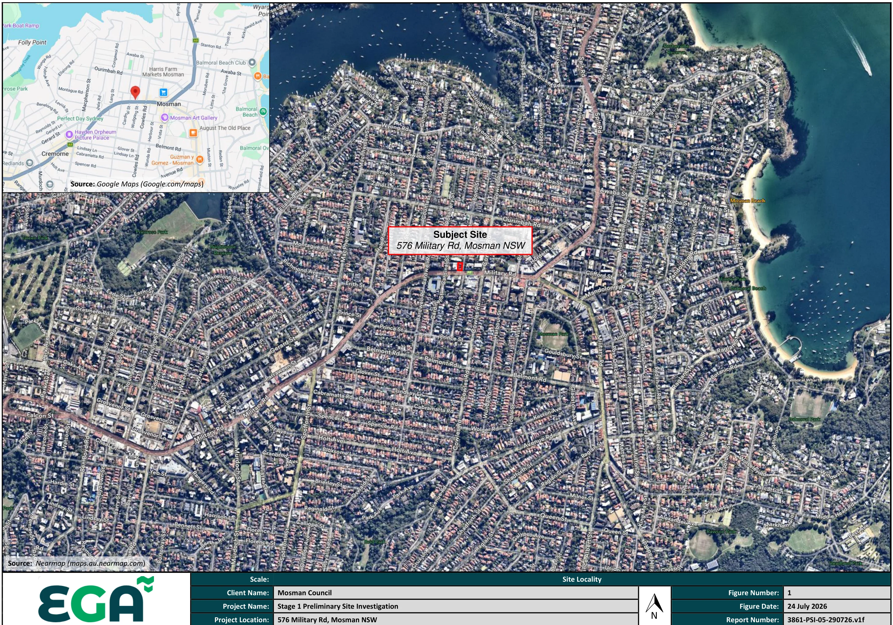

<!-- page 1046 -->

Scale: Site Layout Client Name: Figure Number: 2 Project Name: Stage 1 Preliminary Site Investigation Figure Date: 24 July 2026 Project Location: 576 Military Rd, Mosman NSW Report Number: 3861-PSI-05-290726.v1f

### LEGEND

Site Boundary

Source:  Nearmap (maps.au.nearmap.com) 10 m

August 2026

Attachment 1.1.10 Mosman Council

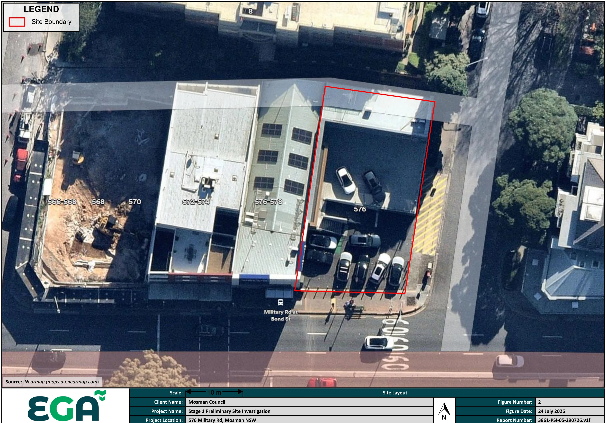

<!-- page 1047 -->

Scale: Site Layout Client Name: Figure Number: 3

Project Name: Stage 1 Preliminary Site Investigation Figure Date: 24 July 2026 Project Location: 576 Military Rd, Mosman NSW Report Number: 3861-PSI-05-290726.v1f

Source:  Nearmap (maps.au.nearmap.com) 10 m

### LEGEND

Site Boundary

AEC-1 / AEC-2 / AEC-3 / AEC-4 - Potential Chemical Storage / Wastewater Treatment and Drainage Infrastructure / Potential Fuel Infrastructure / Potential Contaminants within Soils

AEC-5 - On-Site Structures

August 2026

Attachment 1.1.10 Mosman Council

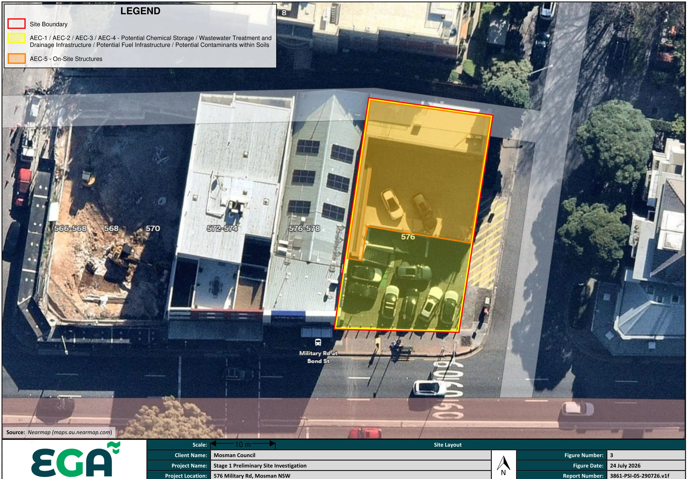

<!-- page 1048 -->

Desktop Phase 1 Environmental Site Assessment 576 Military Rd, Mosman NSW 3861-PSI-05-290726.v2f

Page 25

#### APPENDIX A

#### GROUNDWATER BORE RECORDS

August 2026

Attachment 1.1.10 Mosman Council

<!-- page 1049 -->

home help contact customise State Overview State Overview Rivers and Streams favourites search download sites find a site Real Time Data - Rivers And Streams Daily River Reports Daily River Reports Dams favourites search download sites find a site Real Time Data - Major Dams Groundwater (Telemetered data) favourites search download sites find a site Real Time Data - Bores All Groundwater Site details search download sites find a site search by licence All Groundwater Map Meteorology favourites search download sites find a site Real Time Data - Weather Stations Hunter River Salinity Trading Scheme Hunter River Salinity Trading Scheme

bookmark this page All Groundwater Site Details ALL GROUNDWATER MAP All data times are Eastern Standard Time Map Info

There are 3 sites within 500 metres of the selected point. GW111485 GW111483 GW111484

+ −

contact WaterNSW

7/23/26, 4:03 PM Real-time water data

https://realtimedata.waternsw.com.au/water.stm 1/2

August 2026

Attachment 1.1.10 Mosman Council

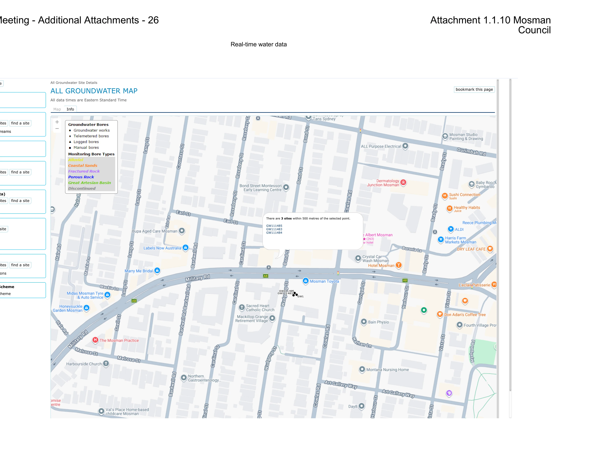

<!-- page 1050 -->

Desktop Phase 1 Environmental Site Assessment 576 Military Rd, Mosman NSW 3861-PSI-05-290726.v2f

Page 26

#### APPENDIX B

#### NSW SEED MAP

August 2026

Attachment 1.1.10 Mosman Council

<!-- page 1051 -->

A NSW Government website

SEED Sharing and Enabling Environmental Data in NSW Search and download data Miners and Explorers map Browse by topic Case studies and insights Help and contact

How to use the SEED map Layers Legend Acid Sulfate Soil Risk Labels

Boundaries

Acid Sulfate Soil Risk Hm: High probability in bottom sediments H0: High probability at/near ground surface H0(s): High probability at/near ground surface with acidic scalds H1: High probability <1 m below ground surface H1(s): High probability <1 m below ground surface with acidic scalds H2: High probability 1 - 3 m below ground surface H2(p): High probability 1 - 3 m below ground surface in Pleistocene sediments H4: High probability >3 m below ground surface Lm: Low probability in bottom sediments L0: Low probability at/near ground surface L0(p): Low probability at/near ground surface on Pleistocene sediments L1: Low probability <1 m below ground surface L1(p): Low probability <1 m below ground surface in Pleistocene sediments L2: Low probability 1 - 3 m below ground surface L2(p): Low probability 1 - 3 m below ground surface in Pleistocene sediments L4: Low probability >3 m below ground surface L4(p): Low probability >3 m below ground surface on Pleistocene sediments N: No known occurrence N(p): No known occurrence in Pleistocene sediments NB: No known occurrence, Beach X0: Disturbed terrain, < 1 m below ground surface X1: Disturbed terrain, elevation 1 - 2 m AHD X1(p): Disturbed terrain, elevation 1 - 2m AHD in Pleistocene sediments X1(s): Disturbed terrain, elevation 1 - 2 m AHD with acidic scalds X2: Disturbed terrain, elevation 2 - 4 m AHD Map data © OpenStreetMap contributors, Microsoft, Facebook, Inc. and its affiliates, Esri Community Maps contributors, Map layer by Esri Powered by Esri

Scale 18519 500 m X: 16835674.97 Y: -4003921.04 Projected Coordinates (X/Y)

#### 576 MILITARY ROAD MOSMAN 2088

Basemap

Draw/ Measure

Tools

Layer Intersect

Save Map

Contact Us Privacy Policy | More Info

Print Template 'Template Layer Intersect Tool' is still running.

7/23/26, 3:51 PM SEED Map

https://geo.seed.nsw.gov.au/vertigisstudio/web/?app=cabd04d595ec43c1aaf4298e80e83ec2 1/1

August 2026

Attachment 1.1.10 Mosman Council

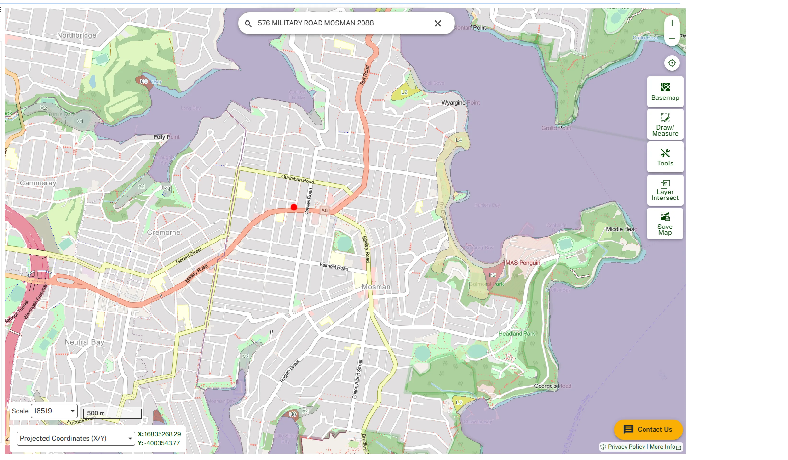

<!-- page 1052 -->

Desktop Phase 1 Environmental Site Assessment 576 Military Rd, Mosman NSW 3861-PSI-05-290726.v2f

Page 27

#### APPENDIX C

#### HISTORICAL AERIAL IMAGERY

August 2026

Attachment 1.1.10 Mosman Council

<!-- page 1053 -->

Desktop Phase 1 Environmental Site Assessment 576 Military Rd, Mosman NSW 3861-PSI-05-290726.v2f

Page 28

Historical Aerial 1. 1943 historical aerial imagery of the site. (Source: https://portal.spatial.nsw.gov.au/)

Historical Aerial 2. 1955 historical aerial imagery of the site. (Source: https://portal.spatial.nsw.gov.au/)

Historical Aerial 3. 1965 historical aerial imagery of the site. (Source: https://portal.spatial.nsw.gov.au/)

Historical Aerial 4. 1975 historical aerial imagery of the site. (Source: https://portal.spatial.nsw.gov.au/)

Historical Aerial 5. 1982 historical aerial imagery of the site. (Source: https://portal.spatial.nsw.gov.au/)

Historical Aerial 6. 1994 historical aerial imagery of the site. (Source: https://portal.spatial.nsw.gov.au/)

August 2026

Attachment 1.1.10 Mosman Council

<!-- page 1054 -->

Desktop Phase 1 Environmental Site Assessment 576 Military Rd, Mosman NSW 3861-PSI-05-290726.v2f

Page 29

Historical Aerial 7. 2005 historical aerial imagery of the site. (Source: https://portal.spatial.nsw.gov.au/)

Historical Aerial 8. 2013 historical aerial imagery of the site. (Source: https://apps.nearmap.com/)

Historical Aerial 9. 2026 historical aerial imagery of the site. (Source: https://apps.nearmap.com/)

August 2026

Attachment 1.1.10 Mosman Council

<!-- page 1055 -->

Desktop Phase 1 Environmental Site Assessment 576 Military Rd, Mosman NSW 3861-PSI-05-290726.v2f

Page 30

#### APPENDIX D

#### NSW EPA PUBLIC REGISTER

August 2026

Attachment 1.1.10 Mosman Council

<!-- page 1056 -->

Background

A strategy to systematically prioritise, assess and respond to notifications under Section 60 of the Contaminated Land Management Act 1997 (CLM Act) has been developed by the EPA. This strategy acknowledges the EPA’s obligations to make information available to the public under Government Information (Public Access) Act 2009 .

When a site is notified to the EPA, it may be accompanied by detailed site reports where the owner has been proactive in addressing the contamination and its source. However, often there is minimal information on the nature or extent of the contamination.

After receiving a report, the first step is to confirm that the report does not relate to a pollution incident. The Protection of the Environment Operations Act 1997 (POEO Act) deals with pollution incidents, waste stockpiling or dumping. The EPA also has an incident management process to manage significant incidents (https://www.epa.nsw.gov.au/reporting-and-incidents/incident- management).

In many cases, the information indicates the contamination is securely immobilised within the site, such as under a building or carpark, and is not currently causing any significant risks for the community or environment. Such sites may still need to be cleaned up, but this can be done in conjunction with any subsequent building or redevelopment of the land. These sites do not require intervention under the CLM Act, and are dealt with through the planning and development consent process. In these cases, the EPA informs the local council or other planning authority, so that the information can be recorded and considered at the appropriate time (https://www.epa.nsw.gov.au/your-environment/contaminated-land/managing-contaminated-land/role-of-planning-authorities).

Where indications are that the contamination could cause actual harm to the environment or an unacceptable offsite impact (i.e. the land is 'significantly contaminated'), the EPA would apply the regulatory provisions of the CLM Act to have the responsible polluter and/or landowner investigate and remediate the site. If the reported contamination could present an immediate or long-term threat to human health NSW Health will be consulted. SafeWork NSW and Water NSW can also be consulted if there appear to be occupational health and safety risks or an impact on groundwater quality.

As such, the sites notified to the EPA and presented in the list of contaminated sites notified to the EPA are at various stages of the assessment and remediation process. Understanding the nature of the underlying contamination, its implications and implementing a remediation program where required, can take a considerable period of time. The list provides an indication, in relation to each nominated site, as to the management status of that particular site. Further detailed information may be available from the EPA or the person who notified the site.

The following questions and answers may assist those interested in this issue.

Frequently asked questions

Why does my land appear on the list of notified sites?

Your land may appear on the list because:

• the site owner and/or the polluter has notified the EPA under section 60 of the CLM Act • the EPA has been notified via other means and is satisfied that the site is or was contaminated.

If a site is on the list, it does not necessarily mean the contamination is significant enough to regulate under the CLM Act.

List current as at 9 April 2026 1 of 139

August 2026

Attachment 1.1.10 Mosman Council

<!-- page 1057 -->

Does the list contain all contaminated sites in NSW?

No. The list only contains contaminated sites that EPA is aware of. If a site is not on the list, it does not necessarily mean the site is not contaminated.

The EPA relies on responsible parties and the public to notify contaminated sites.

How are notified contaminated sites managed by the EPA?

There are different ways the EPA can manage notified contaminated sites. Options include:

• regulation under the CLM Act, POEO Act, or both • notifying the relevant planning authority for management under the planning and development process • managing the site under the Protection of the Environment Operation (Underground Petroleum Storage Systems) Regulation 2014.

There are specific cases where contamination is managed under a tailored program operated by another agency (for example, the Resources & Geoscience's Legacy Mines Program).

What should I do if I am a potential buyer of a site that appears on the list?

You should seek advice from the seller to understand the contamination issue. You may need to seek independent contamination or legal advice.

The information provided in the list is indicative only and a starting point for your own assessment. Land contamination from past site uses is common, mainly in urban environments. If the site is properly remediated or managed, it may not affect the intended future use of the site.

Who can I contact if I need more information about a site?

You can contact the Environment Line at any time by calling 131 555 or by emailing info@environment.nsw.gov.au.

List of NSW Contaminated Sites Notified to the EPA

List current as at 9 April 2026 2 of 139

August 2026

Attachment 1.1.10 Mosman Council

<!-- page 1058 -->

Site Status

Under assessment

Under Preliminary Investigation Order

Regulation under CLM Act not required

Explanation

The contamination is being assessed by the EPA to determine whether regulation is required. The EPA may require further information to complete the assessment. For example, the completion of management actions regulated under the planning process or Protection of the Environment Operations Act 1997 .

The EPA has issued a Preliminary Investigation Order under s10 of the Contaminated Land Management Act 1997 , to obtain additional information needed to complete the assessment.

The EPA has completed an assessment of the contamination and decided that regulation under the Contaminated Land Management Act 1997 is not required.

Disclaimer

The EPA has taken all reasonable care to ensure that the information in the list of contaminated sites notified to the EPA (the list) is complete and correct. The EPA does not, however, warrant or represent that the list is free from errors or omissions or that it is exhaustive.

The EPA may, without notice, change any or all of the information in the list at any time.

You should obtain independent advice before you make any decision based on the information in the list.

The list is made available on the understanding that the EPA, its servants and agents, to the extent permitted by law, accept no responsibility for any damage, cost, loss or expense incurred by you as a result of:

1.            any information in the list; or 2.            any error, omission or misrepresentation in the list; or 3.            any malfunction or failure to function of the list; 4.            without limiting (2) or (3) above, any delay, failure or error in recording, displaying or updating information.

List current as at 9 April 2026 3 of 139

August 2026

Attachment 1.1.10 Mosman Council

<!-- page 1059 -->

Regulation being finalised

Contamination currently regulated under CLM Act

Contamination currently regulated under POEO Act

Contamination being managed via the planning process (EP&A Act)

Contamination formerly regulated under the CLM Act

Contamination formerly regulated under the POEO Act

The EPA has completed an assessment of the contamination and decided that the contamination is significant enough to warrant regulation under the Contaminated Land Management Act 1997 . A regulatory approach is being finalised.

The EPA has completed an assessment of the contamination and decided that the contamination is significant enough to warrant regulation under the Contaminated Land Management Act 1997 (CLM Act). Management of the contamination is regulated by the EPA under the CLM Act. Regulatory notices are available on the EPA’s Contaminated Land Public Record.

Contamination is currently regulated under the Protection of the Environment Operations Act 1997 (POEO Act).  The EPA as the appropriate regulatory authority reasonably suspects that a pollution incident is occurring/ has occurred and that it requires regulation under the POEO Act. The EPA may use environment protection notices, such as clean up notices, to require clean up action to be taken.  Such regulatory notices are available on the POEO public register.

The EPA has completed an assessment of the contamination and decided that the contamination is significant enough to warrant regulation. The contamination of this site is managed by the consent authority under the Environmental Planning and Assessment Act 1979 (EP&A Act) planning approval process, with EPA involvement as necessary to ensure significant contamination is adequately addressed. The consent authority is typically a local council or the Department of Planning and Environment.

The EPA has determined that the contamination is no longer significant enough to warrant regulation under the Contaminated Land Management Act 1997 (CLM Act). The contamination was addressed under the CLM Act.

The EPA has determined that the contamination is no longer significant enough to warrant regulation. The contamination was addressed under the Protection of the Environment Operations Act 1997 (POEO Act).

List current as at 9 April 2026 4 of 139

August 2026

Attachment 1.1.10 Mosman Council

<!-- page 1060 -->

Contamination was addressed via the planning process (EP&A Act)

Ongoing maintenance required to manage residual contamination (CLM Act)

The EPA has determined that ongoing maintenance, under the Contaminated Land Management Act 1997 (CLM Act), is required to manage the residual contamination. Regulatory notices under the CLM Act are available on the EPA’s Contaminated Land Public Record.

The EPA has determined that the contamination is no longer significant enough to warrant regulation. The contamination was addressed by the appropriate consent authority via the planning process under the Environmental Planning and Assessment Act 1979 (EP&A Act).

List current as at 9 April 2026 5 of 139

August 2026

Attachment 1.1.10 Mosman Council

<!-- page 1061 -->

Suburb SiteName Address ContaminationActivityType ManagementClass Latitude Longitude

MORPETH Telstra Cable Installation and RTA Bridge work Northumberland STREET Other Petroleum Regulation under CLM Act not required -32.72489729 151.6266795

MORPETH Former Service Station Swan  STREET Service Station Regulation under CLM Act not required -32.72477413 151.6250642

MORTLAKE Former Petroleum Storage Site 108-116 Tennyson ROAD Other Petroleum Regulation under CLM Act not required -33.83979033 151.1064889

MORTLAKE Kendall Bay Sediments Kendall BAY Gasworks Contamination currently regulated under CLM Act -33.83905999 151.1120458

MORTLAKE Former AGL site Tennyson  ROAD Gasworks Contamination formerly regulated under the CLM Act -33.84287407 151.1109313

MORTLAKE Majors Bay Redevelopment 14-22 Hilly STREET Other Industry Regulation under CLM Act not required -33.83954617 151.1054674

MORUYA Former Fuel Depot Moruya 11 to 13 Ford STREET Other Petroleum Regulation under CLM Act not required -35.9112243 150.0826475

MORUYA Caltex Service Station Moruya 80-84 Campbell STREET Service Station Regulation under CLM Act not required -35.91195596 150.0824213

MORUYA Ampol Fuel Depot - Moruya 26 Campbell STREET Service Station Regulation under CLM Act not required -35.9104985 150.0711419

MOSMAN 7-Eleven Mosman 162A Spit Road Corner Mitchell ROAD Service Station Regulation under CLM Act not required -33.81747016 151.2433633

MOSMAN BP Service Station 175 Ourimbah ROAD Service Station Regulation under CLM Act not required -33.82106757 151.233291

MOSMAN BP Express Mosman 175 Ourimbah  ROAD Service Station Regulation under CLM Act not required -33.82106459 151.2332921

MOSMAN 7-Eleven Service Station Mosman 45 Spit ROAD Service Station Regulation under CLM Act not required -33.82302718 151.2435627

MOSMAN Allan Border Oval Myahgah  ROAD Landfill Regulation under CLM Act not required -33.82681534 151.2417712

MOSMAN 173 Avenue Road, MOSMAN NSW 2088 173 Avenue ROAD Unclassified Regulation under CLM Act not required -33.930869 150.97132

List current as at 9 April 2026 85 of 139

August 2026

Attachment 1.1.10 Mosman Council

<!-- page 1062 -->

Suburb SiteName Address ContaminationActivityType ManagementClass Latitude Longitude

MOSS VALE Woolworths Service Station Moss Vale 609 Argyle  STREET Service Station Regulation under CLM Act not required -34.55409411 150.3609797

MOSS VALE Coles Express Service Station 579 Argyle STREET Service Station Regulation under CLM Act not required -34.55313422 150.364684

MOSS VALE Moss Vale Refuelling Facility Lackey ROAD Other Petroleum Regulation under CLM Act not required -34.54662421 150.3721525

MOUNT ANNAN Woolworths Caltex Mount Annan 157 Narellan (Corner Smeaton Grange Road) ROAD Service Station Regulation under CLM Act not required -34.04685527 150.7610434

MOUNT ANNAN Great Southern Railways Aqueduct Off Narellan  ROAD Unclassified Regulation under CLM Act not required -34.07308479 150.7707436

MOUNT COLAH Caltex Service Station Mount Colah 603 Pacific HIGHWAY Service Station Regulation under CLM Act not required -33.67034662 151.1151861

MOUNT COLAH Foxglove Oval Foxglove ROAD Landfill Contamination currently regulated under CLM Act -33.65829855 151.1229638

MOUNT DRUITT Caltex (former Mobil) Service Station, 17 Mount Street, Mount Druitt 17 Mount STREET Service Station Regulation under CLM Act not required -33.76567994 150.8244544

MOUNT DRUITT 7-Eleven Mount Druitt Lot 6 Luxford ROAD Other Petroleum Regulation under CLM Act not required -33.76483839 150.8254157

MOUNT HUTTON Woolworths Service Station 46 Wilsons ROAD Service Station Regulation under CLM Act not required -32.9836378 151.67309

MOUNT PRITCHARD 7-Eleven Service Station 352 Elizabeth DRIVE Service Station Regulation under CLM Act not required -33.90260656 150.8963326

MOUNT THORLEY Bulga Surface Operations Broke ROAD Other Industry Regulation under CLM Act not required -32.68325751 151.1206158

MOUNT THORLEY Lowes Petroleum (Former BP) Depot Mount Thorley 74 Mount Thorley ROAD Other Petroleum Regulation under CLM Act not required -32.62443074 151.1025122

MOUNT VICTORIA Former Mobil Service Station 81 Great Western HIGHWAY Service Station Regulation under CLM Act not required -33.5889727 150.2511783

MOUNT VICTORIA Caltex Service Station 36a Great Western HIGHWAY Service Station Regulation under CLM Act not required -33.58436517 150.2465528

List current as at 9 April 2026 86 of 139

August 2026

Attachment 1.1.10 Mosman Council

<!-- page 1063 -->

Search TIP To search for a specific site, search by LGA (local government area) and carefully review all sites listed. ... more search tips

Home Public registers Contaminated land record of notices Search results Your search for:Suburb: MOSMAN Search Again Refine Search did not find any records in our database. If a site does not appear on the record it may still be affected by contamination. For example: Contamination may be present but the site has not been regulated by the EPA under the Contaminated Land Management Act 1997 or the Environmentally Hazardous Chemicals Act 1985. The EPA may be regulating contamination at the site through a licence or notice under the Protection of the Environment Operations Act 1997 (POEO Act). Contamination at the site may be being managed under the planning process. More information about particular sites may be available from: The POEO public register The appropriate planning authority: for example, on a planning certificate issued by the local council under section 149 of the Environmental Planning and Assessment Act. See What's in the record and What's not in the record. If you want to know whether a specific site has been the subject of notices issued by the EPA under the CLM Act, we suggest that you search by Local Government Area only and carefully review the sites that are listed. This public record provides information about sites regulated by the EPA under the Contaminated Land Management Act 1997, including sites currently and previously regulated under the Environmentally Hazardous Chemicals Act 1985. Your inquiry using the above search criteria has not matched any record of current or former regulation. You should consider searching again using different criteria. The fact that a site does not appear on the record does not necessarily mean that it is not affected by contamination. The site may have been notified to the EPA but not yet assessed, or contamination may be present but the site is not yet being regulated by the EPA. Further information about particular sites may be available from the appropriate planning authority, for example, on a planning certificate issued by the local council under section 149 of the Environmental Planning and Assessment Act. In addition the EPA may be regulating contamination at the site through a licence under the Protection of the Environment Operations Act 1997. You may wish to search the POEO public register.POEO public register 13 July 2026

7/13/26, 12:13 PM DECCW | Search results

https://app.epa.nsw.gov.au/prclmapp/searchresults.aspx?&LGA=&Suburb=MOSMAN&Notice=&Name=&Text=&DateFrom=&DateTo= 1/1

August 2026

Attachment 1.1.10 Mosman Council

<!-- page 1064 -->

Home Public registers POEO Public Register Licences, applications and notices search Search results

Your search for: General Search with the following criteria Suburb - mosman returned 26 results Export to excel 2 of 2 Pages Search Again Number Name Location Type Status Issued date 1522383 TARONGA CONSERVATION SOCIETY AUSTRALIA BRADLEYS HEAD ROAD, MOSMAN, NSW 2088

s.58 Licence Variation Issued Issued 09 Jul 2015

1600361 TARONGA CONSERVATION SOCIETY AUSTRALIA BRADLEYS HEAD ROAD, MOSMAN, NSW 2088

Compliance Audit Complete Complete 14 Sep 2020

1603655 TARONGA CONSERVATION SOCIETY AUSTRALIA BRADLEYS HEAD ROAD, MOSMAN, NSW 2088

s.58 Licence Variation Issued Issued 08 Apr 2021

1615336 TARONGA CONSERVATION SOCIETY AUSTRALIA BRADLEYS HEAD ROAD, MOSMAN, NSW 2088

s.58 Licence Variation Issued Issued 23 Dec 2021

1623058 TARONGA CONSERVATION SOCIETY AUSTRALIA BRADLEYS HEAD ROAD, MOSMAN, NSW 2088

s.58 Licence Variation Issued Issued 30 Nov 2022

1630287 TARONGA CONSERVATION SOCIETY AUSTRALIA BRADLEYS HEAD ROAD, MOSMAN, NSW 2088

s.58 Licence Variation Issued Issued 03 Oct 2023

12 13 July 2026

7/13/26, 12:14 PM Environment & Heritage | PRPOEO

https://app.epa.nsw.gov.au/prpoeoapp/SearchResult.aspx?SearchTag=all&searchrange=general&range=general&SortExpression=AccountablePa… 1/1

August 2026

Attachment 1.1.10 Mosman Council

<!-- page 1065 -->

Home Public registers POEO Public Register Licences, applications and notices search Search results

Your search for: General Search with the following criteria Suburb - mosman returned 26 results Export to excel 1 of 2 Pages Search Again Number Name Location Type Status Issued date 1621649 THE SPIT, MOSMAN, NSW 2088 s.58 Licence Variation Issued Issued 08 Feb 2023 1028480 ARDENT LEISURE LIMITED  THE SPIT, MOSMAN, NSW 2088 s.58 Licence Variation Issued Issued 03 Jul 2003 1032563 ARDENT LEISURE LIMITED  THE SPIT, MOSMAN, NSW 2088 s.58 Licence Variation Issued Issued 20 Nov 2003 1069448 ARDENT LEISURE LIMITED  THE SPIT, MOSMAN, NSW 2088 s.58 Licence Variation Issued Issued 05 Feb 2007 1070978 ARDENT LEISURE LIMITED  THE SPIT, MOSMAN, NSW 2088 s.58 Licence Variation Issued Issued 14 Mar 2007 1072567 ARDENT LEISURE LIMITED  THE SPIT, MOSMAN, NSW 2088 s.58 Licence Variation Issued Issued 24 Apr 2007 1074550 ARDENT LEISURE LIMITED  THE SPIT, MOSMAN, NSW 2088 s.58 Licence Variation Issued Issued 13 Jun 2007 1078238 ARDENT LEISURE LIMITED  THE SPIT, MOSMAN, NSW 2088 s.58 Licence Variation Issued Issued 19 Sep 2007 1085886 ARDENT LEISURE LIMITED  THE SPIT, MOSMAN, NSW 2088 s.58 Licence Variation Issued Issued 12 May 2008 1097027 ARDENT LEISURE LIMITED  THE SPIT, MOSMAN, NSW 2088 s.58 Licence Variation Issued Issued 30 Jan 2009 1509253 ARDENT LEISURE LIMITED  THE SPIT, MOSMAN, NSW 2088 s.58 Licence Variation Issued Issued 24 Jun 2013 11724 HEALTHSCOPE OPERATIONS PTY LTD

#### 1 ELLAMATTA AVENUE,

MOSMAN, NSW 2088 POEO licence No longer in force No longer in force

16 Sep 2002

1048188 HEALTHSCOPE OPERATIONS PTY LTD

#### 1 ELLAMATTA AVENUE,

MOSMAN, NSW 2088 s.58 Licence Variation Issued Issued 27 May 2005 11211 MA MARINA FUND OPCO NO. 1 PTY LTD THE SPIT, MOSMAN, NSW 2088 POEO licence Issued Issued 30 Jan 2001 3514873 MA MARINA FUND OPCO NO. 1 PTY LTD THE SPIT, MOSMAN, NSW 2088 s.91 Clean Up Notice Issued Issued 10 Jan 2026 1596267 NONBANK MORTGAGES PTY. LTD. THE SPIT, MOSMAN, NSW 2088 s.58 Licence Variation Issued Issued 29 Jun 2021 1008406 OMNI LEISURE OPERATIONS LIMITED THE SPIT, MOSMAN, NSW 2088 s.58 Licence Variation Issued Issued 13 Jun 2001 1018813 OMNI LEISURE OPERATIONS LIMITED THE SPIT, MOSMAN, NSW 2088 s.58 Licence Variation Issued Issued 06 Sep 2002 1677 TARONGA CONSERVATION SOCIETY AUSTRALIA BRADLEYS HEAD ROAD, MOSMAN, NSW 2088

POEO licence Issued Issued 26 Sep 2000

1512309 TARONGA CONSERVATION SOCIETY AUSTRALIA BRADLEYS HEAD ROAD, MOSMAN, NSW 2088

Compliance Audit Complete Complete 21 Feb 2013

12 13 July 2026

7/13/26, 12:14 PM Environment & Heritage | PRPOEO

https://app.epa.nsw.gov.au/prpoeoapp/SearchResult.aspx?SearchTag=all&searchrange=general&range=general&SortExpression=AccountablePa… 1/1

August 2026

Attachment 1.1.10 Mosman Council

<!-- page 1066 -->

## Desktop Phase 1 Environmental Site

## Assessment

494-516 Military Road, Mosman NSW

Report No: Report Date:

3861-PSI-06-290726.v2f 03/08/2026

info@egau.com.au

NSW: 36E Fitzroy Street, Marrickville, NSW 2204 VIC: 88 Langridge St, Collingwood VIC 3066

August 2026

Attachment 1.1.10 Mosman Council

<!-- page 1067 -->

Desktop Phase 1 Environmental Site Assessment 494-516 Military Road, Mosman NSW 3861-PSI-06-290726.v2f

Page 1

### Document Record

Revision Date Author Reviewer

v1f 29 July 2026 Rachelle Conna Isabelle Figatowski

v2f 3 August 2026 Rachelle Conna Isabelle Figatowski

Author Signature Reviewer Signature

Name Rachelle Conna Name Isabelle Figatowski

Credentials B. Sc. (Zoology) Credentials B.Sc. (Env. Consulting)

Title Environmental Consultant Title Senior Environmental Consultant

Document Title: Desktop Phase 1 Environmental Site Assessment - 494-516 Military Road, Mosman NSW Site Address: 494-516 Military Road, Mosman NSW Client Name: Site Size: ≈ 3,200 m2 Reference Number: 3861-PSI-06-290726.v2f Project Type: Desktop Phase 1 Environmental Site Assessment Project Type Abbreviation: PSI Document Draft: FINAL Document Revision No. v2f

Prepared by Environmental Group Australia Pty Ltd ABN: 83 671 599 143

August 2026

Attachment 1.1.10 Mosman Council

<!-- page 1068 -->

Desktop Phase 1 Environmental Site Assessment 494-516 Military Road, Mosman NSW 3861-PSI-06-290726.v2f

Page 2

### EXECUTIVE SUMMARY

Environmental Group Australia Pty Ltd (EGA) was engaged by Mosman Council (hereafter referred to as ‘the client’), to undertake a Desktop Phase 1 Environmental Site Assessment of the property located within Lot 19 DP3547, Lot 3 Section D DP4628 and Lot 4 Section D DP4628, 494-516 Military Road, Mosman NSW (hereafter referred to as ‘the site’) (refer to Figure 1 and Figure 2).

The client is preparing to lodge a planning proposal to implement the draft Mosman Masterplan, which proposes increased housing capacity across the study area, including amendments to the planning controls at the site to facilitate redevelopment.

#### Purpose and Objectives

A Desktop Phase 1 Environmental Site Assessment was required to assess the likelihood that the site had been contaminated by past or present activities and to form a preliminary view on the extent and degree of contamination. The objectives of the investigation were to:

• Provide advice on whether the site may require a stage 2 intrusive site assessment, to better define the nature and extent of potential contamination within the site; and • Provide advice on whether the site would be suitable (in the context of land contamination) for any proposed future rezoning.

#### Site Description

• The site covers an area of approximately 3,200 m2; • The site is currently zoned as E3: Productivity Support; • The site is currently utilised within a commercial land-use setting; • The site is located within a mixed commercial-industrial and residential district.

Current aerial imagery suggests that the site is operating under three commercial entities, ‘Honeysuckle Garden Mosman’ to the centre and west, ‘Midas Mosman Tyre & Auto Service’ to the east and ‘Mackie Lane Community Garden’ to the north. Imagery shows the site to contain two commercial warehouse structures in the centre and east of the site, with a community garden to the north and hardstand across the remaining site surfaces.

#### Proposed Development

Reference is made to the draft Mosman Masterplan Structure Plan prepared by SJB Architecture, dated 29 July 2026 (Drawing No. 06, Revision 07). EGA understands that the site has been identified for increased development potential, however, have not been provided with any specific redevelopment plans. EGA has made the assumption that future development may include the demolition of current structures, rezoning of land, subdivision of land, and construction of new structures and infrastructure. EGA has not been made aware of any basement plans and have presumed that they are proposed as part of the future development.

#### Scope of Work

EGA undertook the following scope of works to address the project objectives:

• A desktop review of relevant information pertaining to the site; and • Assessment and reporting of the desktop review.

#### Investigation Outcome

Based on EGA’s assessment of the desktop review information, in the context of the proposed redevelopment scenario, EGA has made the following conclusions:

August 2026

Attachment 1.1.10 Mosman Council

<!-- page 1069 -->

Desktop Phase 1 Environmental Site Assessment 494-516 Military Road, Mosman NSW 3861-PSI-06-290726.v2f

Page 3

• The search of historical aerial imagery indicated a moderate potential for contamination within the site to have occurred, associated with uncontrolled demolition and potential site filling beneath slabs. EGA also notes that the building fabrics may contain hazardous building materials; • A review of publicly available contaminated land databases indicated that the site is not the subject of any licences, applications, notices under Section 308 of the Protection of the Environment Operations Act 1997. The site is not notified under Section 60 of the Contaminated Land Management Act 1997. The site is not the subject of any notifications under Section 58 of the Contaminated Land Management Act 1997; • The contaminants and areas of environmental concern (AEC), requiring further consideration or assessment, and possibly remediation or risk management, are the following: o AEC-1: Horticultural and Nursery Operations – Potential Storage and Application of Herbicides and Pesticides, Soil and Potting Mix Storage; o AEC-2: Automotive Operations - Potential Fuel Infrastructure, Wastewater Treatment and Drainage Infrastructure and Potential Chemical Storage; o AEC-3: Potential Uncontrolled Fill and Surface Soils; and o AEC-4: On-Site Structures - Hazardous Building Materials. • Soils not impacted by contamination may meet excavated natural material (ENM) or General Solid Waste (GSW) classification.

#### Conclusions and Recommendations

Notwithstanding the above, the potential contaminants of concern and affected environmental media are consistent with those typically encountered on brownfield redevelopment sites within the Sydney Basin. Any contamination that may be present is not expected to be of such an extent or complexity that it could not be effectively managed or remediated using conventional and readily available remediation techniques. Accordingly, the potential for contamination at the site is not considered to preclude proposed future redevelopment.

As detailed development plans are prepared for individual areas of the site, the existing environmental data should be reviewed in conjunction with the overall remedial strategy to confirm the nature and extent of any contamination relevant to the proposed works. Where required, additional assessment should be undertaken, and appropriate remediation and/or management measures developed, to demonstrate that the relevant portion of the site is, or can be made, suitable for its intended use.

This report, including its conclusions and recommendations, must be read in conjunction with the limitations presented in Section 12.

August 2026

Attachment 1.1.10 Mosman Council

<!-- page 1070 -->

Desktop Phase 1 Environmental Site Assessment 494-516 Military Road, Mosman NSW 3861-PSI-06-290726.v2f

Page 4

#### TABLE OF CONTENTS

#### 1.

#### INTRODUCTION

#### 7

1.1. Purpose and Objectives ............................................................................................................... 7 1.2. Site Description ............................................................................................................................. 7 1.3. Proposed Development ................................................................................................................ 7 1.4. Scope of Work .............................................................................................................................. 7

#### 2.

#### SITE IDENTIFICATION

#### 8

#### 3.

#### PHYSICAL SITE CONDITIONS

#### 9

#### 4.

#### SITE HISTORY AND LAND USE

#### 11

4.1. Aerial Imagery ............................................................................................................................ 11 4.2. Anecdotal Information ............................................................................................................... 11 4.3. Incident and Complaints History ............................................................................................... 12 4.4. Previous Contamination Assessments ...................................................................................... 12

#### 5.

#### REGULATORY RECORDS

#### 13

5.1. NSW EPA CLM Act Register of Notified Sites and Notices ....................................................... 13 5.2. NSW EPA POEO Act Register of Licences, Applications and Notices ...................................... 13 5.3. Dangerous Goods Licences Search ............................................................................................ 13

#### 6.

#### INFORMATION SOURCES

#### 14

#### 7.

#### CONCEPTUAL SITE MODEL

#### 15

7.1. Potential Areas of Environmental Concern ............................................................................... 15 7.2. Contaminants, Migration Pathways, Receptors and Risks ...................................................... 15 7.3. Site Characteristics Affecting Risks ........................................................................................... 16 7.3.1. Land-Use Setting................................................................................................................ 16 7.3.2. Surface Water ..................................................................................................................... 16 7.3.3. Groundwater – Drinking Water Risks ................................................................................ 17 7.3.4. Recreational Water Use and Aquatic Ecosystems ............................................................ 17 7.3.5. Terrestrial Ecosystems ....................................................................................................... 17 7.3.6. Human Exposures to Site Contaminants ........................................................................... 17

#### 8.

#### RISK ASSESSMENT (PLANNING LEVEL)

#### 18

#### 9.

#### PLANNING AND MASTER PLAN ADVICE

#### 19

9.1. Suitability for Future Development ............................................................................................ 19 9.2. Identification of Potential Issues ............................................................................................... 19 9.3. Requirements for the Development Application (DA) Stage ................................................... 19 9.4. Suggestion Inclusion to Master Planning .................................................................................. 19

#### 10. CONTAMINANTS OF CONCERN

#### 21

#### 11. CONCLUSIONS AND RECOMMENDATIONS

#### 22

11.1. Site Condition and Further Requirements ................................................................................. 22 11.2. Recommendations ...................................................................................................................... 22

#### 12. STATEMENT OF LIMITATIONS

#### 23

August 2026

Attachment 1.1.10 Mosman Council

<!-- page 1071 -->

Desktop Phase 1 Environmental Site Assessment 494-516 Military Road, Mosman NSW 3861-PSI-06-290726.v2f

Page 5

#### 13. REFERENCES

#### 24

FIGURES Figure 1 - Site Locality Figure 2 - Site Layout Figure 3 - Areas of Environmental Concern

APPENDICES A - Groundwater Bore Records B - NSW SEED Map C - Historical Aerial Imagery D - NSW EPA Public Register

August 2026

Attachment 1.1.10 Mosman Council

<!-- page 1072 -->

Desktop Phase 1 Environmental Site Assessment 494-516 Military Road, Mosman NSW 3861-PSI-06-290726.v2f

Page 6

### LIST OF ABBREVIATIONS

AHD Australian Height Datum AEC Area of Environmental Concern ANZECC Australian and New Zealand Environment and Conservation Council AST Aboveground storage tank Bgl Below ground level BTEX Benzene, toluene, ethylbenzene, xylene CoC Chain of Custody CSM Conceptual Site Model EIL Ecological Investigation Level EGA Environmental Group Australia Pty Ltd EPA Environment Protection Authority HIL Health Investigation Levels HSL Health Screening Levels LOR [Laboratory] Limit of Reporting NATA National Association of Testing Laboratories NA Not applicable ND Not detected NEPC National Environment Protection Council NEPM National Environment Protection Measure NSW EPA NSW Environment Protection Authority OCP Organochlorine Pesticide PAEC Potential Area of Environmental Concern PAH Polycyclic aromatic hydrocarbon PCB Polychlorinated biphenyl PID Photo-ionisation detector PSI Preliminary Site Investigation QA/QC Quality assurance/Quality control RPD Relative percentage difference SAQP Sampling Analysis and Quality Plan SVOC Semi-volatile organic compound USCS Unified Soil Classification System UST Underground storage tank VOC Volatile organic compound

August 2026

Attachment 1.1.10 Mosman Council

<!-- page 1073 -->

Desktop Phase 1 Environmental Site Assessment 494-516 Military Road, Mosman NSW 3861-PSI-06-290726.v2f

Page 7

#### 1. INTRODUCTION

Environmental Group Australia Pty Ltd (EGA) was engaged by Mosman Council (hereafter referred to as ‘the client’), to undertake a Desktop Phase 1 Environmental Site Assessment of the property located within Lot 19 DP3547, Lot 3 Section D DP4628 and Lot 4 Section D DP4628, 494-516 Military Road, Mosman NSW (hereafter referred to as ‘the site’) (refer to Figure 1 and Figure 2).

The client is preparing to lodge a planning proposal to implement the draft Mosman Masterplan, which proposes increased housing capacity across the study area, including amendments to the planning controls at the site to facilitate redevelopment.

#### 1.1.

#### Purpose and Objectives

A Desktop Phase 1 Environmental Site Assessment was required to assess the likelihood that the site had been contaminated by past or present activities and to form a preliminary view on the extent and degree of contamination. The objectives of the investigation were to:

• Provide advice on whether the site may require a stage 2 intrusive site assessment, to better define the nature and extent of potential contamination within the site; and • Provide advice on whether the site would be suitable (in the context of land contamination) for any proposed future rezoning.

#### 1.2.

#### Site Description

• The site covers an area of approximately 3,200 m2; • The site is currently zoned as E3: Productivity Support; • The site is currently utilised within a commercial land-use setting; • The site is located within a mixed commercial-industrial and residential district.

Current aerial imagery suggests that the site is operating under three commercial entities, ‘Honeysuckle Garden Mosman’ to the centre and west, ‘Midas Mosman Tyre & Auto Service’ to the east and ‘Mackie Lane Community Garden’ to the north. Imagery shows the site to contain two commercial warehouse structures in the centre and east of the site, with a community garden to the north and hardstand across the remaining site surfaces.

#### 1.3.

#### Proposed Development

Reference is made to the draft Mosman Masterplan Structure Plan prepared by SJB Architecture, dated 29 July 2026 (Drawing No. 06, Revision 07). EGA understands that the site has been identified for increased development potential, however, have not been provided with any specific redevelopment plans. EGA has made the assumption that future development may include the demolition of current structures, rezoning of land, subdivision of land, and construction of new structures and infrastructure. EGA has not been made aware of any basement plans and have presumed that they are proposed as part of the future development.

#### 1.4.

#### Scope of Work

EGA undertook the following scope of works to address the project objectives:

• A desktop review of relevant information pertaining to the site; and • Assessment and reporting of the desktop review.

August 2026

Attachment 1.1.10 Mosman Council

<!-- page 1074 -->

Desktop Phase 1 Environmental Site Assessment 494-516 Military Road, Mosman NSW 3861-PSI-06-290726.v2f

Page 8

#### 2. SITE IDENTIFICATION

The site identification details and associated information are presented in Table 2.1.

Table 2.1 Site Identification Information Attribute Description

Street Address 494-516 Military Road, Mosman NSW

Lot and Deposited Plan (DP)

Lot 19 DP3547 Lot 3 Section D DP4628 Lot 4 Section D DP4628

Current Owner

Geographical Coordinates 33°49'29.5"S 151°14'01.5"E (approximate centre of site)

Site Area ≈ 3,200 m2

Local Government Area (LGA) Mosman Municipal Council

Parish Willoughby

County Cumberland

Zoning E3: Productivity Support Mosman Local Environmental Plan 2012 (2011 EPI 647)

The locality of the site is identified in Figure 1.

The general layout and boundary of the site are shown in Figure 2.

August 2026

Attachment 1.1.10 Mosman Council

<!-- page 1075 -->

Desktop Phase 1 Environmental Site Assessment 494-516 Military Road, Mosman NSW 3861-PSI-06-290726.v2f

Page 9

#### 3. PHYSICAL SITE CONDITIONS

Regional geology, topography, soil landscape and hydrogeological information are presented in Table 3.1.

Table 3.1 Regional Setting Information Attribute Description

Geology

A review of the Environment NSW ‘eSpade V2.2’ web application (environment.nsw.gov.au/eSpade2WebApp, accessed 22 July 2026), indicated that the site is likely to be underlain by Hawkesbury Sandstone, which is a medium to coarse-grained quartz sandstone with minor shale and laminite lenses.

Soil Profiles

A review of the Environment NSW ‘eSpade V2.2’ web application (environment.nsw.gov.au/eSpade2WebApp, accessed 22 July 2026), indicated that the site is likely to contain: • gy1 (Topsoil): Loose, acidic, water-repellent coarse sandy loam, high permeability, low water capacity. • gy2 (Subsoil/Sandstone): Earthy, hard setting yellowish-brown clayey sand, low water capacity. • gy3 (Subsoil/Sandstone): Earthy/weakly pedal sandy clay loam, low permeability and wet strength. • gy4 (Subsoil/Shale): Highly pedal, highly erodible yellowish-brown clay, low permeability and wet strength. • Associated: Surface leaf litter (up to 10 cm) and loose quartz sand wash.

Terrain and Structure

A review of the Environment NSW ‘eSpade V2.2’ web application (environment.nsw.gov.au/eSpade2WebApp, accessed 22 July 2026), indicated that the site is likely to comprise: • Crests (<50 cm deep): Gradual transition of gy1 over bedrock, gy2, or occasionally gy3. Hard setting layers or bedrock expose when eroded. • Side slopes (30–70 cm deep): Discontinuous soils with up to 25% rock outcrop. gy1 overlies bedrock or gy2/gy3 on benches. • Shale Lenses (<100 cm deep): Sharp transition from gy1 to deep gy4 clay on inner benches. • Drainage Lines (<100 cm deep): Deep gy1 directly over bedrock.

Acid Sulfate Soils

A review of the NSW Government SEED web application (geo.seed.nsw.gov.au, accessed 22 July 2026), indicates that the site lies in an area mapped as ‘No Known Occurrence’ with respect to acid sulfate soils. This infers that land management activities are not likely to be affected by acid sulfate soils. Further assessment of acid sulfate soils in the context of this investigation is considered by EGA as not warranted.

Topography

Generally, the local landscape consists of undulating to rolling low hills with local relief 20–80 m and slopes of 10–25%. Sideslopes with narrow to wide outcropping sandstone rock benches (10–100 m), often forming broken scarps of <5 m. The site is located at an elevation approximately 87 m to 91 m Australian Height Datum (AHD) and gently sloping on a downward gradient toward the west.

Hydrology and Hydrogeology

Surface water courses proximal to the site include Willoughby Creek located approximately 790 m to the northwest of the site, Quakers Hat Bay located approximately 1 km to the north and Mosman Bay located approximately 1.29 km to the southeast of the site. Based on the site topography and distances to the nearest surface water course, groundwater flow in the vicinity of the site is considered likely to be towards the northwest. A review of the NSW Office of Water groundwater database undertaken on 22 July 2026 indicated three registered groundwater features located within the site: • GW111485: monitoring bore, final depth – 10.00 m bgl, standing water level – 5.94 m bgl, located approximately 349 m east of the site; • GW111484: monitoring bore, final depth – 10.00 m bgl, standing water level – 6.03 m bgl, located approximately 349 m east of the site; and GW111483: monitoring bore, final depth – 5.00 m bgl, standing water level – 3.68 m bgl, located approximately 349 m east of the site.

August 2026

Attachment 1.1.10 Mosman Council

<!-- page 1076 -->

Desktop Phase 1 Environmental Site Assessment 494-516 Military Road, Mosman NSW 3861-PSI-06-290726.v2f

Page 10

Attribute Description

Adjacent Sensitive Receptors

The closest ecological receptors to the site include vegetated areas within the site / neighbouring properties and the closest receiving watercourses as outlined above. A review of the Bureau of Meteorology (BoM) Groundwater Dependent Ecosystem (GDE) Atlas Map was undertaken on 22 July 2026 to determine the closest sensitive ecological receptors. The closest sensitive receptor to the site included Manly Lagoon, located approximately 6.28 km to the northeast of the site and noted as a high potential groundwater dependent ecosystem. The closest sensitive human receptors are the residential properties surrounding the site’s boundary and any future onsite construction workers/builders.

Perfluoroalkyl Substances (PFAS)

A review of the publicly available NSW Government PFAS Investigation Program mapping information was reviewed 21 July 2026. The review was undertaken to identify any investigation localities that may affect the site. The site is not considered to be affected by any PFAS investigation programs.

Unexploded Ordnance (UXO)

A review of the publicly available Unexploded Ordnance (UXO) mapping information was reviewed 21 July 2026. The review was undertaken to identify any recorded UXO-related constraints or risks applicable to the site and its surrounding area at the time of reporting. The site is not considered to be affected by UXO.

A copy of the NSW Office of Water search record is presented in Appendix A.

A copy of the NSW SEED search record is presented in Appendix B

August 2026

Attachment 1.1.10 Mosman Council

<!-- page 1077 -->

Desktop Phase 1 Environmental Site Assessment 494-516 Military Road, Mosman NSW 3861-PSI-06-290726.v2f

Page 11

#### 4. SITE HISTORY AND LAND USE

#### 4.1.

#### Aerial Imagery

A review of selected historical aerial imagery was undertaken. Observations made of the imagery considered relevant to this investigation are presented in Table 4.1. A copy of the historical aerials is presented in Appendix C.

Table 4.1 Aerial Imagery Observations Image Date Site Features Surrounding Land Use Settings

1943

The site is observed to comprise three commercial structures, two to the east and one to the southwest.

The wider area is observed to comprise low- density residential and commercial development and associated infrastructure. The site boundaries are observed adjacent to ‘Military Road’ to the south, ‘Lang Street’ to the east, ‘Mackie Lane’ to the north and ‘Hale Road’ to the west.

1955 Four additional commercial structures are observed across the west and centre of the site. No significant changes observed.

1965

Demolition of six structures across the centre of the site and construction of five commercial structures is observed.

Demolition of existing structures and construction of commercial structures observed to the southwest.

1971

Observations included demolition of the four northern commercial structures and southwest structure and construction of one shed along the northern boundary.

No significant changes observed.

1986 One new shed or canopy structure is observed to the southeast.

Demolition of existing structures and construction of commercial structures observed to the east.

1994 No significant changes observed.

Demolition of low-density housing to the western site boundary and wider western area observed. A temporary site shed is observed to the western site boundary.

2005

Observations include new hardstand across the site, demolition of a shed or canopy structure and roofing upgrades to the eastern structure.

Construction of low-density residential observed to the wider western area that was previously demolished.

2013

‘Mackie Lane Community Garden’ is observed to the north of the site. No significant changes observed to ‘Midas Mosman Tyre & Auto Service’. The remainder of the site consists of demolition and removal of all previous structures and hardstand and is observed to be vacant vegetated land.

No significant changes observed.

2026

Construction of ‘Honeysuckle Garden Mosman’ observed, inclusive of one large commercial structure and hardstand across the site.

No significant changes observed.

The aerial imagery indicated a moderate potential for land contaminating activities to have occurred on the site including uncontrolled demolition and historical asbestos and pesticide application beneath slabs. Based on these possibilities, a Stage 2 Intrusive Assessment is recommended, should any works be proposed below the hardstand layer on-site. EGA also notes that on-site structures may contain hazardous building materials, and a hazardous building material survey (HBMS) is recommended prior to any demolition of on-site structures.

#### 4.2.

#### Anecdotal Information

EGA has not been advised of any anecdotal information by the client.

August 2026

Attachment 1.1.10 Mosman Council

<!-- page 1078 -->

Desktop Phase 1 Environmental Site Assessment 494-516 Military Road, Mosman NSW 3861-PSI-06-290726.v2f

Page 12

#### 4.3.

#### Incident and Complaints History

There were no incident reports or complaints history provided to EGA as part of this project.

#### 4.4.

#### Previous Contamination Assessments

EGA was not provided with, nor is EGA aware of any existing reports or environmental assessments pertaining to the site.

August 2026

Attachment 1.1.10 Mosman Council

<!-- page 1079 -->

Desktop Phase 1 Environmental Site Assessment 494-516 Military Road, Mosman NSW 3861-PSI-06-290726.v2f

Page 13

#### 5. REGULATORY RECORDS

#### 5.1.

#### NSW EPA CLM Act Register of Notified Sites and Notices

The search of the Public Register (the Contaminated Land Public Record) undertaken on 13 July 2026, indicated that the site was not the subject of any Notices recorded under Section 58 of the Contaminated Land Management Act 1997.  The site has not been declared ‘significantly contaminated’.

A search of the list of contaminated sites notified to the EPA, did not identify the site as having been notified to the EPA under Section 60 of the CLM Act.

Six localities within the suburb of Mosman were also listed on the register, those being:

• 7-Eleven Mosman, 162A Spit Road Corner Mitchell Road (Service Station) – located approximately 1.22 km northeast of the site. No further regulation of this locality is required under the CLM Act; • BP Service Station & BP Express Mosman, 175 Ourimbah Road (Service Station) – located approximately 409 m north of the site. No further regulation of this locality is required under the CLM Act; • 7-Eleven Service Station Mosman, 45 Spit Road (Service Station) – located approximately 910 m east of the site. No further regulation of this locality is required under the CLM Act; • Allan Border Oval, Myahgah Road (Landfill) – located approximately 668 m east of the site. No further regulation of this locality is required under the CLM Act; and • 173 Avenue Road (Unclassified) – located approximately 1.07 km southeast of the site. No further regulation of this locality is required under the CLM Act.

As none of the localities are located within the immediate vicinity of the site, nor do they require management under the CLM Act, they are not considered to pose a contamination risk to the site.

A copy of the CLM Act Record of Notices search records is presented in Appendix D.

#### 5.2.

#### NSW EPA POEO Act Register of Licences, Applications and Notices

A search of the publicly available online NSW EPA Record of Notices issued under Section 308 of the Protection of the Environment Operations Act 1997 was completed on 13 July 2026. The results indicated that the site was not the subject of any licences, applications, notices, audits or pollution studies or reduction programs.

A copy of the POEO Act Register of Licences, Applications and Notices search record is presented in Appendix D.

#### 5.3.

#### Dangerous Goods Licences Search

A search of the register was not considered warranted due to the client scope for this report. A Dangerous Goods Licences Search is to be conducted if intrusive works are proposed for the site, due to the current site use as a petrol station.

August 2026

Attachment 1.1.10 Mosman Council

<!-- page 1080 -->

Desktop Phase 1 Environmental Site Assessment 494-516 Military Road, Mosman NSW 3861-PSI-06-290726.v2f

Page 14

#### 6. INFORMATION SOURCES

EGA has accessed information about the site from the following organisations.  Some of the information has been used as input to EGA’s considerations regarding land contamination risks at the site.

• Australian Soil Resource Information System; • Department of Land and Water Conservation; • Department of Minerals and Energy; • Department of Primary Industries – Water; • Local Council Resources; • Google Earth; • National Environment Protection Council; • Nearmap Pty Ltd; • NSW Environment Protection Authority; • NSW Land and Property Information; and • Water NSW.

August 2026

Attachment 1.1.10 Mosman Council

<!-- page 1081 -->

Desktop Phase 1 Environmental Site Assessment 494-516 Military Road, Mosman NSW 3861-PSI-06-290726.v2f

Page 15

#### 7. CONCEPTUAL SITE MODEL

The conceptual site model (CSM) identifies and describes contaminants of concern, and the areas and mediums in which they are present (the AECs), which may cause a risk to human health or the environment.  The CSM specifies the potential receptors of the risks and the exposure pathways by which the receptors may be impacted.  The potential risks listed in the CSM are those that may exist prior to any contaminant remediation or management measures and are based on information gained from the preliminary site investigation (PSI).

#### 7.1.

#### Potential Areas of Environmental Concern

The site history data collected, and site inspection observations, were assessed within the objectives of this investigation and in the context of the past and current land-use. The identified areas of environmental concern (AEC) and contaminants of concern (COC) which have the potential to be present on site are presented in Table 7.1 below.

Table 7.1 Areas of Environmental Concern (AEC) and Contaminants of Concern

AEC Areas of Environmental Concern and Contaminating Activity Resulting Risks Contaminants of Potential Concern

AEC-1

Horticultural and Nursery Operations – Potential Storage and Application of Herbicides and Pesticides, Soil and Potting Mix Storage

Leaching of agricultural chemicals and nutrients into shallow soils and underlying groundwater; surface soil residual accumulation

Metals, Herbicides, OCPs, OPPs, Fungicides and Nutrients

AEC-2

Automotive Operations - Potential Fuel Infrastructure, Wastewater Treatment and Drainage Infrastructure and Potential Chemical Storage

Leaching, spillage, or structural failure leading to shallow and deep soil impacts, LNAPL accumulation, migration to groundwater and potential vapour intrusion into current or future site buildings

Metals, TRH, BTEX, VOCs, PAHs OCP, OPP, MBAS (surfactants) and Phenols

AEC-3 Potential Uncontrolled Fill and Surface Soils

Potential Chemical and Asbestos Contamination Above Human Health and Ecological Criteria

Metals, PAH, TRH, BTEX, OCP, OPP, PCBs and Asbestos

AEC-4 On-Site Structures - Hazardous Building Materials

Potential Human Health Exposure

Asbestos, lead in paint, SMF and PCBs

Notes to Table: TRH = Total Recoverable Hydrocarbons. BTEX = Benzene, Toluene, Ethylbenzene, Xylene. VOC = Volatile Organic Compounds. PAH = Polycyclic Aromatic Hydrocarbons. OCP = Organochlorine Pesticides. OPP = Organophosphorus Pesticides. PCB = Polychlorinated Biphenyls. SMF = Synthetic Mineral Fibres.

#### 7.2.

#### Contaminants, Migration Pathways, Receptors and Risks

The contaminating activities and the related contaminants of concern may have a potential to cause risks to receptors, both human and environmental. Consideration of those contaminants, exposure pathways, receptors and risk are presented in Table 7.2.

August 2026

Attachment 1.1.10 Mosman Council

<!-- page 1082 -->

Desktop Phase 1 Environmental Site Assessment 494-516 Military Road, Mosman NSW 3861-PSI-06-290726.v2f

Page 16

Table 7.2 Contaminants, Receptors, Exposure Pathways and Risks

Contaminant Receptor Exposure Pathway Risk Type Risk Mitigation or Elimination

Potential asbestos in soil

On-site workers & intrusive maintenance workers. Future site occupants if not remediated

Disturbance of soil causing asbestos fibres in dust.

Fibre inhalation

Requires exposure management or remediation

Potential chemical contaminants in soil exceeding human health criteria

On-site workers & intrusive maintenance workers.  Future site occupants if not remediated

Dermal contact, dust inhalation and ingestion of soil

Soil contact and ingestion

Requires exposure management or remediation

Potential chemical contaminants in soil exceeding ecological criteria

Future landscaping plants

Uptake by plants of contaminants in soil

Impact to plant growth and health

Requires exposure management or remediation

Potential contaminants in groundwater

Future residents or site occupants Ecological receptors in surface receiving waters

Human consumption of extracted groundwater Migration of impacted groundwater off-site to receiving waters

Human health Ecological harm to receiving waters

Remediation of groundwater or prevention of extraction

Potential chlorinated and petroleum VOCs in soil vapour

On-site workers & intrusive maintenance workers

Vapour intrusion into on- site buildings & services trenches

Vapour inhalation

Remediation of all VOC impacted soils to health risk- based criteria. Burial of remediated soil in containment cell external to buildings.

#### 7.3.

#### Site Characteristics Affecting Risks

The following site characteristics, and exposure pathways, were taken into account when formulating the conceptual site model.

7.3.1. Land-Use Setting

EGA has not been advised on the future land-use. However, EGA understands that it is located within a mixed-use residential and commercial area.

As future redevelopment plans are currently unknown, EGA recommends conservatively adopting the ‘HIL A – Low-Density Residential’ land-use criteria per ASC NEPM (2013), for the purpose of assessing land contamination exposure risks within the site. A less conservative land-use setting may be adopted in future, subject to the specific details of any proposed development.

7.3.2. Surface Water

Surface water courses proximal to the site include Willoughby Creek located approximately 790 m to the northwest of the site, Quakers Hat Bay located approximately 1 km to the north and Mosman Bay located approximately 1.29 km to the southeast of the site. These surface waters could be receptors for contaminants in site soils, from surface stormwater runoff and from other stormwater discharges.

August 2026

Attachment 1.1.10 Mosman Council

<!-- page 1083 -->

Desktop Phase 1 Environmental Site Assessment 494-516 Military Road, Mosman NSW 3861-PSI-06-290726.v2f

Page 17

7.3.3. Groundwater – Drinking Water Risks

Currently, there are no groundwater bores on, or down-gradient of the site registered as domestic for potential drinking water use. The site is underlain by the Hawkesbury Sandstone, groundwater yield and quality are highly variable, making the likelihood that the groundwater would be extracted for drinking, low. It is also considered unlikely that domestic bores will be installed as part of a future redevelopment. Furthermore, the area is serviced by a town water supply, making human consumption of groundwater unlikely. Consequently, the exposure pathway for human consumption of groundwater remains incomplete. Historical commercial/industrial use of the site and its current use to the east as a Tyre & Auto Service (potential historical activities including fuel storage, mechanical repairs, chemical handling, and wash bays) present the potential risk of mobile contaminants (such as TRH, BTEX and VOCs) leaching through soils into groundwater. Groundwater assessment with consideration to appropriate groundwater guidelines are to be considered.

7.3.4. Recreational Water Use and Aquatic Ecosystems

Future construction works involving any deep sub-grade disturbances, such as the excavation of underground basement parking levels may intersect groundwater. Should any excavation penetrate or sit immediately above the water table, it introduces the potential for groundwater inflow, dewatering requirements, or the accumulation of volatile vapours. A targeted groundwater assessment with consideration to Groundwater Investigation Levels (GIL), will be required prior to or during the design phase of any deep basement excavations, to confirm local water table depths and potential for contaminant migration. Groundwater within the site, if impacted by historical site activities, has the potential to discharge to nearby marine receiving waters. This poses a risk to aquatic ecosystems and recreational users of the water systems.

While the distances to the closest surface water body (> 700 m) provide potential for attenuation and dilution, aquatic ecosystem protection criteria (ASC NEPM 2013 / ANZG 2018) and recreational water guidelines will need to be considered.

7.3.5. Terrestrial Ecosystems

The proposed development may include gardens and other landscaping, and the impact of soil contaminants may affect plant well-being (plant growth and health). Ecological investigation levels (EILs) and ecological screening levels (ESLs) are to be considered based on the proposed future land- use.

7.3.6. Human Exposures to Site Contaminants

Due to the historical commercial/industrial uses of the site, volatile organic compounds (VOCs, TRH, BTEX, or MBAS) present the potential for contaminants within site soils and soil vapour. Future site occupants may be exposed to contaminants in soil – via dust inhalation, dermal contact and ingestion and if present, volatile contaminants can migrate into current and future building footprints or excavations.

Further consideration of human health exposure risks with consideration to ASC NEPM 2013 Human Investigation Levels (HIL) and Human Screening Levels (HSL) criteria is considered warranted. The potential for volatile contaminants warrants field screening with a Photoionisation Detector, during any future soil investigations.

August 2026

Attachment 1.1.10 Mosman Council

<!-- page 1084 -->

Desktop Phase 1 Environmental Site Assessment 494-516 Military Road, Mosman NSW 3861-PSI-06-290726.v2f

Page 18

#### 8. RISK ASSESSMENT (PLANNING LEVEL)

Based on the Conceptual Site Model (CSM) developed in Section 7, a qualitative planning-level risk assessment was undertaken to identify key contamination constraints. This is discussed within Table 8.1.

Table 8.1 Contaminants, Receptors, Exposure Pathways and Risks

Source - Receptor Pathway Contamination Likelihood Key Impacts to Future Land-Use

Risk / Priority Level

Historical Commercial Site Use - Future Occupants and Construction Workers

Soil ingestion, dermal contact, dust inhalation, and vapour intrusion into indoor spaces/trenches

Moderate to High

Sub-surface infrastructure (such as pits, chemical storage or historical fuel tanks) may have historically leaked into soils/bedrock. Volatile organic compound (VOC) intrusion risks into future basements or ground-floor slabs from solvent and fuel use. Direct contact/ingestion pathways via dust during bulk excavation/earthworks.

High

Soil Leaching and Historical Liquid Spills - Groundwater and Surrounding Aquatic Ecosystems

Leaching from shallow soils to groundwater or lateral migration to receiving watercourses

Moderate

Potential for historical hydrocarbon, solvent, or heavy metal plumes within the aquifer. Down-gradient migration toward marine receptors (Willoughby Creek and Quakers Hat Bay). Intersection of the water table during deep basement/parking excavations requiring dewatering management.

Medium

Corrosive Soils and Subsurface Accumulation - Built Environment and Infrastructure

Direct contact with aggressive subsoils or volatile gas accumulation in service conduits

Low to Moderate

Potential for aggressive/corrosive soil conditions (from historical battery storage or acids) or volatile gas accumulation within utility trenches and basements.

Low

Uncontrolled Historical Fill - Terrestrial Ecosystems

Root uptake and phytotoxicity from soil impact

Low

Phytotoxicity risks to future landscaping or garden areas if deep subsoils impacted by automotive fluids are exposed or reused at the surface.

Low

August 2026

Attachment 1.1.10 Mosman Council

<!-- page 1085 -->

Desktop Phase 1 Environmental Site Assessment 494-516 Military Road, Mosman NSW 3861-PSI-06-290726.v2f

Page 19

#### 9. PLANNING AND MASTER PLAN ADVICE

#### 9.1.

#### Suitability for Future Development

In accordance with Section 4.6 of State Environmental Planning Policy (Resilience and Hazards) 2021, a planning authority must consider land contamination risks when determining a Development Application (DA) or rezoning proposal.

From a planning perspective, the historical operation of the site as three commercial entities, ‘Honeysuckle Garden Mosman’ to the centre and west, ‘Midas Mosman Tyre & Auto Service’ to the east and ‘Mackie Lane Community Garden’ to the north presents potential contamination risks but does not preclude any future redevelopment plans. Because intrusive sampling has not yet been conducted, the site cannot currently be classified as suitable for any works, in its present state. Intrusive characterisation is required via a Stage 2 Environmental Site Assessment (ESA) to determine if any contamination is present on-site and determine if management or remediation is required.

#### 9.2.

#### Identification of Potential Issues

Major potential issues and constraints are outlined below and must be considered in early-stage planning.

If future development includes sub-grade structures (e.g., basement parking, underground storage, or deep footings), vapour intrusion risks from potential volatile organic compounds or chlorinated solvents must be evaluated. Any designs intersecting or sitting immediately above the water table may require vapour mitigation barriers, active or passive venting, or tanking systems.

If excavation works intersect groundwater, dewatering will require chemical characterisation prior to discharge into stormwater (subject to Council approval) or sewer (under a Sydney Water trade waste agreement).

Soil excavated for basement parking, footings, or trenching will require formal waste classification in accordance with the NSW EPA Waste Classification Guidelines (2014), prior to off-site disposal. Natural excavated materials may qualify as Virgin Excavated Natural Material (VENM) or Excavated Natural Material (ENM), while uncontrolled fill or historical soils may be classified as General Solid Waste (GSW), Restricted Solid Waste, or Hazardous Waste, carrying significant cost implications.

#### 9.3.

#### Requirements for the Development Application (DA) Stage

To satisfy regulatory requirements for a change of land-use, the following works are required to support a future DA:

• Environmental Site Assessment (ESA) - Implementation of a systematic intrusive soil, soil vapour, and groundwater sampling carried out in accordance with guidelines made or approved under Section 105 of the Contaminated Land Management Act 1997 (CLM Act); and • Remediation Action Plan (RAP): If the ESA identifies contamination exceeding the criteria relevant to the proposed land-use, a RAP must be prepared to detail how the site will be safely remediated or managed. Following remediation, a Validation Report must be completed to verify site suitability.

#### 9.4.

#### Suggestion Inclusion to Master Planning

EGA recommends the following condition appropriate for inclusion in planning documentation relating to site redevelopment or rezoning:

"Prior to the determination of any Development Application (DA) proposing land-use change, ground disturbance, or sub-surface excavation, a Stage 2 Environmental Site Assessment (ESA) must be undertaken in accordance with guidelines made or approved by the NSW EPA under Section 105 of the Contaminated Land Management Act 1997.

August 2026

Attachment 1.1.10 Mosman Council

<!-- page 1086 -->

Desktop Phase 1 Environmental Site Assessment 494-516 Military Road, Mosman NSW 3861-PSI-06-290726.v2f

Page 20

The ESA must systematically investigate the four identified Areas of Environmental Concern (AECs) (horticultural and nursery operations, automotive operations, historical fill and potential hazardous building materials), to evaluate soil, soil vapour, and groundwater exposure pathways. Should contamination be identified that presents an unacceptable risk to human health or the environment for the intended land-use, a Remedial Action Plan (RAP) must be prepared and approved prior to development consent, confirming that the site can and will be made suitable for its intended purpose."

August 2026

Attachment 1.1.10 Mosman Council

<!-- page 1087 -->

Desktop Phase 1 Environmental Site Assessment 494-516 Military Road, Mosman NSW 3861-PSI-06-290726.v2f

Page 21

#### 10.

#### CONTAMINANTS OF CONCERN

The contaminants of concern, determined from the considerations of the site’s history and from observations during a site inspection, are the following:

• Metals - arsenic, cadmium, chromium, copper, lead, nickel, zinc and mercury; • PAHs - polycyclic aromatic hydrocarbons; • BTEX - benzene, toluene, ethylbenzene, xylene; • TRH - total recoverable hydrocarbons; • OPPs - organophosphorus pesticides; • OCPs - organochlorine pesticides; • PCBs - polychlorinated biphenyls; • VOCs - volatile organic compounds (petroleum and chlorinated); • MBAS (Surfactants) - methylene blue active substances; • Herbicides (2,4,5-T, 2,4-D, MCPA, MCPB, Mecoprop and Picloram); • Fingicides (sulfur and carbamates - carbaryl and aldicarb); • Nutrients (Nitrate, Ammonia and Phosphorus); • Phenols; and • Asbestos - fines/friable (AF/FA) and bonded asbestos containing materials (ACM).

It should be noted that although the above list of compounds and contaminant groups constitutes the contaminants of concern, as identified in this preliminary site investigation, additional contaminants may also be analysed during any planned intrusive site sampling investigation as those contaminants may be obtained from the same analytical processes and may aid the overall assessment of the site’s condition.

August 2026

Attachment 1.1.10 Mosman Council

<!-- page 1088 -->

Desktop Phase 1 Environmental Site Assessment 494-516 Military Road, Mosman NSW 3861-PSI-06-290726.v2f

Page 22

#### 11.

#### CONCLUSIONS AND RECOMMENDATIONS

#### 11.1. Site Condition and Further Requirements

Based on EGA’s assessment of the desktop review information, in the context of the proposed redevelopment scenario, EGA has made the following conclusions:

• The search of historical aerial imagery indicated a moderate potential for contamination within the site to have occurred, associated with uncontrolled demolition and potential site filling beneath slabs. EGA also notes that the building fabrics may contain hazardous building materials; • A review of publicly available contaminated land databases indicated that the site is not the subject of any licences, applications, notices under Section 308 of the Protection of the Environment Operations Act 1997. The site is not notified under Section 60 of the Contaminated Land Management Act 1997. The site is not the subject of any notifications under Section 58 of the Contaminated Land Management Act 1997; • The contaminants and areas of environmental concern (AEC), requiring further consideration or assessment, and possibly remediation or risk management, are the following: o AEC-1: Horticultural and Nursery Operations – Potential Storage and Application of Herbicides and Pesticides, Soil and Potting Mix Storage; o AEC-2: Automotive Operations - Potential Fuel Infrastructure, Wastewater Treatment and Drainage Infrastructure and Potential Chemical Storage; o AEC-3: Potential Uncontrolled Fill and Surface Soils; and o AEC-4: On-Site Structures - Hazardous Building Materials. • Soils not impacted by contamination may meet excavated natural material (ENM) or General Solid Waste (GSW) classification.

#### 11.2. Recommendations

Notwithstanding the above, the potential contaminants of concern and affected environmental media are consistent with those typically encountered on brownfield redevelopment sites within the Sydney Basin. Any contamination that may be present is not expected to be of such an extent or complexity that it could not be effectively managed or remediated using conventional and readily available remediation techniques. Accordingly, the potential for contamination at the site is not considered to preclude proposed future redevelopment.

As detailed development plans are prepared for individual areas of the site, the existing environmental data should be reviewed in conjunction with the overall remedial strategy to confirm the nature and extent of any contamination relevant to the proposed works. Where required, additional assessment should be undertaken, and appropriate remediation and/or management measures developed, to demonstrate that the relevant portion of the site is, or can be made, suitable for its intended use.

This report, including its conclusions and recommendations, must be read in conjunction with the limitations presented in Section 12.

August 2026

Attachment 1.1.10 Mosman Council

<!-- page 1089 -->

Desktop Phase 1 Environmental Site Assessment 494-516 Military Road, Mosman NSW 3861-PSI-06-290726.v2f

Page 23

#### 12.

#### STATEMENT OF LIMITATIONS

Scope of Services

This Stage 1 investigation report (the Report) has been prepared for Mosman Council (the client) in accordance with the scope of services set out in the contract, or as otherwise agreed, between the client and EGA. In some circumstances the scope of services may have been limited by a range of factors such as time, budget, access and site disturbance constraints.

Within the limitations imposed by the scope of services, the environmental testing, sampling and preparation of this Report have been undertaken and performed in a professional manner, in accordance with generally accepted practices and using a degree of skill and care ordinarily exercised by reputable environmental consultants under similar circumstances.  No other warranty, expressed or implied, is made.

Report for the Client

The Report has been prepared for the benefit of the client and no other party. EGA assumes no responsibility and will not be liable to any other person or organisation for or in relation to any matter dealt with or conclusions expressed in the Report, or for any loss or damage suffered by any other person or organisation arising from matters dealt with or conclusions expressed in the Report.

Other parties should not rely upon the Report or the accuracy or completeness of any conclusions and should make their own enquiries and obtain independent advice in relation to such matters.

Reliance on Data

In preparing the Report, EGA has relied upon data, surveys, analyses, designs, plans and other information provided by the client and other individuals and organisations.  Except as otherwise stated in the Report, EGA has not verified the accuracy or completeness of the data. To the extent that the statements, opinions, facts, information, conclusions and recommendations in the Report are based in whole or part on the data, those conclusions are contingent upon the accuracy and completeness of the supplied data. EGA will not be liable in relation to incorrect conclusions should any data, information or condition be incorrect or have been concealed, withheld, misrepresented or otherwise not fully disclosed to EGA.

The statements, opinions, facts, information, conclusions and recommendations in the Report are applicable to the condition of the site at the completion of EGA’s contracted works, and not beyond that time. EGA will not be liable to update or revise the Report to take into account any events or emergent circumstances or facts occurring or becoming apparent after the conclusion of EGA’s contracted works.

Disclaimer

To the fullest extent permitted at law, EGA, its officers, employees and agents assume no liability and will not be liable to any third party for, or in relation to, any losses, damages or expenses (including any indirect, consequential or punitive losses or damages or any amounts for loss of income or profit, revenue or loss of opportunity to earn profit, loss of production, loss of contract, increased operational costs, loss of business opportunity, business interruption and pure economic loss) of any kind (and whether arising in contract, tort (including negligence), under statute, in equity or otherwise, suffered or incurred by a potential purchaser (or any other third party) arising out of or in connection with any matter outside the ambit of the Permitted Purpose in relation to the Report or findings expressed in the Report.

August 2026

Attachment 1.1.10 Mosman Council

<!-- page 1090 -->

Desktop Phase 1 Environmental Site Assessment 494-516 Military Road, Mosman NSW 3861-PSI-06-290726.v2f

Page 24

#### 13.

#### REFERENCES

Australian and New Zealand Guidelines for Fresh and Marine Water Quality. Australian and New Zealand Governments and Australian State and Territory Governments, Canberra, ACT, Australia.

National Health and Medical Research Council (NHMRC) 2008, Guidelines for Managing Risks in Recreational Water, Australian Government, Canberra.

National Environment Protection Council (NEPC) 2013A, ‘Schedule B(1) Guideline on Investigation Levels for Soil and Groundwater, National Environment Protection (Assessment of Site Contamination) Measure (NEPM) as amended in May 2013’.

National Environment Protection Council (NEPC) 2013B, ‘Schedule B(2) Guideline on Site Characterisation, National Environment Protection (Assessment of Site Contamination) Measure (NEPM) as amended in May 2013’.

NSW EPA 2017, ‘Contaminated Sites: Guidelines for the NSW Site Auditor Scheme (3rd edition)’.

NSW EPA 2022, ‘Contaminated Land Guidelines: Sampling Design Part 1 – Application’.

NSW EPA 2020, ‘Consultants Reporting on Contaminated Land – Contaminated Land Guidelines’.

Western Australia Department of Health (DOH) 2021, ‘Guidelines for the Assessment, Remediation and Management of Asbestos-Contaminated Sites in Western Australia’.

August 2026

Attachment 1.1.10 Mosman Council

<!-- page 1091 -->

Desktop Phase 1 Environmental Site Assessment 494-516 Military Road, Mosman NSW 3861-PSI-06-290726.v2f

Page 25

#### FIGURES

August 2026

Attachment 1.1.10 Mosman Council

<!-- page 1092 -->

Scale: Site Locality Client Name: Figure Number: 1 Project Name: Stage 1 Preliminary Site Investigation Figure Date: 23 July 2026 Project Location: 79-85 Cowles Road, Mosman NSW Report Number: 3861-PSI-06-290726.v1f 494-516 Military Road, Mosman NSW

Source: Google Maps (Google.com/maps)

Source:  Nearmap (maps.au.nearmap.com)

#### Subject Site

79-85 Cowles Road, Mosman NSW

300 m

August 2026

Attachment 1.1.10 Mosman Council

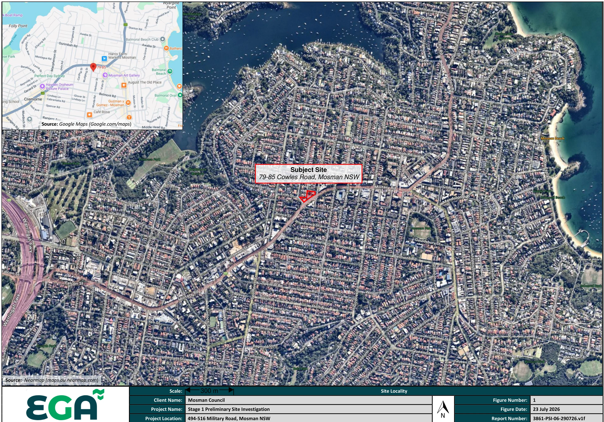

<!-- page 1093 -->

Scale: Site Layout Client Name: Figure Number: 2 Project Name: Stage 1 Preliminary Site Investigation Figure Date: 23 July 2026 Project Location: 79-85 Cowles Road, Mosman NSW Report Number: 3861-PSI-06-290726.v1f 494-516 Military Road, Mosman NSW

### LEGEND

Site Boundary

Source:  Nearmap (maps.au.nearmap.com) 15 m

August 2026

Attachment 1.1.10 Mosman Council

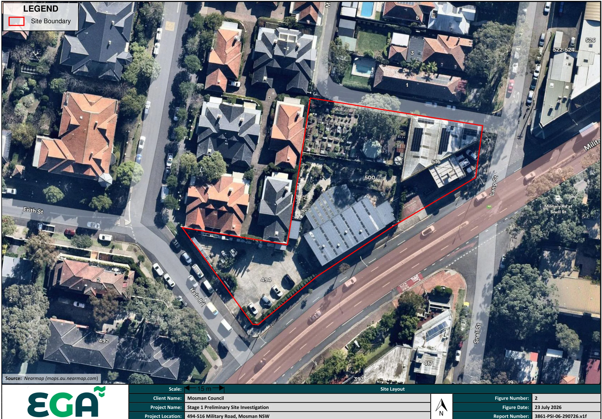

<!-- page 1094 -->

Scale: Site Layout Client Name: Figure Number: 3

Project Name: Stage 1 Preliminary Site Investigation Figure Date: 23 July 2026 Project Location: 79-85 Cowles Road, Mosman NSW Report Number: 3861-PSI-06-290726.v1f 494-516 Military Road, Mosman NSW

Source:  Nearmap (maps.au.nearmap.com) 15 m

### LEGEND

Site Boundary

AEC01 - Horticultural and Nursery Operations

AEC02 - Automotive Operations

AEC03 - Potential Uncontrolled Fill and Surface Soils (Entire Site)

AEC04 - On-Site Structures

August 2026

Attachment 1.1.10 Mosman Council

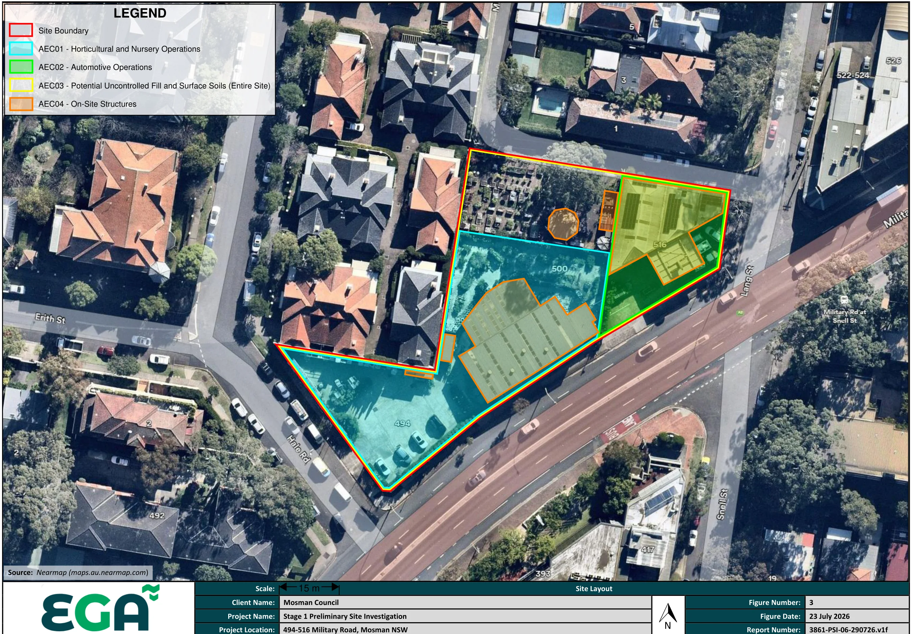

<!-- page 1095 -->

Desktop Phase 1 Environmental Site Assessment 494-516 Military Road, Mosman NSW 3861-PSI-06-290726.v2f

Page 26

#### APPENDIX A

#### GROUNDWATER BORE RECORDS

August 2026

Attachment 1.1.10 Mosman Council

<!-- page 1096 -->

home help contact customise State Overview State Overview Rivers and Streams favourites search download sites find a site Real Time Data - Rivers And Streams Daily River Reports Daily River Reports Dams favourites search download sites find a site Real Time Data - Major Dams Groundwater (Telemetered data) favourites search download sites find a site Real Time Data - Bores All Groundwater Site details search download sites find a site search by licence All Groundwater Map Meteorology favourites search download sites find a site Real Time Data - Weather Stations Hunter River Salinity Trading Scheme Hunter River Salinity Trading Scheme

bookmark this page All Groundwater Site Details ALL GROUNDWATER MAP All data times are Eastern Standard Time Map Info

There are 3 sites within 500 metres of the selected point. GW111483 GW111485 GW111484

+ −

contact WaterNSW

7/22/26, 3:47 PM Real-time water data

https://realtimedata.waternsw.com.au/water.stm 1/2

August 2026

Attachment 1.1.10 Mosman Council

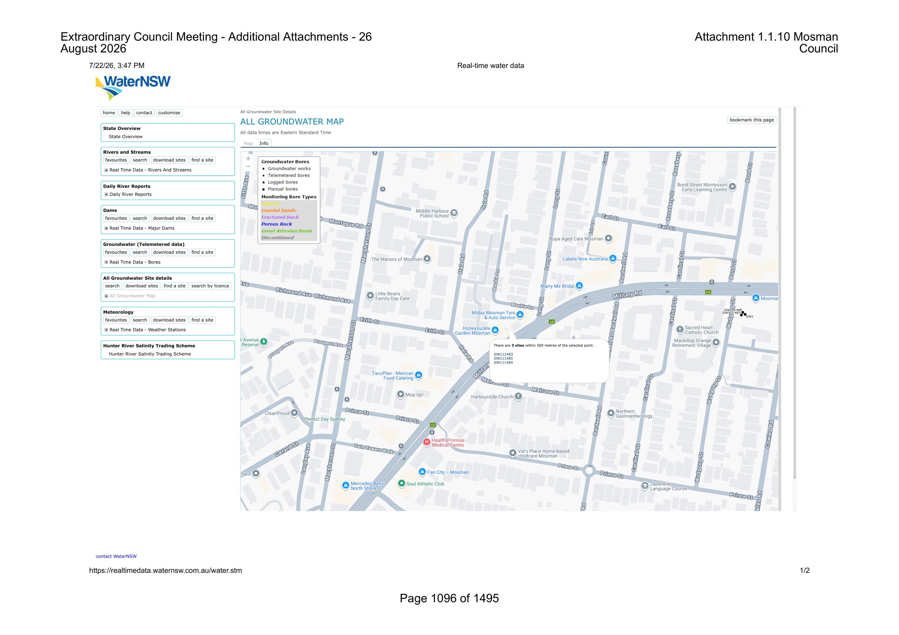

<!-- page 1097 -->

Desktop Phase 1 Environmental Site Assessment 494-516 Military Road, Mosman NSW 3861-PSI-06-290726.v2f

Page 27

#### APPENDIX B

#### NSW SEED MAP

August 2026

Attachment 1.1.10 Mosman Council

<!-- page 1098 -->

A NSW Government website

SEED Sharing and Enabling Environmental Data in NSW Search and download data Miners and Explorers map Browse by topic Case studies and insights Help and contact

How to use the SEED map Layers Legend Acid Sulfate Soil Risk Hm: High probability in bottom sediments H0: High probability at/near ground surface H0(s): High probability at/near ground surface with acidic scalds H1: High probability <1 m below ground surface H1(s): High probability <1 m below ground surface with acidic scalds H2: High probability 1 - 3 m below ground surface H2(p): High probability 1 - 3 m below ground surface in Pleistocene sediments H4: High probability >3 m below ground surface Lm: Low probability in bottom sediments L0: Low probability at/near ground surface L0(p): Low probability at/near ground surface on Pleistocene sediments L1: Low probability <1 m below ground surface L1(p): Low probability <1 m below ground surface in Pleistocene sediments L2: Low probability 1 - 3 m below ground surface L2(p): Low probability 1 - 3 m below ground surface in Pleistocene sediments L4: Low probability >3 m below ground surface L4(p): Low probability >3 m below ground surface on Pleistocene sediments N: No known occurrence N(p): No known occurrence in Pleistocene sediments NB: No known occurrence, Beach X0: Disturbed terrain, < 1 m below ground surface X1: Disturbed terrain, elevation 1 - 2 m AHD X1(p): Disturbed terrain, elevation 1 - 2m AHD in Pleistocene sediments X1(s): Disturbed terrain, elevation 1 - 2 m AHD with acidic scalds X2: Disturbed terrain, elevation 2 - 4 m AHD X2(p): Disturbed terrain, elevation 2 - 4 m AHD in Pleistocene sediments X2(s): Disturbed terrain, elevation 2 - 4 m AHD with acidic scalds X4: Disturbed terrain, elevation >4 m AHD X4(p): Disturbed terrain, elevation >4 m AHD in Pleistocene sediments Map data © OpenStreetMap contributors, Microsoft, Facebook, Inc. and its affiliates, Esri Community Maps contributors, Map layer by Esri Powered by Esri

Scale 11111 500 m X: 16834280.87 Y: -4004911.58 Projected Coordinates (X/Y)

#### 494 MILITARY ROAD MOSMAN 2088

Basemap

Draw/ Measure

Tools

Layer Intersect

Save Map

Contact Us Privacy Policy | More Info

7/22/26, 3:41 PM SEED Map

https://geo.seed.nsw.gov.au/vertigisstudio/web/?app=cabd04d595ec43c1aaf4298e80e83ec2 1/1

August 2026

Attachment 1.1.10 Mosman Council

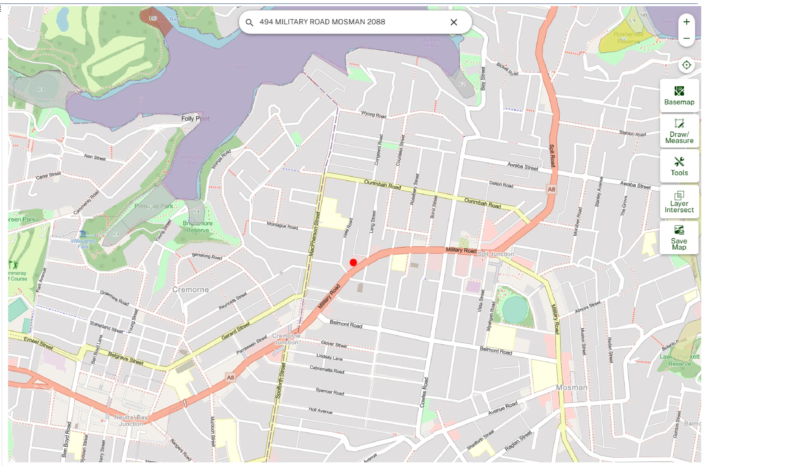

<!-- page 1099 -->

Desktop Phase 1 Environmental Site Assessment 494-516 Military Road, Mosman NSW 3861-PSI-06-290726.v2f

Page 28

#### APPENDIX C

#### HISTORICAL AERIAL IMAGERY

August 2026

Attachment 1.1.10 Mosman Council

<!-- page 1100 -->

Desktop Phase 1 Environmental Site Assessment 494-516 Military Road, Mosman NSW 3861-PSI-06-290726.v2f

Page 29

Historical Aerial 1. 1943 historical aerial imagery of the site. (Source: https://portal.spatial.nsw.gov.au/)

Historical Aerial 2. 1955 historical aerial imagery of the site. (Source: https://portal.spatial.nsw.gov.au/)

Historical Aerial 3. 1965 historical aerial imagery of the site. (Source: https://portal.spatial.nsw.gov.au/)

Historical Aerial 4. 1975 historical aerial imagery of the site. (Source: https://portal.spatial.nsw.gov.au/)

Historical Aerial 5. 1982 historical aerial imagery of the site. (Source: https://portal.spatial.nsw.gov.au/)

Historical Aerial 6. 1994 historical aerial imagery of the site. (Source: https://portal.spatial.nsw.gov.au/)

August 2026

Attachment 1.1.10 Mosman Council

<!-- page 1101 -->

Desktop Phase 1 Environmental Site Assessment 494-516 Military Road, Mosman NSW 3861-PSI-06-290726.v2f

Page 30

Historical Aerial 7. 2005 historical aerial imagery of the site. (Source: https://portal.spatial.nsw.gov.au/)

Historical Aerial 8. 2013 historical aerial imagery of the site. (Source: https://apps.nearmap.com/)

Historical Aerial 9. 2026 historical aerial imagery of the site. (Source: https://apps.nearmap.com/)

August 2026

Attachment 1.1.10 Mosman Council

<!-- page 1102 -->

Desktop Phase 1 Environmental Site Assessment 494-516 Military Road, Mosman NSW 3861-PSI-06-290726.v2f

Page 31

#### APPENDIX D

#### NSW EPA PUBLIC REGISTER

August 2026

Attachment 1.1.10 Mosman Council

<!-- page 1103 -->

Background

A strategy to systematically prioritise, assess and respond to notifications under Section 60 of the Contaminated Land Management Act 1997 (CLM Act) has been developed by the EPA. This strategy acknowledges the EPA’s obligations to make information available to the public under Government Information (Public Access) Act 2009 .

When a site is notified to the EPA, it may be accompanied by detailed site reports where the owner has been proactive in addressing the contamination and its source. However, often there is minimal information on the nature or extent of the contamination.

After receiving a report, the first step is to confirm that the report does not relate to a pollution incident. The Protection of the Environment Operations Act 1997 (POEO Act) deals with pollution incidents, waste stockpiling or dumping. The EPA also has an incident management process to manage significant incidents (https://www.epa.nsw.gov.au/reporting-and-incidents/incident- management).

In many cases, the information indicates the contamination is securely immobilised within the site, such as under a building or carpark, and is not currently causing any significant risks for the community or environment. Such sites may still need to be cleaned up, but this can be done in conjunction with any subsequent building or redevelopment of the land. These sites do not require intervention under the CLM Act, and are dealt with through the planning and development consent process. In these cases, the EPA informs the local council or other planning authority, so that the information can be recorded and considered at the appropriate time (https://www.epa.nsw.gov.au/your-environment/contaminated-land/managing-contaminated-land/role-of-planning-authorities).

Where indications are that the contamination could cause actual harm to the environment or an unacceptable offsite impact (i.e. the land is 'significantly contaminated'), the EPA would apply the regulatory provisions of the CLM Act to have the responsible polluter and/or landowner investigate and remediate the site. If the reported contamination could present an immediate or long-term threat to human health NSW Health will be consulted. SafeWork NSW and Water NSW can also be consulted if there appear to be occupational health and safety risks or an impact on groundwater quality.

As such, the sites notified to the EPA and presented in the list of contaminated sites notified to the EPA are at various stages of the assessment and remediation process. Understanding the nature of the underlying contamination, its implications and implementing a remediation program where required, can take a considerable period of time. The list provides an indication, in relation to each nominated site, as to the management status of that particular site. Further detailed information may be available from the EPA or the person who notified the site.

The following questions and answers may assist those interested in this issue.

Frequently asked questions

Why does my land appear on the list of notified sites?

Your land may appear on the list because:

• the site owner and/or the polluter has notified the EPA under section 60 of the CLM Act • the EPA has been notified via other means and is satisfied that the site is or was contaminated.

If a site is on the list, it does not necessarily mean the contamination is significant enough to regulate under the CLM Act.

List current as at 9 April 2026 1 of 139

August 2026

Attachment 1.1.10 Mosman Council

<!-- page 1104 -->

Does the list contain all contaminated sites in NSW?

No. The list only contains contaminated sites that EPA is aware of. If a site is not on the list, it does not necessarily mean the site is not contaminated.

The EPA relies on responsible parties and the public to notify contaminated sites.

How are notified contaminated sites managed by the EPA?

There are different ways the EPA can manage notified contaminated sites. Options include:

• regulation under the CLM Act, POEO Act, or both • notifying the relevant planning authority for management under the planning and development process • managing the site under the Protection of the Environment Operation (Underground Petroleum Storage Systems) Regulation 2014.

There are specific cases where contamination is managed under a tailored program operated by another agency (for example, the Resources & Geoscience's Legacy Mines Program).

What should I do if I am a potential buyer of a site that appears on the list?

You should seek advice from the seller to understand the contamination issue. You may need to seek independent contamination or legal advice.

The information provided in the list is indicative only and a starting point for your own assessment. Land contamination from past site uses is common, mainly in urban environments. If the site is properly remediated or managed, it may not affect the intended future use of the site.

Who can I contact if I need more information about a site?

You can contact the Environment Line at any time by calling 131 555 or by emailing info@environment.nsw.gov.au.

List of NSW Contaminated Sites Notified to the EPA

List current as at 9 April 2026 2 of 139

August 2026

Attachment 1.1.10 Mosman Council

<!-- page 1105 -->

Site Status

Under assessment

Under Preliminary Investigation Order

Regulation under CLM Act not required

Explanation

The contamination is being assessed by the EPA to determine whether regulation is required. The EPA may require further information to complete the assessment. For example, the completion of management actions regulated under the planning process or Protection of the Environment Operations Act 1997 .

The EPA has issued a Preliminary Investigation Order under s10 of the Contaminated Land Management Act 1997 , to obtain additional information needed to complete the assessment.

The EPA has completed an assessment of the contamination and decided that regulation under the Contaminated Land Management Act 1997 is not required.

Disclaimer

The EPA has taken all reasonable care to ensure that the information in the list of contaminated sites notified to the EPA (the list) is complete and correct. The EPA does not, however, warrant or represent that the list is free from errors or omissions or that it is exhaustive.

The EPA may, without notice, change any or all of the information in the list at any time.

You should obtain independent advice before you make any decision based on the information in the list.

The list is made available on the understanding that the EPA, its servants and agents, to the extent permitted by law, accept no responsibility for any damage, cost, loss or expense incurred by you as a result of:

1.            any information in the list; or 2.            any error, omission or misrepresentation in the list; or 3.            any malfunction or failure to function of the list; 4.            without limiting (2) or (3) above, any delay, failure or error in recording, displaying or updating information.

List current as at 9 April 2026 3 of 139

August 2026

Attachment 1.1.10 Mosman Council

<!-- page 1106 -->

Regulation being finalised

Contamination currently regulated under CLM Act

Contamination currently regulated under POEO Act

Contamination being managed via the planning process (EP&A Act)

Contamination formerly regulated under the CLM Act

Contamination formerly regulated under the POEO Act

The EPA has completed an assessment of the contamination and decided that the contamination is significant enough to warrant regulation under the Contaminated Land Management Act 1997 . A regulatory approach is being finalised.

The EPA has completed an assessment of the contamination and decided that the contamination is significant enough to warrant regulation under the Contaminated Land Management Act 1997 (CLM Act). Management of the contamination is regulated by the EPA under the CLM Act. Regulatory notices are available on the EPA’s Contaminated Land Public Record.

Contamination is currently regulated under the Protection of the Environment Operations Act 1997 (POEO Act).  The EPA as the appropriate regulatory authority reasonably suspects that a pollution incident is occurring/ has occurred and that it requires regulation under the POEO Act. The EPA may use environment protection notices, such as clean up notices, to require clean up action to be taken.  Such regulatory notices are available on the POEO public register.

The EPA has completed an assessment of the contamination and decided that the contamination is significant enough to warrant regulation. The contamination of this site is managed by the consent authority under the Environmental Planning and Assessment Act 1979 (EP&A Act) planning approval process, with EPA involvement as necessary to ensure significant contamination is adequately addressed. The consent authority is typically a local council or the Department of Planning and Environment.

The EPA has determined that the contamination is no longer significant enough to warrant regulation under the Contaminated Land Management Act 1997 (CLM Act). The contamination was addressed under the CLM Act.

The EPA has determined that the contamination is no longer significant enough to warrant regulation. The contamination was addressed under the Protection of the Environment Operations Act 1997 (POEO Act).

List current as at 9 April 2026 4 of 139

August 2026

Attachment 1.1.10 Mosman Council

<!-- page 1107 -->

Contamination was addressed via the planning process (EP&A Act)

Ongoing maintenance required to manage residual contamination (CLM Act)

The EPA has determined that ongoing maintenance, under the Contaminated Land Management Act 1997 (CLM Act), is required to manage the residual contamination. Regulatory notices under the CLM Act are available on the EPA’s Contaminated Land Public Record.

The EPA has determined that the contamination is no longer significant enough to warrant regulation. The contamination was addressed by the appropriate consent authority via the planning process under the Environmental Planning and Assessment Act 1979 (EP&A Act).

List current as at 9 April 2026 5 of 139

August 2026

Attachment 1.1.10 Mosman Council

<!-- page 1108 -->

Suburb SiteName Address ContaminationActivityType ManagementClass Latitude Longitude

MORPETH Telstra Cable Installation and RTA Bridge work Northumberland STREET Other Petroleum Regulation under CLM Act not required -32.72489729 151.6266795

MORPETH Former Service Station Swan  STREET Service Station Regulation under CLM Act not required -32.72477413 151.6250642

MORTLAKE Former Petroleum Storage Site 108-116 Tennyson ROAD Other Petroleum Regulation under CLM Act not required -33.83979033 151.1064889

MORTLAKE Kendall Bay Sediments Kendall BAY Gasworks Contamination currently regulated under CLM Act -33.83905999 151.1120458

MORTLAKE Former AGL site Tennyson  ROAD Gasworks Contamination formerly regulated under the CLM Act -33.84287407 151.1109313

MORTLAKE Majors Bay Redevelopment 14-22 Hilly STREET Other Industry Regulation under CLM Act not required -33.83954617 151.1054674

MORUYA Former Fuel Depot Moruya 11 to 13 Ford STREET Other Petroleum Regulation under CLM Act not required -35.9112243 150.0826475

MORUYA Caltex Service Station Moruya 80-84 Campbell STREET Service Station Regulation under CLM Act not required -35.91195596 150.0824213

MORUYA Ampol Fuel Depot - Moruya 26 Campbell STREET Service Station Regulation under CLM Act not required -35.9104985 150.0711419

MOSMAN 7-Eleven Mosman 162A Spit Road Corner Mitchell ROAD Service Station Regulation under CLM Act not required -33.81747016 151.2433633

MOSMAN BP Service Station 175 Ourimbah ROAD Service Station Regulation under CLM Act not required -33.82106757 151.233291

MOSMAN BP Express Mosman 175 Ourimbah  ROAD Service Station Regulation under CLM Act not required -33.82106459 151.2332921

MOSMAN 7-Eleven Service Station Mosman 45 Spit ROAD Service Station Regulation under CLM Act not required -33.82302718 151.2435627

MOSMAN Allan Border Oval Myahgah  ROAD Landfill Regulation under CLM Act not required -33.82681534 151.2417712

MOSMAN 173 Avenue Road, MOSMAN NSW 2088 173 Avenue ROAD Unclassified Regulation under CLM Act not required -33.930869 150.97132

List current as at 9 April 2026 85 of 139

August 2026

Attachment 1.1.10 Mosman Council

<!-- page 1109 -->

Suburb SiteName Address ContaminationActivityType ManagementClass Latitude Longitude

MOSS VALE Woolworths Service Station Moss Vale 609 Argyle  STREET Service Station Regulation under CLM Act not required -34.55409411 150.3609797

MOSS VALE Coles Express Service Station 579 Argyle STREET Service Station Regulation under CLM Act not required -34.55313422 150.364684

MOSS VALE Moss Vale Refuelling Facility Lackey ROAD Other Petroleum Regulation under CLM Act not required -34.54662421 150.3721525

MOUNT ANNAN Woolworths Caltex Mount Annan 157 Narellan (Corner Smeaton Grange Road) ROAD Service Station Regulation under CLM Act not required -34.04685527 150.7610434

MOUNT ANNAN Great Southern Railways Aqueduct Off Narellan  ROAD Unclassified Regulation under CLM Act not required -34.07308479 150.7707436

MOUNT COLAH Caltex Service Station Mount Colah 603 Pacific HIGHWAY Service Station Regulation under CLM Act not required -33.67034662 151.1151861

MOUNT COLAH Foxglove Oval Foxglove ROAD Landfill Contamination currently regulated under CLM Act -33.65829855 151.1229638

MOUNT DRUITT Caltex (former Mobil) Service Station, 17 Mount Street, Mount Druitt 17 Mount STREET Service Station Regulation under CLM Act not required -33.76567994 150.8244544

MOUNT DRUITT 7-Eleven Mount Druitt Lot 6 Luxford ROAD Other Petroleum Regulation under CLM Act not required -33.76483839 150.8254157

MOUNT HUTTON Woolworths Service Station 46 Wilsons ROAD Service Station Regulation under CLM Act not required -32.9836378 151.67309

MOUNT PRITCHARD 7-Eleven Service Station 352 Elizabeth DRIVE Service Station Regulation under CLM Act not required -33.90260656 150.8963326

MOUNT THORLEY Bulga Surface Operations Broke ROAD Other Industry Regulation under CLM Act not required -32.68325751 151.1206158

MOUNT THORLEY Lowes Petroleum (Former BP) Depot Mount Thorley 74 Mount Thorley ROAD Other Petroleum Regulation under CLM Act not required -32.62443074 151.1025122

MOUNT VICTORIA Former Mobil Service Station 81 Great Western HIGHWAY Service Station Regulation under CLM Act not required -33.5889727 150.2511783

MOUNT VICTORIA Caltex Service Station 36a Great Western HIGHWAY Service Station Regulation under CLM Act not required -33.58436517 150.2465528

List current as at 9 April 2026 86 of 139

August 2026

Attachment 1.1.10 Mosman Council

<!-- page 1110 -->

Search TIP To search for a specific site, search by LGA (local government area) and carefully review all sites listed. ... more search tips

Home Public registers Contaminated land record of notices Search results Your search for:Suburb: MOSMAN Search Again Refine Search did not find any records in our database. If a site does not appear on the record it may still be affected by contamination. For example: Contamination may be present but the site has not been regulated by the EPA under the Contaminated Land Management Act 1997 or the Environmentally Hazardous Chemicals Act 1985. The EPA may be regulating contamination at the site through a licence or notice under the Protection of the Environment Operations Act 1997 (POEO Act). Contamination at the site may be being managed under the planning process. More information about particular sites may be available from: The POEO public register The appropriate planning authority: for example, on a planning certificate issued by the local council under section 149 of the Environmental Planning and Assessment Act. See What's in the record and What's not in the record. If you want to know whether a specific site has been the subject of notices issued by the EPA under the CLM Act, we suggest that you search by Local Government Area only and carefully review the sites that are listed. This public record provides information about sites regulated by the EPA under the Contaminated Land Management Act 1997, including sites currently and previously regulated under the Environmentally Hazardous Chemicals Act 1985. Your inquiry using the above search criteria has not matched any record of current or former regulation. You should consider searching again using different criteria. The fact that a site does not appear on the record does not necessarily mean that it is not affected by contamination. The site may have been notified to the EPA but not yet assessed, or contamination may be present but the site is not yet being regulated by the EPA. Further information about particular sites may be available from the appropriate planning authority, for example, on a planning certificate issued by the local council under section 149 of the Environmental Planning and Assessment Act. In addition the EPA may be regulating contamination at the site through a licence under the Protection of the Environment Operations Act 1997. You may wish to search the POEO public register.POEO public register 13 July 2026

7/13/26, 12:13 PM DECCW | Search results

https://app.epa.nsw.gov.au/prclmapp/searchresults.aspx?&LGA=&Suburb=MOSMAN&Notice=&Name=&Text=&DateFrom=&DateTo= 1/1

August 2026

Attachment 1.1.10 Mosman Council

<!-- page 1111 -->

Home Public registers POEO Public Register Licences, applications and notices search Search results

Your search for: General Search with the following criteria Suburb - mosman returned 26 results Export to excel 2 of 2 Pages Search Again Number Name Location Type Status Issued date 1522383 TARONGA CONSERVATION SOCIETY AUSTRALIA BRADLEYS HEAD ROAD, MOSMAN, NSW 2088

s.58 Licence Variation Issued Issued 09 Jul 2015

1600361 TARONGA CONSERVATION SOCIETY AUSTRALIA BRADLEYS HEAD ROAD, MOSMAN, NSW 2088

Compliance Audit Complete Complete 14 Sep 2020

1603655 TARONGA CONSERVATION SOCIETY AUSTRALIA BRADLEYS HEAD ROAD, MOSMAN, NSW 2088

s.58 Licence Variation Issued Issued 08 Apr 2021

1615336 TARONGA CONSERVATION SOCIETY AUSTRALIA BRADLEYS HEAD ROAD, MOSMAN, NSW 2088

s.58 Licence Variation Issued Issued 23 Dec 2021

1623058 TARONGA CONSERVATION SOCIETY AUSTRALIA BRADLEYS HEAD ROAD, MOSMAN, NSW 2088

s.58 Licence Variation Issued Issued 30 Nov 2022

1630287 TARONGA CONSERVATION SOCIETY AUSTRALIA BRADLEYS HEAD ROAD, MOSMAN, NSW 2088

s.58 Licence Variation Issued Issued 03 Oct 2023

12 13 July 2026

7/13/26, 12:14 PM Environment & Heritage | PRPOEO

https://app.epa.nsw.gov.au/prpoeoapp/SearchResult.aspx?SearchTag=all&searchrange=general&range=general&SortExpression=AccountablePa… 1/1

August 2026

Attachment 1.1.10 Mosman Council

<!-- page 1112 -->

Home Public registers POEO Public Register Licences, applications and notices search Search results

Your search for: General Search with the following criteria Suburb - mosman returned 26 results Export to excel 1 of 2 Pages Search Again Number Name Location Type Status Issued date 1621649 THE SPIT, MOSMAN, NSW 2088 s.58 Licence Variation Issued Issued 08 Feb 2023 1028480 ARDENT LEISURE LIMITED  THE SPIT, MOSMAN, NSW 2088 s.58 Licence Variation Issued Issued 03 Jul 2003 1032563 ARDENT LEISURE LIMITED  THE SPIT, MOSMAN, NSW 2088 s.58 Licence Variation Issued Issued 20 Nov 2003 1069448 ARDENT LEISURE LIMITED  THE SPIT, MOSMAN, NSW 2088 s.58 Licence Variation Issued Issued 05 Feb 2007 1070978 ARDENT LEISURE LIMITED  THE SPIT, MOSMAN, NSW 2088 s.58 Licence Variation Issued Issued 14 Mar 2007 1072567 ARDENT LEISURE LIMITED  THE SPIT, MOSMAN, NSW 2088 s.58 Licence Variation Issued Issued 24 Apr 2007 1074550 ARDENT LEISURE LIMITED  THE SPIT, MOSMAN, NSW 2088 s.58 Licence Variation Issued Issued 13 Jun 2007 1078238 ARDENT LEISURE LIMITED  THE SPIT, MOSMAN, NSW 2088 s.58 Licence Variation Issued Issued 19 Sep 2007 1085886 ARDENT LEISURE LIMITED  THE SPIT, MOSMAN, NSW 2088 s.58 Licence Variation Issued Issued 12 May 2008 1097027 ARDENT LEISURE LIMITED  THE SPIT, MOSMAN, NSW 2088 s.58 Licence Variation Issued Issued 30 Jan 2009 1509253 ARDENT LEISURE LIMITED  THE SPIT, MOSMAN, NSW 2088 s.58 Licence Variation Issued Issued 24 Jun 2013 11724 HEALTHSCOPE OPERATIONS PTY LTD

#### 1 ELLAMATTA AVENUE,

MOSMAN, NSW 2088 POEO licence No longer in force No longer in force

16 Sep 2002

1048188 HEALTHSCOPE OPERATIONS PTY LTD

#### 1 ELLAMATTA AVENUE,

MOSMAN, NSW 2088 s.58 Licence Variation Issued Issued 27 May 2005 11211 MA MARINA FUND OPCO NO. 1 PTY LTD THE SPIT, MOSMAN, NSW 2088 POEO licence Issued Issued 30 Jan 2001 3514873 MA MARINA FUND OPCO NO. 1 PTY LTD THE SPIT, MOSMAN, NSW 2088 s.91 Clean Up Notice Issued Issued 10 Jan 2026 1596267 NONBANK MORTGAGES PTY. LTD. THE SPIT, MOSMAN, NSW 2088 s.58 Licence Variation Issued Issued 29 Jun 2021 1008406 OMNI LEISURE OPERATIONS LIMITED THE SPIT, MOSMAN, NSW 2088 s.58 Licence Variation Issued Issued 13 Jun 2001 1018813 OMNI LEISURE OPERATIONS LIMITED THE SPIT, MOSMAN, NSW 2088 s.58 Licence Variation Issued Issued 06 Sep 2002 1677 TARONGA CONSERVATION SOCIETY AUSTRALIA BRADLEYS HEAD ROAD, MOSMAN, NSW 2088

POEO licence Issued Issued 26 Sep 2000

1512309 TARONGA CONSERVATION SOCIETY AUSTRALIA BRADLEYS HEAD ROAD, MOSMAN, NSW 2088

Compliance Audit Complete Complete 21 Feb 2013

12 13 July 2026

7/13/26, 12:14 PM Environment & Heritage | PRPOEO

https://app.epa.nsw.gov.au/prpoeoapp/SearchResult.aspx?SearchTag=all&searchrange=general&range=general&SortExpression=AccountablePa… 1/1

August 2026

Attachment 1.1.10 Mosman Council

<!-- page 1113 -->

## Desktop Phase 1 Environmental Site

## Assessment

418-426 Military Road, Mosman NSW

Report No: Report Date:

3861-PSI-07-290726.v2f 03/08/2026

info@egau.com.au

NSW: 36E Fitzroy Street, Marrickville, NSW 2204 VIC: 88 Langridge St, Collingwood VIC 3066

August 2026

Attachment 1.1.10 Mosman Council

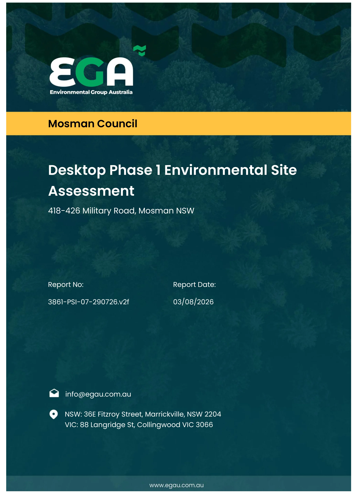

<!-- page 1114 -->

Desktop Phase 1 Environmental Site Assessment 418-426 Military Road, Mosman NSW 3861-PSI-07-290726.v2f

Page 1

### Document Record

Revision Date Author Reviewer

v1f 29 July 2026 Rachelle Conna Isabelle Figatowski

v2f 3 August 2026 Rachelle Conna Isabelle Figatowski

Author Signature Reviewer Signature

Name Rachelle Conna Name Isabelle Figatowski

Credentials B. Sc. (Zoology) Credentials B.Sc. (Env. Consulting)

Title Environmental Consultant Title Senior Environmental Consultant

Document Title: Desktop Phase 1 Environmental Site Assessment - 418-426 Military Road, Mosman NSW Site Address: 418-426 Military Road, Mosman NSW Client Name: Site Size: ≈ 1,800 m2 Reference Number: 3861-PSI-07-290726.v2f Project Type: Desktop Phase 1 Environmental Site Assessment Project Type Abbreviation: PSI Document Draft: FINAL Document Revision No. v2f

Prepared by Environmental Group Australia Pty Ltd ABN: 83 671 599 143

August 2026

Attachment 1.1.10 Mosman Council

<!-- page 1115 -->

Desktop Phase 1 Environmental Site Assessment 418-426 Military Road, Mosman NSW 3861-PSI-07-290726.v2f

Page 2

### EXECUTIVE SUMMARY

Environmental Group Australia Pty Ltd (EGA) was engaged by Mosman Council (hereafter referred to as ‘the client’), to undertake a Desktop Phase 1 Environmental Site Assessment of the property located within Lot 1 DP110624 and Lot 1 DP879984, 418-426 Military Road, Mosman NSW (hereafter referred to as ‘the site’) (refer to Figure 1 and Figure 2).

The client is preparing to lodge a planning proposal to implement the draft Mosman Masterplan, which proposes increased housing capacity across the study area, including amendments to the planning controls at the site to facilitate redevelopment.

#### Purpose and Objectives

A Desktop Phase 1 Environmental Site Assessment was required to assess the likelihood that the site had been contaminated by past or present activities and to form a preliminary view on the extent and degree of contamination. The objectives of the investigation were to:

• Provide advice on whether the site may require a stage 2 intrusive site assessment, to better define the nature and extent of potential contamination within the site; and • Provide advice on whether the site would be suitable (in the context of land contamination) for any proposed future rezoning.

#### Site Description

• The site covers an area of approximately 1,800 m2; • The site is currently zoned as E1: Local Centre; • The site is currently utilised as a car sales and parts yard (Mercedes-Benz North Shore); • The site is located within a mixed commercial-industrial and residential district.

Current aerial imagery suggests that the site is operating as a car sales and parts yard, with one large structure covering entirety the site.

#### Proposed Development

Reference is made to the draft Mosman Masterplan Structure Plan prepared by SJB Architecture, dated 29 July 2026 (Drawing No. 06, Revision 07). EGA understands that the site has been identified for increased development potential, however, have not been provided with any specific redevelopment plans. EGA has made the assumption that future development may include the demolition of current structures, rezoning of land, subdivision of land, and construction of new structures and infrastructure. EGA has not been made aware of any basement plans and have presumed that they are proposed as part of the future development.

#### Scope of Work

EGA undertook the following scope of works to address the project objectives:

• A desktop review of relevant information pertaining to the site; and • Assessment and reporting of the desktop review.

#### Investigation Outcome

Based on EGA’s assessment of the desktop review information, in the context of the proposed redevelopment scenario, EGA has made the following conclusions:

• The search of historical aerial imagery indicated a moderate potential for contamination within the site to have occurred, associated with uncontrolled demolition and potential site filling

August 2026

Attachment 1.1.10 Mosman Council

<!-- page 1116 -->

Desktop Phase 1 Environmental Site Assessment 418-426 Military Road, Mosman NSW 3861-PSI-07-290726.v2f

Page 3

beneath slabs. EGA also notes that the building fabrics may contain hazardous building materials; • A review of publicly available contaminated land databases indicated that the site is not the subject of any licences, applications, notices under Section 308 of the Protection of the Environment Operations Act 1997. The site is not notified under Section 60 of the Contaminated Land Management Act 1997. The site is not the subject of any notifications under Section 58 of the Contaminated Land Management Act 1997; • The contaminants and areas of environmental concern (AEC), requiring further consideration or assessment, and possibly remediation or risk management, are the following: o AEC-1: Potential Chemical Storage – Leaks, Spills or Poor Management; o AEC-2: Wastewater Treatment and Drainage Infrastructure – Structural Failure or Leakage; o AEC-3: Potential Contaminants within Soils; and o AEC-4: On-Site Structures – Hazardous Building Materials; • Soils not impacted by contamination may meet excavated natural material (ENM) or General Solid Waste (GSW) classification.

#### Conclusions and Recommendations

Notwithstanding the above, the potential contaminants of concern and affected environmental media are consistent with those typically encountered on brownfield redevelopment sites within the Sydney Basin. Any contamination that may be present is not expected to be of such an extent or complexity that it could not be effectively managed or remediated using conventional and readily available remediation techniques. Accordingly, the potential for contamination at the site is not considered to preclude proposed future redevelopment.

As detailed development plans are prepared for individual areas of the site, the existing environmental data should be reviewed in conjunction with the overall remedial strategy to confirm the nature and extent of any contamination relevant to the proposed works. Where required, additional assessment should be undertaken, and appropriate remediation and/or management measures developed, to demonstrate that the relevant portion of the site is, or can be made, suitable for its intended use.

This report, including its conclusions and recommendations, must be read in conjunction with the limitations presented in Section 12.

August 2026

Attachment 1.1.10 Mosman Council

<!-- page 1117 -->

Desktop Phase 1 Environmental Site Assessment 418-426 Military Road, Mosman NSW 3861-PSI-07-290726.v2f

Page 4

#### TABLE OF CONTENTS

#### 1.

#### INTRODUCTION

#### 7

1.1. Purpose and Objectives ............................................................................................................... 7 1.2. Site Description ............................................................................................................................. 7 1.3. Proposed Development ................................................................................................................ 7 1.4. Scope of Work .............................................................................................................................. 7

#### 2.

#### SITE IDENTIFICATION

#### 8

#### 3.

#### PHYSICAL SITE CONDITIONS

#### 9

#### 4.

#### SITE HISTORY AND LAND USE

#### 11

4.1. Aerial Imagery ............................................................................................................................ 11 4.2. Anecdotal Information ............................................................................................................... 11 4.3. Incident and Complaints History ............................................................................................... 11 4.4. Previous Contamination Assessments ...................................................................................... 11

#### 5.

#### REGULATORY RECORDS

#### 12

5.1. NSW EPA CLM Act Register of Notified Sites and Notices ....................................................... 12 5.2. NSW EPA POEO Act Register of Licences, Applications and Notices ...................................... 12 5.3. Dangerous Goods Licences Search ............................................................................................ 12

#### 6.

#### INFORMATION SOURCES

#### 13

#### 7.

#### CONCEPTUAL SITE MODEL

#### 14

7.1. Potential Areas of Environmental Concern ............................................................................... 14 7.2. Contaminants, Migration Pathways, Receptors and Risks ...................................................... 14 7.3. Site Characteristics Affecting Risks ........................................................................................... 15 7.3.1. Land-Use Setting................................................................................................................ 15 7.3.2. Surface Water ..................................................................................................................... 15 7.3.3. Groundwater – Drinking Water Risks ................................................................................ 16 7.3.4. Recreational Water Use and Aquatic Ecosystems ............................................................ 16 7.3.5. Terrestrial Ecosystems ....................................................................................................... 16 7.3.6. Human Exposures to Site Contaminants ........................................................................... 16

#### 8.

#### RISK ASSESSMENT (PLANNING LEVEL)

#### 17

#### 9.

#### PLANNING AND MASTER PLAN ADVICE

#### 18

9.1. Suitability for Future Development ............................................................................................ 18 9.2. Identification of Potential Issues ............................................................................................... 18 9.3. Requirements for the Development Application (DA) Stage ................................................... 18 9.4. Suggestion Inclusion to Master Planning .................................................................................. 18

#### 10. CONTAMINANTS OF CONCERN

#### 20

#### 11. CONCLUSIONS AND RECOMMENDATIONS

#### 21

11.1. Site Condition and Further Requirements ................................................................................. 21 11.2. Recommendations ...................................................................................................................... 21

#### 12. STATEMENT OF LIMITATIONS

#### 22

August 2026

Attachment 1.1.10 Mosman Council

<!-- page 1118 -->

Desktop Phase 1 Environmental Site Assessment 418-426 Military Road, Mosman NSW 3861-PSI-07-290726.v2f

Page 5

#### 13. REFERENCES

#### 23

FIGURES Figure 1 - Site Locality Figure 2 - Site Layout Figure 3 - Areas of Environmental Concern

APPENDICES A - Groundwater Bore Records B - NSW SEED Map C - Historical Aerial Imagery D - NSW EPA Public Register

August 2026

Attachment 1.1.10 Mosman Council

<!-- page 1119 -->

Desktop Phase 1 Environmental Site Assessment 418-426 Military Road, Mosman NSW 3861-PSI-07-290726.v2f

Page 6

### LIST OF ABBREVIATIONS

AHD Australian Height Datum AEC Area of Environmental Concern ANZECC Australian and New Zealand Environment and Conservation Council AST Aboveground storage tank Bgl Below ground level BTEX Benzene, toluene, ethylbenzene, xylene CoC Chain of Custody CSM Conceptual Site Model EIL Ecological Investigation Level EGA Environmental Group Australia Pty Ltd EPA Environment Protection Authority HIL Health Investigation Levels HSL Health Screening Levels LOR [Laboratory] Limit of Reporting NATA National Association of Testing Laboratories NA Not applicable ND Not detected NEPC National Environment Protection Council NEPM National Environment Protection Measure NSW EPA NSW Environment Protection Authority OCP Organochlorine Pesticide PAEC Potential Area of Environmental Concern PAH Polycyclic aromatic hydrocarbon PCB Polychlorinated biphenyl PID Photo-ionisation detector PSI Preliminary Site Investigation QA/QC Quality assurance/Quality control RPD Relative percentage difference SAQP Sampling Analysis and Quality Plan SVOC Semi-volatile organic compound USCS Unified Soil Classification System UST Underground storage tank VOC Volatile organic compound

August 2026

Attachment 1.1.10 Mosman Council

<!-- page 1120 -->

Desktop Phase 1 Environmental Site Assessment 418-426 Military Road, Mosman NSW 3861-PSI-07-290726.v2f

Page 7

#### 1. INTRODUCTION

Environmental Group Australia Pty Ltd (EGA) was engaged by Mosman Council (hereafter referred to as ‘the client’), to undertake Stage 1 Preliminary Site Investigation of the property located within Lot 1 DP110624 and Lot 1 DP879984, 418-426 Military Road, Mosman NSW (hereafter referred to as ‘the site’) (refer to Figure 1 and Figure 2).

The client is preparing to lodge a planning proposal to implement the draft Mosman Masterplan, which proposes increased housing capacity across the study area, including amendments to the planning controls at the site to facilitate redevelopment.

#### 1.1.

#### Purpose and Objectives

A Desktop Phase 1 Environmental Site Assessment was required to assess the likelihood that the site had been contaminated by past or present activities and to form a preliminary view on the extent and degree of contamination. The objectives of the investigation were to:

• Provide advice on whether the site may require a stage 2 intrusive site assessment, to better define the nature and extent of potential contamination within the site; and • Provide advice on whether the site would be suitable (in the context of land contamination) for any proposed future rezoning.

#### 1.2.

#### Site Description

• The site covers an area of approximately 1,800 m2; • The site is currently zoned as E1: Local Centre; • The site is currently utilised as a car sales and parts yard (Mercedes-Benz North Shore); • The site is located within a mixed commercial-industrial and residential district.

Current aerial imagery suggests that the site is operating as a car sales and parts yard, with one large structure covering entirety the site.

#### 1.3.

#### Proposed Development

Reference is made to the draft Mosman Masterplan Structure Plan prepared by SJB Architecture, dated 29 July 2026 (Drawing No. 06, Revision 07). EGA understands that the site has been identified for increased development potential, however, have not been provided with any specific redevelopment plans. EGA has made the assumption that future development may include the demolition of current structures, rezoning of land, subdivision of land, and construction of new structures and infrastructure. EGA has not been made aware of any basement plans and have presumed that they are proposed as part of the future development.

#### 1.4.

#### Scope of Work

EGA undertook the following scope of works to address the project objectives:

• A desktop review of relevant information pertaining to the site; and • Assessment and reporting of the desktop review.

August 2026

Attachment 1.1.10 Mosman Council

<!-- page 1121 -->

Desktop Phase 1 Environmental Site Assessment 418-426 Military Road, Mosman NSW 3861-PSI-07-290726.v2f

Page 8

#### 2. SITE IDENTIFICATION

The site identification details and associated information are presented in Table 2.1.

Table 2.1 Site Identification Information Attribute Description

Street Address 418-426 Military Road, Mosman NSW

Lot and Deposited Plan (DP) Lot 1 DP110624 Lot 1 DP879984

Current Owner

Geographical Coordinates 33°49'37.6"S 151°13'52.8"E (approximate centre of site)

Site Area ≈ 1,800 m2

Local Government Area (LGA) Mosman Municipal Council

Parish Willoughby

County Cumberland

Zoning E1: Local Centre Mosman Local Environmental Plan 2012 (2011 EPI 647)

The locality of the site is identified in Figure 1.

The general layout and boundary of the site are shown in Figure 2.

August 2026

Attachment 1.1.10 Mosman Council

<!-- page 1122 -->

Desktop Phase 1 Environmental Site Assessment 418-426 Military Road, Mosman NSW 3861-PSI-07-290726.v2f

Page 9

#### 3. PHYSICAL SITE CONDITIONS

Regional geology, topography, soil landscape and hydrogeological information are presented in Table 3.1.

Table 3.1 Regional Setting Information Attribute Description

Geology

A review of the Environment NSW ‘eSpade V2.2’ web application (environment.nsw.gov.au/eSpade2WebApp, accessed 21 July 2026), indicated that the site is likely to be underlain by Hawkesbury Sandstone, which is a medium to coarse-grained quartz sandstone with minor shale and laminite lenses.

Soil Profiles

A review of the Environment NSW ‘eSpade V2.2’ web application (environment.nsw.gov.au/eSpade2WebApp, accessed 21 July 2026), indicated that the site is likely to contain: • gy1 (Topsoil): Loose, acidic, water-repellent coarse sandy loam, high permeability, low water capacity. • gy2 (Subsoil/Sandstone): Earthy, hard setting yellowish-brown clayey sand, low water capacity. • gy3 (Subsoil/Sandstone): Earthy/weakly pedal sandy clay loam, low permeability and wet strength. • gy4 (Subsoil/Shale): Highly pedal, highly erodible yellowish-brown clay, low permeability and wet strength. • Associated: Surface leaf litter (up to 10 cm) and loose quartz sand wash.

Terrain and Structure

A review of the Environment NSW ‘eSpade V2.2’ web application (environment.nsw.gov.au/eSpade2WebApp, accessed 21 July 2026), indicated that the site is likely to comprise: • Crests (<50 cm deep): Gradual transition of gy1 over bedrock, gy2, or occasionally gy3. Hard setting layers or bedrock expose when eroded. • Side slopes (30–70 cm deep): Discontinuous soils with up to 25% rock outcrop. gy1 overlies bedrock or gy2/gy3 on benches. • Shale Lenses (<100 cm deep): Sharp transition from gy1 to deep gy4 clay on inner benches. • Drainage Lines (<100 cm deep): Deep gy1 directly over bedrock.

Acid Sulfate Soils

A review of the NSW Government SEED web application (geo.seed.nsw.gov.au, accessed 21 July 2026), indicates that the site lies in an area mapped as ‘No Known Occurrence’ with respect to acid sulfate soils. This infers that land management activities are not likely to be affected by acid sulfate soils. Further assessment of acid sulfate soils in the context of this investigation is considered by EGA as not warranted.

Topography

Generally, the local landscape consists of undulating to rolling low hills with local relief 20–80 m and slopes of 10–25%. Sideslopes with narrow to wide outcropping sandstone rock benches (10–100 m), often forming broken scarps of <5 m. The site is located at an elevation approximately 84 m Australian Height Datum (AHD) and generally flat.

Hydrology and Hydrogeology

Surface water courses proximal to the site include Willoughby Creek located approximately 730 m to the northwest of the site, Quakers Hat Bay located approximately 1.32 km to the northeast and Mosman Bay located approximately 1.03 km to the south of the site. Based on the site topography and distances to the nearest surface water course, groundwater flow in the vicinity of the site is considered likely to be towards the northwest. A review of the NSW Office of Water groundwater database undertaken on 21 July 2026 indicated no registered groundwater features located within 500 m of the site.

August 2026

Attachment 1.1.10 Mosman Council

<!-- page 1123 -->

Desktop Phase 1 Environmental Site Assessment 418-426 Military Road, Mosman NSW 3861-PSI-07-290726.v2f

Page 10

Attribute Description

Adjacent Sensitive Receptors

The closest ecological receptors to the site include vegetated areas within the site / neighbouring properties and the closest receiving watercourses as outlined above. A review of the Bureau of Meteorology (BoM) Groundwater Dependent Ecosystem (GDE) Atlas Map was undertaken on 21 July 2026 to determine the closest sensitive ecological receptors. The closest sensitive receptor to the site included Manly Lagoon, located approximately 6.62 km to the northeast of the site and noted as a high potential groundwater dependent ecosystem. The closest sensitive human receptors are the residential properties surrounding the site’s boundary and any future onsite construction workers/builders.

Perfluoroalkyl Substances (PFAS)

A review of the publicly available NSW Government PFAS Investigation Program mapping information was reviewed 16 July 2026. The review was undertaken to identify any investigation localities that may affect the site. The site is not considered to be affected by any PFAS investigation programs.

Unexploded Ordnance (UXO)

A review of the publicly available Unexploded Ordnance (UXO) mapping information was reviewed 16 July 2026. The review was undertaken to identify any recorded UXO-related constraints or risks applicable to the site and its surrounding area at the time of reporting. The site is not considered to be affected by UXO.

A copy of the NSW Office of Water search record is presented in Appendix A.

A copy of the NSW SEED search record is presented in Appendix B

August 2026

Attachment 1.1.10 Mosman Council

<!-- page 1124 -->

Desktop Phase 1 Environmental Site Assessment 418-426 Military Road, Mosman NSW 3861-PSI-07-290726.v2f

Page 11

#### 4. SITE HISTORY AND LAND USE

#### 4.1.

#### Aerial Imagery

A review of selected historical aerial imagery was undertaken. Observations made of the imagery considered relevant to this investigation are presented in Table 4.1. A copy of the historical aerials is presented in Appendix C.

Table 4.1 Aerial Imagery Observations Image Date Site Features Surrounding Land Use Settings

1943 The site is observed to comprise seven commercial warehouse structures.

Observations include mixed land-use of low- density residential and commercial across the wider area and ‘Military Road’ along the eastern site boundary and ‘Macpherson Street’ along the western site boundary. 1955 No significant changes observed. No significant changes observed. 1965 No significant changes observed. No significant changes observed.

1971 No significant changes observed.

Observations include demolition of existing structures to the north and east, construction of high-density residential structures to the north and construction of commercial structures to the east.

1986 No significant changes observed.

Further demolition of existing structures and construction of high-density residential and commercial structures across the wider area observed.

1994 No significant changes observed. Demolition of existing structures and commercial development to east observed

2005

Observations include the demolition of existing structures and construction of one large commercial structure for use as Mercedes-Benz North Shore.

Demolition of existing structures and high-density residential development to the north and south observed.

2013 No significant changes observed. Demolition of existing structures and low-density residential development to the west observed. 2026 No significant changes observed. No significant changes observed.

The aerial imagery indicated a moderate potential for land contaminating activities to have occurred on the site including uncontrolled demolition and historical asbestos and pesticide application beneath slabs. Based on these possibilities, a Stage 2 Intrusive Assessment is recommended, should any works be proposed below the hardstand layer on-site. EGA also notes that on-site structures may contain hazardous building materials, and a hazardous building material survey (HBMS) is recommended prior to any demolition of on-site structures.

#### 4.2.

#### Anecdotal Information

EGA has not been advised of any anecdotal information by the client.

#### 4.3.

#### Incident and Complaints History

There were no incident reports or complaints history provided to EGA as part of this project.

#### 4.4.

#### Previous Contamination Assessments

EGA was not provided with, nor is EGA aware of any existing reports or environmental assessments pertaining to the site.

August 2026

Attachment 1.1.10 Mosman Council

<!-- page 1125 -->

Desktop Phase 1 Environmental Site Assessment 418-426 Military Road, Mosman NSW 3861-PSI-07-290726.v2f

Page 12

#### 5. REGULATORY RECORDS

#### 5.1.

#### NSW EPA CLM Act Register of Notified Sites and Notices

The search of the Public Register (the Contaminated Land Public Record) undertaken on 13 July 2026, indicated that the site was not the subject of any Notices recorded under Section 58 of the Contaminated Land Management Act 1997.  The site has not been declared ‘significantly contaminated’.

A search of the list of contaminated sites notified to the EPA, did not identify the site as having been notified to the EPA under Section 60 of the CLM Act.

Six localities within the suburb of Mosman were also listed on the register, those being:

• 7-Eleven Mosman, 162A Spit Road Corner Mitchell Road (Service Station) – located approximately 920 m northeast of the site. No further regulation of this locality is required under the CLM Act; • BP Service Station & BP Express Mosman, 175 Ourimbah Road (Service Station) – located approximately 606 m northwest of the site. No further regulation of this locality is required under the CLM Act; • 7-Eleven Service Station Mosman, 45 Spit Road (Service Station) – located approximately 516 m northeast of the site. No further regulation of this locality is required under the CLM Act; • Allan Border Oval, Myahgah Road (Landfill) – located approximately 271 m southeast of the site. No further regulation of this locality is required under the CLM Act; and • 173 Avenue Road (Unclassified) – located approximately 773 m southeast of the site. No further regulation of this locality is required under the CLM Act.

As none of the localities are located within the immediate vicinity of the site, nor do they require management under the CLM Act, they are not considered to pose a contamination risk to the site.

A copy of the CLM Act Record of Notices search records is presented in Appendix D.

#### 5.2.

#### NSW EPA POEO Act Register of Licences, Applications and Notices

A search of the publicly available online NSW EPA Record of Notices issued under Section 308 of the Protection of the Environment Operations Act 1997 was completed on 13 July 2026. The results indicated that the site was not the subject of any licences, applications, notices, audits or pollution studies or reduction programs.

A copy of the POEO Act Register of Licences, Applications and Notices search record is presented in Appendix D.

#### 5.3.

#### Dangerous Goods Licences Search

A search of the register was not considered warranted due to the client scope for this report. A Dangerous Goods Licences Search is to be conducted if intrusive works are proposed for the site, due to the current site use as a petrol station.

August 2026

Attachment 1.1.10 Mosman Council

<!-- page 1126 -->

Desktop Phase 1 Environmental Site Assessment 418-426 Military Road, Mosman NSW 3861-PSI-07-290726.v2f

Page 13

#### 6. INFORMATION SOURCES

EGA has accessed information about the site from the following organisations.  Some of the information has been used as input to EGA’s considerations regarding land contamination risks at the site.

• Australian Soil Resource Information System; • Department of Land and Water Conservation; • Department of Minerals and Energy; • Department of Primary Industries – Water; • Local Council Resources; • Google Earth; • National Environment Protection Council; • Nearmap Pty Ltd; • NSW Environment Protection Authority; • NSW Land and Property Information; and • Water NSW.

August 2026

Attachment 1.1.10 Mosman Council

<!-- page 1127 -->

Desktop Phase 1 Environmental Site Assessment 418-426 Military Road, Mosman NSW 3861-PSI-07-290726.v2f

Page 14

#### 7. CONCEPTUAL SITE MODEL

The conceptual site model (CSM) identifies and describes contaminants of concern, and the areas and mediums in which they are present (the AECs), which may cause a risk to human health or the environment.  The CSM specifies the potential receptors of the risks and the exposure pathways by which the receptors may be impacted.  The potential risks listed in the CSM are those that may exist prior to any contaminant remediation or management measures and are based on information gained from the preliminary site investigation (PSI).

#### 7.1.

#### Potential Areas of Environmental Concern

The site history data collected, and site inspection observations, were assessed within the objectives of this investigation and in the context of the past and current land-use. The identified areas of environmental concern (AEC) and contaminants of concern (COC) which have the potential to be present on site are presented in Table 7.1 below.

Table 7.1 Areas of Environmental Concern (AEC) and Contaminants of Concern

AEC Areas of Environmental Concern and Contaminating Activity Resulting Risks Contaminants of Potential Concern

AEC-1 Potential Chemical Storage – Leaks, Spills or Poor Management

Potential Vapour Intrusion into Buildings, Migration of Contaminants into Groundwater and Off-Site Migration

Metals, TRH, BTEX, VOCs and Phenols

AEC-2

Wastewater Treatment and Drainage Infrastructure – Structural Failure or Leakage

Migration of Contaminants into Groundwater, Off-Site Migration and Potential Vapour Intrusion into Buildings

Metals, TRH, BTEX, VOCs and MBAS (surfactants)

AEC-3 Potential Contaminants within Soils

Potential Chemical and Asbestos Contamination Above Human Health and Ecological Criteria

Metals, PAH, TRH, BTEX, OCP, OPP, PCB and Asbestos

AEC-4 On-Site Structures - Hazardous Building Materials

Potential Human Health Exposure Asbestos, SMF, Lead

Notes to Table: TRH = Total Recoverable Hydrocarbons. BTEX = Benzene, Toluene, Ethylbenzene, Xylene. VOC = Volatile Organic Compounds. PAH = Polycyclic Aromatic Hydrocarbons. OCP = Organochlorine Pesticides. OPP = Organophosphorus Pesticides. PCB = Polychlorinated Biphenyls. SMF = Synthetic Mineral Fibres.

#### 7.2.

#### Contaminants, Migration Pathways, Receptors and Risks

The contaminating activities and the related contaminants of concern may have a potential to cause risks to receptors, both human and environmental. Consideration of those contaminants, exposure pathways, receptors and risk are presented in Table 7.2.

August 2026

Attachment 1.1.10 Mosman Council

<!-- page 1128 -->

Desktop Phase 1 Environmental Site Assessment 418-426 Military Road, Mosman NSW 3861-PSI-07-290726.v2f

Page 15

Table 7.2 Contaminants, Receptors, Exposure Pathways and Risks

Contaminant Receptor Exposure Pathway Risk Type Risk Mitigation or Elimination

Potential asbestos in soil

On-site workers & intrusive maintenance workers. Future site occupants if not remediated

Disturbance of soil causing asbestos fibres in dust.

Fibre inhalation

Requires exposure management or remediation

Potential chemical contaminants in soil exceeding human health criteria

On-site workers & intrusive maintenance workers.  Future site occupants if not remediated

Dermal contact, dust inhalation and ingestion of soil

Soil contact and ingestion

Requires exposure management or remediation

Potential chemical contaminants in soil exceeding ecological criteria

Future landscaping plants

Uptake by plants of contaminants in soil

Impact to plant growth and health

Requires exposure management or remediation

Potential contaminants in groundwater

Future residents or site occupants Ecological receptors in surface receiving waters

Human consumption of extracted groundwater Migration of impacted groundwater off-site to receiving waters

Human health Ecological harm to receiving waters

Remediation of groundwater or prevention of extraction

Potential chlorinated and petroleum VOCs in soil vapour

On-site workers & intrusive maintenance workers

Vapour intrusion into on- site buildings & services trenches

Vapour inhalation

Remediation of all VOC impacted soils to health risk- based criteria. Burial of remediated soil in containment cell external to buildings.

#### 7.3.

#### Site Characteristics Affecting Risks

The following site characteristics, and exposure pathways, were taken into account when formulating the conceptual site model.

7.3.1. Land-Use Setting

EGA has not been advised on the future land-use. However, EGA understands that it is located within a mixed-use residential and commercial area.

As future redevelopment plans are currently unknown, EGA recommends conservatively adopting the ‘HIL A – Low-Density Residential’ land-use criteria per ASC NEPM (2013), for the purpose of assessing land contamination exposure risks within the site. A less conservative land-use setting may be adopted in future, subject to the specific details of any proposed development.

7.3.2. Surface Water

Surface water courses proximal to the site Willoughby Creek located approximately 730 m to the northwest of the site, Quakers Hat Bay located approximately 1.32 km to the northeast and Mosman Bay located approximately 1.03 km to the south of the site. These surface waters could be receptors for contaminants in site soils, from surface stormwater runoff and from other stormwater discharges.

August 2026

Attachment 1.1.10 Mosman Council

<!-- page 1129 -->

Desktop Phase 1 Environmental Site Assessment 418-426 Military Road, Mosman NSW 3861-PSI-07-290726.v2f

Page 16

7.3.3. Groundwater – Drinking Water Risks

Currently, there are no groundwater bores on, or down-gradient of the site registered as domestic for potential drinking water use. The site is underlain by the Hawkesbury Sandstone, groundwater yield and quality are highly variable, making the likelihood that the groundwater would be extracted for drinking, low. It is also considered unlikely that domestic bores will be installed as part of a future redevelopment. Furthermore, the area is serviced by a town water supply, making human consumption of groundwater unlikely. Consequently, the exposure pathway for human consumption of groundwater remains incomplete. Historical commercial/industrial use of the site and its current use as a car sales and parts yard (potential historical activities including fuel storage, mechanical repairs, chemical handling, and wash bays) present the potential risk of mobile contaminants (such as TRH, BTEX and VOCs) leaching through soils into groundwater. Groundwater assessment with consideration to appropriate groundwater guidelines are to be considered.

7.3.4. Recreational Water Use and Aquatic Ecosystems

Future construction works involving any deep sub-grade disturbances, such as the excavation of underground basement parking levels may intersect groundwater. Should any excavation penetrate or sit immediately above the water table, it introduces the potential for groundwater inflow, dewatering requirements, or the accumulation of volatile vapours. A targeted groundwater assessment with consideration to Groundwater Investigation Levels (GIL), will be required prior to or during the design phase of any deep basement excavations, to confirm local water table depths and potential for contaminant migration. Groundwater within the site, if impacted by historical site activities, has the potential to discharge to nearby marine receiving waters. This poses a risk to aquatic ecosystems and recreational users of the water systems.

While the distances to the closest surface water body (> 700 m) provide potential for attenuation and dilution, aquatic ecosystem protection criteria (ASC NEPM 2013 / ANZG 2018) and recreational water guidelines will need to be considered.

7.3.5. Terrestrial Ecosystems

The proposed development may include gardens and other landscaping, and the impact of soil contaminants may affect plant well-being (plant growth and health). Ecological investigation levels (EILs) and ecological screening levels (ESLs) are to be considered based on the proposed future land- use.

7.3.6. Human Exposures to Site Contaminants

Due to the historical commercial/industrial uses of the site, volatile organic compounds (VOCs, TRH, BTEX, or MBAS) present the potential for contaminants within site soils and soil vapour. Future site occupants may be exposed to contaminants in soil – via dust inhalation, dermal contact and ingestion and if present, volatile contaminants can migrate into current and future building footprints or excavations.

Further consideration of human health exposure risks with consideration to ASC NEPM 2013 Human Investigation Levels (HIL) and Human Screening Levels (HSL) criteria is considered warranted. The potential for volatile contaminants warrants field screening with a Photoionisation Detector, during any future soil investigations.

August 2026

Attachment 1.1.10 Mosman Council

<!-- page 1130 -->

Desktop Phase 1 Environmental Site Assessment 418-426 Military Road, Mosman NSW 3861-PSI-07-290726.v2f

Page 17

#### 8. RISK ASSESSMENT (PLANNING LEVEL)

Based on the Conceptual Site Model (CSM) developed in Section 7, a qualitative planning-level risk assessment was undertaken to identify key contamination constraints. This is discussed within Table 8.1.

Table 8.1 Contaminants, Receptors, Exposure Pathways and Risks

Source - Receptor Pathway Contamination Likelihood Key Impacts to Future Land-Use

Risk / Priority Level

Historical Commercial Site Use - Future Occupants and Construction Workers

Soil ingestion, dermal contact, dust inhalation, and vapour intrusion into indoor spaces/trenches

Moderate to High

Sub-surface infrastructure (such as pits, chemical storage or historical fuel tanks) may have historically leaked into soils/bedrock. Volatile organic compound (VOC) intrusion risks into future basements or ground-floor slabs from solvent and fuel use. Direct contact/ingestion pathways via dust during bulk excavation/earthworks.

High

Soil Leaching and Historical Liquid Spills - Groundwater and Surrounding Aquatic Ecosystems

Leaching from shallow soils to groundwater or lateral migration to receiving watercourses

Moderate

Potential for historical hydrocarbon, solvent, or heavy metal plumes within the aquifer. Down-gradient migration toward marine receptors (Willoughby Creek and Quakers Hat Bay). Intersection of the water table during deep basement/parking excavations requiring dewatering management.

Medium

Corrosive Soils and Subsurface Accumulation - Built Environment and Infrastructure

Direct contact with aggressive subsoils or volatile gas accumulation in service conduits

Low to Moderate

Potential for aggressive/corrosive soil conditions (from historical battery storage or acids) or volatile gas accumulation within utility trenches and basements.

Low

Uncontrolled Historical Fill - Terrestrial Ecosystems

Root uptake and phytotoxicity from soil impact

Low

Phytotoxicity risks to future landscaping or garden areas if deep subsoils impacted by automotive fluids are exposed or reused at the surface.

Low

August 2026

Attachment 1.1.10 Mosman Council

<!-- page 1131 -->

Desktop Phase 1 Environmental Site Assessment 418-426 Military Road, Mosman NSW 3861-PSI-07-290726.v2f

Page 18

#### 9. PLANNING AND MASTER PLAN ADVICE

#### 9.1.

#### Suitability for Future Development

In accordance with Section 4.6 of State Environmental Planning Policy (Resilience and Hazards) 2021, a planning authority must consider land contamination risks when determining a Development Application (DA) or rezoning proposal.

From a planning perspective, the historical operation of the site as a car sales, parts yard, and mechanical servicing facility presents potential contamination risks but does not preclude any future redevelopment plans. Because intrusive sampling has not yet been conducted, the site cannot currently be classified as suitable for any works, in its present state. Intrusive characterisation is required via a Stage 2 Environmental Site Assessment (ESA) to determine if any contamination is present on-site and determine if management or remediation is required.

#### 9.2.

#### Identification of Potential Issues

Major potential issues and constraints are outlined below and must be considered in early-stage planning.

If future development includes sub-grade structures (e.g., basement parking, underground storage, or deep footings), vapour intrusion risks from potential volatile organic compounds or chlorinated solvents must be evaluated. Any designs intersecting or sitting immediately above the water table may require vapour mitigation barriers, active or passive venting, or tanking systems.

If excavation works intersect groundwater, dewatering will require chemical characterisation prior to discharge into stormwater (subject to Council approval) or sewer (under a Sydney Water trade waste agreement).

Soil excavated for basement parking, footings, or trenching will require formal waste classification in accordance with the NSW EPA Waste Classification Guidelines (2014), prior to off-site disposal. Natural excavated materials may qualify as Virgin Excavated Natural Material (VENM) or Excavated Natural Material (ENM), while uncontrolled fill or historical soils may be classified as General Solid Waste (GSW), Restricted Solid Waste, or Hazardous Waste, carrying significant cost implications.

#### 9.3.

#### Requirements for the Development Application (DA) Stage

To satisfy regulatory requirements for a change of land-use, the following works are required to support a future DA:

• Environmental Site Assessment (ESA) - Implementation of a systematic intrusive soil, soil vapour, and groundwater sampling carried out in accordance with guidelines made or approved under Section 105 of the Contaminated Land Management Act 1997 (CLM Act); and • Remediation Action Plan (RAP): If the ESA identifies contamination exceeding the criteria relevant to the proposed land-use, a RAP must be prepared to detail how the site will be safely remediated or managed. Following remediation, a Validation Report must be completed to verify site suitability.

#### 9.4.

#### Suggestion Inclusion to Master Planning

EGA recommends the following condition appropriate for inclusion in planning documentation relating to site redevelopment or rezoning:

"Prior to the determination of any Development Application (DA) proposing land-use change, ground disturbance, or sub-surface excavation, a Stage 2 Environmental Site Assessment (ESA) must be undertaken in accordance with guidelines made or approved by the NSW EPA under Section 105 of the Contaminated Land Management Act 1997.

August 2026

Attachment 1.1.10 Mosman Council

<!-- page 1132 -->

Desktop Phase 1 Environmental Site Assessment 418-426 Military Road, Mosman NSW 3861-PSI-07-290726.v2f

Page 19

The ESA must systematically investigate the four identified Areas of Environmental Concern (AECs) (chemical storage, wastewater treatment, historical fill and potential hazardous building materials), to evaluate soil, soil vapour, and groundwater exposure pathways. Should contamination be identified that presents an unacceptable risk to human health or the environment for the intended land-use, a Remedial Action Plan (RAP) must be prepared and approved prior to development consent, confirming that the site can and will be made suitable for its intended purpose."

August 2026

Attachment 1.1.10 Mosman Council

<!-- page 1133 -->

Desktop Phase 1 Environmental Site Assessment 418-426 Military Road, Mosman NSW 3861-PSI-07-290726.v2f

Page 20

#### 10.

#### CONTAMINANTS OF CONCERN

The contaminants of concern, determined from the considerations of the site’s history and from observations during a site inspection, are the following:

• Metals - arsenic, cadmium, chromium, copper, lead, nickel, zinc and mercury; • PAHs - polycyclic aromatic hydrocarbons; • BTEX - benzene, toluene, ethylbenzene, xylene; • TRH - total recoverable hydrocarbons; • OPPs - organophosphorus pesticides; • OCPs - organochlorine pesticides; • PCBs - polychlorinated biphenyls; • VOCs - volatile organic compounds (petroleum and chlorinated); • MBAS (Surfactants) - methylene blue active substances; • Phenols; and • Asbestos - fines/friable (AF/FA) and bonded asbestos containing materials (ACM).

It should be noted that although the above list of compounds and contaminant groups constitutes the contaminants of concern, as identified in this preliminary site investigation, additional contaminants may also be analysed during any planned intrusive site sampling investigation as those contaminants may be obtained from the same analytical processes and may aid the overall assessment of the site’s condition.

August 2026

Attachment 1.1.10 Mosman Council

<!-- page 1134 -->

Desktop Phase 1 Environmental Site Assessment 418-426 Military Road, Mosman NSW 3861-PSI-07-290726.v2f

Page 21

#### 11.

#### CONCLUSIONS AND RECOMMENDATIONS

#### 11.1. Site Condition and Further Requirements

Based on EGA’s assessment of the desktop review information, in the context of the proposed redevelopment scenario, EGA has made the following conclusions:

• The search of historical aerial imagery indicated a moderate potential for contamination within the site to have occurred, associated with uncontrolled demolition and potential site filling beneath slabs. EGA also notes that the building fabrics may contain hazardous building materials; • A review of publicly available contaminated land databases indicated that the site is not the subject of any licences, applications, notices under Section 308 of the Protection of the Environment Operations Act 1997. The site is not notified under Section 60 of the Contaminated Land Management Act 1997. The site is not the subject of any notifications under Section 58 of the Contaminated Land Management Act 1997; • The contaminants and areas of environmental concern (AEC), requiring further consideration or assessment, and possibly remediation or risk management, are the following: o AEC-1: Horticultural and Nursery Operations – Potential Storage and Application of Herbicides and Pesticides, Soil and Potting Mix Storage; o AEC-2: Automotive Operations - Potential Fuel Infrastructure, Wastewater Treatment and Drainage Infrastructure and Potential Chemical Storage; o AEC-3: Potential Uncontrolled Fill and Surface Soils; and o AEC-4: On-Site Structures - Hazardous Building Materials. • Soils not impacted by contamination may meet excavated natural material (ENM) or General Solid Waste (GSW) classification.

#### 11.2. Recommendations

Notwithstanding the above, the potential contaminants of concern and affected environmental media are consistent with those typically encountered on brownfield redevelopment sites within the Sydney Basin. Any contamination that may be present is not expected to be of such an extent or complexity that it could not be effectively managed or remediated using conventional and readily available remediation techniques. Accordingly, the potential for contamination at the site is not considered to preclude proposed future redevelopment.

As detailed development plans are prepared for individual areas of the site, the existing environmental data should be reviewed in conjunction with the overall remedial strategy to confirm the nature and extent of any contamination relevant to the proposed works. Where required, additional assessment should be undertaken, and appropriate remediation and/or management measures developed, to demonstrate that the relevant portion of the site is, or can be made, suitable for its intended use.

This report, including its conclusions and recommendations, must be read in conjunction with the limitations presented in Section 12.

August 2026

Attachment 1.1.10 Mosman Council

<!-- page 1135 -->

Desktop Phase 1 Environmental Site Assessment 418-426 Military Road, Mosman NSW 3861-PSI-07-290726.v2f

Page 22

#### 12.

#### STATEMENT OF LIMITATIONS

Scope of Services

This Stage 1 investigation report (the Report) has been prepared for Mosman Council (the client) in accordance with the scope of services set out in the contract, or as otherwise agreed, between the client and EGA. In some circumstances the scope of services may have been limited by a range of factors such as time, budget, access and site disturbance constraints.

Within the limitations imposed by the scope of services, the environmental testing, sampling and preparation of this Report have been undertaken and performed in a professional manner, in accordance with generally accepted practices and using a degree of skill and care ordinarily exercised by reputable environmental consultants under similar circumstances.  No other warranty, expressed or implied, is made.

Report for the Client

The Report has been prepared for the benefit of the client and no other party. EGA assumes no responsibility and will not be liable to any other person or organisation for or in relation to any matter dealt with or conclusions expressed in the Report, or for any loss or damage suffered by any other person or organisation arising from matters dealt with or conclusions expressed in the Report.

Other parties should not rely upon the Report or the accuracy or completeness of any conclusions and should make their own enquiries and obtain independent advice in relation to such matters.

Reliance on Data

In preparing the Report, EGA has relied upon data, surveys, analyses, designs, plans and other information provided by the client and other individuals and organisations.  Except as otherwise stated in the Report, EGA has not verified the accuracy or completeness of the data. To the extent that the statements, opinions, facts, information, conclusions and recommendations in the Report are based in whole or part on the data, those conclusions are contingent upon the accuracy and completeness of the supplied data. EGA will not be liable in relation to incorrect conclusions should any data, information or condition be incorrect or have been concealed, withheld, misrepresented or otherwise not fully disclosed to EGA.

The statements, opinions, facts, information, conclusions and recommendations in the Report are applicable to the condition of the site at the completion of EGA’s contracted works, and not beyond that time. EGA will not be liable to update or revise the Report to take into account any events or emergent circumstances or facts occurring or becoming apparent after the conclusion of EGA’s contracted works.

Disclaimer

To the fullest extent permitted at law, EGA, its officers, employees and agents assume no liability and will not be liable to any third party for, or in relation to, any losses, damages or expenses (including any indirect, consequential or punitive losses or damages or any amounts for loss of income or profit, revenue or loss of opportunity to earn profit, loss of production, loss of contract, increased operational costs, loss of business opportunity, business interruption and pure economic loss) of any kind (and whether arising in contract, tort (including negligence), under statute, in equity or otherwise, suffered or incurred by a potential purchaser (or any other third party) arising out of or in connection with any matter outside the ambit of the Permitted Purpose in relation to the Report or findings expressed in the Report.

August 2026

Attachment 1.1.10 Mosman Council

<!-- page 1136 -->

Desktop Phase 1 Environmental Site Assessment 418-426 Military Road, Mosman NSW 3861-PSI-07-290726.v2f

Page 23

#### 13.

#### REFERENCES

Australian and New Zealand Guidelines for Fresh and Marine Water Quality. Australian and New Zealand Governments and Australian State and Territory Governments, Canberra, ACT, Australia.

National Health and Medical Research Council (NHMRC) 2008, Guidelines for Managing Risks in Recreational Water, Australian Government, Canberra.

National Environment Protection Council (NEPC) 2013A, ‘Schedule B(1) Guideline on Investigation Levels for Soil and Groundwater, National Environment Protection (Assessment of Site Contamination) Measure (NEPM) as amended in May 2013’.

National Environment Protection Council (NEPC) 2013B, ‘Schedule B(2) Guideline on Site Characterisation, National Environment Protection (Assessment of Site Contamination) Measure (NEPM) as amended in May 2013’.

NSW EPA 2017, ‘Contaminated Sites: Guidelines for the NSW Site Auditor Scheme (3rd edition)’.

NSW EPA 2022, ‘Contaminated Land Guidelines: Sampling Design Part 1 – Application’.

NSW EPA 2020, ‘Consultants Reporting on Contaminated Land – Contaminated Land Guidelines’.

Western Australia Department of Health (DOH) 2021, ‘Guidelines for the Assessment, Remediation and Management of Asbestos-Contaminated Sites in Western Australia’.

August 2026

Attachment 1.1.10 Mosman Council

<!-- page 1137 -->

Desktop Phase 1 Environmental Site Assessment 418-426 Military Road, Mosman NSW 3861-PSI-07-290726.v2f

Page 24

#### FIGURES

August 2026

Attachment 1.1.10 Mosman Council

<!-- page 1138 -->

Scale: Site Locality Client Name: Figure Number: 1 Project Name: Stage 1 Preliminary Site Investigation Figure Date: 22 July 2026 Project Location: 418-426 Military Road, Mosman NSW Report Number: 3861-PSI-07-290726.v1f

Source: Google Maps (Google.com/maps)

Source:  Nearmap (maps.au.nearmap.com) 200 m

#### Subject Site

418-426 Military Road, Mosman NSW

August 2026

Attachment 1.1.10 Mosman Council

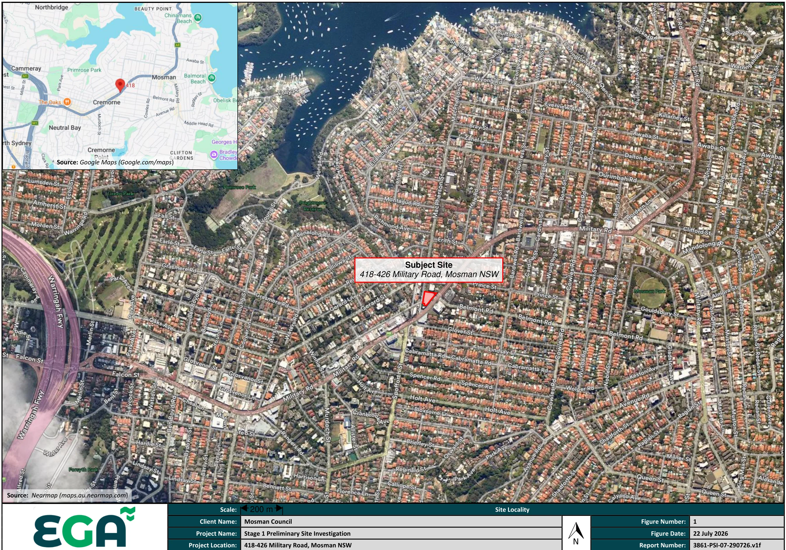

<!-- page 1139 -->

Scale: Site Layout Client Name: Figure Number: 2 Project Name: Stage 1 Preliminary Site Investigation Figure Date: 22 July 2026 Project Location: 418-426 Military Road, Mosman NSW Report Number: 3861-PSI-07-290726.v1f

### LEGEND

Site Boundary

Source:  Nearmap (maps.au.nearmap.com) 20 m

August 2026

Attachment 1.1.10 Mosman Council

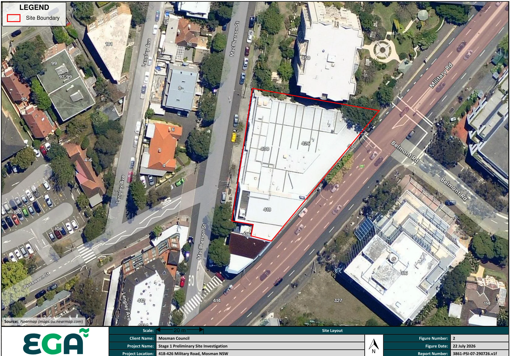

<!-- page 1140 -->

Scale: Site Layout Client Name: Figure Number: 3

Project Name: Stage 1 Preliminary Site Investigation Figure Date: 22 July 2026 Project Location: 418-426 Military Road, Mosman NSW Report Number: 3861-PSI-07-290726.v1f

Source:  Nearmap (maps.au.nearmap.com) 20 m

### LEGEND

Site Boundary

AEC01 / AEC02 / AEC03 / AEC-4 - Potential Vapour Intrusion into Buildings / Potential Migration of VOCs / Potential Contaminants within Soils / On-Site Structures

August 2026

Attachment 1.1.10 Mosman Council

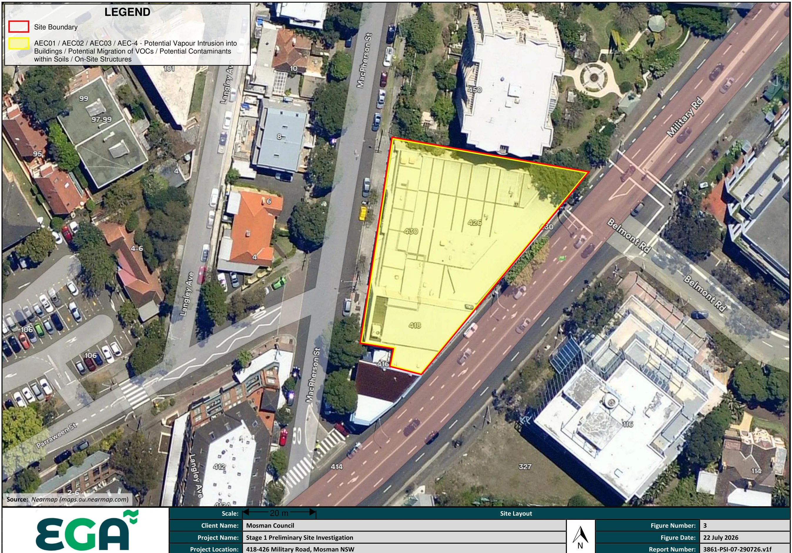

<!-- page 1141 -->

Desktop Phase 1 Environmental Site Assessment 418-426 Military Road, Mosman NSW 3861-PSI-07-290726.v2f

Page 25

#### APPENDIX A

#### GROUNDWATER BORE RECORDS

August 2026

Attachment 1.1.10 Mosman Council

<!-- page 1142 -->

home help contact customise State Overview State Overview Rivers and Streams favourites search download sites find a site Real Time Data - Rivers And Streams Daily River Reports Daily River Reports Dams favourites search download sites find a site Real Time Data - Major Dams Groundwater (Telemetered data) favourites search download sites find a site Real Time Data - Bores All Groundwater Site details search download sites find a site search by licence All Groundwater Map Meteorology favourites search download sites find a site Real Time Data - Weather Stations Hunter River Salinity Trading Scheme Hunter River Salinity Trading Scheme

bookmark this page All Groundwater Site Details ALL GROUNDWATER MAP All data times are Eastern Standard Time Map Info

There are no sites within 500 metres of the selected point. Zoom in and try again.

+ −

contact WaterNSW

7/21/26, 2:30 PM Real-time water data

https://realtimedata.waternsw.com.au/water.stm 1/2

August 2026

Attachment 1.1.10 Mosman Council

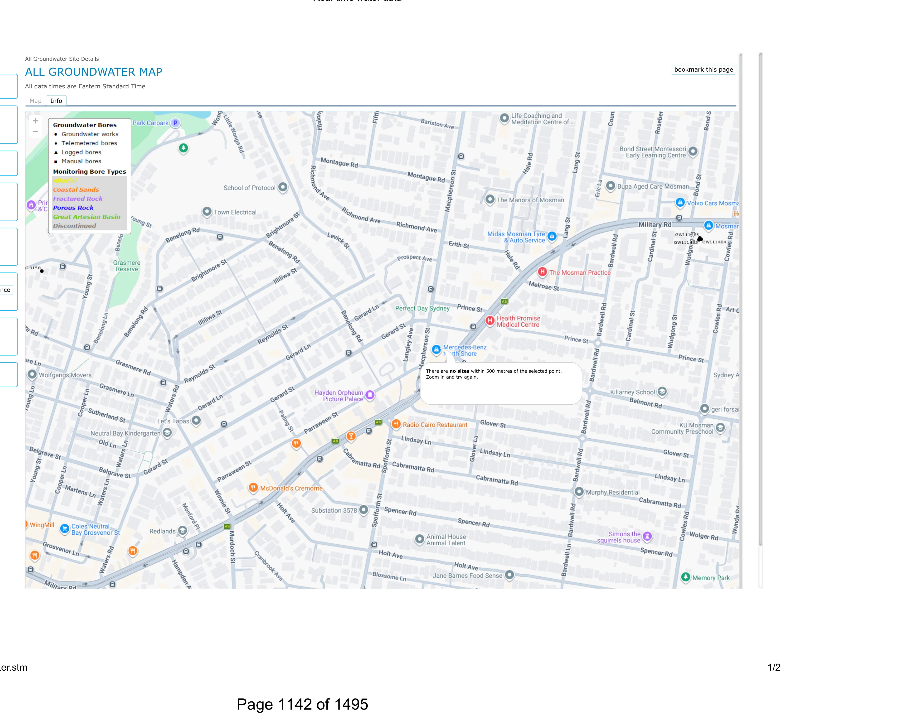

<!-- page 1143 -->

Desktop Phase 1 Environmental Site Assessment 418-426 Military Road, Mosman NSW 3861-PSI-07-290726.v2f

Page 26

#### APPENDIX B

#### NSW SEED MAP

August 2026

Attachment 1.1.10 Mosman Council

<!-- page 1144 -->

A NSW Government website

SEED Sharing and Enabling Environmental Data in NSW Search and download data Miners and Explorers map Browse by topic Case studies and insights Help and contact

How to use the SEED map Layers Legend

Acid Sulfate Soil Risk Hm: High probability in bottom sediments H0: High probability at/near ground surface H0(s): High probability at/near ground surface with acidic scalds H1: High probability <1 m below ground surface H1(s): High probability <1 m below ground surface with acidic scalds H2: High probability 1 - 3 m below ground surface H2(p): High probability 1 - 3 m below ground surface in Pleistocene sediments H4: High probability >3 m below ground surface Lm: Low probability in bottom sediments L0: Low probability at/near ground surface L0(p): Low probability at/near ground surface on Pleistocene sediments L1: Low probability <1 m below ground surface L1(p): Low probability <1 m below ground surface in Pleistocene sediments L2: Low probability 1 - 3 m below ground surface L2(p): Low probability 1 - 3 m below ground surface in Pleistocene sediments L4: Low probability >3 m below ground surface L4(p): Low probability >3 m below ground surface on Pleistocene sediments N: No known occurrence N(p): No known occurrence in Pleistocene sediments NB: No known occurrence, Beach X0: Disturbed terrain, < 1 m below ground surface X1: Disturbed terrain, elevation 1 - 2 m AHD X1(p): Disturbed terrain, elevation 1 - 2m AHD in Pleistocene sediments X1(s): Disturbed terrain, elevation 1 - 2 m AHD with acidic scalds X2: Disturbed terrain, elevation 2 - 4 m AHD X2(p): Disturbed terrain, elevation 2 - 4 m AHD in Pleistocene sediments X2(s): Disturbed terrain, elevation 2 - 4 m AHD with acidic scalds X4: Disturbed terrain, elevation >4 m AHD X4(p): Disturbed terrain, elevation >4 m Map data © OpenStreetMap contributors, Microsoft, Facebook, Inc. and its affiliates, Esri Community Maps contributors, Map layer by Esri Powered by Esri

Scale 11111 500 m X: 16834752.68 Y: -4005519.22 Projected Coordinates (X/Y)

#### 418 MILITARY ROAD MOSMAN 2088

Basemap

Draw/ Measure

Tools

Layer Intersect

Save Map

Contact Us Privacy Policy | More Info

7/21/26, 2:40 PM SEED Map

https://geo.seed.nsw.gov.au/vertigisstudio/web/?app=cabd04d595ec43c1aaf4298e80e83ec2 1/1

August 2026

Attachment 1.1.10 Mosman Council

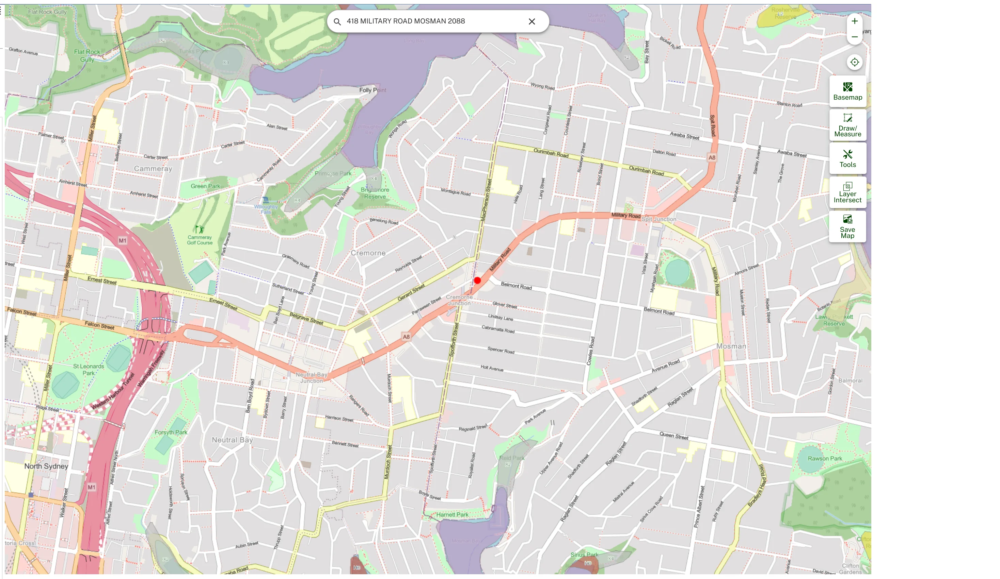

<!-- page 1145 -->

Desktop Phase 1 Environmental Site Assessment 418-426 Military Road, Mosman NSW 3861-PSI-07-290726.v2f

Page 27

#### APPENDIX C

#### HISTORICAL AERIAL IMAGERY

August 2026

Attachment 1.1.10 Mosman Council

<!-- page 1146 -->

Desktop Phase 1 Environmental Site Assessment 418-426 Military Road, Mosman NSW 3861-PSI-07-290726.v2f

Page 28

Historical Aerial 1. 1943 historical aerial imagery of the site. (Source: https://portal.spatial.nsw.gov.au/)

Historical Aerial 2. 1955 historical aerial imagery of the site. (Source: https://portal.spatial.nsw.gov.au/)

Historical Aerial 3. 1965 historical aerial imagery of the site. (Source: https://portal.spatial.nsw.gov.au/)

Historical Aerial 4. 1975 historical aerial imagery of the site. (Source: https://portal.spatial.nsw.gov.au/)

Historical Aerial 5. 1982 historical aerial imagery of the site. (Source: https://portal.spatial.nsw.gov.au/)

Historical Aerial 6. 1994 historical aerial imagery of the site. (Source: https://portal.spatial.nsw.gov.au/)

August 2026

Attachment 1.1.10 Mosman Council

<!-- page 1147 -->

Desktop Phase 1 Environmental Site Assessment 418-426 Military Road, Mosman NSW 3861-PSI-07-290726.v2f

Page 29

Historical Aerial 7. 2005 historical aerial imagery of the site. (Source: https://portal.spatial.nsw.gov.au/)

Historical Aerial 8. 2013 historical aerial imagery of the site. (Source: https://apps.nearmap.com/)

Historical Aerial 9. 2026 historical aerial imagery of the site. (Source: https://apps.nearmap.com/)

August 2026

Attachment 1.1.10 Mosman Council

<!-- page 1148 -->

Desktop Phase 1 Environmental Site Assessment 418-426 Military Road, Mosman NSW 3861-PSI-07-290726.v2f

Page 30

#### APPENDIX D

#### NSW EPA PUBLIC REGISTER

August 2026

Attachment 1.1.10 Mosman Council

<!-- page 1149 -->

Background

A strategy to systematically prioritise, assess and respond to notifications under Section 60 of the Contaminated Land Management Act 1997 (CLM Act) has been developed by the EPA. This strategy acknowledges the EPA’s obligations to make information available to the public under Government Information (Public Access) Act 2009 .

When a site is notified to the EPA, it may be accompanied by detailed site reports where the owner has been proactive in addressing the contamination and its source. However, often there is minimal information on the nature or extent of the contamination.

After receiving a report, the first step is to confirm that the report does not relate to a pollution incident. The Protection of the Environment Operations Act 1997 (POEO Act) deals with pollution incidents, waste stockpiling or dumping. The EPA also has an incident management process to manage significant incidents (https://www.epa.nsw.gov.au/reporting-and-incidents/incident- management).

In many cases, the information indicates the contamination is securely immobilised within the site, such as under a building or carpark, and is not currently causing any significant risks for the community or environment. Such sites may still need to be cleaned up, but this can be done in conjunction with any subsequent building or redevelopment of the land. These sites do not require intervention under the CLM Act, and are dealt with through the planning and development consent process. In these cases, the EPA informs the local council or other planning authority, so that the information can be recorded and considered at the appropriate time (https://www.epa.nsw.gov.au/your-environment/contaminated-land/managing-contaminated-land/role-of-planning-authorities).

Where indications are that the contamination could cause actual harm to the environment or an unacceptable offsite impact (i.e. the land is 'significantly contaminated'), the EPA would apply the regulatory provisions of the CLM Act to have the responsible polluter and/or landowner investigate and remediate the site. If the reported contamination could present an immediate or long-term threat to human health NSW Health will be consulted. SafeWork NSW and Water NSW can also be consulted if there appear to be occupational health and safety risks or an impact on groundwater quality.

As such, the sites notified to the EPA and presented in the list of contaminated sites notified to the EPA are at various stages of the assessment and remediation process. Understanding the nature of the underlying contamination, its implications and implementing a remediation program where required, can take a considerable period of time. The list provides an indication, in relation to each nominated site, as to the management status of that particular site. Further detailed information may be available from the EPA or the person who notified the site.

The following questions and answers may assist those interested in this issue.

Frequently asked questions

Why does my land appear on the list of notified sites?

Your land may appear on the list because:

• the site owner and/or the polluter has notified the EPA under section 60 of the CLM Act • the EPA has been notified via other means and is satisfied that the site is or was contaminated.

If a site is on the list, it does not necessarily mean the contamination is significant enough to regulate under the CLM Act.

List current as at 9 April 2026 1 of 139

August 2026

Attachment 1.1.10 Mosman Council

<!-- page 1150 -->

Does the list contain all contaminated sites in NSW?

No. The list only contains contaminated sites that EPA is aware of. If a site is not on the list, it does not necessarily mean the site is not contaminated.

The EPA relies on responsible parties and the public to notify contaminated sites.

How are notified contaminated sites managed by the EPA?

There are different ways the EPA can manage notified contaminated sites. Options include:

• regulation under the CLM Act, POEO Act, or both • notifying the relevant planning authority for management under the planning and development process • managing the site under the Protection of the Environment Operation (Underground Petroleum Storage Systems) Regulation 2014.

There are specific cases where contamination is managed under a tailored program operated by another agency (for example, the Resources & Geoscience's Legacy Mines Program).

What should I do if I am a potential buyer of a site that appears on the list?

You should seek advice from the seller to understand the contamination issue. You may need to seek independent contamination or legal advice.

The information provided in the list is indicative only and a starting point for your own assessment. Land contamination from past site uses is common, mainly in urban environments. If the site is properly remediated or managed, it may not affect the intended future use of the site.

Who can I contact if I need more information about a site?

You can contact the Environment Line at any time by calling 131 555 or by emailing info@environment.nsw.gov.au.

List of NSW Contaminated Sites Notified to the EPA

List current as at 9 April 2026 2 of 139

August 2026

Attachment 1.1.10 Mosman Council

<!-- page 1151 -->

Site Status

Under assessment

Under Preliminary Investigation Order

Regulation under CLM Act not required

Explanation

The contamination is being assessed by the EPA to determine whether regulation is required. The EPA may require further information to complete the assessment. For example, the completion of management actions regulated under the planning process or Protection of the Environment Operations Act 1997 .

The EPA has issued a Preliminary Investigation Order under s10 of the Contaminated Land Management Act 1997 , to obtain additional information needed to complete the assessment.

The EPA has completed an assessment of the contamination and decided that regulation under the Contaminated Land Management Act 1997 is not required.

Disclaimer

The EPA has taken all reasonable care to ensure that the information in the list of contaminated sites notified to the EPA (the list) is complete and correct. The EPA does not, however, warrant or represent that the list is free from errors or omissions or that it is exhaustive.

The EPA may, without notice, change any or all of the information in the list at any time.

You should obtain independent advice before you make any decision based on the information in the list.

The list is made available on the understanding that the EPA, its servants and agents, to the extent permitted by law, accept no responsibility for any damage, cost, loss or expense incurred by you as a result of:

1.            any information in the list; or 2.            any error, omission or misrepresentation in the list; or 3.            any malfunction or failure to function of the list; 4.            without limiting (2) or (3) above, any delay, failure or error in recording, displaying or updating information.

List current as at 9 April 2026 3 of 139

August 2026

Attachment 1.1.10 Mosman Council

<!-- page 1152 -->

Regulation being finalised

Contamination currently regulated under CLM Act

Contamination currently regulated under POEO Act

Contamination being managed via the planning process (EP&A Act)

Contamination formerly regulated under the CLM Act

Contamination formerly regulated under the POEO Act

The EPA has completed an assessment of the contamination and decided that the contamination is significant enough to warrant regulation under the Contaminated Land Management Act 1997 . A regulatory approach is being finalised.

The EPA has completed an assessment of the contamination and decided that the contamination is significant enough to warrant regulation under the Contaminated Land Management Act 1997 (CLM Act). Management of the contamination is regulated by the EPA under the CLM Act. Regulatory notices are available on the EPA’s Contaminated Land Public Record.

Contamination is currently regulated under the Protection of the Environment Operations Act 1997 (POEO Act).  The EPA as the appropriate regulatory authority reasonably suspects that a pollution incident is occurring/ has occurred and that it requires regulation under the POEO Act. The EPA may use environment protection notices, such as clean up notices, to require clean up action to be taken.  Such regulatory notices are available on the POEO public register.

The EPA has completed an assessment of the contamination and decided that the contamination is significant enough to warrant regulation. The contamination of this site is managed by the consent authority under the Environmental Planning and Assessment Act 1979 (EP&A Act) planning approval process, with EPA involvement as necessary to ensure significant contamination is adequately addressed. The consent authority is typically a local council or the Department of Planning and Environment.

The EPA has determined that the contamination is no longer significant enough to warrant regulation under the Contaminated Land Management Act 1997 (CLM Act). The contamination was addressed under the CLM Act.

The EPA has determined that the contamination is no longer significant enough to warrant regulation. The contamination was addressed under the Protection of the Environment Operations Act 1997 (POEO Act).

List current as at 9 April 2026 4 of 139

August 2026

Attachment 1.1.10 Mosman Council

<!-- page 1153 -->

Contamination was addressed via the planning process (EP&A Act)

Ongoing maintenance required to manage residual contamination (CLM Act)

The EPA has determined that ongoing maintenance, under the Contaminated Land Management Act 1997 (CLM Act), is required to manage the residual contamination. Regulatory notices under the CLM Act are available on the EPA’s Contaminated Land Public Record.

The EPA has determined that the contamination is no longer significant enough to warrant regulation. The contamination was addressed by the appropriate consent authority via the planning process under the Environmental Planning and Assessment Act 1979 (EP&A Act).

List current as at 9 April 2026 5 of 139

August 2026

Attachment 1.1.10 Mosman Council

<!-- page 1154 -->

Suburb SiteName Address ContaminationActivityType ManagementClass Latitude Longitude

MORPETH Telstra Cable Installation and RTA Bridge work Northumberland STREET Other Petroleum Regulation under CLM Act not required -32.72489729 151.6266795

MORPETH Former Service Station Swan  STREET Service Station Regulation under CLM Act not required -32.72477413 151.6250642

MORTLAKE Former Petroleum Storage Site 108-116 Tennyson ROAD Other Petroleum Regulation under CLM Act not required -33.83979033 151.1064889

MORTLAKE Kendall Bay Sediments Kendall BAY Gasworks Contamination currently regulated under CLM Act -33.83905999 151.1120458

MORTLAKE Former AGL site Tennyson  ROAD Gasworks Contamination formerly regulated under the CLM Act -33.84287407 151.1109313

MORTLAKE Majors Bay Redevelopment 14-22 Hilly STREET Other Industry Regulation under CLM Act not required -33.83954617 151.1054674

MORUYA Former Fuel Depot Moruya 11 to 13 Ford STREET Other Petroleum Regulation under CLM Act not required -35.9112243 150.0826475

MORUYA Caltex Service Station Moruya 80-84 Campbell STREET Service Station Regulation under CLM Act not required -35.91195596 150.0824213

MORUYA Ampol Fuel Depot - Moruya 26 Campbell STREET Service Station Regulation under CLM Act not required -35.9104985 150.0711419

MOSMAN 7-Eleven Mosman 162A Spit Road Corner Mitchell ROAD Service Station Regulation under CLM Act not required -33.81747016 151.2433633

MOSMAN BP Service Station 175 Ourimbah ROAD Service Station Regulation under CLM Act not required -33.82106757 151.233291

MOSMAN BP Express Mosman 175 Ourimbah  ROAD Service Station Regulation under CLM Act not required -33.82106459 151.2332921

MOSMAN 7-Eleven Service Station Mosman 45 Spit ROAD Service Station Regulation under CLM Act not required -33.82302718 151.2435627

MOSMAN Allan Border Oval Myahgah  ROAD Landfill Regulation under CLM Act not required -33.82681534 151.2417712

MOSMAN 173 Avenue Road, MOSMAN NSW 2088 173 Avenue ROAD Unclassified Regulation under CLM Act not required -33.930869 150.97132

List current as at 9 April 2026 85 of 139

August 2026

Attachment 1.1.10 Mosman Council

<!-- page 1155 -->

Suburb SiteName Address ContaminationActivityType ManagementClass Latitude Longitude

MOSS VALE Woolworths Service Station Moss Vale 609 Argyle  STREET Service Station Regulation under CLM Act not required -34.55409411 150.3609797

MOSS VALE Coles Express Service Station 579 Argyle STREET Service Station Regulation under CLM Act not required -34.55313422 150.364684

MOSS VALE Moss Vale Refuelling Facility Lackey ROAD Other Petroleum Regulation under CLM Act not required -34.54662421 150.3721525

MOUNT ANNAN Woolworths Caltex Mount Annan 157 Narellan (Corner Smeaton Grange Road) ROAD Service Station Regulation under CLM Act not required -34.04685527 150.7610434

MOUNT ANNAN Great Southern Railways Aqueduct Off Narellan  ROAD Unclassified Regulation under CLM Act not required -34.07308479 150.7707436

MOUNT COLAH Caltex Service Station Mount Colah 603 Pacific HIGHWAY Service Station Regulation under CLM Act not required -33.67034662 151.1151861

MOUNT COLAH Foxglove Oval Foxglove ROAD Landfill Contamination currently regulated under CLM Act -33.65829855 151.1229638

MOUNT DRUITT Caltex (former Mobil) Service Station, 17 Mount Street, Mount Druitt 17 Mount STREET Service Station Regulation under CLM Act not required -33.76567994 150.8244544

MOUNT DRUITT 7-Eleven Mount Druitt Lot 6 Luxford ROAD Other Petroleum Regulation under CLM Act not required -33.76483839 150.8254157

MOUNT HUTTON Woolworths Service Station 46 Wilsons ROAD Service Station Regulation under CLM Act not required -32.9836378 151.67309

MOUNT PRITCHARD 7-Eleven Service Station 352 Elizabeth DRIVE Service Station Regulation under CLM Act not required -33.90260656 150.8963326

MOUNT THORLEY Bulga Surface Operations Broke ROAD Other Industry Regulation under CLM Act not required -32.68325751 151.1206158

MOUNT THORLEY Lowes Petroleum (Former BP) Depot Mount Thorley 74 Mount Thorley ROAD Other Petroleum Regulation under CLM Act not required -32.62443074 151.1025122

MOUNT VICTORIA Former Mobil Service Station 81 Great Western HIGHWAY Service Station Regulation under CLM Act not required -33.5889727 150.2511783

MOUNT VICTORIA Caltex Service Station 36a Great Western HIGHWAY Service Station Regulation under CLM Act not required -33.58436517 150.2465528

List current as at 9 April 2026 86 of 139

August 2026

Attachment 1.1.10 Mosman Council

<!-- page 1156 -->

Search TIP To search for a specific site, search by LGA (local government area) and carefully review all sites listed. ... more search tips

Home Public registers Contaminated land record of notices Search results Your search for:Suburb: MOSMAN Search Again Refine Search did not find any records in our database. If a site does not appear on the record it may still be affected by contamination. For example: Contamination may be present but the site has not been regulated by the EPA under the Contaminated Land Management Act 1997 or the Environmentally Hazardous Chemicals Act 1985. The EPA may be regulating contamination at the site through a licence or notice under the Protection of the Environment Operations Act 1997 (POEO Act). Contamination at the site may be being managed under the planning process. More information about particular sites may be available from: The POEO public register The appropriate planning authority: for example, on a planning certificate issued by the local council under section 149 of the Environmental Planning and Assessment Act. See What's in the record and What's not in the record. If you want to know whether a specific site has been the subject of notices issued by the EPA under the CLM Act, we suggest that you search by Local Government Area only and carefully review the sites that are listed. This public record provides information about sites regulated by the EPA under the Contaminated Land Management Act 1997, including sites currently and previously regulated under the Environmentally Hazardous Chemicals Act 1985. Your inquiry using the above search criteria has not matched any record of current or former regulation. You should consider searching again using different criteria. The fact that a site does not appear on the record does not necessarily mean that it is not affected by contamination. The site may have been notified to the EPA but not yet assessed, or contamination may be present but the site is not yet being regulated by the EPA. Further information about particular sites may be available from the appropriate planning authority, for example, on a planning certificate issued by the local council under section 149 of the Environmental Planning and Assessment Act. In addition the EPA may be regulating contamination at the site through a licence under the Protection of the Environment Operations Act 1997. You may wish to search the POEO public register.POEO public register 13 July 2026

7/13/26, 12:13 PM DECCW | Search results

https://app.epa.nsw.gov.au/prclmapp/searchresults.aspx?&LGA=&Suburb=MOSMAN&Notice=&Name=&Text=&DateFrom=&DateTo= 1/1

August 2026

Attachment 1.1.10 Mosman Council

<!-- page 1157 -->

Home Public registers POEO Public Register Licences, applications and notices search Search results

Your search for: General Search with the following criteria Suburb - mosman returned 26 results Export to excel 2 of 2 Pages Search Again Number Name Location Type Status Issued date 1522383 TARONGA CONSERVATION SOCIETY AUSTRALIA BRADLEYS HEAD ROAD, MOSMAN, NSW 2088

s.58 Licence Variation Issued Issued 09 Jul 2015

1600361 TARONGA CONSERVATION SOCIETY AUSTRALIA BRADLEYS HEAD ROAD, MOSMAN, NSW 2088

Compliance Audit Complete Complete 14 Sep 2020

1603655 TARONGA CONSERVATION SOCIETY AUSTRALIA BRADLEYS HEAD ROAD, MOSMAN, NSW 2088

s.58 Licence Variation Issued Issued 08 Apr 2021

1615336 TARONGA CONSERVATION SOCIETY AUSTRALIA BRADLEYS HEAD ROAD, MOSMAN, NSW 2088

s.58 Licence Variation Issued Issued 23 Dec 2021

1623058 TARONGA CONSERVATION SOCIETY AUSTRALIA BRADLEYS HEAD ROAD, MOSMAN, NSW 2088

s.58 Licence Variation Issued Issued 30 Nov 2022

1630287 TARONGA CONSERVATION SOCIETY AUSTRALIA BRADLEYS HEAD ROAD, MOSMAN, NSW 2088

s.58 Licence Variation Issued Issued 03 Oct 2023

12 13 July 2026

7/13/26, 12:14 PM Environment & Heritage | PRPOEO

https://app.epa.nsw.gov.au/prpoeoapp/SearchResult.aspx?SearchTag=all&searchrange=general&range=general&SortExpression=AccountablePa… 1/1

August 2026

Attachment 1.1.10 Mosman Council

<!-- page 1158 -->

Home Public registers POEO Public Register Licences, applications and notices search Search results

Your search for: General Search with the following criteria Suburb - mosman returned 26 results Export to excel 1 of 2 Pages Search Again Number Name Location Type Status Issued date 1621649 THE SPIT, MOSMAN, NSW 2088 s.58 Licence Variation Issued Issued 08 Feb 2023 1028480 ARDENT LEISURE LIMITED  THE SPIT, MOSMAN, NSW 2088 s.58 Licence Variation Issued Issued 03 Jul 2003 1032563 ARDENT LEISURE LIMITED  THE SPIT, MOSMAN, NSW 2088 s.58 Licence Variation Issued Issued 20 Nov 2003 1069448 ARDENT LEISURE LIMITED  THE SPIT, MOSMAN, NSW 2088 s.58 Licence Variation Issued Issued 05 Feb 2007 1070978 ARDENT LEISURE LIMITED  THE SPIT, MOSMAN, NSW 2088 s.58 Licence Variation Issued Issued 14 Mar 2007 1072567 ARDENT LEISURE LIMITED  THE SPIT, MOSMAN, NSW 2088 s.58 Licence Variation Issued Issued 24 Apr 2007 1074550 ARDENT LEISURE LIMITED  THE SPIT, MOSMAN, NSW 2088 s.58 Licence Variation Issued Issued 13 Jun 2007 1078238 ARDENT LEISURE LIMITED  THE SPIT, MOSMAN, NSW 2088 s.58 Licence Variation Issued Issued 19 Sep 2007 1085886 ARDENT LEISURE LIMITED  THE SPIT, MOSMAN, NSW 2088 s.58 Licence Variation Issued Issued 12 May 2008 1097027 ARDENT LEISURE LIMITED  THE SPIT, MOSMAN, NSW 2088 s.58 Licence Variation Issued Issued 30 Jan 2009 1509253 ARDENT LEISURE LIMITED  THE SPIT, MOSMAN, NSW 2088 s.58 Licence Variation Issued Issued 24 Jun 2013 11724 HEALTHSCOPE OPERATIONS PTY LTD

#### 1 ELLAMATTA AVENUE,

MOSMAN, NSW 2088 POEO licence No longer in force No longer in force

16 Sep 2002

1048188 HEALTHSCOPE OPERATIONS PTY LTD

#### 1 ELLAMATTA AVENUE,

MOSMAN, NSW 2088 s.58 Licence Variation Issued Issued 27 May 2005 11211 MA MARINA FUND OPCO NO. 1 PTY LTD THE SPIT, MOSMAN, NSW 2088 POEO licence Issued Issued 30 Jan 2001 3514873 MA MARINA FUND OPCO NO. 1 PTY LTD THE SPIT, MOSMAN, NSW 2088 s.91 Clean Up Notice Issued Issued 10 Jan 2026 1596267 NONBANK MORTGAGES PTY. LTD. THE SPIT, MOSMAN, NSW 2088 s.58 Licence Variation Issued Issued 29 Jun 2021 1008406 OMNI LEISURE OPERATIONS LIMITED THE SPIT, MOSMAN, NSW 2088 s.58 Licence Variation Issued Issued 13 Jun 2001 1018813 OMNI LEISURE OPERATIONS LIMITED THE SPIT, MOSMAN, NSW 2088 s.58 Licence Variation Issued Issued 06 Sep 2002 1677 TARONGA CONSERVATION SOCIETY AUSTRALIA BRADLEYS HEAD ROAD, MOSMAN, NSW 2088

POEO licence Issued Issued 26 Sep 2000

1512309 TARONGA CONSERVATION SOCIETY AUSTRALIA BRADLEYS HEAD ROAD, MOSMAN, NSW 2088

Compliance Audit Complete Complete 21 Feb 2013

12 13 July 2026

7/13/26, 12:14 PM Environment & Heritage | PRPOEO

https://app.epa.nsw.gov.au/prpoeoapp/SearchResult.aspx?SearchTag=all&searchrange=general&range=general&SortExpression=AccountablePa… 1/1

August 2026

Attachment 1.1.10 Mosman Council

<!-- page 1159 -->

## Desktop Phase 1 Environmental Site

## Assessment

309 Military Road, Mosman NSW

Report No: Report Date:

3861-PSI-08-290726.v2f 03/08/2026

info@egau.com.au

NSW: 36E Fitzroy Street, Marrickville, NSW 2204 VIC: 88 Langridge St, Collingwood VIC 3066

August 2026

Attachment 1.1.10 Mosman Council

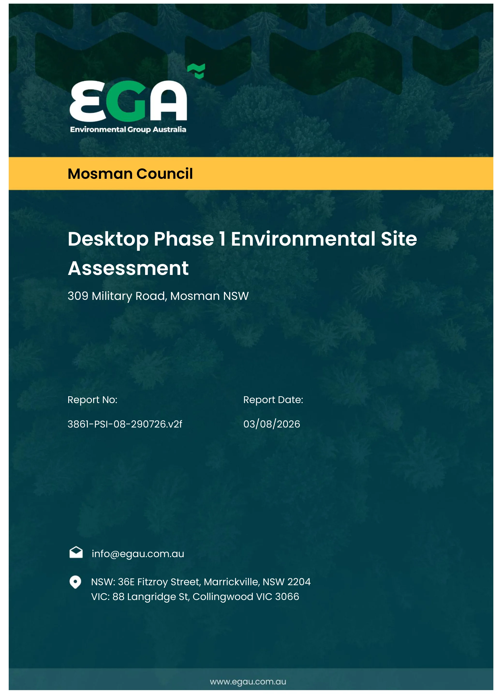

<!-- page 1160 -->

Desktop Phase 1 Environmental Site Assessment 309 Military Road, Mosman NSW 3861-PSI-08-290726.v2f

Page 1

### Document Record

Revision Date Author Reviewer

v1f 29 July 2026 Rachelle Conna Isabelle Figatowski

v2f 3 August 2026 Rachelle Conna Isabelle Figatowski

Author Signature Reviewer Signature

Name Rachelle Conna Name Isabelle Figatowski

Credentials B. Sc. (Zoology) Credentials B.Sc. (Env. Consulting)

Title Environmental Consultant Title Senior Environmental Consultant

Document Title: Desktop Phase 1 Environmental Site Assessment - 309 Military Road, Mosman NSW Site Address: 309 Military Road, Mosman NSW Client Name: Site Size: ≈ 920 m2 Reference Number: 3861-PSI-08-290726.v2f Project Type: Desktop Phase 1 Environmental Site Assessment Project Type Abbreviation: PSI Document Draft: FINAL Document Revision No. v2f

Prepared by Environmental Group Australia Pty Ltd ABN: 83 671 599 143

August 2026

Attachment 1.1.10 Mosman Council

<!-- page 1161 -->

Desktop Phase 1 Environmental Site Assessment 309 Military Road, Mosman NSW 3861-PSI-08-290726.v2f

Page 2

### EXECUTIVE SUMMARY

Environmental Group Australia Pty Ltd (EGA) was engaged by Mosman Council (hereafter referred to as ‘the client’), to undertake a Desktop Phase 1 Environmental Site Assessment of the property located within Lot 1 DP936479, Lot 1 DP936480 and Lot 6 DP1099253, 309 Military Road, Mosman NSW (hereafter referred to as ‘the site’) (refer to Figure 1 and Figure 2).

The client is preparing to lodge a planning proposal to implement the draft Mosman Masterplan, which proposes increased housing capacity across the study area, including amendments to the planning controls at the site to facilitate redevelopment.

#### Purpose and Objectives

A Desktop Phase 1 Environmental Site Assessment was required to assess the likelihood that the site had been contaminated by past or present activities and to form a preliminary view on the extent and degree of contamination. The objectives of the investigation were to:

• Provide advice on whether the site may require a stage 2 intrusive site assessment, to better define the nature and extent of potential contamination within the site; and • Provide advice on whether the site would be suitable (in the context of land contamination) for any proposed future rezoning.

#### Site Description

• The site covers an area of approximately 920 m2; • The site is currently zoned as E1: Local Centre; • The site is currently utilised within a commercial land-use setting; • The site is located within a mixed commercial-industrial and residential district.

Current aerial imagery suggests that the site is operating as ‘Audi Centre Mosman’. Imagery shows the site to contain one commercial warehouse structure and hardstand across the site surface.

#### Proposed Development

Reference is made to the draft Mosman Masterplan Structure Plan prepared by SJB Architecture, dated 29 July 2026 (Drawing No. 06, Revision 07). EGA understands that the site has been identified for increased development potential, however, have not been provided with any specific redevelopment plans. EGA has made the assumption that future development may include the demolition of current structures, rezoning of land, subdivision of land, and construction of new structures and infrastructure. EGA has not been made aware of any basement plans and have presumed that they are proposed as part of the future development.

#### Scope of Work

EGA undertook the following scope of works to address the project objectives:

• A desktop review of relevant information pertaining to the site; and • Assessment and reporting of the desktop review.

#### Investigation Outcome

Based on EGA’s assessment of the desktop review information, in the context of the proposed redevelopment scenario, EGA has made the following conclusions:

• The search of historical aerial imagery indicated a moderate potential for contamination within the site to have occurred, associated with uncontrolled demolition and potential site filling

August 2026

Attachment 1.1.10 Mosman Council

<!-- page 1162 -->

Desktop Phase 1 Environmental Site Assessment 309 Military Road, Mosman NSW 3861-PSI-08-290726.v2f

Page 3

beneath slabs. EGA also notes that the building fabrics may contain hazardous building materials; • A review of publicly available contaminated land databases indicated that the site is not the subject of any licences, applications, notices under Section 308 of the Protection of the Environment Operations Act 1997. The site is not notified under Section 60 of the Contaminated Land Management Act 1997. The site is not the subject of any notifications under Section 58 of the Contaminated Land Management Act 1997; • The contaminants and areas of environmental concern (AEC), requiring further consideration or assessment, and possibly remediation or risk management, are the following: o AEC-1: Potential Chemical Storage – Leaks, Spills or Poor Management; o AEC-2: Wastewater Treatment and Drainage Infrastructure – Wash Bays, Traps, Pits and Pipes; o AEC-3: Potential Fuel Infrastructure; o AEC-4: Potential Uncontrolled Fill and Surface Soils; and o AEC-5: On-Site Structures - Hazardous Building Materials. • Soils not impacted by contamination may meet excavated natural material (ENM) or General Solid Waste (GSW) classification.

#### Conclusions and Recommendations

Notwithstanding the above, the potential contaminants of concern and affected environmental media are consistent with those typically encountered on brownfield redevelopment sites within the Sydney Basin. Any contamination that may be present is not expected to be of such an extent or complexity that it could not be effectively managed or remediated using conventional and readily available remediation techniques. Accordingly, the potential for contamination at the site is not considered to preclude proposed future redevelopment.

As detailed development plans are prepared for individual areas of the site, the existing environmental data should be reviewed in conjunction with the overall remedial strategy to confirm the nature and extent of any contamination relevant to the proposed works. Where required, additional assessment should be undertaken, and appropriate remediation and/or management measures developed, to demonstrate that the relevant portion of the site is, or can be made, suitable for its intended use.

This report, including its conclusions and recommendations, must be read in conjunction with the limitations presented in Section 12.

August 2026

Attachment 1.1.10 Mosman Council

<!-- page 1163 -->

Desktop Phase 1 Environmental Site Assessment 309 Military Road, Mosman NSW 3861-PSI-08-290726.v2f

Page 4

#### TABLE OF CONTENTS

#### 1.

#### INTRODUCTION

#### 7

1.1. Purpose and Objectives ............................................................................................................... 7 1.2. Site Description ............................................................................................................................. 7 1.3. Proposed Development ................................................................................................................ 7 1.4. Scope of Work .............................................................................................................................. 7

#### 2.

#### SITE IDENTIFICATION

#### 8

#### 3.

#### PHYSICAL SITE CONDITIONS

#### 9

#### 4.

#### SITE HISTORY AND LAND USE

#### 11

4.1. Aerial Imagery ............................................................................................................................ 11 4.2. Anecdotal Information ............................................................................................................... 11 4.3. Incident and Complaints History ............................................................................................... 11 4.4. Previous Contamination Assessments ...................................................................................... 11

#### 5.

#### REGULATORY RECORDS

#### 12

5.1. NSW EPA CLM Act Register of Notified Sites and Notices ....................................................... 12 5.2. NSW EPA POEO Act Register of Licences, Applications and Notices ...................................... 12 5.3. Dangerous Goods Licences Search ............................................................................................ 12

#### 6.

#### INFORMATION SOURCES

#### 13

#### 7.

#### CONCEPTUAL SITE MODEL

#### 14

7.1. Potential Areas of Environmental Concern ............................................................................... 14 7.2. Contaminants, Migration Pathways, Receptors and Risks ...................................................... 14 7.3. Site Characteristics Affecting Risks ........................................................................................... 15 7.3.1. Land-Use Setting................................................................................................................ 15 7.3.2. Surface Water ..................................................................................................................... 15 7.3.3. Groundwater – Drinking Water Risks ................................................................................ 16 7.3.4. Recreational Water Use and Aquatic Ecosystems ............................................................ 16 7.3.5. Terrestrial Ecosystems ....................................................................................................... 16 7.3.6. Human Exposures to Site Contaminants ........................................................................... 16

#### 8.

#### RISK ASSESSMENT (PLANNING LEVEL)

#### 17

#### 9.

#### PLANNING AND MASTER PLAN ADVICE

#### 18

9.1. Suitability for Future Development ............................................................................................ 18 9.2. Identification of Potential Issues ............................................................................................... 18 9.3. Requirements for the Development Application (DA) Stage ................................................... 18 9.4. Suggestion Inclusion to Master Planning .................................................................................. 18

#### 10. CONTAMINANTS OF CONCERN

#### 20

#### 11. CONCLUSIONS AND RECOMMENDATIONS

#### 21

11.1. Site Condition and Further Requirements ................................................................................. 21 11.2. Recommendations ...................................................................................................................... 21

#### 12. STATEMENT OF LIMITATIONS

#### 22

August 2026

Attachment 1.1.10 Mosman Council

<!-- page 1164 -->

Desktop Phase 1 Environmental Site Assessment 309 Military Road, Mosman NSW 3861-PSI-08-290726.v2f

Page 5

#### 13. REFERENCES

#### 23

FIGURES Figure 1 - Site Locality Figure 2 - Site Layout Figure 3 - Areas of Environmental Concern

APPENDICES A - Groundwater Bore Records B - NSW SEED Map C - Historical Aerial Imagery D - NSW EPA Public Register

August 2026

Attachment 1.1.10 Mosman Council

<!-- page 1165 -->

Desktop Phase 1 Environmental Site Assessment 309 Military Road, Mosman NSW 3861-PSI-08-290726.v2f

Page 6

### LIST OF ABBREVIATIONS

AHD Australian Height Datum AEC Area of Environmental Concern ANZECC Australian and New Zealand Environment and Conservation Council AST Aboveground storage tank Bgl Below ground level BTEX Benzene, toluene, ethylbenzene, xylene CoC Chain of Custody CSM Conceptual Site Model EIL Ecological Investigation Level EGA Environmental Group Australia Pty Ltd EPA Environment Protection Authority HIL Health Investigation Levels HSL Health Screening Levels LOR [Laboratory] Limit of Reporting NATA National Association of Testing Laboratories NA Not applicable ND Not detected NEPC National Environment Protection Council NEPM National Environment Protection Measure NSW EPA NSW Environment Protection Authority OCP Organochlorine Pesticide PAEC Potential Area of Environmental Concern PAH Polycyclic aromatic hydrocarbon PCB Polychlorinated biphenyl PID Photo-ionisation detector PSI Preliminary Site Investigation QA/QC Quality assurance/Quality control RPD Relative percentage difference SAQP Sampling Analysis and Quality Plan SVOC Semi-volatile organic compound USCS Unified Soil Classification System UST Underground storage tank VOC Volatile organic compound

August 2026

Attachment 1.1.10 Mosman Council

<!-- page 1166 -->

Desktop Phase 1 Environmental Site Assessment 309 Military Road, Mosman NSW 3861-PSI-08-290726.v2f

Page 7

#### 1. INTRODUCTION

Environmental Group Australia Pty Ltd (EGA) was engaged by Mosman Council (hereafter referred to as ‘the client’), to undertake a Desktop Phase 1 Environmental Site Assessment of the property located within Lot 1 DP936479, Lot 1 DP936480 and Lot 6 DP1099253, 309 Military Road, Mosman NSW (hereafter referred to as ‘the site’) (refer to Figure 1 and Figure 2).

The client is preparing to lodge a planning proposal to implement the draft Mosman Masterplan, which proposes increased housing capacity across the study area, including amendments to the planning controls at the site to facilitate redevelopment.

#### 1.1.

#### Purpose and Objectives

A Desktop Phase 1 Environmental Site Assessment was required to assess the likelihood that the site had been contaminated by past or present activities and to form a preliminary view on the extent and degree of contamination. The objectives of the investigation were to:

• Provide advice on whether the site may require a stage 2 intrusive site assessment, to better define the nature and extent of potential contamination within the site; and • Provide advice on whether the site would be suitable (in the context of land contamination) for any proposed future rezoning.

#### 1.2.

#### Site Description

• The site covers an area of approximately 920 m2; • The site is currently zoned as E1: Local Centre; • The site is currently utilised within a commercial land-use setting; • The site is located within a mixed commercial-industrial and residential district.

Current aerial imagery suggests that the site is operating as ‘Audi Centre Mosman’. Imagery shows the site to contain one commercial warehouse structure and hardstand across the site surface.

#### 1.3.

#### Proposed Development

Reference is made to the draft Mosman Masterplan Structure Plan prepared by SJB Architecture, dated 29 July 2026 (Drawing No. 06, Revision 07). EGA understands that the site has been identified for increased development potential, however, have not been provided with any specific redevelopment plans. EGA has made the assumption that future development may include the demolition of current structures, rezoning of land, subdivision of land, and construction of new structures and infrastructure. EGA has not been made aware of any basement plans and have presumed that they are proposed as part of the future development.

#### 1.4.

#### Scope of Work

EGA undertook the following scope of works to address the project objectives:

• A desktop review of relevant information pertaining to the site; and • Assessment and reporting of the desktop review.

August 2026

Attachment 1.1.10 Mosman Council

<!-- page 1167 -->

Desktop Phase 1 Environmental Site Assessment 309 Military Road, Mosman NSW 3861-PSI-08-290726.v2f

Page 8

#### 2. SITE IDENTIFICATION

The site identification details and associated information are presented in Table 2.1.

Table 2.1 Site Identification Information Attribute Description

Street Address 309 Military Road, Mosman NSW

Lot and Deposited Plan (DP)

Lot 1 DP936479 Lot 1 DP936480 Lot 6 DP1099253

Current Owner

Geographical Coordinates 33°49'40.5"S 151°13'52.0"E (approximate centre of site)

Site Area ≈ 920 m2

Local Government Area (LGA) Mosman Municipal Council

Parish Willoughby

County Cumberland

Zoning E1: Local Centre Mosman Local Environmental Plan 2012 (2011 EPI 647)

The locality of the site is identified in Figure 1.

The general layout and boundary of the site are shown in Figure 2.

August 2026

Attachment 1.1.10 Mosman Council

<!-- page 1168 -->

Desktop Phase 1 Environmental Site Assessment 309 Military Road, Mosman NSW 3861-PSI-08-290726.v2f

Page 9

#### 3. PHYSICAL SITE CONDITIONS

Regional geology, topography, soil landscape and hydrogeological information are presented in Table 3.1.

Table 3.1 Regional Setting Information Attribute Description

Geology

A review of the Environment NSW ‘eSpade V2.2’ web application (environment.nsw.gov.au/eSpade2WebApp, accessed 24 July 2026), indicated that the site is likely to be underlain by Hawkesbury Sandstone, which is a medium to coarse-grained quartz sandstone with minor shale and laminite lenses.

Soil Profiles

A review of the Environment NSW ‘eSpade V2.2’ web application (environment.nsw.gov.au/eSpade2WebApp, accessed 24 July 2026), indicated that the site is likely to contain: • gy1 (Topsoil): Loose, acidic, water-repellent coarse sandy loam, high permeability, low water capacity. • gy2 (Subsoil/Sandstone): Earthy, hard setting yellowish-brown clayey sand, low water capacity. • gy3 (Subsoil/Sandstone): Earthy/weakly pedal sandy clay loam, low permeability and wet strength. • gy4 (Subsoil/Shale): Highly pedal, highly erodible yellowish-brown clay, low permeability and wet strength. • Associated: Surface leaf litter (up to 10 cm) and loose quartz sand wash.

Terrain and Structure

A review of the Environment NSW ‘eSpade V2.2’ web application (environment.nsw.gov.au/eSpade2WebApp, accessed 24 July 2026), indicated that the site is likely to comprise: • Crests (<50 cm deep): Gradual transition of gy1 over bedrock, gy2, or occasionally gy3. Hard setting layers or bedrock expose when eroded. • Side slopes (30–70 cm deep): Discontinuous soils with up to 25% rock outcrop. gy1 overlies bedrock or gy2/gy3 on benches. • Shale Lenses (<100 cm deep): Sharp transition from gy1 to deep gy4 clay on inner benches. • Drainage Lines (<100 cm deep): Deep gy1 directly over bedrock.

Acid Sulfate Soils

A review of the NSW Government SEED web application (geo.seed.nsw.gov.au, accessed 24 July 2026), indicates that the site lies in an area mapped as ‘No Known Occurrence’ with respect to acid sulfate soils. This infers that land management activities are not likely to be affected by acid sulfate soils. Further assessment of acid sulfate soils in the context of this investigation is considered by EGA as not warranted.

Topography

Generally, the local landscape consists of undulating to rolling low hills with local relief 20–80 m and slopes of 10–25%. Sideslopes with narrow to wide outcropping sandstone rock benches (10–100 m), often forming broken scarps of <5 m. The site is considered generally flat, is located at an elevation approximately 87 m Australian Height Datum (AHD).

Hydrology and Hydrogeology

Surface water courses proximal to the site include Willoughby Creek located approximately 789 m to the northwest of the site, Quakers Hat Bay located approximately 1.41 km to the northeast and Mosman Bay located approximately 938 m to the south of the site. Based on the site topography and distances to the nearest surface water course, groundwater flow in the vicinity of the site is considered likely to be towards the northwest. A review of the NSW Office of Water groundwater database undertaken on 24 July 2026 indicated no registered groundwater features located within 500 m of the site.

August 2026

Attachment 1.1.10 Mosman Council

<!-- page 1169 -->

Desktop Phase 1 Environmental Site Assessment 309 Military Road, Mosman NSW 3861-PSI-08-290726.v2f

Page 10

Attribute Description

Adjacent Sensitive Receptors

The closest ecological receptors to the site include vegetated areas within the site / neighbouring properties and the closest receiving watercourses as outlined above. A review of the Bureau of Meteorology (BoM) Groundwater Dependent Ecosystem (GDE) Atlas Map was undertaken on 24 July 2026 to determine the closest sensitive ecological receptors. The closest sensitive receptor to the site included Manly Lagoon, located approximately 6.62 km to the northeast of the site and noted as a high potential groundwater dependent ecosystem. The closest sensitive human receptors are the residential properties surrounding the site’s boundary and any future onsite construction workers/builders.

Perfluoroalkyl Substances (PFAS)

A review of the publicly available NSW Government PFAS Investigation Program mapping information was reviewed 24 July 2026. The review was undertaken to identify any investigation localities that may affect the site. The site is not considered to be affected by any PFAS investigation programs.

Unexploded Ordnance (UXO)

A review of the publicly available Unexploded Ordnance (UXO) mapping information was reviewed 24 July 2026. The review was undertaken to identify any recorded UXO-related constraints or risks applicable to the site and its surrounding area at the time of reporting. The site is not considered to be affected by UXO.

A copy of the NSW Office of Water search record is presented in Appendix A.

A copy of the NSW SEED search record is presented in Appendix B

August 2026

Attachment 1.1.10 Mosman Council

<!-- page 1170 -->

Desktop Phase 1 Environmental Site Assessment 309 Military Road, Mosman NSW 3861-PSI-08-290726.v2f

Page 11

#### 4. SITE HISTORY AND LAND USE

#### 4.1.

#### Aerial Imagery

A review of selected historical aerial imagery was undertaken. Observations made of the imagery considered relevant to this investigation are presented in Table 4.1. A copy of the historical aerials is presented in Appendix C.

Table 4.1 Aerial Imagery Observations Image Date Site Features Surrounding Land Use Settings

1943

The site is observed to comprise one residential lot of land to the east, and six commercial structures along the western boundary.

The wider area is observed to comprise low- density residential and commercial development and associated infrastructure. The adjacent site boundaries are observed as ‘Glover Street’ to the south, ‘Military Road’ to the west and low- density residential to the north and east. 1955 No significant changes observed. No significant changes observed.

1965

All previous structures are observed to be demolished, and one commercial structure is observed to the southeast.

Observations of the wider area included demolition of previous structures and high- density and commercial construction.

1971 No significant changes observed.

Demolition of previous structures and commercial construction observed to the northeast. Observations of the wider area included demolition of previous structures and high- density and commercial construction.

1986

The previous structure is observed to be demolished, and the site is observed to comprise one large commercial structure.

Observations included demolition of previous low- density residential structures to the east and south and construction of low-density residential to the east.

1994 No significant changes observed. Commercial construction observed to the south and northeast. 2005 No significant changes observed. No significant changes observed.

2013 Roofing upgrades are observed to the on-site structure. No significant changes observed.

2026 No significant changes observed. No significant changes observed.

The aerial imagery indicated a moderate potential for land contaminating activities to have occurred on the site including uncontrolled demolition and historical asbestos and pesticide application beneath slabs. Based on these possibilities, a Stage 2 Intrusive Assessment is recommended, should any works be proposed below the hardstand layer on-site. EGA also notes that on-site structures may contain hazardous building materials, and a hazardous building material survey (HBMS) is recommended prior to any demolition of on-site structures.

#### 4.2.

#### Anecdotal Information

EGA has not been advised of any anecdotal information by the client.

#### 4.3.

#### Incident and Complaints History

There were no incident reports or complaints history provided to EGA as part of this project.

#### 4.4.

#### Previous Contamination Assessments

EGA was not provided with, nor is EGA aware of any existing reports or environmental assessments pertaining to the site.

August 2026

Attachment 1.1.10 Mosman Council

<!-- page 1171 -->

Desktop Phase 1 Environmental Site Assessment 309 Military Road, Mosman NSW 3861-PSI-08-290726.v2f

Page 12

#### 5. REGULATORY RECORDS

#### 5.1.

#### NSW EPA CLM Act Register of Notified Sites and Notices

The search of the Public Register (the Contaminated Land Public Record) undertaken on 13 July 2026, indicated that the site was not the subject of any Notices recorded under Section 58 of the Contaminated Land Management Act 1997.  The site has not been declared ‘significantly contaminated’.

A search of the list of contaminated sites notified to the EPA, did not identify the site as having been notified to the EPA under Section 60 of the CLM Act.

Six localities within the suburb of Mosman were also listed on the register, those being:

• 7-Eleven Mosman, 162A Spit Road Corner Mitchell Road (Service Station) – located approximately 1.6 km northeast of the site. No further regulation of this locality is required under the CLM Act; • BP Service Station & BP Express Mosman, 175 Ourimbah Road (Service Station) – located approximately 753 m north of the site. No further regulation of this locality is required under the CLM Act; • 7-Eleven Service Station Mosman, 45 Spit Road (Service Station) – located approximately 1.24 km northeast of the site. No further regulation of this locality is required under the CLM Act; • Allan Border Oval, Myahgah Road (Landfill) – located approximately 895 m east of the site. No further regulation of this locality is required under the CLM Act; and • 173 Avenue Road (Unclassified) – located approximately 1.16 km southeast of the site. No further regulation of this locality is required under the CLM Act.

As none of the localities are located within the immediate vicinity of the site, nor do they require management under the CLM Act, they are not considered to pose a contamination risk to the site.

A copy of the CLM Act Record of Notices search records is presented in Appendix D.

#### 5.2.

#### NSW EPA POEO Act Register of Licences, Applications and Notices

A search of the publicly available online NSW EPA Record of Notices issued under Section 308 of the Protection of the Environment Operations Act 1997 was completed on 13 July 2026. The results indicated that the site was not the subject of any licences, applications, notices, audits or pollution studies or reduction programs.

A copy of the POEO Act Register of Licences, Applications and Notices search record is presented in Appendix D.

#### 5.3.

#### Dangerous Goods Licences Search

A search of the register was not considered warranted due to the client scope for this report. A Dangerous Goods Licences Search is to be conducted if intrusive works are proposed for the site, due to the current site use as a petrol station.

August 2026

Attachment 1.1.10 Mosman Council

<!-- page 1172 -->

Desktop Phase 1 Environmental Site Assessment 309 Military Road, Mosman NSW 3861-PSI-08-290726.v2f

Page 13

#### 6. INFORMATION SOURCES

EGA has accessed information about the site from the following organisations.  Some of the information has been used as input to EGA’s considerations regarding land contamination risks at the site.

• Australian Soil Resource Information System; • Department of Land and Water Conservation; • Department of Minerals and Energy; • Department of Primary Industries – Water; • Local Council Resources; • Google Earth; • National Environment Protection Council; • Nearmap Pty Ltd; • NSW Environment Protection Authority; • NSW Land and Property Information; and • Water NSW.

August 2026

Attachment 1.1.10 Mosman Council

<!-- page 1173 -->

Desktop Phase 1 Environmental Site Assessment 309 Military Road, Mosman NSW 3861-PSI-08-290726.v2f

Page 14

#### 7. CONCEPTUAL SITE MODEL

The conceptual site model (CSM) identifies and describes contaminants of concern, and the areas and mediums in which they are present (the AECs), which may cause a risk to human health or the environment.  The CSM specifies the potential receptors of the risks and the exposure pathways by which the receptors may be impacted.  The potential risks listed in the CSM are those that may exist prior to any contaminant remediation or management measures and are based on information gained from the preliminary site investigation (PSI).

#### 7.1.

#### Potential Areas of Environmental Concern

The site history data collected, and site inspection observations, were assessed within the objectives of this investigation and in the context of the past and current land-use. The identified areas of environmental concern (AEC) and contaminants of concern (COC) which have the potential to be present on site are presented in Table 7.1 below.

Table 7.1 Areas of Environmental Concern (AEC) and Contaminants of Concern

AEC Areas of Environmental Concern and Contaminating Activity Resulting Risks Contaminants of Potential Concern

AEC-1 Potential Chemical Storage – Leaks, Spills or Poor Management

Leaching to shallow soils, vapour intrusion into future buildings and potential migration to groundwater.

Metals, TRH, BTEX, VOCs, OCPs, OPPs, Phenols and PFAS

AEC-2

Wastewater Treatment and Drainage Infrastructure – Wash Bays, Traps, Pits and Pipes

Structural failure or leakage resulting in soil and groundwater contamination and vapour intrusion.

Metals, TRH, BTEX, VOCs, MBAS (surfactants) and PFAS

AEC-3 Potential Fuel Infrastructure

Deep soil impact, LNAPL accumulation, groundwater impacts and vapour intrusion.

Metals, TRH, BTEX, VOCs, PAHs and Phenols

AEC-4 Potential Uncontrolled Fill and Surface Soils

Potential Chemical and Asbestos Contamination Above Human Health and Ecological Criteria

Metals, PAH, TRH, BTEX, OCP, OPP, PCBs and Asbestos

AEC-5 On-Site Structures - Hazardous Building Materials

Potential Human Health Exposure

Asbestos, lead in paint, SMF and PCBs

Notes to Table: TRH = Total Recoverable Hydrocarbons. BTEX = Benzene, Toluene, Ethylbenzene, Xylene. VOC = Volatile Organic Compounds. PAH = Polycyclic Aromatic Hydrocarbons. OCP = Organochlorine Pesticides. OPP = Organophosphorus Pesticides. PCB = Polychlorinated Biphenyls. SMF = Synthetic Mineral Fibres.

#### 7.2.

#### Contaminants, Migration Pathways, Receptors and Risks

The contaminating activities and the related contaminants of concern may have a potential to cause risks to receptors, both human and environmental. Consideration of those contaminants, exposure pathways, receptors and risk are presented in Table 7.2.

August 2026

Attachment 1.1.10 Mosman Council

<!-- page 1174 -->

Desktop Phase 1 Environmental Site Assessment 309 Military Road, Mosman NSW 3861-PSI-08-290726.v2f

Page 15

Table 7.2 Contaminants, Receptors, Exposure Pathways and Risks

Contaminant Receptor Exposure Pathway Risk Type Risk Mitigation or Elimination

Potential asbestos in soil

On-site workers & intrusive maintenance workers. Future site occupants if not remediated

Disturbance of soil causing asbestos fibres in dust.

Fibre inhalation

Requires exposure management or remediation

Potential chemical contaminants in soil exceeding human health criteria

On-site workers & intrusive maintenance workers.  Future site occupants if not remediated

Dermal contact, dust inhalation and ingestion of soil

Soil contact and ingestion

Requires exposure management or remediation

Potential chemical contaminants in soil exceeding ecological criteria

Future landscaping plants

Uptake by plants of contaminants in soil

Impact to plant growth and health

Requires exposure management or remediation

Potential contaminants in groundwater

Future residents or site occupants Ecological receptors in surface receiving waters

Human consumption of extracted groundwater Migration of impacted groundwater off-site to receiving waters

Human health Ecological harm to receiving waters

Remediation of groundwater or prevention of extraction

Potential chlorinated and petroleum VOCs in soil vapour

On-site workers & intrusive maintenance workers

Vapour intrusion into on- site buildings & services trenches

Vapour inhalation

Remediation of all VOC impacted soils to health risk- based criteria. Burial of remediated soil in containment cell external to buildings.

#### 7.3.

#### Site Characteristics Affecting Risks

The following site characteristics, and exposure pathways, were taken into account when formulating the conceptual site model.

7.3.1. Land-Use Setting

EGA has not been advised on the future land-use. However, EGA understands that it is located within a mixed-use residential and commercial area.

As future redevelopment plans are currently unknown, EGA recommends conservatively adopting the ‘HIL A – Low-Density Residential’ land-use criteria per ASC NEPM (2013), for the purpose of assessing land contamination exposure risks within the site. A less conservative land-use setting may be adopted in future, subject to the specific details of any proposed development.

7.3.2. Surface Water

Surface water courses proximal to the site Willoughby Creek located approximately 789 m to the northwest of the site, Quakers Hat Bay located approximately 1.41 km to the northeast and Mosman Bay located approximately 938 m to the south of the site. These surface waters could be receptors for contaminants in site soils, from surface stormwater runoff and from other stormwater discharges.

August 2026

Attachment 1.1.10 Mosman Council

<!-- page 1175 -->

Desktop Phase 1 Environmental Site Assessment 309 Military Road, Mosman NSW 3861-PSI-08-290726.v2f

Page 16

7.3.3. Groundwater – Drinking Water Risks

Currently, there are no groundwater bores on, or down-gradient of the site registered as domestic for potential drinking water use. The site is underlain by the Hawkesbury Sandstone, groundwater yield and quality are highly variable, making the likelihood that the groundwater would be extracted for drinking, low. It is also considered unlikely that domestic bores will be installed as part of a future redevelopment. Furthermore, the area is serviced by a town water supply, making human consumption of groundwater unlikely. Consequently, the exposure pathway for human consumption of groundwater remains incomplete. Historical commercial/industrial use of the site and its current use as ‘Audi Centre Mosman’ present the potential risk of mobile contaminants (such as TRH, BTEX and VOCs) leaching through soils into groundwater. Groundwater assessment with consideration to appropriate groundwater guidelines are to be considered.

7.3.4. Recreational Water Use and Aquatic Ecosystems

Future construction works involving any deep sub-grade disturbances, such as the excavation of underground basement parking levels may intersect groundwater. Should any excavation penetrate or sit immediately above the water table, it introduces the potential for groundwater inflow, dewatering requirements, or the accumulation of volatile vapours. A targeted groundwater assessment with consideration to Groundwater Investigation Levels (GIL), will be required prior to or during the design phase of any deep basement excavations, to confirm local water table depths and potential for contaminant migration. Groundwater within the site, if impacted by historical site activities, has the potential to discharge to nearby marine receiving waters. This poses a risk to aquatic ecosystems and recreational users of the water systems.

While the distances to the closest surface water body (> 700 m) provide potential for attenuation and dilution, aquatic ecosystem protection criteria (ASC NEPM 2013 / ANZG 2018) and recreational water guidelines will need to be considered.

7.3.5. Terrestrial Ecosystems

The proposed development may include gardens and other landscaping, and the impact of soil contaminants may affect plant well-being (plant growth and health). Ecological investigation levels (EILs) and ecological screening levels (ESLs) are to be considered based on the proposed future land- use.

7.3.6. Human Exposures to Site Contaminants

Due to the historical commercial/industrial uses of the site, volatile organic compounds (VOCs, TRH, BTEX, or MBAS) present the potential for contaminants within site soils and soil vapour. Future site occupants may be exposed to contaminants in soil – via dust inhalation, dermal contact and ingestion and if present, volatile contaminants can migrate into current and future building footprints or excavations.

Further consideration of human health exposure risks with consideration to ASC NEPM 2013 Human Investigation Levels (HIL) and Human Screening Levels (HSL) criteria is considered warranted. The potential for volatile contaminants warrants field screening with a Photoionisation Detector, during any future soil investigations.

August 2026

Attachment 1.1.10 Mosman Council

<!-- page 1176 -->

Desktop Phase 1 Environmental Site Assessment 309 Military Road, Mosman NSW 3861-PSI-08-290726.v2f

Page 17

#### 8. RISK ASSESSMENT (PLANNING LEVEL)

Based on the Conceptual Site Model (CSM) developed in Section 7, a qualitative planning-level risk assessment was undertaken to identify key contamination constraints. This is discussed within Table 8.1.

Table 8.1 Contaminants, Receptors, Exposure Pathways and Risks

Source - Receptor Pathway Contamination Likelihood Key Impacts to Future Land-Use

Risk / Priority Level

Historical Commercial Site Use - Future Occupants and Construction Workers

Soil ingestion, dermal contact, dust inhalation, and vapour intrusion into indoor spaces/trenches

Moderate to High

Sub-surface infrastructure (such as pits, chemical storage or historical fuel tanks) may have historically leaked into soils/bedrock. Volatile organic compound (VOC) intrusion risks into future basements or ground-floor slabs from solvent and fuel use. Direct contact/ingestion pathways via dust during bulk excavation/earthworks.

High

Soil Leaching and Historical Liquid Spills - Groundwater and Surrounding Aquatic Ecosystems

Leaching from shallow soils to groundwater or lateral migration to receiving watercourses

Moderate

Potential for historical hydrocarbon, solvent, or heavy metal plumes within the aquifer. Down-gradient migration toward marine receptors (Willoughby Creek and Quakers Hat Bay). Intersection of the water table during deep basement/parking excavations requiring dewatering management.

Medium

Corrosive Soils and Subsurface Accumulation - Built Environment and Infrastructure

Direct contact with aggressive subsoils or volatile gas accumulation in service conduits

Low to Moderate

Potential for aggressive/corrosive soil conditions (from historical battery storage or acids) or volatile gas accumulation within utility trenches and basements.

Low

Uncontrolled Historical Fill - Terrestrial Ecosystems

Root uptake and phytotoxicity from soil impact

Low

Phytotoxicity risks to future landscaping or garden areas if deep subsoils impacted by automotive fluids are exposed or reused at the surface.

Low

August 2026

Attachment 1.1.10 Mosman Council

<!-- page 1177 -->

Desktop Phase 1 Environmental Site Assessment 309 Military Road, Mosman NSW 3861-PSI-08-290726.v2f

Page 18

#### 9. PLANNING AND MASTER PLAN ADVICE

#### 9.1.

#### Suitability for Future Development

In accordance with Section 4.6 of State Environmental Planning Policy (Resilience and Hazards) 2021, a planning authority must consider land contamination risks when determining a Development Application (DA) or rezoning proposal.

From a planning perspective, the historical operation of the site as ‘Audi Centre Mosman’ presents potential contamination risks but does not preclude any future redevelopment plans. Because intrusive sampling has not yet been conducted, the site cannot currently be classified as suitable for any works, in its present state. Intrusive characterisation is required via a Stage 2 Environmental Site Assessment (ESA) to determine if any contamination is present on-site and determine if management or remediation is required.

#### 9.2.

#### Identification of Potential Issues

Major potential issues and constraints are outlined below and must be considered in early-stage planning.

If future development includes sub-grade structures (e.g., basement parking, underground storage, or deep footings), vapour intrusion risks from potential volatile organic compounds or chlorinated solvents must be evaluated. Any designs intersecting or sitting immediately above the water table may require vapour mitigation barriers, active or passive venting, or tanking systems.

If excavation works intersect groundwater, dewatering will require chemical characterisation prior to discharge into stormwater (subject to Council approval) or sewer (under a Sydney Water trade waste agreement).

Soil excavated for basement parking, footings, or trenching will require formal waste classification in accordance with the NSW EPA Waste Classification Guidelines (2014), prior to off-site disposal. Natural excavated materials may qualify as Virgin Excavated Natural Material (VENM) or Excavated Natural Material (ENM), while uncontrolled fill or historical soils may be classified as General Solid Waste (GSW), Restricted Solid Waste, or Hazardous Waste, carrying significant cost implications.

#### 9.3.

#### Requirements for the Development Application (DA) Stage

To satisfy regulatory requirements for a change of land-use, the following works are required to support a future DA:

• Environmental Site Assessment (ESA) - Implementation of a systematic intrusive soil, soil vapour, and groundwater sampling carried out in accordance with guidelines made or approved under Section 105 of the Contaminated Land Management Act 1997 (CLM Act); and • Remediation Action Plan (RAP): If the ESA identifies contamination exceeding the criteria relevant to the proposed land-use, a RAP must be prepared to detail how the site will be safely remediated or managed. Following remediation, a Validation Report must be completed to verify site suitability.

#### 9.4.

#### Suggestion Inclusion to Master Planning

EGA recommends the following condition appropriate for inclusion in planning documentation relating to site redevelopment or rezoning:

"Prior to the determination of any Development Application (DA) proposing land-use change, ground disturbance, or sub-surface excavation, a Stage 2 Environmental Site Assessment (ESA) must be undertaken in accordance with guidelines made or approved by the NSW EPA under Section 105 of the Contaminated Land Management Act 1997.

August 2026

Attachment 1.1.10 Mosman Council

<!-- page 1178 -->

Desktop Phase 1 Environmental Site Assessment 309 Military Road, Mosman NSW 3861-PSI-08-290726.v2f

Page 19

The ESA must systematically investigate the four identified Areas of Environmental Concern (AECs) (potential chemical storage, wastewater treatment, fuel infrastructure, historical fill and hazardous building materials), to evaluate soil, soil vapour, and groundwater exposure pathways. Should contamination be identified that presents an unacceptable risk to human health or the environment for the intended land-use, a Remedial Action Plan (RAP) must be prepared and approved prior to development consent, confirming that the site can and will be made suitable for its intended purpose."

August 2026

Attachment 1.1.10 Mosman Council

<!-- page 1179 -->

Desktop Phase 1 Environmental Site Assessment 309 Military Road, Mosman NSW 3861-PSI-08-290726.v2f

Page 20

#### 10.

#### CONTAMINANTS OF CONCERN

The contaminants of concern, determined from the considerations of the site’s history and from observations during a site inspection, are the following:

• Metals - arsenic, cadmium, chromium, copper, lead, nickel, zinc and mercury; • PAHs - polycyclic aromatic hydrocarbons; • BTEX - benzene, toluene, ethylbenzene, xylene; • TRH - total recoverable hydrocarbons; • OPPs - organophosphorus pesticides; • OCPs - organochlorine pesticides; • PCBs - polychlorinated biphenyls; • VOCs - volatile organic compounds (petroleum and chlorinated); • MBAS (Surfactants) - methylene blue active substances; • PFAS - per- and polyfluoroalkyl substances; • Phenols; and • Asbestos - fines/friable (AF/FA) and bonded asbestos containing materials (ACM).

It should be noted that although the above list of compounds and contaminant groups constitutes the contaminants of concern, as identified in this preliminary site investigation, additional contaminants may also be analysed during any planned intrusive site sampling investigation as those contaminants may be obtained from the same analytical processes and may aid the overall assessment of the site’s condition.

August 2026

Attachment 1.1.10 Mosman Council

<!-- page 1180 -->

Desktop Phase 1 Environmental Site Assessment 309 Military Road, Mosman NSW 3861-PSI-08-290726.v2f

Page 21

#### 11.

#### CONCLUSIONS AND RECOMMENDATIONS

#### 11.1. Site Condition and Further Requirements

Based on EGA’s assessment of the desktop review information, in the context of the proposed redevelopment scenario, EGA has made the following conclusions:

• The search of historical aerial imagery indicated a moderate potential for contamination within the site to have occurred, associated with uncontrolled demolition and potential site filling beneath slabs. EGA also notes that the building fabrics may contain hazardous building materials; • A review of publicly available contaminated land databases indicated that the site is not the subject of any licences, applications, notices under Section 308 of the Protection of the Environment Operations Act 1997. The site is not notified under Section 60 of the Contaminated Land Management Act 1997. The site is not the subject of any notifications under Section 58 of the Contaminated Land Management Act 1997; • The contaminants and areas of environmental concern (AEC), requiring further consideration or assessment, and possibly remediation or risk management, are the following: o AEC-1: Potential Chemical Storage – Leaks, Spills or Poor Management; o AEC-2: Wastewater Treatment and Drainage Infrastructure – Wash Bays, Traps, Pits and Pipes; o AEC-3: Potential Fuel Infrastructure; o AEC-4: Potential Uncontrolled Fill and Surface Soils; and o AEC-5: On-Site Structures - Hazardous Building Materials. • Soils not impacted by contamination may meet excavated natural material (ENM) or General Solid Waste (GSW) classification.

#### 11.2. Recommendations

are consistent with those typically encountered on brownfield redevelopment sites within the Sydney Basin. Any contamination that may be present is not expected to be of such an extent or complexity that it could not be effectively managed or remediated using conventional and readily available remediation techniques. Accordingly, the potential for contamination at the site is not considered to preclude proposed future redevelopment.

As detailed development plans are prepared for individual areas of the site, the existing environmental data should be reviewed in conjunction with the overall remedial strategy to confirm the nature and extent of any contamination relevant to the proposed works. Where required, additional assessment should be undertaken, and appropriate remediation and/or management measures developed, to demonstrate that the relevant portion of the site is, or can be made, suitable for its intended use.

This report, including its conclusions and recommendations, must be read in conjunction with the limitations presented in Section 12.

August 2026

Attachment 1.1.10 Mosman Council

<!-- page 1181 -->

Desktop Phase 1 Environmental Site Assessment 309 Military Road, Mosman NSW 3861-PSI-08-290726.v2f

Page 22

#### 12.

#### STATEMENT OF LIMITATIONS

Scope of Services

This Stage 1 investigation report (the Report) has been prepared for Mosman Council (the client) in accordance with the scope of services set out in the contract, or as otherwise agreed, between the client and EGA. In some circumstances the scope of services may have been limited by a range of factors such as time, budget, access and site disturbance constraints.

Within the limitations imposed by the scope of services, the environmental testing, sampling and preparation of this Report have been undertaken and performed in a professional manner, in accordance with generally accepted practices and using a degree of skill and care ordinarily exercised by reputable environmental consultants under similar circumstances.  No other warranty, expressed or implied, is made.

Report for the Client

The Report has been prepared for the benefit of the client and no other party. EGA assumes no responsibility and will not be liable to any other person or organisation for or in relation to any matter dealt with or conclusions expressed in the Report, or for any loss or damage suffered by any other person or organisation arising from matters dealt with or conclusions expressed in the Report.

Other parties should not rely upon the Report or the accuracy or completeness of any conclusions and should make their own enquiries and obtain independent advice in relation to such matters.

Reliance on Data

In preparing the Report, EGA has relied upon data, surveys, analyses, designs, plans and other information provided by the client and other individuals and organisations.  Except as otherwise stated in the Report, EGA has not verified the accuracy or completeness of the data. To the extent that the statements, opinions, facts, information, conclusions and recommendations in the Report are based in whole or part on the data, those conclusions are contingent upon the accuracy and completeness of the supplied data. EGA will not be liable in relation to incorrect conclusions should any data, information or condition be incorrect or have been concealed, withheld, misrepresented or otherwise not fully disclosed to EGA.

The statements, opinions, facts, information, conclusions and recommendations in the Report are applicable to the condition of the site at the completion of EGA’s contracted works, and not beyond that time. EGA will not be liable to update or revise the Report to take into account any events or emergent circumstances or facts occurring or becoming apparent after the conclusion of EGA’s contracted works.

Disclaimer

To the fullest extent permitted at law, EGA, its officers, employees and agents assume no liability and will not be liable to any third party for, or in relation to, any losses, damages or expenses (including any indirect, consequential or punitive losses or damages or any amounts for loss of income or profit, revenue or loss of opportunity to earn profit, loss of production, loss of contract, increased operational costs, loss of business opportunity, business interruption and pure economic loss) of any kind (and whether arising in contract, tort (including negligence), under statute, in equity or otherwise, suffered or incurred by a potential purchaser (or any other third party) arising out of or in connection with any matter outside the ambit of the Permitted Purpose in relation to the Report or findings expressed in the Report.

August 2026

Attachment 1.1.10 Mosman Council

<!-- page 1182 -->

Desktop Phase 1 Environmental Site Assessment 309 Military Road, Mosman NSW 3861-PSI-08-290726.v2f

Page 23

#### 13.

#### REFERENCES

Australian and New Zealand Guidelines for Fresh and Marine Water Quality. Australian and New Zealand Governments and Australian State and Territory Governments, Canberra, ACT, Australia.

National Health and Medical Research Council (NHMRC) 2008, Guidelines for Managing Risks in Recreational Water, Australian Government, Canberra.

National Environment Protection Council (NEPC) 2013A, ‘Schedule B(1) Guideline on Investigation Levels for Soil and Groundwater, National Environment Protection (Assessment of Site Contamination) Measure (NEPM) as amended in May 2013’.

National Environment Protection Council (NEPC) 2013B, ‘Schedule B(2) Guideline on Site Characterisation, National Environment Protection (Assessment of Site Contamination) Measure (NEPM) as amended in May 2013’.

NSW EPA 2017, ‘Contaminated Sites: Guidelines for the NSW Site Auditor Scheme (3rd edition)’.

NSW EPA 2022, ‘Contaminated Land Guidelines: Sampling Design Part 1 – Application’.

NSW EPA 2020, ‘Consultants Reporting on Contaminated Land – Contaminated Land Guidelines’.

Western Australia Department of Health (DOH) 2021, ‘Guidelines for the Assessment, Remediation and Management of Asbestos-Contaminated Sites in Western Australia’.

August 2026

Attachment 1.1.10 Mosman Council

<!-- page 1183 -->

Desktop Phase 1 Environmental Site Assessment 309 Military Road, Mosman NSW 3861-PSI-08-290726.v2f

Page 24

#### FIGURES

August 2026

Attachment 1.1.10 Mosman Council

<!-- page 1184 -->

Scale: Site Locality Client Name: Figure Number: 1 Project Name: Stage 1 Preliminary Site Investigation Figure Date: 24 July 2026 Project Location: 309 Military Road, Mosman NSW Report Number: 3861-PSI-08-290726.v1f

Source: Google Maps (Google.com/maps)

Source:  Nearmap (maps.au.nearmap.com)

#### Subject Site

309 Military Road, Mosman NSW

200 m

August 2026

Attachment 1.1.10 Mosman Council

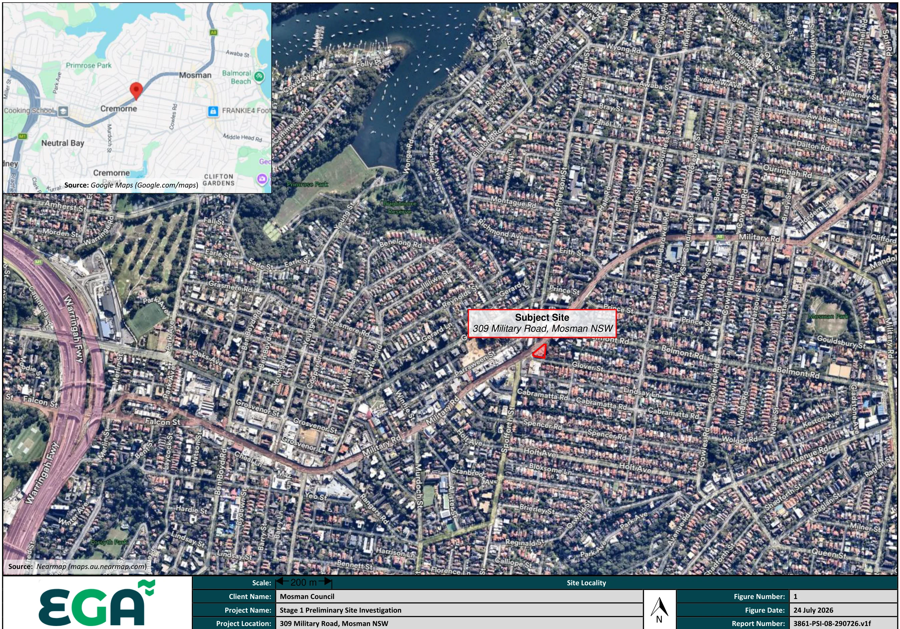

<!-- page 1185 -->

Scale: Site Layout Client Name: Figure Number: 2 Project Name: Stage 1 Preliminary Site Investigation Figure Date: 24 July 2026 Project Location: 309 Military Road, Mosman NSW Report Number: 3861-PSI-08-290726.v1f

Source:  Nearmap (maps.au.nearmap.com)

### LEGEND

Site Boundary

10 m

August 2026

Attachment 1.1.10 Mosman Council

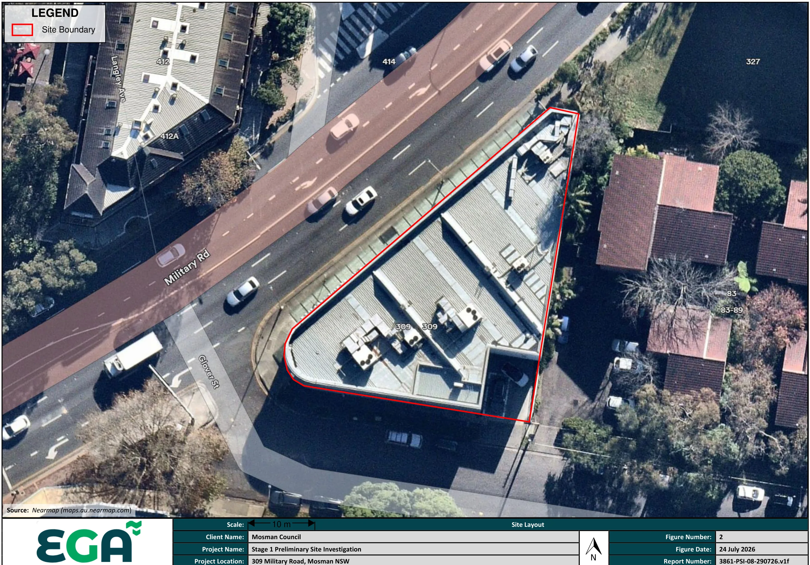

<!-- page 1186 -->

Scale: Site Layout Client Name: Figure Number: 3

Project Name: Stage 1 Preliminary Site Investigation Figure Date: 24 July 2026 Project Location: 309 Military Road, Mosman NSW Report Number: 3861-PSI-08-290726.v1f

Source:  Nearmap (maps.au.nearmap.com) 10 m

### LEGEND

Site Boundary

AEC-1 / AEC-2 / AEC-3 / AEC-4 - Potential Chemical Storage / Wastewater Treatment and Drainage Infrastructure / Potential Fuel Infrastructure / Potential Contaminants within Soils

AEC-5 - On-Site Structures

August 2026

Attachment 1.1.10 Mosman Council

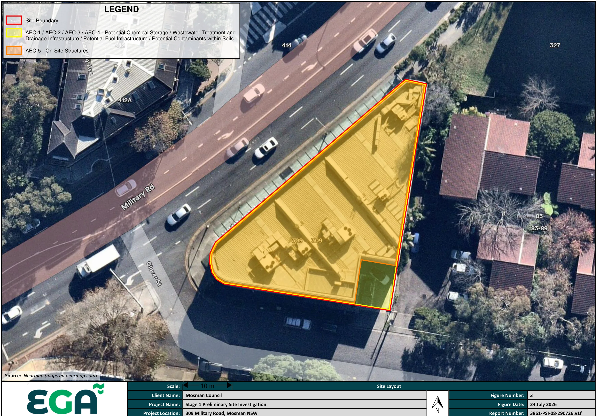

<!-- page 1187 -->

Desktop Phase 1 Environmental Site Assessment 309 Military Road, Mosman NSW 3861-PSI-08-290726.v2f

Page 25

#### APPENDIX A

#### GROUNDWATER BORE RECORDS

August 2026

Attachment 1.1.10 Mosman Council

<!-- page 1188 -->

home help contact customise State Overview State Overview Rivers and Streams favourites search download sites find a site Real Time Data - Rivers And Streams Daily River Reports Daily River Reports Dams favourites search download sites find a site Real Time Data - Major Dams Groundwater (Telemetered data) favourites search download sites find a site Real Time Data - Bores All Groundwater Site details search download sites find a site search by licence All Groundwater Map Meteorology favourites search download sites find a site Real Time Data - Weather Stations Hunter River Salinity Trading Scheme Hunter River Salinity Trading Scheme

bookmark this page All Groundwater Site Details ALL GROUNDWATER MAP All data times are Eastern Standard Time Map Info

There are no sites within 500 metres of the selected point. Zoom in and try again.

+ −

contact WaterNSW

7/24/26, 2:57 PM Real-time water data

https://realtimedata.waternsw.com.au/water.stm 1/2

August 2026

Attachment 1.1.10 Mosman Council

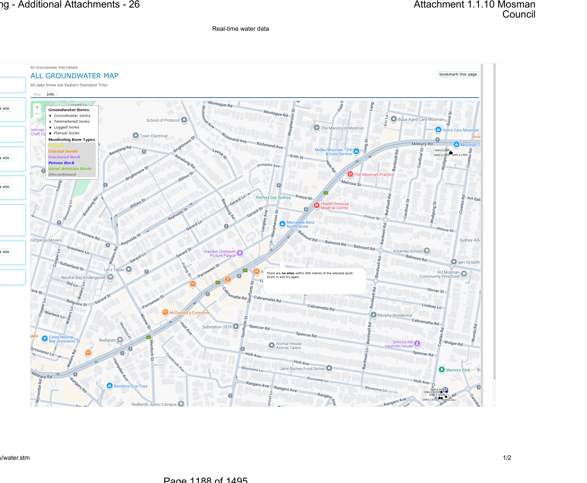

<!-- page 1189 -->

Desktop Phase 1 Environmental Site Assessment 309 Military Road, Mosman NSW 3861-PSI-08-290726.v2f

Page 26

#### APPENDIX B

#### NSW SEED MAP

August 2026

Attachment 1.1.10 Mosman Council

<!-- page 1190 -->

A NSW Government website

SEED Sharing and Enabling Environmental Data in NSW Search and download data Miners and Explorers map Browse by topic Case studies and insights Help and contact

How to use the SEED map Layers Legend Acid Sulfate Soil Risk Hm: High probability in bottom sediments H0: High probability at/near ground surface H0(s): High probability at/near ground surface with acidic scalds H1: High probability <1 m below ground surface H1(s): High probability <1 m below ground surface with acidic scalds H2: High probability 1 - 3 m below ground surface H2(p): High probability 1 - 3 m below ground surface in Pleistocene sediments H4: High probability >3 m below ground surface Lm: Low probability in bottom sediments L0: Low probability at/near ground surface L0(p): Low probability at/near ground surface on Pleistocene sediments L1: Low probability <1 m below ground surface L1(p): Low probability <1 m below ground surface in Pleistocene sediments L2: Low probability 1 - 3 m below ground surface L2(p): Low probability 1 - 3 m below ground surface in Pleistocene sediments L4: Low probability >3 m below ground surface L4(p): Low probability >3 m below ground surface on Pleistocene sediments N: No known occurrence N(p): No known occurrence in Pleistocene sediments NB: No known occurrence, Beach X0: Disturbed terrain, < 1 m below ground surface X1: Disturbed terrain, elevation 1 - 2 m AHD X1(p): Disturbed terrain, elevation 1 - 2m AHD in Pleistocene sediments X1(s): Disturbed terrain, elevation 1 - 2 m AHD with acidic scalds X2: Disturbed terrain, elevation 2 - 4 m AHD X2(p): Disturbed terrain, elevation 2 - 4 m AHD in Pleistocene sediments X2(s): Disturbed terrain, elevation 2 - 4 m AHD with acidic scalds X4: Disturbed terrain, elevation >4 m AHD X4(p): Disturbed terrain, elevation >4 m AHD in Pleistocene sediments Map data © OpenStreetMap contributors, Microsoft, Facebook, Inc. and its affiliates, Esri Community Maps contributors, Map layer by Esri Powered by Esri

Scale 18519 500 m X: 16835469.45 Y: -4005012.58 Projected Coordinates (X/Y)

#### 309 MILITARY ROAD MOSMAN 2088

Basemap

Draw/ Measure

Tools

Layer Intersect

Save Map

Contact Us Privacy Policy | More Info

7/24/26, 2:51 PM SEED Map

https://geo.seed.nsw.gov.au/vertigisstudio/web/?app=cabd04d595ec43c1aaf4298e80e83ec2 1/1

August 2026

Attachment 1.1.10 Mosman Council

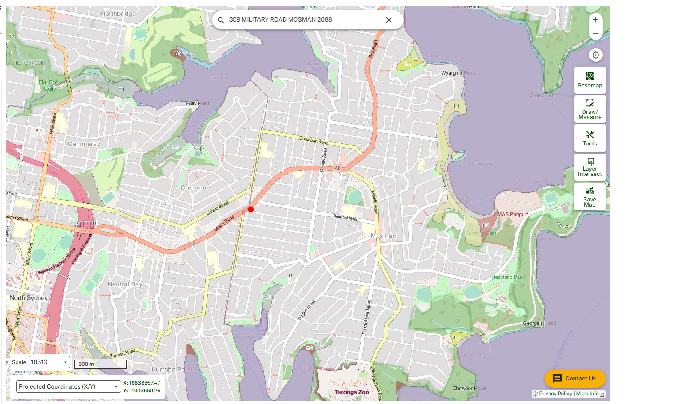

<!-- page 1191 -->

Desktop Phase 1 Environmental Site Assessment 309 Military Road, Mosman NSW 3861-PSI-08-290726.v2f

Page 27

#### APPENDIX C

#### HISTORICAL AERIAL IMAGERY

August 2026

Attachment 1.1.10 Mosman Council

<!-- page 1192 -->

Desktop Phase 1 Environmental Site Assessment 309 Military Road, Mosman NSW 3861-PSI-08-290726.v2f

Page 28

Historical Aerial 1. 1943 historical aerial imagery of the site. (Source: https://portal.spatial.nsw.gov.au/)

Historical Aerial 2. 1955 historical aerial imagery of the site. (Source: https://portal.spatial.nsw.gov.au/)

Historical Aerial 3. 1965 historical aerial imagery of the site. (Source: https://portal.spatial.nsw.gov.au/)

Historical Aerial 4. 1975 historical aerial imagery of the site. (Source: https://portal.spatial.nsw.gov.au/)

Historical Aerial 5. 1982 historical aerial imagery of the site. (Source: https://portal.spatial.nsw.gov.au/)

Historical Aerial 6. 1994 historical aerial imagery of the site. (Source: https://portal.spatial.nsw.gov.au/)

August 2026

Attachment 1.1.10 Mosman Council

<!-- page 1193 -->

Desktop Phase 1 Environmental Site Assessment 309 Military Road, Mosman NSW 3861-PSI-08-290726.v2f

Page 29

Historical Aerial 7. 2005 historical aerial imagery of the site. (Source: https://portal.spatial.nsw.gov.au/)

Historical Aerial 8. 2013 historical aerial imagery of the site. (Source: https://apps.nearmap.com/)

Historical Aerial 9. 2026 historical aerial imagery of the site. (Source: https://apps.nearmap.com/)

August 2026

Attachment 1.1.10 Mosman Council

<!-- page 1194 -->

Desktop Phase 1 Environmental Site Assessment 309 Military Road, Mosman NSW 3861-PSI-08-290726.v2f

Page 30

#### APPENDIX D

#### NSW EPA PUBLIC REGISTER

August 2026

Attachment 1.1.10 Mosman Council

<!-- page 1195 -->

Background

A strategy to systematically prioritise, assess and respond to notifications under Section 60 of the Contaminated Land Management Act 1997 (CLM Act) has been developed by the EPA. This strategy acknowledges the EPA’s obligations to make information available to the public under Government Information (Public Access) Act 2009 .

When a site is notified to the EPA, it may be accompanied by detailed site reports where the owner has been proactive in addressing the contamination and its source. However, often there is minimal information on the nature or extent of the contamination.

After receiving a report, the first step is to confirm that the report does not relate to a pollution incident. The Protection of the Environment Operations Act 1997 (POEO Act) deals with pollution incidents, waste stockpiling or dumping. The EPA also has an incident management process to manage significant incidents (https://www.epa.nsw.gov.au/reporting-and-incidents/incident- management).

In many cases, the information indicates the contamination is securely immobilised within the site, such as under a building or carpark, and is not currently causing any significant risks for the community or environment. Such sites may still need to be cleaned up, but this can be done in conjunction with any subsequent building or redevelopment of the land. These sites do not require intervention under the CLM Act, and are dealt with through the planning and development consent process. In these cases, the EPA informs the local council or other planning authority, so that the information can be recorded and considered at the appropriate time (https://www.epa.nsw.gov.au/your-environment/contaminated-land/managing-contaminated-land/role-of-planning-authorities).

Where indications are that the contamination could cause actual harm to the environment or an unacceptable offsite impact (i.e. the land is 'significantly contaminated'), the EPA would apply the regulatory provisions of the CLM Act to have the responsible polluter and/or landowner investigate and remediate the site. If the reported contamination could present an immediate or long-term threat to human health NSW Health will be consulted. SafeWork NSW and Water NSW can also be consulted if there appear to be occupational health and safety risks or an impact on groundwater quality.

As such, the sites notified to the EPA and presented in the list of contaminated sites notified to the EPA are at various stages of the assessment and remediation process. Understanding the nature of the underlying contamination, its implications and implementing a remediation program where required, can take a considerable period of time. The list provides an indication, in relation to each nominated site, as to the management status of that particular site. Further detailed information may be available from the EPA or the person who notified the site.

The following questions and answers may assist those interested in this issue.

Frequently asked questions

Why does my land appear on the list of notified sites?

Your land may appear on the list because:

• the site owner and/or the polluter has notified the EPA under section 60 of the CLM Act • the EPA has been notified via other means and is satisfied that the site is or was contaminated.

If a site is on the list, it does not necessarily mean the contamination is significant enough to regulate under the CLM Act.

List current as at 9 April 2026 1 of 139

August 2026

Attachment 1.1.10 Mosman Council

<!-- page 1196 -->

Does the list contain all contaminated sites in NSW?

No. The list only contains contaminated sites that EPA is aware of. If a site is not on the list, it does not necessarily mean the site is not contaminated.

The EPA relies on responsible parties and the public to notify contaminated sites.

How are notified contaminated sites managed by the EPA?

There are different ways the EPA can manage notified contaminated sites. Options include:

• regulation under the CLM Act, POEO Act, or both • notifying the relevant planning authority for management under the planning and development process • managing the site under the Protection of the Environment Operation (Underground Petroleum Storage Systems) Regulation 2014.

There are specific cases where contamination is managed under a tailored program operated by another agency (for example, the Resources & Geoscience's Legacy Mines Program).

What should I do if I am a potential buyer of a site that appears on the list?

You should seek advice from the seller to understand the contamination issue. You may need to seek independent contamination or legal advice.

The information provided in the list is indicative only and a starting point for your own assessment. Land contamination from past site uses is common, mainly in urban environments. If the site is properly remediated or managed, it may not affect the intended future use of the site.

Who can I contact if I need more information about a site?

You can contact the Environment Line at any time by calling 131 555 or by emailing info@environment.nsw.gov.au.

List of NSW Contaminated Sites Notified to the EPA

List current as at 9 April 2026 2 of 139

August 2026

Attachment 1.1.10 Mosman Council

<!-- page 1197 -->

Site Status

Under assessment

Under Preliminary Investigation Order

Regulation under CLM Act not required

Explanation

The contamination is being assessed by the EPA to determine whether regulation is required. The EPA may require further information to complete the assessment. For example, the completion of management actions regulated under the planning process or Protection of the Environment Operations Act 1997 .

The EPA has issued a Preliminary Investigation Order under s10 of the Contaminated Land Management Act 1997 , to obtain additional information needed to complete the assessment.

The EPA has completed an assessment of the contamination and decided that regulation under the Contaminated Land Management Act 1997 is not required.

Disclaimer

The EPA has taken all reasonable care to ensure that the information in the list of contaminated sites notified to the EPA (the list) is complete and correct. The EPA does not, however, warrant or represent that the list is free from errors or omissions or that it is exhaustive.

The EPA may, without notice, change any or all of the information in the list at any time.

You should obtain independent advice before you make any decision based on the information in the list.

The list is made available on the understanding that the EPA, its servants and agents, to the extent permitted by law, accept no responsibility for any damage, cost, loss or expense incurred by you as a result of:

1.            any information in the list; or 2.            any error, omission or misrepresentation in the list; or 3.            any malfunction or failure to function of the list; 4.            without limiting (2) or (3) above, any delay, failure or error in recording, displaying or updating information.

List current as at 9 April 2026 3 of 139

August 2026

Attachment 1.1.10 Mosman Council

<!-- page 1198 -->

Regulation being finalised

Contamination currently regulated under CLM Act

Contamination currently regulated under POEO Act

Contamination being managed via the planning process (EP&A Act)

Contamination formerly regulated under the CLM Act

Contamination formerly regulated under the POEO Act

The EPA has completed an assessment of the contamination and decided that the contamination is significant enough to warrant regulation under the Contaminated Land Management Act 1997 . A regulatory approach is being finalised.

The EPA has completed an assessment of the contamination and decided that the contamination is significant enough to warrant regulation under the Contaminated Land Management Act 1997 (CLM Act). Management of the contamination is regulated by the EPA under the CLM Act. Regulatory notices are available on the EPA’s Contaminated Land Public Record.

Contamination is currently regulated under the Protection of the Environment Operations Act 1997 (POEO Act).  The EPA as the appropriate regulatory authority reasonably suspects that a pollution incident is occurring/ has occurred and that it requires regulation under the POEO Act. The EPA may use environment protection notices, such as clean up notices, to require clean up action to be taken.  Such regulatory notices are available on the POEO public register.

The EPA has completed an assessment of the contamination and decided that the contamination is significant enough to warrant regulation. The contamination of this site is managed by the consent authority under the Environmental Planning and Assessment Act 1979 (EP&A Act) planning approval process, with EPA involvement as necessary to ensure significant contamination is adequately addressed. The consent authority is typically a local council or the Department of Planning and Environment.

The EPA has determined that the contamination is no longer significant enough to warrant regulation under the Contaminated Land Management Act 1997 (CLM Act). The contamination was addressed under the CLM Act.

The EPA has determined that the contamination is no longer significant enough to warrant regulation. The contamination was addressed under the Protection of the Environment Operations Act 1997 (POEO Act).

List current as at 9 April 2026 4 of 139

August 2026

Attachment 1.1.10 Mosman Council

<!-- page 1199 -->

Contamination was addressed via the planning process (EP&A Act)

Ongoing maintenance required to manage residual contamination (CLM Act)

The EPA has determined that ongoing maintenance, under the Contaminated Land Management Act 1997 (CLM Act), is required to manage the residual contamination. Regulatory notices under the CLM Act are available on the EPA’s Contaminated Land Public Record.

The EPA has determined that the contamination is no longer significant enough to warrant regulation. The contamination was addressed by the appropriate consent authority via the planning process under the Environmental Planning and Assessment Act 1979 (EP&A Act).

List current as at 9 April 2026 5 of 139

August 2026

Attachment 1.1.10 Mosman Council

<!-- page 1200 -->

Suburb SiteName Address ContaminationActivityType ManagementClass Latitude Longitude

MORPETH Telstra Cable Installation and RTA Bridge work Northumberland STREET Other Petroleum Regulation under CLM Act not required -32.72489729 151.6266795

MORPETH Former Service Station Swan  STREET Service Station Regulation under CLM Act not required -32.72477413 151.6250642

MORTLAKE Former Petroleum Storage Site 108-116 Tennyson ROAD Other Petroleum Regulation under CLM Act not required -33.83979033 151.1064889

MORTLAKE Kendall Bay Sediments Kendall BAY Gasworks Contamination currently regulated under CLM Act -33.83905999 151.1120458

MORTLAKE Former AGL site Tennyson  ROAD Gasworks Contamination formerly regulated under the CLM Act -33.84287407 151.1109313

MORTLAKE Majors Bay Redevelopment 14-22 Hilly STREET Other Industry Regulation under CLM Act not required -33.83954617 151.1054674

MORUYA Former Fuel Depot Moruya 11 to 13 Ford STREET Other Petroleum Regulation under CLM Act not required -35.9112243 150.0826475

MORUYA Caltex Service Station Moruya 80-84 Campbell STREET Service Station Regulation under CLM Act not required -35.91195596 150.0824213

MORUYA Ampol Fuel Depot - Moruya 26 Campbell STREET Service Station Regulation under CLM Act not required -35.9104985 150.0711419

MOSMAN 7-Eleven Mosman 162A Spit Road Corner Mitchell ROAD Service Station Regulation under CLM Act not required -33.81747016 151.2433633

MOSMAN BP Service Station 175 Ourimbah ROAD Service Station Regulation under CLM Act not required -33.82106757 151.233291

MOSMAN BP Express Mosman 175 Ourimbah  ROAD Service Station Regulation under CLM Act not required -33.82106459 151.2332921

MOSMAN 7-Eleven Service Station Mosman 45 Spit ROAD Service Station Regulation under CLM Act not required -33.82302718 151.2435627

MOSMAN Allan Border Oval Myahgah  ROAD Landfill Regulation under CLM Act not required -33.82681534 151.2417712

MOSMAN 173 Avenue Road, MOSMAN NSW 2088 173 Avenue ROAD Unclassified Regulation under CLM Act not required -33.930869 150.97132

List current as at 9 April 2026 85 of 139

August 2026

Attachment 1.1.10 Mosman Council

<!-- page 1201 -->

Suburb SiteName Address ContaminationActivityType ManagementClass Latitude Longitude

MOSS VALE Woolworths Service Station Moss Vale 609 Argyle  STREET Service Station Regulation under CLM Act not required -34.55409411 150.3609797

MOSS VALE Coles Express Service Station 579 Argyle STREET Service Station Regulation under CLM Act not required -34.55313422 150.364684

MOSS VALE Moss Vale Refuelling Facility Lackey ROAD Other Petroleum Regulation under CLM Act not required -34.54662421 150.3721525

MOUNT ANNAN Woolworths Caltex Mount Annan 157 Narellan (Corner Smeaton Grange Road) ROAD Service Station Regulation under CLM Act not required -34.04685527 150.7610434

MOUNT ANNAN Great Southern Railways Aqueduct Off Narellan  ROAD Unclassified Regulation under CLM Act not required -34.07308479 150.7707436

MOUNT COLAH Caltex Service Station Mount Colah 603 Pacific HIGHWAY Service Station Regulation under CLM Act not required -33.67034662 151.1151861

MOUNT COLAH Foxglove Oval Foxglove ROAD Landfill Contamination currently regulated under CLM Act -33.65829855 151.1229638

MOUNT DRUITT Caltex (former Mobil) Service Station, 17 Mount Street, Mount Druitt 17 Mount STREET Service Station Regulation under CLM Act not required -33.76567994 150.8244544

MOUNT DRUITT 7-Eleven Mount Druitt Lot 6 Luxford ROAD Other Petroleum Regulation under CLM Act not required -33.76483839 150.8254157

MOUNT HUTTON Woolworths Service Station 46 Wilsons ROAD Service Station Regulation under CLM Act not required -32.9836378 151.67309

MOUNT PRITCHARD 7-Eleven Service Station 352 Elizabeth DRIVE Service Station Regulation under CLM Act not required -33.90260656 150.8963326

MOUNT THORLEY Bulga Surface Operations Broke ROAD Other Industry Regulation under CLM Act not required -32.68325751 151.1206158

MOUNT THORLEY Lowes Petroleum (Former BP) Depot Mount Thorley 74 Mount Thorley ROAD Other Petroleum Regulation under CLM Act not required -32.62443074 151.1025122

MOUNT VICTORIA Former Mobil Service Station 81 Great Western HIGHWAY Service Station Regulation under CLM Act not required -33.5889727 150.2511783

MOUNT VICTORIA Caltex Service Station 36a Great Western HIGHWAY Service Station Regulation under CLM Act not required -33.58436517 150.2465528

List current as at 9 April 2026 86 of 139

August 2026

Attachment 1.1.10 Mosman Council

<!-- page 1202 -->

Search TIP To search for a specific site, search by LGA (local government area) and carefully review all sites listed. ... more search tips

Home Public registers Contaminated land record of notices Search results Your search for:Suburb: MOSMAN Search Again Refine Search did not find any records in our database. If a site does not appear on the record it may still be affected by contamination. For example: Contamination may be present but the site has not been regulated by the EPA under the Contaminated Land Management Act 1997 or the Environmentally Hazardous Chemicals Act 1985. The EPA may be regulating contamination at the site through a licence or notice under the Protection of the Environment Operations Act 1997 (POEO Act). Contamination at the site may be being managed under the planning process. More information about particular sites may be available from: The POEO public register The appropriate planning authority: for example, on a planning certificate issued by the local council under section 149 of the Environmental Planning and Assessment Act. See What's in the record and What's not in the record. If you want to know whether a specific site has been the subject of notices issued by the EPA under the CLM Act, we suggest that you search by Local Government Area only and carefully review the sites that are listed. This public record provides information about sites regulated by the EPA under the Contaminated Land Management Act 1997, including sites currently and previously regulated under the Environmentally Hazardous Chemicals Act 1985. Your inquiry using the above search criteria has not matched any record of current or former regulation. You should consider searching again using different criteria. The fact that a site does not appear on the record does not necessarily mean that it is not affected by contamination. The site may have been notified to the EPA but not yet assessed, or contamination may be present but the site is not yet being regulated by the EPA. Further information about particular sites may be available from the appropriate planning authority, for example, on a planning certificate issued by the local council under section 149 of the Environmental Planning and Assessment Act. In addition the EPA may be regulating contamination at the site through a licence under the Protection of the Environment Operations Act 1997. You may wish to search the POEO public register.POEO public register 13 July 2026

7/13/26, 12:13 PM DECCW | Search results

https://app.epa.nsw.gov.au/prclmapp/searchresults.aspx?&LGA=&Suburb=MOSMAN&Notice=&Name=&Text=&DateFrom=&DateTo= 1/1

August 2026

Attachment 1.1.10 Mosman Council

<!-- page 1203 -->

Home Public registers POEO Public Register Licences, applications and notices search Search results

Your search for: General Search with the following criteria Suburb - mosman returned 26 results Export to excel 2 of 2 Pages Search Again Number Name Location Type Status Issued date 1522383 TARONGA CONSERVATION SOCIETY AUSTRALIA BRADLEYS HEAD ROAD, MOSMAN, NSW 2088

s.58 Licence Variation Issued Issued 09 Jul 2015

1600361 TARONGA CONSERVATION SOCIETY AUSTRALIA BRADLEYS HEAD ROAD, MOSMAN, NSW 2088

Compliance Audit Complete Complete 14 Sep 2020

1603655 TARONGA CONSERVATION SOCIETY AUSTRALIA BRADLEYS HEAD ROAD, MOSMAN, NSW 2088

s.58 Licence Variation Issued Issued 08 Apr 2021

1615336 TARONGA CONSERVATION SOCIETY AUSTRALIA BRADLEYS HEAD ROAD, MOSMAN, NSW 2088

s.58 Licence Variation Issued Issued 23 Dec 2021

1623058 TARONGA CONSERVATION SOCIETY AUSTRALIA BRADLEYS HEAD ROAD, MOSMAN, NSW 2088

s.58 Licence Variation Issued Issued 30 Nov 2022

1630287 TARONGA CONSERVATION SOCIETY AUSTRALIA BRADLEYS HEAD ROAD, MOSMAN, NSW 2088

s.58 Licence Variation Issued Issued 03 Oct 2023

12 13 July 2026

7/13/26, 12:14 PM Environment & Heritage | PRPOEO

https://app.epa.nsw.gov.au/prpoeoapp/SearchResult.aspx?SearchTag=all&searchrange=general&range=general&SortExpression=AccountablePa… 1/1

August 2026

Attachment 1.1.10 Mosman Council

<!-- page 1204 -->

Home Public registers POEO Public Register Licences, applications and notices search Search results

Your search for: General Search with the following criteria Suburb - mosman returned 26 results Export to excel 1 of 2 Pages Search Again Number Name Location Type Status Issued date 1621649 THE SPIT, MOSMAN, NSW 2088 s.58 Licence Variation Issued Issued 08 Feb 2023 1028480 ARDENT LEISURE LIMITED  THE SPIT, MOSMAN, NSW 2088 s.58 Licence Variation Issued Issued 03 Jul 2003 1032563 ARDENT LEISURE LIMITED  THE SPIT, MOSMAN, NSW 2088 s.58 Licence Variation Issued Issued 20 Nov 2003 1069448 ARDENT LEISURE LIMITED  THE SPIT, MOSMAN, NSW 2088 s.58 Licence Variation Issued Issued 05 Feb 2007 1070978 ARDENT LEISURE LIMITED  THE SPIT, MOSMAN, NSW 2088 s.58 Licence Variation Issued Issued 14 Mar 2007 1072567 ARDENT LEISURE LIMITED  THE SPIT, MOSMAN, NSW 2088 s.58 Licence Variation Issued Issued 24 Apr 2007 1074550 ARDENT LEISURE LIMITED  THE SPIT, MOSMAN, NSW 2088 s.58 Licence Variation Issued Issued 13 Jun 2007 1078238 ARDENT LEISURE LIMITED  THE SPIT, MOSMAN, NSW 2088 s.58 Licence Variation Issued Issued 19 Sep 2007 1085886 ARDENT LEISURE LIMITED  THE SPIT, MOSMAN, NSW 2088 s.58 Licence Variation Issued Issued 12 May 2008 1097027 ARDENT LEISURE LIMITED  THE SPIT, MOSMAN, NSW 2088 s.58 Licence Variation Issued Issued 30 Jan 2009 1509253 ARDENT LEISURE LIMITED  THE SPIT, MOSMAN, NSW 2088 s.58 Licence Variation Issued Issued 24 Jun 2013 11724 HEALTHSCOPE OPERATIONS PTY LTD

#### 1 ELLAMATTA AVENUE,

MOSMAN, NSW 2088 POEO licence No longer in force No longer in force

16 Sep 2002

1048188 HEALTHSCOPE OPERATIONS PTY LTD

#### 1 ELLAMATTA AVENUE,

MOSMAN, NSW 2088 s.58 Licence Variation Issued Issued 27 May 2005 11211 MA MARINA FUND OPCO NO. 1 PTY LTD THE SPIT, MOSMAN, NSW 2088 POEO licence Issued Issued 30 Jan 2001 3514873 MA MARINA FUND OPCO NO. 1 PTY LTD THE SPIT, MOSMAN, NSW 2088 s.91 Clean Up Notice Issued Issued 10 Jan 2026 1596267 NONBANK MORTGAGES PTY. LTD. THE SPIT, MOSMAN, NSW 2088 s.58 Licence Variation Issued Issued 29 Jun 2021 1008406 OMNI LEISURE OPERATIONS LIMITED THE SPIT, MOSMAN, NSW 2088 s.58 Licence Variation Issued Issued 13 Jun 2001 1018813 OMNI LEISURE OPERATIONS LIMITED THE SPIT, MOSMAN, NSW 2088 s.58 Licence Variation Issued Issued 06 Sep 2002 1677 TARONGA CONSERVATION SOCIETY AUSTRALIA BRADLEYS HEAD ROAD, MOSMAN, NSW 2088

POEO licence Issued Issued 26 Sep 2000

1512309 TARONGA CONSERVATION SOCIETY AUSTRALIA BRADLEYS HEAD ROAD, MOSMAN, NSW 2088

Compliance Audit Complete Complete 21 Feb 2013

12 13 July 2026

7/13/26, 12:14 PM Environment & Heritage | PRPOEO

https://app.epa.nsw.gov.au/prpoeoapp/SearchResult.aspx?SearchTag=all&searchrange=general&range=general&SortExpression=AccountablePa… 1/1

August 2026

Attachment 1.1.10 Mosman Council
