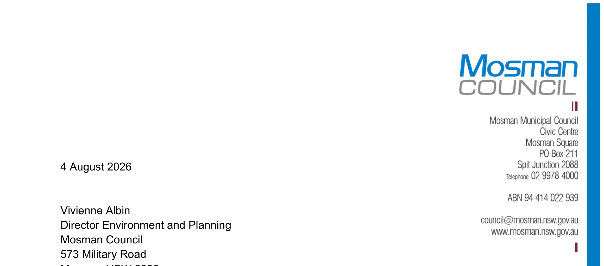

---

title: L Water Cycle and Stormwater Management

source: Extraordinary Council Meeting - Additional Attachments - 26 August 2026

pages: 1254-1257

---

# L Water Cycle and Stormwater Management

<!-- page 1254 -->

## L

### Water Cycle and

### Stormwater Management

August 2026

Attachment 1.1.12 Mosman Council

<!-- page 1255 -->

4 August 2026

Vivienne Albin Director Environment and Planning

573 Military Road Mosman NSW 2088

RE: Masterplan Area - Water Cycle and Stormwater Management

I have been requested to provide commentary on the Water Cycle and Stormwater Management within the Mosman Masterplan Area. Reference is made to the draft Mosman Masterplan Structure Plan prepared by SJB Architecture, dated 3 August 2026 (Drawing No. 06, Revision 08).

I am a professional engineer with a Bachelor of Civil Engineering and a Master of Science in Engineering. This assessment is informed by almost ten years of experience at Mosman Municipal Council reviewing and assessing engineering aspects of Development Applications, including the critiquing and evaluation of numerous stormwater management concepts and overland flow/flooding assessments. This assessment is also informed by over five years of experience in engineering consultancy in the construction industry, including stormwater quality and quantity management design and overland flow analysis, prior to joining Mosman Council.

The Department of Planning, Housing and Infrastructure’s Local Environmental Plan Making Guideline (July 2026) identifies that a Water Cycle and Stormwater Management Strategy may be required for greenfield sites, large-scale planning proposal sites, or sites located alongside riparian corridors, where the proposal needs to demonstrate that water quantity and quality can be managed within the proposed development.

The Mosman Masterplan proposal is not a greenfield site but rather considered as an urban renewal initiative. While the Masterplan represents a significant urban renewal initiative, any redevelopment is expected to occur on a gradual basis rather than as a single, large-scale site. A review of the Mosman Local Environmental Plan (LEP) 2012 Natural Resources Water Course Maps indicates that the Mosman Masterplan area does not contain any natural watercourse and hence a full riparian assessment and a broad water cycle and stormwater management strategy would not be relevant for the proposed Mosman Masterplan. For these developments, water quantity and quality outcomes would be more appropriately managed through Council's existing site-based controls rather than through a single broad masterplan-wide concept design.

A review of the Mosman Local Environmental Plan (LEP) 2012, Mosman Development Control Plan 2012 (amended December 2024) and Council's Policy for Stormwater Management in Mosman (amended December 2024) confirms that developers must consider both water quantity and water quality aspects of a proposed development. The Policy requires Permissible Site

August 2026

Attachment 1.1.12 Mosman Council

<!-- page 1256 -->

Discharge (PSD) requirements to be met and sets post-construction water quality targets for Gross Pollutants, Total Suspended Solids, Total Phosphorus and Total Nitrogen.

For developments in Mosman, water quantity is typically managed on site through a combination of on-site detention (OSD) and rainwater tanks whilst the water quality aspects are typically managed through in-ground stormwater treatment devices such as Gross Pollutant Traps (GPTs).

It is also important to note that the Masterplan Area in Mosman is already an established, predominantly impervious town centre precinct, where existing sites may not have water quantity and quality controls currently in place. As redevelopment occurs on a lot-by-lot basis under the Masterplan, Council's existing PSD and water quality requirements will be implemented by these sites. On this basis, development within the Masterplan Area will actively improve, rather than simply maintain, current water cycle and stormwater management outcomes.

Further, the Masterplan Area is already serviced by Mosman Council's existing stormwater drainage network which currently has over 30 Stormwater Quality Improvement Devices (SQIDs) which are maintained on a regular basis. The Section 7.12 contributions plan proposal that accompanies this Masterplan Proposal nominates funds for upgrades to existing SQIDs. This strategy would continue to supplement the water quality schemes employed within individual developments and further assist in improving the quality of stormwater runoff from areas outside future developments, such as parks, roads and footpaths.

Mosman Council is collaborating with neighbouring harbour Councils and the Sydney Coastal Councils Group who are currently working on the Outer Sydney Harbour CMP. As part of the process, studies have been initiated into stormwater pollution with future steps to include site specific or LGA- specific options for managing natural coastal assets, preventing litter and improving water quality.

Accordingly, having regard to: • Mosman Local Environmental Plan (LEP) 2012 • Mosman Development Control Plan 2012 (amended December 2024) • Council's Policy for Stormwater Management in Mosman (amended December 2024) • Council’s existing stormwater quality management program • the type and extent of development proposed under the Masterplan • the extensive stormwater quality and quantity management strategies submitted to Council as part of Development Applications; and • Mosman Council’s ongoing collaboration with neighbouring harbour Councils

it is my opinion that water quantity and quality within the Mosman Masterplan Area will continue to be capable of being managed on site, on a lot-by-lot basis, through a combination of rainwater tanks, on-site detention and proprietary water quality improvement devices. Consequently, no significant planning, water quantity or water quality constraints associated with stormwater management are anticipated.

Please don't hesitate to contact me if you have any questions.

Matthew Poon, BEng(Civil)(Hons), MEngSc(Civil) SENIOR CIVIL ENGINEER

August 2026

Attachment 1.1.12 Mosman Council

<!-- page 1257 -->

SJB Architecture (NSW) Pty Ltd ABN 20 310 373 425 ACN 081 094 724

Adam Haddow 7188 Emily Wombwell 10714 John Pradel 7004 Jonathan Tondi 11981 Nick Hatzi 9380

Drawing no. 06 Revision no. 08

Project no. 7218 Project Name Mosman Masterplan

Project address Mosman NSW Client 03/08/2026

STRUCTURE PLAN 0 70 140 210 280 350 Scale 1:7000 @ A1

St15

St15 St18

St10 St6

St4

St22 St15

St12

St6

St6 St8

St8

St12

St12 St6

St8

St8

St8 St8

St8

St8 St8

St4 St3

St3 St3

St4 St4 St4 St4

St5

St5

St8

St8 St6

St12 St12

St8 St8

St6 St6 St6 St6

St12 St12 St15 St15 St15

St8

St8

St8

St18 St18 St15

St18

St12

St12

St12

St8

St12

St12

St12

St12

St12

St18 St12

St12 St12

St10

St12 St12 St20

St8 St8 St8 St6

St6

St6

St6

St6

St6 St3

St3

St3

St6

St6

St6

St12

St12

St12

St12

St12

St12

St12

St8

St8

St8

St6

St6 St3

St8

St8 St8

St8

St8 St8 St10

St8

St6 St6 St6 St6

St6 St3

1500sqm 2000sqm

40 40 40 40 40

40

40

40

40

40 40 40 40 40 40

40

40

40

40

Sacred Hear Catholic Primary School

Mosman Public School

Allan Border Oval

Middle Habour Public School COWLES RD

ART GALLERY WAY

GOULDSBURY ST

BELMONT RD

THE CRESCENT

COWLES RD

COWLES RD

COWLES RD

HARBOUR ST

HARBOUR ST

WUNDA RD NOBLE ST

BRADY ST

OURIMBAH RD

OURIMBAH RD

AWABA ST AWABA ST

KILLARNEY ST AWABA LN

AMIENS AVE

MITCHELL RD BAPAUME RD STANTON LN

STANTON RD

WARRINGAH RD

PARRIWI RD

BICKELL RD

HORDERN PL HEYDON ST

HORDERN LN

SPIT RD

CIVI LN

SPIT RD

RAWSON ST

PUNCH LN

SPIT RD

PUNCH ST

CLIFFORD ST

MORUBEN RD

HORSNELL LN FIELD WAY GURRIGAL ST VISTA ST

VISTA ST

MYAHGAH RD

BOND ST

LANG ST

LANG ST

SNELL ST

MACKIE LN

HALE RD

HALE RD MACPHERSON ST

ERITH ST

PRINCE ST

MELROSE ST

MILITARY RD MILITARY RD

MILITARY RD MILITARY RD

MILITARY RD

EARL ST

OURIMBAH RD

PRINCE ST PRINCE ST

BELMONT RD BELMONT RD

GLOVER ST GLOVER ST LINDSAY LN

CABRAMATTA RD LINDSAY LN

TWIN TOWERS WALK

BARDWELL RD

BARDWELL RD

WUDGONG ST

WUDGONG ST

CARDINAL ST

CARDINAL ST

CARDINAL ST

ROSEBERY ST COUNTESS ST

RAWSON ST

MORUBEN RD

KEY

Boundary Open space Heritage items School Bus stop Relocated bus stop B-line Bus lane Heritage conservation areas De-listed heritage conservation areas Privately owned publicly accessible open space School grounds open space Retained street vegetation Retained mature tree canopy Proposed street canopy Proposed public open space Pedestrian only zones Shared zones Active frontage - 0m Front setback - 1.5m Front setback - 3m Front setback - 4m Front setback - 4.5m Front setback - 5m Front setback - 8m Rear setback - 9m Streetwall height - 2 storey Streetwall height - 6 storey Key site

Proposed crossing

Existing through site link Proposed through site link Green pedestrian link Indicative land dedication Proposed road

No exit

40 40km/h speed limit Proposed signalised intersection Existing public parking Proposed basement access Calm streets

Closed off roads

Traffic direction

Pedestrian bridge

Peel Off Corners

Low-density residential Medium-density residential High-density residential Local centre Infrastructure Retail anchor

Community anchor Sporting anchor

Educational anchor

Pick-up drop-off area

New playground

August 2026

Attachment 1.1.12 Mosman Council
