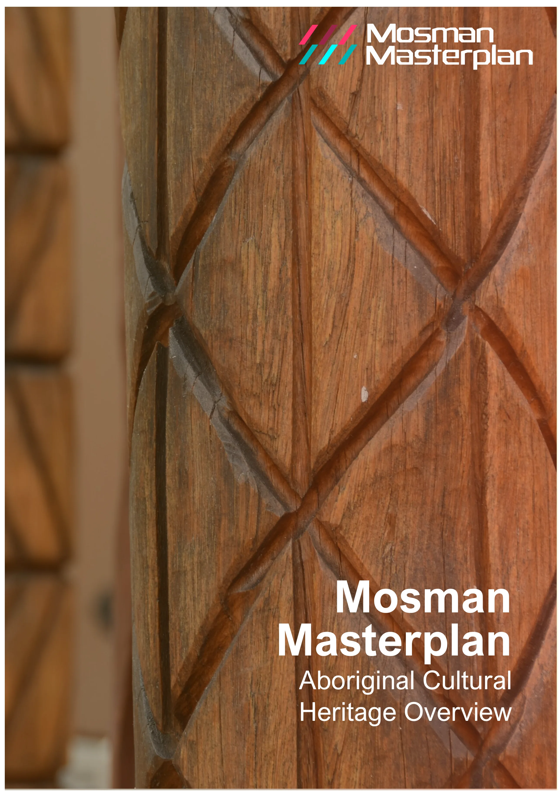
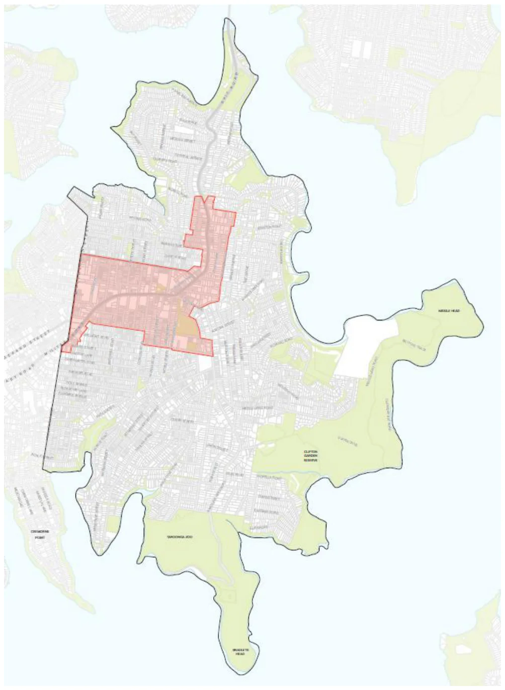
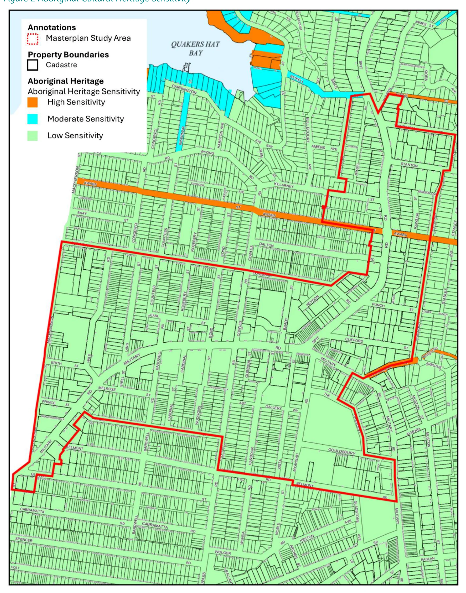
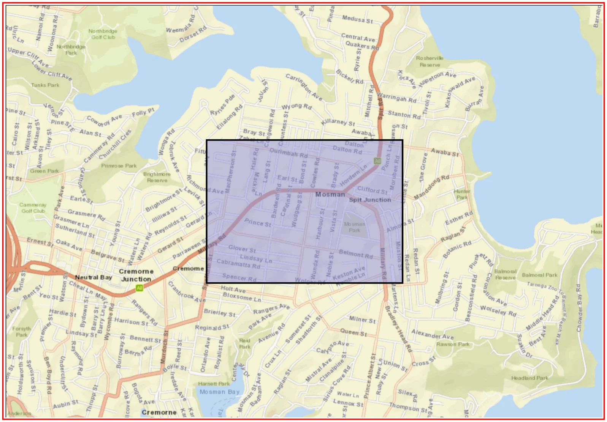
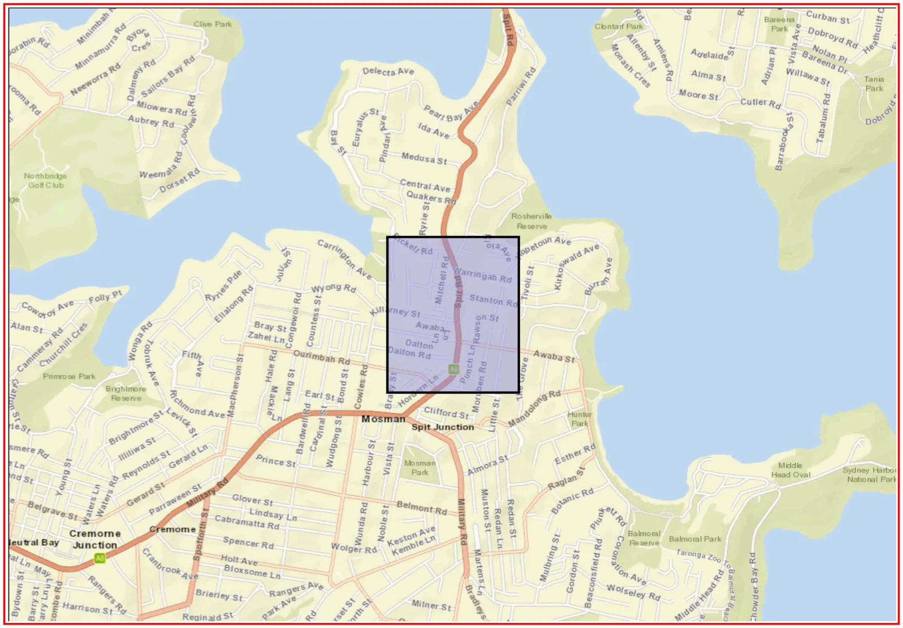
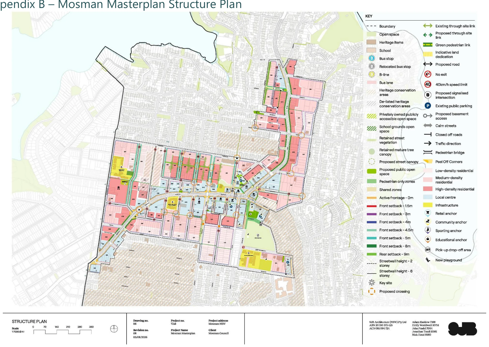

---

title: O Aboriginal Cultural Statement

source: Extraordinary Council Meeting - Additional Attachments - 26 August 2026

pages: 1269-1286

---

# O Aboriginal Cultural Statement

<!-- page 1269 -->

## O

### Aboriginal Cultural Statement

August 2026

Attachment 1.1.15 Mosman Council

<!-- page 1270 -->

## Mosman

## Masterplan

## Aboriginal Cultural

## Heritage Overview

August 2026

Attachment 1.1.15 Mosman Council

<!-- page 1271 -->

Mosman Masterplan – Aboriginal Cultural Heritage Overview

### Acknowledgement of Country

Mosman Council acknowledges the Borogegal and Cammeraigal people as the traditional custodians of this land. We pay our respects to Elders of the past and present and to those of the future and acknowledge their spiritual connection to Country.

Aboriginal Cultural Heritage Overview Prepared by Mosman Council

Copyright 2026 All information, graphics and photographs are copyright of Mosman Council unless otherwise noted. The content is protected by Australian and International Copyright and Trademark laws.

For further information contact

Civic Centre 573 Military Road Spit Junction NSW 2088 9978 4000 council@mosman.nsw.gov.au

August 2026

Attachment 1.1.15 Mosman Council

<!-- page 1272 -->

Mosman Masterplan – Aboriginal Cultural Heritage Overview

## Table of Contents

Introduction __________________________________________________________________________________ 1 Aboriginal History in Mosman _______________________________________________________________ 1 The Mosman Masterplan _____________________________________________________________________ 2 Statutory Framework _________________________________________________________________________ 4 National Parks and Wildlife Act 1974 ________________________________________________________ 4 NSW Heritage Act ___________________________________________________________________________ 4 Aboriginal Cultural Heritage in Mosman ___________________________________________________ 5 Recognising Country _________________________________________________________________________ 8 Consultation and Engagement ______________________________________________________________ 9 Conclusion ____________________________________________________________________________________ 9 Appendix A – AHIMS Search Results ______________________________________________________ 10 Appendix B – Mosman Masterplan Structure Plan _______________________________________ 11

August 2026

Attachment 1.1.15 Mosman Council

<!-- page 1273 -->

1

Mosman Masterplan – Aboriginal Cultural Heritage Overview

Introduction

Mosman Council (Council) is lodging a planning proposal for the draft Mosman Masterplan (the Masterplan) with the Department of Planning, Housing and Infrastructure.

The Masterplan has been prepared in response to the NSW Government’s Low and Mid-Rise Housing Policy (LMR) to ensure future growth better reflects local priorities, infrastructure needs, and respects Mosman’s unique character.

In Mosman, the LMR has sparked a rush of developer interest, but the one-size-fits-all approach has created community concern about pressures on infrastructure, local character, heritage and the environment.

Council has worked collaboratively with the State Government, securing agreement to prepare the long-term strategic Mosman Masterplan.

This report has been prepared by Mosman Council to inform the Mosman Masterplan with respect to the Aboriginal Cultural Heritage Sensitivity of the Masterplan study area and the Mosman Local Government Area (LGA). It considers the legislative framework, and reviews the findings of Aboriginal Heritage Study of the Mosman Local Government Area (Kelleher and Nightingale, 2005) and the Aboriginal Heritage Sensitivity Map for the Mosman LGA (Kelleher and Nightingale, 2011).

Aboriginal History in Mosman

Mosman is located on the traditional lands of the Borogegal and Cammeraigal people, who have maintained a deep and enduring connection to Country for tens of thousands of years.

Prior to European settlement in 1788, Aboriginal societies across Australia were diverse and complex, with distinct languages, customs and cultural practices. In the Mosman area, the harbour and waterways were central to daily life, providing food, supporting travel and connecting communities. As documented in Aboriginal Heritage of Mosman (NSW Government, 2005), evidence of this long history remains visible today through shell middens preserved on rocky foreshores, as well as sandstone engravings and pigment artworks depicting marine life and cultural stories.

The arrival of the British brought profound disruption to Aboriginal communities. The loss of traditional lands, displacement from Country and the introduction of new diseases had devastating impacts on local Aboriginal populations and their way of life. Despite these

August 2026

Attachment 1.1.15 Mosman Council

<!-- page 1274 -->

2

Mosman Masterplan – Aboriginal Cultural Heritage Overview

challenges, the cultural heritage and resilience of the Borogegal and Cammeraigal peoples endure.

Today, Mosman’s Aboriginal heritage remains an important part of the area’s identity, providing an enduring connection to the world’s oldest continuous living culture and a reminder of the significance of caring for Country.

The Mosman Masterplan

The Masterplan has been prepared to deliver capacity for an additional 4700 new dwellings, which aligns with the capacity of the LMR.

The Masterplan seeks to redefine the boundaries of the LMR, reducing the area of change from 27% of Mosman’s developable land to 12%. In doing so, the Masterplan leverages opportunities to focus development along Mosman’s ridges to facilitate improved planning outcomes including increased connectivity, access to transport and services, and the protection of heritage and scenic character.

In addition, the Masterplan seeks to leverage opportunities to provide increased public benefit, including through new public open spaces, through-site links, new infrastructure and affordable housing. The Masterplan area is depicted in the map in Figure 1.

In preparing this report, consideration has been given to the draft Mosman Masterplan Structure Plan prepared by SJB Architecture, dated 3 August 2026 (Drawing No. 06, Revision 08), which is included in Appendix B.

August 2026

Attachment 1.1.15 Mosman Council

<!-- page 1275 -->

3

Mosman Masterplan – Aboriginal Cultural Heritage Overview

Figure 1 Area to which the Mosman Masterplan Applies (Shaded Red)

August 2026

Attachment 1.1.15 Mosman Council

<!-- page 1276 -->

4

Mosman Masterplan – Aboriginal Cultural Heritage Overview

Statutory Framework

National Parks and Wildlife Act 1974

The National Parks and Wildlife Act 1974 (NPW Act), is the primary legislation that protects Aboriginal objects and declared Aboriginal places in NSW.

The NPW Act provides automatic statutory protection to all Aboriginal objects, regardless of whether they have been formally identified or recorded. The Aboriginal Heritage Information Management System (AHIMS) is the central database for information relating to Aboriginal cultural heritage and is maintained under the NPW Act. AHIMS contains records of known Aboriginal objects, Aboriginal Places and archaeological sites in the State.

An AHIMS search was undertaken to identify any recorded Aboriginal objects or declared Aboriginal Places within the Mosman Masterplan study area. No Aboriginal sites or Aboriginal Places were identified within the search area. AHIMS search results are provided in Appendix A of this report.

Although no recorded sites were identified within the Masterplan study area, all Aboriginal objects are protected under the NPW Act whether or not they are recorded in AHIMS. Accordingly, the future development of individual sites should consider the potential for previously unidentified Aboriginal objects to be present. If suspected Aboriginal objects are encountered during works, all works in the immediate vicinity should stop and Heritage NSW should be notified so that appropriate management measures can be implemented.

NSW Heritage Act

The Heritage Act 1977 provides supplementary protection for Aboriginal heritage in New South Wales. While Aboriginal objects and Aboriginal Places are primarily protected under the NPW Act, places of Aboriginal heritage significance may also be listed on the State Heritage Register or identified as heritage items under local planning instruments. In these circumstances, the Heritage Act assists in the conservation and management of significant Aboriginal heritage values alongside the protections provided by the NPW Act.

No sites with Aboriginal cultural heritage themes were identified within the Masterplan study area following searches of the State Heritage Register for the Mosman LGA and of Schedule 5 Environmental heritage of the Mosman Local Environmental Plan 2012.

August 2026

Attachment 1.1.15 Mosman Council

<!-- page 1277 -->

5

Mosman Masterplan – Aboriginal Cultural Heritage Overview

Aboriginal Cultural Heritage in Mosman

The Aboriginal Heritage Study of the Mosman Local Government Area (the Study) was prepared in 2005 by Kelleher and Nightingale for Mosman Council, in partnership with the National Parks and Wildlife Service, the Metropolitan Local Aboriginal Land Council, and the Sydney Harbour Federation Trust.

The Study provides a comprehensive assessment of Aboriginal cultural heritage across the Mosman LGA. It identifies Mosman as “exceptional in its Aboriginal archaeological heritage,” noting that evidence of Aboriginal occupation occurs across all landforms within the municipality, particularly in areas that have experienced limited development.

While much of Mosman has been urbanised through residential, commercial and infrastructure uses, resulting in the disturbance or concealment of many traces of past Aboriginal occupation, several areas of relatively intact natural landscape remain. These include Council-managed open space, bushland and foreshore land within Sydney Harbour National Park, foreshore land managed by the Sydney Harbour Federation Trust, and areas within Taronga Zoo and HMAS Penguin.

The Study identifies a total of 107 known Aboriginal sites and potential archaeological deposits within the Mosman LGA. Mapping of these locations is contained in Volume 3 of the Study, which is not publicly available to protect culturally sensitive information. A review of the mapping was undertaken for this project and did not identify any known Aboriginal sites within the Masterplan study area.

The Study further notes that Aboriginal sites occur across all landscape settings, including foreshore areas, lower slopes, ridgesides and ridgetops. However, site distribution patterns indicate that certain landforms were more intensively used than others. The majority of sites are located in the foreshore/lower slope area. Conversely, the lowest frequencies of archaeological sites occur on interconnecting ridgetops.

It suggests that the sparse occupation of the ridgetop indicates these areas were likely used to gather specialist resources (such as sandstone) or as transit sites where people spent relatively small amounts of time when enroute to other places. It is therefore observed that there is less potential for undiscovered Aboriginal cultural heritage sites in these areas.

In addition to the Study, a review was undertaken of the Aboriginal Heritage Sensitivity Map for the Mosman LGA, prepared by Kelleher Nightingale Consulting in 2011. The map

August 2026

Attachment 1.1.15 Mosman Council

<!-- page 1278 -->

6

Mosman Masterplan – Aboriginal Cultural Heritage Overview

classifies land according to its potential Aboriginal heritage sensitivity, identifying areas as either Low, Moderate or High Aboriginal Heritage Sensitivity.

Figure 2 depicts the Mosman Masterplan study area in the context of the Aboriginal Heritage Sensitivity Map. The Masterplan study area is located on the ridgetops of Mosman and is almost entirely within land classified as Low Aboriginal Heritage Sensitivity. The only exceptions are portions of the road reserves along Mandolong Road, Fairfax Road and Awaba Street, which are classified as High Aboriginal Heritage Sensitivity.

Areas of low sensitivity contain lands which exhibit a low statistical potential to contain significant archaeological deposit. Activities in these areas which disturb the ground are unlikely to harm Aboriginal objects. Professional heritage advice is not required for low sensitivity areas.

Areas of high sensitivity have identified archaeological sites and contain lands which are relatively less disturbed (e.g. parks) and/or have a high statistical potential to contain unidentified Aboriginal objects (e.g. sandy deposits or sandstone rock platforms). Any activity in these areas which will disturb the ground will require a due diligence assessment to assess the potential impact of the proposed activity. Professional heritage advice may be required when undertaking due diligence in high sensitivity areas, especially if the site presents low levels of disturbance.

The Masterplan includes a number of transport improvement initiatives, including the proposed installation of a pedestrian crossing and refuge island on Awaba Street, as well as the potential upgrade of the intersection of Spit Road and Awaba Street. While these locations are within areas mapped as having High Aboriginal Heritage Sensitivity, the works would be delivered as separate projects to the Masterplan. As such, project-specific investigations and due diligence would be undertaken during the detailed design and implementation phases to ensure potential heritage impacts are appropriately managed.

There are no known Aboriginal Sites within the Masterplan study area, and a review of Aboriginal Cultural Heritage Sensitivity indicates the study area is mostly low sensitivity. Based on the above, it is considered that there is a low likelihood the Masterplan would impact on areas, objects, places or landscapes of heritage significance to Aboriginal culture and landscape.

If any unknown items or objects were to be discovered during the development of land within the study area, these could be managed on a case-by-case basis and in accordance with NPW Act.

August 2026

Attachment 1.1.15 Mosman Council

<!-- page 1279 -->

7

Mosman Masterplan – Aboriginal Cultural Heritage Overview

Figure 2 Aboriginal Cultural Heritage Sensitivity

August 2026

Attachment 1.1.15 Mosman Council

<!-- page 1280 -->

8

Mosman Masterplan – Aboriginal Cultural Heritage Overview

Recognising Country

Archaeological heritage is only one aspect of many of the cultural heritage values of places important to Aboriginal people.

According to the Guide to Investigating, Assessing and Reporting on Aboriginal Cultural Heritage in NSW (NSW Government, 2011) an absence of tangible heritage does not equate to a location having no cultural heritage value to Aboriginal people. Aboriginal cultural heritage values may exist even where no physical evidence is present. These values can include ongoing cultural connections to Country, stories associated with Mosman, traditional knowledge, cultural practices, language, and community memories that contribute to the significance of a place for Aboriginal people. As such as It is important that the delivery of the Masterplan recognises Aboriginal people’s ongoing connection to Country in Mosman.

The Mosman Masterplan acknowledges that it is located on the traditional lands of the Borogegal and Cammeraigal peoples. The Masterplan includes opportunities to recognise and celebrate the enduring connection of Aboriginal people to Country through Aboriginal art, storytelling and interpretive elements integrated into the design of open spaces, landscaped areas and laneways.

A recent example of this approach is Council's First Nations Signage Project, which involved collaboration with three leading First Nations creatives to develop and install a series of interpretive signs at key locations across Mosman. The project provides an accessible medium to share Aboriginal cultural knowledge, art, stories, history and connections to Country with the broader community. A similar approach could be considered as part of future public domain improvements arising from the Masterplan, incorporating Aboriginal cultural heritage themes, narratives and interpretive elements into streetscapes, open spaces, laneways and other public spaces. Such initiatives would support opportunities for cultural recognition, education and place-making while strengthening the visibility of Aboriginal heritage and the ongoing connection of Aboriginal people to Country within Mosman.

Further, the Mosman Council Interim Public Art Investment and Delivery Framework has been prepared to support the directions established through the Masterplan while a comprehensive Public Art Masterplan is being developed. This provides a strategic foundation for future investment, ensuring that culture and creativity are embedded within the broader vision for Mosman’s growth and civic development.

The Delivery Framework highlights the importance of recognising Country, noting that the “selection of artists will prioritise diverse and local perspectives and practices, including opportunities for First Nations artists to contribute works that reflect cultural knowledge, stories and connections to place.”

August 2026

Attachment 1.1.15 Mosman Council

<!-- page 1281 -->

9

Mosman Masterplan – Aboriginal Cultural Heritage Overview

Consultation and Engagement

In undertaking preliminary consultation for the Masterplan, the Metropolitan Aboriginal Land Council was notified and invited to provide feedback. While no comments were received at that stage, the formal exhibition of the Masterplan provides a further opportunity for input. Notification of the exhibition will be provided to the Metropolitan Aboriginal Land Council, as well as other relevant First Nations communities and organisations.

Conclusion

Based on a review of the available information, including the AHIMS search results and the Aboriginal Heritage Study of the Mosman Local Government Area, implementation of the Mosman Masterplan is not anticipated to result in impacts to known Aboriginal cultural heritage values, Aboriginal objects, Aboriginal Places or areas of identified Aboriginal archaeological sensitivity.

Notwithstanding this assessment, the Masterplan represents a significant place-making opportunity, and accordingly it seeks to recognise and celebrate the continuing connection of First Nations peoples to Country. Opportunities will be explored to incorporate Aboriginal perspectives, stories and cultural values into the public domain through measures such as public art, interpretation and landscape design.

The formal exhibition of the Masterplan provides a further opportunity for First Nations input. Notification of the exhibition should be provided to the Metropolitan Aboriginal Land Council, as well as other relevant First Nations communities and organisations.

The study area is mostly considered to be of low Aboriginal archaeological sensitivity and no recorded Aboriginal cultural heritage sites or places have been identified within the study area. While this provides a favourable context for the Masterplan, consideration of Aboriginal heritage should continue at the individual site level as projects progress. In accordance with the requirements of the National Parks and Wildlife Act 1974, all Aboriginal objects are protected whether or not they have been previously identified or recorded. Should suspected Aboriginal objects be encountered during ground-disturbing works, works must cease immediately to ensure that appropriate protection measures can be implemented.

August 2026

Attachment 1.1.15 Mosman Council

<!-- page 1282 -->

10

Mosman Masterplan – Aboriginal Cultural Heritage Overview

Appendix A – AHIMS Search Results

August 2026

Attachment 1.1.15 Mosman Council

<!-- page 1283 -->

#### AHIMS Web Services (AWS)

Search Result Your Ref/PO Number : Masterplan North Client Service ID : 1159588 Date: 17 July 2026 Evan Matthews 573 Military Road Mosman  New South Wales  2088

Dear Sir or Madam: AHIMS Web Service search for the following area at Lat, Long From : -33.830664, 151.229872 - Lat, Long To : -33.820898, 151.245681, conducted by Evan Matthews on 17 July 2026.

Email: e.matthews@mosman.nsw.gov.au

Attention: Evan  Matthews

The context area of your search is shown in the map below. Please note that the map does not accurately display the exact boundaries of the search as defined in the paragraph above. The map is to be used for general reference purposes only.

A search of Heritage NSW AHIMS Web Services (Aboriginal Heritage Information Management System) has shown that: 0 0

Aboriginal sites are recorded in or near the above location. Aboriginal places have been declared in or near the above location. *

August 2026

Attachment 1.1.15 Mosman Council

<!-- page 1284 -->

#### AHIMS Web Services (AWS)

Search Result Your Ref/PO Number : Masterplan North Client Service ID : 1159592 Date: 17 July 2026 Evan Matthews 573 Military Road Mosman  New South Wales  2088

Dear Sir or Madam: AHIMS Web Service search for the following area at Lat, Long From : -33.823389, 151.240039 - Lat, Long To : -33.816227, 151.247178, conducted by Evan Matthews on 17 July 2026.

Email: e.matthews@mosman.nsw.gov.au

Attention: Evan  Matthews

The context area of your search is shown in the map below. Please note that the map does not accurately display the exact boundaries of the search as defined in the paragraph above. The map is to be used for general reference purposes only.

A search of Heritage NSW AHIMS Web Services (Aboriginal Heritage Information Management System) has shown that: 0 0

Aboriginal sites are recorded in or near the above location. Aboriginal places have been declared in or near the above location. *

August 2026

Attachment 1.1.15 Mosman Council

<!-- page 1285 -->

11

Mosman Masterplan – Aboriginal Cultural Heritage Overview

Appendix B – Mosman Masterplan Structure Plan

August 2026

Attachment 1.1.15 Mosman Council

<!-- page 1286 -->

Mosman Masterplan – Aboriginal Cultural Heritage Overview

August 2026

Attachment 1.1.15 Mosman Council

