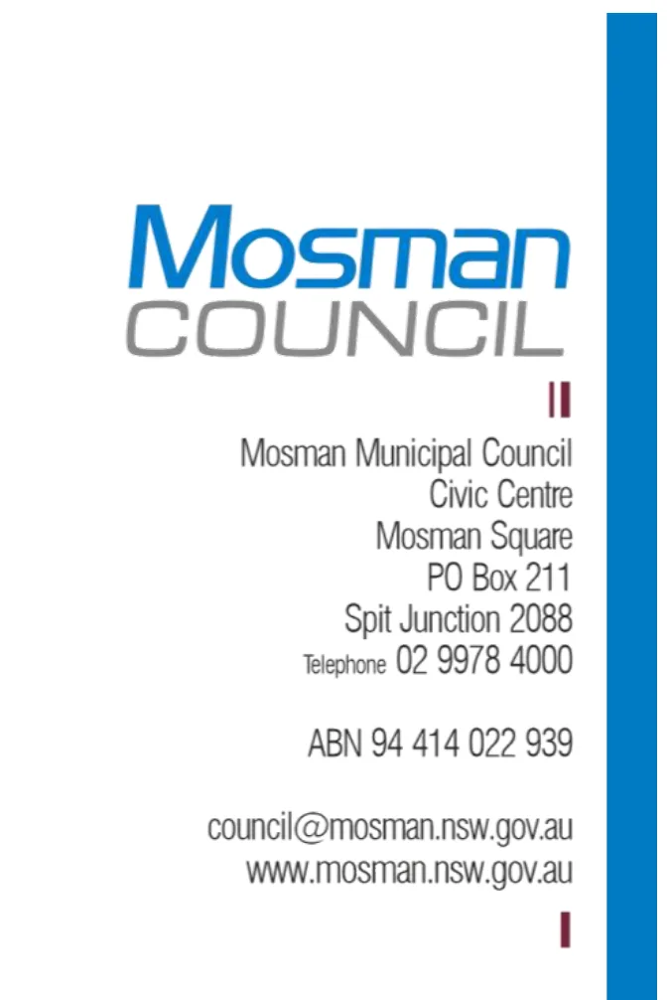
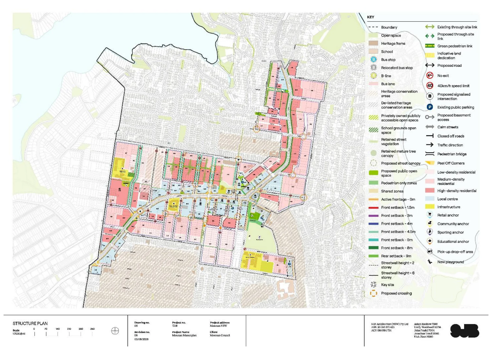

---

title: P Ecologically Sustainable Development

source: Extraordinary Council Meeting - Additional Attachments - 26 August 2026

pages: 1287-1290

---

# P Ecologically Sustainable Development

<!-- page 1287 -->

## P

### Ecologically Sustainable Development

August 2026

Attachment 1.1.16 Mosman Council

<!-- page 1288 -->

Vivienne Albin Director Environment and Planning

573 Military Road Mosman NSW 2088

RE: Masterplan Area Sustainability Assessment

I have been requested to provide commentary on ecologically sustainable development within the Mosman Masterplan planning proposal.

This assessment draws on thirteen years of professional experience in environmental management, ecology and sustainability within the Mosman area, including almost five years at Mosman Council. During my time with Council, I have held the positions of Environmental Sustainability Officer and Coordinator Environment, providing me with extensive knowledge of local environmental issues, policy frameworks and sustainability initiatives.

This assessment is also informed by my formal qualifications, which include a Doctor of Philosophy (PhD) in Science and a Bachelor of Science (Honours Class I) in Biology and Marine Science. Prior to joining Mosman Council, I spent over ten years working in academia, undertaking both research and teaching in ecology and environmental science at The University of Sydney, The University of Technology Sydney, The University of New South Wales and The Sydney Institute of Marine Science. My research has been published in 12 peer-reviewed papers in international scientific journals and has been cited 373 times in the scientific literature, reflecting the quality and impact of my contributions to the field.

Mosman Council is committed to the principles of Ecologically Sustainable Development, which requires the integration of environmental, economic and social considerations into decision making. The Local Government Act 1993 provides the legal framework for an environmentally responsible system of local government in NSW. The Act requires councils, councillors and council employees to have regard to the principles of ecologically sustainable development when carrying out their responsibilities. Council’s Charter further requires Council to properly manage, develop, protect, restore, enhance and conserve the environment of the area for which it is responsible, in a manner that is consistent with and promotes the principles of ecologically sustainable development. Mosman Council supports these principles through on-ground sustainability projects, operational improvements, community education and engagement of sustainable practices.

Environmental protection is identified as a key principle in the Mosman Masterplan and is supported by the sustainability initiatives outlined in the supporting urban design framework document and Mosman Masterplan Structure Plan prepared by SJB Architecture, dated 3 August 2026 (Drawing No. 06, Revision 08, attached to this letter below). The focus on increased tree canopy, connected green spaces, active transport, climate-responsive design, water-sensitive urban design, biodiversity enhancement and the integration of First Nations stories reflects a broad and contemporary approach to sustainability.

August 2026

Attachment 1.1.16 Mosman Council

<!-- page 1289 -->

The proposed 40% canopy cover target, deep soil zones and building setbacks to protect mature trees and reduce hard stand areas will help mitigate the urban heat island effect and improve biodiversity. The expanded open space network, public domain improvements and 4km regional cycle link will support active transport and better pedestrian connectivity. Together with water- sensitive urban design initiatives, these measures provide a strong foundation for a more resilient, connected and liveable Mosman.

The preferred Masterplan option further supports these outcomes by reducing the overall area of change from 27% to approximately 12%, protecting existing landscapes, retaining mature trees and concentrating higher-density development close to public transport and services. These measures are generally consistent with the principles of Ecologically Sustainable Development, helping to minimise environmental impacts while supporting housing delivery.

Mosman Council has a target to achieve net zero emissions for Council operations by 2030 and an aspirational target of net zero emissions for the broader community by 2040. Therefore, it is my opinion that assessment of development projects under the Mosman Masterplan should encourage the reduction of greenhouse gas emissions where possible in accordance with Mosman Council and the NSW Government’s long-term objectives of greenhouse gas reduction.

Please do not hesitate to contact me should you require any further information.

Dr Paloma Matis PhD (Science), BSc (Biology and Marine Science) (Hons 1) COORDINATOR ENVIRONMENT

August 2026

Attachment 1.1.16 Mosman Council

<!-- page 1290 -->

Mosman Masterplan Structure Plan prepared by SJB Architecture, dated 3 August 2026 (Drawing No. 06, Revision 08)

August 2026

Attachment 1.1.16 Mosman Council

