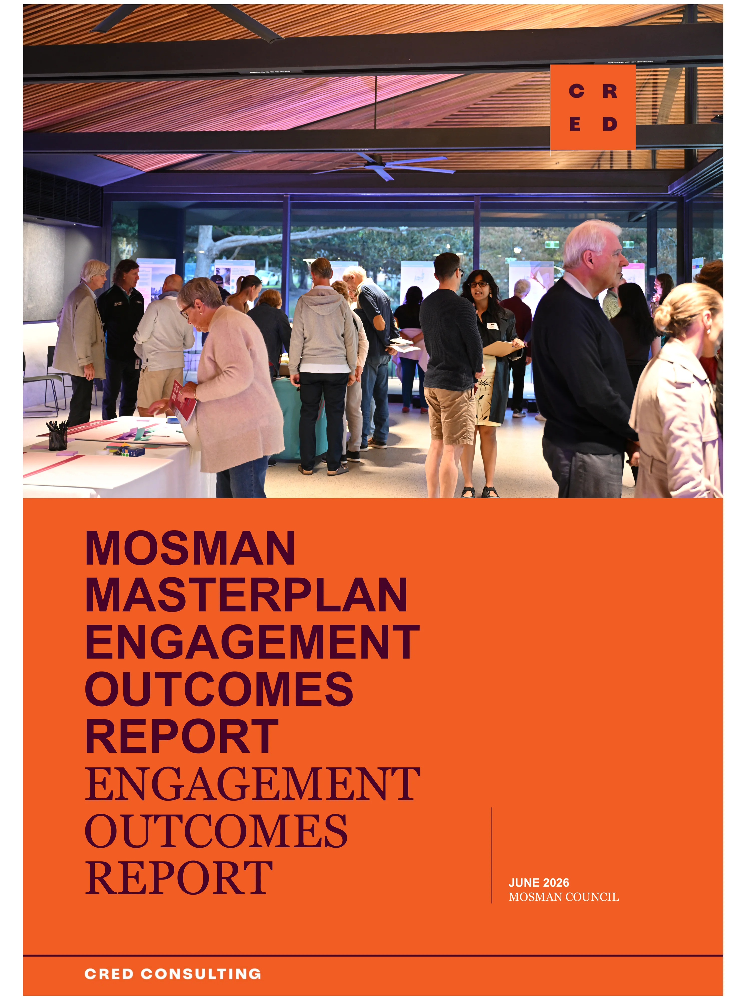
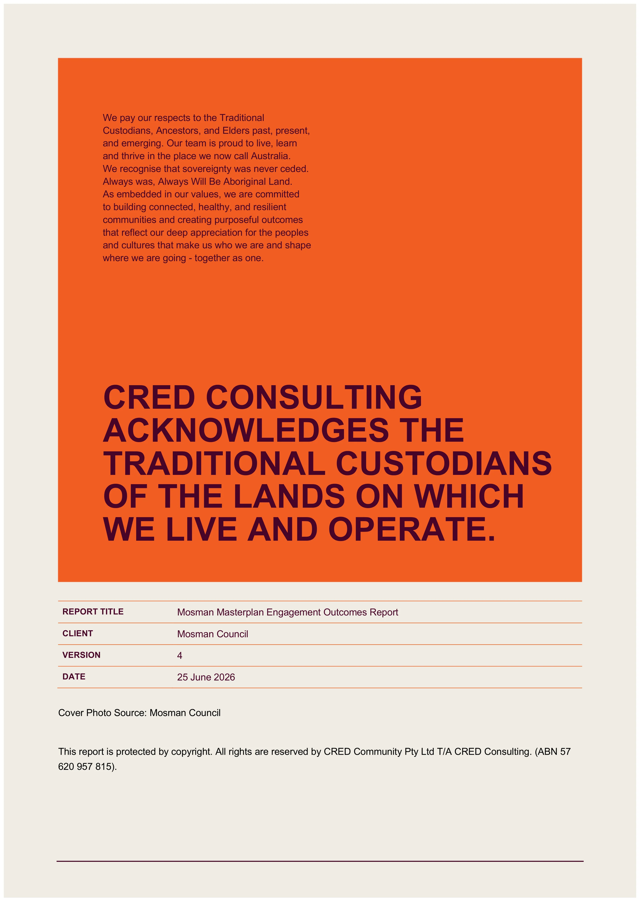
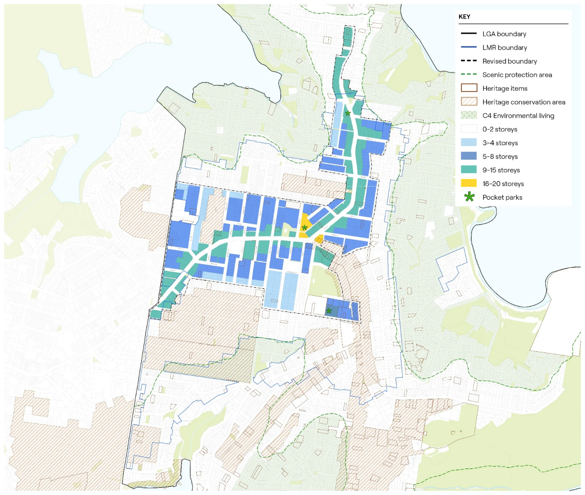
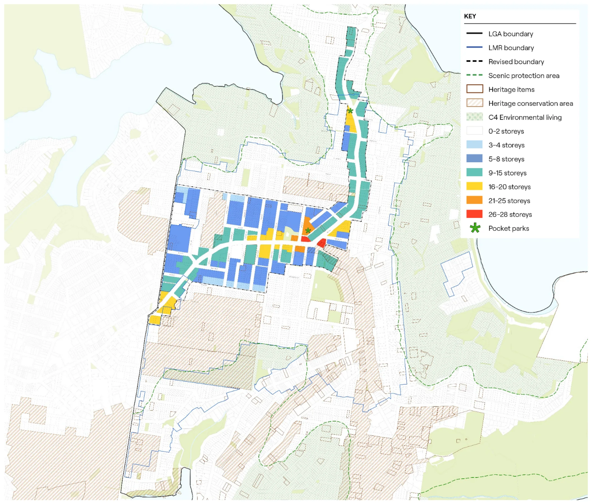
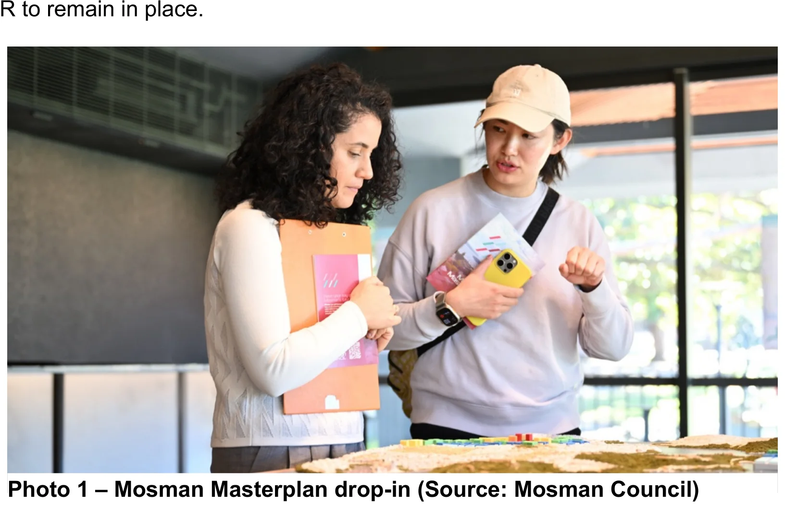
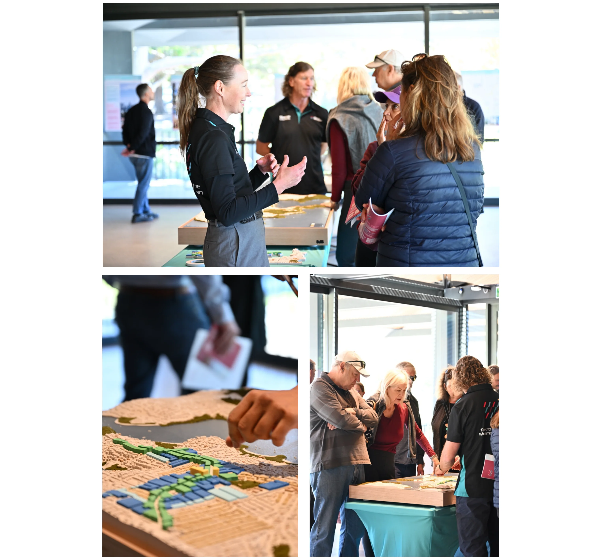
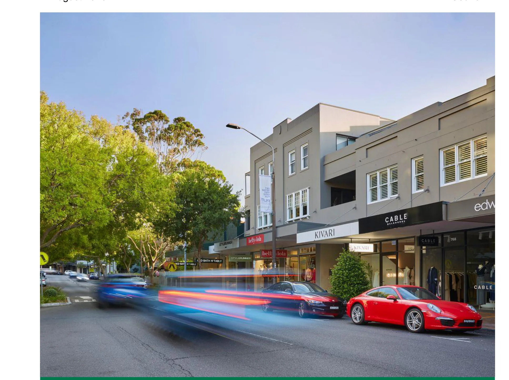
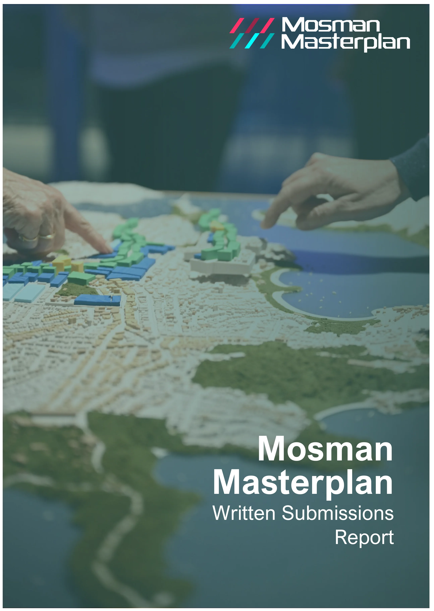
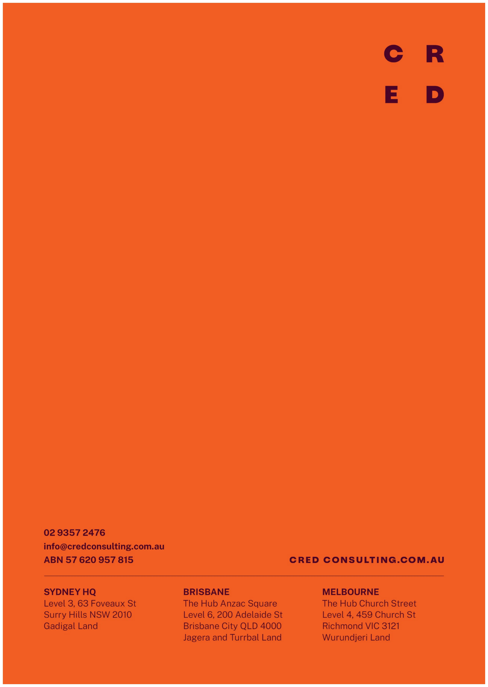

---

title: Q Engagement Outcomes Report

source: Extraordinary Council Meeting - Additional Attachments - 26 August 2026

pages: 1291-1374

---

# Q Engagement Outcomes Report

<!-- page 1291 -->

## Q

### Engagement Outcomes Report

August 2026

Attachment 1.1.17 Mosman Council

<!-- page 1292 -->

## MOSMAN

## MASTERPLAN

## ENGAGEMENT

## OUTCOMES

## REPORT

## ENGAGEMENT

## OUTCOMES

## REPORT

JUNE 2026

August 2026

Attachment 1.1.17 Mosman Council

<!-- page 1293 -->

We pay our respects to the Traditional Custodians, Ancestors, and Elders past, present, and emerging. Our team is proud to live, learn and thrive in the place we now call Australia. We recognise that sovereignty was never ceded. Always was, Always Will Be Aboriginal Land. As embedded in our values, we are committed to building connected, healthy, and resilient communities and creating purposeful outcomes that reflect our deep appreciation for the peoples and cultures that make us who we are and shape where we are going - together as one.

## CRED CONSULTING

## ACKNOWLEDGES THE

## TRADITIONAL CUSTODIANS

## OF THE LANDS ON WHICH

## WE LIVE AND OPERATE.

REPORT TITLE Mosman Masterplan Engagement Outcomes Report CLIENT VERSION 4 DATE 25 June 2026

Cover Photo Source: Mosman Council

This report is protected by copyright. All rights are reserved by CRED Community Pty Ltd T/A CRED Consulting. (ABN 57

#### 620 957 815).

August 2026

Attachment 1.1.17 Mosman Council

<!-- page 1294 -->

MOSMAN MASTERPLAN ENGAGEMENT OUTCOMES REPORT CRED CONSULTING

2

### 1.

### Introduction

### 6

### 2.

### Key insights

### 12

### 3.

### Webinar

### 20

### 4.

### Drop-ins

### 22

### 5.

### Online survey

### 28

### 6.

### Submissions

### 30

### 7.

### Next steps

### 33

### Appendices

### 34

August 2026

Attachment 1.1.17 Mosman Council

<!-- page 1295 -->

MOSMAN MASTERPLAN ENGAGEMENT OUTCOMES REPORT CRED CONSULTING

3

### EXECUTIVE

### SUMMARY

Mosman Council is preparing a long-term strategic Mosman Masterplan (the Masterplan) as a locally- tailored alternative to the State Government's Low and Mid-Rise Housing Policy (LMR). The Masterplan is guided by seven draft principles reflecting community values, and presents two development options, Option 1: Low and Wide and Option 2: High and Narrow, as alternatives to the LMR, both delivering the same housing capacity required under the State Government's framework.

To inform the Masterplan, Mosman Council engaged CRED Consulting to deliver a community engagement program from Tuesday 28 April to Sunday 24 May 2026. The program gave residents the opportunity to share feedback on the draft principles and options through an online survey, webinar, community pop-ups, drop-in sessions and email submissions. Taverner Research Group was independently engaged to analyse and report on the survey data.

The engagement generated an exceptional level of participation. Over 3,500 people took part across all channels, including 2,680 who completed the online survey, representing approximately 11% of the LGA's adult population. The demographic profile of survey respondents closely mirrored age profile from the ABS Census data for the LGA, indicating broad community representation. Participation was not only high in volume but high in quality, with many residents demonstrating detailed knowledge of the planning context and articulating sophisticated views about the trade-offs involved.

The findings present Council with a clear picture of what the community values, where it agrees, and where it is divided. There is strong consensus on what makes Mosman worth protecting - its natural environment, village feel, heritage and walkability, and broad agreement that growth should be concentrated along the transport corridor rather than in sensitive residential and heritage areas.

There is no statistically significant majority for either Masterplan option, meaning the final Masterplan will need to be shaped by the weight of evidence across all findings. Importantly, a significant volume of place-specific feedback was received that raises planning equity concerns that the final Masterplan will need to address.

The following key insights emerged from feedback provided by the community.

• The Mosman community engaged with this process in large numbers, reflecting its importance. • The community are divided on a preferred Masterplan option. • The community are united on what they value most about the Mosman area. • Protecting amenity and established character are the community's highest priorities for the Masterplan principles, with infrastructure the most notable gap. • The community express the urgent need for transport infrastructure to be addressed alongside future growth. • Residents want growth directed to the right places. • There was a desire for ongoing affordable housing and adaptable apartments for all life stages. • Place based feedback including:

– The exclusion of the northern side of Ourimbah Road from uplift, with residents concerned they will bear development impacts while receiving none of the benefit. Specific concerns were raised

August 2026

Attachment 1.1.17 Mosman Council

<!-- page 1296 -->

MOSMAN MASTERPLAN ENGAGEMENT OUTCOMES REPORT CRED CONSULTING

4

about the treatment of individual strips within the precinct, with participants expressing a desire for changes to height controls and rezoning. – The inclusion of the Spit Road corridor north of Bickell Road to Medusa Street, with residents concerned it sits outside previous planning proposals, beyond 800 metres from Spit Junction, and lacks transition to surrounding streets. – Spit Junction and Bridgepoint were identified as underutilised and well-suited to concentrated development, with participants supporting mixed-use towers, improved street-level retail and a redesigned civic centre. Participants also raised concerns that the concentration of density on Spit and Military Road would unfavourably impact traffic and amenity for existing residents. – Balmoral residents supported protection of the slopes but expressed urgent concern about LMR applications already in the pipeline, calling for a pause until the Masterplan is in place. – Protection of Holt Avenue, Spencer Road and Cabramatta Road from development to preserve the area’s heritage and character. Participants also identified Cowles Road as a suitable area for increased density. – Streets where the rezoning boundary runs along one side only, including Prince Street and Wudgong Street, were raised as inequitable, with residents on the excluded side bearing impacts with no offsetting benefit.

August 2026

Attachment 1.1.17 Mosman Council

<!-- page 1297 -->

MOSMAN MASTERPLAN ENGAGEMENT OUTCOMES REPORT CRED CONSULTING

5

### 1.

### INTRODUCTION

#### 1.1

#### BACKGROUND

Mosman Masterplan is Mosman Council’s response to the State Government Low and Mid-Rise Housing (LMR) policy. The LMR is one tool introduced to speed up housing delivery. Under the current LMR, development can happen across Mosman within 800m of local centres, including the Mosman slopes. The LMR excludes housing uplift in local centres and does not plan for community benefits. This blanket planning approach has led to community concern about pressure on Mosman’s infrastructure, local character, heritage and environment resulting from the development allowed under the LMR.

In response, Council secured an agreement from the State Government to prepare a long-term strategic Mosman Masterplan (the Masterplan) that will deliver the same number of new dwellings as the requirements under the LMR, but ensuring future growth better reflects local priorities, infrastructure needs, and importantly respects Mosman’s unique character.

The Masterplan, guided by community input will deliver a more considered approach to future development in the Mosman area, ensuring it aligns with transport, schools, open space, and services while protecting what people value about Mosman.

Masterplan principles

The draft Masterplan is guided by key principles that reflect community values and aspirations and guide how decisions are made in developing the Masterplan. The seven key principles include the following:

• Protect and enhance the established character • Celebrate heritage • Protect local amenity and liveability • Bring the community on the journey • Protect the environment • Advocate for community needs and infrastructure • Leverage value to deliver opportunities for all.

Options

Council presented two Masterplan options as alternatives to the LMR, with the key difference being the trade-off between building height and the amount of land affected by change. The options are:

• Option 1: Low and wide • Option 2: High and narrow.

Figure 1 and Figure 2 illustrate both options.

August 2026

Attachment 1.1.17 Mosman Council

<!-- page 1298 -->

MOSMAN MASTERPLAN ENGAGEMENT OUTCOMES REPORT CRED CONSULTING

6

Figure 1 - Option 1: Low and wide map (Source: SJB)

August 2026

Attachment 1.1.17 Mosman Council

<!-- page 1299 -->

MOSMAN MASTERPLAN ENGAGEMENT OUTCOMES REPORT CRED CONSULTING

7

Figure 2 - Option 2: High and narrow map (Source: SJB)

August 2026

Attachment 1.1.17 Mosman Council

<!-- page 1300 -->

MOSMAN MASTERPLAN ENGAGEMENT OUTCOMES REPORT CRED CONSULTING

8

#### 1.2

#### PURPOSE OF ENGAGEMENT

CRED Consulting were engaged to support Mosman Council in the delivery and facilitation of community engagement to inform the Mosman Masterplan.

A comprehensive engagement program was undertaken to gather feedback from the community to inform the Masterplan. The purpose of the engagement program was to:

• Inform the community about the draft Masterplan principles and options and how they differ from the LMR • Identify community values, understand what the community would like to see prioritised in the Masterplan and hear from the community more broadly. • Provide the opportunity for community to ask questions from council staff and expert consultants • Provide clear and accessible information to support informed decision-making by residents.

#### 1.3

#### ENGAGEMENT PROGRAM

The engagement program was conducted from Tuesday 28 April 2026 to Sunday 24 May 2026. It was designed to reach a diverse cross-section of the Mosman community through a range of channels. See Table 1 for details of the program. Nearly 4,000 participants were engaged across all engagement activities.

The project and engagement program was promoted to the community via Council’s Your Voice Mosman webpage, which went live in January 2026. During the engagement period, there were 8,710 visits to the Masterplan consultation website. In addition, Council extensively promoted the project through a variety of channels, which are detailed in Table 2.

The initial project page went live in January 2026. From Friday 30 January to Monday 27 April 2026, we had 1,824 unique visits to the page. On Tuesday 28 April 2026, in line with the start of the consultation, we published version 2 of the Mosman Masterplan project page which saw 8,710 unique visits during the consultation period. In total, the Mosman Masterplan page had 10,534 unique visits between Friday 30 January to Monday 25 May 2026.

Table 1 - Engagement program details

ACTIVITY COHORT DATE LOCATION APPROX NUMBER OF PARTICIPANTS

Online tools

Online survey Broad community Tuesday 28 April 2026 – Sunday 24 May 2026

Online via Your Voice Mosman

2,680 responses

Written submissions (via email, hard copy via mail or in person)

Broad community Tuesday 28 April 2026 – Sunday 24 May 2026

Council email, Council office

228 unique submissions

August 2026

Attachment 1.1.17 Mosman Council

<!-- page 1301 -->

MOSMAN MASTERPLAN ENGAGEMENT OUTCOMES REPORT CRED CONSULTING

9

Online webinar Broad community Thursday 7 May 2026

Online via Zoom 121 live views 330+ views from website

Community drop-ins

Drop-in session 1 Broad community Friday 8 April 2026, 10am – 1pm

Allan Border Pavilion Function Room

70

Drop-in session 2 Broad community Saturday 9 April 2026, 1pm – 4pm

Mosman Art Gallery and Community Centre

50

Drop-in session 3 Broad community Tuesday 12 May 2026, 4.30pm – 7.30pm

Allan Border Pavilion Function Room

73

Drop-in session 4 Broad community Thursday 14 May 2026, 4.30pm – 7.30pm

Allan Border Pavilion Function Room

116

Pop-ups

Pop-up 1 Broad community Saturday 2 May 2026, 8am – 3pm

Mosman Market 250

Pop-up 2 Broad community Tuesday 5 May 2026, 11am – 1pm

Bridgepoint Shopping Centre

Pop-up 3 Broad community Thursday 7 May 2026, 7am – 9am

Balmoral Beach

Pop-up 4 Broad community Tuesday 19 May 2026, 7.30am – 8.30am

Mosman Bay Wharf

Pop-up 5 Broad community Wednesday 20 May 2026, 8.30am – 9.30am

Beauty Point Public School

Pop-up 6 Broad community Thursday 21 May 2026, 11am – 12.30pm

Mosman Square/Civic Centre

Business breakfast

Business breakfast Business community

Tuesday 12 May 2026, 7.30am – 9.00am

Allan Border Oval Pavillion

45

Stakeholder briefings

Stakeholder briefings

Online briefings with 17 key stakeholder groups

Between 4 May 2026 – 1 June 2026

Online 30

August 2026

Attachment 1.1.17 Mosman Council

<!-- page 1302 -->

MOSMAN MASTERPLAN ENGAGEMENT OUTCOMES REPORT CRED CONSULTING

10

Total approximate reach: 3,993

Table 2 - Communication channels

ACTIVITY DESCRIPTION DATE

Letterbox drops

Letterbox drop of Mayor’s letter Distributed across Mosman LGA Distribution between 27 March – 1 April 2026

Letterbox drop of printed flyer 1 Distributed across Mosman LGA Distribution between 28 April – 1 May 2026

Letterbox drop of printed flyer 2 Distributed across Mosman LGA Distribution between 19 May – 21 May 2026

Social media

Social media Post multiple updates promoting the community consultation for the Masterplan

28 April, 1, 4, 10, 12, 14, 15, 20, 21 and 23 May 2026 – 13 posts across Facebook and Instagram

Advertising

MosmanNow Newsletter Cover page article Distribution between Monday 23 – Friday 27 March 2026 Mosman Daily ‘Round Up’ Editorials on the Mosman Masterplan

23, 30 April 2026, 7, 14, 21, 28 May Mosman Daily Display Advert Adverts for Masterplan consultation

23 April 2026 – Quarter Page 30 April 2026 – Full Page, 7 April 2026 – Double Page Spread 14 May 2026 – Quarter Page 21 May 2026 – Half Page

Mosman Daily Advert ‘Listing’ Weekly listings under ‘Have Your Say’

30 April, 7, 14 May 2026

North Shore Living Adverts for Masterplan consultation

May Edition

2088 Magazine Adverts for Masterplan consultation

Digital – Live Early May 2026 Printed – Live late May 2026

MosmanNOW EDM Article in electronic newsletter 9 April, 30 April, 14 and 28 May 2026

Digital and on-site displays

August 2026

Attachment 1.1.17 Mosman Council

<!-- page 1303 -->

MOSMAN MASTERPLAN ENGAGEMENT OUTCOMES REPORT CRED CONSULTING

11

Digital Community Noticeboards Publish content to units in Mosman Square and Library Walk

28 April – 24 May 2026

Digital Display – Orpheum Digital street displays at Hayden Orpheum – Star Media

18 May – 24 May 2026

Digital Display – Bridgepoint Digital advertising display Bridgepoint internal – oOhMedia!

18 May – 24 May 2026

Poster Design and print in-house and display at civic sites

28 April – 24 May 2026

Masterplan Display 3D models and collateral on display Civic Centre Level 2

Since 15 May 2026

August 2026

Attachment 1.1.17 Mosman Council

<!-- page 1304 -->

MOSMAN MASTERPLAN ENGAGEMENT OUTCOMES REPORT CRED CONSULTING

12

### 2.

### KEY INSIGHTS

This section provides a summary of key insights across all engagement activities and covers community values, priorities for the Masterplan principles, the options, and place-specific concerns.

The Mosman community engaged with this process in large numbers, reflecting its importance

Over 2,640 people completed the survey, representing approximately 11% of the LGA's adult population. More than 300 people attended the four drop-in sessions, 121 joined the webinar live, more than 330 views of the webinar when it was uploaded to Council’s website, and many more were reached through pop-ups at the market, library and other locations. The demographic profile of survey respondents closely mirrored 2021 ABS Census data for the LGA across most age groups, indicating good representation by the community.

The volume of participation was matched by the quality of engagement. Across the drop-ins and in open-ended survey responses, participants demonstrated a detailed understanding of and interest in the planning context. They questioned specific streets, floor space ratios and height transitions, and in many cases articulated sophisticated trade-offs. Many also expressed genuine appreciation for Council's leadership in seeking a locally-suited alternative to the LMR.

“Thank you for the opportunity to comment on the Mosman Masterplan and for all the work that has gone into it.” – Survey participant

“Very good that you have arranged to have so many consultative sessions.” – Survey participant

The community are divided on a preferred Masterplan option

The survey found marginally higher support for Option: 1 Low and Wide (44%) over Option 2: High and Narrow (41%), but this difference is not statistically significant. At the drop-in sessions, the result was reversed, where 60% of participants who voted preferred Option 2.

Preferences for Masterplan options differed based on location. Middle Harbour and Spit Junction residents were more likely to prefer Option 1, while Balmoral, Mosman Bay and Mosman Junction residents preferred Option 2. Beauty Point stands apart where almost half of survey respondents from this area declined to nominate either option, with many who provided additional comment preferring to stay with the existing LMR. This sentiment was also reflected at drop-ins by residents from Beauty Point, reflecting a distinctive local concern. There were also some demographic nuances between the options. Most notably, survey respondents aged 18-34 years old were more likely to support Option 1.

15% of survey respondents did not nominate a preferred option, generally because they were opposed to both and in some cases because they preferred the existing LMR. Many respondents felt that neither option adequately addressed infrastructure challenges, or that the scale of change proposed under both options was too great to ensure Mosman’s village feel and established character are maintained and protected.

August 2026

Attachment 1.1.17 Mosman Council

<!-- page 1305 -->

MOSMAN MASTERPLAN ENGAGEMENT OUTCOMES REPORT CRED CONSULTING

13

“Option 2 is not considering the future impact 28 storey high rises is going to have on Military Road and the transport services… Option 1 makes more sense and keeps the village feel whilst being more sustainable.” – Survey participant

“The alternative options are a material improvement on the current LMR regime. While there is some impact on the Mosman character, these plans, particularly "high and narrow", provide a much more logical allocation of increased housing density while minimising impact on the special heritage and natural character of this suburb. The focus of the increased housing density along the Military Road / Spit Road transport corridor which is also the ridge line is a sensible plan from the perspective of both infrastructure and heritage/character impacts. I strongly support changing from the current 'one size fits all' LMR regime and in particular 'high and narrow'.” – Survey participant

The community are united on what they value most about the Mosman area

Across both the survey and drop-in sessions, community values emerged consistently. Almost four in five survey respondents nominated natural environment/open space and village feel as what they value most about Mosman, while more than two thirds selected safe and walkable. Heritage-rich was selected by 57% overall, rising to 75% among Mosman Bay residents and 68% among those in Mosman Junction.

At the drop-ins, participants spoke about these values in real terms. They talked about the particular quality of light in residential streets, the experience of walking to the harbour, the visual relationship between the ridgeline and the water. The consistency of these values across age groups, areas and option preferences signals that they represent broad community agreement, and they give a clear direction for the outcomes expected for the Masterplan.

“It’s crucial we maintain the village feel and heritage nature of Mosman. Once this is gone, we can never get it back.” – Survey participant

“This survey does not provide an option for LMR.  I would vote LMR, followed by Option 1. The 15 - 20 story buildings… planned in both Option 1 and Option 2 will be a HUGE eye-sore on the landscape. It will resemble the Gold Coast. The intent to concentrate the density at the top of Balmoral slopes is simply unfair - the whole of Mosman should bear the capacity uplift load and the LMR shared it.” – Survey participant

Protecting amenity and established character are the community's highest priorities for the Masterplan principles, with infrastructure the most notable gap.

When asked to select their top three principles from the seven presented, protect local amenity and liveability and protect and enhance established character were the most selected, chosen by 71% and 70% of survey respondents respectively. At the drop-ins, these same principles dominated, with participants linking them directly to concerns about overshadowing, loss of privacy and the visual impact of tall buildings on Mosman's streetscapes.

The principles were broadly well-received, but a clear and consistent message emerged across both the survey and drop-ins; transport, traffic and utilities infrastructure is missing as a guiding principle. Traffic congestion was the single most mentioned gap in the principles in the open-ended survey

August 2026

Attachment 1.1.17 Mosman Council

<!-- page 1306 -->

MOSMAN MASTERPLAN ENGAGEMENT OUTCOMES REPORT CRED CONSULTING

14

question (13% of all respondents), followed by inadequate public transport infrastructure (8%) and utility and service upgrades (6%). Drop-in participants were even more emphatic, with traffic congestion at Military Road and Spit Road raised at every session as a concern.

“Preserving character as an aesthetically beautiful environment viewed from the harbour and the village, that all of Sydney benefits from.” – Survey participant

“There should be more explicit commentary on the impact on Military Rd. This road already cannot cope with the volume of traffic.” – Survey participant

The community express the urgent need for transport infrastructure to be addressed alongside future growth

Across both survey and drop-ins and across all demographic cohorts, concern about transport infrastructure capacity was the dominant theme when participants considered the implications of future growth. Military Road and Spit Road congestion were described as already at breaking point. The reliance on buses and the already-stretched nature of transport infrastructure was raised repeatedly as constraints that need to be resolved before, or alongside, any significant increase in density.

“The Masterplan’s success will ultimately depend on Transport for NSW committing to service upgrades proportionate to population growth along the corridor.” – Survey participant

“Increase in resident population needs to be matched with an increase in services, schools, open space, parking and road network capacity.” – Survey participant

Residents want growth directed to the right places

A consistent theme across both the survey and drop-ins was a desire to see density concentrated where it makes the most planning sense. For example, along the main transport corridors, at Spit Junction and on sites already suited to higher development, rather than spilling into quieter residential streets or heritage-sensitive areas. Many participants supported the principle of corridor- focused growth, even where there was disagreement about appropriate height.

However, some participants were concerned about the density being concentrated along Military Road and Spit Road. They expressed a desire for the density to be spread across the LGA.

The removal of LMR uplift from the Balmoral Slopes, Mosman Bay slopes and heritage conservation areas was widely welcomed across both option supporters. However, some participants raised concerns about inequitable distribution, questioning why the burden of change was being concentrated on a small area while the rest of the LGA remained unaffected. Survey respondents aged 35-49 years old (considered by ABS as the parents and homebuilders service age group) were more likely to identify spreading density more equitably as a priority.

Some residents in areas directly adjacent to the proposed uplift zones raised concerns around bearing the amenity impacts of neighbouring development or not having the opportunity to benefit from the uplift.

August 2026

Attachment 1.1.17 Mosman Council

<!-- page 1307 -->

MOSMAN MASTERPLAN ENGAGEMENT OUTCOMES REPORT CRED CONSULTING

15

“All the pain of change is shared by a small number of people.” – Drop-in participant

“Development focused around the transport corridors makes a lot of sense. There are already many apartments along Military Road so it makes sense to concentrate them there.” – Survey participant

There was a desire for ongoing affordable housing and adaptable apartments for all life stages

Affordable housing emerged as a recurring theme across the drop-in sessions and in survey open- ended responses, with participants raising it both as a goal they support in principle and as a test of whether the Masterplan will deliver meaningful outcomes. There was concern that the Masterplan may not actually result in homes that people can afford. Participants also questioned whether the 15- year affordable housing requirement would deliver lasting benefit, calling for permanency as a non- negotiable condition of any planning uplift.

A number of respondents also raised the tension between high land values and genuine affordability outcomes, questioning whether developer contributions would be sufficient to fund community housing providers at meaningful scale, or whether "affordable housing" in Mosman's context would simply mean moderately less expensive rather than genuinely accessible.

There was concern from some participants that new apartments replacing current apartment buildings would not necessarily be more affordable and may push existing residents out of the area. Others expressed support for new housing as a way to increase supply in Mosman for younger generations, families and downsizers, and upgrade Mosman’s current ageing apartment stock.

Participants generally expressed a desire for functional homes that meet the needs of all life stages and are large enough to accommodate growing families, while remaining affordable.

“Affordable housing should be permanent.” – Drop-in participant

“I am concerned about the impact of additional floors for temporary ‘affordable housing’ that is unlikely to ever be truly affordable. I would like to see council work to provide permanent affordable housing solutions that will actually be affordable to essential workers, teachers, nurses etc without increasing impacts of the areas of increased density.” – Survey participant

August 2026

Attachment 1.1.17 Mosman Council

<!-- page 1308 -->

MOSMAN MASTERPLAN ENGAGEMENT OUTCOMES REPORT CRED CONSULTING

16

Place-specific feedback

Across the drop-ins, online survey and email submissions, a significant number of participants raised feedback about specific locations. This feedback is summarised below by area, with detailed place and lot-specific notes from the drop-in sessions provided in Appendix 3.

Ourimbah Road, Middle Harbour

The most and consistently raised place-specific concern related to the northern side of Ourimbah Road, which is excluded from uplift under both options while the southern side has 3–8 storey zoning. Participants indicated the exclusion is inconsistent and inequitable. They felt that the northern side will bear the amenity, traffic and parking impacts of development on the southern side while receiving none of the financial benefit, and they noted that comparable streets located further from the transport corridor have been included in the footprint.

Participants also raised specific concerns about the treatment of individual strips within the precinct, including properties at 62–70 Ourimbah Road and the block between Rosebery, Countess, Earl and Ourimbah Streets, where residents argued the proposed height controls are not commercially viable for developers and will leave them unable to sell.

The exclusion of most of Killarney Street from Option 2 High and Narrow was also raised, with residents expressing that Killarney Street presents merit to accommodate increased density. Height transition impacts under Option 2 were also of concern. Hale Road residents separately requested rezoning from R2 to R3, noting that adjacent streets including Lang Street are already zoned R3. A small number of participants would also like to see high-rise development extended along Clifford Street and Punch Street to preserve Mosman’s character and reduce traffic congestion from the main arterial roads.

“This plan should treat both sides of Ourimbah Road as a single, coherent arterial corridor within Mosman. It is inconsistent to significantly increase density on one side while leaving the other unchanged. If one side is subject to higher density, then all residents along the road should have an equitable opportunity to participate in, and benefit from, that uplift.” – Survey participant

Spit Road corridor north of Bickell Road, Beauty Point

The inclusion of the Spit Road corridor from Bickell Road north to Medusa Street generated a large volume of interest. Residents argued this section of Spit Road was excluded from previous planning proposals and sits beyond 800 metres from Spit Junction. They noted it has no established high-rise context, is poorly served by public transport, and lacks meaningful height transition to the surrounding low-density residential streets. Specific heritage concerns were raised about the church at 210 Spit Road and 4 Medusa Street.

A smaller number of residents from this area supported inclusion, arguing the boundary should extend further down Central Avenue, Bickell Road and Quakers Road to provide better height transition and spread the housing contribution more gradually across the area.

“Medusa and Bickell Road should be excluded as there is no grading into the surrounding low- density housing on Ryrie, Central and Medusa Roads and other nearby streets. The proposals will additional extremely high additional demand for services like public transport along Spit Road.” – Survey participant

August 2026

Attachment 1.1.17 Mosman Council

<!-- page 1309 -->

MOSMAN MASTERPLAN ENGAGEMENT OUTCOMES REPORT CRED CONSULTING

17

“Expand it further in Beauty Point area of Mosman to include and go down Central, Bickell and Medusa. Including a few more housing blocks could take it away from the heritage rich areas.” – Survey participant

Spit Junction and Bridgepoint area

Many participants actively supported concentrated development at Spit Junction itself, with the Bridgepoint Shopping Centre precinct frequently identified as underutilised and ripe for renewal. Specific suggestions included podium-style mixed-use development with residential towers, improved retail and hospitality at street level along Military Road, and a redesigned Civic Centre precinct that functions as a genuine community hub. Several participants also advocated for the Mosman Toyota site and the Stanton Road car park to be considered for development or public open space.

Other participants raised that the concentration of density on Spit and Military Road would result in unfavourable traffic and amenity impacts for existing residents.

“Going with higher density along existing transport corridors and close to infrastructure and retail hubs provides density and amenity where it makes sense and avoids overloading small residential streets and our broader community from widespread overdevelopment.” – Survey participant

Balmoral Slopes

Feedback from Balmoral residents was broadly supportive of protecting the slopes from LMR uplift, particularly Moruben Road, Awaba Street and the surrounding escarpment area. However, residents raised their concern related to development applications already in the pipeline under the existing LMR, particularly at Almora Street, Redan Street and Muston Street. Participants wanted assurance that these applications will be subject to the Masterplan's outcomes, and several called for a pause on approvals until the Masterplan is in place. A smaller group wanted to see existing apartment blocks on the lower slopes being eligible for renewal given their poor quality and low heritage value.

“Properties affected by developments under the current LMR should be exempt. For example, if the development around Redan Lane (48 Almora, 40-48 Redan, 65 Muston) were to go ahead, nearby owners will face significant view loss resulting in significant financial loss. Council needs to prevent these from happening and advocate against the SSDs with the NSW Government.” – Survey participant

Mosman Central

A number of survey responses were received about the protection of Holt Avenue, Spencer Road and Cabramatta Road from development to preserve the area’s heritage and character.

Some participants indicated that Cowles Road could be suitable for increased density presenting.

“Development should remain away from Mosman’s key heritage precincts. While individual heritage homes exist throughout the suburb, areas with a strong and consistent heritage character — including Holt Avenue, Spencer Road and Cabramatta Road — should be preserved and protected from increased zoning and density.” – Survey participant

Rezoning boundaries that split either side of a street

Participants from several streets raised concerns about boundaries that run along one side of a street only, creating markedly different height controls on opposite sides of the same road. Prince Street

August 2026

Attachment 1.1.17 Mosman Council

<!-- page 1310 -->

MOSMAN MASTERPLAN ENGAGEMENT OUTCOMES REPORT CRED CONSULTING

18

was the most prominent example raised, where the northern side remains at 2 storeys under both options while the southern side is proposed to vary from 3 to 4 storeys up to 9 to 15 storeys near Military Road. Wudgong Street was also specifically raised. In both cases residents noted that one side receives the development uplift and associated land value gain while the other faces construction impacts, loss of amenity and potential devaluation with no benefit.

“Prince Street I identify as a real issue. It is not equitable or visually aesthetic to have one side of a street as federation blocks and the other side as 5-8 storey buildings.” – Survey participant

August 2026

Attachment 1.1.17 Mosman Council

<!-- page 1311 -->

MOSMAN MASTERPLAN ENGAGEMENT OUTCOMES REPORT CRED CONSULTING

19

### 3.

### WEBINAR

#### 3.1

#### ABOUT THE WEBINAR

An online webinar was held on Thursday 7 May 2026 from 6pm to 7.30pm via Zoom. A total of 121 participants attended, and 159 people registered to attend. The recording was uploaded on the project webpage which received more than 330 views.

The purpose of the online webinar was to present the draft Mosman Masterplan and provide an opportunity for participants to ask questions to the project team.

The webinar was facilitated by CRED Consulting and commenced with a welcome from the Mayor of Mosman Clr. Ann Marie Kimber and the General Manager, Craig Covich. Following this, Vivienne Albin, Director Environment and Planning presented on the context and background to the project, and Jonathan Knapp, Director at SJB presented the principles and options in the Draft Masterplan. Participants were then invited to ask questions about the Masterplan during the Q&A.

The Q&A panel included:

• Clr. Ann Marie Kimber, Mayor of Mosman • Craig Covich, General Manager • Vivienne Albin, Director Environment and Planning • Sarah Wallace, Team Coordinator Urban Planning • Jonathan Knapp, Director SJB • Lulu Vitorelli, Associate Urban Designer SJB

The Q&A began with the panellists answering questions that participants had pre-submitted when they registered to attend and then moving onto answering live questions. Participants were provided with information on next steps and the webinar closed.

Questions about specific sites or that came in the form of feedback were not responded to in the session. Participants were encouraged to ask site specific questions at the drop-ins.

#### 3.2

#### WHAT WE HEARD

A total of 73 questions were responded to during the Q&A. Overall questions generally covered the following topics:

• LMR • Heritage items • Traffic and transport • Affordable housing • Height transitions • Retail shops • Dwelling targets • Amenities and bike paths

August 2026

Attachment 1.1.17 Mosman Council

<!-- page 1312 -->

MOSMAN MASTERPLAN ENGAGEMENT OUTCOMES REPORT CRED CONSULTING

20

• Development applications.

See Appendix 1 for the list of questions answered during the webinar.

Poll results

Participants were asked to rate their level of agreement for the statement ‘I found this information session engaging and informative’. The majority of respondents strongly agreed or agreed that the session was engaging and informative (86% rated ‘strongly agree’ or ‘agree) while 8% strongly disagreed or disagreed with the statement.

Figure 3 - Poll question: "I found this information session engaging and informative." (37 responses)

35%

51%

5% 5% 3%

Strongly agree Agree Neutral Disagree Strongly disagree

August 2026

Attachment 1.1.17 Mosman Council

<!-- page 1313 -->

MOSMAN MASTERPLAN ENGAGEMENT OUTCOMES REPORT CRED CONSULTING

21

### 4.

### DROP-INS

#### 4.1

#### ABOUT THE DROP-INS

Four drop-ins were held in Mosman, to allow the community to view information about the draft Masterplan and ask questions of council and SJB project team members. In addition, SJB provided an interactive 3D physical model that community members could look at to better understand the extent and differences between the two Masterplan options.

In total, over 300 people attended the drop-ins. Table 3 provides details about the drop-ins.

Table 3 - Drop-in details

DROP-IN DATE AND TIME LOCATION APPROX. NUMBER OF PARTICIPANTS

Drop-in session 1 Friday 8 Mau 2026, 10am – 1pm

Allan Border Pavilion Function Room

70

Drop-in session 2 Saturday 9 May 2026, 1pm – 4pm

Mosman Art Gallery and Community Centre

50

Drop-in session 3 Tuesday 12 May 2026, 4.30pm – 7.30pm

Allan Border Pavilion Function Room

73

Drop-in session 4 Thursday 14 May 2026, 4.30pm – 7.30pm

Allan Border Pavilion Function Room

116

Total reach: 309

#### 4.2

#### WHAT WE HEARD

4.2.1 Principles

Participants were asked to select their top three important principles to guide the Mosman Masterplan. As shown in Figure 1, the top principles participants indicated were most important included:

• protect local amenity and liveability (20%) • protect and enhance established character (20%) • protect the environment (17%) • advocating for community needs and infrastructure (16%) and, • celebrating heritage (11%).

August 2026

Attachment 1.1.17 Mosman Council

<!-- page 1314 -->

MOSMAN MASTERPLAN ENGAGEMENT OUTCOMES REPORT CRED CONSULTING

22

Figure 4 - Which three draft Masterplan principles do you think are the most important to guide the Mosman Masterplan?

Participants also commented on the draft principles. Their comments have been summarised below.

Protect local amenity and liveability

Some participants highlighted the need to provide the appropriate amenities and services to support liveability once development occurs, including open spaces, public toilets, retail shops and aged care services.

Participants also raised concerns about the Masterplan’s options devaluing units where most young families live, with some questioning how the process will enhance liveability and overall quality of life for Mosman residents.

Celebrate heritage

Participants supported this principle and emphasised the importance of protecting Mosman’s beautiful heritage.

Protect and enhance the local character

To retain Mosman’s character, participants suggested integrating design principles into the Masterplan.

Other comments

7%

9%

11%

16%

17%

20%

20%

0% 5% 10% 15% 20% 25%

Deliver opportunities for all

Bring the community on the journey

Celebrate heritage

Advocate for community needs and infrastructure

Protect the environment

Protect and enhance the established character

Protect local amenity and liveability

August 2026

Attachment 1.1.17 Mosman Council

<!-- page 1315 -->

MOSMAN MASTERPLAN ENGAGEMENT OUTCOMES REPORT CRED CONSULTING

23

Participants also raised concerns about housing affordability impacts. They spoke about wealthy people selling expensive apartments, pushing people in need of housing out of Mosman.

Additional desired principles

Participants were provided the opportunity to share any additional principles that they felt were missing from the draft Masterplan. These have been summarised below under key themes, in no particular order.

Support and expand infrastructure

Many participants consistently identified transport and traffic as principles missing from the draft Masterplan. They spoke about current challenges with traffic congestion, particularly along Military Road and Spit Road.

Some participants also shared Mosman currently does not have the appropriate infrastructure to support high-rise development, particularly with congestion along Military Road. They would also like to see wider footpaths, cycle paths and street trees.

Sharing views and preserving natural light

Some participants would like to see a principle about sharing natural views and preserving light in Mosman. One participant indicated they would like setbacks and tree canopy prioritised for a pleasant pedestrian experience along Spit Road.

Other

Participants also provided additional comments in the Masterplan principles, such as:

• affordable housing as permanent • maintenance of public spaces • supporting utilities, such as sewerage infrastructure, and • LMR to remain in place.

Photo 1 – Mosman Masterplan drop-in (Source: Mosman Council)

August 2026

Attachment 1.1.17 Mosman Council

<!-- page 1316 -->

MOSMAN MASTERPLAN ENGAGEMENT OUTCOMES REPORT CRED CONSULTING

24

Selected quotes from drop-in participants:

“Create more amenity, public space, parks, etc. to balance the increased density.” “Main utilities and networks (e.g. sewerage and water) is missing.” “How will transport be improved? You already have to walk to Spit Junction to get a bus most mornings.” “Mosman has beautiful heritage we need to protect.”

“How does this process enhance the quality of living for Mosman residents?”

4.2.2 Options

Participants were provided with the opportunity to vote on their preferred option identified in the draft Masterplan and provide feedback on the options.

As shown in Figure 5, 60% of participants at the drop-ins preferred Option 2: High and Narrow and 40% preferred Option 1: Low and wide

Figure 5 - What is your preferred approach to this future development? (43 votes in total)

Participant feedback about the options and overall Masterplan have been summarised below.

Ability to benefit from rezoning

Many participants expressed a desire to ensure their property was included in whichever option so they have opportunity from the rezoning.

Participants wanted clarity about heights and indicated a preference for specific heights rather than a range. They would also like to understand the anticipated floorspace ratio.

Building heights impacting views and privacy

Participants raised concerns around tall building heights impacting privacy, views and natural light. Participants would like to see variations in heights to address the loss of views.

Many participants also expressed mixed opinions about the building heights across both options. Some participants noted five storeys is high enough in some areas while others believe some areas could have more building height. We also heard 28 storeys is too high for Option 2.

40%

60%

Option 1: Low and wide Option 2: High and narrow

August 2026

Attachment 1.1.17 Mosman Council

<!-- page 1317 -->

MOSMAN MASTERPLAN ENGAGEMENT OUTCOMES REPORT CRED CONSULTING

25

Distribute the concentration of density

Participants spoke about the need for density of development to be shared across the LGA, rather than being concentrated along Military Road and Spit Road. The main reasons participants identified included current traffic congestion and limited public transport connectivity.

Housing affordability

Many participants raised questions around the affordability and prices of future development and housing as a result of the Masterplan. They would like to see housing affordability a permanent component of the Masterplan, rather than the set 15 years.

Infrastructure: traffic, public transport and open spaces

Many participants highlighted Mosman’s transport corridor is under pressure, with traffic congestion and packed public transport a daily occurrence. They raised concerns that existing infrastructure would not be able to support future population growth in Mosman.

Some participants would like to see more open spaces, pocket parks and wide pedestrian footpaths as supporting community benefits as part of the Masterplan.

Protect Mosman’s character

Participants expressed a desire to retain Mosman’s character and suburban, village feel. They were concerned about high-rise buildings transforming Mosman into a suburb dominated by tall buildings that block sunlight and invade privacy.

Some preference for LMR to remain in place

Some participants were concerned that only two options were presented and expressed a desire for the LMR to remain in place based on its wider coverage of the LGA, calling for Council to reconsider both options.

Some concern about promotion of the project

Some participants, (particularly residents from Beauty Point) expressed frustration that they were not aware about the project and opportunities to have their say.

Other

Other concerns about the Masterplan included a desire for the process to be accelerated and approved soon and frustration over the current development applications already happening.

Place-specific feedback

Place-specific and lot-specific feedback raised during the drop-ins is detailed in Appendix 3, and included:

• The exclusion of the northern side of Ourimbah Road from uplift, with residents concerned they will bear development impacts while receiving none of the benefit. • The inclusion of the Spit Road corridor north of Bickell Road to Medusa Street, with residents concerned it sits outside previous planning proposals, beyond 800 metres from Spit Junction, and lacks transition to surrounding streets.

August 2026

Attachment 1.1.17 Mosman Council

<!-- page 1318 -->

MOSMAN MASTERPLAN ENGAGEMENT OUTCOMES REPORT CRED CONSULTING

26

• Spit Junction and Bridgepoint were identified as underutilised and well-suited to concentrated development, with participants supporting mixed-use towers, improved street-level retail and a redesigned civic centre. • Balmoral residents supported protection of the slopes but expressed urgent concern about LMR applications already in the pipeline, calling for a pause until the Masterplan is in place. • Mosman central - A number of survey responses were received about the protection of Holt Avenue, Spencer Road and Cabramatta Road from development to preserve the area’s heritage and character. • Streets where the rezoning boundary runs along one side only, including Prince Street and Wudgong Street, were raised as inequitable, with residents on the excluded side bearing impacts with no offsetting benefit.

Additional considerations for the Masterplan and subsequent planning controls

Some participants shared the following additional considerations they recommend inform the Masterplan:

• assess the Masterplan’s economic feasibility • shadow concept plans and floorspace ratios to be provided to the community • community feedback about the designs of new dwellings • setbacks from the main roads for parks, with landscaping as a design control in the LEP, and • mandatory requirements for car parks to be underground and attached to dwellings.

Selected quotes from drop-in participants: “I’m in the 5-8 storeys boundary – if it’s 5 storeys, developers won’t sell. We need a clear amount of storeys that will go up.”

“Have Council considered privacy from neighbours and sunlight.”

“Concerned that too much height will change the suburban character and shadow a sense of village and intimacy.”

“Why not spread it across Mosman? All constrained in one space with little thought and poor transport options.”

“People will lose money in property values due to the loss of views. This will impact investors too as they won’t be able to have their repayments covered by rental income.”

August 2026

Attachment 1.1.17 Mosman Council

<!-- page 1319 -->

MOSMAN MASTERPLAN ENGAGEMENT OUTCOMES REPORT CRED CONSULTING

27

Photo 2: Drop-in participants interacting with Council staff and 3D model (Source: Mosman Council)

August 2026

Attachment 1.1.17 Mosman Council

<!-- page 1320 -->

MOSMAN MASTERPLAN ENGAGEMENT OUTCOMES REPORT CRED CONSULTING

28

### 5.

### ONLINE SURVEY

#### 5.1

#### ABOUT THE ONLINE SURVEY

An online survey was available from Tuesday 28 April 2026 to Sunday 24 May 2026 online via Council’s Your Voice webpage. The survey was promoted via Council’s website, letter drops, social media, newsletter advertisements, digital community noticeboards, digital street displays, pop-ups and drop-ins.

The purpose of the survey was to understand community values and collect feedback on the draft Masterplan’s principles and options. See Appendix 2 for the list of survey questions. A total of 2,680 surveys were completed.

It should be noted that for the first 72 hours of the survey being live, the question asking participants to select their preferred Masterplan option was mistakenly a compulsory question, once Council was made aware of this oversight, it was rectified and this question was no longer compulsory.

Overall place specific feedback from the survey has been considered and summarised in the key insights.

#### 5.2

#### WHAT WE HEARD

The online survey received 2,643 valid responses after data cleaning, representing approximately 11% of the LGA's adult population aged 15 and over. Mosman Council engaged Taverner Research Group, an independent market research company, to audit, analyse and report on the survey data. Taverner's full report is provided at Appendix 4. The following is a summary of key findings.

What the community values about Mosman

Almost four in five respondents nominated natural environment and open space (79%) and village feel (78%) as what they value most about Mosman. Safe (69%) and walkable (68%) were the next most selected. The least selected values were inclusive (30%), sustainable (28%) and thriving (26%), suggesting the community's attachment to Mosman is rooted in its physical and social character rather than its economic vitality or diversity credentials. Older residents (65+) were statistically more likely to nominate values across all categories than other age groups.

Masterplan principles

Protect local amenity and liveability and protect and enhance established character were the most important principles to respondents, selected by 71% and 70% respectively. At the other end of the scale, bring the community on the journey (17%) and leverage value to deliver opportunities for all (13%) were the least prioritised, suggesting the community's primary concern is with what the Masterplan protects rather than what it delivers in terms of process or public benefit.

When asked what the principles had missed, traffic congestion was the most commonly raised gap (13% of all respondents), followed by inadequate transport infrastructure (8%), inappropriate high-

August 2026

Attachment 1.1.17 Mosman Council

<!-- page 1321 -->

MOSMAN MASTERPLAN ENGAGEMENT OUTCOMES REPORT CRED CONSULTING

29

rise scale (8%), loss of village character (7%) and utility and service upgrades (6%). Half of respondents (52%) chose not to answer this question.

Preferred Masterplan option

85% of respondents nominated one or the other of the two Masterplan options. Support for Option 1: Low and Wide (44%) was marginally higher than for Option 2: High and Narrow (41%), but this difference is not statistically significant, meaning no clear community mandate exists for either option on the basis of survey data alone. The remaining 15% declined to provide a response, with open- ended comments indicating most were opposed to both options or preferred the existing LMR.

Geographic variation in option preference was pronounced. Middle Harbour (52%) and Spit Junction (51%) residents were more likely to prefer Option 1, while Balmoral (53%), Mosman Bay (52%), Mosman Junction (48%) and Middle Head/Georges Heights/Clifton Gardens (48%) residents leaned toward Option 2. Beauty Point stands apart, with 45% of respondents from that area declining to nominate either option — the highest of any suburb and significantly above the LGA average.

Younger respondents aged 18–34 were statistically more likely to support Option 1 (58%), while those aged 65 and over were more likely to support Option 2 (49%).

Additional feedback on the options

Of the 56% of respondents who provided additional open-ended feedback, the most common themes were rejection of both options (15%), a preference for lower-scale development (12%), traffic and emergency access concerns (11%) and concern about Mosman losing its village character (9%). Those who preferred Option 2 were less likely to raise concerns across most of these themes, while respondents who declined to nominate either option were the most likely to raise concerns across almost all themes.

August 2026

Attachment 1.1.17 Mosman Council

<!-- page 1322 -->

MOSMAN MASTERPLAN ENGAGEMENT OUTCOMES REPORT CRED CONSULTING

30

### 6.

### SUBMISSIONS

#### 6.1

#### ABOUT WRITTEN SUBMISSIONS

During the consultation program, written submissions were accepted electronically via email, as well as in hard copy via mail or in person.

While submissions were encouraged to be sent to the general Council inbox (council@mosman.nsw.gov.au), a number were received in person, via post or via other email addresses, including those of the Mayor and General Manager. These have been included and considered as part of this report.

Late submissions received on or before 5 June 2026 were reviewed and considered as part of this report. While these submissions were not received within the initial timeframe, they were assessed alongside all other valid responses to ensure their perspectives were appropriately reflected in the findings and conclusions.

Council received 257 written submissions. The submissions were reviewed by Council to identify duplicates, consolidate multiple submissions from the same individuals, and remove general enquiries that did not provide feedback on the Masterplan.

As a result of data cleaning, 29 submissions were removed or consolidated, leaving a final total of 228 unique submissions. The submissions were analysed by Mosman Council and are discussed below.

#### 6.2

#### WHAT WE HEARD

Given the open-ended nature of email submissions, feedback received was primarily qualitative in nature, raising a range of issues, suggestions and site-specific matters, with limited reference to the proposed planning principles.

Council prepared a Written Submissions Summary Report which is provided in Appendix 5

6.2.1 Key themes

The written submissions generated a substantial volume of feedback across a range of themes, providing detailed insight into community sentiment toward specific aspects of the Masterplan. The detailed responses were grouped and analysed by theme.

Five key themes were identified – ‘Built form and Development Controls’, ‘Environmental and Social Sustainability’, ‘Land Use’, ‘Movement’, ‘Transport and Infrastructure’, and ‘Procedure’. Various sub-themes emerged under each theme, with key feedback from sub-themes discussed below.

Building heights

Feedback in written submissions addressed the scale of proposed building heights. Issues raised included whether the nominated heights are appropriate, with mixed views observed regarding the

August 2026

Attachment 1.1.17 Mosman Council

<!-- page 1323 -->

MOSMAN MASTERPLAN ENGAGEMENT OUTCOMES REPORT CRED CONSULTING

31

proposed heights. Submissions also considered the potential impacts of building heights on heritage conservation areas and on areas located outside the masterplan boundaries.

Height transitions

Feedback in written submissions considered how taller built forms transition to lower-scale areas. Issues raised included the extent to which height transitions respond to site-specific context, including interfaces with areas outside the masterplan boundaries. Concerns were also raised that some transitions may be insufficiently graduated, resulting in interface issues between adjoining sites, as well as impacts on heritage items and heritage conservation areas.

Overshadowing and solar access

Submissions discussed the extent to which new development may affect sunlight access to surrounding properties and public spaces. Issues raised included the potential impact of overshadowing on existing buildings and open spaces, concerns regarding adequate solar access for proposed buildings, and views that shadow impacts had been inadequately considered in the preparation of the masterplan.

Equity of impacts

Submissions considered how the effects of uplift and development are distributed across Mosman. A key issue raised was the concentration of uplift along the ridges of Mosman, including how this distribution may impact existing residents within these areas compared to those outside the masterplan area, who were perceived to be protected from impacts.

Noise, wind and pollution

Submissions considered the environmental impacts of development during construction and ongoing use. Issues raised included noise effects on residents and surrounding areas, potential wind impacts associated with building form (including wind tunnelling at street level), and broader concerns relating to pollution from increased traffic.

Open space and recreation

Submissions considered the provision and capacity of open space within the masterplan area. Issues raised included whether the amount of open space is sufficient to accommodate the anticipated increase in population, how open space is distributed, and the amenity of open space near main roads.

Commercial uses

Submissions considered the role and extent of commercial uses within the masterplan. Issues raised included the loss of commercial floorspace and the potential for disruptions to existing commercial areas during redevelopment such as Bridgepoint Shopping Centre. Feedback also welcomed opportunities for more commercial activity resulting in more local services, employment and overall benefits for the community.

Infrastructure

Submissions considered the capacity of existing infrastructure, including stormwater and utilities to support growth. Issues raised included the inadequate assessment of infrastructure impacts and that infrastructure upgrades are required to support population increases.

August 2026

Attachment 1.1.17 Mosman Council

<!-- page 1324 -->

MOSMAN MASTERPLAN ENGAGEMENT OUTCOMES REPORT CRED CONSULTING

32

Road and traffic

Submissions focused on the capacity and performance of the road network to accommodate additional development. Issues raised included perceptions that Mosman’s road network is already operating above capacity, and the potential for increased congestion and longer travel times. Submissions also discussed the cumulative impact of through-traffic generated by surrounding local government areas that rely on Mosman’s network, implications for road safety, and the likelihood of local streets being used as alternative routes (“rat-runs”).

Stakeholder engagement

Submissions considered the approach to community consultation and engagement. Issues raised included the transparency of the consultation process, the extent of stakeholder notification, and the duration of the consultation period. The design and framing of the survey was also raised as an issue, with some participants expressing concerns regarding data integrity as the survey did not allow participants to select retain LMR as a preferred outcome.

6.2.2 Place-specific Feedback

Feedback in written submissions often included place-specific and lot-specific feedback. Key place- specific feedback identified in written submissions is listed below. • The exclusion of the northern side of Ourimbah Road from uplift, with residents concerned they will bear development impacts while receiving none of the benefit. • The inclusion of the Spit Road corridor north of Bickell Road to Medusa Street, with residents concerned it sits outside previous planning policies (such as LMR), is beyond 800 metres from Spit Junction, lacks gradual transition to surrounding streets and will have traffic impacts. • The exclusion of most of Killarney Street from Option 2 High and Narrow, with residents expressing that Killarney Street presents merit to accommodate increased density and raising concerns of height transition impacts under Option 2. • The concentration of density on Spit and Military Road resulting in unfavourable traffic and amenity impacts for existing residents. • The suitability of Cowles Road for increased density presenting opportunities to further increase density. • Consideration should be given to areas outside of the Masterplan boundaries but inside the current Low and Mid-Rise Housing Policy area to manage impact of development proposals.

A full overview of place-specific feedback observed in written submissions is included in the Written Submissions Summary Report, provided in Appendix 5.

August 2026

Attachment 1.1.17 Mosman Council

<!-- page 1325 -->

MOSMAN MASTERPLAN ENGAGEMENT OUTCOMES REPORT CRED CONSULTING

33

### 7.

### NEXT STEPS

The insights from this report alongside other technical studies will form the evidence for updates to the draft Masterplan. A report outlining key findings, recommended updates and a preferred option will then be presented to Council.

Council will then consider endorsing the refined plan and a package of technical reports for submission to the State Government for Gateway Determination. If a determination is issued, there will be a further public exhibition period, providing another opportunity for community feedback.

This may lead to additional refinements before the Masterplan is finalised and resubmitted to the State Government for determination and implementation.

August 2026

Attachment 1.1.17 Mosman Council

<!-- page 1326 -->

MOSMAN MASTERPLAN ENGAGEMENT OUTCOMES REPORT CRED CONSULTING

34

### APPENDICES

#### APPENDIX 1: ANSWERED WEBINAR QUESTIONS

• How long it's going to take for the Master Plan controls to come into effect? • Will the Master Plan stop state significant development applications? • How will infrastructure needs be accommodated within the Masterplan? • What if the New South Wales Government does not approve the Masterplan? • How will heritage impacts be identified and managed? • Will the Council release the underlying research and documents upon which the new Masterplan is based? • Will the Master Plan provide for affordable housing? • What considerations have been made for traffic and transport? • When is it expected that detailed mapping will be provided to identify the extent of areas impacted under the proposed rezoning? • How the gradual height transition will work, especially with the high and narrow option? • Have Council investigated the economic viability of different sites when allocating the floor space and heights in the Masterplan? • Will the infill affordable housing bonus sit on top of the master plan heights? • Are Options 1 and Option 2 firm within their boundaries and borders? • Which option is Council proposing to endorse? • How will the Masterplan impact DAs that have already been lodged? • Will impacts of overshadowing be considered in the development of the Masterplan? • Why are the Balmoral Slopes area protected? Why is the Balmoral Slopes area protected from nearby 6 to 8 storey developments, while the Spit and Military Road corridors have 15 to 20 storeys in their neighbourhood? • Has Council considered that commercial properties and existing unit blocks along the Spit and Military Road may not be redeveloped for a long time due to long-term leases or other factors, while there's amalgamations of residential groups that might be prepared to sell, and they may have been excluded from uplift that could have incentivized redevelopment? • Will there be more playgrounds provided in Mosman to allow for the children growing up in apartments with backyard play equipment? • How can we be assured that the Masterplan won't result in a small, isolated lot next door? • How does the Masterplan propose to manage car parking demand for residents, visitors, and local businesses? • Why has the area to the north of Ourimbah Road been excluded from the options? • Why haven’t we been given an option to retain the LMR boundary as is under the housing SEPP? • Will there be a higher requirement for more affordable housing than the LMR Housing plan? • Is any other council doing a Masterplan? • Would the minimum lot sizes of the LMR policy continue to apply? • The planning for some roads has height inconsistencies, for example, a small block of up to 15 floors and then a huge drop down to 8 or less. How was this designed to be aesthetically reasonable?

August 2026

Attachment 1.1.17 Mosman Council

<!-- page 1327 -->

MOSMAN MASTERPLAN ENGAGEMENT OUTCOMES REPORT CRED CONSULTING

35

• In terms of number of homes are we limited to 1 or 2 or 3 bedroom apartments obviously in a 28 storey building you can achieve a high number of homes so we could hit the criteria easier. • What happens when you reach the 4700 dwellings? Is council monitoring? Will the Masterplan then not apply? • The Masterplan contains lots marked as Heritage Items - is the Masterplan treating these lots as standard lots and therefore no restrictions to the build? • With an expected huge increase of pedestrians, can we expect better amenity for pedestrians and cyclists around Spit junction like wider footpath and vegetation, including trees? • The Council has specifically talked about maximising the usage of Council's sites -- like the Depot, Stanton Road and the Bowling Club. Can you elaborate about your thinking to those sites? • Will there be additional schools? If so, where? • The low and wide option appears to manage height transitions more effectively, whereas the high and narrow option seems to dominate its surroundings, particularly in relation to the 16–20 storey buildings near Mitchell Road or 28 storeys next to the heritage conservation area near Mandolong Rd. Is there a reason for this? • How do you envision commercial activation working further from Spit Junction. 4700 is a lot of new residences so presumably will need more cafes, gyms, restaurants, retail, etc • The options 1 and 2 plans stop at the edge of the Mosman Council zone. Surely the layout (scale, density etc) should be integrated with the plans for the adjoining council areas. • The NSW government says it is aiming to achieve its housing targets under the LMR by 2029. Why does Mosman Council then keep saying this is a 30 year plan? • Timeline? When do they expect to submit to State?

August 2026

Attachment 1.1.17 Mosman Council

<!-- page 1328 -->

MOSMAN MASTERPLAN ENGAGEMENT OUTCOMES REPORT CRED CONSULTING

36

#### APPENDIX 2: SURVEY QUESTIONS

What you value about the Mosman area 1. What do you value most about the Mosman area? (select all that apply)

o Natural environment/open space o Sustainable o Peaceful o Village-feel o Thriving o Heritage-rich o Walkable o Safe o Family-friendly o Inclusive

Draft Masterplan principles 2. Which three principles do you think are the most important? (Select your top three in any order)

o Protect and enhance established character o Celebrate heritage o Protect local amenity and liveability o Bring the community on the journey o Protect the environment o Advocate for community needs and infrastructure o Leverage value to deliver opportunities for all

3. Have the draft Masterplan principles missed anything important to you?

August 2026

Attachment 1.1.17 Mosman Council

<!-- page 1329 -->

MOSMAN MASTERPLAN ENGAGEMENT OUTCOMES REPORT CRED CONSULTING

37

Development options

4. Which is your preferred approach to future development? (Noting that the options will be further refined based on feedback received during the community consultation) ¡ Option 1: Low and wide ¡ Option 2: High and narrow

5. Do you have any further feedback you would like to share on the options?

About you

The answers in this section will help us make sure the Masterplan reflects the needs of everyone in our community.

6. Which of the following best describes your relationship to Mosman? Select all that apply.

o I live in the Mosman Local Government area o I work in the Mosman Local Government area o I own a business in the Mosman Local Government area o I visit the Mosman Local Government area regularly o I and/or my child go to school or study in the Mosman Local Government area o None of the above o Other (please specify): ___________

7. [If resident of Mosman Local Government area selected] Which area do you live in? ¡ Spit Junction ¡ Mosman Junction ¡ Mosman Bay ¡ Middle Head / Georges Heights / Clifton Gardens ¡ Balmoral ¡ Middle Harbour ¡ Beauty Point / The Spit ¡ Other (please specify): _________

August 2026

Attachment 1.1.17 Mosman Council

<!-- page 1330 -->

MOSMAN MASTERPLAN ENGAGEMENT OUTCOMES REPORT CRED CONSULTING

38

8. How old are you? ¡ Under 18 ¡ 18–34 ¡ 35–49 ¡ 50-65 ¡ 65+ ¡ Prefer not to answer

August 2026

Attachment 1.1.17 Mosman Council

<!-- page 1331 -->

MOSMAN MASTERPLAN ENGAGEMENT OUTCOMES REPORT CRED CONSULTING

39

#### APPENDIX 3: PLACE-SPECIFIC FEEDBACK FROM DROP-INS

LOT SPECIFIC AREA COMMENTS

Middle Harbour • Other side of Ourimbah Road should get to have a say and be informed. • Petrol/fuel emissions from traffic along Ourimbah Road – already incredibly high. • Ourimbah Road already accommodating builders, vehicles/trucks from 6.30am Monday to Friday. Unacceptable to residents. • Push one boundary north of Ourimbah Road. • Current LMR – along Ourimbah Road, Countess Street (5-8 storeys) is currently 3-4 storeys and it hasn’t changed. - Transition to help the conservation area. - Our place doesn’t face heritage. - Councils offering the houses facing the conservation are 5-8 storeys. - Why would one strip of houses be at 5-8 storeys? - Developers go for 8 storeys and above. - Unintended consequences – the one strip of not being developed. - No visual transition. - Mutual benefit across all parties. - E.g. Military Road – we’d like to see our whole block go to 8 storeys. - Geometry – the restricted heights – we face onto the thoroughfare. • Do not exclude 62-70 Ourimbah Road from the 5-8 storeys zone. • Ourimbah Street – I’m concerned that we’re excluded in both options, the current LMR doesn’t exclude us. I’m concerned about the equitability. We have the option of 10 storeys with the uplift of affordable housing. • Countess Street, Early, Roseberry Street – rat runs; very dangerous with children on the streets. Cars are trying to cut through the traffic on Ourimbah Road to get onto Military Road. • Ourimbah Road – very busy in the afternoon. • Residents from northern side of Heyden Street and Cowles Street (towards Heyden St) – inclusion of Options 1, 2 and LMR to be rezoned from R2 to R3 (ideally rezoned to what government has). • Punch Street – why don’t you put development there? • So many DAs currently near Punch Street – so the area might as well take it in. • Higher development on street corners soon as Awaba and Stanton Road. • On both options, Lang Street heritage area appears unfairly targeted with 9-15 storeys. - With overshadowing, traffic – merely just being next to them. - Potentially Council needs to scale back the neighbouring lots or allow Lang Street to be developed.

August 2026

Attachment 1.1.17 Mosman Council

<!-- page 1332 -->

MOSMAN MASTERPLAN ENGAGEMENT OUTCOMES REPORT CRED CONSULTING

40

- Need more pocket parks near schools (e.g. Mosman Public School). - Conservation area in between Awaba Street and Ourimbah Road, share the density. • All the pain of change is shared by a small number of people – Killarney Street shouldering the burden. • Make arrangements on the property much fairer – much easier to get a DA around Killarney Street. - Push up to 9-15 storeys to preserve the value of the land and property. - Option 2 will create overshadowing over Killarney Street. • For me as a resident, it’s not viable. Mosman Central • Option 1 is better both sides of Vista Street being 3-4 storeys.

Balmoral • The small ‘town’ centre area near to the North towards 7-Eleven should be development high, including Stanton Road bus stop/car park. • Higher development on street corners soon as Awaba and Stanton Road.

Spit Junction incl. Spit Road and Military Road comments

• Develop along Spit Road is logical – development reflets this from the sixties. • One side of Spit Road to be developed – other side not wanting to be developed. - Fill in the patches – all the building are old and people are willing to sell. • Do something about the Spit Bridge and tunnel. • Concentrate on Spit Road. - Views coming into Mosman would be hideous, coming in from Spit Bridge. - Spit Road past Warringah Road (near the pocket park), there’s already apartments on this road – build along Sweeping Terrace, would look much nicer with modern design. • More targeted around Spit Junction • Apartments on west side of Spit Road will have to U-turn in Medusa or rat run to go north bound. • Continue along Military Road possible towards ferry wharfs. • Military Road and Belmont Road (Alma House) heritage interface – concerns for heritage transition. • Small lanes supporting exit to Military Road – capacity? Will it be site- specific? • Heritage marking over Boronia House. • Shop frontages along Military Road and Spit Road Beauty Point/The Spit • Growth should be concentrated in a smaller area – not Beauty Point. • Shouldn’t extend as far north. - Beauty Point is hard to access. - Traffic and access in Beauty Point.

August 2026

Attachment 1.1.17 Mosman Council

<!-- page 1333 -->

MOSMAN MASTERPLAN ENGAGEMENT OUTCOMES REPORT CRED CONSULTING

41

• Few access roads – how do they get out of Beauty Point? Balmoral • The pain’s got to be worth it. Balmoral Slopes to bear some of the pain. • Upper Balmoral Slopes should be part of the plan. • More height along Warringah. • Communications need to north part of the LGA. Warringah Road up to top of the maps.

August 2026

Attachment 1.1.17 Mosman Council

<!-- page 1334 -->

MOSMAN MASTERPLAN ENGAGEMENT OUTCOMES REPORT CRED CONSULTING

42

#### APPENDIX 4: TAVERNER RESEARCH GROUP SURVEY ANALYSIS

#### REPORT

August 2026

Attachment 1.1.17 Mosman Council

<!-- page 1335 -->

FINDINGS FROM MOSMAN MASTERPLAN ONLINE SURVEY: REF

#### 7738 JUNE 2026

#### REPORT

### Findings from Mosman

### Masterplan Online Survey

### A report to Mosman Council from

### Taverner Research Group

June 2026

August 2026

Attachment 1.1.17 Mosman Council

<!-- page 1336 -->

FINDINGS FROM MOSMAN MASTERPLAN ONLINE SURVEY: REF

#### 7738 JUNE 2026

#### REPORT

### Findings from Mosman

### Masterplan Online Survey

### A report to Mosman Council from

### Taverner Research Group

June 2026

Prepared by: James Parker

Document Reference: 7738 Version: 3

Taverner Research Group  |  T  +61 2 9212 2900  |   W www.taverner.com.au A  Level 2, 88 Foveaux Street, Surry Hills, NSW 2010, Australia  | Taverner Research Group is wholly owned by Tobumo Pty Ltd  |  ABN 93 003 080 500 Confidential/Disclaimer Notice The information contained herein is confidential and has been supplied under a confidentiality agreement. If you are not authorised to view or be in possession of this document you are hereby notified that any dissemination, distribution or duplication of this document is expressly prohibited. If you receive this document in error, please notify Taverner Research Group immediately on +61 2 9212 2900. Limitations/Liability While all care and diligence has been exercised in the preparation of this report, Taverner Research Group does not warrant the accuracy of the information contained within and accepts no liability for any loss or damage that may be suffered as a result of reliance on this information, whether or not there has been any error, omission or negligence on the part of Taverner Research Group or its employees.

August 2026

Attachment 1.1.17 Mosman Council

<!-- page 1337 -->

FINDINGS FROM MOSMAN MASTERPLAN ONLINE SURVEY: REF 7738, JUNE 2026

#### CONTENTS

#### 1. EXECUTIVE SUMMARY

6

#### 2. BACKGROUND AND METHODOLOGY

7

#### 2.1. Survey background

7

#### 2.2. Methodology

7

#### 2.3. How to read this report

9

#### 3. SURVEY DEMOGRAPHICS

10

#### 4. SURVEY FINDINGS

13

#### CONTENTS

August 2026

Attachment 1.1.17 Mosman Council

<!-- page 1338 -->

FINDINGS FROM MOSMAN MASTERPLAN ONLINE SURVEY: REF 7738, JUNE 2026

#### FIGURES

Figure 1: Place of residence 10 Figure 2: Age groups 11 Figure 3: Relationship to Mosman 12 Figure 4: Values 13 Figure 5: Principles of importance 14 Figure 6: Anything been missed in Masterplan principles? 15 Figure 7: Preferred approach to future development 16 Figure 8: Other feedback on options 18

#### FIGURES

August 2026

Attachment 1.1.17 Mosman Council

<!-- page 1339 -->

FINDINGS FROM MOSMAN MASTERPLAN ONLINE SURVEY: REF 7738, JUNE 2026

#### TABLES

Table 1: Area responses vs. actual population 10 Table 2: Age responses vs. actual population 11 Table 3: Values by age, region and preferred options 13 Table 4: Principles by age, region and preferred options 14 Table 5: Missing factors by age, region and preferred options 16 Table 6: Preferred option differences, by age group 17 Table 7: Preferred option differences, by place of residence 17 Table 8: Other feedback by age, region and preferred options 19

#### TABLES

August 2026

Attachment 1.1.17 Mosman Council

<!-- page 1340 -->

FINDINGS FROM MOSMAN MASTERPLAN ONLINE SURVEY: REF 7738, JUNE 2026

#### 1. EXECUTIVE SUMMARY

Among the key conclusions:

#### 1. Of the 2,680 responses, 2,643 (or 98.6%)

were deemed genuine and unique.

#### 2. In relation to what residents valued about

the LGA (from a predefined list of ten options), almost four in five nominated “natural environment/open space” and “village feel”, while more than two-thirds selected “safe” and “walkable”. The only aspects receiving less than majority mention were “inclusive” (30%), “sustainable” (28%) and “thriving” (26%).

#### 3. Of seven pre-defined planning principles,

“Protect local amenity and liveability” and “Protect and enhance established character” were the most popular options (chosen by 71% and 70% of respondents respectively). At the other end of the scale, only 17% prioritised “Bringing the community on the journey” and just 13% felt it was (relatively) important to “Leverage value to deliver opportunities for all”.

#### 4. When asked, in an open-ended question,

what the planning principles had missed, traffic congestion and transport infrastructure were the most mentioned concerns (13% and 8% respectively) while a further 8% argued that high-rise was an inappropriate option for the area. Meanwhile 7% expressed concern at the future of Mosman’s “village” atmosphere, and 6% believed the plan missed reference to required utility and/or service upgrades.

(However 52% of residents chose not to answer this question.)

#### 5. In relation to their preferred option, 85%

nominated one or the other of the Masterplans. Support for option 1 (the so- called “low and wide” option) was marginally higher than for Option 2 (“high and narrow”) at 44% and 41% respectively. (However the difference is not statistically significant.) A further 15% of respondents declined to provide a response.

#### 6. By area, almost half of Beauty Point

respondents were reluctant to support either option. Middle Harbour and Spit Junction were more likely to prefer the “low and wide” option (52% and 51% respectively), while residents in Balmoral, Middle Head/George’s Heights/Clifton Gardens (48%), Mosman Bay (52%) and Mosman Junction (48%) were more likely to support the “high and narrow” alternative.

#### 7. When asked to provide additional feedback

on the options, 15% of respondents said they rejected both options, while 12% preferred a lower scale of development. Just over one in ten mentioned traffic or emergency access concerns, and 9% said they were worried about Mosman losing its village character. A further 44% of respondents did not answer this question. .

#### 1. EXECUTIVE SUMMARY

Mosman Council has conducted an opt-in online community survey,

as part of a wider engagement designed to gather feedback to

Council’s proposed Mosman Masterplan.

The Council survey ran from April 28th to May 24th, and gathered

2,680 responses. Taverner Research was then commissioned to audit

and analyse the data, code open-ended responses and report.

August 2026

Attachment 1.1.17 Mosman Council

<!-- page 1341 -->

FINDINGS FROM MOSMAN MASTERPLAN ONLINE SURVEY: REF 7738, JUNE 2026

#### 2. BACKGROUND AND METHODOLOGY

#### 2.1. SURVEY BACKGROUND

Mosman Council is working collaboratively with the NSW Government to deliver a long-term strategic Mosman Masterplan for future housing growth within the Mosman local government area (LGA). Council states that “The number of dwellings in any new masterplan must be equivalent to or greater than the capacity under the (NSW Government’s Low and Mid-Rise Housing Policy, or LMR). However, the community-led masterplan approach will develop local controls and redistribute density with consideration of Mosman’s unique urban character.”1

To that end, Council has developed two optional alternatives to the State Government’s LMR: Option 1 (so-called “Low and wide”) and Option 2 (so-called “High and Narrow”). Throughout early 2026 these alternatives have been widely publicised by Council, for community feedback.

Among the many different feedback options available to residents, Council has created an online survey which was open for responses from April 28th to May 24th inclusive. This survey was publicised in a range of different ways, including Council’s website, letter drops, social media, newsletter advertisements, digital community noticeboards, digital street displays, pop-ups and drop-ins.

By survey conclusion, 2,680 responses had been received.

#### 2.2. METHODOLOGY

Taverner Research Group has been commissioned solely to analyse and report on the survey findings. The following steps have been taken during that process:

#### Data cleaning

To the extent that it was possible in an externally (i.e. non-Taverner) scripted questionnaire, data was audited for signs of duplicate-, robot (“bot”)-generated and other potentially fraudulent responses.

Through this process we identified 37 responses that we believe were exact duplicates of other responses. These 37 (representing 1.4% of total responses) were removed from the sample prior to analysis, leaving a final sample size of 2,643 respondents. Therefore, of the 2,680 responses, 2,643 (or 98.6%) were deemed for analysis purposes to be genuine and unique.

#### Coding

For thematic coding of open-ended questions, Taverner uses a platform called BTInsights (BTI). BTI is an AI-native analysis platform, established in 2023 specifically for market research applications. BTI is a SOC 2 hybrid architecture that combines third party LLMs with proprietary orchestration, context retrieval, and output structuring. It is actively maintained by an engineering team.

1 Mosman Masterplan Explanatory Booklet, Page 1 (2026)

#### 2. BACKGROUND AND METHODOLOGY

August 2026

Attachment 1.1.17 Mosman Council

<!-- page 1342 -->

FINDINGS FROM MOSMAN MASTERPLAN ONLINE SURVEY: REF 7738, JUNE 2026

#### 2. BACKGROUND AND METHODOLOGY

Data is logically separated by organisation, and customers retain ownership of all data provided to the platform. Data is not used to train any AI models.

In BTI, thematic coding outputs are directly linked back to source verbatim responses, ensuring 100% transparency and auditability. Internally, these tools are applied within Taverner Research’s established frameworks, developed over 30 years of research practice.

Taverner follows the AI Guidelines published by The Research Society (2025). These guidelines provide practical guidance on applying the principles of The Research Society’s Code of Professional Behaviour when AI technologies are used within research projects.

#### Analysis

Data was analysed in Q, a statistical database capable of identifying statistically significant differences between groups. (See following section for explanation of how statistical differences are calculated and reported.)

#### Weighting

As this survey used a self-selecting, non-random methodology, results have not been post-weighted to reflect the age and gender profile of the LGA as per ABS Census data.

#### Representativeness of survey results

The methodology used for this survey was of a non-random, self-selecting nature. A randomised CATI (telephone) survey was considered unfeasible in this instance due to the visual nature of the questionnaire and accompanying maps making it unsuitable for a telephone-based approach. As such, the results should be viewed as a “snapshot” of community opinion designed to complement other engagement activities employed during this process.

Overall, however, 2,643 is an impressive sample size, and is equivalent to 11% of the population size (aged 15-plus) for the Mosman Local Government Area (as at the 2021 ABS Census). Based on the “Law of Large Numbers”, this provides some comfort that results, while not representative per se, are reasonably likely to reflect the views of a significant proportion of the Mosman LGA adult population. In statistics, the law of large numbers states that the results of a test on a sample get closer to the average of the whole population as the sample size gets bigger. That is, it becomes more representative of the population as a whole.

August 2026

Attachment 1.1.17 Mosman Council

<!-- page 1343 -->

FINDINGS FROM MOSMAN MASTERPLAN ONLINE SURVEY: REF 7738, JUNE 2026

#### 2. BACKGROUND AND METHODOLOGY

#### 2.3. HOW TO READ THIS REPORT

#### Statistical Differences

Differences between groups are described as significant differences if they reached statistical significance using an error rate of a=0.05. This means that if repeated independent random samples of similar size were obtained from a population in which there was no actual difference, less than 5% of the samples would show a difference as large or larger than the one obtained.

Statistical significance is more often compared between sub-groups, however in some situations statistical significance is measured between response items within the total sample. This is clearly noted in the commentary. Numbers in tables that appear in blue are significantly higher at the 95% confidence level, and numbers that appear in red are significantly lower at the 95% confidence level.

The use of the term ‘significant’ throughout this report indicates statistical significance – i.e. that the difference in results is unlikely to be due to chance alone.

#### Subgroups

Comparison tests are used to test if there are statistically significant differences based on the demographic profile of respondents or other responses.

Subgroup analysis was conducted using the following demographic questions: • Age • Suburb of residence • Preferred Masterplan Planning Option (1, 2 or no preference recorded)

#### The Effect of Rounding

Note that for single response questions, where two or more responses have been combined, the sum of the combination may be different (+/- 1%) to the sum of the individual items due to rounding. (This means that single response questions may not always add to 100%.)

August 2026

Attachment 1.1.17 Mosman Council

<!-- page 1344 -->

FINDINGS FROM MOSMAN MASTERPLAN ONLINE SURVEY: REF 7738, JUNE 2026

#### 3. SURVEY DEMOGRAPHICS

Figures 1-3, below, provide a demographic breakdown of respondents by place of residence, age, and relationship to Mosman.

As this was a self-selecting (i.e. “opt-in”) survey, and results have not been weighted to reflect the age and gender profile of the LGA as per latest ABS Census data, results for age and suburb are unlikely to match those for the LGA. Instead, they are likely to reflect the prevalence of those groups with the greatest propensity or motivation to respond to this survey.

Figure 1: Place of residence

Q7: WHICH AREA DO YOU LIVE IN? BASE: ALL RESPONDENTS (N=2643)

Table 1: Area responses vs. actual population

SUBURB RESPONDENTS POPULATION (COUNCIL- PROVIDED)

RATIO

Balmoral 16% 12% 1.33 Beauty Point/Spit 14% 7% 2.00 Middle Harbour 5% 28% 0.18 Middle Head/ Georges Hts/Clifton Gardens 5% 8% 0.63 Mosman Bay 10% 17% 0.59 Mosman Junction 11% 9% 1.22 Spit Junction 18% 19% 0.95 No suburb provided 21% 0% NA

Relative to actual population, residents from Beauty Point and The Spit were the most likely to respond while those from Middle Harbour were least likely.

18%

16%

14%

11%

10%

5%

5%

21%

0% 10% 20% 30%

Spit Junction

Balmoral

Beauty Point / The Spit

Mosman Junction

Mosman Bay

Middle Head / Georges Hghts / Clifton Gdns

Middle Harbour

No response

#### 3. SURVEY DEMOGRAPHICS

August 2026

Attachment 1.1.17 Mosman Council

<!-- page 1345 -->

FINDINGS FROM MOSMAN MASTERPLAN ONLINE SURVEY: REF 7738, JUNE 2026

#### 3. SURVEY DEMOGRAPHICS

Figure 2: Age groups

Q8: WHAT AGE GROUP ARE YOU? BASE: ALL RESPONDENTS (N=2643)

Table 2: Age responses vs. actual population

AGE GROUP RESPONDENTS % OF POPULATION AGED 15+ (ABS) RATIO

15-34 10% 25% 0.40 35-49 23% 24% 0.96 50-64 33% 25% 1.32 65+ 29% 26% 1.12 Other/no response 5% 0% NA

Apart from 50-64’s being over-represented at the expense of 18-34’s (which you’d expect in a “ratepayer-heavy” survey such as this), this appears to be a relatively accurate breakdown by age.

1%

9%

23%

33% 29%

3% 2% 0%

10%

20%

30%

40%

Under 18 18 - 34 35 - 49 50 - 64 65+ Prefer not to answer No response

August 2026

Attachment 1.1.17 Mosman Council

<!-- page 1346 -->

FINDINGS FROM MOSMAN MASTERPLAN ONLINE SURVEY: REF 7738, JUNE 2026

#### 3. SURVEY DEMOGRAPHICS

Figure 3: Relationship to Mosman

Q6: WHICH OF THE FOLLOWING BEST DESCRIBES YOUR RELATIONSHIP TO MOSMAN? (N.B. MULTIPLE RESPONSES ALLOWED) BASE: ALL RESPONDENTS (N=2643)

90%

14%

12%

9%

6%

0%

3%

0% 20% 40% 60% 80% 100%

I live in Mosman

I work in Mosman

I and/or my child go to school or study in Mosman

I visit Mosman regularly

I own a business in Mosman

None of the above

No response

August 2026

Attachment 1.1.17 Mosman Council

<!-- page 1347 -->

FINDINGS FROM MOSMAN MASTERPLAN ONLINE SURVEY: REF 7738, JUNE 2026

#### 4. SURVEY FINDINGS

The survey commenced with a question asking respondents to nominate which out of ten pre-defined aspects they valued about living in Mosman. Respondents could nominate as many of the options as they liked. Results are shown in Figure 4, below.

Figure 4: Values

Q1. WHAT DO YOU VALUE MOST ABOUT THE MOSMAN AREA? (N.B. MULTIPLE RESPONSES ALLOWED) BASE: ALL RESPONDENTS (N=2643)

Almost 80% nominated “natural environment/open space” and “village feel”, while more than two- thirds selected “safe” and “walkable”. The only aspects receiving less than majority mention were “inclusive” (30%), “sustainable” (28%) and “thriving” (26%).

Seven per cent of respondents nominated other values. These predominantly related to views, water, and beaches, Mosman’s low-rise feel and history, and close access to Sydney CBD.

Table 3, below, shows where responses differed by age, region and preferred planning model.

Table 3: Values by age, region and preferred options

DIFFERENTIATOR STATISTICALLY SIGNIFICANT DIFFERENCES Age group Older residents (65+) had statistically higher responses across all categories than other age groups Place of residence Balmoral residents were more likely to mention “walkable” (75%) “Natural environment” was mentioned by 88% of MH/GH/CG and Mosman Bay residents “Peaceful” was mentioned by 69% of Mosman Bay residents “Heritage-rich” was mentioned by 75% of Mosman Bay and 68% of Mosman Junction residents Preferred option (1 or 2) Those preferring option 2 were more likely to nominate all but two of the statements (exceptions being “village feel” and “family-friendly”, where results were similar.)

79% 79% 70% 70% 62% 60% 60% 30% 28% 26% 1% 0% 20% 40% 60% 80% 100%

Natural environment/open space Village-feel Safe Walkable Heritage-rich Family-friendly Peaceful Inclusive Sustainable Thriving No response

#### 4. SURVEY FINDINGS

August 2026

Attachment 1.1.17 Mosman Council

<!-- page 1348 -->

FINDINGS FROM MOSMAN MASTERPLAN ONLINE SURVEY: REF 7738, JUNE 2026

#### 4. SURVEY FINDINGS

Respondents were next asked to choose up to three (of seven) pre-specified principles that were most important to them. Results are shown in Figure 5, below.

Figure 5: Principles of importance

Q2. WHICH THREE PRINCIPLES DO YOU THINK ARE THE MOST IMPORTANT? (SELECT YOUR TOP THREE IN ANY ORDER) (N.B. MULTIPLE RESPONSES ALLOWED) BASE: ALL RESPONDENTS (N=2643)

“Protect local amenity and liveability” and “Protect and enhance established character” were far and away the most popular options, chosen by 71% and 70% respectively. At the other end of the scale, only 17% prioritised “Bringing the community on the journey” and 13% felt it was (relatively) important to “Leverage value to deliver opportunities for all”.

Major statistically significant differences between age groups, regions and preferred options are shown in Table 4, below.

Table 4: Principles by age, region and preferred options

DIFFERENTIATOR STATISTICALLY SIGNIFICANT DIFFERENCES Age group Those aged 65+ were more likely to mention “protect and enhance established character” (75%) and “protect local amenity and liveability” (79%) Place of residence 78% of Mosman Bay residents mentioned “protect and enhance established character” 47% of Mosman Junction residents mentioned “celebrate heritage” 49% of MH/CH/CH residents mentioned “protect the environment” 17% of Spit Junction residents mentioned “leverage value to deliver opportunities to all” Preferred option (1 or 2) 75% of those preferring Option 2 mentioned “protect and enhance established character” (against 67% for those preferring Option 1)

71%

70%

37%

36%

35%

17%

13%

2%

0% 20% 40% 60% 80%

Protect local amenity and liveability

Protect and enhance established character

Celebrate heritage

Advocate for community needs and infrastructure

Protect the environment

Bring the community on the journey

Leverage value to deliver opportunities for all

No response

August 2026

Attachment 1.1.17 Mosman Council

<!-- page 1349 -->

FINDINGS FROM MOSMAN MASTERPLAN ONLINE SURVEY: REF 7738, JUNE 2026

#### 4. SURVEY FINDINGS

Respondents were then asked an open-ended question to find out if they felt the draft masterplan principles (explained within the survey questionnaire) was missing anything important. These responses have been coded, with the principal themes shown in Figure 6, below.

(Note that only half (48%) of respondents answered this question. The percentages shown are of all survey respondents.)

Figure 6: Anything been missed in Masterplan principles?

Q3. HAVE THE DRAFT MASTERPLAN PRINCIPLES MISSED ANYTHING IMPORTANT TO YOU? CODED (N.B. MULTIPLE RESPONSES ALLOWED) BASE: ALL RESPONDENTS (N=2643)

13% 8% 8% 7% 6% 5% 5% 4% 4% 3% 3% 3% 3% 3% 2% 2% 2% 2% 2% 2% 2% 2% 5% 0% 5% 10% 15%

Traffic congestion and road capacity solutions Insufficient sustainable transport infrastructure High-rise scale is inappropriate Village character will be lost Missing utility and service upgrades Unequal distribution of impacts and benefits Views, sunlight, and privacy will be harmed Existing residents need stronger amenity protection Parking shortages will worsen Plan lacks technical evidence and detail Heritage areas need stronger protection Protection and enhancement of green and open spaces Stronger design standards and community benefits Density should follow genuine transport hubs Excluded streets deserve equal uplift Housing will not be truly affordable Plan conflicts with state LMR intent Height transitions are too abrupt Support for corridor-focused growth More diverse low- and mid-rise housing is needed Consultation process feels biased Financial harm to current owners Other

Excludes a further 52% who did not answer this question

August 2026

Attachment 1.1.17 Mosman Council

<!-- page 1350 -->

FINDINGS FROM MOSMAN MASTERPLAN ONLINE SURVEY: REF 7738, JUNE 2026

#### 4. SURVEY FINDINGS

Traffic congestion and concerns around transport infrastructure led the list of “missed” issues (13% and 8% respectively) while a further 8% argued that high-rise was an inappropriate option for the area. Meanwhile 7% expressed concern at the future of Mosman’s “village” atmosphere, and 6% believed the plan missed reference to required utility and/or service upgrades.

The differences by age, location and preferred option are shown in Table 5, below.

Table 5: Missing factors by age, region and preferred options

DIFFERENTIATOR STATISTICALLY SIGNIFICANT DIFFERENCES Age group Residents 35-49 were less likely to mention “traffic congestion and road capacity solutions” (9%) Place of residence Beauty Point/Spit residents were most likely to mention traffic congestion (26%), “insufficient sustainable transport infrastructure” (14%), “high-rise scale is inappropriate” (19%), “village character will be lost” (14%), “unequal distribution of impacts and benefits” (11%), “views, sunlight and privacy will be harmed” (also 11%), and “existing residents need stronger amenity protections” (9%) Spit Junction residents were most likely to mention “Unequal distribution of impacts and benefits” (8%) and “Views, sunlight and privacy will be harmed” (also 8%) Preferred option (1 or 2) Those not providing a response to the preferred question were significantly more likely to mention all of the top 10 statements shown in Figure 6

Council then asked respondents which of the two planning options shown in the masterplan they preferred. Results are shown in Figure 7, below.

Figure 7: Preferred approach to future development

Q4. WHICH IS YOUR PREFERRED APPROACH TO FUTURE DEVELOPMENT? (NOTING THAT THE OPTIONS WILL BE FURTHER REFINED BASED ON FEEDBACK RECEIVED DURING COMMUNITY CONSULTATION) BASE: ALL RESPONDENTS (N=2643)

No response 15%

Option 1: Low and wide 44%

Option 2: High and narrow 41%

August 2026

Attachment 1.1.17 Mosman Council

<!-- page 1351 -->

FINDINGS FROM MOSMAN MASTERPLAN ONLINE SURVEY: REF 7738, JUNE 2026

#### 4. SURVEY FINDINGS

Eighty five percent of respondents chose one option or the other. Of these, results were fairly evenly split between the “low and wide” (44%) and “high and narrow” (41%) options, with no strong or overwhelming preference evident. The balance of respondents (15%) declined to provide a response.

Table 6, below, shows where results have differed by age while Table 7 shows the area-by-area breakdown for the two options.

Table 6: Preferred option differences, by age group

DIFFERENTIATOR STATISTICALLY SIGNIFICANT DIFFERENCES Age group Excluding minors, those aged 18-34 were most likely to support Option 1 (58%), while those 65+ were more likely than other age groups to support Option 2 (49%). Place of residence See Table 7, below

Table 7: Preferred option differences, by place of residence

SUBURB/S SAMPLE SIZE

% PREFER OPTION 1

% PREFER OPTION 2

% NOT ANSWERING Balmoral 416 39% 53% 8% Beauty Point/Spit 361 33% 22% 45% Middle Harbour 137 52% 39% 9% Middle Head/ Georges Hts/Clifton Gdns 145 46% 48% 6% Mosman Bay 259 42% 52% 6% Mosman Junction 301 46% 48% 7% Spit Junction 463 51% 37% 12% No suburb provided 561 46% 38% 16%

TOTAL 2,643 44% 39% 8%

Almost half of Beauty Point respondents were reluctant to support either option. Among the other areas, Middle Harbour and Spit Junction were more likely to prefer the “low and wide” option, while residents in Balmoral, Middle Head/George’s Heights/Clifton Gardens, Mosman Bay and Mosman Junction were more likely to support the “high and narrow” alternative.

August 2026

Attachment 1.1.17 Mosman Council

<!-- page 1352 -->

FINDINGS FROM MOSMAN MASTERPLAN ONLINE SURVEY: REF 7738, JUNE 2026

#### 4. SURVEY FINDINGS

Finally, in another open-ended question, residents were asked if they had any additional feedback. Just over half (56%) took the opportunity to provide additional feedback and this has been coded into the themes shown in Figure 8, below. (As with Figure 6, the percentages shown in this Chart are of all survey respondents.)

Figure 8: Other feedback on options

Q5.DO YOU HAVE ANY FURTHER FEEDBACK YOU WOULD LIKE TO SHARE ON THE OPTIONS? BASE: ALL RESPONDENTS (N=2643)

15% 12% 11% 9% 8% 8% 7% 6% 6% 6% 6% 6% 5% 5% 5% 5% 4% 4% 4% 4% 4% 3% 1% 0% 3% 0% 5% 10% 15% 20%

Both options are rejected Preference for lower-scale housing over tall towers Traffic congestion and emergency access risks Village character will be lost Infrastructure must come first Main roads are the right growth locations Request for additional or alternative options Density should be spread more equitably Heritage areas need protection Site boundaries need adjustment Strong preference to retain LMR Support for Option 2 high and narrow Insufficient transparency in consultation process Public transport is inadequate Sunlight loss and overshadowing risks Scenic beauty and views must be preserved Parking shortages need attention Support for Option 1 low and wide Height transitions need better design Concerns and support for affordable housing General support for masterplan Privacy and residential amenity will decline Height - want additional uplift to get economic benefit Height -  want additional uplift so not overshadowed Other

Excludes a further 44% who did not answer this question

August 2026

Attachment 1.1.17 Mosman Council

<!-- page 1353 -->

FINDINGS FROM MOSMAN MASTERPLAN ONLINE SURVEY: REF 7738, JUNE 2026

#### 4. SURVEY FINDINGS

Around one in seven respondents (15%) took this opportunity to say they rejected both options, while 12% noted or re-iterated that they preferred a lower scale of development. Just over one in ten mentioned traffic or emergency access concerns, and 9% said they were worried about Mosman losing its village character. Other themes expressed or re-expressed were that accompanying infrastructure must come first, and that main roads remain the best locations for future growth.

Table 8, below, shows how results differ by age, region and preferred option.

Table 8: Other feedback by age, region and preferred options

DIFFERENTIATOR STATISTICALLY SIGNIFICANT DIFFERENCES Age group Residents 65+ were less likely to reject both options (12%). Those aged 35-49 were more likely to mention spreading density more equitably or protecting heritage areas (both 9% Place of residence 40% of Beauty Point residents said they rejected both options, while 25% mentioned concerns about traffic congestion and 19% expressed a preference for lower-scale housing. They were also the most likely to request alternative options (17%), seek adjustments to site boundaries (15%), retain the existing LMR (18%), seek greater transparency in the planning process (13%) and argue public transport is inadequate (also 13%) Mosman Bay and Mosman Junction were less likely to reject both options (7% and 8% respectively). And Mosman Bay residents were less likely to mention a preference for lower-scale housing over tall towers (7%) Preferred option (1 or 2) Of those nominating an option, 12% of those preferring Option 2 believed main roads were the right growth locations. Those preferring Option 2 were less likely to mention most of the themes shown in Figure 8. Those not stating a preference for either option were most likely to mention 10 of the first 11 themes shown in Figure 8, the exception being “Main roads are the right location”. (Note this finding corresponds with large proportion (45%) of Beauty Point residents who declined to nominate a preferred option.)

August 2026

Attachment 1.1.17 Mosman Council

<!-- page 1354 -->

MOSMAN MASTERPLAN ENGAGEMENT OUTCOMES REPORT CRED CONSULTING

43

#### APPENDIX 5: MOSMAN COUNCIL WRITTEN SUBMISSIONS REPORT

August 2026

Attachment 1.1.17 Mosman Council

<!-- page 1355 -->

## Mosman

## Masterplan

## Written Submissions

## Report

August 2026

Attachment 1.1.17 Mosman Council

<!-- page 1356 -->

August 2026

Attachment 1.1.17 Mosman Council

<!-- page 1357 -->

Mosman Masterplan Written Submissions Report

Copyright 2026 All information, graphics and photographs are copyright of Mosman Council unless otherwise noted. The content is protected by Australian and International Copyright and Trademark laws.

For further information contact

Civic Centre 573 Military Road Spit Junction NSW 2088 9978 4000 council@mosman.nsw.gov.au

August 2026

Attachment 1.1.17 Mosman Council

<!-- page 1358 -->

Mosman Masterplan – Written Submissions Report iii

Executive Summary __________________________________________________________________________ 4 Background and Methodology ______________________________________________________________ 5 Consultation background ___________________________________________________________________ 5 Methodology ________________________________________________________________________________ 5 Findings _______________________________________________________________________________________ 6 Key Themes __________________________________________________________________________________ 6 Conclusion __________________________________________________________________________________ 11 Appendix 1 - Summary of place-specific feedback received in written submissions __ 13

August 2026

Attachment 1.1.17 Mosman Council

<!-- page 1359 -->

4

Executive Summary

Mosman Council is preparing the Mosman Masterplan to guide future growth in a way that reflects local priorities, aligns with infrastructure provision, and protects the area’s valued character. The Masterplan responds to the NSW Government’s Low and Mid-Rise Housing Policy (LMR), which has accelerated development interest in Mosman and raised community concerns regarding infrastructure capacity, heritage, environmental impacts, and neighbourhood character.

Council undertook a preliminary consultation program from 28 April to 24 May 2026. A total of 228 unique written submissions were received and are analysed as part of this report. Feedback received indicates a diverse range of community views. Key themes emerging from submissions include built form and development controls, environmental and social sustainability, land use, movement and transport, and procedural matters. Across these themes, there was a predominance of issues in relation to traffic and transport capacity, infrastructure provision, overshadowing, and the equitable distribution of development effects. At the same time, some positive feedback recognised the Masterplan’s potential to better manage growth and protect local character compared to a uniform application of the LMR policy.

Place-specific feedback further highlighted localised concerns about the distribution of uplift, boundary definitions, and transition between areas of differing development intensity. This feedback provides important spatial insight to support refinement of the Masterplan.

Collectively, the findings demonstrate strong community interest in the future of Mosman and provide a robust evidence base to inform the ongoing refinement of the Masterplan.

August 2026

Attachment 1.1.17 Mosman Council

<!-- page 1360 -->

Mosman Masterplan – Written Submissions Report 5

Background and Methodology

Consultation background Mosman Council (Council) is preparing the Mosman Masterplan so future growth better reflects local priorities, infrastructure needs, and respects Mosman’s unique character.

The NSW Government’s Low and Mid-Rise Housing Policy (LMR) is one of several tools introduced that aim to speed up housing delivery. In Mosman, the LMR has sparked a rush of developer interest, but this one-size-fits-all approach has created community concern about pressures on infrastructure, local character, heritage and the environment.

In response, Council has worked collaboratively with the State Government, securing agreement to prepare a long-term strategic Mosman Masterplan.

The Mosman Masterplan will be guided by community input – making sure it lines up with transport, schools, open space, and services, while protecting what people value about Mosman, including its scale, design, heritage, environment, and distinctive feel.

As part of a preliminary consultation program undertaken from 28th April to 24th May 2026, Council invited feedback on seven masterplan principles and two options – ‘low and wide’ and ‘high and narrow’.

Methodology During the consultation program, written submissions were accepted electronically via email, as well as in hard copy via mail or in person. Best endeavours were used to consider submissions received after the formal consultation period within the boundaries of tight timeframes.

While submissions were encouraged to be sent to the general Council inbox (council@mosman.nsw.gov.au), a number were received in person, via post or via other email addresses, including those of the Mayor and General Manager. These have been included and considered as part of this report.

Council received 257 written submissions. The submissions were reviewed by Council to identify duplicates, consolidate multiple submissions from the same individuals, and remove general enquiries that did not provide feedback on the Masterplan.

As a result of data cleaning, 29 submissions were removed or consolidated, leaving a final total of 228 unique submissions. The submissions were analysed by Council and are discussed below.

August 2026

Attachment 1.1.17 Mosman Council

<!-- page 1361 -->

6

Findings

Given the open-ended nature of email submissions, feedback received was primarily qualitative in nature, raising a range of issues, suggestions and site-specific matters, with limited reference to the proposed planning principles.

Key Themes The written submissions generated a substantial volume of feedback across a range of themes, providing detailed insight into community sentiment toward specific aspects of the Masterplan. The detailed responses were grouped and analysed by theme.

Five key themes were identified, within which various sub-themes emerged.

The five themes were:

#### 1. Built form and Development Controls

#### 2. Environmental and Social Sustainability

#### 3. Land use

#### 4. Movement, Transport and Infrastructure

#### 5. Procedure

Each of the themes are discussed below.

Built Form and Development Controls Written submissions discussed built form and development control themes, which related to future buildings and how development respond to their site, as well as how they would interface with the surrounding area. The following 19 sub-themes were observed in written submissions: • Active frontages and street walls • Building heights • Bulk and scale • Character • Design quality and excellence • Dwelling mix and apartment size • Floorspace Ratio • Height transitions • Heritage • In-fill affordable housing bonus provisions

• Landscape • Masterplan boundaries • Lot Sizes • Overshadowing and solar access • Privacy • Setbacks • Through-site links • Views • Visual impact

August 2026

Attachment 1.1.17 Mosman Council

<!-- page 1362 -->

Mosman Masterplan – Written Submissions Report 7

The most frequently raised sub-themes within the built form and development control theme included:

• Building heights: Feedback in written submissions addressed the scale of proposed building heights. Issues raised included whether the nominated heights are appropriate, with mixed views observed regarding the proposed heights. Submissions also considered the potential impacts of building heights on heritage conservation areas and on areas located outside the masterplan boundaries. • Character: Submissions considered how the proposed built form would respond to Mosman’s established character and identity. Issues raised included concerns that the scale and height of development may present a predominantly high-rise form that is not sympathetic to the existing character of the area. In contrast, other submissions indicated that the masterplan protects Mosman’s scenic qualities and village atmosphere by redistributing density in compatible locations. • Height transitions: Feedback in written submissions considered how taller built forms transition to lower-scale areas. Issues raised included the extent to which height transitions respond to site-specific context, including interfaces with areas outside the masterplan boundaries. Concerns were also raised that some transitions may be insufficiently graduated, resulting in interface issues between adjoining sites, as well as impacts on heritage items and heritage conservation areas. • Heritage: Submissions highlighted the importance of recognising and protecting heritage items and heritage conservation areas. Feedback raised included views that the masterplan provides an appropriate framework for heritage protection across Mosman, as well as concerns regarding the potential impacts of proposed development on heritage items and heritage conservation areas within the masterplan. Submissions also raised inequity of impacts on heritage items and that items within the masterplan area should be integrated into uplift to mitigate impacts from surrounding developments. • Masterplan boundaries: The extent and definition of the masterplan area was discussed, including how boundaries are delineated and how they relate to adjoining areas. Matters raised included general feedback on the appropriateness of the boundaries, particularly in relation to the distance of outer areas from the town centre. Submissions indicated that areas located further from the centre may be less well connected and therefore not suitable for uplift.  Submissions also included more site-specific requests, ranging from suggestions to include individual properties within the masterplan, to broader requests for boundary adjustments, such as the removal of proposed development north of Bickell Road or the inclusion of properties on the northern side of Ourimbah Road. Some participants requested the expansion of masterplan boundaries or the retention of LMR provisions in areas where LMR applications had been lodged. • Overshadowing and solar access: Submissions discussed the extent to which new development may affect sunlight access to surrounding properties and public spaces. Issues raised included the potential impact of overshadowing on existing buildings and

August 2026

Attachment 1.1.17 Mosman Council

<!-- page 1363 -->

8

open spaces, concerns regarding adequate solar access for proposed buildings, and views that shadow impacts had been inadequately considered in the preparation of the masterplan. • Privacy: Privacy was raised in relation to building separation, orientation and design. Submissions raised that taller new buildings would overlook existing buildings resulting in privacy impacts.

Environmental and Social Sustainability Written submissions discussed environmental and social sustainability themes, which relate to how the masterplan addresses environmental impacts, community outcomes and the distribution of impacts across Mosman. Sub-themes identified included: • Affordability • Affordable housing • Climate adaption and resilience • Community facilities, cultural assets and public benefit • Construction impacts • Equity of impacts • Fragmented or Isolated sites

• Noise • Pollution • Population density • Property Values • Social Housing • Urban Heat Island • Vegetation and Wildlife • Wind

The most frequently raised sub-themes within the environmental and social sustainability theme included: • Affordability and social housing: Submissions discussed the role of the masterplan in delivering affordable housing and preserving social housing. Issues included how the masterplan may result in the loss of entry level affordable housing stock, the provision of affordable housing, and how social housing may be lost to redevelopment. • Community facilities, cultural assets and public benefit: Submissions considered the capacity of existing and the provision of new community infrastructure and cultural assets within the masterplan. Issues raised included whether existing and proposed facilities are sufficient to support the projected population, with some participants identifying inadequate community infrastructure as a key concern. Views that the masterplan does not provide sufficient public benefit were also noted. • Construction impacts: Submissions discussed the potential impacts associated with construction activities. Issues raised included disruption to residents and surrounding areas during construction periods, including the duration and management of construction works. • Equity of impacts: Submissions considered how the effects of uplift and development are distributed across Mosman. A key issue raised was the concentration of uplift along the ridges of Mosman, including how this distribution may impact existing residents within these areas compared to those outside the masterplan area, who were perceived to be protected from impacts.

August 2026

Attachment 1.1.17 Mosman Council

<!-- page 1364 -->

Mosman Masterplan – Written Submissions Report 9

• Fragmentation or isolation of sites: Submissions considered how the pattern of development may affect the viability of individual lots. Issues raised included the potential for development to result in smaller or isolated sites that are difficult to develop independently, particularly where surrounding lots are consolidated or redeveloped. • Noise, wind and pollution: Submissions considered the environmental impacts of development during construction and ongoing use. Issues raised included noise effects on residents and surrounding areas, potential wind impacts associated with building form (including wind tunnelling at street level), and broader concerns relating to pollution from increased traffic.

Land Use Written submissions included discussions of land use themes, which relate to the variety of uses proposed across the masterplan options and sentiments towards the requirement increased dwellings. Sub-themes identified were open space and recreation, dwelling increase, and commercial uses.

The most frequently raised sub-themes within the land use theme included: • Open space and recreation: Submissions considered the provision and capacity of open space within the masterplan area. Issues raised included whether the amount of open space is sufficient to accommodate the anticipated increase in population, how open space is distributed, and the amenity of open space near main roads. • Dwelling increase: Submissions addressed the proposed increase in residential development and population. Issues raised included that Mosman is not suitable for an increase in dwellings and the overall implications for the character and amenity. • Commercial uses: Submissions considered the role and extent of commercial uses within the masterplan. Issues raised included the loss of commercial floorspace and the potential for disruptions to existing commercial areas during redevelopment such as Bridgepoint Shopping Centre. Feedback also welcomed opportunities for more commercial activity resulting in more local services, employment and overall benefits for the community.

Movement, Transport and Infrastructure Written submissions discussed movement, transport and infrastructure themes, which relate to how the precinct is accessed, serviced and connected, and how infrastructure would support future growth. Sub-themes identified included: • Accessibility • Active transport • Education facilities • Emergency service access • Flooding and stormwater

• Infrastructure • Infrastructure contributions • Parking • Public transport • Road and Traffic

August 2026

Attachment 1.1.17 Mosman Council

<!-- page 1365 -->

10

• Street network

The most frequently raised sub-themes within the movement, transport and infrastructure theme included: • Active transport: Submissions discussed walking and cycling in the Masterplan area. Issues raised included that the masterplan boundaries are too far from Spit Junction to support active transport modes and concerns regarding pedestrian safety on the Spit/Military Road Corridor. • Education facilities: Submissions raised concerns with the capacity of educational facilities to meet future demand resulting from increased population. • Infrastructure: Submissions considered the capacity of existing infrastructure, including stormwater and utilities to support growth. Issues raised included the inadequate assessment of infrastructure impacts and that infrastructure upgrades are required to support population increases. • Parking: Submissions discussed the provision of parking, including sentiments that parking in Mosman is already constrained and increased development would exacerbate parking issues. Requests were observed for more public parking and requirements for development to provide high rates of parking spaces. • Public transport: Submissions discussed the effectiveness of public transport in Mosman. Issues raised included buses operating at capacity and not stopping to pick up passengers, particularly in the northern parts of the masterplan area. Submissions also identified concerns regarding service reliability and frequency, as well as the absence of proposed improvements to public transport infrastructure and services to support the anticipated increase in population. Support was noted for the concentration of uplift in locations with access to existing public transport. • Road and traffic: Submissions focused on the capacity and performance of the road network to accommodate additional development. Issues raised included perceptions that Mosman’s road network is already operating above capacity, and the potential for increased congestion and longer travel times. Submissions also discussed the cumulative impact of through-traffic generated by surrounding local government areas that rely on Mosman’s network, implications for road safety, and the likelihood of local streets being used as alternative routes (“rat-runs”).

Procedure Written submissions discussed procedural matters, which relate to how the masterplan has been developed and communicated. Sub-themes identified were economic feasibility, governance and stakeholder engagement.

The most frequently raised sub-themes within the procedure theme included: • Economic feasibility: Submissions raised concerns as to whether the proposed options result in development opportunities that are economically feasible. Issues raised included

August 2026

Attachment 1.1.17 Mosman Council

<!-- page 1366 -->

Mosman Masterplan – Written Submissions Report 11

financial feasibility and whether the masterplan options support outcomes that can be realistically implemented. • Governance and decision-making: Submissions queried how decisions are made and communicated within the masterplan process. Issues raised included decision-making transparency and how input from stakeholders is incorporated into outcomes. • Stakeholder engagement: Submissions considered the approach to community consultation and engagement. Issues raised included the transparency of the consultation process, the extent of stakeholder notification, and the duration of the consultation period. The design and framing of the survey was also raised as an issue, with some participants expressing concerns regarding data integrity as the survey did not allow participants to select retain LMR as a preferred outcome.

Place-specific Feedback Feedback in written submissions often included place-specific and lot-specific feedback. Key place-specific feedback identified in written submissions is listed below. • The exclusion of the northern side of Ourimbah Road from uplift, with residents concerned they will bear development impacts while receiving none of the benefit. • The inclusion of the Spit Road corridor north of Bickell Road to Medusa Street, with residents concerned it sits outside previous planning policies (such as LMR), is beyond 800 metres from Spit Junction, lacks gradual transition to surrounding streets and will have traffic impacts. • The exclusion of most of Killarney Street from Option 2 High and Narrow, with residents expressing that Killarney Street presents merit to accommodate increased density and raising concerns of height transition impacts under Option 2. • The concentration of density on Spit and Military Road resulting in unfavourable traffic and amenity impacts for existing residents. • The suitability of Cowles Road for increased density presenting opportunities to further increase density. • Consideration should be given to areas outside of the Masterplan boundaries but inside the current Low and Mid-Rise Housing Policy area to manage impact of development proposals.

Overall, this feedback enables a spatially-informed understanding of key community concerns and is critical to facilitating the detailed refinement of the Masterplan.

Appendix 1 contains a summary of place-specific feedback received in written submissions.

Conclusion

Written feedback submissions demonstrate strong engagement with the masterplan and reflect a broad range of perspectives on matters relating to built form, environmental and social factors, land use, infrastructure and process.

August 2026

Attachment 1.1.17 Mosman Council

<!-- page 1367 -->

12

Analysis of the submissions provides a consolidated understanding of the key issues raised, which, when considered alongside feedback from other consultation methods, will inform the ongoing refinement of the masterplan in alignment with community expectations.

August 2026

Attachment 1.1.17 Mosman Council

<!-- page 1368 -->

Mosman Masterplan – Written Submissions Report 13

Appendix 1 - Summary of place-specific feedback received in written submissions

AREA COMMENTS Cowles Road ▪ Cowles Road is suitable for increased heights and density, and could be leveraged to provide more dwellings ▪ Properties on Cowles Road near the Council Depot should have consistent heights with the property on the corner of Cowles and Military Roads. ▪ Properties on Cowles Road south of Military Roads should have increased heights. ▪ Uplift at the Council Depot is not supported. Ourimbah Road ▪ Rezone Ourimbah Road as retail centre to make local centre similar to Avenue Road Shops ▪ Northern side of Ourimbah Road should be included in the masterplan as current transition is not equitable/fair. ▪ Northern side of Ourimbah Road would be subject to impacts including traffic, noise and pollution, but would not benefit from uplift. ▪ Rezone R2 Low Density Residential zoned areas on northern side of Ourimbah Road to R3 Medium Density Residential ▪ Properties on Ourimbah Road between Roseberry and Countess St would be negatively impacted. Heights here should be increased. ▪ Exclude properties on western end of Ourimbah Road near Middle Harbour Primary School. ▪ Heights should be reduced at sites near Ourimbah Road and Hordern Place/Lane as they have access issues. Lang Street ▪ Height transitions to the Lang Street Heritage Conservation Area are too abrupt and should be made more gradual. ▪ Apply smaller minimum lot sizes to Lang Street and surrounds to facilitate housing diversity. ▪ The masterplan would have an unacceptable impact on Lang Street. ▪ Parks and reserves should be utilised to provide buffer to Land Street. Spit Junction ▪ Spit Junction is already constrained and residents will be unfairly impacted by increased traffic and congestion. ▪ Spit Junction is being overly developed ▪ Reduce density at Spit Junction. ▪ Include additional pocket park near Boronia House. ▪ Convert Boronia House into affordable housing.

August 2026

Attachment 1.1.17 Mosman Council

<!-- page 1369 -->

14

AREA COMMENTS ▪ Allocate space for a multi-storey carpark at Spit Junction. ▪ Restrict truck access before 7am. ▪ Boronia Park should be improved as a pocket park. Surrounding development’s bulk and scale should be careful not to impact the site. ▪ Bridgepoint should be removed from masterplan as it is recently developed. ▪ Bridgepoint Shopping Centre should be removed from masterplan to reduce impacts on retail and loss of retail space during redevelopment. ▪ Properties on Military Road between Civic Lane and Field Way are surrounded by increased heights, however, are not receiving uplift. Considerable impact with not benefit. Include these properties in the masterplan. ▪ Properties on Military Road between Vista Street and Myahgah Road present merit for increased heights of up to 28 storeys. ▪ Properties located corners of Spit Road to the south of Ourimbah Road present justification for an additional gateway site with heights of 28 storeys. Beauty Point ▪ Exclude the area from Medusa Street to Bickell Road from masterplan boundaries. ▪ Masterplan would have unacceptable heritage impacts on heritage listed properties in Beauty Point. ▪ Beauty Point is too far from Spit Junction to support active transport connections. Public transport is unreliable. ▪ Inclusion of areas from Bickell Road to Medusa Street will result in increased traffic and rat running on local road network, impacting amenity and safety. ▪ A greater area of Medusa Street should be included within the masterplan. Foreshore Slopes ▪ The options encroach on the foreshore slopes and should be amended to reduce impacts. ▪ Balmoral slopes will be overshadowed. ▪ Slopes towards Quakers Hat Bay will be overshadowed. Bond Street ▪ Extend boundaries to include Bond Street from Military Road to Awaba Street. ▪ Northern part of Bond Street should be listed as a heritage conservation area. ▪ Increase heights of properties on Bond Street to match adjoining properties on Military Road.

August 2026

Attachment 1.1.17 Mosman Council

<!-- page 1370 -->

Mosman Masterplan – Written Submissions Report 15

AREA COMMENTS ▪ Land on Bond Street north of Ourimbah Road should retain LMR controls. Spit/Military Road Corridor

▪ Traffic is at capacity on the Spit/Military Road corridor. The Masterplan should concentrate density elsewhere to reduce impacts. ▪ Other gateways into Mosman – such as intersection of Military Road and Macpherson Street. ▪ Supportive of uplift on Military Road for sites between Harbour and Vista Streets. ▪ Not supportive of proposed heights around Military Road/Spofforth Street/Glover Street - suggest a 5-8 storey limit in that specific area. Myahgah Road ▪ Myahgah Road is suitable for increased density and should have increased heights. ▪ Shadow diagrams should be prepared to assess impacts on Allan Boder Oval. Awaba Streets ▪ The masterplan should carefully consider built form impacts on properties on Awaba Street. ▪ Expand masterplan boundaries and increase uplift on Awaba Street. ▪ Heights on Killarney Street would overshadow Awaba Street. Killarney Street ▪ Killarney Street is impacted by masterplan, however, does not benefit from increased heights. ▪ Increase heights on Killarney Street. ▪ Existing LMR proposals will fragment Killarney Street if not included in masterplan. Mosman Bowling Club ▪ The Mosman Bowling Club is a valuable community asset. Earl Street ▪ Properties on southern side of Earl Street would be isolated and impacted by masterplan.  Increase heights to match adjoining properties located on Military Road ▪ Close Earl Street and convert into pocket park. Prince Street ▪ Properties on southern side of Prince Street will be impacted and do not benefit from uplift. ▪ Improve transitions on Prince Street. ▪ Increase heights on southern side of Prince Street. ▪ Lower heights on Prince Street to reduce impact on Belmont Road. ▪ Area to the north of Prince Street between Cardinal Street and Cowles Road should be retained as R2 Low Density Residential.

August 2026

Attachment 1.1.17 Mosman Council

<!-- page 1371 -->

16

AREA COMMENTS Moruben Road/Mandolong Road/Clifford Street

▪ Properties on Mandolong Road near Clifford Street and Moruben Road are not included in the boundaries of Option

#### 2. Properties would be fragmented, surrounded by taller

dwellings and not benefit from uplift. These properties should be included in uplift. ▪ Eastern end of Moruben Road should be 3-5 storeys, as 5-8 storeys is inappropriate and would impact character and nearby heritage items. Hale Road ▪ Increase uplift on properties at the corner of Hale Road and Erith Street Spit Road ▪ Increase heights of properties on Spit Road near Quakers Road and remove minimum lot size requirements. ▪ Upper Spit Road will be unfairly impacted and would not receive any benefit. ▪ Properties on eastern side of Spit Road to the north of Bickell Road will lose amenity and views. ▪ Extend masterplan boundaries to the north of Medusa Street Harbour Street/ Nathan Lane

▪ Concerned about privacy, overshadowing, construction and other impacts to properties situated on the southern side of Nathan Lane. Requests more appropriate height transition. Vista Street ▪ Heights of properties to south of Art Gallery Way which are included in Option 1 should be lowered to reduce impacts on Myahgah Street and Allan Border Oval. Wudgong Street ▪ Properties on Wudgong Street to the north of Wudgong Lane should have consistent heights to reduce impacts of harsh height transitions. Cabramatta Road ▪ Revise Cabramatta Road Heritage Conservation Area to remove properties at western extent. ▪ Increase density on western extent of Cabramatta Road to facilitate more gradual height transitions. Muston Street ▪ Properties in Muston Street which are being impacted by LMR developments should be considered and included in masterplan to ensure reasonable height transitions and equity. Avenue Road ▪ Include parts of Avenue Road in the masterplan area to leverage public transport including buses and ferries. Mosman Village ▪ Increase heights to allow for more apartments on Military Road and Bradleys Head Road from Gouldsbury Street to Queen Street.

August 2026

Attachment 1.1.17 Mosman Council

<!-- page 1372 -->

Mosman Masterplan – Written Submissions Report 17

AREA COMMENTS ▪ Include Mosman Club in masterplan boundaries. ▪ R3 zoned properties in the Military Road Heritage Conservation should retain provisions similar to LMR as they provide merit to support 8 storey residential flat buildings. Raglan Street ▪ Leverage areas flat areas with existing units, such as Raglan Street near Hamlet Lane. ▪ Include Raglan Street near Hamlet Lane as it is located near public transport.

August 2026

Attachment 1.1.17 Mosman Council

<!-- page 1373 -->

18

August 2026

Attachment 1.1.17 Mosman Council

<!-- page 1374 -->

MOSMAN MASTERPLAN ENGAGEMENT OUTCOMES REPORT CRED CONSULTING

44

August 2026

Attachment 1.1.17 Mosman Council

